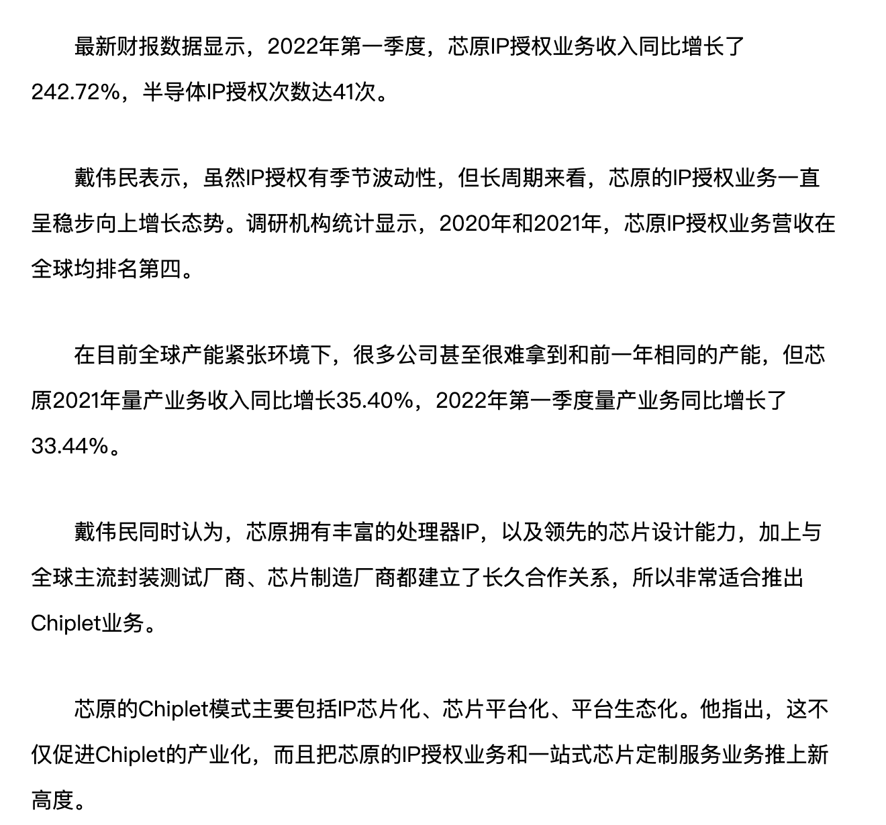
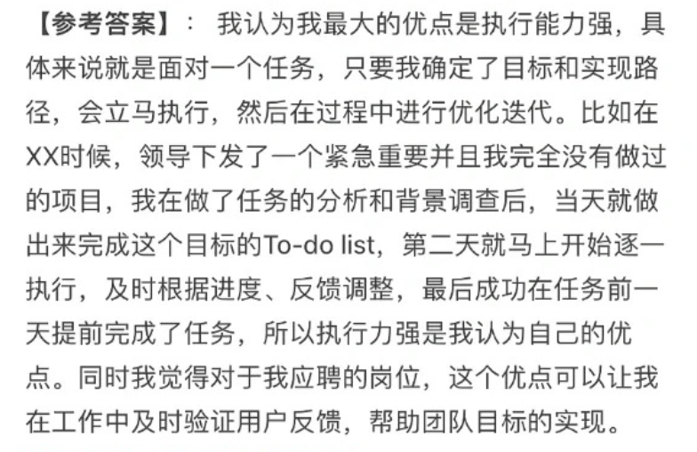
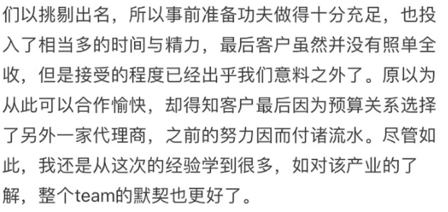

# 自我介绍

面试官您好，我叫陈思新，本次面试的职位是测试开发工程师，很感谢贵公司给我这次面试的机会。特别感谢您在百忙之中能够面试我。
我本硕都就读于重庆邮电大学，的计算机专业。
本科以专业第一保送研究生
截至目前主要有一段区块链公司的测试实习经历，负责“区块链钱包”的部分测试
我的个人项目是一个基于Linux的Http服务器，项目采用reactor模型，实现了linux环境下的io多路复用
另外，在研究生期间负责一款小程序的开发，该小程序“遥感瞰视”目前已上线。
我觉得我具有主动的学习力、优秀的执行力、良好的沟通力、强大的抗压力
以上就是我的一个简单的个人介绍，谢谢

Dear interviewer/Good morning/Hello , my name is Chen Sixin. The target position for this interview is a test development engineer. I am very grateful to your company for giving me this opportunity for this interview. Thank you very much for being able to interview me during your so busy schedule.

I have studied at Chongqing University of Posts and Telecommunications, majoring in computer science.
Talking about my undergraduate experience, I think the fact that I was recommended as the first graduate student can prove my hard work during this period.

Up to now, I have a development internship experience /in a blockchain company, responsible for part of the development of the "blockchain wallet"
My personal project is a Linux-based Http server. The project adopts the reactor model and implements io multiplexing

In addition, I was responsible for the development of a small program during my postgraduate period, 

（you can open your wechat）

and the small program "Remote Sensing Vision" is online now.
I think I have active learning ability, excellent execution ability, good communication ability, strong anti-stress ability
The above is my brief personal introduction, thank you

# 为什么选我们公司

1.微电子行业在我国的发展趋势十分客观，戴博士在宣讲会的时候也讲到“危“和”机”的关系，我觉得是高位者给应届生的一个很好的提醒

在如此大环境下，

2.用人体系的培养

# 缺点

之前进行的是开发，对测试相关的基础理论清楚，但实践不够

不过当我还在公司实习时，有了往测开方向走的时候，就已经向前辈请教 并开始学习准备

性格特点：

# 优点

主动的学习力、优秀的执行力、良好的沟通力、强大的抗压力

学习力：

python java c++

执行力：

todo-list

沟通力：

公司实习矛盾点

抗压力：

压力下保证思考、事情繁多也会分轻急缓重、健身运动等方式疏解

# 失败的经历

参加科创比赛、申报基金

失败的定义：榜上无名、或者没有达到预期

失败经历：重庆计算机设计大赛（互联网+一等奖）（场地网络因素没有被考虑到，）

# 加班的看法

# 家庭

# 薪资要求

对自己的技术很有信心，就用实力说话，我受过专业系统的软件编程的培训，做了XX项目，掌握XX技术，不需要公司进行大量的培训，而且我对编程特别感兴趣，自学能力也很好。

回答样本二：我受过系统的软件编程的训练，不需要进行大量的培训。而且我本人也对编程特别感兴趣。因此，我希望公司能根据我的情况和市场标准的水平，给我合理的薪水。

因此，我希望公司能够根据我的情况和市场标准的水平，给我合理的薪资。

# 还有什么问题要问

贵公司对新入公司的员工有没有什么培训项目，我可以参加吗？或者说贵公司的晋升机制是什么样的？

# 五年发展

1.如果应聘成功，我至少会稳定长久地做下去，踏实的做好自己的本职工作。
2.在工作中，会向高手请教，研究些新技术，提高自己的技术水平。
3.目前的规划是要优先做一名技术高手，如果有可能的话，做管理也是可以考虑的。

# 业余爱好

舞蹈、健身、读书、旅游

# 欠缺什么

继续重复自己的优势，然后说：“对于这个职位和我的能力来说，我相信自己是可以胜任的，只是缺乏经验，这个问题我想我可以进入公司以后以最短的时间来解决，我的学习能力很强，我相信可以很快融入公司的企业文化，进入工作状态。

# 欣赏什么人

诚实、不死板而且容易相处的人、有"实际行动"的人。

# 工作后发现不合适

1.如果你确实热爱这个职业，那你就要不断学习，虚心向领导和同事学习业务知识和处事经验，了解这个职业的精神内涵和职业要求，力争减少差距； 

2.你觉得这个职业可有可无，那还是趁早换个职业，去发现适合你的，你热爱的职业，那样你的发展前途也会大点，对单位和个人都有好处。在完成某项工作时，你认为领导要求的方式不是最好的，自己还有更好的方法，你应该怎么做？回答建议（仅供参考）：

**回答提示：**

**①.原则上我会尊重和服从领导的工作安排；同时私底下找机会以请教的口吻，婉转地表达自己的想法，看看领导是否能改变想法； **

**② 如果领导没有采纳我的建议，我也同样会按领导的要求认真地去完成这项工作； **

**③.还有一种情况，假如领导要求的方式违背原则，我会坚决提出反对意见；如领导仍固执己见，我会毫不犹豫地再向上级领导反映。**

# 个人失误公司损失

① 我本意是为公司努力工作，如果造成经济损失，我认为首要的问题是想方设法去弥补或挽回经济损失。如果我无能力负责，希望单位帮助解决；

② 是责任问题。分清责任，各负其责，如果是我的责任，我甘愿受罚；如果是一个我负责的团队中别人的失误，也不能幸灾乐祸，作为一个团队，需要互相提携共同完成工作，安慰同事并且帮助同事查找原因总结经验。

③ 总结经验教训，一个人的一生不可能不犯错误，重要的是能从自己的或者是别人的错误中吸取经验教训，并在今后的工作中避免发生同类的错误。检讨自己的工作方法、分析问题的深度和力度是否不够，以致出现了本可以避免的错误。

① 我本意是为公司努力工作，如果造成经济损失，我认为首要的问题是想方设法去弥补或挽回经济损失。如果我无能力负责，希望单位帮助解决；② 是责任问题。分清责任，各负其责，如果是我的责任，我甘愿受罚；如果是一个我负责的团队中别人的失误，也不能幸灾乐祸，作为一个团队，需要互相提携共同完成工作，安慰同事并且帮助同事查找原因总结经验。③ 总结经验教训，一个人的一生不可能不犯错误，重要的是能从自己的或者是别人的错误中吸取经验教训，并在今后的工作中避免发生同类的错误。检讨自己的工作方法、分析问题的深度和力度是否不够，以致出现了本可以避免的错误。

# 你的工作被上司说是他做的

我首先不会找那位上级领导说明这件事，我会主动找我的主管领导来沟通，因为沟通是解决人际关系的最好办法，

但结果会有两种：我的主管领导认识到自己的错误，我想我会视具体情况决定是否原谅他；2.他更加变本加厉的来威胁我，那我会毫不犹豫地找我的上级领导反映此事，因为他这样做会造成负面影响，对今后的工作不利。

# 跳槽的看法

（1）正常的"跳槽"能促进人才合理流动，应该支持； （2）频繁的跳槽对单位和个人双方都不利，应该反对。

# 被孤立

假设你在某单位工作，成绩比较突出，但你发现同事们越来越孤立你，你怎么看这个问题？你准备怎么办？回答建议（仅供参考）：

 ① 成绩比较突出，得到领导的肯定是件好事情，以后更加努力 ② 检讨一下自己是不是对工作的热心度超过同事间交往的热心了，加强同事间的交往及共同的兴趣爱好。 ③ 工作中，切勿伤害别人的自尊心 ④ 不再领导前拨弄是非 ⑤ 乐于助人对面

# 你通常如何处理別人的批评？

回答建议（仅供参考）：① 沈默是金。不必说什么，否则情况更糟，不过我会接受建设性的批评；② 我会等大家冷靜下来再讨论。

# 你怎样对待自己的失敗？

回答建议（仅供参考）：我们大家生来都不是十全十美的，我相信我有第二个机会改正我的错误。

# 你希望与什么样的上级共事？

回答建议（仅供参考）：

分析：**这个问题比较好的回答是，希望我的上级能够在工作中对我多指导，对我工作中的错误能够立即指出。总之，从上级指导这个方面谈，不会有大的纰漏。**

# 在完成某项工作时，你认为领导要求的方式不是最好的，自己还有更好的方法，你应该怎么做？

回答建议（仅供参考）：

①.原则上我会尊重和服从领导的工作安排；同时私底下找机会以请教的口吻，婉转地表达自己的想法，看看领导是否能改变想法；
② 如果领导没有采纳我的建议，我也同样会按领导的要求认真地去完成这项工作；
③.还有一种情况，假如领导要求的方式违背原则，我会坚决提出反对意见；如领导仍固执己见，我会毫不犹豫地再向上级领导反映。

# 你准备在我们这家单位做多久？

1. 这不是自己单方面决定的，还要看公司，但是可以肯定的是，如果公司跟自己的职业发展一致，我是会一直干下去的。
2. 以我对公司和现有职位的了解，如果能应聘上的话，目前来看至少可以稳定三年。

# 贬低项目时你该怎么办

1.项目实现也许花的时间不多，但是前期的构思、需求分析、页面设计等等准备工作是花了很多时间的。
2.项目大小和技术含量并不能够成正比，我们的项目，虽然小，但麻雀虽小，却五脏俱全。接着向面试官介绍你们团队在项目过程中所使用的技术等等。
3.项目大小主要是体现在功能上，有些功能客户并没有提出。如果后期客户有提出，我们也能够快速的实现。