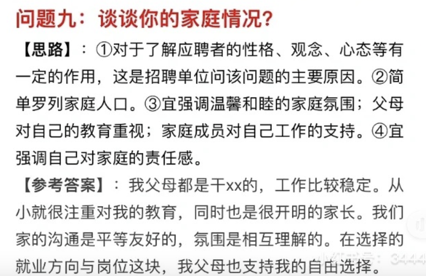

# 家庭

# 薪资要求

对自己的技术很有信心，就用实力说话，我受过专业系统的软件编程的培训，做了XX项目，掌握XX技术，不需要公司进行大量的培训，而且我对编程特别感兴趣，自学能力也很好。

回答样本二：我受过系统的软件编程的训练，不需要进行大量的培训。而且我本人也对编程特别感兴趣。因此，我希望公司能根据我的情况和市场标准的水平，给我合理的薪水。

因此，我希望公司能够根据我的情况和市场标准的水平，给我合理的薪资。

# 还有什么问题要问

贵公司对新入公司的员工有没有什么培训项目，我可以参加吗？或者说贵公司的晋升机制是什么样的？

# 工作后发现不合适

1.如果你确实热爱这个职业，那你就要不断学习，虚心向领导和同事学习业务知识和处事经验，了解这个职业的精神内涵和职业要求，力争减少差距； 

2.你觉得这个职业可有可无，那还是趁早换个职业，去发现适合你的，你热爱的职业，那样你的发展前途也会大点，对单位和个人都有好处。在完成某项工作时，你认为领导要求的方式不是最好的，自己还有更好的方法，你应该怎么做？回答建议（仅供参考）：

**回答提示：**

**①.原则上我会尊重和服从领导的工作安排；同时私底下找机会以请教的口吻，婉转地表达自己的想法，看看领导是否能改变想法； **

**② 如果领导没有采纳我的建议，我也同样会按领导的要求认真地去完成这项工作； **

**③.还有一种情况，假如领导要求的方式违背原则，我会坚决提出反对意见；如领导仍固执己见，我会毫不犹豫地再向上级领导反映。**

# 个人失误公司损失

① 我本意是为公司努力工作，如果造成经济损失，我认为首要的问题是想方设法去弥补或挽回经济损失。如果我无能力负责，希望单位帮助解决；

② 是责任问题。分清责任，各负其责，如果是我的责任，我甘愿受罚；如果是一个我负责的团队中别人的失误，也不能幸灾乐祸，作为一个团队，需要互相提携共同完成工作，安慰同事并且帮助同事查找原因总结经验。

③ 总结经验教训，一个人的一生不可能不犯错误，重要的是能从自己的或者是别人的错误中吸取经验教训，并在今后的工作中避免发生同类的错误。检讨自己的工作方法、分析问题的深度和力度是否不够，以致出现了本可以避免的错误。

# 你的工作被上司说是他做的

我首先不会找那位上级领导说明这件事，我会主动找我的主管领导来沟通，因为沟通是解决人际关系的最好办法，

但结果会有两种：我的主管领导认识到自己的错误，我想我会视具体情况决定是否原谅他；2.他更加变本加厉的来威胁我，那我会毫不犹豫地找我的上级领导反映此事，因为他这样做会造成负面影响，对今后的工作不利。

# 跳槽的看法

（1）正常的"跳槽"能促进人才合理流动，应该支持； （2）频繁的跳槽对单位和个人双方都不利，应该反对。

# 被孤立

假设你在某单位工作，成绩比较突出，但你发现同事们越来越孤立你，你怎么看这个问题？你准备怎么办？回答建议（仅供参考）：

 ① 成绩比较突出，得到领导的肯定是件好事情，以后更加努力 ② 检讨一下自己是不是对工作的热心度超过同事间交往的热心了，加强同事间的交往及共同的兴趣爱好。 ③ 工作中，切勿伤害别人的自尊心 ④ 不再领导前拨弄是非 ⑤ 乐于助人对面

# 你通常如何处理別人的批评？

回答建议（仅供参考）：① 沈默是金。不必说什么，否则情况更糟，不过我会接受建设性的批评；② 我会等大家冷靜下来再讨论。

# 你希望与什么样的上级共事？

回答建议（仅供参考）：

分析：**这个问题比较好的回答是，希望我的上级能够在工作中对我多指导，对我工作中的错误能够立即指出。总之，从上级指导这个方面谈，不会有大的纰漏。**

# 在完成某项工作时，你认为领导要求的方式不是最好的，自己还有更好的方法，你应该怎么做？

回答建议（仅供参考）：

①.原则上我会尊重和服从领导的工作安排；同时私底下找机会以请教的口吻，婉转地表达自己的想法，看看领导是否能改变想法；
② 如果领导没有采纳我的建议，我也同样会按领导的要求认真地去完成这项工作；
③.还有一种情况，假如领导要求的方式违背原则，我会坚决提出反对意见；如领导仍固执己见，我会毫不犹豫地再向上级领导反映。

# 你准备在我们这家单位做多久？

1. 这不是自己单方面决定的，还要看公司，但是可以肯定的是，如果公司跟自己的职业发展一致，我是会一直干下去的。
2. 以我对公司和现有职位的了解，如果能应聘上的话，目前来看至少可以稳定三年。
