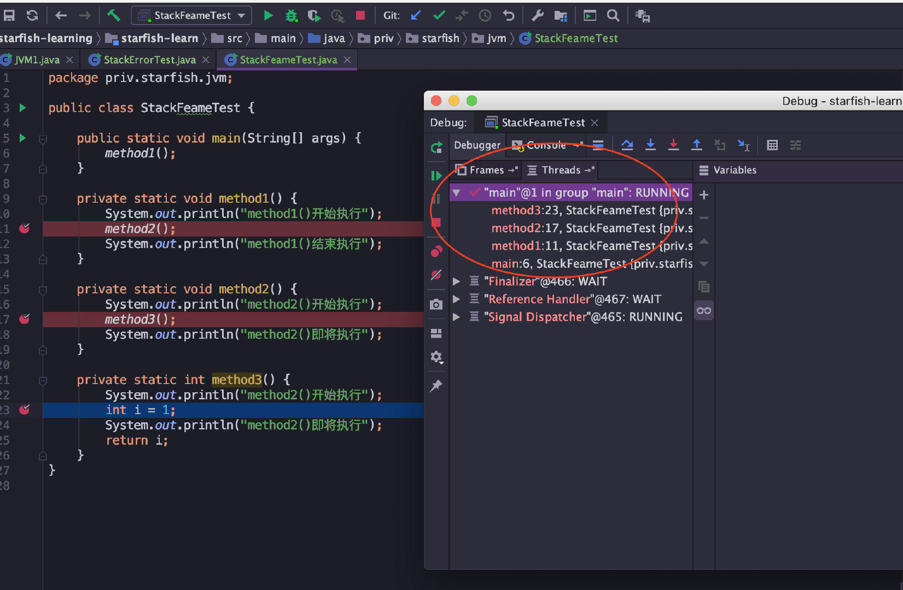
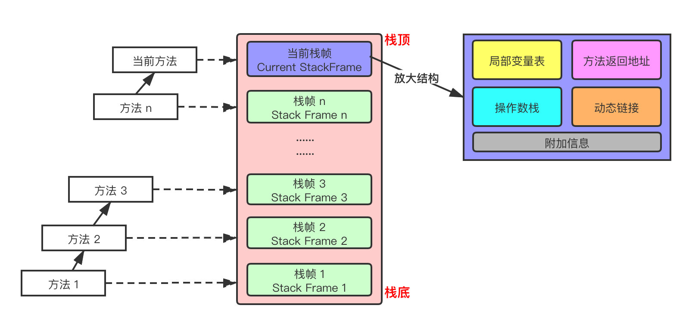

# JVM

## 一、类字节码详解:airplane:

> 参考链接：[Java全栈知识体系](https://pdai.tech/md/java/jvm/java-jvm-class.html)

### 1.1 多语言编译为字节码在JVM运行

计算机是不能直接运行Java代码的，必须要先运行Java虚拟机，再由Java虚拟机运行编译后的Java代码，即Java字节码。

Java代码间接翻译成字节码，储存字节码的文件再交由运行于不同平台上的JVM虚拟机去读取执行，从而实现**一次编写、到处运行**的目的。JVM也不再只支持Java，由此衍生出了许多基于JVM的编程语言，如Groovy、Scala、Koltin等等。


### 1.2 Java字节码文件

`.class`文件本质上是一个**以8位字节为基础单位的二进制流**，各个数据项目严格按照顺序紧凑的排列在`.class`文件中。Jvm根据其特定的规则解析该二进制数据，从而得到相关信息。`.class`文件采用一种伪结构来存储数据，它有两种类型：无符号数和表。

#### .class文件的结构属性


#### 从一个例子开始

```java
//Main.java
public class Main {
    
    private int m;
    
    public int inc() {
        return m + 1;
    }
}
```

生成一个`Main.class`文件：

```shell
javac Main.java
```

以文本形式打开，其内容如下：

```
cafe babe 0000 0034 0013 0a00 0400 0f09
0003 0010 0700 1107 0012 0100 016d 0100
0149 0100 063c 696e 6974 3e01 0003 2829
5601 0004 436f 6465 0100 0f4c 696e 654e
756d 6265 7254 6162 6c65 0100 0369 6e63
0100 0328 2949 0100 0a53 6f75 7263 6546
696c 6501 0009 4d61 696e 2e6a 6176 610c
0007 0008 0c00 0500 0601 0010 636f 6d2f
7268 7974 686d 372f 4d61 696e 0100 106a
6176 612f 6c61 6e67 2f4f 626a 6563 7400
2100 0300 0400 0000 0100 0200 0500 0600
0000 0200 0100 0700 0800 0100 0900 0000
1d00 0100 0100 0000 052a b700 01b1 0000
0001 000a 0000 0006 0001 0000 0003 0001
000b 000c 0001 0009 0000 001f 0002 0001
0000 0007 2ab4 0002 0460 ac00 0000 0100
0a00 0000 0600 0100 0000 0800 0100 0d00
0000 0200 0e
```

文件开头的4个字节（"cafe babe"）称之为**魔数**，唯有以"cafe babe"开头的`.class`文件方可被虚拟机所接受，这4个字节就是字节码文件的身份识别。0000是编译器JDK版本的次版本号0，0034转化为十进制是52也就是主版本号，**Java的版本号从45开始**，除`v1.0`和`v1.1`都是使用45.x外，以后每升一个大版本，版本号加一。也就是说，编译生成该`.class`文件的JDK版本为`v1.8.0`。

#### 反编译字节码文件

使用Java内置的反编译工具`javap`可以反编译字节码文件，用法：`javap <options> <classes>`。

输入命令`javap -verbose -p Main.class`查看输出内容：

```shell
Classfile /E:/JavaCode/TestProj/out/production/TestProj/com/rhythm7/Main.class
  Last modified 2018-4-7; size 362 bytes
  MD5 checksum 4aed8540b098992663b7ba08c65312de
  Compiled from "Main.java"
public class com.rhythm7.Main
  minor version: 0
  major version: 52
  flags: ACC_PUBLIC, ACC_SUPER
Constant pool:
   #1 = Methodref          #4.#18         // java/lang/Object."<init>":()V
   #2 = Fieldref           #3.#19         // com/rhythm7/Main.m:I
   #3 = Class              #20            // com/rhythm7/Main
   #4 = Class              #21            // java/lang/Object
   #5 = Utf8               m
   #6 = Utf8               I
   #7 = Utf8               <init>
   #8 = Utf8               ()V
   #9 = Utf8               Code
  #10 = Utf8               LineNumberTable
  #11 = Utf8               LocalVariableTable
  #12 = Utf8               this
  #13 = Utf8               Lcom/rhythm7/Main;
  #14 = Utf8               inc
  #15 = Utf8               ()I
  #16 = Utf8               SourceFile
  #17 = Utf8               Main.java
  #18 = NameAndType        #7:#8          // "<init>":()V
  #19 = NameAndType        #5:#6          // m:I
  #20 = Utf8               com/rhythm7/Main
  #21 = Utf8               java/lang/Object
{
  private int m;
    descriptor: I
    flags: ACC_PRIVATE

  public com.rhythm7.Main();
    descriptor: ()V
    flags: ACC_PUBLIC
    Code:
      stack=1, locals=1, args_size=1
         0: aload_0
         1: invokespecial #1                  // Method java/lang/Object."<init>":()V
         4: return
      LineNumberTable:
        line 3: 0
      LocalVariableTable:
        Start  Length  Slot  Name   Signature
            0       5     0  this   Lcom/rhythm7/Main;

  public int inc();
    descriptor: ()I
    flags: ACC_PUBLIC
    Code:
      stack=2, locals=1, args_size=1
         0: aload_0
         1: getfield      #2                  // Field m:I
         4: iconst_1
         5: iadd
         6: ireturn
      LineNumberTable:
        line 8: 0
      LocalVariableTable:
        Start  Length  Slot  Name   Signature
            0       7     0  this   Lcom/rhythm7/Main;
}
SourceFile: "Main.java"
```

#### 字节码文件信息

上面的开头7行信息包括：`.class`文件当前所在位置、最后修改时间、文件大小、MD5值、编译自哪个文件、类的全限定名、JDK次版本号、主版本号。

然后紧接着的是该类的访问标志：`ACC_PUBLIC`，`ACC_SUPER`，访问标志的含义如下：

|      名称      | 标志值 |                             含义                             |
| :------------: | :----: | :----------------------------------------------------------: |
|   ACC_PUBLIC   | 0x0001 |                      是否为`Public`类型                      |
|   ACC_FINAL    | 0x0010 |             是否被声明为`final`，只有类可以设置              |
|   ACC_SUPER    | 0x0020 |        是否允许使用`invokespecial`字节码指令的新语义         |
| ACC_INTERFACE  | 0x0200 |                       标志这是一个接口                       |
|  ACC_ABSTRACT  | 0x0400 | 是否为`abstract`类型，对于接口或者抽象类来说，次标志值为真，其他类型为假 |
| ACC_SYNTHETIC  | 0x1000 |                 标志这个类并非由用户代码产生                 |
| ACC_ANNOTATION | 0x2000 |                       标志这是一个注解                       |
|    ACC_ENUM    | 0x4000 |                       标志这是一个枚举                       |

#### 常量池

`Constant pool`意为常量池。常量池可以理解成`.class`文件中的资源仓库。主要存放的是两大类常量：**字面量（Literal）**和**符号引用（Symbolic References）**。字面量类似于Java中的常量概念，如文本字符串，`final`常量等，而符号引用则属于编译原理方面的概念，包括以下三种：

- 类和接口的全限定名（Fully Qualified Name）。
- 字段的名称和描述符号（Descriptor）。
- 方法的名称和描述符。

不同于C/C++，JVM是在加载`.class`文件的时候才进行的动态链接，也就是说**这些字段和方法符号引用只有在运行期转换后才能获得真正的内存入口地址**。当虚拟机运行时，**需要从常量池获得对应的符号引用，再在类创建或运行时解析并翻译到具体的内存地址中**。 直接通过反编译文件来查看字节码内容：

```shell
#1 = Methodref          #4.#18         // java/lang/Object."<init>":()V
#4 = Class              #21            // java/lang/Object
#7 = Utf8               <init>
#8 = Utf8               ()V
#18 = NameAndType        #7:#8          // "<init>":()V
#21 = Utf8               java/lang/Object
```

**第一个常量**是一个方法定义，指向了第4和第18个常量。以此类推，最后可以拼接成第一个常量右侧的注释内容：`java/lang/Object."<init>":()V`。

这段可以理解为该类的实例构造器的声明，由于Main类没有重写构造方法，所以调用的是父类的构造方法。此处也说明了Main类的直接父类是`Object`。 该方法默认返回值是V，也就是`void`，无返回值。

**第二个常量**同理可得：

```shell
#2 = Fieldref           #3.#19         // com/rhythm7/Main.m:I
#3 = Class              #20            // com/rhythm7/Main
#5 = Utf8               m
#6 = Utf8               I
#19 = NameAndType        #5:#6          // m:I
#20 = Utf8               com/rhythm7/Main
```

此处声明了一个字段m，类型为I, I即是`int`类型。关于字节码的类型对应如下：

| 标识字符 |                      含义                       |
| :------: | :---------------------------------------------: |
|    B     |                 基本类型`byte`                  |
|    C     |                 基本类型`char`                  |
|    D     |                基本类型`double`                 |
|    F     |                 基本类型`float`                 |
|    I     |                  基本类型`int`                  |
|    J     |                 基本类型`long`                  |
|    S     |                 基本类型`short`                 |
|    Z     |                基本类型`boolean`                |
|    V     |                 特殊类型`void`                  |
|    L     | 对象类型，以分号结尾，如：`Ljava/lang/Object`； |

对于数组类型，每一位使用一个前置的`[`字符来描述，如定义一个`java.lang.String[][]`类型的维数组，将被记录为`[[Ljava/lang/String;`

#### 方法表合集

在常量池之后的是对类内部的方法描述，在字节码中以表的集合形式表现，暂且不管字节码文件的16进制文件内容如何，直接看反编译后的内容，这里声明了一个私有变量m，类型为int，返回值为int：

```shell
private int m;
  descriptor: I
  flags: ACC_PRIVATE
```

```shell
public com.rhythm7.Main();
   descriptor: ()V
   flags: ACC_PUBLIC
   Code:
     stack=1, locals=1, args_size=1
        0: aload_0
        1: invokespecial #1                  // Method java/lang/Object."<init>":()V
        4: return
     LineNumberTable:
       line 3: 0
     LocalVariableTable:
       Start  Length  Slot  Name   Signature
           0       5     0  this   Lcom/rhythm7/Main;
```

这里是构造方法：`Main()`，返回值为`void`，公开方法。

code内的主要属性为：

- **`stack`**：**最大操作数栈**，JVM运行时会根据这个值来分配栈帧（Frame）中的操作栈深度，此处为1。
- **`locals`**：**局部变量所需的存储空间**，单位为Slot。**Slot是虚拟机为局部变量分配内存时所使用的最小单位，为4个字节大小**。方法参数（包括实例方法中的隐藏参数`this`）、显示异常处理器的参数（`try-catch`中的`catch`块所定义的异常）、方法体中定义的局部变量**都需要使用局部变量表来存放**。值得一提的是，**`locals`的大小并不一定等于所有局部变量所占的Slot之和，因为局部变量中的Slot是可以重用的**。
- **`args_size`**：**方法参数的个数**，这里是1，因为每个实例方法都会有一个隐藏参数`this`。
- **`attribute_info`**：**方法体内容**，0、1、4为字节码"行号"，该段代码的意思是将**第一个引用类型本地变量推送至栈顶，然后执行该类型的实例方法，也就是常量池存放的第一个变量，也就是注释里的`java/lang/Object."":()V`**，然后执行返回语句，结束方法。
- **`LineNumberTable`**：该属性的作用是描述**源码行号与字节码行号（字节码偏移量）之间的对应关系**。可以使用`-g:none`或`-g:lines`选项来取消或要求生成这项信息，如果选择不生成，当程序运行异常时将无法获取到发生异常的源码行号，也无法按照源码的行数来调试程序。
- **`LocalVariableTable`**：该属性的作用是**描述帧栈中局部变量与源码中定义的变量之间的关系**。可以使用`-g:none`或`-g:vars`来取消或生成这项信息，**如果没有生成这项信息，那么当别人引用这个方法时，将无法获取到参数名称，取而代之的是`arg0`、`arg1`这样的占位符**。`start`表示该局部变量在哪一行开始可见，`length`表示可见行数，`Slot`代表所在帧栈位置，`Name`是变量名称，然后是类型签名。

#### 类名

最后一行显然是表示源码文件。

## 二、类加载机制:rocket:

> 参考链接：[Java全栈知识体系](https://pdai.tech/md/java/jvm/java-jvm-classload.html)

### 2.1 类的生命周期

其中类加载的过程包括了**加载**、**验证**、**准备**、**解析**、**初始化**五个阶段。在这五个阶段中，**加载**、**验证**、**准备**和**初始化**这四个阶段发生的顺序是**确定**的，而**解析**阶段则不一定，**它在某些情况下可以在初始化阶段之后开始，这是为了支持Java语言的运行时绑定（也成为动态绑定或晚期绑定）**。另外注意这里的几个阶段是**按顺序开始**，**而不是按顺序进行或完成**，因为这些阶段通常都是互相交叉地混合进行的，**通常在一个阶段执行的过程中调用或激活另一个阶段**。


#### 类的加载：查找并加载类的二进制数据

**加载是类加载过程的第一个阶段**，在加载阶段，虚拟机需要完成以下三件事情：

1. 通过一个类的全限定名来获取其定义的**二进制字节流**；
2. 将这个字节流所代表的**静态存储结构转化为方法区的运行时数据结构**；
3. 在Java**堆中生成一个代表这个类的`java.lang.Class`对象**，作为对**方法区中这些数据的访问入口**。


相对于类加载的其他阶段而言，加载阶段（准确地说，是加载阶段**获取类的二进制字节流的动作**）是**可控性最强**的阶段，因为**开发人员既可以使用系统提供的类加载器来完成加载，也可以自定义自己的类加载器来完成加载**。

加载阶段完成后，**虚拟机外部的二进制字节流就按照虚拟机所需的格式存储在方法区之中**，而且在Java堆中也创建一个`java.lang.Class`类的对象，这样便可以**通过该对象访问方法区中的这些数据**。

**类加载器并不需要等到某个类被“首次主动使用”时再加载它**，JVM规范**允许类加载器在预料某个类将要被使用时就预先加载它**，如果在预先加载的过程中遇到了`.class`文件缺失或存在错误，**类加载器必须在程序首次主动使用该类时才报告错误（LinkageError错误）**，如果这个类一直没有被程序主动使用，那么类加载器就不会报告错误。

#### 连接

##### 验证：确保被加载的类的正确性

**验证是连接阶段的第一步**，这一阶段的目的是为了确保`.class`文件的**字节流中包含的信息符合当前虚拟机的要求**，并且不会危害虚拟机自身的安全。验证阶段大致会完成4个阶段的检验动作：

- 文件格式验证：**验证字节流是否符合`.class`文件格式的规范**。例如：是否以`0xCAFEBABE`开头、主次版本号是否在当前虚拟机的处理范围之内、常量池中的常量是否有不被支持的类型。
- 元数据验证：**对字节码描述的信息进行语义分析**，以保证其描述的信息符合Java语言规范的要求。例如：这个类是否有父类，除了`java.lang.Object`之外。
- 字节码验证：通过数据流和控制流分析，**确定程序语义是合法的、符合逻辑的**。
- 符号引用验证：确保解析动作能正确执行。

补充：**验证阶段是非常重要的，但不是必须的**，它对程序运行期没有影响，如果所引用的类经过反复验证，那么可以考虑采用`-Xverifynone`参数来**关闭大部分的类验证措施**，以缩短虚拟机类加载的时间。

##### 准备：为类的静态变量分配内存并将其初始化为默认值

准备阶段是**正式为类变量分配内存并设置类变量初始值的阶段**，**这些内存都将在方法区中分配**。对于该阶段有以下几点需要注意：

- 这时候进行内存分配的仅包括类变量（`static`）而**不包括实例变量**，实例变量会在对象实例化时随着对象一块分配在Java堆中。
- 这里**所设置的初始值通常情况下是数据类型默认的零值**（如`0`、`0L`、`null`、`false`等），而不是被在Java代码中被显式地赋予的值。

假设一个类变量的定义为：`public static int value = 3`；那么变量value在准备阶段过后的初始值为`0`，而不是`3`，因为**这时候尚未开始执行任何Java方法**，而把value赋值为3的`put static`指令是在程序编译后，存放于类构造器`<clinit>()`方法之中的，所以**把value赋值为3的动作将在初始化阶段才会执行**。

注意以下几点：

- 对基本数据类型来说，对于类变量（`static`）和全局变量，如果不显式地对其赋值而直接使用，则系统会为其赋予默认的零值，而对于**局部变量来说，在使用前必须显式地为其赋值，否则编译时不通过**。
- 对于同时被`static`和`final`修饰的常量，**必须在声明的时候就为其显式地赋值，否则编译时不通过**；而只被`final`修饰的常量则既可以在声明时显式地为其赋值，也可以在类初始化时显式地为其赋值，总之，**在使用前必须为其显式地赋值，系统不会为其赋予默认零值**。
- 对于引用数据类型`reference`来说，如数组引用、对象引用等，如果没有对其进行显式地赋值而直接使用，系统都会为其赋予默认的零值，即`null`。
- 如果在数组初始化时没有对数组中的各元素赋值，那么其中的元素将根据对应的数据类型而被赋予默认的零值。
- 如果类字段的字段属性表中存在`ConstantValue`属性，即同时被`final`和`static`修饰，那么在**准备阶段变量`value`就会被初始化为`ConstValue`属性所指定的值**。可以理解为`static final`常量在**编译期就将其结果放入了调用它的类的常量池中**。

##### 解析：把类中的符号引用转换为直接引用

解析阶段是**虚拟机将常量池内的符号引用替换为直接引用的过程**，解析动作主要针对**类或接口、字段、类方法、接口方法、方法类型、方法句柄和调用点限定符7类符号**引用进行。

符号引用就是一组符号来描述目标，可以是任何字面量。直接引用就是**直接指向目标的指针、相对偏移量或一个间接定位到目标的句柄**。

#### 初始化

初始化：**为类的静态变量赋予正确的初始值**，JVM负责对类进行初始化，主要对**类变量进行初始化**。在Java中对类变量进行初始值设定有两种方式：

- 声明类变量是指定初始值。
- 使用静态代码块为类变量指定初始值

##### JVM初始化步骤

1. 假如这个类还没有被加载和连接，则程序**先加载并连接该类**；
2. 假如该类的直接父类还没有被初始化，则先**初始化其直接父类**；
3. 假如类中有初始化语句，则系统**依次执行这些初始化语句**。

##### 类初始化时机

只有当**类主动使用的时候才会导致类的初始化**，类的主动使用包括以下六种：

- **创建类的实例**，也就是new的方式。
- **访问某个类或接口的静态变量**，或者对该静态变量赋值。
- 调用类的静态方法。
- 反射（如`Class.forName("com.pdai.jvm.Test")`）。
- 初始化某个类的子类，则其**父类也会被初始化**。
- Java虚拟机启动时被标明为**启动类的类**（Java Test），直接使用`java.exe`命令来运行某个主类。

#### 使用

类访问方法区内的数据结构的接口， 对象是Heap区的数据。

#### 卸载

Java虚拟机将结束生命周期的几种情况：

- 执行了`System.exit()`方法。
- 程序正常执行结束。
- 程序在执行过程中遇到了异常或错误而异常终止。
- 由于操作系统出现错误而导致Java虚拟机进程终止。

### 2.2 类加载器，JVM类加载机制

#### 类加载器的层次


注意：这里父类加载器并不是通过继承关系来实现的，而是采用组合实现的。

站在Java虚拟机的角度来讲，只存在两种不同的类加载器：

- 启动类加载器：它使用C++实现（这里仅限于`Hotspot`，也就是JDK1.5之后默认的虚拟机，有很多其他的虚拟机是用Java语言实现的），**是虚拟机自身的一部分**。
- 所有其他的类加载器：这些类加载器都由Java语言实现，**独立于虚拟机之外**，并且全部继承自抽象类`java.lang.ClassLoader`，这些类加载器**需要由启动类加载器加载到内存中之后才能去加载其他的类**。

站在Java开发人员的角度来看，类加载器可以大致划分为以下三类：

- 启动类加载器：Bootstrap ClassLoader，负责加载存放在`JDK\jre\lib`（JDK代表JDK的安装目录，下同）下，或被`-Xbootclasspath`参数指定的路径中的，并且能被虚拟机识别的类库（如rt.jar，所有的`java.*`开头的类均被Bootstrap ClassLoader加载）。启动类加载器是无法被Java程序直接引用的。
- 扩展类加载器：Extension ClassLoader，该加载器由`sun.misc.Launcher$ExtClassLoader`实现，它负责加载`JDK\jre\lib\ext`目录中，或者由java.ext.dirs系统变量指定的路径中的所有类库（如`javax.*`开头的类），**开发者可以直接使用扩展类加载器**。
- 应用程序类加载器：Application ClassLoader，该类加载器由`sun.misc.Launcher$AppClassLoader`来实现，**它负责加载用户类路径（ClassPath）所指定的类，开发者可以直接使用该类加载器**，如果应用程序中没有自定义过自己的类加载器，一般情况下这个就是程序中**默认的类加载器**。

应用程序都是由这三种类加载器互相配合进行加载的，如果有必要，还可以加入自定义的类加载器。因为JVM自带的ClassLoader只是懂得从本地文件系统加载标准的`.class`文件，因此如果编写了自己的ClassLoader，便可以做到如下几点：

- 在执行非置信代码之前，自动验证数字签名。
- 动态地创建符合用户特定需要的定制化构建类。
- 从特定的场所取得`.class`文件，例如数据库中和网络中。

#### 类的加载

类加载有三种方式：

- 命令行启动应用时候由JVM初始化加载。
- 通过`Class.forName()`方法动态加载。
- 通过`ClassLoader.loadClass()`方法动态加载

```java
package com.pdai.jvm.classloader;
public class loaderTest { 
    public static void main(String[] args) throws ClassNotFoundException { 
        ClassLoader loader = HelloWorld.class.getClassLoader(); 
        System.out.println(loader); 
        //使用ClassLoader.loadClass()来加载类，不会执行初始化块 
        loader.loadClass("Test2"); 
        //使用Class.forName()来加载类，默认会执行初始化块 
        //Class.forName("Test2"); 
        //使用Class.forName()来加载类，并指定ClassLoader，初始化时不执行静态块 
        //Class.forName("Test2", false, loader); 
    } 
}

public class Test2 { 
    static { 
        System.out.println("静态初始化块执行了！"); 
    } 
}
```

补充：`Class.forName()`和`ClassLoader.loadClass()`区别：

- `Class.forName()`：除了将类的`.class`文件加载到JVM中之外，还会对类进行解释，执行类中的`static`块。
- `ClassLoader.loadClass()`：只干一件事情，就是将`.class`文件加载到JVM中，不会执行`static`中的内容，**只有在newInstance才会去执行`static`块**。
- `Class.forName(String name, boolean initialize, ClassLoader loader)`：带参函数也可控制是否加载`static`块，并且只有调用了`newInstance()`方法才调用构造函数，创建类的对象 。

### 2.3 JVM类加载机制

- 全盘负责：当一个类加载器负责加载某个Class时，**该Class所依赖的和引用的其他Class也将由该类加载器负责载入**，除非显式使用另外一个类加载器来载入。
- 父类委托：先让**父类加载器试图加载该类**，只有在父类加载器无法加载该类时才尝试从自己的类路径中加载该类。
- 缓存机制：**缓存机制将会保证所有加载过的Class都会被缓存**，当程序中需要使用某个Class时，**类加载器先从缓存区寻找该Class，只有缓存区不存在，系统才会读取该类对应的二进制数据**，并将其转换成Class对象，存入缓存区。这就是为什么修改了Class后，必须重启JVM，程序的修改才会生效。
- 双亲委派机制：如果一个类加载器收到了类加载的请求，它首先不会自己去尝试加载这个类，而是把**请求委托给父加载器去完成**，依次向上，因此所有的类加载请求最终都应该被**传递到顶层的启动类加载器中**，只有当父加载器在它的搜索范围中没有找到所需的类时，即无法完成该加载，子加载器才会尝试自己去加载该类。

**双亲委派机制过程**：

1. 当`AppClassLoader`加载一个class时，它首先不会自己去尝试加载这个类，而是把类加载请求委派给父类加载器`ExtClassLoader`去完成。
2. 当`ExtClassLoader`加载一个class时，它首先也不会自己去尝试加载这个类，而是把类加载请求委派给`BootStrapClassLoader`去完成。
3. 如果`BootStrapClassLoader`加载失败（例如在`$JAVA_HOME/jre/lib`里未查找到该class)，会使用`ExtClassLoader`来尝试加载。
4. 若`ExtClassLoader`也加载失败，则会使用`AppClassLoader`来加载，如果`AppClassLoader`也加载失败，则会报出异常`ClassNotFoundException`。

双亲委派优势：

- 防止内存中出现多份同样的字节码。
- 保证Java程序安全稳定运行。

### 2.4 自定义类加载器

通常情况下都是直接使用系统类加载器，但是有时候也需要自定义类加载器。比如应用是通过网络来传输Java类的字节码，为保证安全性，**这些字节码经过了加密处理，这时系统类加载器就无法对其进行加载，这样则需要自定义类加载器来实现**。自定义类加载器一般都是继承自`ClassLoader`类，从上面对`loadClass`方法来分析来看，只需要重写`findClass`方法即可。

```java
package com.pdai.jvm.classloader;
import java.io.*;

public class MyClassLoader extends ClassLoader {

    private String root;

    protected Class<?> findClass(String name) throws ClassNotFoundException {
        byte[] classData = loadClassData(name);
        if (classData == null) {
            throw new ClassNotFoundException();
        } else {
            return defineClass(name, classData, 0, classData.length);
        }
    }

    private byte[] loadClassData(String className) {
        String fileName = root + File.separatorChar
                + className.replace('.', File.separatorChar) + ".class";
        try {
            InputStream ins = new FileInputStream(fileName);
            ByteArrayOutputStream baos = new ByteArrayOutputStream();
            int bufferSize = 1024;
            byte[] buffer = new byte[bufferSize];
            int length = 0;
            while ((length = ins.read(buffer)) != -1) {
                baos.write(buffer, 0, length);
            }
            return baos.toByteArray();
        } catch (IOException e) {
            e.printStackTrace();
        }
        return null;
    }

    public String getRoot() {
        return root;
    }

    public void setRoot(String root) {
        this.root = root;
    }

    public static void main(String[] args)  {

        MyClassLoader classLoader = new MyClassLoader();
        classLoader.setRoot("D:\\temp");

        Class<?> testClass = null;
        try {
            testClass = classLoader.loadClass("com.pdai.jvm.classloader.Test2");
            Object object = testClass.newInstance();
            System.out.println(object.getClass().getClassLoader());
        } catch (ClassNotFoundException e) {
            e.printStackTrace();
        } catch (InstantiationException e) {
            e.printStackTrace();
        } catch (IllegalAccessException e) {
            e.printStackTrace();
        }
    }
}
```

补充：自定义类加载器的核心在于对字节码文件的获取，如果是加密的字节码则需要在该类中对文件进行**解密**。

注意：

- 这里传递的文件名需要是类的全限定性名称，即`com.pdai.jvm.classloader.Test2`格式的，因为`defineClass`方法是按这种格式进行处理的。
- 最好不要重写`loadClass`方法，因为这样容易破坏双亲委托模式。
- 这类Test类本身可以被`AppClassLoader`类加载，因此不能把`com/pdai/jvm/classloader/Test2.class`放在类路径下。否则，由于双亲委托机制，会直接导致该类由`AppClassLoader`加载，而不会通过自定义类加载器来加载。

## 三、JVM内存结构:rocket:

> 参考链接：[Java全栈知识体系](https://pdai.tech/md/java/jvm/java-jvm-struct.html)

### 3.1 运行时数据区

JVM内存布局规定了Java在运行过程中**内存申请、分配、管理**的策略，保证了JVM的高效稳定运行。不同的JVM对于内存的划分方式和管理机制存在着部分差异。下图是JVM整体架构，中间部分就是Java虚拟机定义的各种运行时数据区域。


Java虚拟机定义了若干种程序运行期间会使用到的运行时数据区，其中有一些会随着虚拟机启动而创建，随着虚拟机退出而销毁。另外一些则是与线程一一对应的，这些与线程一一对应的数据区域会随着线程开始和结束而创建和销毁。

- **线程私有**：程序计数器、虚拟机栈、本地方法区。
- **线程共享**：堆、方法区、堆外内存（Java7的永久代或JDK8的元空间、代码缓存）。

### 3.2 程序计数器

程序计数寄存器（Program Counter Register），这里并非是广义上所指的**物理寄存器**，叫程序计数器（或PC计数器或指令计数器）会更加贴切，并且也不容易引起一些不必要的误会。**JVM 中的PC寄存器是对物理PC寄存器的一种抽象模拟**。

程序计数器是一块较小的内存空间，可以看作是当前线程所执行的字节码的**行号指示器**。

#### 作用

PC寄存器用来存储指向下一条指令的地址（即将要执行的指令代码）。由执行引擎读取下一条指令。


上图可以看到当前类对应的Code区（汇编指令）、本地变量表、异常表和代码行偏移量映射表、常量池等信息。

#### 概述

**使用PC寄存器存储字节码指令地址有什么用呢？为什么使用PC寄存器记录当前线程的执行地址呢？**

因为CPU需要不停的切换各个线程，这时候**切换回来以后，就得知道接着从哪开始继续执行**。JVM的字节码解释器就需要通过改变PC寄存器的值来**明确下一条应该执行什么样的字节码指令**。

**PC寄存器为什么会被设定为线程私有的？**

**多线程在一个特定的时间段内只会执行其中某一个线程方法**，CPU会不停的做任务切换，这样必然会导致经常中断或恢复。为了能够**准确的记录各个线程正在执行的当前字节码指令地址**，所以**为每个线程都分配了一个PC寄存器，每个线程都独立计算，不会互相影响**。

相关总结：

- 它是一块很小的内存空间，几乎可以忽略不计。也是**运行速度最快的存储区域**。
- 在JVM规范中，**每个线程都有它自己的程序计数器，是线程私有的**，生命周期与线程的生命周期一致。
- **任何时间一个线程都只有一个方法在执行**，也就是所谓的**当前方法**。如果当前线程正在执行的是Java方法，**程序计数器记录的是JVM字节码指令地址**，如果是执行native方法，则是**未指定值（undefined）**。
- 它是**程序控制流的指示器**，分支、循环、跳转、异常处理、线程恢复等基础功能都需要依赖这个计数器来完成。
- 字节码解释器工作时就是**通过改变这个计数器的值来选取下一条需要执行的字节码指令**。
- 它是**唯一一个**在JVM规范中没有规定任何`OutOfMemoryError`情况的区域。

### 3.3 虚拟机栈

#### 概述

Java虚拟机栈（Java Virtual Machine Stacks），早期也叫Java栈。**每个线程在创建的时候都会创建一个虚拟机栈**，其内部保存一个个的**栈帧**（Stack Frame），对应着一次次Java方法调用，是线程私有的，生命周期和线程一致。

**作用**：主管Java程序的运行，它保存**方法的局部变量、部分结果，并参与方法的调用和返回**。

**特点**：

- 栈是一种快速有效的分配存储方式，访问速度仅次于程序计数器。
- JVM直接对虚拟机栈的操作只有两个：每个方法执行，伴随着**入栈**（进栈/压栈），方法执行结束**出栈**。
- **栈不存在垃圾回收问题**。

**栈中可能出现的异常**：

Java虚拟机规范允许**Java虚拟机栈的大小是动态的或者是固定不变的**

- 如果采用**固定大小**的Java虚拟机栈，那每个线程的Java虚拟机栈容量可以在**线程创建的时候独立选定**。如果**线程请求分配的栈容量超过Java虚拟机栈允许的最大容量**，Java虚拟机将会抛出一个**`StackOverflowError`**异常。
- 如果Java虚拟机栈可以动态扩展，但在**尝试扩展的时候无法申请到足够的内存**，或者在**创建新的线程时没有足够的内存去创建对应的虚拟机栈**，那Java虚拟机将会抛出一个**`OutOfMemoryError`**异常。

可以通过参数`-Xss`来设置线程的最大栈空间，栈的大小直接决定了函数调用的最大可达深度。

#### 栈的存储单位

栈中存储什么：

- 每个线程都有自己的栈，栈中的数据都是以**栈帧（Stack Frame）的格式存在**。
- 在这个线程上**正在执行的每个方法都各自有对应的一个栈帧**。
- 栈帧**是一个内存区块，是一个数据集**，维系着方法执行过程中的各种数据信息。

#### 栈运行原理

- JVM直接对Java栈的操作只有两个，对栈帧的**压栈**和**出栈**，遵循“先进后出/后进先出”原则。
- 在一条活动线程中，一个时间点上，只会有一个活动的栈帧。即只有当前正在执行的方法的栈帧（**栈顶栈帧**）是有效的，这个栈帧被称为**当前栈帧**（Current Frame），与当前栈帧对应的方法就是**当前方法**（Current Method），定义这个方法的类就是**当前类**（Current Class）。
- 执行引擎运行的**所有字节码指令只针对当前栈帧**进行操作。
- 如果在该方法中调用了其他方法，对应的新的栈帧会被创建出来，放在栈的顶端，称为新的当前栈帧。
- 不同线程中所包含的栈帧是不允许存在相互引用的，即**不可能在一个栈帧中引用另外一个线程的栈帧**。
- 如果当前方法调用了其他方法，方法返回之际，**当前栈帧会传回此方法的执行结果给前一个栈帧，接着虚拟机会丢弃当前栈帧，使得前一个栈帧重新成为当前栈帧**
- Java方法有两种返回函数的方式，**一种是正常的函数返回，使用`return`指令，另一种是抛出异常，不管用哪种方式，都会导致栈帧被弹出**。

IDEA在debug时候，可以在debug窗口看到Frames中各种方法的压栈和出栈情况：



#### 栈帧的内部结构

每个**栈帧**（Stack Frame）中存储着：

- 局部变量表（Local Variables）。
- 操作数栈（Operand Stack）（或称为表达式栈）。
- 动态链接（Dynamic Linking）：指向运行时常量池的方法引用。
- 方法返回地址（Return Address）：方法正常退出或异常退出的地址。
- 一些附加信息。



具体的栈帧五部分结构：

> 参考链接：[Java全栈知识体系](https://pdai.tech/md/java/jvm/java-jvm-struct.html#24-%E6%A0%88%E5%B8%A7%E7%9A%84%E5%86%85%E9%83%A8%E7%BB%93%E6%9E%84)

### 3.4 本地方法栈

#### 本地方法接口

简单的讲，一个Native Method就是**一个Java调用非Java代码的接口**。`Unsafe`类就有很多本地方法。

**为什么要使用本地方法？**

Java使用起来非常方便，然而有些层次的任务用Java实现起来也不容易，或者对程序的效率很在意时，问题就来了：

- 与Java环境外交互：有时Java应用需要与Java外面的环境交互，这就是本地方法存在的原因。
- 与操作系统交互：JVM支持Java语言本身和运行时库，但是有时仍需要依赖一些底层系统的支持。通过本地方法，**可以实现Java与实现了JRE的底层系统交互**， JVM的一些部分就是C语言写的。
- Sun's Java：**Sun的解释器就是C实现的**，这使得它能像一些普通的C一样与外部交互。JRE大部分都是用Java实现的，它也通过一些本地方法与外界交互。比如，类`java.lang.Thread`的`setPriority()`的方法是用Java实现的，但它实现调用的是该类的本地方法`setPrioruty()`，该方法是C实现的，并被植入JVM内部。

#### 本地方法栈

- Java虚拟机栈用于管理Java方法的调用，而本地方法栈用于管理本地方法的调用。
- 本地方法栈也是线程私有的。
- 允许线程固定或者可动态扩展内存大小。
  - 如果线程请求分配的栈容量超过本地方法栈允许的最大容量，Java虚拟机将会抛出一个`StackOverflowError`异常。
  - 如果本地方法栈可以动态扩展，并且在尝试扩展的时候无法申请到足够的内存，或者在创建新的线程时没有足够的内存去创建对应的本地方法栈，那么Java虚拟机将会抛出一个`OutofMemoryError`异常。
- 本地方法是使用**C语言实现的**。
- 它的具体做法是：`Native Method Stack`中登记`native`方法，在`Execution Engine`执行时加载本地方法库，当某个线程调用一个本地方法时，**它就进入了一个全新的并且不再受虚拟机限制的世界**。它和虚拟机拥有同样的权限。
- 本地方法可以通过**本地方法接口来访问虚拟机内部的运行时数据区**，它甚至可以直接使用本地处理器中的寄存器，直接从本地内存的堆中分配任意数量的内存。
- 并不是所有JVM都支持本地方法。**因为Java虚拟机规范并没有明确要求本地方法栈的使用语言、具体实现方式、数据结构等**。如果JVM产品不打算支持`native`方法，也可以无需实现本地方法栈。
- 在Hotspot JVM中，直接将**本地方法栈和虚拟机栈合二为一**。

补充：**栈是运行时的单位，而堆是存储的单位**。**栈解决程序的运行问题**，即程序如何执行，或者说如何处理数据。**堆解决的是数据存储的问题**，即数据怎么放、放在哪。

### 3.5 堆内存

#### 内存划分

对于大多数应用，**Java堆是Java虚拟机管理的内存中最大的一块**，被**所有线程共享**。此内存区域的唯一目的就是**存放对象实例**，几乎所有的对象实例以及数据都在这里分配内存。

为了进行高效的垃圾回收，虚拟机把堆内存**逻辑上**划分成三块区域（分代的唯一理由就是优化GC性能）：

- 新生代（年轻代）：新对象和没达到一定年龄的对象都在新生代。
- 老年代（养老区）：被长时间使用的对象，**老年代的内存空间应该要比年轻代更大**。
- 元空间（JDK1.8之前叫永久代）：像一些方法中的**操作临时对象**等，JDK1.8之前是占用JVM内存，JDK1.8之后直接使用物理内存。


Java虚拟机规范规定：**Java堆可以是处于物理上不连续的内存空间中，只要逻辑上是连续的即可**，像磁盘空间一样。实现时，既可以是固定大小，也可以是可扩展的，主流虚拟机都是可扩展的（通过`-Xmx`和`-Xms`控制），如果堆中没有完成实例分配并且堆无法再扩展时，就会抛出`OutOfMemoryError`异常。

##### 年轻代（Young Generation）

年轻代是所有新对象创建的地方。当填充年轻代时，执行垃圾收集。这种垃圾收集称为**Minor GC**。年轻一代被分为三个部分——伊甸园（**Eden Memory**）和两个幸存区（**Survivor Memory**，被称为**from/to**或**s0/s1**），默认比例是$8:1:1$。

- 大多数新创建的对象都位于**Eden内存空间**中。
- 当Eden空间被对象填充时，执行**Minor GC**，并将所有幸存者对象移动到一个幸存者空间中。
- Minor GC检查幸存者对象，并将它们移动到另一个幸存者空间。所以每次**一个幸存者空间总是空的**。
- 经过多次GC循环后存活下来的对象被移动到老年代。通常，**这是通过设置年轻一代对象的年龄阈值来实现的，然后它们才有资格提升到老一代**。

##### 老年代（Old Generation）

旧的一代内存包含那些经过许多轮小型GC后仍然存活的对象。**通常，垃圾收集是在老年代内存满时执行的**。老年代垃圾收集称为**主GC（Major GC）**，通常需要更长的时间。

大对象直接进入老年代（**大对象是指需要大量连续内存空间的对象**）。这样做的目的是避免**在Eden区和两个Survivor区之间发生大量的内存拷贝**。


##### 元空间

不管是JDK8之前的永久代，还是JDK8及以后的元空间，**都可以看作是Java虚拟机规范中方法区的实现**。虽然Java虚拟机规范把方法区描述为堆的一个逻辑部分，但是它却有一个别名叫Non-Heap（非堆），目的应该是与Java堆区分开。

#### 设置堆内存大小和OOM

**Java堆用于存储Java对象实例**，那么堆的大小在JVM启动的时候就确定了，可以通过`-Xmx`和`-Xms`来设定：

- `-Xms`用来表示堆的起始内存，等价于`-XX:InitialHeapSize`。
- `-Xmx`用来表示堆的最大内存，等价于`-XX:MaxHeapSize`。

如果堆的内存大小超过`-Xmx` 设定的最大内存，就会抛出`OutOfMemoryError`异常。通常会将`-Xmx`和`-Xms`两个参数配置为相同的值，**其目的是为了能够在垃圾回收机制清理完堆区后不再需要重新分隔计算堆的大小，从而提高性能**：

- 默认情况下，初始堆内存大小为：电脑内存大小/64。
- 默认情况下，最大堆内存大小为：电脑内存大小/4。

可以通过代码获取到设置值，当然也可以模拟OOM：

```java
public static void main(String[] args) {
  //返回 JVM 堆大小
  long initalMemory = Runtime.getRuntime().totalMemory() / 1024 /1024;
  //返回 JVM 堆的最大内存
  long maxMemory = Runtime.getRuntime().maxMemory() / 1024 /1024;

  System.out.println("-Xms : "+initalMemory + "M");
  System.out.println("-Xmx : "+maxMemory + "M");

  System.out.println("系统内存大小：" + initalMemory * 64 / 1024 + "G");
  System.out.println("系统内存大小：" + maxMemory * 4 / 1024 + "G");
}
```

##### 查看JVM堆内存分配

1. 在默认不配置JVM堆内存大小的情况下，JVM根据默认值来配置当前内存大小。
2. 默认情况下新生代和老年代的比例是$1:2$，可以通过`–XX:NewRatio`来配置。
   - 新生代中$Eden:From Survivor:To Survivor=8:1:1$，可以通过`-XX:SurvivorRatio`来配置。
3. 若在JDK 7中开启了`-XX:+UseAdaptiveSizePolicy`，JVM会**动态调整**JVM堆中各个区域的大小以及进入老年代的年龄。此时`–XX:NewRatio`和`-XX:SurvivorRatio` 将会失效，而JDK 8是**默认开启**`-XX:+UseAdaptiveSizePolicy`。在JDK 8中，**不要随意关闭**`-XX:+UseAdaptiveSizePolicy`，除非对堆内存的划分有明确的规划。

每次GC后都会重新计算Eden、From Survivor、To Survivor的大小，计算依据是**GC过程**中统计的**GC时间**、**吞吐量**、**内存占用量**。

#### 对象在堆中的生命周期

1. 在JVM内存模型的堆中，堆被划分为**新生代**和**老年代**。
   - 新生代又被进一步划分为**Eden区**和**Survivor区**，Survivor区由**From Survivor**和**To Survivor**组成。
2. 当创建一个对象时，对象会被**优先分配到新生代的Eden区**。
   - 此时JVM会给对象定义一个**对象年轻计数器**（`-XX:MaxTenuringThreshold`）。
3. 当Eden空间不足时，JVM将执行**新生代的垃圾回收（Minor GC）**。
   - JVM会把存活的对象转移到Survivor中，并且对象年龄+1。
   - 对象在Survivor中同样也会经历Minor GC，每经历一次Minor GC，对象年龄都会+1。
4. 如果分配的对象超过了`-XX:PetenureSizeThreshold`，对象会**直接被分配到老年代**。

#### 对象的分配过程

为对象分配内存是一件非常严谨和复杂的任务，JVM的设计者们不仅需要考虑内存如何分配、在哪里分配等问题，并且由于内存分配算法和内存回收算法密切相关，所以还需要**考虑GC执行完内存回收后是否会在内存空间中产生内存碎片**：

1. new的对象先放在Eden区，此区有大小限制。
2. 当Eden区的空间填满时，程序又需要创建对象，JVM的垃圾回收器将对Eden区进行垃圾回收（Minor GC），**将Eden区中的不再被其他对象所引用的对象进行销毁**，再加载新的对象放到Eden区。
3. 然后将Eden区中的**剩余对象**移动到幸存者0区。
4. 如果再次触发垃圾回收，此时上次幸存下来的放到幸存者0区，如果没有回收，就会放到幸存者1区。
5. 如果再次经历垃圾回收，此时会重新放回幸存者0区，接着再去幸存者1区。
6. 什么时候才会去老年代呢？ 默认是**15次回收标记**。
7. 当老年代内存不足时，触发Major GC，进行老年代的内存清理。
8. 若老年代执行了Major GC之后发现**依然无法进行对象的保存**，就会产生OOM异常。

#### GC垃圾回收简介

JVM在进行GC时，并非每次都对堆内存（新生代、老年代；方法区）区域一起回收的，大部分时候回收的都是指新生代。针对HotSpot JVM的实现，它里面的GC按照回收区域又分为两大类：部分收集（Partial GC），整堆收集（Full  GC）：

- 部分收集：不是完整收集整个 Java 堆的垃圾收集。其中又分为：
  - 新生代收集（Minor GC/Young GC）：只是新生代的垃圾收集。
  - 老年代收集（Major GC/Old GC）：只是老年代的垃圾收集。
    - 目前，只有CMS GC会有单独收集老年代的行为。
    - 很多时候Major GC会和Full GC混合使用，需要具体分辨是老年代回收还是整堆回收。
  - 混合收集（Mixed GC）：收集**整个新生代以及部分老年代的垃圾**。
    - 目前只有G1 GC会有这种行为。

- 整堆收集：收集**整个Java堆和方法区的垃圾**。

**补充：**

> 参考链接：[美团博客](https://tech.meituan.com/2020/11/12/java-9-cms-gc.html)

CMS GC：以获取最短回收停顿时间为目标，采用“标记-清除”算法，分4大步进行垃圾收集，其中初始标记和重新标记会STW ，多数应用于互联网站或者B/S系统的服务器端上，JDK9被标记弃用，JDK14被删除。

G1：一种服务器端的垃圾收集器，应用在多处理器和大容量内存环境中，在实现高吞吐量的同时，尽可能地满足垃圾收集暂停时间的要求。

#### TLAB

##### 什么是TLAB（Thread Local Allocation Buffer）？

- 从内存模型而不是垃圾回收的角度：对Eden区域继续进行划分，JVM为每个线程分配了一个私有缓存区域，它包含在Eden空间内。
- 多线程同时分配内存时，使用TLAB可以避免一系列的非线程安全问题，同时还能提升内存分配的吞吐量，因此我们可以将这种内存分配方式称为**快速分配策略**。
- OpenJDK衍生出来的JVM大都提供了TLAB设计。

##### 为什么要有TLAB？

- 堆区是**线程共享**的，任何线程都可以访问到堆区中的共享数据。
- 由于对象实例的创建在JVM中非常频繁，因此在**并发环境下从堆区中划分内存空间是线程不安全的**。
- 为避免多个线程操作同一地址，需要使用加锁等机制，进而影响分配速度。

尽管不是所有的对象实例都能够在TLAB中成功分配内存，但**JVM确实是将TLAB作为内存分配的首选**。在程序中，可以通过`-XX:UseTLAB`设置是否开启TLAB空间。默认情况下，TLAB空间的内存非常小，仅占有整个Eden空间的1%，可以通过`-XX:TLABWasteTargetPercent`设置TLAB占用Eden空间的百分比大小。

一旦对象在TLAB空间分配内存失败时，JVM就会尝试着**通过使用加锁机制确保数据操作的原子性**，从而直接在Eden空间中分配内存。

#### 堆是分配对象存储的唯一选择吗？:boat:

> 参考链接：[Java全栈知识体系](https://pdai.tech/md/java/jvm/java-jvm-struct.html#47-%E5%A0%86%E6%98%AF%E5%88%86%E9%85%8D%E5%AF%B9%E8%B1%A1%E5%AD%98%E5%82%A8%E7%9A%84%E5%94%AF%E4%B8%80%E9%80%89%E6%8B%A9%E5%90%97)

### 3.6 方法区

- 方法区（Method Area）与Java堆一样，是所有**线程共享**的内存区域。
- 虽然Java虚拟机规范**把方法区描述为堆的一个逻辑部分**，但是它却有一个别名叫Non-Heap（非堆），目的应该是与Java堆区分开。
- **运行时常量池（Runtime Constant Pool）是方法区的一部分**。`.class`文件中除了有类的版本/字段/方法/接口等描述信息外，还有一项信息是常量池（Constant Pool Table），**用于存放编译期生成的各种字面量和符号引用，这部分内容将在加载后进入方法区的运行时常量池中存放**。运行期间也可能将新的常量放入池中，这种特性被开发人员利用得比较多的是`String.intern()`方法。受方法区内存的限制，当常量池无法再申请到内存时会抛出`OutOfMemoryError`异常。
- 方法区的大小和堆空间一样，**可以选择固定大小也可选择可扩展**，方法区的大小决定了系统可以放多少个类，如果系统类太多，导致方法区溢出，虚拟机同样会抛出内存溢出错误。
- JVM关闭后方法区即被释放。

#### 说明

- **方法区（method area）只是JVM规范中定义的一个概念**，用于**存储类信息、常量池、静态变量、JIT编译后的代码等数据**，并没有规定如何去实现它，不同的厂商有不同的实现。而**永久代（PermGen）是Hotspot虚拟机特有的概念， Java8的时候又被元空间**取代了，**永久代和元空间都可以理解为方法区的落地实现**。
- 永久代**物理是堆的一部分**，和新生代、老年代地址是连续的（受垃圾回收器管理），而元空间**存在于本地内存**（常说的堆外内存，不受垃圾回收器管理），这样就不受JVM限制了，也比较难发生OOM。
- Java7中通过`-XX:PermSize` 和`-xx:MaxPermSize`来设置永久代参数；Java8之后，随着永久代的取消，这些参数也就随之失效了，改为通过`-XX:MetaspaceSize`和`-XX:MaxMetaspaceSize`设置元空间参数。
- 存储内容不同，**元空间存储类的元信息、静态变量和常量池等并入堆中**，相当于永久代的数据被分到了堆和元空间中。
- 如果方法区域中的内存不能用于满足分配请求，则Java虚拟机抛出`OutOfMemoryError`。
- JVM规范说**方法区在逻辑上是堆的一部分，但目前实际上是与Java堆分开的**（Non-Heap）。

所以对于方法区，Java8之后的变化：

- 移除了永久代（PermGen），替换为元空间（Metaspace）。
- 永久代中的**class metadata转移到了native memory**（本地内存，而不是虚拟机）。
- 永久代中的**interned Strings**和**class static variables**转移到了Java heap。
- 永久代参数 （PermSize/MaxPermSize） -> 元空间参数（MetaspaceSize/MaxMetaspaceSize）

#### 设置方法区内存的大小

JDK8及以后：

- 元数据区大小可以使用参数`-XX:MetaspaceSize`和`-XX:MaxMetaspaceSize`指定，替代上述原有的两个参数。
- 默认值依赖于平台。Windows下，`-XX:MetaspaceSize`是21M，`-XX:MaxMetaspacaSize`的值是 -1，即没有限制。
- 与永久代不同，如果不指定大小，默认情况下，虚拟机会耗尽所有的可用系统内存。如果元数据发生溢出，虚拟机一样会抛出异常`OutOfMemoryError:Metaspace`。
- `-XX:MetaspaceSize` ：设置**初始的**元空间大小。对于一个64位的服务器端JVM来说，其默认的 `-XX:MetaspaceSize`的值为20.75MB，这就是初始的高水位线，一旦触及这个水位线，Full GC将会被触发并**卸载没用的类（即这些类对应的类加载器不再存活）**，然后这个高水位线将会重置，新的高水位线的值取决于GC后释放了多少元空间。如果释放的空间不足，那么在不超过`MaxMetaspaceSize`时，适当提高该值。如果释放空间过多，则适当降低该值。
- 如果初始化的高水位线设置过低，上述高水位线调整情况会发生很多次，通过垃圾回收的日志可观察到Full GC多次调用。为了避免频繁GC，建议将`-XX:MetaspaceSize`设置为一个相对较高的值。

#### 方法区内部结构

方法区用于存储已被虚拟机加载的类型信息、常量、静态变量、即时编译器编译后的代码缓存等。

##### 类型信息

对每个加载的类型（类`class`、接口`interface`、枚举`enum`、注解`annotation`），JVM必须在方法区中存储以下类型信息：

- 这个类型的完整有效名称（全名=包名.类名）。
- 这个类型直接父类的完整有效名（对于`interface`或是`java.lang.Object`，都没有父类）。
- 这个类型的修饰符（`public`，`abstract`，`final`的某个子集）。
- 这个类型直接接口的一个有序列表。

##### 域（Field）信息

- JVM必须在方法区中保存类型的所有域的相关信息以及域的声明顺序。
- 域的相关信息包括：域名称、域类型、域修饰符（`public`、`private`、`protected`、`static`、`final`、`volatile`、`transient`的某个子集）。

##### 方法（Method）信息

JVM必须保存所有方法的：

- 方法名称。
- 方法的返回类型。
- 方法参数的数量和类型。
- 方法的修饰符（`public`，`private`，`protected`，`static`，`final`，`synchronized`，`native`，`abstract`的一个子集）。
- 方法的字符码（bytecodes）、操作数栈、局部变量表及大小（`abstract`和`native`方法除外）。
- 异常表（`abstract`和`native`方法除外）。
- 每个异常处理的开始位置、结束位置、代码处理在程序计数器中的偏移地址、被捕获的异常类的常量池索引。

#### 运行时常量池

运行时常量池（Runtime Constant Pool）是方法区的一部分，理解运行时常量池的话，可以先来看看字节码文件（`.class`文件）中的常量池（常量池表）。

##### 常量池

一个有效的字节码文件中除了包含类的版本信息、字段、方法以及接口等描述信息外，还包含一项信息：常量池表（Constant Pool Table），包含**各种字面量和对类型、域和方法的符号引用**。

**为什么需要常量池**？

一个Java源文件中的类、接口，编译后产生一个字节码文件。而**Java中的字节码需要数据支持，通常这种数据会很大以至于不能直接存到字节码里，换另一种方式，可以存到常量池**，这个字节码**包含了指向常量池的引用**。在动态链接的时候用到的就是运行时常量池。

**常量池可以看作是一张表**，虚拟机指令根据这张常量表找到要执行的类名、方法名、参数类型、字面量等类型。

##### 运行时常量池

- 在**加载类和结构到虚拟机后**，就会创建对应的**运行时常量池**。
- 常量池表（Constant Pool Table）是`.class`文件的一部分，用于存储编译期生成的各种字面量和符号引用，**这部分内容将在类的加载后存放到方法区的运行时常量池中**。
- JVM为每个已加载的类型（类或接口）**都维护一个常量池**。池中的数据项像数组项一样，是通过索引访问的。
- 运行时常量池中包含各种不同的常量，**包括编译器就已经明确的数值字面量，也包括到运行期解析后才能够获得的方法或字段引用**。此时不再是常量池中的符号地址了，这里换为真实地址。
- 运行时常量池，相对于`.class`文件常量池的另一个重要特征是：**动态性**，Java语言并不要求常量一定只有编译期间才能产生，运行期间也可以将新的常量放入池中，String类的`intern()`方法就是这样的。
- 当创建类或接口的运行时常量池时，**如果构造运行时常量池所需的内存空间超过了方法区所能提供的最大值**，则JVM会抛出`OutOfMemoryError`。

#### 方法区在JDK6、7、8中的演进细节

| JDK1.6及之前 |              有永久代，静态变量存放在永久代上。              |
| :----------: | :----------------------------------------------------------: |
|    JDK1.7    | 有永久代，但已经逐步”去永久代“，字符串常量池移除、静态变量移除，保存在堆中。 |
| JDK1.8及之后 | 取消永久代，**类型信息、字段、方法、常量保存在本地内存的元空间**，但字符串常量池、静态变量仍在堆中。 |

移除永久代原因：**为永久代设置空间大小是很难确定的，对永久代进行调优较困难**。

#### 方法区的垃圾回收

方法区的垃圾收集主要回收两部分内容：**常量池中废弃的常量和不再使用的类型**。

先来说说方法区内常量池之中主要存放的两大类常量：**字面量和符号引用**。字面量比较接近Java语言层次的常量概念，如**文本字符串、被声明为final的常量值**等；而符号引用则**属于编译原理方面的概念**，包括下面三类常量：

- 类和接口的全限定名。
- 字段的名称和描述符。
- 方法的名称和描述符。

HotSpot虚拟机对常量池的回收策略是很明确的，**只要常量池中的常量没有被任何地方引用，就可以被回收**。判定一个类型是否属于“不再被使用的类”，需要同时满足三个条件：

- 该类所有的实例都已经被回收，也就是Java堆中**不存在该类及其任何派生子类的实例**。
- **加载该类的类加载器已经被回收**，这个条件除非是经过精心设计的可替换类加载器的场景，如OSGi、JSP的重加载等，否则通常很难达成。
- 该类对应的`java.lang.Class`对象没有在任何地方被引用，无法在任何地方通过反射访问该类的方法。

Java虚拟机被允许**对满足上述三个条件的无用类进行回收**，这里说的仅仅是“被允许”，而并不是和对象一样，不使用了就必然会回收。是否对类进行回收，HotSpot虚拟机提供了`-Xnoclassgc`参数进行控制，还可以使用`-verbose:class`以及`-XX:+TraceClassLoading`、`-XX:+TraceClassUnLoading`查看类加载和卸载信息。

## 四、Java垃圾回收:rocket:

> 参考链接：[Java全栈知识体系](https://pdai.tech/md/java/jvm/java-jvm-gc.html)

### 4.1 垃圾回收基础知识

垃圾收集主要是针对**堆**和**方法区**进行；程序计数器、虚拟机栈和本地方法栈这三个区域**属于线程私有**的，只存在于线程的生命周期内，线程结束之后也会消失，因此不需要对这三个区域进行垃圾回收。

#### 判断一个对象是否可被回收

##### 1.引用计数算法

给对象添加一个引用计数器，当对象增加一个引用时计数器加1，引用失效时计数器减1。引用计数为0的对象可被回收。**两个对象出现循环引用的情况下，此时引用计数器永远不为0**，导致无法对它们进行回收。正因为循环引用的存在，因此Java虚拟机不使用引用计数算法。

```java
public class ReferenceCountingGC {
    public Object instance = null;
    public static void main(String[] args) {
        ReferenceCountingGC objectA = new ReferenceCountingGC();
        ReferenceCountingGC objectB = new ReferenceCountingGC();
        objectA.instance = objectB;
        objectB.instance = objectA;
    }
}
```

##### 2.可达性分析算法

通过GC Roots作为起始点进行搜索，能够到达到的对象都是存活的，**不可达的对象可被回收**。


**Java虚拟机使用该算法来判断对象是否可被回收**，在Java中GC Roots一般包含以下内容：

- 虚拟机栈中引用的对象。
- 本地方法栈中引用的对象。
- 方法区中类静态属性引用的对象。
- 方法区中的常量引用的对象。

##### 3.方法区的回收

因为方法区主要存放永久代对象，而永久代对象的回收率比新生代低很多，因此在方法区上进行回收性价比不高。**主要是对常量池的回收和对类的卸载**。

在大量使用反射、动态代理、CGLib等ByteCode框架、动态生成JSP以及OSGi这类频繁自定义ClassLoader的场景都需要虚拟机具备类卸载功能，以保证不会出现内存溢出。

类的卸载条件很多，**需要满足以下三个条件，并且满足了也不一定会被卸载**：

- 该类所有的实例都已经被回收，也就是堆中不存在该类的任何实例。
- 加载该类的ClassLoader已经被回收。
- 该类对应的Class对象没有在任何地方被引用，也就无法在任何地方通过反射访问该类方法。

可以通过`-Xnoclassgc`参数来控制是否对类进行卸载。

##### 4.`finalize()`

`finalize()`类似C++的析构函数，用来做关闭外部资源等工作。但是`try-finally`等方式可以做的更好，并且该方法运行代价高昂，不确定性大，无法保证各个对象的调用顺序，因此**最好不要使用**。

当一个对象可被回收时，如果需要执行该对象的`finalize()`方法，那么**就有可能通过在该方法中让对象重新被引用，从而实现自救**。**自救只能进行一次**，如果回收的对象之前调用了`finalize()`方法自救，后面回收时不会调用`finalize()`方法。

#### 引用类型

无论是通过引用计数算法判断对象的引用数量，还是通过可达性分析算法判断对象是否可达，判定对象是否可被回收都与引用有关。Java具有四种强度不同的引用类型。

##### 1.强引用

被强引用关联的对象**不会被回收**。使用`new`的方式来创建强引用。

```java
Object obj = new Object();
```

##### 2.软引用

被软引用关联的对象**只有在内存不够的情况下才会被回收**。使用`SoftReference`类来创建软引用。

```java
Object obj = new Object();
SoftReference<Object> sf = new SoftReference<Object>(obj);
obj = null;  // 使对象只被软引用关联
```

##### 3.弱引用

被弱引用关联的对象**一定会被回收**，也就是说**它只能存活到下一次垃圾回收发生之前**。使用`WeakReference`类来实现弱引用。

```java
Object obj = new Object();
WeakReference<Object> wf = new WeakReference<Object>(obj);
obj = null;
```

##### 4.虚引用

又称为**幽灵引用**或者**幻影引用**。一个对象是否有虚引用的存在，完全不会对其生存时间构成影响，也无法通过虚引用取得一个对象。为一个对象设置虚引用关联的唯一目的**就是能在这个对象被回收时收到一个系统通知**。使用`PhantomReference`来实现虚引用。

```java
Object obj = new Object();
PhantomReference<Object> pf = new PhantomReference<Object>(obj);
obj = null;
```

#### 垃圾回收算法

##### 1.标记—清除


将存活的对象进行标记，然后清理掉未被标记的对象。

不足：

- 标记和清除过程效率都不高。
- 会产生**大量不连续的内存碎片**，导致无法给大对象分配内存。

##### 2.标记—整理


让所有存活的对象都向一端移动，然后直接清理掉端边界以外的内存。

##### 3.复制


将内存划分为大小相等的两块，每次只使用其中一块，**当这一块内存用完了就将还存活的对象复制到另一块上面，然后再把使用过的内存空间进行一次清理**。主要不足是**只使用了内存的一半**。

现在的商业虚拟机都采用这种收集算法来回收**新生代**，但是并不是将新生代划分为大小相等的两块，而是分为一块较大的Eden空间和两块较小的Survivor空间，每次使用Eden空间和其中一块Survivor。在回收时，将Eden和Survivor中还存活着的对象一次性复制到另一块Survivor空间上，最后清理Eden和使用过的那一块Survivor。

HotSpot虚拟机的Eden和两块Survivor的大小比例默认为$8/1$，保证了内存的利用率达到90%。如果每次回收有多于10%的对象存活，那么一块Survivor空间就不够用了，此时需要**依赖于老年代进行分配担保**，也就是借用老年代的空间存储放不下的对象。

##### 4.分代收集

现在的商业虚拟机采用分代收集算法，它根据对象存活周期将内存划分为几块，不同块采用适当的收集算法。一般将堆分为**新生代**和**老年代**。

- 新生代使用：复制算法。
- 老年代使用：标记—清除或者标记—整理算法

#### 垃圾收集器


以上是HotSpot虚拟机中的7个垃圾收集器，连线表示垃圾收集器可以配合使用。

- 单线程与多线程：单线程指的是垃圾收集器只使用一个线程进行收集，而多线程使用多个线程。
- 串行与并行：串行指的是**垃圾收集器与用户程序交替执行**，这意味着在执行垃圾收集的时候需要停顿用户程序；并行指的是垃圾收集器和用户程序同时执行。**除了CMS和G1之外，其它垃圾收集器都是以串行的方式执行**。

##### 1.Serial收集器


它是单线程的收集器，只会使用一个线程进行垃圾收集工作。它的优点是简单高效，对于单个CPU环境来说，由于没有线程交互的开销，因此拥有**最高的单线程收集效率**。

它是**Client模式下的默认新生代收集器**，因为在用户的桌面应用场景下，分配给虚拟机管理的内存一般来说不会很大。Serial收集器收集几十兆甚至一两百兆的新生代停顿时间可以控制在一百多毫秒以内，只要不是太频繁，这点停顿是可以接受的。

##### 2.ParNew收集器


它是Serial收集器的多线程版本，是**Server模式下的虚拟机首选新生代收集器**，除了性能原因外，主要是因为除了Serial收集器，只有它能与CMS收集器配合工作。默认开启的线程数量与CPU数量相同，可以使用`-XX:ParallelGCThreads`参数来设置线程数。

##### 3.Parallel Scavenge收集器

与ParNew一样是多线程收集器。其它收集器关注点是**尽可能缩短垃圾收集时用户线程的停顿时间**，而它的目标是达到一个可控制的吞吐量，它被称为**“吞吐量优先”收集器**。这里的吞吐量指CPU用于运行用户代码的时间占总时间的比值。

停顿时间越短就越适合需要与用户交互的程序，良好的响应速度能提升用户体验。而高吞吐量则可以高效率地利用CPU时间，尽快完成程序的运算任务，主要适合在后台运算而不需要太多交互的任务。

缩短停顿时间是以牺牲吞吐量和新生代空间来换取的：**新生代空间变小，垃圾回收变得频繁，导致吞吐量下降**。

可以通过一个开关参数打开GC自适应的调节策略（GC Ergonomics），就不需要手动指定新生代的大小（`-Xmn`）、Eden和Survivor区的比例、晋升老年代对象年龄等细节参数了。虚拟机会根据当前系统的运行情况收集性能监控信息，动态调整这些参数以提供最合适的停顿时间或者最大的吞吐量。

##### 4.Serial Old收集器


是Serial收集器的**老年代版本**，也是给Client模式下的虚拟机使用。如果用在Server模式下，它有两大用途：

- 在JDK 1.5及之前版本（Parallel Old诞生以前）中与Parallel Scavenge收集器搭配使用。
- 作为CMS收集器的后备预案，在并发收集发生`Concurrent Mode Failure`时使用。

##### 5.Parallel Old收集器


是Parallel Scavenge收集器的老年代版本。在注重吞吐量以及CPU资源敏感的场合，**都可以优先考虑Parallel Scavenge加Parallel Old收集器**。

##### 6.CMS收集器


CMS（Concurrent Mark Sweep），Mark Sweep指的是标记—清除算法。分为以下四个流程：

1. 初始标记：仅仅只是标记一下GC Roots能直接关联到的对象，速度很快，**需要停顿**；
2. 并发标记：进行GC Roots Tracing的过程，它在整个回收过程中耗时最长，**不需要停顿**；
3. 重新标记：**为了修正并发标记期间因用户程序继续运作而导致标记产生变动的那一部分对象的标记记录**，**需要停顿**；
4. 并发清除：**不需要停顿**。

在整个过程中耗时最长的并发标记和并发清除过程中，**收集器线程都可以与用户线程一起工作，不需要进行停顿**。具有以下缺点：

- 吞吐量低：低停顿时间是以牺牲吞吐量为代价的，导致CPU利用率不够高。
- 无法处理浮动垃圾，可能出现`Concurrent Mode Failure`。浮动垃圾是指**并发清除阶段由于用户线程继续运行而产生的垃圾，这部分垃圾只能到下一次GC时才能进行回收**。由于浮动垃圾的存在，因此需要预留出一部分内存，意味着**CMS收集不能像其它收集器那样等待老年代快满的时候再回收**。如果预留的内存不够存放浮动垃圾，就会出现`Concurrent Mode Failure`，这时虚拟机将临时启用Serial Old来替代CMS。
- ”标记—清除“算法导致的空间碎片，**往往出现老年代空间剩余，但无法找到足够大连续空间来分配当前对象**，不得不提前触发一次Full GC。

##### 7.G1收集器

G1（Garbage-First），它是一款面向服务端应用的垃圾收集器，在多CPU和大内存的场景下有很好的性能。HotSpot开发团队赋予它的使命是未来可以替换掉CMS收集器。

堆被分为新生代和老年代，其它收集器进行收集的范围都是整个新生代或者老年代，而**G1可以直接对新生代和老年代一起回收**。G1把堆划分成多个大小相等的**独立区域（Region）**，新生代和老年代不再物理隔离。


通过引入Region的概念，将原来的一整块内存空间划分成多个的小空间，**使得每个小空间可以单独进行垃圾回收**。这种划分方法带来了很大的灵活性，使得可预测的停顿时间模型成为可能。**通过记录每个Region垃圾回收时间以及回收所获得的空间（这两个值是通过过去回收的经验获得），并维护一个优先列表，每次根据允许的收集时间，优先回收价值最大的Region**。

每个Region都有一个**Remembered Set**用来记录该Region对象的引用对象所在的Region。通过使用Remembered Set，**在做可达性分析的时候就可以避免全堆扫描**。


如果不计算维护Remembered Set的操作，G1收集器的运作大致可划分为以下几个步骤：

1. 初始标记；
2. 并发标记；
3. 最终标记：为了**修正在并发标记期间因用户程序继续运作而导致标记产生变动的那一部分标记记录**，虚拟机将这段时间对象变化记录在线程的Remembered Set Logs里面，最终标记阶段**需要把Remembered Set Logs的数据合并到Remembered Set中**。这阶段**需要停顿线程，但是可并行执行**；
4. 筛选回收：首先对各个Region中的回收价值和成本进行排序，根据用户所期望的GC停顿时间来制定回收计划。此阶段其实也可以做到与用户程序一起并发执行，但是因为只回收一部分Region，时间是用户可控制的，而且**停顿用户线程将大幅度提高收集效率**。

具备如下特点：

- 空间整合：整体来看是**基于“标记—整理”算法实现的收集器**，从局部（两个Region之间）上来看是**基于“复制”算法实现**的，这意味着**运行期间不会产生内存空间碎片**。
- 可预测的停顿：能让**使用者明确指定**在一个长度为M毫秒的时间片段内，消耗在GC上的时间不得超过N毫秒。

#### 内存分配与回收策略

##### 内存分配策略

###### 1.对象优先在Eden分配

大多数情况下，对象在新生代Eden区分配，当Eden区空间不够时，发起Minor GC。

###### 2.大对象直接进入老年代

大对象是指需要连续内存空间的对象，最典型的大对象是那种**很长的字符串以及数组**。经常出现大对象会提前触发垃圾收集以获取足够的连续空间分配给大对象。

`-XX:PretenureSizeThreshold`，大于此值的对象直接在老年代分配，避免在Eden区和Survivor区之间的大量内存复制。

###### 3.长期存活的对象进入老年代

为对象定义年龄计数器，对象在Eden出生并经过Minor GC依然存活，将移动到Survivor中，年龄就增加1岁，增加到一定年龄则移动到老年代中。

`-XX:MaxTenuringThreshold`用来定义年龄的阈值。

###### 4.动态对象年龄判定

虚拟机并不是永远地要求对象的年龄必须达到`MaxTenuringThreshold`才能晋升老年代，如果在**Survivor中相同年龄所有对象大小的总和大于Survivor空间的一半，则年龄大于或等于该年龄的对象可以直接进入老年代**，无需等到`MaxTenuringThreshold`中要求的年龄。

###### 5.空间分配担保

在发生Minor GC之前，虚拟机**先检查老年代最大可用的连续空间是否大于新生代所有对象总空间**，如果条件成立的话，那么Minor GC可以确认是安全的。

如果不成立的话虚拟机会查看`HandlePromotionFailure`设置值是否允许担保失败，如果允许那么**就会继续检查老年代最大可用的连续空间是否大于历次晋升到老年代对象的平均大小**，如果大于将尝试着进行一次Minor GC；如果小于，或者`HandlePromotionFailure`设置不允许冒险，那么就要进行一次Full GC。

##### Full GC的触发条件

对于Minor GC，其触发条件非常简单：当Eden空间满时就触发一次Minor GC。而Full GC的触发条件则相对复杂。

###### 1.调用`System.gc()`

只是建议虚拟机执行Full GC，但是虚拟机不一定真正去执行。**不建议使用这种方式**，而是让虚拟机管理内存。

###### 2.老年代空间不足

老年代空间不足的常见场景为前文所讲的**大对象直接进入老年代、长期存活的对象进入老年代**等。

为了避免以上原因引起的Full GC，应当尽量不要创建过大的对象以及数组。除此之外，可以通过`-Xmn`虚拟机参数**调大新生代的大小，让对象尽量在新生代被回收掉，不进入老年代**；还可以通过`-XX:MaxTenuringThreshold`**调大对象进入老年代的年龄，让对象在新生代多存活一段时间**。

###### 3.空间分配担保失败

使用复制算法的Minor GC需要老年代的内存空间作担保，如果担保失败会执行一次Full GC。

###### 4.JDK1.7及之前的永久代空间不足

在JDK 1.7及以前，HotSpot虚拟机中的**方法区是用永久代实现的**，永久代中存放的是一些Class的信息、常量、静态变量等数据。**当系统中要加载的类、反射的类和调用的方法较多时**，永久代可能会被占满，**在未配置为采用CMS GC的情况下也会执行Full GC**。如果经过Full GC仍然回收不了，那么虚拟机会抛出`java.lang.OutOfMemoryError`。

为避免以上原因引起的Full GC，可采用的方法为**增大永久代空间或转为使用CMS GC**。

###### 5.`Concurrent Mode Failure`

**执行CMS GC的过程中同时有对象要放入老年代，而此时老年代空间不足**（可能是GC过程中浮动垃圾过多导致暂时性的空间不足），便会报`Concurrent Mode Failure`错误，并触发Full GC。

### 4.2 垃圾回收器之G1详解

G1垃圾回收器是在Java7 update4之后引入的一个新的垃圾回收器。同优秀的CMS垃圾回收器一样，G1也是**关注最小时延的垃圾回收器**，也同样适合大尺寸堆内存的垃圾收集。官方在ZGC还没有出现时也**推荐使用G1来代替选择CMS**。G1最大的特点是**引入分区的思路，弱化了分代的概念，合理利用垃圾收集各个周期的资源**，解决了其他收集器甚至CMS的众多缺陷。

#### 概述

G1是一个**分代的、增量的、并行与并发的”标记—复制“**垃圾回收器。它的设计目标是为了适应现在不断扩大的内存和不断增加的处理器数量，进一步降低暂停时间（Pause Time），同时兼顾良好的吞吐量。G1回收器和CMS比起来，有以下不同：

- G1垃圾回收器是**紧凑的（compacting）**的，因此其回收得到的**空间是连续的**。这避免了CMS回收器因为不连续空间所造成的问题。连续空间意味着G1垃圾回收器可以不必采用空闲链表的内存分配方式，而可以直接采用bump-the-pointer的方式。
- G1回收器的内存与CMS回收器要求的内存模型有极大的不同。G1将内存划分一个个固定大小的region，每个region可以是年轻代、老年代的一个。**内存的回收是以region作为基本单位的**。
- G1还有一个极其重要的特性：**软实时**（Soft Real-Time）。所谓的实时垃圾回收是指：**在要求的时间内完成垃圾回收**。“软实时”则是指：**用户可以指定垃圾回收时间的限时，G1会努力在这个时限内完成垃圾回收**，但是G1并不担保每次都能在这个时限内完成垃圾回收。通过设定一个合理的目标，可以让达到90%以上的垃圾回收时间都在这个时限内。

## 五、关于JVM调优:airplane:

> 参考链接：[JavaGuide](https://javaguide.cn/java/jvm/jvm-intro.html#%E5%9B%9B%E3%80%81%E5%85%B3%E4%BA%8Ejvm%E8%B0%83%E4%BC%98%E7%9A%84%E4%B8%80%E4%BA%9B%E6%96%B9%E9%9D%A2)

### 5.1 调整最大堆内存和最小堆内存

`-Xmx`、`–Xms`：指定Java堆最大值（默认值是物理内存的1/4（<1GB））和初始Java堆最小值（默认值是物理内存的1/64（<1GB）)。

默认（`MinHeapFreeRatio`参数可以调整）空余堆内存小于40%时，JVM就会增大堆直到`-Xmx`的最大限制；默认（`MaxHeapFreeRatio`参数可以调整）空余堆内存大于70%时，JVM会减少堆直到`-Xms`的最小限制。简单来说，不停往堆内存里面放入数据，**等它剩余大小小于40%了，JVM就会动态申请内存空间直到`-Xmx`的限制，如果剩余大小大于70%，又会动态缩小直到`–Xms`的限制**。

开发过程中，通常会将`-Xms`与`-Xmx`两个参数配置成**相同的值**，其目的是为了**能够在Java垃圾回收机制清理完堆区后不需要重新分隔计算堆区的大小而浪费资源**。

### 5.2 调整年轻代和老年代的比值

`-XX:NewRatio`：老年代和年轻代（Eden+2*Survivor）的比值。

例如：`-XX:NewRatio`=4，表示年轻代：老年代=$1:4$，即年轻代占整个堆的1/5。在设置了`Xms=Xmx`和`Xmn`（年轻代的大小）的情况下，该参数不需要进行设置。

### 5.3 调整Eden区和Survivor区的比例

`-XX:SurvivorRatio`：Eden区和两个Survivor区的比值。

例如：`-XX:SurvivorRatio`=8，表示Eden：两个Survivor=$8:2$，即一个Survivor占年轻代的1/10。

### 5.4 JVM的栈参数调优

`-Xss`：设置线程堆栈的大小（以字节为单位），数字后可带`K`、`M`或`G`（分别表示`KB`、`MB`和`GB`）。

`-XXThreadStackSize`：设置线程堆栈的大小（以字节为单位），数字后可带`K`、`M`或`G`（分别表示千字节、兆字节和千兆字节）。

