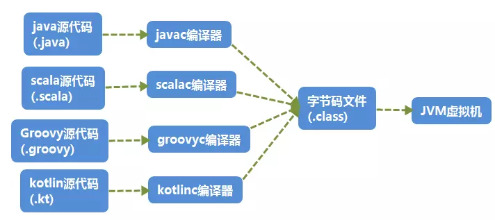
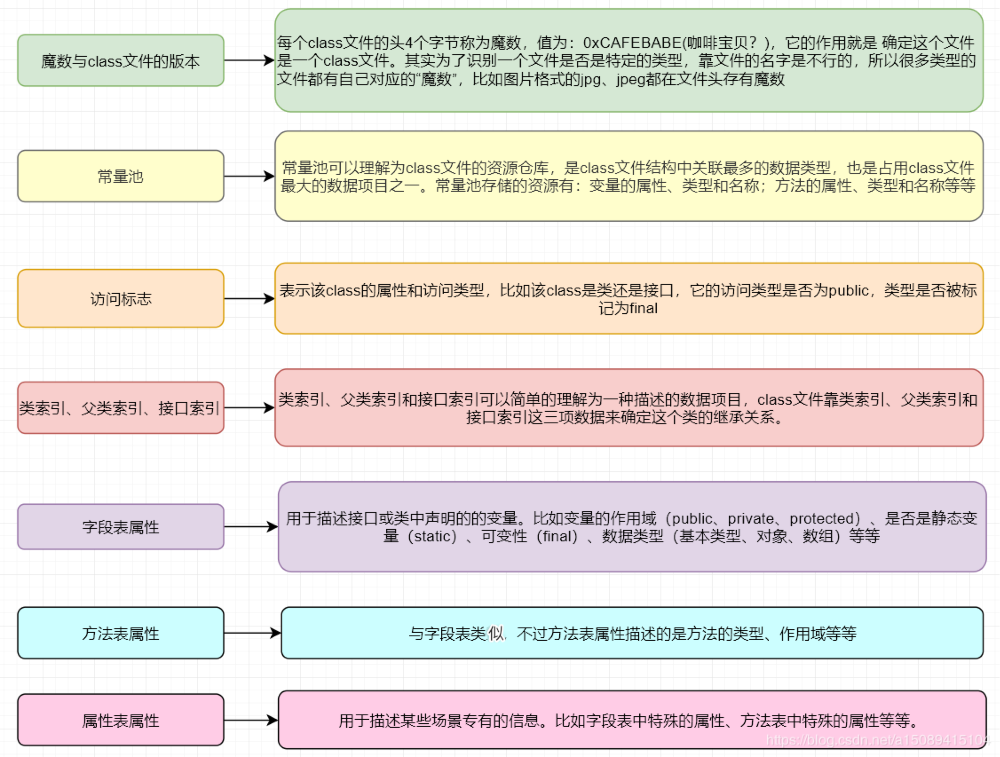
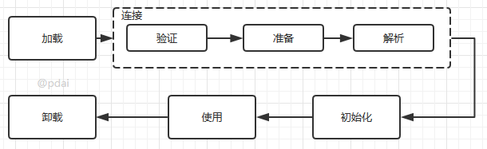
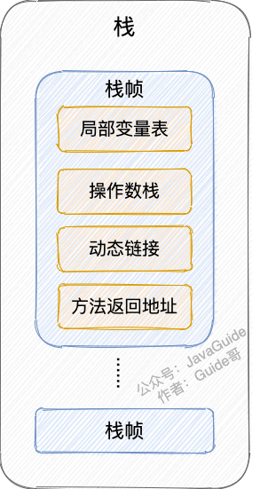
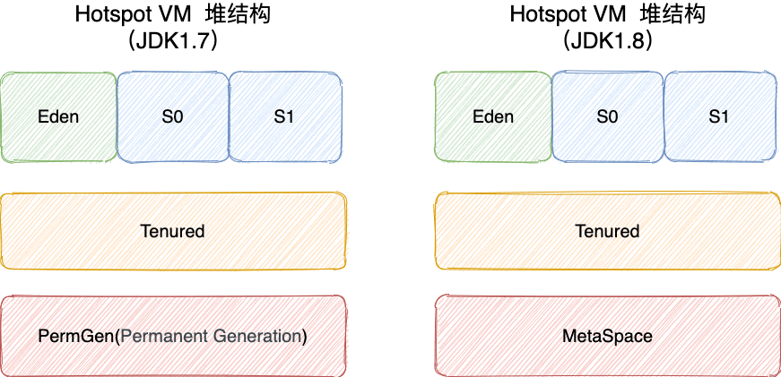
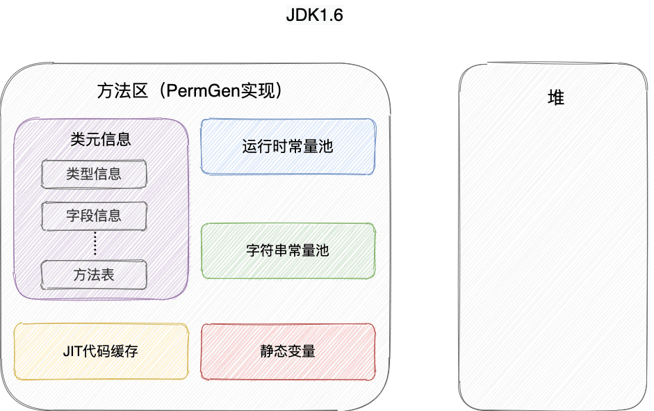
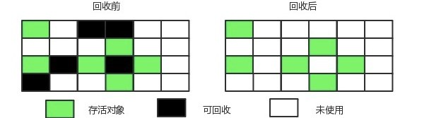
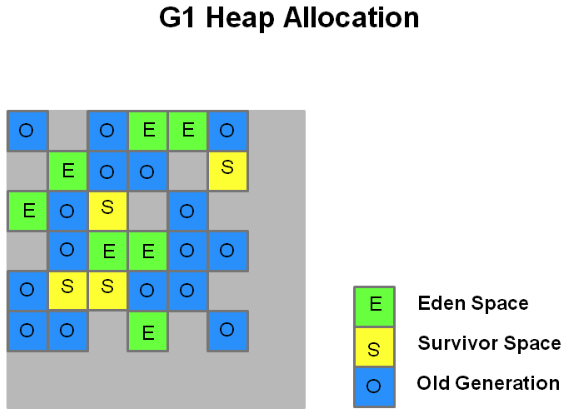

# JVM

## 一、类字节码详解:airplane:

> 参考链接：[Java全栈知识体系](https://pdai.tech/md/java/jvm/java-jvm-class.html)

### 1.1 多语言编译为字节码在JVM运行

计算机是不能直接运行Java代码的，必须要先运行Java虚拟机，再由Java虚拟机运行编译后的Java代码，即Java字节码。

Java代码间接翻译成字节码，储存字节码的文件再交由运行于不同平台上的JVM虚拟机去读取执行，从而实现**一次编写、到处运行**的目的。JVM也不再只支持Java，由此衍生出了许多基于JVM的编程语言，如Groovy、Scala、Koltin等等。



### 1.2 Java字节码文件

`.class`文件本质上是一个**以8位字节为基础单位的二进制流**，各个数据项目严格按照顺序紧凑的排列在`.class`文件中。Jvm根据其特定的规则解析该二进制数据，从而得到相关信息。`.class`文件采用一种伪结构来存储数据，它有两种类型：无符号数和表。

#### `.class`文件的结构属性



#### 从一个例子开始

```java
//Main.java
public class Main {
    
    private int m;
    
    public int inc() {
        return m + 1;
    }
}
```

生成一个`Main.class`文件：

```shell
javac Main.java
```

以文本形式打开，其内容如下：

```
cafe babe 0000 0034 0013 0a00 0400 0f09
0003 0010 0700 1107 0012 0100 016d 0100
0149 0100 063c 696e 6974 3e01 0003 2829
5601 0004 436f 6465 0100 0f4c 696e 654e
756d 6265 7254 6162 6c65 0100 0369 6e63
0100 0328 2949 0100 0a53 6f75 7263 6546
696c 6501 0009 4d61 696e 2e6a 6176 610c
0007 0008 0c00 0500 0601 0010 636f 6d2f
7268 7974 686d 372f 4d61 696e 0100 106a
6176 612f 6c61 6e67 2f4f 626a 6563 7400
2100 0300 0400 0000 0100 0200 0500 0600
0000 0200 0100 0700 0800 0100 0900 0000
1d00 0100 0100 0000 052a b700 01b1 0000
0001 000a 0000 0006 0001 0000 0003 0001
000b 000c 0001 0009 0000 001f 0002 0001
0000 0007 2ab4 0002 0460 ac00 0000 0100
0a00 0000 0600 0100 0000 0800 0100 0d00
0000 0200 0e
```

文件开头的4个字节（"cafe babe"）称之为**魔数**，唯有以"cafe babe"开头的`.class`文件方可被虚拟机所接受，这4个字节就是字节码文件的身份识别。0000是编译器JDK版本的次版本号0，0034转化为十进制是52也就是主版本号，**Java的版本号从45开始**，除`v1.0`和`v1.1`都是使用45.x外，以后每升一个大版本，版本号加一。也就是说，编译生成该`.class`文件的JDK版本为`v1.8.0`。

#### 反编译字节码文件

使用Java内置的反编译工具`javap`可以反编译字节码文件，用法：`javap <options> <classes>`。

输入命令`javap -verbose -p Main.class`查看输出内容：

```shell
Classfile /E:/JavaCode/TestProj/out/production/TestProj/com/rhythm7/Main.class
  Last modified 2018-4-7; size 362 bytes
  MD5 checksum 4aed8540b098992663b7ba08c65312de
  Compiled from "Main.java"
public class com.rhythm7.Main
  minor version: 0
  major version: 52
  flags: ACC_PUBLIC, ACC_SUPER
Constant pool:
   #1 = Methodref          #4.#18         // java/lang/Object."<init>":()V
   #2 = Fieldref           #3.#19         // com/rhythm7/Main.m:I
   #3 = Class              #20            // com/rhythm7/Main
   #4 = Class              #21            // java/lang/Object
   #5 = Utf8               m
   #6 = Utf8               I
   #7 = Utf8               <init>
   #8 = Utf8               ()V
   #9 = Utf8               Code
  #10 = Utf8               LineNumberTable
  #11 = Utf8               LocalVariableTable
  #12 = Utf8               this
  #13 = Utf8               Lcom/rhythm7/Main;
  #14 = Utf8               inc
  #15 = Utf8               ()I
  #16 = Utf8               SourceFile
  #17 = Utf8               Main.java
  #18 = NameAndType        #7:#8          // "<init>":()V
  #19 = NameAndType        #5:#6          // m:I
  #20 = Utf8               com/rhythm7/Main
  #21 = Utf8               java/lang/Object
{
  private int m;
    descriptor: I
    flags: ACC_PRIVATE

  public com.rhythm7.Main();
    descriptor: ()V
    flags: ACC_PUBLIC
    Code:
      stack=1, locals=1, args_size=1
         0: aload_0
         1: invokespecial #1                  // Method java/lang/Object."<init>":()V
         4: return
      LineNumberTable:
        line 3: 0
      LocalVariableTable:
        Start  Length  Slot  Name   Signature
            0       5     0  this   Lcom/rhythm7/Main;

  public int inc();
    descriptor: ()I
    flags: ACC_PUBLIC
    Code:
      stack=2, locals=1, args_size=1
         0: aload_0
         1: getfield      #2                  // Field m:I
         4: iconst_1
         5: iadd
         6: ireturn
      LineNumberTable:
        line 8: 0
      LocalVariableTable:
        Start  Length  Slot  Name   Signature
            0       7     0  this   Lcom/rhythm7/Main;
}
SourceFile: "Main.java"
```

#### 字节码文件信息

上面的开头7行信息包括：`.class`文件当前所在位置、最后修改时间、文件大小、MD5值、编译自哪个文件、类的全限定名、JDK次版本号、主版本号。

然后紧接着的是该类的访问标志：`ACC_PUBLIC`，`ACC_SUPER`，访问标志的含义如下：

|      名称      | 标志值 |                             含义                             |
| :------------: | :----: | :----------------------------------------------------------: |
|   ACC_PUBLIC   | 0x0001 |                      是否为`Public`类型                      |
|   ACC_FINAL    | 0x0010 |             是否被声明为`final`，只有类可以设置              |
|   ACC_SUPER    | 0x0020 |        是否允许使用`invokespecial`字节码指令的新语义         |
| ACC_INTERFACE  | 0x0200 |                       标志这是一个接口                       |
|  ACC_ABSTRACT  | 0x0400 | 是否为`abstract`类型，对于接口或者抽象类来说，次标志值为真，其他类型为假 |
| ACC_SYNTHETIC  | 0x1000 |                 标志这个类并非由用户代码产生                 |
| ACC_ANNOTATION | 0x2000 |                       标志这是一个注解                       |
|    ACC_ENUM    | 0x4000 |                       标志这是一个枚举                       |

#### 常量池

`Constant pool`意为常量池。常量池可以理解成`.class`文件中的资源仓库。主要存放的是两大类常量：**字面量（Literal）**和**符号引用（Symbolic References）**。字面量类似于Java中的常量概念，如文本字符串，`final`常量等，而符号引用则属于编译原理方面的概念，包括以下三种：

- 类和接口的全限定名（Fully Qualified Name）。
- 字段的名称和描述符号（Descriptor）。
- 方法的名称和描述符。

不同于C/C++，JVM是在加载`.class`文件的时候才进行的动态链接，也就是说**这些字段和方法符号引用只有在运行期转换后才能获得真正的内存入口地址**。当虚拟机运行时，**需要从常量池获得对应的符号引用，再在类创建或运行时解析并翻译到具体的内存地址中**。 直接通过反编译文件来查看字节码内容：

```shell
#1 = Methodref          #4.#18         // java/lang/Object."<init>":()V
#4 = Class              #21            // java/lang/Object
#7 = Utf8               <init>
#8 = Utf8               ()V
#18 = NameAndType        #7:#8          // "<init>":()V
#21 = Utf8               java/lang/Object
```

**第一个常量**是一个方法定义，指向了第4和第18个常量。以此类推，最后可以拼接成第一个常量右侧的注释内容：`java/lang/Object."<init>":()V`。

这段可以理解为该类的实例构造器的声明，由于Main类没有重写构造方法，所以调用的是父类的构造方法。此处也说明了Main类的直接父类是`Object`。 该方法默认返回值是V，也就是`void`，无返回值。

**第二个常量**同理可得：

```shell
#2 = Fieldref           #3.#19         // com/rhythm7/Main.m:I
#3 = Class              #20            // com/rhythm7/Main
#5 = Utf8               m
#6 = Utf8               I
#19 = NameAndType        #5:#6          // m:I
#20 = Utf8               com/rhythm7/Main
```

此处声明了一个字段m，类型为I, I即是`int`类型。关于字节码的类型对应如下：

| 标识字符 |                      含义                       |
| :------: | :---------------------------------------------: |
|    B     |                 基本类型`byte`                  |
|    C     |                 基本类型`char`                  |
|    D     |                基本类型`double`                 |
|    F     |                 基本类型`float`                 |
|    I     |                  基本类型`int`                  |
|    J     |                 基本类型`long`                  |
|    S     |                 基本类型`short`                 |
|    Z     |                基本类型`boolean`                |
|    V     |                 特殊类型`void`                  |
|    L     | 对象类型，以分号结尾，如：`Ljava/lang/Object`； |

对于数组类型，每一位使用一个前置的`[`字符来描述，如定义一个`java.lang.String[][]`类型的维数组，将被记录为`[[Ljava/lang/String;`

#### 方法表合集

在常量池之后的是对类内部的方法描述，在字节码中以表的集合形式表现，暂且不管字节码文件的16进制文件内容如何，直接看反编译后的内容，这里声明了一个私有变量`m`，类型为`int`，返回值为`int`：

```shell
private int m;
  descriptor: I
  flags: ACC_PRIVATE
```

```shell
public com.rhythm7.Main();
   descriptor: ()V
   flags: ACC_PUBLIC
   Code:
     stack=1, locals=1, args_size=1
        0: aload_0
        1: invokespecial #1                  // Method java/lang/Object."<init>":()V
        4: return
     LineNumberTable:
       line 3: 0
     LocalVariableTable:
       Start  Length  Slot  Name   Signature
           0       5     0  this   Lcom/rhythm7/Main;
```

这里是构造方法：`Main()`，返回值为`void`，公开方法。

`Code`内的主要属性为：

- **`stack`**：**最大操作数栈**，JVM运行时会根据这个值来分配栈帧（Frame）中的操作栈深度，此处为1。
- **`locals`**：**局部变量所需的存储空间**，单位为Slot。**Slot是虚拟机为局部变量分配内存时所使用的最小单位，为4个字节大小**。方法参数（包括实例方法中的隐藏参数`this`）、显示异常处理器的参数（`try-catch`中的`catch`块所定义的异常）、方法体中定义的局部变量**都需要使用局部变量表来存放**。值得一提的是，**`locals`的大小并不一定等于所有局部变量所占的Slot之和，因为局部变量中的Slot是可以重用的**。
- **`args_size`**：**方法参数的个数**，这里是1，因为每个实例方法都会有一个隐藏参数`this`。
- **`attribute_info`**：**方法体内容**，0、1、4为字节码"行号"，该段代码的意思是将**第一个引用类型本地变量推送至栈顶，然后执行该类型的实例方法，也就是常量池存放的第一个变量，也就是注释里的`java/lang/Object."":()V`**，然后执行返回语句，结束方法。
- **`LineNumberTable`**：该属性的作用是描述**源码行号与字节码行号（字节码偏移量）之间的对应关系**。可以使用`-g:none`或`-g:lines`选项来取消或要求生成这项信息，如果选择不生成，当程序运行异常时将无法获取到发生异常的源码行号，也无法按照源码的行数来调试程序。
- **`LocalVariableTable`**：该属性的作用是**描述帧栈中局部变量与源码中定义的变量之间的关系**。可以使用`-g:none`或`-g:vars`来取消或生成这项信息，**如果没有生成这项信息，那么当别人引用这个方法时，将无法获取到参数名称，取而代之的是`arg0`、`arg1`这样的占位符**。`start`表示该局部变量在哪一行开始可见，`length`表示可见行数，`Slot`代表所在帧栈位置，`Name`是变量名称，然后是类型签名。

#### 类名

最后一行显然是表示源码文件。

```shell
SourceFile: "Main.java"
```

## 二、类加载机制:rocket:

> 参考链接：[Java全栈知识体系](https://pdai.tech/md/java/jvm/java-jvm-classload.html)

### 2.1 类的生命周期

其中类加载的过程包括了**加载**、**验证**、**准备**、**解析**、**初始化**五个阶段。在这五个阶段中，**加载**、**验证**、**准备**和**初始化**这四个阶段发生的顺序是**确定**的，而**解析**阶段则不一定，**它在某些情况下可以在初始化阶段之后开始，这是为了支持Java语言的运行时绑定（也成为动态绑定或晚期绑定）**。另外注意这里的几个阶段是**按顺序开始**，**而不是按顺序进行或完成**，因为这些阶段通常都是互相交叉地混合进行的，**通常在一个阶段执行的过程中调用或激活另一个阶段**。



#### 类的加载：查找并加载类的二进制数据

**加载是类加载过程的第一个阶段**，在加载阶段，虚拟机需要完成以下三件事情：

1. 通过一个类的全限定名来获取其定义的**二进制字节流**；
2. 将这个字节流所代表的**静态存储结构转化为方法区的运行时数据结构**；
3. 在**堆中生成一个代表这个类的`java.lang.Class`对象**，作为对**方法区中这些数据的访问入口**。


相对于类加载的其他阶段而言，加载阶段（准确地说，是加载阶段**获取类的二进制字节流的动作**）是**可控性最强**的阶段，因为**开发人员既可以使用系统提供的类加载器来完成加载，也可以自定义自己的类加载器来完成加载**。

加载阶段完成后，**虚拟机外部的二进制字节流就按照虚拟机所需的格式存储在方法区之中**，而且在Java堆中也创建一个`java.lang.Class`类的对象，这样便可以**通过该对象访问方法区中的这些数据**。

**类加载器并不需要等到某个类被“首次主动使用”时再加载它**，JVM规范**允许类加载器在预料某个类将要被使用时就预先加载它**，如果在预先加载的过程中遇到了`.class`文件缺失或存在错误，**类加载器必须在程序首次主动使用该类时才报告错误（LinkageError错误）**，如果这个类一直没有被程序主动使用，那么类加载器就不会报告错误。

#### 连接

##### 验证：确保被加载的类的正确性

**验证是连接阶段的第一步**，这一阶段的目的是为了确保`.class`文件的**字节流中包含的信息符合当前虚拟机的要求**，并且不会危害虚拟机自身的安全。验证阶段大致会完成4个阶段的检验动作：

- 文件格式验证：**验证字节流是否符合`.class`文件格式的规范**。例如：是否以`0xCAFEBABE`开头、主次版本号是否在当前虚拟机的处理范围之内、常量池中的常量是否有不被支持的类型。
- 元数据验证：**对字节码描述的信息进行语义分析**，以保证其描述的信息符合Java语言规范的要求。例如：这个类是否有父类，除了`java.lang.Object`之外。
- 字节码验证：通过数据流和控制流分析，**确定程序语义是合法的、符合逻辑的**。
- 符号引用验证：确保解析动作能正确执行。

补充：**验证阶段是非常重要的，但不是必须的**，它对程序运行期没有影响，如果所引用的类经过反复验证，那么可以考虑采用`-Xverifynone`参数来**关闭大部分的类验证措施**，以缩短虚拟机类加载的时间。

##### 准备：为类的静态变量分配内存并将其初始化为默认值

准备阶段是**正式为类变量分配内存并设置类变量初始值的阶段**，**这些内存都将在方法区中分配**。对于该阶段有以下几点需要注意：

- 这时候进行内存分配的仅包括类变量（`static`）而**不包括实例变量**，实例变量会在对象实例化时随着对象一块分配在Java堆中。
- 这里**所设置的初始值通常情况下是数据类型默认的零值**（如`0`、`0L`、`null`、`false`等），而不是被在Java代码中被显式地赋予的值。

假设一个类变量的定义为：`public static int value = 3`；那么变量value在准备阶段过后的初始值为`0`，而不是`3`，因为**这时候尚未开始执行任何Java方法**，而把value赋值为3的`put static`指令是在程序编译后，存放于类构造器`<clinit>()`方法之中的，所以**把value赋值为3的动作将在初始化阶段才会执行**。

注意以下几点：

- 对基本数据类型来说，对于类变量（`static`）和全局变量，如果不显式地对其赋值而直接使用，则系统会为其赋予默认的零值，而对于**局部变量来说，在使用前必须显式地为其赋值，否则编译时不通过**。
- 对于同时被`static`和`final`修饰的常量，**必须在声明的时候就为其显式地赋值，否则编译时不通过**；而只被`final`修饰的常量则既可以在声明时显式地为其赋值，也可以在类初始化时显式地为其赋值，总之，**在使用前必须为其显式地赋值，系统不会为其赋予默认零值**。
- 对于引用数据类型`reference`来说，如数组引用、对象引用等，如果没有对其进行显式地赋值而直接使用，系统都会为其赋予默认的零值，即`null`。
- 如果在数组初始化时没有对数组中的各元素赋值，那么其中的元素将根据对应的数据类型而被赋予默认的零值。
- 如果类字段的字段属性表中存在`ConstantValue`属性，即同时被`final`和`static`修饰，那么在**准备阶段变量`value`就会被初始化为`ConstValue`属性所指定的值**。可以理解为`static final`常量在**编译期就将其结果放入了调用它的类的常量池中**。

##### 解析：把类中的符号引用转换为直接引用

解析阶段是**虚拟机将常量池内的符号引用替换为直接引用的过程**，解析动作主要针对**类或接口、字段、类方法、接口方法、方法类型、方法句柄和调用点限定符7类符号引用**进行。

符号引用就是一组符号来描述目标，可以是任何字面量。直接引用就是**直接指向目标的指针、相对偏移量或一个间接定位到目标的句柄**。

#### 初始化

初始化：**为类的静态变量赋予正确的初始值**，JVM负责对类进行初始化，主要对**类变量进行初始化**。在Java中对类变量进行初始值设定有两种方式：

- 声明类变量为指定初始值。
- 使用静态代码块为类变量指定初始值

##### JVM初始化步骤

1. 假如这个类还没有被加载和连接，则程序**先加载并连接该类**；
2. 假如该类的直接父类还没有被初始化，则**先初始化其直接父类**；
3. 假如类中有初始化语句，则系统**依次执行这些初始化语句**。

##### 类初始化时机

只有当**类主动使用的时候才会导致类的初始化**，类的主动使用包括以下六种：

- **创建类的实例**，也就是`new`的方式。
- **访问某个类或接口的静态变量**，或者对该静态变量赋值。
- 调用类的静态方法。
- 反射（如`Class.forName("com.pdai.jvm.Test")`）。
- 初始化某个类的子类，则其**父类也会被初始化**。
- Java虚拟机启动时被标明为**启动类的类**（Java Test），直接使用`java.exe`命令来运行某个主类。

#### 使用

类访问方法区内的数据结构的接口， 对象是`Heap`区的数据。

#### 卸载

> 参考链接：[JavaGuide](https://javaguide.cn/java/jvm/class-loading-process.html#%E5%8D%B8%E8%BD%BD)

卸载类即该类的`Class`对象被GC。卸载类需要满足3个要求：

- 该类的所有实例对象都已被GC，也就是说堆不存在该类的实例对象。
- 该类没有在其他任何地方被引用。
- 该类的类加载器的实例已被GC。

在JVM生命周期内，由JVM自带的类加载器加载的类是不会被卸载的，但由自定义类加载器加载的类是可能被卸载的。

### 2.2 类加载器，JVM类加载机制

#### 类加载器的层次


注意：这里父类加载器并不是通过继承关系来实现的，而是采用组合实现的。

站在Java虚拟机的角度来讲，只存在两种不同的类加载器：

- 启动类加载器：它使用C++实现（这里仅限于`Hotspot`，也就是JDK1.5之后默认的虚拟机，有很多其他的虚拟机是用Java语言实现的），**是虚拟机自身的一部分**。
- 所有其他的类加载器：这些类加载器都由Java语言实现，**独立于虚拟机之外**，并且全部继承自抽象类`java.lang.ClassLoader`，这些类加载器**需要由启动类加载器加载到内存中之后才能去加载其他的类**。

站在Java开发人员的角度来看，类加载器可以大致划分为以下三类：

- 启动类加载器：Bootstrap ClassLoader，负责加载存放在`JDK\jre\lib`（JDK代表JDK的安装目录，下同）下，或被`-Xbootclasspath`参数指定的路径中的，并且能被虚拟机识别的类库（如rt.jar，所有的`java.*`开头的类均被Bootstrap ClassLoader加载）。启动类加载器是无法被Java程序直接引用的。
- 扩展类加载器：Extension ClassLoader，该加载器由`sun.misc.Launcher$ExtClassLoader`实现，它负责加载`JDK\jre\lib\ext`目录中，或者由java.ext.dirs系统变量指定的路径中的所有类库（如`javax.*`开头的类），**开发者可以直接使用扩展类加载器**。
- 应用程序类加载器：Application ClassLoader，该类加载器由`sun.misc.Launcher$AppClassLoader`来实现，**它负责加载用户类路径（ClassPath）所指定的类，开发者可以直接使用该类加载器**，如果应用程序中没有自定义过自己的类加载器，一般情况下这个就是程序中**默认的类加载器**。

应用程序都是由这三种类加载器互相配合进行加载的，如果有必要，还可以加入自定义的类加载器。因为JVM自带的ClassLoader只是懂得从本地文件系统加载标准的`.class`文件，因此如果编写了自己的ClassLoader，便可以做到如下几点：

- 在执行非置信代码之前，自动验证数字签名。
- 动态地创建符合用户特定需要的定制化构建类。
- 从特定的场所取得`.class`文件，例如数据库中和网络中。

#### 类的加载

类加载有三种方式：

- 命令行启动应用时候由JVM初始化加载。
- 通过`Class.forName()`方法动态加载。
- 通过`ClassLoader.loadClass()`方法动态加载

```java
package com.pdai.jvm.classloader;
public class loaderTest { 
    public static void main(String[] args) throws ClassNotFoundException { 
        ClassLoader loader = HelloWorld.class.getClassLoader(); 
        System.out.println(loader); 
        //使用ClassLoader.loadClass()来加载类，不会执行初始化块 
        loader.loadClass("Test2"); 
        //使用Class.forName()来加载类，默认会执行初始化块 
        //Class.forName("Test2"); 
        //使用Class.forName()来加载类，并指定ClassLoader，初始化时不执行静态块 
        //Class.forName("Test2", false, loader); 
    } 
}

public class Test2 { 
    static { 
        System.out.println("静态初始化块执行了！"); 
    } 
}
```

##### `Class.forName()`和`ClassLoader.loadClass()`区别

> 参考链接：[掘金](https://juejin.cn/post/6844904023540105229)、[Github](https://github.com/nnngu/LearningNotes/blob/master/Java%20Basis/015%20%E5%8F%8D%E5%B0%84%E4%B8%AD%E7%9A%84%20Class.forName()%20%E4%B8%8E%20ClassLoader.loadClass()%20%E7%9A%84%E5%8C%BA%E5%88%AB.md)

`Class.forName(className)`或者`Class.forName(name, initialize, loader)`其实都调用了`Class.forName0(name, initialize, loader, caller)`，**第二个参数控制是否执行初始化，默认执行**。

`ClassLoader.loadClass(className)`方法，其实调用了`ClassLoader.loadClass(name, false)`，**第二个参数表示不执行连接，只加载`.class`文件**。

### 2.3 JVM类加载机制

- 全盘负责：当一个类加载器负责加载某个Class时，**该Class所依赖的和引用的其他Class也将由该类加载器负责载入**，除非显式使用另外一个类加载器来载入。
- 父类委托：先让**父类加载器试图加载该类**，只有在父类加载器无法加载该类时才尝试从自己的类路径中加载该类。
- 缓存机制：**缓存机制将会保证所有加载过的Class都会被缓存**，当程序中需要使用某个Class时，**类加载器先从缓存区寻找该Class，只有缓存区不存在，系统才会读取该类对应的二进制数据**，并将其转换成Class对象，存入缓存区。这就是为什么修改了Class后，必须重启JVM，程序的修改才会生效。
- 双亲委派机制：如果一个类加载器收到了类加载的请求，它首先不会自己去尝试加载这个类，而是把**请求委托给父加载器去完成**，依次向上，因此所有的类加载请求最终都应该被**传递到顶层的启动类加载器中**，只有当父加载器在它的搜索范围中没有找到所需的类时，即无法完成该加载，子加载器才会尝试自己去加载该类。

#### 双亲委派机制过程

1. 当`AppClassLoader`加载一个class时，它首先不会自己去尝试加载这个类，而是把类加载请求委派给父类加载器`ExtClassLoader`去完成。
2. 当`ExtClassLoader`加载一个class时，它首先也不会自己去尝试加载这个类，而是把类加载请求委派给`BootStrapClassLoader`去完成。
3. 如果`BootStrapClassLoader`加载失败（例如在`$JAVA_HOME/jre/lib`里未查找到该class)，会使用`ExtClassLoader`来尝试加载。
4. 若`ExtClassLoader`也加载失败，则会使用`AppClassLoader`来加载，如果`AppClassLoader`也加载失败，则会报出异常`ClassNotFoundException`。

> 参考链接：[JavaGuide](https://javaguide.cn/java/jvm/classloader.html#%E5%8F%8C%E4%BA%B2%E5%A7%94%E6%B4%BE%E6%A8%A1%E5%9E%8B%E4%BB%8B%E7%BB%8D)


#### 双亲委派机制优势

- 防止内存中出现多份同样的字节码，**避免类的重复加载**。
- 保证程序安全稳定运行。

#### 打破双亲委派机制

> 参考链接：[JavaGuide](https://javaguide.cn/java/jvm/classloader.html#%E5%A6%82%E6%9E%9C%E6%88%91%E4%BB%AC%E4%B8%8D%E6%83%B3%E7%94%A8%E5%8F%8C%E4%BA%B2%E5%A7%94%E6%B4%BE%E6%A8%A1%E5%9E%8B%E6%80%8E%E4%B9%88%E5%8A%9E)

自定义加载器的话，需要继承`ClassLoader`。如果不想打破双亲委派模型，就重写`ClassLoader`类中的`findClass()`方法即可，无法被父类加载器加载的类最终会通过这个方法被加载；如果想打破双亲委派机制则需要重写`loadClass()`方法。

## 三、JVM内存结构:rocket:

> 参考链接：[JavaGuide](https://javaguide.cn/java/jvm/memory-area.html)

### 3.1 运行时数据区域

JVM在执行Java程序的过程中会把它管理的内存划分成若干个不同的数据区域。JDK 1.8和之前的版本略有不同。

JDK 1.8之前：


JDK 1.8：


**线程私有**：程序计数器、虚拟机栈、本地方法栈。

**线程共享**：堆、方法区、直接内存（非运行时数据区域的一部分）。

JVM规范对于运行时数据区域的规定是相当宽松的。以堆为例：堆可以是连续空间，也可以不连续；堆的大小可以固定，也可以在运行时按需扩展。虚拟机实现者可以使用任何垃圾回收算法管理堆，甚至完全不进行垃圾收集也是可以的。

#### 程序计数器

程序计数器是一块较小的内存空间，可以看作是**当前线程所执行的字节码的行号指示器**。字节码解释器工作时通过改变这个计数器的值来选取下一条需要执行的字节码指令，分支、循环、跳转、异常处理、线程恢复等功能都需要依赖这个计数器来完成。另外，为了线程切换后能恢复到正确的执行位置，**每个线程都需要有一个独立的程序计数器**，各线程之间计数器互不影响，独立存储，称这类内存区域为“线程私有”的内存。

程序计数器主要有两个作用：

- 字节码解释器通过改变程序计数器来依次读取指令，从而**实现代码的流程控制**，如：顺序执行、选择、循环、异常处理。
- 在多线程的情况下，**程序计数器用于记录当前线程执行的位置**，从而当线程被切换回来的时候能够知道该线程上次运行到哪儿了。

程序计数器是唯一一个不会出现`OutOfMemoryError`的内存区域，它的生命周期随着线程的创建而创建，随着线程的结束而死亡。

#### 虚拟机栈

与程序计数器一样，虚拟机栈（后文简称栈）也是线程私有的，它的生命周期和线程相同，随着线程的创建而创建，随着线程的死亡而死亡。

栈绝对算得上JVM运行时数据区域的一个核心，除了一些本地方法调用是通过本地方法栈实现的，其他所有Java方法调用都是通过栈来实现的（也需要和其他运行时数据区域比如程序计数器配合）。

方法调用的数据需要通过栈进行传递，**每一次方法调用都会有一个对应的栈帧被压入栈中，每一个方法调用结束后，都会有一个栈帧被弹出**。

栈由一个个栈帧组成，而每个栈帧中都拥有：局部变量表、操作数栈、动态链接、方法返回地址。和数据结构上的栈类似，两者都是先进后出的数据结构，只支持出栈和入栈两种操作。



**局部变量表**主要存放了编译期可知的各种数据类型（`boolean`、`byte`、`char`、`short`、`int`、`float`、`long`、`double`）、对象引用（`reference`类型，它不同于对象本身，可能是一个指向对象起始地址的引用指针，也可能是指向一个代表对象的句柄或其他与此对象相关的位置）。

**操作数栈**主要作为方法调用的中转站使用，**用于存放方法执行过程中产生的中间计算结果**。另外，计算过程中产生的临时变量也会放在操作数栈中。

**动态链接**主要服务一个方法需要调用其他方法的场景。在Java源文件被编译成字节码文件时，所有的变量和方法引用都作为符号引用保存在`.class`文件的常量池里。当一个方法要调用其他方法，需要将常量池中指向方法的符号引用转化为其在内存地址中的直接引用。动态链接的作用就是**为了将符号引用转换为调用方法的直接引用**。


栈空间虽然不是无限的，但一般正常调用的情况下是不会出现问题的。不过，如果函数调用陷入无限循环的话，就会导致栈中被压入太多栈帧而占用太多空间，导致栈空间过深。那么当线程请求栈的深度超过当前Java虚拟机栈的最大深度的时候，就抛出`StackOverFlowError`错误。

Java方法有两种返回方式，一种是`return`语句正常返回，一种是抛出异常。不管哪种返回方式，都会导致栈帧被弹出。也就是说，**栈帧随着方法调用而创建，随着方法结束而销毁。无论方法正常完成还是异常完成都算作方法结束**。

除了`StackOverFlowError`错误之外，栈还可能会出现`OutOfMemoryError`错误，这是因为如果栈的内存大小可以动态扩展， 虚拟机在动态扩展栈时无法申请到足够的内存空间，就会抛出`OutOfMemoryError`异常。

简单总结一下程序运行中栈可能会出现两种错误：

- `StackOverFlowError`：若栈的内存大小不允许动态扩展，那么当线程请求栈的深度超过当前栈的最大深度的时候，就抛出`StackOverFlowError`错误。
- `OutOfMemoryError`：如果栈的内存大小可以动态扩展，在动态扩展栈时无法申请到足够的内存空间，则抛出`OutOfMemoryError`异常。

#### 本地方法栈

和虚拟机栈所发挥的作用非常相似，区别是：**虚拟机栈为虚拟机执行Java方法（也就是字节码）服务，而本地方法栈则为虚拟机使用到的本地方法服务**。在HotSpot虚拟机中本地方法栈和虚拟机栈合二为一。

本地方法被执行的时候，在本地方法栈也会创建一个栈帧，用于存放该本地方法的局部变量表、操作数栈、动态链接、出口信息。

方法执行完毕后相应的栈帧也会出栈并释放内存空间，也会出现`StackOverFlowError`和`OutOfMemoryError`两种错误。

#### 堆

JVM所管理的内存中最大的一块，Java堆是所有线程共享的一块内存区域，在虚拟机启动时创建。**此内存区域的唯一目的就是存放对象实例，几乎所有的对象实例以及数组都在这里分配内存**。

Java世界中**“几乎”**所有的对象都在堆中分配，但是随着JIT编译器的发展与逃逸分析技术逐渐成熟，栈上分配、标量替换优化技术将会导致一些微妙的变化，所有的对象都分配到堆上也渐渐变得不那么“绝对”了。从 JDK 1.7开始已经默认开启逃逸分析，如果某些方法中的对象引用没有被返回或者未被外面使用（也就是未逃逸出去），那么对象可以直接在栈上分配内存。

Java堆是垃圾收集器管理的主要区域，因此也被称作**GC堆（Garbage Collected Heap）**。从垃圾回收的角度，由于现在收集器基本都采用分代垃圾收集算法，所以Java堆还可以细分为：新生代和老年代；再细致一点的有：Eden、Survivor、Old等空间。进一步划分的目的是更好地回收内存，或者更快地分配内存。

在JDK 1.7及之前，堆内存通常被分为三部分：

- 新生代内存（Young Generation）
- 老生代（Old Generation）
- 永久代（Permanent Generation）



**JDK 1.8版本之后PermGen（永久）已被Metaspace（元空间）取代，元空间使用的是直接内存**。

堆这里最容易出现的就是`OutOfMemoryError`错误，并且出现这种错误之后的表现形式还会有几种，比如：

- `java.lang.OutOfMemoryError: GC Overhead Limit Exceeded`：当JVM花太多时间执行垃圾回收并且只能回收很少的堆空间时，就会发生此错误。
- `java.lang.OutOfMemoryError: Java heap space`：假如在创建新的对象时，堆内存中的空间不足以存放新创建的对象就会引发此错误。（和配置的最大堆内存有关，且受制于物理内存大小。最大堆内存可通过`-Xmx`参数配置，若没有特别配置，将会使用默认值）

#### 方法区

方法区属于JVM运行时数据区域的一块**逻辑区域**，是各个线程共享的内存区域。

《Java虚拟机规范》只是规定了有方法区的概念及其作用，方法区到底要如何实现那是虚拟机自己需要考虑的事情。也就是说，**在不同的虚拟机上，方法区的实现是不同的**。

当虚拟机要使用一个类时，它需要读取并解析`.class`文件获取相关信息，再将信息存入到方法区。方法区会存储已被虚拟机加载的**类信息、字段信息、方法信息、常量、静态变量、即时编译器编译后的代码缓存等数据**。

**方法区和永久代以及元空间是什么关系呢**？方法区和永久代以及元空间的关系很像Java中接口和类的关系，类实现了接口，**这里的类就可以看作是永久代和元空间，接口可以看作是方法区**，也就是说永久代以及元空间是HotSpot虚拟机对虚拟机规范中方法区的两种实现方式。并且，永久代是JDK 1.8之前的方法区实现，JDK 1.8及以后方法区的实现变成了元空间。


##### 为什么要将永久代替换为元空间呢？

- 整个永久代有一个JVM本身设置的固定大小上限，无法进行调整，而元空间使用的是**直接内存**，受本机可用内存的限制，**虽然元空间仍旧可能溢出，但是比原来出现的几率会更小**。当元空间溢出时会出现`java.lang.OutOfMemoryError: MetaSpace`错误。可以使用`-XX：MaxMetaspaceSize`标志设置最大元空间大小，默认值为`unlimited`，这意味着它只受系统内存的限制。`-XX：MetaspaceSize`标志定义元空间的初始大小，如果未指定此标志，则会根据运行时的应用程序需求动态地重新调整大小。
- 元空间里面存放的是类的元数据，这样加载多少类的元数据就不由`MaxPermSize`控制了，而是由系统的实际可用空间来控制，这样能加载的类就更多了。
- 在JDK 1.8，合并HotSpot和JRockit的代码时，JRockit从来没有一个叫永久代的东西，合并之后就没有必要额外地设置一个永久代的地方了。

#### 运行时常量池

`.class`文件中除了有类的版本、字段、方法、接口等描述信息外，还有用于存放编译期生成的各种字面量（Literal）和符号引用（Symbolic Reference）的**常量池表（Constant Pool Table）**。

**常量池表会在类加载后存放到方法区的运行时常量池中**。运行时常量池的功能类似于传统编程语言的符号表，尽管它包含了比典型符号表更广泛的数据。

既然运行时常量池是方法区的一部分，自然受到方法区内存的限制，当常量池无法再申请到内存时会抛出`OutOfMemoryError`错误。

#### 字符串常量池

字符串常量池是JVM为了提升性能和减少内存消耗，针对字符串（`String`类）专门开辟的一块区域，主要目的是为了**避免字符串的重复创建**。

HotSpot 虚拟机中字符串常量池的实现是`src/hotspot/share/classfile/stringTable.cpp`，`StringTable`本质上就是一个`HashSet`，容量为`StringTableSize`（可以通过`-XX:StringTableSize`参数来设置）。

**`StringTable`中保存的是字符串对象的引用，字符串对象的引用指向堆中的字符串对象**。

JDK 1.7之前，字符串常量池存放在永久代。JDK 1.7字符串常量池和静态变量从永久代移动了Java堆中。




##### 为什么要将字符串常量池移动到堆中？

主要是因为永久代（方法区实现）的GC回收效率太低，只有在整堆收集（Full GC）的时候才会被收集。Java程序中通常会有大量的被创建的字符串等待回收，**将字符串常量池放到堆中，能够更高效及时地回收字符串内存**。

#### 直接内存

直接内存并不是虚拟机运行时数据区的一部分，也不是虚拟机规范中定义的内存区域，但是这部分内存也被频繁地使用，而且也可能导致`OutOfMemoryError`错误出现。

JDK 1.4中新加入的**NIO（New Input/Output）类**，引入了一种基于**通道（Channel）与缓存区（Buffer）的I/O方式**，它可以直接使用本地函数库直接分配堆外内存，然后通过一个存储在Java堆中的`DirectByteBuffer`对象作为这块内存的引用进行操作，这样就能在一些场景中显著提高性能，因为**避免了在Java堆和本地堆之间来回复制数据**。

本机直接内存的分配不会受到Java堆的限制，但是既然是内存就会受到本机总内存大小以及处理器寻址空间的限制。

### 3.2 HotSpot虚拟机对象

#### 对象的创建

##### 1. 类加载检查

虚拟机遇到一条`new`指令时，首先将去检查这个指令的参数是否能在常量池中定位到这个类的符号引用，并且检查这个符号引用代表的类是否已被加载过、解析和初始化过。如果没有，那必须先执行相应的类加载过程。

##### 2. 分配内存

在**类加载检查**通过后，接下来虚拟机将为新生对象**分配内存**。对象所需的内存大小在类加载完成后便可确定，为对象分配空间的任务等同于把一块确定大小的内存从Java堆中划分出来。分配方式有**指针碰撞**和**空闲列表**两种，选择哪种分配方式**由Java堆是否规整决定**，而**Java堆是否规整又由所采用的垃圾收集器是否带有压缩整理功能决定**。

**内存分配的两种方式**：

- 指针碰撞
  - 适用场合：堆内存**规整**（即没有内存碎片）的情况下。
  - 原理：用过的内存全部整合到一边，没有用过的内存放在另一边，中间有一个分界指针，只需要向着没用过的内存方向将该指针移动对象内存大小位置即可。
  - 使用该分配方式的GC收集器：Serial、ParNew。

- 空闲列表 
  - 适用场合：堆内存不规整的情况下。
  - 原理：虚拟机会维护一个列表，该列表中会记录哪些内存块是可用的，在分配的时候，找一块儿足够大的内存块儿来划分给对象实例，最后更新列表记录。
  - 使用该分配方式的GC收集器：CMS

选择以上两种方式中的哪一种，取决于Java堆内存是否规整，而Java堆内存是否规整取决于GC收集器的算法是“标记—整理”，还是“标记—清除”，值得注意的是，标记—复制算法内存也是规整的。

**内存分配并发问题**：在创建对象的时候有一个很重要的问题，就是线程安全，因为在实际开发过程中，创建对象是很频繁的事情，作为虚拟机来说，必须要保证线程是安全的，通常来讲，虚拟机采用两种方式来保证线程安全：

- **CAS+失败重试**：CAS是乐观锁的一种实现方式。所谓乐观锁就是，每次不加锁而是假设没有冲突而去完成某项操作，如果因为冲突失败就重试，直到成功为止。**虚拟机采用CAS配上失败重试的方式保证更新操作的原子性**。

- **TLAB**：为每一个线程预先在Eden区分配一块儿内存，JVM在给线程中的对象分配内存时，首先在TLAB分配，当对象大于TLAB中的剩余内存或TLAB的内存已用尽时，再采用上述的CAS进行内存分配。

##### 3. 初始化零值

内存分配完成后，虚拟机需要将分配到的内存空间都初始化为**零值（不包括对象头）**，这一步操作保证了对象的实例字段在Java代码中可以不赋初始值就直接使用，程序能访问到这些字段的数据类型所对应的零值。

##### 4. 设置对象头

初始化零值完成之后，**虚拟机要对对象进行必要的设置**，例如这个对象是哪个类的实例、如何才能找到类的元数据信息、对象的哈希码、对象的GC分代年龄等信息。**这些信息存放在对象头中**。另外，根据虚拟机当前运行状态的不同，如是否启用偏向锁等，对象头会有不同的设置方式。

##### 5. 执行`init`方法

在上面工作都完成之后，从虚拟机的视角来看，一个新的对象已经产生了，但从Java程序的视角来看，对象创建才刚开始，`<init>`方法还没有执行，所有的字段都还为零。所以一般来说，执行`new`指令之后会接着执行`<init>`方法，把对象按照程序员的意愿进行初始化，这样一个真正可用的对象才算完全产生出来。

#### 对象的内存布局

在Hotspot虚拟机中，对象在内存中的布局可以分为3块区域：**对象头**、**实例数据**和**对齐填充**。

- **Hotspot虚拟机的对象头包括两部分信息**，**第一部分用于存储对象自身的运行时数据**（哈希码、GC分代年龄、锁状态标志等等），**另一部分是类型指针**，即对象指向它的类元数据的指针，虚拟机通过这个指针来确定这个对象是哪个类的实例。
- **实例数据部分是对象真正存储的有效信息**，也是在程序中所定义的各种类型的字段内容。
- **对齐填充部分不是必然存在的，也没有什么特别的含义，仅仅起占位作用。** 因为Hotspot虚拟机的自动内存管理系统要求对象起始地址必须是8字节的整数倍，换句话说就是对象的大小必须是8字节的整数倍，而对象头部分正好是8字节的倍数（1倍或2倍），因此，**当对象实例数据部分没有对齐时，就需要通过对齐填充来补全**。

#### 对象的访问定位

建立对象就是为了使用对象，Java程序通过栈上的`reference`数据来操作堆上的具体对象。对象的访问方式由虚拟机实现而定，目前主流的访问方式有：**使用句柄和直接指针**。

##### 句柄

如果使用句柄的话，那么Java堆中将会划分出一块内存来作为句柄池，`reference`中存储的就是对象的句柄地址，而句柄中包含了对象实例数据与类型数据各自的具体地址信息。


##### 直接指针

如果使用直接指针访问，那么Java堆对象的布局中就必须考虑如何放置访问类型数据的相关信息，而`reference`中存储的直接就是对象的地址。


这两种对象访问方式各有优势。使用句柄来访问的最大好处是**`reference`中存储的是稳定的句柄地址**，在对象被移动时只会改变句柄中的实例数据指针，而`reference`本身不需要修改；使用直接指针访问方式最大的好处就是**速度快**，它节省了一次指针定位的时间开销。HotSpot虚拟机主要使用的就是这种方式来进行对象访问。

## 四、Java垃圾回收:rocket:

> 参考链接：[JavaGuide](https://javaguide.cn/java/jvm/jvm-garbage-collection.html)

### 4.1 内存分配和回收原则

#### 对象优先在Eden区分配

大多数情况下，对象在新生代中Eden区分配。当Eden区没有足够空间进行分配时，虚拟机将发起一次Minor GC。

#### 大对象直接进入老年代

大对象就是需要大量连续内存空间的对象（比如字符串、数组）。大对象直接进入老年代主要是**为了避免为大对象分配内存时，由于分配担保机制带来的复制而降低效率**。

#### 长期存活的对象进入老年代

既然虚拟机采用了分代收集的思想来管理内存，那么内存回收时就必须能识别哪些对象应放在新生代，哪些对象应放在老年代中。为了做到这一点，**虚拟机给每个对象一个对象年龄（Age）计数器**。

大部分情况，对象都会首先在Eden区域分配。如果对象在Eden出生并经过第一次Minor GC后仍然能够存活，并且能被Survivor容纳的话，将被移动到Survivor空间（s0或者s1）中，并将对象年龄设为1（Eden区->Survivor区后对象的初始年龄变为1）。

对象在Survivor中每熬过一次Minor GC，年龄就增加1岁，当它的年龄增加到晋升到老年代的年龄阈值（`-XX:MaxTenuringThreshold`），就会晋升到老年代中。

**补充**：

Hotspot遍历所有对象时，按照年龄从小到大对其所占用的大小进行累积，当累积的某个年龄大小超过了survivor区的50%时（默认值50%，可以通过`-XX:TargetSurvivorRatio=percent`来设置），**取这个年龄和`-xx:MaxTenuringThreshold`中更小的一个值作为新的晋升年龄阈值**。

关于参数`-XX:MaxTenuringThreshold=threshold`，最大值是15（for parallel collector），CMS收集器下为6。

> 参考链接：[Java官方文档](https://docs.oracle.com/javase/8/docs/technotes/tools/unix/java.html)

#### 主要进行垃圾收集的区域

针对HotSpot VM的实现，它里面的GC其实准确分类只有两大种：

- 部分收集（Partial GC）：
  - 新生代收集（Minor GC / Young GC）：只对新生代进行垃圾收集。
  - 老年代收集（Major GC / Old GC）：只对老年代进行垃圾收集。
  - 混合收集（Mixed GC）：对整个新生代和部分老年代进行垃圾收集。
- 整堆收集（Full GC）：收集整个Java堆和方法区。

#### 空间分配担保

空间分配担保是为了**确保在Minor GC之前老年代本身还有容纳新生代所有对象的剩余空间**。

JDK 6 Update 24之前，在发生Minor GC之前，虚拟机必须先检查**老年代最大可用的连续空间是否大于新生代所有对象总空间**，如果这个条件成立，那这一次Minor GC可以确保是安全的。如果不成立，则虚拟机会先查看`-XX:HandlePromotionFailure`参数的设置值是否允许担保失败（Handle Promotion Failure）。如果允许，那会继续检查**老年代最大可用的连续空间是否大于历次晋升到老年代对象的平均大小**，如果大于将尝试进行一次Minor GC，尽管这次Minor GC是有风险的；如果小于，或者`-XX: HandlePromotionFailure`设置不允许冒险，那这时就要改为进行一次Full GC。

JDK 6 Update 24之后的规则变为**只要老年代的连续空间大于新生代对象总大小或者历次晋升的平均大小**，就会进行Minor GC，否则将进行Full GC。

### 4.2 死亡对象判断方法

#### 引用计数法

给对象中添加一个引用计数器：

- 每当有一个地方引用它，计数器就加1；
- 当引用失效，计数器就减1；
- 任何时候，计数器为0的对象就是不可能再被使用的。

这个方法实现简单，效率高，但是目前主流的虚拟机中并没有选择这个算法来管理内存，其最主要的原因是**它很难解决对象之间相互循环引用的问题**。

所谓对象之间的相互引用问题，就是除了对象`objA`和`objB`相互引用着对方之外，这两个对象之间再无任何引用。但是因为互相引用对方，导致它们的引用计数器都不为0，于是引用计数算法无法通知GC回收器回收它们。

#### 可达性分析算法

这个算法的基本思想就是通过将**一系列称为“GC Roots”的对象作为起点**，从这些节点开始向下搜索，节点所走过的路径称为引用链，当一个对象到GC Roots没有任何引用链相连的话，则证明此对象是不可用的，需要被回收。

图中的`Object 6 ~ Object 10`之间虽有引用关系，但它们到GC Roots**不可达**，因此为需要被回收的对象。


**哪些对象可以作为GC Roots呢**？

- 虚拟机栈（栈帧中的本地变量表）中引用的对象。
- 本地方法栈（本地方法）中引用的对象。
- 方法区中类静态属性引用的对象。
- 方法区中常量引用的对象。
- 所有被同步锁持有的对象。

**对象可以被回收，就代表一定会被回收吗**？

即使在可达性分析法中不可达的对象，也并非是“非死不可”的，这时候它们暂时处于“缓刑阶段”，要真正宣告一个对象死亡，至少要经历两次标记过程：可达性分析法中不可达的对象**被第一次标记**并且进行一次筛选，筛选的条件是此对象是否有必要执行`finalize`方法。当对象没有覆盖`finalize`方法，或`finalize`方法已经被虚拟机调用过时，虚拟机将这两种情况视为没有必要执行；被判定为需要执行的对象将会被放在一个队列中进行**第二次标记**，除非这个对象与引用链上的任何一个对象建立关联，否则就会被真的回收。

#### 引用类型总结

无论是通过引用计数法判断对象引用数量，还是通过可达性分析法判断对象的引用链是否可达，判定对象的存活都与“引用”有关。

##### 强引用（Strong Reference）

以前使用的大部分引用实际上都是强引用，这是使用最普遍的引用。如果一个对象具有强引用，那就类似于**必不可少的生活用品**，垃圾回收器绝不会回收它。当内存空间不足，Java虚拟机宁愿抛出`OutOfMemoryError`错误，使程序异常终止，也不会靠随意回收具有强引用的对象来解决内存不足问题。

##### 软引用（Soft Reference）

如果一个对象只具有软引用，那就类似于**可有可无的生活用品**。如果内存空间足够，垃圾回收器就不会回收它，如果内存空间不足了，就会回收这些对象的内存。只要垃圾回收器没有回收它，该对象就可以被程序使用。软引用可用来实现内存敏感的高速缓存。软引用可以和一个引用队列（Reference Queue）联合使用，如果软引用所引用的对象被垃圾回收，JVM就会把这个软引用加入到与之关联的引用队列中。

##### 弱引用（Weak Reference）

弱引用与软引用的区别在于：**只具有弱引用的对象拥有更短暂的生命周期**。在垃圾回收器线程扫描它所管辖的内存区域的过程中，一旦发现了只具有弱引用的对象，不管当前内存空间足够与否，都会回收它的内存。不过，由于垃圾回收器是一个优先级很低的线程， 因此不一定会很快发现那些只具有弱引用的对象。弱引用可以和一个引用队列（Reference Queue）联合使用，如果弱引用所引用的对象被垃圾回收，JVM就会把这个弱引用加入到与之关联的引用队列中。

##### 虚引用（Phantom Reference）

"虚引用"顾名思义，就是形同虚设，与其他几种引用都不同，虚引用并不会决定对象的生命周期。如果一个对象仅持有虚引用，那么它就和没有任何引用一样，在任何时候都可能被垃圾回收。**虚引用主要用来跟踪对象被垃圾回收的活动**。

**虚引用与软引用和弱引用的一个区别在于**：虚引用必须和引用队列（Reference Queue）联合使用。当垃圾回收器准备回收一个对象时，如果发现它还有虚引用，就会在回收对象的内存之前，把这个虚引用加入到与之关联的引用队列中。程序可以通过判断引用队列中是否已经加入了虚引用，来了解被引用的对象是否将要被垃圾回收。程序如果发现某个虚引用已经被加入到引用队列，那么就可以在所引用的对象的内存被回收之前采取必要的行动。

特别注意，在程序设计中一般很少使用弱引用与虚引用，使用软引用的情况较多，这是因为**软引用可以加速JVM对垃圾内存的回收速度，可以维护系统的运行安全，防止内存溢出等问题**。

#### 如何判断一个常量是废弃常量？

假如在字符串常量池中存在字符串`abc`，如果当前**没有任何`String`对象引用该字符串常量**的话，就说明常量`abc`就是废弃常量，如果这时发生内存回收的话而且有必要的话，`abc`就会被系统清理出常量池了。

#### 如何判断一个类是无用的类？

类需要**同时满足**下面3个条件才能算是**“无用的类”**：

- 该类所有的实例都已经被回收，也就是Java堆中不存在该类的任何实例。
- 加载该类的`ClassLoader`已经被回收。
- 该类对应的`java.lang.Class`对象没有在任何地方被引用，无法在任何地方通过反射访问该类的方法。

虚拟机可以对满足上述3个条件的无用类进行回收，这里说的仅仅是“可以”，而并不是和对象一样不使用了就会必然被回收。

### 4.3 垃圾收集算法

> 图参考链接：[Java全栈知识体系](https://pdai.tech/md/java/jvm/java-jvm-gc.html#%E5%9E%83%E5%9C%BE%E5%9B%9E%E6%94%B6%E7%AE%97%E6%B3%95)

#### 标记—清除



算法分为“标记”和“清除”阶段：首先标记出所有不需要回收的对象，在标记完成后统一回收掉所有没有被标记的对象。它是最基础的收集算法，后续的算法都是对其不足进行改进得到。这种垃圾收集算法会带来两个明显的问题：

- **效率问题**。
- **空间问题（标记清除后会产生大量不连续的碎片）**。

#### 标记—复制


为了解决效率问题，“标记—复制”收集算法出现了。它可以将内存分为大小相同的两块，每次使用其中的一块。**当这一块的内存使用完后，就将还存活的对象复制到另一块去，然后再把使用的空间一次清理掉。这样就使每次的内存回收都是对内存区间的一半进行回收**。

#### 标记—整理


根据老年代的特点提出的一种标记算法，标记过程仍然与“标记-清除”算法一样，但后续步骤不是直接对可回收对象回收，而是让所有存活的对象向一端移动，然后直接清理掉端边界以外的内存。

#### 分代收集

当前虚拟机的垃圾收集都采用分代收集算法，这种算法没有什么新的思想，只是根据对象存活周期的不同将内存分为几块。一般将Java堆分为新生代和老年代，这样就可以**根据各个年代的特点选择合适的垃圾收集算法**。

比如在新生代中，每次收集都会有大量对象死去，所以**可以选择”标记-复制“算法，只需要付出少量对象的复制成本就可以完成每次垃圾收集**；而老年代的对象存活几率是比较高的，而且没有额外的空间对它进行分配担保，所以**必须选择“标记—清除”或“标记—整理”算法进行垃圾收集**。

### 4.4 垃圾收集器

> 图参考链接：[Java全栈知识体系](https://pdai.tech/md/java/jvm/java-jvm-gc.html#%E5%9E%83%E5%9C%BE%E6%94%B6%E9%9B%86%E5%99%A8)


以上是HotSpot虚拟机中的7个垃圾收集器，连线表示垃圾收集器可以配合使用。

- 单线程与多线程：单线程指的是垃圾收集器只使用一个线程进行收集，而多线程使用多个线程。
- 串行与并行：串行指的是**垃圾收集器与用户程序交替执行**，这意味着在执行垃圾收集的时候需要停顿用户程序；并行指的是垃圾收集器和用户程序同时执行。**除了CMS和G1之外，其它垃圾收集器都是以串行的方式执行**。

#### Serial收集器

Serial（串行）收集器是最基本、历史最悠久的垃圾收集器。从名字就可以看出这个收集器是一个单线程收集器了。它的**“单线程”**的意义不仅仅意味着它只会**使用一条垃圾收集线程去完成垃圾收集工作**，更重要的是它**在进行垃圾收集工作的时候必须暂停其他所有的工作线程**（STW），直到它收集结束。**新生代采用标记—复制算法，老年代采用标记—整理算法**。


虚拟机的设计者们当然知道STW带来的不良用户体验，所以在后续的垃圾收集器设计中停顿时间在不断缩短（仍然还有停顿，寻找最优秀的垃圾收集器的过程仍然在继续）。

但是Serial收集器有没有优于其他垃圾收集器的地方呢？当然有，它**简单而高效（与其他收集器的单线程相比）**。Serial收集器由于没有线程交互的开销，自然可以获得很高的单线程收集效率。Serial收集器对于运行在Client模式下的虚拟机来说是个不错的选择。

#### ParNew收集器


ParNew收集器其实就是Serial收集器的多线程版本，除了**使用多线程进行垃圾收集**外，其余行为（控制参数、收集算法、回收策略等等）和Serial收集器完全一样。它是许多运行在Server模式下的虚拟机的首要选择，除了Serial收集器外，只有它能与CMS收集器配合工作。

#### Parallel Scavenge收集器

Parallel Scavenge收集器看上去和ParNew一样，但它的关注点是**吞吐量**（高效率地利用CPU）。CMS等垃圾收集器的关注点更多的是用户线程的停顿时间（提高用户体验）。所谓吞吐量就是CPU中用于运行用户代码的时间与CPU总消耗时间的比值。**新生代采用标记—复制算法，老年代采用标记—整理算法**。

Parallel Scavenge收集器提供了很多参数供用户找到最合适的停顿时间或最大吞吐量，如果对于收集器运作不太了解，手工优化存在困难的时候，使用Parallel Scavenge收集器配合自适应调节策略，把内存管理优化交给虚拟机去完成也是一个不错的选择。**它是JDK 1.8的默认收集器，JDK 1.8默认使用的Parallel Scavenge+Parallel Old**。

#### Serial Old收集器

**Serial收集器的老年代版本**，它同样是一个单线程收集器。它主要有两大用途：一种用途是在JDK 1.5及以前的版本中与Parallel Scavenge收集器搭配使用，另一种用途是作为CMS收集器的后备方案。

#### Parallel Old收集器

**Parallel Scavenge收集器的老年代版本**。使用多线程和“标记-整理”算法。在注重吞吐量以及 CPU 资源的场合，都可以优先考虑Parallel Scavenge收集器和Parallel Old收集器。

#### CMS收集器

CMS（Concurrent Mark Sweep）收集器是一种以**获取最短回收停顿时间**为目标的收集器。它非常符合在注重用户体验的应用上使用。它是HotSpot虚拟机第一款真正意义上的并发收集器，它第一次实现了让垃圾收集线程与用户线程（基本上）同时工作。

从名字中的**Mark Sweep**可以看出，CMS收集器是基于**“标记-清除”算法**实现的，它的运作过程相比于前面几种垃圾收集器来说更加复杂一些，整个过程分为四个步骤：

1. **初始标记**：暂停所有其他线程，并记录下直接与root相连的对象，速度很快；
2. **并发标记**：同时开启GC和用户线程，用一个闭包结构去记录可达对象。但在这个阶段结束，**这个闭包结构并不能保证包含当前所有的可达对象**。因为用户线程可能会不断的更新引用域，所以GC线程无法保证可达性分析的实时性。所以这个算法里**会跟踪记录这些发生引用更新的地方**；
3. **重新标记**：重新标记阶段就是**为了修正并发标记期间因为用户程序继续运行而导致标记产生变动的那一部分对象的标记记录**，这个阶段的停顿时间一般会比初始标记阶段的时间稍长，远远比并发标记阶段时间短；
4. **并发清除**：开启用户线程，同时GC线程开始对未标记的区域做清扫。


在整个过程中耗时最长的并发标记和并发清除过程中，**收集器线程都可以与用户线程一起工作，不需要进行停顿**。具有以下缺点：

> 参考链接：[Java全栈知识体系](https://pdai.tech/md/java/jvm/java-jvm-gc.html#6-cms-%E6%94%B6%E9%9B%86%E5%99%A8)

- **吞吐量低**，低停顿时间是以牺牲吞吐量为代价的，导致CPU利用率不够高。
- 无法处理**浮动垃圾**，可能出现`Concurrent Mode Failure`。浮动垃圾是指**并发清除阶段由于用户线程继续运行而产生的垃圾，这部分垃圾只能到下一次GC时才能进行回收**。由于浮动垃圾的存在，因此需要预留出一部分内存，意味着**CMS收集不能像其它收集器那样等待老年代快满的时候再回收**。如果预留的内存不够存放浮动垃圾，就会出现`Concurrent Mode Failure`，这时虚拟机将临时启用Serial Old来替代CMS。
- “标记—清除”算法导致的**空间碎片**，**往往出现老年代空间剩余，但无法找到足够大连续空间来分配当前对象**，不得不提前触发一次Full GC。

#### G1收集器

> 参考链接：[Java全栈知识体系](https://pdai.tech/md/java/jvm/java-jvm-gc.html#7-g1-%E6%94%B6%E9%9B%86%E5%99%A8)

G1（Garbage-First），它是一款面向服务端应用的垃圾收集器，在多CPU和大内存的场景下有很好的性能。HotSpot开发团队赋予它的使命是未来可以替换掉CMS收集器。**G1可以直接对新生代和老年代一起回收**。G1把堆划分成多个大小相等的**独立区域（Region）**，新生代和老年代不再物理隔离。



通过引入Region的概念，将原来的一整块内存空间划分成多个的小空间，**使得每个小空间可以单独进行垃圾回收**。这种划分方法带来了很大的灵活性，使得可预测的停顿时间模型成为可能。**通过记录每个Region垃圾回收时间以及回收所获得的空间（这两个值是通过过去回收的经验获得），并维护一个优先列表，每次根据允许的收集时间，优先回收价值最大的Region**。

每个Region都有一个**Remembered Set**用来记录该Region对象的引用对象所在的Region。通过使用Remembered Set，**在做可达性分析的时候就可以避免全堆扫描**。


如果不计算维护Remembered Set的操作，G1收集器的运作大致可划分为以下几个步骤：

1. 初始标记；
2. 并发标记；
3. 最终标记：为了**修正在并发标记期间因用户程序继续运作而导致标记产生变动的那一部分标记记录**，虚拟机将这段时间对象变化记录在线程的Remembered Set Logs里面，最终标记阶段**需要把Remembered Set Logs的数据合并到Remembered Set中**。这阶段**需要停顿线程，但是可并行执行**；
4. 筛选回收：首先对各个Region中的回收价值和成本进行排序，根据用户所期望的GC停顿时间来制定回收计划。此阶段其实也可以做到与用户程序一起并发执行，但是因为只回收一部分Region，时间是用户可控制的，而且**停顿用户线程将大幅度提高收集效率**。

具备如下特点：

- 空间整合：整体来看是**基于“标记—整理”算法实现的收集器**，从局部（两个Region之间）上来看是**基于“复制”算法实现**的，这意味着**运行期间不会产生内存空间碎片**。
- 可预测的停顿：能让**使用者明确指定**在一个长度为M毫秒的时间片段内，消耗在GC上的时间不得超过N毫秒。

### 补充：Full GC的触发条件

对于Minor GC，其触发条件非常简单：当Eden空间满时就触发一次Minor GC。而Full GC的触发条件则相对复杂。

#### 调用`System.gc()`

只是建议虚拟机执行Full GC，但是虚拟机不一定真正去执行。**不建议使用这种方式**，而是让虚拟机管理内存。

#### 老年代空间不足

老年代空间不足的常见场景为前文所讲的**大对象直接进入老年代、长期存活的对象进入老年代**等。

为了避免以上原因引起的Full GC，应当尽量不要创建过大的对象以及数组。除此之外，可以通过`-Xmn`虚拟机参数**调大新生代的大小，让对象尽量在新生代被回收掉，不进入老年代**；还可以通过`-XX:MaxTenuringThreshold`**调大对象进入老年代的年龄，让对象在新生代多存活一段时间**。

#### 空间分配担保失败

使用复制算法的Minor GC需要老年代的内存空间作担保，如果担保失败会执行一次Full GC。

#### JDK1.7及之前的永久代空间不足

在JDK 1.7及以前，HotSpot虚拟机中的**方法区是用永久代实现的**，永久代中存放的是一些Class的信息、常量、静态变量等数据。**当系统中要加载的类、反射的类和调用的方法较多时**，永久代可能会被占满，**在未配置为采用CMS GC的情况下也会执行Full GC**。如果经过Full GC仍然回收不了，那么虚拟机会抛出`java.lang.OutOfMemoryError`。

为避免以上原因引起的Full GC，可采用的方法为**增大永久代空间或转为使用CMS GC**。

#### `Concurrent Mode Failure`

**执行CMS GC的过程中同时有对象要放入老年代，而此时老年代空间不足**（可能是GC过程中浮动垃圾过多导致暂时性的空间不足），便会报`Concurrent Mode Failure`错误，并触发Full GC。

## 五、关于JVM调优:airplane:

> 参考链接：[JavaGuide](https://javaguide.cn/java/jvm/jvm-intro.html#%E5%9B%9B%E3%80%81%E5%85%B3%E4%BA%8Ejvm%E8%B0%83%E4%BC%98%E7%9A%84%E4%B8%80%E4%BA%9B%E6%96%B9%E9%9D%A2)

### 5.1 调整最大堆内存和最小堆内存

`-Xmx`、`–Xms`：指定Java堆最大值（默认值是物理内存的1/4（<1GB））和初始Java堆最小值（默认值是物理内存的1/64（<1GB）)。

默认（`MinHeapFreeRatio`参数可以调整）空余堆内存小于40%时，JVM就会增大堆直到`-Xmx`的最大限制；默认（`MaxHeapFreeRatio`参数可以调整）空余堆内存大于70%时，JVM会减少堆直到`-Xms`的最小限制。简单来说，不停往堆内存里面放入数据，**等它剩余大小小于40%了，JVM就会动态申请内存空间直到`-Xmx`的限制，如果剩余大小大于70%，又会动态缩小直到`–Xms`的限制**。

开发过程中，通常会将`-Xms`与`-Xmx`两个参数配置成**相同的值**，其目的是**能够在Java垃圾回收机制清理完堆区后不需要重新分隔计算堆区的大小而浪费资源**。

### 5.2 调整老年代和新生代的比值

`-XX:NewRatio`：老年代和新生代（Eden+2*Survivor）的比值。

例如：`-XX:NewRatio`=4，表示新生代：老年代=$1:4$，即年轻代占整个堆的1/5。在设置了`Xms=Xmx`和`Xmn`（年轻代的大小）的情况下，该参数不需要进行设置。

### 5.3 调整Eden区和Survivor区的比例

`-XX:SurvivorRatio`：Eden区和两个Survivor区的比值。

例如：`-XX:SurvivorRatio`=8，表示Eden：两个Survivor=$8:2$，即一个Survivor占年轻代的1/10。

### 5.4 JVM的栈参数调优

`-Xss`：设置线程堆栈的大小（以字节为单位），数字后可带`K`、`M`或`G`（分别表示`KB`、`MB`和`GB`）。

`-XXThreadStackSize`：设置线程堆栈的大小（以字节为单位），数字后可带`K`、`M`或`G`（分别表示千字节、兆字节和千兆字节）。

## 六、常见问题:airplane:

### 6.1 怎么排查OOM问题？

> 参考链接：[Java识堂](https://www.javashitang.com/md/jvm/%E4%BD%BF%E7%94%A8MAT%E8%BF%9B%E8%A1%8C%E5%86%85%E5%AD%98%E6%BA%A2%E5%87%BA%E6%8E%92%E6%9F%A5.html)

1. 增加两个参数：`-XX:+HeapDumpOnOutOfMemoryError`和`-XX:HeapDumpPath`；
2. 同时使用`jstat`查看监控JVM的内存和GC情况，先大致观察问题出现在什么区域；
3. 使用MAT工具打开`.dump`文件开始分析：
   1. 首先点击Histogram查看占用内存过大的对象；
   2. 然后点击domainator_tree查看这些对象被谁引用；
   3. 最后点击thread_overview定位到具体的代码。
