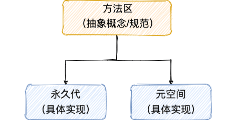
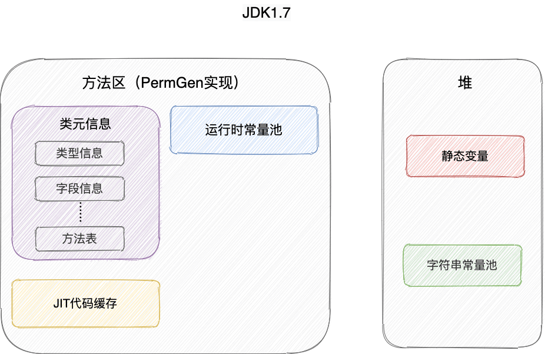
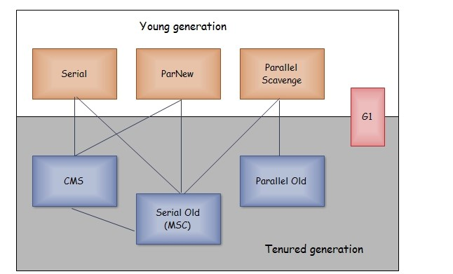
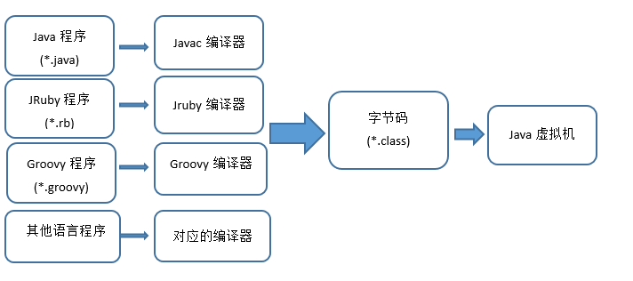
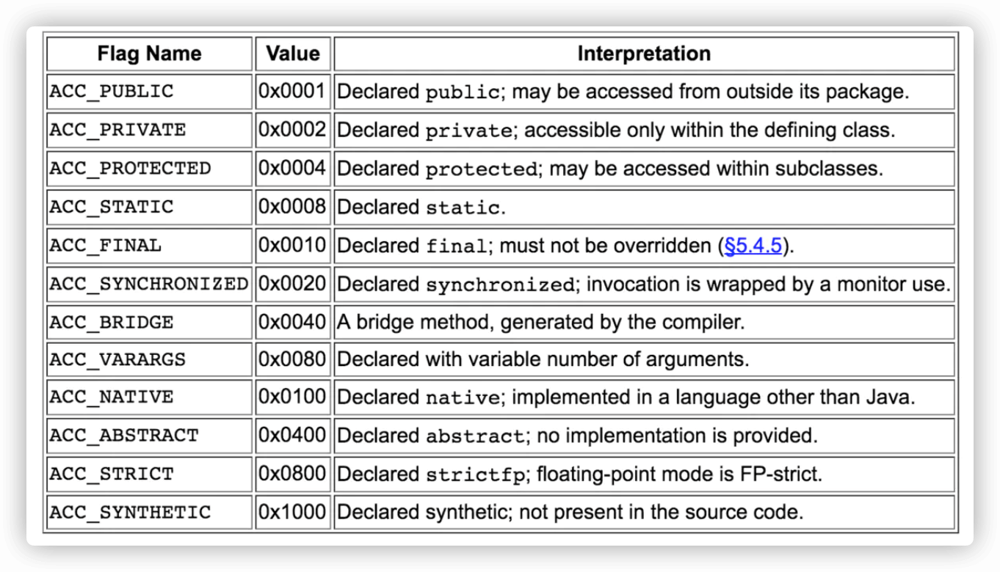

# JVM

## 一、内存区域

### 1.1 运行时数据区域:rocket:

> 参考链接：[JavaGuide](https://javaguide.cn/java/jvm/memory-area.html#%E8%BF%90%E8%A1%8C%E6%97%B6%E6%95%B0%E6%8D%AE%E5%8C%BA%E5%9F%9F)

JVM在执行Java程序的过程中会把它管理的内存划分成若干个不同的数据区域。JDK 1.8和之前的版本略有不同。

JDK 1.8之前：


JDK 1.8：


**线程私有**：程序计数器、虚拟机栈、本地方法栈。

**线程共享**：堆、方法区、直接内存（非运行时数据区域的一部分）。

JVM规范对于运行时数据区域的规定是相当宽松的。**以堆为例：堆可以是连续空间，也可以不连续；堆的大小可以固定，也可以在运行时按需扩展**。虚拟机实现者可以使用任何垃圾回收算法管理堆，甚至完全不进行垃圾收集也是可以的。

#### 程序计数器

程序计数器是一块较小的内存空间，可以看作是**当前线程所执行的字节码的行号指示器**。字节码解释器工作时通过改变这个计数器的值来选取下一条需要执行的字节码指令，分支、循环、跳转、异常处理、线程恢复等功能都需要依赖这个计数器来完成。另外，**为了线程切换后能恢复到正确的执行位置，每个线程都需要有一个独立的程序计数器**，各线程之间计数器互不影响，独立存储，称这类内存区域为“线程私有”的内存。

程序计数器主要有**两个作用**：

- 字节码解释器通过改变程序计数器来依次读取指令，从而**实现代码的流程控制**，如：顺序执行、选择、循环、异常处理。
- 在多线程的情况下，**程序计数器用于记录当前线程执行的位置**，从而当线程被切换回来的时候能够知道该线程上次运行到哪儿了。

注意：**程序计数器是唯一一个不会出现`OutOfMemoryError`的内存区域**，它的生命周期随着线程的创建而创建，随着线程的结束而死亡。

#### 虚拟机栈

与程序计数器一样，虚拟机栈（后文简称栈）也是线程私有的，它的生命周期和线程相同，随着线程的创建而创建，随着线程的死亡而死亡。

栈绝对算得上JVM运行时数据区域的一个核心，除了一些本地方法调用是通过本地方法栈实现的，其他所有Java方法调用都是通过栈来实现的（也需要和其他运行时数据区域比如程序计数器配合）。

方法调用的数据需要通过栈进行传递，**每一次方法调用都会有一个对应的栈帧被压入栈中，每一个方法调用结束后，都会有一个栈帧被弹出**。

栈由一个个栈帧组成，而每个栈帧中都拥有：**局部变量表、操作数栈、动态链接、方法返回地址**。和数据结构上的栈类似，两者都是先进后出的数据结构，只支持出栈和入栈两种操作。


- **局部变量表**主要存放了编译期可知的各种数据类型（`boolean`、`byte`、`char`、`short`、`int`、`float`、`long`、`double`）、对象引用（`reference`类型，它不同于对象本身，可能是一个指向对象起始地址的引用指针，也可能是指向一个代表对象的句柄或其他与此对象相关的位置）。

- **操作数栈**主要作为方法调用的中转站使用，**用于存放方法执行过程中产生的中间计算结果**。另外，计算过程中产生的临时变量也会放在操作数栈中。

- **动态链接**主要服务于一个方法需要调用其他方法的场景。在Java源文件被编译成字节码文件时，所有的变量和方法引用都作为符号引用保存在`.class`文件的常量池里。当一个方法要调用其他方法，需要将常量池中指向方法的符号引用转化为其在内存地址中的直接引用。动态链接的作用就是**为了将符号引用转换为调用方法的直接引用**。

  

  栈空间虽然不是无限的，但一般正常调用的情况下是不会出现问题的。不过，如果函数调用陷入无限循环的话，就会导致栈中被压入太多栈帧而占用太多空间，导致栈空间过深。**那么当线程请求栈的深度超过当前Java虚拟机栈的最大深度的时候，就抛出`StackOverFlowError`错误**。

- Java方法有两种返回方式，一种是`return`语句正常返回，一种是抛出异常。不管哪种返回方式，都会导致栈帧被弹出。也就是说，**栈帧随着方法调用而创建，随着方法结束而销毁。无论方法正常完成还是异常完成都算作方法结束**。

除了`StackOverFlowError`错误之外，栈还可能会出现`OutOfMemoryError`错误，这是因为如果栈的内存大小可以动态扩展， 虚拟机在动态扩展栈时无法申请到足够的内存空间，就会抛出`OutOfMemoryError`异常。

**简单总结一下程序运行中栈可能会出现两种错误**：

- `StackOverFlowError`：若栈的内存大小不允许动态扩展，那么当线程请求栈的深度超过当前栈的最大深度的时候，就抛出`StackOverFlowError`错误。
- `OutOfMemoryError`：如果栈的内存大小可以动态扩展，在动态扩展栈时无法申请到足够的内存空间，则抛出`OutOfMemoryError`异常。

#### 本地方法栈

和虚拟机栈所发挥的作用非常相似，区别是：**虚拟机栈为虚拟机执行Java方法（也就是字节码）服务，而本地方法栈则为虚拟机使用到的本地方法服务**。在HotSpot虚拟机中本地方法栈和虚拟机栈合二为一。

本地方法被执行的时候，在本地方法栈也会创建一个栈帧，用于存放该本地方法的局部变量表、操作数栈、动态链接、出口信息。

方法执行完毕后相应的栈帧也会出栈并释放内存空间，也会出现`StackOverFlowError`和`OutOfMemoryError`两种错误。

#### 堆

JVM所管理的内存中最大的一块，Java堆是所有线程共享的一块内存区域，在虚拟机启动时创建。**此内存区域的唯一目的就是存放对象实例，几乎所有的对象实例以及数组都在这里分配内存**。

Java世界中**“几乎”**所有的对象都在堆中分配，但是随着JIT编译器的发展与逃逸分析技术逐渐成熟，栈上分配、标量替换优化技术将会导致一些微妙的变化，所有的对象都分配到堆上也渐渐变得不那么“绝对”了。**从 JDK 1.7开始已经默认开启逃逸分析，如果某些方法中的对象引用没有被返回或者未被外面使用（也就是未逃逸出去），那么对象可以直接在栈上分配内存**。

Java堆是垃圾收集器管理的主要区域，因此也被称作**GC堆（Garbage Collected Heap）**。从垃圾回收的角度，由于现在收集器基本都采用分代垃圾收集算法，所以Java堆还可以细分为：新生代和老年代；再细致一点的有：Eden、Survivor、Old等空间。**进一步划分的目的是更好地回收内存，或者更快地分配内存**。

在JDK 1.7及之前，堆内存通常被分为三部分：

- 新生代内存（Young Generation）
- 老生代（Old Generation）
- 永久代（Permanent Generation）


**JDK 1.8版本之后PermGen（永久代）已被Metaspace（元空间）取代，元空间使用的是直接内存**。

**堆这里最容易出现的就是`OutOfMemoryError`错误，并且出现这种错误之后的表现形式还会有几种**，比如：

- `java.lang.OutOfMemoryError: GC Overhead Limit Exceeded`：当JVM花太多时间执行垃圾回收并且只能回收很少的堆空间时，就会发生此错误。
- `java.lang.OutOfMemoryError: Java heap space`：假如在创建新的对象时，堆内存中的空间不足以存放新创建的对象就会引发此错误。（和配置的最大堆内存有关，且受制于物理内存大小。最大堆内存可通过`-Xmx`参数配置，若没有特别配置，将会使用默认值）

#### 方法区

方法区属于JVM运行时数据区域的一块**逻辑区域**，是各个线程共享的内存区域。

《Java虚拟机规范》只是规定了有方法区的概念及其作用，方法区到底要如何实现那是虚拟机自己需要考虑的事情。也就是说，**在不同的虚拟机上，方法区的实现是不同的**。

当虚拟机要使用一个类时，它需要读取并解析`.class`文件获取相关信息，再将信息存入到方法区。方法区会存储已被虚拟机加载的**类信息、字段信息、方法信息、常量、静态变量、即时编译器编译后的代码缓存等数据**。

**方法区和永久代以及元空间是什么关系呢**？方法区和永久代以及元空间的关系很像Java中接口和类的关系，类实现了接口，**这里的类就可以看作是永久代和元空间，接口可以看作是方法区**，也就是说永久代以及元空间是HotSpot虚拟机对虚拟机规范中方法区的两种实现方式。并且，永久代是JDK 1.8之前的方法区实现，JDK 1.8及以后方法区的实现变成了元空间。



##### 为什么要将永久代替换为元空间呢？

- 整个永久代有一个JVM本身设置的固定大小上限，无法进行调整，而元空间使用的是**直接内存**，受本机可用内存的限制，**虽然元空间仍旧可能溢出，但是比原来出现的几率会更小**。当元空间溢出时会出现`java.lang.OutOfMemoryError: MetaSpace`错误。可以使用`-XX：MaxMetaspaceSize`标志设置最大元空间大小，默认值为`unlimited`，这意味着它只受系统内存的限制。`-XX：MetaspaceSize`标志定义元空间的初始大小，如果未指定此标志，则会根据运行时的应用程序需求动态地重新调整大小。
- 元空间里面存放的是类的元数据，这样加载多少类的元数据就不由`MaxPermSize`控制了，而是由系统的实际可用空间来控制，这样能加载的类就更多了。
- 在JDK 1.8，合并HotSpot和JRockit的代码时，JRockit从来没有一个叫永久代的东西，合并之后就没有必要额外地设置一个永久代的地方了。

#### 运行时常量池

`.class`文件中除了有类的版本、字段、方法、接口等描述信息外，还有用于存放编译期生成的各种字面量（Literal）和符号引用（Symbolic Reference）的**常量池表（Constant Pool Table）**。

**常量池表会在类加载后存放到方法区的运行时常量池中**。运行时常量池的功能类似于传统编程语言的符号表，尽管它包含了比典型符号表更广泛的数据。

**既然运行时常量池是方法区的一部分，自然受到方法区内存的限制，当常量池无法再申请到内存时会抛出`OutOfMemoryError`错误**。

#### 字符串常量池

字符串常量池是JVM为了提升性能和减少内存消耗，针对字符串（`String`类）专门开辟的一块区域，主要目的是为了**避免字符串的重复创建**。

HotSpot 虚拟机中字符串常量池的实现是`src/hotspot/share/classfile/stringTable.cpp`，`StringTable`本质上就是一个`HashSet`，容量为`StringTableSize`（可以通过`-XX:StringTableSize`参数来设置）。

**`StringTable`中保存的是字符串对象的引用，字符串对象的引用指向堆中的字符串对象**。

JDK 1.7之前，字符串常量池存放在永久代。JDK 1.7字符串常量池和静态变量从永久代移动了Java堆中。





##### 为什么要将字符串常量池移动到堆中？

主要是因为永久代（方法区实现）的GC回收效率太低，只有在整堆收集（Full GC）的时候才会被收集。Java程序中通常会有大量的被创建的字符串等待回收，**将字符串常量池放到堆中，能够更高效及时地回收字符串内存**。

#### 直接内存

直接内存并不是虚拟机运行时数据区的一部分，也不是虚拟机规范中定义的内存区域，但是这部分内存也被频繁地使用，而且也可能导致`OutOfMemoryError`错误出现。

JDK 1.4中新加入的**NIO（New Input/Output）类**，引入了一种基于**通道（Channel）与缓存区（Buffer）的I/O方式**，它可以直接使用本地函数库直接分配堆外内存，然后通过一个存储在Java堆中的`DirectByteBuffer`对象作为这块内存的引用进行操作，这样就能在一些场景中显著提高性能，因为**避免了在Java堆和本地堆之间来回复制数据**。

本机直接内存的分配不会受到Java堆的限制，但是既然是内存就会受到本机总内存大小以及处理器寻址空间的限制。

### 1.2 HotSpot虚拟机对象:airplane:

> 参考链接：[JavaGuide](https://javaguide.cn/java/jvm/memory-area.html#hotspot-%E8%99%9A%E6%8B%9F%E6%9C%BA%E5%AF%B9%E8%B1%A1%E6%8E%A2%E7%A7%98)

#### 对象的创建

1. **类加载检查**：虚拟机遇到一条`new`指令时，**首先将去检查这个指令的参数是否能在常量池中定位到这个类的符号引用，并且检查这个符号引用代表的类是否已被加载过、解析和初始化过。如果没有，那必须先执行相应的类加载过程**；

2. **分配内存**：在类加载检查通过后，接下来虚拟机将为新生对象分配内存。**对象所需的内存大小在类加载完成后便可确定，为对象分配空间的任务等同于把一块确定大小的内存从Java堆中划分出来**。分配方式有**指针碰撞**和**空闲列表**两种，选择哪种分配方式**由Java堆是否规整决定**，而**Java堆是否规整又由所采用的垃圾收集器是否带有压缩整理功能决定**。**内存分配的两种方式**：

   - **指针碰撞**：
     - 适用场合：堆内存**规整**（即没有内存碎片）的情况下。
     - 原理：用过的内存全部整合到一边，没有用过的内存放在另一边，中间有一个分界指针，只需要向着没用过的内存方向将该指针移动对象内存大小位置即可。
     - 使用该分配方式的GC收集器：Serial、ParNew。
   - **空闲列表**：
     - 适用场合：堆内存不规整的情况下。
     - 原理：虚拟机会维护一个列表，该列表中会记录哪些内存块是可用的，在分配的时候，找一块足够大的内存块来划分给对象实例，最后更新列表记录。
     - 使用该分配方式的GC收集器：CMS

   选择以上两种方式中的哪一种，**取决于Java堆内存是否规整，而Java堆内存是否规整取决于GC收集器的算法是“标记—整理”，还是“标记—清除”，值得注意的是，“标记—复制”算法内存也是规整的**。

   **内存分配并发问题**：在创建对象的时候有一个很重要的问题，就是线程安全，因为在实际开发过程中，创建对象是很频繁的事情，作为虚拟机来说，必须要保证线程是安全的，通常来讲，虚拟机采用两种方式来保证线程安全：

   - **CAS+失败重试**：CAS是乐观锁的一种实现方式。所谓乐观锁就是，每次不加锁而是假设没有冲突而去完成某项操作，如果因为冲突失败就重试，直到成功为止。**虚拟机采用CAS配上失败重试的方式保证更新操作的原子性**。
   - **TLAB**：为每一个线程预先在Eden区分配一块儿内存，JVM在给线程中的对象分配内存时，首先在TLAB分配，当对象大于TLAB中的剩余内存或TLAB的内存已用尽时，再采用上述的CAS进行内存分配。

3. **初始化零值**：内存分配完成后，虚拟机需要将分配到的内存空间都初始化为**零值（不包括对象头）**，这一步操作保证了对象的实例字段在Java代码中可以不赋初始值就直接使用，程序能访问到这些字段的数据类型所对应的零值；

4. **设置对象头**：初始化零值完成之后，**虚拟机要对对象进行必要的设置**，例如这个对象是哪个类的实例、如何才能找到类的元数据信息、对象的哈希码、对象的GC分代年龄等信息。**这些信息存放在对象头中**。另外，根据虚拟机当前运行状态的不同，如是否启用偏向锁等，对象头会有不同的设置方式；

5. **执行`init`方法**：在上面工作都完成之后，**从虚拟机的视角来看，一个新的对象已经产生了，但从Java程序的视角来看，对象创建才刚开始**，`<init>`方法还没有执行，所有的字段都还为零。所以一般来说，执行`new`指令之后会接着执行`<init>`方法，把对象按照程序员的意愿进行初始化，这样一个真正可用的对象才算完全产生出来。

#### 对象的内存布局

在Hotspot虚拟机中，对象在内存中的布局可以分为3块区域：**对象头**、**实例数据**和**对齐填充**。

- **对象头**：Hotspot虚拟机的对象头包括两部分信息，**第一部分用于存储对象自身的运行时数据**（哈希码、GC分代年龄、锁状态标志等等），**另一部分是类型指针**，即对象指向它的类元数据的指针，虚拟机通过这个指针来确定这个对象是哪个类的实例。
- 实例数据：**这个部分是对象真正存储的有效信息**，也是在程序中所定义的各种类型的字段内容。
- 对齐填充：**这个部分不是必然存在的，也没有什么特别的含义，仅仅起占位作用。** 因为Hotspot虚拟机的自动内存管理系统要求对象起始地址必须是8字节的整数倍，换句话说就是对象的大小必须是8字节的整数倍，而对象头部分正好是8字节的倍数（1倍或2倍），因此，**当对象实例数据部分没有对齐时，就需要通过对齐填充来补全**。

#### 对象的访问定位

建立对象就是为了使用对象，Java程序通过栈上的`reference`数据来操作堆上的具体对象。对象的访问方式由虚拟机实现而定，目前主流的访问方式有：**使用句柄和直接指针**。

- **句柄**：如果使用句柄的话，那么Java堆中将会划分出一块内存来作为句柄池，`reference`中存储的就是对象的句柄地址，而句柄中包含了对象实例数据与类型数据各自的具体地址信息。

  

- **直接指针**：如果使用直接指针访问，那么Java堆对象的布局中就必须考虑如何放置访问类型数据的相关信息，而`reference`中存储的直接就是对象的地址。

  

这两种对象访问方式各有优势。使用句柄来访问的最大好处是**`reference`中存储的是稳定的句柄地址**，在对象被移动时只会改变句柄中的实例数据指针，而`reference`本身不需要修改；使用直接指针访问方式最大的好处就是**速度快**，它节省了一次指针定位的时间开销。HotSpot虚拟机主要使用的就是这种方式来进行对象访问。

## 二、垃圾回收

### 2.1 内存分配和回收原则:rocket:

> 参考链接：[JavaGuide](https://javaguide.cn/java/jvm/jvm-garbage-collection.html#%E5%86%85%E5%AD%98%E5%88%86%E9%85%8D%E5%92%8C%E5%9B%9E%E6%94%B6%E5%8E%9F%E5%88%99)

#### 对象优先在Eden区分配

大多数情况下，对象在新生代中Eden区分配。当Eden区没有足够空间进行分配时，**虚拟机将发起一次Minor GC**。

#### 大对象直接进入老年代

**大对象就是需要大量连续内存空间的对象（比如字符串、数组）**。大对象直接进入老年代主要是**为了避免为大对象分配内存时，由于分配担保机制带来的复制而降低效率**。

#### 长期存活的对象进入老年代

既然虚拟机采用了分代收集的思想来管理内存，那么内存回收时就必须能识别哪些对象应放在新生代，哪些对象应放在老年代中。为了做到这一点，**虚拟机给每个对象一个对象年龄（Age）计数器**。

大部分情况，对象都会首先在Eden区域分配。如果对象在Eden出生并经过第一次Minor GC后仍然能够存活，并且能被Survivor容纳的话，将被移动到Survivor空间（s0或者s1）中，并将对象年龄设为1（Eden区->Survivor区后对象的初始年龄变为1）。

对象在Survivor中每熬过一次Minor GC，年龄就增加1岁，当它的年龄增加到晋升到老年代的年龄阈值（`-XX:MaxTenuringThreshold`），就会晋升到老年代中。

**补充**：

> 参考链接：[Java官方文档](https://docs.oracle.com/javase/8/docs/technotes/tools/unix/java.html)

Hotspot遍历所有对象时，按照年龄从小到大对其所占用的大小进行累积，当累积的某个年龄大小超过了Survivor区的50%时（默认值50%，可以通过`-XX:TargetSurvivorRatio=percent`来设置），**取这个年龄和`-xx:MaxTenuringThreshold`中更小的一个值作为新的晋升年龄阈值**。关于参数`-XX:MaxTenuringThreshold=threshold`，最大值是15（for parallel collector），CMS收集器下为6。

#### 主要进行GC的区域

针对HotSpot VM的实现，它里面的GC其实准确分类只有两大种：

- 部分收集（Partial GC）：
  - 新生代收集（Minor GC / Young GC）：只对新生代进行垃圾收集。
  - 老年代收集（Major GC / Old GC）：只对老年代进行垃圾收集。
  - 混合收集（Mixed GC）：对整个新生代和部分老年代进行垃圾收集。
- 整堆收集（Full GC）：收集整个Java堆和方法区。

#### 空间分配担保

空间分配担保是为了**确保在Minor GC之前老年代本身还有容纳新生代所有对象的剩余空间**。

- JDK 6 Update 24之前，在发生Minor GC之前，虚拟机必须先检查**老年代最大可用的连续空间是否大于新生代所有对象总空间**，如果这个条件成立，那这一次Minor GC可以确保是安全的。如果不成立，则虚拟机会先查看`-XX:HandlePromotionFailure`参数的设置值是否允许担保失败（Handle Promotion Failure）。如果允许，那会继续检查**老年代最大可用的连续空间是否大于历次晋升到老年代对象的平均大小**，如果大于将尝试进行一次Minor GC，尽管这次Minor GC是有风险的；如果小于，或者`-XX: HandlePromotionFailure`设置不允许冒险，那这时就要改为进行一次Full GC。
- JDK 6 Update 24之后的规则变为**只要老年代的连续空间大于新生代对象总大小或者历次晋升的平均大小**，就会进行Minor GC，否则将进行Full GC。

### 2.2 死亡对象判断方法:rocket:

> 参考链接：[JavaGuide](https://javaguide.cn/java/jvm/jvm-garbage-collection.html#%E6%AD%BB%E4%BA%A1%E5%AF%B9%E8%B1%A1%E5%88%A4%E6%96%AD%E6%96%B9%E6%B3%95)

#### 引用计数法

给对象中添加一个引用计数器：

- 每当有一个地方引用它，计数器就加1；
- 当引用失效，计数器就减1；
- 任何时候，计数器为0的对象就是不可能再被使用的。

这个方法实现简单，效率高，但是目前主流的虚拟机中并没有选择这个算法来管理内存，其最主要的原因是**它很难解决对象之间相互循环引用的问题**。

所谓对象之间的相互引用问题，就是除了对象`objA`和`objB`相互引用着对方之外，这两个对象之间再无任何引用。但是因为互相引用对方，导致它们的引用计数器都不为0，于是引用计数算法无法通知GC回收器回收它们。

#### 可达性分析算法

这个算法的基本思想就是通过将**一系列称为“GC Roots”的对象作为起点**，从这些节点开始向下搜索，节点所走过的路径称为引用链，当一个对象到GC Roots没有任何引用链相连的话，则证明此对象是不可用的，需要被回收。

图中的`Object 6 ~ Object 10`之间虽有引用关系，但它们到GC Roots**不可达**，因此为需要被回收的对象。


**哪些对象可以作为GC Roots呢**？

- 虚拟机栈（栈帧中的本地变量表）中引用的对象。
- 本地方法栈（本地方法）中引用的对象。
- 方法区中类静态属性引用的对象。
- 方法区中常量引用的对象。
- 所有被同步锁持有的对象。

**对象可以被回收，就代表一定会被回收吗**？

即使在可达性分析法中不可达的对象，也并非是“非死不可”的，这时候它们暂时处于“缓刑阶段”，要真正宣告一个对象死亡，至少要经历两次标记过程：可达性分析法中不可达的对象**被第一次标记**并且进行一次筛选，筛选的条件是此对象是否有必要执行`finalize`方法。当对象没有覆盖`finalize`方法，或`finalize`方法已经被虚拟机调用过时，虚拟机将这两种情况视为没有必要执行；被判定为需要执行的对象将会被放在一个队列中进行**第二次标记**，除非这个对象与引用链上的任何一个对象建立关联，否则就会被真的回收。

#### 引用类型总结

无论是通过引用计数法判断对象引用数量，还是通过可达性分析法判断对象的引用链是否可达，判定对象的存活都与“引用”有关。

##### 强引用（Strong Reference）

以前使用的大部分引用实际上都是强引用，这是使用最普遍的引用。如果一个对象具有强引用，那就类似于**必不可少的生活用品**，垃圾回收器绝不会回收它。当内存空间不足，Java虚拟机宁愿抛出`OutOfMemoryError`错误，使程序异常终止，也不会靠随意回收具有强引用的对象来解决内存不足问题。

##### 软引用（Soft Reference）

如果一个对象只具有软引用，那就类似于**可有可无的生活用品**。如果内存空间足够，垃圾回收器就不会回收它，如果内存空间不足了，就会回收这些对象的内存。只要垃圾回收器没有回收它，该对象就可以被程序使用。软引用可用来实现内存敏感的高速缓存。软引用可以和一个引用队列（Reference Queue）联合使用，如果软引用所引用的对象被垃圾回收，JVM就会把这个软引用加入到与之关联的引用队列中。

##### 弱引用（Weak Reference）

弱引用与软引用的区别在于：**只具有弱引用的对象拥有更短暂的生命周期**。在垃圾回收器线程扫描它所管辖的内存区域的过程中，一旦发现了只具有弱引用的对象，不管当前内存空间足够与否，都会回收它的内存。不过，由于垃圾回收器是一个优先级很低的线程， 因此不一定会很快发现那些只具有弱引用的对象。弱引用可以和一个引用队列（Reference Queue）联合使用，如果弱引用所引用的对象被垃圾回收，JVM就会把这个弱引用加入到与之关联的引用队列中。

##### 虚引用（Phantom Reference）

"虚引用"顾名思义，就是形同虚设，与其他几种引用都不同，虚引用并不会决定对象的生命周期。如果一个对象仅持有虚引用，那么它就和没有任何引用一样，在任何时候都可能被垃圾回收。**虚引用主要用来跟踪对象被垃圾回收的活动**。

**虚引用与软引用和弱引用的一个区别在于**：虚引用必须和引用队列（Reference Queue）联合使用。当垃圾回收器准备回收一个对象时，如果发现它还有虚引用，就会在回收对象的内存之前，把这个虚引用加入到与之关联的引用队列中。程序可以通过判断引用队列中是否已经加入了虚引用，来了解被引用的对象是否将要被垃圾回收。程序如果发现某个虚引用已经被加入到引用队列，那么就可以在所引用的对象的内存被回收之前采取必要的行动。

特别注意，在程序设计中一般很少使用弱引用与虚引用，使用软引用的情况较多，这是因为**软引用可以加速JVM对垃圾内存的回收速度，可以维护系统的运行安全，防止内存溢出等问题**。

#### 如何判断一个常量是废弃常量？

假如在字符串常量池中存在字符串`abc`，如果当前**没有任何`String`对象引用该字符串常量**的话，就说明常量`abc`就是废弃常量，如果这时发生内存回收的话而且有必要的话，`abc`就会被系统清理出常量池了。

#### 如何判断一个类是无用的类？

类需要**同时满足**下面3个条件才能算是**“无用的类”**：

- 该类所有的实例都已经被回收，也就是Java堆中不存在该类的任何实例。
- 加载该类的`ClassLoader`已经被回收。
- 该类对应的`java.lang.Class`对象没有在任何地方被引用，无法在任何地方通过反射访问该类的方法。

虚拟机可以对满足上述3个条件的无用类进行回收，这里说的仅仅是“可以”，而并不是和对象一样不使用了就会必然被回收。

### 2.3 垃圾收集算法:rocket:

> 参考链接：[JavaGuide](https://javaguide.cn/java/jvm/jvm-garbage-collection.html#%E5%9E%83%E5%9C%BE%E6%94%B6%E9%9B%86%E7%AE%97%E6%B3%95)
>
> 图的参考链接：[Java全栈知识体系](https://pdai.tech/md/java/jvm/java-jvm-gc.html#%E5%9E%83%E5%9C%BE%E5%9B%9E%E6%94%B6%E7%AE%97%E6%B3%95)

#### 标记—清除


算法分为“标记”和“清除”阶段：首先标记出所有不需要回收的对象，在标记完成后统一回收掉所有没有被标记的对象。它是最基础的收集算法，后续的算法都是对其不足进行改进得到。这种垃圾收集算法会带来两个明显的问题：

- **效率问题**。
- **空间问题（标记清除后会产生大量不连续的碎片）**。

#### 标记—复制


为了解决效率问题，“标记—复制”收集算法出现了。它可以将内存分为大小相同的两块，每次使用其中的一块。**当这一块的内存使用完后，就将还存活的对象复制到另一块去，然后再把使用的空间一次清理掉。这样就使每次的内存回收都是对内存区间的一半进行回收**。

#### 标记—整理


根据老年代的特点提出的一种标记算法，标记过程仍然与“标记-清除”算法一样，但后续步骤不是直接对可回收对象回收，而是让所有存活的对象向一端移动，然后直接清理掉端边界以外的内存。

#### 分代收集

当前虚拟机的垃圾收集都采用分代收集算法，这种算法没有什么新的思想，只是根据对象存活周期的不同将内存分为几块。一般将Java堆分为新生代和老年代，这样就可以**根据各个年代的特点选择合适的垃圾收集算法**。

比如在新生代中，每次收集都会有大量对象死去，所以**可以选择”标记-复制“算法，只需要付出少量对象的复制成本就可以完成每次垃圾收集**；而老年代的对象存活几率是比较高的，而且没有额外的空间对它进行分配担保，所以**必须选择“标记—清除”或“标记—整理”算法进行垃圾收集**。

### 2.4 垃圾收集器:rocket:

> 参考链接：[JavaGuide](https://javaguide.cn/java/jvm/jvm-garbage-collection.html#%E5%9E%83%E5%9C%BE%E6%94%B6%E9%9B%86%E5%99%A8)
>
> 图参考链接：[Java全栈知识体系](https://pdai.tech/md/java/jvm/java-jvm-gc.html#%E5%9E%83%E5%9C%BE%E6%94%B6%E9%9B%86%E5%99%A8)



以上是HotSpot虚拟机中的7个垃圾收集器，连线表示垃圾收集器可以配合使用。

- 单线程与多线程：单线程指的是垃圾收集器只使用一个线程进行收集，而多线程使用多个线程。
- 串行与并行：串行指的是**垃圾收集器与用户程序交替执行**，这意味着在执行垃圾收集的时候需要停顿用户程序；并行指的是垃圾收集器和用户程序同时执行。**除了CMS和G1之外，其它垃圾收集器都是以串行的方式执行**。

#### Serial收集器

Serial（串行）收集器是最基本、历史最悠久的垃圾收集器。从名字就可以看出这个收集器是一个单线程收集器了。它的**“单线程”**的意义不仅仅意味着它只会**使用一条垃圾收集线程去完成垃圾收集工作**，更重要的是它**在进行垃圾收集工作的时候必须暂停其他所有的工作线程**（STW），直到它收集结束。**新生代采用标记—复制算法，老年代采用标记—整理算法**。


虚拟机的设计者们当然知道STW带来的不良用户体验，所以在后续的垃圾收集器设计中停顿时间在不断缩短（仍然还有停顿，寻找最优秀的垃圾收集器的过程仍然在继续）。

但是Serial收集器有没有优于其他垃圾收集器的地方呢？当然有，它**简单而高效（与其他收集器的单线程相比）**。Serial收集器由于没有线程交互的开销，自然可以获得很高的单线程收集效率。Serial收集器对于运行在Client模式下的虚拟机来说是个不错的选择。

#### ParNew收集器


ParNew收集器其实就是Serial收集器的多线程版本，除了**使用多线程进行垃圾收集**外，其余行为（控制参数、收集算法、回收策略等等）和Serial收集器完全一样。它是许多运行在Server模式下的虚拟机的首要选择，除了Serial收集器外，只有它能与CMS收集器配合工作。

#### Parallel Scavenge收集器

Parallel Scavenge收集器看上去和ParNew一样，但它的关注点是**吞吐量**（高效率地利用CPU）。CMS等垃圾收集器的关注点更多的是用户线程的停顿时间（提高用户体验）。所谓吞吐量就是CPU中用于运行用户代码的时间与CPU总消耗时间的比值。**新生代采用标记—复制算法，老年代采用标记—整理算法**。

Parallel Scavenge收集器提供了很多参数供用户找到最合适的停顿时间或最大吞吐量，如果对于收集器运作不太了解，手工优化存在困难的时候，使用Parallel Scavenge收集器配合自适应调节策略，把内存管理优化交给虚拟机去完成也是一个不错的选择。**它是JDK 1.8的默认收集器，JDK 1.8默认使用的Parallel Scavenge+Parallel Old**。

#### Serial Old收集器

**Serial收集器的老年代版本**，它同样是一个单线程收集器。它主要有两大用途：一种用途是在JDK 1.5及以前的版本中与Parallel Scavenge收集器搭配使用，另一种用途是作为CMS收集器的后备方案。

#### Parallel Old收集器

**Parallel Scavenge收集器的老年代版本**。使用多线程和“标记-整理”算法。在注重吞吐量以及 CPU 资源的场合，都可以优先考虑Parallel Scavenge收集器和Parallel Old收集器。

#### CMS收集器

CMS（Concurrent Mark Sweep）收集器是一种以**获取最短回收停顿时间**为目标的收集器。它非常符合在注重用户体验的应用上使用。它是HotSpot虚拟机第一款真正意义上的并发收集器，它第一次实现了让垃圾收集线程与用户线程（基本上）同时工作。

从名字中的**Mark Sweep**可以看出，CMS收集器是基于**“标记-清除”算法**实现的，它的运作过程相比于前面几种垃圾收集器来说更加复杂一些，整个过程分为四个步骤：

1. **初始标记**：暂停所有其他线程，并记录下直接与root相连的对象，速度很快；
2. **并发标记**：同时开启GC和用户线程，用一个闭包结构去记录可达对象。但在这个阶段结束，**这个闭包结构并不能保证包含当前所有的可达对象**。因为用户线程可能会不断的更新引用域，所以GC线程无法保证可达性分析的实时性。所以这个算法里**会跟踪记录这些发生引用更新的地方**；
3. **重新标记**：重新标记阶段就是**为了修正并发标记期间因为用户程序继续运行而导致标记产生变动的那一部分对象的标记记录**，这个阶段的停顿时间一般会比初始标记阶段的时间稍长，远远比并发标记阶段时间短；
4. **并发清除**：开启用户线程，同时GC线程开始对未标记的区域做清扫。


在整个过程中耗时最长的并发标记和并发清除过程中，**收集器线程都可以与用户线程一起工作，不需要进行停顿**。具有以下缺点：

> 参考链接：[Java全栈知识体系](https://pdai.tech/md/java/jvm/java-jvm-gc.html#6-cms-%E6%94%B6%E9%9B%86%E5%99%A8)

- **吞吐量低**，低停顿时间是以牺牲吞吐量为代价的，导致CPU利用率不够高。
- 无法处理**浮动垃圾**，可能出现`Concurrent Mode Failure`。浮动垃圾是指**并发清除阶段由于用户线程继续运行而产生的垃圾，这部分垃圾只能到下一次GC时才能进行回收**。由于浮动垃圾的存在，因此需要预留出一部分内存，意味着**CMS收集不能像其它收集器那样等待老年代快满的时候再回收**。如果预留的内存不够存放浮动垃圾，就会出现`Concurrent Mode Failure`，这时虚拟机将临时启用Serial Old来替代CMS。
- “标记—清除”算法导致的**空间碎片**，**往往出现老年代空间剩余，但无法找到足够大连续空间来分配当前对象**，不得不提前触发一次Full GC。

#### G1收集器

> 参考链接：[Java全栈知识体系](https://pdai.tech/md/java/jvm/java-jvm-gc.html#7-g1-%E6%94%B6%E9%9B%86%E5%99%A8)

G1（Garbage-First），它是一款面向服务端应用的垃圾收集器，在多CPU和大内存的场景下有很好的性能。HotSpot开发团队赋予它的使命是未来可以替换掉CMS收集器。**G1可以直接对新生代和老年代一起回收**。G1把堆划分成多个大小相等的**独立区域（Region）**，新生代和老年代不再物理隔离。


通过引入Region的概念，将原来的一整块内存空间划分成多个的小空间，**使得每个小空间可以单独进行垃圾回收**。这种划分方法带来了很大的灵活性，使得可预测的停顿时间模型成为可能。**通过记录每个Region垃圾回收时间以及回收所获得的空间（这两个值是通过过去回收的经验获得），并维护一个优先列表，每次根据允许的收集时间，优先回收价值最大的Region**。

每个Region都有一个**Remembered Set**用来记录该Region对象的引用对象所在的Region。通过使用Remembered Set，**在做可达性分析的时候就可以避免全堆扫描**。


如果不计算维护Remembered Set的操作，G1收集器的运作大致可划分为以下几个步骤：

1. 初始标记；
2. 并发标记；
3. 最终标记：为了**修正在并发标记期间因用户程序继续运作而导致标记产生变动的那一部分标记记录**，虚拟机将这段时间对象变化记录在线程的Remembered Set Logs里面，最终标记阶段**需要把Remembered Set Logs的数据合并到Remembered Set中**。这阶段**需要停顿线程，但是可并行执行**；
4. 筛选回收：首先对各个Region中的回收价值和成本进行排序，根据用户所期望的GC停顿时间来制定回收计划。此阶段其实也可以做到与用户程序一起并发执行，但是因为只回收一部分Region，时间是用户可控制的，而且**停顿用户线程将大幅度提高收集效率**。

具备如下特点：

- 空间整合：整体来看是**基于“标记—整理”算法实现的收集器**，从局部（两个Region之间）上来看是**基于“复制”算法实现**的，这意味着**运行期间不会产生内存空间碎片**。
- 可预测的停顿：能让**使用者明确指定**在一个长度为M毫秒的时间片段内，消耗在GC上的时间不得超过N毫秒。

### 补充：Full GC的触发条件:airplane:

> 参考链接：[Java全栈知识体系](https://pdai.tech/md/java/jvm/java-jvm-gc.html#full-gc-%E7%9A%84%E8%A7%A6%E5%8F%91%E6%9D%A1%E4%BB%B6)

- **调用`System.gc()`**：只是建议虚拟机执行Full GC，但是虚拟机不一定真正去执行。**不建议使用这种方式**，而是让虚拟机管理内存。
- **老年代空间不足**：老年代空间不足的常见场景为前文所讲的**大对象直接进入老年代、长期存活的对象进入老年代**等。为了避免以上原因引起的Full GC，应当尽量不要创建过大的对象以及数组。除此之外，可以通过`-Xmn`虚拟机参数**调大新生代的大小，让对象尽量在新生代被回收掉，不进入老年代**；还可以通过`-XX:MaxTenuringThreshold`**调大对象进入老年代的年龄，让对象在新生代多存活一段时间**。
- **空间分配担保失败**：使用复制算法的Minor GC需要老年代的内存空间作担保，如果担保失败会执行一次Full GC。
- **JDK1.7及之前的永久代空间不足**：在JDK 1.7及以前，HotSpot虚拟机中的**方法区是用永久代实现的**，永久代中存放的是一些Class的信息、常量、静态变量等数据。**当系统中要加载的类、反射的类和调用的方法较多时**，永久代可能会被占满，**在未配置为采用CMS GC的情况下也会执行Full GC**。如果经过Full GC仍然回收不了，那么虚拟机会抛出`java.lang.OutOfMemoryError`。为避免以上原因引起的Full GC，可采用的方法为**增大永久代空间或转为使用CMS GC**。
- `Concurrent Mode Failure`：**执行CMS GC的过程中同时有对象要放入老年代，而此时老年代空间不足**（可能是GC过程中浮动垃圾过多导致暂时性的空间不足），便会报`Concurrent Mode Failure`错误，并触发Full GC。

## 三、类文件结构

### 3.1 概述

> 参考链接：[JavaGuide](https://javaguide.cn/java/jvm/class-file-structure.html#%E4%B8%80-%E6%A6%82%E8%BF%B0)

在Java中，**JVM可以理解的代码就叫做字节码（即扩展名为`.class`的文件），它不面向任何特定的处理器，只面向虚拟机**。Java 语言通过字节码的方式，在一定程度上解决了传统解释型语言执行效率低的问题，同时又保留了解释型语言可移植的特点。所以Java程序运行时比较高效，而且，由于字节码并不针对一种特定的机器，因此Java程序无须重新编译便可在多种不同操作系统的计算机上运行。



可以说`.class`文件是不同的语言在JVM之间的重要桥梁，同时也是Java支持跨平台很重要的一个原因。

### 3.2 `.class`文件结构总结:airplane:

> 参考链接：[JavaGuide](https://javaguide.cn/java/jvm/class-file-structure.html#%E4%BA%8C-class-%E6%96%87%E4%BB%B6%E7%BB%93%E6%9E%84%E6%80%BB%E7%BB%93)

根据JVM规范，`.class`文件通过`ClassFile`定义，`ClassFile`的结构如下：

```c
ClassFile {
    u4             magic; //Class 文件的标志
    u2             minor_version;//Class 的小版本号
    u2             major_version;//Class 的大版本号
    u2             constant_pool_count;//常量池的数量
    cp_info        constant_pool[constant_pool_count-1];//常量池
    u2             access_flags;//Class 的访问标记
    u2             this_class;//当前类
    u2             super_class;//父类
    u2             interfaces_count;//接口
    u2             interfaces[interfaces_count];//一个类可以实现多个接口
    u2             fields_count;//Class 文件的字段属性
    field_info     fields[fields_count];//一个类可以有多个字段
    u2             methods_count;//Class 文件的方法数量
    method_info    methods[methods_count];//一个类可以有个多个方法
    u2             attributes_count;//此类的属性表中的属性数
    attribute_info attributes[attributes_count];//属性表集合
}
```

通过分析`ClassFile`的内容，可以知道`.class`文件的组成。


#### 魔数（Magic Number）

```c
u4             magic; //Class 文件的标志
```

每个`.class`文件的头4个字节称为魔数（Magic Number），它唯一的作用就是**确定这个文件是否为一个能被虚拟机接收的`.class`文件**。

#### `.class`文件版本号（Minor&Major Version）

```c
u2             minor_version;//Class 的小版本号
u2             major_version;//Class 的大版本号
```

紧接着魔数的4个字节存储的是`.class`文件的版本号：第5和第6位是**次版本号**，第7和第8位是**主版本号**。

#### 常量池（Constant Pool）

```c
u2             constant_pool_count;//常量池的数量
cp_info        constant_pool[constant_pool_count-1];//常量池
```

紧接着主次版本号之后的是常量池，常量池的数量是`constant_pool_count-1`（**常量池计数器是从1开始计数的，将第0项常量空出来是有特殊考虑的，索引值为0代表“不引用任何一个常量池项”**）。

常量池主要存放两大常量：**字面量**和**符号引用**。字面量比较接近于Java语言层面的的常量概念，如**文本字符串**、**声明为`final`的常量值**等；而符号引用则属于编译原理方面的概念，包括下面3类常量：

- 类和接口的全限定名。
- 字段的名称和描述符。
- 方法的名称和描述符。

常量池中每一项常量都是一个表，这14种表有一个共同的特点：**开始第一位是一个u1类型的标志位，即`tag`，用来表示当前这个常量属于哪种常量类型**。

|               类型               | 标志（`tag`） |          描述          |
| :------------------------------: | :-----------: | :--------------------: |
|        CONSTANT_utf8_info        |       1       |   UTF-8编码的字符串    |
|      CONSTANT_Integer_info       |       3       |       整形字面量       |
|       CONSTANT_Float_info        |       4       |      浮点型字面量      |
|        CONSTANT_Long_info        |      ５       |      长整型字面量      |
|       CONSTANT_Double_info       |      ６       |   双精度浮点型字面量   |
|       CONSTANT_Class_info        |      ７       |   类或接口的符号引用   |
|       CONSTANT_String_info       |      ８       |    字符串类型字面量    |
|      CONSTANT_Fieldref_info      |      ９       |     字段的符号引用     |
|     CONSTANT_Methodref_info      |      10       |   类中方法的符号引用   |
| CONSTANT_InterfaceMethodref_info |      11       |  接口中方法的符号引用  |
|    CONSTANT_NameAndType_info     |      12       |  字段或方法的符号引用  |
|     CONSTANT_MothodType_info     |      16       |      标志方法类型      |
|    CONSTANT_MethodHandle_info    |      15       |      表示方法句柄      |
|   CONSTANT_InvokeDynamic_info    |      18       | 表示一个动态方法调用点 |

`.class`文件可以通过`javap -v class类名`指令来查看其常量池中的信息（`javap -v class类名-> temp.txt`：将结果输出到`temp.txt`文件）。

#### 访问标志（Access Flags）

```c
u2             access_flags;//Class 的访问标记
```

在常量池结束之后，紧接着的两个字节代表**访问标志**，这个标志用于识别一些类或者接口层次的访问信息，包括：这个`.class`是类还是接口、是否为`public`或`abstract`类型、如果是类的话是否声明为`final`等。

类访问和属性修饰符：


#### 当前类（This Class）、父类（Super Class）、接口（Interfaces）索引集合

```c
u2             this_class;//当前类
u2             super_class;//父类
u2             interfaces_count;//接口
u2             interfaces[interfaces_count];//一个类可以实现多个接口
```

**类索引用于确定这个类的全限定名，父类索引用于确定这个类的父类的全限定名**。由于Java语言单继承，所以父类索引只有一个，除了`java.lang.Object`之外，所有的类都有父类，因此除了`java.lang.Object`外，所有类的父类索引都不为0。

**接口索引集合用来描述这个类实现了那些接口**，这些被实现的接口将按 `implements`（如果这个类本身是接口的话则是`extends`）后的接口顺序从左到右排列在接口索引集合中。

#### 字段表集合（Fields）

```c
u2             fields_count;//Class 文件的字段的个数
field_info     fields[fields_count];//一个类会可以有个字段
```

**字段表（`field info`）用于描述接口或类中声明的变量**。字段包括类级变量以及实例变量，但不包括在方法内部声明的局部变量。字段表的结构：


- `access_flags`：字段的作用域（`public`、`private`、`protected`修饰符）、是实例变量还是类变量（`static`修饰符）、可否被序列化（`transient`修饰符）、可变性（`final`）、可见性（`volatile`修饰符）。

  `access_flags`取值：

  

- `name_index`：对常量池的引用，表示字段的名称。

- `descriptor_index`：对常量池的引用，表示字段和方法的描述符。

- `attributes_count`：一个字段还会拥有一些额外的属性，`attributes_count`存放属性的个数。

- `attributes[attributes_count]`：存放具体属性的具体内容。

上述这些信息中，各个修饰符都是布尔值，要么有某个修饰符，要么没有，很适合使用标志位来表示；而字段叫什么名字、字段被定义为什么数据类型这些都是无法固定的，只能引用常量池中常量来描述。

#### 方法表集合（Methods）

```c
u2             methods_count;//Class 文件的方法的数量
method_info    methods[methods_count];//一个类可以有个多个方法
```

`methods_count`表示方法的数量，而`method_info`表示方法表。

**`.class`文件存储格式中对方法的描述与对字段的描述几乎采用了完全一致的方式**。方法表的结构如同字段表一样，依次包括了访问标志、名称索引、描述符索引、属性表集合等。方法表的结构：


`access_flags`取值：



#### 属性表集合（Attributes）

```c
u2             attributes_count;//此类的属性表中的属性数
attribute_info attributes[attributes_count];//属性表集合c
```

在`.class`文件中，字段表、方法表都可以携带自己的属性表集合，用于描述某些场景专有的信息。与`.class`文件中其它的数据项目要求的顺序、长度和内容不同，属性表集合的限制稍微宽松一些，不再要求各个属性表具有严格的顺序，并且只要不与已有的属性名重复，任何人实现的编译器都可以向属性表中写 入自己定义的属性信息，JVM运行时会忽略掉它不认识的属性。

## 四、类加载过程

### 4.1 类的生命周期

参考链接：[JavaGuide](https://javaguide.cn/java/jvm/class-loading-process.html#%E7%B1%BB%E7%9A%84%E7%94%9F%E5%91%BD%E5%91%A8%E6%9C%9F)

类的完整生命周期：


### 4.2 类加载过程:rocket:

> 参考链接：[JavaGuide](https://javaguide.cn/java/jvm/class-loading-process.html#%E7%B1%BB%E5%8A%A0%E8%BD%BD%E8%BF%87%E7%A8%8B)

系统加载`.class`文件主要有三步：**加载-->连接-->初始化**。连接过程又可分为三步：**验证-->准备-->解析**。


#### 加载

类加载过程的第一步，主要完成3件事情：

- 通过全类名获取定义此类的二进制字节流。
- 将字节流所代表的静态存储结构转换为方法区的运行时数据结构。
- 在内存中生成一个代表该类的`Class`对象，作为方法区这些数据的访问入口。

**一个非数组类的加载阶段（加载阶段获取类的二进制字节流的动作）是可控性最强的阶段**，这一步还可以**自定义类加载器（重写一个类加载器的`loadClass()`方法）去控制字节流的获取方式**。**数组类型不通过类加载器创建，它由JVM直接创建**。

**加载阶段和连接阶段的部分内容是交叉进行的**，加载阶段尚未结束，连接阶段可能就已经开始了。

#### 验证

> 参考链接：[Java全栈知识体系](https://pdai.tech/md/java/jvm/java-jvm-classload.html#%e9%aa%8c%e8%af%81-%e7%a1%ae%e4%bf%9d%e8%a2%ab%e5%8a%a0%e8%bd%bd%e7%9a%84%e7%b1%bb%e7%9a%84%e6%ad%a3%e7%a1%ae%e6%80%a7)

**验证是连接阶段的第一步**，这一阶段的目的是为了确保`.class`文件的**字节流中包含的信息符合当前虚拟机的要求**，并且不会危害虚拟机自身的安全。验证阶段大致会完成4个阶段的检验动作：

- 文件格式验证：**验证字节流是否符合`.class`文件格式的规范**。例如：是否以`0xCAFEBABE`开头、主次版本号是否在当前虚拟机的处理范围之内、常量池中的常量是否有不被支持的类型。
- 元数据验证：**对字节码描述的信息进行语义分析**，以保证其描述的信息符合Java语言规范的要求。例如：这个类是否有父类，除了`java.lang.Object`之外。
- 字节码验证：通过数据流和控制流分析，**确定程序语义是合法的、符合逻辑的**。
- 符号引用验证：确保解析动作能正确执行。

**注意**：**验证阶段是非常重要的，但不是必须的**，它对程序运行期没有影响，如果所引用的类经过反复验证，那么可以考虑采用`-Xverifynone`参数来**关闭大部分的类验证措施**，以缩短虚拟机类加载的时间。

参考链接：[JavaGuide](https://javaguide.cn/java/jvm/class-loading-process.html#%E9%AA%8C%E8%AF%81)


#### 准备

> 参考链接：[Java全栈知识体系](https://pdai.tech/md/java/jvm/java-jvm-classload.html#%e5%87%86%e5%a4%87-%e4%b8%ba%e7%b1%bb%e7%9a%84%e9%9d%99%e6%80%81%e5%8f%98%e9%87%8f%e5%88%86%e9%85%8d%e5%86%85%e5%ad%98%e5%b9%b6%e5%b0%86%e5%85%b6%e5%88%9d%e5%a7%8b%e5%8c%96%e4%b8%ba%e9%bb%98%e8%ae%a4%e5%80%bc)

准备阶段是**正式为类变量分配内存并设置类变量初始值的阶段**，对于该阶段有以下几点需要注意：

- 这时候进行内存分配的仅包括类变量（`static`）而**不包括实例变量**，**实例变量会在对象实例化时随着对象一块分配在Java堆中**。

- 这里**所设置的初始值通常情况下是数据类型默认的零值**（如`0`、`0L`、`null`、`false`等），而不是被在Java代码中被显式地赋予的值。

  假设一个类变量的定义为：`public static int value = 3`；那么变量value在准备阶段过后的初始值为`0`，而不是`3`，因为**这时候尚未开始执行任何Java方法**，而把value赋值为`3`的`putstatic`指令是在程序编译后，存放于类构造器`<clinit>()`方法之中的，所以**把`value`赋值为`3`的动作将在初始化阶段才会执行**。

**还需要注意以下几点**：

- 对基本数据类型来说，对于类变量（`static`）和全局变量，如果不显式地对其赋值而直接使用，则系统会为其赋予默认的零值，而对于**局部变量来说，在使用前必须显式地为其赋值，否则编译时不通过**。
- 对于同时被`static`和`final`修饰的常量，**必须在声明的时候就为其显式地赋值，否则编译时不通过**；而只被`final`修饰的常量则既可以在声明时显式地为其赋值，也可以在类初始化时显式地为其赋值，总之，**在使用前必须为其显式地赋值，系统不会为其赋予默认零值**。
- 对于引用数据类型`reference`来说，如数组引用、对象引用等，如果没有对其进行显式地赋值而直接使用，系统都会为其赋予默认的零值，即`null`。
- 如果在数组初始化时没有对数组中的各元素赋值，那么其中的元素将根据对应的数据类型而被赋予默认的零值。
- 如果类字段的字段属性表中存在`ConstantValue`属性，即同时被`final`和`static`修饰，那么在**准备阶段变量`value`就会被初始化为`ConstValue`属性所指定的值**。可以理解为`static final`常量在**编译期就将其结果放入了调用它的类的常量池中**。

#### 解析

解析阶段是**虚拟机将常量池内的符号引用替换为直接引用的过程**，解析动作主要针对**类或接口、字段、类方法、接口方法、方法类型、方法句柄和调用点限定符等7类符号引用**。

符号引用就是使用一组符号来描述目标，可以是任何字面量。直接引用就是**直接指向目标的指针、相对偏移量或一个间接定位到目标的句柄**。

#### 初始化

**初始化阶段是执行`<clinit>()`方法（编译之后自动生成的）的过程，是类加载的最后一步**，这一步JVM才开始真正执行类中定义的字节码。

对于`<clinit>()`方法的调用，虚拟机会自己确保其在多线程环境中的安全性。**因为`<clinit>()`方法带锁来保证线程安全，所以在多线程环境下进行类初始化的话可能会引起多个线程阻塞，并且这种阻塞很难被发现**。

对于初始化阶段，JVM严格规范了有且只有6种情况下，必须对类进行初始化（只有主动去使用类才会初始化类）：

- 当遇到`new`、`getstatic`、`putstatic`或`invokestatic`这4条指令时：
  - 执行`new`指令，即程序创建一个类的实例对象。
  - 执行`getstatic`指令，即程序访问类的静态变量（不是静态常量，常量会被加载到运行时常量池）。
  - 执行`putstatic` 指令，即程序给类的静态变量赋值。
  - 执行`invokestatic`指令，即程序调用类的静态方法。
- 使用`java.lang.reflect`包的方法对类进行反射调用时，如果类没初始化，需要触发其初始化。
- 初始化一个类，如果其父类还未初始化，则先触发该父类的初始化。
- 用户需要定义一个要执行的主类（包含`main`方法的类），JVM启动时会先初始化这个类。
- `MethodHandle`和`VarHandle`可以看作是轻量级的反射调用机制，而要想使用这2个调用，就必须先使用`findStaticVarHandle`来初始化要调用的类。
- 当一个接口中定义了JDK 1.8新加入的默认方法（被`default`关键字修饰的接口方法）时，如果有这个接口的实现类发生了初始化，那该接口要在其之前被初始化。

#### 补充：卸载

卸载类即该类的`Class`对象被GC。卸载类需要满足3个要求：

- 该类的所有实例对象都已被GC，也就是说堆不存在该类的实例对象。
- 该类没有在其他任何地方被引用。
- 该类的类加载器的实例已被GC。

在JVM生命周期内，**由JVM自带的类加载器加载的类是不会被卸载的，但由自定义类加载器加载的类是可能被卸载的**。

### 4.3 类加载器:airplane:

> 参考链接：[JavaGuide](https://javaguide.cn/java/jvm/classloader.html)

#### 3个重要的类加载器

JVM中内置了三个重要的类加载器，除了BootstrapClassLoader，其他类加载器均由Java实现且全部继承自`java.lang.ClassLoader`：

- **BootstrapClassLoader（启动类加载器）**：最顶层的加载类，由C++实现，负责加载`%JAVA_HOME%/lib`目录下的jar包和类、或被`-Xbootclasspath`参数指定的路径中的所有类。
- **ExtensionClassLoader（扩展类加载器）**：主要负责加载`%JRE_HOME%/lib/ext`目录下的jar包和类、或被`java.ext.dirs`系统变量所指定的路径下的jar包。
- **AppClassLoader（应用程序类加载器）**：面向用户的加载器，负责加载当前应用classpath下的所有jar包和类。

#### 双亲委派模型

##### 简介

**每一个类都有一个对应的类加载器**。系统中的ClassLoader在协同工作的时候会默认使用**双亲委派模型**，即**在类加载的时候，系统会首先判断当前类是否被加载过，已经被加载的类会直接返回，否则才会尝试加载**。加载的时候，首先会把该请求委派给父类加载器的`loadClass()`处理，因此所有的请求最终都应该传送到顶层的启动类加载器`BootstrapClassLoader`中。当父类加载器无法处理时，才由自己来处理。当父类加载器为`null`时，会使用启动类加载器`BootstrapClassLoader`作为父类加载器。


##### 优势

**双亲委派模型保证了Java程序的稳定运行，可以避免类的重复加载**（JVM区分不同类的方式不仅仅根据类名，**相同的类文件被不同的类加载器加载产生的是两个不同的类**），也保证了Java的核心API不被篡改。

##### 打破双亲委派

自定义加载器的话，需要继承`ClassLoader`。如果不想打破双亲委派模型，就重写`ClassLoader`类中的`findClass()`方法，无法被父类加载器加载的类最终会通过这个方法被加载；**如果想打破双亲委派机制则需要重写`loadClass()`方法**。

### 补充：类加载方式

> 参考链接：[Java全栈知识体系](https://pdai.tech/md/java/jvm/java-jvm-classload.html#%E7%B1%BB%E7%9A%84%E5%8A%A0%E8%BD%BD)

类加载有三种方式：

- 命令行启动应用时候由JVM初始化加载。
- 通过`Class.forName()`方法动态加载。
- 通过`ClassLoader.loadClass()`方法动态加载

```java
package com.pdai.jvm.classloader;
public class loaderTest { 
    public static void main(String[] args) throws ClassNotFoundException { 
        ClassLoader loader = HelloWorld.class.getClassLoader(); 
        System.out.println(loader); 
        //使用ClassLoader.loadClass()来加载类，不会执行初始化块 
        loader.loadClass("Test2"); 
        //使用Class.forName()来加载类，默认会执行初始化块 
        //Class.forName("Test2"); 
        //使用Class.forName()来加载类，并指定ClassLoader，初始化时不执行静态块 
        //Class.forName("Test2", false, loader); 
    } 
}

public class Test2 { 
    static { 
        System.out.println("静态初始化块执行了！"); 
    } 
}
```

#### `Class.forName()`和`ClassLoader.loadClass()`区别

> 参考链接：[掘金](https://juejin.cn/post/6844904023540105229)、[Github](https://github.com/nnngu/LearningNotes/blob/master/Java%20Basis/015%20%E5%8F%8D%E5%B0%84%E4%B8%AD%E7%9A%84%20Class.forName()%20%E4%B8%8E%20ClassLoader.loadClass()%20%E7%9A%84%E5%8C%BA%E5%88%AB.md)

`Class.forName(className)`或者`Class.forName(name, initialize, loader)`其实都调用了`Class.forName0(name, initialize, loader, caller)`，**第二个参数控制是否执行初始化，默认执行**。

`ClassLoader.loadClass(className)`方法，其实调用了`ClassLoader.loadClass(name, false)`，**第二个参数表示不执行连接，只加载`.class`文件**。

## 五、JVM重要参数

### 5.1 最大堆内存和最小堆内存

> 参考链接：[JavaGuide](https://javaguide.cn/java/jvm/jvm-intro.html#_4-1-%E8%B0%83%E6%95%B4%E6%9C%80%E5%A4%A7%E5%A0%86%E5%86%85%E5%AD%98%E5%92%8C%E6%9C%80%E5%B0%8F%E5%A0%86%E5%86%85%E5%AD%98)

`-Xmx`、`–Xms`：指定堆最大值（默认值是物理内存的1/4（<1GB））和初始堆最小值（默认值是物理内存的1/64（<1GB））。

默认（`MinHeapFreeRatio`参数可以调整）空余堆内存小于40%时，JVM就会增大堆直到`-Xmx`的最大限制；默认（`MaxHeapFreeRatio`参数可以调整）空余堆内存大于70%时，JVM会减少堆直到`-Xms`的最小限制。简单来说，不停往堆内存里面放入数据，**等它剩余大小小于40%了，JVM就会动态申请内存空间直到`-Xmx`的限制，如果剩余大小大于70%，又会动态缩小直到`–Xms`的限制**。

开发过程中，通常会将`-Xms`与`-Xmx`两个参数配置成**相同的值**，其目的是**能够在Java垃圾回收机制清理完堆区后不需要重新分隔计算堆区的大小而浪费资源**。

### 5.2 老年代和新生代的比例

> 参考链接：[JavaGuide](https://javaguide.cn/java/jvm/jvm-intro.html#_4-2-%E8%B0%83%E6%95%B4%E6%96%B0%E7%94%9F%E4%BB%A3%E5%92%8C%E8%80%81%E5%B9%B4%E4%BB%A3%E7%9A%84%E6%AF%94%E5%80%BC)

`-XX:NewRatio`：老年代和新生代（Eden+2*Survivor）的比值。

例如：`-XX:NewRatio`=4，表示新生代：老年代=$1:4$，即年轻代占整个堆的1/5。在设置了`Xms=Xmx`和`Xmn`（年轻代的大小）的情况下，该参数不需要进行设置。

### 5.3 Eden区和Survivor区的比例

> 参考链接：[JavaGuide](https://javaguide.cn/java/jvm/jvm-intro.html#_4-3-%E8%B0%83%E6%95%B4survivor%E5%8C%BA%E5%92%8Ceden%E5%8C%BA%E7%9A%84%E6%AF%94%E5%80%BC)

`-XX:SurvivorRatio`：Eden区和两个Survivor区的比值。

例如：`-XX:SurvivorRatio`=8，表示Eden：两个Survivor=$8:2$，即一个Survivor占年轻代的1/10。

### 5.4 设置新生代的大小

> 参考链接：[JavaGuide](https://javaguide.cn/java/jvm/jvm-parameters-intro.html#_2-2-%E6%98%BE%E5%BC%8F%E6%96%B0%E7%94%9F%E4%BB%A3%E5%86%85%E5%AD%98-young-generation)

- 通过`-XX:NewSize`和`-XX:MaxNewSize`指定。
- 通过`-Xmn<young size>[unit]`指定。

### 5.5 设置元空间/永久代的大小

> 参考链接：[JavaGuide](https://javaguide.cn/java/jvm/jvm-parameters-intro.html#_2-3-%E6%98%BE%E5%BC%8F%E6%8C%87%E5%AE%9A%E6%B0%B8%E4%B9%85%E4%BB%A3-%E5%85%83%E7%A9%BA%E9%97%B4%E7%9A%84%E5%A4%A7%E5%B0%8F)

- 元空间：`-XX:MetaspaceSize`和`-XX:MaxMetaspaceSize`。
- 永久代：`-XX:PermSize`和`-XX:MaxPermSize`。

### 5.6 栈参数

> 参考链接：[JavaGuide](https://javaguide.cn/java/jvm/jvm-intro.html#_4-7-jvm%E7%9A%84%E6%A0%88%E5%8F%82%E6%95%B0%E8%B0%83%E4%BC%98)

`-Xss`：调整每个线程栈空间的大小。JDK 1.5以后每个线程堆栈大小为1M，以前每个线程堆栈大小为256K。在相同物理内存下，减小这个值能生成更多的线程。但是操作系统对一个进程内的线程数还是有限制的，不能无限生成，经验值在3000~5000左右。

### 5.7 GC相关

> 参考链接：[JavaGuide](https://javaguide.cn/java/jvm/jvm-parameters-intro.html#_3-%E5%9E%83%E5%9C%BE%E6%94%B6%E9%9B%86%E7%9B%B8%E5%85%B3)

#### 垃圾回收器

- 串行垃圾收集器：`-XX:+UseSerialGC`。
- 并行垃圾收集器：`-XX:+UseParallelGC`。
- CMS垃圾收集器：`-XX:+UseConcMarkSweepGC`。
- G1垃圾收集器：`-XX:+UseG1GC`。

#### GC记录

- `-XX:+UseGCLogFileRotation`。
- `-XX:NumberOfGCLogFiles=< number of log files >`。
- `-XX:GCLogFileSize=< file size >[ unit ]`。
- `-Xloggc:/path/to/gc.log`。

## 六、常见问题:airplane:

### 6.1 怎么排查OOM问题？

> 参考链接：[Java识堂](https://www.javashitang.com/md/jvm/%E4%BD%BF%E7%94%A8MAT%E8%BF%9B%E8%A1%8C%E5%86%85%E5%AD%98%E6%BA%A2%E5%87%BA%E6%8E%92%E6%9F%A5.html)

1. 增加两个参数：`-XX:+HeapDumpOnOutOfMemoryError`和`-XX:HeapDumpPath`；
2. 同时使用`jstat`查看监控JVM的内存和GC情况，先大致观察问题出现在什么区域；
3. 使用MAT工具打开`.dump`文件开始分析：
   1. 首先点击Histogram查看占用内存过大的对象；
   2. 然后点击domainator_tree查看这些对象被谁引用；
   3. 最后点击thread_overview定位到具体的代码。

### 6.2 常用的调优命令有哪些？

> 参考：/Reference/java面经/JVM篇/17

- `jps`（JVM Process Status Tool）：显示指定系统内所有的HotSpot虚拟机进程。
- `jstat`（JVM statistics Monitoring）：用于监视虚拟机运行时状态信息，它可以显示出虚拟机进程中的类装载、内存、垃圾收集、JIT编译等运行数据。
- `jmap`（JVM Memory Map）：用于生成heap的`dump`文件。
- `jhat`（JVM Heap Analysis Tool）：与`jmap`搭配使用，用来分析`jmap`生成的`dump`文件。`jhat`内置了一个微型的HTTP/HTML服务器，生成`dump`的分析结果后，可以在浏览器中查看。
- `jstack`：用于生成JVM当前时刻的线程快照。
- `jinfo`（JVM Configuration info）：实时查看和调整虚拟机运行参数。

### 6.3 常见的调优工具有哪些？

> 参考：/Reference/java面经/JVM篇/18

常用调优工具分为两类：

- JDK自带监控工具：
  - JConsole（Java Monitoring and Management Console）：从JDK 5开始自带的Java监控和管理控制台，用于对JVM中内存，线程和类等的监控。
  - JVisualVM：可以分析内存快照、线程快照、监控内存变化、GC变化等。
- 第三方工具：
  - MAT（Memory Analyzer Tool）：一个基于Eclipse的内存分析工具，是一个快速、功能丰富的Java heap分析工具，它可以帮助我们查找内存泄漏和减少内存消耗。
  - GChisto：一款专业分析GC日志的工具。

### 6.4 什么是OopMap和安全点？

> 参考：/Reference/java面经/JVM篇/23、[知乎](https://zhuanlan.zhihu.com/p/441867302)
>

GC Roots枚举的过程中是需要暂停用户线程的，对栈进行扫描，找到哪些地方存储了对象的引用。然而，栈存储的数据不止是对象的引用，因此对整个栈进行全量扫描，显然是很耗费时间，影响性能的。

因此，在HotSpot中采取了空间换时间的方法，**使用OopMap来存储栈上的对象引用的信息**。在GC Roots枚举时，只需要遍历每个栈桢的OopMap，通过OopMap存储的信息，快捷地找到GC Roots。

**在类加载动作完成时，HotSpot就会把对象内什么偏移量上是什么类型的数据计算出来，记录到OopMap中。在即时编译过程中，也会在特定的位置上生成OopMap，记录栈上和寄存器里哪些位置是引用**。这些特定的位置主要在：

- 所有非计数循环的末尾。
- 所有方法返回前。
- 每条字节码的边界。

这些位置就是**安全点（SafePoint）**。用户程序执行时并非在代码指令流的任意位置都能够在停顿下来开始垃圾收集，而是必须是执行到安全点才能够暂停。