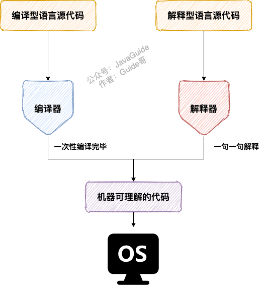

# Java SE

## 一、基础概念与常识

> 参考链接：[JavaGuide](https://javaguide.cn/java/basis/java-basic-questions-01.html#%E5%9F%BA%E7%A1%80%E6%A6%82%E5%BF%B5%E4%B8%8E%E5%B8%B8%E8%AF%86)

### 1.1 JVM vs JDK vs JRE

Java虚拟机（JVM）是运行Java字节码的虚拟机。JVM有针对不同系统的特定实现，目的是**使用相同的字节码，它们都会给出相同的结果**。字节码和不同系统的JVM实现是Java语言“一次编译，到处运行”的关键所在。

**JVM并不是只有一种**！只要满足JVM规范，每个公司、组织或者个人都可以开发自己的专属JVM。也就是说平时接触到的HotSpot VM仅仅是JVM规范的一种实现而已（J9 VM等）。

JDK是Java Development Kit的缩写，它是功能齐全的Java SDK，**拥有JRE所拥有的一切**，还有编译器（javac）和工具（如javadoc和jdb）。它能够创建和编译程序。

JRE是Java运行时环境。它是运行已编译的Java程序所需的所有内容的集合，包括JVM，Java类库，java命令和其他的一些基础构件，**但是它不能用于创建新程序**。

### 1.2 什么是字节码？采用字节码的好处？

在Java中，JVM可以理解的代码就叫做字节码（即扩展名为`.class`的文件），它不面向任何特定的处理器，**只面向虚拟机**。Java语言通过字节码的方式，在一定程度上解决了传统解释型语言执行效率低的问题，同时又保留了解释型语言可移植的特点。所以Java程序运行时相对来说还是高效的，而且，由于字节码并不针对一种特定的机器，因此，Java程序无须重新编译便可在多种不同操作系统的计算机上运行。

**Java程序从源代码到运行的过程如下图所示**：

需要格外注意的是`.class->机器码`这一步。在这一步JVM类加载器首先加载字节码文件，然后通过解释器逐行解释执行，这种方式的执行速度会相对比较慢。而且，有些方法和代码块是经常需要被调用的（也就是所谓的热点代码)，所以后面引进了JIT（Just-in-time Compilation） 编译器，而JIT属于运行时编译。**当JIT编译器完成第一次编译后，其会将字节码对应的机器码保存下来，下次可以直接使用**，机器码的运行效率肯定是高于Java解释器的，这也解释了为什么经常会说**Java是编译与解释共存的语言** 。

### 1.3 为什么说Java“编译与解释并存”？

可以将高级编程语言按照程序的执行方式分为两种：

- **编译型**：**编译型语言将源代码一次性翻译成可被该平台执行的机器码**。一般情况下，编译语言的执行速度比较快，开发效率比较低。常见的编译性语言有C、C++、Go、Rust等等。
- **解释型**：**解释型语言一句一句的将代码解释（Interpret）为机器代码后再执行**。解释型语言开发效率比较快，执行速度比较慢。常见的解释性语言有Python、JavaScript、PHP等等。

**为什么说Java语言“编译与解释并存”**？

这是因为Java语言既具有编译型语言的特征，也具有解释型语言的特征。因为Java程序要经过**先编译，后解释**两个步骤，由Java编写的程序需要先**经过编译步骤生成字节码（`.class`文件）**，这种字节码必须由**Java解释器来解释执行**。