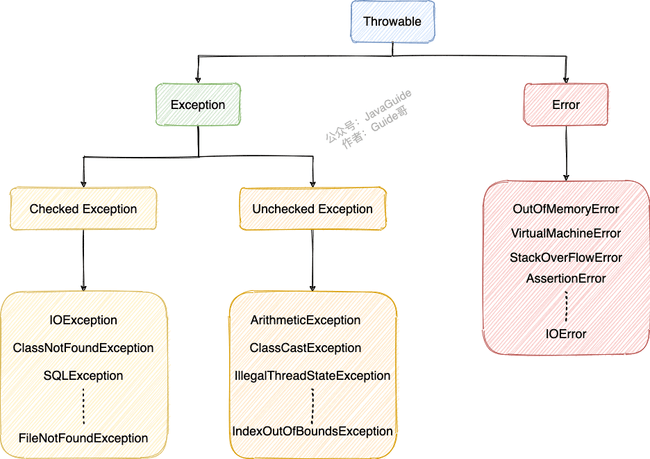

# Java SE

## 一、基础概念与常识

> 参考链接：[JavaGuide](https://javaguide.cn/java/basis/java-basic-questions-01.html#%E5%9F%BA%E7%A1%80%E6%A6%82%E5%BF%B5%E4%B8%8E%E5%B8%B8%E8%AF%86)

### 1.1 JVM vs JDK vs JRE:airplane:

Java虚拟机（JVM）是运行Java字节码的虚拟机。JVM有针对不同系统的特定实现，目的是**使用相同的字节码，它们都会给出相同的结果**。字节码和不同系统的JVM实现是Java语言“一次编译，到处运行”的关键所在。

**JVM并不是只有一种**！只要满足JVM规范，每个公司、组织或者个人都可以开发自己的专属JVM。也就是说平时接触到的HotSpot VM仅仅是JVM规范的一种实现而已（J9 VM等）。

JDK是Java Development Kit的缩写，它是功能齐全的Java SDK，**拥有JRE所拥有的一切**，还有编译器（javac）和工具（如javadoc和jdb）。它能够创建和编译程序。

JRE是Java运行时环境。它是运行已编译的Java程序所需的所有内容的集合，包括JVM，Java类库，java命令和其他的一些基础构件，**但是它不能用于创建新程序**。

### 1.2 什么是字节码？采用字节码的好处？

在Java中，**JVM可以理解的代码就叫做字节码（即扩展名为`.class`的文件）**，它不面向任何特定的处理器，**只面向虚拟机**。Java语言通过字节码的方式，在一定程度上解决了传统解释型语言执行效率低的问题，同时又保留了解释型语言可移植的特点。所以Java程序运行时相对来说还是高效的，而且，由于字节码并不针对一种特定的机器，因此，Java程序无须重新编译便可在多种不同操作系统的计算机上运行。

**Java程序从源代码到运行的过程如下图所示**：


需要格外注意的是`.class->机器码`这一步。在这一步JVM类加载器首先加载字节码文件，然后通过解释器逐行解释执行，这种方式的执行速度会相对比较慢。而且，有些方法和代码块是经常需要被调用的（也就是所谓的热点代码)，所以后面引进了JIT（Just-in-time Compilation） 编译器，而JIT属于运行时编译。**当JIT编译器完成第一次编译后，其会将字节码对应的机器码保存下来，下次可以直接使用**，机器码的运行效率肯定是高于Java解释器的，这也解释了为什么经常会说**Java是编译与解释共存的语言** 。

### 1.3 为什么说Java“编译与解释并存”？

可以将高级编程语言按照程序的执行方式分为两种：

- **编译型**：**编译型语言将源代码一次性翻译成可被该平台执行的机器码**。一般情况下，编译语言的执行速度比较快，开发效率比较低。常见的编译性语言有C、C++、Go、Rust等等。
- **解释型**：**解释型语言一句一句的将代码解释（Interpret）为机器代码后再执行**。解释型语言开发效率比较快，执行速度比较慢。常见的解释性语言有Python、JavaScript、PHP等等。


**为什么说Java语言“编译与解释并存”**？

这是因为Java语言既具有编译型语言的特征，也具有解释型语言的特征。因为Java程序要经过**先编译，后解释**两个步骤，由Java编写的程序需要先**经过编译步骤生成字节码（`.class`文件）**，这种字节码必须由**Java解释器来解释执行**。

### 1.4 Java和C++的区别:airplane:

虽然，Java和C++都是面向对象的语言，都支持封装、继承和多态，但是它们还是有挺多不相同的地方：

- Java**不提供指针**来直接访问内存，程序内存更加安全。
- Java的类是**单继承**的，C++支持多重继承；虽然Java的类不可以多继承，但是接口可以多继承。
- Java有自动内存管理垃圾回收机制（GC），不需要程序员手动释放无用内存。
- C++同时支持**方法重载**和**操作符重载**，但是Java只支持方法重载（操作符重载增加了复杂性，这与Java最初的设计思想不符）。

## 二、基本语法

> 参考链接：[JavaGuide](https://javaguide.cn/java/basis/java-basic-questions-01.html#%E5%9F%BA%E6%9C%AC%E8%AF%AD%E6%B3%95)

### 2.1 字符型常量和字符串型常量的区别？

- **形式**：字符常量是单引号引起的一个字符，字符串常量是双引号引起的0个或若干个字符。
- **含义**：字符常量相当于一个整型值（ASCII值），**可以参与表达式运算**；字符串常量代表一个地址值（该字符串在内存中存放的位置）。
- **占内存大小**：字符常量只占2个字节，字符串常量占若干个字节。

### 2.2 标识符和关键字的区别？

在编写程序的时候，需要大量地为程序、类、变量、方法等取名字，于是就有了**标识符** 。简单来说， **标识符就是一个名字** 。

而有一些标识符，Java语言已经赋予了其特殊的含义，只能用于特定的地方，这些特殊的标识符就是**关键字** 。简单来说，**关键字是被赋予特殊含义的标识符** 。

### 2.3 Java关键字

|         分类         |                    关键字                     |
| :------------------: | :-------------------------------------------: |
|       访问控制       |           private protected public            |
| 类、方法和变量修饰符 |                abstract final                 |
|       基本类型       | int byte short long float double boolean char |
|        保留字        |                  goto const                   |
|          …           |                       …                       |

说明：

- 所有的关键字都是小写。
- `default`这个关键字很特殊，既属于程序控制，也属于类，方法和变量修饰符，还属于访问控制。
  - 在程序控制中，当`switch`中匹配不到任何情况时，可以使用`default`来编写默认匹配的情况。
  - 在类，方法和变量修饰符中，从JDK8开始引入了默认方法，可以使用`default`关键字来定义一个方法的默认实现。
  - 在访问控制中，如果一个方法前没有任何修饰符，则默认会有一个修饰符`default`，**但是这个修饰符加上了就会报错**。
- 虽然`true`, `false`和`null`看起来像关键字，但实际上它们是字面值，并且也不可以被用作标识符。

### 2.4 方法

#### 静态方法为什么不能调用非静态成员？:airplane:

这个需要结合JVM的相关知识，主要原因如下：

- **静态方法是属于类的**，在类加载的时候就会分配内存，可以通过类名直接访问；**而非静态成员属于实例对象**，**只有在对象实例化之后才存在**，需要通过类的实例对象去访问。
- 在类的非静态成员不存在的时候静态成员就已经存在了，此时**调用在内存中还不存在的非静态成员，属于非法操作**。

#### 静态方法和实例方法有什么不同？

##### 调用方式

在外部调用静态方法时，可以使用`类名.方法名`的方式，也可以使用`对象.方法名`的方式；而实例方法只有后面这种方式。

也就是说，**调用静态方法可以无需创建对象** 。

不过，需要注意的是：**一般不建议使用`对象.方法名`的方式来调用静态方法**。这种方式非常容易造成混淆，**静态方法不属于类的某个对象而是属于这个类**。因此，一般建议使用`类名.方法名`的方式来调用静态方法。

##### 访问类成员是否存在限制

静态方法在访问本类的成员时，**只允许访问静态成员**（即静态成员变量和静态方法），**不允许访问实例成员**（即实例成员变量和实例方法），而实例方法不存在这个限制。

#### 重载和重写的区别

##### 重载

发生在**同一个类中（或者父类和子类之间）**，方法名必须相同，**参数类型不同、个数不同、顺序不同**，方法返回值和访问修饰符可以不同。**重载就是同一个类中多个同名方法根据不同的传参来执行不同的逻辑处理**。

##### 重写

发生在运行期，是子类对父类中**允许访问的方法的实现过程的重新编写**：

- 方法名、参数列表必须相同，子类方法返回值类型应比父类方法返回值类型更小或相等，抛出的异常范围小于等于父类，访问修饰符范围大于等于父类。
- 如果父类方法访问修饰符为`private/final/static`，则子类就不能重写该方法，但是被`static`修饰的方法能够被再次声明。
- 构造方法无法被重写。

**重写就是子类对父类方法的重新改造，外部样子不能改变，内部逻辑可以改变**。

方法的重写要遵循**“两同两小一大”**原则：

- “两同”：方法名相同、参数列表相同。
- “两小”：子类方法返回值类型应比父类方法返回值类型更小或相等，子类方法声明抛出的异常类应比父类方法声明抛出的异常类更小或相等。
- “一大”：子类方法的访问权限应比父类方法的访问权限更大或相等。

## 三、基本数据类型

> 参考链接：[JavaGuide](https://javaguide.cn/java/basis/java-basic-questions-01.html#%E5%9F%BA%E6%9C%AC%E6%95%B0%E6%8D%AE%E7%B1%BB%E5%9E%8B)

### 3.1 8种基本数据类型

| 基本类型  | 位数 |                  取值范围                  |   包装类    |
| :-------: | :--: | :----------------------------------------: | :---------: |
|   `int`   |  32  |          -2147483648 ~ 2147483647          |  `Integer`  |
|  `byte`   |  8   |                 -128 ~ 127                 |   `Byte`    |
|  `short`  |  16  |               -32768 ~ 32767               |   `Short`   |
|  `long`   |  64  | -9223372036854775808 ~ 9223372036854775807 |   `Long`    |
|  `float`  |  32  |           1.4E-45 ~ 3.4028235E38           |   `Float`   |
| `double`  |  64  |     4.9E-324 ~ 1.7976931348623157E308      |  `Double`   |
| `boolean` |  1   |                true、false                 |  `Boolean`  |
|  `char`   |  16  |                 0 ~ 65535                  | `Character` |

注意：使用`long`类型的数据一定要在数值后加`L`，否则会被视作整型处理。

### 3.2 基本类型和包装类型的区别？

- 成员变量包装类型不赋值就是`null`，而基本类型有默认值且不为`null`。
- 包装类型可用于**泛型**，而基本类型不可以。
- **基本数据类型的局部变量存放在Java虚拟机栈中的局部变量表中，基本数据类型的成员变量（未被`static`修饰 ）存放在Java虚拟机的堆中**。包装类型属于对象类型，**几乎所有对象实例都存在于堆中**。
- 相比于对象类型， 基本数据类型占用的空间非常小。

**为什么说是几乎所有对象实例呢**？这是因为HotSpot虚拟机引入了JIT优化之后，会对对象进行**逃逸分析**，如果发现某一个对象并没有逃逸到方法外部，那么就可能通过标量替换来实现栈上分配，而避免堆上分配内存。

### 3.3 包装类型的缓存机制:airplane:

Java基本数据类型的**包装类型的大部分都用到了缓存机制来提升性能**。`Byte`，`Short`，`Integer`，`Long`这4种包装类默认创建了数值**[-128，127]**的相应类型的缓存数据，`Character`创建了数值在**[0,127]**范围的缓存数据，`Boolean`直接返回`True`or`False`。两种浮点数类型的包装类`Float`和`Double`并没有实现缓存机制。

`Integer`缓存：

```java
public static Integer valueOf(int i) {
    if (i >= IntegerCache.low && i <= IntegerCache.high)
        return IntegerCache.cache[i + (-IntegerCache.low)];
    return new Integer(i);
}
private static class IntegerCache {
    static final int low = -128;
    static final int high;
    static {
        // high value may be configured by property
        int h = 127;
    }
}
```

`Character`缓存：

```java
public static Character valueOf(char c) {
    if (c <= 127) { // must cache
      return CharacterCache.cache[(int)c];
    }
    return new Character(c);
}

private static class CharacterCache {
    private CharacterCache(){}
    static final Character cache[] = new Character[127 + 1];
    static {
        for (int i = 0; i < cache.length; i++)
            cache[i] = new Character((char)i);
    }
}
```

`Boolean`缓存：

```java
public static Boolean valueOf(boolean b) {
    return (b ? TRUE : FALSE);
}
```

如果超出对应范围仍然会去**创建新的对象**，缓存的范围区间的大小只是在性能和资源之间的权衡。

```java
Integer i1 = 33;
Integer i2 = 33;
System.out.println(i1 == i2);// 输出 true

Float i11 = 333f;
Float i22 = 333f;
System.out.println(i11 == i22);// 输出 false

Double i3 = 1.2;
Double i4 = 1.2;
System.out.println(i3 == i4);// 输出 false

// 输出 false
Integer i1 = 40;
Integer i2 = new Integer(40);
System.out.println(i1==i2);
```

`Integer i1 = 40`这一行代码会发生装箱，也就是说这行代码等价于`Integer i1 = Integer.valueOf(40)` ，`i1`直接使用的是**缓存中的对象**，而`Integer i2 = new Integer(40)`是会直接**创建一个新的对象**。

所以记住：**所有整型包装类对象之间值的比较，全部使用`.equals()`方法比较**。

### 3.4 自动装箱与拆箱的原理

- **装箱**：将基本类型用它们对应的引用类型包装起来。
- **拆箱**：将包装类型转换为基本数据类型。

```java
Integer i = 10;  //装箱
int n = i;   //拆箱
```

上面这两行代码对应的字节码为：

```
   L1

    LINENUMBER 8 L1

    ALOAD 0

    BIPUSH 10

    INVOKESTATIC java/lang/Integer.valueOf (I)Ljava/lang/Integer;

    PUTFIELD AutoBoxTest.i : Ljava/lang/Integer;

   L2

    LINENUMBER 9 L2

    ALOAD 0

    ALOAD 0

    GETFIELD AutoBoxTest.i : Ljava/lang/Integer;

    INVOKEVIRTUAL java/lang/Integer.intValue ()I

    PUTFIELD AutoBoxTest.n : I

    RETURN
```

从字节码中发现，装箱其实就是调用了包装类的`valueOf()`方法，拆箱其实就是调用了`xxxValue()`方法。因此：

- `Integer i = 10`等价于`Integer i = Integer.valueOf(10)`。
- `int n = i`等价于`int n = i.intValue()`。

注意：**如果频繁拆装箱的话，也会严重影响系统的性能**。应该尽量避免不必要的拆装箱操作。

## 四、面向对象基础

> 参考链接：[JavaGuide](https://javaguide.cn/java/basis/java-basic-questions-02.html#%E9%9D%A2%E5%90%91%E5%AF%B9%E8%B1%A1%E5%9F%BA%E7%A1%80)

### 4.1 成员变量和局部变量的区别

- **语法形式**：从语法形式上看，**成员变量是属于类的，而局部变量是在代码块或方法中定义的变量或是方法的参数**；成员变量可以被`public`，`private`，`static`等修饰符所修饰，而局部变量不能被访问控制修饰符及`static`所修饰；但是成员变量和局部变量都能被`final`所修饰。
- **存储方式**：从变量在内存中的存储方式来看，如果成员变量是使用`static`修饰的，那么这个成员变量是属于类的，如果没有使用`static`修饰，这个成员变量是属于实例的。**对象存在于堆内存，局部变量则存在于栈内存**。
- **生存时间**：从变量在内存中的生存时间上看，成员变量是对象的一部分，它随着对象的创建而存在，而局部变量随着方法的调用而自动生成，随着方法的调用结束而消亡。
- **默认值**：从变量是否有默认值来看，成员变量如果没有被赋初始值，则**会自动以类型的默认值而赋值**（一种情况例外：被`final`修饰的成员变量也必须显式地赋值），而局部变量则不会自动赋值。

### 4.2 面向对象三大特征:rocket:

#### 封装

封装是指**把一个对象的状态信息（也就是属性）隐藏在对象内部**，不允许外部对象**直接访问**对象的内部信息，但是可以提供一些可以被外界访问的**方法来操作属性**。

```java
public class Student {
    private int id;//id属性私有化
    private String name;//name属性私有化

    //获取id的方法
    public int getId() {
        return id;
    }

    //设置id的方法
    public void setId(int id) {
        this.id = id;
    }

    //获取name的方法
    public String getName() {
        return name;
    }

    //设置name的方法
    public void setName(String name) {
        this.name = name;
    }
}
```

#### 继承

不同类型的对象，相互之间**经常有一定数量的共同点**。同时，每一个对象还定义了额外的**特性**使得它们与众不同。继承是**使用已存在的类的定义作为基础建立新类的技术，新类的定义可以增加新的数据或新的功能，也可以用父类的功能，但不能选择性地继承父类**。通过使用继承，可以快速地创建新的类，可以提高代码的重用，程序的可维护性，节省大量创建新类的时间 ，提高开发效率。

注意：

- 子类拥有父类对象所有的属性和方法（包括私有属性和私有方法），但是**父类中的私有属性和方法子类无法访问**，**只是拥有**。
- 子类可以拥有自己属性和方法，即子类可以对父类进行扩展。
- 子类可以用自己的方式实现父类的方法。

#### 多态

多态，顾名思义，**表示一个对象具有多种的状态，具体表现为父类的引用指向子类的实例**。

**多态的特点**：

- 对象类型和引用类型之间具有继承（类）/实现（接口）的关系。
- 引用类型变量发出的方法调用的到底是哪个类中的方法，必须在程序运行期间才能确定。
- 多态不能调用“只在子类存在但在父类不存在”的方法。
- 如果子类重写了父类的方法，真正执行的是子类覆盖的方法，如果子类没有覆盖父类的方法，执行的是父类的方法。

### 4.3 接口和抽象类有什么共同点和不同点？

**共同点**：

- 都不能被实例化。
- 都可以包含抽象方法。
- 都可以有默认实现的方法（Java 8可以用`default`关键字在接口中定义默认方法）。

**区别**：

- 接口主要用于对类的行为进行约束，**实现了某个接口就具有了对应的行为**。抽象类主要用于代码复用，强调的是所属关系。
- 一个类只能继承一个类，但是可以实现多个接口。
- 接口中的成员变量只能是`public`，`static`，`final`类型的，不能被修改且必须有初始值；而抽象类的成员变量默认`default`，可在子类中被重新定义，也可被重新赋值。

### 4.4 深拷贝和浅拷贝区别？什么是引用拷贝？

- **浅拷贝**：浅拷贝会在堆上创建一个新的对象（区别于引用拷贝的一点），不过，**如果原对象内部的属性是引用类型的话，浅拷贝会直接复制内部对象的引用地址**，也就是说拷贝对象和原对象**共用**同一个内部对象。
- **深拷贝**：深拷贝会**完全复制**整个对象，包括这个对象所包含的内部对象。

**那什么是引用拷贝呢**？简单来说，引用拷贝就是两个不同的引用指向同一个对象。


## 五、Java常用类

> 参考链接：[JavaGuide]([Java基础常见知识&面试题总结(中) | JavaGuide](https://javaguide.cn/java/basis/java-basic-questions-02.html#java-常见类))

### 5.1 Object:rocket:

#### Object类常用方法

```java
/**
 * native 方法，用于返回当前运行时对象的 Class 对象，使用了 final 关键字修饰，故不允许子类重写。
 */
public final native Class<?> getClass()
/**
 * native 方法，用于返回对象的哈希码，主要使用在哈希表中，比如 JDK 中的HashMap。
 */
public native int hashCode()
/**
 * 用于比较 2 个对象的内存地址是否相等，String 类对该方法进行了重写以用于比较字符串的值是否相等。
 */
public boolean equals(Object obj)
/**
 * naitive 方法，用于创建并返回当前对象的一份拷贝。
 */
protected native Object clone() throws CloneNotSupportedException
/**
 * 返回类的名字实例的哈希码的 16 进制的字符串。建议 Object 所有的子类都重写这个方法。
 */
public String toString()
/**
 * native 方法，并且不能重写。唤醒一个在此对象监视器上等待的线程(监视器相当于就是锁的概念)。如果有多个线程在等待只会任意唤醒一个。
 */
public final native void notify()
/**
 * native 方法，并且不能重写。跟 notify 一样，唯一的区别就是会唤醒在此对象监视器上等待的所有线程，而不是一个线程。
 */
public final native void notifyAll()
/**
 * native方法，并且不能重写。暂停线程的执行。注意：sleep 方法没有释放锁，而 wait 方法释放了锁 ，timeout 是等待时间。
 */
public final native void wait(long timeout) throws InterruptedException
/**
 * 多了 nanos 参数，这个参数表示额外时间（以毫微秒为单位，范围是 0-999999）。 所以超时的时间还需要加上 nanos 毫秒。。
 */
public final void wait(long timeout, int nanos) throws InterruptedException
/**
 * 跟之前的2个wait方法一样，只不过该方法一直等待，没有超时时间这个概念
 */
public final void wait() throws InterruptedException
/**
 * 实例被垃圾回收器回收的时候触发的操作
 */
protected void finalize() throws Throwable { }
```

#### `==`和`equals()`的区别

**`==`**对于基本类型和引用类型的作用效果是不同的：

- 对于基本数据类型来说，`==`比较的是**值**。
- 对于引用数据类型来说，`==`比较的是对象的**内存地址**。

注意：因为Java只有值传递，所以对于`==`来说，不管是比较基本数据类型，还是引用数据类型的变量，其本质比较的都是值，只是**引用类型变量存的值是对象的地址**。

**`equals()`**不能用于判断基本数据类型的变量，只能用来判断两个对象是否相等。`equals()`方法存在于`Object`类中，而`Object`类是所有类的直接或间接父类，因此所有的类都有`equals()`方法。

```java
public boolean equals(Object obj) {
     return (this == obj);
}
```

`equals()`方法存在两种使用情况：

- **类没有重写`equals()`方法**：通过`equals()`比较该类的两个对象时，使用的是`Object`类`equals()`方法，等价于通过`==`比较这两个对象。
- **类重写了`equals()`方法**：一般会重写`equals()`方法来比较两个对象中的**属性是否相等**；若它们的属性相等，则认为这两个对象相等。

举例说明：

```java
String a = new String("ab"); // a 为一个引用
String b = new String("ab"); // b为另一个引用,对象的内容一样
String aa = "ab"; // 放在常量池中
String bb = "ab"; // 从常量池中查找
System.out.println(aa == bb);// true
System.out.println(a == b);// false
System.out.println(a.equals(b));// true
System.out.println(42 == 42.0);// true
```

当创建`String`类型的对象时，虚拟机会**在常量池中查找有没有已经存在的值和要创建的值相同的对象**，如果有就把它赋给当前引用，如果没有就在常量池中重新**创建**一个新的`String`对象。

`String`中的`equals()`方法是被重写过的，`Object`的`equals()`方法比较对象的内存地址，而`String`的`equals()`方法比较对象的值。

`String`类`equals()`方法：

```java
public boolean equals(Object anObject) {
    if (this == anObject) {
        return true;
    }
    if (anObject instanceof String) {
        String anotherString = (String)anObject;
        int n = value.length;
        if (n == anotherString.value.length) {
            char v1[] = value;
            char v2[] = anotherString.value;
            int i = 0;
            while (n-- != 0) {
                if (v1[i] != v2[i])
                    return false;
                i++;
            }
            return true;
        }
    }
    return false;
}
```

#### `hashCode()`有什么用？

`hashCode()`的作用是**获取哈希码**（`int`整数），也称为散列码。这个哈希码的作用是**确定该对象在哈希表中的索引位置**。`hashCode()`定义在`Object` 类中，这就意味着Java中的任何类都包含有`hashCode()`方法。另外需要注意的是：`Object`的`hashCode()`方法是本地方法，也就是**用C语言或C++实现的**，该方法通常用来**将对象的内存地址转换为整数**之后返回。

散列表存储的是键值对，它的特点是：**能根据“键”快速检索出对应的“值”**。

#### 为什么要有`hashCode()`？

以HashSet如何检查重复为例子来说明为什么要有`hashCode()`。

当把对象加入HashSet时，HashSet会先通过`hashCode()`计算对象的哈希码来**判断对象加入的位置**，同时也会与其他已经加入的对象的哈希码比较；如果没有相符的哈希码，**会假设对象没有重复出现**；如果发现有相同哈希码的对象，这时会调用`equals()`方法来检查相等的对象**是否真的相同**。如果两者相同，HashSet就不会让其加入；如果不同的话，就会重新散列到其他位置。这样就大大减少了`.equals()`的次数，相应地也大大提高了执行速度。

从上面可以看出，`hashCode()`和`equals()`都是用于比较两个对象是否相等。**那为什么JDK还要同时提供这两个方法呢**？

这是因为在一些容器（比如`HashMap`、`HashSet`）中，有了`hashCode()`之后，**判断元素是否在对应容器中的效率会更高**。**那为什么不只提供 `hashCode()` 方法呢**？这是因为**两个对象的哈希码相等并不一定代表两个对象就相等**。原因在于：因为`hashCode()`所使用的哈希算法**也许刚好会让多个对象传回相同的哈希值**，越糟糕的哈希算法越容易碰撞，但这也与数据值域分布的特性有关（所谓哈希碰撞也就是指不同的对象得到相同的哈希码 )。

总结下来就是：

- 如果两个对象的哈希码相等，那这两个对象不一定相等（哈希碰撞）。
- 如果两个对象的哈希码相等并且`equals()`方法也返回 `true`，才可以认为这两个对象相等。
- 如果两个对象的哈希码不相等，可以直接认为这两个对象不相等。

#### 为什么重写`equals()`时必须重写`hashCode()`方法？

因为两个相等对象的哈希码必然相等，也就是说如果`equals()`方法判断两个对象是相等的，那这两个对象的`hashCode()`值也要相等。如果只重写`equals()`却没有重写`hashCode()`，可能会导致`equals()`判断是相等的两个对象，但它们的哈希值并不相等。

### 5.2 String:rocket:

#### String、StringBuffer、StringBuilder的区别？

##### 可变性

`String`是**不可变**的。`StringBuilder`与`StringBuffer`都继承自`AbstractStringBuilder`类，在`AbstractStringBuilder`中也是**使用字符数组保存字符串**，不过没有使用`final`和`private`关键字修饰，最关键的是`AbstractStringBuilder`类还提供了很多修改字符串的方法，比如`append()`方法。

```java
abstract class AbstractStringBuilder implements Appendable, CharSequence {
    char[] value;
    public AbstractStringBuilder append(String str) {
        if (str == null)
            return appendNull();
        int len = str.length();
        ensureCapacityInternal(count + len);
        str.getChars(0, len, value, count);
        count += len;
        return this;
    }
  	//...
}
```

##### 线程安全性

`String`中的对象是不可变的，也就可以理解为常量，**线程安全**。`AbstractStringBuilder`是`StringBuilder`与`StringBuffer`的公共父类，定义了一些字符串的基本操作。`StringBuffer`对方法加了同步锁或者对调用的方法加了同步锁，所以是**线程安全**的；`StringBuilder`并没有对方法进行加同步锁，所以是**非线程安全**的。

##### 性能

每次对`String`类型进行改变的时候，都会生成一个新的`String`对象，然后将指针指向新的`String`对象。`StringBuffer`每次都会对`StringBuffer`对象本身进行操作，而不是生成新的对象并改变对象引用。相同情况下使用`StringBuilder`相比使用`StringBuffer`仅能获得10%~15%左右的性能提升，但却要冒多线程不安全的风险。

##### 总结

- 操作少量的数据：使用`String`。
- 单线程操作字符串缓冲区下操作大量数据：使用`StringBuilder`。
- 多线程操作字符串缓冲区下操作大量数据：使用`StringBuffer`。

#### String为什么不可变？

`String`类中使用`final`关键字修饰字符数组来保存字符串：

```java
public final class String implements java.io.Serializable, Comparable<String>, CharSequence {
    private final char value[];
	//...
}
```

被`final`关键字修饰的类不能被继承，修饰的方法不能被重写，修饰的变量是基本数据类型则值不能改变，修饰的变量是引用类型则不能再指向其他对象。因此，`final`关键字修饰的数组保存字符串并不是`String`不可变的根本原因，因为这个数组保存的字符串是可变的（`final`修饰引用类型变量的情况）。

`String`真正不可变的原因：

- 保存字符串的数组被`final`修饰且为私有的，并且`String`类没有提供/暴露修改这个字符串的方法。
- `String`类被`final`修饰导致其不能被继承，进而避免了子类破坏`String`不可变。

#### 字符串拼接使用`+`还是StringBuilder？

Java语言本身并不支持运算符重载，`+`和`+=`是专门为String类重载过的运算符，也是Java中仅有的两个重载过的元素符。

```java
String str1 = "he";
String str2 = "llo";
String str3 = "world";
String str4 = str1 + str2 + str3;
```

上面代码对应的字节码如下：


可以看出，字符串对象使用`+`的拼接方式，实际上是通过`StringBuilder`调用`append()`方法实现的，拼接完成之后调用`toString()`得到一个`String`对象 。不过，在循环内使用`+`进行字符串拼接的话，存在比较明显的缺陷：**编译器不会创建单个`StringBuilder`以复用，会导致创建过多的`StringBuilder`对象**。

```java
String[] arr = {"he", "llo", "world"};
String s = "";
for (int i = 0; i < arr.length; i++) {
    s += arr[i];
}
System.out.println(s);
```


#### 字符串常量池的作用？

**字符串常量池**是JVM为了**提升性能和减少内存**消耗针对字符串（String 类）专门开辟的一块区域，主要目的是为了避免字符串的重复创建。

```java
// 在堆中创建字符串对象”ab“
// 将字符串对象”ab“的引用保存在字符串常量池中
String aa = "ab";
// 直接返回字符串常量池中字符串对象”ab“的引用
String bb = "ab";
System.out.println(aa==bb);// true
```

#### `intern()`方法的作用？

`String.intern()`是一个`native`方法，其作用是**将指定的字符串对象的引用保存在字符串常量池中**，可以简单分为两种情况：

- 如果字符串常量池中保存了对应的字符串对象的引用，就直接返回该引用。
- 如果字符串常量池中没有保存对应的字符串对象的引用，那就在常量池中创建一个指向该字符串对象的引用并返回。

```java
// 在堆中创建字符串对象”Java“
// 将字符串对象”Java“的引用保存在字符串常量池中
String s1 = "Java";
// 直接返回字符串常量池中字符串对象”Java“对应的引用
String s2 = s1.intern();
// 会在堆中在单独创建一个字符串对象
String s3 = new String("Java");
// 直接返回字符串常量池中字符串对象”Java“对应的引用
String s4 = s3.intern();
// s1 和 s2 指向的是堆中的同一个对象
System.out.println(s1 == s2); // true
// s3 和 s4 指向的是堆中不同的对象
System.out.println(s3 == s4); // false
// s1 和 s4 指向的是堆中的同一个对象
System.out.println(s1 == s4); //true
```

#### String类型的变量和常量做`+`运算时发生了什么？

先来看字符串不加`final`关键字拼接的情况：

```java
String str1 = "str";
String str2 = "ing";
// 常量池中的对象
String str3 = "str" + "ing";
// 堆中的新对象
String str4 = str1 + str2;
// 常量池中的对象
String str5 = "string";
System.out.println(str3 == str4);//false
System.out.println(str3 == str5);//true
System.out.println(str4 == str5);//false
```

对于编译期可以确定值的字符串，**也就是常量字符串** ，JVM会将其存入字符串常量池。并且，**字符串常量拼接得到的字符串常量在编译阶段就已经被存放字符串常量池**，这个得益于编译器的优化。

在编译过程中，Javac编译器（下文中统称为编译器）会进行一个叫做**常量折叠（Constant Folding）**的代码优化。常量折叠会把**常量表达式的值求出来作为常量嵌在最终生成的代码中**，这是编译器会对源代码做的极少量优化措施之一（代码优化几乎都在即时编译器JIT中进行）。

对于`String str3 = "str" + "ing";`，编译器会优化为`String str3 = "string";` 。但并不是所有的常量都会进行折叠，**只有编译器在程序编译期就可以确定值的常量才可以**：

- 基本数据类型（`byte`、`boolean`、`short`、`char`、`int`、`float`、`long`、`double`）以及字符串常量。
- `final`修饰的基本数据类型和字符串变量。
- 字符串通过`+`拼接得到的字符串、基本数据类型之间算数运算（加减乘除）、基本数据类型的位运算（`<<`、`>>`、`>>>`）。

**引用的值在程序编译期是无法确定的，编译器无法对其进行优化。**

不过，字符串使用`final`关键字声明之后，可以让编译器当做常量来处理。因为编译器在程序编译期就可以确定它的值，其效果就相当于访问常量。

```java
final String str1 = "str";
final String str2 = "ing";
// 下面两个表达式其实是等价的
String c = "str" + "ing";// 常量池中的对象
String d = str1 + str2; // 常量池中的对象
System.out.println(c == d);// true
```

## 六、异常

> 参考链接：[JavaGuide]([Java基础知识&面试题总结(下) | JavaGuide](https://javaguide.cn/java/basis/java-basic-questions-03.html#异常))

Java异常类层次结构图：



### 6.1 `Exception`和`Error`有什么区别？

在Java中，所有异常都有一个共同的祖先，即`java.lang`包中的`Throwable`类，它有两个重要的子类：

- **`Exception`**：程序本身可以处理的异常，可以通过`catch`来进行捕获。`Exception`又可以分为Checked Exception（受检查异常，必须处理）和Unchecked Exception（不受检查异常，可以不处理）。
- **`Error`**：`Error`属于程序无法处理的错误 ，不建议通过`catch`捕获 。例如Java虚拟机运行错误`Virtual MachineError`、虚拟机内存不够错误`OutOfMemoryError`、类定义错误`NoClassDefFoundError`等 。这些异常发生时，JVM一般会选择终止线程。

### 6.2 Checked Exception和Unchecked Exception的区别？

**Checked Exception**即受检查异常，Java代码在编译过程中，如果受检查异常没有被`catch`或者`throws`关键字处理的话，就无法通过编译。

**Unchecked Exception**即不受检查异常，Java代码在编译过程中，即使不处理不受检查异常也可以正常通过编译。`RuntimeException`及其子类都统称为非受检查异常，常见的有：

- `NullPointerException`：空指针异常。
- `IllegalArgumentException`：参数异常，比如方法入参类型不对应。
- `NumberFormatException`：字符串转换为数字格式异常，属于`IllegalArgumentException`的子类。
- `ArrayIndexOutOfBoundsException`：数组越界异常。
- `ClassCastException`：类型转换异常。
- `ArithmeticException`：算术异常。
- `SecurityException`：安全异常，例如权限不够。
- `UnsupportedOperationException`：不支持的操作异常，例如重复创建同一用户。

### 6.3 `Throwable`类常用方法

- `String getMessage()`：返回异常发生时的简要描述。
- `String toString()`：返回异常发生时的详细信息。
- `String getLocalizedMessage()`：返回异常对象的本地化信息。使用`Throwable`的子类覆盖这个方法，可以生成本地化信息。如果子类没有覆盖该方法，则该方法返回的信息与`getMessage()`返回的结果相同。
- `void printStackTrace()`：在控制台上打印`Throwable`对象封装的异常信息。

### 6.4 `finally`块中的代码一定会被执行吗？

不一定，在某些情况下，`finally`中的代码不会被执行，例如在`finally`之前虚拟机被终止运行的话，块中的代码就不会被执行。

```java
try {
    System.out.println("Try to do something");
    throw new RuntimeException("RuntimeException");
} catch (Exception e) {
    System.out.println("Catch Exception -> " + e.getMessage());
    // 终止当前正在运行的Java虚拟机
    System.exit(1);
} finally {
    System.out.println("Finally");
}

// 输出
// Try to do something
// Catch Exception -> RuntimeException
```

另外，在以下2种特殊情况下，`finally`块中代码也不会被执行：

- 程序所在的线程死亡。
- 关闭CPU。

## 七、泛型

> 参考链接：[JavaGuide]([Java基础知识&面试题总结(下) | JavaGuide](https://javaguide.cn/java/basis/java-basic-questions-03.html#泛型))

7.1 
