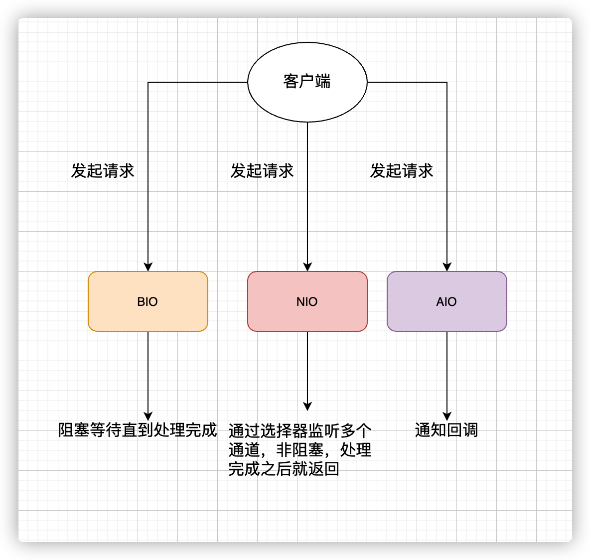
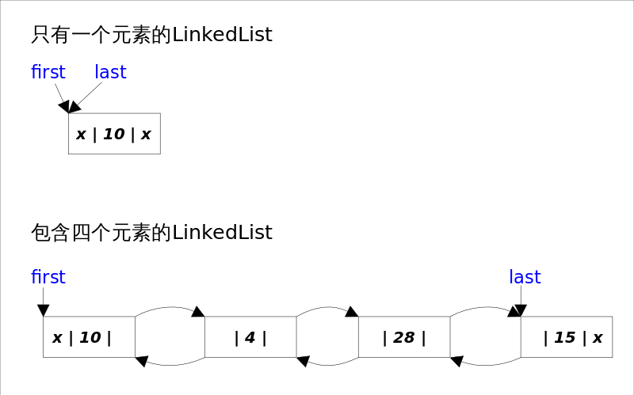

# Java SE

## 一、基础概念与常识

> 参考链接：[JavaGuide](https://javaguide.cn/java/basis/java-basic-questions-01.html#%E5%9F%BA%E7%A1%80%E6%A6%82%E5%BF%B5%E4%B8%8E%E5%B8%B8%E8%AF%86)

### 1.1 JVM vs JDK vs JRE:airplane:

Java虚拟机（JVM）是运行Java字节码的虚拟机。JVM有针对不同系统的特定实现，目的是**使用相同的字节码，它们都会给出相同的结果**。字节码和不同系统的JVM实现是Java语言“一次编译，到处运行”的关键所在。

**JVM并不是只有一种**！只要满足JVM规范，每个公司、组织或者个人都可以开发自己的专属JVM。也就是说平时接触到的HotSpot VM仅仅是JVM规范的一种实现而已（J9 VM等）。

JDK是Java Development Kit的缩写，它是功能齐全的Java SDK，**拥有JRE所拥有的一切**，还有编译器（javac）和工具（如javadoc和jdb）。它能够创建和编译程序。

JRE是Java运行时环境。它是运行已编译的Java程序所需的所有内容的集合，包括JVM，Java类库，java命令和其他的一些基础构件，**但是它不能用于创建新程序**。

### 1.2 什么是字节码？采用字节码的好处？

在Java中，**JVM可以理解的代码就叫做字节码（即扩展名为`.class`的文件）**，它不面向任何特定的处理器，**只面向虚拟机**。Java语言通过字节码的方式，在一定程度上解决了传统解释型语言执行效率低的问题，同时又保留了解释型语言可移植的特点。所以Java程序运行时相对来说还是高效的，而且，由于字节码并不针对一种特定的机器，因此，Java程序无须重新编译便可在多种不同操作系统的计算机上运行。

**Java程序从源代码到运行的过程如下图所示**：


需要格外注意的是`.class->机器码`这一步。在这一步JVM类加载器首先加载字节码文件，然后通过解释器逐行解释执行，这种方式的执行速度会相对比较慢。而且，有些方法和代码块是经常需要被调用的（也就是所谓的热点代码)，所以后面引进了JIT（Just-in-time Compilation） 编译器，而JIT属于运行时编译。**当JIT编译器完成第一次编译后，其会将字节码对应的机器码保存下来，下次可以直接使用**，机器码的运行效率肯定是高于Java解释器的，这也解释了为什么经常会说**Java是编译与解释共存的语言** 。

### 1.3 为什么说Java“编译与解释并存”？

可以将高级编程语言按照程序的执行方式分为两种：

- **编译型**：**编译型语言将源代码一次性翻译成可被该平台执行的机器码**。一般情况下，编译语言的执行速度比较快，开发效率比较低。常见的编译性语言有C、C++、Go、Rust等等。
- **解释型**：**解释型语言一句一句的将代码解释（Interpret）为机器代码后再执行**。解释型语言开发效率比较快，执行速度比较慢。常见的解释性语言有Python、JavaScript、PHP等等。


**为什么说Java语言“编译与解释并存”**？

这是因为Java语言既具有编译型语言的特征，也具有解释型语言的特征。因为Java程序要经过**先编译，后解释**两个步骤，由Java编写的程序需要先**经过编译步骤生成字节码（`.class`文件）**，这种字节码必须由**Java解释器来解释执行**。

### 1.4 Java和C++的区别:airplane:

虽然，Java和C++都是面向对象的语言，都支持封装、继承和多态，但是它们还是有挺多不相同的地方：

- Java**不提供指针**来直接访问内存，程序内存更加安全。
- Java的类是**单继承**的，C++支持多重继承；虽然Java的类不可以多继承，但是接口可以多继承。
- Java有自动内存管理垃圾回收机制（GC），不需要程序员手动释放无用内存。
- C++同时支持**方法重载**和**操作符重载**，但是Java只支持方法重载（操作符重载增加了复杂性，这与Java最初的设计思想不符）。

## 二、基本语法

> 参考链接：[JavaGuide](https://javaguide.cn/java/basis/java-basic-questions-01.html#%E5%9F%BA%E6%9C%AC%E8%AF%AD%E6%B3%95)

### 2.1 字符型常量和字符串型常量的区别？

- **形式**：字符常量是单引号引起的一个字符，字符串常量是双引号引起的0个或若干个字符。
- **含义**：字符常量相当于一个整型值（ASCII值），**可以参与表达式运算**；字符串常量代表一个地址值（该字符串在内存中存放的位置）。
- **占内存大小**：字符常量只占2个字节，字符串常量占若干个字节。

### 2.2 标识符和关键字的区别？

在编写程序的时候，需要大量地为程序、类、变量、方法等取名字，于是就有了**标识符** 。简单来说， **标识符就是一个名字** 。

而有一些标识符，Java语言已经赋予了其特殊的含义，只能用于特定的地方，这些特殊的标识符就是**关键字** 。简单来说，**关键字是被赋予特殊含义的标识符** 。

### 2.3 Java关键字

|         分类         |                    关键字                     |
| :------------------: | :-------------------------------------------: |
|       访问控制       |           private protected public            |
| 类、方法和变量修饰符 |                abstract final                 |
|       基本类型       | int byte short long float double boolean char |
|        保留字        |                  goto const                   |
|          …           |                       …                       |

说明：

- 所有的关键字都是小写。
- `default`这个关键字很特殊，既属于程序控制，也属于类，方法和变量修饰符，还属于访问控制。
  - 在程序控制中，当`switch`中匹配不到任何情况时，可以使用`default`来编写默认匹配的情况。
  - 在类，方法和变量修饰符中，从JDK8开始引入了默认方法，可以使用`default`关键字来定义一个方法的默认实现。
  - 在访问控制中，如果一个方法前没有任何修饰符，则默认会有一个修饰符`default`，**但是这个修饰符加上了就会报错**。
- 虽然`true`, `false`和`null`看起来像关键字，但实际上它们是字面值，并且也不可以被用作标识符。

### 2.4 方法

#### 静态方法为什么不能调用非静态成员？:airplane:

这个需要结合JVM的相关知识，主要原因如下：

- **静态方法是属于类的**，在类加载的时候就会分配内存，可以通过类名直接访问；**而非静态成员属于实例对象**，**只有在对象实例化之后才存在**，需要通过类的实例对象去访问。
- 在类的非静态成员不存在的时候静态成员就已经存在了，此时**调用在内存中还不存在的非静态成员，属于非法操作**。

#### 静态方法和实例方法有什么不同？

##### 调用方式

在外部调用静态方法时，可以使用`类名.方法名`的方式，也可以使用`对象.方法名`的方式；而实例方法只有后面这种方式。

也就是说，**调用静态方法可以无需创建对象** 。

不过，需要注意的是：**一般不建议使用`对象.方法名`的方式来调用静态方法**。这种方式非常容易造成混淆，**静态方法不属于类的某个对象而是属于这个类**。因此，一般建议使用`类名.方法名`的方式来调用静态方法。

##### 访问类成员是否存在限制

静态方法在访问本类的成员时，**只允许访问静态成员**（即静态成员变量和静态方法），**不允许访问实例成员**（即实例成员变量和实例方法），而实例方法不存在这个限制。

#### 重载和重写的区别

##### 重载

发生在**同一个类中（或者父类和子类之间）**，方法名必须相同，**参数类型不同、个数不同、顺序不同**，方法返回值和访问修饰符可以不同。**重载就是同一个类中多个同名方法根据不同的传参来执行不同的逻辑处理**。

##### 重写

发生在运行期，是子类对父类中**允许访问的方法的实现过程的重新编写**：

- 方法名、参数列表必须相同，子类方法返回值类型应比父类方法返回值类型更小或相等，抛出的异常范围小于等于父类，访问修饰符范围大于等于父类。
- 如果父类方法访问修饰符为`private/final/static`，则子类就不能重写该方法，但是被`static`修饰的方法能够被再次声明。
- 构造方法无法被重写。

**重写就是子类对父类方法的重新改造，外部样子不能改变，内部逻辑可以改变**。

方法的重写要遵循**“两同两小一大”**原则：

- “两同”：方法名相同、参数列表相同。
- “两小”：子类方法返回值类型应比父类方法返回值类型更小或相等，子类方法声明抛出的异常类应比父类方法声明抛出的异常类更小或相等。
- “一大”：子类方法的访问权限应比父类方法的访问权限更大或相等。

## 三、基本数据类型

> 参考链接：[JavaGuide](https://javaguide.cn/java/basis/java-basic-questions-01.html#%E5%9F%BA%E6%9C%AC%E6%95%B0%E6%8D%AE%E7%B1%BB%E5%9E%8B)

### 3.1 8种基本数据类型

| 基本类型  | 位数 |                  取值范围                  |   包装类    |
| :-------: | :--: | :----------------------------------------: | :---------: |
|   `int`   |  32  |          -2147483648 ~ 2147483647          |  `Integer`  |
|  `byte`   |  8   |                 -128 ~ 127                 |   `Byte`    |
|  `short`  |  16  |               -32768 ~ 32767               |   `Short`   |
|  `long`   |  64  | -9223372036854775808 ~ 9223372036854775807 |   `Long`    |
|  `float`  |  32  |           1.4E-45 ~ 3.4028235E38           |   `Float`   |
| `double`  |  64  |     4.9E-324 ~ 1.7976931348623157E308      |  `Double`   |
| `boolean` |  1   |                true、false                 |  `Boolean`  |
|  `char`   |  16  |                 0 ~ 65535                  | `Character` |

注意：使用`long`类型的数据一定要在数值后加`L`，否则会被视作整型处理。

### 3.2 基本类型和包装类型的区别？

- 成员变量包装类型不赋值就是`null`，而基本类型有默认值且不为`null`。
- 包装类型可用于**泛型**，而基本类型不可以。
- **基本数据类型的局部变量存放在Java虚拟机栈中的局部变量表中，基本数据类型的成员变量（未被`static`修饰 ）存放在Java虚拟机的堆中**。包装类型属于对象类型，**几乎所有对象实例都存在于堆中**。
- 相比于对象类型， 基本数据类型占用的空间非常小。

**为什么说是几乎所有对象实例呢**？这是因为HotSpot虚拟机引入了JIT优化之后，会对对象进行**逃逸分析**，如果发现某一个对象并没有逃逸到方法外部，那么就可能通过标量替换来实现栈上分配，而避免堆上分配内存。

### 3.3 包装类型的缓存机制:airplane:

Java基本数据类型的**包装类型的大部分都用到了缓存机制来提升性能**。`Byte`，`Short`，`Integer`，`Long`这4种包装类默认创建了数值**[-128，127]**的相应类型的缓存数据，`Character`创建了数值在**[0,127]**范围的缓存数据，`Boolean`直接返回`True`or`False`。两种浮点数类型的包装类`Float`和`Double`并没有实现缓存机制。

`Integer`缓存：

```java
public static Integer valueOf(int i) {
    if (i >= IntegerCache.low && i <= IntegerCache.high)
        return IntegerCache.cache[i + (-IntegerCache.low)];
    return new Integer(i);
}
private static class IntegerCache {
    static final int low = -128;
    static final int high;
    static {
        // high value may be configured by property
        int h = 127;
    }
}
```

`Character`缓存：

```java
public static Character valueOf(char c) {
    if (c <= 127) { // must cache
      return CharacterCache.cache[(int)c];
    }
    return new Character(c);
}

private static class CharacterCache {
    private CharacterCache(){}
    static final Character cache[] = new Character[127 + 1];
    static {
        for (int i = 0; i < cache.length; i++)
            cache[i] = new Character((char)i);
    }
}
```

`Boolean`缓存：

```java
public static Boolean valueOf(boolean b) {
    return (b ? TRUE : FALSE);
}
```

如果超出对应范围仍然会去**创建新的对象**，缓存的范围区间的大小只是在性能和资源之间的权衡。

```java
Integer i1 = 33;
Integer i2 = 33;
System.out.println(i1 == i2);// 输出 true

Float i11 = 333f;
Float i22 = 333f;
System.out.println(i11 == i22);// 输出 false

Double i3 = 1.2;
Double i4 = 1.2;
System.out.println(i3 == i4);// 输出 false

// 输出 false
Integer i1 = 40;
Integer i2 = new Integer(40);
System.out.println(i1==i2);
```

`Integer i1 = 40`这一行代码会发生装箱，也就是说这行代码等价于`Integer i1 = Integer.valueOf(40)` ，`i1`直接使用的是**缓存中的对象**，而`Integer i2 = new Integer(40)`是会直接**创建一个新的对象**。

所以记住：**所有整型包装类对象之间值的比较，全部使用`.equals()`方法比较**。

### 3.4 自动装箱与拆箱的原理

- **装箱**：将基本类型用它们对应的引用类型包装起来。
- **拆箱**：将包装类型转换为基本数据类型。

```java
Integer i = 10;  //装箱
int n = i;   //拆箱
```

上面这两行代码对应的字节码为：

```
   L1

    LINENUMBER 8 L1

    ALOAD 0

    BIPUSH 10

    INVOKESTATIC java/lang/Integer.valueOf (I)Ljava/lang/Integer;

    PUTFIELD AutoBoxTest.i : Ljava/lang/Integer;

   L2

    LINENUMBER 9 L2

    ALOAD 0

    ALOAD 0

    GETFIELD AutoBoxTest.i : Ljava/lang/Integer;

    INVOKEVIRTUAL java/lang/Integer.intValue ()I

    PUTFIELD AutoBoxTest.n : I

    RETURN
```

从字节码中发现，装箱其实就是调用了包装类的`valueOf()`方法，拆箱其实就是调用了`xxxValue()`方法。因此：

- `Integer i = 10`等价于`Integer i = Integer.valueOf(10)`。
- `int n = i`等价于`int n = i.intValue()`。

注意：**如果频繁拆装箱的话，也会严重影响系统的性能**。应该尽量避免不必要的拆装箱操作。

## 四、面向对象基础

> 参考链接：[JavaGuide](https://javaguide.cn/java/basis/java-basic-questions-02.html#%E9%9D%A2%E5%90%91%E5%AF%B9%E8%B1%A1%E5%9F%BA%E7%A1%80)

### 4.1 成员变量和局部变量的区别

- **语法形式**：从语法形式上看，**成员变量是属于类的，而局部变量是在代码块或方法中定义的变量或是方法的参数**；成员变量可以被`public`，`private`，`static`等修饰符所修饰，而局部变量不能被访问控制修饰符及`static`所修饰；但是成员变量和局部变量都能被`final`所修饰。
- **存储方式**：从变量在内存中的存储方式来看，如果成员变量是使用`static`修饰的，那么这个成员变量是属于类的，如果没有使用`static`修饰，这个成员变量是属于实例的。**对象存在于堆内存，局部变量则存在于栈内存**。
- **生存时间**：从变量在内存中的生存时间上看，成员变量是对象的一部分，它随着对象的创建而存在，而局部变量随着方法的调用而自动生成，随着方法的调用结束而消亡。
- **默认值**：从变量是否有默认值来看，成员变量如果没有被赋初始值，则**会自动以类型的默认值而赋值**（一种情况例外：被`final`修饰的成员变量也必须显式地赋值），而局部变量则不会自动赋值。

### 4.2 面向对象三大特征:rocket:

#### 封装

封装是指**把一个对象的状态信息（也就是属性）隐藏在对象内部**，不允许外部对象**直接访问**对象的内部信息，但是可以提供一些可以被外界访问的**方法来操作属性**。

```java
public class Student {
    private int id;//id属性私有化
    private String name;//name属性私有化

    //获取id的方法
    public int getId() {
        return id;
    }

    //设置id的方法
    public void setId(int id) {
        this.id = id;
    }

    //获取name的方法
    public String getName() {
        return name;
    }

    //设置name的方法
    public void setName(String name) {
        this.name = name;
    }
}
```

#### 继承

不同类型的对象，相互之间**经常有一定数量的共同点**。同时，每一个对象还定义了额外的**特性**使得它们与众不同。继承是**使用已存在的类的定义作为基础建立新类的技术，新类的定义可以增加新的数据或新的功能，也可以用父类的功能，但不能选择性地继承父类**。通过使用继承，可以快速地创建新的类，可以提高代码的重用，程序的可维护性，节省大量创建新类的时间 ，提高开发效率。

注意：

- 子类拥有父类对象所有的属性和方法（包括私有属性和私有方法），但是**父类中的私有属性和方法子类无法访问**，**只是拥有**。
- 子类可以拥有自己属性和方法，即子类可以对父类进行扩展。
- 子类可以用自己的方式实现父类的方法。

#### 多态

多态，顾名思义，**表示一个对象具有多种的状态，具体表现为父类的引用指向子类的实例**。

**多态的特点**：

- 对象类型和引用类型之间具有继承（类）/实现（接口）的关系。
- 引用类型变量发出的方法调用的到底是哪个类中的方法，必须在程序运行期间才能确定。
- 多态不能调用“只在子类存在但在父类不存在”的方法。
- 如果子类重写了父类的方法，真正执行的是子类覆盖的方法，如果子类没有覆盖父类的方法，执行的是父类的方法。

### 4.3 接口和抽象类有什么共同点和不同点？

**共同点**：

- 都不能被实例化。
- 都可以包含抽象方法。
- 都可以有默认实现的方法（Java 8可以用`default`关键字在接口中定义默认方法）。

**区别**：

- 接口主要用于对类的行为进行约束，**实现了某个接口就具有了对应的行为**。抽象类主要用于代码复用，强调的是所属关系。
- 一个类只能继承一个类，但是可以实现多个接口。
- 接口中的成员变量只能是`public`，`static`，`final`类型的，不能被修改且必须有初始值；而抽象类的成员变量默认`default`，可在子类中被重新定义，也可被重新赋值。

### 4.4 深拷贝和浅拷贝区别？什么是引用拷贝？

- **浅拷贝**：浅拷贝会在堆上创建一个新的对象（区别于引用拷贝的一点），不过，**如果原对象内部的属性是引用类型的话，浅拷贝会直接复制内部对象的引用地址**，也就是说拷贝对象和原对象**共用**同一个内部对象。
- **深拷贝**：深拷贝会**完全复制**整个对象，包括这个对象所包含的内部对象。

**那什么是引用拷贝呢**？简单来说，引用拷贝就是两个不同的引用指向同一个对象。


## 五、Java常用类

> 参考链接：[JavaGuide](https://javaguide.cn/java/basis/java-basic-questions-02.html#java-%E5%B8%B8%E8%A7%81%E7%B1%BB)

### 5.1 Object:rocket:

#### Object类常用方法

```java
/**
 * native 方法，用于返回当前运行时对象的 Class 对象，使用了 final 关键字修饰，故不允许子类重写。
 */
public final native Class<?> getClass()
/**
 * native 方法，用于返回对象的哈希码，主要使用在哈希表中，比如 JDK 中的HashMap。
 */
public native int hashCode()
/**
 * 用于比较 2 个对象的内存地址是否相等，String 类对该方法进行了重写以用于比较字符串的值是否相等。
 */
public boolean equals(Object obj)
/**
 * naitive 方法，用于创建并返回当前对象的一份拷贝。
 */
protected native Object clone() throws CloneNotSupportedException
/**
 * 返回类的名字实例的哈希码的 16 进制的字符串。建议 Object 所有的子类都重写这个方法。
 */
public String toString()
/**
 * native 方法，并且不能重写。唤醒一个在此对象监视器上等待的线程(监视器相当于就是锁的概念)。如果有多个线程在等待只会任意唤醒一个。
 */
public final native void notify()
/**
 * native 方法，并且不能重写。跟 notify 一样，唯一的区别就是会唤醒在此对象监视器上等待的所有线程，而不是一个线程。
 */
public final native void notifyAll()
/**
 * native方法，并且不能重写。暂停线程的执行。注意：sleep 方法没有释放锁，而 wait 方法释放了锁 ，timeout 是等待时间。
 */
public final native void wait(long timeout) throws InterruptedException
/**
 * 多了 nanos 参数，这个参数表示额外时间（以毫微秒为单位，范围是 0-999999）。 所以超时的时间还需要加上 nanos 毫秒。。
 */
public final void wait(long timeout, int nanos) throws InterruptedException
/**
 * 跟之前的2个wait方法一样，只不过该方法一直等待，没有超时时间这个概念
 */
public final void wait() throws InterruptedException
/**
 * 实例被垃圾回收器回收的时候触发的操作
 */
protected void finalize() throws Throwable { }
```

#### `==`和`equals()`的区别

**`==`**对于基本类型和引用类型的作用效果是不同的：

- 对于基本数据类型来说，`==`比较的是**值**。
- 对于引用数据类型来说，`==`比较的是对象的**内存地址**。

注意：因为Java只有值传递，所以对于`==`来说，不管是比较基本数据类型，还是引用数据类型的变量，其本质比较的都是值，只是**引用类型变量存的值是对象的地址**。

**`equals()`**不能用于判断基本数据类型的变量，只能用来判断两个对象是否相等。`equals()`方法存在于`Object`类中，而`Object`类是所有类的直接或间接父类，因此所有的类都有`equals()`方法。

```java
public boolean equals(Object obj) {
     return (this == obj);
}
```

`equals()`方法存在两种使用情况：

- **类没有重写`equals()`方法**：通过`equals()`比较该类的两个对象时，使用的是`Object`类`equals()`方法，等价于通过`==`比较这两个对象。
- **类重写了`equals()`方法**：一般会重写`equals()`方法来比较两个对象中的**属性是否相等**；若它们的属性相等，则认为这两个对象相等。

举例说明：

```java
String a = new String("ab"); // a 为一个引用
String b = new String("ab"); // b为另一个引用,对象的内容一样
String aa = "ab"; // 放在常量池中
String bb = "ab"; // 从常量池中查找
System.out.println(aa == bb);// true
System.out.println(a == b);// false
System.out.println(a.equals(b));// true
System.out.println(42 == 42.0);// true
```

当创建`String`类型的对象时，虚拟机会**在常量池中查找有没有已经存在的值和要创建的值相同的对象**，如果有就把它赋给当前引用，如果没有就在常量池中重新**创建**一个新的`String`对象。

`String`中的`equals()`方法是被重写过的，`Object`的`equals()`方法比较对象的内存地址，而`String`的`equals()`方法比较对象的值。

`String`类`equals()`方法：

```java
public boolean equals(Object anObject) {
    if (this == anObject) {
        return true;
    }
    if (anObject instanceof String) {
        String anotherString = (String)anObject;
        int n = value.length;
        if (n == anotherString.value.length) {
            char v1[] = value;
            char v2[] = anotherString.value;
            int i = 0;
            while (n-- != 0) {
                if (v1[i] != v2[i])
                    return false;
                i++;
            }
            return true;
        }
    }
    return false;
}
```

#### `hashCode()`有什么用？

`hashCode()`的作用是**获取哈希码**（`int`整数），也称为散列码。这个哈希码的作用是**确定该对象在哈希表中的索引位置**。`hashCode()`定义在`Object` 类中，这就意味着Java中的任何类都包含有`hashCode()`方法。另外需要注意的是：`Object`的`hashCode()`方法是本地方法，也就是**用C语言或C++实现的**，该方法通常用来**将对象的内存地址转换为整数**之后返回。

散列表存储的是键值对，它的特点是：**能根据“键”快速检索出对应的“值”**。

#### 为什么要有`hashCode()`？

以HashSet如何检查重复为例子来说明为什么要有`hashCode()`。

当把对象加入HashSet时，HashSet会先通过`hashCode()`计算对象的哈希码来**判断对象加入的位置**，同时也会与其他已经加入的对象的哈希码比较；如果没有相符的哈希码，**会假设对象没有重复出现**；如果发现有相同哈希码的对象，这时会调用`equals()`方法来检查相等的对象**是否真的相同**。如果两者相同，HashSet就不会让其加入；如果不同的话，就会重新散列到其他位置。这样就大大减少了`.equals()`的次数，相应地也大大提高了执行速度。

从上面可以看出，`hashCode()`和`equals()`都是用于比较两个对象是否相等。**那为什么JDK还要同时提供这两个方法呢**？

这是因为在一些容器（比如`HashMap`、`HashSet`）中，有了`hashCode()`之后，**判断元素是否在对应容器中的效率会更高**。**那为什么不只提供 `hashCode()` 方法呢**？这是因为**两个对象的哈希码相等并不一定代表两个对象就相等**。原因在于：因为`hashCode()`所使用的哈希算法**也许刚好会让多个对象传回相同的哈希值**，越糟糕的哈希算法越容易碰撞，但这也与数据值域分布的特性有关（所谓哈希碰撞也就是指不同的对象得到相同的哈希码 )。

总结下来就是：

- 如果两个对象的哈希码相等，那这两个对象不一定相等（哈希碰撞）。
- 如果两个对象的哈希码相等并且`equals()`方法也返回 `true`，才可以认为这两个对象相等。
- 如果两个对象的哈希码不相等，可以直接认为这两个对象不相等。

#### 为什么重写`equals()`时必须重写`hashCode()`方法？

因为两个相等对象的哈希码必然相等，也就是说如果`equals()`方法判断两个对象是相等的，那这两个对象的`hashCode()`值也要相等。如果只重写`equals()`却没有重写`hashCode()`，可能会导致`equals()`判断是相等的两个对象，但它们的哈希值并不相等。

### 5.2 String:rocket:

#### String、StringBuffer、StringBuilder的区别？

##### 可变性

`String`是**不可变**的。`StringBuilder`与`StringBuffer`都继承自`AbstractStringBuilder`类，在`AbstractStringBuilder`中也是**使用字符数组保存字符串**，不过没有使用`final`和`private`关键字修饰，最关键的是`AbstractStringBuilder`类还提供了很多修改字符串的方法，比如`append()`方法。

```java
abstract class AbstractStringBuilder implements Appendable, CharSequence {
    char[] value;
    public AbstractStringBuilder append(String str) {
        if (str == null)
            return appendNull();
        int len = str.length();
        ensureCapacityInternal(count + len);
        str.getChars(0, len, value, count);
        count += len;
        return this;
    }
  	//...
}
```

##### 线程安全性

`String`中的对象是不可变的，也就可以理解为常量，**线程安全**。`AbstractStringBuilder`是`StringBuilder`与`StringBuffer`的公共父类，定义了一些字符串的基本操作。`StringBuffer`对方法加了同步锁或者对调用的方法加了同步锁，所以是**线程安全**的；`StringBuilder`并没有对方法进行加同步锁，所以是**非线程安全**的。

##### 性能

每次对`String`类型进行改变的时候，都会生成一个新的`String`对象，然后将指针指向新的`String`对象。`StringBuffer`每次都会对`StringBuffer`对象本身进行操作，而不是生成新的对象并改变对象引用。相同情况下使用`StringBuilder`相比使用`StringBuffer`仅能获得10%~15%左右的性能提升，但却要冒多线程不安全的风险。

##### 总结

- 操作少量的数据：使用`String`。
- 单线程操作字符串缓冲区下操作大量数据：使用`StringBuilder`。
- 多线程操作字符串缓冲区下操作大量数据：使用`StringBuffer`。

#### String为什么不可变？

`String`类中使用`final`关键字修饰字符数组来保存字符串：

```java
public final class String implements java.io.Serializable, Comparable<String>, CharSequence {
    private final char value[];
	//...
}
```

被`final`关键字修饰的类不能被继承，修饰的方法不能被重写，修饰的变量是基本数据类型则值不能改变，修饰的变量是引用类型则不能再指向其他对象。因此，`final`关键字修饰的数组保存字符串并不是`String`不可变的根本原因，因为这个数组保存的字符串是可变的（`final`修饰引用类型变量的情况）。

`String`真正不可变的原因：

- 保存字符串的数组被`final`修饰且为私有的，并且`String`类没有提供/暴露修改这个字符串的方法。
- `String`类被`final`修饰导致其不能被继承，进而避免了子类破坏`String`不可变。

#### 字符串拼接使用`+`还是StringBuilder？

Java语言本身并不支持运算符重载，`+`和`+=`是专门为String类重载过的运算符，也是Java中仅有的两个重载过的元素符。

```java
String str1 = "he";
String str2 = "llo";
String str3 = "world";
String str4 = str1 + str2 + str3;
```

上面代码对应的字节码如下：


可以看出，字符串对象使用`+`的拼接方式，实际上是通过`StringBuilder`调用`append()`方法实现的，拼接完成之后调用`toString()`得到一个`String`对象 。不过，在循环内使用`+`进行字符串拼接的话，存在比较明显的缺陷：**编译器不会创建单个`StringBuilder`以复用，会导致创建过多的`StringBuilder`对象**。

```java
String[] arr = {"he", "llo", "world"};
String s = "";
for (int i = 0; i < arr.length; i++) {
    s += arr[i];
}
System.out.println(s);
```


#### 字符串常量池的作用？

**字符串常量池**是JVM为了**提升性能和减少内存**消耗针对字符串（String 类）专门开辟的一块区域，主要目的是为了避免字符串的重复创建。

```java
// 在堆中创建字符串对象”ab“
// 将字符串对象”ab“的引用保存在字符串常量池中
String aa = "ab";
// 直接返回字符串常量池中字符串对象”ab“的引用
String bb = "ab";
System.out.println(aa==bb);// true
```

#### `intern()`方法的作用？

`String.intern()`是一个`native`方法，其作用是**将指定的字符串对象的引用保存在字符串常量池中**，可以简单分为两种情况：

- 如果字符串常量池中保存了对应的字符串对象的引用，就直接返回该引用。
- 如果字符串常量池中没有保存对应的字符串对象的引用，那就在常量池中创建一个指向该字符串对象的引用并返回。

```java
// 在堆中创建字符串对象”Java“
// 将字符串对象”Java“的引用保存在字符串常量池中
String s1 = "Java";
// 直接返回字符串常量池中字符串对象”Java“对应的引用
String s2 = s1.intern();
// 会在堆中在单独创建一个字符串对象
String s3 = new String("Java");
// 直接返回字符串常量池中字符串对象”Java“对应的引用
String s4 = s3.intern();
// s1 和 s2 指向的是堆中的同一个对象
System.out.println(s1 == s2); // true
// s3 和 s4 指向的是堆中不同的对象
System.out.println(s3 == s4); // false
// s1 和 s4 指向的是堆中的同一个对象
System.out.println(s1 == s4); //true
```

#### String类型的变量和常量做`+`运算时发生了什么？

先来看字符串不加`final`关键字拼接的情况：

```java
String str1 = "str";
String str2 = "ing";
// 常量池中的对象
String str3 = "str" + "ing";
// 堆中的新对象
String str4 = str1 + str2;
// 常量池中的对象
String str5 = "string";
System.out.println(str3 == str4);//false
System.out.println(str3 == str5);//true
System.out.println(str4 == str5);//false
```

对于编译期可以确定值的字符串，**也就是常量字符串** ，JVM会将其存入字符串常量池。并且，**字符串常量拼接得到的字符串常量在编译阶段就已经被存放字符串常量池**，这个得益于编译器的优化。

在编译过程中，Javac编译器（下文中统称为编译器）会进行一个叫做**常量折叠（Constant Folding）**的代码优化。常量折叠会把**常量表达式的值求出来作为常量嵌在最终生成的代码中**，这是编译器会对源代码做的极少量优化措施之一（代码优化几乎都在即时编译器JIT中进行）。

对于`String str3 = "str" + "ing";`，编译器会优化为`String str3 = "string";` 。但并不是所有的常量都会进行折叠，**只有编译器在程序编译期就可以确定值的常量才可以**：

- 基本数据类型（`byte`、`boolean`、`short`、`char`、`int`、`float`、`long`、`double`）以及字符串常量。
- `final`修饰的基本数据类型和字符串变量。
- 字符串通过`+`拼接得到的字符串、基本数据类型之间算数运算（加减乘除）、基本数据类型的位运算（`<<`、`>>`、`>>>`）。

**引用的值在程序编译期是无法确定的，编译器无法对其进行优化。**

不过，字符串使用`final`关键字声明之后，可以让编译器当做常量来处理。因为编译器在程序编译期就可以确定它的值，其效果就相当于访问常量。

```java
final String str1 = "str";
final String str2 = "ing";
// 下面两个表达式其实是等价的
String c = "str" + "ing";// 常量池中的对象
String d = str1 + str2; // 常量池中的对象
System.out.println(c == d);// true
```

## 六、异常

> 参考链接：[JavaGuide](https://javaguide.cn/java/basis/java-basic-questions-03.html#%E5%BC%82%E5%B8%B8)

Java异常类层次结构图：


### 6.1 `Exception`和`Error`有什么区别？:airplane:

在Java中，所有异常都有一个共同的祖先，即`java.lang`包中的`Throwable`类，它有两个重要的子类：

- **`Exception`**：程序本身可以处理的异常，可以通过`catch`来进行捕获。`Exception`又可以分为Checked Exception（受检查异常，必须处理）和Unchecked Exception（不受检查异常，可以不处理）。
- **`Error`**：`Error`属于程序无法处理的错误 ，不建议通过`catch`捕获 。例如Java虚拟机运行错误`Virtual MachineError`、虚拟机内存不够错误`OutOfMemoryError`、类定义错误`NoClassDefFoundError`等 。这些异常发生时，JVM一般会选择终止线程。

### 6.2 Checked Exception和Unchecked Exception的区别？

**Checked Exception**即受检查异常，Java代码在编译过程中，如果受检查异常没有被`catch`或者`throws`关键字处理的话，就无法通过编译。

**Unchecked Exception**即不受检查异常，Java代码在编译过程中，即使不处理不受检查异常也可以正常通过编译。`RuntimeException`及其子类都统称为非受检查异常，常见的有：

- `NullPointerException`：空指针异常。
- `IllegalArgumentException`：参数异常，比如方法入参类型不对应。
- `NumberFormatException`：字符串转换为数字格式异常，属于`IllegalArgumentException`的子类。
- `ArrayIndexOutOfBoundsException`：数组越界异常。
- `ClassCastException`：类型转换异常。
- `ArithmeticException`：算术异常。
- `SecurityException`：安全异常，例如权限不够。
- `UnsupportedOperationException`：不支持的操作异常，例如重复创建同一用户。

### 6.3 `Throwable`类常用方法

- `String getMessage()`：返回异常发生时的简要描述。
- `String toString()`：返回异常发生时的详细信息。
- `String getLocalizedMessage()`：返回异常对象的本地化信息。使用`Throwable`的子类覆盖这个方法，可以生成本地化信息。如果子类没有覆盖该方法，则该方法返回的信息与`getMessage()`返回的结果相同。
- `void printStackTrace()`：在控制台上打印`Throwable`对象封装的异常信息。

### 6.4 `finally`块中的代码一定会被执行吗？:airplane:

不一定，在某些情况下，`finally`中的代码不会被执行，例如在`finally`之前虚拟机被终止运行的话，块中的代码就不会被执行。

```java
try {
    System.out.println("Try to do something");
    throw new RuntimeException("RuntimeException");
} catch (Exception e) {
    System.out.println("Catch Exception -> " + e.getMessage());
    // 终止当前正在运行的Java虚拟机
    System.exit(1);
} finally {
    System.out.println("Finally");
}

// 输出
// Try to do something
// Catch Exception -> RuntimeException
```

另外，在以下2种特殊情况下，`finally`块中代码也不会被执行：

- 程序所在的线程死亡。
- 关闭CPU。

## 七、泛型

> 参考链接：[JavaGuide](https://javaguide.cn/java/basis/java-basic-questions-03.html#%E6%B3%9B%E5%9E%8B)

### 7.1 什么是泛型？

**Java泛型（Generics）**是JDK 5中引入的一个新特性。使用泛型参数，可以增强代码的可读性以及稳定性。编译器可以对泛型参数进行检测，并且通过泛型参数可以**指定传入的对象类型**。比如`ArrayList<Person> persons = new ArrayList<Person>()`这行代码就指明了该`ArrayList`对象只能传入`Person`对象，如果传入其他类型的对象就会报错。

```java
ArrayList<E> extends AbstractList<E>
```

并且，原生`List`返回类型是`Object`，**需要手动转换类型才能使用，使用泛型后编译器自动转换**。

### 7.2 泛型的使用方式有哪几种？

泛型一般有三种使用方式：**泛型类**、**泛型接口**、**泛型方法**。

#### 泛型类

```java
//此处T可以随便写为任意标识，常见的如T、E、K、V等形式的参数常用于表示泛型
//在实例化泛型类时，必须指定T的具体类型
public class Generic<T>{

    private T key;

    public Generic(T key) {
        this.key = key;
    }

    public T getKey(){
        return key;
    }
}
```

如何实例化泛型类：

```java
Generic<Integer> genericInteger = new Generic<Integer>(123456);
```

#### 泛型接口

```java
public interface Generator<T> {
    public T method();
}
```

实现泛型接口，不指定类型：

```java
class GeneratorImpl<T> implements Generator<T>{
    @Override
    public T method() {
        return null;
    }
}
```

实现泛型接口，指定类型：

```java
class GeneratorImpl<T> implements Generator<String>{
    @Override
    public String method() {
        return "hello";
    }
}
```

#### 泛型方法

```java
public static <E> void printArray(E[] inputArray) {
	for (E element: inputArray){
    	System.out.printf("%s ", element);
    }
    System.out.println();
}
```

使用：

```java
// 创建不同类型数组： Integer, Double 和 Character
Integer[] intArray = { 1, 2, 3 };
String[] stringArray = { "Hello", "World" };
printArray(intArray);
printArray(stringArray);
```

注意：`public static < E > void printArray( E[] inputArray )` 一般被称为**静态泛型方法**。泛型只是一个占位符，必须在传递类型后才能使用。类在实例化时才能真正的传递类型参数，由于静态方法的加载先于类的实例化，也就是说**类中的泛型还没有传递真正的类型参数，静态方法的加载就已经完成了**，所以**静态泛型方法是没有办法使用类上声明的泛型的**，只能使用自己声明的`<E>`。

## 八、反射

> 参考链接：[JavaGuide](https://javaguide.cn/java/basis/java-basic-questions-03.html#%E5%8F%8D%E5%B0%84)、[JavaGuide](https://javaguide.cn/java/basis/reflection.html)

### 8.1 何为反射？

反射之所以被称为框架的灵魂，主要是因为它拥有**在运行时分析类以及执行类中方法的能力**。通过反射可以获取任意一个类的所有属性和方法并且加以调用。

### 8.2 反射机制优缺点

- **优点**：可以让代码更加灵活、为各种框架提供开箱即用的功能提供了便利。
- **缺点**：在运行时有了分析操作类的能力，这同样也**增加了安全问题**。比如可以无视泛型参数的安全检查（泛型参数的安全检查发生在编译时）。另外，反射的性能也要稍差点，不过对于框架来说实际影响不大。

### 8.3 反射的应用场景

像Spring/Spring Boot、MyBatis等框架中都大量使用了反射机制。**这些框架中也大量使用了动态代理，而动态代理的实现也依赖反射。**

比如下面是通过JDK实现动态代理的示例代码，其中就使用了反射类`Method`来调用指定的方法。

```java
public class DebugInvocationHandler implements InvocationHandler {
    /**
     * 代理类中的真实对象
     */
    private final Object target;

    public DebugInvocationHandler(Object target) {
        this.target = target;
    }

    public Object invoke(Object proxy, Method method, Object[] args) throws InvocationTargetException, IllegalAccessException {
        System.out.println("before method " + method.getName());
        Object result = method.invoke(target, args);
        System.out.println("after method " + method.getName());
        return result;
    }
}
```

另外，像Java中的一大利器——**注解**的实现也用到了反射。**可以基于反射分析类，然后获取到类/属性/方法/方法的参数上的注解**。获取到注解后就可以做进一步的处理。

### 8.4 反射演示

#### 获取Class对象的四种方式

Java提供了四种方式获取Class对象：

##### 知道具体类的情况下

```java
Class alunbarClass = TargetObject.class;
```

但是一般是不知道具体类的，基本都是通过遍历包下面的类来获取Class对象，通过此方式获取Class对象不会进行初始化。

##### 通过Class.forName()传入类的全路径获取

```java
Class alunbarClass1 = Class.forName("cn.javaguide.TargetObject");
```

##### 通过对象实例instance.getClass()获取

```java
TargetObject o = new TargetObject();
Class alunbarClass2 = o.getClass();
```

##### 通过类加载器xxxClassLoader.loadClass()传入类路径获取

```java
ClassLoader.getSystemClassLoader().loadClass("cn.javaguide.TargetObject");
```

通过类加载器获取Class对象不会进行初始化，意味着不进行包括初始化等一系列步骤，静态代码块和静态对象不会得到执行。

## 九、注解

> 参考链接：[JavaGuide](https://javaguide.cn/java/basis/java-basic-questions-03.html#%E6%B3%A8%E8%A7%A3)

`Annotation`（注解）是Java5开始引入的新特性，可以看作是一种特殊的注释，主要用于**修饰类、方法或者变量**。注解本质是一个继承了`Annotation`的特殊接口：

```java
@Target(ElementType.METHOD)
@Retention(RetentionPolicy.SOURCE)
public @interface Override {

}

public interface Override extends Annotation{

}
```

注解只有**被解析之后才会生效**，常见的解析方法有两种：

- **编译期直接扫描**：**编译器在编译Java代码的时候扫描对应的注解并处理**，比如某个方法使用`@Override`注解，编译器在编译的时候就会**检测当前的方法是否重写了父类对应的方法**。
- **运行期通过反射处理**：像框架中自带的注解（比如Spring框架的`@Value`、`@Component`）都是通过反射来进行处理的。

## 十、值传递

> 参考链接：[JavaGuide](https://javaguide.cn/java/basis/why-there-only-value-passing-in-java.html)

### 10.1 值传递/引用传递

程序设计语言将实参传递给方法（或函数）的方式分为两种：

- **值传递**：方法接收的是实参值的拷贝，会**创建副本**。
- **引用传递**：方法接收的直接是实参所引用的对象在堆中的**地址**，不会创建副本，对形参的修改将影响到实参。

很多程序设计语言（比如C++、 Pascal）提供了两种参数传递的方式，但是在Java中只有值传递。

### 10.2 为什么Java中只有值传递？:airplane:

#### 传递基本类型参数

```java
public static void main(String[] args) {
    int num1 = 10;
    int num2 = 20;
    swap(num1, num2);
    System.out.println("num1 = " + num1);
    System.out.println("num2 = " + num2);
}

public static void swap(int a, int b) {
    int temp = a;
    a = b;
    b = temp;
    System.out.println("a = " + a);
    System.out.println("b = " + b);
}

// 输出
// a = 20
// b = 10
// num1 = 10
// num2 = 20
```

在`swap()`方法中，`a`、`b`的值进行交换并不会影响到`num1`、`num2`。因为`a`、`b`的值，只是从`num1`、`num2`复制过来的。也就是说，`a`、`b`相当于`num1`、`num2`的副本，副本的内容无论怎么修改，都不会影响到原件本身。**一个方法不能修改一个基本数据类型的参数**。

#### 传递引用类型参数1

```java
public static void main(String[] args) {
    int[] arr = { 1, 2, 3, 4, 5 };
    System.out.println(arr[0]);
    change(arr);
    System.out.println(arr[0]);
}

public static void change(int[] array) {
    // 将数组的第一个元素变为0
    array[0] = 0;
}

// 输出
// 1
// 0
```

这表明Java对引用类型的参数采用的是引用传递吗？实际上，并不是的，这里传递的还是值，不过，**这个值是实参的地址罢了**。

也就是说`change`方法的参数拷贝的是`arr`（实参）的地址，因此它和`arr`指向的是同一个数组对象，这也就说明了为什么方法内部对形参的修改会影响到实参。


#### 传递引用类型参数2

```java
public class Person {
    private String name;
   // 省略构造函数、Getter&Setter方法
}

public static void main(String[] args) {
    Person xiaoZhang = new Person("小张");
    Person xiaoLi = new Person("小李");
    swap(xiaoZhang, xiaoLi);
    System.out.println("xiaoZhang:" + xiaoZhang.getName());
    System.out.println("xiaoLi:" + xiaoLi.getName());
}

public static void swap(Person person1, Person person2) {
    Person temp = person1;
    person1 = person2;
    person2 = temp;
    System.out.println("person1:" + person1.getName());
    System.out.println("person2:" + person2.getName());
}

// 输出
// person1:小李
// person2:小张
// xiaoZhang:小张
// xiaoLi:小李
```

`swap`方法的参数`person1`和`person2`只是拷贝了实参`xiaoZhang`和`xiaoLi`的地址。因此，**`person1`和`person2`的互换只是拷贝的两个地址的互换，并不会影响到实参`xiaoZhang`和`xiaoLi`**。


#### 总结

Java中将实参传递给方法的方式是**值传递**：

- 如果参数是基本类型，传递的就是**基本类型的字面量值的拷贝，会创建副本**。
- 如果参数是引用类型，传递的就是**所引用的对象在堆中地址值的拷贝，同样也会创建副本**。

## 十一、序列化

> 参考链接：[JavaGuide](https://javaguide.cn/java/basis/serialization.html)

### 11.1 什么是序列化？什么是反序列化？

如果需要持久化Java对象，比如将Java对象保存在文件中，或者在网络传输Java对象，这些场景都需要用到序列化。简单来说：

- **序列化**：将**数据结构或对象转换成二进制字节流**的过程。
- **反序列化**：将**二进制字节流转换成数据结构或者对象**的过程。

对于Java这种面向对象编程语言来说，序列化的都是对象（Object），也就是实例化后的类（Class），但是在C++这种半面向对象的语言中，struct（结构体）定义的是数据结构类型，而class对应的是对象类型。

序列化的主要目的是**通过网络传输对象或者说是将对象存储到文件系统、数据库、内存中。**


### 11.2 序列化协议对应TCP/IP4层模型的哪一层？

OSI七层模型中，表示层做的事情主要就是对应用层的用户数据进行处理转换为二进制流。反过来的话，就是将二进制流转换成应用层的用户数据。


OSI七层协议模型中的应用层、表示层和会话层对应的都是TCP/IP四层模型中的应用层，所以**序列化协议属于TCP/IP协议应用层的一部分**。

### 11.3 如果不想进行序列化怎么办？

对于不想进行序列化的变量，使用`transient`关键字修饰。`transient`关键字的作用是：**阻止实例中那些用此关键字修饰的的变量序列化**；当对象被反序列化时，被`transient`修饰的变量值不会被持久化和恢复。

关于`transient`还有几点注意：

- `transient`**只能修饰变量**，不能修饰类和方法。
- `transient`修饰的变量，在反序列化后变量值将会被置成类型的默认值。例如，如果是修饰`int`类型，那么反序列后结果就是`0`。
- `static`变量因为不属于任何对象（Object），所以无论有没有`transient`关键字修饰，均不会被序列化。

### 11.4 常见序列化协议

JDK自带的序列化方式一般不会用 ，因为序列化效率低并且部分版本有安全漏洞。比较常用的序列化协议有hessian、kyro、protostuff。

下面提到的都是基于二进制的序列化协议，像JSON和XML这种属于文本类序列化方式。虽然JSON和XML可读性比较好，但是性能较差，一般不会选择。

#### JDK自带的序列化方式

JDK自带的序列化，只需实现`java.io.Serializable`接口即可。

```java
@AllArgsConstructor
@NoArgsConstructor
@Getter
@Builder
@ToString
public class RpcRequest implements Serializable {
    private static final long serialVersionUID = 1905122041950251207L;
    private String requestId;
    private String interfaceName;
    private String methodName;
    private Object[] parameters;
    private Class<?>[] paramTypes;
    private RpcMessageTypeEnum rpcMessageTypeEnum;
}
```

很少或者说几乎不会直接使用这个序列化方式，主要原因有两个：

- **不支持跨语言调用**：如果调用的是其他语言开发的服务的时候就不支持了。
- **性能差**：相比于其他序列化框架**性能更低**，主要原因是序列化之后的字节数组体积较大，导致传输成本加大。

#### Kyro

Kryo是一个高性能的序列化/反序列化工具，由于其变长存储特性并使用了字节码生成机制，拥有较高的运行速度和较小的字节码体积。

#### Protobuf

Protobuf出自于Google，性能比较优秀，也支持多种语言，同时还是跨平台的。就是在使用中过于繁琐，因为需要自己定义`IDL`文件和生成对应的序列化代码。这样虽然不然灵活，但是另一方面保证了protobuf没有序列化漏洞的风险。

#### ProtoStuff

protostuff基于Google的protobuf，但是提供了更多的功能和更简易的用法。虽然更加易用，但是不代表ProtoStuff性能更差。

#### hessian

hessian是一个轻量级的,自定义描述的二进制RPC协议。hessian是一个比较老的序列化，并且同样也是跨语言的。

## 十二、代理模式

> 参考链接：[JavaGuide](https://javaguide.cn/java/basis/proxy.html)

### 12.1 代理模式

代理模式是一种比较好理解的设计模式。简单来说就是**使用代理对象来代替对真实对象的访问**，这样就可以在不修改原目标对象的前提下，提供额外的功能操作，扩展目标对象的功能。

代理模式的主要作用是**扩展目标对象的功能**，比如说在目标对象的某个方法执行前后可以增加一些自定义的操作。

代理模式有静态代理和动态代理两种实现方式。

### 12.2 静态代理

静态代理中，对目标对象的每个方法的增强都是手动完成的，非常不灵活（比如接口一旦新增加方法，目标对象和代理对象都要进行修改）且麻烦（需要对每个目标类都单独写一个代理类）。

从JVM层面来说，**静态代理在编译时就将接口、实现类、代理类这些都变成了一个个实际的`.class`文件**。

静态代理实现步骤：

1. 定义一个接口及其实现类；
2. 创建一个代理类同样实现这个接口；
3. **将目标对象注入进代理类**，然后在**代理类的对应方法调用目标类中的对应方法**。这样就可以通过代理类屏蔽对目标对象的访问，并且可以在目标方法执行前后自定义其他方法。

示例：

```java
// 定义发送短信的接口
public interface SmsService {
    String send(String message);
}

// 实现接口
public class SmsServiceImpl implements SmsService {
    public String send(String message) {
        System.out.println("send message:" + message);
        return message;
    }
}

// 创建代理类并实现接口
public class SmsProxy implements SmsService {

    private final SmsService smsService;

    public SmsProxy(SmsService smsService) {
        this.smsService = smsService;
    }

    @Override
    public String send(String message) {
        //调用方法之前，添加操作
        System.out.println("before method send()");
        smsService.send(message);
        //调用方法之后，添加操作
        System.out.println("after method send()");
        return null;
    }
}

// 测试
public class Main {
    public static void main(String[] args) {
        // 目标对象
        SmsService smsService = new SmsServiceImpl();
        // 注入进代理对象
        SmsProxy smsProxy = new SmsProxy(smsService);
        smsProxy.send("java");
    }
}

// 输出
// before method send()
// send message:java
// after method send()
```

### 12.3 动态代理:airplane:

相比于静态代理来说，动态代理更加灵活，因为不需要针对每个目标类都单独创建一个代理类，并且也不需要实现接口，可以直接代理实现类。

从JVM角度来说，**动态代理是在运行时动态生成类字节码，并加载到JVM中的**。就Java来说，动态代理的实现方式有很多种，比如**JDK动态代理**、**CGLIB动态代理**等。

#### JDK动态代理

##### 介绍

在Java动态代理机制中，`InvocationHandler`接口和`Proxy`类是核心。`Proxy`类中使用频率最高的方法是：`newProxyInstance()`，这个方法主要用于生成一个代理对象。

```java
public static Object newProxyInstance(ClassLoader loader,
                                      Class<?>[] interfaces,
                                      InvocationHandler h) 
    throws IllegalArgumentException {
    ……
}
```

这个方法一共有3个参数：

- **`loader`**：类加载器，用于加载代理对象。
- **`interfaces`**：被代理类实现的一些接口。
- **`h`**：实现了`InvocationHandler`接口的对象。

要实现动态代理的话，还必须需要实现`InvocationHandler`来自定义处理逻辑。 当动态代理对象调用一个方法时，这个方法的调用就会被转发到实现`InvocationHandler`接口类的`invoke()`方法来调用。

```java
public interface InvocationHandler {
    /**
     * 当你使用代理对象调用方法的时候实际会调用到这个方法
     */
    public Object invoke(Object proxy, Method method, Object[] args)
        throws Throwable;
}
```

这个方法有3个参数：

- **`proxy`**：动态生成的代理类。
- **`method`**：与代理类对象调用的方法相对应。
- **`args`**：当前`method()`方法的参数。

也就是说：**通过`Proxy`类的`newProxyInstance()`创建的代理对象，在调用方法的时候，实际会调用到实现`InvocationHandler`接口的类的`invoke()`方法**。所以可以在`invoke()`方法中自定义处理逻辑，比如在方法执行前后做什么事情。

##### 使用步骤

1. 定义一个接口及其实现类；
2. 自定义`InvocationHandler`并重写`invoke()`方法，在`invoke()`方法中会调用原生方法并自定义一些处理逻辑；
3. 通过`Proxy.newProxyInstance(ClassLoader loader,Class<?>[] interfaces,InvocationHandler h)`方法创建代理对象。

##### 示例

```java
// 定义发送短信的接口
public interface SmsService {
    String send(String message);
}

// 实现接口
public class SmsServiceImpl implements SmsService {
    public String send(String message) {
        System.out.println("send message:" + message);
        return message;
    }
}

// 定义动态代理类
import java.lang.reflect.InvocationHandler;
import java.lang.reflect.InvocationTargetException;
import java.lang.reflect.Method;

public class DebugInvocationHandler implements InvocationHandler {
    // 代理类中的真实对象
    private final Object target;

    public DebugInvocationHandler(Object target) {
        this.target = target;
    }

    public Object invoke(Object proxy, Method method, Object[] args) throws InvocationTargetException, IllegalAccessException {
        //调用方法之前，我们可以添加自己的操作
        System.out.println("before method " + method.getName());
        Object result = method.invoke(target, args);
        //调用方法之后，我们同样可以添加自己的操作
        System.out.println("after method " + method.getName());
        return result;
    }
}

// 获取代理对象的工厂类
public class JdkProxyFactory {
    public static Object getProxy(Object target) {
        return Proxy.newProxyInstance(
                target.getClass().getClassLoader(), // 目标类的类加载
                target.getClass().getInterfaces(),  // 代理需要实现的接口，可指定多个
                new DebugInvocationHandler(target)   // 代理对象对应的自定义 InvocationHandler
        );
    }
}

// 测试
SmsService smsService = (SmsService) JdkProxyFactory.getProxy(new SmsServiceImpl());
smsService.send("java");

// 输出
// before method send
// send message:java
// after method send
```

#### CGLIB动态代理

##### 介绍

JDK动态代理有一个最致命的问题是**只能代理那些实现了接口的类**。为了解决这个问题，可以用CGLIB动态代理机制来避免。

CGLIB是一个字节码生成库，它可以**在运行时对字节码进行修改和动态生成**。CGLIB通过**继承**方式实现代理。很多知名的开源框架都使用到了CGLIB，例如Spring中的AOP模块：如果目标对象实现了接口，则默认采用JDK动态代理，否则采用CGLIB动态代理。

在CGLIB动态代理机制中，`MethodInterceptor`接口和`Enhancer`类是核心。

需要自定义`MethodInterceptor`并重写`intercept()`方法，`intercept()`用于拦截增强被代理类的方法。

```java
public interface MethodInterceptor
extends Callback{
    // 拦截被代理类中的方法
    public Object intercept(Object obj, java.lang.reflect.Method method, Object[] args,MethodProxy proxy) throws Throwable;
}
```

4个参数：

- **`obj`**：动态生成的代理对象。
- **`method`**：被拦截的方法（需要增强的方法）。
- **`args`**：方法入参。
- **`proxy`**：用于调用原始方法。

可以通过`Enhancer`类来动态获取被代理类，当代理类调用方法的时候，**实际调用的是`MethodInterceptor`中的`intercept()`方法**。

##### 使用步骤

1. 定义一个类；
2. 自定义`MethodInterceptor`并重写`intercept()`方法，`intercept()`用于拦截增强被代理类的方法，和JDK动态代理中的`invoke()`方法类似；
3. 通过`Enhancer`类的`create()`创建代理类。

##### 示例

```java
// 添加相关依赖
<dependency>
  <groupId>cglib</groupId>
  <artifactId>cglib</artifactId>
  <version>3.3.0</version>
</dependency>

// 实现类
package github.javaguide.dynamicProxy.cglibDynamicProxy;

public class AliSmsService {
    public String send(String message) {
        System.out.println("send message:" + message);
        return message;
    }
}

// 自定义MethodInterceptor并重写intercept()方法
import net.sf.cglib.proxy.MethodInterceptor;
import net.sf.cglib.proxy.MethodProxy;
import java.lang.reflect.Method;

public class DebugMethodInterceptor implements MethodInterceptor {
    @Override
    public Object intercept(Object o, // 代理对象（增强的对象）
                            Method method, // 被拦截的方法（需要增强的方法）
                            Object[] args, // 方法入参
                            MethodProxy methodProxy) // 用于调用原始方法
        throws Throwable {
        //调用方法之前，我们可以添加自己的操作
        System.out.println("before method " + method.getName());
        Object object = methodProxy.invokeSuper(o, args);
        //调用方法之后，我们同样可以添加自己的操作
        System.out.println("after method " + method.getName());
        return object;
    }
}

// 创建代理类
import net.sf.cglib.proxy.Enhancer;

public class CglibProxyFactory {

    public static Object getProxy(Class<?> clazz) {
        // 创建动态代理增强类
        Enhancer enhancer = new Enhancer();
        // 设置类加载器
        enhancer.setClassLoader(clazz.getClassLoader());
        // 设置被代理类
        enhancer.setSuperclass(clazz);
        // 设置方法拦截器
        enhancer.setCallback(new DebugMethodInterceptor());
        // 创建代理类
        return enhancer.create();
    }
}

// 测试
AliSmsService aliSmsService = (AliSmsService) CglibProxyFactory.getProxy(AliSmsService.class);
aliSmsService.send("java");

// 输出
// before method send
// send message:java
// after method send
```

#### 二者对比

- **JDK动态代理只能代理实现了接口的类或者直接代理接口，而CGLIB可以代理未实现任何接口的类**。另外， CGLIB动态代理是通过**生成一个被代理类的子类来拦截被代理类的方法调用（继承方式）**，因此不能代理声明为`final`类型的类和方法。
- 就二者的效率来说，大部分情况都是**JDK动态代理更优秀**，随着JDK版本的升级，这个优势更加明显。

### 12.4 静态代理和动态代理的对比

- **灵活性**：动态代理更加灵活，不需要必须实现接口，可以直接代理实现类（CGLIB动态代理），并且可以不需要针对每个目标类都创建一个代理类。另外，静态代理中，接口一旦新增加方法，目标对象和代理对象都要进行修改，这是非常麻烦的。
- **JVM层面**：**静态代理在编译时**就将接口、实现类、代理类这些都变成了一个个实际的`.class`文件；而**动态代理是在运行时**动态生成类字节码，并加载到JVM中。

## 十三、I/O模型

> 参考链接：[JavaGuide](https://javaguide.cn/java/basis/io.html)、[JavaGuide](https://javaguide.cn/java/basis/java-basic-questions-03.html#i-o)

### 13.1 何为I/O？

从计算机结构的视角来看，I/O描述了**计算机系统与外部设备之间通信的过程**。

根据操作系统相关知识：为了保证操作系统的稳定性和安全性，一个进程的地址空间划分为**用户空间（User space）**和**内核空间（Kernel space ）**。平常运行的应用程序都是在用户空间，只有内核空间才能进行系统态级别的资源有关的操作，并且用户空间的程序不能直接访问内核空间。

当想要执行I/O操作时，由于没有执行这些操作的权限，只能发起**系统调用**请求操作系统帮忙完成。在平常开发过程中接触最多的就是**磁盘IO（读写文件）**和**网络IO（网络请求和响应）**。

当应用程序发起I/O调用后，会经历两个步骤：

1. 内核等待I/O设备准备好数据。
2. 内核将数据从内核空间拷贝到用户空间。

### 13.2 有哪些常见的I/O模型？

UNIX系统下，I/O模型一共有5种：**同步阻塞 I/O**、**同步非阻塞I/O**、**I/O多路复用**、**信号驱动I/O**和**异步I/O**。

### 13.3 Java中常见的3种I/O模型:airplane:

#### BIO(Blocking I/O)

**BIO属于同步阻塞I/O模型** 。同步阻塞IO模型中，应用程序发起`read`调用后，会一直阻塞，**直到内核把数据拷贝到用户空间**。


在客户端连接数量不高的情况下是没问题的。但是当面对十万甚至百万级连接的时候，传统的BIO模型是无能为力的。因此需要一种更高效的I/O处理模型来应对更高的并发量。

#### NIO(Non-blocking I/O)

Java中的NIO对应`java.nio`包，提供了`Channel`，`Selector`，`Buffer`等抽象类。NIO中的N可以理解为Non-blocking，不单纯是New。它是**支持面向缓冲**的、基于通道的I/O操作方法。对于高负载、高并发的（网络）应用，应使用 NIO。

Java中的NIO可以看作是**I/O多路复用模型**。也有很多人认为，Java中的NIO属于**同步非阻塞I/O模型**。


同步非阻塞I/O模型中，应用程序会一直发起`read`调用，等待数据从内核空间拷贝到用户空间的这段时间里，线程依然是阻塞的，直到在内核把数据拷贝到用户空间。相比于同步阻塞I/O模型，同步非阻塞I/O模型确实有了很大改进：**通过轮询操作，避免了一直阻塞**。

但是，这种I/O模型同样存在问题：**应用程序不断进行系统调用的过程（轮询）是十分消耗 CPU 资源的。**这个时候，**I/O多路复用模型**就上场了。


I/O多路复用模型中，线程首先发起`select`调用，询问内核数据是否准备就绪，等内核把数据准备好了，用户线程再发起`read`调用，其过程还是阻塞的。

**I/O多路复用模型，通过减少无效的系统调用，减少了对CPU资源的消耗**。Java中的NIO，有一个非常重要的**选择器 （Selector）**的概念，也可以被称为**多路复用器**。通过它，只需要一个线程便可以管理多个客户端连接。当客户端数据到了之后，才会为其服务。

#### AIO(Asynchronous I/O)

AIO也就是NIO 2，属于异步I/O模型。异步I/O是**基于事件和回调机制**实现的，也就是应用操作之后会直接返回，不会堵塞在那里，当后台处理完成，操作系统会通知相应的线程进行后续的操作。


#### 总结



### 13.4 I/O流分几种？

- 按照流的**流向**分，可以分为输入流和输出流。
- 按照**操作单元**划分，可以划分为字节流和字符流。
- 按照流的**角色**划分，可以划分为节点流和处理流。

Java I/O流共涉及40多个类，都是从如下4个抽象类基类中派生出来的：

- InputStream/Reader：所有的输入流的基类，前者是字节输入流，后者是字符输入流。
- OutputStream/Writer：所有输出流的基类，前者是字节输出流，后者是字符输出流。

### 13.5 有了字节流为什么还要有字符流？

**不管是文件读写还是网络发送接收，信息的最小存储单元都是字节，那为什么I/O流操作要分为字节流操作和字符流操作呢**？

字符流是由Java虚拟机将字节转换得到的，问题就出在**这个过程还算是非常耗时**，并且，如果不知道编码类型就很容易出现乱码问题。

所以，I/O流就提供了一个直接操作字符的接口，方便平时对字符进行流操作。如果音频文件、图片等**媒体文件用字节流比较好**，如果涉及到字符的话使用字符流比较好。

## 十四、Java集合

### 14.1 类关系图

> 参考链接：[Java全栈知识体系](https://www.pdai.tech/md/java/collection/java-collection-all.html#%E7%9F%A5%E8%AF%86%E4%BD%93%E7%B3%BB%E7%BB%93%E6%9E%84)

Java集合，也叫作容器，主要包括`Collection`和`Map`两种，`Collection`存储着对象的集合，而`Map`存储着键值对（两个对象）的映射表。


### 14.2 `ArrayList`源码分析:rocket:

> 参考链接：[JavaGuide](https://javaguide.cn/java/collection/arraylist-source-code.html#_2-arraylist-%E6%A0%B8%E5%BF%83%E6%BA%90%E7%A0%81%E8%A7%A3%E8%AF%BB)

#### 概述

`ArrayList`实现了`List`接口，是顺序容器，即**元素存放的数据与放进去的顺序相同**，允许放入`null`元素，底层通过**数组实现**。该类除未实现同步外，其余跟`Vector`大致相同。

每个`ArrayList`都有一个容量（Capacity），表示底层数组的实际大小，容器内存储元素的个数不能多于当前容量。当向容器中添加元素时，如果容量不足，容器会自动增大底层数组的大小（自动扩容机制）。

Java泛型只是编译器提供的语法糖，所以这里的数组是一个Object数组，以便能够容纳任何类型的对象。


`size()`，`isEmpty()`，`get()`，`set()`方法均能在常数时间内完成，`add()`方法的**时间开销跟插入位置有关**，`addAll()`方法的**时间开销跟添加元素的个数成正比**，其余方法大都是线性时间。

为追求效率，`ArrayList`没有实现同步（synchronized），如果需要多个线程并发访问，用户可以手动同步，也可使用`Vector`替代。

#### 核心源码

```java
package java.util;

import java.util.function.Consumer;
import java.util.function.Predicate;
import java.util.function.UnaryOperator;


public class ArrayList<E> extends AbstractList<E>
    implements List<E>, RandomAccess, Cloneable, java.io.Serializable {
    
    private static final long serialVersionUID = 8683452581122892189L;

    // 默认初始容量大小
    private static final int DEFAULT_CAPACITY = 10;

    // 空数组（用于空实例）
    private static final Object[] EMPTY_ELEMENTDATA = {};

    //用于默认大小空实例的共享空数组实例。
    private static final Object[] DEFAULTCAPACITY_EMPTY_ELEMENTDATA = {};

    // 保存ArrayList数据的数组
    // 非私有化以简化嵌套类访问
    transient Object[] elementData;

    // ArrayList所包含的元素个数
    private int size;

    // 带初始容量参数的构造函数（可以在创建ArrayList对象时自己指定集合的初始大小）
    public ArrayList(int initialCapacity) {
        if (initialCapacity > 0) {
            //如果传入的参数大于0，创建initialCapacity大小的数组
            this.elementData = new Object[initialCapacity];
        } else if (initialCapacity == 0) {
            //如果传入的参数等于0，创建空数组
            this.elementData = EMPTY_ELEMENTDATA;
        } else {
            //其他情况，抛出异常
            throw new IllegalArgumentException("Illegal Capacity: "+
                                               initialCapacity);
        }
    }

    // 默认无参构造函数
    // DEFAULTCAPACITY_EMPTY_ELEMENTDATA 为0，也就是说初始其实是空数组。
    public ArrayList() {
        this.elementData = DEFAULTCAPACITY_EMPTY_ELEMENTDATA;
    }

    // 构造一个包含指定集合的元素的列表，按照它们由集合的迭代器返回的顺序。
    public ArrayList(Collection<? extends E> c) {
        //将指定集合转换为数组
        elementData = c.toArray();
        //如果elementData数组的长度不为0
        if ((size = elementData.length) != 0) {
            // 如果elementData不是Object类型数据（c.toArray可能返回的不是Object类型的数组所以加上下面的语句用于判断）
            if (elementData.getClass() != Object[].class)
                //将原来不是Object类型的elementData数组的内容，赋值给新的Object类型的elementData数组
                elementData = Arrays.copyOf(elementData, size, Object[].class);
        } else {
            // 其他情况，用空数组代替
            this.elementData = EMPTY_ELEMENTDATA;
        }
    }

    // 修改这个ArrayList实例的容量为列表当前大小。应用程序可以使用此操作来最小化ArrayList实例的存储。
    public void trimToSize() {
        modCount++;
        if (size < elementData.length) {
            elementData = (size == 0)
                ? EMPTY_ELEMENTDATA
                : Arrays.copyOf(elementData, size);
        }
    }
    
    // 下面是ArrayList的扩容机制
    
    // 如有必要，增加此ArrayList实例的容量，以确保它至少能达到容纳元素的数量
    public void ensureCapacity(int minCapacity) {
        //如果elementData和DEE不相等，minExpand的值为0；如果相等，minExpand的值为10
        int minExpand = (elementData != DEFAULTCAPACITY_EMPTY_ELEMENTDATA) ? 0: DEFAULT_CAPACITY;
        //如果所需的最小容量大于已有的最大容量
        if (minCapacity > minExpand) {
            ensureExplicitCapacity(minCapacity);
        }
    }

    // 得到最小扩容量
    private void ensureCapacityInternal(int minCapacity) {
        if (elementData == DEFAULTCAPACITY_EMPTY_ELEMENTDATA) {
            // 获取“默认的容量”和“传入参数”两者之间的最大值
            minCapacity = Math.max(DEFAULT_CAPACITY, minCapacity);
        }
        ensureExplicitCapacity(minCapacity);
    }
    
    //判断是否需要扩容
    private void ensureExplicitCapacity(int minCapacity) {
        modCount++;
        // overflow-conscious code
        if (minCapacity - elementData.length > 0)
            //调用grow方法进行扩容，调用此方法代表已经开始扩容了
            grow(minCapacity);
    }

    // 要分配的最大数组大小
    private static final int MAX_ARRAY_SIZE = Integer.MAX_VALUE - 8;

    // ArrayList扩容的核心方法
    private void grow(int minCapacity) {
        // oldCapacity为旧容量，newCapacity为新容量
        int oldCapacity = elementData.length;
        //将oldCapacity 右移一位，其效果相当于oldCapacity /2，
        //我们知道位运算的速度远远快于整除运算，整句运算式的结果就是将新容量更新为旧容量的1.5倍，
        int newCapacity = oldCapacity + (oldCapacity >> 1);
        //然后检查新容量是否大于最小需要容量，若还是小于最小需要容量，那么就把最小需要容量当作数组的新容量，
        if (newCapacity - minCapacity < 0)
            newCapacity = minCapacity;
        //再检查新容量是否超出了ArrayList所定义的最大容量，
        //若超出了，则调用hugeCapacity()来比较minCapacity和 MAX_ARRAY_SIZE，
        //如果minCapacity大于MAX_ARRAY_SIZE，则新容量则为Interger.MAX_VALUE，否则，新容量大小则为 MAX_ARRAY_SIZE。
        if (newCapacity - MAX_ARRAY_SIZE > 0)
            newCapacity = hugeCapacity(minCapacity);
        // minCapacity is usually close to size, so this is a win:
        elementData = Arrays.copyOf(elementData, newCapacity);
    }
    
    // 比较minCapacity和 MAX_ARRAY_SIZE
    private static int hugeCapacity(int minCapacity) {
        if (minCapacity < 0) // overflow
            throw new OutOfMemoryError();
        return (minCapacity > MAX_ARRAY_SIZE) ?
            Integer.MAX_VALUE :
        MAX_ARRAY_SIZE;
    }

    // 返回此列表中的元素数
    public int size() {
        return size;
    }

    // 如果此列表不包含元素，则返回 true
    public boolean isEmpty() {
        //注意=和==的区别
        return size == 0;
    }

    // 如果此列表包含指定的元素，则返回true
    public boolean contains(Object o) {
        //indexOf()方法：返回此列表中指定元素的首次出现的索引，如果此列表不包含此元素，则为-1
        return indexOf(o) >= 0;
    }

    // 返回此列表中指定元素的首次出现的索引，如果此列表不包含此元素，则为-1
    public int indexOf(Object o) {
        if (o == null) {
            for (int i = 0; i < size; i++)
                if (elementData[i]==null)
                    return i;
        } else {
            for (int i = 0; i < size; i++)
                //equals()方法比较
                if (o.equals(elementData[i]))
                    return i;
        }
        return -1;
    }

    // 返回此列表中指定元素的最后一次出现的索引，如果此列表不包含元素，则返回-1
    public int lastIndexOf(Object o) {
        if (o == null) {
            for (int i = size-1; i >= 0; i--)
                if (elementData[i]==null)
                    return i;
        } else {
            for (int i = size-1; i >= 0; i--)
                if (o.equals(elementData[i]))
                    return i;
        }
        return -1;
    }

    // 返回此ArrayList实例的浅拷贝，元素本身不被复制
    public Object clone() {
        try {
            ArrayList<?> v = (ArrayList<?>) super.clone();
            //Arrays.copyOf功能是实现数组的复制，返回复制后的数组。参数是被复制的数组和复制的长度
            v.elementData = Arrays.copyOf(elementData, size);
            v.modCount = 0;
            return v;
        } catch (CloneNotSupportedException e) {
            // 这不应该发生，因为我们是可以克隆的
            throw new InternalError(e);
        }
    }

    // 以正确的顺序（从第一个到最后一个元素）返回一个包含此列表中所有元素的数组。
    // 返回的数组将是“安全的”，因为该列表不保留对它的引用。
    // 因此，调用者可以自由地修改返回的数组。
    public Object[] toArray() {
        return Arrays.copyOf(elementData, size);
    }

    // 以正确的顺序返回一个包含此列表中所有元素的数组（从第一个到最后一个元素）;
    // 返回的数组的运行时类型是指定数组的运行时类型。 如果列表适合指定的数组，则返回其中。
    // 否则，将为指定数组的运行时类型和此列表的大小分配一个新数组。
    // 如果列表适用于指定的数组，其余空间（即数组的列表数量多于此元素），则紧跟在集合结束后的数组中的元素设置为null 。
    @SuppressWarnings("unchecked")
    public <T> T[] toArray(T[] a) {
        if (a.length < size)
            // 新建一个运行时类型的数组，但是ArrayList数组的内容
            return (T[]) Arrays.copyOf(elementData, size, a.getClass());
        //调用System提供的arraycopy()方法实现数组之间的复制
        System.arraycopy(elementData, 0, a, 0, size);
        if (a.length > size)
            a[size] = null;
        return a;
    }

    @SuppressWarnings("unchecked")
    E elementData(int index) {
        return (E) elementData[index];
    }

    // 返回此列表中指定位置的元素
    public E get(int index) {
        rangeCheck(index);

        return elementData(index);
    }

    // 用指定的元素替换此列表中指定位置的元素
    public E set(int index, E element) {
        //对index进行界限检查
        rangeCheck(index);

        E oldValue = elementData(index);
        elementData[index] = element;
        //返回原来在这个位置的元素
        return oldValue;
    }

    // 将指定的元素追加到此列表的末尾
    public boolean add(E e) {
        ensureCapacityInternal(size + 1);  // Increments modCount!!
        //这里看到ArrayList添加元素的实质就相当于为数组赋值
        elementData[size++] = e;
        return true;
    }

    // 在此列表中的指定位置插入指定的元素。
    // 先调用 rangeCheckForAdd 对index进行界限检查；然后调用 ensureCapacityInternal 方法保证capacity足够大；
    // 再将从index开始之后的所有成员后移一个位置；将element插入index位置；最后size加1。
    public void add(int index, E element) {
        rangeCheckForAdd(index);

        ensureCapacityInternal(size + 1);  // Increments modCount!!
        //arraycopy()这个实现数组之间复制的方法一定要看一下，下面就用到了arraycopy()方法实现数组自己复制自己
        System.arraycopy(elementData, index, elementData, index + 1,
                         size - index);
        elementData[index] = element;
        size++;
    }

    // 删除该列表中指定位置的元素。 将任何后续元素移动到左侧（从其索引中减去一个元素）。
    public E remove(int index) {
        rangeCheck(index);

        modCount++;
        E oldValue = elementData(index);

        int numMoved = size - index - 1;
        if (numMoved > 0)
            System.arraycopy(elementData, index+1, elementData, index,
                             numMoved);
        elementData[--size] = null; // clear to let GC do its work
        //从列表中删除的元素
        return oldValue;
    }

    // 从列表中删除指定元素的第一个出现（如果存在）。 如果列表不包含该元素，则它不会更改。
    // 返回true，如果此列表包含指定的元素
    public boolean remove(Object o) {
        if (o == null) {
            for (int index = 0; index < size; index++)
                if (elementData[index] == null) {
                    fastRemove(index);
                    return true;
                }
        } else {
            for (int index = 0; index < size; index++)
                if (o.equals(elementData[index])) {
                    fastRemove(index);
                    return true;
                }
        }
        return false;
    }

    private void fastRemove(int index) {
        modCount++;
        int numMoved = size - index - 1;
        if (numMoved > 0)
            System.arraycopy(elementData, index+1, elementData, index,
                             numMoved);
        elementData[--size] = null; // clear to let GC do its work
    }

    // 从列表中删除所有元素。
    public void clear() {
        modCount++;

        // 把数组中所有的元素的值设为null
        for (int i = 0; i < size; i++)
            elementData[i] = null;

        size = 0;
    }

    // 按指定集合的Iterator返回的顺序将指定集合中的所有元素追加到此列表的末尾。
    public boolean addAll(Collection<? extends E> c) {
        Object[] a = c.toArray();
        int numNew = a.length;
        ensureCapacityInternal(size + numNew);  // Increments modCount
        System.arraycopy(a, 0, elementData, size, numNew);
        size += numNew;
        return numNew != 0;
    }

    // 将指定集合中的所有元素插入到此列表中，从指定的位置开始。
    public boolean addAll(int index, Collection<? extends E> c) {
        rangeCheckForAdd(index);

        Object[] a = c.toArray();
        int numNew = a.length;
        ensureCapacityInternal(size + numNew);  // Increments modCount

        int numMoved = size - index;
        if (numMoved > 0)
            System.arraycopy(elementData, index, elementData, index + numNew,
                             numMoved);

        System.arraycopy(a, 0, elementData, index, numNew);
        size += numNew;
        return numNew != 0;
    }

    // 从此列表中删除所有索引为fromIndex（含）和toIndex之间的元素。
    // 将任何后续元素移动到左侧（减少其索引）。
    protected void removeRange(int fromIndex, int toIndex) {
        modCount++;
        int numMoved = size - toIndex;
        System.arraycopy(elementData, toIndex, elementData, fromIndex,
                         numMoved);

        // clear to let GC do its work
        int newSize = size - (toIndex-fromIndex);
        for (int i = newSize; i < size; i++) {
            elementData[i] = null;
        }
        size = newSize;
    }

    // 检查给定的索引是否在范围内。
    private void rangeCheck(int index) {
        if (index >= size)
            throw new IndexOutOfBoundsException(outOfBoundsMsg(index));
    }

    // add和addAll使用的rangeCheck的一个版本
    private void rangeCheckForAdd(int index) {
        if (index > size || index < 0)
            throw new IndexOutOfBoundsException(outOfBoundsMsg(index));
    }

    // 返回IndexOutOfBoundsException细节信息
    private String outOfBoundsMsg(int index) {
        return "Index: "+index+", Size: "+size;
    }

    // 从此列表中删除指定集合中包含的所有元素。
    public boolean removeAll(Collection<?> c) {
        Objects.requireNonNull(c);
        //如果此列表被修改则返回true
        return batchRemove(c, false);
    }

    // 仅保留此列表中包含在指定集合中的元素。
    // 换句话说，从此列表中删除其中不包含在指定集合中的所有元素。
    public boolean retainAll(Collection<?> c) {
        Objects.requireNonNull(c);
        return batchRemove(c, true);
    }


    // 从列表中的指定位置开始，返回列表中的元素（按正确顺序）的列表迭代器。
    // 指定的索引表示初始调用将返回的第一个元素为next 。 初始调用previous将返回指定索引减1的元素。
    // 返回的列表迭代器是fail-fast
    public ListIterator<E> listIterator(int index) {
        if (index < 0 || index > size)
            throw new IndexOutOfBoundsException("Index: "+index);
        return new ListItr(index);
    }

    // 返回列表中的列表迭代器（按适当的顺序）。
    //返回的列表迭代器是fail-fast
    public ListIterator<E> listIterator() {
        return new ListItr(0);
    }

    // 以正确的顺序返回该列表中的元素的迭代器。
    // 返回的迭代器是fail-fast 。
    public Iterator<E> iterator() {
        return new Itr();
    }

}
```

#### 扩容机制分析

##### 构造函数

以无参数构造方法创建`ArrayList`时，实际上初始化赋值的是一个空数组。当真正对数组进行添加元素操作时，才会分配容量，即**向数组中添加第一个元素时，数组容量扩为10**。

##### 逐步分析扩容

这里以无参构造函数创建的`ArrayList`为例分析。

`add()`方法：

```java
// 将指定的元素追加到此列表的末尾
public boolean add(E e) {
    // 添加元素之前，先调用ensureCapacityInternal方法
    ensureCapacityInternal(size + 1);  // Increments modCount!!
    //这里看到ArrayList添加元素的实质就相当于为数组赋值
    elementData[size++] = e;
    return true;
}
```

`ensureCapacityInternal()`方法：

```java
// 得到最小扩容量
private void ensureCapacityInternal(int minCapacity) {
    if (elementData == DEFAULTCAPACITY_EMPTY_ELEMENTDATA) {
        // 获取“默认的容量”和“传入参数”两者之间的最大值
        minCapacity = Math.max(DEFAULT_CAPACITY, minCapacity);
    }
    ensureExplicitCapacity(minCapacity);
}
```

`minCapacity`初始为1，在`Math.max()`比较后，`minCapacity`为10。

`ensureExplicitCapacity()`方法：

```java
//判断是否需要扩容
private void ensureExplicitCapacity(int minCapacity) {
    modCount++;
    // overflow-conscious code
    if (minCapacity - elementData.length > 0)
        //调用grow方法进行扩容，调用此方法代表已经开始扩容了
        grow(minCapacity);
}
```

- 当要`add`进第1个元素到ArrayList时，此时`elementData.length`为0，因为执行了`ensureCapacityInternal()`方法 ，所以`minCapacity`为10。`minCapacity - elementData.length > 0`成立，所以会执行`grow(minCapacity)`方法。
- 当要`add`进第2个元素时，`minCapacity`为2，此时`elementData.length`已经在添加第一个元素后扩容成10了。`minCapacity - elementData.length > 0` 不成立，所以不会执行`grow(minCapacity)`方法。
- 当add进第3、4···到第10个元素时，依然不会执行`grow()`方法，数组容量都为10。
- 直到添加第11个元素，`minCapacity`为11，比`elementData.length`要大，执行`grow()`方法进行扩容。

`grow()`方法：

```java
// 要分配的最大数组大小
private static final int MAX_ARRAY_SIZE = Integer.MAX_VALUE - 8;

// ArrayList扩容的核心方法
private void grow(int minCapacity) {
    // oldCapacity为旧容量，newCapacity为新容量
    int oldCapacity = elementData.length;
    // 将oldCapacity 右移一位，其效果相当于oldCapacity /2，
    // 整句运算式的结果就是将新容量更新为旧容量的1.5倍（约等于）
    int newCapacity = oldCapacity + (oldCapacity >> 1);
    // 然后检查新容量是否大于最小需要容量，若还是小于最小需要容量，那么就把最小需要容量当作数组的新容量，
    if (newCapacity - minCapacity < 0)
        newCapacity = minCapacity;
    // 如果新容量大于 MAX_ARRAY_SIZE,进入(执行) `hugeCapacity()` 方法来比较 minCapacity 和 MAX_ARRAY_SIZE，
    // 如果minCapacity大于最大容量，则新容量则为`Integer.MAX_VALUE`，否则，新容量大小则为 MAX_ARRAY_SIZE 即为 `Integer.MAX_VALUE - 8`。
    if (newCapacity - MAX_ARRAY_SIZE > 0)
        newCapacity = hugeCapacity(minCapacity);
    // minCapacity is usually close to size, so this is a win:
    elementData = Arrays.copyOf(elementData, newCapacity);
}
```

`int newCapacity = oldCapacity + (oldCapacity >> 1)`，所以`ArrayList`每次扩容之后容量都会变为原来的1.5倍左右（`oldCapacity`为偶数就是1.5倍，否则是1.5倍左右）。

- 当`add`进第1个元素时，`oldCapacity`为0，经比较后第一个`if`判断成立，`newCapacity = minCapacity`（更新为10）；但是第二个`if`判断不会成立，因为`newCapacity`不比`MAX_ARRAY_SIZE`大，所以不会执行`hugeCapacity()`方法。数组容量为10，`add()`方法中`return true`，`size`增为1。
- 当`add`进第11个元素时，进入`grow()`方法，`oldCapacity`为10，计算出`newCapacity`为15，比`minCapacity`（为11）大，第一个`if`判断不成立；`newCapacity`没有大于`MAX_ARRAY_SIZE`，不会执行`hugeCapacity()`方法。数组容量扩为15，`add()`方法中`return true`，`size`增为11。

- 后续的`add()`重复以上步骤。

`hugeCapacity()`方法：

从上面`grow()`方法源码知道：如果`newCapacity`大于`MAX_ARRAY_SIZE`，执行`hugeCapacity()`方法来比较`minCapacity`和`MAX_ARRAY_SIZE`。如果`minCapacity`大于`MAX_ARRAY_SIZE`，则新容量为`Integer.MAX_VALUE`；否则新容量为`MAX_ARRAY_SIZE`，即为`Integer.MAX_VALUE - 8`。

```java
private static int hugeCapacity(int minCapacity) {
    if (minCapacity < 0) // overflow
        throw new OutOfMemoryError();
    // 对minCapacity和MAX_ARRAY_SIZE进行比较
    // 若minCapacity大，将Integer.MAX_VALUE作为新数组的大小
    // 若MAX_ARRAY_SIZE大，将MAX_ARRAY_SIZE作为新数组的大小
    // MAX_ARRAY_SIZE = Integer.MAX_VALUE - 8;
    return (minCapacity > MAX_ARRAY_SIZE) ?
        Integer.MAX_VALUE :
    MAX_ARRAY_SIZE;
}
```

##### `System.arraycopy()`方法和`Arrays.copyOf()`方法

`System.arraycopy()`：

```java
// arraycopy 是一个 native 方法,接下来我们解释一下各个参数的具体意义
/**
    *   复制数组
    * @param src 源数组
    * @param srcPos 源数组中的起始位置
    * @param dest 目标数组
    * @param destPos 目标数组中的起始位置
    * @param length 要复制的数组元素的数量
    */
public static native void arraycopy(Object src,  int  srcPos,
                                    Object dest, int destPos,
                                    int length);
```

`Arrays.copyOf()`：

```java
public static int[] copyOf(int[] original, int newLength) {
    // 申请一个新的数组
    int[] copy = new int[newLength];
    // 调用System.arraycopy,将源数组中的数据进行拷贝,并返回新的数组
    System.arraycopy(original, 0, copy, 0,
                     Math.min(original.length, newLength));
    return copy;
}

```

二者联系和区别：

- `copyOf()`内部实际调用了`System.arraycopy()`方法。
- `arraycopy()`**需要目标数组**，将原数组拷贝到自定义的数组里或者原数组，而且可以选择拷贝的起点和长度以及放入新数组中的位置；`copyOf()`是系统自动在内部新建一个数组，并返回该数组。

##### `ensureCapacity()`方法

```java
// 如有必要，增加此ArrayList实例的容量，以确保它至少能达到容纳元素的数量
public void ensureCapacity(int minCapacity) {
    //如果elementData和DEE不相等，minExpand的值为0；如果相等，minExpand的值为10
    int minExpand = (elementData != DEFAULTCAPACITY_EMPTY_ELEMENTDATA) ? 0: DEFAULT_CAPACITY;
    //如果所需的最小容量大于已有的最大容量
    if (minCapacity > minExpand) {
        ensureExplicitCapacity(minCapacity);
    }
}
```

`ArrayList`源码中的`ensureCapacity()`方法在内部没有被调用过，所以很显然是提供给用户调用的：最好在add大量元素之前用`ensureCapacity()`方法，**减少增量重新分配的次数**。

##### 总结（自己）:rocket:


### 14.3 `LinkedList`源码分析:rocket:

> 参考链接：[Java全栈知识体系](https://pdai.tech/md/java/collection/java-collection-LinkedList.html)

#### 概述

`LinkedList`同时实现了`List`接口和`Deque`接口，也就是说它既可以看作一个**顺序容器**，又可以看作一个队列（`Queue`），同时又可以看作一个栈（`Stack`）。

当需要使用栈或者队列时，可以考虑使用`LinkedList`。关于栈或队列，现在的首选是`ArrayDeque`，它有着比`LinkedList`（当作栈或队列使用时）有着更好的性能。



`LinkedList`的实现方式决定了所有跟下标相关的操作都是线性时间，而**在首段或者末尾删除元素只需要常数时间**。为追求效率，`LinkedList`没有实现同步（synchronized），如果需要多个线程并发访问，可以先采用`Collections.synchronizedList()`方法对其进行包装。

#### 核心源码

##### 底层数据结构

`LinkedList`底层**通过双向链表实现**。双向链表的每个节点用内部类`Node`表示。`LinkedList`通过`first`和`last`引用分别指向链表的第一个和最后一个元素。注意这里没有所谓的哑元，当链表为空的时候`first`和`last`都指向`null`。

```java
    transient int size = 0;

    // 指向第一个结点的指针
    transient Node<E> first;

    // 指向最后一个节点的指针
    transient Node<E> last;

    private static class Node<E> {
        E item;
        Node<E> next;
        Node<E> prev;

        Node(Node<E> prev, E element, Node<E> next) {
            this.item = element;
            this.next = next;
            this.prev = prev;
        }
    }
```

##### 构造函数

```java
    // 无参构造，创建一个空列表
    public LinkedList() {
    }

    // 按照集合的迭代器返回的顺序构造一个包含指定集合元素的列表。
	// 如果指定的集合为null，则抛出NullPointerException
    public LinkedList(Collection<? extends E> c) {
        this();
        addAll(c);
    }

```

##### `getFirst()`、`getLast()`

```java
    // 返回列表第一个元素
	// 如果列表为空，抛出NoSuchElementException
    public E getFirst() {
        final Node<E> f = first;
        if (f == null)
            throw new NoSuchElementException();
        return f.item;
    }

    // 返回列表最后一个元素
	// 如果列表为空，抛出NoSuchElementException
    public E getLast() {
        final Node<E> l = last;
        if (l == null)
            throw new NoSuchElementException();
        return l.item;
    }
```

##### `remove(e)`，`remove(index)`，`removeFirst()`，`removeLast()`

`remove()`方法有两个版本，`remove(Object o)`是删除与指定元素相等的第一个元素，`remove(int index)`是删除指定下标处的元素。


```java
    // 从列表中删除第一次出现的指定元素（如果存在），返回true；如果列表不包含该元素，则它不变，返回false。
    public boolean remove(Object o) {
        if (o == null) {
            for (Node<E> x = first; x != null; x = x.next) {
                if (x.item == null) {
                    unlink(x);
                    return true;
                }
            }
        } else {
            for (Node<E> x = first; x != null; x = x.next) {
                if (o.equals(x.item)) {
                    unlink(x);
                    return true;
                }
            }
        }
        return false;
    }

	// 移除此列表中指定位置的元素。将任何后续元素向左移动（从它们的索引中减去1）。返回从列表中删除的元素。
	// 如果位置越界，抛出IndexOutOfBoundsException
    public E remove(int index) {
        checkElementIndex(index);
        return unlink(node(index));
    }
    
    // 取消连接非空结点x
    E unlink(Node<E> x) {
        // assert x != null;
        final E element = x.item;
        final Node<E> next = x.next;
        final Node<E> prev = x.prev;

        if (prev == null) {// 第一个元素
            first = next;
        } else {
            prev.next = next;
            x.prev = null;
        }

        if (next == null) {// 最后一个元素
            last = prev;
        } else {
            next.prev = prev;
            x.next = null;
        }

        x.item = null; // GC
        size--;
        modCount++;
        return element;
    }

    // 删除并返回头结点
	// 如果列表为空，抛出NoSuchElementException
    public E removeFirst() {
        final Node<E> f = first;
        if (f == null)
            throw new NoSuchElementException();
        return unlinkFirst(f);
    }


    // 取消连接非空头结点
    private E unlinkFirst(Node<E> f) {
        // assert f == first && f != null;
        final E element = f.item;
        final Node<E> next = f.next;
        f.item = null;
        f.next = null; // help GC
        first = next;
        if (next == null)
            last = null;
        else
            next.prev = null;
        size--;
        modCount++;
        return element;
    }

	// 删除并返回尾结点
	// 如果列表为空，抛出NoSuchElementException
    public E removeLast() {
        final Node<E> l = last;
        if (l == null)
            throw new NoSuchElementException();
        return unlinkLast(l);
    }
    
    // 取消连接非空尾结点
    private E unlinkLast(Node<E> l) {
        // assert l == last && l != null;
        final E element = l.item;
        final Node<E> prev = l.prev;
        l.item = null;
        l.prev = null; // help GC
        last = prev;
        if (prev == null)
            first = null;
        else
            prev.next = null;
        size--;
        modCount++;
        return element;
    }
```

##### `add()`

`add()`方法有两个版本，一个是`add(E e)`，该方法在`LinkedList`的末尾插入元素，因为有`last`指向链表末尾，在末尾插入元素的花费是**常数时间**；另一个是`add(int index, E element)`，该方法是在指定下标处插入元素，需要先通过**线性查找**找到具体位置，然后修改相关引用完成插入操作。


```java
    // 在列表末尾添加指定元素
	// 返回true
    public boolean add(E e) {
        linkLast(e);
        return true;
    }
    
    // 连接结点作为尾结点
    void linkLast(E e) {
        final Node<E> l = last;
        final Node<E> newNode = new Node<>(l, e, null);
        last = newNode;
        if (l == null)
            first = newNode;
        else
            l.next = newNode;
        size++;
        modCount++;
    }

	// 在此列表中的指定位置插入指定元素。 将当前位于该位置的元素（如果有）和任何后续元素向右移动（将它们的索引加一）。
	// // 如果位置越界，抛出IndexOutOfBoundsException
	// 当index==size时，等同于add(E e)；如果不等，则分两步: 1.先根据index找到要插入的位置，即node(index)方法；2.修改引用，完成插入操作。
    public void add(int index, E element) {
        checkPositionIndex(index);

        if (index == size)
            linkLast(element);
        else
            linkBefore(element, node(index));
    }

    // 返回指定元素索引处的（非空）节点。
	// 因为链表是双向的，可以从前往后也可以从后往前找，具体方向取决于条件index < (size >> 1)，也就是index是靠近头还是尾。从这里也可以看出，LinkedList通过index检索元素的效率没有ArrayList高。
    Node<E> node(int index) {
        // assert isElementIndex(index);

        if (index < (size >> 1)) {
            Node<E> x = first;
            for (int i = 0; i < index; i++)
                x = x.next;
            return x;
        } else {
            Node<E> x = last;
            for (int i = size - 1; i > index; i--)
                x = x.prev;
            return x;
        }
    }
```

##### `get()`、`set()`

```java
    // 返回列表中指定位置的元素。
	// 如果位置越界，抛出IndexOutOfBoundsException
    public E get(int index) {
        checkElementIndex(index);
        return node(index).item;
    }

    // 将列表中指定位置的元素替换为指定元素。
	// 如果位置越界，抛出IndexOutOfBoundsException
    public E set(int index, E element) {
        checkElementIndex(index);
        Node<E> x = node(index);
        E oldVal = x.item;
        x.item = element;
        return oldVal;
    }
```

##### `indexOf()`、`lastIndexOf()`

```java
    // 返回列表中指定元素第一次出现的索引，如果此列表不包含该元素，则返回-1。
    public int indexOf(Object o) {
        int index = 0;
        if (o == null) {
            for (Node<E> x = first; x != null; x = x.next) {
                if (x.item == null)
                    return index;
                index++;
            }
        } else {
            for (Node<E> x = first; x != null; x = x.next) {
                if (o.equals(x.item))
                    return index;
                index++;
            }
        }
        return -1;
    }

    // 返回列表中指定元素最后一次出现的索引，如果此列表不包含该元素，则返回-1。
    public int lastIndexOf(Object o) {
        int index = size;
        if (o == null) {
            for (Node<E> x = last; x != null; x = x.prev) {
                index--;
                if (x.item == null)
                    return index;
            }
        } else {
            for (Node<E> x = last; x != null; x = x.prev) {
                index--;
                if (o.equals(x.item))
                    return index;
            }
        }
        return -1;
    }

```

##### `Queue`相关方法

```java
    // 检索并返回，但不删除列表的头部（第一个元素）。
	// 列表为空，返回null
    public E peek() {
        final Node<E> f = first;
        return (f == null) ? null : f.item;
    }

    // 检索并返回，但不删除列表的头部（第一个元素）。
	// 列表为空，抛出NoSuchElementException
    public E element() {
        return getFirst();
    }

    // 检索返回并删除列表的头部（第一个元素）。
    public E poll() {
        final Node<E> f = first;
        return (f == null) ? null : unlinkFirst(f);
    }

    // 检索返回并删除列表的头部（第一个元素）
	// 列表为空，抛出NoSuchElementException
    public E remove() {
        return removeFirst();
    }

    // 添加指定元素作为此列表的尾部（最后一个元素）。
	// 返回true
    public boolean offer(E e) {
        return add(e);
    }
```

##### `Deque`相关方法

```java
    // 在列表头部插入指定的元素
	// 返回true
    public boolean offerFirst(E e) {
        addFirst(e);
        return true;
    }

	// 在列表尾部插入指定的元素
    // 返回true
    public boolean offerLast(E e) {
        addLast(e);
        return true;
    }

	// 检索并返回，但不删除列表的第一个元素
	// 列表为空，返回null
    public E peekFirst() {
        final Node<E> f = first;
        return (f == null) ? null : f.item;
     }

	// 检索并返回，但不删除列表的最后一个元素
	// 列表为空，返回null
    public E peekLast() {
        final Node<E> l = last;
        return (l == null) ? null : l.item;
    }

	// 检索返回并删除列表的第一个元素
    public E pollFirst() {
        final Node<E> f = first;
        return (f == null) ? null : unlinkFirst(f);
    }

	// 检索返回并删除列表的最后一个元素
    public E pollLast() {
        final Node<E> l = last;
        return (l == null) ? null : unlinkLast(l);
    }

	// 将元素推送到列表表示的堆栈上。换句话说，在这个列表的头部插入元素。
    public void push(E e) {
        addFirst(e);
    }

	// 此列表表示的堆栈中弹出一个元素。换句话说，删除并返回此列表的第一个元素。
	// 列表为空，抛出NoSuchElementException
    public E pop() {
        return removeFirst();
    }

	// 删除列表中第一次出现的指定元素（从头到尾遍历列表时）。如果列表不包含该元素，则它不变。
	// 返回true，如果列表包含这个指定元素
    public boolean removeFirstOccurrence(Object o) {
        return remove(o);
    }

    // 删除列表中最后一次出现的指定元素（从头到尾遍历列表时）。如果列表不包含该元素，则它不变。
	// 返回true，如果列表包含这个指定元素
    public boolean removeLastOccurrence(Object o) {
        if (o == null) {
            for (Node<E> x = last; x != null; x = x.prev) {
                if (x.item == null) {
                    unlink(x);
                    return true;
                }
            }
        } else {
            for (Node<E> x = last; x != null; x = x.prev) {
                if (o.equals(x.item)) {
                    unlink(x);
                    return true;
                }
            }
        }
        return false;
    }
```

### 14.4 `Stack`&`Queue`源码分析:rocket:

> 参考链接：[Java全栈知识体系](https://pdai.tech/md/java/collection/java-collection-Queue&Stack.html)

#### 概述

Java里有一个`Stack`的类，却没有`Queue`的类（它是个接口名字）。当需要使用栈时，Java已不推荐使用`Stack`，而是推荐使用更高效的`ArrayDeque`；既然`Queue`只是一个接口，当需要使用队列时也就首选`ArrayDeque`了（次选是`LinkedList`）。

#### `Queue`

`Queue`接口继承自`Collection`接口，除了最基本的方法之外，它还支持额外的6个方法，分为两组，一组是抛出异常的实现，另外一组是返回值的实现（没有则返回`null`）。

| 操作 |  抛出异常   |   返回值   |
| :--: | :---------: | :--------: |
| 插入 |  `add(e)`   | `offer(e)` |
| 移除 | `remove()`  |  `poll()`  |
| 检索 | `element()` |  `peek()`  |

#### `Deque`

`Deque`是"Double Ended Queue"，表示双向队列。`Deque`继承自`Queue`接口，由于`Deque`是双向的，所以可以对队列的头和尾都进行操作，它同时也支持两组格式，一组是抛出异常的实现；另外一组是返回值的实现（没有则返回`null`），共12个方法:

| 操作 |              抛出异常               |              返回值               |
| :--: | :---------------------------------: | :-------------------------------: |
| 插入 |    `addFirst()`<br />`addLast()`    | `offerFirst()`<br />`offerLast()` |
| 移除 | `removeFirst()`<br />`removeLast()` |  `pollFirst()`<br />`pollLast()`  |
| 检索 |    `getFirst()`<br />`getLast()`    |  `peekFirst()`<br />`peekLast()`  |

`ArrayDeque`和`LinkedList`是`Deque`的两个通用实现，官方更推荐使用`AarryDeque`用作栈和队列。

从名字可以看出`ArrayDeque`底层通过数组实现，为了满足可以**同时在数组两端插入或删除元素的需求**，该数组还必须是循环的，即**循环数组（Circular Array）**，也就是说数组的任何一点都可能被看作起点或者终点。

`ArrayDeque`是非线程安全的，当多个线程同时使用时，需要程序员手动同步。另外，该容器不允许放入`null`元素。


可以看出，**`head`指向首端第一个有效元素，`tail`指向尾端第一个可以插入元素的空位**。因为是循环数组，所以`head`不一定总等于0，`tail`也不一定总是比`head`大。

#### 核心源码

##### 构造函数

```java
// 有参构造的最小容量，容量必须为2的n次幂
private static final int MIN_INITIAL_CAPACITY = 8;

// 无参构造，容量为16
public ArrayDeque() {
    elements = new Object[16];
}

public ArrayDeque(int numElements) {
    allocateElements(numElements);
}

public ArrayDeque(Collection<? extends E> c) {
    allocateElements(c.size());
    addAll(c);
}

// 如果有参构造的参数<8,那么最后容量为8；如果>=8，则计算最接近numElements的2的次方的那个值
private void allocateElements(int numElements) {
    int initialCapacity = MIN_INITIAL_CAPACITY;
    // Find the best power of two to hold elements.
    // Tests "<=" because arrays aren't kept full.
    if (numElements >= initialCapacity) {
        initialCapacity = numElements;
        initialCapacity |= (initialCapacity >>>  1);
        initialCapacity |= (initialCapacity >>>  2);
        initialCapacity |= (initialCapacity >>>  4);
        initialCapacity |= (initialCapacity >>>  8);
        initialCapacity |= (initialCapacity >>> 16);
        initialCapacity++;

        if (initialCapacity < 0)   // Too many elements, must back off
            initialCapacity >>>= 1;// Good luck allocating 2 ^ 30 elements
    }
    elements = new Object[initialCapacity];
}
```

关于容量：

- 无参构造，容量为16。
- 有参构造
  - 参数小于8，容量为8。
  - 参数大于等于8，容量为最接近这个参数的$2^n$的值。

##### `addFirst()`

`addFirst(E e)`的作用是在`Deque`的首端插入元素，也就是在`head`的前面插入元素，在空间足够且下标没有越界的情况下，只需要将`elements[--head] = e`即可。

实际需要考虑两个问题：

- 空间是否够用
- 下标是否越界

下图中，如果`head`为`0`之后接着调用`addFirst()`，虽然空余空间还够用，但`head`为`-1`，下标会越界了，源码中很好地解决了这个问题。


```java
public void addFirst(E e) {
    if (e == null)
        throw new NullPointerException();
    // 解决下标越界，循环数组的关键
    elements[head = (head - 1) & (elements.length - 1)] = e;
    if (head == tail)
        // 扩容
        doubleCapacity();
}
```

`head = (head - 1) & (elements.length - 1)`解决的就是下标越界问题。**这段代码相当于取余，同时解决了索引为负值的情况**。如果`head - 1`为负数（其实只可能是-1），运算结果就是`(elements.length - 1)`。

扩容函数`doubleCapacity()`解决的是空间不够用的问题，其逻辑是申请一个更大的数组（原数组的两倍），然后将原数组复制过去：


```java
private void doubleCapacity() {
    assert head == tail;
    int p = head;
    int n = elements.length;
    int r = n - p; // head右边元素的个数
    int newCapacity = n << 1;//原空间的2倍
    if (newCapacity < 0)
        throw new IllegalStateException("Sorry, deque too big");
    Object[] a = new Object[newCapacity];
    System.arraycopy(elements, p, a, 0, r);//复制右半部分，对应上图中绿色部分
    System.arraycopy(elements, 0, a, r, p);//复制左半部分，对应上图中灰色部分
    elements = (E[])a;
    head = 0;
    tail = n;
}
```

### 14.5 `PriorityQueue`源码分析:rocket:

> 参考链接：[Java全栈知识体系](https://pdai.tech/md/java/collection/java-collection-PriorityQueue.html)

#### 概述

还有一种特殊的队列叫做`PriorityQueue`，即优先队列。**优先队列的作用是能保证每次取出的元素都是队列中权值最小的**（Java中优先队列每次取最小元素）。这里牵涉到了大小关系，**元素大小的评判可以通过元素本身的自然顺序（Natural Ordering），也可以通过构造时传入的比较器**（`Comparator`）。

Java中`PriorityQueue`实现了`Queue`接口，不允许放入`null`元素。通过堆实现，具体说是通过完全二叉树（Complete Binary Tree）实现的**小顶堆**，也就意味着可以通过数组来作为`PriorityQueue`的底层实现。


上图中给每个元素按照层序遍历的方式进行了编号，编号之间有如下关系，通过这些可以根据任意结点坐标计算其子结点、父结点的坐标：
$$
leftNo=parentNo*2+1\\
rightNo=parentNo*2+2\\
parentNo=(nodeNo-1)/2
$$
`PriorityQueue`的`peek()`和`element`操作是常数时间，`add()`，`offer()`，无参数的`remove()`以及`poll()`方法的时间复杂度都是log(N)。

#### 核心源码

##### `add()`和`offer()`

`add(E e)`和`offer(E e)`的语义相同，都是向优先队列中插入元素，只是`Queue`接口规定二者对插入失败时的处理不同，前者在插入失败时抛出异常，后则则会返回`false`。对于`PriorityQueue`这两个方法其实没什么差别。


```java
public boolean offer(E e) {
    if (e == null)//不允许放入null元素
        throw new NullPointerException();
    modCount++;
    int i = size;
    if (i >= queue.length)
        grow(i + 1);//自动扩容
    size = i + 1;
    if (i == 0)//队列原来为空，这是插入的第一个元素
        queue[0] = e;
    else
        siftUp(i, e);//调整
    return true;
}
```

扩容函数`grow()`类似于`ArrayList`里的`grow()`函数。需要注意的是`siftUp(int k, E x)`方法，该方法用于插入元素`x`并维持堆的特性。

```java
private void siftUp(int k, E x) {
    while (k > 0) {
        int parent = (k - 1) >>> 1;//parentNo = (nodeNo-1)/2
        Object e = queue[parent];
        if (comparator.compare(x, (E) e) >= 0)//调用比较器的比较方法
            break;
        queue[k] = e;
        k = parent;
    }
    queue[k] = x;
}
```

新加入的元素`x`可能会破坏堆的性质，因此需要进行调整。调整的过程为：**从`k`指定的位置开始，将`x`逐层与当前点的`parent`进行比较并交换，直到满足`x >= queue[parent]`为止**。注意这里的比较可以是元素的自然顺序，也可以是依靠比较器的顺序。

##### `peek()`和`element()`

`element()`和`peek()`的语义完全相同，都是获取但不删除首部元素，也就是**队列中权值最小的元素**，二者唯一的区别是当方法失败时前者抛出异常，后者返回`null`。根据小顶堆的性质，堆顶那个元素就是全局最小的那个；由于堆用数组表示，根据下标关系，`0`下标处的那个元素就是堆顶元素。所以**直接返回数组`0`下标处的那个元素即可**。


```java
public E peek() {
    if (size == 0)
        return null;
    return (E) queue[0];//0下标处的那个元素就是最小的那个
}
```

##### `remove()`和`poll()`

`remove()`和`poll()`方法的语义也完全相同，都是获取并删除队首元素，区别是当方法失败时前者抛出异常，后者返回`null`。由于删除操作会改变队列的结构，为维护小顶堆的性质，需要进行必要的调整。


```java
public E poll() {
    if (size == 0)
        return null;
    int s = --size;
    modCount++;
    E result = (E) queue[0];//0下标处的那个元素就是最小的那个
    E x = (E) queue[s];
    queue[s] = null;
    if (s != 0)
        siftDown(0, x);//调整
    return result;
}
```

首先记录`0`下标处的元素，并用最后一个元素替换`0`下标位置的元素，之后调用`siftDown()`方法对堆进行调整，最后返回原来`0`下标处的那个元素。重点是`siftDown(int k, E x)`方法，该方法的作用是：**从`k`指定的位置开始，将`x`逐层向下与当前点的左右孩子中较小的那个交换，直到`x`小于或等于左右孩子为止**。

```java
private void siftDown(int k, E x) {
    int half = size >>> 1;
    while (k < half) {
    	//首先找到左右孩子中较小的那个，记录到c里，并用child记录其下标
        int child = (k << 1) + 1;//leftNo = parentNo*2+1
        Object c = queue[child];
        int right = child + 1;
        if (right < size &&
            comparator.compare((E) c, (E) queue[right]) > 0)
            c = queue[child = right];
        if (comparator.compare(x, (E) c) <= 0)
            break;
        queue[k] = c;//然后用c取代原来的值
        k = child;
    }
    queue[k] = x;
}
```

##### `remove(Object o)`

`remove(Object o)`方法用于删除队列中跟`o`相等的某一个元素（如果有多个相等，只删除一个），该方法不是`Queue`接口内的方法，而是`Collection`接口的方法。

由于删除操作会改变队列结构，所以要进行调整；又由于删除元素的位置可能是任意的，所以调整过程比其它函数稍加繁琐。具体来说，`remove(Object o)`可以分为2种情况：

- 删除的是最后一个元素：直接删除即可，不需要调整。
- 删除的不是最后一个元素：从删除点开始以最后一个元素为参照调用一次`siftDown()`即可。

```java
public boolean remove(Object o) {
	//通过遍历数组的方式找到第一个满足o.equals(queue[i])元素的下标
    int i = indexOf(o);
    if (i == -1)
        return false;
    int s = --size;
    if (s == i) //情况1
        queue[i] = null;
    else {
        E moved = (E) queue[s];
        queue[s] = null;
        siftDown(i, moved);//情况2
        ......
    }
    return true;
}
```

### 14.6 `HashSet`&`HashMap`源码分析:rocket:

> 参考链接：[JavaGuide](https://javaguide.cn/java/collection/hashmap-source-code.html)、[Java全栈知识体系](https://pdai.tech/md/java/collection/java-map-HashMap&HashSet.html)

`HashSet`和`HashMap`在Java里有着相同的实现，前者仅仅是对后者做了一层包装，也就是说`HashSet`里面有一个`HashMap`（适配器模式）。

#### 概述

`HashMap`主要用来存放键值对，它实现了`Map`接口，是常用的Java 集合之一，**非线程安全**的。`HashMap`可以存储`null`的`key`和`value`，但`null`作为键只能有一个，`null`作为值可以有多个。

JDK 1.8之前`HashMap`由**数组+链表**组成的，数组是`HashMap`的主体，链表主要是为了解决哈希冲突而存在的（“拉链法”解决冲突）。

JDK 1.8以后的`HashMap`在解决哈希冲突时有了较大的变化，当链表长度大于阈值（默认为8）时，**将链表转化为红黑树**，以减少搜索时间（转换前会判断，如果当前数组的长度小于64，那么会选择先进行数组扩容，而不是转换为红黑树）。

`HashMap`默认的初始化大小为16，之后每次扩充容量都变为原来的2倍（`HashMap`总是使用$2^n$作为容量）。

#### 底层数据结构

##### JDK 1.8之前

JDK 1.8之前`HashMap`底层是**数组和链表**结合在一起使用，也就是**链表散列**。

`HashMap`通过`key`的`hashCode()`经过扰动函数处理过后得到哈希值，然后通过`(n - 1) & hash`判断当前元素存放的位置（`n`表示数组长度）。如果当前位置存在元素的话，就判断该元素与要存入的元素的哈希值以及`key`是否相同，如果相同的话，直接覆盖，不相同就通过拉链法解决冲突。

所谓扰动函数指的就是`HashMap`的`hash()`方法。使用它是为了防止一些实现比较差的`hashCode()`方法，换句话说就是**使用扰动函数之后可以减少碰撞**。

```java
// JDK 1.8
static final int hash(Object key) {
      int h;
      // key.hashCode()：返回散列值也就是hashcode
      // ^ ：按位异或
      // >>>:无符号右移，忽略符号位，空位都以0补齐
      return (key == null) ? 0 : (h = key.hashCode()) ^ (h >>> 16);
}

// JDK 1.7
static int hash(int h) {
    // This function ensures that hashCodes that differ only by
    // constant multiples at each bit position have a bounded
    // number of collisions (approximately 8 at default load factor).

    h ^= (h >>> 20) ^ (h >>> 12);
    return h ^ (h >>> 7) ^ (h >>> 4);
}
```

相比于 JDK1.8，JDK 1.7的`hash()`方法的性能会稍差一点点，因为毕竟扰动了4次。

所谓**“拉链法”** 就是：将链表和数组相结合。也就是说创建一个链表数组，**数组中每一格就是一个链表**。若遇到哈希冲突，则将冲突的值加到链表中即可。


##### JDK 1.8之后

相比于之前的版本，JDK 1.8以后在解决哈希冲突时有了较大的变化。

当链表长度大于阈值（默认为8）时，会首先调用`treeifyBin()`方法。这个方法会根据`HashMap`数组来决定是否转换为红黑树。只有当数组长度大于或者等于64的情况下，才会执行转换红黑树操作，以减少搜索时间；否则就只执行`resize()`方法对数组扩容。


###### 类的属性

```java
public class HashMap<K,V> extends AbstractMap<K,V> implements Map<K,V>, Cloneable, Serializable {
    // 序列号
    private static final long serialVersionUID = 362498820763181265L;
    // 默认的初始容量是16
    static final int DEFAULT_INITIAL_CAPACITY = 1 << 4;
    // 最大容量
    static final int MAXIMUM_CAPACITY = 1 << 30;
    // 默认的填充因子
    static final float DEFAULT_LOAD_FACTOR = 0.75f;
    // 当桶(bucket)上的结点数大于这个值时会转成红黑树
    static final int TREEIFY_THRESHOLD = 8;
    // 当桶(bucket)上的结点数小于这个值时树转链表
    static final int UNTREEIFY_THRESHOLD = 6;
    // 桶中结构转化为红黑树对应的table的最小容量
    static final int MIN_TREEIFY_CAPACITY = 64;
    // 存储元素的数组，总是2的幂次倍
    transient Node<k,v>[] table;
    // 存放具体元素的集
    transient Set<map.entry<k,v>> entrySet;
    // 存放元素的个数，注意这个不等于数组的长度。
    transient int size;
    // 每次扩容和更改map结构的计数器
    transient int modCount;
    // 临界值(容量*填充因子) 当实际大小超过临界值时，会进行扩容
    int threshold;
    // 加载因子
    final float loadFactor;
}
```

- **`threshold`**：$threshold=capacity*loadFactor$，当 $size>=threshold$的时候，那么就要考虑对数组扩增，这个变量是**衡量数组是否需要扩增的标准**。

- **loadFactor 加载因子**：**控制数组存放数据的疏密程度**。`loadFactor`越趋近于1，那 数组中存放的数据（entry）也就越多、越密，也就是会让链表的长度增加；`loadFactor`越趋近于0，数组中存放的数据（entry）也就越少、越稀疏。

  `loadFactor`太大导致查找元素效率低，太小导致数组利用率低，存放的数据会很分散。`loadFactor`的默认值为`0.75f`，这是官方给出的临界值。

  给定的默认容量为16，负载因子为0.75。在使用过程中不断往里面存放数据，当数量达到了$16*0.75=12$就需要将当前16的容量进行扩容，而扩容这个过程涉及到`rehash`、复制数据等操作，所以非常消耗性能。

###### Node结点类源码

```java
// 继承自 Map.Entry<K,V>
static class Node<K,V> implements Map.Entry<K,V> {
       final int hash;// 哈希值，存放元素到hashmap中时用来与其他元素hash值比较
       final K key;//键
       V value;//值
       // 指向下一个节点
       Node<K,V> next;
       Node(int hash, K key, V value, Node<K,V> next) {
            this.hash = hash;
            this.key = key;
            this.value = value;
            this.next = next;
        }
        public final K getKey()        { return key; }
        public final V getValue()      { return value; }
        public final String toString() { return key + "=" + value; }
        // 重写hashCode()方法
        public final int hashCode() {
            return Objects.hashCode(key) ^ Objects.hashCode(value);
        }

        public final V setValue(V newValue) {
            V oldValue = value;
            value = newValue;
            return oldValue;
        }
        // 重写 equals() 方法
        public final boolean equals(Object o) {
            if (o == this)
                return true;
            if (o instanceof Map.Entry) {
                Map.Entry<?,?> e = (Map.Entry<?,?>)o;
                if (Objects.equals(key, e.getKey()) &&
                    Objects.equals(value, e.getValue()))
                    return true;
            }
            return false;
        }
}
```

###### 树结点类源码

```java
static final class TreeNode<K,V> extends LinkedHashMap.Entry<K,V> {
    TreeNode<K,V> parent;  // 父
    TreeNode<K,V> left;    // 左
    TreeNode<K,V> right;   // 右
    TreeNode<K,V> prev;    // needed to unlink next upon deletion
    boolean red;           // 判断颜色
    TreeNode(int hash, K key, V val, Node<K,V> next) {
        super(hash, key, val, next);
    }
    // 返回根节点
    final TreeNode<K,V> root() {
        for (TreeNode<K,V> r = this, p;;) {
            if ((p = r.parent) == null)
                return r;
            r = p;
        }
    }
}
```

#### 核心源码

##### 构造方法

`HashMap`中有四个构造方法：

```java
// 默认构造函数。
public HashMap() {
    this.loadFactor = DEFAULT_LOAD_FACTOR; // all   other fields defaulted
}

// 包含另一个“Map”的构造函数
public HashMap(Map<? extends K, ? extends V> m) {
    this.loadFactor = DEFAULT_LOAD_FACTOR;
    putMapEntries(m, false);//下面会分析到这个方法
}

// 指定“容量大小”的构造函数
public HashMap(int initialCapacity) {
    this(initialCapacity, DEFAULT_LOAD_FACTOR);
}

// 指定“容量大小”和“加载因子”的构造函数
public HashMap(int initialCapacity, float loadFactor) {
    if (initialCapacity < 0)
        throw new IllegalArgumentException("Illegal initial capacity: " + initialCapacity);
    if (initialCapacity > MAXIMUM_CAPACITY)
        initialCapacity = MAXIMUM_CAPACITY;
    if (loadFactor <= 0 || Float.isNaN(loadFactor))
        throw new IllegalArgumentException("Illegal load factor: " + loadFactor);
    this.loadFactor = loadFactor;
    this.threshold = tableSizeFor(initialCapacity);
}
```

其中，`putMapEntries()`方法：

```java
final void putMapEntries(Map<? extends K, ? extends V> m, boolean evict) {
    int s = m.size();
    if (s > 0) {
        // 判断table是否已经初始化
        if (table == null) { // pre-size
            // 未初始化，s为m的实际元素个数
            float ft = ((float)s / loadFactor) + 1.0F;
            int t = ((ft < (float)MAXIMUM_CAPACITY) ?
                    (int)ft : MAXIMUM_CAPACITY);
            // 计算得到的t大于阈值，则初始化阈值
            if (t > threshold)
                threshold = tableSizeFor(t);
        }
        // 已初始化，并且m元素个数大于阈值，进行扩容处理
        else if (s > threshold)
            resize();
        // 将m中的所有元素添加至HashMap中
        for (Map.Entry<? extends K, ? extends V> e : m.entrySet()) {
            K key = e.getKey();
            V value = e.getValue();
            putVal(hash(key), key, value, false, evict);
        }
    }
}
```

##### `put()`

`HashMap`只给用户提供了`put()`用于添加元素，`putVal()`方法只是其中一个被调用的一个。

```java
public V put(K key, V value) {
    return putVal(hash(key), key, value, false, true);
}

final V putVal(int hash, K key, V value, boolean onlyIfAbsent,
                   boolean evict) {
    Node<K,V>[] tab; Node<K,V> p; int n, i;
    // table未初始化或者长度为0，进行扩容
    if ((tab = table) == null || (n = tab.length) == 0)
        n = (tab = resize()).length;
    // (n - 1) & hash 确定元素存放在哪个桶中，桶为空，新生成结点放入桶中(此时，这个结点是放在数组中)
    if ((p = tab[i = (n - 1) & hash]) == null)
        tab[i] = newNode(hash, key, value, null);
    // 桶中已经存在元素
    else {
        Node<K,V> e; K k;
        // 比较桶中第一个元素(数组中的结点)的hash值相等，key相等
        if (p.hash == hash &&
            ((k = p.key) == key || (key != null && key.equals(k))))
                // 将第一个元素赋值给e，用e来记录
                e = p;
        // hash值不相等，即key不相等；为红黑树结点
        else if (p instanceof TreeNode)
            // 放入树中
            e = ((TreeNode<K,V>)p).putTreeVal(this, tab, hash, key, value);
        // 为链表结点
        else {
            // 在链表最末插入结点
            for (int binCount = 0; ; ++binCount) {
                // 到达链表的尾部
                if ((e = p.next) == null) {
                    // 在尾部插入新结点
                    p.next = newNode(hash, key, value, null);
                    // 结点数量达到阈值(默认为 8 )，执行 treeifyBin 方法
                    // 这个方法会根据 HashMap 数组来决定是否转换为红黑树。
                    // 只有当数组长度大于或者等于 64 的情况下，才会执行转换红黑树操作，以减少搜索时间。否则，就是只是对数组扩容。
                    if (binCount >= TREEIFY_THRESHOLD - 1) // -1 for 1st
                        treeifyBin(tab, hash);
                    // 跳出循环
                    break;
                }
                // 判断链表中结点的key值与插入的元素的key值是否相等
                if (e.hash == hash &&
                    ((k = e.key) == key || (key != null && key.equals(k))))
                    // 相等，跳出循环
                    break;
                // 用于遍历桶中的链表，与前面的e = p.next组合，可以遍历链表
                p = e;
            }
        }
        // 表示在桶中找到key值、hash值与插入元素相等的结点
        if (e != null) {
            // 记录e的value
            V oldValue = e.value;
            // onlyIfAbsent为false或者旧值为null
            if (!onlyIfAbsent || oldValue == null)
                //用新值替换旧值
                e.value = value;
            // 访问后回调
            afterNodeAccess(e);
            // 返回旧值
            return oldValue;
        }
    }
    // 结构性修改
    ++modCount;
    // 实际大小大于阈值则扩容
    if (++size > threshold)
        resize();
    // 插入后回调
    afterNodeInsertion(evict);
    return null;
}
```

流程：

1. 如果定位到的数组位置没有元素就直接插入；
2. 如果定位到的数组位置有元素就和要插入的`key`比较，如果相同就直接覆盖；如果不相同，就判断`p`是否是一个树节点，如果是就调用`e = ((TreeNode)p).putTreeVal(this, tab, hash, key, value)`将元素添加；如果不是就遍历链表插入（插入的是链表尾部）。

##### `get()`

```java
public V get(Object key) {
    Node<K,V> e;
    return (e = getNode(hash(key), key)) == null ? null : e.value;
}

final Node<K,V> getNode(int hash, Object key) {
    Node<K,V>[] tab; Node<K,V> first, e; int n; K k;
    if ((tab = table) != null && (n = tab.length) > 0 &&
        (first = tab[(n - 1) & hash]) != null) {
        // 数组元素相等
        if (first.hash == hash && // always check first node
            ((k = first.key) == key || (key != null && key.equals(k))))
            return first;
        // 桶中不止一个节点
        if ((e = first.next) != null) {
            // 在树中get
            if (first instanceof TreeNode)
                return ((TreeNode<K,V>)first).getTreeNode(hash, key);
            // 在链表中get
            do {
                if (e.hash == hash &&
                    ((k = e.key) == key || (key != null && key.equals(k))))
                    return e;
            } while ((e = e.next) != null);
        }
    }
    return null;
}
```

##### `resize()`

扩容会伴随着一次哈希值的重新分配，并且会遍历所有元素，这个过程非常耗时。所以在编写程序中，要尽量避免出现调用`resize()`的情况。

```java
final Node<K,V>[] resize() {
    Node<K,V>[] oldTab = table;
    int oldCap = (oldTab == null) ? 0 : oldTab.length;
    int oldThr = threshold;
    int newCap, newThr = 0;
    if (oldCap > 0) {
        // 超过最大值就不再扩充了，就只好随你碰撞去吧
        if (oldCap >= MAXIMUM_CAPACITY) {
            threshold = Integer.MAX_VALUE;
            return oldTab;
        }
        // 没超过最大值，就扩充为原来的2倍
        else if ((newCap = oldCap << 1) < MAXIMUM_CAPACITY && oldCap >= DEFAULT_INITIAL_CAPACITY)
            newThr = oldThr << 1; // double threshold
    }
    else if (oldThr > 0) // initial capacity was placed in threshold
        newCap = oldThr;
    else {
        // signifies using defaults
        newCap = DEFAULT_INITIAL_CAPACITY;
        newThr = (int)(DEFAULT_LOAD_FACTOR * DEFAULT_INITIAL_CAPACITY);
    }
    // 计算新的resize上限
    if (newThr == 0) {
        float ft = (float)newCap * loadFactor;
        newThr = (newCap < MAXIMUM_CAPACITY && ft < (float)MAXIMUM_CAPACITY ? (int)ft : Integer.MAX_VALUE);
    }
    threshold = newThr;
    @SuppressWarnings({"rawtypes","unchecked"})
        Node<K,V>[] newTab = (Node<K,V>[])new Node[newCap];
    table = newTab;
    if (oldTab != null) {
        // 把每个bucket都移动到新的buckets中
        for (int j = 0; j < oldCap; ++j) {
            Node<K,V> e;
            if ((e = oldTab[j]) != null) {
                oldTab[j] = null;
                if (e.next == null)
                    newTab[e.hash & (newCap - 1)] = e;
                else if (e instanceof TreeNode)
                    ((TreeNode<K,V>)e).split(this, newTab, j, oldCap);
                else {
                    Node<K,V> loHead = null, loTail = null;
                    Node<K,V> hiHead = null, hiTail = null;
                    Node<K,V> next;
                    do {
                        next = e.next;
                        // 原索引
                        if ((e.hash & oldCap) == 0) {
                            if (loTail == null)
                                loHead = e;
                            else
                                loTail.next = e;
                            loTail = e;
                        }
                        // 原索引+oldCap
                        else {
                            if (hiTail == null)
                                hiHead = e;
                            else
                                hiTail.next = e;
                            hiTail = e;
                        }
                    } while ((e = next) != null);
                    // 原索引放到bucket里
                    if (loTail != null) {
                        loTail.next = null;
                        newTab[j] = loHead;
                    }
                    // 原索引+oldCap放到bucket里
                    if (hiTail != null) {
                        hiTail.next = null;
                        newTab[j + oldCap] = hiHead;
                    }
                }
            }
        }
    }
    return newTab;
}
```

### 14.7 `LinkedHashSet`&`LinkedHashMap`源码分析:airplane:

> 参考链接：[Java全栈知识体系](https://pdai.tech/md/java/collection/java-map-LinkedHashMap&LinkedHashSet.html)

`LinkedHashSet`和`LinkedHashMap`在Java里也有着相同的实现，前者仅仅是对后者做了一层包装，也就是说**`LinkedHashSet`里面有一个`LinkedHashMap`（适配器模式）**。

#### 概述

`LinkedHashMap`实现了`Map`接口，即允许放入`key`为`null`的元素，也允许插入`value`为`null`的元素。从名字上可以看出该容器是`LinkedList`和`HashMap`的混合体，也就是说它同时满足它们的某些特性。所以**可将`LinkedHashMap`看作是采用`LinkedList`增强的`HashMap`**。


事实上`LinkedHashMap`是`HashMap`的直接子类，**二者唯一的区别是`LinkedHashMap`在`HashMap`的基础上，采用双向链表（Doubly-linked List）的形式将所有`entry`连接起来，这样是为保证元素的迭代顺序跟插入顺序相同**。上面给出了`LinkedHashMap`的结构图，主体部分跟`HashMap`完全一样，多了一个`header`指向双向链表的头部（是一个哑元），**该双向链表的迭代顺序就是`entry`的插入顺序**。

除了可以保证迭代顺序，这种结构还有一个好处：**迭代`LinkedHashMap`时不需要像`HashMap`那样遍历整个`table`，而只需要直接遍历`header`指向的双向链表即可**，也就是说`LinkedHashMap`的迭代时间只跟`entry`的个数相关，跟`table`的大小无关。

有两个参数可以影响`LinkedHashMap`的性能：**初始容量**和**负载系数**。

将对象放入到`LinkedHashMap`或`LinkedHashSet`中时，有两个方法需要特别关心：`hashCode()`和`equals()`。**`hashCode()`方法决定了对象会被放到哪个`bucket`里，当多个对象的哈希值冲突时，`equals()`方法决定了这些对象是否是“同一个对象”**。所以，如果要将**自定义的对象**放入到`LinkedHashMap`或`LinkedHashSet`中，**一定需要重写`hashCode()`和`equals()`方法**。

出于性能原因，`LinkedHashMap`是**非同步**的（Not synchronized），如果需要在多线程环境使用，需要程序员手动同步；或者通过如下方式将`LinkedHashMap`包装成同步的：`Map m = Collections.synchronizedMap(new LinkedHashMap(...))`。

#### 核心源码

##### `put()`


##### `remove()`


### 14.8 `TreeSet`&`TreeMap`源码分析

