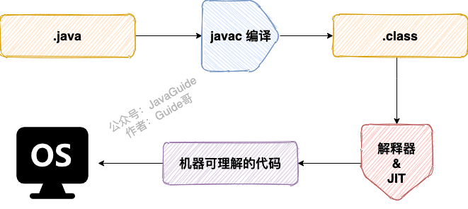
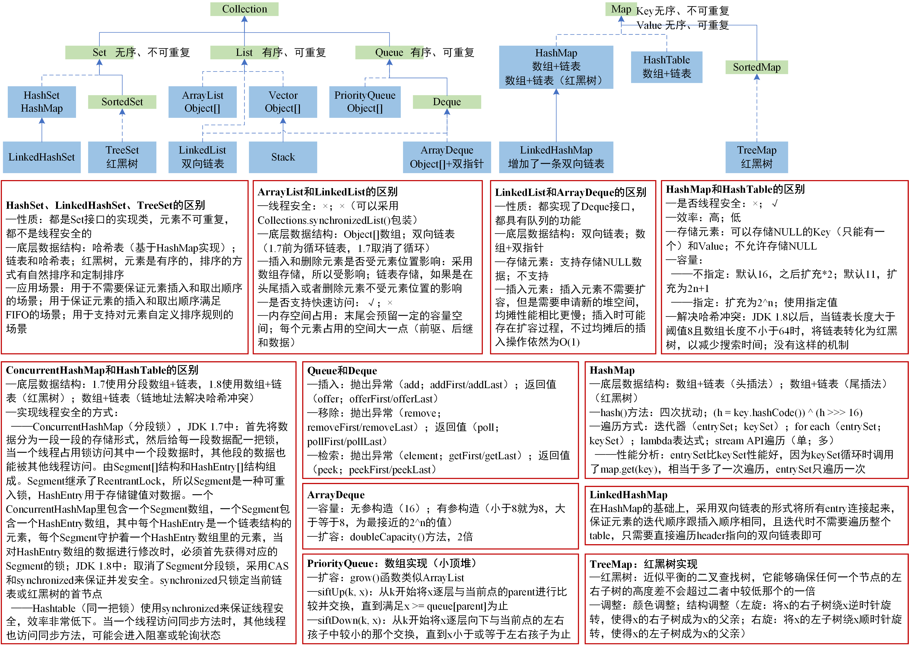

# Java SE

## 一、基础概念与常识

> 参考链接：[JavaGuide](https://javaguide.cn/java/basis/java-basic-questions-01.html#%E5%9F%BA%E7%A1%80%E6%A6%82%E5%BF%B5%E4%B8%8E%E5%B8%B8%E8%AF%86)

### 1.1 JVM vs JDK vs JRE:airplane:

JVM是运行Java字节码的**虚拟机**。JVM有针对不同系统的特定实现，目的是**使用相同的字节码，它们都会给出相同的结果**。实现“一次编译，到处运行”的关键。**JVM并不是只有一种**！

JDK（Java Development Kit）：功能齐全的**Java SDK**，**拥有JRE所拥有的一切**，还有编译器（javac）和工具（如javadoc和jdb）。它能够**创建**和**编译**程序。

JRE（Java Runtime Environment）：Java运行时环境。它是**运行已编译的Java程序所需的所有内容的集合**，包括JVM，Java类库，java命令和其他的一些基础构件，**但是它不能用于创建新程序**。

### 1.2 什么是字节码？采用字节码的好处？

在Java中，**JVM可以理解的代码就叫做字节码（即扩展名为`.class`的文件）**，它不面向任何特定的处理器，**只面向虚拟机**。Java语言通过字节码的方式，在一定程度上解决了传统解释型语言执行效率低的问题，同时又保留了解释型语言可移植的特点。

**Java程序从源代码到运行的过程如下图所示**：



需要格外注意的是`.class->机器码`这一步。在这一步JVM类加载器首先加载字节码文件，然后通过解释器逐行解释执行，这种方式的执行速度会相对比较慢。而且，有些方法和代码块是经常需要被调用的（也就是所谓的热点代码)，所以后面引进了JIT（Just-in-time Compilation） 编译器，而JIT属于运行时编译。**当JIT编译器完成第一次编译后，其会将字节码对应的机器码保存下来，下次可以直接使用**，机器码的运行效率肯定是高于Java解释器的，这也解释了为什么经常会说**Java是编译与解释共存的语言** 。

### 1.3 为什么说Java“编译与解释并存”？

可以将高级编程语言按照程序的执行方式分为两种：

- **编译型**：**编译型语言将源代码一次性翻译成可被该平台执行的机器码**。一般情况下，编译语言的执行速度比较快，开发效率比较低。常见的编译性语言有C、C++、Go、Rust等等。
- **解释型**：**解释型语言一句一句的将代码解释（Interpret）为机器代码后再执行**。解释型语言开发效率比较快，执行速度比较慢。常见的解释性语言有Python、JavaScript、PHP等等。


**为什么说Java语言“编译与解释并存”**？

这是因为Java语言既具有编译型语言的特征，也具有解释型语言的特征。因为Java程序要经过**先编译，后解释**两个步骤，由Java编写的程序需要先**经过编译步骤生成字节码（`.class`文件）**，这种字节码必须由**Java解释器来解释执行**。

### 1.4 Java和C++的区别:airplane:

虽然，Java和C++都是面向对象的语言，都支持封装、继承和多态，但是它们还是有挺多不相同的地方：

- Java**不提供指针**来直接访问内存，程序内存更加安全。
- Java的类是**单继承**的，C++支持多重继承；虽然Java的类不可以多继承，但是接口可以多继承。
- Java有**自动内存管理垃圾回收机制（GC）**，不需要程序员手动释放无用内存。
- C++同时支持**方法重载**和**操作符重载**，但是Java**只支持方法重载**（操作符重载增加了复杂性，这与Java最初的设计思想不符）。

### 1.5 Java和Python的区别

> 参考链接：[CSDN](https://blog.csdn.net/weixin_42269778/article/details/106911764)

- Java完全面向对象，而Python既面向对象又面向过程。
- Java编译与解释并存，而Python是解释型语言。
- Java开发效率低，运行效率高，Python开发效率高但运行效率较低。
- Java是动态语言，Python是静态语言。
- Java单继承，Python支持多继承。
- Java适合商业开发，Python由于有大量的第三方库所以更适合科学计算和数据开发等工作。

## 二、基本语法

> 参考链接：[JavaGuide](https://javaguide.cn/java/basis/java-basic-questions-01.html#%E5%9F%BA%E6%9C%AC%E8%AF%AD%E6%B3%95)

### 2.1 Java关键字

|         分类         |                            关键字                            |
| :------------------: | :----------------------------------------------------------: |
|       访问控制       |                `private` `protected` `public`                |
| 类、方法和变量修饰符 |                      `abstract` `final`                      |
|       基本类型       | `int` `byte` `short` `long` `float` `double` `boolean` `char` |
|        保留字        |                        `goto` `const`                        |
|          …           |                              …                               |

说明：

- 所有的关键字都是小写。
- `default`这个关键字很特殊，既属于程序控制，也属于类，方法和变量修饰符，还属于访问控制。
  - 在程序控制中，当`switch`中匹配不到任何情况时，可以使用`default`来编写默认匹配的情况。
  - 在类，方法和变量修饰符中，从JDK 8开始引入了默认方法，可以使用`default`关键字来定义一个方法的默认实现。
  - 在访问控制中，如果一个方法前没有任何修饰符，则默认会有一个修饰符`default`，**但是这个修饰符加上了就会报错**。
- 虽然`true`, `false`和`null`看起来像关键字，但实际上它们是**字面值**，并且也不可以被用作标识符。

### 2.2 变量

#### 成员变量和局部变量的区别

> 参考链接：[CSDN](https://blog.csdn.net/qq_26707371/article/details/101467664)

|          |                           成员变量                           |                          局部变量                           |
| :------: | :----------------------------------------------------------: | :---------------------------------------------------------: |
| 语法形式 | 属于类，可以被访问控制修饰符、`static`（静态变量）、`final`等修饰 | 在代码块或方法中定义的变量或是方法的参数，可以被`final`修饰 |
| 存储方式 |              堆（JDK 1.7前，静态变量在方法区）               |                             栈                              |
| 生存时间 |       从对象创建（类加载）开始到对象销毁（类卸载）结束       |                  跟随方法的调用开始和结束                   |
|  默认值  | 自动以**类型的默认值**而赋值（如果被`final`修饰，必须显式赋值） |                        不会自动赋值                         |

### 2.3 方法

#### 静态方法为什么不能调用非静态成员？:airplane:

这个需要结合JVM的相关知识，主要原因如下：

- **静态方法是属于类的**，在类加载的时候就会分配内存，可以通过类名直接访问；**而非静态成员属于实例对象**，**只有在对象实例化之后才存在**，需要通过类的实例对象去访问。
- 在类的非静态成员不存在的时候静态成员就已经存在了，此时**调用在内存中还不存在的非静态成员，属于非法操作**。

#### 静态方法和实例方法有什么不同？

|            |                           静态方法                           |   实例方法    |
| :--------: | :----------------------------------------------------------: | :-----------: |
|  调用方式  |    在外部调用，`类名.方法名`或`对象.方法名`（不建议使用）    | `对象.方法名` |
| 访问类成员 | 只允许访问**静态成员**（静态成员变量和静态方法），不允许访问实例成员（实例成员变量和实例方法） |  不存在限制   |

#### 重载和重写的区别

重载：发生在**同一个类中（或者父类和子类之间）**，方法名必须相同，**参数类型不同、个数不同、顺序不同**，**方法返回值和访问修饰符可以不同**。**重载就是同一个类中多个同名方法根据不同的传参来执行不同的逻辑处理**。

编译器通过用各个方法给出的**参数类型**与特定方法调用所使用的值类型进行**匹配**来挑选出相应的方法。 如果编译器找不到匹配的参数，会产生编译时错误（这个过程被称为重载解析）。Java允许**重载任何方法**。

重写：发生在运行期，是子类对父类中**允许访问的方法的实现过程的重新编写**：

- **方法名、参数列表必须相同**（两同），子类方法**返回值类型**应比父类方法返回值类型**更小或相等**（一小），抛出的**异常范围小于等于父类**（一小），**访问修饰符范围大于等于父类**（一大）。
- 如果父类方法访问修饰符为`private/final/static`，则子类就不能重写该方法，但是被`static`修饰的方法能够被**再次声明（重定义）**。

#### 值传递

> 参考链接：[JavaGuide](https://javaguide.cn/java/basis/why-there-only-value-passing-in-java.html#%E6%80%BB%E7%BB%93)

Java中将实参传递给方法的方式是**值传递**：

- 如果参数是基本类型，传递的就是**基本类型的字面量值的拷贝，会创建副本**。
- 如果参数是引用类型，传递的就是**所引用的对象在堆中地址值的拷贝，同样也会创建副本**。

## 三、基本数据类型

> 参考链接：[JavaGuide](https://javaguide.cn/java/basis/java-basic-questions-01.html#%E5%9F%BA%E6%9C%AC%E6%95%B0%E6%8D%AE%E7%B1%BB%E5%9E%8B)

### 3.1 8种基本数据类型

| 基本类型  | 位数 |                  取值范围                  |   包装类    |
| :-------: | :--: | :----------------------------------------: | :---------: |
|   `int`   |  32  |          -2147483648 ~ 2147483647          |  `Integer`  |
|  `byte`   |  8   |                 -128 ~ 127                 |   `Byte`    |
|  `short`  |  16  |               -32768 ~ 32767               |   `Short`   |
|  `long`   |  64  | -9223372036854775808 ~ 9223372036854775807 |   `Long`    |
|  `float`  |  32  |           1.4E-45 ~ 3.4028235E38           |   `Float`   |
| `double`  |  64  |     4.9E-324 ~ 1.7976931348623157E308      |  `Double`   |
| `boolean` |  1   |                true、false                 |  `Boolean`  |
|  `char`   |  16  |                 0 ~ 65535                  | `Character` |

注意：使用`long`类型的数据一定要在数值后加`L`，否则会被视作整型处理。

### 3.2 基本类型和包装类型的区别？

- 作为成员变量，包装类型不赋值就是`null`，而基本类型有默认值且不为`null`。
- 包装类型可用于**泛型**，而基本类型不可以。
- 相比于对象类型， 基本数据类型占用的空间非常小。

### 3.3 包装类型的缓存机制:airplane:

Java**包装类型的大部分都用到了缓存机制来提升性能**。`Byte`、`Short`、`Integer`、`Long`这4种包装类默认创建了数值**[-128，127]**的相应类型的缓存数据，`Character`创建了数值在**[0,127]**范围的缓存数据，`Boolean`直接返回`True`or`False`。两种浮点数类型的包装类`Float`和`Double`并没有实现缓存机制。

如果超出对应范围仍然会去创建新的对象，缓存的范围区间的大小只是**在性能和资源之间的权衡**。

```java
Integer i1 = 33;
Integer i2 = 33;
System.out.println(i1 == i2);// 输出 true，由于缓存机制

Float i11 = 333f;
Float i22 = 333f;
System.out.println(i11 == i22);// 输出 false，没有缓存机制

Double i3 = 1.2;
Double i4 = 1.2;
System.out.println(i3 == i4);// 输出 false，没有缓存机制

// 缓存机制，输出 false
Integer i1 = 40;
Integer i2 = new Integer(40);
System.out.println(i1==i2);
```

`Integer i1 = 40`这一行代码会发生装箱，也就是说这行代码等价于`Integer i1 = Integer.valueOf(40)` ，`i1`直接使用的是**缓存中的对象**，而`Integer i2 = new Integer(40)`是会直接**创建一个新的对象**。

所以记住：**所有整型包装类对象之间值的比较，推荐使用`.equals()`方法比较**。

### 3.4 自动装箱与拆箱的原理

**装箱**：将基本类型用它们对应的引用类型包装起来；**拆箱**：将包装类型转换为基本数据类型。

```java
Integer i = 10;  //装箱
int n = i;   //拆箱
```

上面这两行代码对应的字节码为：

```
   L1

    LINENUMBER 8 L1

    ALOAD 0

    BIPUSH 10

    INVOKESTATIC java/lang/Integer.valueOf (I)Ljava/lang/Integer;

    PUTFIELD AutoBoxTest.i : Ljava/lang/Integer;

   L2

    LINENUMBER 9 L2

    ALOAD 0

    ALOAD 0

    GETFIELD AutoBoxTest.i : Ljava/lang/Integer;

    INVOKEVIRTUAL java/lang/Integer.intValue ()I

    PUTFIELD AutoBoxTest.n : I

    RETURN
```

从字节码中发现，装箱其实就是调用了包装类的`valueOf()`方法，拆箱其实就是调用了`xxxValue()`方法。注意：**如果频繁拆装箱的话，也会严重影响系统的性能**，应该尽量避免不必要的拆装箱操作。

## 四、面向对象基础

> 参考链接：[JavaGuide](https://javaguide.cn/java/basis/java-basic-questions-02.html#%E9%9D%A2%E5%90%91%E5%AF%B9%E8%B1%A1%E5%9F%BA%E7%A1%80)

### 4.1 面向对象三大特征:rocket:

#### 封装

封装是指**把一个对象的状态信息（也就是属性）隐藏在对象内部**，不允许外部对象**直接访问**对象的内部信息，但是可以提供一些可以被外界访问的**方法来操作属性**。

#### 继承

不同类型的对象，相互之间**经常有一定数量的共同点**。同时，每一个对象还定义了额外的**特性**使得它们与众不同。继承是**使用已存在的类的定义作为基础建立新类的技术，新类的定义可以增加新的数据或新的功能，也可以用父类的功能，但不能选择性地继承父类**。通过继承，可以快速地创建新的类，可以提高代码的重用，程序的可维护性，节省大量创建新类的时间 ，提高开发效率。

注意：

- 子类**拥有**父类对象所有的属性和方法（包括私有属性和私有方法），但是**父类中的私有属性和私有方法子类无法访问**，只是拥有。
- 子类可以拥有自己属性和方法，即子类可以对父类进行扩展。
- 子类可以用自己的方式实现父类的方法。

#### 多态

多态，顾名思义，表示一个对象具有多种状态，**具体表现为父类的引用指向子类的实例**。

**多态的特点**：

- 对象类型和引用类型之间具有继承（类）/实现（接口）的关系。
- 引用类型变量发出的方法调用的到底是哪个类中的方法，必须在程序运行期间才能确定。如果子类重写了父类的方法，真正执行的是**子类覆盖的方法**，如果子类没有覆盖父类的方法，执行的是父类的方法。
- 多态**不能调用“只在子类存在但在父类不存在”的方法（子类扩展的方法）**。

### 4.2 接口和抽象类有什么共同点和不同点？

|                  |                             接口                             |                           抽象类                            |
| :--------------: | :----------------------------------------------------------: | :---------------------------------------------------------: |
|      实例化      |                             :x:                              |                             :x:                             |
|   包含抽象方法   |                             :o:                              |                             :o:                             |
| 有默认实现的方法 |                  `default`修饰（JDK 8开始）                  |                             :o:                             |
|       使用       | 主要用于**约束类的行为**，**实现了某个接口就具有了对应的行为** |           主要用于代码复用，强调的是**所属关系**            |
|    实现/继承     |                           多个实现                           |                          单个继承                           |
|     成员变量     | 成员变量只能是`public`、`static`、`final`类型，**不能被修改且必须有初始值** | 成员变量默认`default`，可在子类中被重新定义，也可被重新赋值 |

### 4.3 深拷贝和浅拷贝区别？什么是引用拷贝？

|      |                            浅拷贝                            |                        深拷贝                        |           引用拷贝           |
| :--: | :----------------------------------------------------------: | :--------------------------------------------------: | :--------------------------: |
| 内容 | 会在堆上创建一个新的对象。**如果原对象内部的属性是引用类型的话，会直接复制内部对象的引用地址**，也就是说拷贝对象和原对象**共用**同一个内部对象 | 会**完全复制**整个对象，包括这个对象所包含的内部对象 | 两个不同的引用指向同一个对象 |


## 五、Java常用类

> 参考链接：[JavaGuide](https://javaguide.cn/java/basis/java-basic-questions-02.html#java-%E5%B8%B8%E8%A7%81%E7%B1%BB)

### 5.1 `Object`:rocket:

#### 常用方法

- `getClass()`方法：属于native方法，由`final`关键字修饰，不允许子类重写。返回当前运行时对象的`Class`对象。
- `hashCode()`方法：用于返回对象的哈希码。
- `equals()方法`：用于比较两个对象的内存地址是否相等。
- `clone()`方法：用于创建并返回当前对象的一份拷贝。
- `toString()`方法：返回类的名字实例的哈希码（16进制字符串）。建议`Object`所有子类都重写这个方法。
- `notify()`方法：属于native方法，由`final`关键字修饰，不允许子类重写。唤醒一个在此对象监视器上等待的线程（监视器相当于锁的概念）。如果有多个线程在等待只会任意唤醒一个。
- `notifyAll()`方法：属于native方法，由`final`关键字修饰，不允许子类重写。和notify()方法一样，区别在于会唤醒在此对象监视器上等待的所有线程，而不是一个线程。
- `wait()`方法：属于native方法，由`final`关键字修饰，不允许子类重写。用于暂停线程的执行，释放了锁。有重载方法：
  - 多了`nanos`参数，表示额外时间（以毫微秒为单位）。
  - 没有任何参数，一直等待，没有超时时间。
- `finalize()`方法：实例被垃圾回收器回收的时候触发的操作。

#### `==`和`equals()`的区别

|              |       `==`       |                          `equals()`                          |
| :----------: | :--------------: | :----------------------------------------------------------: |
| 基本数据类型 |    比较**值**    |                             :x:                              |
| 引用数据类型 | 比较**内存地址** | 没有重写：使用的是父类Object的`equals()`方法，等价于`==`<br />重写：重写`equals()`方法来比较两个对象中的**属性是否相等** |

举例说明：

```java
String a = new String("ab"); // a 为一个引用
String b = new String("ab"); // b为另一个引用,对象的内容一样
String aa = "ab"; // 放在常量池中
String bb = "ab"; // 从常量池中查找
System.out.println(aa == bb);// true
System.out.println(a == b);// false
System.out.println(a.equals(b));// true
System.out.println(42 == 42.0);// true
```

当创建`String`类型的对象时，虚拟机会**在常量池中查找有没有已经存在的值和要创建的值相同的对象**，如果有就把它赋给当前引用，如果没有就在常量池中重新**创建**一个新的`String`对象。

`String`中的`equals()`方法是被重写过的，`Object`的`equals()`方法比较对象的内存地址，而`String`的`equals()`方法比较对象的值。

`String`类`equals()`方法：

```java
public boolean equals(Object anObject) {
    if (this == anObject) {
        return true;
    }
    if (anObject instanceof String) {
        String anotherString = (String)anObject;
        int n = value.length;
        if (n == anotherString.value.length) {
            char v1[] = value;
            char v2[] = anotherString.value;
            int i = 0;
            while (n-- != 0) {
                if (v1[i] != v2[i])
                    return false;
                i++;
            }
            return true;
        }
    }
    return false;
}
```

#### `hashCode()`有什么用？

`hashCode()`的作用是**获取哈希码**（`int`整数），也称为散列码。这个哈希码的作用是**确定该对象在哈希表中的索引位置**。`hashCode()`定义在`Object` 类中，这就意味着Java中的任何类都包含有`hashCode()`方法。另外需要注意的是：`Object`的`hashCode()`方法是本地方法，也就是**用C语言或C++实现的**，该方法通常用来**将对象的内存地址转换为整数**之后返回。

散列表存储的是键值对，它的特点是：**能根据“键”快速检索出对应的“值”**。

#### 为什么要有`hashCode()`？

以HashSet如何检查重复为例子来说明为什么要有`hashCode()`。

当把对象加入HashSet时，HashSet会先通过`hashCode()`计算对象的哈希码来**判断对象加入的位置**，同时也会与其他已经加入的对象的哈希码比较；如果没有相符的哈希码，**会假设对象没有重复出现**；如果发现有相同哈希码的对象，这时会调用`equals()`方法来检查相等的对象**是否真的相同**。如果两者相同，HashSet就不会让其加入；如果不同的话，就会重新散列到其他位置。这样就大大减少了`equals()`的次数，相应地也大大提高了执行速度。

从上面可以看出，`hashCode()`和`equals()`都是用于比较两个对象是否相等。**那为什么JDK还要同时提供这两个方法呢**？

这是因为在一些容器（比如`HashMap`、`HashSet`）中，有了`hashCode()`之后，**判断元素是否在对应容器中的效率会更高**。**那为什么不只提供`hashCode()`方法呢**？这是因为**两个对象的哈希码相等并不一定代表两个对象就相等**。原因在于：因为`hashCode()`所使用的哈希算法**也许刚好会让多个对象传回相同的哈希值**，越糟糕的哈希算法越容易碰撞，但这也与数据值域分布的特性有关（所谓哈希碰撞也就是指不同的对象得到相同的哈希码 )。

总结下来就是：

- 如果两个对象的哈希码相等，那这两个对象不一定相等（哈希碰撞）。
- 如果两个对象的哈希码相等并且`equals()`方法也返回 `true`，才可以认为这两个对象相等。
- 如果两个对象的哈希码不相等，可以直接认为这两个对象不相等。

#### 为什么重写`equals()`时必须重写`hashCode()`方法？

因为两个相等对象的哈希码必然相等，也就是说如果`equals()`方法判断两个对象是相等的，那这两个对象的`hashCode()`值也要相等。如果只重写`equals()`却没有重写`hashCode()`，可能会导致`equals()`判断是相等的两个对象，但它们的哈希值并不相等。

### 5.2 `String`:rocket:

#### `String`、`StringBuffer`、`StringBuilder`的区别？

|            |               `String`               | `StringBuilder` |                        `StringBuffer`                        |
| :--------: | :----------------------------------: | :-------------: | :----------------------------------------------------------: |
|   可变性   |                 :x:                  |       :o:       |                             :o:                              |
| 线程安全性 |                 :o:                  |       :x:       | :o:（加了**同步锁**或者对调用的方法加了同步锁，`synchronized`） |
|    性能    | 每次改变都会生成一个新的`String`对象 | 对本身进行操作  |                        对本身进行操作                        |
|  适用范围  |            操作少量的数据            |     单线程      |                            多线程                            |

#### `String`为什么不可变？

`String`类中使用`final`关键字修饰字符数组来保存字符串（被`final`关键字修饰的**类不能被继承**，修饰的**方法不能被重写**，修饰的变量是**基本数据类型则值不能改变**，修饰的变量是**引用数据类型则不能再指向其他对象**）。但是，**`final`关键字修饰的数组保存字符串并不是`String`不可变的根本原因**，因为这个数组保存的字符串是可变的（`final`修饰引用类型变量的情况）。

```java
public final class String implements java.io.Serializable, Comparable<String>, CharSequence {
    private final char value[];
	//...
}
```

`String`真正不可变的原因：

- 保存字符串的数组还被`private`修饰，而且`String`类没有提供/暴露修改这个字符串的方法。
- `String`类被`final`修饰导致其不能被继承，进而避免了子类破坏`String`不可变。

#### 字符串拼接使用`+`还是`StringBuilder`？

Java语言本身并不支持运算符重载，`+`和`+=`是专门为`String`类重载过的运算符，也是Java中仅有的两个重载过的元素符。

```java
String str1 = "he";
String str2 = "llo";
String str3 = "world";
String str4 = str1 + str2 + str3;
```

上面代码对应的字节码如下：


可以看出，字符串对象使用`+`的拼接方式，实际上是通过`StringBuilder`调用`append()`方法实现的，拼接完成之后调用`toString()`得到一个`String`对象 。不过，在循环内使用`+`进行字符串拼接的话，存在比较明显的缺陷：**编译器会导致创建过多的`StringBuilder`对象，而不会创建单个以复用**。

```java
String[] arr = {"he", "llo", "world"};
String s = "";
for (int i = 0; i < arr.length; i++) {
    s += arr[i];
}
System.out.println(s);
```


#### 字符串常量池的作用？

**字符串常量池**是JVM为了**提升性能和减少内存**消耗针对字符串（`String`类）专门开辟的一块区域，主要目的是为了避免字符串的重复创建。

```java
// 在堆中创建字符串对象”ab“
// 将字符串对象”ab“的引用保存在字符串常量池中
String aa = "ab";
// 直接返回字符串常量池中字符串对象”ab“的引用
String bb = "ab";
System.out.println(aa==bb);// true
```

#### `intern()`方法的作用？

`String.intern()`是一个`native`方法，其作用是**将指定的字符串对象的引用保存在字符串常量池中**，可以简单分为两种情况：

- 如果字符串常量池中保存了对应的字符串对象的引用，就直接返回该引用。
- 如果字符串常量池中没有保存对应的字符串对象的引用，那就在常量池中创建一个指向该字符串对象的引用并返回。

```java
// 在堆中创建字符串对象”Java“
// 将字符串对象”Java“的引用保存在字符串常量池中
String s1 = "Java";
// 直接返回字符串常量池中字符串对象”Java“对应的引用
String s2 = s1.intern();
// 会在堆中在单独创建一个字符串对象
String s3 = new String("Java");
// 直接返回字符串常量池中字符串对象”Java“对应的引用
String s4 = s3.intern();
// s1 和 s2 指向的是堆中的同一个对象
System.out.println(s1 == s2); // true
// s3 和 s4 指向的是堆中不同的对象
System.out.println(s3 == s4); // false
// s1 和 s4 指向的是堆中的同一个对象
System.out.println(s1 == s4); //true
```

#### `String`类型的变量和常量做`+`运算时发生了什么？

先来看字符串不加`final`关键字拼接的情况：

```java
String str1 = "str";
String str2 = "ing";
// 常量池中的对象
String str3 = "str" + "ing";
// 堆中的新对象
String str4 = str1 + str2;
// 常量池中的对象
String str5 = "string";
System.out.println(str3 == str4);//false
System.out.println(str3 == str5);//true
System.out.println(str4 == str5);//false
```

对于编译期可以确定值的字符串，**也就是常量字符串** ，JVM会将其存入字符串常量池。并且，**字符串常量拼接得到的字符串常量在编译阶段就已经被存放字符串常量池**，这个得益于编译器的优化。

在编译过程中，Javac编译器（下文中统称为编译器）会进行一个叫做**常量折叠（Constant Folding）**的代码优化。常量折叠会把**常量表达式的值求出来作为常量嵌在最终生成的代码中**，这是编译器会对源代码做的极少量优化措施之一（代码优化几乎都在即时编译器JIT中进行）。

对于`String str3 = "str" + "ing";`，编译器会优化为`String str3 = "string";` 。但并不是所有的常量都会进行折叠，**只有编译器在程序编译期就可以确定值的常量才可以**：

- 基本数据类型（`byte`、`boolean`、`short`、`char`、`int`、`float`、`long`、`double`）以及字符串常量。
- `final`修饰的基本数据类型和字符串变量。
- 字符串通过`+`拼接得到的字符串、基本数据类型之间算数运算（加减乘除）、基本数据类型的位运算（`<<`、`>>`、`>>>`）。

**引用的值在程序编译期是无法确定的，编译器无法对其进行优化。**

不过，字符串使用`final`关键字声明之后，可以让编译器当做常量来处理。因为编译器在程序编译期就可以确定它的值，其效果就相当于访问常量。

```java
final String str1 = "str";
final String str2 = "ing";
// 下面两个表达式其实是等价的
String c = "str" + "ing";// 常量池中的对象
String d = str1 + str2; // 常量池中的对象
System.out.println(c == d);// true
```

## 六、异常

> 参考链接：[JavaGuide](https://javaguide.cn/java/basis/java-basic-questions-03.html#%E5%BC%82%E5%B8%B8)

Java异常类层次结构图：


### 6.1 `Exception`和`Error`有什么区别？:airplane:

在Java中，所有异常都有一个共同的祖先，即`java.lang`包中的`Throwable`类，它有两个重要的子类：

- **`Exception`**：程序本身可以处理的异常，可以通过`catch`来进行捕获。`Exception`又可以分为Checked Exception（受检查异常，必须处理）和Unchecked Exception（不受检查异常，可以不处理）。
- **`Error`**：`Error`属于程序无法处理的错误 ，不建议通过`catch`捕获 。例如Java虚拟机运行错误`Virtual MachineError`、虚拟机内存不够错误`OutOfMemoryError`、类定义错误`NoClassDefFoundError`等 。这些异常发生时，JVM一般会选择终止线程。

### 6.2 Checked Exception和Unchecked Exception的区别？

**Checked Exception**即受检查异常，Java代码在编译过程中，如果受检查异常没有被`catch`或者`throws`关键字处理的话，就无法通过编译。

**Unchecked Exception**即不受检查异常，Java代码在编译过程中，即使不处理不受检查异常也可以正常通过编译。`RuntimeException`及其子类都统称为非受检查异常，常见的有：

- `NullPointerException`：空指针异常。
- `IllegalArgumentException`：参数异常，比如方法入参类型不对应。
- `NumberFormatException`：字符串转换为数字格式异常，属于`IllegalArgumentException`的子类。
- `ArrayIndexOutOfBoundsException`：数组越界异常。
- `ClassCastException`：类型转换异常。
- `ArithmeticException`：算术异常。
- `SecurityException`：安全异常，例如权限不够。
- `UnsupportedOperationException`：不支持的操作异常，例如重复创建同一用户。

### 6.3 `Throwable`类常用方法

- `String getMessage()`：返回异常发生时的简要描述。
- `String toString()`：返回异常发生时的详细信息。
- `String getLocalizedMessage()`：返回异常对象的本地化信息。使用`Throwable`的子类覆盖这个方法，可以生成本地化信息。如果子类没有覆盖该方法，则该方法返回的信息与`getMessage()`返回的结果相同。
- `void printStackTrace()`：在控制台上打印`Throwable`对象封装的异常信息。

### 6.4 `finally`块中的代码一定会被执行吗？:airplane:

不一定，在某些情况下，`finally`中的代码不会被执行，例如在`finally`之前虚拟机被终止运行的话，块中的代码就不会被执行。

```java
try {
    System.out.println("Try to do something");
    throw new RuntimeException("RuntimeException");
} catch (Exception e) {
    System.out.println("Catch Exception -> " + e.getMessage());
    // 终止当前正在运行的Java虚拟机
    System.exit(1);
} finally {
    System.out.println("Finally");
}

// 输出
// Try to do something
// Catch Exception -> RuntimeException
```

另外，在以下2种特殊情况下，`finally`块中代码也不会被执行：

- 程序所在的线程死亡。
- 关闭CPU。

## 七、泛型&反射&注解

### 7.1 泛型

> 参考链接：[JavaGuide](https://javaguide.cn/java/basis/java-basic-questions-03.html#%E6%B3%9B%E5%9E%8B)

#### 什么是泛型？

**Java泛型（Generics）**是JDK 5中引入的一个新特性。使用泛型参数，可以增强代码的可读性以及稳定性。编译器可以对泛型参数进行检测，并且通过泛型参数可以**指定传入的对象类型**。比如`ArrayList<Person> persons = new ArrayList<Person>()`这行代码就指明了该`ArrayList`对象只能传入`Person`对象，如果传入其他类型的对象就会报错。

```java
ArrayList<E> extends AbstractList<E>
```

并且，原生`List`返回类型是`Object`，**需要手动转换类型才能使用，使用泛型后编译器自动转换**。

#### 泛型的使用方式有哪几种？

泛型一般有三种使用方式：**泛型类**、**泛型接口**、**泛型方法**。

##### 泛型类

```java
//此处T可以随便写为任意标识，常见的如T、E、K、V等形式的参数常用于表示泛型
//在实例化泛型类时，必须指定T的具体类型
public class Generic<T>{

    private T key;

    public Generic(T key) {
        this.key = key;
    }

    public T getKey(){
        return key;
    }
}
```

如何实例化泛型类：

```java
Generic<Integer> genericInteger = new Generic<Integer>(123456);
```

##### 泛型接口

```java
public interface Generator<T> {
    public T method();
}
```

实现泛型接口，不指定类型：

```java
class GeneratorImpl<T> implements Generator<T>{
    @Override
    public T method() {
        return null;
    }
}
```

实现泛型接口，指定类型：

```java
class GeneratorImpl<T> implements Generator<String>{
    @Override
    public String method() {
        return "hello";
    }
}
```

##### 泛型方法

```java
public static <E> void printArray(E[] inputArray) {
	for (E element: inputArray){
    	System.out.printf("%s ", element);
    }
    System.out.println();
}
```

使用：

```java
// 创建不同类型数组： Integer, Double 和 Character
Integer[] intArray = { 1, 2, 3 };
String[] stringArray = { "Hello", "World" };
printArray(intArray);
printArray(stringArray);
```

注意：`public static < E > void printArray( E[] inputArray )` 一般被称为**静态泛型方法**。泛型只是一个占位符，必须在传递类型后才能使用。类在实例化时才能真正的传递类型参数，由于静态方法的加载先于类的实例化，也就是说**类中的泛型还没有传递真正的类型参数，静态方法的加载就已经完成了**，所以**静态泛型方法是没有办法使用类上声明的泛型的**，只能使用自己声明的`<E>`。

### 7.2 反射

> 参考链接：[JavaGuide](https://javaguide.cn/java/basis/java-basic-questions-03.html#%E5%8F%8D%E5%B0%84)、[JavaGuide](https://javaguide.cn/java/basis/reflection.html)

#### 何为反射？

反射之所以被称为框架的灵魂，主要是因为它拥有**在运行时分析类以及执行类中方法的能力**。通过反射**可以获取任意一个类的所有属性和方法**并且加以调用。

#### 反射机制优缺点

- **优点**：可以让代码更加灵活、为各种框架提供开箱即用的功能提供了便利。
- **缺点**：在运行时有了分析操作类的能力，这同样也**增加了安全问题**。比如可以无视泛型参数的安全检查（泛型参数的安全检查发生在编译时）。另外，反射的性能也要稍差点，不过对于框架来说实际影响不大。

#### 反射的应用场景

像Spring/Spring Boot、MyBatis等框架中都大量使用了反射机制。**这些框架中也大量使用了动态代理，而动态代理的实现也依赖反射。**

比如下面是通过JDK实现动态代理的示例代码，其中就使用了反射类`Method`来调用指定的方法。

```java
public class DebugInvocationHandler implements InvocationHandler {
    /**
     * 代理类中的真实对象
     */
    private final Object target;

    public DebugInvocationHandler(Object target) {
        this.target = target;
    }

    public Object invoke(Object proxy, Method method, Object[] args) throws InvocationTargetException, IllegalAccessException {
        System.out.println("before method " + method.getName());
        Object result = method.invoke(target, args);
        System.out.println("after method " + method.getName());
        return result;
    }
}
```

另外，像Java中的一大利器——**注解**的实现也用到了反射。**可以基于反射分析类，然后获取到类/属性/方法/方法的参数上的注解**。获取到注解后就可以做进一步的处理。

#### 反射演示

##### 获取`Class`对象的四种方式

Java提供了四种方式获取`Class`对象：

**知道具体类的情况下**：

```java
Class alunbarClass = TargetObject.class;
```

但是一般是不知道具体类的，基本都是通过遍历包下面的类来获取`Class`对象，通过此方式获取`Class`对象不会进行初始化。

**通过`Class.forName()`传入类的全路径获取**：

```java
Class alunbarClass1 = Class.forName("cn.javaguide.TargetObject");
```

**通过对象实例`instance.getClass()`获取**：

```java
TargetObject o = new TargetObject();
Class alunbarClass2 = o.getClass();
```

**通过类加载器`xxxClassLoader.loadClass()`传入类路径获取**：

```java
ClassLoader.getSystemClassLoader().loadClass("cn.javaguide.TargetObject");
```

通过类加载器获取`Class`对象**不会进行初始化**，意味着不进行包括初始化等一系列步骤，静态代码块和静态对象不会得到执行。

### 7.3 注解

> 参考链接：[JavaGuide](https://javaguide.cn/java/basis/java-basic-questions-03.html#%E6%B3%A8%E8%A7%A3)

`Annotation`（注解）是Java5开始引入的新特性，可以看作是一种特殊的注释，主要用于**修饰类、方法或者变量**。注解本质是一个继承了`Annotation`的特殊接口：

```java
@Target(ElementType.METHOD)
@Retention(RetentionPolicy.SOURCE)
public @interface Override {

}

public interface Override extends Annotation{

}
```

注解只有**被解析之后才会生效**，常见的解析方法有两种：

- **编译期直接扫描**：**编译器在编译Java代码的时候扫描对应的注解并处理**，比如某个方法使用`@Override`注解，编译器在编译的时候就会**检测当前的方法是否重写了父类对应的方法**。
- **运行期通过反射处理**：像框架中自带的注解（比如Spring框架的`@Value`、`@Component`）都是通过反射来进行处理的。

## 八、序列化与I/O

### 8.1 什么是序列化？什么是反序列化？

> 参考链接：[JavaGuide](https://javaguide.cn/java/basis/serialization.html#%E4%BB%80%E4%B9%88%E6%98%AF%E5%BA%8F%E5%88%97%E5%8C%96-%E4%BB%80%E4%B9%88%E6%98%AF%E5%8F%8D%E5%BA%8F%E5%88%97%E5%8C%96)

如果需要持久化Java对象，比如将Java对象保存在文件中，或者在网络传输Java对象，这些场景都需要用到序列化。简单来说：

- **序列化**：将**数据结构或对象转换成二进制字节流**的过程。
- **反序列化**：将**二进制字节流转换成数据结构或者对象**的过程。

对于Java这种面向对象编程语言来说，序列化的都是对象（`Object`），也就是实例化后的类（`Class`），但是在C++这种半面向对象的语言中，`struct`（结构体）定义的是数据结构类型，而`class`对应的是对象类型。

序列化的主要目的是**通过网络传输对象或者说是将对象存储到文件系统、数据库、内存中。**


### 8.2 序列化协议对应TCP/IP4层模型的哪一层？

> 参考链接：[JavaGuide](https://javaguide.cn/java/basis/serialization.html#%E5%BA%8F%E5%88%97%E5%8C%96%E5%8D%8F%E8%AE%AE%E5%AF%B9%E5%BA%94%E4%BA%8E-tcp-ip-4-%E5%B1%82%E6%A8%A1%E5%9E%8B%E7%9A%84%E5%93%AA%E4%B8%80%E5%B1%82)

OSI七层模型中，表示层做的事情主要就是对应用层的用户数据进行处理转换为二进制流。反过来的话，就是将二进制流转换成应用层的用户数据。


OSI七层协议模型中的应用层、表示层和会话层对应的都是TCP/IP四层模型中的应用层，所以**序列化协议属于TCP/IP协议应用层的一部分**。

### 8.3 如果不想进行序列化怎么办？

> 参考链接：[JavaGuide](https://javaguide.cn/java/basis/java-basic-questions-03.html#%E5%A6%82%E6%9E%9C%E6%9C%89%E4%BA%9B%E5%AD%97%E6%AE%B5%E4%B8%8D%E6%83%B3%E8%BF%9B%E8%A1%8C%E5%BA%8F%E5%88%97%E5%8C%96%E6%80%8E%E4%B9%88%E5%8A%9E)

对于不想进行序列化的变量，使用`transient`关键字修饰。`transient`关键字的作用是：**阻止实例中那些用此关键字修饰的的变量序列化**；当对象被反序列化时，被`transient`修饰的变量值不会被持久化和恢复。

关于`transient`还有几点注意：

- `transient`**只能修饰变量**，不能修饰类和方法。
- `transient`修饰的变量，在反序列化后变量值将会被置成类型的默认值。例如，如果是修饰`int`类型，那么反序列后结果就是`0`。
- `static`变量因为不属于任何对象（`Object`），所以无论有没有`transient`关键字修饰，均不会被序列化。

### 8.4 常见序列化协议

> 参考链接：[JavaGuide](https://javaguide.cn/java/basis/serialization.html#%E5%B8%B8%E8%A7%81%E5%BA%8F%E5%88%97%E5%8C%96%E5%8D%8F%E8%AE%AE%E5%AF%B9%E6%AF%94)

JDK自带的序列化方式一般不会用，**因为序列化效率低并且部分版本有安全漏洞**。比较常用的序列化协议有hessian、kyro、protostuff。

### 8.5 I/O流简介

> 参考链接：[JavaGuide](https://javaguide.cn/java/io/io-basis.html)

I/O即`Input/Output`。数据输入到计算机内存的过程即输入，反之输出到外部存储（比如数据库，文件，远程主机）的过程即输出。数据传输过程类似于水流，因此称为I/O流。I/O流在Java中分为输入流和输出流，而根据数据的处理方式又分为**字节流**和**字符流**。

Java I/O流的40多个类都是从如下4个抽象类基类中派生出来的。

- `InputStream`/`Reader`：所有输入流的基类，前者是字节输入流，后者是字符输入流。

- `OutputStream`/`Writer`：所有输出流的基类，前者是字节输出流，后者是字符输出流。

|          |                  `InputStream`                   |                     `Reader`                     |                `OutputStream`                |                   `Writer`                   |
| :------: | :----------------------------------------------: | :----------------------------------------------: | :------------------------------------------: | :------------------------------------------: |
|   概述   | 从源头（通常是文件）读取数据（字节信息）到内存中 | 从源头（通常是文件）读取数据（字符信息）到内存中 | 将数据（字节信息）写入到目的地（通常是文件） | 将数据（字符信息）写入到目的地（通常是文件） |
| 常用方法 |      `read()`：返回输入流中下一个字节的数据      |          `read()`：从输入流读取一个字符          |     `write(int b)`：将特定字节写入输出流     |         `write(int c)`：写入单个字符         |

#### 有了字节流为什么还要有字符流？

> 参考链接：[JavaGuide](https://javaguide.cn/java/basis/java-basic-questions-03.html#i-o-%E6%B5%81%E4%B8%BA%E4%BB%80%E4%B9%88%E8%A6%81%E5%88%86%E4%B8%BA%E5%AD%97%E8%8A%82%E6%B5%81%E5%92%8C%E5%AD%97%E7%AC%A6%E6%B5%81%E5%91%A2)

**不管是文件读写还是网络发送接收，信息的最小存储单元都是字节，那为什么I/O流操作要分为字节流操作和字符流操作呢**？

字符流是由Java虚拟机将字节转换得到的，问题就出在**这个过程还算是非常耗时**，并且，如果不知道编码类型就很容易出现乱码问题。

所以，I/O流就提供了一个直接操作字符的接口，方便平时对字符进行流操作。如果音频文件、图片等**媒体文件用字节流比较好**，如果涉及到字符的话使用字符流比较好。

### 8.6 I/O模型

> 参考链接：[JavaGuide](https://javaguide.cn/java/io/io-model.html#i-o)

#### 何为I/O？

从计算机结构的视角来看，I/O描述了**计算机系统与外部设备之间通信的过程**。

根据操作系统相关知识：为了保证操作系统的稳定性和安全性，一个进程的地址空间划分为**用户空间（User space）**和**内核空间（Kernel space）**。平常运行的应用程序都是在用户空间，只有内核空间才能进行系统态级别的资源有关的操作，并且用户空间的程序不能直接访问内核空间。

当想要执行I/O操作时，由于没有执行这些操作的权限，只能发起**系统调用**请求操作系统帮忙完成。在平常开发过程中接触最多的就是**磁盘IO（读写文件）**和**网络IO（网络请求和响应）**。

当应用程序发起I/O调用后，会经历两个步骤：

1. 内核等待I/O设备准备好数据；
2. 内核将数据从内核空间拷贝到用户空间。

#### 常见的I/O模型

UNIX系统下，I/O模型一共有5种：**同步阻塞I/O**、**同步非阻塞I/O**、**I/O多路复用**、**信号驱动I/O** 和**异步I/O**。

#### Java中常见的3种I/O模型:airplane:

##### BIO（Blocking I/O）

**BIO属于同步阻塞I/O模型** 。同步阻塞IO模型中，应用程序发起`read`调用后，会一直阻塞，**直到内核把数据拷贝到用户空间**。


在客户端连接数量不高的情况下是没问题的。但是当面对十万甚至百万级连接的时候，传统的BIO模型是无能为力的。因此需要一种更高效的I/O处理模型来应对更高的并发量。

##### NIO（Non-blocking I/O）

Java中的NIO对应`java.nio`包，提供了`Channel`，`Selector`，`Buffer`等抽象类。NIO中的N可以理解为Non-blocking，不单纯是New。它是**支持面向缓冲**的、基于通道的I/O操作方法。对于高负载、高并发的（网络）应用，应使用NIO。

Java中的NIO可以看作是**I/O多路复用模型**。也有很多人认为，Java中的NIO属于**同步非阻塞I/O模型**。


同步非阻塞I/O模型中，应用程序会一直发起`read`调用，等待数据从内核空间拷贝到用户空间的这段时间里，线程依然是阻塞的，直到在内核把数据拷贝到用户空间。相比于同步阻塞I/O模型，同步非阻塞I/O模型确实有了很大改进：**通过轮询操作，避免了一直阻塞**。

但是，这种I/O模型同样存在问题：**应用程序不断进行系统调用的过程（轮询）是十分消耗CPU资源的**。这个时候，**I/O多路复用模型**就上场了。


I/O多路复用模型中，线程首先发起`select`调用，询问内核数据是否准备就绪，等内核把数据准备好了，用户线程再发起`read`调用，其过程还是阻塞的。

**I/O多路复用模型，通过减少无效的系统调用，减少了对CPU资源的消耗**。Java中的NIO，有一个非常重要的**选择器 （Selector）**的概念，也可以被称为**多路复用器**。通过它，只需要一个线程便可以管理多个客户端连接。当客户端数据到了之后，才会为其服务。

##### AIO(Asynchronous I/O)

AIO也就是NIO 2，属于异步I/O模型。异步I/O是**基于事件和回调机制**实现的，也就是应用操作之后会直接返回，不会堵塞在那里，当后台处理完成，操作系统会通知相应的线程进行后续的操作。


##### 总结


## 九、代理模式

> 参考链接：[JavaGuide](https://javaguide.cn/java/basis/proxy.html)

代理模式是一种比较好理解的设计模式。简单来说就是**使用代理对象来代替对真实对象的访问**，这样就可以在不修改原目标对象的前提下，提供额外的功能操作，扩展目标对象的功能。

代理模式的主要作用是**扩展目标对象的功能**，比如说在目标对象的某个方法执行前后可以增加一些自定义的操作。

代理模式有**静态代理**和**动态代理**两种实现方式。

### 9.1 静态代理

静态代理中，对目标对象的每个方法的增强都是手动完成的，非常不灵活（比如接口一旦新增加方法，目标对象和代理对象都要进行修改）且麻烦（需要对每个目标类都单独写一个代理类）。

从JVM层面来说，**静态代理在编译时就将接口、实现类、代理类这些都变成了一个个实际的`.class`文件**。

静态代理实现步骤：

1. 定义一个接口及其实现类；
2. 创建一个代理类同样实现这个接口；
3. **将目标对象注入进代理类**，然后在**代理类的对应方法调用目标类中的对应方法**。这样就可以通过代理类屏蔽对目标对象的访问，并且可以在目标方法执行前后自定义其他方法。

示例：

```java
// 定义发送短信的接口
public interface SmsService {
    String send(String message);
}

// 实现接口
public class SmsServiceImpl implements SmsService {
    public String send(String message) {
        System.out.println("send message:" + message);
        return message;
    }
}

// 创建代理类并实现接口
public class SmsProxy implements SmsService {

    private final SmsService smsService;

    public SmsProxy(SmsService smsService) {
        this.smsService = smsService;
    }

    @Override
    public String send(String message) {
        //调用方法之前，添加操作
        System.out.println("before method send()");
        smsService.send(message);
        //调用方法之后，添加操作
        System.out.println("after method send()");
        return null;
    }
}

// 测试
public class Main {
    public static void main(String[] args) {
        // 目标对象
        SmsService smsService = new SmsServiceImpl();
        // 注入进代理对象
        SmsProxy smsProxy = new SmsProxy(smsService);
        smsProxy.send("java");
    }
}

// 输出
// before method send()
// send message:java
// after method send()
```

### 9.2 动态代理:airplane:

相比于静态代理来说，动态代理更加灵活，因为不需要针对每个目标类都单独创建一个代理类，并且也不需要实现接口，可以直接代理实现类。

从JVM角度来说，**动态代理是在运行时动态生成类字节码，并加载到JVM中的**。就Java来说，动态代理的实现方式有很多种，比如**JDK动态代理**、**CGLIB动态代理**等。

#### JDK动态代理

##### 介绍

在Java动态代理机制中，`InvocationHandler`接口和`Proxy`类是核心。`Proxy`类中使用频率最高的方法是：`newProxyInstance()`，这个方法主要用于生成一个代理对象。

```java
public static Object newProxyInstance(ClassLoader loader,
                                      Class<?>[] interfaces,
                                      InvocationHandler h) 
    throws IllegalArgumentException {
    ……
}
```

这个方法一共有3个参数：

- **`loader`**：类加载器，用于加载代理对象。
- **`interfaces`**：被代理类实现的一些接口。
- **`h`**：实现了`InvocationHandler`接口的对象。

要实现动态代理的话，还必须需要实现`InvocationHandler`来自定义处理逻辑。 当动态代理对象调用一个方法时，这个方法的调用就会被转发到实现`InvocationHandler`接口类的`invoke()`方法来调用。

```java
public interface InvocationHandler {
    /**
     * 当你使用代理对象调用方法的时候实际会调用到这个方法
     */
    public Object invoke(Object proxy, Method method, Object[] args)
        throws Throwable;
}
```

这个方法有3个参数：

- **`proxy`**：动态生成的代理类。
- **`method`**：与代理类对象调用的方法相对应。
- **`args`**：当前`method()`方法的参数。

也就是说：**通过`Proxy`类的`newProxyInstance()`创建的代理对象，在调用方法的时候，实际会调用到实现`InvocationHandler`接口的类的`invoke()`方法**。所以可以在`invoke()`方法中自定义处理逻辑，比如在方法执行前后做什么事情。

##### 使用步骤

1. 定义一个接口及其实现类；
2. 自定义`InvocationHandler`并重写`invoke()`方法，在`invoke()`方法中会调用原生方法并自定义一些处理逻辑；
3. 通过`Proxy.newProxyInstance(ClassLoader loader,Class<?>[] interfaces,InvocationHandler h)`方法创建代理对象。

##### 示例

```java
// 定义发送短信的接口
public interface SmsService {
    String send(String message);
}

// 实现接口
public class SmsServiceImpl implements SmsService {
    public String send(String message) {
        System.out.println("send message:" + message);
        return message;
    }
}

// 定义动态代理类
import java.lang.reflect.InvocationHandler;
import java.lang.reflect.InvocationTargetException;
import java.lang.reflect.Method;

public class DebugInvocationHandler implements InvocationHandler {
    // 代理类中的真实对象
    private final Object target;

    public DebugInvocationHandler(Object target) {
        this.target = target;
    }

    public Object invoke(Object proxy, Method method, Object[] args) throws InvocationTargetException, IllegalAccessException {
        //调用方法之前，我们可以添加自己的操作
        System.out.println("before method " + method.getName());
        Object result = method.invoke(target, args);
        //调用方法之后，我们同样可以添加自己的操作
        System.out.println("after method " + method.getName());
        return result;
    }
}

// 获取代理对象的工厂类
public class JdkProxyFactory {
    public static Object getProxy(Object target) {
        return Proxy.newProxyInstance(
                target.getClass().getClassLoader(), // 目标类的类加载
                target.getClass().getInterfaces(),  // 代理需要实现的接口，可指定多个
                new DebugInvocationHandler(target)   // 代理对象对应的自定义 InvocationHandler
        );
    }
}

// 测试
SmsService smsService = (SmsService) JdkProxyFactory.getProxy(new SmsServiceImpl());
smsService.send("java");

// 输出
// before method send
// send message:java
// after method send
```

#### CGLIB动态代理

##### 介绍

JDK动态代理有一个最致命的问题是**只能代理那些实现了接口的类**。为了解决这个问题，可以用CGLIB动态代理机制来避免。

CGLIB是一个字节码生成库，它可以**在运行时对字节码进行修改和动态生成**。CGLIB通过**继承**方式实现代理。很多知名的开源框架都使用到了CGLIB，例如Spring中的AOP模块：如果目标对象实现了接口，则默认采用JDK动态代理，否则采用CGLIB动态代理。

在CGLIB动态代理机制中，`MethodInterceptor`接口和`Enhancer`类是核心。

需要自定义`MethodInterceptor`并重写`intercept()`方法，`intercept()`用于拦截增强被代理类的方法。

```java
public interface MethodInterceptor
extends Callback{
    // 拦截被代理类中的方法
    public Object intercept(Object obj, java.lang.reflect.Method method, Object[] args,MethodProxy proxy) throws Throwable;
}
```

4个参数：

- **`obj`**：动态生成的代理对象。
- **`method`**：被拦截的方法（需要增强的方法）。
- **`args`**：方法入参。
- **`proxy`**：用于调用原始方法。

可以通过`Enhancer`类来动态获取被代理类，当代理类调用方法的时候，**实际调用的是`MethodInterceptor`中的`intercept()`方法**。

##### 使用步骤

1. 定义一个类；
2. 自定义`MethodInterceptor`并重写`intercept()`方法，`intercept()`用于拦截增强被代理类的方法，和JDK动态代理中的`invoke()`方法类似；
3. 通过`Enhancer`类的`create()`创建代理类。

##### 示例

```java
// 添加相关依赖
<dependency>
  <groupId>cglib</groupId>
  <artifactId>cglib</artifactId>
  <version>3.3.0</version>
</dependency>

// 实现类
package github.javaguide.dynamicProxy.cglibDynamicProxy;

public class AliSmsService {
    public String send(String message) {
        System.out.println("send message:" + message);
        return message;
    }
}

// 自定义MethodInterceptor并重写intercept()方法
import net.sf.cglib.proxy.MethodInterceptor;
import net.sf.cglib.proxy.MethodProxy;
import java.lang.reflect.Method;

public class DebugMethodInterceptor implements MethodInterceptor {
    @Override
    public Object intercept(Object o, // 代理对象（增强的对象）
                            Method method, // 被拦截的方法（需要增强的方法）
                            Object[] args, // 方法入参
                            MethodProxy methodProxy) // 用于调用原始方法
        throws Throwable {
        //调用方法之前，我们可以添加自己的操作
        System.out.println("before method " + method.getName());
        Object object = methodProxy.invokeSuper(o, args);
        //调用方法之后，我们同样可以添加自己的操作
        System.out.println("after method " + method.getName());
        return object;
    }
}

// 创建代理类
import net.sf.cglib.proxy.Enhancer;

public class CglibProxyFactory {

    public static Object getProxy(Class<?> clazz) {
        // 创建动态代理增强类
        Enhancer enhancer = new Enhancer();
        // 设置类加载器
        enhancer.setClassLoader(clazz.getClassLoader());
        // 设置被代理类
        enhancer.setSuperclass(clazz);
        // 设置方法拦截器
        enhancer.setCallback(new DebugMethodInterceptor());
        // 创建代理类
        return enhancer.create();
    }
}

// 测试
AliSmsService aliSmsService = (AliSmsService) CglibProxyFactory.getProxy(AliSmsService.class);
aliSmsService.send("java");

// 输出
// before method send
// send message:java
// after method send
```

#### 二者对比

- **JDK动态代理只能代理实现了接口的类或者直接代理接口，而CGLIB可以代理未实现任何接口的类**。另外， CGLIB动态代理是通过**生成一个被代理类的子类来拦截被代理类的方法调用（继承方式）**，因此不能代理声明为`final`类型的类和方法。
- 就二者的效率来说，大部分情况都是**JDK动态代理更优秀**，随着JDK版本的升级，这个优势更加明显。

### 9.3 静态代理和动态代理的对比

- **灵活性**：动态代理更加灵活，不需要必须实现接口，可以直接代理实现类（CGLIB动态代理），并且可以不需要针对每个目标类都创建一个代理类。另外，静态代理中，接口一旦新增加方法，目标对象和代理对象都要进行修改，这是非常麻烦的。
- **JVM层面**：**静态代理在编译时**就将接口、实现类、代理类这些都变成了一个个实际的`.class`文件；而**动态代理是在运行时**动态生成类字节码，并加载到JVM中。

## 十、Java集合

### 10.1 类关系图&概览

> 参考链接：[Java全栈知识体系](https://www.pdai.tech/md/java/collection/java-collection-all.html#%E7%9F%A5%E8%AF%86%E4%BD%93%E7%B3%BB%E7%BB%93%E6%9E%84)

Java集合，也叫作容器，主要包括`Collection`和`Map`两种，`Collection`存储着对象的集合，而`Map`存储着键值对（两个对象）的映射表。


**自己总结**：

> 参考链接：[JavaGuide](https://javaguide.cn/java/collection/java-collection-questions-01.html#java-%E9%9B%86%E5%90%88%E6%A6%82%E8%A7%88)



### 10.2 `ArrayList`源码分析:rocket:

> 参考链接：[JavaGuide](https://javaguide.cn/java/collection/arraylist-source-code.html)

#### 简介

`ArrayList`的底层是数组队列，相当于动态数组。与Java中的数组相比，它的**容量能动态增长**。在添加大量元素前，**应用程序可以使用`ensureCapacity`操作来增加`ArrayList`实例的容量**。这可以减少递增式再分配的数量。

`ArrayList`继承于**`AbstractList`** ，实现了**`List`**、**`RandomAccess`**、**`Cloneable`**、**`java.io.Serializable`**等接口。

```java
public class ArrayList<E> extends AbstractList<E>
        implements List<E>, RandomAccess, Cloneable, java.io.Serializable
{
}
```

- `RandomAccess`是一个标志接口，表明实现这个这个接口的集合是支持**快速随机访问**的。在`ArrayList`中可以通过元素的序号快速获取元素对象，这就是快速随机访问。
- `ArrayList`实现了`Cloneable`接口，即覆盖了函数`clone()`，能被克隆。
- `ArrayList`实现了`java.io.Serializable`接口，这意味着`ArrayList`支持序列化，能通过序列化去传输。


`size()`，`isEmpty()`，`get()`，`set()`方法均能在常数时间内完成，`add()`方法的**时间开销跟插入位置有关**，`addAll()`方法的**时间开销跟添加元素的个数成正比**，其余方法大都是线性时间。

为追求效率，`ArrayList`没有实现同步（synchronized），如果需要多个线程并发访问，用户可以手动同步，也可使用`Vector`替代。

#### 扩容机制分析

##### 构造函数

以无参数构造方法创建`ArrayList`时，实际上初始化赋值的是一个空数组。当真正对数组进行添加元素操作时，才会分配容量，即**向数组中添加第一个元素时，数组容量扩为10**。

##### 逐步分析扩容

以无参构造函数创建的`ArrayList`为例分析。

`add()`方法：

```java
// 将指定的元素追加到此列表的末尾
public boolean add(E e) {
    // 添加元素之前，先调用ensureCapacityInternal方法
    ensureCapacityInternal(size + 1);  // Increments modCount!!
    //这里看到ArrayList添加元素的实质就相当于为数组赋值
    elementData[size++] = e;
    return true;
}
```

`ensureCapacityInternal()`方法：

```java
// 得到最小扩容量
private void ensureCapacityInternal(int minCapacity) {
    if (elementData == DEFAULTCAPACITY_EMPTY_ELEMENTDATA) {
        // 获取“默认的容量”和“传入参数”两者之间的最大值
        minCapacity = Math.max(DEFAULT_CAPACITY, minCapacity);
    }
    ensureExplicitCapacity(minCapacity);
}
```

当要`add`第1个元素时，`minCapacity`初始为1，在`Math.max()`比较后，`minCapacity`为10。

`ensureExplicitCapacity()`方法：

```java
//判断是否需要扩容
private void ensureExplicitCapacity(int minCapacity) {
    modCount++;
    // overflow-conscious code
    if (minCapacity - elementData.length > 0)
        //调用grow方法进行扩容，调用此方法代表已经开始扩容了
        grow(minCapacity);
}
```

- 当要`add`进第1个元素时，此时`elementData.length`为0，因为执行了`ensureCapacityInternal()`方法 ，所以`minCapacity`为10。`minCapacity - elementData.length > 0`成立，所以会执行`grow(minCapacity)`方法；
- 当要`add`进第2个元素时，`minCapacity`为2，此时`elementData.length`已经在添加第一个元素后扩容成10了。`minCapacity - elementData.length > 0` 不成立，所以不会执行`grow(minCapacity)`方法；
- 当`add`进第3、4···到第10个元素时，依然不会执行`grow()`方法，数组容量都为10；
- 直到添加第11个元素，`minCapacity`为11，比`elementData.length`要大，执行`grow()`方法进行扩容。

`grow()`方法：

```java
// 要分配的最大数组大小
private static final int MAX_ARRAY_SIZE = Integer.MAX_VALUE - 8;

// ArrayList扩容的核心方法
private void grow(int minCapacity) {
    // oldCapacity为旧容量，newCapacity为新容量
    int oldCapacity = elementData.length;
    // 将oldCapacity 右移一位，其效果相当于oldCapacity /2，
    // 整句运算式的结果就是将新容量更新为旧容量的1.5倍（约等于）
    int newCapacity = oldCapacity + (oldCapacity >> 1);
    // 然后检查新容量是否大于最小需要容量，若还是小于最小需要容量，那么就把最小需要容量当作数组的新容量，
    if (newCapacity - minCapacity < 0)
        newCapacity = minCapacity;
    // 如果新容量大于 MAX_ARRAY_SIZE,进入(执行) `hugeCapacity()` 方法来比较 minCapacity 和 MAX_ARRAY_SIZE，
    // 如果minCapacity大于最大容量，则新容量则为`Integer.MAX_VALUE`，否则，新容量大小则为 MAX_ARRAY_SIZE 即为 `Integer.MAX_VALUE - 8`。
    if (newCapacity - MAX_ARRAY_SIZE > 0)
        newCapacity = hugeCapacity(minCapacity);
    // minCapacity is usually close to size, so this is a win:
    elementData = Arrays.copyOf(elementData, newCapacity);
}
```

`int newCapacity = oldCapacity + (oldCapacity >> 1)`，所以`ArrayList`每次扩容之后容量都会变为原来的1.5倍左右（`oldCapacity`为偶数就是1.5倍，否则是1.5倍左右）。

- 当`add`进第1个元素时，`oldCapacity`为0，经比较后第一个`if`判断成立，`newCapacity = minCapacity`（更新为10）；但是第二个`if`判断不会成立，因为`newCapacity`不比`MAX_ARRAY_SIZE`大，所以不会执行`hugeCapacity()`方法。数组容量为10，`add()`方法中`return true`，`size`增为1；
- 当`add`进第11个元素时，进入`grow()`方法，`oldCapacity`为10，计算出`newCapacity`为15，比`minCapacity`（为11）大，第一个`if`判断不成立；`newCapacity`没有大于`MAX_ARRAY_SIZE`，不会执行`hugeCapacity()`方法。数组容量扩为15，`add()`方法中`return true`，`size`增为11。

- 后续的`add()`重复以上步骤。

`hugeCapacity()`方法：

从上面`grow()`方法源码知道：如果`newCapacity`大于`MAX_ARRAY_SIZE`，执行`hugeCapacity()`方法来比较`minCapacity`和`MAX_ARRAY_SIZE`。如果`minCapacity`大于`MAX_ARRAY_SIZE`，则新容量为`Integer.MAX_VALUE`；否则新容量为`MAX_ARRAY_SIZE`，即为`Integer.MAX_VALUE - 8`。

```java
private static int hugeCapacity(int minCapacity) {
    if (minCapacity < 0) // overflow
        throw new OutOfMemoryError();
    // 对minCapacity和MAX_ARRAY_SIZE进行比较
    // 若minCapacity大，将Integer.MAX_VALUE作为新数组的大小
    // 若MAX_ARRAY_SIZE大，将MAX_ARRAY_SIZE作为新数组的大小
    // MAX_ARRAY_SIZE = Integer.MAX_VALUE - 8;
    return (minCapacity > MAX_ARRAY_SIZE) ?
        Integer.MAX_VALUE :
    MAX_ARRAY_SIZE;
}
```

##### `System.arraycopy()`方法和`Arrays.copyOf()`方法

`System.arraycopy()`：

```java
// arraycopy 是一个 native 方法,接下来我们解释一下各个参数的具体意义
/**
    *   复制数组
    * @param src 源数组
    * @param srcPos 源数组中的起始位置
    * @param dest 目标数组
    * @param destPos 目标数组中的起始位置
    * @param length 要复制的数组元素的数量
    */
public static native void arraycopy(Object src,  int  srcPos,
                                    Object dest, int destPos,
                                    int length);
```

`Arrays.copyOf()`：

```java
public static int[] copyOf(int[] original, int newLength) {
    // 申请一个新的数组
    int[] copy = new int[newLength];
    // 调用System.arraycopy,将源数组中的数据进行拷贝,并返回新的数组
    System.arraycopy(original, 0, copy, 0,
                     Math.min(original.length, newLength));
    return copy;
}

```

二者联系和区别：

- `copyOf()`内部实际调用了`System.arraycopy()`方法。
- `arraycopy()`**需要目标数组**，将原数组拷贝到自定义的数组里或者原数组，而且可以选择拷贝的起点和长度以及放入新数组中的位置；`copyOf()`是系统自动在内部新建一个数组，并返回该数组。

##### `ensureCapacity()`方法

```java
// 如有必要，增加此ArrayList实例的容量，以确保它至少能达到容纳元素的数量
public void ensureCapacity(int minCapacity) {
    //如果elementData和DEE不相等，minExpand的值为0；如果相等，minExpand的值为10
    int minExpand = (elementData != DEFAULTCAPACITY_EMPTY_ELEMENTDATA) ? 0: DEFAULT_CAPACITY;
    //如果所需的最小容量大于已有的最大容量
    if (minCapacity > minExpand) {
        ensureExplicitCapacity(minCapacity);
    }
}
```

`ArrayList`源码中的`ensureCapacity()`方法在内部没有被调用过，所以很显然是提供给用户调用的：最好在`add`大量元素之前用`ensureCapacity()`方法，**减少增量重新分配的次数**。

##### 总结（自己）:rocket:


### 10.3 `HashMap`源码分析:rocket:

> 参考链接：[JavaGuide](https://javaguide.cn/java/collection/hashmap-source-code.html)、[Java全栈知识体系](https://pdai.tech/md/java/collection/java-map-HashMap&HashSet.html)

#### 简介

`HashMap`主要用来存放键值对，它实现了`Map`接口，是常用的Java 集合之一，**非线程安全**的。`HashMap`可以存储`null`的`key`和`value`，但`null`作为键只能有一个，`null`作为值可以有多个。

#### 底层数据结构

##### JDK 1.7

JDK 1.7`HashMap`底层是**数组和链表**结合在一起使用，也就是**链表散列**，数组是主体，链表主要是为了解决哈希冲突而存在的（**“拉链法”解决冲突：头插法**）。所谓**“拉链法”** 就是：将链表和数组相结合。也就是说创建一个链表数组，**数组中每一格就是一个链表**。若遇到哈希冲突，则将冲突的值加到链表中即可。


##### JDK 1.8

相比于之前的版本，JDK 1.8在解决哈希冲突时有了较大的变化（**“拉链法”：尾插法**）。当链表长度大于阈值（**默认为8**）时，会首先调用`treeifyBin()`方法。这个方法会根据`HashMap`数组来决定是否转换为红黑树。只有当**数组长度大于或者等于64**的情况下，才会执行转换红黑树操作，以减少搜索时间；否则就只执行`resize()`方法对数组扩容。


#### `hash()`方法

JDK 1.7和JDK 1.8中`HashMap`的`hash()`源码如下：

```java
// JDK 1.7
static int hash(int h) {
    // This function ensures that hashCodes that differ only by
    // constant multiples at each bit position have a bounded
    // number of collisions (approximately 8 at default load factor).

    h ^= (h >>> 20) ^ (h >>> 12);
    return h ^ (h >>> 7) ^ (h >>> 4);
}

// JDK 1.8
static final int hash(Object key) {
      int h;
      // key.hashCode()：返回散列值也就是hashcode
      // ^ ：按位异或
      // >>>:无符号右移，忽略符号位，空位都以0补齐
      return (key == null) ? 0 : (h = key.hashCode()) ^ (h >>> 16);
}
```

JDK 1.8中，`HashMap`通过`key`的`hashCode()`经过**扰动函数**处理过后得到哈希值`hash`，然后通过`(n - 1) & hash`判断当前元素存放的位置（`n`表示数组长度）。所谓扰动函数指的就是`HashMap`的`hash()`方法，使用它是为了防止一些实现比较差的`hashCode()`方法，换句话说就是**使用扰动函数之后可以减少碰撞**。

相比于JDK 1.8，JDK 1.7的`hash()`方法的性能会稍差一点点，因为毕竟扰动了4次。

#### 核心源码

##### 类的属性

```java
public class HashMap<K,V> extends AbstractMap<K,V> implements Map<K,V>, Cloneable, Serializable {
    // 序列号
    private static final long serialVersionUID = 362498820763181265L;
    // 默认的初始容量是16
    static final int DEFAULT_INITIAL_CAPACITY = 1 << 4;
    // 最大容量
    static final int MAXIMUM_CAPACITY = 1 << 30;
    // 默认的填充因子
    static final float DEFAULT_LOAD_FACTOR = 0.75f;
    // 当桶(bucket)上的结点数大于这个值时会转成红黑树
    static final int TREEIFY_THRESHOLD = 8;
    // 当桶(bucket)上的结点数小于这个值时树转链表
    static final int UNTREEIFY_THRESHOLD = 6;
    // 桶中结构转化为红黑树对应的table的最小容量
    static final int MIN_TREEIFY_CAPACITY = 64;
    // 存储元素的数组，总是2的幂次倍
    transient Node<k,v>[] table;
    // 存放具体元素的集
    transient Set<map.entry<k,v>> entrySet;
    // 存放元素的个数，注意这个不等于数组的长度。
    transient int size;
    // 每次扩容和更改map结构的计数器
    transient int modCount;
    // 临界值(容量*填充因子) 当实际大小超过临界值时，会进行扩容
    int threshold;
    // 加载因子
    final float loadFactor;
}
```

##### `put()`方法（自己总结）

> 参考链接：[美团技术团队](https://tech.meituan.com/2016/06/24/java-hashmap.html)、[博客1](https://zhengw-tech.com/2019/06/01/java-rehash/)、[博客2](https://sanjiren123.ltd/articles/2022/03/25/1648173402161.html)

方法.png)

```java
public V put(K key, V value) {
    return putVal(hash(key), key, value, false, true);
}

final V putVal(int hash, K key, V value, boolean onlyIfAbsent,
                   boolean evict) {
    Node<K,V>[] tab; Node<K,V> p; int n, i;
    // table未初始化或者长度为0，进行扩容
    if ((tab = table) == null || (n = tab.length) == 0)
        n = (tab = resize()).length;
    // (n - 1) & hash 确定元素存放在哪个桶中，桶为空，新生成结点放入桶中(此时，这个结点是放在数组中)
    if ((p = tab[i = (n - 1) & hash]) == null)
        tab[i] = newNode(hash, key, value, null);
    // 桶中已经存在元素
    else {
        Node<K,V> e; K k;
        // 比较桶中第一个元素(数组中的结点)的hash值相等，key相等
        if (p.hash == hash &&
            ((k = p.key) == key || (key != null && key.equals(k))))
                // 将第一个元素赋值给e，用e来记录
                e = p;
        // hash值不相等，即key不相等；为红黑树结点
        else if (p instanceof TreeNode)
            // 放入树中
            e = ((TreeNode<K,V>)p).putTreeVal(this, tab, hash, key, value);
        // 为链表结点
        else {
            // 在链表最末插入结点
            for (int binCount = 0; ; ++binCount) {
                // 到达链表的尾部
                if ((e = p.next) == null) {
                    // 在尾部插入新结点
                    p.next = newNode(hash, key, value, null);
                    // 结点数量达到阈值(默认为 8 )，执行 treeifyBin 方法
                    // 这个方法会根据 HashMap 数组来决定是否转换为红黑树。
                    // 只有当数组长度大于或者等于 64 的情况下，才会执行转换红黑树操作，以减少搜索时间。否则，就是只是对数组扩容。
                    if (binCount >= TREEIFY_THRESHOLD - 1) // -1 for 1st
                        treeifyBin(tab, hash);
                    // 跳出循环
                    break;
                }
                // 判断链表中结点的key值与插入的元素的key值是否相等
                if (e.hash == hash &&
                    ((k = e.key) == key || (key != null && key.equals(k))))
                    // 相等，跳出循环
                    break;
                // 用于遍历桶中的链表，与前面的e = p.next组合，可以遍历链表
                p = e;
            }
        }
        // 表示在桶中找到key值、hash值与插入元素相等的结点
        if (e != null) {
            // 记录e的value
            V oldValue = e.value;
            // onlyIfAbsent为false或者旧值为null
            if (!onlyIfAbsent || oldValue == null)
                //用新值替换旧值
                e.value = value;
            // 访问后回调
            afterNodeAccess(e);
            // 返回旧值
            return oldValue;
        }
    }
    // 结构性修改
    ++modCount;
    // 实际大小大于阈值则扩容
    if (++size > threshold)
        resize();
    // 插入后回调
    afterNodeInsertion(evict);
    return null;
}
```

### 10.4 ConcurrentHashMap源码分析:airplane:

> 参考链接：[JavaGudie](https://javaguide.cn/java/collection/concurrent-hash-map-source-code.html)

#### JDK 1.7

##### 存储结构

`ConcurrentHashMap`的存储结构下，`ConcurrnetHashMap` 由很多个`Segment`组合，而每一个`Segment` 是一个类似于`HashMap`的结构，但是`Segment`的个数一旦**初始化就不能改变**，默认`Segment`的个数是16个，**也可以认为`ConcurrentHashMap`默认最多支持16个线程并发**。


##### 初始化

1. 必要参数校验；
2. 校验并发级别`concurrencyLevel`大小，如果大于最大值，重置为最大值。无参构造**默认值是16**；
3. 寻找并发级别`concurrencyLevel`之上最近的$2^n$值作为初始化容量大小，**默认是16**；
4. 记录`segmentShift`偏移量，这个值为$2^n$中的`n`，**默认是$32-sshift=28$**；
5. 记录`segmentMask`，默认是$ssize-1=16-1=15$；
6. 初始化`segments[0]`，**默认大小为2，负载因子为0.75，扩容阀值是$2*0.75=1.5$**，插入第2个值时才会进行扩容。

#### JDK 1.8

##### 存储结构


JDK 1.8的`ConcurrentHashMap`相对于JDK 1.7来说变化比较大，不再是之前的**`Segment`数组+`HashEntry`数组+链表**，而是**`Node`数组+链表/红黑树**。当冲突链表达到一定长度时，链表会转换成红黑树。

##### 初始化

JDK 1.8种`ConcurrentHashMap`的初始化是通过**自旋和CAS**操作完成的，里面需要注意的是变量`sizeCtl`，它的值决定着当前的初始化状态。

#### 总结

JDK 1.7中`ConcurrentHashMap`使用的分段锁，也就是每一个`Segment`上同时只有一个线程可以操作，每一个`Segment`都是一个类似`HashMap`数组的结构，它可以扩容，它的冲突会转化为链表，但是`Segment`的个数一但初始化就不能改变。

JDK 1.8中的`ConcurrentHashMap`使用的`synchronized`锁加CAS的机制。结构转化为了**`Node`数组+链表/红黑树**，`Node`是类似于一个`HashEntry 的结构。它的冲突再达到一定大小时会转化成红黑树，在冲突小于一定数量时又退回链表。

### 10.5 常见问题:rocket:

#### `List`、`Set`、`Queue`、`Map`的区别

> 参考链接：[JavaGuide](https://javaguide.cn/java/collection/java-collection-questions-01.html#%E8%AF%B4%E8%AF%B4-list-set-queue-map-%E5%9B%9B%E8%80%85%E7%9A%84%E5%8C%BA%E5%88%AB)

- `List`：有序、可重复。
- `Set`：无序、不可重复。
- `Queue`：有序、可重复。
- `Map`：Key是无序、不可重复，Value是无序、可重复。

#### 无序性和不可重复性的含义

> 参考链接：[JavaGuide](https://javaguide.cn/java/collection/java-collection-questions-01.html#%E6%97%A0%E5%BA%8F%E6%80%A7%E5%92%8C%E4%B8%8D%E5%8F%AF%E9%87%8D%E5%A4%8D%E6%80%A7%E7%9A%84%E5%90%AB%E4%B9%89%E6%98%AF%E4%BB%80%E4%B9%88)

**无序性**：无序性不等于随机性，无序性是指存储的数据在底层数组中**并非按照数组索引**的顺序添加 ，而是根据**数据的哈希值**决定的。

**不可重复性**：不可重复性是指添加的元素按照`equals()`判断时返回`false`，需要同时重写`equals()`方法和`hashCode()`方法。

#### `ArrayList`和`Vector`的区别

> 参考链接：[JavaGuide](https://javaguide.cn/java/collection/java-collection-questions-01.html#arraylist-%E5%92%8C-vector-%E7%9A%84%E5%8C%BA%E5%88%AB)

- `ArrayList`是`List`的主要实现类，底层使用`Object[]`存储，适用于频繁地查找工作，**线程不安全**。
- `Vector`是`List`的古老实现类，底层使用`Object[]`存储，**线程安全**。

#### `ArrayList`和`LinkedList`的区别

> 参考链接：[JavaGuide](https://javaguide.cn/java/collection/java-collection-questions-01.html#arraylist-%E4%B8%8E-linkedlist-%E5%8C%BA%E5%88%AB)

- **是否线程安全**：`ArrayList`和`LinkedList`都是不同步的，也就是**不保证线程安全**。
- **底层数据结构**：`ArrayList`底层使用的是`Object[]`，`LinkedList`底层使用的是**双向链表**数据结构（JDK 1.6之前为循环链表，JDK 1.7取消了循环）。

- **插入和删除元素是否受元素位置的影响**：
  - `ArrayList`采用数组存储，**插入和删除元素的时间复杂度受元素位置的影响**。

  - `LinkedList`采用链表存储，如果是在**头尾插入或者删除元素不受元素位置的影响**。

- **是否支持快速访问**：`LinkedList`不支持高效的随机元素访问，而`ArrayList`支持。
- **内存空间占用**：`ArrayList`的空间浪费主要体现在在列表的结尾会预留一定的容量空间，而`LinkedList`的空间花费则体现在它的每一个元素都需要消耗比`ArrayList`更多的空间（因为要存放后继、前驱和数据）。

#### `HashSet`、`LinkedHashSet`、`TreeSet`的区别

> 参考链接：[JavaGuide](https://javaguide.cn/java/collection/java-collection-questions-01.html#%E6%AF%94%E8%BE%83-hashset%E3%80%81linkedhashset-%E5%92%8C-treeset-%E4%B8%89%E8%80%85%E7%9A%84%E5%BC%82%E5%90%8C)

- **性质**：`HashSet`、`LinkedHashSet`和`TreeSet`都是`Set`接口的实现类，都能保证元素**唯一**，并且都**不是线程安全**的。
- **底层数据结构**：`HashSet`的底层数据结构是哈希表（基于`HashMap`实现）；`LinkedHashSet`的底层数据结构是链表和哈希表；`TreeSet` 底层数据结构是红黑树，元素是有序的，排序的方式有自然排序和定制排序。
- **应用场景**：`HashSet`用于不需要保证元素插入和取出顺序的场景；`LinkedHashSet`用于保证元素的插入和取出顺序满足FIFO的场景；`TreeSet`用于支持对元素自定义排序规则的场景。

#### `ArrayDeque`和`LinkedList`的区别

> 参考链接：[JavaGuide](https://javaguide.cn/java/collection/java-collection-questions-01.html#arraydeque-%E4%B8%8E-linkedlist-%E7%9A%84%E5%8C%BA%E5%88%AB)

- **性质**：`ArrayDeque`和`LinkedList`都实现了`Deque` 接口，两者都具有队列的功能。
- **底层数据结构**：`ArrayDeque`是基于可变长的数组和双指针来实现，而`LinkedList`则通过链表来实现。
- **存储元素**：`ArrayDeque`不支持存储`NULL`数据，但`LinkedList`支持。

- **插入元素**：`ArrayDeque`插入时可能存在扩容过程，不过均摊后的插入操作依然为O(1)。虽然`LinkedList`不需要扩容，但是每次插入数据时均需要申请新的堆空间，均摊性能相比更慢。

从性能的角度上，选用`ArrayDeque`来实现队列要比`LinkedList`更好。此外，`ArrayDeque`也可以用于实现栈。

#### `HashMap`和`HashTable`的区别

> 参考链接：[JavaGuide](https://javaguide.cn/java/collection/java-collection-questions-02.html#hashmap-%E5%92%8C-hashtable-%E7%9A%84%E5%8C%BA%E5%88%AB)

- **是否线程安全**：`HashMap`是非线程安全的，`HashTable`是线程安全的。

- **效率**：`HashMap`要比`HashTable`效率高一点。

- **存储元素**：`HashMap`可以存储`null`的`key`和`value`，但`null`作为键只能有一个，`null`作为值可以有多个；`HashTable`不允许有`null`键和`null`值，否则会抛出`NullPointerException`。

- **容量**：创建时如果不指定容量初始值，`HashTable`默认的初始大小为11，之后每次扩充，容量变为原来的$2n+1$；`HashMap`默认的初始化大小为16，之后每次扩充都变为原来的2倍。

  创建时如果给定了容量初始值，那么`HashTable`会直接使用给定的大小，而`HashMap`**会将其“扩充”为2的幂次方大小，也就是说`HashMap`总是使用2的幂作为哈希表的大小**。

- **解决哈希冲突**：JDK 1.8以后的`HashMap`在解决哈希冲突时有了较大的变化，当链表长度大于阈值（默认为8）（将链表转换成红黑树前会判断，如果当前数组的长度小于64，那么会选择先进行数组扩容，而不是转换为红黑树）时，将链表转化为红黑树，以减少搜索时间。`HashTable`没有这样的机制。

#### `HashMap`的遍历方式

> 参考链接：[微信公众号](https://mp.weixin.qq.com/s/zQBN3UvJDhRTKP6SzcZFKw)

- 迭代器（`Iterator`）方式遍历：`entrySet`、`keySet`。
- For Each方式遍历：`entrySet`、`keySet`。
- Lambda表达式遍历。
- `stream`（API）遍历：单线程和多线程。

**性能分析**：`entrySet`比`keySet`的性能高，因为：`keySet`在循环时使用了`map.get(key)`，而`map.get(key)`相当于又遍历了一遍集合去查询`key`所对应的值。`EntrySet`只遍历了一遍集合，之后通过`Entry<Integer, String> entry = iterator.next()`把对象的`key`和`value`值都放入到了`Entry`对象中，因此再获取`key`和`value`值时就无需再遍历集合，只需要从`Entry`对象中取值就可以了。

#### `ConcurrentHashMap`和`HashTable`的区别

> 参考链接：[JavaGuide](https://javaguide.cn/java/collection/java-collection-questions-02.html#concurrenthashmap-%E5%92%8C-hashtable-%E7%9A%84%E5%8C%BA%E5%88%AB)

`ConcurrentHashMap`和`HashTable`的区别主要体现在实现线程安全的方式上不同：

- **底层数据结构**：JDK 1.7的`ConcurrentHashMap`底层采用**分段的数组+链表**实现，JDK 1.8采用的数据结构跟`HashMap 1.8`的结构一样：数组+链表/红黑树；`Hashtable`和JDK 1.8之前的`HashMap`的底层数据结构类似都是采用**数组+链表**的形式，数组是`HashMap`的主体，链表则是主要为了解决哈希冲突而存在的。

- **实现线程安全的方式**：①**在JDK 1.7中**，`ConcurrentHashMap`（分段锁）对整个桶数组进行了分割分段（`Segment`），每一把锁只锁容器其中一部分数据，多线程访问容器里不同数据段的数据，就不会存在锁竞争，提高并发访问率。**到了JDK 1.8的时候已经摒弃了`Segment`的概念，而是直接用`Node`数组+链表+红黑树的数据结构来实现，并发控制使用`synchronized`和CAS来操作。整个看起来就像是优化过且线程安全的`HashMap`，虽然在JDK 1.8中还能看到`Segment`的数据结构，但是已经简化了属性，只是为了兼容旧版本；**②**`Hashtable`（同一把锁）**使用`synchronized`来保证线程安全，效率非常低下。当一个线程访问同步方法时，其他线程也访问同步方法，可能会进入阻塞或轮询状态。

`HashTable`：


JDK 1.7的`ConcurrentHashMap`：


JDK 1.8的`ConcurrentHashMap`：


#### `ConcurrentHashMap`的线程安全的具体实现方式/底层具体实现

> 参考链接：[JavaGuide](https://javaguide.cn/java/collection/java-collection-questions-02.html#concurrenthashmap-%E7%BA%BF%E7%A8%8B%E5%AE%89%E5%85%A8%E7%9A%84%E5%85%B7%E4%BD%93%E5%AE%9E%E7%8E%B0%E6%96%B9%E5%BC%8F-%E5%BA%95%E5%B1%82%E5%85%B7%E4%BD%93%E5%AE%9E%E7%8E%B0)

##### JDK 1.7

首先将数据分为一段一段的存储形式，然后给每一段数据配一把锁，当一个线程占用锁访问其中一个段数据时，其他段的数据也能被其他线程访问。**`ConcurrentHashMap`是由`Segment[]`结构和`HashEntry[]`结构组成**。`Segment`继承了`ReentrantLock`，所以`Segment`是一种可重入锁，`HashEntry`用于存储键值对数据。

一个`ConcurrentHashMap`里包含一个`Segment`数组，一个`Segment`包含一个`HashEntry`数组，其中每个`HashEntry`是一个链表结构的元素，每个`Segment`守护着一个`HashEntry`数组里的元素，当对`HashEntry`数组的数据进行修改时，必须首先获得对应的`Segment`的锁。

##### JDK 1.8

`ConcurrentHashMap`取消了`Segment`分段锁，采用CAS和`synchronized`来保证并发安全。在链表长度超过一定阈值（8）时将链表转换为红黑树。`synchronized`只锁定当前链表或红黑二叉树的首节点，这样只要不产生哈希冲突，就不会产生并发，效率提升。