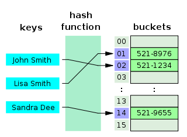
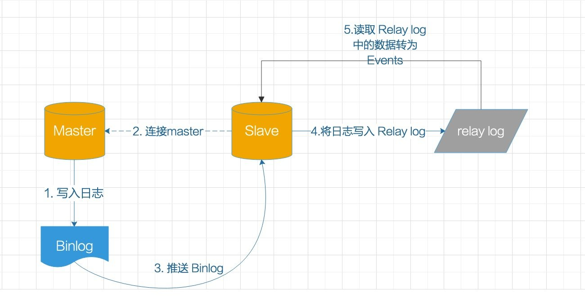
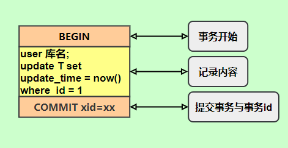
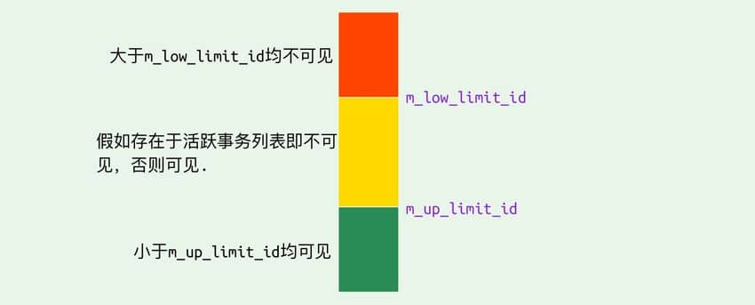
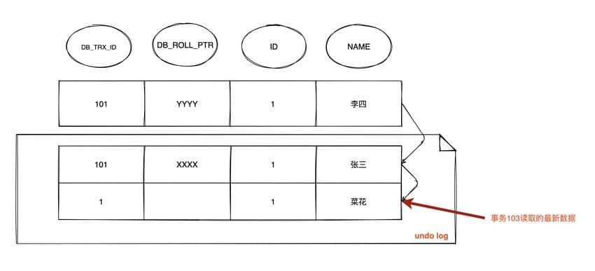

# MySQL

## 一、MySQL数据类型:airplane:

> 参考链接：[Java全栈知识体系](https://pdai.tech/md/db/sql-mysql/sql-mysql-theory.html)

### 1.1 字段类型

#### 整型

`TINYINT`、`SMALLINT`、`MEDIUMINT`、`INT`、`BIGINT`分别使用8、16、24、32、64位存储空间，一般情况下越小的列越好。

注意：`INT(11)`中的数字只是规定了交互工具显示字符的个数，对于**存储和计算来说是没有意义的**。

#### 浮点数

`FLOAT`和`DOUBLE`为浮点类型，`DECIMAL`为高精度小数类型。

CPU原生支持浮点运算，但是不支持`DECIMAL`类型的计算，因此`DECIMAL`的计算比浮点类型需要更高的代价。

`FLOAT`、`DOUBLE`和`DECIMAL`都可以指定列宽，例如`DECIMAL(18, 9)`表示总共18位，取9位存储小数部分，剩下9位存储整数部分。

#### 字符串

主要有`CHAR`和`VARCHAR`两种类型，一种是定长的，一种是变长的。

`VARCHAR`这种变长类型能够节省空间，因为**只需要存储必要的内容**。但是在执行`UPDATE`语句时可能会使行变得比原来长，**当超出一个页所能容纳的大小时，就要执行额外的操作**。MyISAM会将行拆成不同的片段存储，而InnoDB则需要**分裂页**来使行放进页内。

`VARCHAR`会保留字符串末尾的空格，而`CHAR`会删除。

#### 时间和日期

MySQL提供了两种相似的日期时间类型：`DATETIME`和`TIMESTAMP`。

##### `DATETIME`

能够保存从1001年到9999年的日期和时间，精度为秒，使用**8字节**的存储空间。它与时区无关。

默认情况下，MySQL以一种可排序的、无歧义的格式显示`DATETIME`值，例如`2008-01-16 22:37:08`，这是ANSI标准定义的日期和时间表示方法。

##### `TIMESTAMP`

和UNIX时间戳相同，保存从1970年1月1日午夜（格林威治时间）以来的秒数，使用**4个字节**，只能表示从1970年到2038年。它和时区有关，也就是说**一个时间戳在不同的时区所代表的具体时间是不同的**。

MySQL提供了`FROM_UNIXTIME()`函数把UNIX时间戳转换为日期，并提供了`UNIX_TIMESTAMP()`函数把日期转换为UNIX时间戳。

默认情况下，如果插入时没有指定`TIMESTAMP`列的值，会将这个值设置为当前时间。

**应该尽量使用`TIMESTAMP`，因为它比`DATETIME`空间效率更高**。

### 1.2 选择优化的数据类型

- **更小的通常更好**：更小的数据类型通常更快，因为它们占用更少的磁盘、内存和CPU缓存，并且处理时需要的CPU周期也更少。
- **简单就好**：例如，整形比字符串操作代价更低；使用内建类型而不是字符串来存储日期和时间；用整形存储IP地址等。
- **尽量避免`NULL`**：如果查询中包含可为`NULL`的列，对MySQL来说更难优化，因为可为`NULL` 的列使得索引、索引统计和值比较都更复杂。尽管把可为`NULL`的列改为`NOT NULL`带来的性能提升比较小，但如果计划在列上创建索引，就应该尽量避免设计成可为`NULL`的列；

#### 字符串类型

##### `VARCHAR`和`CHAR`

下面这些情况使用`VARCHAR`是合适的：

- 字符串的最大长度比平均长度大很多。
- 列的更新很少，所以碎片不是问题。
- 使用了像`UTF-8`这样复杂的字符集，每个字符都使用不同的字节数进行存储。

`CHAR`适合存储很短的字符串，或者所有值都接近同一个长度，如密码的MD5值。对于经常变更的数据，`CHAR`也比`VARCHAR`更好，因为`CHAR`不容易产生碎片。

##### `VARCHAR(5)`和`VARCHAR(200)`

**更长的列会消耗更多的内存**，因为MySQL通常会分配固定大小的内存块来保存内部值。尤其是使用内存临时表进行排序或其他操作时会特别糟糕。在利用磁盘临时表进行排序时也同样糟糕。所以最好的策略是**只分配真正需要的空间**。

##### `BLOB`和`TEXT`

`BLOB`和`TEXT`都是为存储很大的数据而设计的数据类型，分别采用**二进制**和**字符方式**存储。

与其他类型不同，MySQL把每个`BLOB`和`TEXT`值当做一个**独立的对象**去处理。当`BLOB`和`TEXT`值太大时，InnoDB会使用**专门的“外部”存储区域来进行存储**，此时每个值在行内需要1~4个字节存储一个指针，然后在外部存储区域存储实际的值。

MySQL对`BLOB`和`TEXT`列进行排序与其他类型是不同的：它只对每个列的最前`max_sort_length`个字节而不是整个字符串做排序。同样的，MySQL也不能将`BLOB`或`TEXT`列全部长度的字符串进行索引。

#### 选择表示符（Identifier）

**整数类型通常是标识列的最佳选择**，因为它们很快并且可以使用`AUTO_INCREMENT`。 如果可能，应该避免使用字符串类型作为标识列，因为它们很耗空间，并且比数字类型慢。 对于完全随机的字符串也需要多加注意，例如`MD5()`、`SHA1()`或者`UUID()`产生的字符串。这些函数生成的新值会任意分布在很大的空间内，这会导致`INSERT`以及一些`SELECT`语句变得很慢：

- 因为**插入值会随机地写入到索引的不同位置**，所以使得`INSERT`语句更慢。这会导致叶分裂、磁盘随机访问。
- `SELECT`语句会变得更慢，因为**逻辑上相邻的行会分布在磁盘和内存的不同地方**。
- **随机值导致缓存对所有类型的查询语句效果都很差**，因为会使得缓存赖以工作的局部性原理失效。

## 二、MySQL基础架构

### 2.1 基础架构

> 参考链接：[JavaGuide](https://javaguide.cn/database/mysql/how-sql-executed-in-mysql.html#%E4%B8%80-mysql-%E5%9F%BA%E7%A1%80%E6%9E%B6%E6%9E%84%E5%88%86%E6%9E%90)


- **连接器：**身份认证和权限相关（登录MySQL的时候）。
- **查询缓存：**执行查询语句的时候，会先查询缓存（MySQL `8.0`版本后移除，因为这个功能不太实用）。
- **分析器：**没有命中缓存的话，SQL语句就会经过分析器，分析器说白了就是要先看SQL语句要干嘛，再检查SQL语句语法是否正确。
- **优化器：**按照MySQL认为最优的方案去执行。
- **执行器：**执行语句，然后从存储引擎返回数据。执行语句之前会先判断是否有权限，如果没有权限就会报错。

简单来说MySQL主要分为Server层和存储引擎层：

- **Server 层**：主要包括**连接器、查询缓存、分析器、优化器、执行器**等，所有跨存储引擎的功能都在这一层实现，比如存储过程、触发器、视图，函数等，还有一个通用的日志模块Binlog。
- **存储引擎**： 主要负责数据的存储和读取，采用**可以替换的插件式架构**，支持InnoDB、MyISAM、Memory等多个存储引擎，其中InnoDB引擎有特有的日志模块Redo log。**现在最常用的存储引擎是InnoDB，从MySQL 5.5版本开始就被当做默认存储引擎了**。

#### Server层基本组件介绍

##### 连接器

连接器主要和**身份认证、权限相关**的功能相关，就好比一个级别很高的门卫。主要负责用户登录数据库、进行用户的身份认证，包括校验账户密码，权限等操作，如果用户账户密码已通过，**连接器会到权限表中查询该用户的所有权限**，之后在这个连接里的权限逻辑判断都是会依赖此时读取到的权限数据，也就是说，**后续只要这个连接不断开，即使管理员修改了该用户的权限，该用户也是不受影响的**。

##### 查询缓存（MySQL 8.0版本后移除）

查询缓存主要用来缓存所执行的`SELECT`语句以及该语句的结果集。连接建立后，执行查询语句的时候，会先查询缓存，MySQL会先校验这个SQL语句是否执行过，以Key-Value的形式缓存在内存中，Key是查询预计，Value是结果集。如果缓存key被命中，就会直接返回给客户端，如果没有命中，就会执行后续的操作，完成后也会把结果缓存起来，方便下一次调用。当然在真正执行缓存查询的时候还是会校验用户的权限，是否有该表的查询条件。

**MySQL查询不建议使用缓存**，因为查询缓存失效在实际业务场景中可能会非常频繁。假如对一个表更新的话，这个表上的所有的查询缓存都会被清空。对于不经常更新的数据来说，使用缓存还是可以的。所以，一般在大多数情况下都不推荐去使用查询缓存的。

MySQL 8.0版本后删除了缓存的功能，官方也是认为该功能在实际的应用场景比较少，所以干脆直接删掉了。

##### 分析器

MySQL没有命中缓存，那么就会进入分析器，分析器主要是用来分析SQL语句是来干嘛的，分析器也会分为几步：

1. **词法分析**：一条SQL语句由多个字符串组成，首先要提取关键字，比如`select`，提取查询的表、字段名、查询条件等等。做完这些操作后，就会进入第二步；
2. **语法分析**：主要就是判断输入的SQL语句是否正确，是否符合MySQL的语法。

完成这些之后，MySQL就准备开始执行了。但是如何执行，怎么执行是最好的结果呢？这个时候就需要优化器上场了。

##### 优化器

优化器的作用就是以**它认为的最优的执行方案去执行（有时候可能也不是最优）**，比如：多个索引的时候该如何选择索引、多表查询的时候如何选择关联顺序等。可以说，经过了优化器之后可以说这个语句具体该如何执行就已经定下来。

##### 执行器

当选择了执行方案后，MySQL就准备开始执行了。首先执行前会校验该用户有没有权限，如果没有权限，就会返回错误信息，如果有权限，就会去调用引擎的接口，返回接口执行的结果。（说明：这里的权限校验与连接器的不同，主要是**判断对表是否有权限**）

### 2.2 SQL语句执行过程:airplane:

> 参考链接：[JavaGuide](https://javaguide.cn/database/mysql/how-sql-executed-in-mysql.html#%E4%BA%8C-%E8%AF%AD%E5%8F%A5%E5%88%86%E6%9E%90)

#### 查询语句

SQL语句可以分为两种：一种是查询，一种是更新（增加、更新、删除）。先分析查询语句，例句如下：

```mysql
select * from tb_student  A where A.age='18' and A.name=' 张三 ';
```

结合上面的说明，分析下这个语句的执行流程：

1. 先**检查用户是否有权限**，如果没有权限，直接返回错误信息，如果有权限，在MySQL 8.0版本以前，会先查询缓存，以这条SQL语句为key在内存中查询是否有结果，如果有直接读取缓存，如果没有，执行下一步；

2. 通过分析器进行词法分析，**提取SQL语句的关键元素**，比如提取上面这个语句是查询`select`，提取需要查询的表名为`tb_student`，需要查询所有的列，查询条件是`id=1`。然后判断这个SQL语句是否有语法错误，比如关键词是否正确等等，如果检查没问题就执行下一步；

3. 优化器确定执行方案，上面的SQL语句可以有两种执行方案：

   - 先查询学生表中姓名为“张三”的学生，然后判断是否年龄是18。
   - 先找出学生中年龄18岁的学生，然后再查询姓名为“张三”的学生。

   优化器根据自己的优化算法进行选择执行效率最好的一个方案（优化器认为，有时候不一定最好），确认了执行计划后就准备开始执行了；

4. **进行权限校验**，如果没有权限就会返回错误信息，如果有权限就会调用数据库引擎接口，返回引擎的执行结果。

#### 更新语句

接下来看看一条更新语句如何执行的呢？SQL语句如下：

```mysql
update tb_student A set A.age='19' where A.name=' 张三 ';
```

其实这条语句也基本会沿着查询的流程走，只不过执行更新的时候肯定要记录日志，这就会引入日志模块。MySQL自带的日志模块是**Binlog（归档日志）**，所有的存储引擎都可以使用。常用的InnoDB引擎还自带了一个日志模块**Redo log（重做日志）**，以InnoDB引擎模式来探讨这个语句的执行流程：

1. 先查询到“张三”这一条数据。
2. 然后拿到查询的语句，把`age`改为19，调用引擎API接口，写入这一行数据，InnoDB引擎把数据保存在内存中，同时记录Redo log，此时Redo log进入prepare状态，然后告诉执行器：执行完成了，随时可以提交。
3. 执行器收到通知后记录Binlog，然后调用引擎接口，提交Redo log为提交状态。
4. 更新完成。

这里是采用Redo log两阶段提交的方式：写完Binlog后然后再提交Redo log就能保证数据的一致性。

#### 总结

- MySQL主要分为Server层和引擎层，Server层主要包括连接器、查询缓存、分析器、优化器、执行器，同时还有一个日志模块（Binlog），这个日志模块所有执行引擎都可以共用，Redo log只是InnoDB引擎独有。
- 引擎层是插件式的，目前主要包括：MyISAM、InnoDB、Memory等。
- 查询语句的执行流程如下：权限校验（如果命中缓存）--->查询缓存--->分析器--->优化器--->权限校验--->执行器--->引擎。
- 更新语句执行流程如下：分析器---->权限校验---->执行器--->引擎---Redo log（`prepare`状态）--->Binlog--->Redo log（`commit`状态）

## 三、MySQL存储引擎:boat:

> 参考链接：[Java全栈知识体系](https://pdai.tech/md/db/sql-mysql/sql-mysql-engine.html)、[JavaGuide](https://javaguide.cn/database/mysql/mysql-questions-01.html#mysql-%E5%AD%98%E5%82%A8%E5%BC%95%E6%93%8E)

### 3.1 InnoDB

MySQL默认的事务型存储引擎，**只有在需要它不支持的特性时，才考虑使用其它存储引擎**。

实现了四个标准的隔离级别，默认级别是**可重复读**（REPEATABLE READ）。在可重复读隔离级别下，**通过多版本并发控制（MVCC）+间隙锁（Next-Key Locking）防止幻读**。

**主索引是聚簇索引**，在索引中保存了数据，从而避免直接读取磁盘，因此对查询性能有很大的提升。

**内部做了很多优化**，包括从磁盘读取数据时采用的可预测性读、能够加快读操作并且自动创建的自适应哈希索引、能够加速插入操作的插入缓冲区等。

**支持真正的在线热备份**，其它存储引擎不支持在线热备份，要获取一致性视图需要停止对所有表的写入，而在读写混合场景中，停止写入可能也意味着停止读取。

### 3.2 MyISAM

设计简单，数据以紧密格式存储。**对于只读数据，或者表比较小、可以容忍修复操作**，则依然可以使用它。提供了大量的特性，包括压缩表、空间数据索引等。

**不支持事务**。

**不支持行级锁**，只能对整张表加锁，**读取时会对需要读到的所有表加共享锁，写入时则对表加排它锁**。但在表有读取操作的同时，也可以往表中插入新的记录，这被称为并发插入（CONCURRENT INSERT）。

可以手工或者自动执行检查和修复操作，但是和事务恢复以及崩溃恢复不同，可能导致一些数据丢失，而且修复操作是非常慢的。

如果指定了`DELAY_KEY_WRITE`选项，在每次修改执行完成时，不会立即将修改的索引数据写入磁盘，而是会写到内存中的键缓冲区，只有在清理键缓冲区或者关闭表的时候才会将对应的索引块写入磁盘。这种方式可以极大的提升写入性能，但是在数据库或者主机崩溃时会造成索引损坏，需要执行修复操作。

### 3.3 比较

|                        |                            MyISAM                            |                            InnoDB                            |
| :--------------------: | :----------------------------------------------------------: | :----------------------------------------------------------: |
|         行级锁         |                          只有表级锁                          |                支持行级锁和表级锁，默认行级锁                |
|          事务          |                             :x:                              |                             :o:                              |
|          外键          |                             :x:                              |                             :o:                              |
| 数据库崩溃后的安全恢复 |                             :x:                              |                             :o:                              |
|          MVCC          |                             :x:                              |                             :o:                              |
|        索引实现        | 索引文件和数据文件分离，叶子结点data域存放的是数据记录的地址 | 数据文件本身就是索引文件，叶子结点data域包含了完整的数据记录 |

## 四、MySQL索引详解:airplane:

> 参考链接：[JavaGuide](https://javaguide.cn/database/mysql/mysql-index.html#%E5%89%8D%E8%A8%80)

### 4.1 何为索引？

索引是一种用于**快速查询和检索数据的数据结构**。常见的索引结构有：B树、B+树和Hash。

### 4.2 索引优缺点

#### 优点

- 使用索引可以大大加快数据的检索速度（**大大减少检索的数据量**）, 这也是创建索引的最主要的原因。
- 通过**创建唯一性索引**，可以保证数据库表中**每一行数据的唯一性**。

#### 缺点

- 创建索引和维护索引需要**耗费许多时间**。当对表中的数据进行**增删改**的时候，如果数据有索引，那么索引也需要动态的修改，会降低SQL执行效率。
- 索引需要使用物理文件存储，也会耗费一定空间。

**使用索引一定能提高查询性能吗**？大多数情况下，**索引查询都是比全表扫描要快的**。但是如果数据库的数据量不大，那么使用索引也不一定能够带来很大提升。

### 4.3 索引的底层数据结构

#### Hash表

哈希表是键值对的集合，通过键（key）可快速取出对应的值（value），因此哈希表可以快速检索数据（接近O(1)）。

**为何能够通过key快速取出value呢？** 原因在于**哈希算法**（也叫散列算法）。通过哈希算法，可以快速找到key对应的index，找到了index也就找到了对应的value。

```
hash = hashfunc(key)
index = hash % array_size
```



但是哈希算法有**Hash冲突**问题：多个不同的key最后得到的index相同。通常情况下，常用的解决办法是**链地址法**。链地址法就是将**哈希冲突数据存放在链表中**。就比如JDK 1.8之前`HashMap`就是通过链地址法来解决哈希冲突的。不过，JDK 1.8以后`HashMap`为了**减少链表过长的时候搜索时间过长引入了红黑树**。


为了减少Hash冲突的发生，一个好的哈希函数应该**均匀地**将数据分布在整个可能的哈希值集合中。

既然哈希表这么快，**为什么MySQL没有使用其作为索引的数据结构呢？**

- Hash冲突问题：虽然对于数据库来说这不算最大的缺点。
- **Hash索引不支持顺序和范围查询是它最大的缺点**：假如要对表中的数据进行排序或者进行范围查询，那Hash索引可就不行了。

#### B树、B+树

B树也称**B-树**，全称为**多路平衡查找树**，B+树是B树的一种变体。B树和B+树中的“B”是Balanced（平衡）的意思。目前大部分数据库系统及文件系统都**采用B-树或其变种B+树作为索引结构**。

**B树和B+树两者有何异同呢？**

- B树的所有节点既存放键也存放数据，而B+树只有叶子节点存放键和数据，其他节点只存放键。
- B树的叶子节点都是独立的；B+树的叶子节点**有一条引用链指向与它相邻的叶子节点**。
- B树的检索过程相当于对范围内每个节点的关键字做二分查找，可能还没有到达叶子节点，检索就结束了。而**B+树的检索效率就很稳定了，任何查找都是从根节点到叶子节点的过程，叶子节点的顺序检索很明显**。

在MySQL中，MyISAM引擎和InnoDB引擎都是使用B+Tree作为索引结构，但是两者的实现方式不太一样。

- MyISAM引擎中，B+树叶子节点的**data域存放的是数据记录的地址**。在索引检索的时候，首先按照B+树搜索算法搜索索引，如果指定的Key存在，则**取出其data域的值，然后以data域的值为地址读取相应的数据记录**。这被称为**非聚簇索引**。
- InnoDB引擎中，其**数据文件本身就是索引文件**。相比MyISAM（索引文件和数据文件是分离的），其**表数据文件本身就是按B+树组织的一个索引结构**，树的叶节点data域保存了完整的数据记录。**这个索引的key是数据表的主键**，因此InnoDB**表数据文件本身就是主索引**。这被称为**聚簇索引（或聚集索引）**，而其余的索引都作为辅助索引，**辅助索引的data域存储相应记录主键的值而不是地址**，这也是和MyISAM不同的地方。**在根据主索引搜索时，直接找到key所在的节点即可取出数据；在根据辅助索引查找时，则需要先取出主键的值，再走一遍主索引**。 因此，在设计表的时候，不建议使用过长的字段作为主键，也不建议使用非单调的字段作为主键，这样会造成主索引频繁分裂。

### 4.4 索引类型

#### 主键索引（Primary Key）

数据表的主键列使用的就是主键索引。一张数据表有只能有一个主键，并且主键不能为`NULL`，不能重复。

在MySQL的InnoDB的表中，当没有显式指定表的主键时，InnoDB会**自动检查**表中是否有唯一索引且不允许存在`NULL`值的字段，如果有则选择该字段为默认的主键；否则InnoDB将会自动创建一个6 Byte的自增主键。


#### 二级索引（辅助索引）

二级索引又称为辅助索引，是因为**二级索引的叶子节点存储的数据是主键**。也就是说，通过二级索引，可以定位主键的位置。


##### 唯一索引（Unique Key）

唯一索引也是一种约束。唯一索引的属性列**不能出现重复的数据**，但是允许数据为`NULL`，一张表允许创建多个唯一索引。建立唯一索引的目的**大部分时候都是为了该属性列的数据的唯一性**，而不是为了查询效率。

##### 普通索引（Index）

普通索引的唯一作用就是为了**快速查询数据**，一张表允许创建多个普通索引，并允许数据重复和`NULL`。

##### 前缀索引（Prefix）

前缀索引只适用于**字符串类型的数据**。前缀索引是对文本的前几个字符创建索引，相比普通索引建立的数据更小， 因为**只取前几个字符**。

##### 全文索引（Full Text）

全文索引主要是为了**检索大文本数据中的关键字信息**，是目前搜索引擎数据库使用的一种技术。MySQL 5.6之前只有MyISAM引擎支持全文索引，5.6之后InnoDB也支持了全文索引。

### 4.5 聚集索引与非聚集索引

#### 聚集索引

聚集索引即**索引结构和数据一起存放**的索引。**主键索引属于聚集索引**。

在MySQL中，InnoDB引擎的表的`.ibd`文件就包含了**该表的索引和数据**，对于InnoDB引擎表来说，该表的索引（B+树）的每个非叶子节点存储索引，叶子节点存储**索引和索引对应的数据**。

##### 优点

聚集索引的**查询速度非常快**，因为整个B+树本身就是一个多叉平衡树，**叶子节点也都是有序的**，定位到索引的节点，就相当于定位到了数据。

##### 缺点

1. **依赖于有序的数据**：因为B+树是多路平衡树，如果索引的数据不是有序的，那么就需要在**插入时排序**，如果数据是整型还好，否则类似于字符串或UUID这种又长又难比较的数据，插入或查找的速度肯定比较慢。
2. **更新代价大**：如果索引列的数据被修改时，那么对应的索引也将会被修改，而且聚集索引的叶子节点还存放着数据，修改代价肯定是较大的，**所以对于主键索引来说，主键一般都是不可被修改的**。

#### 非聚集索引

非聚集索引即**索引结构和数据分开存放**的索引。**二级索引属于非聚集索引**。

非聚集索引的叶子节点并不一定存放数据的指针，因为**二级索引的叶子节点就存放的是主键，根据主键再回表查数据**。

##### 优点

**更新代价比聚集索引要小**。非聚集索引的更新代价就没有聚集索引那么大了，非聚集索引的叶子节点是不存放数据的。

##### 缺点

1. 跟聚集索引一样，非聚集索引也**依赖于有序的数据**。
2. **可能会二次查询（回表）**：这应该是非聚集索引最大的缺点了。当查到索引对应的指针或主键后，可能**还需要根据指针或主键再到数据文件或表中查询**。

#### 示例

这是不同存储引擎的表的文件截图：


聚集索引和非聚集索引：


#### 非聚集索引一定回表查询吗？

不一定。试想一种情况，用户准备查询用户名，而用户名字段正好建立了索引。那么这个索引的`key`本身就是`name`，查到对应的`name`直接返回就行了，无需回表查询。

即使是MyISAM也是这样，虽然其主键索引确实需要回表。因为它的主键索引的叶子节点存放的是指针。但是**如果SQL查的就是主键呢**？

主键索引本身的`key`就是主键，查到返回就行了。这种情况就称之为**覆盖索引**了。

### 4.6 覆盖索引

如果**一个索引包含（或者说覆盖）所有需要查询的字段的值**，就称之为覆盖索引。在InnoDB存储引擎中，**如果不是主键索引，叶子节点存储的是主键+列值。最终还是要回表**，也就是要通过主键再查找一次，这样就会比较慢。

覆盖索引就是要查询的列和索引是对应的，不做回表操作。覆盖索引**即需要查询的字段正好是索引的字段**，那么直接根据该索引，就可以查到数据了，而无需回表查询。


### 4.7 联合索引

使用表中的多个字段创建索引，就是**联合索引**，也叫**组合索引**或**复合索引**。

#### 最左前缀匹配原则

最左前缀匹配原则指的是：在使用联合索引时，MySQL会根据联合索引中的字段顺序，**从左到右依次到查询条件中去匹配**，如果查询条件中存在与联合索引中**最左侧字段相匹配的字段**，则就会使用该字段过滤一批数据，直至联合索引中全部字段匹配完成，或者在执行过程中遇到范围查询，如`>`、`<`、`between`和`以%开头的like查询`等条件，才会停止匹配。

所以在使用联合索引时，**可以将区分度高的字段放在最左边**，这也可以过滤更多数据。

### 4.8 索引下推

索引下推是MySQL 5.6版本中提供的一项索引优化功能，可以在**非聚簇索引遍历过程中**，对索引中包含的字段先做判断，**过滤掉不符合条件的记录**，减少回表次数。

### 4.9 创建索引的注意事项

#### 选择合适的字段创建索引

- **不为`NULL`的字段**：索引字段的数据应该尽量不为`NULL`，因为对于数据为`NULL`的字段，数据库较难优化。如果字段频繁被查询，但又避免不了为`NULL`，建议使用`0`、`1`、`true`、`false`这样语义较为清晰的短值或短字符作为替代。
- **频繁查询的字段**：创建索引的字段应该是查询操作非常频繁的字段。
- **作为条件查询的字段**：被作为`WHERE`条件查询的字段，应该被考虑建立索引。
- **频繁需要排序的字段**：索引已经排序，这样查询可以利用索引的排序，加快排序查询时间。
- **频繁用于连接的字段**：经常用于连接的字段可能是一些外键列，对于外键列并不一定要建立外键，只是说该列涉及到表与表的关系。对于频繁被连接查询的字段，可以考虑建立索引，提高多表连接查询的效率。

#### 被频繁更新的字段应该慎重建立索引

虽然索引能带来查询上的效率，但是维护索引的成本也是不小的。 如果一个字段不被经常查询，反而被经常修改，那么就更不应该在这种字段上建立索引了。

#### 尽可能考虑建立联合索引而不是单列索引

因为索引是需要占用磁盘空间的，可以简单理解为每个索引都对应着一个B+树。如果一个表的字段过多，索引过多，那么当这个表的数据达到一个体量后，索引占用的空间也是很多的，且修改索引时，耗费的时间也是较多的。如果是联合索引，多个字段在一个索引上，那么将会节约很大磁盘空间，且修改数据的操作效率也会提升。

#### 注意避免冗余索引

冗余索引指的是索引的功能相同，能够命中索引`(a, b)`就肯定能命中索引`(a)`，那么索引`(a)`就是**冗余索引**。在大多数情况下，都应该尽量**扩展已有的索引而不是创建新索引**。

#### 考虑在字符串类型的字段上使用前缀索引代替普通索引

前缀索引仅限于字符串类型，较普通索引会占用更小的空间，所以可以考虑使用前缀索引带替普通索引。

##### 补充：前缀索引

> 参考链接：[Java全栈知识体系](https://pdai.tech/md/db/sql-mysql/sql-mysql-b-tree.html)

对于`BLOB`、`TEXT`和`VARCHAR`类型的列，必须使用前缀索引，只索引开始的部分字符。对于前缀长度的选取需要根据索引选择性来确定。

### 4.10 使用索引的建议

- 对于中到大型表索引都是非常有效的，但是特大型表的话维护开销会很大，不适合建索引。
- 避免`where`子句中对字段施加函数，这会造成无法命中索引。
- 在使用InnoDB时**使用与业务无关的自增主键作为主键**，即使用逻辑主键，而不要使用业务主键。
- **删除长期未使用的索引**，不用的索引的存在会造成不必要的性能损耗。MySQL `5.7`可以通过查询`sys`库的`schema_unused_indexes`视图来查询哪些索引从未被使用。
- 在使用`limit offset`查询缓慢时，可以借助索引来提高性能。

### 4.11 如何添加索引？

> 参考链接：[C语言中文网](http://c.biancheng.net/view/2605.html)

#### `CREATE INDEX`语句

```sql
CREATE <索引名> ON <表名> (<列名> [<长度>] [ ASC | DESC]);
```

在一个已有的表上创建索引，但该语句**不能创建主键**。

#### `CREATE TABLE`语句

在创建表的同时创建。

```sql
// 创建主键索引
CONSTRAINT PRIMARY KEY [索引类型] (<列名>,…);
// 创建普通索引
KEY | INDEX [<索引名>] [<索引类型>] (<列名>,…);
// 创建唯一索引
UNIQUE [ INDEX | KEY] [<索引名>] [<索引类型>] (<列名>,…);
// 创建外键
FOREIGN KEY <索引名> <列名>;
```

#### `ALTER TABLE`语句

> 参考链接：[JavaGuide](https://javaguide.cn/database/mysql/mysql-index.html#mysql-%E5%A6%82%E4%BD%95%E4%B8%BA%E8%A1%A8%E5%AD%97%E6%AE%B5%E6%B7%BB%E5%8A%A0%E7%B4%A2%E5%BC%95)

```sql
// 添加主键索引
ALTER TABLE `table_name` ADD PRIMARY KEY ( `column` )
// 添加唯一索引
ALTER TABLE `table_name` ADD UNIQUE ( `column` )
// 添加普通索引
ALTER TABLE `table_name` ADD INDEX index_name ( `column` )
// 添加全文索引
ALTER TABLE `table_name` ADD FULLTEXT ( `column`)
// 添加多列索引
ALTER TABLE `table_name` ADD INDEX index_name ( `column1`, `column2`, `column3` )
```

### 4.12 索引失效

- 破坏最左前缀匹配原则（包括`like`后通配符在最左边）。
- 在索引列上做运算。
- 字符串不加单引号。

## 五、分表分库、主从复制和读写分离:airplane:

> 参考链接：[Java全栈知识体系](https://pdai.tech/md/db/sql-mysql/sql-mysql-devide.html)、[Java全栈知识体系](https://pdai.tech/md/db/sql-mysql/sql-mysql-slave.html)

### 5.1 分表分库

#### 水平切分

水平切分又称为Sharding，它是**将同一个表中的记录拆分到多个结构相同的表中**。当一个表的数据不断增多时，Sharding是必然的选择，它可以将数据分布到集群的不同节点上，从而缓存单个数据库的压力。


#### 垂直切分

垂直切分是**将一张表按列切分成多个表**，通常是按照列的关系密集程度进行切分，也可以利用垂直切分将经常被使用的列和不经常被使用的列切分到不同的表中。

在数据库的层面使用垂直切分将**按数据库中表的密集程度部署到不同的库中**，例如将原来的电商数据库垂直切分成商品数据库、用户数据库等。


#### Sharding策略

- 哈希取模：$hash(key)\%NUM\_DB$。
- 范围：可以是ID范围也可以是时间范围。
- 映射表：使用单独的一个数据库来存储映射关系。

#### Sharding存在的问题及解决方案

##### 事务问题

使用分布式事务来解决。

##### 连接

可以将原来的`JOIN`分解成多个单表查询，然后在用户程序中进行`JOIN`。

##### ID唯一性

- 使用全局唯一ID：GUID。
- 为每一个分片指定一个ID范围。
- 分布式ID生成器。

### 5.2 主从复制和读写分离

#### 为什么使用主从复制和读写分离？

> 参考链接：[思否](https://segmentfault.com/a/1190000023775512)

主从复制、读写分离一般是一起使用的。目的很简单，就是**为了提高数据库的并发性能**。随着业务量的扩展、如果是单机部署的MySQL，会导致I/O频率过高。采用**主从复制、读写分离可以提高数据库的可用性**。

#### 主从复制主流架构模型

> 参考链接：[博客园](https://www.cnblogs.com/rickiyang/p/13856388.html)

- 一主一从/一主多从：这是最常见的主从架构方式，一般实现主从配置或者读写分离都可以采用这种架构。如果是一主多从的模式，**当Slave增加到一定数量时，Slave对Master的负载以及网络带宽都会成为一个严重的问题**。
- 多主一从：从MySQL `5.7`开始支持多主一从的模式，将多个库的数据备份到一个库中存储。
- 双主复制：理论上跟主从一样，但是两个MySQL服务器互做对方的从，任何一方有变更，都会复制对方的数据到自己的数据库。**双主适用于写压力比较大的业务场景**，或者DBA做维护需要主从切换的场景，通过双主架构避免了重复搭建从库的麻烦。（主从相互授权连接，读取对方binlog日志并更新到本地数据库的过程；只要对方数据改变，自己就跟着改变）
- 级联复制：级联复制**解决了一主多从场景下多个从库复制对主库的压力，带来的弊端就是数据同步延迟比较大**。

#### 主从复制的类型

> 参考链接：[掘金](https://juejin.cn/post/6844903921677238285)

- **基于语句的复制**：Master上面执行的语句在Slave上面再执行一遍，在MySQL 3.23版本以后支持。
  - 存在的问题：时间上可能不完全同步造成偏差，执行语句的用户也可能是不同一个用户。
- **基于行的复制**：把Master上面改变后的内容直接复制过去，而不关心到底改变该内容是由哪条语句引发的，在MySQL 5.0版本以后引入。
  - 存在的问题：如果修改的行数过多，造成的开销比较大。

MySQL默认使用基于语句的复制，当基于语句的复制会引发问题的时候就会使用基于行的复制。

#### 主从复制的工作原理

> 参考链接：[博客园](https://www.cnblogs.com/rickiyang/p/13856388.html)

##### 三个线程

主从复制涉及到三个线程：

- Binlog dump线程（在Master上）：Master会生成一个Binlog dump线程用于给Slave的I/O线程传Binlog数据。
- I/O线程（在Slave上）：Slave的I/O线程会去请求Master的Binlog，并将得到的Binlog写到本地的Relay log（中继日志）文件中。
- SQL线程（在Slave上）：读取Relay log文件中的日志，并解析成SQL语句逐一执行。


###### Binlog dump线程

当Slave连接Master时，Master会为其创建一个Binlog dump线程，用于读取和发送Binlog的内容。**在读取Binlog的操作时，Binlog dump线程会对Master上的Binlog加锁**；当读取完成发送给Slave之前，锁会被释放。**Master会为自己的每一个Slave创建一个Binlog dump线程**。

###### I/O线程

当Slave上执行`start slave`命令之后，Slave会创建一个I/O线程用来连接Master以请求更新的Binlog。I/O线程接收到Master的Binlog dump线程发来的更新之后，将信息保存在本地Relay-log（中继日志）中。

###### SQL线程

SQL线程负责读取Relay log中的内容，解析成具体的SQL语句并执行，最终保证主从数据的一致性。Slave用两个线程**将从主库拉取更新和执行分成独立的任务**，这样在执行同步数据任务的时候，不会降低读操作的性能。

##### 基本过程

要实施复制，首先必须打开Master的Binlog功能，否则无法实现。因为**整个复制过程实际上就是Slave从Master获取该日志然后再在自己身上完全顺序的执行日志中所记录的各种操作**。



基本过程总结：

1. 在Slave上执行`sart slave`命令开启主从复制开关。Slave上的I/O线程连接Master，并**请求从指定Binlog的指定位置（或者从最开始的日志）之后的内容**；
2. Master接收到来自Slave的I/O线程请求后，**Binlog dump线程根据请求信息读取指定Binlog的指定位置之后的内容**，并返回给Slave。返回信息中除了Binlog本身所包含的信息之外，还包括本次返回的Binlog名称以及Binlog Position（Binlog下一个数据读取位置）；
3. Slave的I/O线程接收到Master发送过来的日志内容、日志文件及位置点后，将接收到的日志内容更新到本机的Relay log文件（`Mysql-relay-bin.xxx`）的最末端，并将读取到的Binlog文件名和位置保存到`master-info`文件中，以便在下一次读取的时候能够清楚地告诉Master**需要从哪个Binlog的哪个位置开始往后的日志内容**；
4. Slave的SQL线程检测到Relay log中新增加了内容后，会将Relay log的内容解析成SQL语句，然后在本数据库中按照解析出来的顺序执行，并在`relay-log.info`中记录当前应用的Relay log的文件名和位置点。

#### 主从复制的模式介绍

> 参考链接：[博客园](https://www.cnblogs.com/rickiyang/p/13856388.html)

MySQL主从复制默认是**异步模式**。MySQL增删改操作会全部记录在Binlog中，当Slave节点连接Master时，会主动从Master处获取最新的Binlog文件，并把Binlog存储到本地的Relay log中，然后去执行Relay log的更新内容。

##### 异步模式


这种模式下，Master不会主动推送数据到Slave，**Master在执行完客户端提交的事务后会立即将结果返给客户端，并不关心从库是否已经接收并处理**，这样就会有一个问题：Master如果崩溃掉了，此时Master上已经提交的事务可能并没有传到Slave上，如果此时强行将Slave提升为Master，可能导致新的Master的数据不完整。

##### 半同步模式


介于异步模式和全同步模式之间，**Master在执行完客户端提交的事务后不是立刻返回给客户端，而是等待至少一个Slave接收到并写到Relay log中才返回成功信息给客户端**（保证Master的Binlog至少传输到了一个Slave上），否则需要等待直到超时时间然后切换成异步模式再提交。

相对于异步模式，半同步模式提高了数据的安全性，一定程度上保证了数据能成功备份到Slave，**同时它也造成了一定程度的延迟（比全同步模式延迟要低），这个延迟最少是一个TCP/IP往返的时间**。所以，半同步模式最好在低延时的网络中使用。半同步模式不是MySQL内置的，从MySQL 5.5开始集成，需要Master和Slave安装插件开启半同步模式。

##### 全同步模式

指当Master执行完一个事务，然后**所有的Slave**都复制了该事务并成功执行完才返回成功信息给客户端。因为需要等待所有从库执行完该事务才能返回成功信息，所以全同步复制的性能必然会收到严重的影响。

#### 主从复制可能出现的问题

**Slave同步延迟**：因为Slave是通过I/O线程（单线程）来实现数据解析入库；而Master写Binlog由于是顺序写所以效率很高，当Master的TPS很高时，**必然Master的写效率要高过Slave的读效率**，这时候就有同步延迟的问题。

I/O线程的同步是基于库的，即同步几个库就会开启几个I/O线程。可以通过`show slave status`命令查看`Seconds_Behind_Master`的值来看是否出现同步延迟，**这个值代表主从同步延迟的时间**，值越大说明延迟越严重。

基于Binlog的复制方式肯定有这种问题，MySQL官方也意识到，单线程不如多线程强，所以在MySQL 5.7版本引入了**基于组提交的并行复制**（官方称为Enhanced Multi-threaded Slaves，即MTS），设置参数`slave_parallel_workers>0`即可，并且`global.slave_parallel_type＝‘LOGICAL_CLOCK’`，即可支持在一个Schema下，`slave_parallel_workers`个线程并发执行Relay log中内容。

## 六、MySQL事务:rocket:

> 参考链接：[JavaGuide](https://javaguide.cn/database/mysql/mysql-questions-01.html#mysql-%E4%BA%8B%E5%8A%A1)

### 6.1 何谓事务？

**事务是逻辑上的一组操作，要么都执行，要么都不执行。**

### 6.2 何谓数据库事务？

大多数情况下在谈论事务的时候，如果没有特指**分布式事务**，往往指的就是**数据库事务**。那数据库事务有什么作用呢？

简单来说，数据库事务可以保证多个对数据库的操作（也就是SQL语句）构成一个**逻辑上的整体**。构成这个逻辑上的整体的这些数据库操作遵循：**要么全部执行成功，要么全部不执行** 。

```mysql
# 开启一个事务
START TRANSACTION;
# 多条 SQL 语句
SQL1,SQL2...
## 提交事务
COMMIT;
```


关系型数据库（例如：MySQL、SQL Server、Oracle等）事务都有ACID特性：

- **原子性**（Atomicity）：事务是最小的执行单位，**不允许分割**。事务的原子性确保动作要么全部完成，要么完全不起作用。
- **一致性**（Consistency）：执行事务前后，数据保持一致。例如转账业务中，无论事务是否成功，转账者和收款人的总额应该是不变的。
- **隔离性**（Isolation）：并发访问数据库时，**一个用户的事务不被其他事务所干扰，各并发事务之间数据库是独立的**。
- **持久性**（Durabilily）：一个事务被提交之后，**它对数据库中数据的改变是持久的**，即使数据库发生故障也不应该对其有任何影响。

说明：只有保证了事务的持久性、原子性、隔离性之后，一致性才能得到保障。**也就是说 A、I、D 是手段，C 是目的！**


### 6.3 并发事务带来了哪些问题？

在典型的应用程序中，多个事务并发运行，经常会操作相同的数据来完成各自的任务（多个用户对同一数据进行操作）。并发可能会导致以下的问题：

- **脏读（Dirty Read）**：当一个事务正在访问数据并且对数据进行了修改，**而这种修改还没有提交到数据库中，这时另外一个事务也访问了这个数据，然后使用了这个数据**。因为这个数据是还没有提交的数据，那么另外一个事务读到的这个数据是脏数据，依据脏数据所做的操作可能是不正确的。
- **丢失修改（Lost to Modify）**：指在一个事务读取一个数据时，另外一个事务也访问了该数据，那么在**第一个事务中修改了这个数据后，第二个事务也修改了这个数据。这样第一个事务内的修改结果就被丢失，因此称为丢失修改**。
- **不可重复读（Unrepeatable Read）**：若在一个事务内多次读同一数据，在这个事务还没有结束时，另一个事务也访问该数据。那么，**在第一个事务中的两次读数据之间，由于第二个事务的修改导致第一个事务两次读取的数据可能不太一样**。这就发生了在一个事务内两次读到的数据是不一样的情况，因此称为不可重复读。
- **幻读（Phantom Read）**：幻读与不可重复读类似。它发生在一个事务（T1）读取了几行数据，接着另一个并发事务（T2）插入了一些数据时。**在随后的查询中，第一个事务（T1）就会发现多了一些原本不存在的记录，就好像发生了幻觉一样，所以称为幻读**。

说明：**不可重复读和幻读区别**：不可重复读的重点是**修改**，比如多次读取一条记录发现其中某些列的值被修改；幻读的重点在于**新增或者删除**，比如使用同一条查询语句多次查询时，发现记录增多或减少了。

### 6.4 SQL标准定义了哪些事务隔离级别？

- **READ-UNCOMMITTED（读取未提交）**：最低的隔离级别。允许读取尚未提交的数据变更，可能会**导致脏读、幻读或不可重复读**。
- **READ-COMMITTED（读取已提交）**：允许读取并发事务已经提交的数据，**可以阻止脏读，但是幻读或不可重复读仍有可能发生**。
- **REPEATABLE-READ（可重复读）**：对同一字段的多次读取结果都是一致的，除非数据是被事务本身修改，**可以阻止脏读和不可重复读，但幻读仍有可能发生**。
- **SERIALIZABLE（可串行化）**：最高的隔离级别。完全服从ACID的隔离级别。所有的事务依次逐个执行，这样事务之间就完全不可能产生干扰，也就是说，该级别可以防止脏读、不可重复读以及幻读。

|     隔离级别     | 脏读 | 不可重复读 | 幻读 |
| :--------------: | :--: | :--------: | :--: |
| READ-UNCOMMITTED | :o:  |    :o:     | :o:  |
|  READ-COMMITTED  | :x:  |    :o:     | :o:  |
| REPEATABLE-READ  | :x:  |    :x:     | :o:  |
|   SERIALIZABLE   | :x:  |    :x:     | :x:  |

### 6.5 MySQL的隔离级别是基于锁实现的吗？

MySQL的隔离级别**基于锁和MVCC机制共同实现的**。SERIALIZABLE隔离级别是通过锁来实现的，其他的隔离级别都是基于MVCC实现。

不过， SERIALIZABLE之外的其他隔离级别可能也需要用到锁机制，就比如**REPEATABLE-READ在当前读情况下需要使用加锁读来保证不会出现幻读**。

### 6.6 MySQL的默认隔离级别是什么？

InnoDB存储引擎的默认支持的隔离级别是**REPEATABLE-READ（可重读）**。可以通过`SELECT @@tx_isolation;`命令来查看，MySQL 8.0该命令改为`SELECT @@transaction_isolation;`。

```shell
mysql> SELECT @@tx_isolation;
+-----------------+
| @@tx_isolation  |
+-----------------+
| REPEATABLE-READ |
+-----------------+
```

> 参考链接：[JavaGuide](https://javaguide.cn/database/mysql/transaction-isolation-level.html#%E4%BA%8B%E5%8A%A1%E9%9A%94%E7%A6%BB%E7%BA%A7%E5%88%AB%E6%80%BB%E7%BB%93)

默认隔离级别REPEATABLE-READ是不可以防止幻读的。但是，**InnoDB实现的REPEATABLE-READ隔离级别其实是可以解决幻读问题的**，主要有下面两种情况：

- **快照读**：由MVCC机制来保证不出现幻读。
- **当前读**：使用Next-Key Lock进行加锁来保证不出现幻读。**Next-Key Lock是行锁（Record Lock）和间隙锁（Gap Lock）的结合，行锁只能锁住已经存在的行，为了避免插入新行，需要依赖间隙锁**。

因为隔离级别越低，事务请求的锁越少，所以大部分数据库系统的隔离级别都是**READ-COMMITTED** ，但是要知道的是InnoDB存储引擎默认使用**REPEATABLE-READ**并不会有任何性能损失。InnoDB存储引擎在分布式事务的情况下一般会用到`SERIALIZABLE`隔离级别。

#### 演示示例（JavaGuide作者）

> 参考链接：[JavaGuide](https://javaguide.cn/database/mysql/transaction-isolation-level.html#%E5%AE%9E%E9%99%85%E6%83%85%E5%86%B5%E6%BC%94%E7%A4%BA)

在下面会使用2个命令窗口，模拟多线程（多事务）对同一份数据的脏读问题。

MySQL命令行的默认配置中事务都是自动提交的，即执行SQL语句后就会马上执行`COMMIT`操作。如果要显式地开启一个事务需要使用命令：`START TRANSACTION`。

可以通过下面的命令来设置隔离级别：

```mysql
SET [SESSION|GLOBAL] TRANSACTION ISOLATION LEVEL [READ UNCOMMITTED|READ COMMITTED|REPEATABLE READ|SERIALIZABLE]
```

##### 脏读（隔离级别：读未提交）

实例.jpg)

##### 脏读（隔离级别：读已提交，可解决）


##### 不可重复读

上面的图发生了不可重复读：


##### 可重复读（隔离级别：可重复读）


##### 幻读


sql脚本1在第一次查询工资为500的记录只有一条，sql脚本2插入了一条工资为500的记录，并提交；sql脚本1**在同一个事务中**再次使用当前读查询发现出现了两条工资为500的记录，这种就是**幻读**。

###### 解决办法

解决幻读的方式有很多，但是它们的核心思想就是**一个事务在操作某张表数据的时候，另外一个事务不允许新增或者删除这张表中的数据**。解决幻读的方式主要有以下几种：

- 将事务隔离级别调整为`SERIALIZABLE`。
- 在可重复读的事务级别下，给事务操作的这张表添加**表锁**。
- 在可重复读的事务级别下，给事务操作的这张表添加Next-Key Locks。

## 七、MySQL锁:rocket:

> 参考链接：[JavaGuide](https://javaguide.cn/database/mysql/mysql-questions-01.html#mysql-%E9%94%81)

### 7.1 表级锁和行级锁

MyISAM仅仅支持表级锁（Table-level Locking），一锁就锁整张表，这在并发写的情况下性非常差。

InnoDB不光支持表级锁，还支持行级锁（Row-level Locking，默认）。行级锁的粒度更小，仅对相关的记录上锁即可（对一行或者多行记录加锁），所以对于并发写入操作来说，InnoDB的性能更高。

对比：

- **表级锁**：MySQL中锁定粒度最大的一种锁，是**针对非索引字段加的锁**，对当前操作的整张表加锁，实现简单，资源消耗也比较少，加锁快，不会出现死锁。其锁定粒度最大，触发锁冲突的概率最高，并发度最低，MyISAM和InnoDB引擎都支持表级锁。

- **行级锁**：MySQL中锁定粒度最小的一种锁，是**针对索引字段加的锁**，只针对当前操作的记录进行加锁。 行级锁能大大减少数据库操作的冲突。其加锁粒度最小，并发度高，但加锁的开销也最大，加锁慢，**会出现死锁**。

### 7.2 行级锁使用注意事项

InnoDB的**行锁是针对索引字段**加的锁，**表锁是针对非索引字段**加的锁。当执行`UPDATE`、`DELETE`语句时，如果`WHERE`条件中字段没有命中索引或者索引失效的话，就会导致扫描全表对表中的所有记录进行加锁。不过，**很多时候即使用了索引也有可能会走全表扫描**，这是因为MySQL优化器的原因。

### 7.3 共享锁和排他锁

不论是表级锁还是行级锁，都存在共享锁（Share Lock，S锁）和排他锁（Exclusive Lock，X锁）这两类：

- **共享锁（S锁）**：又称**读锁**，事务在**读取记录的时候获取共享锁**，允许多个事务同时获取（**锁兼容**）。
- **排他锁（X锁）**：又称**写锁/独占锁**，事务在**修改记录的时候获取排他锁**，不允许多个事务同时获取。如果一个记录已经被加了排他锁，那其他事务不能再对这条事务加任何类型的锁（**锁不兼容**）。

**排他锁与任何的锁都不兼容，共享锁仅和共享锁兼容**。

由于MVCC的存在，对于一般的`SELECT`语句，InnoDB不会加任何锁。不过可以通过以下语句显式加共享锁或排他锁：

```mysql
# 共享锁
SELECT ... LOCK IN SHARE MODE;
# 排他锁
SELECT ... FOR UPDATE;
```

### 7.4 意向锁有什么作用？

**如果需要用到表锁的话，如何判断表中的记录没有行锁呢**？一行一行遍历肯定是不行，性能太差。需要用到**意向锁**来快速判断是否可以对某个表使用表锁。

意向锁是表级锁，共有两种：

- **意向共享锁（Intention Shared Lock，IS锁）**：事务有意向对表中的某些记录加共享锁（S锁），**加共享锁前必须先取得该表的IS锁**。

- **意向排他锁（Intention Exclusive Lock，IX锁）**：事务有意向对表中的某些记录加排他锁（X锁），**加排他锁前必须先取得该表的IX锁**。

意向锁是有数据引擎自己维护的，**用户无法手动操作意向锁**，在为数据行加共享/排他锁之前，**InooDB会先获取该数据行所在在数据表的对应意向锁**。意向锁之间是互相兼容的。

意向锁和共享锁、排它锁互斥（这里指的是**表级别的共享锁和排他锁**，意向锁不会与行级的共享锁和排他锁互斥）。

|      | IS锁 | IX锁 |
| :--: | :--: | :--: |
| S锁  | 兼容 | 互斥 |
| X锁  | 互斥 | 互斥 |

### 7.5 InnoDB有哪几类行锁？

MySQL InnoDB支持三种行锁定方式：

- **记录锁（Record Lock）**：属于**单个行记录上的锁**。

- **间隙锁（Gap Lock）**：**锁定一个范围，不包括记录本身**。
- **临键锁（Next-key Lock）**：Record Lock+Gap Lock，**锁定一个范围，包含记录本身**。记录锁只能**锁住已经存在的记录**，为了**避免插入新记录，需要依赖间隙锁**。

## 八、MySQL三大日志:airplane:

> 参考链接：[JavaGuide](https://javaguide.cn/database/mysql/mysql-logs.html#%E5%89%8D%E8%A8%80)

MySQL日志主要包括错误日志、查询日志、慢查询日志、事务日志、二进制日志几大类。其中，比较重要的还要属二进制日志Binlog（归档日志）、事务日志Redo log（重做日志）和Undo log（回滚日志）。


### 8.1 Redo log

Redo log是InnoDB存储引擎独有的，它让MySQL拥有了**崩溃恢复能力**。比如MySQL实例挂了或宕机了，在重启时，InnoDB存储引擎会使用Redo log恢复数据，保证数据的持久性与完整性。

MySQL中数据是以**页为单位**。查询一条记录，会从硬盘把一页的数据加载出来，加载出来的数据叫数据页，会放入到Buffer Pool中。**后续的查询都是先从Buffer Pool中找，没有命中再去硬盘加载，减少硬盘IO开销，提升性能；更新表数据也是如此，发现Buffer Pool里存在要更新的数据，就直接在Buffer Pool里更新**。然后会把“**在某个数据页上做了什么修改**”记录到重做日志缓存（Redo log buffer）里，接着刷盘到Redo log文件里。


理想情况，事务一提交就会进行刷盘操作，但实际上，**刷盘的时机是根据策略来进行的**。

说明：每条redo记录由**“表空间号+数据页号+偏移量+修改数据长度+具体修改的数据”**组成。

#### 刷盘时机

InnoDB存储引擎为Redo log的刷盘策略提供了`innodb_flush_log_at_trx_commit`参数，它支持三种策略：

- **0**：设置为0的时候，表示**每次事务提交时不进行刷盘操作**。
- **1**：设置为1的时候，表示**每次事务提交时都进行刷盘操作（默认值）**。
- **2**：设置为2的时候，表示**每次事务提交时都只把Redo log buffer内容写入Page cache**。

`innodb_flush_log_at_trx_commit`参数默认为1，也就是说当事务提交时会调用`fsync`对Redo log进行刷盘。另外，InnoDB存储引擎有一个后台线程，每隔1秒，就会把Redo log buffer中的内容写到文件系统缓存（Page cache），然后调用`fsync`刷盘。也就是说，一个没有提交事务的Redo log记录，也可能会刷盘。


**为什么呢？**因为在事务执行过程中，Redo log记录是会写Redo log buffer中，这些Redo log记录会被后台线程刷盘。


除了后台线程每秒1次的轮询操作，还有一种情况：当Redo log buffer占用的空间即将达到`innodb_log_buffer_size`一半的时候，后台线程会主动刷盘。

**下面是不同刷盘策略的流程图**：

`innodb_flush_log_at_trx_commit`=0时：为0时，如果MySQL挂了或宕机可能会有1秒数据的丢失。


`innodb_flush_log_at_trx_commit`=1时：为1时，只要事务提交成功，Redo log记录就一定在硬盘里，不会有任何数据丢失。如果事务执行期间MySQL挂了或宕机，这部分日志丢了，但是事务并没有提交，所以日志丢了也不会有损失。


`innodb_flush_log_at_trx_commit`=2时：为2时，只要事务提交成功，Redo log buffer中的内容只写入文件Page cache。如果仅仅只是MySQL挂了不会有任何数据丢失，但是宕机可能会有1秒数据的丢失。


#### 日志文件组

硬盘上存储的Redo log日志文件不只一个，而是以一个**日志文件组**的形式出现的，每个日志文件大小都是一样的。比如可以配置为一组4个文件，每个文件的大小是1GB，整个Redo log日志文件组可以记录4GB的内容。

它采用的是**环形数组形式**，从头开始写，写到末尾又回到头循环写：


在**日志文件组**中还有两个重要的属性，分别是`write pos`、`checkpoint`：

- `write pos`：**当前记录的位置**，一边写一边后移。
- `checkpoint`：是**当前要擦除的位置**，也是往后推移。

每次刷盘Redo log记录到**日志文件组**中，`write pos`位置就会后移更新。每次MySQL加载**日志文件组**恢复数据时，会清空加载过的Redo log记录，并把`checkpoint`后移更新。`write pos`和`checkpoint`之间的空余部分可以用来写入新的Redo log记录。


如果`write pos`追上`checkpoint`，表示**日志文件组**满了，这时候不能再写入新的Redo log记录，MySQL得停下来清空一些记录，把`checkpoint`推进一下。


#### 补充

思考一个问题： **只要每次把修改后的数据页直接刷盘不就好了，还有Redo log什么事？**

实际上，数据页大小是16KB，**刷盘比较耗时**，可能只是修改了数据页里的几Byte数据，没有必要把完整的数据页刷盘。而且**数据页刷盘是随机写**，因为一个数据页对应的位置可能在硬盘文件的随机位置，所以性能是很差；如果是写Redo log，一行记录可能就占几十Byte，只包含表空间号、数据页号、磁盘文件偏移量、更新值，再加上是**顺序写**，所以**刷盘速度很快**。

所以用Redo log形式记录修改内容，**性能会远远超过刷数据页的方式**，这也让数据库的并发能力更强。

### 8.2 Binlog

Redo log是物理日志，记录内容是“**在某个数据页上做了什么修改**”，属于InnoDB存储引擎；而Binlog是逻辑日志，记录内容是**语句的原始逻辑**，类似于“给ID=2这一行的c字段加1”，属于MySQL Server层。

不管用什么存储引擎，只要发生了表数据更新，都会产生Binlog日志。那Binlog到底是用来干嘛的？

可以说MySQL数据库的**数据备份、主备、主主、主从**都离不开Binlog，需要依靠Binlog来同步数据，**保证数据一致性**。


Binlog会记录所有涉及更新数据的逻辑操作，并且是**顺序写**。

#### 记录格式

Binlog日志有三种格式，可以通过`binlog_format`参数指定：

- `statement`
- `row`
- `mixed`

指定`statement`，记录的内容是SQL语句原文，比如执行`update T set update_time=now() where id=1`，记录的内容：



同步数据时，会执行记录的SQL语句，但是有个问题：`update_time=now()`这里会获取当前系统时间，**直接执行会导致与原库的数据不一致**。为了解决这种问题，需要指定为`row`，记录的内容不再是简单的SQL语句了，还**包含操作的具体数据**，记录的内容：


`row`格式记录的内容看不到详细信息，要通过mysqlbinlog工具解析。`update_time=now()`变成了具体的时间`update_time=1627112756247`，条件后面的`@1`、`@2`、`@3`都是该行数据第1个~第3个字段的原始值（**假设这张表只有 3 个字段**）。这样就能保证同步数据的一致性，通常情况下都是指定为`row`，这样可以**为数据库的恢复与同步带来更好的可靠性**。

但是这种格式，需要更大的容量来记录，比较占用空间，恢复与同步时会更消耗IO资源，影响执行速度。所以就有了一种折中的方案，指定为`mixed`，记录的内容是前两者的混合。

MySQL会判断这条SQL语句是否可能引起数据不一致，**如果是，就用`row`格式，否则就用`statement`格式**。

#### 写入机制

Binlog的写入时机也非常简单：事务执行过程中，**先把日志写到Binlog cache，事务提交的时候再把Binlog cache写到Binlog文件中**。因为**一个事务的Binlog不能被拆开**，无论这个事务多大，也要**确保一次性写入**，所以系统会**给每个线程分配一个块内存作为Binlog cache**。

可以通过`binlog_cache_size`参数控制单个线程Binlog cache的大小，如果存储内容超过了这个参数，就要暂存到磁盘（`Swap`）。

Binlog日志刷盘流程如下：


图中的`write`，是指**把日志写入到文件系统的Page cache**，并没有把数据持久化到磁盘，所以速度比较快；图中的`fsync`才是将**数据持久化到磁盘的操作**。

`write`和`fsync`的时机，可以由参数`sync_binlog`控制，默认是`0`：表示每次提交事务都只`write`，由系统自行判断什么时候执行`fsync`。


虽然性能得到提升，但是机器宕机时，Page cache里面的Binlog会丢失。

为了安全起见，可以设置为`1`，表示**每次提交事务都会执行`fsync`**，就如同**Redo log日志刷盘流程**一样。最后还有一种折中方式，可以设置为`N(N>1)`，表示**每次提交事务都`write`，但累积`N`个事务后才`fsync`**。


在出现IO瓶颈的场景里，将`sync_binlog`设置成一个**比较大的值**，可以提升性能。同样的，如果机器宕机，会丢失最近`N`个事务的Binlog日志。

### 8.3 两阶段提交

Redo log（重做日志）让InnoDB存储引擎拥有了崩溃恢复能力；Binlog（归档日志）保证了MySQL集群架构的数据一致性。虽然它们都属于持久化的保证，但是侧重点不同。

在执行更新语句过程中，会记录Redo log与Binlog两块日志，**以基本的事务为单位**，**Redo log在事务执行过程中可以不断写入，而Binlog只有在提交事务时才写入**，所以Redo log与Binlog的写入时机不一样。


Redo log与Binlog**两份日志之间的逻辑不一致**，会出现什么问题？以`update`语句为例，假设`id=2`的记录，字段`c`值是`0`，把字段`c`值更新成`1`，SQL语句为`update T set c=1 where id=2`。

假设执行过程中写完Redo log日志后，**Binlog日志写期间发生了异常**，会出现什么情况呢？


由于Binlog没写完就异常，这时候**Binlog里面没有对应的修改记录**。因此，之后用Binlog日志恢复数据时就会少这一次更新，恢复出来的这一行`c`值是`0`，而原库因为Redo log日志恢复，这一行`c`值是`1`，最终**数据不一致**。


为了解决两份日志之间的逻辑一致问题，InnoDB存储引擎使用**两阶段提交**方案。原理很简单，将Redo log的写入拆成了两个步骤：prepare和commit，这就是**两阶段提交**。


使用**两阶段提交**后，写入Binlog时发生异常也不会有影响。因为MySQL根据Redo log日志恢复数据时，**发现Redo log还处于prepare阶段，并且没有对应的Binlog日志，就会回滚该事务**。


再看一个场景，Redo log设置commit阶段发生异常，会不会回滚事务呢？**并不会回滚事务**。虽然Redo log是处于prepare阶段，但是能通过事务id**找到对应的Binlog日志**，所以MySQL认为是完整的，就会提交事务恢复数据。

### 8.4 Undo log

如果想要保证事务的原子性，就需要在异常发生时，对已经执行的操作进行**回滚**。在MySQL中，恢复机制是通过**回滚日志（undo log）**实现的，**所有事务进行的修改都会先记录到这个回滚日志中**，然后再执行相关的操作。

如果执行过程中遇到异常的话，直接利用**回滚日志**中的信息将数据回滚到修改之前的样子即可。并且，**回滚日志会先于数据持久化到磁盘上**。这样就保证了：**即使遇到数据库突然宕机等情况，当用户再次启动数据库的时候，数据库还能够通过查询回滚日志来回滚将之前未完成的事务**。

### 8.5 总结

MySQL InnoDB引擎使用**Redo log（重做日志）**保证事务的**持久性**，使用**Undo log（回滚日志）**来保证事务的**原子性**。

MySQL数据库的**数据备份、主备、主主、主从**都离不开Binlog，需要依靠Binlog来同步数据，保证数据一致性。

## 九、InnoDB存储引擎对MVCC的实现:rocket:

> 参考链接：[JavaGuide](https://javaguide.cn/database/mysql/innodb-implementation-of-mvcc.html#mysql-%E5%9F%BA%E7%A1%80)

### 9.1 一致性非锁定读和锁定读

#### 一致性非锁定读

对于**一致性非锁定读（Consistent Nonlocking Reads）**的实现，通常做法是**加一个版本号或者时间戳字段**，在更新数据的同时版本号+1或者更新时间戳。**查询时**，将当前可见的版本号与对应记录的版本号进行比对，**如果记录的版本小于可见版本，则表示该记录可见**。

在InnoDB存储引擎中，**多版本控制（Multi Versioning）就是对非锁定读的实现**。如果读取的行正在执行`DELETE`或`UPDATE`操作，这时读取操作不会去等待行上锁的释放。相反地，InnoDB存储引擎会去读取行的一个快照数据，对于**这种读取历史数据的方式叫快照读（Snapshot Read）**。

在Repeatable Read和Read Committed两个隔离级别下，如果是执行普通的`select`语句（不包括`select ... lock in share mode`，`select ... for update`）则会**使用一致性非锁定读（MVCC）**。并且在Repeatable Read下MVCC实现了可重复读和**防止部分幻读**。

#### 锁定读

如果执行的是下列语句，就是**锁定读（Locking Reads）**：

- `select ... lock in share mode`
- `select ... for update`
- `insert`、`update`、`delete` 操作

在锁定读下，**读取的是数据的最新版本**，这种读也被称为**当前读（Current Read）**。锁定读会对读取到的记录加锁：

- `select ... lock in share mode`：对记录加`S`锁，其它事务也可以加`S`锁，如果加`x`锁则会被阻塞。
- `select ... for update`、`insert`、`update`、`delete`：对记录加`X`锁，且其它事务不能加任何锁。

在一致性非锁定读下，即使读取的记录已被其它事务加上`X`锁，这时记录也是可以被读取的，即**读取的快照数据**。上面说了，在Repeatable Read下MVCC防止了部分幻读，这里的“部分”是指在一致性非锁定读情况下，**只能读取到第一次查询之前所插入的数据**（根据Read View判断数据可见性，Read View在第一次查询时生成）；但是如果是当前读，每次读取的都是最新数据，**这时如果两次查询中间有其它事务插入数据，就会产生幻读**。所以， **InnoDB在实现Repeatable Read时，如果执行的是当前读，则会对读取的记录使用Next-key Lock，来防止其它事务在间隙间插入数据**。

### 9.2 InnoDB对MVCC的实现

MVCC的实现依赖于：**隐藏字段、Read View、undo log**。在内部实现中，**InnoDB通过数据行的`DB_TRX_ID`和Read View来判断数据的可见性，如不可见，则通过数据行的`DB_ROLL_PTR`找到 Undo log中的历史版本**。每个事务读到的数据版本可能是不一样的，在同一个事务中，**用户只能看到该事务创建Read View之前已经提交的修改和该事务本身做的修改**。

#### 隐藏字段

在内部，InnoDB存储引擎为每行数据添加了三个隐藏字段：

- `DB_TRX_ID（6字节）`：表示**最后一次插入或更新该行的事务id**。此外，`delete`操作在内部被视为更新，只不过会在记录头`Record header`中的`deleted_flag`字段**将其标记为已删除**。
- `DB_ROLL_PTR（7字节）`：回滚指针，指向该行的Undo log。如果该行未被更新，则为空。
- `DB_ROW_ID（6字节）`：如果没有设置主键且该表没有唯一非空索引时，InnoDB会使用该id来生成聚簇索引。

#### Read View

Read View主要是用来做可见性判断，里面保存了 “当前对本事务不可见的其他活跃事务”，主要有以下字段：

```c
class ReadView {
  /* ... */
private:
  trx_id_t m_low_limit_id;      /* 大于等于这个 ID 的事务均不可见 */

  trx_id_t m_up_limit_id;       /* 小于这个 ID 的事务均可见 */

  trx_id_t m_creator_trx_id;    /* 创建该 Read View 的事务ID */

  trx_id_t m_low_limit_no;      /* 事务 Number, 小于该 Number 的 Undo Logs 均可以被 Purge */

  ids_t m_ids;                  /* 创建 Read View 时的活跃事务列表 */

  m_closed;                     /* 标记 Read View 是否 close */
}
```

- `m_low_limit_id`：目前出现过的最大的事务ID+1，**即下一个将被分配的事务ID**，**大于等于这个ID的数据版本均不可见**。
- `m_up_limit_id`：活跃事务列表`m_ids`中**最小的事务ID**，如果`m_ids`为空，则`m_up_limit_id`为`m_low_limit_id`。**小于这个ID的数据版本均可见**。
- `m_ids`：**Read View创建时其他未提交的活跃事务ID列表**。创建Read View时，将**当前未提交事务ID记录下来**，后续即使它们修改了记录行的值，对于当前事务也是不可见的。`m_ids`**不包括当前事务自己和已提交的事务（正在内存中）**。
- `m_creator_trx_id`：创建该Read View的事务ID。

**事务可见性示意图**：



#### Undo log

Undo log主要有两个作用：

1. 当**事务回滚时用于将数据恢复到修改前**的样子。
2. 另一个作用是MVCC，当读取记录时，**若该记录被其他事务占用或当前版本对该事务不可见**，则可以通过Undo log读取之前的**版本数据**，以此**实现非锁定读**。

**在InnoDB存储引擎中，Undo log分为两种：`insert undo log`和`update undo log`**：

1. **`insert undo log`**：指在`insert`操作中产生的Undo log。因为`insert`操作的记录**只对事务本身可见，对其他事务不可见**，故该Undo log可以在事务提交后直接删除，不需要进行`purge`操作。

   `insert`时的数据初始状态：

   

2. **`update undo log`**：`update`或`delete`操作中产生的Undo log。该Undo log可能需要提供MVCC机制，**因此不能在事务提交时就进行删除**。提交时放入Undo log链表，等待`purge`线程进行最后的删除。

   数据第一次被修改时：

   

   数据第二次被修改时：

   

不同事务或者相同事务的**对同一记录行的修改**，会使该记录行的Undo log成为一条链表，**链首就是最新的记录，链尾就是最早的旧记录**。

#### 数据可见性算法

在InnoDB存储引擎中，创建一个新事务后，执行每个`select`语句前，都会创建一个Read View，**里面保存了当前数据库系统中正处于活跃（没有`commit`）的事务ID**。其实简单地说**保存的是系统中当前不应该被本事务看到的其他事务ID列表（即`m_ids`）**。当用户在这个事务中要读取某个记录行的时候，InnoDB会将**该记录行的`DB_TRX_ID`与`Read View`中的一些变量与当前事务ID进行比较**，判断是否满足可见性条件：

1. 如果记录的`DB_TRX_ID`<`m_up_limit_id`，那么表明**最新修改该行的事务（DB_TRX_ID）在当前事务创建快照之前就提交了**，所以该记录行的值**对当前事务是可见的**；
2. 如果`DB_TRX_ID`>=`m_low_limit_id`，那么表明**最新修改该行的事务（DB_TRX_ID）在当前事务创建快照之后才修改该行**，所以该记录行的值**对当前事务不可见**，跳到步骤5；
3. `m_ids`为空，则表明**在当前事务创建快照之前，修改该行的事务就已经提交了**，所以该记录行的值**对当前事务是可见的**；
4. 如果`m_up_limit_id`<=`DB_TRX_ID`<`m_low_limit_id`，表明**最新修改该行的事务（DB_TRX_ID）在当前事务创建快照的时候可能处于“活动状态”或者“已提交状态”**，所以就要对活跃事务列表`m_ids`进行查找（**源码中是用的二分查找，因为是有序的**）；
   - 如果在活跃事务列表`m_ids`中能找到`DB_TRX_ID`，表明：①在当前事务创建快照前，**该记录行的值被事务DB_TRX_ID修改了，但没有提交**；②在当前事务创建快照后，**该记录行的值被事务DB_TRX_ID修改了**。这些情况下，这个记录行的值**对当前事务都是不可见的**，跳到步骤5；
   - 在活跃事务列表中找不到，则表明**事务DB_TRX_ID在修改该记录行的值后、在当前事务创建快照前就已经提交了**，所以**记录行对当前事务可见**。
5. 在该记录行的`DB_ROLL_PTR`指针所指向的Undo log取出快照记录，用快照记录的`DB_TRX_ID`回到步骤1重新开始判断，**直到找到满足的快照版本或返回空**。

### 9.3 “读已提交”和“可重复读”隔离级别下MVCC的差异

在事务隔离级别“读已提交”和“可重复读”（InnoDB 存储引擎的默认事务隔离级别）下，InnoDB存储引擎使用MVCC（非锁定一致性读），但它们生成Read View的时机却不同：

- 在“读已提交”隔离级别下：**每次**`select`查询前都生成一个Read View（`m_ids`列表）。

- 在“可重复读”隔离级别下：只在事务开始后，**第一次**`select`查询数据前生成一个Read View（`m_ids` 列表）。

### 9.4 MVCC解决不可重复读问题

举个例子：


#### 在”读已提交“下Read View生成情况

**假设时间线来到T4**，那么此时数据行`id = 1`的版本链为：



由于”读已提交“级别下每次查询都会生成Read View，并且事务101、102并未提交，此时103事务生成的Read View中活跃的事务`m_ids`为：[101,102]，`m_low_limit_id`为：104，`m_up_limit_id`为：101，`m_creator_trx_id` 为：103。

1. 此时最新记录`DB_TRX_ID`为101，`m_up_limit_id`<=101<`m_low_limit_id`，所以要在`m_ids`列表中查找，发现`DB_TRX_ID`存在列表中，那么这个记录不可见；
2. 根据`DB_ROLL_PTR`找到Undo log中的上一版本记录，上一条记录的`DB_TRX_ID`还是101，依旧不可见；
3. 继续找上一条`DB_TRX_ID`为1，满足1<`m_up_limit_id`，可见。所以事务103查询到的数据为`name = 菜花`。

**假设时间线来到T6**，数据的版本链为：


由于在”读已提交“级别下，会重新生成Read View，这时事务101已经提交，102并未提交，所以此时Read View中活跃的事务`m_ids`为：[102]，`m_low_limit_id`为：104，`m_up_limit_id`为：102，`m_creator_trx_id`为：103。

1. 此时最新记录`DB_TRX_ID`为102，`m_up_limit_id`<=102<`m_low_limit_id`，所以要在`m_ids`列表中查找，发现`DB_TRX_ID`存在列表中，那么这个记录不可见；
2. 根据`DB_ROLL_PTR`找到Undo log中的上一版本记录，上一条记录的`DB_TRX_ID`为101，满足101<`m_up_limit_id`，记录可见，所以在T6时间点查询到数据为`name = 李四`，与时间T4查询到的结果不一致，”不可重复读“问题出现！

**假设时间线来到T9**，数据的版本链为：


重新生成Read View， 这时事务101和102都已经提交，所以`m_ids`为空，则`m_up_limit_id`=`m_low_limit_id`=104，最新版本事务ID为102，满足102<`m_low_limit_id`，记录可见，查询结果为`name = 赵六`。

##### 总结

在”读已提交“隔离级别下，事务**在每次查询开始时都会生成并设置新的Read View**，所以**导致不可重复读**。

#### 在”可重复读“下Read View生成情况

**时间线T4**，数据的版本链为：


在当前执行`select`语句时生成一个Read View，此时`m_ids`为：[101,102]，`m_low_limit_id`为：104，`m_up_limit_id`为：101，`m_creator_trx_id` 为：103。

1. 此时最新记录`DB_TRX_ID`为101，`m_up_limit_id`<=101<`m_low_limit_id`，所以要在`m_ids`列表中查找，发现`DB_TRX_ID`存在列表中，那么这个记录不可见；
2. 根据`DB_ROLL_PTR`找到Undo log中的上一版本记录，上一条记录的`DB_TRX_ID`还是101，依旧不可见；
3. 继续找上一条`DB_TRX_ID`为1，满足1<`m_up_limit_id`，可见。所以事务103查询到的数据为`name = 菜花`。

**时间线T6**，数据的版本链为：


在”可重复读“级别下只会生成一次Read View，所以此时依然沿用`m_ids`为：[101,102]，`m_low_limit_id`为：104，`m_up_limit_id`为：101，`m_creator_trx_id`为：103。

1. 最新记录的`DB_TRX_ID`为102，`m_up_limit_id`<=102<`m_low_limit_id`，所以要在`m_ids`列表中查找，发现`DB_TRX_ID`存在列表中，那么这个记录不可见；
2. 根据`DB_ROLL_PTR`找到Undo log中的上一版本记录，上一条记录的`DB_TRX_ID`为101，记录不可见；
3. 继续根据`DB_ROLL_PTR`找到Undo log中的上一版本记录，上一条记录的`DB_TRX_ID`还是101，记录不可见；
4. 继续找上一条`DB_TRX_ID`为1，满足1<`m_up_limit_id`，记录可见，所以事务103查询到的数据为`name = 菜花`。

**时间线T9**，数据的版本链为：


此时情况跟T6完全一样，由于Read View不会改变，所以查询结果依然是`name = 菜花`。

### 9.5 MVCC+Next-key Lock防止幻读

InnoDB存储引擎在“可重复读”级别下通过MVCC和Next-key Lock来解决幻读问题：

1. 执行普通`select`，此时会以MVCC**快照读**的方式读取数据。

   在快照读的情况下，“可重复读”隔离级别只会在事务开启后的第一次查询生成Read View，一直使用至事务提交。所以在生成Read View之后其它事务所做的更新、插入记录版本对当前事务并不可见，实现了可重复读和防止快照读下的 “幻读”。

2. 执行`select...for update/lock in share mode`、`insert`、`update`、`delete`等当前读。

   在当前读下，读取的都是最新的数据，如果其它事务有插入新的记录，并且刚好在当前事务查询范围内，就会产生幻读。InnoDB使用Next-key Lock来防止这种情况。**当执行当前读时，会锁定读取到的记录的同时，锁定它们的间隙，防止其它事务在查询范围内插入数据**，就不会发生幻读。

### 9.6 总结（自己）:rocket:


## 十、数据库设计三范式:boat:

> 参考链接：[思否](https://segmentfault.com/a/1190000013695030)

### 10.1 第一范式（1NF）

1NF是对属性的**原子性**，要求属性具有原子性，不可再分解。

例如：学生（学号、姓名、性别、身高/体重），最后一列还可分为（身高，体重）。

### 10.2 第二范式（2NF）

2NF是对记录的**唯一性**，要求记录有唯一标识，即实体的唯一性，即**不存在部分依赖**。

例如：学号、课程号、姓名、学分。

这个表中，**学分依赖课程号**，**姓名依赖学号**，所以不符合2NF。

**可能存在的问题**：

- 数据冗余：每条记录都含有相同信息。
- 删除异常：删除所有学生成绩，就把课程信息全删除了。
- 插入异常：学生未选课，无法记录进数据库。
- 更新异常：调整课程学分，所有行都调整。

**正确做法**：

学生表（学号，姓名）

课程（课程号，学分）

选课关系（学号、课程号、成绩）

### 10.3 第三范式（3NF）

3NF是对字段的**不冗余性**，要求任何字段不能由其他字段派生出来，它要求字段没有冗余，即**不存在传递依赖**。

例如：学号、姓名、年龄、学院名称、学院电话。

因为存在**依赖传递**：学号→学生→所在学院→学院电话。

**可能会存在问题**：

- 数据冗余：有重复值。
- 更新异常：有重复的冗余信息，修改时需要同时修改多条记录，否则会出现**数据不一致的情况** 。

**正确做法**：

学生表（学号，姓名，年龄，所在学院）

学院（学院名称，电话）

### 10.4 反范式化

**一般说来，数据库只需满足3NF就行了。**

没有冗余的数据库设计**可以做到**。但是，没有冗余的数据库未必是最好的数据库，有时为了提高运行效率，就必须**降低范式标准，适当保留冗余数据**。具体做法是：在概念数据模型设计时遵守第三范式，降低范式标准的工作放到物理数据模型设计时考虑。降低范式就是增加字段，允许冗余，**达到以空间换时间的目的**。

### 10.5 范式化设计和反范式化设计的比较

#### 范式化

优点：

- 可以尽可能地减少数据冗余。
- 数据表更新快、体积小。
- 范式化的更新操作比反范式化更快。

缺点：

- 查询时可能需要对多个表进行关联。
- 更难进行索引优化。

#### 反范式化

优点：

- 可以减少表的关联。
- 可以更好地进行索引优化。

缺点：

- 存在数据冗余及数据维护异常。
- 对数据的修改需要更大成本。

## 十一、常见问题

### 11.1 `DROP`、`DELETE`与`TRUNCATE`的区别

> 参考：/Reference/java面经/MySQL篇/7

**`DELETE`和`TRUNCATE`只删除表的数据而不删除表的结构**。

从速度层面来看：`DROP`>`TRUNCATE`>`DELETE`。`DELETE`属于DML语句，这个操作会放到Rollback Segement中，事务提交之后才生效，如果有相应的trigger，执行的时候将被触发。`TRUNCATE`和`DROP`属于DDL语句，操作立即生效。

### 11.2 大表如何优化？

> 参考：/Reference/java面经/MySQL篇/12

#### 限定数据的范围

**务必禁止不带任何限制数据范围条件的查询语句**。

#### 读/写分离

经典的数据库拆分方案，主库负责写，从库负责读。

#### 垂直分区

根据数据库里面数据表的相关性进行拆分。 例如，用户表中既有用户的登录信息又有用户的基本信息，可以将用户表拆分成两个单独的表，甚至放到单独的库做分库。简单来说**垂直拆分是指数据表列的拆分，把一张列比较多的表拆分为多张表**。

- 优点：可以使得列数据变小，在查询时减少读取的Block数，减少I/O次数。此外，垂直分区可以简化表的结构，易于维护。
- 缺点：主键会出现冗余，需要管理冗余列，并会引起Join操作，可以通过在应用层进行Join来解决。此外，垂直分区会让事务变得更加复杂。

#### 水平分区

**保持数据表结构不变，通过某种策略存储数据分片**。这样每一片数据分散到不同的表或者库中，达到了分布式的目的。 水平拆分可以支撑非常大的数据量。水平拆分是指数据表行的拆分，表的行数超过200万行时，就会变慢，这时可以把一张的表的数据拆成多张表来存放。

水平拆分可以支持非常大的数据量。需要注意的一点是：分表仅仅是解决了单一表数据过大的问题，但由于表的数据还是在同一台机器上，其实对于提升MySQL并发能力没有什么意义，所以水平拆分最好分库。

