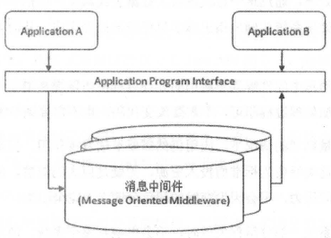

# RabbitMQ

## 一、RabbitMQ简介:boat:

> 参考：/reference/《RabbitMQ实战指南》

### 1.1 什么是消息中间件？

消息（Message）：在应用间传送的数据。

消息队列中间件（Message Queue Middleware, MQ）是指利用**高效可靠的消息传递机制**进行**与平台无关的数据交流**，并基于数据通信来进行分布式系统的集成。通过提供消息传递和消息排队模型，它可以在分布式环境下扩展进程间的通信。

消息队列中间件，也可以称为**消息队列**或者**消息中间件**。它一般有2种传递模式：

- 点对点（P2P, Point-to-Point）模式

  基于队列，生产者发送消息到队列，消费者从队列中接收消息。队列的存在使得消息的**异步传输**成为可能。

- 发布/订阅（Pub/Sub）模式

  定义了如何向一个内容节点发布和订阅消息，内容节点称为**主题（topic）**，消息发布者将消息**发布到某个主题**，而消息订阅者则**从主题中订阅消息**。主题使得消息的发布者和订阅者互相保持独立，不需要进行接触即可保证消息的传递，**发布/订阅模式在消息的一对多广播时采用**。

消息中间件适用于**需要可靠的数据传送的分布式环境**。发送者将消息发送给消息服务器，消息服务器将**消息存放在若干队列中**，在合适的时候再将消息**转发给接收者**，实现应用程序之间的协同。优点在于能够**在客户和服务器之间提供同步和异步的连接**，并且在**任何时刻都可以将消息进行传送或存储转发**。

在下图中，A、B程序使用消息中间件进行通信。程序A、B可以不在同一台服务器上，A发送消息给B，**消息中间件负责处理网络通信**，如果网络连接不可用，**会存储消息，直到连接变得可用，再将消息转发给B**。

灵活性体现在：A发送消息时，B甚至可以不在线，消息中间件来**保留**这份消息，直到B开始执行并消费消息，这样还可以**防止A因为等待B消费消息而出现的阻塞**。

### 1.2 消息中间件的作用

概括如下：

- 解耦：
- 冗余（存储）：
- 扩展性：
- 削峰：
- 可恢复性：
- 顺序保证：
- 缓冲：
- 异步通信：

