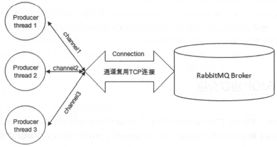

# RabbitMQ

## 一、RabbitMQ简介:airplane:

> 参考：/Reference/《RabbitMQ实战指南》

### 1.1 什么是消息中间件？

消息（Message）：在应用间传送的数据。

消息队列中间件（Message Queue Middleware, MQ）是指利用**高效可靠的消息传递机制**进行**与平台无关的数据交流**，并基于数据通信来进行分布式系统的集成。通过提供消息传递和消息排队模型，它可以在分布式环境下扩展进程间的通信。

消息队列中间件，也可以称为**消息队列**或者**消息中间件**。它一般有2种传递模式：

- 点对点（P2P, Point-to-Point）模式

  基于队列，生产者发送消息到队列，消费者从队列中接收消息。队列的存在使得消息的**异步传输**成为可能。

- 发布/订阅（Pub/Sub）模式

  定义了如何向一个内容节点发布和订阅消息，内容节点称为**主题（topic）**，消息发布者将消息**发布到某个主题**，而消息订阅者则**从主题中订阅消息**。主题使得消息的发布者和订阅者互相保持独立，不需要进行接触即可保证消息的传递，**发布/订阅模式在消息的一对多广播时采用**。

消息中间件适用于**需要可靠的数据传送的分布式环境**。发送者将消息发送给消息服务器，消息服务器将**消息存放在若干队列中**，在合适的时候再将消息**转发给接收者**，实现应用程序之间的协同。优点在于能够**在客户和服务器之间提供同步和异步的连接**，并且在**任何时刻都可以将消息进行传送或存储转发**。

在下图中，A、B程序使用消息中间件进行通信。程序A、B可以不在同一台服务器上，A发送消息给B，**消息中间件负责处理网络通信**，如果网络连接不可用，**会存储消息，直到连接变得可用，再将消息转发给B**。

灵活性体现在：A发送消息时，B甚至可以不在线，消息中间件来**保留**这份消息，直到B开始执行并消费消息，这样还可以**防止A因为等待B消费消息而出现的阻塞**。

### 1.2 消息中间件的作用

概括如下：

- 解耦

  消息中间件在处理过程中间插入了一个隐含、基于数据的接口层。两边的处理过程都要实现这一接口，但是两边都可以独立的扩展或则修改自己的处理过程，只要**确保它们遵守同样的接口约束**即可。

- 冗余（存储）

  某些情况下，处理数据的过程可能失败。消息中间件可以把数据持久化直到它们已经被完全处理，通过这一方式**规避了数据丢失的风险**。在把一个消息从中间件删除时，需要明确指出该消息已经被处理完成。

- 扩展性

  因为**解耦了应用程序的处理过程**，所以**提高消息入队**和**处理效率**就变得很容易了，只要增加额外的处理过程即可，不需要改变代码和参数。

- 削峰

  使用消息中间件能够**使关键组件支持突发访问压力**，不会因为突发的超负荷请求而完全崩溃。

- 可恢复性

  当系统一部分组件失效时，不会影响到整个系统。当这部分组件被修复后，再连接上消息中间件，可以继续处理未处理完的消息。

- 顺序保证

  大多数场景下，数据处理的顺序很重要，大部分消息中间件支持一定程度上的**顺序性**。

- 缓冲

  在任何重要的系统中，**都会存在需要不同处理时间的元素**。消息中间件通过一个**缓冲层**来帮助任务最高效率地执行，写入消息中间件的处理会尽可能快速。该缓冲层有助于控制和优化数据流经过系统的速度。

- 异步通信

  在很多时候，应用不想也不需要立即处理消息。**将消息放入消息中间件中，但并不立即处理它，在之后需要的时候再慢慢处理**。

### 1.3 相关概念介绍

RabbitMQ是采用Erlang语言实现AMQP（Advanced Message Queuing Protocol，高级消息队列协议）的消息中间件，它最初起源于金融系统，用于在分布式系统中存储转发消息。

RabbitMQ整体上是一个生产者与消费者模型，主要负责接收、存储和转发消息。从计算机术语层面来说，RabbitMQ模型更像是一种交换机模型，其整体模型架构如下：

#### 生产者和消费者

Producer：生产者，就是投递消息的一方。生产者创建消息，然后发布到RabbitMQ中。消息一般可以包含2个部分：消息体和标签（Label）。消息体也可以称之为payload，在实际应用中，消息体一般是**一个带有业务逻辑结构的数据**。消息的标签用来表述这条消息，比如一个交换器的名称和一个路由键。

生产者把消息交由RabbitMQ，RabbitMQ之后会根据标签把消息发送给感兴趣的消费（Consumer） 。

Consumer：消费者， 就是接收消息的一方。消费者连接到RabbitMQ服务器，并订阅到队列上。当消费者消费一条消息时，只是消费消息的消息体（payload） 。**在消息路由的过程中，消息的标签会丢弃，存入到队列中的消息只有消息体，消费者也只会消费到消息体，也就不知道消息的生产者是谁，当然消费者也不需要知道**。

Broker：消息中间件的**服务节点**。对于RabbitMQ来说， 一个RabbitMQ Broker可以简单地看作一个RabbitMQ服务节点，或者RabbitMQ服务实例。大多数情况下也可以将一个RabbitMQ Broker看作一台RabbitMQ 服务器。

下图展示了生产者将消息存入RabbitMQ Broker，以及消费者从Broker中消费数据的整个流程：

首先生产者将业务方数据进行可能的包装，之后封装成消息，发送（AMQP协议里这个动作对应的命令为`Basic.Publish`）到Broker中；消费者订阅并接收消息（AMQP协议里这个动作对应的命令为`Basic.Consume`或者`Basic.Get`），经过可能的解包处理得到原始的数据，之后再进行业务处理逻辑。**这个业务处理逻辑并不一定需要和接收消息的逻辑使用同一个线程**。消费者进程可以使用一个线程去接收消息，存入到内存中，比如使用Java中的`BlockingQueue`。业务处理逻辑使用另一个线程从内存中读取数据，这样可以将应用进一步解耦，提高整个应用的处理效率。

#### 队列

Queue：队列 ，是RabbitMQ 的内部对象，用于**存储消息**。RabbitMQ中消息都**只能存储在队列中**，而Kafka将消息存储在topic这个逻辑层面中。

**多个消费者可以订阅同一个队列**，这时队列中的消息会被**平均分摊**（Round-Robin，即轮询）给多个消费者进行处理。

RabbitMQ**不支持队列层面的广播消息**，如果需要广播消费，需要进行二次开发，麻烦，不推荐。

#### 交换器、路由键、绑定

Exchange：交换器。消息并不是直接到队列中的，而是消息先到Exchange（交换器，通常用大写的X表示），**由交换器将消息路由到一个或多个队列中**。如果路由不到，或许会返回给生产者，或许会直接丢弃。

RoutingKey：路由键。生产者将消息发给交换器时，一般会指定一个**RoutingKey**，用来指定这个消息的路由规则。RoutingKey需要与**交换器类型**和**绑定键（BindingKey）** 联合使用才能最终生效。

Binging：绑定。通过**绑定** 将**交换器与队列关联**起来，绑定时一般会指定一个**绑定键（BindingKey）**，这样RabbitMQ就知道如何正确将消息路由到队列了：

生产者将消息发送给交换器时，需要一个RoutingKey，**当BindingKey和RoutingKey匹配时**，消息被路由到对应的队列中。

绑定多个队列到同一个交换器时，BindingKey允许相同。BindingKey只能在**指定的交换器类型下生效**。其实，**在某些情况下，RoutingKey与BindingKey可以看成是同一个东西（BingingKey属于RoutingKey一种）**，为了避免混淆，可以这么理解：

- 在使用绑定的时候，其中需要的路由键是BindingKey，对应的API是`channel.exchangeBing`、`channel.queueBind`，对应的AMQP命令是`Exchange.Bind`、`Queue.Bind`。
- 在发送消息的时候，其中需要的路由键是RoutingKey，对应的API是`channel.basicPublish`，对应的AMQP命令是`Basic.Publish`。

#### 交换器类型

RabbitMQ常用的交换器类型有fanout、direct、topic、headers这四种，另外的system和自定义类型不予描述。

**fanout**：它会**把所有发送到该交换器的消息路由到所有与该交换器绑定的队列中**。

**direct**：它会把消息路由到那些BindingKey和RoutingKey完全匹配的队列中。

当发送消息的时候设置RoutingKey为“warning”时，消息会路由到Queue1和Queue2。

**topic**：

topic类型的交换器在匹配规则上进行了扩展，它与direct类型的交换器相似，也是将消息路由到BindingKey和RoutingKey相匹配的队列中，但这里的匹配规则有些不同：

- RoutingKey为一个点号“.”分隔的字符串。
- BindingKey和RoutingKey一样也是由“.”分隔的字符串。
- BindingKey中可以存在两种特殊字符串"*"和“#”用于模糊匹配。

对于图中的配置关系，不同的路由键的消息方向：

- `com.rabbitmq.client`：同时路由到Q1和Q2。
- `com.hidden.client`：只路由到Q2。
- `com.hidden.demo`：只路由到Q2。
- `java.rabbitmq.demo`：只会路由到Q1。
- `java.util.concurrent`：没有匹配任何路由键，可能被丢弃或返回给生产者（需要设置`mandatory`参数）

headers：

headers类型的交换器**不依赖于路由键的匹配规则来路由消息**，根据发送的消息内容中的**headers 属性进行匹配**。在绑定队列和交换器时制定一组键值对，发送消息到交换器时，会获取该消息的headers，对比其中的键值对是否完全匹配队列和交换器绑定时指定的键值对，完全匹配则路由到该队列。**headers类型的交换器性能会很差，不推荐使用**。

补充：除了上述四种，还有最简单的simple、work模式。simple模式最简单的生产者、（默认交换机）队列、消费者组成，work模式在simple模式的基础上增加了若干个消费者，采用轮询模式（包括平均分发和公平分发，即根据消费能力分发）。

#### RabbitMQ运转流程

在最初状态下，生产者发送消息：

1. 连接到RabbitMQ Broker，**建立一个连接Connection，开启一个信道Channel**；
2. **声明一个交换器**，并设置相关属性，比如：交换器类型、是否持久化等；
3. **声明一个队列**，并设置相关属性，比如：是否排他、是否持久化、是否自动删除等；
4. 通过**路由键将交换器和队列绑定**起来；
5. **发送消息到Broker**，其中包含：路由键、交换器等信息；
6. 相应交换器**根据接收到的路由键查找匹配的队列**；
7. 如果找到，将消息存入相应的队列中；
8. 如果没有找到，根据生产者配置的属性，选择将消息丢弃还是回退给生产者；
9. 关闭信道；
10. 关闭连接。

消费者接收消息：

1. 连接到RabbitMQ Broker，**建立一个连接Connection，开启一个信道Channel**；
2. **向Broker请求消费相应队列中的消息**，可能会设置相应的回调函数，以及做一些准备工作；
3. **等待Broker回应并投递相应队列中的消息**，消费者接收消息；
4. 消费者**确认（`ack`）接收到的消息**；
5. RabbitMQ从队列中**删除相应已经被确认的消息**；
6. 关闭信道；
7. 关闭连接。

无论是生产者还是消费者，都需要和RabbitMQ Broker建立连接，这个连接就是一条TCP连接，也就是Connection。一旦TCP连接建立起来，客户端紧接着可以创建一个AMQP信道（Channel） ，每个信道都会被指派一个唯一的ID。**信道是建立在Connection之上的虚拟连接，RabbitMQ处理的每条AMQP指令都是通过信道完成的**。这个模式是类似NIO（Non-blocking I/O）的做法，TCP 连接复用，减少性能开销，同时也便于管理。

补充：NIO也称非阻塞I/O，包含三大核心部分：Channel信道、Buffer缓冲区、Selector选择器。NIO基于Channel和Buffer进行操作，**数据总是从信道读取到缓冲区中，或则从缓冲区写入到信道中**。Selector用于监听多个信道的事件（如：打开链接、数据到达等）。因此，单线程可以监听多个数据的信道。

#### AMQP协议介绍

RabbitMQ是AMQP协议的Erlang的实现（RabbitMQ还支持STOMP、MQTT等协议）。RabbitMQ中的交换器、交换器类型、队列、绑定、路由键等都遵循AMQP协议中相应的概念。AMQP协议本身包括三层：

- Module Layer：位于协议**最高层**，主要**定义了一些供客户端调用的命令**，客户端可以利用这些命令实现自己的业务逻辑。例如：客户端可以使用`Queue.Declare`命令声明一个队列或使用`Basic.Consume`订阅消费一个队列中的消息。
- Session Layer：位于**中间层**，主要**负责将客户端的命令发送给服务器**，再将服务端的应答返回给客户端，主要为客户端与服务器之间的**通信提供可靠性同步机制和错误处理**。
- Transport Layer：位于**最底层**，主要传输二进制数据流，提供帧的处理、信道复用、错误检测和数据表示等。

AMQP说到底还是一个通信协议，通信协议都会涉及报文交互。从low-level举例来说，AMQP本身是应用层的协议，其填充于TCP协议层的数据部分；而从high-level来说，AMQP是通过协议命令进行交互的。**AMQP协议可以看作一系列结构化命令的集合**，这里的命令代表一种操作，类似于HTTP中的方法。

##### AMQP生产者流转过程

> 参考链接：[haofree](https://www.haofree.top/archives/rabbitmq#amqp%E7%94%9F%E4%BA%A7%E8%80%85%E6%B5%81%E8%BD%AC%E8%BF%87%E7%A8%8B)

##### AMQP消费者流转过程

> 参考链接：[haofree](https://www.haofree.top/archives/rabbitmq#amqp%E6%B6%88%E8%B4%B9%E8%80%85%E6%B5%81%E8%BD%AC%E8%BF%87%E7%A8%8B)

## 二、RabbitMQ高级:airplane:

### 2.1 过期时间（TTL）

> 参考：/Reference/《RabbitMQ实战指南》

RabbitMQ可以对消息和队列设置TTL。

#### 设置消息的TTL

有两种方法可以设置消息的TTL：

1. 通过队列属性设置，**队列中所有消息都有相同的过期时间**。
2. 第二种方法是对**消息进行单独设置**，每条消息TTL可以不同。

**如果上述两种方法同时使用，则消息的过期时间以两者之间TTL较小的那个数值为准**。消息在队列的生存时间一旦超过设置的TTL值，就称为“死信”（Dead Message）（会被投递到死信队列）， 消费者将无法再收到该消息。

通过队列属性设置消息TTL的方法是在`channel.queueDeclare`方法中加入`x-message -ttl`参数实现的，这个参数的单位是毫秒；针对每条消息设置TTL的方法是在`channel.basicPublish`方法中加入`expiration`的属性参数，单位为毫秒。

对于第一种设置队列TTL属性的方法，**一旦消息过期，就会从队列中抹去**；而在第二种方法中，**即使消息过期，也不会马上从队列中抹去，因为每条消息是否过期是在即将投递到消费者之前判定的**。

为什么这两种方法处理的方式不一样？因为第一种方法里，队列中己过期的消息肯定在队列头部， RabbitMQ只要定期从队头开始扫描是否有过期的消息即可；而第二种方法里，每条消息的过期时间不同，**如果要删除所有过期消息势必要扫描整个队列，所以不如等到此消息即将被消费时再判定是否过期**， 如果过期再进行删除即可。

#### 设置队列的TTL

通过`channel.queueDeclare`方法中的`x - expires`参数可以控制队列被自动删除前处于未使用状态的时间。**未使用的意思是队列上没有任何的消费者，队列也没有被重新声明，并且在过期时间段内也未调用过Basic.Get命令**。

设置队列里的TTL可以应用于类似RPC方式的回复队列，在RPC中，许多队列会被创建出来，但是却是未被使用的。

RabbitMQ会确保在过期时间到达后将队列删除，**但是不保障删除的动作有多及时**。在RabbitMQ重启后，**持久化的队列的过期时间会被重新计算**。

用于表示过期时间的`x-expires`参数以毫秒为单位，井且服从和`x-message-ttl`一样的约束条件，**不过不能设置为0** 。比如该参数设置为1000，则表示该队列如果在1秒钟之内未使用则会被删除。

### 2.2 死信队列

DLX，全称为Dead-Letter-Exchange，可以称之为死信交换器，也有人称之为死信邮箱。当消息在一个队列中变成死信（Dead Message）之后，它能被重新被发送到另一个交换器中，这个交换器就是DLX，**绑定DLX的队列就称之为死信队列**。

消息变成死信一般是由于以下几种情况：

- 消息被拒绝（`Basic.Reject/Basic.Nack`），井且设置`requeue`参数为false。
- 消息过期。
- 队列达到最大长度。

DLX也是一个正常的交换器，和一般的交换器没有区别，它能在任何的队列上被指定，实际上就是**设置某个队列的属性**。当这个队列中存在死信时，RabbitMQ就会自动地将这个消息重新发布到设置的DLX上去，进而被路由到另一个队列，即**死信队列**。可以监听这个队列中的消息以进行相应的处理，这个特性与将消息的TTL设置为0配合使用可以弥补`imrnediate`参数的功能。

参考下图，生产者首先发送一条携带路由键为"rk" 的消息，然后经过交换器`exchange.normal`顺利地存储到队列`queue.normal`中。由于队列`queue.normal`设置了过期时间为10s，在这10s内没有消费者消费这条消息，那么判定这条消息为**过期**。由于设置了DLX，过期之时，消息被丢给交换器`exchange.dlx`中，这时找到与`exchange.dlx`匹配的队列`queue.dlx`，最后消息被存储在`queue.dlx`这个死信队列中。

对于RabbitMQ来说，DLX是一个非常有用的特性。它可以处理异常情况下，消息不能够被消费者正确消费（**消费者调用了`Basic.Nack`或者`Basic.Reject`**）而被置入死信队列中的情况，后续分析程序可以**通过消费这个死信队列中的内容来分析当时所遇到的异常情况**，进而可以改善和优化系统。DLX配合TTL使用还可以实现延迟队列的功能。

### 2.3 延迟队列

延迟队列存储的对象是对应的**延迟消息**，所谓”延迟消息“是指当消息被发送以后，并不想让消费者**立刻**拿到消息，而是等待特定时间后，消费者才能拿到这个消息进行消费。延迟队列的使用场景有很多，比如：

- 在订单系统中，一个用户下单之后通常有30分钟的时间进行支付，如果30分钟之内没有支付成功，那么这个订单将进行异常处理，这时就可以使用延迟队列来处理这些订单了。
- 用户希望通过**手机远程遥控家里的智能设备在指定的时间进行工作**。这时候就可以将用户指令发送到延迟队列，当指令设定的时间到了再将指令推送到智能设备。

在AMQP协议中，或者RabbitMQ本身**没有直接支持延迟队列的功能**，但是可以通过前面所介绍的DLX和TTL模拟出延迟队列的功能。

在上图中，不仅展示的是死信队列的用法，也是延迟队列的用法，对于`queue.dlx`这个死信队列来说，**同样可以看作延迟队列**。假设一个应用中需要将每条消息都设置为10秒的延迟，生产者通过`exchange.normal`这个交换器将发送的消息存储在`queue.normal`这个队列中。**消费者订阅的并非是`queue.normal`这个队列，而是`queue.dlx`这个队列**。当消息从`queue.normal`这个队列中过期之后被存入`queue.dlx`这个队列中，消费者就恰巧消费到了延迟10 秒的这条消息。

在真实应用中，对于延迟队列可以根据延迟时间的长短分为多个等级，一般分为5秒、10秒、30秒、1分钟、5分钟、10分钟、30分钟、1小时这几个维度。

参考下图，为了简化说明，这里只设置了5秒、10秒、30秒、1分钟这四个等级。根据应用需求的不同，**生产者在发送消息的时候通过设置不同的路由键，以此将消息发送到与交换器绑定的不同的队列中**。这里队列分别设置了过期时间为5秒、10秒、30秒、1分钟，同时也分别配置了DLX和相应的死信队列。当相应的消息过期时，就会转存到相应的死信队列（即延迟队列）中，这样消费者根据业务自身的情况，分别选择不同延迟等级的延迟队列进行消费。

