# Redis

## 一、Redis概念和基础:boat:

> 参考链接：[Java全栈知识体系](https://pdai.tech/md/db/nosql-redis/db-redis-introduce.html)、[JavaGuide](https://javaguide.cn/database/redis/redis-questions-01.html#%E7%AE%80%E5%8D%95%E4%BB%8B%E7%BB%8D%E4%B8%80%E4%B8%8B-redis)

### 1.1 什么是Redis？

> 参考链接：[Java全栈知识体系](https://pdai.tech/md/db/nosql-redis/db-redis-introduce.html#%E4%BB%80%E4%B9%88%E6%98%AFredis)

Redis是一款**内存高速缓存数据库**，全称为：**Remote Dictionary Server**（远程数据服务），使用**C语言编写**，是一个**Key-Value**存储系统（键值对存储系统），支持丰富的数据类型，如：`String`、`List`、`Set`、`Zset`、`Hash`。

### 1.2 为什么要用Redis？

> 参考链接：[Java全栈知识体系](https://pdai.tech/md/db/nosql-redis/db-redis-introduce.html#%E4%B8%BA%E4%BB%80%E4%B9%88%E8%A6%81%E4%BD%BF%E7%94%A8redis)

- 读写性能优异。
- 数据类型丰富。
- 操作原子性。
- 持久化。
- 发布/订阅。
- 分布式。

### 1.3 Redis的使用场景

> 参考链接：[Java全栈知识体系](https://pdai.tech/md/db/nosql-redis/db-redis-introduce.html#redis%E7%9A%84%E4%BD%BF%E7%94%A8%E5%9C%BA%E6%99%AF)

- 热点数据缓存。
- 分布式锁。
- 消息队列：`list`数据结构可以作为一个简单的队列使用，Redis 5.0新增的`Stream`更加适合做消息队列。

### 1.4 与Memcached的比较

> 参考链接：[JavaGuide](https://javaguide.cn/database/redis/redis-questions-01.html#%E8%AF%B4%E4%B8%80%E4%B8%8B-redis-%E5%92%8C-memcached-%E7%9A%84%E5%8C%BA%E5%88%AB%E5%92%8C%E5%85%B1%E5%90%8C%E7%82%B9)
>

#### 共同点

- 都是**基于内存**的数据库，一般都用来当做缓存使用。
- 都有**过期策略**。
- 两者的**性能都非常高**。

#### 区别

- **Redis支持更丰富的数据类型（支持更复杂的应用场景）**，不仅仅支持简单的Key-Value类型数据，同时还提供`List`、`Set`、`Zset`、`Hash`等数据类型的存储；Memcached只支持最简单的Key-Value数据类型。
- **Redis支持数据的持久化**，它可以将内存中的数据保持在磁盘中，重启的时候可以再次加载进行使用；Memcached把数据全部存在内存之中。
- Redis在服务器内存使用完之后，可以将不用的数据放到磁盘上；但是**Memcached在服务器内存使用完之后，就会直接报异常**。
- **Redis支持原生Cluster模式**；Memcached**没有原生的集群模式**，需要依靠客户端来实现往集群中分片写入数据。
- Redis使用**单线程的多路I/O复用**模型。（Redis 6.0引入了多线程I/O）；Memcached是**多线程、非阻塞IO复用**的网络模型。
- Redis支持**发布/订阅模型、Lua脚本**等功能。
- Redis**同时使用了惰性删除与定期删除**的过期删除策略；Memcached过期数据的**删除策略只用了惰性删除**。

## 二、Redis持久化:rocket:

### 2.1 Redis持久化简介

> 参考链接：[Java全栈知识体系](https://pdai.tech/md/db/nosql-redis/db-redis-x-rdb-aof.html#redis%E6%8C%81%E4%B9%85%E5%8C%96%E7%AE%80%E4%BB%8B)

#### 为什么需要持久化？

Redis是个基于**内存**的数据库。一旦宕机，内存中的数据将全部丢失。通常的解决方案是**从后端数据库恢复这些数据**，但后端数据库有性能瓶颈，如果是大数据量的恢复：**一是会对数据库带来巨大的压力，二是数据库的性能不如Redis导致程序响应慢**。所以对Redis来说，实现数据的持久化，避免从后端数据库中恢复数据，是至关重要的。

#### Redis持久化有哪些方式呢**？**为什么需要重点学RDB和AOF？

从严格意义上说，Redis服务提供四种持久化存储方案：RDB(Redis Database, RDB)、AOF(Append Only File, AOF)、虚拟内存（VM）和　DISKSTORE。

其中，**虚拟内存（VM）方式**，从Redis `v2.4`开始就被官方明确表示不再建议使用，`v3.2`版本中更找不到任何关于虚拟内存（VM）的配置范例；至于**DISKSTORE**方式，是从Redis `v2.8`版本开始提出的一个存储设想，在`v3.2`版本中同样找不到对于这种存储方式的明确支持。

目前官方文档上能够看到的Redis对持久化存储的支持明确的就只有两种方案：**RDB**和**AOF**。

### 2.2 RDB持久化

> 参考链接：[CSDN](https://lansonli.blog.csdn.net/article/details/102648597)、[Java全栈知识体系](https://pdai.tech/md/db/nosql-redis/db-redis-x-rdb-aof.html#rdb-%E6%8C%81%E4%B9%85%E5%8C%96)

#### 简介

RDB持久化方式能够在**指定的时间间隔能对你的数据进行快照存储**。

在默认情况下，Redis将数据库快照保存在名字为`dump.rdb`的二进制文件中。

在Redis运行时，RDB将**当前内存中的数据库快照保存到磁盘文件**中；在Redis重启动时，RDB可以通过载入`.rdb`文件来还原数据库的状态。


当Redis需要保存`dump.rdb`文件时，服务器执行以下操作：

1. Redis调用`fork()`，同时拥有父进程和子进程。
2. 子进程将数据集写入到一个临时`.rdb`文件中。
3. 当子进程完成对新`.rdb`文件的写入时，Redis用新`.rdb`文件替换原来的`.rdb`文件。

这种工作方式使得Redis可以从**写时复制（Copy-on-Write）**机制中获益。

#### 触发方式

##### 手动触发

###### `save`命令（同步机制）

`save`命令执行一个同步操作，以`.rdb`文件的方式保存所有数据的快照。

```bash
127.0.0.1:6379>save
OK
```


由于`save`命令是**同步命令**，会占用Redis的主进程。若Redis数据非常多时，`save`命令执行速度会非常慢，**阻塞**所有客户端的请求。因此**很少**在生产环境直接使用`save`命令，可以使用`bgsave`命令代替。如果在`bgsave`命令的保存数据的子进程发生错误，用`save`命令保存最新的数据是最后的手段。


###### `bgsave`命令（异步机制）

`bgsave`命令执行一个异步操作，以`.rdb`文件的方式保存所有数据的快照。

```bash
127.0.0.1:6379>bgsave
Background saving started
```

Redis使用Linux系统的`fork()`生成一个子进程来将数据保存到磁盘，主进程继续提供服务以供客户端调用。如果操作成功，可以通过客户端命令`LASTSAVE`来检查操作结果。


###### `save`和`bgsave`对比

|  命令  |     `save`     |               `bgsave`               |
| :----: | :------------: | :----------------------------------: |
| IO类型 |      同步      |                 异步                 |
|  阻塞  |       是       | 是（阻塞发生在`fork()`，通常非常快） |
| 复杂度 |      O(n)      |                 O(n)                 |
|  优点  | 不消耗额外内存 |           不阻塞客户端命令           |
|  缺点  | 阻塞客户端命令 |        需要`fork()`，消耗内存        |

##### 自动触发:airplane:

在以下几种情况发生时会自动触发：

- `redis.conf`中配置`save m n`，自动触发`bgsave`生成`.rdb`文件；
- 主从复制时，**从节点要从主节点进行全量复制时也会触发`bgsave`操作**，生成当时的快照**发送到从节点**；
- 执行`debug reload`命令重新加载Redis时也会触发`bgsave`操作；
- 默认情况下执行`shutdown`命令时，如果没有开启AOF持久化，那么也会触发`bgsave`操作；
- 执行`flushall`命令也会生成`.rdb`文件，但文件为空。

###### `redis.conf`中配置RDB

**快照周期**：内存快照虽然可以通过技术人员手动执行`SAVE`或`BGSAVE`命令来进行，但生产环境下**多数情况都会设置其周期性执行条件**。

（1）Redis中默认的周期性设置

```bash
# 默认的设置为：
save 900 1
save 300 10
save 60 10000
```

`save m n`表示如果“**在m秒内有n条key信息发生变化**”，则进行快照。


如果**只使用Redis的缓存功能，不需要持久化**，那么可以注释掉所有的`save`行或直接添加一个空字符串来实现停用：

```bash
save ""
```

（2）其他相关配置：

> 参考链接：[博客园](https://www.cnblogs.com/ysocean/p/9114268.html)

```sh
dbfilename dump-<port>.rdb
dir /var/lib/redis
stop-writes-on-bgsave-error yes
rdbcompression yes
rdbchecksum yes
```

- `dbfilename`：设置快照的文件名，默认是`dump.rdb`。
- `dir`：设置快照文件的存放路径。默认是和当前配置文件保存在同一目录。
- `stop-writes-on-bgsave-error`：默认值为`yes`。当启用了RDB且最后一次后台保存数据失败，Redis是否停止接收数据。
- `rdbcompression`：默认值是`yes`。对于存储到磁盘中的快照，可以设置是否进行压缩存储。如果是的话Redis会采用**LZF**算法进行压缩。
- `rdbchecksum`：默认值是`yes`。在存储快照后还可以让Redis使用**CRC64**算法来进行数据校验。

#### 恢复数据

> 参考链接：[博客园](https://www.cnblogs.com/ysocean/p/9114268.html#_label2)

将`.rdb`文件移动到Redis安装目录并启动服务即可，**Redis会自动加载文件数据至内存**。Redis 服务器在**载入`.rdb`文件期间会一直处于阻塞状态**，直到载入工作完成为止。

#### 优缺点

> 参考链接：[Redis文档](https://redis.io/docs/manual/persistence/#rdb-advantages)

##### 优点

- RDB是Redis数据库中一个**非常紧凑的单时间点文件**，它非常适用于备份，可以在发生数据灾难时轻松恢复不同版本的数据集。
- RDB非常适合**灾难恢复**，它是一个可以**传输到远程数据中心**的压缩文件。
- RDB最大限度地**提高了Redis的性能**，因为Redis父进程为了持久化而需要做的唯一工作就是**派生一个完成所有其余工作的子进程**。父进程永远**不会执行磁盘I/O或类似操作**。
- RDB恢复**大数据集时更快**（相比于AOF）。
- RDB在副本（Replicas）上支持**重启和故障转移后的部分重新同步**。

##### 缺点

- **不可控、丢失数据风险**：RDB**没有将数据丢失的可能性降到最低**。虽然可以配置多个时间保存点，但如果Redis由于没有正确关闭而直接停止工作，那么还是有可能丢失最新的数据。
- **耗时、耗性能**：RDB需要经常`fork()`以便使用子进程在磁盘上持久化。如果数据集很大，`fork()`可能会很耗时，并且性能较低的CPU可能还会导致Redis客户端停止几毫秒甚至一秒钟。AOF也需要`fork()`但频率较低，而且可以调整重写日志的频率。

### 2.3 AOF持久化

> 参考链接：[CSDN](https://lansonli.blog.csdn.net/article/details/102648597)、[Java全栈知识体系](https://pdai.tech/md/db/nosql-redis/db-redis-x-rdb-aof.html#aof-%E6%8C%81%E4%B9%85%E5%8C%96)

#### 简介

Redis是“写后“日志：**Redis先执行命令，把数据写入内存，然后才记录日志**。日志里记录的是Redis收到的每一条命令，这些命令是以文本形式保存的。


**为什么采用写后日志**？Redis要求高性能，采用”写后“日志有两方面好处：

- **避免额外的检查开销**：Redis在向AOF里面记录日志的时候，并不会先去对这些命令进行语法检查。所以，如果先记日志再执行命令的话，日志中就有可能记录了错误的命令，Redis在使用日志恢复数据时，就可能会出错。
- 不会阻塞当前的写操作。

但这种方式**存在潜在风险**：

- 如果命令执行完成，写日志之前宕机了，会丢失数据。
- 主线程写磁盘压力大，导致写盘慢，阻塞后续操作。

从`v1.1`版本开始，Redis增加了一种完全耐久（Durable）的持久化方式：AOF持久化。可以在配置文件中打开AOF方式：

```sh
appendonly yes
```

打开AOF后，每当Redis执行一个**改变数据集的命令**时（比如 `SET`），**这个命令就会被追加到AOF文件的末尾**。这样的话，当Redis重新启动时，程序就可以通过**重新执行AOF文件中的命令来达到重建数据集**的目的。

创建文件和恢复数据：


#### 如何实现AOF？:airplane:

> 参考链接：[Java全栈知识体系](https://pdai.tech/md/db/nosql-redis/db-redis-x-rdb-aof.html#aof-%E6%8C%81%E4%B9%85%E5%8C%96)

AOF日志记录Redis的每个写命令，步骤分为：命令追加（append）、文件写入（write）和文件同步（sync）。

##### 命令追加

当AOF持久化功能打开了，服务器在执行完一个写命令之后，会以**协议格式**将被执行的写命令追加到服务器的`aof_buf`缓冲区。

##### 文件写入和同步

关于何时将`aof_buf`缓冲区的内容写入AOF文件中，Redis提供了三种策略：


###### 三种策略

> 参考链接：[CSDN](https://lansonli.blog.csdn.net/article/details/102648597)

可以通过配置参数`appendfsync`来设置Redis多久将数据`fsync()`到磁盘一次。（`fsync()`：Linux系统函数，只针对单个文件，可用于数据库这样的应用程序，这种应用程序需要确保将修改过的块立即写到磁盘上）

（1）`always`

**每次有新命令追加到AOF文件时就执行一次**`fsync()` ，非常慢但也非常安全。


（2）`everysec`

**每秒一次**`fsync()`：足够快（和RDB持久化差不多），在故障时只会丢失1秒钟的数据。**推荐（且默认）**的策略，可以同时兼顾速度和安全性。


（3）`no`

从不`fsync` ：将数据**交给操作系统来处理**，由操作系统来决定什么时候同步数据，更快但更不安全。


##### `redis.conf`中配置AOF

默认情况下，Redis是没有开启AOF的，可以通过配置`redis.conf`文件来开启AOF持久化，关于AOF的配置如下：

```sh
# appendonly参数开启AOF持久化
appendonly no

# AOF持久化的文件名，默认是appendonly.aof
appendfilename "appendonly.aof"

# AOF文件的保存位置和RDB文件的位置相同，都是通过dir参数设置的
dir ./

# 同步策略
# appendfsync always
appendfsync everysec
# appendfsync no

# aof重写期间是否同步
no-appendfsync-on-rewrite no

# 重写触发配置
auto-aof-rewrite-percentage 100
auto-aof-rewrite-min-size 64mb

# 加载aof出错如何处理
aof-load-truncated yes

# 文件重写策略
aof-rewrite-incremental-fsync yes
```

- `appendonly`：默认情况下AOF功能是关闭的，将该选项改为`yes`以打开Redis的AOF功能。
- `appendfilename`：AOF文件的名字。
- `appendfsync`：这个参数项是AOF功能最重要的设置项之一，主要用于设置“**真正执行**”操作命令向AOF文件中同步的策略。
- `no-appendfsync-on-rewrite`：`always`和`everysec`的设置会使真正的I/O操作高频度的出现，甚至会出现长时间的卡顿情况，为了尽量缓解这个情况，Redis提供了这个设置项，**保证在完成`fsync()`函数调用时，不会将这段时间内发生的命令操作放入操作系统的Page Cache**（这段时间Redis还在接受客户端的各种写操作命令）。
- `auto-aof-rewrite-percentage`：Redis中对触发自动重写AOF文件的操作提供了两个设置：`auto-aof-rewrite-percentage`表示如果当前AOF文件的大小超过了上次重写后AOF文件的百分之多少后，就再次开始重写AOF文件。
- `auto-aof-rewrite-min-size`：表示启动AOF文件重写操作的AOF文件最小大小。如果AOF文件大小低于这个值，则不会触发重写操作。注意：如果是手动调用`BGREWRITEAOF`命令，则不受这两个重写参数条件限制。

#### 重写:airplane:

> 参考链接：[CSDN](https://lansonli.blog.csdn.net/article/details/102648597)

因为AOF的运作方式是不断地将命令追加到文件的末尾，所以随着写入命令的不断增加，AOF文件的体积也会变得越来越大。

举个例子，如果你对一个计数器调用了**100次**`INCR`，那么仅仅是为了保存这个计数器的当前值，AOF文件就需要使用**100条记录**（entry）。然而在实际上，只使用**1条`SET`命令**已经足以保存计数器的当前值了，其余99条记录实际上都是多余的。

为了处理这种情况，Redis支持一种有趣的特性：可以在不打断服务客户端的情况下，对AOF文件进行**重建（Rebuild）**。

每当执行`bgrewriteaof`命令，Redis将写最短的命令序列在**内存中重建当前数据集**。`v2.2`需要自己手动执行`bgrewriteaof`命令；`v2.4`则可以通过配置自动触发AOF重写。


也就是说AOF文件重写**并不是对原文件进行重新整理**，而是**直接读取服务器现有的键值对**，然后用**一条命令去代替之前记录这个键值对的多条命令**，生成一个新的文件后去替换原来的AOF文件。

了解：**从`v7.0.0`开始**，在调度AOF重写时，Redis父进程会打开一个新的增量AOF文件继续写入。子进程执行重写逻辑并生成新的基础AOF。Redis将使用一个临时清单文件来跟踪新生成的基础文件和增量文件。当它们准备好后，Redis会执行原子替换操作，使这个临时清单文件生效。为了避免在AOF重写重复失败和重试的情况下创建大量增量文件的问题，Redis引入了AOF重写限制机制，以确保失败的AOF重写以越来越慢的速度重试。

##### 作用

**减少磁盘占用量、加速数据恢复**。

##### 实现方式

###### `bgrewriteaof`

`bgrewriteaof`命令用于**异步执行**一个AOF文件重写操作，会创建一个当前AOF文件的体积优化版本。即使`bgrewriteaof`执行失败，也不会有任何数据丢失，因为旧的AOF文件在`bgrewriteaof`成功之前不会被修改。`bgrewriteaof`仅仅用于**手动触发重写操作**。

如果一个子Redis是通过磁盘快照创建的，**AOF重写将会在RDB终止后才开始保存**。这种情况下`BGREWRITEAOF`任然会返回OK状态码。从Redis `v2.6`起可以通过`INFO`命令查看AOF重写执行情况。

如果正在执行的AOF重写返回一个错误，AOF重写将会在**稍后一点的时间重新调用**。


###### 重写配置

|            配置名             |              含义               |
| :---------------------------: | :-----------------------------: |
|  `auto-aof-rewrite-min-size`  |    触发AOF文件重写的最小尺寸    |
| `auto-aof-rewrite-percentage` | 触发AOF文件执行重写的最小增长率 |

|      统计名      |                 含义                  |
| :--------------: | :-----------------------------------: |
| aof_current_size |        AOF文件当前尺寸（字节）        |
|  aof_base_size   | AOF文件上次启动和重写时的尺寸（字节） |

AOF重写自动触发机制**需要同时满足**下面两个条件：

1. aof_current_size > `auto-aof-rewrite-min-size`
2. (aof_current_size - aof_base_size) / aof_base_size \* 100 > `auto-aof-rewrite-percentage`

##### 流程


#### 相关配置

```sh
# 开启AOF持久化方式
appendonly yes
# AOF持久化文件名
appendfilename appendonly-<port>.aof
# 每秒把缓冲区的数据同步到磁盘
appendfsync everysec
# 数据持久化文件存储目录
dir /var/lib/redis
# 是否在执行重写时不同步数据到AOF文件
# 这里的 yes，就是执行重写时不同步数据到AOF文件
no-appendfsync-on-rewrite yes
# 触发AOF文件执行重写的最小尺寸
auto-aof-rewrite-min-size 64mb
# 触发AOF文件执行重写的增长率
auto-aof-rewrite-percentage 100
```

#### 优缺点

> 参考链接：[Redis文档](https://redis.io/docs/manual/persistence/#aof-advantages)

##### 优点

- AOF使得Redis**更具持久性**：可以有3种不同的`fsync()`策略。即使使用默认策略`everysec`，写入性能仍然很棒。`fsync()`是使用**后台线程执行**的，当没有`fsync()`正在进行时，主线程将努力执行写入，因此最多只会丢失一秒钟的数据。
- AOF日志是一个**只进行追加**的日志，因此**不会出现寻道（seek）问题**，也不会在断电时出现损坏问题。即使由于某种原因（磁盘已满或其他原因）日志未执行完整的命令而结束，`redis-check-aof`工具也能够轻松修复它。
- 当AOF变得太大时，Redis能够在后台**自动重写**AOF。重写是**完全安全**的，因为当Redis继续附加到旧文件时，会使用**创建当前数据集所需的最少操作集**生成一个全新的文件，一旦新文件准备就绪，Redis就会从“旧”切换到“新”，开始附加到新文件上。
- AOF以**易于理解和解析的格式**依次包含所有操作的日志，甚至可以轻松导出AOF文件。例如，即使不小心使用`FLUSHALL`命令刷新了所有内容，只要在此期间没有执行日志重写，仍然可以**通过停止服务器、删除最新命令（即`FLUSHALL`）并重新启动Redis**来恢复数据集。

##### 缺点

- AOF文件通常比相同数据集的等效`.rdb`文件**大**。
- 根据所使用的`fsync()`策略，AOF可能比RDB**慢**。 一般来说，将`fsync()`设置为**`everysec`时性能仍然非常高**，而在禁用`fsync()`的情况下，**即使在高负载下也应该与RDB一样快**。不过在处理巨大写入负载时，RDB仍然能够提供提供更有保证的最大延迟时间（Maximum Latency）。

### 持久化的抉择

> 参考链接：[CSDN](https://lansonli.blog.csdn.net/article/details/102648597)

#### RDB和AOF对比

|            |    RDB     |     AOF      |
| :--------: | :--------: | :----------: |
| 启动优先级 |     低     |      高      |
|    体积    |     小     |      大      |
|  恢复速度  |     快     |      慢      |
| 数据安全性 | 可能丢数据 | 根据策略决定 |

#### 如何选择？

一般来说， 如果想达到足以媲美PostgreSQL的数据安全性，你应该同时使用两种持久化功能。

如果你可以承受数分钟以内的数据丢失，那么可以只使用RDB持久化；否则就使用AOF重写。但是一般情况下建议不要单独使用某一种持久化机制，而是应该两种一起用。

#### 混合持久化

> 参考链接：[博客园](https://www.cnblogs.com/ysocean/p/9114267.html)

在Redis `v4.0`之后，新增了**RDB-AOF混合持久化**方式。这种方式结合了RDB和AOF的优点，既能快速加载又能避免丢失过多的数据。具体配置为：

```sh
# yes为开启，no为禁用
aof-use-rdb-preamble yes
```

当开启混合持久化时，主进程先`fork()`出**子进程**将现有**内存副本全量以RDB方式写入AOF文件开头**，然后再将缓冲区中的**增量命令以AOF方式写入AOF文件中末尾**，写入完成后通知主进程更新相关信息，并将**新的含有RDB和AOF两种格式的AOF新文件替换旧文件**。

简单来说：混合持久化方式产生的文件一部分是RDB格式，一部分是AOF格式。

#### 优缺点

> 参考链接：[掘金](https://juejin.cn/post/6844904089722028045)

##### 优点

混合持久化**结合了RDB和AOF持久化的优点**，开头为RDB的格式，使得Redis可以更快启动；同时又降低了大量数据丢失的风险。

##### 缺点

AOF文件中添加了RDB格式的内容，会使得AOF文件可读性变差；并且如果开启混合持久化，就必须使用Redis `v4.0`及之后版本（兼容性）。

## 三、Redis发布/订阅:boat:

> 参考链接：[Java全栈知识体系](https://pdai.tech/md/db/nosql-redis/db-redis-x-pub-sub.html)、[Redis命令参考](http://redisdoc.com/pubsub/index.html)
>

### 3.1 简介

Redis发布订阅（Pub/Sub）是一种**消息通信模式**：发送者（Pub）发送消息，订阅者（Sub）接收消息。

Redis的`SUBSCRIBE`命令可以让**客户端订阅任意数量的频道**，每当有新信息发送到被订阅的频道时，信息就会被**发送给所有订阅指定频道的客户端**。


当有新消息通过`PUBLISH`命令发送给**channel 1**时， 这个消息就会被发送给订阅它的三个客户端。

### 3.2 使用方式

Redis有两种发布/订阅模式：基于频道（Channel）的发布/订阅、基于模式（Pattern）的发布/订阅。

#### 基于频道的发布/订阅

"发布/订阅"模式包含两种角色，分别是**发布者和订阅者**。发布者可以向指定的频道（channel）发送消息；订阅者可以订阅一个或者多个频道，所有订阅此频道的订阅者都会收到此消息。


##### 发布者发布消息

发布者发布消息的命令是`publish`，用法是`publish channel message`：

```bash
127.0.0.1:6379> publish channel:1 hi
(integer) 1
```

**返回值表示接收这条消息的订阅者数量**。发出去的消息不会被持久化，即客户端**只有在订阅频道后**才能接收到后续发布到该频道的消息，之前的就接收不到了。

##### 订阅者订阅频道

订阅频道的命令是`subscribe`，可以同时订阅多个频道，用法是`subscribe channel1 [channel2 ...]`：

例如新开一个客户端订阅上面频道（不会收到消息，因为不会收到订阅之前就发布到该频道的消息）：

```bash
127.0.0.1:6379> subscribe channel:1
```

注意：处于此**订阅状态**下客户端不能使用除`subscribe`、`unsubscribe`、`psubscribe`和`punsubscribe`这四个属于"发布/订阅"之外的命令，否则会报错。

进入订阅状态后客户端可能收到**3种类型的回复**。每种类型的回复都包含**3个值**，第一个值是**消息的类型**，根据消息类型的不同，第二个和第三个参数的含义可能不同。**消息类型的取值**可能是以下3个:

- **subscribe**：表示订阅成功的反馈信息。第二个值是订阅成功的**频道名称**，第三个是**当前客户端订阅的频道数量**。

- **message**“：表示接收到的是消息，第二个值表示**产生消息的频道名称**，第三个值是消息的**内容**。
- **unsubscribe**：表示成功取消订阅某个频道。第二个值是对应的**频道名称**，第三个值是**当前客户端订阅的频道数量**，当此**值为0时客户端会退出订阅状态**，之后就可以执行其他非"发布/订阅"模式的命令了。

#### 基于模式的发布/订阅

如果有**某个/某些模式和这个频道匹配**的话，那么**所有订阅这个/这些频道的客户端也同样会收到信息**。

##### 图例解释

下图展示了一个带有频道和模式的例子， 其中`tweet.shop.*`模式匹配了`tweet.shop.kindle`频道和`tweet.shop.ipad`频道，并且有不同的客户端分别订阅它们三个：


当有信息发送到`tweet.shop.kindle`频道时，信息除了发送给client X和client Y之外，还会发送给订阅`tweet.shop.*`模式的client 123和client 256：


另一方面，如果接收到信息的是频道`tweet.shop.ipad`，那么client 123和client 256同样会收到信息：


##### 例子

```bash
# 订阅 news.* 和 tweet.* 两个模式

# 第 1 - 6 行是执行 psubscribe 之后的反馈信息
# 第 7 - 10 才是接收到的第一条信息
# 第 11 - 14 是第二条
# 以此类推。。。

redis> psubscribe news.* tweet.*
Reading messages... (press Ctrl-C to quit)
1) "psubscribe"                  # 返回值的类型：显示订阅成功
2) "news.*"                      # 订阅的模式
3) (integer) 1                   # 目前已订阅的模式的数量

1) "psubscribe"
2) "tweet.*"
3) (integer) 2

1) "pmessage"                    # 返回值的类型：信息
2) "news.*"                      # 信息匹配的模式
3) "news.it"                     # 信息本身的目标频道
4) "Google buy Motorola"         # 信息的内容

1) "pmessage"
2) "tweet.*"
3) "tweet.huangz"
4) "hello"

1) "pmessage"
2) "tweet.*"
3) "tweet.joe"
4) "@huangz morning"

1) "pmessage"
2) "news.*"
3) "news.life"
4) "An apple a day, keep doctors away"
```

注意点：

- 使用`psubscribe`命令可以**重复订阅同一个频道**，如客户端执行了`psubscribe c? c?*`，这时向c1发布消息客户端会接受到**两条消息**，而同时`publish`命令的返回值**是2而不是1**。同样的，如果有另一个客户端执行了`subscribe c1` 和`psubscribe c?*`的话，向c1发送一条消息该客户端也会收到到**2条消息（但是是两种类型：`message`和`pmessage`）**，同时`publish`命令也**返回2**。
- `punsubscribe`命令可以**退订指定的规则**，用法是：`punsubscribe [pattern [pattern ...]]`，如果没有参数则会退订所有规则。
- **使用`punsubscribe`只能退订通过`psubscribe`命令订阅的规则，不会影响直接通过`subscribe`命令订阅的频道**；同样的，`unsubscribe`命令也不会影响通过`psubscribe`命令订阅的规则。另外需要注意`punsubscribe`命令退订某个规则时不会将其中的通配符展开，而是进行严格的字符串匹配，**所以`punsubscribe *` 无法退订`c*`规则，而是必须使用`punsubscribe c*`才可以退订**。

## 四、实现分布式锁:airplane:

> 参考链接：[Kaito's Blog](http://kaito-kidd.com/2021/06/08/is-redis-distributed-lock-really-safe/)
>

### 4.1 为什么需要分布式锁

与分布式锁相对应的是**单机锁**，在写多线程程序时，避免同时操作一个共享变量产生数据问题，通常会使用一把锁来**互斥**，以保证共享变量的正确性，其使用范围是在**同一个进程**中。

那么如果换做是**多个进程，需要同时操作一个共享资源，如何互斥**呢？

例如，现在的业务应用通常都是微服务架构，这也意味着**一个应用会部署多个进程**，那这多个进程如果需要修改MySQL中的同一行记录时，为了避免操作乱序导致数据错误，需要引入**分布式锁**来解决这个问题了。

想要实现分布式锁，必须借助一个**外部系统**，所有进程都去这个系统上申请**加锁**。而这个外部系统，必须要有实现**互斥**的能力，即**两个请求同时进来，只会给一个进程返回成功，另一个返回失败（或等待）**。

这个外部系统，可以是MySQL，也可以是Redis或Zookeeper。但为了追求更好的性能，通常会选择**使用Redis或Zookeeper**。

### 4.2 分布式锁怎么实现

想要实现分布式锁，必须要求Redis有**互斥**的能力。可以使用`SETNX`命令，这个命令表示“**SET** if **N**ot e**X**ists”，即如果key不存在，才会设置它的值，否则什么也不做。两个客户端进程执行这个命令达到**互斥**，就可以实现一个分布式锁。

客户端1申请加锁，加锁成功：

```bash
127.0.0.1:6379> SETNX lock 1
(integer) 1     // 客户端1，加锁成功
```

客户端2申请加锁，因为后到达，加锁失败：

```bash
127.0.0.1:6379> SETNX lock 1
(integer) 0     // 客户端2，加锁失败
```

此时，加锁成功的客户端，就可以去操作**共享资源**。操作完成后，还要及时**释放锁**，给后来者让出操作共享资源的机会。直接使用`DEL`命令删除这个key即可：

```bash
127.0.0.1:6379> DEL lock // 释放锁
(integer) 1
```


但是上述流程存在一个**很大的问题**：当客户端1拿到锁后，如果发生下面的场景，就会造成**死锁**：

- 程序处理业务逻辑异常，**没及时释放**锁
- 进程挂了，**没机会释放**锁

这时这个客户端就会一直占用这个锁，而其它客户端就**永远**拿不到这把锁了。

### 4.3 如何避免死锁

很容易想到的方案是，在申请锁时，给这把锁设置一个**租期**。

在Redis中实现时，就是给这个key设置一个**过期时间**。这里假设操作共享资源的时间不会超过10s，那么在加锁时，给这个key设置**10s过期**即可：

```bash
127.0.0.1:6379> SETNX lock 1    // 加锁
(integer) 1
127.0.0.1:6379> EXPIRE lock 10  // 10s后自动过期
(integer) 1
```

这样一来，无论客户端是否异常，这个锁都可以在10s后被**自动释放**，其它客户端依旧可以拿到锁，**但这样还是有问题**。现在的操作，**加锁、设置过期是2条命令**，有没有可能只执行了第一条，第二条却**来不及**执行的情况发生呢？例如：

- `SETNX`执行成功，执行`EXPIRE`时由于网络问题，执行失败
- `SETNX`执行成功，但Redis异常宕机，`EXPIRE`没有机会执行
- `SETNX`执行成功，但客户端异常崩溃，`EXPIRE`也没有机会执行

总之，这两条命令不能保证是**原子操作（一起成功）**，就有潜在的风险导致**过期时间设置失败**，依旧存在**死锁问题**。

在Redis `v2.6.12`版本之前，需要想尽办法保证`SETNX`和`EXPIRE`原子性执行，还要考虑各种异常情况如何处理。但在之后Redis扩展了`SET`命令的参数，用这一条命令就可以了：

```bash
// 一条命令保证原子性执行
127.0.0.1:6379> SET lock 1 EX 10 NX
OK
```

再来分析**它还有什么问题**？试想这样一种场景：

1. 客户端1加锁成功，开始操作共享资源
2. 客户端1操作共享资源的时间，**超过了锁的过期时间**，锁被自动释放
3. 客户端2加锁成功，开始操作共享资源
4. 客户端1操作共享资源完成，**释放锁（但释放的是客户端 2 的锁）**

这里存在两个严重的问题：

1. **锁过期**：客户端1操作共享资源耗时太久，导致锁被自动释放，之后被客户端2持有。
2. **释放别人的锁**：客户端1操作共享资源完成后，却又释放了客户端2的锁。

**第一个问题，可能是评估操作共享资源的时间不准确导致的。**

例如，操作共享资源的时间**最慢**可能需要15s，但却只设置了10s过期，那这就存在**锁提前过期**的风险。过期时间太短，那**增大冗余时间**，例如设置过期时间为 20s，这样可以么？这样确实可以**缓解**这个问题，降低出问题的概率，但依旧无法**彻底解决**问题。

原因在于：客户端拿到锁之后在操作共享资源时，遇到的场景有可能是**很复杂**。既然只是**预估时间**，所以只能大致计算，除非能预料并覆盖到所有导致耗时变长的场景，但这其实很难。

**第二个问题在于，一个客户端释放了其它客户端持有的锁。**

导致这个问题发生的关键点在于：每个客户端在释放锁时，都是**无脑操作**，并**没有检查这把锁是否还归自己持有**，所以就会出现释放别人锁的风险，这样的解锁流程**并不严谨**！

### 4.4 锁被别人释放怎么办

解决办法是：客户端在加锁时，设置一个只有自己知道的**唯一标识**进去。

例如，这个标识可以是自己的线程ID，也可以是一个UUID（随机且唯一），这里以UUID举例：

```bash
// 锁的VALUE设置为UUID
127.0.0.1:6379> SET lock $uuid EX 20 NX
OK
```

注意：这里假设**20s操作共享时间完全足够**，先不考虑锁自动过期的问题。

之后，在释放锁时，要先判断这把锁**是否还归自己持有**，伪代码可以这么写：

```
// 锁是自己的，才释放
if redis.get("lock") == $uuid:
    redis.del("lock")
```

这里释放锁使用的是`GET+DEL`两条命令，这时又会遇到**原子性问题**：

1. 客户端1执行`GET`，判断锁是自己的
2. 客户端2执行了`SET`命令，强制获取到锁（虽然发生概率比较低，但需要严谨地考虑锁的安全性模型）
3. 客户端1执行`DEL`，却释放了客户端2的锁

由此可见，这两个命令还是必须要原子执行才行。怎样**原子执行**呢？需要使用**Lua脚本**。可以把这个逻辑理解成：**写Lua脚本然后让Redis来执行**。因为Redis处理每一个请求是**单线程**执行的，所以在执行一个Lua脚本时，其它请求必须等待，直到这个Lua脚本处理完成，这样一来，`GET+DEL`之间就不会插入其它命令了。


安全释放锁的Lua脚本如下：

```Lua
// 判断锁是自己的，才释放
if redis.call("GET",KEYS[1]) == ARGV[1]
then
    return redis.call("DEL",KEYS[1])
else
    return 0
end
```

这样一路优化，整个的加锁、解锁的流程就更严谨了。小结一下，基于Redis实现的分布式锁，**一个严谨的流程如下**：

1. 加锁：`SET $lock_key $unique_id EX $expire_time NX`；
2. 操作共享资源；
3. 释放锁：Lua脚本，先`GET`判断锁是否归属自己，再`DEL`释放锁。


有了这个完整的锁模型，可以重新回到前面提到的第一个问题：锁过期时间不好评估怎么办？

### 4.5 锁过期时间不好评估怎么办？

前面提到，锁的过期时间如果评估不好，这个锁就会有**提前过期**的风险。前面给的妥协方案是：

尽量**冗余过期时间**，降低锁提前过期的概率。

这个方案其实也不能完美解决问题，那怎么办呢？是否可以设计这样的方案：

加锁时，**先设置一个过期时间**，然后**开启一个守护线程**，**定时去检测这个锁的失效时间**，如果锁快要过期了，操作共享资源还未完成，那么就**自动对锁进行续期**，重新设置过期时间。

这确实一种比较好的方案。幸运的是在Java中已经有一个库把这些工作都封装好了：**Redisson**。

Redisson是一个基于Java语言实现的Redis SDK客户端，在使用分布式锁时，它就采用了**自动续期**的方案来避免锁过期，这个**守护线程**一般也把它叫做**看门狗**线程。


除此之外，这个SDK还封装了很多易用的功能：可重入锁、乐观锁、公平锁、读写、Redlock（红锁，后面会详细讲）。这个SDK提供的API非常友好，它可以**使用类似操作本地锁的方式来操作分布式锁**。

到这里再小结一下，基于Redis实现分布式锁所遇到的问题，以及对应的解决方案：

- **死锁**：设置过期时间
- **过期时间评估不好，锁提前过期**：守护线程，自动续期
- **锁被别人释放**：锁写入唯一标识，释放锁先检查标识，再释放

那么还会有哪些问题场景会危害Redis锁的安全性呢？之前分析的场景都是，锁在**单个Redis实例中**可能产生的问题，并没有涉及到Redis的部署架构细节。

而通常在使用Redis时，一般会采用**主从集群 + 哨兵**的模式部署，这样做的好处在于：当主库异常宕机时，哨兵可以实现**故障自动切换**，**把从库提升为主库**，继续提供服务，以此保证可用性。

**那当发生主从切换时，这个分布锁是否依旧安全？**

试想这样的场景：

1. 客户端1在主库上执行`SET`命令，加锁成功；
2. 此时主库异常宕机，`SET`命令还未同步到从库上（**主从复制是异步的**）；
3. 从库被哨兵提升为新主库，这个锁在新的主库上丢失了！


可见当引入Redis副本后，分布锁还是可能会受到影响。怎么解决这个问题？

为此，Redis的作者提出一种解决方案，就是经常听到的**Redlock（红锁）**。

### 4.6 Redlock真的安全么？

Redis作者提出的Redlock方案基于2个前提：

1. 不再需要部署**从库**和**哨兵**实例，只部署**主库**。
2. 但主库要部署多个，官方推荐至少5个实例。

也就是说，想要使用Redlock至少要部署5个Redis实例，而且**都是主库**（它们之间没有任何关系，都是孤立的）。

**注意：不是部署 Redis Cluster，就是部署 5 个简单的 Redis 实例。**


整体流程一共分为5步：

1. 客户端先获取**当前时间戳T1**
2. 客户端依次向这5个Redis实例发起加锁请求（用`SET`命令），且每个请求会设置**超时时间**（毫秒级，要远小于锁的有效时间）。如果某一个实例加锁失败（包括网络超时、锁被其它人持有等各种异常情况），就立即向下一个Redis实例申请加锁
3. 如果客户端使得**>=3 个（大多数）以上**Redis实例加锁成功，则再次获取**当前时间戳T2**，如果**T2-T1<锁的过期时间**，此时认为客户端加锁成功，否则认为加锁失败
4. 加锁成功：去操作共享资源
5. 加锁失败：向**全部节点**发起释放锁请求（使用Lua脚本释放锁）

整个流程有4个重点：

1. 客户端向所有Redis实例申请加锁
2. 必须保证**大多数节点加锁成功**
3. 大多数节点**加锁的总耗时，要小于锁设置的过期时间**
4. 释放锁，要向**全部节点发起释放锁请求**

Redlock为什么要这么做？

#### （1）为什么要在多个实例上加锁？

本质上是为了**容错**，部分实例异常宕机，剩余的实例加锁成功，整个锁服务依旧可用。

#### （2）为什么大多数加锁成功才算成功？

多个Redis实例一起来用，其实就组成了一个**分布式系统**。在分布式系统中，总会出现**异常节点**，所以在谈论分布式系统问题时，需要考虑异常节点达到多少个，也依旧不会影响整个系统的**正确性**。

这是一个分布式系统**容错**问题，这个问题的结论是：

**如果存在「故障」节点，只要大多数节点正常，那么整个系统依旧是可以提供正确服务的。**

#### （3）为什么需要计算加锁的累计耗时？

因为操作的是多个节点，所以耗时肯定会比操作单个实例耗时更久，而且，因为是网络请求，网络情况是复杂的，有可能存在**延迟、丢包、超时**等情况发生，网络请求越多，异常发生的概率就越大。

所以，即使大多数节点加锁成功，但**如果加锁的累计耗时已经超过了锁的过期时间，那此时有些实例上的锁可能已经失效了，这个锁就没有意义**了。

#### （4）为什么释放锁要操作所有节点？

在某一个Redis节点加锁时，可能因为**网络原因导致加锁失败**。例如，客户端在一个Redis实例上加锁成功，在**读取响应结果时因网络问题导致读取失败**，但其实这把锁已经在Redis上加锁成功了。

所以释放锁时，不管之前有没有加锁成功，都需要释放**所有节点**的锁，以保证清理节点上**残留**的锁。

#### 关于Redlock的争论:rainbow:

> 参考链接：[Kaito's Blog](http://kaito-kidd.com/2021/06/08/is-redis-distributed-lock-really-safe/)
>

### 4.7 对分布式锁的理解（博客作者）

#### （1）到底要不要用Redlock？

Redlock只有建立在**时钟正确**的前提下才能正常工作，如果可以保证这个前提，那么可以拿来使用。但保证时钟正确并不是那么简单：

1. **从硬件角度来说**，时钟发生偏移时有发生，无法避免。例如，CPU 温度、机器负载、芯片材料都是有可能导致时钟发生偏移。
2. **从博客作者的工作经历来说**，曾经就遇到过**时钟错误而运维暴力修改时钟的情况**，进而影响了系统的正确性，所以人为错误也是很难完全避免的。

所以博客作者对Redlock的个人看法是：

**尽量不使用**，而且它的性能不如单机版Redis，部署成本也高，还是会优先考虑使用**Redis主从+哨兵**的模式实现分布式锁。

#### （2）如何正确使用分布式锁？

1. 使用分布式锁，在上层完成**互斥**目的，虽然极端情况下锁会失效，但它可以最大程度把并发请求阻挡在最上层，减轻操作资源层的压力。
2. 但对于要求数据绝对正确的业务，在资源层一定要做好**兜底**，设计思路可以借鉴fencing token的方案。

## 二、数据结构:rocket:

> 参考链接：[Redis文档](https://redis.io/docs/manual/data-types/)、[Java全栈知识体系](https://pdai.tech/md/db/nosql-redis/db-redis-data-types.html)、[JavaGuide](https://javaguide.cn/database/redis/redis-questions-01.html#redis-%E5%B8%B8%E8%A7%81%E6%95%B0%E6%8D%AE%E7%BB%93%E6%9E%84)、[博客园](https://www.cnblogs.com/ysocean/p/9080940.html)、[博客园](https://www.cnblogs.com/xrq730/p/8944539.html)
>

### 2.1 5种基础数据类型

> 参考链接：[Java全栈知识体系](https://pdai.tech/md/db/nosql-redis/db-redis-data-types.html)、[JavaGuide](https://javaguide.cn/database/redis/redis-data-structures-01.html)

Redis中所有的**Key（键）都是字符串**，所以数据类型是指**存储值的数据类型**，主要包括常见的5种基础数据类型，分别是：`String`、`List`、`Set`、`Zset`、`Hash`。


|       类型       |                    存储的值                    |                           读写能力                           |
| :--------------: | :--------------------------------------------: | :----------------------------------------------------------: |
| String<br>字符串 |              字符串、整数或浮点数              | 对整个字符串或字符串的一部分进行操作；对整数或浮点数进行自增或自减操作 |
|   List<br>列表   | 一个链表，链表上的**每个结点都包含一个字符串** | 对链表的两端进行`push`和`pop`操作，读取单个或多个元素；根据值查找或删除元素 |
|   Set<br>集合    |            包含**字符串的无序集合**            | 字符串的集合，包含基础的方法有添加、获取、删除；还包含计算交集、并集、差集等 |
|   Hash<br>散列   |           包含**键值对的无序散列表**           |              包含方法有添加、获取、删除单个元素              |
| Zset<br>有序集合 |         和散列一样，**用于存储键值对**         | 字符串成员与浮点数分数之间的有序映射；**元素的排列顺序由分数的大小决定**；包含方法有添加、获取、删除单个元素以及根据分值范围或成员来获取元素 |

#### `String`字符串

`String`是Redis中最基本的数据类型。`String`类型是**二进制安全**（由于统计变量`len`，读写字符串时不依赖`“\0”`终止符）的，意思是Redis的`String`可以包含任何数据，如数字、字符串、图片或者序列化的对象。

##### 图例


##### 命令

|   命令   |            简述             |        使用         |
| :------: | :-------------------------: | :-----------------: |
|  `GET`   |   获取存储在给定键中的值    |      `GET key`      |
|  `SET`   |   设置存储在给定键中的值    |   `SET key value`   |
| `SETNX`  | 只有在`key`不存在时设置其值 |  `SETNX key value`  |
|  `DEL`   |   删除存储在给定键中的值    |      `DEL key`      |
|  `INCR`  |       将键存储的值加1       |     `INCR key`      |
|  `DECR`  |       将键存储的值减1       |     `DECR key`      |
| `INCRBY` |    将键存储的值加上整数     | `INCRBY key amount` |
| `DECRBY` |    将键存储的值减去整数     | `DECRBY key amount` |

**执行示例**：

```bash
127.0.0.1:6379> set hello world
OK
127.0.0.1:6379> get hello
"world"
127.0.0.1:6379> del hello
(integer) 1
127.0.0.1:6379> get hello
(nil)
127.0.0.1:6379> set counter 2
OK
127.0.0.1:6379> get counter
"2"
127.0.0.1:6379> incr counter
(integer) 3
127.0.0.1:6379> get counter
"3"
127.0.0.1:6379> incrby counter 100
(integer) 103
127.0.0.1:6379> get counter
"103"
127.0.0.1:6379> decr counter
(integer) 102
127.0.0.1:6379> get counter
"102"
```

#### `List`列表

Redis中的`List`其实就是**链表（Redis使用双端链表实现`List`）**。使用`List`结构可以轻松实现**最新消息排队功能**（比如新浪微博的TimeLine）。`List`的另一个应用就是**消息队列**，可以利用`List`的`PUSH`操作，将任务存放在`List`中，然后工作线程再用`POP`操作将任务取出执行。

##### 图例

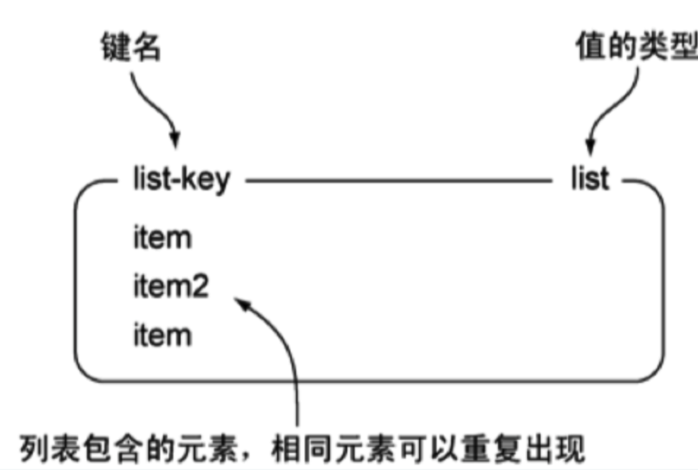

##### 命令

|   命令   |                     简述                     |           使用            |
| :------: | :------------------------------------------: | :-----------------------: |
| `RPUSH`  |      将给定值（可以多个）推入到列表右端      | `RPUSH key value1 value2` |
| `LPUSH`  |      将给定值（可以多个）推入到列表左端      | `LPUSH key value1 value2` |
|  `RPOP`  |   从列表的右端弹出一个值，并返回被弹出的值   |        `RPOP key`         |
|  `LPOP`  |   从列表的左端弹出一个值，并返回被弹出的值   |        `LPOP key`         |
| `LRANGE` |         获取列表在给定范围上的所有值         |  `LRANGE key start end`   |
| `LINDEX` | 通过索引获取列表中的元素，也可以使用负数下标 |    `LINDEX key index`     |
|  `LSET`  |       将列表`index`位置的值设为`value`       |  `LSET key index value`   |

补充：使用技巧：
- `lpush`+`lpop`=栈
- `lpush`+`rpop`=队列
- `lpush`+`ltrim`=有限集合
- `lpush`+`brpop`（`rpop`的阻塞版本）=消息队列

**执行示例**：

```bash
127.0.0.1:6379> lpush mylist 1 2 ll ls mem
(integer) 5
127.0.0.1:6379> lrange mylist 0 -1
1) "mem"
2) "ls"
3) "ll"
4) "2"
5) "1"
127.0.0.1:6379> lindex mylist -1
"1"
127.0.0.1:6379> lindex mylist 10        # index不在 mylist 的区间范围内
(nil)
```

#### `Set`集合

Redis中的`Set`是`String`类型的**无序**集合。集合成员是唯一的，这就意味着集合中**不能出现重复的数据**。Redis中集合是通过**哈希表**实现的，所以添加、删除、查找的复杂度都是O(1)。

##### 图例

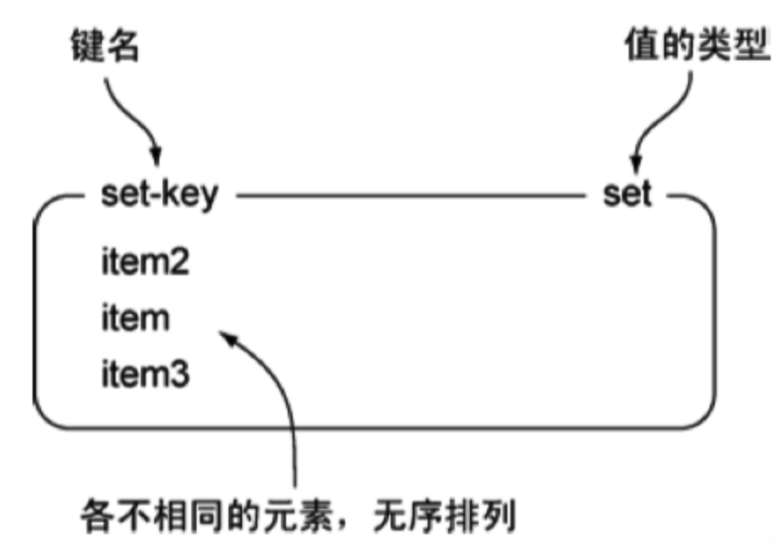

##### 命令

|    命令     |                 简述                  |            使用            |
| :---------: | :-----------------------------------: | :------------------------: |
|   `SADD`    |       向集合添加一个或多个成员        | `SADD key member1 member2` |
|   `SCARD`   |           获取集合的成员数            |        `SCARD key`         |
| `SMEMBERS`  |         返回集合中的所有成员          |       `SMEMBERS key`       |
| `SISMEMBER` | 判断`member`元素是否是集合`key`的成员 |   `SISMEMBER key member`   |

**执行示例**：

```bash
127.0.0.1:6379> sadd myset hao hao1 xiaohao hao
(integer) 3
127.0.0.1:6379> smembers myset
1) "xiaohao"
2) "hao1"
3) "hao"
127.0.0.1:6379> sismember myset hao
(integer) 1
```

#### `Hash`散列

Redis中的`Hash`是一个**String类型的field（字段）和value（值）的映射表**，`Hash`特别适合用于存储对象。

##### 图例

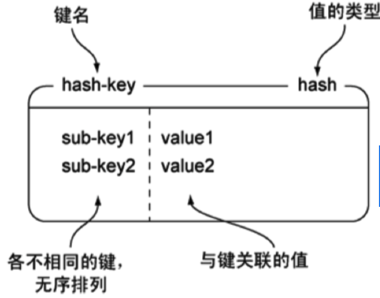

##### 命令

|   命令    |             简述             |           使用           |
| :-------: | :--------------------------: | :----------------------: |
|  `HSET`   | 设置指定哈希表中指定字段的值 |  `HSET key field value`  |
|  `HGET`   | 获取指定哈希表中指定字段的值 |     `HGET key field`     |
| `HGETALL` | 获取指定哈希表中所有的键值对 |      `HGETALL key`       |
|  `HDEL`   |   删除一个或多个哈希表字段   | `HDEL key filed1 field2` |

**执行示例**：

```bash
127.0.0.1:6379> hset user name1 hao
(integer) 1
127.0.0.1:6379> hset user email1 hao@163.com
(integer) 1
127.0.0.1:6379> hgetall user
1) "name1"
2) "hao"
3) "email1"
4) "hao@163.com"
127.0.0.1:6379> hget user user
(nil)
127.0.0.1:6379> hget user name1
"hao"
127.0.0.1:6379> hset user name2 xiaohao
(integer) 1
127.0.0.1:6379> hset user email2 xiaohao@163.com
(integer) 1
127.0.0.1:6379> hgetall user
1) "name1"
2) "hao"
3) "email1"
4) "hao@163.com"
5) "name2"
6) "xiaohao"
7) "email2"
8) "xiaohao@163.com"
```

#### `Zset`有序集合

Redis中的`Zset`和`Set`一样也是`String`类型元素的集合，且**不允许出现重复成员**。不同的是每个元素都会关联一个`double`类型的分数。Redis正是通过分数来为集合中的成员进行**从小到大的排序**。

`Zset`的成员是唯一的，但分数却可以重复。`Zset`是通过两种数据结构实现的：

- **压缩列表（ziplist）**：`ziplist`是为了提高存储效率而设计的**一种特殊编码的双向链表**。它可以存储**字符串或者整数**，存储整数时是采用**整数的二进制**而不是字符串形式存储。它能在O(n)的时间复杂度下完成对两端的`push`和`pop`操作，但是因为每次操作都需要重新分配`ziplist`的内存，所以实际复杂度和`ziplist`的内存使用量相关。
- **跳跃表（zSkiplist）**：跳跃表的性能可以保证在查找、删除、添加等操作的时候在**对数期望时间内**完成，这个性能是可以和平衡树来相比较的，而且在实现方面比平衡树要优雅，这是采用跳跃表的主要原因。跳跃表的复杂度是O(log(n))。

##### 图例

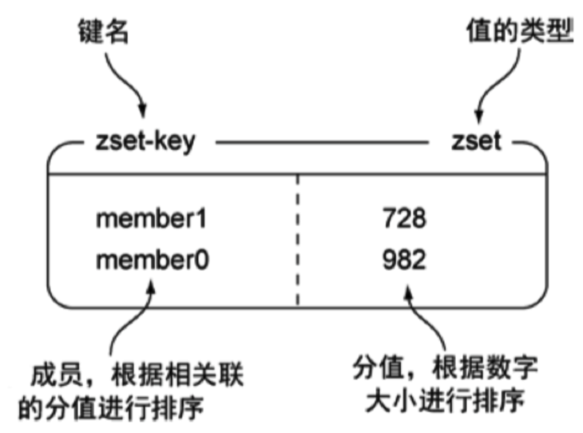

##### 命令

|   命令   |                           用法                           |                   描述                   |
| :------: | :------------------------------------------------------: | :--------------------------------------: |
|  `ZADD`  |             向指定有序集合添加一个或多个元素             | `ZADD key score1 member1 score2 member2` |
| `ZRANGE` | 获取指定有序集合`start`和`end`之间的元素（分数从低到高） |          `ZRANGE key start end`          |
|  `ZREM`  |              移除有序集合中的一个或多个成员              |        `ZREM key member1 member2`        |

**执行示例**：

```bash
127.0.0.1:6379> zadd myscoreset 100 hao 90 xiaohao
(integer) 2
127.0.0.1:6379> ZRANGE myscoreset 0 -1
1) "xiaohao"
2) "hao"
127.0.0.1:6379> ZSCORE myscoreset hao
"100"
```

### 2.2 3种特殊数据类型:boat:

> 参考链接：[Java全栈知识体系](https://pdai.tech/md/db/nosql-redis/db-redis-data-type-special.html)

Redis除了上述5种基础数据类型外，还有3种特殊的数据类型，分别是`HyperLogLog`（基数统计），`Bitmaps`（位图）和`geospatial`（地理位置）。

#### `HyperLogLog`（基数统计）

Redis `v2.8.9`版本更新了`Hyperloglog`数据结构。

##### 什么是基数？

举个例子，A={1, 2, 3, 4, 5}，B={3, 5, 6, 7, 9}；那么基数（不重复的元素）=1, 2, 4, 6, 7, 9（允许容错，即可以接受一定误差）

##### 用来解决什么问题？

这个结构可以非常省内存的去**统计各种计数**，比如注册IP数、每日访问IP数、页面实时UV、在线用户数、共同好友数等。

##### 它的优势体现在哪？

一个大型的网站，每天IP比如有100万，粗算一个IP消耗15字节，那么100万个IP就是15M。而 HyperLogLog在Redis中每个键占用的内容都是12K，理论存储近似接近2^64个值，不管存储的内容是什么，它是一个基于基数估算的算法，能**比较准确的估算出基数，可以使用少量固定的内存去存储并识别集合中的唯一元素**。虽然这个估算的基数并不一定准确，是一个带有0.81%标准错误的近似值（但对于可以接受一定容错的业务场景，比如IP数统计、UV等，是可以忽略不计的）。

##### 命令使用

```bash
127.0.0.1:6379> pfadd key1 a b c d e f g h i	# 创建第一组元素
(integer) 1
127.0.0.1:6379> pfcount key1					# 统计元素的基数数量
(integer) 9
127.0.0.1:6379> pfadd key2 c j k l m e g a		# 创建第二组元素
(integer) 1
127.0.0.1:6379> pfcount key2
(integer) 8
127.0.0.1:6379> pfmerge key3 key1 key2			# 合并两组：key1 key2 -> key3 并集
OK
127.0.0.1:6379> pfcount key3
(integer) 13
```

#### `Bitmap`（位存储）

`Bitmap`即位图数据结构，是操作二进制位来进行记录，只有**0和1两个状态**。

##### 用来解决什么问题？

统计用户信息：活跃|不活跃、 登录|未登录、 打卡|不打卡。类似这种包含**两个状态的，都可以使用`Bitmaps`**。

##### 命令使用

1. 使用`bitmap`来记录周一到周日的打卡

   周一：1、周二：0、周三：0、周四：1......

   ```bash
   127.0.0.1:6379> setbit sign 0 1
   (integer) 0
   127.0.0.1:6379> setbit sign 1 1
   (integer) 0
   127.0.0.1:6379> setbit sign 2 0
   (integer) 0
   127.0.0.1:6379> setbit sign 3 1
   (integer) 0
   127.0.0.1:6379> setbit sign 4 0
   (integer) 0
   127.0.0.1:6379> setbit sign 5 0
   (integer) 0
   127.0.0.1:6379> setbit sign 6 1
   (integer) 0
   ```

2. 查看某一天是否有打卡：

   ```bash
   127.0.0.1:6379> getbit sign 3
   (integer) 1
   127.0.0.1:6379> getbit sign 5
   (integer) 0
   ```

3. 统计打卡的天数：

   ```bash
   127.0.0.1:6379> bitcount sign # 统计这周的打卡记录，就可以看到是否有全勤！
   (integer) 3
   ```

#### `Geospatial`（地理位置）

Redis的`Geospatial`在Redis `v3.2`版本就推出了。这个功能可以推算地理位置的信息：两地之间的距离、方圆几里的人等。

### 2.3 Redis `v5.0`新数据结构:rainbow:

> 参考链接：[Java全栈知识体系](https://pdai.tech/md/db/nosql-redis/db-redis-data-type-stream.html)

Redis的作者在`v5.0`中放出一个新的数据结构——`Stream`。`Stream`的内部其实也是一个队列，**每一个不同的Key，对应的是不同的队列，每个队列的元素（也就是消息）都有一个`msgid`，并且需要保证`msgid`是严格递增的**。

在`Stream`当中，消息是默认持久化的，即便是Redis重启，也能够读取到消息。那么，`Stream`是如何做到多播的呢？其实非常简单，与其他队列系统相似，Redis对不同的消费者，可以消费同一个消息；对于不同的消费组，都维护一个`Idx`下标，表示这一个消费群组消费到了哪里，每次进行消费，都会更新一下这个下标，往后面一位进行偏移。

### 2.4 对象机制详解:airplane:

> 参考链接：[Java全栈知识体系](https://pdai.tech/md/db/nosql-redis/db-redis-x-redis-object.html)

#### 引入


上图反映了Redis的**每种对象**其实都由**对象结构（redisObject）**与**对应编码的底层数据结构**组合而成，而**每种对象类型对应若干编码方式，不同的编码方式所对应的底层数据结构是不同的**。所以需要从几个角度来着手底层研究：

- **对象设计机制**：对象结构（redisObject）。
- **编码类型和底层数据结构**：对应编码的数据结构。

#### 为什么Redis会设计`redisObject`？

在Redis的命令中，用于对键进行处理的命令占了很大一部分，而对于键所保存的**值类型的命令又各不相同**。如：`LPUSH`和`LLEN`只能用于列表键，而`SADD`和`SRANDMEMBER`只能用于集合键；另外一些命令，比如`DEL`、`TTL`和`TYPE`可以用于任何类型的键。**要正确实现这些命令，必须为不同类型的键设置不同的处理方式**，例如：删除一个列表键和删除一个字符串键的操作过程就不太一样。以上的描述说明，**Redis必须让每个键都带有类型信息，使得程序可以检查键的类型，并为它选择合适的处理方式**。

进一步地，例如集合类型就可以由字典和整数集合两种不同的数据结构实现。但是当用户执行`ZADD`命令时，用户不必关心集合使用的是什么编码，只要Redis能按照`ZADD`命令的指示将新元素添加到集合就可以了。这又说明：**操作数据类型的命令除了要对键的类型进行检查之外，还需要根据数据类型的不同编码进行多态处理**。

为了解决以上问题，**Redis构建了自己的类型系统**，这个系统的主要功能包括：

- `redisObject`对象。
- 基于`redisObject`对象的类型检查。
- 基于`redisObject`对象的显式多态函数。
- 对`redisObject`进行分配、共享和销毁的机制。

总结：Redis使用自己实现的对象机制（`redisObject`）来实现**类型判断**、**命令多态**和**基于引用次数的垃圾回收**。

#### `redisObject`数据结构

`redisObject`是Redis类型系统的核心，数据库中的**每个键、值以及Redis本身处理的参数**都表示为这种数据类型。

```c
/*
 * Redis 对象
 */
typedef struct redisObject {
    // 类型
    unsigned type:4;
    // 编码方式
    unsigned encoding:4;
    // LRU - 24位, 记录最末一次访问时间（相对于lru_clock）; 或者 LFU（最少使用的数据：8位频率，16位访问时间）
    unsigned lru:LRU_BITS; // LRU_BITS: 24
    // 引用计数
    int refcount;
    // 指向底层数据结构实例
    void *ptr;
} robj;
```

下图对应上面的结构：


**其中`type`、`encoding`和`ptr`是最重要的三个属性**：

- `type`记录了对象所保存的值的类型，它的值可能是以下常量中的一个：

  ```c
  /*
  * 对象类型
  */
  #define OBJ_STRING 0 // 字符串
  #define OBJ_LIST 1 // 列表
  #define OBJ_SET 2 // 集合
  #define OBJ_ZSET 3 // 有序集
  #define OBJ_HASH 4 // 哈希表
  ```

- `encoding`记录了对象所保存的值的编码，它的值可能是以下常量中的一个：

  ```c
  /*
  * 对象编码
  */
  #define OBJ_ENCODING_RAW 0     /* Raw representation */
  #define OBJ_ENCODING_INT 1     /* Encoded as integer */
  #define OBJ_ENCODING_HT 2      /* Encoded as hash table */
  #define OBJ_ENCODING_ZIPMAP 3  /* 注意：版本2.6后不再使用. */
  #define OBJ_ENCODING_LINKEDLIST 4 /* 注意：不再使用了，旧版本2.x中String的底层之一. */
  #define OBJ_ENCODING_ZIPLIST 5 /* Encoded as ziplist */
  #define OBJ_ENCODING_INTSET 6  /* Encoded as intset */
  #define OBJ_ENCODING_SKIPLIST 7  /* Encoded as skiplist */
  #define OBJ_ENCODING_EMBSTR 8  /* Embedded sds string encoding */
  #define OBJ_ENCODING_QUICKLIST 9 /* Encoded as linked list of ziplists */
  #define OBJ_ENCODING_STREAM 10 /* Encoded as a radix tree of listpacks */
  ```

- `ptr`是一个指针，**指向实际保存值的数据结构**，这个数据结构由`type`和`encoding`属性决定。例如：如果一个`redisObject`的`type`属性为`OBJ_LIST`，`encoding`属性为`OBJ_ENCODING_QUICKLIST`，那么这个对象就是一个**列表（List)**，它的值保存在一个`QuickList`的数据结构内，而`ptr`指针就指向`QuickList`。

- `lru`：记录了该对象最后一次被命令程序访问的时间。

- `refcount`：记录了该对象的引用计数。

#### 命令的类型检查和多态处理

**当执行一个处理数据类型命令的时候，Redis执行以下步骤**：

1. 根据给定的`Key`，在数据库字典中查找与之相对应的`redisObject`，如果没找到就返回`NULL`；
2. 检查`redisObject`的`type`属性和执行命令所需的类型是否相符，如果不相符返回类型错误；
3. 根据`redisObject`的`encoding`属性指定的编码，选择合适的操作函数来处理底层的数据结构；
4. 返回数据结构的操作结果作为命令的返回值。

例如执行`LPOP`命令，流程图如下：

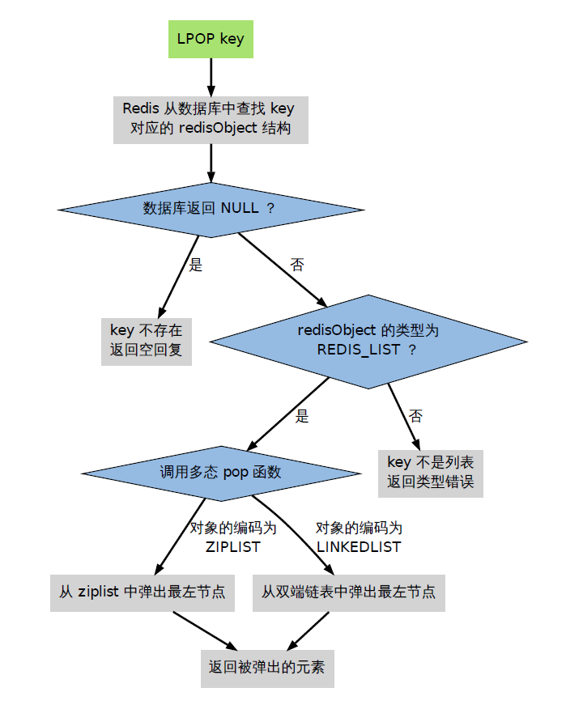

#### 对象共享（字符串）:boat:

Redis一般会把一些常见的值放到一个共享对象中，这样可使程序避免了重复分配的麻烦，也节约了一些CPU时间。

**Redis预分配的值对象如下**：

- 各种命令的返回值。
- 包括`0`在内，小于`REDIS_SHARED_INTEGERS`（默认值为10000）的所有整数。

著作权归https://pdai.tech所有。 链接：https://pdai.tech/md/db/nosql-redis/db-redis-x-redis-object.html

**为什么Redis不共享列表对象、哈希对象、集合对象、有序集合对象，只共享字符串对象**？

- 列表对象、哈希对象、集合对象、有序集合对象本身就包含字符串对象，复杂度较高。
- 如果共享对象保存字符串对象，那么验证操作的复杂度为O(1)；如果共享对象是保存字符串值的字符串对象，那么验证操作的复杂度为O(N)；如果共享对象是包含多个值的对象，其中值本身又是字符串对象，即其它对象中嵌套了字符串对象，比如列表对象、哈希对象，那么验证操作的复杂度将会是O(N方)。
- 如果对复杂度较高的对象创建共享对象，需要消耗很大的CPU，用这种消耗去换取内存空间，是不合适的

#### 引用计数及对象销毁:boat:

`redisObject`中有`refcount`属性，是对象的引用计数，如果计数为0那么就可以回收。

- 每个`redisObject`结构都带有一个`refcount`属性，指示这个对象被引用了多少次；
- 当新创建一个对象时，它的`refcount`属性被设置为1；当对一个对象进行共享时，Redis将这个对象的`refcount`加1；当使用完一个对象后，或者消除对一个对象的引用之后，程序将对象的`refcount`减1；
- 当对象的`refcount`降至0时，这个`redisObject`结构以及它引用的数据结构的内存都会被释放。

### 2.5 底层数据结构:airplane:

> 参考链接：[Java全栈知识体系](https://pdai.tech/md/db/nosql-redis/db-redis-x-redis-ds.html)

#### SDS—简单动态字符串

Redis是用C语言写的，但是Redis中的字符串却不是C语言中的字符串（即以空字符`'\0'`结尾的字符数组）。它是自己构建了一种名为**简单动态字符串（Simple Dynamic String, SDS**）的抽象类型，并将**SDS作为Redis的默认字符串表示**。

##### SDS定义

一种用于**存储二进制数据**的一种结构，具有动态扩容的特点，其实现位于**src/sds.h**与**src/sds.c**中。

SDS的总体概览如下图：


其中：

- `sdshdr`（SDS Header）：头部。
- `buf[]`：真实存储用户数据的字节数组。在`buf[]`中数据后总跟着一个'\0'，即图中`数据+'\0'`是所谓的`buf[]`。
- `len`：记录当前已使用的字节数（不包括'\0'）。
- `alloc`：记录当前字节数组总共分配的字节数量（不包括'\0'），分别以uint8（对应sdshdr8）、uint16、uint32、uint64表示。
- `flags`：始终为一字节，以低三位标识头部类型，高5位未使用。

`flags`值定义如下：

```c
// flags值定义
#define SDS_TYPE_5  0
#define SDS_TYPE_8  1
#define SDS_TYPE_16 2
#define SDS_TYPE_32 3
#define SDS_TYPE_64 4
```

下面是v6.0源码中SDS相关的结构定义：

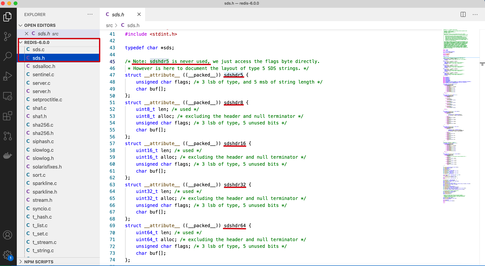

可以看到SDS有5种不同的头部，其中`sdshdr5`实际并未使用到，所以实际上有4种不同的头部，分别如下：


##### 为什么使用SDS

**为什么不使用C语言字符串实现，而是使用SDS**？这样实现有什么好处？

- 常数复杂度获取字符串长度

  由于`len`属性的存在，获取SDS字符串的长度只需要读取`len`属性，时间复杂度为O(1)。而对于C语言，获取字符串的长度通常是经过遍历计数来实现的，时间复杂度为O(n)。通过`strlen key`命令可以获取Key的字符串长度。

- 杜绝缓冲区溢出

  在C语言中使用`strcat` 函数进行两个字符串的拼接时，一旦没有分配足够长度的内存空间，就会造成缓冲区溢出。而对于SDS数据类型，在进行字符修改的时候，**会首先根据记录的len属性检查内存空间是否满足需求**，如果不满足，会进行相应的空间扩展，然后再进行修改操作，所以不会出现缓冲区溢出。

- 减少修改字符串的内存重新分配次数

  C语言由于不记录字符串的长度，所以如果要修改字符串，必须要重新分配内存（先释放再申请）。因为如果没有重新分配，字符串长度增大时会造成内存缓冲区溢出，字符串长度减小时会造成内存泄露。

  而对于SDS，由于`len`属性和`alloc`属性的存在，对于修改字符串SDS实现了**空间预分配**和**惰性空间释放**两种策略：

  1. 空间预分配：对字符串进行空间扩展的时候，扩展的内存比实际需要的多，这样可以减少连续执行字符串增长操作所需的内存重分配次数。
  2. 惰性空间释放：对字符串进行缩短操作时，程序不立即使用内存重新分配来回收缩短后多余的字节，而是使用`alloc`属性将这些字节的数量记录下来，等待后续使用。（当然SDS也提供了相应的API，当有需要时也可以手动释放这些未使用的空间。）

- 二进制安全

  因为C字符串以空字符作为字符串结束的标识，而对于一些二进制文件（如图片等），内容可能包括空字符串，因此C字符串无法正确存取；而所有SDS的API都是以处理二进制的方式来处理 `buf[]` 里面的元素，并且SDS不是以空字符串来判断是否结束，而是以`len`属性表示的长度来判断字符串是否结束。

- 兼容部分C字符串函数

  虽然SDS是二进制安全的，但是一样遵从每个字符串都是以空字符串结尾的惯例，这样可以重用C语言库`<string.h>` 中的一部分函数。

##### 空间预分配进一步理解

当执行追加操作时，比如给`key="Hello World"`的字符串后追加`"again!"`，则这时的`len`=18，free由0变成了18，此时的`buf='Hello World again!\0....................'`（.表示空格)，也就是`buf[]`的内存空间是18+18+1=37个字节，其中‘\0’占1个字节。Redis给字符串多分配了18个字节的预分配空间，所以下次还有append追加的时候，如果预分配空间足够，就无须再进行空间分配了。

在当前版本中，**当新字符串的长度小于1M时，Redis会分配所需大小一倍的空间，当大于1M的时候，就为他们额外多分配1M的空间**。

思考：**这种分配策略会浪费内存资源吗**？

答：执行过`APPEND`命令的字符串会带有额外的预分配空间，这些预分配空间不会被释放，除非该字符串所对应的键被删除，或者等到关闭Redis之后，再次启动时重新载入的字符串对象将不会有预分配空间。**因为执行`APPEND`命令的字符串键数量通常并不多，占用内存的体积通常也不大，所以这一般并不算什么问题**。另一方面，如果执行`APPEND`操作的键很多，而字符串的体积又很大的话，那可能就需要修改Redis服务器，让它定时释放一些字符串键的预分配空间，从而更有效地使用内存。

##### 小结

C字符串和SDS之间的区别：

|                  C字符串                   |                      SDS                       |
| :----------------------------------------: | :--------------------------------------------: |
|        获取字符串长度的复杂度为O(n)        |        获取字符串长度的复杂度为**O(1)**        |
|    API是不安全的，可能会造成缓冲区溢出     |      API是安全的，**不会造成缓冲区溢出**       |
| 修改字符串长度N次必然需要执行N次内存重分配 | 修改字符串长度N次**最多需要执行N次内存重分配** |
|              只能保存文本数据              |          可以保存**文本或二进制数据**          |
|      可以使用所有`<string.h>`库中函数      |       只可以使用部分`<string.h>`库中函数       |

一般来说，SDS除了保存数据库中的字符串值以外，还可以作为缓冲区（Buffer）：包括AOF模块中的AOF缓冲区以及客户端状态中的输入缓冲区。

#### ziplist 压缩列表

ziplist是为了提高存储效率而设计的一种特殊编码的**双向链表**。它可以存储字符串或者整数，**存储整数时是采用整数的二进制**而不是字符串形式存储。它能在O(1)的时间复杂度下完成list两端的`push`和`pop`操作。但是因为每次操作都需要重新分配ziplist的内存，所以实际复杂度和ziplist的内存使用量相关。

##### 结构

`v6.0`中对应的源码：


整个ziplist在内存中的存储格式如下：

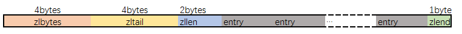

- `zlbytes`字段的类型是uint32_t，这个字段中存储的是整个ziplist所占用的内存的字节数。
- `zltail`字段的类型是uint32_t，它指的是ziplist中最后一个`entry`的偏移量，用于快速定位最后一个entry，以快速完成`pop`等操作。
- `zllen`字段的类型是uint16_t，它指的是整个ziplit中`entry`的数量。这个值只占2bytes（16位）：如果ziplist中`entry`的数目小于65535（2的16次方），那么该字段中存储的就是实际`entry`的值。若等于或超过65535，那么该字段的值固定为65535，但实际数量需要遍历所有`entry`才能得到。
- `zlend`是一个终止字节，其值为全F，即0xff。ziplist保证任何情况下，一个`entry`的首字节都不会是255。

##### Entry结构

> 参考链接：[Java全栈知识体系](https://pdai.tech/md/db/nosql-redis/db-redis-x-redis-ds.html#entry%E7%BB%93%E6%9E%84)
>

##### 为什么ziplist特别省内存？

- ziplist节省内存是相对于普通的list来说的。如果是普通的数组，那么它每个元素占用的内存是一样的且取决于最大的那个元素（很明显它是需要预留空间的）。
- 所以ziplist在设计时就很容易想到要尽量让每个元素按照实际的内容大小存储，**所以增加encoding字段**，针对不同的encoding来细化存储大小。
- 这时候还需要解决的一个问题是遍历元素时如何定位下一个元素呢？在普通数组中每个元素定长，所以不需要考虑这个问题；但是ziplist中每个data占据的内存不一样，所以为了解决遍历，需要增加记录上一个元素的length，**所以增加了prelen字段**。

##### ziplist的缺点

- ziplist也不预留内存空间，并且在移除结点后也是立即缩容，这代表每次写操作都会进行内存分配操作。
- 结点如果扩容导致结点占用的内存增长，并且超过254字节的话，可能会导致链式反应：其后一个结点的`entry.prevlen`需要从一字节扩容至五字节。**最坏情况下，第一个结点的扩容会导致整个ziplist表中的后续所有结点的`entry.prevlen`字段扩容**。虽然这个内存重分配的操作依然只会发生一次，但在代码中时间复杂度是O(N)级别，因为链式扩容只能一步一步的计算。但这种情况的概率十分的小。

#### quicklist 快表

quicklist这个结构是Redis在`v3.2`版本后新加的，之前的版本是list（即linkedlist），用于String数据类型中。

它是一种以**ziplist为结点的双端链表**结构。宏观上，quicklist是一个链表；微观上，链表中的每个结点都是一个ziplist。

##### 结构

`v6.0`源码：

```c
/* Node, quicklist, and Iterator are the only data structures used currently. */

/* quicklistNode is a 32 byte struct describing a ziplist for a quicklist.
 * We use bit fields keep the quicklistNode at 32 bytes.
 * count: 16 bits, max 65536 (max zl bytes is 65k, so max count actually < 32k).
 * encoding: 2 bits, RAW=1, LZF=2.
 * container: 2 bits, NONE=1, ZIPLIST=2.
 * recompress: 1 bit, bool, true if node is temporarry decompressed for usage.
 * attempted_compress: 1 bit, boolean, used for verifying during testing.
 * extra: 10 bits, free for future use; pads out the remainder of 32 bits */
typedef struct quicklistNode {
    struct quicklistNode *prev;
    struct quicklistNode *next;
    unsigned char *zl;
    unsigned int sz;             /* ziplist size in bytes */
    unsigned int count : 16;     /* count of items in ziplist */
    unsigned int encoding : 2;   /* RAW==1 or LZF==2 */
    unsigned int container : 2;  /* NONE==1 or ZIPLIST==2 */
    unsigned int recompress : 1; /* was this node previous compressed? */
    unsigned int attempted_compress : 1; /* node can't compress; too small */
    unsigned int extra : 10; /* more bits to steal for future usage */
} quicklistNode;

/* quicklistLZF is a 4+N byte struct holding 'sz' followed by 'compressed'.
 * 'sz' is byte length of 'compressed' field.
 * 'compressed' is LZF data with total (compressed) length 'sz'
 * NOTE: uncompressed length is stored in quicklistNode->sz.
 * When quicklistNode->zl is compressed, node->zl points to a quicklistLZF */
typedef struct quicklistLZF {
    unsigned int sz; /* LZF size in bytes*/
    char compressed[];
} quicklistLZF;

/* Bookmarks are padded with realloc at the end of of the quicklist struct.
 * They should only be used for very big lists if thousands of nodes were the
 * excess memory usage is negligible, and there's a real need to iterate on them
 * in portions.
 * When not used, they don't add any memory overhead, but when used and then
 * deleted, some overhead remains (to avoid resonance).
 * The number of bookmarks used should be kept to minimum since it also adds
 * overhead on node deletion (searching for a bookmark to update). */
typedef struct quicklistBookmark {
    quicklistNode *node;
    char *name;
} quicklistBookmark;


/* quicklist is a 40 byte struct (on 64-bit systems) describing a quicklist.
 * 'count' is the number of total entries.
 * 'len' is the number of quicklist nodes.
 * 'compress' is: -1 if compression disabled, otherwise it's the number
 *                of quicklistNodes to leave uncompressed at ends of quicklist.
 * 'fill' is the user-requested (or default) fill factor.
 * 'bookmakrs are an optional feature that is used by realloc this struct,
 *      so that they don't consume memory when not used. */
typedef struct quicklist {
    quicklistNode *head;
    quicklistNode *tail;
    unsigned long count;        /* total count of all entries in all ziplists */
    unsigned long len;          /* number of quicklistNodes */
    int fill : QL_FILL_BITS;              /* fill factor for individual nodes */
    unsigned int compress : QL_COMP_BITS; /* depth of end nodes not to compress;0=off */
    unsigned int bookmark_count: QL_BM_BITS;
    quicklistBookmark bookmarks[];
} quicklist;

typedef struct quicklistIter {
    const quicklist *quicklist;
    quicklistNode *current;
    unsigned char *zi;
    long offset; /* offset in current ziplist */
    int direction;
} quicklistIter;

typedef struct quicklistEntry {
    const quicklist *quicklist;
    quicklistNode *node;
    unsigned char *zi;
    unsigned char *value;
    long long longval;
    unsigned int sz;
    int offset;
} quicklistEntry;
```

这里定义了6个结构体：

- `quicklistNode`：宏观上，quicklist是一个链表。这个结构描述的就是链表中的结点。它通过`zl`字段持有底层的ziplist。简单来讲，它描述了一个ziplist实例。
- `quicklistLZF`：ziplist是一段连续的内存，用LZ4算法压缩后就可以包装成一个`quicklistLZF`结构。是否压缩quicklist中的每个ziplist实例是一个可配置项。若这个配置项是开启的，那么`quicklistNode.zl`字段指向的就不是一个ziplist实例，而是一个压缩后的quicklistLZF实例。
- `quicklistBookmark`：在quicklist尾部增加的一个书签，只有在大量结点的多余内存使用量可以忽略不计且确实需要分批迭代它们的情况下，它才会被使用。当不使用它们时，它们不会增加任何内存开销。
- `quicklist`：这就是一个双链表的定义。`head`和`tail`分别指向头、尾指针，`len`代表链表中的结点，`count`指的是整个quicklist中的所有ziplist中的`entry`的数目，`fill`字段影响着每个链表结点中ziplist的最大占用空间，`compress`影响着是否要对每个ziplist以LZ4算法进行进一步压缩以更节省内存空间。
- `quicklistIter`是一个迭代器。
- `quicklistEntry`是对ziplist中的`entry`概念的封装。quicklist作为一个封装良好的数据结构，不希望使用者感知到其内部的实现，所以需要把`ziplist.entry`的概念重新包装一下。

##### 内存布局图


##### 更多额外信息

> 参考链接：[Java全栈知识体系](https://pdai.tech/md/db/nosql-redis/db-redis-x-redis-ds.html#quicklist%E6%9B%B4%E5%A4%9A%E9%A2%9D%E5%A4%96%E4%BF%A1%E6%81%AF)
>

#### dict 字典/哈希表

本质上就是哈希表，这个在很多语言中都有，对于开发人员人员来说比较熟悉，这里就简单介绍下。

##### 结构

哈希表结构定义：

```c
著作权归https://pdai.tech所有。
链接：https://pdai.tech/md/db/nosql-redis/db-redis-x-redis-ds.html

typedef struct dictht{
    //哈希表数组
    dictEntry **table;
    //哈希表大小
    unsigned long size;
    //哈希表大小掩码，用于计算索引值
    //总是等于 size-1
    unsigned long sizemask;
    //该哈希表已有节点的数量
    unsigned long used;
 
}dictht
```

哈希表是由数组table组成，table中每个元素都是指向`dict.h/dictEntry`结构，`dictEntry`结构定义如下：

```c
typedef struct dictEntry{
     //键
     void *key;
     //值
     union{
          void *val;
          uint64_tu64;
          int64_ts64;
     }v;
     //指向下一个哈希表节点，形成链表
     struct dictEntry *next;
}dictEntry
```

**key用来保存键，val属性用来保存值**，值可以是一个指针，也可以是uint64_t整数，也可以是int64_t整数。

注意这里还有一个**指向下一个哈希表节点的指针**。哈希表最大的问题是存在**哈希冲突**，如何解决哈希冲突，有**开放地址法和链地址法**。这里采用的便是链地址法，通过`next`这个指针可以将多个哈希值相同的键值对连接在一起，用来**解决哈希冲突**。

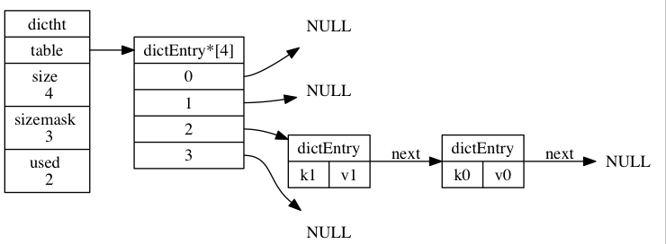

##### 一些要点

> 参考链接：[Java全栈知识体系](https://pdai.tech/md/db/nosql-redis/db-redis-x-redis-ds.html#%E4%B8%80%E4%BA%9B%E8%A6%81%E7%82%B9)
>

#### intset 整数集

intset是集合类型的底层实现之一，**当一个集合只包含整数值元素，并且这个集合的元素数量不多时，Redis就会使用整数集合作为集合键的底层实现**。

##### 结构

源码结构：

```c
typedef struct intset {
    uint32_t encoding;
    uint32_t length;
    int8_t contents[];
} intset;
```

- `encoding`表示编码方式，取值有三个：`INTSET_ENC_INT16`、`INTSET_ENC_INT32`、 `INTSET_ENC_INT64`。
- `length`代表其中存储的整数的个数。
- `contents`指向实际存储数值的连续内存区域，就是一个数组；整数集合的每个元素都是`contents`数组的一个数组项（item），各个项在数组中按值的大小**从小到大有序排序**，且数组中不包含任何重复项。（虽然intset结构将`contents`属性声明为int8_t类型的数组，但实际上`contents`数组并不保存任何int8_t类型的值，contents数组的真正类型取决于`encoding`属性的值）

##### 内存布局图


`content`数组里面每个元素的数据类型是由`encoding`来决定的，那么如果原来的数据类型是int16, 当再插入一个int32类型的数据时怎么办呢？这就是下面要说的intset的升级。

##### inset升级

当在一个int16类型的整数集合中插入一个int32类型的值时，整个集合的所有元素都会转换成int32类型。 整个过程有三步：

1. 根据新元素的类型（比如int32），扩展整数集合底层数组的空间大小，并为新元素分配空间。
2. 将底层数组现有的所有元素都转换成与新元素相同的类型，并将类型转换后的元素放置到正确的位上，而且在放置元素的过程中，需要继续维持底层数组的有序性质不变。
3. 最后改变`encoding`的值，`length`+1。

**那如果删除掉刚加入的int32类型时，会不会做一个降级操作呢**？不会。主要还是减少开销的权衡。

#### (z)skiplist 跳表

对于一个单链表来讲，即便链表中存储的数据是有序的，如果要想在其中查找某个数据，也只能从头到尾遍历链表。这样查找效率就会很低，时间复杂度是O(n)。比如查找12需要7次查找：

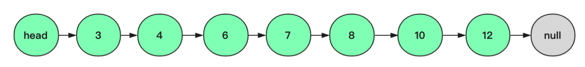

如果增加如下两级索引，那么它搜索次数就变成了3次：

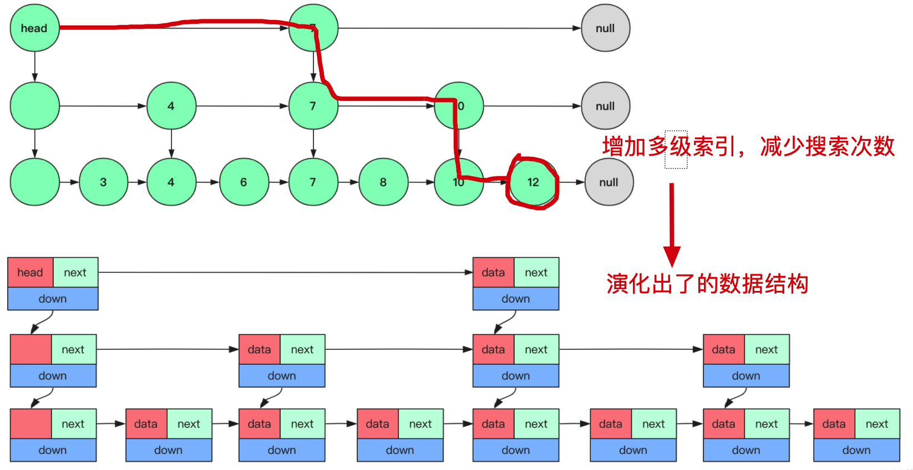

##### 设计

跳跃表并没有在单独的类中定义，而是其定义在`server.h`中，如下：

```c
/* ZSETs use a specialized version of Skiplists */
typedef struct zskiplistNode {
    sds ele;
    double score;
    struct zskiplistNode *backward;
    struct zskiplistLevel {
        struct zskiplistNode *forward;
        unsigned int span;
    } level[];
} zskiplistNode;

typedef struct zskiplist {
    struct zskiplistNode *header, *tail;
    unsigned long length;
    int level;
} zskiplist;
```

其内存布局如下：

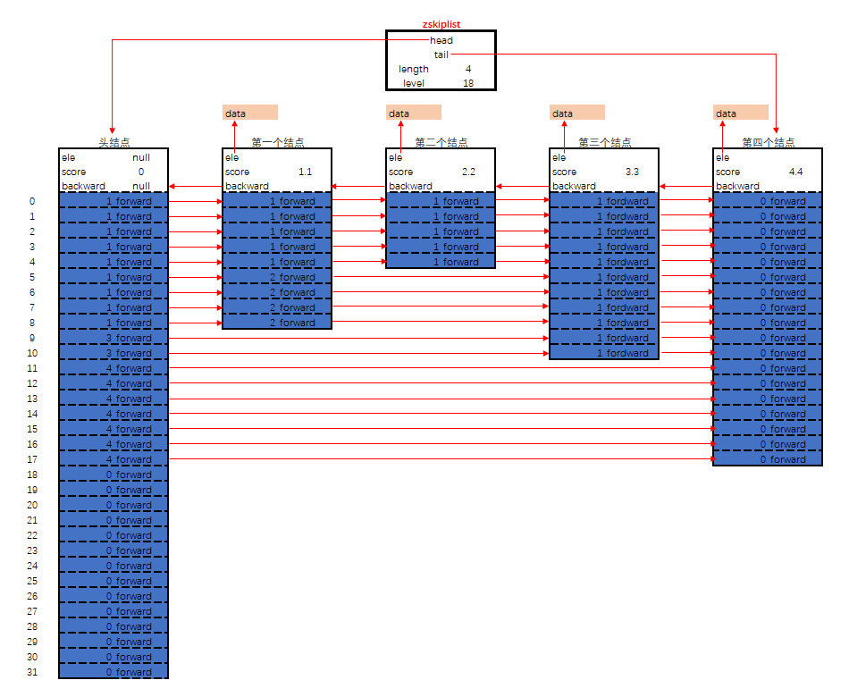

**skiplist的核心设计要点**：

- **头结点**不持有任何数据，且其`level[]`的长度为32。
- 每个结点：
  - `ele`字段，持有数据，是SDS类型。
  - `score`字段，标示着结点的得分，结点之间凭借得分来判断先后顺序，跳跃表中的结点按结点的得分**升序排列**。
  - `backward`指针，这是原版跳跃表中所没有的。该指针指向结点的前一个紧邻结点
  - `level`字段，用以记录所有结点（除头节点外）；每个结点中最多持有32个zskiplistLevel结构。实际数量在结点创建时，按幂次定律随机生成（不超过32）。每个zskiplistLevel中有两个字段：
    - `forward`字段指向比自己得分高的某个结点（不一定是紧邻的），并且若当前zskiplistLevel实例在`level[]`中的索引为X，则其`forward`字段指向的结点其`level[]`字段的容量至少是X+1。这也是上图中，为什么`forward`指针总是画得水平的原因。
    - `span`字段代表`forward`字段指向的结点距离当前结点的距离。紧邻的两个结点之间的距离定义为1。

##### 为什么不用平衡树或者哈希表？

> 参考链接：[Java全栈知识体系](https://pdai.tech/md/db/nosql-redis/db-redis-x-redis-ds.html#%E4%B8%BA%E4%BB%80%E4%B9%88%E4%B8%8D%E7%94%A8%E5%B9%B3%E8%A1%A1%E6%A0%91%E6%88%96%E8%80%85%E5%93%88%E5%B8%8C%E8%A1%A8)
>

### 2.6 Redis对象与编码（底层结构）对应关系:airplane:


#### 字符串对象

字符串是Redis最基本的数据类型，不仅所有Key都是字符串类型，其它几种数据类型构成的元素也是字符串。注意字符串的长度不能超过**512M**。

##### 编码

字符串对象的编码可以是以下三种：

- `int 编码`：保存的是可以用long类型表示的整数值。
- `embstr 编码`：保存长度小于44字节的字符串（Redis `v3.2`版本之前是39字节，之后是44字节）。
- `raw 编码`：保存长度大于44字节的字符串（Redis `v3.2`版本之前是39字节，之后是44字节）。

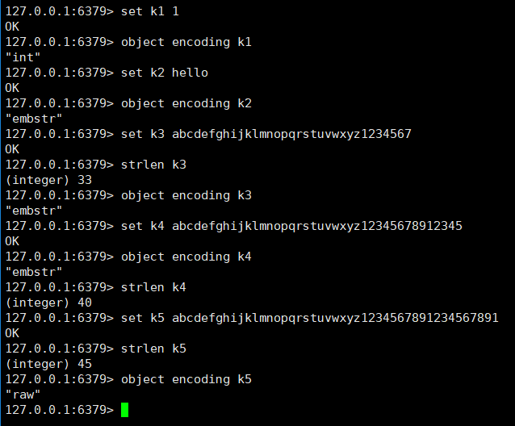

##### 内存布局

三种编码方式对应的内存布局分别如下：


`raw`和`embstr`的区别：

`embstr`与`raw`都使用redisObject和sds保存数据，区别在于：`embstr`的使用只分配一次内存空间（redisObject和sds是连续的），而`raw`需要分配两次内存空间（分别为redisObject和sds分配空间）。因此与`raw`相比，`embstr`的好处在于创建时少分配一次空间，删除时少释放一次空间，以及对象的所有数据连在一起，寻找方便。而`embstr`的坏处也很明显，如果字符串的长度增加需要重新分配内存时，整个redisObject和sds都需要重新分配空间，因此Redis中的`embstr`实现为**只读**。

##### 编码转换

> 参考链接：[知乎](https://zhuanlan.zhihu.com/p/340939326)

|       编码方式        |                          说明                          |
| :-------------------: | :----------------------------------------------------: |
|  `OBJ_ENCODING_RAW`   |         长度超过44个字节的字符串以这种方式编码         |
|  `OBJ_ENCODING_INT`   |    可以被转化为`long`类型整数的字符串以这种方式编码    |
| `OBJ_ENCODING_EMBSTR` | 不能被转化为`long`类型整数且长度不超过44个字节的字符串 |

对于`int`编码，对其使用`append`命令会使其编码方式变为`raw`。

对于`embstr`编码，由于Redis没有对其编写任何的修改程序（`embstr`是**只读**的），在对`embstr`进行修改时，都会先转化为`raw`再进行修改，因此只要是修改`embstr`对象，修改后的对象一定是`raw`的，无论是否达到了44个字节。

#### 列表对象

List列表是简单的字符串列表，按照插入顺序排序，可以添加一个元素到列表的头部（左边）或者尾部（右边），它的底层实际上是个链表结构。

##### 编码

列表对象的编码是`quicklist`（之前版本中有`linkedlist`和`ziplist`这两种编码。进一步地，目前Redis定义的10个对象编码方式宏名中有两个被完全闲置了：`OBJ_ENCODING_ZIPMAP`与`OBJ_ENCODING_LINKEDLIST`。 从Redis的演进历史上来看，前者是后续可能会得到支持的编码值（代码还在）, 后者则应该是被彻底淘汰了)

##### 内存布局

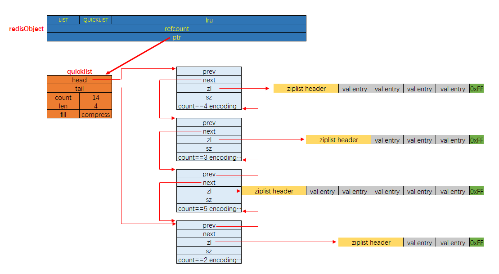

#### 哈希对象

哈希对象的键是一个字符串类型，值是一个键值对集合。

##### 编码

哈希对象的编码可以是**ziplist**或者**hashtable**，对应的底层实现有两种：一种是ziplist，一种是dict。两种编码**内存布局**分别如下：

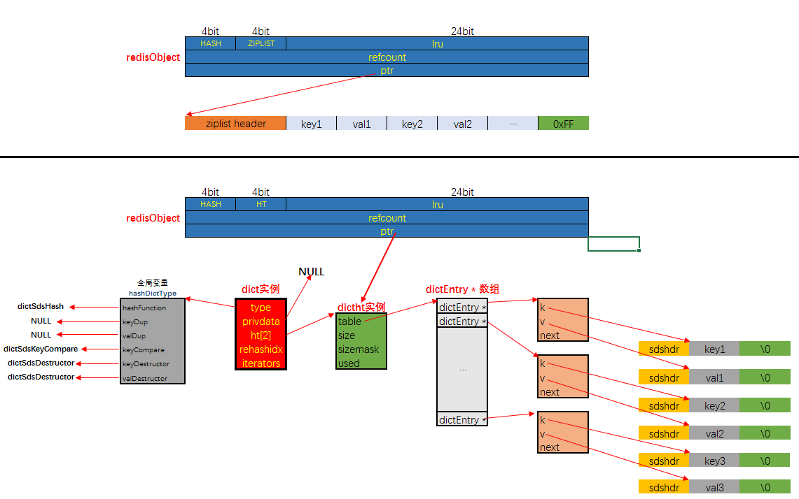

##### 举例说明

当使用ziplist，也就是压缩列表作为底层实现时，新增的键值对是保存到压缩列表的表尾。比如执行以下命令：

```sh
hset profile name "Tom"
hset profile age 25
hset profile career "Programmer"
```

如果使用ziplist，profile存储如下：


如果使用hashtable，存储如下：


**hashtable编码的哈希表对象底层使用字典数据结构**，哈希对象中的每个键值对都使用一个字典键值对。

##### 编码转换

和上面列表对象使用ziplist编码一样，当**同时满足下面两个条件时，使用ziplist（压缩列表）编码**：

1. 列表保存元素个数小于512个；
2. 每个元素长度小于64字节。

不能满足这两个条件的时候使用hashtable编码。以上两个条件也可以通过Redis配置文件`zset-max-ziplist-entries` 选项和 `zset-max-ziplist-value` 进行修改。

#### 集合对象

集合对象Set是String类型（整数也会转换成String类型进行存储）的无序集合。注意集合和列表的区别：**集合中的元素是无序的，因此不能通过索引来操作元素；集合中的元素不能有重复。**

##### 编码

集合对象的编码可以是**intset**或者**hashtable**；底层实现有两种，分别是**intset**和**dict**。显然当使用intset作为底层实现的数据结构时，集合中存储的只能是数值数据且必须是整数；而当使用dict作为集合对象的底层实现时，是将数据全部存储于dict的键中，值字段闲置不用。

集合对象的内存布局如下：

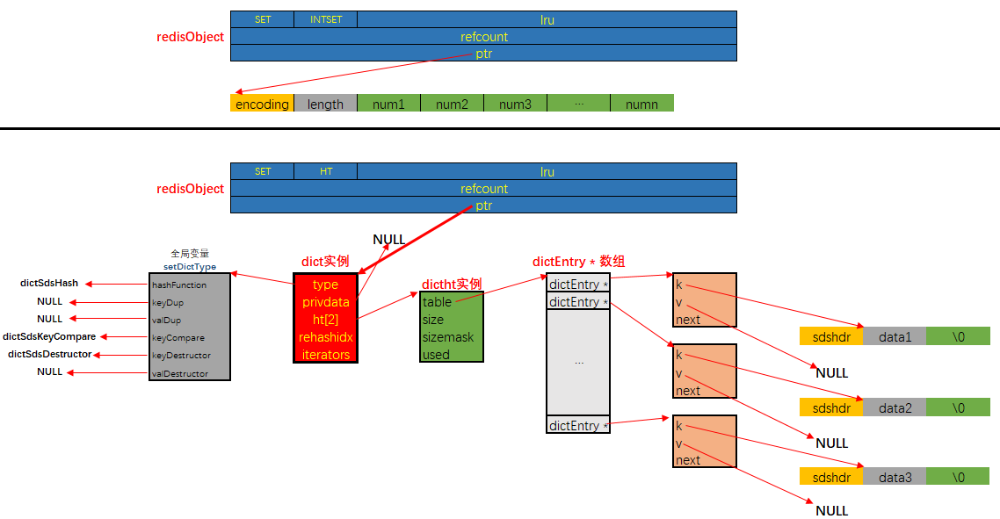

##### 举例说明

```sh
SADD numbers 1 3 5
```


```sh
SADD Dfruits "apple" "banana" "cherry"
```


##### 编码转换

当集合**同时满足以下两个条件时使用intset编码**：

1. 集合对象中所有元素都是整数；
2. 集合对象所有元素数量不超过512。

不能满足这两个条件的就使用hashtable编码。第二个条件可以通过配置文件的 `set-max-intset-entries` 进行配置。

#### 有序集合对象

和上面的集合对象相比，有序集合对象是**有序**的。与列表使用索引下标作为排序依据不同，有序集合为每个元素设置一个分数（score）作为排序依据。

##### 编码

有序集合的底层实现依然有两种，一种是使用**ziplist**作为底层实现，另外一种比较特殊，底层使用了两种数据结构：**dict与skiplist**。前者对应的编码值宏为ZIPLIST，后者对应的编码值宏为SKIPLIST。

**使用ziplist来实现在序集合很容易理解**，只需要在ziplist这个数据结构的基础上做好排序与去重就可以了。**使用zskiplist来实现有序集合也很容易理解**，Redis中实现的这个跳跃表似乎天然就是为了实现有序集合对象而实现的，那么为什么还要辅助一个dict实例呢? 先看来有序集合对象在这两种编码方式下的内存布局，然后再做解释。

首先是编码为ZIPLIST时，有序集合的内存布局如下：

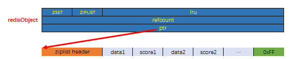

然后是编码为SKIPLIST时，有序集合的内存布局如下：

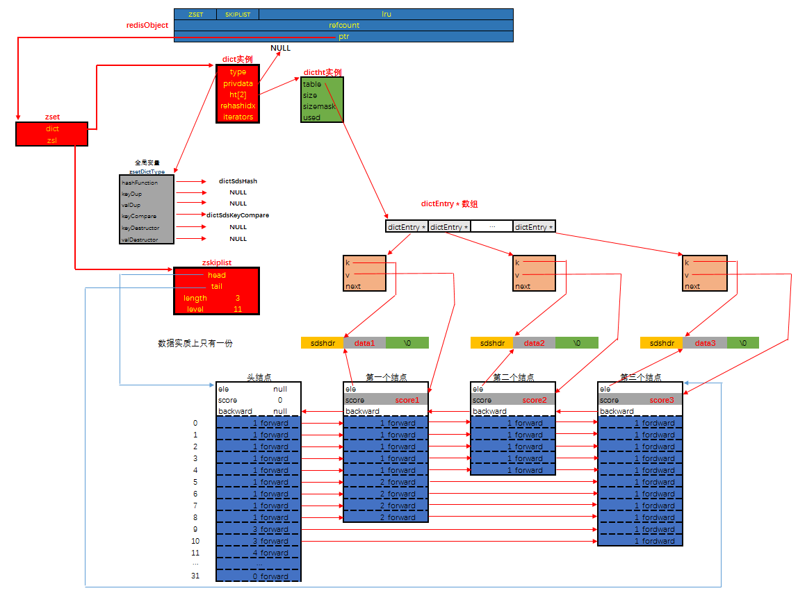

说明：其实有序集合单独使用字典或跳跃表其中一种数据结构都可以实现，但是这里使用两种数据结构组合起来，**原因是假如单独使用字典，虽然能以O(1)的时间复杂度查找成员的分值，但是因为字典是以无序的方式来保存集合元素，所以每次进行范围操作的时候都要进行排序；假如单独使用跳跃表来实现，虽然能执行范围操作，但是查找操作由O(1)的复杂度变为了O(logN)**。因此Redis使用了两种数据结构来共同实现有序集合。

##### 举例说明

```sh
ZADD price 8.5 apple 5.0 banana 6.0 cherry
```

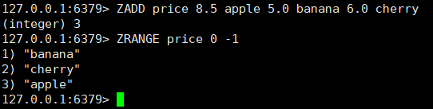


##### 编码转换

当有序集合对象**同时满足以下两个条件时，对象使用ziplist编码**：

1. 保存的元素数量小于128；
2. 保存的所有元素长度都小于64字节。

不能满足上面两个条件的使用skiplist编码。以上两个条件也可以通过Redis配置文件`zset-max-ziplist-entries` 选项和 `zset-max-ziplist-value` 进行修改。

#### 总结（自己）:rocket:


## 六、Redis事务:boat:

> 参考链接：[Java全栈知识体系](https://pdai.tech/md/db/nosql-redis/db-redis-x-trans.html)

### 6.1 什么是Redis事务？

Redis事务的**本质是一组命令的集合**。事务支持一次执行多个命令，一个事务中所有命令都会被序列化。在事务执行过程，会按照顺序串行化执行队列中的命令，其他客户端提交的命令请求不会插入到事务执行命令序列中。

总结说：Redis事务就是**一次性、顺序性、排他性**地执行**一个队列中的一系列命令**。

### 6.2 Redis事务相关命令和使用

`MULTI`、`EXEC`、`DISCARD`和`WATCH`是Redis事务相关的命令。

- `MULTI`：**开启事务**，Redis会将后续的命令逐个放入队列中，然后使用`EXEC`命令来**原子化**执行这个命令序列。
- `EXEC`：**执行**事务中的所有操作命令。
- `DISCARD`：**取消**事务，放弃执行事务块中的所有命令。
- `WATCH`：监视一个或多个key，如果在执行事务前，这个key（或多个key）被其他命令修改，则**事务被中断，不会执行事务中的任何命令**。
- `UNWATCH`：取消对所有key的监视。

#### 标准的事务执行

给k1、k2分别赋值，在事务中修改k1、k2，执行事务后，查看k1、k2值，发现都被修改：

```bash
127.0.0.1:6379> set k1 v1
OK
127.0.0.1:6379> set k2 v2
OK
127.0.0.1:6379> MULTI
OK
127.0.0.1:6379> set k1 11
QUEUED
127.0.0.1:6379> set k2 22
QUEUED
127.0.0.1:6379> EXEC
1) OK
2) OK
127.0.0.1:6379> get k1
"11"
127.0.0.1:6379> get k2
"22"
```

#### 事务取消

```bash
127.0.0.1:6379> MULTI
OK
127.0.0.1:6379> set k1 33
QUEUED
127.0.0.1:6379> set k2 34
QUEUED
127.0.0.1:6379> DISCARD
OK
```

#### 事务出现错误的处理

##### 语法错误（编译器错误）

在开启事务后，修改k1值为11，k2值为22，但k2语法错误，最终导致事务提交失败，k1、k2保留原值：

```bash
127.0.0.1:6379> set k1 v1
OK
127.0.0.1:6379> set k2 v2
OK
127.0.0.1:6379> MULTI
OK
127.0.0.1:6379> set k1 11
QUEUED
127.0.0.1:6379> sets k2 22
(error) ERR unknown command `sets`, with args beginning with: `k2`, `22`, 
127.0.0.1:6379> exec
(error) EXECABORT Transaction discarded because of previous errors.
127.0.0.1:6379> get k1
"v1"
127.0.0.1:6379> get k2
"v2"
```

##### Redis类型错误（运行错误）

在开启事务后，修改k1值为11，k2值为22，但将k2的类型作为List，在运行时检测类型错误，最终导致事务提交失败，此时事务并没有回滚，而是跳过错误命令继续执行， 结果**k1值改变、k2保留原值**：

```bash
127.0.0.1:6379> set k1 v1
OK
127.0.0.1:6379> set k1 v2
OK
127.0.0.1:6379> MULTI
OK
127.0.0.1:6379> set k1 11
QUEUED
127.0.0.1:6379> lpush k2 22
QUEUED
127.0.0.1:6379> EXEC
1) OK
2) (error) WRONGTYPE Operation against a key holding the wrong kind of value
127.0.0.1:6379> get k1
"11"
127.0.0.1:6379> get k2
"v2"
```

##### CAS操作实现乐观锁

`WATCH`命令可以为Redis事务提供Check-and-Set（CAS）行为。

###### 什么是乐观锁？

被`WATCH`的键会被监视，并会发觉这些键是否被改动过了。 如果有**至少一个被监视的键在`EXEC`执行之前被修改了，那么整个事务都会被取消**，`EXEC`返回`nil-reply`来表示事务已经失败。举个例子，假设需要原子性地为某个值进行增1操作（不使用`INCR`操作），首先可能会这样做：

```sh
val = GET mykey
val = val + 1
SET mykey $val
```

上面的做法在只有一个客户端的时候可以执行得很好。但是，当多个客户端同时对同一个键进行这样的操作时就会产生竞争条件。举个例子，如果客户端A和B都读取了键原来的值，比如10，那么两个客户端都会将键的值设为11，但本应该正确的结果是12才对。

有了`WATCH`就可以轻松地解决这类问题了：

```sh
WATCH mykey
val = GET mykey
val = val + 1
MULTI
SET mykey $val
EXEC
```

使用上面的代码，如果在`WATCH`执行之后，`EXEC`执行之前，有其他客户端修改了mykey的值，那么当前客户端的事务就会失败。程序需要做的就是：不断重试这个操作，直到没有发生碰撞为止。

这种形式的锁被称作**乐观锁**，它是一种非常强大的锁机制。并且因为大多数情况下，不同的客户端会访问不同的键，碰撞的情况一般都很少，所以通常并不需要进行重试。

**`watch`是如何实现监视的呢**？

Redis使用`WATCH`命令来决定事务是否继续执行时，那就需要在`MULTI`之前使用`WATCH`来监控某些键值对，然后使用`MULTI`命令来开启事务，执行对数据结构操作的各种命令，此时这些命令入队列。

当使用`EXEC`执行事务时，首先会比对`WATCH`监控的键值对，如果没发生改变，它会执行事务队列中的命令，提交事务；如果发生变化，将不会执行事务中的任何命令。当然无论是否回滚（事务回滚），Redis都会取消执行事务前的`WATCH`命令。

**`WATCH`命令实现监视**

在事务开始前用`WATCH`监控k1，之后修改k1为11，说明事务开始前k1值被改变，`MULTI`开始事务，修改k1值为12，k2为22，执行`EXEC`，发回`nil`，说明事务回滚；查看下k1、k2的值都没有被事务中的命令所改变。

```bash
127.0.0.1:6379> set k1 v1
OK
127.0.0.1:6379> set k2 v2
OK
127.0.0.1:6379> WATCH k1
OK
127.0.0.1:6379> set k1 11
OK
127.0.0.1:6379> MULTI
OK
127.0.0.1:6379> set k1 12
QUEUED
127.0.0.1:6379> set k2 22
QUEUED
127.0.0.1:6379> EXEC
(nil)
127.0.0.1:6379> get k1
"11"
127.0.0.1:6379> get k2
"v2"
```

**`UNWATCH`取消监视**

```bash
127.0.0.1:6379> set k1 v1
OK
127.0.0.1:6379> set k2 v2
OK
127.0.0.1:6379> WATCH k1
OK
127.0.0.1:6379> set k1 11
OK
127.0.0.1:6379> UNWATCH
OK
127.0.0.1:6379> MULTI
OK
127.0.0.1:6379> set k1 12
QUEUED
127.0.0.1:6379> set k2 22
QUEUED
127.0.0.1:6379> exec
1) OK
2) OK
127.0.0.1:6379> get k1
"12"
127.0.0.1:6379> get k2
"22"
```

### 6.3 Redis事务执行步骤

很显然Redis事务执行是三个阶段：

1. **开启**：以`MULTI`开始一个事务；
2. **入队**：将多个命令入队到事务中，接到这些命令并不会立即执行，而是放到等待执行的事务队列里面；
3. **执行**：由`EXEC`命令触发事务。

当一个客户端切换到事务状态之后， 服务器会根据这个客户端发来的不同命令执行不同的操作：如果客户端发送的命令为`EXEC`、`DISCARD`、`WATCH`、`MULTI`四个命令的其中一个， 那么服务器立即执行这个命令；与此相反，如果客户端发送的命令是`EXEC`、`DISCARD`、`WATCH`、`MULTI`四个命令以外的其他命令， 那么服务器并不立即执行这个命令， 而是将这个命令放入一个事务队列里面， 然后向客户端返回`QUEUED`回复。

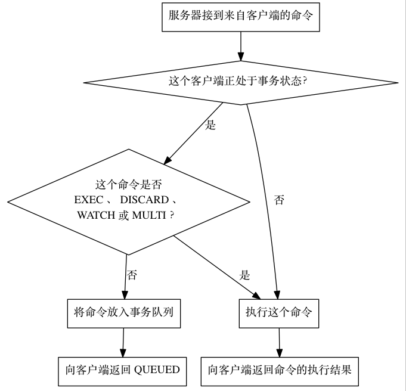

### 6.4 更深入的理解:boat:

#### 为什么Redis不支持回滚

以下是这种做法的优点：

- Redis命令只会因为错误的语法而失败（并且这些问题不能在入队时发现），或是命令用在了错误类型的键上面：这也就是说，从实用性的角度来说，失败的命令是由编程错误造成的，而这些错误应该在开发的过程中被发现，而不应该出现在生产环境中。

- 因为不需要对回滚进行支持，所以Redis的内部可以保持简单且快速。

有种观点认为Redis处理事务的做法会产生bug，然而需要注意的是：在通常情况下，**回滚并不能解决编程错误带来的问题**。 举个例子，如果本来想通过`INCR`命令将键的值加上1，却不小心加上了2，又或者对错误类型的键执行了`INCR`， 回滚是没有办法处理这些情况的。

#### 如何理解Redis与事务的ACID

- **原子性Atomicity**

运行期的错误是不会回滚的，很多文章由此说Redis事务违背原子性的；而官方文档认为是遵从原子性的。

Redis官方文档给的理解是：**Redis的事务是原子性的：所有的命令，要么全部执行，要么全部不执行**。

- **一致性Consistency**

Redis事务可以保证命令失败的情况下得以回滚，数据能恢复到没有执行之前的样子，是保证一致性的，除非Redis进程意外终结。

- **隔离性Isolation**

Redis事务是严格遵守隔离性的，原因是Redis是**单进程单线程模式**（`v6.0`之前），可以保证命令执行过程中不会被其他客户端命令打断。但是Redis不像其它结构化数据库有隔离级别这种设计。

- **持久性Durability**

**Redis事务是不保证持久性的**，这是因为Redis持久化策略中不管是RDB还是AOF都是异步执行的，不保证持久性是出于对性能的考虑。

#### Redis事务其他实现

- 基于`Lua`脚本：Redis可以保证脚本内的命令**一次性、按顺序**地执行，其同时也不提供事务运行错误的回滚，执行过程中如果部分命令运行错误，剩下的命令还是会继续运行完。
- 基于中间标记变量：通过另外的标记变量来标识事务是否执行完成，读取数据时先读取该标记变量判断是否事务执行完成。但这样会需要额外写代码实现，比较繁琐。

## 七、Redis主从复制:airplane:

> 参考链接：[Java全栈知识体系](https://pdai.tech/md/db/nosql-redis/db-redis-x-copy.html)

要避免单点故障，即保证**高可用**，便**需要冗余（副本）方式提供集群服务**。Redis提供了**主从库模式**以保证数据副本的一致，主从库之间采用的是**读写分离**的方式。

### 7.1 主从复制概述

主从复制：指**将一台Redis服务器的数据，复制到其他的Redis服务器**。前者称为主节点（Master），后者称为从节点（Slave）；数据的复制是**单向**的，只能由**主节点到从节点**。

**主从复制的作用**主要包括：

- **数据冗余**：主从复制实现了数据的热备份，是**持久化之外的一种数据冗余方式**。

- **故障恢复**：当主节点出现问题时，可以由从节点提供服务，实现快速的故障恢复；实际上是一种**服务的冗余**。
- **负载均衡**：在主从复制的基础上，配合读写分离，可以由**主节点提供写服务，由从节点提供读服务**（即写Redis数据时应用连接主节点，读Redis数据时应用连接从节点），分担服务器负载；尤其是在**写少读多**的场景下，通过多个从节点分担读负载，可以大大提高Redis服务器的并发量。
- **高可用基石**：除了上述作用以外，主从复制还是**哨兵和集群能够实施的基础**，因此说**主从复制是Redis高可用的基础**。

主从库之间采用的是**读写分离**的方式：

- 读操作：主库、从库都可以接收；

- 写操作：首先到主库执行，然后，主库将写操作同步给从库。

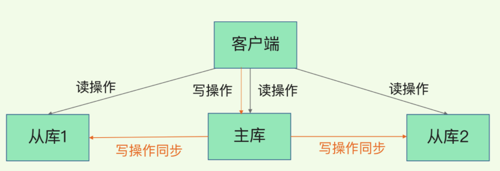

### 7.2 主从复制原理

在`v2.8`版本之前只有全量复制，而`v2.8`版本后有全量和增量复制：

- 全量（同步）复制：比如第一次同步时。
- 增量（同步）复制：只会把**主从库网络断连期间主库收到的命令，同步给从库**。

#### 全量复制

当启动多个Redis实例的时候，它们相互之间就可以通过`replicaof`（Redis `v5.0`之前使用`slaveof`）命令形成主库和从库的关系，之后会按照三个阶段完成数据的第一次同步。

##### 确立主从关系

现在有实例1（ip：172.16.19.3）和实例2（ip：172.16.19.5），在实例2上执行以下命令后，实例2就变成了实例1的从库，并从实例1上复制数据：

```sh
replicaof 172.16.19.3 6379
```

##### 全量复制的三个阶段


1. **第一阶段是主从库间建立连接、协商同步的过程**，主要是为全量复制做准备。在这一步，从库和主库建立起连接，并告诉主库即将进行同步，主库确认回复后，主从库间就可以开始同步了。

   具体来说，从库给主库发送`psync`命令，表示要进行数据同步，主库根据这个命令的参数来启动复制。`psync`命令包含了主库的`runID`和复制进度`offset`两个参数。`runID`是每个Redis实例启动时都会自动生成的一个随机ID，用来唯一标记这个实例。当从库和主库第一次复制时，因为不知道主库的`runID`，所以将`runID`设为“？”。`offset`此时设为-1，表示第一次复制。主库收到`psync`命令后，会用`FULLRESYNC`响应命令带上两个参数：主库`runID`和主库目前的复制进度`offset`，返回给从库。从库收到响应后，会记录这两个参数。这里有个地方需要注意，`FULLRESYNC`响应表示**第一次复制采用的全量复制，也就是说，主库会把当前所有的数据都复制给从库**。

2. **第二阶段，主库将所有数据同步给从库**。从库收到数据后，在本地完成数据加载。这个过程依赖于内存快照生成的RDB文件。

   具体来说，主库执行`bgsave`命令，生成`.rdb`文件，接着将文件发给从库。从库接收到`.rdb`文件后，会先清空当前数据库，然后加载`.rdb`文件。这是因为从库在通过`replicaof`命令开始和主库同步前，可能保存了其他数据。为了避免之前数据的影响，从库需要先把当前数据库清空。**在主库将数据同步给从库的过程中，主库不会被阻塞，仍然可以正常接收请求**。否则，Redis 的服务就被中断了。**但是这些请求中的写操作并没有记录到刚刚生成的`.rdb`文件中**。为了保证主从库的数据一致性，**主库会在内存中用专门的`replication buffer`记录`.rdb`文件生成后收到的所有写操作**。

3. **第三个阶段，主库会把第二阶段执行过程中新收到的写命令，再发送给从库**。具体的操作是，当主库完成`.rdb`文件发送后，就会把此时`replication buffer`中的修改操作发给从库，从库再重新执行这些操作。这样一来，主从库就实现同步了。

#### 增量复制

##### 为什么会设计增量复制？

如果主从库在命令传播时出现了网络闪断，那么，从库就会和主库重新进行一次全量复制，开销非常大。从Redis `v2.8`开始，网络断了之后，主从库会采用**增量复制**的方式继续同步。

##### 增量复制的流程


先看两个概念：`replication buffer`和`repl_backlog_buffer`：

`repl_backlog_buffer`：它是为了**从库断开之后如何找到主从差异数据**而设计的**环形缓冲区**，从而避免全量复制带来的性能开销。如果从库断开时间太久，`repl_backlog_buffer`环形缓冲区被主库的写命令覆盖了，那么从库连上主库后只能乖乖地进行一次全量复制，所以**`repl_backlog_buffer`配置尽量大一些，可以降低主从断开后全量复制的概率**。而在`repl_backlog_buffer`中找主从差异的数据后，如何发给从库呢？这就用到了`replication buffer`。

`replication buffer`：Redis和客户端通信也好，和从库通信也好，Redis都需要给分配一个 内存`buffer`进行数据交互，客户端是一个client，从库也是一个client，每个client连上Redis后，Redis都会分配一个`client buffer`，所有数据交互都是通过这个`buffer`进行的：**Redis先把数据写到这个`buffer`中，然后再把`buffer`中的数据发到`client socket`中再通过网络发送出去，这样就完成了数据交互**。所以主从在增量同步时，从库作为一个client，也会分配一个`buffer`，只不过这个`buffer`专门用来传播用户的写命令到从库，保证主从数据一致，通常把它叫做`replication buffer`。

**如果在网络断开期间，环形缓冲区写满之后，从库是会丢失掉那部分被覆盖掉的数据，还是直接进行全量复制呢**？

对于这个问题来说，有两个关键点：

1. 一个从库如果和主库断连时间过长，造成它在主库`repl_backlog_buffer`的`slave_repl_offset`位置上的数据已经被覆盖掉了，此时从库和主库间将进行全量复制。
2. 每个从库会记录自己的`slave_repl_offset`，每个从库的复制进度也不一定相同。在和主库重连进行恢复时，从库会通过`psync()`命令把自己记录的`slave_repl_offset`发给主库，**主库会根据从库各自的复制进度，来决定这个从库可以进行增量复制，还是全量复制**。

### 7.3 更深入了解:boat:

> 参考链接：[Java全栈知识体系](https://pdai.tech/md/db/nosql-redis/db-redis-x-copy.html#%E6%9B%B4%E6%B7%B1%E5%85%A5%E7%90%86%E8%A7%A3)

#### 当主服务器不进行持久化时复制的安全性

#### 为什么主从全量复制使用RDB而不是AOF？

#### 为什么还有无磁盘复制模式？

#### 为什么还会有从库的从库的设计？

#### 读写分离及其中的问题

## 八、Redis哨兵机制（Redis Sentinel）:airplane:

> 参考链接：[Java全栈知识体系](https://pdai.tech/md/db/nosql-redis/db-redis-x-sentinel.html)

### 8.1 哨兵机制

Redis哨兵，在Redis `v2.8`版本开始引入，哨兵的核心功能是**主节点的自动故障转移**。

下图是一个典型的哨兵集群监控的逻辑图：


Redis官方文档对哨兵功能的描述：

- **监控（Monitoring）**：哨兵会不断地检查**主节点和从节点**是否运作正常。
- **自动故障转移（Automatic Failover）**：当主节点不能正常工作时，哨兵会开始自动故障转移操作，它会**将失效主节点的其中一个从节点升级为新的主节点**，并让**其他从节点改为复制新的主节点**。
- **配置提供者（Configuration Provider）**：客户端在初始化时，通过连接哨兵来获得当前Redis服务的**主节点地址**。

- **通知（Notification）**：哨兵可以将**故障转移的结果发送给客户端**。

其中，**监控和自动故障转移功能，使得哨兵可以及时发现主节点故障并完成转移**；而配置提供者和通知功能，则需要在与客户端的交互中才能体现。

#### 哨兵集群的组建

哨兵实例之间可以相互发现，要归功于Redis提供的发布/订阅机制。

在主从集群中，主库上有一个名为`__sentinel__:hello`的频道，不同哨兵就是通过它来相互发现实现互相通信的。在下图中，**哨兵1把自己的IP（172.16.19.3）和端口（26579）发布到`__sentinel__:hello`频道上，哨兵2和3订阅了该频道**。那么此时，哨兵2和3就可以从这个频道直接获取哨兵1的IP地址和端口号。然后，**哨兵2、3可以和哨兵1建立网络连接**。


通过这个方式，哨兵2和3也可以建立网络连接，这样一来，哨兵集群就形成了。它们相互间可以通过网络连接进行通信。

#### 哨兵监控

监控机制是由哨兵向主库发送`INFO`命令来完成的。就像下图，哨兵2给主库发送`INFO`命令，主库接受到这个命令后把**从库列表返回给哨兵**。接着哨兵就可以根据从库列表中的连接信息**和每个从库建立连接**，并在这个连接上持续地对从库进行监控。哨兵1和3可以通过相同的方法和从库建立连接。


#### 主库下线的判定

首先要理解两个概念：**主观下线**和**客观下线**：

- **主观下线**：任何一个哨兵都可以**监控探测并作出Redis节点下线的判断**。

- **客观下线**：由哨兵集群**共同决定Redis节点是否下线**。

当某个哨兵（如下图中的哨兵2）判断主库“主观下线”后，就会给其他哨兵发送`is-master-down-by-addr`命令。接着其他哨兵会根据自己和主库的连接情况，做出Y或N的响应，Y相当于赞成票，N相当于反对票。


如果赞成票数（这里是2）是**大于等于**哨兵配置文件中的`quorum`配置项（比如这里如果是`quorum`=2），就可以判定**主库客观下线**了。

#### 哨兵集群的选举

判断完主库下线后，需要哨兵集群的**选举机制来决定由哪个哨兵节点来执行主从切换**。

##### 为什么必然会出现选举/共识机制？

为了避免哨兵的单点情况发生，所以需要一个哨兵的**分布式集群**。**作为分布式集群，必然涉及共识问题（即选举问题）**；同时故障的转移和通知都只需要一个主哨兵节点就可以了。

##### 哨兵的选举机制是什么样的？

哨兵的选举机制其实很简单，就是一个Raft选举算法：**选举的票数大于等于`num(sentinels)/2+1`时，将成为领导者，如果没有超过，继续选举**。

##### 任何一个想成为Leader的哨兵需要满足的两个条件

第一，拿到**半数以上**的赞成票；第二，拿到的票数同时还需要**大于等于哨兵配置文件中的 `quorum`值**。

#### 新主库的选出

如何从剩余的从库中选择一个新的主库呢？

- 过滤掉不健康的（下线或断线）、没有回复过哨兵`ping`响应的从节点；
- 选择`salve-priority`从节点优先级最高（`redis.conf`）的；
- 选择**复制偏移量最大，只复制最完整的从节点**。

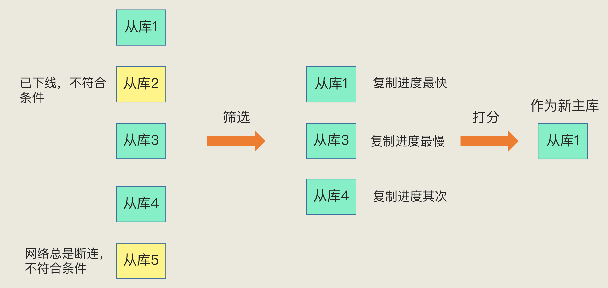

#### 故障的转移

假设根据一开始的图：（假设：判断主库客观下线了，同时选出`sentinel 3`是哨兵leader），故障转移流程如下：


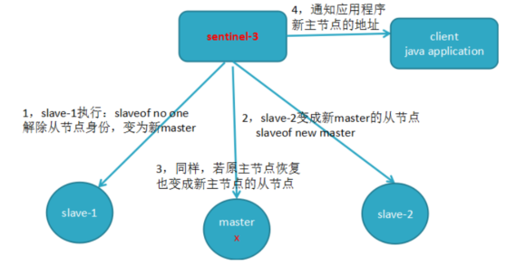

1. 将slave-1脱离原从节点（PS：`v5.0`中应该是`replicaof no one`)，升级主节点；
2. 将从节点slave-2指向新的主节点；
3. 通知客户端主节点已更换；
4. 若原主节点恢复，将原主节点（oldMaster）变成从节点，指向新的主节点

转移之后：

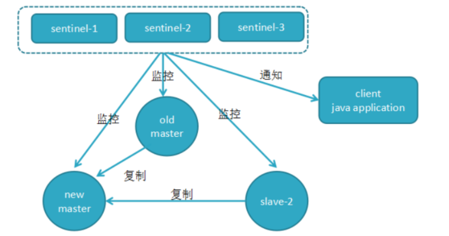

## 九、Redis分片技术（Redis Cluster）:rocket:

### 9.1 前言

> 参考链接：[Java全栈知识体系](https://pdai.tech/md/db/nosql-redis/db-redis-x-cluster.html)

主从复制和哨兵机制保障了高可用，就读写分离而言虽然**Slave节点扩展了主从的读并发能力**，但是**写能力**和**存储能力**无法进行扩展，就只能是Master节点**能够承载的上限**。如果面对海量数据那么必然需要**构建Master（主节点分片)之间的集群**，同时必然需要吸收高可用（主从复制和哨兵机制）能力，即**每个Master分片节点还是需要有Slave节点**，这是分布式系统中典型的纵向扩展（集群的分片技术）的体现。所以在Redis `v3.0`版本中对应的设计就是Redis Cluster。

### 9.2 Redis Cluster简单概述

> 参考链接：[博客园](https://www.cnblogs.com/jian0110/p/14002555.html)

#### Redis Cluster特点

- **多主多从、去中心化**：从节点复制主节点作为备用，不做读写操作，不提供服务。
- **不支持处理多个key**：因为数据分散在多个节点，在数据量大高并发的情况下会影响性能。
- **支持动态扩容节点**：即动态地增加集群节点。
- **节点之间相互通信、相互选举，不再依赖哨兵**：准确来说是主节点之间相互“监督”，保证及时故障转移。

#### Redis Cluster与其他集群模式的区别

- 相比较哨兵模式，**即多个Master节点保证主要业务（如Master节点主要负责写）稳定性，不需要搭建多个哨兵实例监控一个Master节点**。
- 相比较一主多从的模式，不需要手动切换**，具有自我故障检测，故障转移的特点**。
- 相比较其他两个模式而言，**需要对数据进行分片（Sharding），所以不同节点存储的数据是不一样的**。
- 从某种程度上来说，哨兵模式主要针对**高可用**（HA），**而Cluster模式是不仅支持HA，也支持高并发（大数据量）**。

### 9.3 Redis Cluster数据分布理论选择

> 参考链接：[CSDN](https://blog.csdn.net/xiaofeng10330111/article/details/90384502?ops_request_misc=%257B%2522request%255Fid%2522%253A%2522165600291116782184663623%2522%252C%2522scm%2522%253A%252220140713.130102334.pc%255Fall.%2522%257D&request_id=165600291116782184663623&biz_id=0&utm_medium=distribute.pc_search_result.none-task-blog-2~all~first_rank_ecpm_v1~hot_rank-2-90384502-null-null.142^v21^control,157^v15^new_3&utm_term=redis+%E5%88%86%E7%89%87&spm=1018.2226.3001.4187)

#### 数据分布关注点

分布式数据库首先要解决的问题是：**把整个数据集按照分区规则映射到多个节点**，即把数据划分到多个节点上，每个节点负责整体数据的一个**子集**。重点关注与解决的主要是数据分区规则，常见的分区规则有**哈希分区**和**顺序分区**两种，分布式存储数据分区如下图：

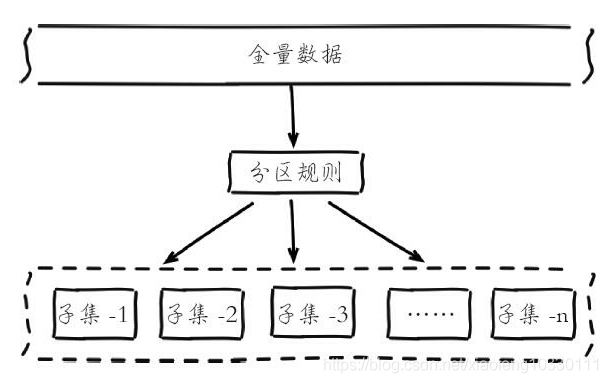

哈希分区与顺序分区的主要对比如下表：

|          |                  哈希分区                  |                   顺序分区                   |
| :------: | :----------------------------------------: | :------------------------------------------: |
|   特点   | 离散度好、数据分区与业务无关、无法顺序访问 | 离散度容易倾斜、数据分布业务相关、可顺序访问 |
| 代表产品 |      Redis Cluster、Cassandra、Dynamo      |         Bigtable、HBase、Hypertable          |

由表可见Redis Cluster采用的是**哈希分区**，可行方法主要有以下三种方案，综合考虑，Redis Cluster采用的是**虚拟槽分区方案**。

#### 三种数据分布方案的对比

##### 节点取余分区方案

**实现思路**：使用特定的数据（Redis的键或用户ID），根据节点数量N使用公式计算哈希值：$hash(key)\%N$，决定数据映射到某一节点。

**优点**：简单，常用于数据库的分库分表规则，一般采用预分区的方式，提前根据数据量规划好分区数（例如划分为512或1024张表），保证可支撑未来一段时间的数据量，再根据负载情况将表迁移到其他数据库中。要求**扩容时采用翻倍扩容**，避免数据映射全部被打乱导致全量迁移的情况。

**缺点**：当节点数量变化时，即扩容或缩容节点时，数据节点映射关系需要重新计算，会导致数据的**重新迁移**。

具体分析案例如下图： 

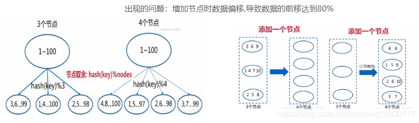

解决方案：**翻倍扩容**可以使数据迁移从80%降到50%：

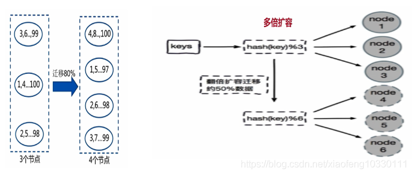

##### 一致性哈希分区方案

实现思路：为系统的每个节点分配一个token，范围一般在0~2^32^，这些token构成一个哈希环，数据读写执行节点查找操作时，先根据key计算hash值，然后**顺时针找到第一个大于等于该hash值的token节点**。

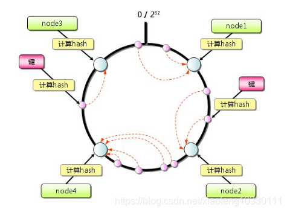

**优点**：加入和删除节点只影响哈希环中相邻的节点。

**缺点**：

- **加减节点会造成哈希环中部分数据无法命中**，所以应用于缓存场景是可以容忍的。
- 不适合少量数据节点的分布式方案。
- 普通一致性哈希分区在增减节点时**需要增加一倍或减去一半节点**才能保证数据和负载的均衡。

##### 虚拟槽分区方案（Redis Cluster方案）

实现思路：虚拟分槽使用良好的哈希函数**把所有数据映射到一个固定范围**（这个范围远远大于节点数，比如Redis Cluster槽的范围是0~16383）的整数集合中，**整数定义为槽（Slot）**。**槽是集群内数据管理和迁移的基本单位**。使用大范围槽的主要目的是为了**方便数据拆分和集群扩展**，要求每一个节点负责维护一部分槽以及所映射的键值数据。

基本计算公式为：$Slot=CRC16(key)\&16383$，具体如下：

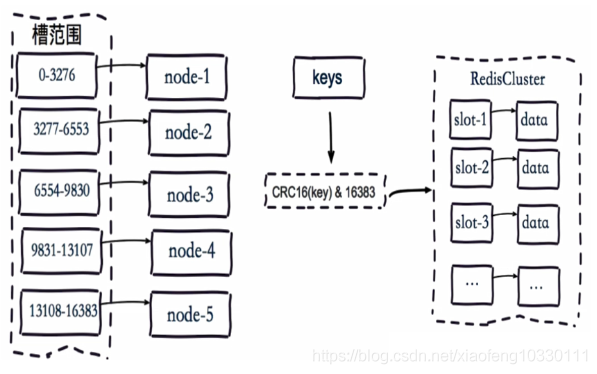

**优点**：

- **解耦数据和节点**之间的关系，简化了节点扩容和收缩的难度。
- **节点自身维护槽的映射关系**，不需要客户端或者代理服务维护槽分区元数据。
- 支持节点、槽、键之间的映射关系，用于数据路由、在线伸缩等场景。

**缺点**，即集群功能限制的地方：

- **key批量操作支持有限**。对于映射为不同slot值的key，执行`mset`、`mget`等操作可能由于存在于多个节点上而不被支持。
- **key事务操作支持有限**。多个key分布在不同节点上时无法使用事务功能。
- key作为数据分区的最小粒度，**不能将一个大的键值对象如hash、list等映射到不同的节点**。
  不支持多数据库空间。单机下Redis可以支持16个数据库，集群模式下只能使用一个数据库空间，即db0。
- 复制结构只支持一层，从节点只能复制主节点，**不支持嵌套树状复制结构**。

### 9.4 Redis Cluster节点通信概述

在分布式存储中需要提供维护节点元数据信息的机制，所谓元数据是指：**节点负责哪些数据，是否出现故障等状态**信息。常见的元数据维护方式分为：集中式和P2P方式。

Redis集群采用P2P的**Gossip（流言）协议**，Gossip协议工作原理就是：节点彼此不断通信交换信息，一段时间后所有的节点都会知道集群完整的信息，这种方式类似**流言传播**。

#### Gossip消息

Gossip协议的主要职责就是信息交换。**信息交换的载体就是节点彼此发送的Gossip消息**，常用的Gossip消息可分为：`ping`消息、`pong`消息、`meet`消息、`fail`消息。

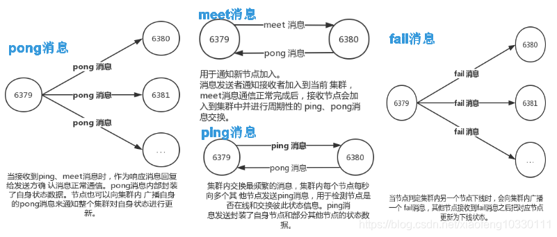

#### 消息格式

##### 消息头

- 消息头包含**发送节点自身状态数据**，接收节点根据消息头就可以获取到发送节点的相关数据。
- 集群内所有的消息都采用相同的消息头结构`clusterMsg`，它包含了发送节点关键信息，如**节点id、槽映射、节点标识（主从角色，是否下线）**等。

##### 消息体

- 消息体在Redis内部采用`clusterMsgData`结构声明。
- 消息体`clusterMsgData`定义发送消息的数据，其中`ping`、`meet`、`pong`都采用`MsgDataGossip`数组作为消息体数据，实际消息类型使用消息头的 type 属性区分。每个消息体包含该节点的多个clusterMsgDataGossip结构数据，用于信息交换。

#### 消息处理流程

接收节点收到`ping`/`meet`消息时，执行解析消息头和消息体流程：

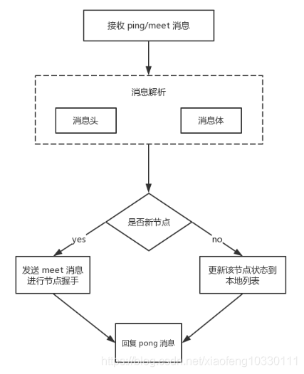

##### 解析消息头过程

消息头包含了发送节点的信息，如果发送节点是**新节点且消息是`meet`类型**，则加入到本地节点列表；如果是已知节点，则尝试**更新发送节点的状态**，如槽映射关系、主从角色等状态。

##### 解析消息体过程

如果消息体的`MsgDataGossip`数组包含的节点是**新节点**，则**尝试发起与新节点的`meet`握手流程**；如果是已知节点，则根据`MsgDataGossip`中的`flags`字段判断该节点是否下线，用于故障转移。

消息处理完后回复`pong`消息，内容同样包含消息头和消息体，发送节点接收到回复的`pong`消息后，采用类似的流程解析处理消息并更新与接收节点最后通信时间，完成一次消息通信。

#### 节点选择

Redis集群的Gossip协议需要兼顾**信息交换实时性**和**成本开销**，通信节点选择的规则如下：

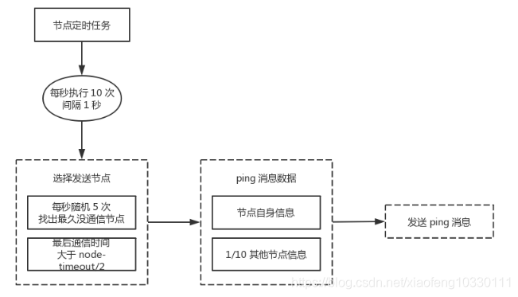

可以看出消息交换的成本主要体现在**单位时间选择发送消息的节点数量**和**每个消息携带的数据量**。

##### 选择发送消息的节点数量

- 每个节点每秒需要发送`ping`消息的数量$=1+10*num(node.pong\_received>cluster\_node\_timeout/2)$，因此 `cluster_node_timeout`参数对消息发送的节点数量影响非常大。
- 当带宽资源紧张时，可以适当调大这个参数，如从默认15秒改为30秒来降低带宽占用率。
- 过度调大`cluster_node_timeout`会影响消息交换的频率从而影响故障转移、槽信息更新、新节点发现的速度。
- 需要根据业务容忍度和资源消耗进行平衡，同时整个集群消息总交换量也跟节点数成正比。

**消息数据量：**

- 每个`ping`消息的数据量体现在消息头和消息体中，其中消息头主要占用空间的字段是`myslots[CLUSTER_SLOTS/8]`，占用2KB，这块空间占用相对固定。消息体会携带一定数量的其他节点信息用于信息交换。
- 消息体携带数据量跟集群的节点数息息相关，更大的集群每次消息通信的成本也就更高，因此对于Redis集群来说并不是大而全的集群更好。

#### 通信流程总述

- 集群中的每个节点都会单独开辟一个TCP通道，用于节点之间彼此通信，通信端口号在基础端口上加10000。
- 每个节点在固定周期内通过特定规则选择几个节点发送`ping`消息。
- 接收到`ping`消息的节点用`pong`消息作为响应。

集群中每个节点通过一定规则挑选要通信的节点，每个节点可能知道全部节点，也可能仅知道部分节点，只要这些节点彼此可以正常通信，最终它们会达到一致的状态。当节点出故障、新节点加入、主从角色变化、槽信息变更等事件发生时，通过不断的`ping`/`pong`消息通信，经过一段时间后所有的节点都会知道整个集群全部节点的最新状态，从而达到集群状态同步的目的。

### 9.5 集群伸缩原理与实现

#### 伸缩原理本质：集群伸缩=槽和数据在节点之间的移动

Redis集群提供了灵活的节点扩容和收缩方案。在不影响集群对外服务的情况下，可以为集群添加节点进行扩容也可以下线部分节点进行缩容，对节点进行灵活上下线控制，原理可抽象为**槽和对应数据在不同节点之间灵活移动**。

以下图为例，三个主节点分别维护自己负责的槽和对应的数据，如果希望加入1个节点实现集群扩容时，需要通过相关命令把一部分槽和数据迁移给新节点，图中每个节点把一部分槽和数据迁移到新的节点6385，每个节点负责的槽和数据相比之前变少了从而达到了集群扩容的目的。

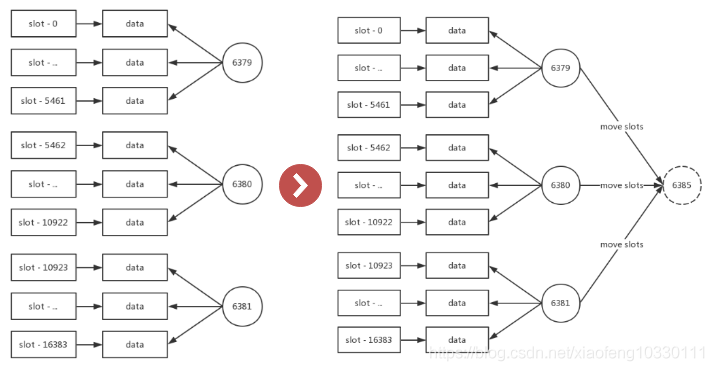

#### 扩容集群

Redis集群扩容操作可分为以下步骤：准备新节点-->加入集群-->迁移槽和数据。

##### 使用`redis-trib.rb`工具准备加入新节点并加入集群

`redis-trib.rb`工具也实现了为现有集群添加新节点的命令，还实现了直接添加为从节点的支持，命令如下：

```sh
# redis-trib add-node new_host:new_port existing_host:existing_port --slave --master-id <arg>
```

其内部同样采用`meet`命令实现加入集群功能。加入集群操作可以采用下面的命令实现新节点6385、6386的加入：

```sh
redis-trib.rb add-node 127.0.0.1:6385 127.0.0.1:6379
redis-trib.rb add-node 127.0.0.1:6386 127.0.0.1:6379
```

过程图：

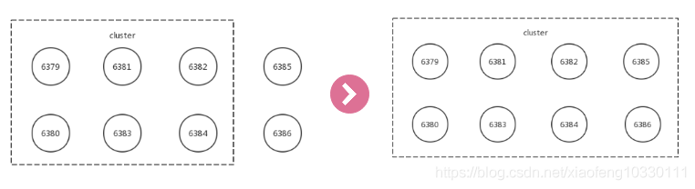

##### 迁移槽和数据

加入集群后需要为新节点迁移槽和相关数据，槽在迁移过程中集群**可以正常提供读写服务**，**迁移过程是集群扩容最核心的环节**，下面详细讲解。

###### 槽迁移计划

槽是Redis集群管理数据的基本单位，首先需要为新节点制定槽的迁移计划，**确定原有节点的哪些槽需要迁移到新节点**。迁移计划需要确保每个节点负责相似数量的槽，从而保证各节点的数据均匀。

例如，在下图中，集群加入6385节点后，原有节点负责的槽数量从6380变为4096个。槽迁移计划确定后开始逐个把槽内数据从源节点迁移到目标节点。

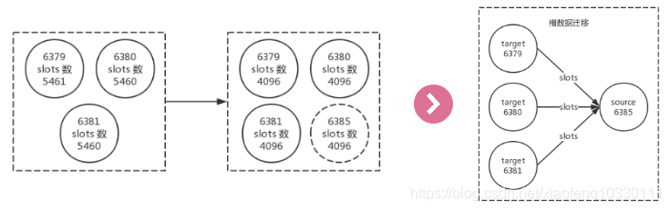

###### 迁移数据

数据迁移过程是逐个槽进行的，其槽和数据迁移流程及伪代码模拟迁移过程如下图：

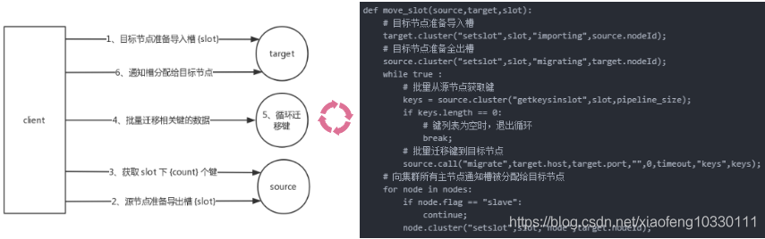

每个槽数据迁移的流程如下：

1. 对目标节点发送`cluster("setslot", slot, "importing", source.nodeId)`命令，让目标节点准备导入槽的数据；
2. 对源节点发送`cluster("setslot", slot, "migrating", target.nodeId)`命令，让源节点准备迁出槽的数据；
3. 源节点循环执行`cluster("getkeysinslot", slot,  slot_pipeline_size)`命令，获取`slot_pipeline_size`个属于槽slot的键；
4. 源节点上执行`call("migrate", target.host, target.port, "", 0, timeout, "keys", keys)`命令，**把获取的键通过流水线（pipeline）机制批量迁移到目标节点**，批量迁移版本的`migrate`命令在Redis `v3.0.6`以上版本提供，之前的`migrate`命令只能单个键迁移。对于大量key 的场景，批量键迁移将极大降低节点之间网络IO次数；
5. 重复执行步骤3和步骤4直到槽下所有的键值数据迁移到目标节点；
6. 向集群内所有主节点发送`cluster("setslot", slot, node, target.nodeId)`命令，**通知槽分配给目标节点**。为了保证槽节点映射变更及时传播，**需要遍历发送给所有主节点更新被迁移的槽指向新节点**。

`redis-trib.rb`提供了**槽重分片功能**，命令如下：

```sh
# redis-trib.rb reshard host:port --from <arg> --to <arg> --slots <arg> --yes --timeout <arg> --pipeline <arg>
```

参数说明：

- `host:port`：必传参数，集群内任意节点地址，用来获取整个集群信息。
- `from`：指定源节点的id，如果有多个源节点，使用逗号分隔，如果是`all`源节点变为集群内所有主节点，在迁移过程中提示用户输入。
- `to`：需要迁移的目标节点的id，目标节点只能填写一个，在迁移过程中提示用户输入。
- `slots`：需要迁移槽的总数量，在迁移过程中提示用户输入。
- `yes`：当打印出`reshard`执行计划时，是否需要用户输入`yes`确认后再执行`reshard`。
- `timeout`：控制每次`migrate`操作的超时时间，默认为60000毫秒。
- `pipeline`：控制每次批量迁移键的数量，默认为10。

`reshard`命令简化了数据迁移的工作量，其**内部针对每个槽的数据迁移同样使用之前的流程**。已经为新节点6385迁移了一个槽4096，剩下的槽数据迁移使用`redis-trib.rb`完成，命令如下：

```bash
#redis-trib.rb reshard 127.0.0.1:6379
>>> Performing Cluster Check (using node 127.0.0.1:6379)
M: cfb28ef1deee4e0fa78da86abe5d24566744411e 127.0.0.1:6379
slots:0-4095,4097-5461 (5461 slots) master
1 additional replica(s)
M: 40b8d09d44294d2e23c7c768efc8fcd153446746 127.0.0.1:6381
slots:10923-16383 (5461 slots) master
1 additional replica(s)
M: 8e41673d59c9568aa9d29fb174ce733345b3e8f1 127.0.0.1:6380
slots:5462-10922 (5461 slots) master
1 additional replica(s)
M: 1a205dd8b2819a00dd1e8b6be40a8e2abe77b756 127.0.0.1:6385
slots:4096 (1 slots) master
0 additional replica(s)
// ...
[OK] All nodes agree about slots configuration.
>>> Check for open slots...
>>> Check slots coverage...
[OK] All 16384 slots covered.
```

打印出集群每个节点信息后，`reshard`命令需要确认迁移的槽数量，这里输入4096个：

```bash
How many slots do you want to move (from 1 to 16384)4096
```

输入6385的节点ID作为目标节点，目标节点只能指定一个：

```bash
What is the receiving node ID 1a205dd8b2819a00dd1e8b6be40a8e2abe77b756
```

之后输入源节点的ID，这里分别输入节点6379、6380、6381三个节点ID最后用done表示结束：

```bash
Please enter all the source node IDs.
Type 'all' to use all the nodes as source nodes for the hash slots.
Type 'done' once you entered all the source nodes IDs.
Source node #1:cfb28ef1deee4e0fa78da86abe5d24566744411e
Source node #2:8e41673d59c9568aa9d29fb174ce733345b3e8f1
Source node #3:40b8d09d44294d2e23c7c768efc8fcd153446746
Source node #4:done
```

数据迁移之前会打印出所有的槽从源节点到目标节点的计划，确认计划无误后输入`yes`执行迁移工作：

```bash
Moving slot 0 from cfb28ef1deee4e0fa78da86abe5d24566744411e
....
Moving slot 1365 from cfb28ef1deee4e0fa78da86abe5d24566744411e
Moving slot 5462 from 8e41673d59c9568aa9d29fb174ce733345b3e8f1
...
Moving slot 6826 from 8e41673d59c9568aa9d29fb174ce733345b3e8f1
Moving slot 10923 from 40b8d09d44294d2e23c7c768efc8fcd153446746
...
Moving slot 12287 from 40b8d09d44294d2e23c7c768efc8fcd153446746
Do you want to proceed with the proposed reshard plan (yes/no) yes
```

`redis-trib.rb`工具会打印出每个槽迁移的进度。当所有的槽迁移完成后，`reshard`命令自动退出，执行`cluster nodes`命令检查节点和槽映射的变化：

```bash
127.0.0.1:6379>cluster nodes
40622f9e7adc8ebd77fca0de9edfe691cb8a74fb 127.0.0.1:6382 slave cfb28ef1deee4e0fa78da86abe5d24566744411e 0 1469779084518 3 connected
40b8d09d44294d2e23c7c768efc8fcd153446746 127.0.0.1:6381 master - 0 1469779085528 2 connected 12288-16383
4fa7eac4080f0b667ffeab9b87841da49b84a6e4 127.0.0.1:6384 slave 40b8d09d44294d2e23c7c768efc8fcd153446746 0 1469779087544 5 connected
be9485a6a729fc98c5151374bc30277e89a461d8 127.0.0.1:6383 slave 8e41673d59c9568aa9d29fb174ce733345b3e8f1 0 1469779088552 4 connected
cfb28ef1deee4e0fa78da86abe5d24566744411e 127.0.0.1:6379 myself,master - 0 0 0 connected 1366-4095 4097-5461
475528b1bcf8e74d227104a6cf1bf70f00c24aae 127.0.0.1:6386 master - 0 1469779086536 8 connected
8e41673d59c9568aa9d29fb174ce733345b3e8f1 127.0.0.1:6380 master - 0 1469779085528 1 connected 6827-10922
1a205dd8b2819a00dd1e8b6be40a8e2abe77b756 127.0.0.1:6385 master - 0 1469779083513 9 connected 0-1365 4096 5462-6826 10923-12287
```

说明：`cluster nodes`命令返回参数：

> 参考链接：[Java全栈知识体系](https://pdai.tech/md/db/nosql-redis/db-redis-x-cluster.html#cluster-nodes%E5%B1%9E%E6%80%A7)

```sh
node id, address:port, flags, last ping sent, last pong received, configuration epoch, link state, slots.
```

节点6385负责的槽变为：0-1365 4096 5462-6826 10923-12287。由于**槽用于hash运算本身顺序没有意义，因此无须强制要求节点负责槽的顺序性**。迁移之后建议使用`redis-trib.rb rebalance`命令检查节点之间槽的均衡性。命令如下：

```bash
# redis-trib.rb rebalance 127.0.0.1:6380
>>> Performing Cluster Check (using node 127.0.0.1:6380)
[OK] All nodes agree about slots configuration.
>>> Check for open slots...
>>> Check slots coverage...
[OK] All 16384 slots covered.
*** No rebalancing needed! All nodes are within the 2.0% threshold.
```

可以看出迁移之后所有主节点负责的槽数量差异在**2%**以内，因此集群节点数据相对均匀，无需调整。

##### 添加从节点

**节点6385迁移了部分槽和数据作为主节点**，但相比其他主节点**目前还没有从节点**，因此该节点**不具备故障转移的能力**。

这时**需要把已加入集群的6386节点作为6385的从节点**，从而保证整个集群的高可用。使用`cluster replicate ${masterNodeId}`命令为主节点添加对应从节点，注意在集群模式下`slaveof`添加从节点操作不再支持。如下所示：

```bash
127.0.0.1:6386>cluster replicate 1a205dd8b2819a00dd1e8b6be40a8e2abe77b756
```

从节点内部除了对主节点发起全量复制之外，还需要**更新本地节点的集群相关状态**，查看节点6386状态确认已经变成6385节点的从节点：

```bash
127.0.0.1:6386>cluster nodes
475528b1bcf8e74d227104a6cf1bf70f00c24aae 127.0.0.1:6386 myself,slave 1a205dd8b2819a00dd1e8b6be40a8e2abe77b756 0 0 8 connected
1a205dd8b2819a00dd1e8b6be40a8e2abe77b756 127.0.0.1:6385 master - 0 1469779083513 9 connected 0-1365 4096 5462-6826 10923-12287
……
```

到此整个集群扩容完成，集群关系结构如下：

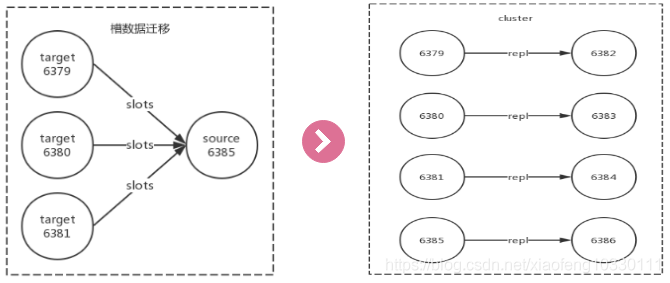

#### 缩容集群

##### 安全下线节点流程

收缩集群意味着缩减规模，需要从现有集群中**安全下线部分节点**。安全下线节点流程如下：

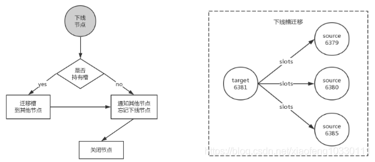

1. 首先需要确定下线节点**是否有负责的槽**，如果是，需要把槽迁移到其他节点，保证节点下线后整个集群槽节点映射的完整性；
2. 当**下线节点不再负责槽或者本身是从节点**时，就可以通知集群内其他节点忘记下线节点，当所有的节点忘记该节点后可以正常关闭。


##### 下线迁移槽

下线节点需要把自己负责的槽迁移到其他节点，原理与之前节点扩容的迁移槽过程一致。例如**把6381和6384节点下线**，节点信息如下：

```bash
127.0.0.1:6381> cluster nodes
40b8d09d44294d2e23c7c768efc8fcd153446746 127.0.0.1:6381 myself,master - 0 0 2 connected 12288-16383
4fa7eac4080f0b667ffeab9b87841da49b84a6e4 127.0.0.1:6384 slave 40b8d09d44294d2e23c7c768efc8fcd153446746 0 1469894180780 5 connected
...
```

6381是主节点，负责槽（12288-16383），6384是它的从节点。下线6381之前需要把负责的槽迁移到其他节点。

收缩正好和扩容迁移方向相反，6381变为源节点，**其他主节点变为目标节点，源节点需要把自身负责的4096个槽均匀地迁移到其他主节点上**。这里直接使用`redis-trib.rb reshard`命令完成槽迁移。由于每次执行reshard命令只能有一个目标节点，因此需要执行3次`reshard`命令，分别迁移1365、1365、1366个槽：

```bash
#redis-trib.rb reshard 127.0.0.1:6381
>>> Performing Cluster Check (using node 127.0.0.1:6381)
...
[OK] All 16384 slots covered.
How many slots do you want to move (from 1 to 16384)1365
What is the receiving node ID cfb28ef1deee4e0fa78da86abe5d24566744411e /*输入6379
	节点id作为目标节点.*/
Please enter all the source node IDs.
Type 'all' to use all the nodes as source nodes for the hash slots.
Type 'done' once you entered all the source nodes IDs.
Source node #1:40b8d09d44294d2e23c7c768efc8fcd153446746 /*源节点6381 id*/
Source node #2:done /* 输入done确认 */
...
Do you want to proceed with the proposed reshard plan (yes/no) yes
...
```

槽迁移完成后，6379节点接管了1365个槽12288~13652：

```bash
127.0.0.1:6379> cluster nodes
cfb28ef1deee4e0fa78da86abe5d24566744411e 127.0.0.1:6379 myself,master - 0 0 10 connected 1366-4095 4097-5461 12288-13652
40b8d09d44294d2e23c7c768efc8fcd153446746 127.0.0.1:6381 master - 0 1469895725227 2 connected 13653-16383
...
```

接下来重复以上步骤把槽迁移到节点6380、6385。最后节点6381所有的槽全部迁出完成，6381不再负责任何槽：

```bash
127.0.0.1:6379> cluster nodes
40b8d09d44294d2e23c7c768efc8fcd153446746 127.0.0.1:6381 master - 0 1469896444768 2 connected
8e41673d59c9568aa9d29fb174ce733345b3e8f1 127.0.0.1:6380 master - 0 1469896443760 11 connected 6827-10922 13653-15017
1a205dd8b2819a00dd1e8b6be40a8e2abe77b756 127.0.0.1:6385 master - 0 1469896445777 12 connected 0-1365 4096 5462-6826 10923-12287 15018-16383
cfb28ef1deee4e0fa78da86abe5d24566744411e 127.0.0.1:6379 myself,master - 0 0 10 connected 1366-4095 4097-5461 12288-13652
be9485a6a729fc98c5151374bc30277e89a461d8 127.0.0.1:6383 slave 8e41673d59c9568aa9d29fb174ce733345b3e8f1 0 1469896444264 11 connected
...
```

下线节点槽迁出完成后，剩下的步骤需要让**集群忘记该节点**。

##### 忘记节点

由于集群内的节点不停地通过Gossip消息彼此交换节点状态，因此需要通过一种健壮的机制让集群内所有节点忘记下线的节点：**也就是说让其他节点不再与要下线节点进行Gossip消息交换**。Redis提供了`cluster forget ${downNodeId}`命令实现该功能：

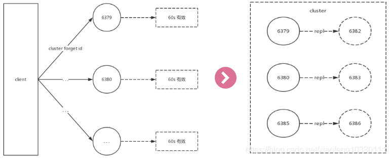

当节点接收到`cluster forget ${downNodeId}`命令后，**会把`nodeId`指定的节点加入到禁用列表中，在禁用列表内的节点不再发送Gossip消息**。禁用列表有效期是60秒，超过60秒节点会再次参与消息交换。也就是说**当第一次forget命令发出后，有60秒的时间让集群内的所有节点忘记下线节点**。

线上操作不建议直接使用`cluster forget`命令下线节点，需要跟大量节点命令交互，实际操作起来过于繁琐并且容易遗漏节点。建议使用`redist rib.rb del-node {host：port} ${downNodeId}`命令，内部实现的伪代码如下：

```python
def delnode_cluster_cmd(downNode):
	# 下线节点不允许包含slots
	if downNode.slots.length != 0
		exit 1
	end
	# 向集群内节点发送cluster forget
	for n in nodes:
		if n.id == downNode.id:
			# 不能对自己做forget操作
			continue;
		# 如果下线节点有从节点则把从节点指向其他主节点
		if n.replicate && n.replicate.nodeId == downNode.id :
			# 指向拥有最少从节点的主节点
			master = get_master_with_least_replicas();
			n.cluster("replicate",master.nodeId);
		#发送忘记节点命令
		n.cluster('forget',downNode.id)
	# 节点关闭
	downNode.shutdown();
```

从伪代码看出`del-node`命令实现了安全下线的后续操作。当**下线主节点具有从节点时需要把该从节点指向到其他主节点**，因此**对于主从节点都下线的情况，建议先下线从节点再下线主节点，防止不必要的全量复制**。对于6381和6384节点下线操作，命令如下：

```sh
redis-trib.rb del-node 127.0.0.1:6379 4fa7eac4080f0b667ffeab9b87841da49b84a6e4 #
	从节点6384 id
redis-trib.rb del-node 127.0.0.1:6379 40b8d09d44294d2e23c7c768efc8fcd153446746 #
	主节点6381 id
```

节点下线后确认节点状态：

```bash
127.0.0.1:6379> cluster nodes
cfb28ef1deee4e0fa78da86abe5d24566744411e 127.0.0.1:6379 myself,master - 0 0 10 connected 1366-4095 4097-5461 12288-13652
be9485a6a729fc98c5151374bc30277e89a461d8 127.0.0.1:6383 slave 8e41673d59c9568aa9d29fb174ce733345b3e8f1 0 1470048035624 11 connected
475528b1bcf8e74d227104a6cf1bf70f00c24aae 127.0.0.1:6386 slave 1a205dd8b2819a00dd1e8b6be40a8e2abe77b756 0 1470048032604 12 connected
40622f9e7adc8ebd77fca0de9edfe691cb8a74fb 127.0.0.1:6382 slave cfb28ef1deee4e0fa78da86abe5d24566744411e 0 1470048035120 10 connected
8e41673d59c9568aa9d29fb174ce733345b3e8f1 127.0.0.1:6380 master - 0 1470048034617 11 connected 6827-10922 13653-15017
1a205dd8b2819a00dd1e8b6be40a8e2abe77b756 127.0.0.1:6385 master - 0 1470048033614 12 connected 0-1365 4096 5462-6826 10923-12287 15018-16383
```

集群节点状态中已经不包含6384和6381节点，到目前为止已完成了节点的安全下线。**Redis集群伸缩的原理和操作方式是Redis集群化之后最重要的功能**，熟练掌握集群伸缩技巧后，可以针对线上的数据规模和并发量做到从容应对。

### 9.6 请求路由原理及集群客户端的选择

Redis集群对客户端通信协议做了比较大的修改，为了追求性能最大化，并没有采用代理的方式而是**采用客户端直连节点**的方式。因此对于希望从单机切换到集群环境的应用需要修改客户端代码。

#### 请求重定向

在集群模式下，Redis接收任何键相关命令时首先**计算键对应的槽**，再根据槽找出所对应的节点，**如果节点是自身，则处理键命令；否则回复`MOVED`重定向错误**，通知客户端请求正确的节点。这个过程称为**`MOVED`重定向**。


重定向信息**包含了键所对应的槽以及负责该槽的节点地址**，根据这些信息客户端就可以向正确的节点发起请求。**节点对于不属于它的键命令只回复重定向响应，并不负责转发**。

节点对于判定键命令是执行还是`MOVED`重定向， 都是借助`slots[CLUSTER_SLOTS]`数组实现。根据`MOVED`重定向机制，**客户端可以随机连接集群内任一Redis获取键所在节点，这种客户端又叫Dummy（傀儡）客户端**，它优点是代码实现简单，对客户端协议影响较小，只需要根据重定向信息再次发送请求即可。但是它的弊端很明显，每次执行键命令前都要到Redis上进行重定向才能找到要执行命令的节点，额外增加了IO开销，这不是Redis集群高效的使用方式。正因为如此通常集群客户端都采用另一种实现：**Smart（智能）客户端**。

#### Smart客户端

Smart客户端通过在内部维护slot→node的映射关系，**本地就可实现键到节点的查找**，从而保证IO效率的最大化，而`MOVED`重定向**负责协助Smart客户端更新slot→node映射**。

以Jedis为例，Smart操作集群的流程如下：

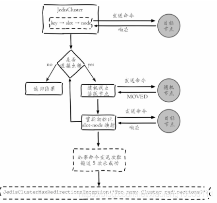

#### `Ask`重定向

Redis集群支持在线迁移槽和数据来完成水平伸缩，当槽对应的数据从源节点到目标节点迁移过程中，**客户端需要做到智能识别，保证键命令可正常执行**。

例如当一个槽数据从源节点迁移到目标节点时，期间可能出现一部分数据在源节点，而另一部分在目标节点，当出现该情况时，客户端键命令执行流程将发生变化：

- 客户端根据本地槽缓存发送命令到源节点，如果存在键对象则直接执行并返回结果给客户端；
- 如果键对象不存在，则可能存在于目标节点，这时源节点会回复`ASK`重定向异常。格式如下：`(error) ASK${slot}${targetIP}: ${targetPort}`；
- 客户端从`ASK`重定向异常提取出目标节点信息，发送`asking`命令到目标节点打开客户端连接标识，再执行键命令。如果存在则执行，不存在则返回不存在信息。

`ASK`重定向整体流程如下：

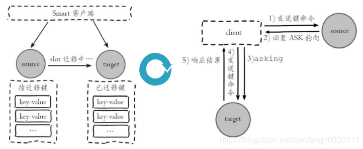

`ASK`与`MOVED`虽然都是对客户端的重定向控制，但是有着本质区别：`ASK`重定向说明**集群正在进行槽数据迁移**，客户端无法知道什么时候迁移完成，因此只能是**临时性的重定向**，**客户端不会更新槽缓存**。但是`MOVED`重定向说明**键对应的槽已经明确指定到新的节点**，因此**需要更新槽缓存**。

### 9.7 故障转移

高可用首先需要解决集群部分失败的场景：**当集群内少量节点出现故障时通过自动故障转移保证集群可以正常对外提供服务**。

#### 故障发现

Redis的各个节点通过`ping/pong`进行消息通信，故障发现也是通过这个动作发现的，跟Sentinel一样，有主观下线和客观下线。

##### 主观下线

某个节点认为另一个节点不可用，“偏见”，但不是最终的故障判断。

##### 客观下线

**标志着一个节点真正的下线**，即**半数以上持有槽的主节点都标记某节点主观下线**，如果是持有槽的主节点故障，需要为该节点进行故障转移。

##### 尝试客观下线

1. 通知集群内所有节点标记故障节点为**客观下线**；
2. 通过故障节点的**从节点触发故障转移流程**。

以上流程如下：

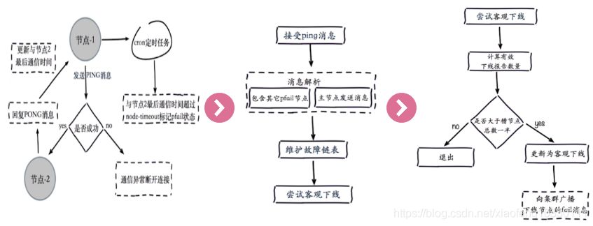

#### 故障恢复

故障节点变为客观下线后，**如果下线节点是持有槽的主节点则需要在它的从节点中选出一个替换它**，从而保证集群的高可用。**下线主节点的所有从节点承担故障恢复的义务**：**当从节点通过内部定时任务发现自身复制的主节点进入客观下线时，将会触发故障恢复流程**：资格检查-->准备选举时间-->发起选举-->选举投票-->替换主节点。

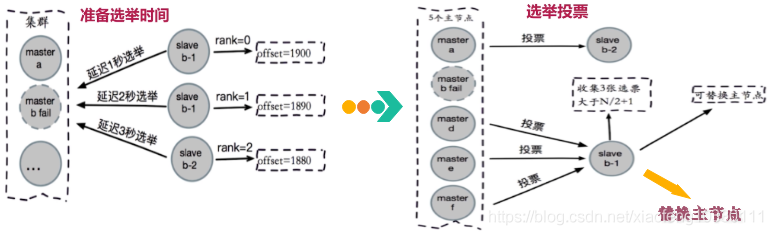

##### 资格检查

每个从节点检查与故障主节点的断线时间，超过`cluster-node-timeout * cluster-slave-validity-factor`则取消资格，其中`cluster-slave-validity-factor`默认是10。

##### 准备选举时间

- 当从节点符合故障转移资格后，**更新触发故障选举的时间**，只有到达该时间后才能执行后续流程。
- 采用延迟触发机制，主要是通过**对多个从节点使用不同的延迟选举时间来支持优先级问题**。
- **复制偏移量越大说明从节点延迟越低**，那么**它应该具有更高的优先级来替换故障主节点**。所有的**从节点中复制偏移量最大的将提前触发故障选举流程**。

主节点B进入客观下线后，它的三个**从节点根据自身复制偏移量设置延迟选举时间**，如复制偏移量最大的节点slave b-1延迟1秒执行，保证复制延迟低的从节点优先发起选举。

##### 发起选举

当从节点定时任务检测到达故障选举时间（`failover_auth_time`）到达后，发起选举流程：

1. 更新配置纪元：**配置纪元是一个只增不减的整数**，每个主节点自身维护一个配置纪元 （`clusterNode.configEpoch`）**标示当前主节点的版本**，**所有主节点的配置纪元都不相等**，从节点会复制主节点的配置纪元。整个集群又维护一个全局的配置纪元（`clusterState.current Epoch`）用于记录**集群内所有主节点配置纪元的最大版本**。执行`cluster info`命令可以**查看配置纪元信息**。只要集群发生重要的关键事件，纪元数就会增加，所以在选从的时候**需要选择一个纪元数最大的从**；
2. 广播选举消息：在集群内广播选举消息（`FAILOVER_AUTH_REQUEST`），并记录已发送过消息的状态，**保证该从节点在一个配置纪元内只能发起一次选举**。消息内容如同`ping`消息只是将`type`类型变为`FAILOVER_AUTH_REQUEST`。

##### 选举投票

1. 只有**持有哈希槽的主节点才能参与投票**，每个主节点有一票的权利，如集群内有N个主节点，那么只要有一个从节点获得了N/2+1的选票即认为胜出。
2. 投票作废：每个配置纪元代表了一次选举周期，如果在开始投票之后的`cluster-node-timeout*2`时间内**从节点没有获取足够数量的投票，则本次选举作废**。从节点对配置纪元自增并发起下一轮投票，直到选举成功为止。

说明：**故障主节点也算在投票数内**。假设集群内节点规模是3主3从，其中有2个主节点部署在一台机器上，当这台机器宕机时，由于从节点无法收集到 3/2+1个主节点选票将导致故障转移失败。这个问题也适用于故障发现环节。**因此部署集群时所有主节点最少需要部署在3台物理机上才能避免单点问题**。

##### 替换主节点

1. 当从节点收集到足够的选票之后，触发**替换主节点操作**；
2. 当前从节点取消复制**变为主节点**；
3. 执行`clusterDelSlot`操作**撤销故障主节点负责的槽**，并执行`clusterAddSlot`把这些槽委派给自己；
4. 向集群广播自己的`pong`消息，**通知集群内所有节点当前从节点变为主节点并接管了故障主节点**。

### 9.8 预分片

> 参考链接：[Redis中文文档](https://www.redis.com.cn/topics/partitioning.html)

从分区的概念中知道分区有一个缺点：除非只把Redis当作缓存服务器来使用，**否则添加和删除Redis节点都会非常复杂**。相反使用固定的键值和实例映射更加简单。然而数据存储会经常需要变化。例如现在只需要10个Redis节点（实例），但是过几天可能就会需要50个节点。

因为Redis足够轻量和小巧（一个备用实例使用1M的内存）**，解决这个问题的简单方法就是一开始就使用大量的实例节点**。例如，32或者64个实例能够满足绝大多数的用户，并且可以为其提供足够的增长空间。

通过这样的方法，当数据存储需求增加时，**只需要更多的Redis服务器，然后把一个节点移动到另外的服务器上面**。一旦添加了额外的服务器，需要将一半的Redis实例移动到第二个服务器，以此类推。

可以使用Redis的主从复制来减少服务的停止时间：

- 在新服务器上开启新的Redis空实例；
- 将节点的数据配置移动到新的**从服务器**上；
- 停止Redis客户端；
- 在新的服务器上**更新IP地址到移动过来的节点配置文件中**；
- 发送`SLAVEOF NO ONE`命令到新服务器的从节点；
- 使用新的配置重启客户端；
- 最后关闭老服务器上不再使用的节点。

## 十、缓存问题:rocket:

> 参考链接：[Java全栈知识体系](https://pdai.tech/md/db/nosql-redis/db-redis-x-cache.html)
>

### 10.1 为什么要理解Redis缓存问题？

在高并发的业务场景下，数据库大多数情况都是用户并发访问最薄弱的环节。所以就需要使用Redis做一个**缓冲操作**，让请求先访问到Redis，而不是直接访问Mysql等数据库。这样可以大大缓解数据库的压力。

当缓存库出现时，必须要考虑如下问题：缓存穿透、缓存穿击、缓存雪崩、缓存污染（或者满了）、缓存和数据库一致性。

### 10.2 缓存穿透

#### 问题来源

缓存穿透是指**缓存和数据库中都没有的数据**，而用户不断发起请求。由于缓存是不命中时被动写的，并且出于容错考虑，如果从存储层查不到数据则不写入缓存，这将**导致这个不存在的数据每次请求都要到存储层去查询，失去了缓存的意义**。

在流量大时，可能DB就挂掉了，要是有人利用不存在的key频繁攻击应用，这就是漏洞。

#### 解决方案

- 接口层增加**校验**，如用户鉴权校验，id做基础校验，id<=0的直接拦截。
- 从缓存取不到的数据，在数据库中也没有取到，这时也可以将**key-value对写为key-null**，缓存有效时间可以设置短点，如30秒（设置太长会导致正常情况也没法使用）。这样可以防止攻击用户反复用同一个id暴力攻击。
- 布隆过滤器。**bloomfilter**就类似于一个HashSet，用于快速判断某个元素是否存在于集合中，其典型的应用场景就是**快速判断一个key是否存在于某容器，不存在就直接返回**。布隆过滤器的关键就在于hash算法和容器大小。

### 10.3 缓存击穿

#### 问题来源

缓存击穿是指**缓存中没有但数据库中有的数据**（一般是缓存时间到期），这时由于并发用户特别多，同时读缓存没读到数据，又同时去数据库去取数据，引起数据库压力瞬间增大，造成过大压力。

#### 解决方案

- 设置热点数据永远不过期。
- **限流、熔断、降级**。重要的接口一定要做好限流策略，防止用户恶意刷接口，同时要降级准备，当接口中的某些服务不可用时候，进行熔断，失败快速返回机制。
- 加互斥锁。

### 10.3 缓存雪崩

#### 问题来源

缓存雪崩是指缓存中**数据大批量到过期时间，而查询数据量巨大，引起数据库压力过大甚至宕机**。和缓存击穿不同的是，**缓存击穿指并发查同一条数据，缓存雪崩是不同数据都过期了，很多数据都查不到从而查数据库**。

#### 解决方案

- 缓存数据的**过期时间设置随机**，防止同一时间大量数据过期现象发生。
- 如果缓存数据库是分布式部署，将**热点数据均匀分布在不同的缓存数据库中**。
- 设置热点数据永远不过期。

### 10.4 缓存污染（或满）

缓存污染问题说的是缓存中一些只会被访问一次或者几次的的数据，被访问完后，**再也不会被访问到**，但这部分**数据依然留存在缓存中，消耗缓存空间**。

缓存污染会随着数据的持续增加而逐渐显露，随着服务的不断运行，**缓存中会存在大量的永远不会再次被访问的数据**。缓存空间是有限的，如果缓存空间满了，再往缓存里写数据时就会有额外开销，影响Redis性能。**这部分额外开销主要是指写的时候判断淘汰策略，根据淘汰策略去选择要淘汰的数据，然后进行删除操作**。

#### 最大缓存设置多大

系统的设计选择是一个权衡的过程：大容量缓存是能带来性能加速的收益，但是成本也会更高，而小容量缓存不一定就起不到加速访问的效果。一般来说，**建议把缓存容量设置为总数据量的 15% 到 30%，兼顾访问性能和内存空间开销**。

对于Redis来说，可以使用下面这个命令来设定缓存的大小了：

```sh
CONFIG SET maxmemory 4gb
```

不过，缓存被写满是不可避免的，所以需要数据淘汰策略。

#### 缓存淘汰策略

> 参考链接：[Redis文档](https://redis.io/docs/manual/eviction/#eviction-policies)

Redis共支持八种淘汰策略，分别是`noeviction`、`volatile-random`、`volatile-ttl`、`volatile-lru`、`volatile-lfu`、`allkeys-lru`、`allkeys-random`和`allkeys-lfu`策略。

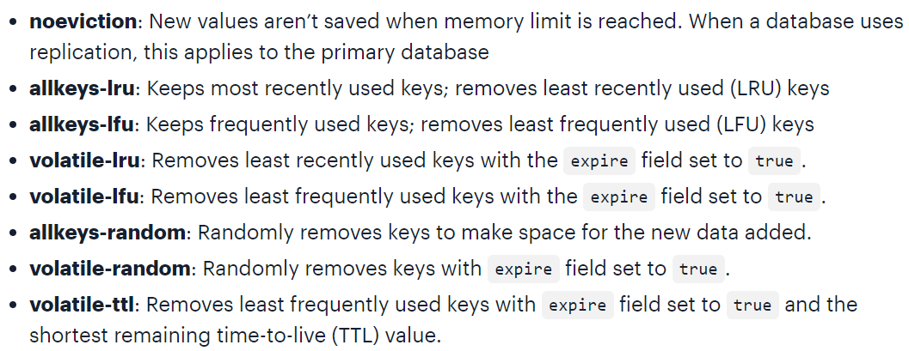

主要可以分成三类：

- 不淘汰
  - `noeviction`（`v4.0`后默认的）
- 在设置了过期时间的数据中淘汰
  - 随机：`volatile-random`
  - lru：`volatile-lru`
  - lfu：`volatile-lfu`：`v4.0`后新增。
  - ttl：`volatile-ttl`
- 在全部数据中淘汰
  - 随机：`allkeys-random`
  - lru：`allkeys-lru`：**推荐使用**。
  - lfu：`allkeys-lfu`，`v4.0`后新增。

|      策略       |                             说明                             |
| :-------------: | :----------------------------------------------------------: |
|   noeviction    | Redis**默认策略**，一旦缓存被写满就不再提供服务（存储值），而是**返回错误**。无法解决缓存污染问题，一般生产环境不建议使用。 |
| volatile-random | 在设置了过期时间的键值对中，进行随机删除。因为是随机删除，**无法确保把不再访问的数据筛选出来**，所以可能依然会存在缓存污染现象。 |
|  volatile-lru   |   在设置了过期时间的键值对中，移除**最近最少使用**的数据。   |
|  volatile-lfu   | 如果两个数据使用次数相同，**移除距离上一次使用时间更久的数据**。 |
|  volatile-ttl   |       在设置了过期时间的键值对中，移除最早过期的数据。       |
| allkeys-random  | 从所有键值对中随机选择并删除数据。随机删除就**无法解决缓存污染问题**。 |
|   allkeys-lru   |                            同上。                            |
|   allkeys-lfu   |                            同上。                            |

##### 补充：Redis中的LRU

Redis会记录每个数据的最近一次被访问的时间戳。在Redis在决定淘汰的数据时，第一次会随机选出N个数据作为一个候选集合。接下来，Redis会比较这N个数据的lru字段，把lru字段值最小的数据从缓存中淘汰出去。**通过随机读取待删除集合，可以让Redis不用维护一个巨大的链表，也不用操作链表，进而提升性能**。

Redis选出的数据个数N，通过配置参数`maxmemory-samples`进行配置。个数N越大，则候选集合越大，选择到的最久未被使用的就更准确，N越小，选择到最久未被使用的数据的概率也会随之减小。

##### 补充：Redis中的LFU

当使用LFU策略筛选数据时，Redis会在候选集合中，根据数据**lru字段的后8bit选择访问次数最少的数据**进行淘汰。当访问次数相同时，**再根据lru字段的前16bit值大小，选择访问时间最久远的数据**进行淘汰。

Redis只使用了8bit记录数据的访问次数，而8bit记录的最大值是255，这样在访问快速的情况下，如果每次被访问就将访问次数加一，很快某条数据就达到最大值255，可能很多数据都是255，那么退化成LRU算法了。所以Redis为了解决这个问题，**实现了一个更优的计数规则**，并可以通过配置项，来控制计数器增加的速度。

**参数** ：

`lfu-log-factor`：用计数器当前的值乘以配置项`lfu_log_factor`再加1，再取其倒数，得到一个p值；然后把这个p值和一个取值范围在（0，1）间的随机数r值比大小，只有p值大于r值时计数器才加 1。

`lfu-decay-time`：控制访问次数衰减。LFU策略会计算当前时间和数据最近一次访问时间的差值，并把这个差值换算成以**分钟为单位**。然后，LFU策略再把这个差值除以`lfu_decay_time`值，所得的结果就是数据counter要衰减的值。

`lfu-log-factor`设置越大，递增概率越低；`lfu-decay-time`设置越大，衰减速度会越慢。

在应用LFU策略时，一般可以将`lfu_log_factor`取值为10。如果业务应用中有短时高频访问的数据的话，建议把`lfu_decay_time`值设置为 1，可以快速衰减访问次数。

### 10.5 数据库和缓存一致性:rocket:

> 参考链接：[Kaito's Blog](http://kaito-kidd.com/2021/09/08/how-to-keep-cache-and-consistency-of-db/)

#### 引入缓存提高性能

从最简单的场景开始讲起。

如果业务处于起步阶段（流量非常小），那无论是读请求还是写请求，直接操作数据库即可，这时架构模型是这样的：

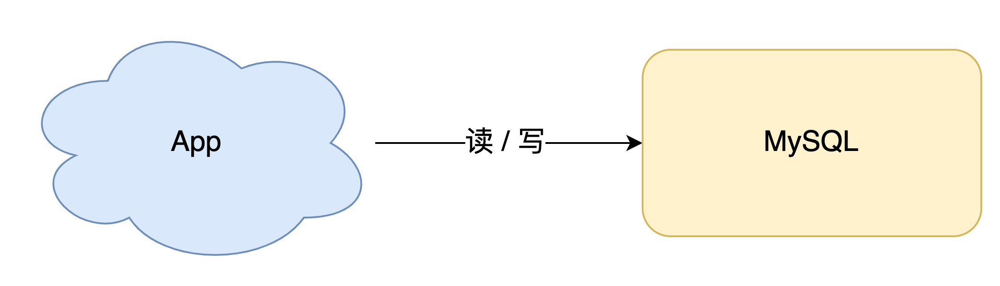

但随着业务量的增长，项目请求量越来越大，这时如果每次都从数据库中读数据，那肯定会有性能问题。这个阶段通常的做法是，引入**缓存**来提高读性能，架构模型就变成了这样：

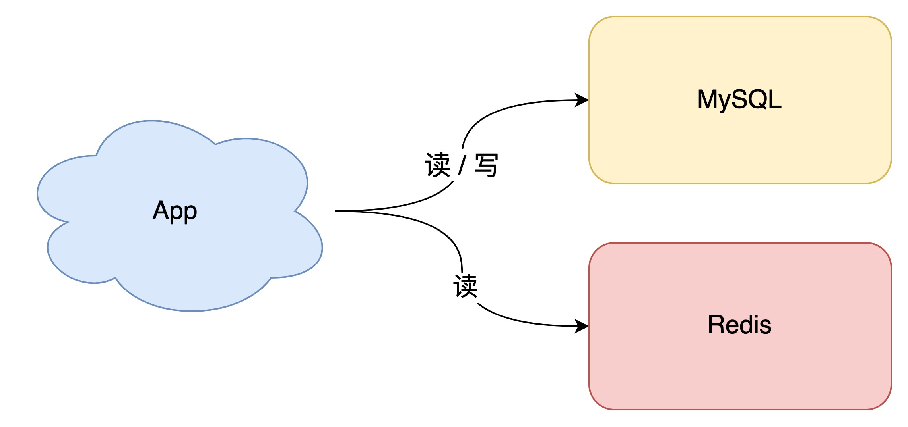

但引入缓存之后就会面临一个问题：**之前数据只存在数据库中，现在要放到缓存中读取，具体要怎么存呢？**

最简单直接的方案是**全量数据刷到缓存中**：

- 数据库的数据，全量刷入缓存（不设置失效时间）；
- 写请求只更新数据库，不更新缓存；
- 启动一个定时任务，**定时**把数据库的数据，更新到缓存中。

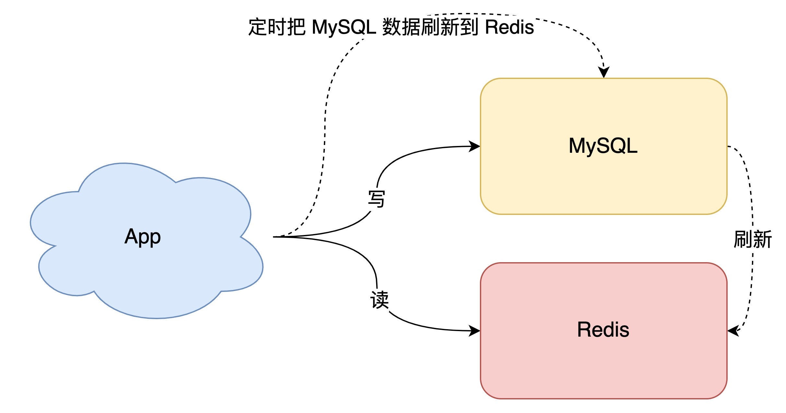

这个方案的优点是：所有读请求都可以直接**命中**缓存，不需要再查数据库，性能非常高。但缺点也很明显，有2个问题：

1. **缓存利用率低**：不经常访问的数据，还一直留在缓存中。
2. **数据不一致**：因为是**定时**刷新缓存，缓存和数据库存在不一致（取决于定时任务的执行频率）。

所以这种方案一般更适合业务**体量小**，且**对数据一致性要求不高**的业务场景。那如果业务体量很大，怎么解决这2个问题呢？

#### 缓存利用率和一致性问题

##### 如何提高缓存利用率？

想要缓存利用率**最大化**，很容易想到的方案是：缓存中只保留最近访问的**热数据**。但具体要怎么做呢？可以这样优化：

- 写请求依旧只写数据库；
- 读请求**先读缓存，如果缓存不存在，则从数据库读取，并重建缓存**；
- 同时，**写入缓存中的数据都设置失效时间**。

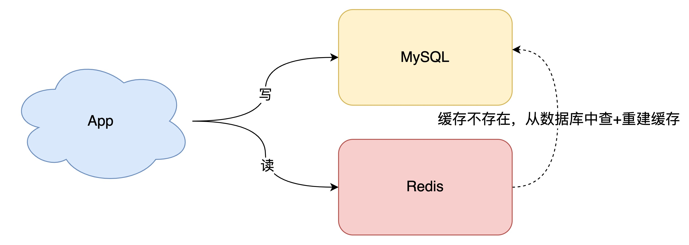

这样一来，随着时间的推移，缓存中不经常访问的数据都会**逐渐过期淘汰掉**，最终缓存中保留的，都是经常被访问的**热数据**，缓存利用率得以最大化。

##### 数据一致性问题

###### 前言：谈谈一致性

一致性就是数据保持一致，在分布式系统中，可以理解为多个节点中数据的值是一致的。

- **强一致性**：这种一致性级别是**最符合用户直觉**的，它要求**系统写入什么，读出来的也会是什么**，用户体验好，但实现起来往往对系统的性能影响大。
- **弱一致性**：这种一致性级别约束了系统在写入成功后，**不承诺立即可以读到写入的值，也不承诺多久之后数据能够达到一致，但会尽可能地保证到某个时间级别（比如秒级别）后，数据能够达到一致状态**。
- **最终一致性**：最终一致性是弱一致性的一个特例，**系统会保证在一定时间内，能够达到一个数据一致的状态**。这里之所以将最终一致性单独提出来，是因为它是弱一致性中非常推崇的一种一致性模型，也是业界在大型分布式系统的数据一致性上比较推崇的模型。

要想保证缓存和数据库**实时**一致，那就不能再用定时任务刷新缓存了。所以当数据发生更新时，不仅要操作数据库，还要一并操作缓存。具体操作就是，**修改一条数据时，不仅要更新数据库，也要连带缓存一起更新**。但数据库和缓存都更新，又存在先后问题，那对应的方案就有2个：

1. 先更新缓存，后更新数据库。
2. 先更新数据库，后更新缓存。

哪个方案更好呢？**先不考虑并发问题**，正常情况下，无论谁先谁后，都可以让两者保持一致，但现在需要重点考虑异常情况。因为操作分为两步，那么就很有可能存在**第一步成功、第二步失败**的情况发生。这2种方案一个个分析。

###### 更新缓存的2种方案

**（1）先更新缓存、后更新数据库**

如果缓存更新成功了，但数据库更新失败，那么此时缓存中是**最新值**，但数据库中是**旧值**。

虽然此时读请求可以命中缓存，拿到正确的值，但是，一旦缓存**失效**，就会从数据库中读取到**旧值**，重建缓存也是这个**旧值**。这时用户会发现自己之前修改的数据**又变回去**了，对业务造成影响。

**（2）先更新数据库、后更新缓存**

如果数据库更新成功了，但缓存更新失败，那么此时数据库中是**最新值**，缓存中是**旧值**。

之后的读请求读到的都是旧数据，只有当缓存**失效**后，才能从数据库中得到正确的值。这时用户会发现，自己刚刚修改了数据，但却看不到变更，一段时间过后，数据才变更过来，对业务也会有影响。

**可见**，无论谁先谁后，但凡后者发生异常，就会对业务造成影响。那怎么解决这个问题呢？**后面会详细给出对应的解决方案**。下面继续分析：除了操作失败问题，还有什么场景会影响数据一致性？这里还需要重点关注：**并发问题**。

#### 并发引起的一致性问题

假设采用**先更新数据库，再更新缓存**的方案，并且两步都可以**成功执行**的前提下，如果存在并发，情况会是怎样的呢？

有线程A和线程B需要更新**同一条**数据，会发生这样的场景：

1. 线程 A 更新数据库（X = 1）；
2. 线程 B 更新数据库（X = 2）；
3. 线程 B 更新缓存（X = 2）；
4. 线程 A 更新缓存（X = 1）。

最终X在缓存中是1，在数据库中是2，**发生不一致**。

也就是说，A虽然先于B发生，**但B操作数据库和缓存的时间却要比A的时间短**，执行时序发生**错乱**，最终这条数据结果是不符合预期的。（同样地，采用「先更新缓存，再更新数据库」的方案，也会有类似问题。）

那怎么解决这个问题呢？这里通常的解决方案是：**加分布式锁**。两个线程要修改**同一条**数据，每个线程在改之前，先去申请分布式锁，**拿到锁的线程才允许更新数据库和缓存**，拿不到锁的线程，返回失败，等待下次重试。这么做的目的，就是为了只允许一个线程去操作数据和缓存，**避免并发问题**。

但是从**缓存利用率**的角度来评估这个方案，是不太推荐的。这是因为每次数据发生变更，都**无脑**更新缓存，但是缓存中的数据不一定会被**马上读取**，这就会导致缓存中可能存放了很多不常访问的数据，浪费缓存资源。而且很多情况下，写到缓存中的值，并不是与数据库中的值一一对应的，**很有可能是先查询数据库，再经过一系列计算得出一个值，才把这个值才写到缓存中**。

由此可见，这种**更新数据库+更新缓存**的方案，不仅缓存利用率不高，还会造成机器性能的浪费。所以此时需要考虑另外一种方案：**删除缓存**。

#### 删除缓存可以保证一致性么？

删除缓存对应的方案也有2种：

1. 先删除缓存，后更新数据库。
2. 先更新数据库，后删除缓存。

同样地，先来看**第二步**操作失败的情况。

先删除缓存，后更新数据库，**第二步操作失败，数据库没有更新成功**，那下次读缓存发现不存在，则从数据库中读取，并重建缓存，此时数据库和缓存依旧保持一致（**但是是旧值，没更新成功**）。

如果是先更新数据库，后删除缓存，**第二步操作失败，数据库是最新值，缓存中是旧值**，发生不一致。所以，这个方案依旧存在问题。

总之，和前面提到的问题类似，第二步失败依旧有不一致的风险。

接下来关注**并发**问题，这个问题是需要关注的重点。

##### 删除缓存的2种方案

**（1）先删除缓存、后更新数据库**

如果有2个线程要**并发读写**数据，可能会发生以下场景：

1. 线程A要更新X=2（原值X=1）；
2. 线程A先删除缓存；
3. 线程B读缓存，发现不存在，从数据库中读取到旧值（X=1）；
4. 线程A将新值写入数据库（X=2）；
5. 线程B将旧值写入缓存（X=1）。

最终X的值在缓存中是1（旧值），在数据库中是2（新值），**发生不一致**。

可见，先删除缓存，后更新数据库，当发生**读+写**并发时，还是存在数据不一致的情况。

**（2）先更新数据库、后删除缓存**

依旧是2个线程**并发读写**数据：

1. 缓存中X不存在（数据库X=1）；
2. 线程A读取数据库，得到旧值（X=1）；
3. 线程B更新数据库（X=2）；
4. 线程B删除缓存；
5. 线程A将旧值写入缓存（X=1）。

最终X的值在缓存中是1（旧值），在数据库中是2（新值），**也发生不一致**。

这种情况**理论**来说是可能发生的，但实际真的有可能发生吗？其实概率**很低**，这是因为它必须同时满足3个条件：

1. 缓存刚好已失效。
2. 读请求 + 写请求并发。
3. 更新数据库+删除缓存的时间（步骤3-4），要比读数据库+写缓存时间短（步骤2和5）

仔细想一下，其中条件3发生的概率其实是非常低的：因为写数据库一般会先**加锁**，所以**写数据库，通常是要比读数据库的时间更长的**。这么来看，**先更新数据库、后删除缓存**的方案，是可以保证数据一致性的。所以应该采用这种方案来操作数据库和缓存。

解决了并发问题，需要反过来看前面遗留的，**第二步执行「失败」导致数据不一致的问题**。

#### 如何保证两步都执行成功？

前面分析到，无论数据库和缓存谁先谁后，只要第二步发生失败，那么就会导致数据库和缓存不一致。**保证第二步成功执行，就是解决问题的关键**。

##### 同步重试

想一下，程序在执行过程中发生异常，最简单的解决办法是什么？答案是：**重试**。无论是先操作缓存，还是先操作数据库，但凡后者执行失败了，就可以发起重试，尽可能地去做**补偿**。

那这是不是意味着，只要执行失败，**无脑重试**就可以了呢？答案是否定的。现实情况往往没有想的这么简单，失败后立即重试的问题在于：

- 立即重试很大概率**还会失败**。
- **重试次数**设置多少才合理？
- 重试会一直**占用**这个线程资源，无法服务其它客户端请求。

所以这种**同步重试**的方案依旧不严谨。那更好的方案应该怎么做？答案是：**异步重试**。什么是异步重试？

##### 消息队列

其实就是把**重试请求写到消息队列**中，然后由专门的**消费者**来重试，直到成功；或者更直接的做法，为了避免第二步执行失败，可以把**操作缓存这一步直接放到消息队列**中，由消费者来操作缓存。

到这里也可能有问题：**写消息队列也有可能会失败啊？而且，引入消息队列，这又增加了更多的维护成本，这样做值得吗？**

这个问题很好，但思考这样一个问题：**如果在执行失败的线程中一直重试，还没等执行成功，此时如果项目重启了，那这次重试请求也就丢失了，这条数据就一直不一致了**。

所以，这里必须**把重试请求或第二步操作放到另一个服务**中，这个服务用**消息队列**最为合适。这是因为消息队列的特性，正好符合需求：

- **消息队列保证可靠性**：写到队列中的消息，成功消费之前不会丢失（重启项目也不担心）。
- **消息队列保证消息成功投递**：下游从队列拉取消息，成功消费后才会删除消息，否则还会继续投递消息给消费者（符合重试的需求）

至于写队列失败和消息队列的维护成本问题：

- **写队列失败**：操作缓存和写消息队列**同时失败**的概率其实是很小的。
- **维护成本**：项目中一般都会用到消息队列，维护成本并没有新增很多。

所以，引入消息队列来解决这个问题，是比较合适的。这时架构模型就变成了这样：


##### 变更日志

如果确实不想在应用中去写消息队列，是否有更简单的方案，同时又可以保证一致性呢？方案还是有的，这就是近几年比较流行的解决方案：**订阅数据库变更日志，再操作缓存**。

具体来讲就是，业务应用在修改数据时，**只需修改数据库，无需操作缓存**。那什么时候操作缓存呢？这就和数据库的**变更日志**有关了。拿MySQL举例，**当一条数据发生修改时，MySQL就会产生一条变更日志（Binlog）**，可以订阅这个日志拿到具体操作的数据，然后再根据这条数据去删除对应的缓存。

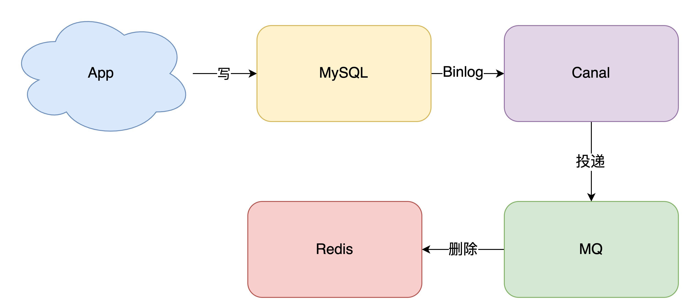

订阅变更日志，目前也有了比较成熟的开源中间件，例如阿里的 **canal**，使用这种方案的优点在于：

- **无需考虑写消息队列失败情况**：只要写MySQL成功，Binlog肯定会有。
- **自动投递到下游队列**：canal自动把数据库变更日志**投递**给下游的消息队列。

当然也是需要投入精力去维护canal的高可用和稳定性。

至此，可以得出结论：想要保证数据库和缓存一致性，**推荐采用“先更新数据库、再删除缓存”方案，并配合消息队列或订阅变更日志的方式来做**。

#### 主从库延迟和延迟双删问题

到这里还有2个问题是没有重点分析过的。

**第一个问题**：前面讲到的**先删除缓存，再更新数据库**导致不一致的场景；

**第二个问题**：**读写分离+主从复制延迟**情况下，缓存和数据库一致性的问题。

如果使用**先更新数据库，再删除缓存**方案，其实也发生不一致：

1. 线程A更新主库X=2（原值X=1）；
2. 线程A删除缓存；
3. 线程B查询缓存，没有命中，查询**从库**得到旧值（从库X=1）；
4. 从库**同步**完成（主从库X=2）；
5. 线程B将**旧值**写入缓存（X=1）。

最终X的值在缓存中是1（旧值），在主从库中是2（新值），也**发生不一致**。

这2个问题的核心都在于：**缓存都被回种了旧值**。

那怎么解决这类问题呢？最有效的办法就是：**把缓存删掉**。但是，不能立即删，而是需要**延迟删**，这就是业界给出的方案：**缓存延迟双删策略**。

按照延时双删策略，这2个问题的解决方案是这样的：

**解决第一个问题**：在线程A删除缓存、更新完数据库之后，**先休眠一会**，再删除一次缓存。

**解决第二个问题**：线程A可以生成一条**延时消息**，写到消息队列中，消费者**延时删除**缓存。

这两个方案的目的都是为了**把缓存清掉**，这样一来，下次就可以从数据库读取到最新值，写入缓存。

但问题来了，这个**延迟删除**缓存，延迟时间到底设置要多久呢？

- 延迟时间要**大于主从复制**的延迟时间。
- 延迟时间要**大于线程B读取数据库+写入缓存的时间**。

但是，**这个时间在分布式和高并发场景下，其实是很难评估的。**很多时候都是凭借经验大致估算这个延迟时间，例如延迟1-5s，只能尽可能地降低不一致的概率。

所以采用这种方案也只是**尽可能保证一致性**而已，极端情况下，还是有可能发生不一致。所以实际使用中，还是建议采用**先更新数据库，再删除缓存**的方案，同时，要尽可能地保证**主从复制不要有太大延迟**，降低出问题的概率。

#### 可以做到强一致性么？

如果就想让缓存和数据库**强一致**，到底能不能做到呢？**其实很难**。

要想做到强一致，最常见的方案是2PC、3PC、Paxos、Raft这类一致性协议，但它们的**性能往往比较差**，而且这些方案也比较复杂，还要**考虑各种容错问题**。

相反，这时需要换个角度思考一下，**引入缓存的目的是什么**？就是为了**性能**。一旦决定使用缓存，那必然要面临一致性问题。性能和一致性就像天平的两端，无法做到都满足要求。

而且，就拿前面讲到的方案来说，当操作数据库和缓存完成之前，只要有**其它请求可以进来**，都有可能查到**中间状态的数据**。所以如果非要追求强一致，那必须要求**所有更新操作完成之前期间，不能有任何请求进来**。虽然可以通过加**分布锁**的方式来实现，但也要付出相应的代价，甚至很可能会超过引入缓存带来的性能提升。

综上，既然决定使用缓存，就必须**容忍一致性问题**，只能尽可能地去降低问题出现的概率。同时也要知道，**缓存都是有失效时间的**，就算在这期间存在短期不一致，依旧有**失效时间来兜底**，这样也能达到**最终一致**。

#### 总结

1. 想要提高应用的性能，可以引入**缓存**来解决。
2. 引入缓存后，需要**考虑缓存和数据库一致性问题**，可选的方案有：**更新数据库+更新缓存**、**更新数据库+删除缓存**。
3. **更新数据库+更新缓存**方案，在**并发**场景下无法保证缓存和数据一致性，解决方案是加**分布锁**，但这种方案存在**缓存资源浪费**和**机器性能浪费**的情况。
4. 采用**先删除缓存、再更新数据库**方案，在**并发**场景下依旧有不一致问题，解决方案是**延迟双删**，但这个**延迟时间很难评估**。
5. 采用**先更新数据库、再删除缓存**方案，为了保证两步都成功执行，需配合**消息队列**或**订阅变更日志**的方案来做，本质是通过**重试**的方式保证数据最终一致。
6. 采用**先更新数据库、再删除缓存**方案，**读写分离+主从库延迟**也会导致缓存和数据库不一致，缓解此问题的方案是**延迟双删**，凭借经验发送**延迟消息**到队列中，**延迟删除缓存**，同时也要**控制主从库延迟**，尽可能降低不一致发生的概率。

#### 后记（作者的4点心得）

1. 性能和一致性不能同时满足，为了性能考虑，通常会采用**最终一致性**的方案。
2. 掌握缓存和数据库一致性问题，核心问题有3点：**缓存利用率**、**并发**、**缓存+数据库一起成功**。
3. 失败场景下要保证一致性，常见手段就是**重试**，同步重试会影响吞吐量，所以通常会采用**异步重试**的方案。
4. 订阅变更日志的思想，本质是把**权威数据源（例如MySQL）当做leader副本**，让**其它异质系统（例如Redis/Elasticsearch）成为它的follower副本**，通过**同步变更日志**的方式，保证**leader和follower之间的一致性**。

#### 补充：3个经典的缓存模式

> 参考链接：[掘金](https://juejin.cn/post/6964531365643550751)

缓存可以提升性能、缓解数据库压力，但是使用缓存也会导致数据**不一致性**的问题。一般是如何使用缓存呢？

##### Cache-Aside Pattern

Cache-Aside Pattern，即**旁路缓存模式**，它的提出是为了尽可能地解决缓存与数据库的数据不一致问题。

读流程：

1. 读的时候，先读缓存，缓存命中的话，直接返回数据；
2. 缓存没有命中的话，就去读数据库，从数据库取出数据，放入缓存后，同时返回响应。

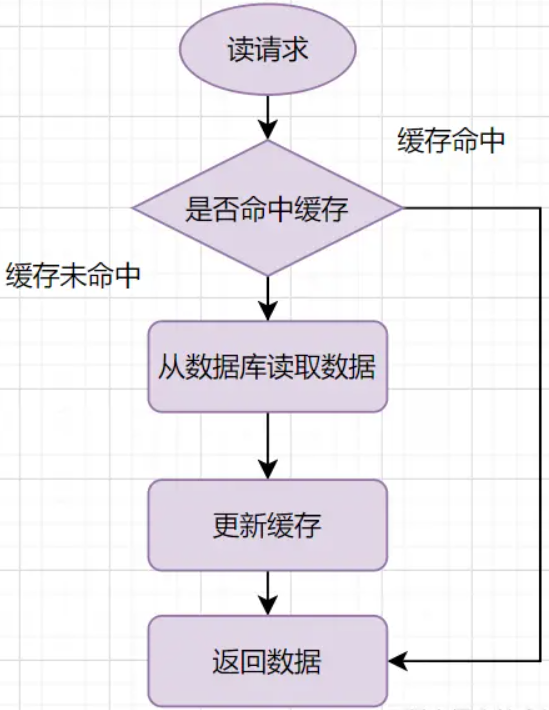

写流程：

更新的时候，先**更新数据库，然后再删除缓存**。

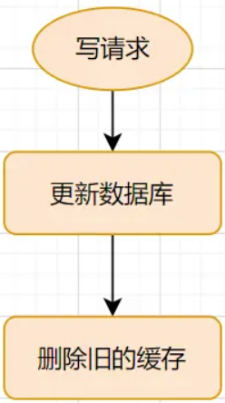

##### Read-Through/Write-Through（读写穿透）

**Read/Write Through**模式中，服务端把缓存作为主要数据存储。应用程序跟数据库缓存交互，都是通过**抽象缓存层**完成的。

**Read-Through**

简要流程：

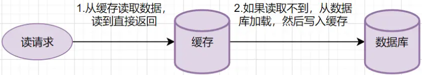

1. 从缓存读取数据，读到直接返回；
2. 如果读取不到的话，从数据库加载，写入缓存后，再返回响应。

其实**Read-Through**就是多了一层**`Cache-Provider`**，流程如下：

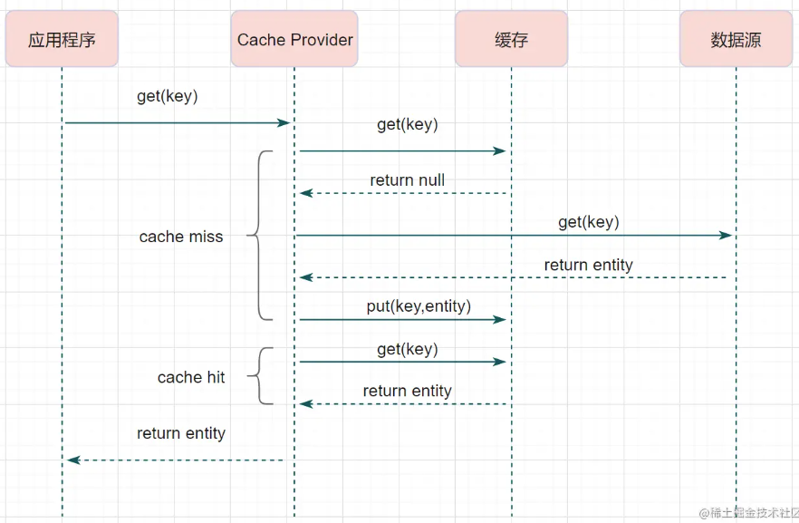

**Write-Through**

**Write-Through**模式下，当发生写请求时，也是由**缓存抽象层**完成数据源和缓存数据的更新,流程如下：

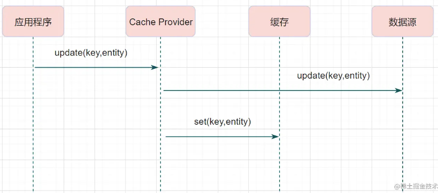

##### Write Behind（异步缓存写入）

**Write Behind**跟**Read-Through/Write-Through**有相似的地方，都是由`Cache Provider`来负责缓存和数据库的读写。它两又有个很大的不同：**Read/Write-Through是同步更新缓存和数据的，Write Behind则是只更新缓存，不直接更新数据库，通过批量异步的方式来更新数据库**。

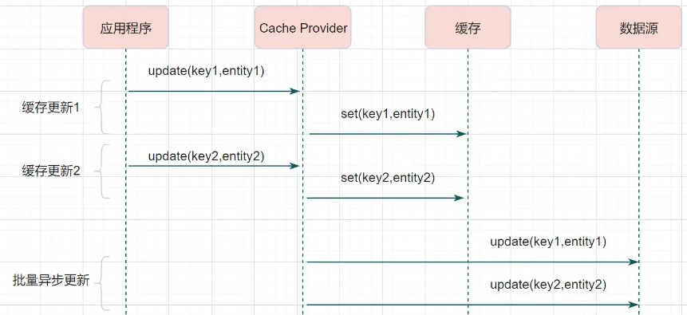

这种方式下，缓存和数据库的一致性不强，**对一致性要求高的系统要谨慎使用**。但是它适合频繁写的场景，MySQL的**InnoDB Buffer Pool机制**就使用到这种模式。

## 十一、过期删除策略:airplane:

> 参考链接：[腾讯云](https://cloud.tencent.com/developer/article/1643921)

### 11.1 3种过期删除策略

Redis的过期策略就是指当Redis中缓存的key过期了以后，Redis是如何处理的。通常有以下3种：

- **定时删除：**每个设置过期时间的key都需要创建一个定时器，到过期时间就会立即清除。**该策略可以立即清除过期的数据，对内存很友好；但是会占用大量的CPU资源去处理过期的数据，从而影响缓存的响应时间和吞吐量**。

- **惰性删除**：服务器不会主动删除数据，只有当访问一个key时，才会判断该key是否已过期，过期则清除。**该策略可以最大化地节省CPU资源，却对内存非常不友好**。极端情况可能出现大量的过期key没有再次被访问，从而不会被清除，占用大量内存。
- **定期删除**：每隔一定的时间，扫描一定数量的数据库的expires字典中一定数量的key，并清除其中已过期的key。**该策略是前两者的一个折中方案。通过调整定时扫描的时间间隔和每次扫描的限定耗时，可以在不同情况下使得CPU和内存资源达到最优的平衡效果**。

Redis中同时使用**惰性删除和定期删除**两种策略。

补充：在主从复制场景下，为了主从节点的数据一致性，**从节点不会主动删除数据，而是由主节点控制从节点中过期数据的删除**。由于主节点的惰性删除和定期删除策略，都不能保证主节点及时对过期数据执行删除操作，因此，当客户端通过Redis从节点读取数据时，很容易读取到已经过期的数据。Redis `v3.2`中，从节点在读取数据时，增加了对数据是否过期的判断：如果该数据已过期，则不返回给客户端；将Redis升级到3.2可以解决数据过期问题。

### 11.2 与缓存淘汰策略的联系

- **过键删除策略强调的是对过期键的操作**，如果有键过期了，而缓存还足够，不会使用缓存淘汰机制，这时也会使用过期键删除策略删除过期键。
- **缓存淘汰机制强调的是对内存的操作**，如果内存不够了，**即使有的键没有过期，也要删除一部分，同时也针对没有设置过期时间的键**。