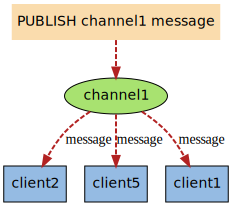

# 持久化

参考链接：[JavaGuide](https://javaguide.cn/database/redis/redis-questions-01.html#redis-%E6%8C%81%E4%B9%85%E5%8C%96%E6%9C%BA%E5%88%B6)、[博客园](https://www.cnblogs.com/ysocean/p/9114268.html)、[博客园](https://www.cnblogs.com/ysocean/p/9114267.html)、[CSDN](https://lansonli.blog.csdn.net/article/details/102648597)、[掘金](https://juejin.cn/post/6844904089722028045)、[Redis文档](https://redis.io/docs/manual/persistence/)

## 怎么保证 Redis 挂掉之后再重启数据可以进行恢复？

很多时候我们需要**持久化数据也就是将内存中的数据写入到硬盘**里面，大部分原因是为了之后重用数据（比如重启机器、机器故障之后恢复数据），或者是为了防止系统故障而将数据备份到一个远程位置。

Redis 不同于 Memcached 的很重要一点就是，Redis 支持持久化，而且支持两种不同的持久化操作。一种方式是**快照（Redis Database，RDB）**，另一种方式是**只追加文件（Append Only File，AOF）**。

## RDB

### 简介

RDB持久化方式能够在**指定的时间间隔能对你的数据进行快照存储**。

在默认情况下，Redis将数据库快照保存在名字为`dump.rdb`的二进制文件中。在Redis运行时，RDB将**当前内存中的数据库快照保存到磁盘文件**中，在Redis重启动时，RDB可以通过载入`.rdb`文件来还原数据库的状态。


当Redis需要保存`dump.rdb`文件时，服务器执行以下操作：

1. Redis调用`fork()`，同时拥有父进程和子进程。
2. 子进程将数据集写入到一个临时`.rdb`文件中。
3. 当子进程完成对新`.rdb`文件的写入时，Redis用新`.rdb`文件替换原来的`.rdb`文件。

这种工作方式使得Redis可以从**写时复制（copy-on-write）**机制中获益。

### 触发机制

#### `save`命令（同步机制）

`save`命令执行一个同步操作，以`.rdb`文件的方式保存所有数据的快照。

```shell
127.0.0.1:6379>save
OK
```


由于`save`命令是**同步命令**，会占用Redis的主进程。若Redis数据非常多时，`save`命令执行速度会非常慢，**阻塞**所有客户端的请求。因此很少在生产环境直接使用`save`命令，可以使用`bgsave`命令代替。如果在`bgsave`命令的保存数据的子进程发生错误，用`save`命令保存最新的数据是最后的手段。


#### `bgsave`命令（异步机制）

`bgsave`命令执行一个异步操作，以`.rdb`文件的方式保存所有数据的快照。

```sh
127.0.0.1:6379>bgsave
Background saving started
```

Redis使用Linux系统的`fork()`生成一个子进程来将数据保存到磁盘，主进程继续提供服务以供客户端调用。如果操作成功，可以通过客户端命令`LASTSAVE`来检查操作结果。


`save`和`bgsave`对比

|  命令  |     `save`     |               `bgsave`               |
| :----: | :------------: | :----------------------------------: |
| IO类型 |      同步      |                 异步                 |
|  阻塞  |       是       | 是（阻塞发生在`fork()`，通常非常快） |
| 复杂度 |      O(n)      |                 O(n)                 |
|  优点  | 不消耗额外内存 |           不阻塞客户端命令           |
|  缺点  | 阻塞客户端命令 |        需要`fork()`，消耗内存        |

#### 自动生成

Redis还提供了自动生成`.rdb`文件的方式。可以通过配置文件进行设置，让Redis在**“每N秒内至少有M个键改动”**这一条件满足时，自动进行数据集保存操作。

比如说，以下设置会让Redis在满足“每60秒内有至少有1000个键改动”这一条件满足时，自动进行数据集保存操作：

```
save 60 1000
```


其他相关配置：

```
dbfilename dump-<port>.rdb
dir /var/lib/redis
stop-writes-on-bgsave-error yes
rdbcompression yes
rdbchecksum yes
```

- `dbfilename`：设置快照的文件名，默认是`dump.rdb`。
- `dir`：设置快照文件的存放路径。默认是和当前配置文件保存在同一目录。
- `stop-writes-on-bgsave-error`：默认值为`yes`。当启用了RDB且最后一次后台保存数据失败，Redis是否停止接收数据。
- `rdbcompression`：默认值是`yes`。对于存储到磁盘中的快照，可以设置是否进行压缩存储。如果是的话Redis会采用**LZF**算法进行压缩。
- `rdbchecksum`：默认值是`yes`。在存储快照后，我们还可以让Redis使用**CRC64**算法来进行数据校验。

如果**只使用Redis的缓存功能，不需要持久化**，那么可以注释掉所有的`save`行或直接添加一个空字符串来实现停用：

```
save ""
```

#### 注意

执行`flushall`或退出Redis都会产生`.rdb`文件（前者产生的文件为空）。

### 恢复数据

将`.rdb`文件移动到**Redis安装目录**并启动服务即可，Redis会自动加载文件数据至内存。Redis 服务器在**载入`.rdb`文件期间会一直处于阻塞状态**，直到载入工作完成为止。

### 优缺点

#### 优点

- RDB是Redis数据库中一个**非常紧凑的单时间点文件**，它非常适用于备份，可以在发生数据灾难时轻松恢复不同版本的数据集。
- RDB非常适合**灾难恢复**，它是一个可以**传输到远程数据中心**的压缩文件。
- RDB最大限度地**提高了Redis的性能**，因为Redis父进程为了持久化而需要做的唯一工作就是**派生一个完成所有其余工作的子进程**。父进程永远**不会执行磁盘I/O或类似操作**。
- RDB恢复**大数据集时更快**（相比于AOF）。
- RDB在副本（Replicas）上支持**重启和故障转移后的部分重新同步**。

#### 缺点

- **不可控、丢失数据风险**：RDB**没有将数据丢失的可能性降到最低**。虽然可以配置多个时间保存点，但如果Redis由于没有正确关闭而直接停止工作，那么还是有可能丢失最新的数据。
- **耗时、耗性能**：RDB需要经常`fork()`以便使用子进程在磁盘上持久化。如果数据集很大，`fork()`可能会很耗时，并且性能较低的CPU可能还会导致Redis客户端停止几毫秒甚至一秒钟。AOF也需要`fork()`但频率较低，而且可以调整重写日志的频率。

## AOF

### 简介

从`v1.1`版本开始，Redis增加了一种完全耐久（durable）的持久化方式：AOF持久化。可以在配置文件中打开AOF方式：

```shell
appendonly yes
```

打开AOF后，每当Redis执行一个**改变数据集的命令**时（比如 `SET`），**这个命令就会被追加到AOF文件的末尾**。这样的话，当Redis重新启动时，程序就可以通过**重新执行AOF文件中的命令来达到重建数据集**的目的。

创建文件和恢复数据：


### 三种策略

可以通过配置参数`appendfsync`来设置Redis多久将数据`fsync()`到磁盘一次。（`fsync()`：Linux系统函数，只针对单个文件，可用于数据库这样的应用程序，这种应用程序需要确保将修改过的块立即写到磁盘上）

#### `always`

**每次有新命令追加到AOF文件时就执行一次**`fsync()` ，非常慢但也非常安全。


#### `everysec`

**每秒一次**`fsync()`：足够快（和RDB持久化差不多），在故障时只会丢失1秒钟的数据。**推荐（且默认）**的策略，可以同时兼顾速度和安全性。


#### `no`

从不`fsync` ：将数据**交给操作系统**来处理，由操作系统来决定什么时候同步数据，更快但更不安全。


#### 三种策略比较

|    策略    |       优点        |   缺点   |
| :--------: | :---------------: | :------: |
|  `always`  |    不丢失数据     | IO开销大 |
| `everysec` | 最多丢失1秒钟数据 |  同优点  |
|    `no`    |  由操作系统代管   |  不可控  |

### 重写

因为AOF的运作方式是不断地将命令追加到文件的末尾，所以随着写入命令的不断增加，AOF文件的体积也会变得越来越大。

举个例子，如果你对一个计数器调用了**100次**`INCR`，那么仅仅是为了保存这个计数器的当前值，AOF文件就需要使用**100条记录**（entry）。然而在实际上，只使用**1条`SET`命令**已经足以保存计数器的当前值了，其余99条记录实际上都是多余的。

为了处理这种情况，Redis支持一种有趣的特性：可以在不打断服务客户端的情况下，对AOF文件进行**重建（rebuild）**。

每当执行`bgrewriteaof`命令，Redis将写最短的命令序列在**内存中重建当前数据集**。`v2.2`需要自己手动执行`bgrewriteaof`命令；`v2.4`则可以通过配置自动触发AOF重写。


也就是说AOF文件重写**并不是对原文件进行重新整理**，而是**直接读取服务器现有的键值对**，然后用**一条命令去代替之前记录这个键值对的多条命令**，生成一个新的文件后去替换原来的AOF文件。

了解：**从`v7.0.0`开始**，在调度AOF重写时，Redis父进程会打开一个新的增量AOF文件继续写入。子进程执行重写逻辑并生成新的基础AOF。Redis将使用一个临时清单文件来跟踪新生成的基础文件和增量文件。当它们准备好后，Redis会执行原子替换操作，使这个临时清单文件生效。为了避免在AOF重写重复失败和重试的情况下创建大量增量文件的问题，Redis引入了AOF重写限制机制，以确保失败的AOF重写以越来越慢的速度重试。

#### 作用

- **减少磁盘占用量**
- **加速数据恢复**

#### 实现方式

- `bgrewriteaof`

  `bgrewriteaof`命令用于**异步执行**一个AOF文件重写操作，会创建一个当前AOF文件的体积优化版本。即使`bgrewriteaof`执行失败，也不会有任何数据丢失，因为旧的AOF文件在 `bgrewriteaof`成功之前不会被修改。`bgrewriteaof`仅仅用于手动触发重写操作。

  如果正在执行的AOF重写返回一个错误，AOF重写将会在**稍后一点的时间重新调用**。

  

- 重写配置

  |            配置名             |              含义               |
  | :---------------------------: | :-----------------------------: |
  |  `auto-aof-rewrite-min-size`  |    触发AOF文件重写的最小尺寸    |
  | `auto-aof-rewrite-percentage` | 触发AOF文件执行重写的最小增长率 |

  |      统计名      |                 含义                  |
  | :--------------: | :-----------------------------------: |
  | aof_current_size |        AOF文件当前尺寸（字节）        |
  |  aof_base_size   | AOF文件上次启动和重写时的尺寸（字节） |

  AOF重写自动触发机制**需要同时满足**下面两个条件：

  1. aof_current_size > `auto-aof-rewrite-min-size`
  2. (aof_current_size - aof_base_size) / aof_base_size \* 100 > `auto-aof-rewrite-percentage`

#### 流程


### 相关配置

```shell
# 开启AOF持久化方式
appendonly yes
# AOF持久化文件名
appendfilename appendonly-<port>.aof
# 每秒把缓冲区的数据同步到磁盘
appendfsync everysec
# 数据持久化文件存储目录
dir /var/lib/redis
# 是否在执行重写时不同步数据到AOF文件
# 这里的 yes，就是执行重写时不同步数据到AOF文件
no-appendfsync-on-rewrite yes
# 触发AOF文件执行重写的最小尺寸
auto-aof-rewrite-min-size 64mb
# 触发AOF文件执行重写的增长率
auto-aof-rewrite-percentage 100
```

### 优缺点

#### 优点

- AOF使得Redis**更具持久性**：可以有3种不同的`fsync`策略。即使使用默认策略`everysec`，写入性能仍然很棒。`fsync`是使用**后台线程执行**的，当没有`fsync`正在进行时，主线程将努力执行写入，因此最多只会丢失一秒钟的数据。
- AOF日志是一个**只进行追加**的日志，因此**不会出现寻道（seek）问题**，也不会在断电时出现损坏问题。即使由于某种原因（磁盘已满或其他原因）日志未执行完整的命令而结束，`redis-check-aof`工具也能够轻松修复它。
- 当AOF变得太大时，Redis能够在后台**自动重写**AOF。重写是**完全安全**的，因为当Redis继续附加到旧文件时，会使用**创建当前数据集所需的最少操作集**生成一个全新的文件，一旦新文件准备就绪，Redis就会从“旧”切换到“新”，开始附加到新文件上。
- AOF以**易于理解和解析的格式**依次包含所有操作的日志，甚至可以轻松导出AOF文件。例如，即使不小心使用`FLUSHALL`命令刷新了所有内容，只要在此期间没有执行日志重写，仍然可以**通过停止服务器、删除最新命令（即`FLUSHALL`）并重新启动Redis**来恢复数据集。

#### 缺点

- AOF文件通常比相同数据集的等效`.rdb`文件**大**。
- 根据所使用的`fsync`策略，AOF可能比RDB**慢**。 一般来说，将`fsync`设置为**`everysec`时性能仍然非常高**，而在禁用`fsync`的情况下，**即使在高负载下也应该与RDB一样快**。不过在处理巨大写入负载时，RDB仍然能够提供提供更有保证的最大延迟时间（maximum latency latency）。

## 持久化的抉择

### RDB和AOF对比

|            |    RDB     |     AOF      |
| :--------: | :--------: | :----------: |
| 启动优先级 |     低     |      高      |
|    体积    |     小     |      大      |
|  恢复速度  |     快     |      慢      |
| 数据安全性 | 可能丢数据 | 根据策略决定 |

### 如何选择？

一般来说， 如果想达到足以媲美 PostgreSQL 的数据安全性， 你应该同时使用两种持久化功能。

如果你可以承受数分钟以内的数据丢失，那么可以只使用RDB持久化；否则就使用AOF重写。但是一般情况下建议不要单独使用某一种持久化机制，而是应该两种一起用（可以达到媲美PostgreSQL的数据安全性）。

## 混合持久化

在Redis `v4.0`之后，新增了**RDB-AOF混合持久化**方式。这种方式结合了RDB和AOF的优点，既能快速加载又能避免丢失过多的数据。具体配置为：

```shell
# yes为开启，no为禁用
aof-use-rdb-preamble yes
```

当开启混合持久化时，主进程先`fork`出**子进程**将现有**内存副本全量以RDB方式写入AOF文件开头**，然后再将缓冲区中的**增量命令以AOF方式写入AOF文件中末尾**，写入完成后通知主进程更新相关信息，并将新的含有RDB和AOF两种格式的**AOF新文件替换旧文件**。

简单来说：混合持久化方式产生的文件一部分是RDB格式，一部分是AOF格式。

### 优缺点

#### 优点

混合持久化**结合了RDB和AOF持久化的优点**，开头为RDB的格式，使得Redis可以更快启动；同时又降低了大量数据丢失的风险。

#### 缺点

AOF文件中添加了RDB格式的内容，会使得AOF文件可读性变差；并且如果开启混合持久化，就必须使用Redis `v4.0` 及之后版本。

# 发布/订阅

参考链接：[Java全栈知识体系](https://pdai.tech/md/db/nosql-redis/db-redis-x-pub-sub.html)、[Redis命令参考](http://redisdoc.com/pubsub/index.html)

## 简介

Redis发布订阅（pub/sub）是一种**消息通信模式**：发送者（pub）发送消息，订阅者（sub）接收消息。

Redis的`SUBSCRIBE`命令可以让**客户端订阅任意数量的频道**，每当有新信息发送到被订阅的频道时，信息就会被**发送给所有订阅指定频道的客户端**。




当有新消息通过`PUBLISH`命令发送给channel 1时， 这个消息就会被发送给订阅它的三个客户端。

## 使用方式

Redis有两种发布/订阅模式：基于频道（Channel）的发布/订阅、基于模式（Pattern）的发布/订阅。

### 基于频道的发布/订阅

"发布/订阅"模式包含两种角色，分别是**发布者和订阅者**。发布者可以向指定的频道（channel）发送消息；订阅者可以订阅一个或者多个频道，所有订阅此频道的订阅者都会收到此消息。


#### 发布者发布消息

发布者发布消息的命令是`publish`，用法是`publish channel message`：

```shell
127.0.0.1:6379> publish channel:1 hi
(integer) 1
```

**返回值表示接收这条消息的订阅者数量**。发出去的消息不会被持久化，即客户端**只有在订阅频道后**才能接收到后续发布到该频道的消息，之前的就接收不到了。

#### 订阅者订阅频道

订阅频道的命令是`subscribe`，可以同时订阅多个频道，用法是`subscribe channel1 [channel2 ...]`：

例如新开一个客户端订阅上面频道（不会收到消息，因为不会收到订阅之前就发布到该频道的消息）：

```shell
127.0.0.1:6379> subscribe channel:1
```

注意：处于此**订阅状态**下客户端不能使用除`subscribe`、`unsubscribe`、`psubscribe`和`punsubscribe`这四个属于"发布/订阅"之外的命令，否则会报错。

进入订阅状态后客户端可能收到**3种类型的回复**。每种类型的回复都包含**3个值**，第一个值是消息的类型，根据消息类型的不同，第二个和第三个参数的含义可能不同。消息类型的取值可能是以下3个:

- **subscribe**：表示订阅成功的反馈信息。第二个值是订阅成功的**频道名称**，第三个是**当前客户端订阅的频道数量**。

- **message**“：表示接收到的是消息，第二个值表示**产生消息的频道名称**，第三个值是消息的**内容**。
- **unsubscribe**：表示成功取消订阅某个频道。第二个值是对应的**频道名称**，第三个值是**当前客户端订阅的频道数量**，当此**值为0时客户端会退出订阅状态**，之后就可以执行其他非"发布/订阅"模式的命令了。

### 基于模式的发布/订阅

如果有**某个/某些模式和这个频道匹配**的话，那么**所有订阅这个/这些频道的客户端也同样会收到信息**。

#### 图例解释

下图展示了一个带有频道和模式的例子， 其中`tweet.shop.*`模式匹配了`tweet.shop.kindle`频道和`tweet.shop.ipad`频道，并且有不同的客户端分别订阅它们三个：


当有信息发送到`tweet.shop.kindle`频道时，信息除了发送给client X和client Y之外，还会发送给订阅`tweet.shop.*`模式的client 123和client 256：


另一方面，如果接收到信息的是频道`tweet.shop.ipad`，那么client 123和client 256同样会收到信息：


#### 例子

```shell
# 订阅 news.* 和 tweet.* 两个模式

# 第 1 - 6 行是执行 psubscribe 之后的反馈信息
# 第 7 - 10 才是接收到的第一条信息
# 第 11 - 14 是第二条
# 以此类推。。。

redis> psubscribe news.* tweet.*
Reading messages... (press Ctrl-C to quit)
1) "psubscribe"                  # 返回值的类型：显示订阅成功
2) "news.*"                      # 订阅的模式
3) (integer) 1                   # 目前已订阅的模式的数量

1) "psubscribe"
2) "tweet.*"
3) (integer) 2

1) "pmessage"                    # 返回值的类型：信息
2) "news.*"                      # 信息匹配的模式
3) "news.it"                     # 信息本身的目标频道
4) "Google buy Motorola"         # 信息的内容

1) "pmessage"
2) "tweet.*"
3) "tweet.huangz"
4) "hello"

1) "pmessage"
2) "tweet.*"
3) "tweet.joe"
4) "@huangz morning"

1) "pmessage"
2) "news.*"
3) "news.life"
4) "An apple a day, keep doctors away"
```

注意点：

- 使用`psubscribe`命令可以**重复订阅同一个频道**，如客户端执行了`psubscribe c? c?*`，这时向c1发布消息客户端会接受到**两条消息**，而同时`publish`命令的返回值**是2而不是1**。同样的，如果有另一个客户端执行了`subscribe c1` 和`psubscribe c?*`的话，向c1发送一条消息该客户端也会收到到**2条消息（但是是两种类型：`message`和`pmessage`）**，同时`publish`命令也**返回2**。
- `punsubscribe`命令可以**退订指定的规则**，用法是：`punsubscribe [pattern [pattern ...]]`，如果没有参数则会退订所有规则。
- 使用`punsubscribe`只能退订通过`psubscribe`命令订阅的规则，不会影响直接通过`subscribe`命令订阅的频道；同样的，`unsubscribe`命令也不会影响通过`psubscribe`命令订阅的规则。另外需要注意`punsubscribe`命令退订某个规则时不会将其中的通配符展开，而是进行严格的字符串匹配，所以`punsubscribe *` 无法退订`c*`规则，而是必须使用`punsubscribe c*`才可以退订。

# 分布式锁

参考链接：[]()

# 常见数据类型及底层数据结构

参考链接：[]()

按照师兄笔记结构，参考笔记中的链接和JavaGuide

