# Redis

## 一、Redis概念和基础:boat:

### 1.1 什么是Redis？

> 参考链接：[Java全栈知识体系](https://pdai.tech/md/db/nosql-redis/db-redis-introduce.html#%E4%BB%80%E4%B9%88%E6%98%AFredis)

Redis是一款**内存高速缓存数据库**，全称为：**Remote Dictionary Server**（远程数据服务），使用**C语言编写**，是一个**Key-Value**存储系统（键值对存储系统），支持丰富的数据类型，如：`String`、`List`、`Set`、`Zset`、`Hash`。

### 1.2 为什么要用Redis？

> 参考链接：[Java全栈知识体系](https://pdai.tech/md/db/nosql-redis/db-redis-introduce.html#%E4%B8%BA%E4%BB%80%E4%B9%88%E8%A6%81%E4%BD%BF%E7%94%A8redis)

- 读写性能优异。
- 数据类型丰富。
- 操作原子性。
- 持久化。
- 发布/订阅。
- 分布式。

### 1.3 Redis的使用场景

> 参考链接：[Java全栈知识体系](https://pdai.tech/md/db/nosql-redis/db-redis-introduce.html#redis%E7%9A%84%E4%BD%BF%E7%94%A8%E5%9C%BA%E6%99%AF)

- 热点数据缓存。
- 分布式锁。
- 消息队列：`list`数据结构可以作为一个简单的队列使用，Redis 5.0新增的`Stream`更加适合做消息队列。

### 1.4 与Memcached的比较

> 参考链接：[JavaGuide](https://javaguide.cn/database/redis/redis-questions-01.html#%E8%AF%B4%E4%B8%80%E4%B8%8B-redis-%E5%92%8C-memcached-%E7%9A%84%E5%8C%BA%E5%88%AB%E5%92%8C%E5%85%B1%E5%90%8C%E7%82%B9)
>

#### 共同点

- 都是**基于内存**的数据库，一般都用来当做缓存使用。
- 都有**过期策略**。
- 两者的**性能都非常高**。

#### 区别

- **Redis支持更丰富的数据类型（支持更复杂的应用场景）**，不仅仅支持简单的Key-Value类型数据，同时还提供`List`、`Set`、`Zset`、`Hash`等数据类型的存储；Memcached只支持最简单的Key-Value数据类型。
- **Redis支持数据的持久化**，它可以将内存中的数据保持在磁盘中，重启的时候可以再次加载进行使用；Memcached把数据全部存在内存之中。
- Redis在服务器内存使用完之后，可以将不用的数据放到磁盘上；但是**Memcached在服务器内存使用完之后，就会直接报异常**。
- **Redis支持原生Cluster模式**；Memcached**没有原生的集群模式**，需要依靠客户端来实现往集群中分片写入数据。
- Redis使用**单线程的多路I/O复用**模型（Redis 6.0引入了多线程I/O）；Memcached是**多线程、非阻塞I/O复用**的网络模型。
- Redis支持**发布/订阅模型、Lua脚本**等功能。
- Redis**同时使用了惰性删除与定期删除**的过期删除策略；Memcached过期数据的**删除策略只用了惰性删除**。

## 二、数据结构:rocket:

### 2.1 5种基础数据类型

> 参考链接：[Java全栈知识体系](https://pdai.tech/md/db/nosql-redis/db-redis-data-types.html)、[JavaGuide](https://javaguide.cn/database/redis/redis-data-structures-01.html)

Redis中所有的**Key（键）都是字符串**，所以数据类型是指**存储值的数据类型**，主要包括常见的5种基础数据类型，分别是：`String`、`List`、`Set`、`Zset`、`Hash`。


|       类型       |                    存储的值                    |                           读写能力                           |
| :--------------: | :--------------------------------------------: | :----------------------------------------------------------: |
| String<br>字符串 |              字符串、整数或浮点数              | 对整个字符串或字符串的一部分进行操作；对整数或浮点数进行自增或自减操作 |
|   List<br>列表   | 一个链表，链表上的**每个结点都包含一个字符串** | 对链表的两端进行`push`和`pop`操作，读取单个或多个元素；根据值查找或删除元素 |
|   Set<br>集合    |            包含**字符串的无序集合**            | 字符串的集合，包含基础的方法有添加、获取、删除；还包含计算交集、并集、差集等 |
|   Hash<br>散列   |           包含**键值对的无序散列表**           |              包含方法有添加、获取、删除单个元素              |
| Zset<br>有序集合 |         和散列一样，**用于存储键值对**         | 字符串成员与浮点数分数之间的有序映射；**元素的排列顺序由分数的大小决定**；包含方法有添加、获取、删除单个元素以及根据分值范围或成员来获取元素 |

#### `String`字符串

`String`是Redis中最基本的数据类型。`String`类型是**二进制安全**（由于统计变量`len`，读写字符串时不依赖`“\0”`终止符）的，意思是Redis的`String`可以包含任何数据，如数字、字符串、图片或者序列化的对象。

##### 图例


##### 命令

|   命令   |            简述             |        使用         |
| :------: | :-------------------------: | :-----------------: |
|  `GET`   |   获取存储在给定键中的值    |      `GET key`      |
|  `SET`   |   设置存储在给定键中的值    |   `SET key value`   |
| `SETNX`  | 只有在`key`不存在时设置其值 |  `SETNX key value`  |
|  `DEL`   |   删除存储在给定键中的值    |      `DEL key`      |
|  `INCR`  |       将键存储的值加1       |     `INCR key`      |
|  `DECR`  |       将键存储的值减1       |     `DECR key`      |
| `INCRBY` |    将键存储的值加上整数     | `INCRBY key amount` |
| `DECRBY` |    将键存储的值减去整数     | `DECRBY key amount` |

**执行示例**：

```bash
127.0.0.1:6379> set hello world
OK
127.0.0.1:6379> get hello
"world"
127.0.0.1:6379> del hello
(integer) 1
127.0.0.1:6379> get hello
(nil)
127.0.0.1:6379> set counter 2
OK
127.0.0.1:6379> get counter
"2"
127.0.0.1:6379> incr counter
(integer) 3
127.0.0.1:6379> get counter
"3"
127.0.0.1:6379> incrby counter 100
(integer) 103
127.0.0.1:6379> get counter
"103"
127.0.0.1:6379> decr counter
(integer) 102
127.0.0.1:6379> get counter
"102"
```

#### `List`列表

Redis中的`List`其实就是**链表（Redis使用双端链表实现`List`）**。使用`List`结构可以轻松实现**最新消息排队功能**（比如新浪微博的TimeLine）。`List`的另一个应用就是**消息队列**，可以利用`List`的`PUSH`操作，将任务存放在`List`中，然后工作线程再用`POP`操作将任务取出执行。

##### 图例


##### 命令

|   命令   |                     简述                     |           使用            |
| :------: | :------------------------------------------: | :-----------------------: |
| `RPUSH`  |      将给定值（可以多个）推入到列表右端      | `RPUSH key value1 value2` |
| `LPUSH`  |      将给定值（可以多个）推入到列表左端      | `LPUSH key value1 value2` |
|  `RPOP`  |   从列表的右端弹出一个值，并返回被弹出的值   |        `RPOP key`         |
|  `LPOP`  |   从列表的左端弹出一个值，并返回被弹出的值   |        `LPOP key`         |
| `LRANGE` |         获取列表在给定范围上的所有值         |  `LRANGE key start end`   |
| `LINDEX` | 通过索引获取列表中的元素，也可以使用负数下标 |    `LINDEX key index`     |
|  `LSET`  |       将列表`index`位置的值设为`value`       |  `LSET key index value`   |

补充：使用技巧：
- `lpush`+`lpop`=栈
- `lpush`+`rpop`=队列
- `lpush`+`ltrim`=有限集合
- `lpush`+`brpop`（`rpop`的阻塞版本）=消息队列

**执行示例**：

```bash
127.0.0.1:6379> lpush mylist 1 2 ll ls mem
(integer) 5
127.0.0.1:6379> lrange mylist 0 -1
1) "mem"
2) "ls"
3) "ll"
4) "2"
5) "1"
127.0.0.1:6379> lindex mylist -1
"1"
127.0.0.1:6379> lindex mylist 10        # index不在 mylist 的区间范围内
(nil)
```

#### `Set`集合

Redis中的`Set`是`String`类型的**无序**集合。集合成员是唯一的，这就意味着集合中**不能出现重复的数据**。Redis中集合是通过**哈希表**实现的，所以添加、删除、查找的复杂度都是O(1)。

##### 图例


##### 命令

|    命令     |                 简述                  |            使用            |
| :---------: | :-----------------------------------: | :------------------------: |
|   `SADD`    |       向集合添加一个或多个成员        | `SADD key member1 member2` |
|   `SCARD`   |           获取集合的成员数            |        `SCARD key`         |
| `SMEMBERS`  |         返回集合中的所有成员          |       `SMEMBERS key`       |
| `SISMEMBER` | 判断`member`元素是否是集合`key`的成员 |   `SISMEMBER key member`   |

**执行示例**：

```bash
127.0.0.1:6379> sadd myset hao hao1 xiaohao hao
(integer) 3
127.0.0.1:6379> smembers myset
1) "xiaohao"
2) "hao1"
3) "hao"
127.0.0.1:6379> sismember myset hao
(integer) 1
```

#### `Hash`散列

Redis中的`Hash`是一个**String类型的field（字段）和value（值）的映射表**，`Hash`特别适合用于存储对象。

##### 图例


##### 命令

|   命令    |             简述             |           使用           |
| :-------: | :--------------------------: | :----------------------: |
|  `HSET`   | 设置指定哈希表中指定字段的值 |  `HSET key field value`  |
|  `HGET`   | 获取指定哈希表中指定字段的值 |     `HGET key field`     |
| `HGETALL` | 获取指定哈希表中所有的键值对 |      `HGETALL key`       |
|  `HDEL`   |   删除一个或多个哈希表字段   | `HDEL key filed1 field2` |

**执行示例**：

```bash
127.0.0.1:6379> hset user name1 hao
(integer) 1
127.0.0.1:6379> hset user email1 hao@163.com
(integer) 1
127.0.0.1:6379> hgetall user
1) "name1"
2) "hao"
3) "email1"
4) "hao@163.com"
127.0.0.1:6379> hget user user
(nil)
127.0.0.1:6379> hget user name1
"hao"
127.0.0.1:6379> hset user name2 xiaohao
(integer) 1
127.0.0.1:6379> hset user email2 xiaohao@163.com
(integer) 1
127.0.0.1:6379> hgetall user
1) "name1"
2) "hao"
3) "email1"
4) "hao@163.com"
5) "name2"
6) "xiaohao"
7) "email2"
8) "xiaohao@163.com"
```

#### `Zset`有序集合

Redis中的`Zset`和`Set`一样也是`String`类型元素的集合，且**不允许出现重复成员**。不同的是每个元素都会关联一个`double`类型的分数。Redis正是通过分数来为集合中的成员进行**从小到大的排序**。

`Zset`的成员是唯一的，但分数却可以重复。`Zset`是通过两种数据结构实现的：

- **压缩列表（ZipList）**：`Ziplist`是为了提高存储效率而设计的**一种特殊编码的双向链表**。它可以存储**字符串或者整数**，存储整数时是采用**整数的二进制**而不是字符串形式存储。它能在O(n)的时间复杂度下完成对两端的`push`和`pop`操作，但是因为每次操作都需要重新分配`Ziplist`的内存，所以实际复杂度和`Ziplist`的内存使用量相关。
- **跳跃表（ZSkipList）**：跳跃表的性能可以保证在查找、删除、添加等操作的时候在**对数期望时间内**完成，这个性能是可以和平衡树来相比较的，而且在实现方面比平衡树要优雅，这是采用跳跃表的主要原因。跳跃表的复杂度是O(log(n))。

##### 图例


##### 命令

|   命令   |                           用法                           |                   描述                   |
| :------: | :------------------------------------------------------: | :--------------------------------------: |
|  `ZADD`  |             向指定有序集合添加一个或多个元素             | `ZADD key score1 member1 score2 member2` |
| `ZRANGE` | 获取指定有序集合`start`和`end`之间的元素（分数从低到高） |          `ZRANGE key start end`          |
|  `ZREM`  |              移除有序集合中的一个或多个成员              |        `ZREM key member1 member2`        |

**执行示例**：

```bash
127.0.0.1:6379> zadd myscoreset 100 hao 90 xiaohao
(integer) 2
127.0.0.1:6379> ZRANGE myscoreset 0 -1
1) "xiaohao"
2) "hao"
127.0.0.1:6379> ZSCORE myscoreset hao
"100"
```

### 2.2 3种特殊数据类型:boat:

> 参考链接：[Java全栈知识体系](https://pdai.tech/md/db/nosql-redis/db-redis-data-type-special.html)

Redis除了上述5种基础数据类型外，还有3种特殊的数据类型，分别是`HyperLogLog`（基数统计），`Bitmaps`（位图）和`geospatial`（地理位置）。

#### `HyperLogLog`（基数统计）

Redis 2.8.9版本更新了`Hyperloglog`数据结构。

##### 什么是基数？

举个例子，A={1, 2, 3, 4, 5}，B={3, 5, 6, 7, 9}；那么基数（不重复的元素）=1, 2, 4, 6, 7, 9（允许容错，即可以接受一定误差）

##### 用来解决什么问题？

这个结构可以非常省内存的去**统计各种计数**，比如注册IP数、每日访问IP数、页面实时UV、在线用户数、共同好友数等。

##### 它的优势体现在哪？

一个大型的网站，每天IP比如有100万，粗算一个IP消耗15字节，那么100万个IP就是15M。而HyperLogLog在Redis中每个键占用的内容都是12K，理论存储近似接近2^64个值，不管存储的内容是什么，它是一个基于基数估算的算法，能**比较准确的估算出基数，可以使用少量固定的内存去存储并识别集合中的唯一元素**。虽然这个估算的基数并不一定准确，是一个带有0.81%标准错误的近似值（但对于可以接受一定容错的业务场景，比如IP数统计、UV等，是可以忽略不计的）。

##### 命令使用

```bash
127.0.0.1:6379> pfadd key1 a b c d e f g h i	# 创建第一组元素
(integer) 1
127.0.0.1:6379> pfcount key1					# 统计元素的基数数量
(integer) 9
127.0.0.1:6379> pfadd key2 c j k l m e g a		# 创建第二组元素
(integer) 1
127.0.0.1:6379> pfcount key2
(integer) 8
127.0.0.1:6379> pfmerge key3 key1 key2			# 合并两组：key1 key2 -> key3 并集
OK
127.0.0.1:6379> pfcount key3
(integer) 13
```

#### `Bitmap`（位存储）

`Bitmap`即位图数据结构，是操作二进制位来进行记录，只有**0和1两个状态**。

##### 用来解决什么问题？

统计用户信息：活跃|不活跃、 登录|未登录、 打卡|不打卡。类似这种包含**两个状态的，都可以使用`Bitmaps`**。

##### 命令使用

1. 使用`bitmap`来记录周一到周日的打卡

   周一：1、周二：0、周三：0、周四：1......

   ```bash
   127.0.0.1:6379> setbit sign 0 1
   (integer) 0
   127.0.0.1:6379> setbit sign 1 1
   (integer) 0
   127.0.0.1:6379> setbit sign 2 0
   (integer) 0
   127.0.0.1:6379> setbit sign 3 1
   (integer) 0
   127.0.0.1:6379> setbit sign 4 0
   (integer) 0
   127.0.0.1:6379> setbit sign 5 0
   (integer) 0
   127.0.0.1:6379> setbit sign 6 1
   (integer) 0
   ```

2. 查看某一天是否有打卡：

   ```bash
   127.0.0.1:6379> getbit sign 3
   (integer) 1
   127.0.0.1:6379> getbit sign 5
   (integer) 0
   ```

3. 统计打卡的天数：

   ```bash
   127.0.0.1:6379> bitcount sign # 统计这周的打卡记录，就可以看到是否有全勤！
   (integer) 3
   ```

#### `Geospatial`（地理位置）

Redis的`Geospatial`在Redis 3.2版本就推出了。这个功能可以推算地理位置的信息：两地之间的距离、方圆几里的人等。

### 2.3 Redis 5.0新数据结构:rainbow:

> 参考链接：[Java全栈知识体系](https://pdai.tech/md/db/nosql-redis/db-redis-data-type-stream.html)

Redis的作者在5.0版本中放出一个新的数据结构——`Stream`。`Stream`的内部其实也是一个队列，**每一个不同的Key，对应的是不同的队列，队列中每个元素（也就是消息）都有一个`msgid`，并且需要保证`msgid`是严格递增的**。

在`Stream`当中，消息是默认持久化的，即便是Redis重启，也能够读取到消息。那么，`Stream`是如何做到多播的呢？其实非常简单，与其他队列系统相似，Redis对不同的消费者，可以消费同一个消息；对于不同的消费组，都维护一个`Idx`下标，表示这一个消费群组消费到了哪里，每次进行消费，都会更新一下这个下标，往后面一位进行偏移。

### 2.4 对象机制详解:airplane:

> 参考链接：[Java全栈知识体系](https://pdai.tech/md/db/nosql-redis/db-redis-x-redis-object.html)

#### 引入

Redis的**每种对象**其实都由**对象结构（redisObject）**与**对应编码的底层数据结构**组合而成，而**每种对象类型对应若干编码方式，不同的编码方式所对应的底层数据结构是不同的**。所以需要从几个角度来着手底层研究：

- **对象设计机制**：对象结构（redisObject）。
- **编码类型和底层数据结构**：对应编码的数据结构。

#### 为什么Redis会设计`redisObject`？

在Redis的命令中，用于对键进行处理的命令占了很大一部分，而对于键所保存的**值类型的命令又各不相同**。如：`LPUSH`和`LLEN`只能用于列表键，而`SADD`和`SRANDMEMBER`只能用于集合键；另外一些命令，比如`DEL`、`TTL`和`TYPE`可以用于任何类型的键。**要正确实现这些命令，必须为不同类型的键设置不同的处理方式**，例如：删除一个列表键和删除一个字符串键的操作过程就不太一样。以上的描述说明，**Redis必须让每个键都带有类型信息，使得程序可以检查键的类型，并为它选择合适的处理方式**。

进一步地，例如集合类型就可以由字典和整数集合两种不同的数据结构实现。但是当用户执行`ZADD`命令时，用户不必关心集合使用的是什么编码，只要Redis能按照`ZADD`命令的指示将新元素添加到集合就可以了。这又说明：**操作数据类型的命令除了要对键的类型进行检查之外，还需要根据数据类型的不同编码进行多态处理**。

为了解决以上问题，**Redis构建了自己的类型系统**，这个系统的主要功能包括：

- `redisObject`对象。
- 基于`redisObject`对象的类型检查。
- 基于`redisObject`对象的显式多态函数。
- 对`redisObject`进行分配、共享和销毁的机制。

总结：Redis使用自己实现的对象机制（`redisObject`）来实现**类型判断**、**命令多态**和**基于引用次数的对象销毁（垃圾回收）**。

#### `redisObject`数据结构

`redisObject`是Redis类型系统的核心，数据库中的**每个键、值以及Redis本身处理的参数**都表示为这种数据类型。

```c
/*
 * Redis 对象
 */
typedef struct redisObject {
    // 类型
    unsigned type:4;
    // 编码方式
    unsigned encoding:4;
    // LRU - 24位, 记录最末一次访问时间（相对于lru_clock）; 或者 LFU（最少使用的数据：8位频率，16位访问时间）
    unsigned lru:LRU_BITS; // LRU_BITS: 24
    // 引用计数
    int refcount;
    // 指向底层数据结构实例
    void *ptr;
} robj;
```

下图对应上面的结构：

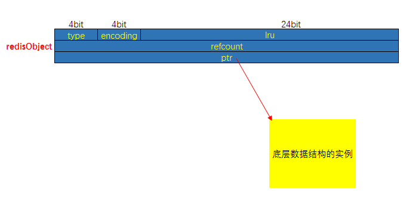

**其中`type`、`encoding`和`ptr`是最重要的三个属性**：

- `type`记录了对象所保存的值的类型，它的值可能是以下常量中的一个：

  ```c
  /*
  * 对象类型
  */
  #define OBJ_STRING 0 // 字符串
  #define OBJ_LIST 1 // 列表
  #define OBJ_SET 2 // 集合
  #define OBJ_ZSET 3 // 有序集
  #define OBJ_HASH 4 // 哈希表
  ```

- `encoding`记录了对象所保存的值的编码，它的值可能是以下常量中的一个：

  ```c
  /*
  * 对象编码
  */
  #define OBJ_ENCODING_RAW 0     /* Raw representation */
  #define OBJ_ENCODING_INT 1     /* Encoded as integer */
  #define OBJ_ENCODING_HT 2      /* Encoded as hash table */
  #define OBJ_ENCODING_ZIPMAP 3  /* 注意：版本2.6后不再使用. */
  #define OBJ_ENCODING_LINKEDLIST 4 /* 注意：不再使用了，旧版本2.x中String的底层之一. */
  #define OBJ_ENCODING_ZIPLIST 5 /* Encoded as ziplist */
  #define OBJ_ENCODING_INTSET 6  /* Encoded as intset */
  #define OBJ_ENCODING_SKIPLIST 7  /* Encoded as skiplist */
  #define OBJ_ENCODING_EMBSTR 8  /* Embedded sds string encoding */
  #define OBJ_ENCODING_QUICKLIST 9 /* Encoded as linked list of ziplists */
  #define OBJ_ENCODING_STREAM 10 /* Encoded as a radix tree of listpacks */
  ```

- `ptr`是一个指针，**指向实际保存值的数据结构**，这个数据结构由`type`和`encoding`属性决定。例如：如果一个`redisObject`的`type`属性为`OBJ_LIST`，`encoding`属性为`OBJ_ENCODING_QUICKLIST`，那么这个对象就是一个**列表（List)**，它的值保存在一个`QuickList`的数据结构内，而`ptr`指针就指向`QuickList`。

- `lru`：记录了该对象最后一次被命令程序访问的时间。

- `refcount`：记录了该对象的引用计数。

#### 命令的类型检查和多态处理

**当执行一个处理数据类型命令的时候，Redis执行以下步骤**：

1. 根据给定的`Key`，在数据库字典中查找与之相对应的`redisObject`，如果没找到就返回`NULL`；
2. 检查`redisObject`的`type`属性和执行命令所需的类型是否相符，如果不相符返回类型错误；
3. 根据`redisObject`的`encoding`属性指定的编码，选择合适的操作函数来处理底层的数据结构；
4. 返回数据结构的操作结果作为命令的返回值。

例如执行`LPOP`命令，流程图如下：


#### 对象共享（字符串）:boat:

Redis一般会把一些常见的值放到一个共享对象中，这样可使程序避免了重复分配的麻烦，也节约了一些CPU时间。

**Redis预分配的值对象如下**：

- 各种命令的返回值。
- 包括`0`在内，小于`REDIS_SHARED_INTEGERS`（默认值为10000）的所有整数。

**为什么Redis不共享列表对象、哈希对象、集合对象、有序集合对象，只共享字符串对象**？

- 列表对象、哈希对象、集合对象、有序集合对象本身就包含字符串对象，复杂度较高。
- 如果共享对象保存字符串对象，那么验证操作的复杂度为O(1)；如果共享对象是保存字符串值的字符串对象，那么验证操作的复杂度为O(N)；如果共享对象是包含多个值的对象，其中值本身又是字符串对象，即其它对象中嵌套了字符串对象，比如列表对象、哈希对象，那么验证操作的复杂度将会是O(N方)。
- 如果对复杂度较高的对象创建共享对象，需要消耗很大的CPU，用这种消耗去换取内存空间，是不合适的

#### 引用计数及对象销毁:boat:

`redisObject`中有`refcount`属性，是对象的引用计数，如果计数为0那么就可以回收。

- 每个`redisObject`结构都带有一个`refcount`属性，指示这个对象被引用了多少次；
- 当新创建一个对象时，它的`refcount`属性被设置为1；当对一个对象进行共享时，Redis将这个对象的`refcount`加1；当使用完一个对象后，或者消除对一个对象的引用之后，程序将对象的`refcount`减1；
- 当对象的`refcount`降至0时，这个`redisObject`结构以及它引用的数据结构的内存都会被释放。

### 2.5 底层数据结构:airplane:

> 参考链接：[Java全栈知识体系](https://pdai.tech/md/db/nosql-redis/db-redis-x-redis-ds.html)

#### SDS—简单动态字符串

Redis是用C语言写的，但是Redis中的字符串却不是C语言中的字符串（即以空字符`'\0'`结尾的字符数组）。它是自己构建了一种名为**简单动态字符串（Simple Dynamic String, SDS**）的抽象类型，并将**SDS作为Redis的默认字符串表示**。

##### SDS定义

一种用于**存储二进制数据**的一种结构，具有动态扩容的特点，其实现位于**src/sds.h**与**src/sds.c**中。

SDS的总体概览如下图：


其中：

- `sdshdr`（SDS Header）：头部。
- `buf[]`：真实存储用户数据的字节数组。在`buf[]`中数据后总跟着一个'\0'，即图中`数据+'\0'`是所谓的`buf[]`。
- `len`：记录当前已使用的字节数（不包括`'\0'`）。
- `alloc`：记录当前字节数组总共分配的字节数量（不包括`'\0'`），分别以uint8（对应sdshdr8）、uint16、uint32、uint64表示。
- `flags`：始终为一字节，以低三位标识头部类型，高5位未使用。

`flags`值定义如下：

```c
// flags值定义
#define SDS_TYPE_5  0
#define SDS_TYPE_8  1
#define SDS_TYPE_16 2
#define SDS_TYPE_32 3
#define SDS_TYPE_64 4
```

下面是Redis 6.0源码中SDS相关的结构定义：


可以看到SDS有5种不同的头部，其中`sdshdr5`实际并未使用到，所以实际上有4种不同的头部，分别如下：


##### 为什么使用SDS

- 常数复杂度获取字符串长度：由于`len`属性的存在，获取SDS字符串的长度只需要读取`len`属性，时间复杂度为O(1)。而对于C语言，获取字符串的长度通常是经过遍历计数来实现的，时间复杂度为O(n)。通过`strlen key`命令可以获取字符串长度。

- 杜绝缓冲区溢出

  在C语言中使用`strcat` 函数进行两个字符串的拼接时，一旦没有分配足够长度的内存空间，就会造成缓冲区溢出。而对于SDS数据类型，在进行字符修改的时候，**会首先根据记录的len属性检查内存空间是否满足需求**，如果不满足，会进行相应的空间扩展，然后再进行修改操作，所以不会出现缓冲区溢出。

- 减少修改字符串的内存重新分配次数：C语言由于不记录字符串的长度，所以如果要修改字符串，必须要重新分配内存（先释放再申请）。因为如果没有重新分配，字符串长度增大时会造成内存缓冲区溢出，字符串长度减小时会造成内存泄露；而对于SDS，由于`len`属性和`alloc`属性的存在，对于修改字符串SDS实现了**空间预分配**和**惰性空间释放**两种策略：

  - 空间预分配：对字符串进行空间扩展的时候，扩展的内存比实际需要的多，这样可以减少连续执行字符串增长操作所需的内存重分配次数。
  - 惰性空间释放：对字符串进行缩短操作时，程序不立即使用内存重新分配来回收缩短后多余的字节，而是使用`alloc`属性将这些字节的数量记录下来，等待后续使用。（当然SDS也提供了相应的API，当有需要时也可以手动释放这些未使用的空间。）
  
- 二进制安全：因为C字符串以空字符作为字符串结束的标识，而对于一些二进制文件（如图片等），内容可能包括空字符串，因此C字符串无法正确存取；而所有SDS的API都是以处理二进制的方式来处理`buf[]`里面的元素，并且SDS不是以空字符串来判断是否结束，而是以`len`属性表示的长度来判断字符串是否结束。

- 兼容部分C字符串函数：虽然SDS是二进制安全的，但是一样遵从每个字符串都是以空字符串结尾的惯例，这样可以重用C语言库`<string.h>` 中的一部分函数。


###### 空间预分配进一步理解

当执行追加操作时，比如给`key="Hello World"`的字符串后追加`"again!"`，则这时的`len`=18，free由0变成了18，此时的`buf='Hello World again!\0....................'`（.表示空格)，也就是`buf[]`的内存空间是18+18+1=37个字节，其中‘\0’占1个字节。Redis给字符串多分配了18个字节的预分配空间，所以下次还有append追加的时候，如果预分配空间足够，就无须再进行空间分配了。

在当前版本中，**当新字符串的长度小于1M时，Redis会分配所需大小一倍的空间，当大于1M的时候，就为它们额外多分配1M的空间**。

思考：**这种分配策略会浪费内存资源吗**？

答：执行过`APPEND`命令的字符串会带有额外的预分配空间，这些预分配空间不会被释放，除非该字符串所对应的键被删除，或者等到关闭Redis之后，再次启动时重新载入的字符串对象将不会有预分配空间。**因为执行`APPEND`命令的字符串键数量通常并不多，占用内存的体积通常也不大，所以这一般并不算什么问题**。另一方面，如果执行`APPEND`操作的键很多，而字符串的体积又很大的话，那可能就需要修改Redis服务器，让它定时释放一些字符串键的预分配空间，从而更有效地使用内存。

##### 小结

C字符串和SDS之间的区别：

|                  C字符串                   |                      SDS                       |
| :----------------------------------------: | :--------------------------------------------: |
|        获取字符串长度的复杂度为O(n)        |          获取字符串长度的复杂度为O(1)          |
|    API是不安全的，可能会造成缓冲区溢出     |      API是安全的，**不会造成缓冲区溢出**       |
| 修改字符串长度N次必然需要执行N次内存重分配 | 修改字符串长度N次**最多需要执行N次内存重分配** |
|              只能保存文本数据              |          可以保存**文本或二进制数据**          |
|      可以使用所有`<string.h>`库中函数      |       只可以使用部分`<string.h>`库中函数       |

一般来说，SDS除了保存数据库中的字符串值以外，还可以作为缓冲区（Buffer）：包括AOF模块中的AOF缓冲区以及客户端状态中的输入缓冲区。

#### ZipList—压缩列表

ZipList是为了提高存储效率而设计的一种特殊编码的**双向链表**。它可以存储字符串或者整数，**存储整数时是采用整数的二进制**而不是字符串形式。它能在O(1)的时间复杂度下完成两端的`push`和`pop`操作。但是因为每次操作都需要重新分配ZipList的内存，所以实际复杂度和ZipList的内存使用量相关。

##### 结构

Redis 6.0中对应的源码：

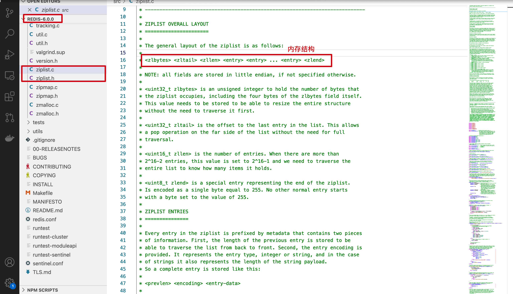

整个ZipList在内存中的存储格式如下：


- `zlbytes`字段的类型是uint32_t，这个字段中存储的是整个ZipList所占用的内存的字节数。
- `zltail`字段的类型是uint32_t，它指的是ZipList中最后一个`entry`的偏移量，用于快速定位最后一个entry，以快速完成`pop`等操作。
- `zllen`字段的类型是uint16_t，它指的是整个ZipList中`entry`的数量。这个值只占2bytes（16位）：如果ziplist中`entry`的数目小于65535（2的16次方），那么该字段中存储的就是实际`entry`的值。若等于或超过65535，那么该字段的值固定为65535，但实际数量需要遍历所有`entry`才能得到。
- `zlend`是一个终止字节，其值为全F，即0xff。ZipList保证任何情况下，一个`entry`的首字节都不会是255。

##### Entry结构

> 参考链接：[Java全栈知识体系](https://pdai.tech/md/db/nosql-redis/db-redis-x-redis-ds.html#entry%E7%BB%93%E6%9E%84)
>

##### 为什么ZipList特别省内存？

- ZipList节省内存是相对于普通list来说的。如果是普通的数组，那么它每个元素占用的内存是一样的且取决于最大的那个元素（很明显它是需要预留空间的）。所以ZipList在设计时就很容易想到要尽量让每个元素按照实际的内容大小存储，**所以增加`encoding`字段**，针对不同的encoding来细化存储大小。
- 这时候还需要解决的一个问题是遍历元素时如何定位下一个元素呢？ZipList中每个data占据的内存不一样，所以为了解决遍历，需要增加记录上一个元素的length，**所以增加了`prelen`字段**。

##### ZipList的缺点

- ZipList也不预留内存空间，并且在移除结点后也是立即缩容，这代表每次写操作都会进行内存分配操作。
- 结点如果扩容导致结点占用的内存增长，并且超过254字节的话，可能会导致**链式反应**：其后一个结点的`entry.prevlen`需要从一字节扩容至五字节。**最坏情况下，第一个结点的扩容会导致整个ZipList中的后续所有结点的`entry.prevlen`字段扩容**。虽然这个内存重分配的操作依然只会发生一次，但在代码中时间复杂度是O(N)级别，因为链式扩容只能一步一步的计算。但这种情况的概率十分的小。

#### QuickList—快表

QuickList这个结构是Redis 3.2版本后新加的，之前的版本是List（即LinkedList），用于`String`数据类型中。它是一种以**ZipList为结点的双端链表**结构。宏观上，QuickList是一个链表；微观上，链表中的每个结点都是一个ZipList。

##### 结构

Redis 6.0源码：

```c
/* Node, quicklist, and Iterator are the only data structures used currently. */

/* quicklistNode is a 32 byte struct describing a ziplist for a quicklist.
 * We use bit fields keep the quicklistNode at 32 bytes.
 * count: 16 bits, max 65536 (max zl bytes is 65k, so max count actually < 32k).
 * encoding: 2 bits, RAW=1, LZF=2.
 * container: 2 bits, NONE=1, ZIPLIST=2.
 * recompress: 1 bit, bool, true if node is temporarry decompressed for usage.
 * attempted_compress: 1 bit, boolean, used for verifying during testing.
 * extra: 10 bits, free for future use; pads out the remainder of 32 bits */
typedef struct quicklistNode {
    struct quicklistNode *prev;
    struct quicklistNode *next;
    unsigned char *zl;
    unsigned int sz;             /* ziplist size in bytes */
    unsigned int count : 16;     /* count of items in ziplist */
    unsigned int encoding : 2;   /* RAW==1 or LZF==2 */
    unsigned int container : 2;  /* NONE==1 or ZIPLIST==2 */
    unsigned int recompress : 1; /* was this node previous compressed? */
    unsigned int attempted_compress : 1; /* node can't compress; too small */
    unsigned int extra : 10; /* more bits to steal for future usage */
} quicklistNode;

/* quicklistLZF is a 4+N byte struct holding 'sz' followed by 'compressed'.
 * 'sz' is byte length of 'compressed' field.
 * 'compressed' is LZF data with total (compressed) length 'sz'
 * NOTE: uncompressed length is stored in quicklistNode->sz.
 * When quicklistNode->zl is compressed, node->zl points to a quicklistLZF */
typedef struct quicklistLZF {
    unsigned int sz; /* LZF size in bytes*/
    char compressed[];
} quicklistLZF;

/* Bookmarks are padded with realloc at the end of of the quicklist struct.
 * They should only be used for very big lists if thousands of nodes were the
 * excess memory usage is negligible, and there's a real need to iterate on them
 * in portions.
 * When not used, they don't add any memory overhead, but when used and then
 * deleted, some overhead remains (to avoid resonance).
 * The number of bookmarks used should be kept to minimum since it also adds
 * overhead on node deletion (searching for a bookmark to update). */
typedef struct quicklistBookmark {
    quicklistNode *node;
    char *name;
} quicklistBookmark;


/* quicklist is a 40 byte struct (on 64-bit systems) describing a quicklist.
 * 'count' is the number of total entries.
 * 'len' is the number of quicklist nodes.
 * 'compress' is: -1 if compression disabled, otherwise it's the number
 *                of quicklistNodes to leave uncompressed at ends of quicklist.
 * 'fill' is the user-requested (or default) fill factor.
 * 'bookmakrs are an optional feature that is used by realloc this struct,
 *      so that they don't consume memory when not used. */
typedef struct quicklist {
    quicklistNode *head;
    quicklistNode *tail;
    unsigned long count;        /* total count of all entries in all ziplists */
    unsigned long len;          /* number of quicklistNodes */
    int fill : QL_FILL_BITS;              /* fill factor for individual nodes */
    unsigned int compress : QL_COMP_BITS; /* depth of end nodes not to compress;0=off */
    unsigned int bookmark_count: QL_BM_BITS;
    quicklistBookmark bookmarks[];
} quicklist;

typedef struct quicklistIter {
    const quicklist *quicklist;
    quicklistNode *current;
    unsigned char *zi;
    long offset; /* offset in current ziplist */
    int direction;
} quicklistIter;

typedef struct quicklistEntry {
    const quicklist *quicklist;
    quicklistNode *node;
    unsigned char *zi;
    unsigned char *value;
    long long longval;
    unsigned int sz;
    int offset;
} quicklistEntry;
```

这里定义了6个结构体：

- `quicklistNode`：宏观上，QuickList是一个链表。这个结构描述的就是链表中的结点。它通过`zl`字段持有底层的ZipList。简单来讲，它描述了一个ZipList实例。
- `quicklistLZF`：ZipList是一段连续的内存，用LZ4算法压缩后就可以包装成一个`quicklistLZF`结构。是否压缩QuickList中的每个ZipList实例是一个可配置项。若这个配置项是开启的，那么`quicklistNode.zl`字段指向的就不是一个ZipList实例，而是一个压缩后的`quicklistLZF`实例。
- `quicklistBookmark`：在QuickList尾部增加的一个书签，只有在大量结点的多余内存使用量可以忽略不计且确实需要分批迭代它们的情况下，它才会被使用。当不使用它们时，它们不会增加任何内存开销。
- `quicklist`：这就是一个双链表的定义。`head`和`tail`分别指向头、尾指针，`len`代表链表中的结点，`count`指的是整个QuickList中所有ZipList中的`entry`的数目，`fill`字段影响着每个链表结点中ZipList的最大占用空间，`compress`影响着是否要对每个ZipList以LZ4算法进行进一步压缩以更节省内存空间。
- `quicklistIter`是一个迭代器。
- `quicklistEntry`是对ZipList中的`entry`概念的封装。QuickList作为一个封装良好的数据结构，不希望使用者感知到其内部的实现，所以需要把`ziplist.entry`的概念重新包装一下。

##### 内存布局图

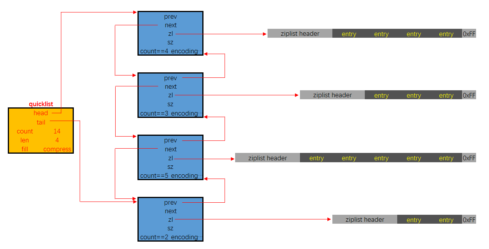

##### 更多额外信息

> 参考链接：[Java全栈知识体系](https://pdai.tech/md/db/nosql-redis/db-redis-x-redis-ds.html#quicklist%E6%9B%B4%E5%A4%9A%E9%A2%9D%E5%A4%96%E4%BF%A1%E6%81%AF)
>

#### Dict/HashTable—字典/哈希表

##### 结构

哈希表结构定义：

```c
typedef struct dictht{
    //哈希表数组
    dictEntry **table;
    //哈希表大小
    unsigned long size;
    //哈希表大小掩码，用于计算索引值
    //总是等于 size-1
    unsigned long sizemask;
    //该哈希表已有节点的数量
    unsigned long used;
 
}dictht
```

哈希表是由数组table组成，table中每个元素都是指向`dict.h/dictEntry`结构，`dictEntry`结构定义如下：

```c
typedef struct dictEntry{
     //键
     void *key;
     //值
     union{
          void *val;
          uint64_tu64;
          int64_ts64;
     }v;
     //指向下一个哈希表节点，形成链表
     struct dictEntry *next;
}dictEntry
```

**key用来保存键，val属性用来保存值**，值可以是一个指针，也可以是uint64_t整数，也可以是int64_t整数。

注意这里还有一个**指向下一个哈希表节点的指针**。哈希表最大的问题是存在**哈希冲突**，如何解决哈希冲突，有**开放地址法和链地址法**。这里采用的便是链地址法，通过`next`这个指针可以将多个哈希值相同的键值对连接在一起，用来**解决哈希冲突**。


##### 一些要点

- 哈希算法：计算哈希值和索引值方法：

  ```bash
  #1、使用字典设置的哈希函数，计算键 key 的哈希值
  hash = dict->type->hashFunction(key);
  
  #2、使用哈希表的sizemask属性和第一步得到的哈希值，计算索引值
  index = hash & dict->ht[x].sizemask;
  ```

- 解决哈希冲突：链地址法，通过字典里面的`*next`指针指向下一个具有相同索引值的哈希表节点。

- 扩容和收缩：当哈希表保存的键值对太多或者太少时，就要通过rehash对哈希表进行相应的扩容或者收缩。具体步骤：

  1. 如果执行扩容操作，会基于原哈希表创建一个大小等于`ht[0].used*2n`的哈希表（也就是每次扩容都是根据原哈希表已使用的空间扩大一倍创建另一个哈希表）；如果执行收缩操作，每次收缩是根据已使用空间缩小一倍创建一个新的哈希表；
  2. 重新利用上面的哈希算法，计算索引值，然后将键值对放到新的哈希表位置上；
  3. 所有键值对都迁徙完毕后，释放原哈希表的内存空间。

- 触发扩容的条件：

  - 服务器目前没有执行`BGSAVE`命令或者`BGREWRITEAOF`命令，并且负载因子大于等于1。
  - 服务器目前正在执行`BGSAVE`命令或者`BGREWRITEAOF`命令，并且负载因子大于等于5。
  - 负载因子=哈希表已保存节点数量/哈希表大小。

- 触发缩容的条件：

  > 参考链接：[CSDN](https://blog.csdn.net/weixin_40179091/article/details/115273824)

  - 负载因子<=0.1时。

- 渐进式rehash：**扩容和收缩操作不是一次性、集中式完成的**，而是分多次、渐进式完成的。如果键值对只有几个几十个，那么rehash操作可以瞬间完成；但如果键值对有几百万，几千万甚至几亿，那么要一次性rehash，势必会造成Redis一段时间内不能进行别的操作。所以Redis采用渐进式rehash，**这样在进行渐进式rehash期间，字典的删除、查找、更新等操作可能会在两个哈希表上进行，第一个哈希表没有找到，就会去第二个哈希表上进行查找。但是进行增加操作，一定是在新的哈希表上进行的**。

  > 参考链接：[CSDN](https://blog.csdn.net/weixin_40179091/article/details/115273824)

  1. 为`ht[1]`分配空间，让字典同时持有`ht[0]`和`ht[1]`两个哈希表；
  2. 在字典中维持一个索引计数器变量`rehashidx`，并将它的指设置为`0`，表示rehash工作正式开始；
  3. 在rehash进行期间，每次对字典执行添加、删除、查找或者更新操作时，程序除了执行指定的操作以外，还会顺带将`ht[0]`在`rehashidx`上的所有键值对rehash到`ht[1]`，当rehash工作完成之后，程序将`rehashidx`属性的值增1；
  4. 随着字典操作的不断执行，最终在某个时间点，`ht[0]`的所有键值对都会被rehash至`ht[1]`，这时程序将`rehashidx`属性设置为`-1`，表示rehash已经操作完成。


#### IntSet—整数集

IntSet是集合类型的底层实现之一，**当一个集合只包含整数值元素，并且这个集合的元素数量不多时，Redis就会使用整数集合作为集合键的底层实现**。

##### 结构

源码结构：

```c
typedef struct intset {
    uint32_t encoding;
    uint32_t length;
    int8_t contents[];
} intset;
```

- `encoding`表示编码方式，取值有三个：`INTSET_ENC_INT16`、`INTSET_ENC_INT32`、 `INTSET_ENC_INT64`。
- `length`代表其中存储的整数的个数。
- `contents`指向实际存储数值的连续内存区域，就是一个数组；整数集合的每个元素都是`contents`数组的一个数组项（item），各个项在数组中按值的大小**从小到大有序排序**，且数组中不包含任何重复项。（虽然IntSet结构将`contents`属性声明为int8_t类型的数组，但实际上`contents`数组并不保存任何int8_t类型的值，contents数组的真正类型取决于`encoding`属性的值）

##### 内存布局图


`content`数组里面每个元素的数据类型是由`encoding`来决定的，那么如果原来的数据类型是int16, 当再插入一个int32类型的数据时怎么办呢？这就是下面要说的IntSet的升级。

##### IntSet升级

当在一个int16类型的整数集合中插入一个int32类型的值时，整个集合的所有元素都会转换成int32类型。 整个过程有三步：

1. 根据新元素的类型（比如int32），扩展整数集合底层数组的空间大小，并为新元素分配空间。
2. 将底层数组现有的所有元素都转换成与新元素相同的类型，并将类型转换后的元素放置到正确的位上，而且在放置元素的过程中，需要继续维持底层数组的有序性质不变。
3. 最后改变`encoding`的值，`length`+1。

**那如果删除掉刚加入的int32类型时，会不会做一个降级操作呢**？不会。主要还是减少开销的权衡。

#### ZSkipList—跳表

跳跃表结构在Redis中的运用场景只有一个：作为有序列表（Zset）的使用。跳跃表的性能可以**保证在查找、删除、添加等操作的时候在对数期望时间内完成**，这个性能是可以和平衡树来相比较的，而且在实现方面比平衡树要优雅，这就是跳跃表的长处。跳跃表的缺点就是**需要的存储空间比较大**，属于利用空间来换取时间的数据结构。

对于一个单链表来讲，即便链表中存储的数据是有序的，如果要想在其中查找某个数据，也只能从头到尾遍历链表。这样查找效率就会很低，时间复杂度是O(n)。比如查找12需要7次查找：


如果增加如下两级索引，那么它搜索次数就变成了3次：


##### 设计

跳跃表并没有在单独的类中定义，而是其定义在`server.h`中，如下：

```c
/* ZSETs use a specialized version of Skiplists */
typedef struct zskiplistNode {
    sds ele;
    double score;
    struct zskiplistNode *backward;
    struct zskiplistLevel {
        struct zskiplistNode *forward;
        unsigned int span;
    } level[];
} zskiplistNode;

typedef struct zskiplist {
    struct zskiplistNode *header, *tail;
    unsigned long length;
    int level;
} zskiplist;
```

其内存布局如下：


**ZSkipList的核心设计要点**：

- **头结点**不持有任何数据，且其`level[]`的长度为32。
- 每个结点：
  - `ele`字段，持有数据，是SDS类型。
  - `score`字段，标示着结点的得分，结点之间凭借得分来判断先后顺序，跳跃表中的结点按结点的得分**升序排列**。
  - `backward`指针，这是原版跳跃表中所没有的。该指针指向结点的前一个紧邻结点
  - `level`字段，用以记录所有结点（除头节点外）；每个结点中最多持有32个zskiplistLevel结构。实际数量在结点创建时，按幂次定律随机生成（不超过32）。每个zskiplistLevel中有两个字段：
    - `forward`字段指向比自己得分高的某个结点（不一定是紧邻的），并且若当前zskiplistLevel实例在`level[]`中的索引为X，则其`forward`字段指向的结点其`level[]`字段的容量至少是X+1。这也是上图中，为什么`forward`指针总是画得水平的原因。
    - `span`字段代表`forward`字段指向的结点距离当前结点的距离。紧邻的两个结点之间的距离定义为1。

##### 为什么不用平衡树或者哈希表？

|                |                          ZSkipList                           |                            平衡树                            | 哈希表 |
| :------------: | :----------------------------------------------------------: | :----------------------------------------------------------: | :----: |
|    范围查找    |     操作简单：找到小值之后，对第1层链表进行若干步的遍历      | 元素有序，操作复杂：找到指定范围的小值之后，还需要以中序遍历的顺序继续寻找其它不超过大值的节点 | 不支持 |
| 插入和删除操作 |                    只需要修改相邻结点指针                    |                      可能引发子树的调整                      |        |
|    内存占用    | 每个节点包含的指针数目平均为$1/(1-p)$，如果取$p=1/4$（Redis实现），那么平均每个节点包含1.33个指针 |                     每个结点包含2个指针                      |        |
|   查找复杂度   |                           O(logN)                            |                           O(logN)                            |  O(1)  |
|    实现难度    |                             简单                             |                             困难                             |        |

### 2.6 Redis对象与编码（底层结构）对应关系:airplane:

> 参考链接：[Java全栈知识体系](https://pdai.tech/md/db/nosql-redis/db-redis-data-type-enc.html)

#### 字符串对象

字符串是Redis最基本的数据类型，不仅所有`Key`都是字符串类型，其它几种数据类型构成的元素也是字符串。注意字符串的长度不能超过**512M**。

##### 编码

字符串对象的编码可以是以下三种：

- `int`编码：保存的是可以用`long`类型表示的整数值。
- `embstr`编码：保存长度小于44字节的字符串（Redis 3.2之前是39字节，之后是44字节）。
- `raw`编码：保存长度大于44字节的字符串（Redis 3.2之前是39字节，之后是44字节）。


##### 内存布局

三种编码方式对应的内存布局分别如下：


`raw`和`embstr`的区别：

`embstr`与`raw`都使用`redisObject`和SDS保存数据，区别在于：`embstr`的使用只分配一次内存空间（`redisObject`和SDS是连续的），而`raw`需要分配两次内存空间（分别为`redisObject`和SDS分配空间）。因此与`raw`相比，`embstr`的好处在于创建时少分配一次空间，删除时少释放一次空间，以及对象的所有数据连在一起，寻找方便。而`embstr`的坏处也很明显，如果字符串的长度增加需要重新分配内存时，整个`redisObject`和SDS都需要重新分配空间，因此Redis中的`embstr`实现为**只读**。

##### 编码转换

> 参考链接：[知乎](https://zhuanlan.zhihu.com/p/340939326)

|       编码方式        |                          说明                          |
| :-------------------: | :----------------------------------------------------: |
|  `OBJ_ENCODING_RAW`   |         长度超过44个字节的字符串以这种方式编码         |
|  `OBJ_ENCODING_INT`   |    可以被转化为`long`类型整数的字符串以这种方式编码    |
| `OBJ_ENCODING_EMBSTR` | 不能被转化为`long`类型整数且长度不超过44个字节的字符串 |

对于`int`编码，对其使用`append`命令会使其编码方式变为`raw`。

对于`embstr`编码，由于Redis没有对其编写任何的修改程序（`embstr`是**只读**的），在对`embstr`进行修改时，都会先转化为`raw`再进行修改，因此只要是修改`embstr`对象，修改后的对象一定是`raw`的，无论是否达到了44个字节。

#### 列表对象

List列表是简单的字符串列表，按照插入顺序排序，可以添加一个元素到列表的头部（左边）或者尾部（右边），它的底层实际上是个链表结构。

##### 编码

列表对象的编码是`quicklist`（之前版本中有`linkedlist`和`ziplist`这两种编码。进一步地，目前Redis定义的10个对象编码方式宏名中有两个被完全闲置了：`OBJ_ENCODING_ZIPMAP`与`OBJ_ENCODING_LINKEDLIST`。 从Redis的演进历史上来看，前者是后续可能会得到支持的编码值（代码还在）, 后者则应该是被彻底淘汰了)

##### 内存布局


#### 哈希对象

哈希对象的键是一个字符串类型，值是一个键值对集合。

##### 编码

哈希对象的编码可以是**ZipList**或者**HashTable**，对应的底层实现有两种：一种是ZipList，一种是Dict。两种编码**内存布局**分别如下：


##### 举例说明

当使用Ziplist，也就是压缩列表作为底层实现时，新增的键值对是保存到压缩列表的表尾。比如执行以下命令：

```sh
hset profile name "Tom"
hset profile age 25
hset profile career "Programmer"
```

如果使用Ziplist，profile存储如下：


如果使用HashTable，存储如下：

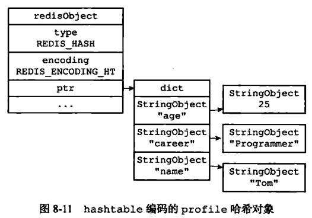

##### 编码转换

和上面列表对象使用ZipList编码一样，当**同时满足下面两个条件时，使用ZipList（压缩列表）编码**：

1. 列表保存元素个数小于512个；
2. 每个元素长度小于64字节。

不能满足这两个条件的时候使用HashTable编码。以上两个条件也可以通过Redis配置文件`zset-max-ziplist-entries`选项和`zset-max-ziplist-value`进行修改。

#### 集合对象

集合对象Set是`String`类型（整数也会转换成`String`类型进行存储）的无序集合。注意集合和列表的区别：**集合中的元素是无序的，因此不能通过索引来操作元素；集合中的元素不能有重复。**

##### 编码

集合对象的编码可以是**IntSet**或者**HashTable**；底层实现有两种，分别是**IntSet**和**Dict**。显然当使用IntSet作为底层实现的数据结构时，集合中存储的只能是数值数据且必须是整数；而当使用Dict作为集合对象的底层实现时，是将数据全部存储于Dict的键中，值字段闲置不用。

集合对象的内存布局如下：


##### 举例说明

```sh
SADD numbers 1 3 5
```

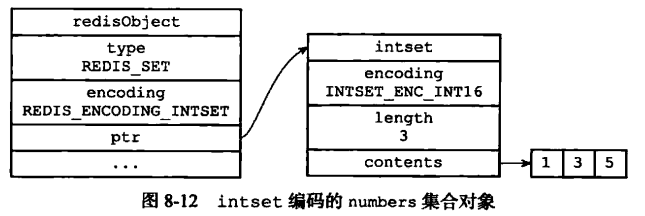

```sh
SADD Dfruits "apple" "banana" "cherry"
```

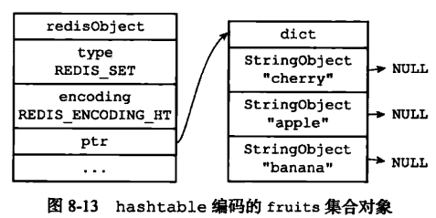

##### 编码转换

当集合**同时满足以下两个条件时使用IntSet编码**：

1. 集合对象中所有元素都是整数；
2. 集合对象所有元素数量不超过512。

不能满足这两个条件的就使用HashTable编码。第二个条件可以通过配置文件的`set-max-intset-entries`进行配置。

#### 有序集合对象

和上面的集合对象相比，有序集合对象是**有序**的。与列表使用索引下标作为排序依据不同，有序集合为每个元素设置一个分数作为排序依据。

##### 编码

> 参考链接：[简书](https://www.jianshu.com/p/360627bd04e5)

有序集合的底层实现依然有两种，一种是使用**ZipList**作为底层实现，另外一种比较特殊，底层使用了两种数据结构：**Dict与ZSkipList**（字典的键保存元素的值，字典的值则保存元素的分值；跳跃表节点的`object`属性保存元素的值，跳跃表节点的`score` 属性保存元素的分值）。

**使用ZipList来实现有序集合很容易理解**，只需要在ZipList这个数据结构的基础上做好排序与去重就可以了。**使用ZSkipList来实现有序集合也很容易理解**，Redis中实现的这个跳跃表似乎天然就是为了实现有序集合对象而实现的，那么为什么还要辅助一个Dict实例呢? 先看来有序集合对象在这两种编码方式下的内存布局，然后再做解释。

首先是编码为ZipList时，有序集合的内存布局如下：


然后是编码为ZSkipList时，有序集合的内存布局如下：


说明：其实有序集合单独使用字典或跳跃表其中一种数据结构都可以实现，但是这里使用两种数据结构组合起来，**原因是假如单独使用字典，虽然能以O(1)的时间复杂度查找成员的分值，但是因为字典是以无序的方式来保存集合元素，所以每次进行范围操作的时候都要进行排序；假如单独使用跳跃表来实现，虽然能执行范围操作，但是查找操作由O(1)的复杂度变为了O(logN)**。因此Redis使用了两种数据结构来共同实现有序集合。

##### 举例说明

```sh
ZADD price 8.5 apple 5.0 banana 6.0 cherry
```


##### 编码转换

当有序集合对象**同时满足以下两个条件时，对象使用ZipList编码**：

1. 保存的元素数量小于128；
2. 保存的所有元素长度都小于64字节。

不能满足上面两个条件的使用ZSkipList编码。以上两个条件也可以通过Redis配置文件`zset-max-ziplist-entries`选项和`zset-max-ziplist-value`进行修改。

#### 总结（自己）:rocket:


## 三、Redis持久化:rocket:

### 3.1 Redis持久化简介

> 参考链接：[Java全栈知识体系](https://pdai.tech/md/db/nosql-redis/db-redis-x-rdb-aof.html#redis%E6%8C%81%E4%B9%85%E5%8C%96%E7%AE%80%E4%BB%8B)

#### 为什么需要持久化？

Redis是个基于**内存**的数据库。一旦宕机，内存中的数据将全部丢失。通常的解决方案是**从后端数据库恢复这些数据**，但后端数据库有性能瓶颈，如果是大数据量的恢复：**一是会对数据库带来巨大的压力，二是数据库的性能不如Redis导致程序响应慢**。所以对Redis来说，实现数据的持久化，避免从后端数据库中恢复数据，是至关重要的。

#### Redis持久化有哪些方式？为什么需要重点学RDB和AOF？

从严格意义上说，Redis服务提供四种持久化存储方案：RDB(Redis Database, RDB)、AOF(Append Only File, AOF)、虚拟内存（VM）和DISKSTORE。

其中，**虚拟内存（VM）方式**从Redis 2.4开始就被官方明确表示不再建议使用；至于**DISKSTORE**方式，是从Redis 2.8版本开始提出的一个存储设想，在Redis 3.2版本中同样找不到对于这种存储方式的明确支持。

目前官方文档上能够看到的Redis对持久化存储的支持明确的就只有两种方案：**RDB**和**AOF**。

### 3.2 RDB持久化

> 参考链接：[CSDN](https://lansonli.blog.csdn.net/article/details/102648597)、[Java全栈知识体系](https://pdai.tech/md/db/nosql-redis/db-redis-x-rdb-aof.html#rdb-%E6%8C%81%E4%B9%85%E5%8C%96)

#### 简介

RDB就是Redis DataBase的缩写，中文名为快照/内存快照，RDB持久化是把**当前进程数据生成快照保存到磁盘上的过程**，由于是某一时刻的快照，那么快照中的值要早于或者等于内存中的值。

#### 触发方式

##### 手动触发

- `save`：阻塞当前Redis服务器，直到RDB过程完成为止，对于内存比较大的实例会造成长时间**阻塞**，线上环境不建议使用。
- `bgsave`：Redis进程执行`fork`操作创建子进程，RDB持久化过程由子进程负责，完成后自动结束。阻塞只发生在`fork`阶段，一般时间很短。

`bgsave`流程如下：

1. Redis客户端执行`bgsave`命令或者自动触发`bgsave`命令；
2. 主进程判断当前是否已经存在正在执行的子进程，如果存在，那么主进程直接返回；
3. 如果不存在正在执行的子进程，那么就`fork`一个新的子进程进行持久化数据，`fork`过程是阻塞的（时间很短），`fork`操作完成后主进程即可执行其他操作；
4. 子进程先将数据写入到临时的`.rdb`文件中，待快照数据写入完成后再原子替换旧的`.rdb`文件；
5. 同时发送信号给主进程，通知主进程RDB持久化完成，主进程更新相关的统计信息。


`save`和`bgsave`对比如下：

> 参考链接：[CSDN](https://lansonli.blog.csdn.net/article/details/102648597)

|  命令  |     `save`     |               `bgsave`               |
| :----: | :------------: | :----------------------------------: |
| IO类型 |      同步      |                 异步                 |
|  阻塞  |       是       | 是（阻塞发生在`fork()`，通常非常快） |
| 复杂度 |      O(n)      |                 O(n)                 |
|  优点  | 不消耗额外内存 |           不阻塞客户端命令           |
|  缺点  | 阻塞客户端命令 |        需要`fork()`，消耗内存        |

##### 自动触发:airplane:

在以下几种情况发生时会自动触发：

- `redis.conf`中配置`save m n`，自动触发`bgsave`生成`.rdb`文件。
- 主从复制时，**从节点要从主节点进行全量复制时也会触发`bgsave`操作**，生成当时的快照**发送到从节点**。
- 执行`debug reload`命令重新加载Redis时也会触发`bgsave`操作。
- 默认情况下执行`shutdown`命令时，如果没有开启AOF持久化，那么也会触发`bgsave`操作。

#### `redis.conf`中配置RDB

**快照周期**：内存快照虽然可以通过技术人员手动执行`SAVE`或`BGSAVE`命令来进行，但生产环境下**多数情况都会设置其周期性执行条件**。

Redis中默认的周期性设置：

```sh
# 周期性执行条件的设置格式为
save <seconds> <changes>

# 默认的设置为：
save 900 1
save 300 10
save 60 10000

# 以下设置方式为关闭RDB快照功能
save ""
```

`save m n`表示如果“**在m秒内有n条key信息发生变化**”，则进行快照。

其他相关配置：

```sh
# 文件名称
dbfilename dump.rdb

# 文件保存路径
dir /home/work/app/redis/data/

# 如果持久化出错，主进程是否停止写入
stop-writes-on-bgsave-error yes

# 是否压缩
rdbcompression yes

# 导入时是否检查
rdbchecksum yes
```

- `dbfilename`：RDB文件在磁盘上的名称。
- `dir`：RDB文件的存储路径。默认设置为`“./”`，也就是Redis服务的主目录。
- `stop-writes-on-bgsave-error`：在快照进行过程中主进程照样可以接受客户端的任何写操作的特性，是指在快照操作正常的情况下。如果快照操作出现异常（例如操作系统用户权限不够、磁盘空间写满等等）时，Redis就会禁止写操作。该参数项默认情况下值为`yes`。
- `rdbcompression`：该属性将在字符串类型的数据被快照到磁盘文件时，启用LZF压缩算法。Redis官方的建议是请保持该选项设置为`yes`。
- `rdbchecksum`：默认值是`yes`。从RDB快照功能的version 5 版本开始，一个64位的CRC冗余校验编码会被放置在RDB文件的末尾，以便对整个RDB文件的完整性进行验证。这个功能大概会多损失10%左右的性能，但获得了更高的数据可靠性。

#### 优缺点

> 参考链接：[Redis文档](https://redis.io/docs/manual/persistence/#rdb-advantages)

##### 优点

- RDB是Redis数据库中一个**非常紧凑的单时间点文件**，它非常适用于备份，可以在发生数据灾难时轻松恢复不同版本的数据集。
- RDB非常适合**灾难恢复**，它是一个可以**传输到远程数据中心**的压缩文件。
- RDB最大限度地**提高了Redis的性能**，因为Redis父进程为了持久化而需要做的唯一工作就是**派生一个完成所有其余工作的子进程**。父进程永远**不会执行磁盘I/O或类似操作**。
- RDB恢复**大数据集时更快**（相比于AOF）。
- RDB在副本（Replicas）上支持**重启和故障转移后的部分重新同步**。

##### 缺点

- **不可控、丢失数据风险**：RDB**没有将数据丢失的可能性降到最低**。虽然可以配置多个时间保存点，但如果Redis由于没有正确关闭而直接停止工作，那么还是有可能丢失最新的数据。
- **耗时、耗性能**：RDB需要经常`fork()`以便使用子进程在磁盘上持久化。如果数据集很大，`fork()`可能会很耗时，并且性能较低的CPU可能还会导致Redis客户端停止几毫秒甚至一秒钟。AOF也需要`fork()`但频率较低，而且可以调整重写日志的频率。

### 3.3 AOF持久化

> 参考链接：[CSDN](https://lansonli.blog.csdn.net/article/details/102648597)、[Java全栈知识体系](https://pdai.tech/md/db/nosql-redis/db-redis-x-rdb-aof.html#aof-%E6%8C%81%E4%B9%85%E5%8C%96)

#### 简介

Redis是“写后“日志：**Redis先执行命令，把数据写入内存，然后才记录日志**。日志里记录的是Redis收到的每一条命令，这些命令是以文本形式保存的。


**为什么采用写后日志**？Redis要求高性能，采用“写后”日志有两方面好处：

- **避免额外的检查开销**：Redis在向AOF里面记录日志的时候，并不会先去对这些命令进行语法检查。所以，如果先记日志再执行命令的话，日志中就有可能记录了错误的命令，Redis在使用日志恢复数据时，就可能会出错。
- 不会阻塞当前的写操作。

但这种方式**存在潜在风险**：

- 如果命令执行完成，写日志之前宕机了，会丢失数据。
- 主线程写磁盘压力大，导致写盘慢，阻塞后续操作。

#### 如何实现AOF？

AOF日志记录Redis的每个写命令，步骤分为：命令追加（append）、文件写入（write）和同步（sync）。

- 命令追加：当AOF持久化功能打开时，在执行完一个写命令之后，会以**协议格式**将被执行的写命令追加到服务器的`aof_buf`缓冲区。
- 文件写入和同步：关于何时将`aof_buf`缓冲区的内容写入AOF文件中，Redis提供了三种策略：
  - `Always`，同步写回：每个写命令执行完，立马同步地将日志写回磁盘。
  - `Everysec`，每秒写回：每个写命令执行完，只是先把日志写到AOF文件的内存缓冲区，每隔1秒把缓冲区中的内容写入磁盘。
  - `No`，操作系统控制写回：每个写命令执行完，只是先把日志写到AOF文件的内存缓冲区，由操作系统决定何时将缓冲区内容写回磁盘。


#### `redis.conf`中配置AOF

默认情况下，Redis是没有开启AOF的，可以通过配置`redis.conf`文件来开启AOF持久化，关于AOF的配置如下：

```sh
# appendonly参数开启AOF持久化
appendonly no

# AOF持久化的文件名，默认是appendonly.aof
appendfilename "appendonly.aof"

# AOF文件的保存位置和RDB文件的位置相同，都是通过dir参数设置的
dir ./

# 同步策略
# appendfsync always
appendfsync everysec
# appendfsync no

# aof重写期间是否同步
no-appendfsync-on-rewrite no

# 重写触发配置
auto-aof-rewrite-percentage 100
auto-aof-rewrite-min-size 64mb

# 加载aof出错如何处理
aof-load-truncated yes

# 文件重写策略
aof-rewrite-incremental-fsync yes
```

- `appendonly`：默认情况下AOF功能是关闭的，将该选项改为`yes`以打开Redis的AOF功能。
- `appendfilename`：AOF文件的名字。
- `appendfsync`：这个参数项是AOF功能最重要的设置项之一，主要用于设置“**真正执行**”操作命令向AOF文件中同步的策略。
- `no-appendfsync-on-rewrite`：`always`和`everysec`的设置会使真正的I/O操作高频度的出现，甚至会出现长时间的卡顿情况，为了尽量缓解这个情况，Redis提供了这个设置项，**保证在完成`fsync()`函数调用时，不会将这段时间内发生的命令操作放入操作系统的Page Cache**（这段时间Redis还在接受客户端的各种写操作命令）。
- `auto-aof-rewrite-percentage`：表示如果当前AOF文件的大小超过了上次重写后AOF文件的百分之多少后，就再次开始重写AOF文件。
- `auto-aof-rewrite-min-size`：表示启动AOF文件重写操作的AOF文件最小大小。如果AOF文件大小低于这个值，则不会触发重写操作。

#### AOF重写

> 参考链接：[CSDN](https://lansonli.blog.csdn.net/article/details/102648597)、[博客园](https://www.cnblogs.com/ysocean/p/9114267.html)

因为AOF的运作方式是不断地将命令追加到文件的末尾，所以随着写入命令的不断增加，AOF文件的体积也会变得越来越大。为了处理这种情况，Redis支持一种有趣的特性：可以在不打断服务客户端的情况下，对AOF文件进行**重建（Rebuild）**。每当执行AOF文件重写时，Redis将写最短的命令序列在**内存中重建当前数据集**。


也就是说AOF文件重写**并不是对原文件进行重新整理**，而是**直接读取服务器现有的键值对**，然后用**一条命令去代替之前记录这个键值对的多条命令**，生成一个新的文件后去替换原来的AOF文件。

##### 实现方式

###### `bgrewriteaof`

`bgrewriteaof`命令用于**异步执行**一个AOF文件重写操作，会创建一个当前AOF文件的体积优化版本。即使`bgrewriteaof`执行失败，也不会有任何数据丢失，因为旧的AOF文件在`bgrewriteaof`成功之前不会被修改。`bgrewriteaof`仅仅用于**手动触发重写操作**。

如果一个子Redis是通过磁盘快照创建的，**AOF重写将会在RDB终止后才开始保存**。这种情况下`BGREWRITEAOF`仍然会返回OK状态码。从Redis 2.6起可以通过`INFO`命令查看AOF重写执行情况。

如果正在执行的AOF重写返回一个错误，AOF重写将会在**稍后一点的时间重新调用**。


###### 重写配置

|            配置名             |              含义               |
| :---------------------------: | :-----------------------------: |
|  `auto-aof-rewrite-min-size`  |    触发AOF文件重写的最小尺寸    |
| `auto-aof-rewrite-percentage` | 触发AOF文件执行重写的最小增长率 |

|      统计名      |                 含义                  |
| :--------------: | :-----------------------------------: |
| aof_current_size |        AOF文件当前尺寸（字节）        |
|  aof_base_size   | AOF文件上次启动和重写时的尺寸（字节） |

AOF重写自动触发机制**需要同时满足**下面两个条件：

1. aof_current_size > `auto-aof-rewrite-min-size`
2. (aof_current_size - aof_base_size) / aof_base_size \* 100 > `auto-aof-rewrite-percentage`

##### 流程


#### 优缺点

> 参考链接：[Redis文档](https://redis.io/docs/manual/persistence/#aof-advantages)

##### 优点

- AOF使得Redis**更具持久性**：可以有3种不同的`fsync()`策略。即使使用默认策略`everysec`，写入性能仍然很棒。`fsync()`是使用**后台线程执行**的，当没有`fsync()`正在进行时，主线程将努力执行写入，因此最多只会丢失一秒钟的数据。
- AOF日志是一个**只进行追加**的日志，因此**不会出现寻道（seek）问题**，也不会在断电时出现损坏问题。即使由于某种原因（磁盘已满或其他原因）日志未执行完整的命令而结束，`redis-check-aof`工具也能够轻松修复它。
- 当AOF变得太大时，Redis能够在后台**自动重写**AOF。重写是**完全安全**的，因为当Redis继续附加到旧文件时，会使用**创建当前数据集所需的最少操作集**生成一个全新的文件，一旦新文件准备就绪，Redis就会从“旧”切换到“新”，开始附加到新文件上。
- AOF以**易于理解和解析的格式**依次包含所有操作的日志，甚至可以轻松导出AOF文件。例如，即使不小心使用`FLUSHALL`命令刷新了所有内容，只要在此期间没有执行日志重写，仍然可以**通过停止服务器、删除最新命令（即`FLUSHALL`）并重新启动Redis**来恢复数据集。

##### 缺点

- AOF文件通常比相同数据集的等效`.rdb`文件**大**。
- 根据所使用的`fsync()`策略，AOF可能比RDB**慢**。 一般来说，将`fsync()`设置为**`everysec`时性能仍然非常高**，而在禁用`fsync()`的情况下，**即使在高负载下也应该与RDB一样快**。不过在处理巨大写入负载时，RDB仍然能够提供提供更有保证的最大延迟时间（Maximum Latency）。

### 3.4 RDB和AOF混合方式（Redis 4.0版本）

> 参考链接：[Java全栈知识体系](https://pdai.tech/md/db/nosql-redis/db-redis-x-rdb-aof.html#rdb%E5%92%8Caof%E6%B7%B7%E5%90%88%E6%96%B9%E5%BC%8F40%E7%89%88%E6%9C%AC)

Redis 4.0中提出了一个**混合使用AOF日志和内存快照**的方法。简单来说，**内存快照以一定的频率执行，在两次快照之间，使用AOF日志记录这期间的所有命令操作**。

这样一来，快照不用很频繁地执行，这就避免了频繁`fork`对主线程的影响。而且，AOF日志也只用记录两次快照间的操作，也就是说不需要记录所有操作了，因此，就不会出现文件过大的情况了，也可以减少重写开销。这个方法既能享受到RDB文件快速恢复的好处，又能享受到AOF只记录操作命令的简单优势，实际环境中用的很多。

T1和T2时刻的修改，用AOF日志记录，等到第二次做全量快照时，就可以清空AOF日志，因为此时的修改都已经记录到快照中了，恢复时就不再用日志了。


### 3.5 恢复数据

> 参考链接：[Java全栈知识体系](https://pdai.tech/md/db/nosql-redis/db-redis-x-rdb-aof.html#%E4%BB%8E%E6%8C%81%E4%B9%85%E5%8C%96%E4%B8%AD%E6%81%A2%E5%A4%8D%E6%95%B0%E6%8D%AE)

如果一台服务器上有既有RDB文件，又有AOF文件，该如何加载呢？其实想要从这些文件中恢复数据，只需要重新启动Redis即可，流程如下：

1. Redis重启时判断是否开启AOF，如果开启就优先加载AOF文件（因为AOF文件保存的数据较为完整）；
2. 如果加载成功Redis重启成功；如果AOF文件加载失败，那么会打印日志表示启动失败，此时可以去修复AOF文件后重新启动；
3. 若AOF文件不存在，那么Redis就会转而去加载RDB文件，如果RDB文件也不存在，Redis直接启动成功；
4. 如果RDB文件存在就会去加载RDB文件恢复数据，加载失败则打印日志提示启动失败；如加载成功，那么Redis重启成功。


## 四、Redis发布/订阅:boat:

> 参考链接：[Java全栈知识体系](https://pdai.tech/md/db/nosql-redis/db-redis-x-pub-sub.html)、[Redis命令参考](http://redisdoc.com/pubsub/index.html)
>

### 4.1 简介

Redis发布订阅（Pub/Sub）是一种**消息通信模式**：发送者（Pub）发送消息，订阅者（Sub）接收消息。

Redis的`SUBSCRIBE`命令可以让**客户端订阅任意数量的频道**，每当有新信息发送到被订阅的频道时，信息就会被**发送给所有订阅指定频道的客户端**。


当有新消息通过`PUBLISH`命令发送给**channel 1**时， 这个消息就会被发送给订阅它的三个客户端。

### 4.2 使用方式

Redis有两种发布/订阅模式：基于频道（Channel）的发布/订阅、基于模式（Pattern）的发布/订阅。

#### 基于频道的发布/订阅

"发布/订阅"模式包含两种角色，分别是**发布者和订阅者**。发布者可以向指定的频道（channel）发送消息；订阅者可以订阅一个或者多个频道，所有订阅此频道的订阅者都会收到此消息。


##### 发布者发布消息

发布者发布消息的命令是`publish`，用法是`publish channel message`：

```bash
127.0.0.1:6379> publish channel:1 hi
(integer) 1
```

**返回值表示接收这条消息的订阅者数量**。发出去的消息不会被持久化，即客户端**只有在订阅频道后**才能接收到后续发布到该频道的消息，之前的就接收不到了。

##### 订阅者订阅频道

订阅频道的命令是`subscribe`，可以同时订阅多个频道，用法是`subscribe channel1 [channel2 ...]`：

例如新开一个客户端订阅上面频道（不会收到消息，因为不会收到订阅之前就发布到该频道的消息）：

```bash
127.0.0.1:6379> subscribe channel:1
Reading messages... (press Ctrl-C to quit)
1) "subscribe" // 消息类型
2) "channel:1" // 频道
3) "hi" // 消息内容
```

注意：处于此**订阅状态**下客户端不能使用除`subscribe`、`unsubscribe`、`psubscribe`和`punsubscribe`这四个属于"发布/订阅"之外的命令，否则会报错。

进入订阅状态后客户端可能收到**3种类型的回复**。每种类型的回复都包含**3个值**，第一个值是**消息的类型**，根据消息类型的不同，第二个和第三个参数的含义可能不同。**消息类型的取值**可能是以下3个：

- **subscribe**：表示订阅成功的反馈信息。第二个值是订阅成功的**频道名称**，第三个是**当前客户端订阅的频道数量**。

- **message**：表示接收到的是消息，第二个值表示**产生消息的频道名称**，第三个值是消息的**内容**。
- **unsubscribe**：表示成功取消订阅某个频道。第二个值是对应的**频道名称**，第三个值是**当前客户端订阅的频道数量**，当此**值为0时客户端会退出订阅状态**，之后就可以执行其他非"发布/订阅"模式的命令了。

#### 基于模式的发布/订阅

如果有**某个/某些模式和这个频道匹配**的话，那么**所有订阅这个/这些频道的客户端也同样会收到信息**。

##### 图例解释

下图展示了一个带有频道和模式的例子， 其中`tweet.shop.*`模式匹配了`tweet.shop.kindle`频道和`tweet.shop.ipad`频道，并且有不同的客户端分别订阅它们三个：


当有信息发送到`tweet.shop.kindle`频道时，信息除了发送给client X和client Y之外，还会发送给订阅`tweet.shop.*`模式的client 123和client 256：


另一方面，如果接收到信息的是频道`tweet.shop.ipad`，那么client 123和client 256同样会收到信息：


##### 例子

```bash
# 订阅 news.* 和 tweet.* 两个模式

# 第 1 - 6 行是执行 psubscribe 之后的反馈信息
# 第 7 - 10 才是接收到的第一条信息
# 第 11 - 14 是第二条
# 以此类推。。。

redis> psubscribe news.* tweet.*
Reading messages... (press Ctrl-C to quit)
1) "psubscribe"                  # 返回值的类型：显示订阅成功
2) "news.*"                      # 订阅的模式
3) (integer) 1                   # 目前已订阅的模式的数量

1) "psubscribe"
2) "tweet.*"
3) (integer) 2

1) "pmessage"                    # 返回值的类型：信息
2) "news.*"                      # 信息匹配的模式
3) "news.it"                     # 信息本身的目标频道
4) "Google buy Motorola"         # 信息的内容

1) "pmessage"
2) "tweet.*"
3) "tweet.huangz"
4) "hello"

1) "pmessage"
2) "tweet.*"
3) "tweet.joe"
4) "@huangz morning"

1) "pmessage"
2) "news.*"
3) "news.life"
4) "An apple a day, keep doctors away"
```

注意点：

- 使用`psubscribe`命令可以**重复订阅同一个频道**，如客户端执行了`psubscribe c? c?*`，这时向c1发布消息客户端会接受到**两条消息**，而同时`publish`命令的返回值**是2而不是1**。同样的，如果有另一个客户端执行了`subscribe c1` 和`psubscribe c?*`的话，向c1发送一条消息该客户端也会收到到**2条消息（但是是两种类型：`message`和`pmessage`）**，同时`publish`命令也**返回2**。
- `punsubscribe`命令可以**退订指定的规则**，用法是：`punsubscribe [pattern [pattern ...]]`，如果没有参数则会退订所有规则。
- **使用`punsubscribe`只能退订通过`psubscribe`命令订阅的规则，不会影响直接通过`subscribe`命令订阅的频道**；同样的，`unsubscribe`命令也不会影响通过`psubscribe`命令订阅的规则。另外需要注意`punsubscribe`命令退订某个规则时不会将其中的通配符展开，而是进行严格的字符串匹配，**所以`punsubscribe *` 无法退订`c*`规则，而是必须使用`punsubscribe c*`才可以退订**。

## 五、Redis事务:boat:

> 参考链接：[Java全栈知识体系](https://pdai.tech/md/db/nosql-redis/db-redis-x-trans.html)

### 5.1 什么是Redis事务？

Redis事务的**本质是一组命令的集合**。事务支持一次执行多个命令，一个事务中所有命令都会被序列化。在事务执行过程，会按照顺序串行化执行队列中的命令，其他客户端提交的命令请求不会插入到事务执行命令序列中。

总结说：Redis事务就是**一次性、顺序性、排他性**地执行**一个队列中的一系列命令**。

### 5.2 Redis事务相关命令和使用

`MULTI`、`EXEC`、`DISCARD`和`WATCH`是Redis事务相关的命令。

- `MULTI`：**开启事务**，Redis会将后续的命令逐个放入队列中，然后使用`EXEC`命令来**原子化**执行这个命令序列。
- `EXEC`：**执行**事务中的所有操作命令。
- `DISCARD`：**取消**事务，放弃执行事务块中的所有命令。
- `WATCH`：监视一个或多个key，如果在执行事务前，这个key（或多个key）被其他命令修改，则**事务被中断，不会执行事务中的任何命令**。
- `UNWATCH`：取消对所有key的监视。

#### `WATCH`是如何实现监视的？

Redis使用`WATCH`命令来决定事务是继续执行还是回滚，那就需要在`MULTI`之前使用`WATCH`来监控某些键值对，然后使用`MULTI`命令来开启事务，执行对数据结构操作的各种命令，此时这些命令入队列；当使用`EXEC`执行事务时，首先会比对`WATCH`所监控的键值对，如果没发生改变，它会执行事务队列中的命令，提交事务；如果发生变化，将不会执行事务中的任何命令，同时取消`WATCH`。


### 5.4 更深入的理解

#### 为什么Redis不支持回滚

以下是这种做法的优点：

- Redis命令只会因为错误的语法而失败（并且这些问题不能在入队时发现），或是命令用在了错误类型的键上面：这也就是说，从实用性的角度来说，失败的命令是由编程错误造成的，而这些错误应该在开发的过程中被发现，而不应该出现在生产环境中。

- 因为不需要对回滚进行支持，所以Redis的内部可以保持简单且快速。

有种观点认为Redis处理事务的做法会产生bug，然而需要注意的是：在通常情况下，**回滚并不能解决编程错误带来的问题**。 举个例子，如果本来想通过`INCR`命令将键的值加上1，却不小心加上了2，又或者对错误类型的键执行了`INCR`， 回滚是没有办法处理这些情况的。

#### 如何理解Redis事务的ACID

- **原子性Atomicity**

运行期的错误是不会回滚的，很多文章由此说Redis事务违背原子性的；而官方文档认为是遵从原子性的。

Redis官方文档给的理解是：**Redis的事务是原子性的：所有的命令，要么全部执行，要么全部不执行，而不是完全成功**。

- **一致性Consistency**

Redis事务可以保证命令失败的情况下得以回滚，数据能恢复到没有执行之前的样子，是保证一致性的，除非Redis进程意外终结。

- **隔离性Isolation**

Redis事务是严格遵守隔离性的，原因是Redis是**单进程单线程模式**（Redis 6.0之前），可以保证命令执行过程中不会被其他客户端命令打断。但是Redis不像其它结构化数据库有隔离级别这种设计。

- **持久性Durability**

**Redis事务是不保证持久性的**，这是因为Redis持久化策略中不管是RDB还是AOF都是异步执行的，不保证持久性是出于对性能的考虑。

#### Redis事务其他实现

- 基于`Lua`脚本：Redis可以保证脚本内的命令**一次性、按顺序**地执行，其同时也不提供事务运行错误的回滚，执行过程中如果部分命令运行错误，剩下的命令还是会继续运行完。
- 基于中间标记变量：通过另外的标记变量来标识事务是否执行完成，读取数据时先读取该标记变量判断是否事务执行完成。但这样会需要额外写代码实现，比较繁琐。

## 六、Redis主从复制:airplane:

> 参考链接：[Java全栈知识体系](https://pdai.tech/md/db/nosql-redis/db-redis-x-copy.html)

要避免单点故障，即保证**高可用**，便**需要冗余（副本）方式提供集群服务**。Redis提供了**主从库模式**以保证数据副本的一致，主从库之间采用的是**读写分离**的方式。

### 6.1 主从复制概述

主从复制：指**将一台Redis服务器的数据，复制到其他的Redis服务器**。前者称为主节点（Master），后者称为从节点（Slave）；数据的复制是**单向**的，只能由**主节点到从节点**。

**主从复制的作用**主要包括：

- **数据冗余**：主从复制实现了数据的热备份，是**持久化之外的一种数据冗余方式**。

- **故障恢复**：当主节点出现问题时，可以由从节点提供服务，实现快速的故障恢复；实际上是一种**服务的冗余**。
- **负载均衡**：在主从复制的基础上，配合读写分离，可以由**主节点提供写服务，由从节点提供读服务**（即写Redis数据时应用连接主节点，读Redis数据时应用连接从节点），分担服务器负载；尤其是在**写少读多**的场景下，通过多个从节点分担读负载，可以大大提高Redis服务器的并发量。
- **高可用基石**：除了上述作用以外，主从复制还是**哨兵和集群能够实施的基础**，因此说**主从复制是Redis高可用的基础**。

主从库之间采用的是**读写分离**的方式：

- 读操作：主库、从库都可以接收；

- 写操作：首先到主库执行，然后，主库将写操作同步给从库。


### 6.2 主从复制原理

在Redis 2.8版本之前只有全量复制，而在这之后有全量和增量复制：

- 全量（同步）复制：比如第一次同步时。
- 增量（同步）复制：只会把**主从库网络断连期间主库收到的命令，同步给从库**。

#### 全量复制

当启动多个Redis实例的时候，它们相互之间就可以通过`replicaof`（Redis 5.0之前使用`slaveof`）命令形成主库和从库的关系，之后会按照三个阶段完成数据的第一次同步。

##### 确立主从关系

现在有实例1（ip：172.16.19.3）和实例2（ip：172.16.19.5），在实例2上执行以下命令后，实例2就变成了实例1的从库，并从实例1上复制数据：

```sh
replicaof 172.16.19.3 6379
```

##### 全量复制的三个阶段


1. **第一阶段是主从库间建立连接、协商同步的过程**，主要是为全量复制做准备。在这一步，从库和主库建立起连接，并告诉主库即将进行同步，主库确认回复后，主从库间就可以开始同步了。

   > 参考链接：[51CTO](https://www.51cto.com/article/640170.html)

   具体来说，从库给主库发送`psync`命令，表示要进行数据同步，主库根据这个命令的参数来启动复制。`psync`命令包含了主库的`runID`和复制进度`offset`两个参数。`runID`是每个Redis实例启动时都会自动生成的一个随机ID，用来唯一标记这个实例。当从库和主库第一次复制时，因为不知道主库的`runID`，所以将`runID`设为“？”。`offset`此时设为-1，表示第一次复制。主库收到`psync`命令后，会用`FULLRESYNC`响应命令带上两个参数：主库`runID`和主库目前的复制进度`offset`，返回给从库。从库收到响应后，会记录这两个参数。这里有个地方需要注意，`FULLRESYNC`响应表示**第一次复制采用的全量复制，也就是说，主库会把当前所有的数据都复制给从库**。（如果是`Continue`，表示增量复制）

2. **第二阶段，主库将所有数据同步给从库**。从库收到数据后，在本地完成数据加载。这个过程依赖于内存快照生成的RDB文件。

   具体来说，主库执行`bgsave`命令，生成`.rdb`文件，接着将文件发给从库。从库接收到`.rdb`文件后，会先清空当前数据库，然后加载`.rdb`文件。这是因为从库在通过`replicaof`命令开始和主库同步前，可能保存了其他数据。为了避免之前数据的影响，从库需要先把当前数据库清空。**在主库将数据同步给从库的过程中，主库不会被阻塞，仍然可以正常接收请求**。否则，Redis 的服务就被中断了。**但是这些请求中的写操作并没有记录到刚刚生成的`.rdb`文件中**。为了保证主从库的数据一致性，**主库会在内存中用专门的`replication buffer`记录`.rdb`文件生成后收到的所有写操作**。

3. **第三个阶段，主库会把第二阶段执行过程中新收到的写命令再发送给从库**。具体的操作是，当主库完成`.rdb`文件发送后，就会把此时`replication buffer`中的修改操作发给从库，从库再重新执行这些操作。这样一来，主从库就实现同步了。

#### 增量复制

##### 为什么会设计增量复制？

如果主从库在命令传播时出现了网络闪断，那么，从库就会和主库重新进行一次全量复制，开销非常大。从Redis 2.8开始，网络断了之后，主从库会采用**增量复制**的方式继续同步。

##### 增量复制的流程


先看两个概念：`replication buffer`和`repl_backlog_buffer`：

`repl_backlog_buffer`：它是为了**从库断开之后如何找到主从差异数据**而设计的**环形缓冲区**，从而避免全量复制带来的性能开销。如果从库断开时间太久，`repl_backlog_buffer`环形缓冲区被主库的写命令覆盖了，那么从库连上主库后只能乖乖地进行一次全量复制，所以**`repl_backlog_buffer`配置尽量大一些，可以降低主从断开后全量复制的概率**。而在`repl_backlog_buffer`中找主从差异的数据后，如何发给从库呢？这就用到了`replication buffer`。

`replication buffer`：Redis和客户端通信也好，和从库通信也好，Redis都需要给分配一个内存`buffer`进行数据交互，客户端是一个client，从库也是一个client，每个client连上Redis后，Redis都会分配一个`client buffer`，所有数据交互都是通过这个`buffer`进行的：**Redis先把数据写到这个`buffer`中，然后再把`buffer`中的数据发到`client socket`中，最后通过网络发送出去**。所以主从在增量同步时，从库作为一个client，也会分配一个`buffer`，只不过这个`buffer`专门用来传播用户的写命令到从库，保证主从数据一致，通常把它叫做`replication buffer`。

**如果在网络断开期间，环形缓冲区写满之后，从库是会丢失掉那部分被覆盖掉的数据，还是直接进行全量复制呢**？

对于这个问题来说，有两个关键点：

1. 一个从库如果和主库断连时间过长，造成它在主库`repl_backlog_buffer`的`slave_repl_offset`位置上的数据已经被覆盖掉了，此时从库和主库间将进行全量复制。
2. 每个从库会记录自己的`slave_repl_offset`，每个从库的复制进度也不一定相同。在和主库重连进行恢复时，从库会通过`psync()`命令把自己记录的`slave_repl_offset`发给主库，**主库会根据从库各自的复制进度，来决定这个从库进行增量复制还是全量复制**。

### 6.3 更深入了解:boat:

> 参考链接：[Java全栈知识体系](https://pdai.tech/md/db/nosql-redis/db-redis-x-copy.html#%E6%9B%B4%E6%B7%B1%E5%85%A5%E7%90%86%E8%A7%A3)

#### 为什么主从全量复制使用RDB而不是AOF？

- RDB文件内容是经过压缩的二进制数据（不同数据类型数据做了针对性优化），文件很小。而AOF文件记录的是每一次写操作的命令，写操作越多文件会变得很大。在主从全量数据同步时，**传输RDB文件可以尽量降低对主库机器网络带宽的消耗**；从库在加载RDB文件时，读取整个文件的**速度会很快**，而且因为RDB文件存储的都是二进制数据，从库直接按照RDB协议解析还原数据即可，速度会非常快，而**AOF需要依次重放每个写命令，这个过程会经历冗长的处理逻辑**，恢复速度相比RDB会慢得多，所以使用RDB进行主从全量复制的成本最低。
- 假设要使用AOF做全量复制，意味着必须打开AOF功能，打开AOF就要选择**文件刷盘的策略**，选择不当会严重影响Redis性能；而RDB只有在需要定时备份和主从全量复制数据时才会触发生成一次快照。在很多丢失数据不敏感的业务场景，其实是不需要开启AOF的。

#### 为什么还会有从库的从库的设计？

通过分析主从库间第一次数据同步的过程，可以看到在一次全量复制中，对于主库来说需要完成两个耗时的操作：**生成RDB文件和传输RDB文件**。如果从库数量很多，而且都要和主库进行全量复制的话，就会导致主库忙于`fork`子进程生成RDB文件，`fork`这个操作会阻塞主线程处理正常请求，从而导致主库响应应用程序的请求速度变慢。此外，传输过多的RDB文件也会占用主库的网络带宽，同样会给主库的资源使用带来压力。那么，有没有好的解决方法可以分担主库压力呢？其实是有的，这就是“主—从—从”模式。

可以通过“主—从—从”模式**将主库生成RDB和传输RDB的压力，以级联的方式分散到从库上**。简单来说，在部署主从集群的时候，可以手动选择一个**从库（比如选择内存资源配置较高的从库）**用于级联其他从库，然后可以再选择一些从库（例如三分之一的从库），在这些从库上执行如下命令，让它们和刚才所选的从库建立起主从关系。

```bash
replicaof 所选从库的IP 6379
```

这样一来，这些从库就会知道在进行同步时，不**用再和主库进行交互了，只要和级联的从库进行写操作同步就行了**，这就可以减轻主库上的压力。一旦主从库完成了全量复制，它们之间就会一直维护一个网络连接，**主库会通过这个连接将后续陆续收到的命令操作再同步给从库**，这个过程也称为**基于长连接的命令传播**，可以**避免频繁建立连接的开销**。

## 七、Redis哨兵机制（Redis Sentinel）:airplane:

> 参考链接：[Java全栈知识体系](https://pdai.tech/md/db/nosql-redis/db-redis-x-sentinel.html)

Redis哨兵，在Redis 2.8版本开始引入，哨兵的核心功能是**主节点的自动故障转移**。下图是一个典型的哨兵集群监控的逻辑图：


Redis官方文档对哨兵功能的描述：

- **监控（Monitoring）**：哨兵会不断地检查**主节点和从节点**是否运作正常。
- **自动故障转移（Automatic Failover）**：当主节点不能正常工作时，哨兵会开始自动故障转移操作，它会**将失效主节点的其中一个从节点升级为新的主节点**，并让**其他从节点改为复制新的主节点**。
- **配置提供者（Configuration Provider）**：客户端在初始化时，通过连接哨兵来获得当前Redis服务的**主节点地址**。

- **通知（Notification）**：哨兵可以将**故障转移的结果发送给客户端**。

其中，**监控和自动故障转移功能，使得哨兵可以及时发现主节点故障并完成转移**；而配置提供者和通知功能，则需要在与客户端的交互中才能体现。

### 7.1 哨兵集群的组建

哨兵实例之间可以相互发现，要归功于Redis提供的发布/订阅机制。

在主从集群中，主库上有一个名为`__sentinel__:hello`的频道，不同哨兵就是通过它来相互发现实现互相通信的。在下图中，**哨兵1把自己的IP（172.16.19.3）和端口（26579）发布到`__sentinel__:hello`频道上，哨兵2和3订阅了该频道**。那么此时，哨兵2和3就可以从这个频道直接获取哨兵1的IP地址和端口号。然后，**哨兵2、3可以和哨兵1建立网络连接**。


通过这个方式，哨兵2和3也可以建立网络连接，这样一来，哨兵集群就形成了。它们相互间可以通过网络连接进行通信。

### 7.2 哨兵监控

监控机制是由哨兵向主库发送`INFO`命令来完成的。就像下图，哨兵2给主库发送`INFO`命令，主库接受到这个命令后把**从库列表返回给哨兵**，接着哨兵就可以根据从库列表中的连接信息**和每个从库建立连接**，并在这个连接上持续地对从库进行监控。哨兵1和3可以通过相同的方法和从库建立连接。


### 7.3 主库下线的判定

首先要理解两个概念：**主观下线**和**客观下线**：

- **主观下线**：任何一个哨兵都可以**监控探测并作出Redis节点下线的判断**。

- **客观下线**：由哨兵集群**共同决定Redis节点是否下线**。

当某个哨兵（如下图中的哨兵2）判断主库**主观下线**后，就会给其他哨兵发送`is-master-down-by-addr`命令，接着其他哨兵会根据自己和主库的连接情况，做出`Y`或`N`的响应，`Y`相当于赞成票，`N`相当于反对票。


如果赞成票数（这里是2）是**大于等于**哨兵配置文件中的`quorum`配置项（比如这里如果是`quorum`=2），就可以判定**主库客观下线**了。

### 7.4 哨兵集群的选举

判断完主库下线后，需要哨兵集群的**选举机制来决定由哪个哨兵节点来执行主从切换**。

#### 为什么必然会出现选举/共识机制？

为了避免哨兵的单点情况发生，所以需要一个哨兵的**分布式集群**。**作为分布式集群，必然涉及共识问题（即选举问题）**；同时故障的转移和通知都只需要一个主哨兵节点就可以了。

#### 哨兵的选举机制是什么样的？

哨兵的选举机制其实很简单，就是一个Raft选举算法：**选举的票数大于等于`num(sentinels)/2+1`时，将成为领导者，如果没有超过，继续选举**。

#### 任何一个想成为Leader的哨兵需要满足的两个条件

第一，拿到**半数以上**的赞成票；第二，拿到的票数同时还需要**大于等于哨兵配置文件中的`quorum`值**。

### 7.5 新主库的选出

如何从剩余的从库中选择一个新的主库呢？

- 过滤掉不健康的（下线或断线）、没有回复过哨兵`ping`响应的从节点；
- 选择`salve-priority`从节点优先级最高（`redis.conf`）的；
- 选择**复制偏移量最大，只复制最完整的从节点**。


### 7.6 故障的转移

假设根据一开始的图：（假设：判断主库客观下线了，同时选出`sentinel 3`是哨兵leader），故障转移流程如下：

1. 将slave-1脱离原从节点（PS：Redis 5.0中应该是`replicaof no one`)，升级为主节点；
2. 将从节点slave-2指向新的主节点；
3. 通知客户端主节点已更换；
4. 若原主节点恢复，将原主节点（oldMaster）变成从节点，指向新的主节点。


转移之后：


## 八、Redis分片技术（Redis Cluster）:airplane:

> 参考链接：[Java全栈知识体系](https://pdai.tech/md/db/nosql-redis/db-redis-x-cluster.html)

### 8.1 前言

主从复制和哨兵机制保障了高可用，就读写分离而言虽然**Slave节点扩展了主从的读并发能力**，但是**写能力**和**存储能力**无法进行扩展，就只能是Master节点**能够承载的上限**。如果面对海量数据那么必然需要**构建Master（主节点分片）之间的集群**，同时必然需要吸收高可用（主从复制和哨兵机制）能力，即**每个Master分片节点还是需要有Slave节点**，这是分布式系统中典型的纵向扩展（集群的分片技术）的体现。所以在Redis 3.0版本中对应的设计就是Redis Cluster。

### 8.2 设计目标

> 参考链接：[Redis文档](https://redis.io/docs/reference/cluster-spec/#redis-cluster-goals)

Redis Cluster是Redis的分布式实现，在设计中具有以下目标，按重要性顺序排列：

- **高性能**：可线性扩展至最多1000节点，集群中没有代理，（集群节点间）使用异步复制，并且不对值执行合并操作。
- **可接受的写入安全**：系统尝试（采用best-effort方式）**保留来自与大多数主节点连接的客户端的所有写入操作**。通常有一些小的时间窗口，时间窗内的已确认写操作可能丢失（即在发生failover之前的小段时间窗内的写操作可能在failover中丢失）；而在（网络）分区故障下，对少数Master的写入，发生写丢失的时间窗会很大。
- **可用性**：大部分Master节点可用，并且每个不再可访问的Master至少有一个可访问的Slave。更进一步，通过使用Replicas Migration技术（副本迁移），当前没有Slave的Master会从当前拥有多个Slave的Master处接受一个新Slave来确保可用性。

### 8.3 主要模块

#### 哈希槽（Hash Slot）

Redis Cluster没有使用一致性hash，而是引入了**哈希槽**的概念。Redis Cluster中有16384（$2^{14}$）个哈希槽，每个key通过CRC16校验后对16383取模来决定放置哪个槽，Cluster中的每个节点负责一部分哈希槽。

比如集群中存在三个节点，则可能存在的一种分配是：节点A包含0到5500号哈希槽、节点B包含5501到11000号哈希槽、节点C包含11001到16384号哈希槽。

#### Keys hash tags

Hash tags提供了一种途径：**将多个（相关的）key分配到相同的hash slot中**。这是Redis Cluster中实现multi-key操作的基础。

hash tag规则如下，如果满足如下规则，**“{”和“}”之间的字符将用来计算HASH_SLOT**，以保证这样的key保存在同一个slot中。

- key包含一个“{”字符。
- 并且如果在这个“{”的右面有一个“}”字符。
- 并且如果在“{”和“}”之间存在至少一个字符。

例如：

- {user1000}.following和{user1000}.followers这两个key会被计算到到相同的hash slot中，因为**只有user1000会被用来计算hash slot值**。
- foo{}{bar}这个key不会启用hash tag因为第一个{和}之间没有字符。
- foo{bar}{zap}这个key中的bar会被用来计算计算hash slot，而zap不会。

#### Cluster nodes属性

**每个节点在Cluster中有一个唯一的名字**。这个名字由160bit随机十六进制数字表示，并在节点启动时第一次获得（通常通过`/dev/urandom`）。节点在配置文件中保留它的ID并永远地使用这个ID，直到被管理员使用`CLUSTER RESET HARD`命令强制重置这个节点。

节点ID被用来在整个Cluster中标识每个节点。一个节点可以修改自己的IP地址而不需要修改自己的ID。**Cluster可以检测到端口的改动并通过运行在Cluster bus上的gossip协议重新配置该节点**。

**节点ID不是唯一与节点绑定的信息，但它是唯一一个总是保持全局一致的字段**。每个节点都拥有一系列相关的信息。一些信息时关于本节点在集群中配置细节，并最终在Cluster内部保持一致的。而其他信息，比如节点最后被`ping`的时间，是节点的本地信息。

每个节点维护着集群内其他节点的以下信息：

- 节点ID；
- 节点的IP和port；
- 节点标签；
- 主节点ID（如果这是一个Slave节点）；
- 最后被挂起的`ping`的发送时间（如果没有挂起的`ping`则为0）；
- 最后一次收到`pong`的时间；
- 当前的节点Configuration epoch；
- 连接状态；
- 该节点服务的哈希槽。

`CLUSTER NODES`命令可以被发送到集群内的任意节点，它会提供基于该节点视角下的集群状态以及每个节点的信息。下面是一个发送到一个拥有3个节点的小集群的Master节点的例子：

```bash
$ redis-cli cluster nodes

d1861060fe6a534d42d8a19aeb36600e18785e04 127.0.0.1:6379 myself - 0 1318428930 1 connected 0-1364
3886e65cc906bfd9b1f7e7bde468726a052d1dae 127.0.0.1:6380 master - 1318428930 1318428931 2 connected 1365-2729
d289c575dcbc4bdd2931585fd4339089e461a27d 127.0.0.1:6381 master - 1318428931 1318428931 3 connected 2730-4095
```

按顺序列出了不同的字段：

```bash
node id, address:port, flags, last ping sent, last pong received, configuration epoch, link state, slots.
```

#### Cluster总线

每个Redis Cluster节点有一个额外的TCP端口用来接受其他节点的连接，这个端口与用来接收client命令的普通TCP端口有一个固定的offset，**该端口等于普通命令端口加上10000**。

节点到节点的通信只使用集群总线，**同时使用集群总线协议：由不同类型、大小的帧组成的二进制协议**。

#### 集群拓扑

**Redis Cluster是一张全网拓扑，节点与其他每个节点之间都保持着TCP连接**。 在一个拥有N个节点的集群中，每个节点有N-1个TCP传出连接、N-1个TCP传入连接。 这些TCP连接总是保持活性，当一个节点在集群总线上发送了`ping`请求并期待对方回复`pong`，（如果没有得到回复）在等待足够长时间以便将对方标记为不可达之前，**它将先尝试重新连接对方以刷新与对方的连接**。而在全网拓扑中的Redis Cluster节点，**节点使用gossip协议和配置更新机制来避免在正常情况下节点之间交换过多的消息**，因此集群内交换的消息数目（相对节点数目）不是指数级的。

#### 节点握手

节点总是接受集群总线端口的连接，并且总是会回复`ping`请求，即使`ping`来自一个不可信节点。然而，如果发送节点被认为不是当前集群的一部分，所有其他包将被抛弃。

节点认定其他节点是当前集群的一部分有两种方式：

- **一个节点出现在了一条`MEET`消息中**。一条`meet`消息非常像一个`PING`消息，但是它会强制接收者接受一个节点作为集群的一部分。节点只有在接收到系统管理员的如下命令后，才会向其他节点发送`MEET`消息：

  ```sh
  CLUSTER MEET ip port
  ```

- 如果一个被信任的节点gossip了某个节点，那么接收到gossip消息的节点也会那个节点标记为集群的一部分。也就是说，如果在集群中，A知道B，而B知道C，最终B会发送gossip消息到A，告诉A节点C是集群的一部分。这时，A会把C注册为网络的一部分，并尝试与C建立连接。

这意味着，一旦把某个节点加入了连接图（connected graph），它们最终会自动形成一张全连接图（fully connected graph）。**只要系统管理员强制加入了一条信任关系（在某个节点上通过`meet`命令加入了一个新节点），集群可以自动发现其他节点**。

### 8.4 请求重定向

在Cluster模式下，**节点对请求的处理过程**如下：

1. 检查当前Key是否存在于当前节点；
   1. 通过CRC16（key）/16384计算出Slot；
   2. 查询负责该Slot的节点，得到节点指针；
   3. 该指针与自身节点比较。
2. 若Slot不是由自身负责，则返回**MOVED重定向**；
3. 若Slot由自身负责，且Key在Slot中，则返回该Key对应结果；
4. 若Key不存在此Slot中，检查该Slot是否正在迁出（MIGRATING）；
5. 若Key正在迁出，返回**ASK重定向**给客户端，告知迁移的目的服务器；
6. 若Slot未迁出，检查Slot是否导入中；
7. 若Slot导入中且有ASKING标记，则直接操作；
8. 否则返回**MOVED重定向**。

#### Moved重定向

- 槽命中：直接返回结果。
- 槽不命中：即当前键命令所请求的键不在当前请求的节点中，则当前节点会向客户端发送一个Moved重定向，**客户端根据Moved重定向所包含的内容找到目标节点，再一次发送命令**。


#### ASK重定向

Ask重定向发生于**集群伸缩时**，集群伸缩会导致槽迁移，当去源节点访问时，此时数据已经可能已经迁移到了目标节点，使用Ask重定向来解决此种情况。


#### Smart客户端

上述两种重定向的机制使得客户端的实现更加复杂，使用Smart客户端（JedisCluster）来**减低复杂性，追求更好的性能**。客户端内部负责计算/维护键->槽->节点映射，用于快速定位目标节点。

实现原理：

- 从集群中选取一个可运行节点，使用`cluster slots`得到槽和节点的**映射关系**。
- 将映射关系存到本地，通过映射关系就可以直接对目标节点进行操作（CRC16(key)->slot->node），很好地避免了Moved重定向。

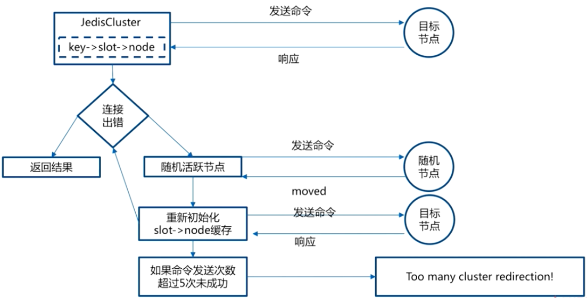

### 8.5 状态检测及维护

Cluster中每个节点都维护一份**在自己看来当前整个集群的状态**，主要包括：

- 当前集群状态。
- 集群中各节点所负责的slots信息，及其migrate状态。
- 集群中各节点的master-slave状态。
- 集群中各节点的存活状态及不可达投票。

当集群状态变化时，如新节点加入、slot迁移、节点宕机、slave提升为新master，希望这些变化尽快地被发现，传播到整个集群的所有节点并达成一致。节点之间相互的**心跳**（`PING`、`PONG`、`MEET`）及其携带的数据是集群状态传播最主要的途径。

#### Gossip协议

Gossip协议又称Epidemic协议，是基于流行病传播方式的节点或者进程之间信息交换的协议，在分布式系统中被广泛使用。

Gossip协议已经是P2P网络中比较成熟的协议了。Gossip协议的最大的好处是，**即使集群节点的数量增加，每个节点的负载也不会增加很多，几乎是恒定的。这就允许Consul管理的集群规模能横向扩展到数千个节点**。

##### Gossip协议的使用

Redis集群是去中心化的，彼此之间状态同步靠gossip协议通信，集群的消息有以下几种类型：

- `Meet`：通过`cluster meet ip port`命令，集群已有的节点会向新的节点发送邀请，加入现有集群。
- `Ping`：节点每秒会向集群中其他节点发送`ping`消息，消息中带有自己已知的两个节点的地址、槽、状态信息、最后一次通信时间等。
- `Pong`：节点收到`ping`消息后会回复`pong`消息，消息中同样带有自己已知的两个节点信息。
- `Fail`：节点`ping`不通某节点后，会向集群所有节点广播该节点挂掉的消息，其他节点收到消息后标记已下线。

##### 基于Gossip协议的故障检测

集群中的每个节点都会定期地向集群中的其他节点发送`PING`消息，以此交换各个节点状态信息，检测各个节点状态：**在线状态**、**疑似下线状态PFAIL**、**已下线状态FAIL**。

**自己保存信息**：当主节点A通过消息得知主节点B认为主节点C进入了疑似下线（PFAIL）状态时，主节点A会在自己的clusterState.nodes字典中找到主节点C所对应的clusterNode结构，将主节点B的下线报告添加到clusterNode结构的fail_reports链表中，并将关于结点C疑似下线的状态通过Gossip协议通知其他节点。

**一起裁定**：如果集群里面半数以上的主节点都将主节点C报告为疑似下线，那么主节点C将被标记为已下线（FAIL）状态，将主节点C标记为已下线的节点会向集群广播主节点C的FAIL消息，所有收到FAIL消息的节点都会立即更新nodes里面主节点C状态为已下线。

**最终裁定**：将node标记为FAIL需要满足以下两个条件：

- 有半数以上的主节点将node标记为PFAIL状态。
- 当前节点也将node标记为PFAIL状态。

#### 通讯状态和维护

##### 什么时候进行心跳？

Redis节点会记录其向每一个节点上一次发出`ping`和收到`pong`的时间，心跳发送时机与这两个值有关。通过下面的方式既能保证及时更新集群状态，又不至于使心跳数过多：

- 每次Cron向所有未建立连接的节点发送`ping`或`meet`。
- 每1秒从所有已知节点中随机选取5个，向其中上次收到`pong`最久远的一个发送`ping`。
- 每次Cron向收到`pong`超过timeout/2的节点发送`ping`。
- 收到`ping`或`meet`，立即回复`pong`。

##### 发送哪些心跳数据？

- Header，发送者自己的信息。
  - 所负责slots的信息。
  - 主从信息。
  - ip和port信息。
  - 状态信息。
- Gossip，发送者所了解的部分其他节点的信息。
  - ping_sent和pong_received。
  - ip和port信息。
  - 状态信息，比如发送者认为该节点已经不可达，会在状态信息中标记其为PFAIL或FAIL。

##### 如何处理心跳？

###### 新节点加入

1. 发送`meet`包加入集群；
2. 从`pong`包中的gossip得到未知的其他节点；
3. 循环上述过程，直到最终加入集群。

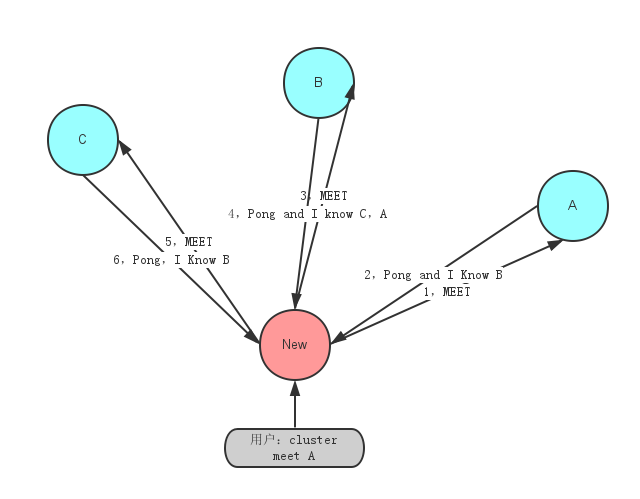

###### Slots信息

1. 判断发送者声明的slots信息和本地记录的是否有不同；
2. 如果不同，且发送者epoch较大，更新本地记录；
3. 如果不同，且发送者epoch小，发送Update信息通知发送者。

###### 主/从信息

发现发送者的master、slave信息变化，更新本地状态。

### 8.6 故障恢复

当Slave发现自己的Master变为FAIL状态时，便尝试进行Failover，以期成为新的Master。由于挂掉的Master可能会有多个Slave。Failover的过程需要经过类Raft协议的过程在整个集群内达到一致， 其过程如下：

1. Slave发现自己的Master变为FAIL；
2. 将自己记录的集群currentEpoch加1，并广播Failover Request信息；
3. 其他节点收到该信息，只有Master响应，判断请求者的合法性，并发送`FAILOVER_AUTH_ACK`，对每一个epoch只发送一次`ack`；
4. 尝试Failover的Slave收集`FAILOVER_AUTH_ACK`；
5. 超过半数后变成新Master；
6. 广播通知其他集群节点。

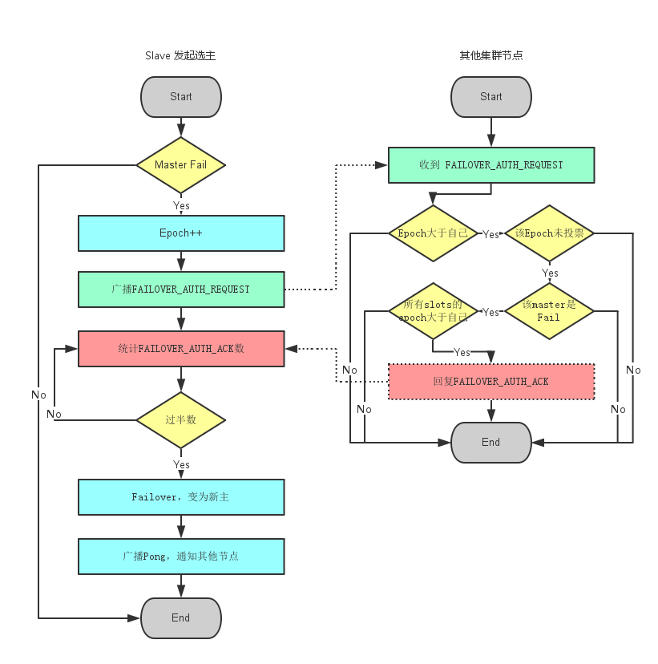

### 8.7 扩容/缩容

#### 扩容

当集群出现容量限制或者其他一些原因需要扩容时，Redis Cluster提供了比较优雅的集群扩容方案：

1. 首先将新节点加入到集群中，可以通过在集群中任何一个客户端执行`cluster meet 新节点ip:端口`，或者通过redis-trib工具`add node`添加，**新添加的节点默认在集群中都是主节点**；
2. 迁移数据：大致流程是，首先需要确定哪些槽需要被迁移到目标节点，然后获取槽中key，将槽中的key全部迁移到目标节点，然后向集群所有主节点广播槽（数据）全部迁移到了目标节点。

直接通过redis-trib工具做数据迁移很方便。现在假设将节点A的槽10迁移到B节点，过程如下：

```sh
B:cluster setslot 10 importing A.nodeId
A:cluster setslot 10 migrating B.nodeId
```

循环获取槽中key，将key迁移到B节点

```sh
A:cluster getkeysinslot 10 100
A:migrate B.ip B.port "" 0 5000 keys key1[ key2....]
```

向集群广播槽已经迁移到B节点

```sh
cluster setslot 10 node B.nodeId
```

#### 缩容

缩容的大致过程与扩容一致，需要判断下线的节点是否是主节点，以及主节点上是否有槽，若主节点上有槽，需要将槽迁移到集群中其他主节点，槽迁移完成之后，需要向其他节点广播该节点准备下线（`cluster forget nodeId`），最后需要将该下线主节点的从节点指向其他主节点，当然最好是先将从节点下线（避免全量复制）。

### 8.8 更深入理解

#### 为什么Redis Cluster的Hash Slot 是16384？

一致性hash算法是$2^{16}$，为什么hash slot是$2^{14}$呢？

在Redis节点发送心跳包时**需要把所有的槽放到这个心跳包里**，以便让节点知道当前集群信息，16384=16k，在发送心跳包时使用char进行bitmap压缩后是2k，2*8(8 bit)\*1024(1k)=16K，也就是说**使用2k的空间创建了16k的槽数**。

虽然使用CRC16算法最多可以分配65535（2^16-1）个槽位，65535=65k，压缩后就是8k（8 * 8 (8 bit) * 1024(1k) =65K），**也就是说需要8k的心跳包**，作者认为这样做不太值得；并且一般情况下一个Redis集群不会有超过1000个Master节点，所以**16k的槽位是个比较合适的选择**。

#### 为什么Redis Cluster中不建议使用发布/订阅呢？

在集群模式下，所有的`publish`命令都会向所有节点（包括从节点）进行广播，**这会造成每条`publish`数据都会在集群内所有节点传播一次，加重了带宽负担**，不建议使用。

### 补充1：数据分布理论选择

> 参考链接：[CSDN](https://blog.csdn.net/xiaofeng10330111/article/details/90384502?ops_request_misc=%257B%2522request%255Fid%2522%253A%2522165600291116782184663623%2522%252C%2522scm%2522%253A%252220140713.130102334.pc%255Fall.%2522%257D&request_id=165600291116782184663623&biz_id=0&utm_medium=distribute.pc_search_result.none-task-blog-2~all~first_rank_ecpm_v1~hot_rank-2-90384502-null-null.142^v21^control,157^v15^new_3&utm_term=redis+%E5%88%86%E7%89%87&spm=1018.2226.3001.4187)

#### 数据分布关注点

分布式数据库首先要解决的问题是：**把整个数据集按照分区规则映射到多个节点**，即把数据划分到多个节点上，每个节点负责整体数据的一个**子集**。重点关注与解决的主要是数据分区规则，常见的分区规则有**哈希分区**和**顺序分区**两种，分布式存储数据分区如下图：


哈希分区与顺序分区的主要对比如下表：

|          |                  哈希分区                  |                   顺序分区                   |
| :------: | :----------------------------------------: | :------------------------------------------: |
|   特点   | 离散度好、数据分区与业务无关、无法顺序访问 | 离散度容易倾斜、数据分布业务相关、可顺序访问 |
| 代表产品 |      Redis Cluster、Cassandra、Dynamo      |         Bigtable、HBase、Hypertable          |

由表可见Redis Cluster采用的是**哈希分区**，可行方法主要有以下三种方案，综合考虑，Redis Cluster采用的是**虚拟槽分区方案**。

#### 三种数据分布方案的对比

##### 节点取余分区方案

**实现思路**：使用特定的数据（Redis的键或用户ID），根据节点数量N使用公式计算哈希值：$hash(key)\%N$，决定数据映射到某一节点。

**优点**：简单，常用于数据库的分库分表规则，一般采用预分区的方式，提前根据数据量规划好分区数（例如划分为512或1024张表），保证可支撑未来一段时间的数据量，再根据负载情况将表迁移到其他数据库中。要求**扩容时采用翻倍扩容**，避免数据映射全部被打乱导致全量迁移的情况。

**缺点**：当节点数量变化时，即扩容或缩容节点时，数据节点映射关系需要重新计算，会导致数据的**重新迁移**。

具体分析案例如下图： 


解决方案：**翻倍扩容**可以使数据迁移从80%降到50%：


##### 一致性哈希分区方案

实现思路：为系统的每个节点分配一个token，范围一般在0~2^32^，这些token构成一个哈希环，数据读写执行节点查找操作时，先根据key计算hash值，然后**顺时针找到第一个大于等于该hash值的token节点**。


**优点**：加入和删除节点只影响哈希环中相邻的节点。

**缺点**：

- **加减节点会造成哈希环中部分数据无法命中**，所以应用于缓存场景是可以容忍的。
- 不适合少量数据节点的分布式方案。
- 普通一致性哈希分区在增减节点时**需要增加一倍或减去一半节点**才能保证数据和负载的均衡。

##### 虚拟槽分区方案（Redis Cluster方案）

实现思路：虚拟分槽使用良好的哈希函数**把所有数据映射到一个固定范围**（这个范围远远大于节点数，比如Redis Cluster槽的范围是0~16383）的整数集合中，**整数定义为槽（Slot）**。**槽是集群内数据管理和迁移的基本单位**。使用大范围槽的主要目的是为了**方便数据拆分和集群扩展**，要求每一个节点负责维护一部分槽以及所映射的键值数据。

基本计算公式为：$Slot=CRC16(key)\&16383$，具体如下：


**优点**：

- **解耦数据和节点**之间的关系，简化了节点扩容和收缩的难度。
- **节点自身维护槽的映射关系**，不需要客户端或者代理服务维护槽分区元数据。
- 支持节点、槽、键之间的映射关系，用于数据路由、在线伸缩等场景。

**缺点**，即集群功能限制的地方：

- **key批量操作支持有限**。对于映射为不同slot值的key，执行`mset`、`mget`等操作可能由于存在于多个节点上而不被支持。
- **key事务操作支持有限**。多个key分布在不同节点上时无法使用事务功能。
- key作为数据分区的最小粒度，**不能将一个大的键值对象如hash、list等映射到不同的节点**。
  不支持多数据库空间。单机下Redis可以支持16个数据库，集群模式下只能使用一个数据库空间，即db0。
- 复制结构只支持一层，从节点只能复制主节点，**不支持嵌套树状复制结构**。

### 补充2：预分片

> 参考链接：[Redis中文文档](https://www.redis.com.cn/topics/partitioning.html)

从分区的概念中知道分区有一个缺点：除非只把Redis当作缓存服务器来使用，**否则添加和删除Redis节点都会非常复杂**。相反使用固定的键值和实例映射更加简单。然而数据存储会经常需要变化。例如现在只需要10个Redis节点（实例），但是过几天可能就会需要50个节点。

因为Redis足够轻量和小巧（一个备用实例使用1M的内存）**，解决这个问题的简单方法就是一开始就使用大量的实例节点**。例如，32或者64个实例能够满足绝大多数的用户，并且可以为其提供足够的增长空间。

通过这样的方法，当数据存储需求增加时，**只需要更多的Redis服务器，然后把一个节点移动到另外的服务器上面**。一旦添加了额外的服务器，需要将一半的Redis实例移动到第二个服务器，以此类推。

可以使用Redis的主从复制来减少服务的停止时间：

- 在新服务器上开启新的Redis空实例；
- 将节点的数据配置移动到新的**从服务器**上；
- 停止Redis客户端；
- 在新的服务器上**更新IP地址到移动过来的节点配置文件中**；
- 发送`SLAVEOF NO ONE`命令到新服务器的从节点；
- 使用新的配置重启客户端；
- 最后关闭老服务器上不再使用的节点。

## 九、缓存问题:rocket:

> 参考链接：[Java全栈知识体系](https://pdai.tech/md/db/nosql-redis/db-redis-x-cache.html)
>

### 9.1 为什么要理解Redis缓存问题？

在高并发的业务场景下，数据库大多数情况都是用户并发访问最薄弱的环节。所以就需要使用Redis做一个**缓冲操作**，让请求先访问到Redis，而不是直接访问Mysql等数据库。这样可以大大缓解数据库的压力。当缓存库出现时，必须要考虑如下问题：缓存穿透、缓存穿击、缓存雪崩、缓存污染（或者满了）、缓存和数据库一致性。

### 9.2 缓存穿透

#### 问题来源

缓存穿透是指**缓存和数据库中都没有的数据**，而用户不断发起请求。由于缓存是不命中时被动写的，并且出于容错考虑，如果从存储层查不到数据则不写入缓存，这将**导致这个不存在的数据每次请求都要到存储层去查询，失去了缓存的意义**。在流量大时，可能DB就挂掉了，要是有人利用不存在的key频繁攻击应用，这就是漏洞。

#### 解决方案

- 接口层增加**校验**，如用户鉴权校验，id做基础校验，id<=0的直接拦截。
- 从缓存取不到的数据，在数据库中也没有取到，这时也可以将**key-value对写为key-null**，缓存有效时间可以设置短点，如30秒（设置太长会导致正常情况也没法使用）。这样可以防止攻击用户反复用同一个id暴力攻击。
- 布隆过滤器。**bloomfilter**就类似于一个HashSet，用于快速判断某个元素是否存在于集合中，其典型的应用场景就是**快速判断一个key是否存在于某容器，不存在就直接返回**。布隆过滤器的关键就在于hash算法和容器大小。

### 9.3 缓存击穿

#### 问题来源

缓存击穿是指**缓存中没有但数据库中有的数据（一般是缓存时间到期）**，这时由于并发用户特别多，同时读缓存没读到数据，又同时去数据库去取数据，引起数据库压力瞬间增大，造成过大压力。

#### 解决方案

- **设置热点数据永远不过期**。
- **限流、熔断、降级**。重要的接口一定要做好限流策略，防止用户恶意刷接口，同时要降级准备，当接口中的某些服务不可用时候，进行熔断，失败快速返回机制。
- 加互斥锁。

### 9.4 缓存雪崩

#### 问题来源

缓存雪崩是指缓存中**数据大批量到过期时间，而查询数据量巨大，引起数据库压力过大甚至宕机**。和缓存击穿不同的是，**缓存击穿指并发查同一条数据，缓存雪崩是不同数据都过期了，很多数据都查不到从而查数据库**。

#### 解决方案

- 缓存数据的**过期时间设置随机**，防止同一时间大量数据过期现象发生。
- 如果缓存数据库是分布式部署，将**热点数据均匀分布在不同的缓存数据库中**。
- 设置热点数据永远不过期。

### 9.5 缓存污染（或满）

缓存污染问题说的是缓存中一些只会被访问一次或者几次的的数据，被访问完后，**再也不会被访问到**，但这部分**数据依然留存在缓存中，消耗缓存空间**。

缓存污染会随着数据的持续增加而逐渐显露，随着服务的不断运行，**缓存中会存在大量的永远不会再次被访问的数据**。缓存空间是有限的，如果缓存空间满了，再往缓存里写数据时就会有额外开销，影响Redis性能。**这部分额外开销主要是指写的时候判断淘汰策略，根据淘汰策略去选择要淘汰的数据，然后进行删除操作**。

#### 最大缓存设置多大

系统的设计选择是一个权衡的过程：大容量缓存是能带来性能加速的收益，但是成本也会更高，而小容量缓存不一定就起不到加速访问的效果。一般来说，**建议把缓存容量设置为总数据量的15%到30%，兼顾访问性能和内存空间开销**。

对于Redis来说，可以使用下面这个命令来设定缓存大小：

```sh
CONFIG SET maxmemory 4gb
```

不过，缓存被写满是不可避免的，所以需要淘汰策略。

#### 缓存淘汰策略

> 参考链接：[Redis文档](https://redis.io/docs/manual/eviction/#eviction-policies)

Redis共支持八种淘汰策略，分别是`noeviction`、`volatile-random`、`volatile-ttl`、`volatile-lru`、`volatile-lfu`、`allkeys-lru`、`allkeys-random`和`allkeys-lfu`策略。


主要可以分成三类：

- 不淘汰
  - `noeviction`（Redis 4.0后默认的）
- 在设置了过期时间的数据中淘汰
  - 随机：`volatile-random`
  - lru：`volatile-lru`
  - lfu：`volatile-lfu`：Redis 4.0后新增。
  - ttl：`volatile-ttl`
- 在全部数据中淘汰
  - 随机：`allkeys-random`
  - lru：`allkeys-lru`：**推荐使用**。
  - lfu：`allkeys-lfu`，Redis 4.0后新增。

|       策略        |                             说明                             |
| :---------------: | :----------------------------------------------------------: |
|   `noeviction`    | Redis**默认策略**，一旦缓存被写满就不再提供服务（存储值），而是**返回错误**。无法解决缓存污染问题，一般生产环境不建议使用。 |
| `volatile-random` | 在设置了过期时间的键值对中，进行随机删除。因为是随机删除，**无法确保把不再访问的数据筛选出来**，所以可能依然会存在缓存污染现象。 |
|  `volatile-lru`   |   在设置了过期时间的键值对中，移除**最近最少使用**的数据。   |
|  `volatile-lfu`   | 如果两个数据使用次数相同，**移除距离上一次使用时间更久的数据**。 |
|  `volatile-ttl`   |       在设置了过期时间的键值对中，移除最早过期的数据。       |
| `allkeys-random`  | 从所有键值对中随机选择并删除数据。随机删除就**无法解决缓存污染问题**。 |
|   `allkeys-lru`   |                            同上。                            |
|   `allkeys-lfu`   |                            同上。                            |

**Redis中的LRU**：

Redis会记录每个数据的最近一次被访问的时间戳。在Redis在决定淘汰的数据时，第一次会随机选出N个数据作为一个候选集合。接下来，Redis会比较这N个数据的lru字段，把lru字段值最小的数据从缓存中淘汰出去。**通过随机读取待删除集合，可以让Redis不用维护一个巨大的链表，也不用操作链表，进而提升性能**。

Redis选出的数据个数N，通过配置参数`maxmemory-samples`进行配置。个数N越大，则候选集合越大，选择到的最久未被使用的就更准确，N越小，选择到最久未被使用的数据的概率也会随之减小。

**Redis中的LFU**：

当使用LFU策略筛选数据时，Redis会在候选集合中，根据数据**lru字段的后8bit选择访问次数最少的数据**进行淘汰。当访问次数相同时，**再根据lru字段的前16bit值大小，选择访问时间最久远的数据**进行淘汰。

Redis只使用了8bit记录数据的访问次数，而8bit记录的最大值是255，这样在访问快速的情况下，如果每次被访问就将访问次数加一，很快某条数据就达到最大值255，可能很多数据都是255，那么退化成LRU算法了。所以Redis为了解决这个问题，**实现了一个更优的计数规则**，并可以通过配置项，来控制计数器增加的速度。

**参数** ：

`lfu-log-factor`：用计数器当前的值乘以配置项`lfu_log_factor`再加1，再取其倒数，得到一个p值；然后把这个p值和一个取值范围在（0，1）间的随机数r值比大小，只有p值大于r值时计数器才加 1。

`lfu-decay-time`：控制访问次数衰减。LFU策略会计算当前时间和数据最近一次访问时间的差值，并把这个差值换算成以**分钟为单位**。然后，LFU策略再把这个差值除以`lfu_decay_time`值，所得的结果就是数据counter要衰减的值。

`lfu-log-factor`设置越大，递增概率越低；`lfu-decay-time`设置越大，衰减速度会越慢。

在应用LFU策略时，一般可以将`lfu_log_factor`取值为10。如果业务应用中有短时高频访问的数据的话，建议把`lfu_decay_time`值设置为 1，可以快速衰减访问次数。

### 9.6 数据库和缓存一致性:rocket:

> 参考链接：[Kaito's Blog](http://kaito-kidd.com/2021/09/08/how-to-keep-cache-and-consistency-of-db/)

#### 引入缓存提高性能

从最简单的场景开始讲起。

如果业务处于起步阶段（流量非常小），那无论是读请求还是写请求，直接操作数据库即可，这时架构模型是这样的：


但随着业务量的增长，项目请求量越来越大，这时如果每次都从数据库中读数据，那肯定会有性能问题。这个阶段通常的做法是，引入**缓存**来提高读性能，架构模型就变成了这样：


但引入缓存之后就会面临一个问题：**之前数据只存在数据库中，现在要放到缓存中读取，具体要怎么存呢？**

最简单直接的方案是**全量数据刷到缓存中**：

- 数据库的数据，全量刷入缓存（不设置失效时间）；
- 写请求只更新数据库，不更新缓存；
- 启动一个定时任务，**定时**把数据库的数据，更新到缓存中。


这个方案的优点是：所有读请求都可以直接**命中**缓存，不需要再查数据库，性能非常高。但缺点也很明显，有2个问题：

- **缓存利用率低**：不经常访问的数据，还一直留在缓存中。
- **数据不一致**：因为是**定时**刷新缓存，缓存和数据库存在不一致（取决于定时任务的执行频率）。

所以这种方案一般更适合业务**体量小**，且**对数据一致性要求不高**的业务场景。那如果业务体量很大，怎么解决这2个问题呢？

#### 缓存利用率和数据一致性问题

##### 如何提高缓存利用率？

想要缓存利用率**最大化**，很容易想到的方案是：缓存中只保留最近访问的**热数据**。但具体要怎么做呢？可以这样优化：

- 写请求依旧只写数据库；
- 读请求**先读缓存，如果缓存不存在，则从数据库读取，并重建缓存**；
- 同时，**写入缓存中的数据都设置失效时间**。


这样一来，随着时间的推移，缓存中不经常访问的数据都会**逐渐过期淘汰掉**，最终缓存中保留的，都是经常被访问的**热数据**，缓存利用率得以最大化。

##### 数据一致性问题

一致性就是数据保持一致，在分布式系统中，可以理解为多个节点中数据的值是一致的。

> 参考链接：[掘金](https://juejin.cn/post/6964531365643550751)

- **强一致性**：这种一致性级别是**最符合用户直觉**的，它要求**系统写入什么，读出来的也会是什么**，用户体验好，但实现起来往往对系统的性能影响大。
- **弱一致性**：这种一致性级别约束了系统在写入成功后，**不承诺立即可以读到写入的值，也不承诺多久之后数据能够达到一致，但会尽可能地保证到某个时间级别（比如秒级别）后，数据能够达到一致状态**。
- **最终一致性**：最终一致性是弱一致性的一个特例，**系统会保证在一定时间内，能够达到一个数据一致的状态**。这里之所以将最终一致性单独提出来，是因为它是弱一致性中非常推崇的一种一致性模型，也是业界在大型分布式系统的数据一致性上比较推崇的模型。

要想保证缓存和数据库**实时**一致，那就不能再用定时任务刷新缓存了。所以当数据发生更新时，不仅要操作数据库，还要一并操作缓存。具体操作就是，**修改一条数据时，不仅要更新数据库，也要连带缓存一起更新**。但数据库和缓存都更新，又存在先后问题，那对应的方案就有2个：

- 先更新缓存，后更新数据库。
- 先更新数据库，后更新缓存。

哪个方案更好呢？**先不考虑并发问题**，正常情况下，无论谁先谁后，都可以让两者保持一致，但现在需要重点考虑异常情况。因为操作分为两步，那么就很有可能存在**第一步成功、第二步失败**的情况发生。这2种方案一个个分析。

###### 2种方案具体分析

- **先更新缓存、后更新数据库**：如果缓存更新成功了，但数据库更新失败，那么此时缓存中是**最新值**，但数据库中是**旧值**。虽然此时读请求可以命中缓存，拿到正确的值，但是，一旦缓存**失效**，就会从数据库中读取到**旧值**，重建缓存也是这个**旧值**。这时用户会发现自己之前修改的数据**又变回去**了，对业务造成影响。
- **先更新数据库、后更新缓存**：如果数据库更新成功了，但缓存更新失败，那么此时数据库中是**最新值**，缓存中是**旧值**。之后的读请求读到的都是旧数据，只有当缓存**失效**后，才能从数据库中得到正确的值。这时用户会发现，自己刚刚修改了数据，但却看不到变更，一段时间过后，数据才变更过来，对业务也会有影响。

**可见**，无论谁先谁后，但凡后者发生异常，就会对业务造成影响。那怎么解决这个问题呢？**后面会详细给出对应的解决方案**。下面继续分析：除了操作失败问题，还有什么场景会影响数据一致性？这里还需要重点关注：**并发问题**。

#### 并发引起的一致性问题

假设采用**先更新数据库，再更新缓存**的方案，并且两步都可以**成功执行**的前提下，如果存在并发，情况会是怎样的呢？有线程A和线程B需要更新**同一条**数据，会发生这样的场景：

1. 线程A更新数据库（X = 1）；
2. 线程B更新数据库（X = 2）；
3. 线程B更新缓存（X = 2）；
4. 线程A更新缓存（X = 1）。

最终X在缓存中是1，在数据库中是2，**发生不一致**。也就是说，A虽然先于B发生，**但B操作数据库和缓存的时间却要比A的时间短**，执行时序发生**错乱**，最终这条数据结果是不符合预期的。（同样地，采用先更新缓存，再更新数据库的方案，也会有类似问题。）

那怎么解决这个问题呢？这里通常的解决方案是：**加分布式锁**。两个线程要修改**同一条**数据，每个线程在改之前，先去申请分布式锁，**拿到锁的线程才允许更新数据库和缓存**，拿不到锁的线程，返回失败，等待下次重试。这么做的目的，就是为了**只允许一个线程去操作数据和缓存，避免并发问题**。

但是从**缓存利用率**的角度来评估这个方案，是不太推荐的。这是因为每次数据发生变更，都**无脑**更新缓存，但是缓存中的数据不一定会被**马上读取**，这就会导致缓存中可能存放了很多不常访问的数据，浪费缓存资源。而且很多情况下，写到缓存中的值，并不是与数据库中的值一一对应的，**很有可能是先查询数据库，再经过一系列计算得出一个值，才把这个值才写到缓存中**。

由此可见，这种**更新数据库+更新缓存**的方案，不仅缓存利用率不高，还会造成机器性能的浪费。所以此时需要考虑另外一种方案：**删除缓存**。

#### 删除缓存可以保证一致性么？

删除缓存对应的方案也有2种：

- 先删除缓存，后更新数据库。
- 先更新数据库，后删除缓存。

同样地，先来看**第二步**操作失败的情况：

- 先删除缓存，后更新数据库：**第二步操作失败，数据库没有更新成功**，那下次读缓存发现不存在，则从数据库中读取，并重建缓存，此时数据库和缓存依旧保持一致（**但是是旧值，没更新成功**）。
- 如果是先更新数据库，后删除缓存：**第二步操作失败，数据库是最新值，缓存中是旧值**，发生不一致。所以，这个方案依旧存在问题。

总之，和前面提到的问题类似，第二步失败依旧有不一致的风险。接下来关注**并发**问题，这个问题是需要关注的重点。

##### 并发下的2种方案

**先删除缓存、后更新数据库**：

如果有2个线程要**并发读写**数据，可能会发生以下场景：

1. 线程A要更新X=2（原值X=1）；
2. 线程A先删除缓存；
3. 线程B读缓存，发现不存在，从数据库中读取到旧值（X=1）；
4. 线程A将新值写入数据库（X=2）；
5. 线程B将旧值写入缓存（X=1）。

最终X的值在缓存中是1（旧值），在数据库中是2（新值），**发生不一致**。

可见，先删除缓存，后更新数据库，当发生**读+写**并发时，还是存在数据不一致的情况。

**先更新数据库、后删除缓存**：

依旧是2个线程**并发读写**数据：

1. 缓存中X不存在（数据库X=1）；
2. 线程A读取数据库，得到旧值（X=1）；
3. 线程B更新数据库（X=2）；
4. 线程B删除缓存；
5. 线程A将旧值写入缓存（X=1）。

最终X的值在缓存中是1（旧值），在数据库中是2（新值），**也发生不一致**。

这种情况**理论**来说是可能发生的，但实际真的有可能发生吗？其实概率**很低**，这是因为它必须同时满足3个条件：

- 缓存刚好已失效。
- 读请求+写请求并发。
- 更新数据库+删除缓存的时间（步骤3-4），要比读数据库+写缓存时间短（步骤2和5）

仔细想一下，其中条件3发生的概率其实是非常低的：因为写数据库一般会先**加锁**，所以**写数据库，通常是要比读数据库的时间更长的**。这么来看，**先更新数据库、后删除缓存**的方案，是可以保证数据一致性的。所以应该采用这种方案来操作数据库和缓存。

解决了并发问题，需要反过来看前面遗留的问题：**第二步执行失败导致数据不一致**。

#### 如何保证两步都执行成功？

前面分析到，无论是更新缓存还是删除缓存，只要第二步失败，就会导致数据库和缓存不一致。**保证第二步成功执行，就是解决问题的关键**。

##### 同步重试

想一下，程序在执行过程中发生异常，最简单的解决办法是什么？答案是：**重试**。无论是先操作缓存，还是先操作数据库，但凡后者执行失败了，就可以发起重试，尽可能地去做**补偿**。

那这是不是意味着，只要执行失败，**无脑重试**就可以了呢？答案是否定的。现实情况往往没有想的这么简单，失败后立即重试的问题在于：

- 立即重试很大概率**还会失败**。
- **重试次数**设置多少才合理？
- 重试会一直**占用**这个线程资源，无法服务其它客户端请求。

所以这种**同步重试**的方案依旧不严谨。那更好的方案应该怎么做？答案是：**异步重试**。什么是异步重试？

##### 消息队列

其实就是把**重试请求写到消息队列**中，然后由专门的**消费者**来重试，直到成功；或者更直接的做法，为了避免第二步执行失败，可以把**操作缓存这一步直接放到消息队列**中，由消费者来操作缓存。

到这里也可能有问题：**写消息队列也有可能会失败啊？而且，引入消息队列，这又增加了更多的维护成本，这样做值得吗？**

这个问题很好，但思考这样一个问题：**如果在执行失败的线程中一直重试，还没等执行成功，此时如果项目重启了，那这次重试请求也就丢失了，这条数据就一直不一致了**。

所以，这里必须**把重试请求或第二步操作放到另一个服务**中，这个服务用**消息队列**最为合适。这是因为消息队列的特性，正好符合需求：

- **消息队列保证可靠性**：写到队列中的消息，成功消费之前不会丢失（重启项目也不担心）。
- **消息队列保证消息成功投递**：下游从队列拉取消息，成功消费后才会删除消息，否则还会继续投递消息给消费者（符合重试的需求）

至于写队列失败和消息队列的维护成本问题：

- **写队列失败**：操作缓存和写消息队列**同时失败**的概率其实是很小的。
- **维护成本**：项目中一般都会用到消息队列，维护成本并没有新增很多。

所以，引入消息队列来解决这个问题，是比较合适的。这时架构模型就变成了这样：

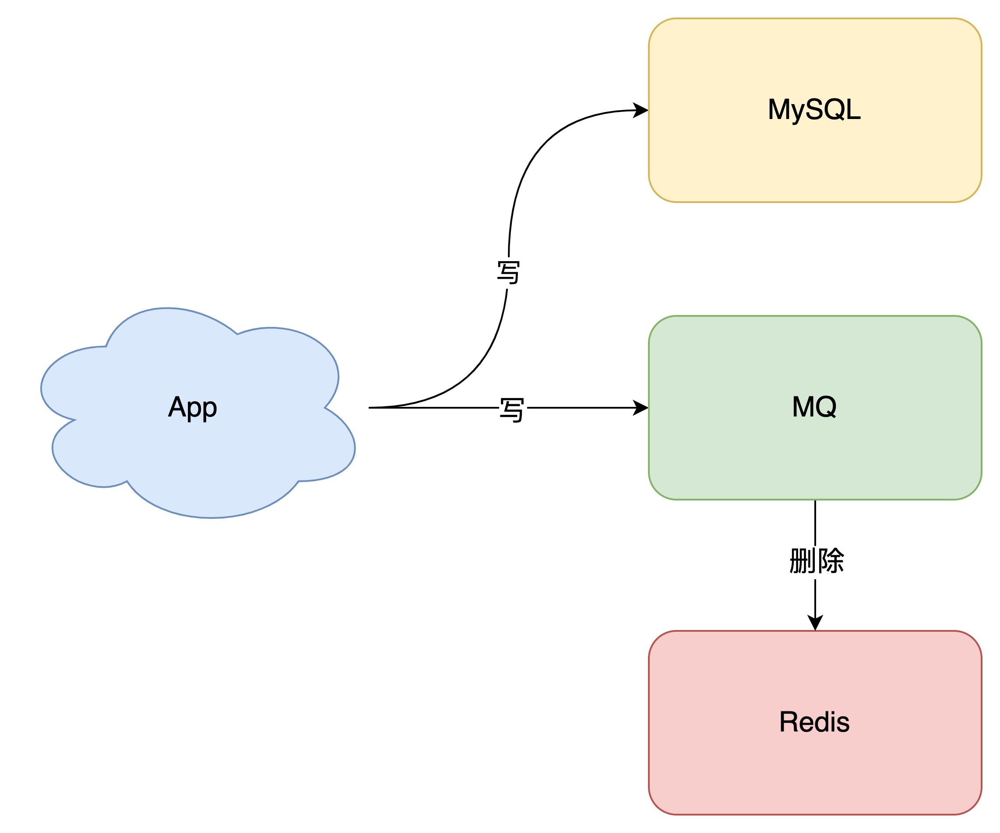

##### 变更日志

如果确实不想在应用中去写消息队列，是否有更简单的方案，同时又可以保证一致性呢？方案还是有的，这就是近几年比较流行的解决方案：**订阅数据库变更日志，再操作缓存**。

具体来讲就是，业务应用在修改数据时，**只需修改数据库，无需操作缓存**。那什么时候操作缓存呢？这就和数据库的**变更日志**有关了。拿MySQL举例，**当一条数据发生修改时，MySQL就会产生一条变更日志（Binlog）**，可以订阅这个日志拿到具体操作的数据，然后再根据这条数据去删除对应的缓存。


订阅变更日志，目前也有了比较成熟的开源中间件，例如阿里的**Canal**，使用这种方案的优点在于：

- **无需考虑写消息队列失败情况**：只要写MySQL成功，Binlog肯定会有。
- **自动投递到下游队列**：Canal自动把数据库变更日志**投递**给下游的消息队列。

当然也是需要投入精力去维护Canal的高可用和稳定性。

至此，可以得出结论：想要保证数据库和缓存一致性，**推荐采用“先更新数据库、再删除缓存”方案，并配合消息队列或订阅变更日志的方式来做**。

#### 主从库延迟和延迟双删问题

到这里还有2个问题是没有重点分析过的。

**第一个问题**：前面讲到的**先删除缓存，再更新数据库**导致不一致的场景。

**第二个问题**：**读写分离+主从复制延迟**情况下，缓存和数据库一致性的问题。

如果使用**先更新数据库，再删除缓存**方案，其实也发生不一致：

1. 线程A更新主库X=2（原值X=1）；
2. 线程A删除缓存；
3. 线程B查询缓存，没有命中，查询**从库**得到旧值（从库X=1）；
4. 从库**同步**完成（主从库X=2）；
5. 线程B将**旧值**写入缓存（X=1）。

最终X的值在缓存中是1（旧值），在主从库中是2（新值），也**发生不一致**。

这2个问题的核心都在于：**缓存都被回种了旧值**。

那怎么解决这类问题呢？最有效的办法就是：**把缓存删掉**。但是，不能立即删，而是需要**延迟删**，这就是业界给出的方案：**缓存延迟双删策略**。

按照延时双删策略，这2个问题的解决方案是这样的：

**解决第一个问题**：在线程A删除缓存、更新完数据库之后，**先休眠一会**，再删除一次缓存。

**解决第二个问题**：线程A可以生成一条**延时消息**，写到消息队列中，消费者**延时删除**缓存。

这两个方案的目的都是为了**把缓存清掉**，这样一来，下次就可以从数据库读取到最新值，写入缓存。

但问题来了，这个**延迟删除**缓存，延迟时间到底设置要多久呢？

- 延迟时间要**大于主从复制**的延迟时间。
- 延迟时间要**大于线程B读取数据库+写入缓存的时间**。

但是，**这个时间在分布式和高并发场景下，其实是很难评估的。**很多时候都是凭借经验大致估算这个延迟时间，例如延迟1-5s，只能尽可能地降低不一致的概率。

所以采用这种方案也只是**尽可能保证一致性**而已，极端情况下，还是有可能发生不一致。所以实际使用中，还是建议采用**先更新数据库，再删除缓存**的方案，同时，要尽可能地保证**主从复制不要有太大延迟**，降低出问题的概率。

#### 可以做到强一致性么？

如果就想让缓存和数据库**强一致**，到底能不能做到呢？**其实很难**。

要想做到强一致，最常见的方案是2PC、3PC、Paxos、Raft这类一致性协议，但它们的**性能往往比较差**，而且这些方案也比较复杂，还要**考虑各种容错问题**。

相反，这时需要换个角度思考一下，**引入缓存的目的是什么**？就是为了**性能**。一旦决定使用缓存，那必然要面临一致性问题。性能和一致性就像天平的两端，无法做到都满足要求。

而且，就拿前面讲到的方案来说，当操作数据库和缓存完成之前，只要有**其它请求可以进来**，都有可能查到**中间状态的数据**。所以如果非要追求强一致，那必须要求**所有更新操作完成之前期间，不能有任何请求进来**。虽然可以通过加**分布锁**的方式来实现，但也要付出相应的代价，甚至很可能会超过引入缓存带来的性能提升。

综上，既然决定使用缓存，就必须**容忍一致性问题**，只能尽可能地去降低问题出现的概率。同时也要知道，**缓存都是有失效时间的**，就算在这期间存在短期不一致，依旧有**失效时间来兜底**，这样也能达到**最终一致**。

#### 总结

- 想要提高应用的性能，可以引入**缓存**来解决。
- 引入缓存后，需要**考虑缓存和数据库一致性问题**，可选的方案有：**更新数据库+更新缓存**、**更新数据库+删除缓存**。
- **更新数据库+更新缓存**方案，在**并发**场景下无法保证缓存和数据一致性，解决方案是加**分布锁**，但这种方案存在**缓存资源浪费**和**机器性能浪费**的情况。
- 采用**先删除缓存、再更新数据库**方案，在**并发**场景下依旧有不一致问题，解决方案是**延迟双删**，但这个**延迟时间很难评估**。
- 采用**先更新数据库、再删除缓存**方案，为了保证两步都成功执行，需配合**消息队列**或**订阅变更日志**的方案来做，本质是通过**重试**的方式保证数据最终一致。
- 采用**先更新数据库、再删除缓存**方案，**读写分离+主从库延迟**也会导致缓存和数据库不一致，缓解此问题的方案是**延迟双删**，凭借经验发送**延迟消息**到队列中，**延迟删除缓存**，同时也要**控制主从库延迟**，尽可能降低不一致发生的概率。

#### 后记（博客作者的4点心得）

- 性能和一致性不能同时满足，为了性能考虑，通常会采用**最终一致性**的方案。
- 掌握缓存和数据库一致性问题，核心问题有3点：**缓存利用率**、**并发**、**缓存+数据库一起成功**。
- 失败场景下要保证一致性，常见手段就是**重试**，同步重试会影响吞吐量，所以通常会采用**异步重试**的方案。
- 订阅变更日志的思想，本质是把**权威数据源（例如MySQL）当做leader副本**，让**其它异质系统（例如Redis/Elasticsearch）成为它的follower副本**，通过**同步变更日志**的方式，保证**leader和follower之间的一致性**。

#### 补充：3个经典的缓存模式

> 参考链接：[掘金](https://juejin.cn/post/6964531365643550751)

##### Cache-Aside Pattern

Cache-Aside Pattern，即**旁路缓存模式**，它的提出是为了尽可能地解决缓存与数据库的数据不一致问题。

读流程：

1. 读的时候，先读缓存，缓存命中的话，直接返回数据；
2. 缓存没有命中的话，就去读数据库，从数据库取出数据，放入缓存后，同时返回响应。


写流程：

更新的时候，先**更新数据库，然后再删除缓存**。


##### Read-Through/Write-Through（读写穿透）

Read/Write Through模式中，服务端把缓存作为主要数据存储。应用程序跟数据库缓存交互，都是通过**抽象缓存层**完成的。

###### Read-Through

简要流程：


1. 从缓存读取数据，读到直接返回；
2. 如果读取不到的话，从数据库加载，写入缓存后，再返回响应。

其实Read-Through就是多了一层**`Cache-Provider`**，流程如下：


###### Write-Through

Write-Through模式下，当发生写请求时，也是由**缓存抽象层**完成数据源和缓存数据的更新，流程如下：


##### Write Behind（异步缓存写入）

Write Behind跟Read-Through/Write-Through有相似的地方，都是由`Cache Provider`来负责缓存和数据库的读写，但有个很大的不同：**Read/Write-Through是同步更新缓存和数据的，Write Behind则是只更新缓存，不直接更新数据库，通过批量异步的方式来更新数据库**。


这种方式下，缓存和数据库的一致性不强，**对一致性要求高的系统要谨慎使用**。但是它适合频繁写的场景，MySQL的**InnoDB Buffer Pool机制**就使用到这种模式。

## 十、过期删除策略:airplane:

> 参考链接：[腾讯云](https://cloud.tencent.com/developer/article/1643921)

### 10.1 3种过期删除策略

Redis的过期策略就是指当Redis中缓存的key过期了以后，Redis是如何处理的。通常有以下3种：

- **定时删除：**每个设置过期时间的key都需要创建一个定时器，到过期时间就会立即清除。**该策略可以立即清除过期的数据，对内存很友好；但是会占用大量的CPU资源去处理过期的数据，从而影响缓存的响应时间和吞吐量**。

- **惰性删除**：服务器不会主动删除数据，只有当访问一个key时，才会判断该key是否已过期，过期则清除。**该策略可以最大化地节省CPU资源，却对内存非常不友好**。极端情况可能出现大量的过期key没有再次被访问，从而不会被清除，占用大量内存。
- **定期删除**：每隔一定的时间，**扫描一定数量的数据库的expires字典中一定数量的key**，并清除其中已过期的key。**该策略是前两者的一个折中方案。通过调整定时扫描的时间间隔和每次扫描的限定耗时，可以在不同情况下使得CPU和内存资源达到最优的平衡效果**。

Redis中同时使用**惰性删除和定期删除**两种策略。

补充：在主从复制场景下，为了主从节点的数据一致性，**从节点不会主动删除数据，而是由主节点控制从节点中过期数据的删除**。由于主节点的惰性删除和定期删除策略，都不能保证主节点及时对过期数据执行删除操作，因此，**当客户端通过Redis从节点读取数据时，很容易读取到已经过期的数据**。Redis 3.2中，从节点在读取数据时，增加了对数据是否过期的判断：如果该数据已过期，则不返回给客户端。将Redis升级到3.2版本可以解决数据过期问题。

### 10.2 与缓存淘汰策略的联系

- **过键删除策略强调的是对过期键的操作**，如果有键过期了，而缓存还足够，不会使用缓存淘汰机制，这时也会使用过期键删除策略删除过期键。
- **缓存淘汰机制强调的是对内存的操作**，如果内存不够了，**即使有的键没有过期，也要删除一部分，同时也针对没有设置过期时间的键**。

## 十一、Redis线程模型:airplane:

> 参考链接：[JavaGuide](https://javaguide.cn/database/redis/redis-questions-01.html#redis-%E7%BA%BF%E7%A8%8B%E6%A8%A1%E5%9E%8B)

### 11.1 Redis单线程模型

**Redis基于Reactor模式来设计开发了自己的一套高效的事件处理模型**，这套事件处理模型对应的是Redis中的文件事件处理器（File Event Handler）。由于文件事件处理器是单线程方式运行的，所以一般都说Redis是单线程模型。

**既然是单线程，那怎么监听大量的客户端连接呢？**

Redis通过**I/O多路复用程序**来监听来自客户端的大量连接（或者说是监听多个Socket），它会将感兴趣的事件及类型（读、写）注册到内核中并监听每个事件是否发生。这样的好处非常明显：**I/O多路复用技术的使用让Redis不需要额外创建多余的线程来监听客户端的大量连接，降低了资源的消耗**（和NIO中的`Selector`组件很像）。

文件事件处理器主要包含4个部分：

- 多个Socket（客户端连接）。
- I/O多路复用程序（支持多个客户端连接的关键）。
- 文件事件分派器（将Socket关联到相应的事件处理器）。
- 事件处理器（连接应答处理器、命令请求处理器、命令回复处理器）。

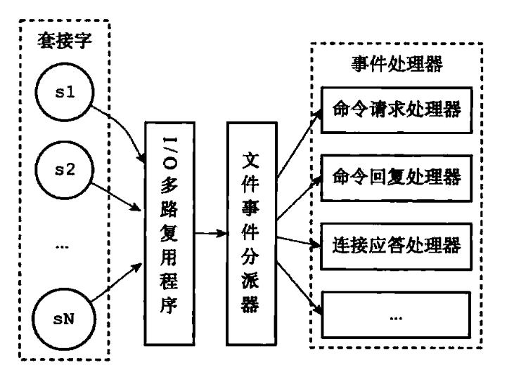

多个Socket可能会并发产生不同的操作，每个操作对应不同的文件事件，但是I/O多路复用程序会监听多个Socket，会将Socket产生的事件放入队列中排队，事件分派器每次从队列中取出一个事件，把该事件交给对应的事件处理器进行处理。**客户端与Redis的一次通信过程**：

> 参考：/Reference/java面经/Redis篇/6

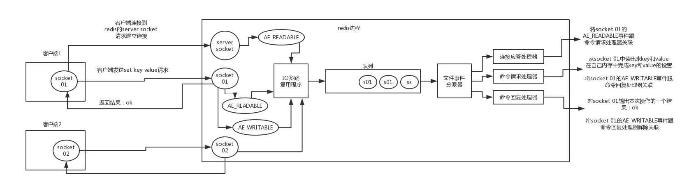

1. **客户端Socket01向Redis的Server Socket请求建立连接**，此时Server Socket会产生一个`AE_READABLE`事件，I/O多路复用程序监听到这个事件后，将该事件压入队列中。**文件事件分派器从队列中获取该事件，并交给连接应答处理器**。连接应答处理器会创建一个能与客户端通信的Socket01，并将该Socket01的`AE_READABLE`事件与命令请求处理器关联；
2. 假设此时客户端发送了一个`set key value`请求，此时Redis中的Socket01会产生`AE_READABLE`事件，I/O多路复用程序将事件压入队列，此时事件分派器从队列中获取到该事件。**由于前面Socket01的`AE_READABLE`事件已经与命令请求处理器关联，因此事件分派器将事件交给命令请求处理器来处理**。命令请求处理器读取Socket01的`set key value`并在自己内存中完成相关设置。**操作完成后，它会将Socket01的`AE_WRITABLE`事件与命令回复处理器关联**；
3. 如果此时客户端准备好接收返回结果了，那么Redis中的Socket01会产生一个`AE_WRITABLE`事件，同样压入队列中，事件分派器找到相关联的命令回复处理器，**由命令回复处理器对Socket01输出本次操作的结果**，比如`ok`，之后**解除Socket01的`AE_WRITABLE`事件与命令回复处理器的关联**。

### 11.2 Redis 6.0之前为什么不使用多线程？

虽然说Redis是单线程模型，但是实际上，**Redis在4.0之后的版本中就已经加入了对多线程的支持。**不过，Redis 4.0增加的多线程主要是**针对一些大键值对的删除操作的命令**，使用这些命令就会使用主处理之外的其他线程来“异步处理”。大体上来说，**Redis 6.0之前主要还是单线程处理。**

**Redis 6.0之前为什么不使用多线程？**

- 单线程编程容易并且更容易维护。
- Redis的性能瓶颈不在CPU，主要在内存和网络。
- 多线程就会存在死锁、线程上下文切换等问题，甚至会影响性能。

### 11.3 Redis 6.0之后为什么引入了多线程？

**Redis 6.0引入多线程主要是为了提高网络I/O读写性能**，因为这个算是Redis中的一个性能瓶颈（Redis的瓶颈主要受限于内存和网络）。虽然Redis 6.0引入了多线程，但**只是在网络数据的读写这类耗时操作上使用了**，执行命令仍然是单线程顺序执行，因此也不需要担心线程安全问题。

Redis 6.0的多线程默认是禁用的，只使用主线程。如需开启需要修改配置文件`redis.conf`：

```sh
io-threads-do-reads yes
```

开启多线程后，还需要设置线程数，否则是不生效的，同样是修改配置文件`redis.conf`：

```sh
io-threads 4 #官网建议4核的机器建议设置为2或3个线程，8核的建议设置为6个线程
```

## 十二、实现分布式锁:airplane:

> 参考链接：[Kaito's Blog](http://kaito-kidd.com/2021/06/08/is-redis-distributed-lock-really-safe/)
>

### 12.1 为什么需要分布式锁

与分布式锁相对应的是**单机锁**，在写多线程程序时，避免同时操作一个共享变量产生数据问题，通常会使用一把锁来**互斥**，以保证共享变量的正确性，其使用范围是在**同一个进程**中。

那么如果换做是**多个进程，需要同时操作一个共享资源，如何互斥**呢？例如，现在的业务应用通常都是微服务架构，这也意味着**一个应用会部署多个进程**，那这多个进程如果需要修改MySQL中的同一行记录时，为了避免操作乱序导致数据错误，需要引入**分布式锁**来解决这个问题了。

想要实现分布式锁，必须借助一个**外部系统**，所有进程都去这个系统上申请**加锁**。而这个外部系统，必须要有实现**互斥**的能力，即**两个请求同时进来，只会给一个进程返回成功，另一个返回失败（或等待）**。这个外部系统，可以是MySQL，也可以是Redis或Zookeeper。但为了追求更好的性能，通常会选择**使用Redis或Zookeeper**。

### 12.2 分布式锁怎么实现

想要实现分布式锁，必须要求Redis有**互斥**的能力。可以使用`SETNX`命令，这个命令表示“**SET** if **N**ot e**X**ists”，即如果key不存在，才会设置它的值，否则什么也不做。两个客户端进程执行这个命令达到**互斥**，就可以实现一个分布式锁。

客户端1申请加锁，加锁成功：

```bash
127.0.0.1:6379> SETNX lock 1
(integer) 1     // 客户端1，加锁成功
```

客户端2申请加锁，因为后到达，加锁失败：

```bash
127.0.0.1:6379> SETNX lock 1
(integer) 0     // 客户端2，加锁失败
```

此时，加锁成功的客户端，就可以去操作**共享资源**。操作完成后，还要及时**释放锁**，给后来者让出操作共享资源的机会。直接使用`DEL`命令删除这个key即可：

```bash
127.0.0.1:6379> DEL lock // 释放锁
(integer) 1
```


但是上述流程存在一个**很大的问题**：当客户端1拿到锁后，如果发生下面的场景，就会造成**死锁**：

- 程序处理业务逻辑异常，**没及时释放**锁
- 进程挂了，**没机会释放**锁

这时这个客户端就会一直占用这个锁，而其它客户端就**永远**拿不到这把锁了。

### 12.3 如何避免死锁

很容易想到的方案是，在申请锁时，给这把锁设置一个**租期**。在Redis中实现时，就是给这个key设置一个**过期时间**。这里假设操作共享资源的时间不会超过10s，那么在加锁时，给这个key设置**10s过期**即可：

```bash
127.0.0.1:6379> SETNX lock 1    // 加锁
(integer) 1
127.0.0.1:6379> EXPIRE lock 10  // 10s后自动过期
(integer) 1
```

这样一来，无论客户端是否异常，这个锁都可以在10s后被**自动释放**，其它客户端依旧可以拿到锁，**但这样还是有问题**。现在的操作，**加锁、设置过期是2条命令**，有没有可能只执行了第一条，第二条却**来不及**执行的情况发生呢？例如：

- `SETNX`执行成功，执行`EXPIRE`时由于网络问题，执行失败。
- `SETNX`执行成功，但Redis异常宕机，`EXPIRE`没有机会执行。
- `SETNX`执行成功，但客户端异常崩溃，`EXPIRE`也没有机会执行。

总之，这两条命令不能保证是**原子操作（一起成功）**，就有潜在的风险导致**过期时间设置失败**，依旧存在**死锁问题**。

在Redis 2.6.12版本之前，需要想尽办法保证`SETNX`和`EXPIRE`原子性执行，还要考虑各种异常情况如何处理。但在之后Redis扩展了`SET`命令的参数，用这一条命令就可以了：

```bash
// 一条命令保证原子性执行
127.0.0.1:6379> SET lock 1 EX 10 NX
OK
```

再来分析**它还有什么问题**？试想这样一种场景：

1. 客户端1加锁成功，开始操作共享资源；
2. 客户端1操作共享资源的时间，**超过了锁的过期时间**，锁被自动释放；
3. 客户端2加锁成功，开始操作共享资源；
4. 客户端1操作共享资源完成，**释放锁（但释放的是客户端 2 的锁）**。

这里存在两个严重的问题：

- **锁过期**：客户端1操作共享资源耗时太久，导致锁被自动释放，之后被客户端2持有。
- **释放别人的锁**：客户端1操作共享资源完成后，却又释放了客户端2的锁。

**第一个问题，可能是评估操作共享资源的时间不准确导致的。**

例如，操作共享资源的时间**最慢**可能需要15s，但却只设置了10s过期，那这就存在**锁提前过期**的风险。过期时间太短，那**增大冗余时间**，例如设置过期时间为 20s，这样可以么？这样确实可以**缓解**这个问题，降低出问题的概率，但依旧无法**彻底解决**问题。

原因在于：客户端拿到锁之后在操作共享资源时，遇到的场景有可能是**很复杂**。既然只是**预估时间**，所以只能大致计算，除非能预料并覆盖到所有导致耗时变长的场景，但这其实很难。

**第二个问题在于，一个客户端释放了其它客户端持有的锁。**

导致这个问题发生的关键点在于：每个客户端在释放锁时，都是**无脑操作**，并**没有检查这把锁是否还归自己持有**，所以就会出现释放别人锁的风险，这样的解锁流程**并不严谨**！

### 12.4 锁被别人释放怎么办

解决办法是：客户端在加锁时，设置一个只有自己知道的**唯一标识**进去。

例如，这个标识可以是自己的线程ID，也可以是一个UUID（随机且唯一），这里以UUID举例：

```bash
// 锁的VALUE设置为UUID
127.0.0.1:6379> SET lock $uuid EX 20 NX
OK
```

注意：这里假设**20s操作共享时间完全足够**，先不考虑锁自动过期的问题。

之后，在释放锁时，要先判断这把锁**是否还归自己持有**，伪代码可以这么写：

```
// 锁是自己的，才释放
if redis.get("lock") == $uuid:
    redis.del("lock")
```

这里释放锁使用的是`GET+DEL`两条命令，这时又会遇到**原子性问题**：

1. 客户端1执行`GET`，判断锁是自己的；
2. 客户端2执行了`SET`命令，强制获取到锁（虽然发生概率比较低，但需要严谨地考虑锁的安全性模型）；
3. 客户端1执行`DEL`，却释放了客户端2的锁；

由此可见，这两个命令还是必须要原子执行才行。怎样**原子执行**呢？需要使用**Lua脚本**。可以把这个逻辑理解成：**写Lua脚本然后让Redis来执行**。因为Redis处理每一个请求是**单线程**执行的，所以在执行一个Lua脚本时，其它请求必须等待，直到这个Lua脚本处理完成，这样一来，`GET`和`DEL`之间就不会插入其它命令了。


安全释放锁的Lua脚本如下：

```Lua
// 判断锁是自己的，才释放
if redis.call("GET",KEYS[1]) == ARGV[1]
then
    return redis.call("DEL",KEYS[1])
else
    return 0
end
```

这样一路优化，整个的加锁、解锁的流程就更严谨了。小结一下，基于Redis实现的分布式锁，**一个严谨的流程如下**：

1. 加锁：`SET $lock_key $unique_id EX $expire_time NX`；
2. 操作共享资源；
3. 释放锁：Lua脚本，先`GET`判断锁是否归属自己，再`DEL`释放锁。


有了这个完整的锁模型，可以重新回到前面提到的第一个问题：锁过期时间不好评估怎么办？

### 4.5 锁过期时间不好评估怎么办？

前面提到，锁的过期时间如果评估不好，这个锁就会有**提前过期**的风险。前面给的妥协方案是：尽量**冗余过期时间**，降低锁提前过期的概率。

这个方案其实也不能完美解决问题，那怎么办呢？是否可以设计这样的方案：加锁时，**先设置一个过期时间**，然后**开启一个守护线程**，**定时去检测这个锁的失效时间**，如果锁快要过期了，操作共享资源还未完成，那么就**自动对锁进行续期**，重新设置过期时间。

这确实一种比较好的方案。幸运的是在Java中已经有一个库把这些工作都封装好了：**Redisson**。Redisson是一个基于Java语言实现的Redis SDK客户端，在使用分布式锁时，它就采用了**自动续期**的方案来避免锁过期，这个**守护线程**一般也把它叫做**看门狗**线程。


除此之外，这个SDK还封装了很多易用的功能：可重入锁、乐观锁、公平锁、读写、Redlock（红锁，后面会详细讲）。这个SDK提供的API非常友好，它可以**使用类似操作本地锁的方式来操作分布式锁**。

到这里再小结一下，基于Redis实现分布式锁所遇到的问题，以及对应的解决方案：

- **死锁**：设置过期时间。
- **过期时间评估不好，锁提前过期**：守护线程，自动续期。
- **锁被别人释放**：锁写入唯一标识，释放锁先检查标识，再释放。

**那么还会有哪些问题场景会危害Redis锁的安全性呢**？

之前分析的场景都是，锁在**单个Redis实例中**可能产生的问题，并没有涉及到Redis的部署架构细节。而通常在使用Redis时，一般会采用**主从集群 + 哨兵**的模式部署，这样做的好处在于：当主库异常宕机时，哨兵可以实现**故障自动切换**，**把从库提升为主库**，继续提供服务，以此保证可用性。

**那当发生主从切换时，这个分布锁是否依旧安全？**试想这样的场景：

1. 客户端1在主库上执行`SET`命令，加锁成功；
2. 此时主库异常宕机，`SET`命令还未同步到从库上（**主从复制是异步的**）；
3. 从库被哨兵提升为新主库，这个锁在新的主库上丢失了！


可见当引入Redis副本后，分布锁还是可能会受到影响。怎么解决这个问题？为此，Redis的作者提出一种解决方案，就是经常听到的**Redlock（红锁）**。

### 4.6 Redlock真的安全么？

Redis作者提出的Redlock方案基于2个前提：

- 不再需要部署**从库**和**哨兵**实例，只部署**主库**。
- 但主库要部署多个，官方推荐至少5个实例。

也就是说，想要使用Redlock至少要部署5个Redis实例，而且**都是主库**（它们之间没有任何关系，都是孤立的）。**注意：不是部署Redis Cluster，就是部署5个简单的Redis实例。**


整体流程一共分为5步：

1. 客户端先获取**当前时间戳T1**；
2. 客户端依次向这5个Redis实例发起加锁请求（用`SET`命令），且每个请求会设置**超时时间**（毫秒级，**要远小于锁的有效时间**）。如果某一个实例加锁失败（包括网络超时、锁被其它人持有等各种异常情况），就立即向下一个Redis实例申请加锁；
3. 如果客户端使得**>=3个（大多数）以上**Redis实例加锁成功，则再次获取**当前时间戳T2**，如果**T2-T1<锁的过期时间**，此时认为客户端加锁成功，否则认为加锁失败；
4. 加锁成功：去操作共享资源；
5. 加锁失败：向**全部节点**发起释放锁请求（使用Lua脚本释放锁）。

整个流程有4个重点：

- 客户端向所有Redis实例申请加锁。
- 必须保证**大多数节点加锁成功**。
- 大多数节点**加锁的总耗时，要小于锁设置的过期时间**。
- 释放锁，要向**全部节点发起释放锁请求**。

**Redlock为什么要这么做**？

#### 为什么要在多个实例上加锁？

本质上是为了**容错**，部分实例异常宕机，剩余的实例加锁成功，整个锁服务依旧可用。

#### 为什么大多数加锁成功才算成功？

多个Redis实例一起来用，其实就组成了一个**分布式系统**。在分布式系统中，总会出现**异常节点**，所以在谈论分布式系统问题时，需要考虑异常节点达到多少个，也依旧不会影响整个系统的**正确性**。这是一个分布式系统**容错**问题，这个问题的结论是：**如果存在「故障」节点，只要大多数节点正常，那么整个系统依旧是可以提供正确服务的。**

#### 为什么需要计算加锁的累计耗时？

因为操作的是多个节点，所以耗时肯定会比操作单个实例耗时更久，而且，因为是网络请求，网络情况是复杂的，有可能存在**延迟、丢包、超时**等情况发生，网络请求越多，异常发生的概率就越大。所以，即使大多数节点加锁成功，但**如果加锁的累计耗时已经超过了锁的过期时间，那此时有些实例上的锁可能已经失效了，这个锁就没有意义了**。

#### 为什么释放锁要操作所有节点？

在某一个Redis节点加锁时，可能因为**网络原因导致加锁失败**。例如，客户端在一个Redis实例上加锁成功，在**读取响应结果时因网络问题导致读取失败**，但其实这把锁已经在Redis上加锁成功了。所以释放锁时，不管之前有没有加锁成功，都需要释放**所有节点**的锁，以保证清理节点上**残留**的锁。

### 4.7 关于Redlock的争论:rainbow:

> 参考链接：[Kaito's Blog](http://kaito-kidd.com/2021/06/08/is-redis-distributed-lock-really-safe/)
>

### 4.8 对分布式锁的理解（博客作者）

#### 到底要不要用Redlock？

Redlock只有建立在**时钟正确**的前提下才能正常工作，如果可以保证这个前提，那么可以拿来使用。但保证时钟正确并不是那么简单：

- **从硬件角度来说**，时钟发生偏移时有发生，无法避免。例如，CPU 温度、机器负载、芯片材料都是有可能导致时钟发生偏移。
- **从博客作者的工作经历来说**，曾经就遇到过**时钟错误而运维暴力修改时钟的情况**，进而影响了系统的正确性，所以人为错误也是很难完全避免的。

所以博客作者对Redlock的个人看法是：**尽量不使用**，而且它的性能不如单机版Redis，部署成本也高，还是会优先考虑使用**Redis主从+哨兵**的模式实现分布式锁。

#### 如何正确使用分布式锁？

- 使用分布式锁，在上层完成**互斥**目的，虽然极端情况下锁会失效，但它可以最大程度把并发请求阻挡在最上层，减轻操作资源层的压力。
- 但对于要求数据绝对正确的业务，在资源层一定要做好**兜底**，设计思路可以借鉴fencing token的方案。

## 十三、常见问题

### 13.1 假如Redis里面有1亿个`key`，其中10w个`key`是以某个固定、已知的前缀开头，如何将它们全部找出来？

> 参考：/Reference/java面经/Redis篇/24

- 使用`keys`命令模糊匹配，但由于其是遍历查询，查询的时间复杂度为O(n)，数据量越大查询时间越长，而且Redis是单线程，**`keys`命令会导致Redis停顿一段时间**。除此之外，这个命令没有分页功能，会一次性查询出所有符合条件的`key`，查询结果非常大，输出的信息非常多，所以**不推荐使用这个命令**。
- 使用`scan`命令模糊匹配，`scan`命令可以实现和`keys`一样的匹配功能，而且`scan`命令不会阻塞线程，但是**查找的数据可能存在重复，需要客户端操作去重**。因为`scan`是通过游标方式查询的，所以不会导致Redis出现假死的问题。Redis查询过程中会把游标返回给客户端，单次返回空值且游标不为0，则说明遍历还没结束，客户端继续遍历查询。`scan`在检索的过程中，被删除的元素是不会被查询出来的，而且如果在迭代过程中有元素被修改，`scan`不能保证查询出对应元素。相对来说，`scan`命令查找花费的时间会比`keys`命令长。