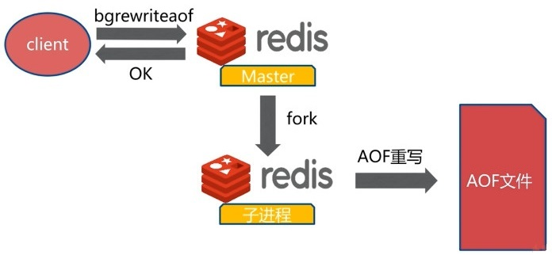

# 与Memcached比较

参考链接：[JavaGuide](https://javaguide.cn/database/redis/redis-questions-01.html#%E8%AF%B4%E4%B8%80%E4%B8%8B-redis-%E5%92%8C-memcached-%E7%9A%84%E5%8C%BA%E5%88%AB%E5%92%8C%E5%85%B1%E5%90%8C%E7%82%B9)

## 共同点

- 都是**基于内存**的数据库，一般都用来当做缓存使用。
- 都有**过期策略**。
- 两者的**性能都非常高**。

## 区别

- **Redis支持更丰富的数据类型（支持更复杂的应用场景）**。Redis不仅仅支持简单的k/v类型数据，同时还提供list，set，zset，hash等数据类型的存储。Memcached只支持最简单的k/v数据类型。
- **Redis支持数据的持久化**。它可以将内存中的数据保持在磁盘中，重启的时候可以再次加载进行使用，而Memcached把数据全部存在内存之中。
- **Redis有灾难恢复机制。** 因为可以把缓存中的数据持久化到磁盘上。
- Redis在服务器内存使用完之后，可以将不用的数据放到磁盘上。但是，**Memcached在服务器内存使用完之后，就会直接报异常**。
- **Redis支持原生Cluster模式**。Memcached**没有原生的集群模式**，需要依靠客户端来实现往集群中分片写入数据。
- **Memcached是多线程，非阻塞IO复用的网络模型；Redis使用单线程的多路IO复用模型。** （Redis `v6.0`引入了多线程IO）
- **Redis支持发布/订阅模型、Lua 脚本、事务等功能，而 Memcached 不支持。并且，Redis支持更多的编程语言。**
- Memcached过期数据的**删除策略只用了惰性删除**，而Redis**同时使用了惰性删除与定期删除**。

# 持久化★

参考链接：[JavaGuide](https://javaguide.cn/database/redis/redis-questions-01.html#redis-%E6%8C%81%E4%B9%85%E5%8C%96%E6%9C%BA%E5%88%B6)、[博客园](https://www.cnblogs.com/ysocean/p/9114268.html)、[博客园](https://www.cnblogs.com/ysocean/p/9114267.html)、[CSDN](https://lansonli.blog.csdn.net/article/details/102648597)、[掘金](https://juejin.cn/post/6844904089722028045)、[Redis文档](https://redis.io/docs/manual/persistence/)

## 怎么保证 Redis 挂掉之后再重启数据可以进行恢复？

很多时候我们需要**持久化数据也就是将内存中的数据写入到硬盘**里面，大部分原因是为了之后重用数据（比如重启机器、机器故障之后恢复数据），或者是为了防止系统故障而将数据备份到一个远程位置。

Redis不同于Memcached的很重要一点就是，Redis支持持久化，而且支持两种不同的持久化操作。

> 一种方式是**快照（Redis Database，RDB）**，另一种方式是**只追加文件（Append Only File，AOF）**。

## RDB

### 简介

RDB持久化方式能够在**指定的时间间隔能对你的数据进行快照存储**。

在默认情况下，Redis将数据库快照保存在名字为`dump.rdb`的二进制文件中。在Redis运行时，RDB将**当前内存中的数据库快照保存到磁盘文件**中，在Redis重启动时，RDB可以通过载入`.rdb`文件来还原数据库的状态。


当Redis需要保存`dump.rdb`文件时，服务器执行以下操作：

1. Redis调用`fork()`，同时拥有父进程和子进程。
2. 子进程将数据集写入到一个临时`.rdb`文件中。
3. 当子进程完成对新`.rdb`文件的写入时，Redis用新`.rdb`文件替换原来的`.rdb`文件。

这种工作方式使得Redis可以从**写时复制（copy-on-write）**机制中获益。

### 触发机制

#### `save`命令（同步机制）

`save`命令执行一个同步操作，以`.rdb`文件的方式保存所有数据的快照。

```shell
127.0.0.1:6379>save
OK
```


由于`save`命令是**同步命令**，会占用Redis的主进程。若Redis数据非常多时，`save`命令执行速度会非常慢，**阻塞**所有客户端的请求。因此很少在生产环境直接使用`save`命令，可以使用`bgsave`命令代替。如果在`bgsave`命令的保存数据的子进程发生错误，用`save`命令保存最新的数据是最后的手段。


#### `bgsave`命令（异步机制）

`bgsave`命令执行一个异步操作，以`.rdb`文件的方式保存所有数据的快照。

```sh
127.0.0.1:6379>bgsave
Background saving started
```

Redis使用Linux系统的`fork()`生成一个子进程来将数据保存到磁盘，主进程继续提供服务以供客户端调用。如果操作成功，可以通过客户端命令`LASTSAVE`来检查操作结果。


`save`和`bgsave`对比

|  命令  |     `save`     |               `bgsave`               |
| :----: | :------------: | :----------------------------------: |
| IO类型 |      同步      |                 异步                 |
|  阻塞  |       是       | 是（阻塞发生在`fork()`，通常非常快） |
| 复杂度 |      O(n)      |                 O(n)                 |
|  优点  | 不消耗额外内存 |           不阻塞客户端命令           |
|  缺点  | 阻塞客户端命令 |        需要`fork()`，消耗内存        |

#### 自动生成

Redis还提供了自动生成`.rdb`文件的方式。可以通过配置文件进行设置，让Redis在**“每N秒内至少有M个键改动”**这一条件满足时，自动进行数据集保存操作。

比如说，以下设置会让Redis在满足“每60秒内有至少有1000个键改动”这一条件满足时，自动进行数据集保存操作：

```
save 60 1000
```


其他相关配置：

```
dbfilename dump-<port>.rdb
dir /var/lib/redis
stop-writes-on-bgsave-error yes
rdbcompression yes
rdbchecksum yes
```

- `dbfilename`：设置快照的文件名，默认是`dump.rdb`。
- `dir`：设置快照文件的存放路径。默认是和当前配置文件保存在同一目录。
- `stop-writes-on-bgsave-error`：默认值为`yes`。当启用了RDB且最后一次后台保存数据失败，Redis是否停止接收数据。
- `rdbcompression`：默认值是`yes`。对于存储到磁盘中的快照，可以设置是否进行压缩存储。如果是的话Redis会采用**LZF**算法进行压缩。
- `rdbchecksum`：默认值是`yes`。在存储快照后，我们还可以让Redis使用**CRC64**算法来进行数据校验。

如果**只使用Redis的缓存功能，不需要持久化**，那么可以注释掉所有的`save`行或直接添加一个空字符串来实现停用：

```
save ""
```

#### 注意

执行`flushall`或退出Redis都会产生`.rdb`文件（前者产生的文件为空）。

### 恢复数据

将`.rdb`文件移动到**Redis安装目录**并启动服务即可，Redis会自动加载文件数据至内存。Redis 服务器在**载入`.rdb`文件期间会一直处于阻塞状态**，直到载入工作完成为止。

### 优缺点

#### 优点

- RDB是Redis数据库中一个**非常紧凑的单时间点文件**，它非常适用于备份，可以在发生数据灾难时轻松恢复不同版本的数据集。
- RDB非常适合**灾难恢复**，它是一个可以**传输到远程数据中心**的压缩文件。
- RDB最大限度地**提高了Redis的性能**，因为Redis父进程为了持久化而需要做的唯一工作就是**派生一个完成所有其余工作的子进程**。父进程永远**不会执行磁盘I/O或类似操作**。
- RDB恢复**大数据集时更快**（相比于AOF）。
- RDB在副本（Replicas）上支持**重启和故障转移后的部分重新同步**。

#### 缺点

- **不可控、丢失数据风险**：RDB**没有将数据丢失的可能性降到最低**。虽然可以配置多个时间保存点，但如果Redis由于没有正确关闭而直接停止工作，那么还是有可能丢失最新的数据。
- **耗时、耗性能**：RDB需要经常`fork()`以便使用子进程在磁盘上持久化。如果数据集很大，`fork()`可能会很耗时，并且性能较低的CPU可能还会导致Redis客户端停止几毫秒甚至一秒钟。AOF也需要`fork()`但频率较低，而且可以调整重写日志的频率。

## AOF

### 简介

从`v1.1`版本开始，Redis增加了一种完全耐久（durable）的持久化方式：AOF持久化。可以在配置文件中打开AOF方式：

```shell
appendonly yes
```

打开AOF后，每当Redis执行一个**改变数据集的命令**时（比如 `SET`），**这个命令就会被追加到AOF文件的末尾**。这样的话，当Redis重新启动时，程序就可以通过**重新执行AOF文件中的命令来达到重建数据集**的目的。

创建文件和恢复数据：


### 三种策略

可以通过配置参数`appendfsync`来设置Redis多久将数据`fsync()`到磁盘一次。（`fsync()`：Linux系统函数，只针对单个文件，可用于数据库这样的应用程序，这种应用程序需要确保将修改过的块立即写到磁盘上）

#### `always`

**每次有新命令追加到AOF文件时就执行一次**`fsync()` ，非常慢但也非常安全。


#### `everysec`

**每秒一次**`fsync()`：足够快（和RDB持久化差不多），在故障时只会丢失1秒钟的数据。**推荐（且默认）**的策略，可以同时兼顾速度和安全性。


#### `no`

从不`fsync` ：将数据**交给操作系统**来处理，由操作系统来决定什么时候同步数据，更快但更不安全。


#### 三种策略比较

|    策略    |       优点        |   缺点   |
| :--------: | :---------------: | :------: |
|  `always`  |    不丢失数据     | IO开销大 |
| `everysec` | 最多丢失1秒钟数据 |  同优点  |
|    `no`    |  由操作系统代管   |  不可控  |

### 重写

因为AOF的运作方式是不断地将命令追加到文件的末尾，所以随着写入命令的不断增加，AOF文件的体积也会变得越来越大。

举个例子，如果你对一个计数器调用了**100次**`INCR`，那么仅仅是为了保存这个计数器的当前值，AOF文件就需要使用**100条记录**（entry）。然而在实际上，只使用**1条`SET`命令**已经足以保存计数器的当前值了，其余99条记录实际上都是多余的。

为了处理这种情况，Redis支持一种有趣的特性：可以在不打断服务客户端的情况下，对AOF文件进行**重建（rebuild）**。

每当执行`bgrewriteaof`命令，Redis将写最短的命令序列在**内存中重建当前数据集**。`v2.2`需要自己手动执行`bgrewriteaof`命令；`v2.4`则可以通过配置自动触发AOF重写。


也就是说AOF文件重写**并不是对原文件进行重新整理**，而是**直接读取服务器现有的键值对**，然后用**一条命令去代替之前记录这个键值对的多条命令**，生成一个新的文件后去替换原来的AOF文件。

了解：**从`v7.0.0`开始**，在调度AOF重写时，Redis父进程会打开一个新的增量AOF文件继续写入。子进程执行重写逻辑并生成新的基础AOF。Redis将使用一个临时清单文件来跟踪新生成的基础文件和增量文件。当它们准备好后，Redis会执行原子替换操作，使这个临时清单文件生效。为了避免在AOF重写重复失败和重试的情况下创建大量增量文件的问题，Redis引入了AOF重写限制机制，以确保失败的AOF重写以越来越慢的速度重试。

#### 作用

- **减少磁盘占用量**
- **加速数据恢复**

#### 实现方式

- `bgrewriteaof`

  `bgrewriteaof`命令用于**异步执行**一个AOF文件重写操作，会创建一个当前AOF文件的体积优化版本。即使`bgrewriteaof`执行失败，也不会有任何数据丢失，因为旧的AOF文件在 `bgrewriteaof`成功之前不会被修改。`bgrewriteaof`仅仅用于手动触发重写操作。

  如果正在执行的AOF重写返回一个错误，AOF重写将会在**稍后一点的时间重新调用**。

  

- 重写配置

  |            配置名             |              含义               |
  | :---------------------------: | :-----------------------------: |
  |  `auto-aof-rewrite-min-size`  |    触发AOF文件重写的最小尺寸    |
  | `auto-aof-rewrite-percentage` | 触发AOF文件执行重写的最小增长率 |

  |      统计名      |                 含义                  |
  | :--------------: | :-----------------------------------: |
  | aof_current_size |        AOF文件当前尺寸（字节）        |
  |  aof_base_size   | AOF文件上次启动和重写时的尺寸（字节） |

  AOF重写自动触发机制**需要同时满足**下面两个条件：

  1. aof_current_size > `auto-aof-rewrite-min-size`
  2. (aof_current_size - aof_base_size) / aof_base_size \* 100 > `auto-aof-rewrite-percentage`

#### 流程


### 相关配置

```shell
# 开启AOF持久化方式
appendonly yes
# AOF持久化文件名
appendfilename appendonly-<port>.aof
# 每秒把缓冲区的数据同步到磁盘
appendfsync everysec
# 数据持久化文件存储目录
dir /var/lib/redis
# 是否在执行重写时不同步数据到AOF文件
# 这里的 yes，就是执行重写时不同步数据到AOF文件
no-appendfsync-on-rewrite yes
# 触发AOF文件执行重写的最小尺寸
auto-aof-rewrite-min-size 64mb
# 触发AOF文件执行重写的增长率
auto-aof-rewrite-percentage 100
```

### 优缺点

#### 优点

- AOF使得Redis**更具持久性**：可以有3种不同的`fsync`策略。即使使用默认策略`everysec`，写入性能仍然很棒。`fsync`是使用**后台线程执行**的，当没有`fsync`正在进行时，主线程将努力执行写入，因此最多只会丢失一秒钟的数据。
- AOF日志是一个**只进行追加**的日志，因此**不会出现寻道（seek）问题**，也不会在断电时出现损坏问题。即使由于某种原因（磁盘已满或其他原因）日志未执行完整的命令而结束，`redis-check-aof`工具也能够轻松修复它。
- 当AOF变得太大时，Redis能够在后台**自动重写**AOF。重写是**完全安全**的，因为当Redis继续附加到旧文件时，会使用**创建当前数据集所需的最少操作集**生成一个全新的文件，一旦新文件准备就绪，Redis就会从“旧”切换到“新”，开始附加到新文件上。
- AOF以**易于理解和解析的格式**依次包含所有操作的日志，甚至可以轻松导出AOF文件。例如，即使不小心使用`FLUSHALL`命令刷新了所有内容，只要在此期间没有执行日志重写，仍然可以**通过停止服务器、删除最新命令（即`FLUSHALL`）并重新启动Redis**来恢复数据集。

#### 缺点

- AOF文件通常比相同数据集的等效`.rdb`文件**大**。
- 根据所使用的`fsync`策略，AOF可能比RDB**慢**。 一般来说，将`fsync`设置为**`everysec`时性能仍然非常高**，而在禁用`fsync`的情况下，**即使在高负载下也应该与RDB一样快**。不过在处理巨大写入负载时，RDB仍然能够提供提供更有保证的最大延迟时间（maximum latency latency）。

## 持久化的抉择

### RDB和AOF对比

|            |    RDB     |     AOF      |
| :--------: | :--------: | :----------: |
| 启动优先级 |     低     |      高      |
|    体积    |     小     |      大      |
|  恢复速度  |     快     |      慢      |
| 数据安全性 | 可能丢数据 | 根据策略决定 |

### 如何选择？

一般来说， 如果想达到足以媲美PostgreSQL的数据安全性，你应该同时使用两种持久化功能。

如果你可以承受数分钟以内的数据丢失，那么可以只使用RDB持久化；否则就使用AOF重写。但是一般情况下建议不要单独使用某一种持久化机制，而是应该两种一起用（可以达到媲美PostgreSQL的数据安全性）。

## 混合持久化

在Redis `v4.0`之后，新增了**RDB-AOF混合持久化**方式。这种方式结合了RDB和AOF的优点，既能快速加载又能避免丢失过多的数据。具体配置为：

```shell
# yes为开启，no为禁用
aof-use-rdb-preamble yes
```

当开启混合持久化时，主进程先`fork`出**子进程**将现有**内存副本全量以RDB方式写入AOF文件开头**，然后再将缓冲区中的**增量命令以AOF方式写入AOF文件中末尾**，写入完成后通知主进程更新相关信息，并将新的含有RDB和AOF两种格式的**AOF新文件替换旧文件**。

简单来说：混合持久化方式产生的文件一部分是RDB格式，一部分是AOF格式。

### 优缺点

#### 优点

混合持久化**结合了RDB和AOF持久化的优点**，开头为RDB的格式，使得Redis可以更快启动；同时又降低了大量数据丢失的风险。

#### 缺点

AOF文件中添加了RDB格式的内容，会使得AOF文件可读性变差；并且如果开启混合持久化，就必须使用Redis `v4.0` 及之后版本。

# 发布/订阅

参考链接：[Java全栈知识体系](https://pdai.tech/md/db/nosql-redis/db-redis-x-pub-sub.html)、[Redis命令参考](http://redisdoc.com/pubsub/index.html)

## 简介

Redis发布订阅（pub/sub）是一种**消息通信模式**：发送者（pub）发送消息，订阅者（sub）接收消息。

Redis的`SUBSCRIBE`命令可以让**客户端订阅任意数量的频道**，每当有新信息发送到被订阅的频道时，信息就会被**发送给所有订阅指定频道的客户端**。


当有新消息通过`PUBLISH`命令发送给channel 1时， 这个消息就会被发送给订阅它的三个客户端。

## 使用方式

Redis有两种发布/订阅模式：基于频道（Channel）的发布/订阅、基于模式（Pattern）的发布/订阅。

### 基于频道的发布/订阅

"发布/订阅"模式包含两种角色，分别是**发布者和订阅者**。发布者可以向指定的频道（channel）发送消息；订阅者可以订阅一个或者多个频道，所有订阅此频道的订阅者都会收到此消息。


#### 发布者发布消息

发布者发布消息的命令是`publish`，用法是`publish channel message`：

```shell
127.0.0.1:6379> publish channel:1 hi
(integer) 1
```

**返回值表示接收这条消息的订阅者数量**。发出去的消息不会被持久化，即客户端**只有在订阅频道后**才能接收到后续发布到该频道的消息，之前的就接收不到了。

#### 订阅者订阅频道

订阅频道的命令是`subscribe`，可以同时订阅多个频道，用法是`subscribe channel1 [channel2 ...]`：

例如新开一个客户端订阅上面频道（不会收到消息，因为不会收到订阅之前就发布到该频道的消息）：

```shell
127.0.0.1:6379> subscribe channel:1
```

注意：处于此**订阅状态**下客户端不能使用除`subscribe`、`unsubscribe`、`psubscribe`和`punsubscribe`这四个属于"发布/订阅"之外的命令，否则会报错。

进入订阅状态后客户端可能收到**3种类型的回复**。每种类型的回复都包含**3个值**，第一个值是消息的类型，根据消息类型的不同，第二个和第三个参数的含义可能不同。消息类型的取值可能是以下3个:

- **subscribe**：表示订阅成功的反馈信息。第二个值是订阅成功的**频道名称**，第三个是**当前客户端订阅的频道数量**。

- **message**“：表示接收到的是消息，第二个值表示**产生消息的频道名称**，第三个值是消息的**内容**。
- **unsubscribe**：表示成功取消订阅某个频道。第二个值是对应的**频道名称**，第三个值是**当前客户端订阅的频道数量**，当此**值为0时客户端会退出订阅状态**，之后就可以执行其他非"发布/订阅"模式的命令了。

### 基于模式的发布/订阅

如果有**某个/某些模式和这个频道匹配**的话，那么**所有订阅这个/这些频道的客户端也同样会收到信息**。

#### 图例解释

下图展示了一个带有频道和模式的例子， 其中`tweet.shop.*`模式匹配了`tweet.shop.kindle`频道和`tweet.shop.ipad`频道，并且有不同的客户端分别订阅它们三个：


当有信息发送到`tweet.shop.kindle`频道时，信息除了发送给client X和client Y之外，还会发送给订阅`tweet.shop.*`模式的client 123和client 256：


另一方面，如果接收到信息的是频道`tweet.shop.ipad`，那么client 123和client 256同样会收到信息：


#### 例子

```shell
# 订阅 news.* 和 tweet.* 两个模式

# 第 1 - 6 行是执行 psubscribe 之后的反馈信息
# 第 7 - 10 才是接收到的第一条信息
# 第 11 - 14 是第二条
# 以此类推。。。

redis> psubscribe news.* tweet.*
Reading messages... (press Ctrl-C to quit)
1) "psubscribe"                  # 返回值的类型：显示订阅成功
2) "news.*"                      # 订阅的模式
3) (integer) 1                   # 目前已订阅的模式的数量

1) "psubscribe"
2) "tweet.*"
3) (integer) 2

1) "pmessage"                    # 返回值的类型：信息
2) "news.*"                      # 信息匹配的模式
3) "news.it"                     # 信息本身的目标频道
4) "Google buy Motorola"         # 信息的内容

1) "pmessage"
2) "tweet.*"
3) "tweet.huangz"
4) "hello"

1) "pmessage"
2) "tweet.*"
3) "tweet.joe"
4) "@huangz morning"

1) "pmessage"
2) "news.*"
3) "news.life"
4) "An apple a day, keep doctors away"
```

注意点：

- 使用`psubscribe`命令可以**重复订阅同一个频道**，如客户端执行了`psubscribe c? c?*`，这时向c1发布消息客户端会接受到**两条消息**，而同时`publish`命令的返回值**是2而不是1**。同样的，如果有另一个客户端执行了`subscribe c1` 和`psubscribe c?*`的话，向c1发送一条消息该客户端也会收到到**2条消息（但是是两种类型：`message`和`pmessage`）**，同时`publish`命令也**返回2**。
- `punsubscribe`命令可以**退订指定的规则**，用法是：`punsubscribe [pattern [pattern ...]]`，如果没有参数则会退订所有规则。
- 使用`punsubscribe`只能退订通过`psubscribe`命令订阅的规则，不会影响直接通过`subscribe`命令订阅的频道；同样的，`unsubscribe`命令也不会影响通过`psubscribe`命令订阅的规则。另外需要注意`punsubscribe`命令退订某个规则时不会将其中的通配符展开，而是进行严格的字符串匹配，所以`punsubscribe *` 无法退订`c*`规则，而是必须使用`punsubscribe c*`才可以退订。

# 实现分布式锁

参考链接：[Kaito's Blog](http://kaito-kidd.com/2021/06/08/is-redis-distributed-lock-really-safe/)

## 为什么需要分布式锁

与分布式锁相对应的是**单机锁**，在写多线程程序时，避免同时操作一个共享变量产生数据问题，通常会使用一把锁来**互斥**，以保证共享变量的正确性，其使用范围是在**同一个进程**中。

那么如果换做是**多个进程，需要同时操作一个共享资源，如何互斥**呢？

例如，现在的业务应用通常都是微服务架构，这也意味着**一个应用会部署多个进程**，那这多个进程如果需要修改MySQL中的同一行记录时，为了避免操作乱序导致数据错误，需要引入**分布式锁**来解决这个问题了。

想要实现分布式锁，必须借助一个**外部系统**，所有进程都去这个系统上申请**加锁**。而这个外部系统，必须要有实现**互斥**的能力，即**两个请求同时进来，只会给一个进程返回成功，另一个返回失败（或等待）**。

这个外部系统，可以是MySQL，也可以是Redis或Zookeeper。但为了追求更好的性能，通常会选择使用Redis或Zookeeper。

## 分布式锁怎么实现

想要实现分布式锁，必须要求Redis有**互斥**的能力。可以使用`SETNX`命令，这个命令表示“**SET** if **N**ot e**X**ists”，即如果key不存在，才会设置它的值，否则什么也不做。两个客户端进程执行这个命令达到互斥，就可以实现一个分布式锁。

客户端1申请加锁，加锁成功：

```shell
127.0.0.1:6379> SETNX lock 1
(integer) 1     // 客户端1，加锁成功
```

客户端2申请加锁，因为后到达，加锁失败：

```shell
127.0.0.1:6379> SETNX lock 1
(integer) 0     // 客户端2，加锁失败
```

此时，加锁成功的客户端，就可以去操作**共享资源**。操作完成后，还要及时**释放锁**，给后来者让出操作共享资源的机会。直接使用`DEL`命令删除这个key即可：

```shell
127.0.0.1:6379> DEL lock // 释放锁
(integer) 1
```


但是上述流程存在一个**很大的问题**：当客户端1拿到锁后，如果发生下面的场景，就会造成**死锁**：

- 程序处理业务逻辑异常，**没及时释放**锁
- 进程挂了，**没机会释放**锁

这时这个客户端就会一直占用这个锁，而其它客户端就**永远**拿不到这把锁了。

## 如何避免死锁

很容易想到的方案是，在申请锁时，给这把锁设置一个**租期**。

在Redis中实现时，就是给这个key设置一个**过期时间**。这里假设操作共享资源的时间不会超过10s，那么在加锁时，给这个key设置**10s过期**即可：

```shell
127.0.0.1:6379> SETNX lock 1    // 加锁
(integer) 1
127.0.0.1:6379> EXPIRE lock 10  // 10s后自动过期
(integer) 1
```

这样一来，无论客户端是否异常，这个锁都可以在10s后被**自动释放**，其它客户端依旧可以拿到锁，**但这样还是有问题**。现在的操作，**加锁、设置过期是2条命令**，有没有可能只执行了第一条，第二条却**来不及**执行的情况发生呢？例如：

- `SETNX`执行成功，执行`EXPIRE`时由于网络问题，执行失败
- `SETNX`执行成功，但Redis异常宕机，`EXPIRE`没有机会执行
- `SETNX`执行成功，但客户端异常崩溃，`EXPIRE`也没有机会执行

总之，这两条命令不能保证是**原子操作（一起成功）**，就有潜在的风险导致**过期时间设置失败**，依旧存在**死锁问题**。

在Redis `v2.6.12`版本之前，我们需要想尽办法保证`SETNX`和`EXPIRE`原子性执行，还要考虑各种异常情况如何处理。但在之后Redis扩展了`SET`命令的参数，用这一条命令就可以了：

```shell
// 一条命令保证原子性执行
127.0.0.1:6379> SET lock 1 EX 10 NX
OK
```

再来分析**它还有什么问题**？试想这样一种场景：

1. 客户端1加锁成功，开始操作共享资源
2. 客户端1操作共享资源的时间，**超过了锁的过期时间**，锁被自动释放
3. 客户端2加锁成功，开始操作共享资源
4. 客户端1操作共享资源完成，**释放锁（但释放的是客户端 2 的锁）**

这里存在两个严重的问题：

1. **锁过期**：客户端1操作共享资源耗时太久，导致锁被自动释放，之后被客户端2持有。
2. **释放别人的锁**：客户端1操作共享资源完成后，却又释放了客户端2的锁。

**第一个问题，可能是我们评估操作共享资源的时间不准确导致的。**

例如，操作共享资源的时间**最慢**可能需要15s，而我们却只设置了10s过期，那这就存在**锁提前过期**的风险。过期时间太短，那**增大冗余时间**，例如设置过期时间为 20s，这样可以么？这样确实可以**缓解**这个问题，降低出问题的概率，但依旧无法**彻底解决**问题。

原因在于：客户端拿到锁之后在操作共享资源时，遇到的场景有可能是**很复杂**。既然只是**预估时间**，所以只能大致计算，除非能预料并覆盖到所有导致耗时变长的场景，但这其实很难。

**第二个问题在于，一个客户端释放了其它客户端持有的锁。**

导致这个问题发生的关键点在于：每个客户端在释放锁时，都是**无脑操作**，并**没有检查这把锁是否还归自己持有**，所以就会出现释放别人锁的风险，这样的解锁流程**并不严谨**！

## 锁被别人释放怎么办

解决办法是：客户端在加锁时，设置一个只有自己知道的**唯一标识**进去。

例如，这个标识可以是自己的线程ID，也可以是一个UUID（随机且唯一），这里以UUID举例：

```shell
// 锁的VALUE设置为UUID
127.0.0.1:6379> SET lock $uuid EX 20 NX
OK
```

注意：这里假设**20s操作共享时间完全足够**，先不考虑锁自动过期的问题。

之后，在释放锁时，要先判断这把锁**是否还归自己持有**，伪代码可以这么写：

```
// 锁是自己的，才释放
if redis.get("lock") == $uuid:
    redis.del("lock")
```

这里释放锁使用的是`GET+DEL`两条命令，这时又会遇到**原子性问题**：

1. 客户端1执行`GET`，判断锁是自己的
2. 客户端2执行了`SET`命令，强制获取到锁（虽然发生概率比较低，但我们需要严谨地考虑锁的安全性模型）
3. 客户端1执行`DEL`，却释放了客户端2的锁

由此可见，这两个命令还是必须要原子执行才行。怎样**原子执行**呢？需要使用**Lua脚本**。可以把这个逻辑理解成：写Lua脚本然后让Redis来执行。因为Redis处理每一个请求是**单线程**执行的，所以在执行一个Lua脚本时，其它请求必须等待，直到这个Lua脚本处理完成，这样一来，`GET+DEL`之间就不会插入其它命令了。


安全释放锁的Lua脚本如下：

```Lua
// 判断锁是自己的，才释放
if redis.call("GET",KEYS[1]) == ARGV[1]
then
    return redis.call("DEL",KEYS[1])
else
    return 0
end
```

这样一路优化，整个的加锁、解锁的流程就**更严谨**了。小结一下，基于Redis实现的分布式锁，一个严谨的流程如下：

1. 加锁：`SET $lock_key $unique_id EX $expire_time NX`
2. 操作共享资源
3. 释放锁：Lua脚本，先`GET`判断锁是否归属自己，再`DEL`释放锁


有了这个完整的锁模型，可以重新回到前面提到的第一个问题：锁过期时间不好评估怎么办？

## 锁过期时间不好评估怎么办？

前面提到，锁的过期时间如果评估不好，这个锁就会有**提前过期**的风险。前面给的妥协方案是：

> 尽量**冗余过期时间**，降低锁提前过期的概率。

这个方案其实也不能完美解决问题，那怎么办呢？是否可以设计这样的方案：

> 加锁时，**先设置一个过期时间**，然后**开启一个守护线程**，**定时去检测这个锁的失效时间**，如果锁快要过期了，操作共享资源还未完成，那么就**自动对锁进行续期**，重新设置过期时间。

这确实一种比较好的方案。幸运的是在Java中已经有一个库把这些工作都封装好了：**Redisson**。

Redisson是一个基于Java语言实现的Redis SDK客户端，在使用分布式锁时，它就采用了**自动续期**的方案来避免锁过期，这个**守护线程**我们一般也把它叫做**看门狗**线程。


除此之外，这个SDK还封装了很多易用的功能：可重入锁、乐观锁、公平锁、读写、Redlock（红锁，后面会详细讲）。这个SDK提供的API非常友好，它可以**使用类似操作本地锁的方式来操作分布式锁**。

到这里再小结一下，基于Redis实现分布式锁所遇到的问题，以及对应的解决方案：

- **死锁**：设置过期时间
- **过期时间评估不好，锁提前过期**：守护线程，自动续期
- **锁被别人释放**：锁写入唯一标识，释放锁先检查标识，再释放

那么还会有哪些问题场景会危害Redis锁的安全性呢？之前分析的场景都是，锁在**单个Redis实例中**可能产生的问题，并没有涉及到Redis的部署架构细节。

而通常在使用Redis时，一般会采用**主从集群 + 哨兵**的模式部署，这样做的好处在于：当主库异常宕机时，哨兵可以实现**故障自动切换**，把从库提升为主库，继续提供服务，以此保证可用性。

**那当发生主从切换时，这个分布锁是否依旧安全？**

试想这样的场景：

1. 客户端1在主库上执行`SET`命令，加锁成功
2. 此时主库异常宕机，`SET`命令还未同步到从库上（**主从复制是异步的**）
3. 从库被哨兵提升为新主库，这个锁在新的主库上丢失了！


可见当引入Redis副本后，分布锁还是可能会受到影响。怎么解决这个问题？

为此，Redis的作者提出一种解决方案，就是我们经常听到的**Redlock（红锁）**。

## Redlock真的安全么？

Redis作者提出的Redlock方案基于2个前提：

1. 不再需要部署**从库**和**哨兵**实例，只部署**主库**
2. 但主库要部署多个，官方推荐至少5个实例

也就是说，想要使用Redlock至少要部署5个Redis实例，而且**都是主库**（它们之间没有任何关系，都是孤立的）。

> **注意：不是部署 Redis Cluster，就是部署 5 个简单的 Redis 实例。**


整体流程一共分为5步：

1. 客户端先获取**当前时间戳T1**
2. 客户端依次向这5个Redis实例发起加锁请求（用`SET`命令），且每个请求会设置**超时时间**（毫秒级，要远小于锁的有效时间）。如果某一个实例加锁失败（包括网络超时、锁被其它人持有等各种异常情况），就立即向下一个Redis实例申请加锁
3. 如果客户端使得**>=3 个（大多数）以上**Redis实例加锁成功，则再次获取**当前时间戳T2**，如果**T2-T1<锁的过期时间**，此时认为客户端加锁成功，否则认为加锁失败
4. 加锁成功：去操作共享资源
5. 加锁失败：向**全部节点**发起释放锁请求（使用Lua脚本释放锁）

整个流程有4个重点：

1. 客户端向所有Redis实例申请加锁
2. 必须保证**大多数节点加锁成功**
3. 大多数节点**加锁的总耗时，要小于锁设置的过期时间**
4. 释放锁，要向**全部节点发起释放锁请求**

Redlock为什么要这么做？

### （1）为什么要在多个实例上加锁？

本质上是为了**容错**，部分实例异常宕机，剩余的实例加锁成功，整个锁服务依旧可用。

### （2）为什么大多数加锁成功才算成功？

多个Redis实例一起来用，其实就组成了一个**分布式系统**。在分布式系统中，总会出现**异常节点**，所以在谈论分布式系统问题时，需要考虑异常节点达到多少个，也依旧不会影响整个系统的**正确性**。

这是一个分布式系统**容错**问题，这个问题的结论是：

> **如果存在「故障」节点，只要大多数节点正常，那么整个系统依旧是可以提供正确服务的。**

### （3）为什么需要计算加锁的累计耗时？

因为操作的是多个节点，所以耗时肯定会比操作单个实例耗时更久，而且，因为是网络请求，网络情况是复杂的，有可能存在**延迟、丢包、超时**等情况发生，网络请求越多，异常发生的概率就越大。

所以，即使大多数节点加锁成功，但**如果加锁的累计耗时已经超过了锁的过期时间，那此时有些实例上的锁可能已经失效了，这个锁就没有意义**了。

### （4）为什么释放锁要操作所有节点？

在某一个Redis节点加锁时，可能因为**网络原因导致加锁失败**。例如，客户端在一个Redis实例上加锁成功，在**读取响应结果时因网络问题导致读取失败**，但其实这把锁已经在Redis上加锁成功了。

所以释放锁时，不管之前有没有加锁成功，都需要释放**所有节点**的锁，以保证清理节点上**残留**的锁。

### 关于Redlock的争论

参考开头的链接。

## 对分布式锁的理解（博客作者）

### （1）到底要不要用Redlock？

Redlock只有建立在**时钟正确**的前提下才能正常工作，如果可以保证这个前提，那么可以拿来使用。但保证时钟正确并不是那么简单：

1. **从硬件角度来说**，时钟发生偏移时有发生，无法避免。例如，CPU 温度、机器负载、芯片材料都是有可能导致时钟发生偏移。
2. **从博客作者的工作经历来说**，曾经就遇到过**时钟错误而运维暴力修改时钟的情况**，进而影响了系统的正确性，所以人为错误也是很难完全避免的。

所以博客作者对Redlock的个人看法是：

> 尽量不使用，而且它的性能不如单机版Redis，部署成本也高，还是会优先考虑使用**Redis主从+哨兵**的模式实现分布式锁。

### （2）如何正确使用分布式锁？

1. 使用分布式锁，在上层完成**互斥**目的，虽然极端情况下锁会失效，但它可以最大程度把并发请求阻挡在最上层，减轻操作资源层的压力。
2. 但对于要求数据绝对正确的业务，在资源层一定要做好**兜底**，设计思路可以借鉴fencing token的方案。

# 数据结构★

参考链接：[Redis文档](https://redis.io/docs/manual/data-types/)、[Java全栈知识体系](https://pdai.tech/md/db/nosql-redis/db-redis-data-types.html)、[JavaGuide](https://javaguide.cn/database/redis/redis-questions-01.html#redis-%E5%B8%B8%E8%A7%81%E6%95%B0%E6%8D%AE%E7%BB%93%E6%9E%84)、[博客园](https://www.cnblogs.com/ysocean/p/9080940.html)、[博客园](https://www.cnblogs.com/xrq730/p/8944539.html)

按照师兄笔记结构，参考笔记中的链接和JavaGuide，逐条补充，命令需详细

## 底层设计


上图反映了Redis的每种对象其实都由**对象结构（redisObject）**与**对应编码的底层数据结构**组合而成，而每种对象类型对应若干编码方式，不同的编码方式所对应的底层数据结构是不同的。所以需要从几个角度来着手底层研究：

- **对象设计机制**：对象结构（redisObject）
- **编码类型和底层数据结构**：对应编码的数据结构

## redisObject

### 为什么需要redisObject？

### redisObject数据结构


## 基础数据类型

Redis中所有的**key（键）都是字符串**，所以数据类型是指**存储值的数据类型**，主要包括常见的5种基础数据类型，分别是：String、List、Set、Zset、Hash。


|       类型       |                    存储的值                    |                           读写能力                           |
| :--------------: | :--------------------------------------------: | :----------------------------------------------------------: |
| String<br>字符串 |              字符串、整数或浮点数              | 对整个字符串或字符串的一部分进行操作；对整数或浮点数进行自增或自减操作 |
|   List<br>列表   | 一个链表，链表上的**每个结点都包含一个字符串** | 对链表的两端进行`push`和`pop`操作，读取单个或多个元素；根据值查找或删除元素 |
|   Set<br>集合    |            包含**字符串的无序集合**            | 字符串的集合，包含基础的方法有添加、获取、删除；还包含计算交集、并集、差集等 |
|   Hash<br>散列   |           包含**键值对的无序散列表**           |              包含方法有添加、获取、删除单个元素              |
| Zset<br>有序集合 |         和散列一样，**用于存储键值对**         | 字符串成员与浮点数分数之间的有序映射；**元素的排列顺序由分数的大小决定**；包含方法有添加、获取、删除单个元素以及根据分值范围或成员来获取元素 |

### String 字符串

> String是Redis中最基本的数据类型

String类型是二进制安全的，意思是Redis的String可以包含任何数据，如数字、字符串、jpg图片或者序列化的对象。**一个字符串Value最多为512M**。

#### 图例


#### 命令

| 命令    |                          用法                          |                             描述                             |
| ------- | :----------------------------------------------------: | :----------------------------------------------------------: |
| `SET`   | `SET key value [EX seconds] [PX milliseconds] [NX|XX]` | （1）将Value关联到Key。<br />（2）Key已关联则**覆盖，无视类型**。如果原生Key带有生存时间TTL，那么TTL会被清除。 |
| `GET`   |                       `GET key`                        | （1）返回Key关联的字符串值。如果Key不存在返回`(nil)`。<br />（2）如果Key存储的不是字符串，返回错误，因为**`GET`只用于处理字符串**。 |
| `MSET`  |            `MSET key value [key value ...]`            | （1）同时设置一个或多个Key-Value键值对。如果某个Key已经存在，那么MSET新值会覆盖旧值。<br />（2）如果不希望对某个值覆盖，可以**使用`MSETNX`命令，所有Key都不存在才会进行覆盖**。<br />（3）**`MSET`是一个原子性操作**，所有Key都会在同一时间被设置。 |
| `MGET`  |                  `MGET key [key ...]`                  | （1）返回**一个或多个给定Key对应的Value**。如果某个Key不存在，那么这个Key返回`(nil)`。 |
| `SETEX` |               `SETEX key seconds value`                | （1）将Value关联到Key，设置Key过期时间为seconds（秒），**如果Key已存在则覆盖（包括值和过期时间）**。<br />（2）`SET`也可以设置过期时间，但是**`SETNX`是一个原子操作**，即关联值与设置过期时间同一时间完成。 |
| `SETNX` |                   `SETNX key value`                    | （1）将Key的值设置为Value，**当且仅当Key不存在的时候**。如果Key已存在，不执行任何操作。 |

补充：

- `MSET`和`MGET`这种**批量处理命令**能够极大提高操作效率。因为**n个命令执行耗时=n次网络传输时间+n次命令执行时间**，而批量处理命令会将**n次网络传输时间缩减为1次**，也就是**1次网络传输时间+n次命令处理时间**。但是需要注意：Redis是单线程的，如果一次批量处理命令过多，会造成Redis阻塞或网络拥塞（传输数据量大）。

上面是String类型的基本命令，下面是自增自减操作。在实际工作中还是特别有用的（例如：分布式环境中统计系统的在线人数、利用Redis的高性能读写在Redis中完成秒杀而不是直接操作数据库）。

|   命令   |          用法          |                             描述                             |
| :------: | :--------------------: | :----------------------------------------------------------: |
|  `INCR`  |       `INCR key`       | （1）Key中存储的数字值+1，返回增加后的值。<br />（2）如果**Key不存在，那么Key的值被初始化为"0"再+1**。<br />（3）如果**值包含错误类型或者字符串不能被表示为数字，返回错误**。<br />（4）值限制在64位有符号数字表示之内。 |
|  `DECR`  |       `DECR key`       | （1）Key中存储的数字值-1，返回减少后的值。<br />（2）其余同`INCR`。 |
| `INCRBY` | `INCRBY key increment` | （1）Key中存储的数字值+`increment`，返回增加后的值。<br />（2）其余同`INCR`。 |
| `DECRBY` | `DECRBY key decrement` | （1）Key中存储的数字值-`decrement`，返回减少后的值。<br />（2）其余同`INCR`。 |

补充：

- `INCR`/`DECR`在实际工作中还是非常管用的，举两个例子：
  - 原先单机环境中统计在线人数，变成分布式部署之后可以使用`INCR`/`DECR`
  - 由于Redis本身极高的读写性能，一些秒杀的场景库存增减可以基于Redis来做而不是直接操作DB。

#### 使用场景

1. 计数

   由于Redis单线程的特点，不需要考虑并发造成计数不准的问题，通过`INCRBY`命令可以得到正确的结果。

2. 限制次数

   比如登录次数校验，错误超过三次5分钟内就不让登录了：`每次登录设置Key自增一次，并设置该Key的过期时间为5分钟后`。每次登录检查一下该Key的值来进行限制登录。

#### 底层结构


## 特殊数据类型

# 缓存问题

如果不需要看 缓存雪崩、击穿等问题的话

可参考 javaguide 和 java全站知识体系中的问题汇总

### 缓存淘汰策略★


# 过期删除策略

