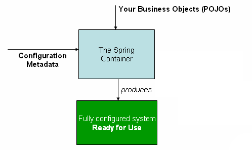

# Spring

## 一、Spring IoC

### 1.1 对于Spring IoC的理解:rocket:

#### 什么是IoC？

> 参考链接：[JavaGuide](https://javaguide.cn/system-design/framework/spring/spring-knowledge-and-questions-summary.html#%E8%B0%88%E8%B0%88%E8%87%AA%E5%B7%B1%E5%AF%B9%E4%BA%8E-spring-ioc-%E7%9A%84%E4%BA%86%E8%A7%A3)

**IoC（Inverse of Control：控制反转）**是一种设计思想，而不是一个具体的技术实现。IoC的思想就是将原本在程序中手动创建对象的控制权，交由Spring框架来管理。**控制**：指的是对象创建（实例化、管理）的权力。**反转**：控制权交给外部环境（Spring框架、IoC容器）。在Spring中，IoC容器是Spring用来实现IoC的载体， IoC容器实际上就是个`Map（key，value）`，`Map`中存放的是各种对象。


#### IoC解决了什么问题？

> 参考链接：[JavaGuide](https://javaguide.cn/system-design/framework/spring/spring-knowledge-and-questions-summary.html#%E8%B0%88%E8%B0%88%E8%87%AA%E5%B7%B1%E5%AF%B9%E4%BA%8E-spring-ioc-%E7%9A%84%E4%BA%86%E8%A7%A3)

将对象之间的相互依赖关系交给IoC容器来管理，并由IoC容器完成对象的注入。**这样可以很大程度上简化应用的开发，把应用从复杂的依赖关系中解放出来**。 IoC容器就像是一个工厂，当需要创建一个对象时，只需要配置好配置文件/注解即可，完全不用考虑对象是如何被创建出来的。

在实际项目中一个`Service`类可能依赖了很多其他的类，假如需要实例化这个`Service`，可能每次都要搞清这个`Service`所有底层类的构造函数。如果利用IoC的话，只需要配置好，然后在需要的地方引用就行了，**这大大增加了项目的可维护性且降低了开发难度**。

#### IoC和DI是什么关系？

> 参考链接：[Java全栈知识体系](https://pdai.tech/md/spring/spring-x-framework-ioc.html#ioc%E5%92%8Cdi%E6%98%AF%E4%BB%80%E4%B9%88%E5%85%B3%E7%B3%BB)

IoC只是一种**设计思想**，并非Spring特有。**IoC最常见以及最合理的实现方式叫做依赖注入（Dependency Injection，简称DI）**。

- 谁依赖于谁：应用程序依赖于IoC容器。
- 为什么需要依赖：应用程序需要IoC容器来提供对象需要的外部资源。
- 谁注入谁：IoC容器注入应用程序。
- 注入了什么：**某个对象所需要的外部资源（包括对象、资源、常量数据等）**。

#### IoC配置的3种方式

> 参考链接：[Java全栈知识体系](https://pdai.tech/md/spring/spring-x-framework-ioc.html#ioc-%E9%85%8D%E7%BD%AE%E7%9A%84%E4%B8%89%E7%A7%8D%E6%96%B9%E5%BC%8F)

##### `XML`配置

将Bean的信息配置在`.xml`文件里，通过Spring加载文件创建Bean。

优点：可以适用于任何场景，结构清晰，通俗易懂。

缺点：配置繁琐，不易维护，枯燥无味，扩展性差。

##### Java配置

将类的创建交给配置的`JavcConfig`类来完成，Spring只负责维护和管理，采用纯Java创建方式，其**本质上就是把在`XML`上的配置声明转移到Java配置类中**。

优点：适用于任何场景，配置方便，因为是纯Java代码，扩展性高，十分灵活。

缺点：由于是采用Java类的方式，声明不明显，如果大量配置，可读性比较差。

##### 注解配置

通过在类上加注解的方式，来声明一个类交给Spring管理，Spring会自动扫描带有`@Component`、`@Controller`、`@Service`、`@Repository`这四个注解的类，然后创建并管理，前提是需要先配置Spring的注解扫描器。

优点：开发便捷，通俗易懂，方便维护。

缺点：具有局限性，对于一些第三方资源，无法添加注解，**只能采用前两种方式配置**。

#### 依赖注入的3种方式

> 参考链接：[DZone](https://dzone.com/articles/spring-di-patterns-the-good-the-bad-and-the-ugly)、[掘金](https://juejin.cn/post/7021902992706109476)

##### 属性注入（Bad）

在属性上直接使用注解，内部使用**反射**方式实现注入。

- 优点：代码简洁。
- 缺点：依赖对象**可能为`NULL`而导致空指针异常**。

```java
public class MyBean {
   @Autowired
   private AnotherBean anotherBean;
    
}
```

##### Setter注入（Ugly）

Spring 3.x中推荐使用的方式，在`Set`方法上完成对象注入。

- 优点：选择性注入。
- 缺点：对象实例化后，**依赖信息依然可以通过`Set`方法修改**。

```java
public class MyBean {
   private AnotherBean anotherBean;

   @Autowired
   public void setAnotherBean(final AnotherBean anotherBean) {
       this.anotherBean = anotherBean;
   }

}
```

##### 构造器注入（Good）

Spring 4.x中推荐使用的方式，对象以参数的形式传递，在构造函数中完成注入对象的初始化。

- 优点：**依赖不可变**：使用强制性的显式注入（`final`关键字保证不可变）；**依赖不为空**：在传参时如果参数为`NULL`则报错，提前避免了空指针异常。
- 缺点：当需要注入的依赖较多时，构造函数会较为**臃肿**。

```java
public class MyBean {
   private final AnotherBean anotherBean;

   @Autowired
   public MyBean(final AnotherBean anotherBean) {
       this.anotherBean = anotherBean;
   }

}
```

### 1.2 Spring Bean:rocket:

#### 什么是Spring Bean？

> 参考链接：[JavaGuide](https://javaguide.cn/system-design/framework/spring/spring-knowledge-and-questions-summary.html#%E4%BB%80%E4%B9%88%E6%98%AF-spring-bean)

Bean代指的就是那些被IoC容器所管理的对象。开发者需要告诉IoC容器帮助管理哪些对象，这个是通过配置元数据来定义的。配置元数据可以是`XML`文件、注解或者Java配置类。

```xml
<!-- Constructor-arg with 'value' attribute -->
<bean id="..." class="...">
   <constructor-arg value="..."/>
</bean>
```



#### Bean的作用域

> 参考链接：[JavaGuide](https://javaguide.cn/system-design/framework/spring/spring-knowledge-and-questions-summary.html#bean-%E7%9A%84%E4%BD%9C%E7%94%A8%E5%9F%9F%E6%9C%89%E5%93%AA%E4%BA%9B)

Spring中Bean的作用域通常有下面几种：

- **`singleton`**：IoC容器中只有唯一的Bean实例。**Spring中的Bean默认都是单例的**，是对单例设计模式的应用。
- **`prototype`**：每次获取都会创建一个新的Bean实例。也就是说，连续`getBean()`两次，得到的是不同的Bean实例。
- **`request`**（仅Web应用可用）：每一次HTTP请求都会产生一个新的Bean（请求Bean），该Bean仅在当前HTTP request内有效。
- **`session`**（仅Web应用可用）：每一次来自新session的HTTP请求都会产生一个新的Bean（会话Bean），该Bean仅在当前HTTP session内有效。
- **`application/global-session`**（仅Web应用可用）：每个Web应用在启动时创建一个Bean（应用Bean），该Bean仅在当前应用启动时间内有效。
- **`websocket`**（仅Web应用可用）：每一次WebSocket会话产生一个新的Bean。

**如何配置Bean的作用域**？

##### `XML`方式

```xml
<bean id="..." class="..." scope="singleton"></bean>
```

##### 注解方式

```java
@Bean
@Scope(value = ConfigurableBeanFactory.SCOPE_PROTOTYPE)
public Person personPrototype() {
    return new Person();
}
```

#### 单例Bean的线程安全问题

> 参考链接：[JavaGuide](https://javaguide.cn/system-design/framework/spring/spring-knowledge-and-questions-summary.html#%E5%8D%95%E4%BE%8B-bean-%E7%9A%84%E7%BA%BF%E7%A8%8B%E5%AE%89%E5%85%A8%E9%97%AE%E9%A2%98%E4%BA%86%E8%A7%A3%E5%90%97)

单例Bean存在线程问题，主要是因为**当多个线程操作同一个对象的时候是存在资源竞争的**。常见的有两种解决办法：

- 在Bean中尽量**避免定义可变的成员变量**。
- 在类中定义一个`ThreadLocal`成员变量，将需要的可变成员变量保存在`ThreadLocal`中（**推荐的一种方式**）。

不过，大部分Bean实际都是无状态（没有实例变量）的（比如Dao、Service），**这种情况下Bean是线程安全的**。

#### Bean的生命周期

> 参考链接：[Java全栈知识体系](https://pdai.tech/md/spring/spring-x-framework-ioc-source-3.html#%E9%87%8D%E7%82%B9%EF%BC%9Aspring%E4%B8%ADbean%E7%9A%84%E7%94%9F%E5%91%BD%E5%91%A8%E6%9C%9F)

Spring容器可以管理`singleton`作用域Bean的生命周期。在此作用域下，Spring能够精确地知道该Bean何时被创建，何时初始化完成，以及何时被销毁。对于`prototype`作用域的Bean，Spring只负责创建。当容器创建了Bean的实例后，Bean的实例就交给客户端代码管理，Spring容器将不再跟踪其生命周期。每次客户端请求`prototype`作用域的Bean时，Spring容器都会创建一个新的实例，并且不会管那些被配置成`prototype`作用域的Bean的生命周期。


1. 如果`BeanFactoryPostProcessor`和Bean关联，则调用`postProcessBeanFactory()`方法（即**首先尝试从Bean工厂中获取Bean**）；
2. 如果`InstantiationAwareBeanPostProcessor`和Bean关联，则调用`postProcessBeforeInstantiation()`方法；
3. 根据配置情况调用Bean构造方法**实例化（Instantiation）Bean**；
4. 利用依赖注入完成Bean中所有属性值的配置注入；
5. 如果`InstantiationAwareBeanPostProcessor`和Bean关联，则调用`postProcessAfterInstantiation()`方法和`postProcessProperties()`方法；
6. 调用`XXXAware`接口（图中仅给出部分例子）：
   - 第一类接口：
     - 如果Bean实现了`BeanNameAware`接口，则Spring调用Bean的`setBeanName()`方法传入当前Bean的id值。（图中示例）
     - 如果Bean实现了`BeanClassLoaderAware`接口，则Spring调用`setBeanClassLoader()`方法传入`classLoader`的引用。
     - 如果Bean实现了`BeanFactoryAware`接口，则Spring调用`setBeanFactory()`方法传入当前工厂实例的引用。（图中示例）
   - 第二类接口：
     - 如果Bean实现了`EnvironmentAware`接口，则Spring调用`setEnvironment()`方法传入当前`Environment`实例的引用。
     - 如果Bean实现了`EmbeddedValueResolverAware`接口，则Spring调用`setEmbeddedValueResolver()`方法传入当前`StringValueResolver`实例的引用。
     - 如果Bean实现了`ApplicationContextAware`接口，则Spring调用`setApplicationContext()`方法传入当前`ApplicationContext`实例的引用。（图中示例）
   - ……
7. 如果`BeanPostProcessor`和Bean关联，则Spring将调用该接口的预初始化方法`postProcessBeforeInitialzation()`对Bean进行加工操作（此处非常重要，**Spring的AOP就是利用它实现的**）；
8. 如果Bean实现了`InitializingBean`接口，则Spring将调用`afterPropertiesSet()`方法（或者执行有`@PostConstruct`注解的方法）；
9. 如果在配置文件中通过`init-method`属性指定了初始化方法，则调用该初始化方法；
10. 如果`BeanPostProcessor`和Bean关联，则Spring将调用该接口的初始化方法`postProcessAfterInitialization()`。此时，**Bean初始化（Initialization）完成**，已经可以被应用系统使用了；
11. 如果在`<bean>`中指定了该Bean的作用范围为`scope="singleton"`，则将该Bean放入Spring IoC的**缓存池**中，触发Spring对该Bean的**生命周期管理**；如果在`<bean>`中指定了该Bean的作用范围为`scope="prototype"`，则将该Bean交给调用者，由调用者管理该Bean的生命周期，Spring不再管理该Bean；
12. 如果Bean实现了`DisposableBean`接口，则Spring会调用`destroy()`方法将Spring中的Bean销毁（或者执行有`@PreDestroy`注解的方法）；
13. 如果在配置文件中通过`destroy-method`属性指定了Bean的销毁方法，则Spring将调用该方法对Bean进行销毁。

**Bean的完整生命周期经历了各种方法调用，这些方法可以划分为以下几类**：（需要结合上图）

- **Bean自身的方法**：这个包括了Bean本身调用的方法和通过配置文件中`<bean>`的`init-method`和`destroy-method`指定的方法。
- **Bean级生命周期接口方法**：这个包括了`BeanNameAware`、`BeanFactoryAware`、`ApplicationContextAware`；当然也包括`InitializingBean`和`DiposableBean`这些接口的方法（它们可以被`@PostConstruct`和`@PreDestroy`注解替代）。
- **容器级生命周期接口方法**：这个包括了`InstantiationAwareBeanPostProcessor`和`BeanPostProcessor`这两个接口实现，一般称它们的实现类为**“后处理器”**。
- **工厂后处理器接口方法**：这个包括了`AspectJWeavingEnabler`、`ConfigurationClassPostProcessor`和`CustomAutowireConfigurer`等非常有用的工厂后处理器接口的方法。**工厂后处理器也是容器级的**，在**应用上下文装配配置文件之后立即调用**。

#### 循环依赖问题

> 参考链接：[Java全栈知识体系](https://pdai.tech/md/spring/spring-x-framework-ioc-source-3.html#%E9%87%8D%E7%82%B9%EF%BC%9Aspring%E5%A6%82%E4%BD%95%E8%A7%A3%E5%86%B3%E5%BE%AA%E7%8E%AF%E4%BE%9D%E8%B5%96%E9%97%AE%E9%A2%98)

##### 什么是循环依赖？

> 参考链接：[腾讯云](https://cloud.tencent.com/developer/article/1749830)

从字面上来理解就是**A依赖B的同时B也依赖了A**，或者C依赖于自己本身（自依赖），体现到代码层次就是：

```java
@Component
public class A {
 // A中注入了B
 @Autowired
 private B b;
}

@Component
public class A {
 // A中注入了B
 @Autowired
 private B b;
}

// 自己依赖自己
@Component
public class C {
 // C中注入了C
 @Autowired
 private C c;
}
```

##### Spring是如何解决的？

Spring只是解决了**单例模式（`singleton`）下属性依赖的循环问题**。Spring为了解决单例的循环依赖问题，使用了三级缓存。

- **第一级缓存（singletonObjects）**：单例对象缓存池，**已经实例化并且属性赋值**，这里的对象是**成熟对象**。
- **第二级缓存（earlySingletonObjects）**：单例对象缓存池，**已经实例化但尚未属性赋值**，这里的对象是**半成品对象**。
- **第三级缓存（singletonFactories）**：单例工厂的缓存。

**获取流程**：Spring**首先从一级缓存`singletonObjects`中获取**，若是获取不到而且对象正在建立中，就再**从二级缓存`earlySingletonObjects`中获取**，若仍是获取不到且容许`singletonFactories`经过`getObject()`获取，就**从三级缓存``singletonFactory.getObject()`获取**，若是获取到了则从三级缓存移动到二级缓存。

Spring解决循环依赖的诀窍就在于**`singletonFactories`这个三级cache**，这个`cache`的类型是`ObjectFactory`，定义如下：

```java
public interface ObjectFactory<T> {
    T getObject() throws BeansException;
}
```

在Bean建立过程当中，有两处比较重要的匿名内部类实现了该接口。一处是Spring利用其建立Bean的时候，另外一处如下：

```java
addSingletonFactory(beanName, new ObjectFactory<Object>() {
   @Override   public Object getObject() throws BeansException {
      return getEarlyBeanReference(beanName, mbd, bean);
   }});
```

此处就是**解决循环依赖的关键**，这段代码发生在createBeanInstance以后，也就是说单例对象此时已经被建立出来。**这个对象已经被生产出来了，虽然还不完美，可是已经能被认出来了（根据对象引用能定位到堆中的对象）**，因此Spring此时将这个对象提早曝光出来使用。

好比“**A对象Setter依赖B对象，B对象Setter依赖A对象**”：A首先完成了初始化的第一步，而且将本身提早曝光到`singletonFactories`中，此时进行初始化的第二步，发现本身依赖对象B，此时就尝试获取B，**发现B尚未被create**，因此走create流程，B在初始化第一步的时候发现本身依赖了对象A，因而尝试获取A，**尝试一级缓存`singletonObjects`**（确定没有，因为A还没彻底初始化），**尝试二级缓存`earlySingletonObjects`**（也没有），**尝试三级缓存`singletonFactories`**，因为A经过`ObjectFactory`将本身提早曝光了，因此**B可以经过`ObjectFactory.getObject()`拿到A对象（半成品）**，B拿到A对象后顺利完成了初始化阶段一、二、三，**彻底初始化以后将本身放入到一级缓存`singletonObjects`中**。此时返回A中，A此时能拿到B的对象顺利完成本身的初始化阶段二、三，最终**A也完成了初始化进了一级缓存`singletonObjects`中**。

##### Spring为何不能解决非单例之外的循环依赖？

###### Spring为什么不能解决构造器的循环依赖？

**构造器注入形成的循环依赖**：也就是`beanB`需要在`beanA`的构造函数中完成初始化，`beanA`也需要在`beanB`的构造函数中完成初始化。

Spring解决循环依赖主要是依赖三级缓存，但是**在调用构造方法之前还未将其放入三级缓存之中**，因此后续的依赖调用构造方法的时候并不能从三级缓存中获取到依赖的Bean，所以不能解决。

- 这里有一点需要说明：**如果`beanA`中注入`beanB`的方式为Setter注入，而`beanB`中注入`beanA`的方式为构造器注入，这样的循环依赖是可以解决的。**

  > 参考链接：[腾讯云](https://cloud.tencent.com/developer/article/1749830)、[CSDN](https://blog.csdn.net/u010013573/article/details/90573901)

  原因在于：**Spring在创建Bean时默认会根据自然排序进行创建**，`beanA`（**主Bean**）会先于`beanB`进行创建，所以`beanA`可以成功地将自己放入三级缓存中。

  总结：**只要主Bean注入依赖的方式不为构造器就可以解决循环依赖**。

###### Spring为什么不能解决`prototype`作用域循环依赖？

因为**Spring不会缓存prototype作用域的Bean**。

###### Spring为什么不能解决多例的循环依赖？

多实例Bean是每调用一次`getBean()`都会执行一次构造方法并且给属性赋值，**根本没有三级缓存**，因此不能解决循环依赖。

###### 其他循环依赖如何解决？

- **生成代理对象产生的循环依赖**：这类循环依赖问题解决方法很多，主要有：
  - 使用`@Lazy`注解，延迟加载。
  - 使用`@DependsOn`注解，指定加载先后关系。
  - 修改文件名称，改变循环依赖类的加载顺序。

- **使用`@DependsOn`产生的循环依赖**：这类循环依赖问题要找到`@DependsOn`注解循环依赖的地方，迫使它不循环依赖就可以解决问题。

- **多例循环依赖**：这类循环依赖问题可以通过把Bean改成单例的方法解决。

- **构造器循环依赖**：这类循环依赖问题可以通过使用`@Lazy`注解解决。

## 二、Spring AOP

### 2.1 对于Spring AOP的理解:rocket:

> 参考链接：[微信公众号](https://mp.weixin.qq.com/s?__biz=Mzg2OTA0Njk0OA==&mid=2247486938&idx=1&sn=c99ef0233f39a5ffc1b98c81e02dfcd4&chksm=cea24211f9d5cb07fa901183ba4d96187820713a72387788408040822ffb2ed575d28e953ce7&token=1736772241&lang=zh_CN#rd)、[JavaGuide](https://javaguide.cn/system-design/framework/spring/spring-knowledge-and-questions-summary.html#%E8%B0%88%E8%B0%88%E8%87%AA%E5%B7%B1%E5%AF%B9%E4%BA%8E-aop-%E7%9A%84%E4%BA%86%E8%A7%A3)

#### 什么是AOP？

AOP（Aspect Oriented Programming）：面向切面编程，AOP是OOP（面向对象编程）的一种延续。

**Spring AOP就是基于动态代理的**，如果要代理的对象实现了某个接口，那么Spring AOP会使用**JDK Proxy**去创建代理对象，而对于没有实现接口的对象，Spring AOP会使用**CGLIB**生成一个被代理对象的子类来作为代理。


#### AOP解决了什么问题？

AOP主要用来解决：**在不改变原有业务逻辑的情况下，增强横切逻辑代码，根本上解耦合，避免横切逻辑代码重复**。

**OOP的例子**：现有三个类`Horse`、`Pig`、`Dog`，这三个类中都有`eat`和`run`两个方法。通过OOP思想中的继承，可以提取出一个`Animal`父类，然后将`eat`和`run`方法放入父类中，`Horse`、`Pig`、`Dog`通过继承`Animal`类即可自动获得 `eat()` 和 `run()` 方法。OOP编程思想可以解决大部分的代码重复问题，但是有一些问题是处理不了的：在父类`Animal`中的多个方法的相同位置出现了重复的代码。

```java
// 动物父类
public class Animal {
    /** 身高 */
    private String height;
    /** 体重 */
    private double weight;
    
    public void eat() {
        // 性能监控代码
        long start = System.currentTimeMillis();
        // 业务逻辑代码
        System.out.println("I can eat...");
        // 性能监控代码
        System.out.println("执行时长：" + (System.currentTimeMillis() - start)/1000f + "s");
    }

    public void run() {
        // 性能监控代码
        long start = System.currentTimeMillis();
        // 业务逻辑代码
        System.out.println("I can run...");
        // 性能监控代码
        System.out.println("执行时长：" + (System.currentTimeMillis() - start)/1000f + "s");
    }
}
```

这部分重复的代码，一般统称为**横切逻辑代码**。横切逻辑代码存在的问题：

- 代码重复。
- 横切逻辑代码和业务代码混杂在一起，代码臃肿，不变维护。

**AOP就是用来解决这些问题的**。AOP另辟蹊径，提出**横向抽取机制**，将横切逻辑代码和业务逻辑代码分离。


#### AOP为什么叫面向切面编程？

**切**：指的是横切逻辑，原有业务逻辑代码不动，只能操作横切逻辑代码，所以面向横切逻辑。

**面**：横切逻辑代码往往要影响的是很多个方法，每个方法如同一个点，多个点构成一个面。

### 2.2 Spring AOP和AspectJ AOP有什么区别？

> 参考链接：[JavaGuide](https://javaguide.cn/system-design/framework/spring/spring-knowledge-and-questions-summary.html#spring-aop-%E5%92%8C-aspectj-aop-%E6%9C%89%E4%BB%80%E4%B9%88%E5%8C%BA%E5%88%AB)

**Spring AOP属于运行时增强，而AspectJ是编译时增强**。Spring AOP基于代理（Proxying），而AspectJ基于字节码操作（Bytecode Manipulation）。Spring AOP已经集成了AspectJ ，AspectJ相比于Spring AOP功能更加强大，但是Spring AOP相对来说更简单。

### 2.3 AspectJ定义的通知类型有哪些？

> 参考链接：[JavaGuide](https://javaguide.cn/system-design/framework/spring/spring-knowledge-and-questions-summary.html#aspectj-%E5%AE%9A%E4%B9%89%E7%9A%84%E9%80%9A%E7%9F%A5%E7%B1%BB%E5%9E%8B%E6%9C%89%E5%93%AA%E4%BA%9B)

- **`Before`**（前置通知）：目标对象的方法调用之前触发。
- **`After`** （后置通知）：目标对象的方法调用之后触发。
- **`AfterReturning`**（返回通知）：目标对象的方法调用完成，在返回结果值之后触发。
- **`AfterThrowing`**（异常通知）：目标对象的方法运行中抛出/触发异常后触发。`AfterReturning`和`AfterThrowing`两者互斥。
- **`Around`**（环绕通知）：编程式控制目标对象的方法调用。**环绕通知是所有通知类型中可操作范围最大的一种，因为它可以直接拿到目标对象，以及要执行的方法，所以环绕通知可以任意地在目标对象的方法调用前后操作，甚至不调用目标对象的方法**。

## 三、Spring事务

### 3.1 Spring支持两种方式的事务管理

> 参考链接：[JavaGuide](https://javaguide.cn/system-design/framework/spring/spring-transaction.html#spring-%E6%94%AF%E6%8C%81%E4%B8%A4%E7%A7%8D%E6%96%B9%E5%BC%8F%E7%9A%84%E4%BA%8B%E5%8A%A1%E7%AE%A1%E7%90%86)

#### 编程式事务管理

通过`TransactionTemplate`或者`TransactionManager`手动管理事务，**实际应用中很少使用**。

#### 声明式事务管理

推荐使用（**代码侵入性最小**），实际是通过`AOP`实现（同样有两种方式，基于`TX`和`AOP`的`XML`配置文件方式和基于`@Transactional`的全注解方式，**后者使用最多**）。

使用 `@Transactional`注解进行事务管理的示例代码如下：

```java
@Transactional(propagation = Propagation.REQUIRED)
public void aMethod {
  //do something
  B b = new B();
  C c = new C();
  b.bMethod();
  c.cMethod();
}
```

### 3.2 Spring事务管理接口介绍:rocket:

> 参考链接：[JavaGuide](https://javaguide.cn/system-design/framework/spring/spring-transaction.html#spring-%E4%BA%8B%E5%8A%A1%E7%AE%A1%E7%90%86%E6%8E%A5%E5%8F%A3%E4%BB%8B%E7%BB%8D)

Spring框架中，事务管理相关最重要的3个接口：

- **`PlatformTransactionManager`**：（平台）事务管理器，Spring事务策略的**核心**。
- **`TransactionDefinition`**：**事务定义信息**（事务隔离级别、传播行为、超时、只读、回滚规则）。
- **`TransactionStatus`**：**事务运行状态**。

可以把**`PlatformTransactionManager`**接口看作是**事务上层的管理者**，而**`TransactionDefinition`**和**`TransactionStatus`**这两个接口可以看作是**事务的描述**。**`PlatformTransactionManager`**会根据**`TransactionDefinition`**的**定义**（比如事务超时时间、隔离级别、传播行为等）来进行事务管理 ，而**`TransactionStatus`**接口则提供了一些**方法**来获取事务相应的状态：比如是否可以回滚等等。

#### `PlatformTranscationManager`：事务管理接口

**Spring并不直接管理事务，而是提供了多种事务管理器**。Spring事务管理器的接口是：**`PlatformTransactionManager`** 。

通过这个接口，Spring为各个平台：如JDBC（`DataSourceTransactionManager`）等，提供了对应的事务管理器，但是具体的实现就是各个平台自己的事情了。

`PlatformTransactionManager`接口中定义了三个方法：

```java
package org.springframework.transaction;

import org.springframework.lang.Nullable;

public interface PlatformTransactionManager {
    //获得事务
    TransactionStatus getTransaction(@Nullable TransactionDefinition var1) throws TransactionException;
    //提交事务
    void commit(TransactionStatus var1) throws TransactionException;
    //回滚事务
    void rollback(TransactionStatus var1) throws TransactionException;
}
```

#### `TransactionDefinition`：事务属性

事务管理器接口**`PlatformTransactionManager`**通过**`getTransaction(TransactionDefinition definition)`**方法来得到一个事务，这个方法里面的参数是**`TransactionDefinition`**类 ，这个类就定义了一些基本的事务属性。

**什么是事务属性呢？** 事务属性可以理解成**事务的一些基本配置，描述了事务策略如何应用到方法上**。事务属性包含了5个方面：

- 隔离级别
- 传播行为
- 回滚规则
- 是否只读
- 事务超时

`TransactionDefinition`接口中定义了5个方法以及一些表示事务属性的常量：比如隔离级别、传播行为等等：

```java
package org.springframework.transaction;

import org.springframework.lang.Nullable;

public interface TransactionDefinition {
    int PROPAGATION_REQUIRED = 0;
    int PROPAGATION_SUPPORTS = 1;
    int PROPAGATION_MANDATORY = 2;
    int PROPAGATION_REQUIRES_NEW = 3;
    int PROPAGATION_NOT_SUPPORTED = 4;
    int PROPAGATION_NEVER = 5;
    int PROPAGATION_NESTED = 6;
    int ISOLATION_DEFAULT = -1;
    int ISOLATION_READ_UNCOMMITTED = 1;
    int ISOLATION_READ_COMMITTED = 2;
    int ISOLATION_REPEATABLE_READ = 4;
    int ISOLATION_SERIALIZABLE = 8;
    int TIMEOUT_DEFAULT = -1;
    // 返回事务的传播行为，默认值为 REQUIRED。
    int getPropagationBehavior();
    //返回事务的隔离级别，默认值是 DEFAULT
    int getIsolationLevel();
    // 返回事务的超时时间，默认值为-1。如果超过该时间限制但事务还没有完成，则自动回滚事务。
    int getTimeout();
    // 返回是否为只读事务，默认值为 false
    boolean isReadOnly();

    @Nullable
    String getName();
}
```

#### `TransactionStatus`：事务状态

`TransactionStatus`接口**用来记录事务的状态**，该接口定义了一组方法用来获取或判断事务的相应状态信息。`PlatformTransactionManager.getTransaction(…)`方法返回一个`TransactionStatus`对象。

`TransactionStatus`接口内容如下：

```java
public interface TransactionStatus{
    boolean isNewTransaction(); // 是否是新的事务
    boolean hasSavepoint(); // 是否有恢复点
    void setRollbackOnly();  // 设置为只回滚
    boolean isRollbackOnly(); // 是否为只回滚
    boolean isCompleted; // 是否已完成
}
```

### 3.3 事务属性详解:rocket:

> 参考链接：[JavaGuide](https://javaguide.cn/system-design/framework/spring/spring-transaction.html#%E4%BA%8B%E5%8A%A1%E5%B1%9E%E6%80%A7%E8%AF%A6%E8%A7%A3)

实际业务开发中一般都是使用`@Transactional`注解来开启事务。

#### 事务传播行为

**事务传播行为是为了解决业务层方法之间互相调用的事务问题**。

例子：在A类的`aMethod()`方法中调用了B类的`bMethod()`方法。这个时候就涉及到业务层方法之间**互相调用的事务问题**。如果`bMethod()`发生异常需要回滚，如何配置事务传播行为才能让`aMethod()`也跟着回滚呢？

```java
@Service
Class A {
    @Autowired
    B b;
    @Transactional(propagation = Propagation.xxx)
    public void aMethod {
        //do something
        b.bMethod();
    }
}
@Service
Class B {
    @Transactional(propagation = Propagation.xxx)
    public void bMethod {
       //do something
    }
}
```

在`TransactionDefinition`定义中包括了如下几个表示传播行为的常量：

```java
public interface TransactionDefinition {
    int PROPAGATION_REQUIRED = 0;
    int PROPAGATION_SUPPORTS = 1;
    int PROPAGATION_MANDATORY = 2;
    int PROPAGATION_REQUIRES_NEW = 3;
    int PROPAGATION_NOT_SUPPORTED = 4;
    int PROPAGATION_NEVER = 5;
    int PROPAGATION_NESTED = 6;
    ......
}
```

为了方便使用，Spring相应地定义了一个枚举类：`Propagation`

```java
public enum Propagation {
    REQUIRED(TransactionDefinition.PROPAGATION_REQUIRED),
    SUPPORTS(TransactionDefinition.PROPAGATION_SUPPORTS),
    MANDATORY(TransactionDefinition.PROPAGATION_MANDATORY),
    REQUIRES_NEW(TransactionDefinition.PROPAGATION_REQUIRES_NEW),
    NOT_SUPPORTED(TransactionDefinition.PROPAGATION_NOT_SUPPORTED),
    NEVER(TransactionDefinition.PROPAGATION_NEVER),
    NESTED(TransactionDefinition.PROPAGATION_NESTED);
    
    private final int value;
    
    Propagation(int value) {
        this.value = value;
    }

    public int value() {
        return this.value;
    }
}
```

**正确的事务传播行为可能的值如下** ：

**`TransactionDefinition.PROPAGATION_REQUIRED`**：

使用最多的一个事务传播行为，**平时经常使用的`@Transactional`注解默认使用的事务传播行为**。**如果当前存在事务，则加入该事务；如果当前没有事务，则创建一个新的事务**。也就是说：

- 如果**外部方法没有开启事务**的话，`Propagation.REQUIRED`修饰的内部方法会**新开启自己的事务**，且开启的事务**相互独立**，互不干扰。
- 如果外部方法开启事务并且被`Propagation.REQUIRED`的话，所有`Propagation.REQUIRED`修饰的**内部方法和外部方法均属于同一事务** ，只要一个方法回滚，整个事务均回滚。

如果上面的`aMethod()`和`bMethod()`使用的都是`PROPAGATION_REQUIRED`传播行为的话，两者使用的就是**同一个事务**，只要其中一个方法回滚，整个事务均回滚。

```java
@Service
Class A {
    @Autowired
    B b;
    @Transactional(propagation = Propagation.REQUIRED)
    public void aMethod {
        //do something
        b.bMethod();
    }
}
@Service
Class B {
    @Transactional(propagation = Propagation.REQUIRED)
    public void bMethod {
       //do something
    }
}
```

**`TransactionDefinition.PROPAGATION_REQUIRES_NEW`**：

创建一个**新的事务**，如果当前存在事务，则把当前事务挂起。也就是说**不管外部方法是否开启事务**，`Propagation.REQUIRES_NEW`修饰的**内部方法会新开启自己的事务**，且开启的事务**相互独立，互不干扰**。

假设上面的`bMethod()`使用`PROPAGATION_REQUIRES_NEW`事务传播行为修饰，`aMethod()`还是用`PROPAGATION_REQUIRED`修饰。如果`aMethod()`发生**异常回滚**，`bMethod()`不会跟着回滚，因为 `bMethod()`**开启了独立的事务**。但是，如果 `bMethod()`抛出了未被捕获的异常并且这个异常**满足事务回滚**规则的话，`aMethod()`**同样也会回滚**，因为这个异常被 `aMethod()`的事务管理机制检测到了。

```java
@Service
Class A {
    @Autowired
    B b;
    @Transactional(propagation = Propagation.REQUIRED)
    public void aMethod {
        //do something
        b.bMethod();
    }
}
@Service
Class B {
    @Transactional(propagation = Propagation.REQUIRES_NEW)
    public void bMethod {
       //do something
    }
}
```

**`TransactionDefinition.PROPAGATION_NESTED`**：

如果**当前存在事务**，就在**嵌套事务内执行**；如果**当前没有事务**，就执行与`TransactionDefinition.PROPAGATION_REQUIRED`类似的操作。也就是说：

- 在外部方法开启事务的情况下，在内部开启一个新的事务，作为嵌套事务存在。

- 如果外部方法无事务，则**单独开启一个事务**，与 `PROPAGATION_REQUIRED` 类似。

如果 `bMethod()` 回滚的话，`aMethod()`也会回滚：

```java
@Service
Class A {
    @Autowired
    B b;
    @Transactional(propagation = Propagation.REQUIRED)
    public void aMethod {
        //do something
        b.bMethod();
    }
}
@Service
Class B {
    @Transactional(propagation = Propagation.NESTED)
    public void bMethod {
       //do something
    }
}
```

剩下4种使用很少：

- **`TransactionDefinition.PROPAGATION_MANDATORY`**：如果当前存在事务，则加入该事务；如果当前没有事务，则抛出异常。（Mandatory：强制性）
- **`TransactionDefinition.PROPAGATION_SUPPORTS`**：如果当前存在事务，则加入该事务；如果当前没有事务，则以非事务的方式继续运行。
- **`TransactionDefinition.PROPAGATION_NOT_SUPPORTED`**：以非事务方式运行，如果当前存在事务，则把当前事务挂起。
- **`TransactionDefinition.PROPAGATION_NEVER`**: 以非事务方式运行，如果当前存在事务，则抛出异常。

#### 事务隔离级别

`TransactionDefinition`接口中定义了5个表示隔离级别的常量：

```java
public interface TransactionDefinition {
    int ISOLATION_DEFAULT = -1;
    int ISOLATION_READ_UNCOMMITTED = 1;
    int ISOLATION_READ_COMMITTED = 2;
    int ISOLATION_REPEATABLE_READ = 4;
    int ISOLATION_SERIALIZABLE = 8;
}
```

和事务传播行为那块一样，为了方便使用，Spring也相应地定义了一个枚举类：`Isolation`。

```java
public enum Isolation {
  DEFAULT(TransactionDefinition.ISOLATION_DEFAULT),
  READ_UNCOMMITTED(TransactionDefinition.ISOLATION_READ_UNCOMMITTED),
  READ_COMMITTED(TransactionDefinition.ISOLATION_READ_COMMITTED),
  REPEATABLE_READ(TransactionDefinition.ISOLATION_REPEATABLE_READ),
  SERIALIZABLE(TransactionDefinition.ISOLATION_SERIALIZABLE);

  private final int value;

  Isolation(int value) {
    this.value = value;
  }

  public int value() {
    return this.value;
  }
}
```

- **`TransactionDefinition.ISOLATION_DEFAULT`** ：使用后端**数据库默认的隔离级别**，MySQL默认采用`REPEATABLE_READ`隔离级别；Oracle默认采用`READ_COMMITTED`隔离级别。
- **`TransactionDefinition.ISOLATION_READ_UNCOMMITTED`** ：**读未提交**，最低的隔离级别，使用这个隔离级别很少，因为它允许读取尚未提交的数据变更，**可能会导致脏读、幻读或不可重复读**。
- **`TransactionDefinition.ISOLATION_READ_COMMITTED`** ：**读已提交**，允许读取并发事务已经提交的数据，**可以阻止脏读，但是幻读或不可重复读仍有可能发生**。
- **`TransactionDefinition.ISOLATION_REPEATABLE_READ`** ：**可重复读**，对同一字段的多次读取结果都是一致的，除非数据是被本身事务自己所修改，**可以阻止脏读和不可重复读，但幻读仍有可能发生。**
- **`TransactionDefinition.ISOLATION_SERIALIZABLE`** ：**序列化**，最高的隔离级别，完全服从ACID的隔离级别。所有的事务依次逐个执行，这样事务之间就完全不可能产生干扰，也就是说，**该级别可以防止脏读、不可重复读以及幻读**。但是这将**严重影响程序的性能**。通常情况下也不会用到该级别。

#### 事务超时属性

所谓事务超时，就是指一个**事务所允许执行的最长时间**，如果超过该时间限制但事务还没有完成，则**自动回滚事务**。在`TransactionDefinition`中以`int`值来表示超时时间，其单位是**秒**，默认值为**-1**，这表示**事务的超时时间取决于底层事务系统或者没有超时时间**。

#### 事务只读属性

对于只有读取数据查询的事务，可以指定事务类型为**只读事务**。只读事务**不涉及数据的修改**，数据库会提供一些优化手段，适合用在有**多条数据库查询操作**的方法中。

```java
public interface TransactionDefinition {
    // 返回是否为只读事务，默认值为 false
    boolean isReadOnly();
}
```

- 如果**一次执行单条**查询语句，则没有必要启用事务支持，数据库默认支持SQL执行期间的读一致性。

- 如果**一次执行多条**查询语句，例如统计查询、报表查询等，在这种场景下，多条查询SQL必须保证整体的读一致性。否则，在前条**SQL查询之后，后条SQL查询之前，数据可能被其他用户改变**，则该次整体的统计查询将会出现读数据不一致的状态，此时应该启用事务支持。

#### 事务回滚规则

规则定义了哪些异常会导致事务回滚而哪些不会。默认情况下，事务只有遇到**运行期异常**（`RuntimeException`的子类）时才会回滚，`Error`也会导致事务回滚，但是在遇到**检查型异常**时不会回滚。

如果**需要回滚自定义的特定异常类型**，可以这样：

```java
@Transactional(rollbackFor= MyException.class)
```

## 四、Spring MVC

### 4.1 什么是MVC？

> 参考链接：[Java全栈知识体系](https://pdai.tech/md/spring/spring-x-framework-springmvc.html#%E4%BB%80%E4%B9%88%E6%98%AFmvc)

MVC：Model View Controller，是模型—视图—控制器的缩写，一种软件设计规范，本质上也是一种解耦。


- **Model**：应用程序中用于处理应用程序数据逻辑的部分。通常模型对象负责在数据库中存取数据。
- **View**：应用程序中处理数据显示的部分。通常视图是依据模型数据创建的。
- **Controller**：应用程序中处理用户交互的部分。通常控制器负责从视图读取数据，控制用户输入，并向模型发送数据。

### 4.2 什么是Spring MVC？

> 参考链接：[Java全栈知识体系](https://pdai.tech/md/spring/spring-x-framework-springmvc.html#%E4%BB%80%E4%B9%88%E6%98%AFspring-mvc)

Spring MVC是Spring在Spring Container Core和AOP等技术基础上，遵循Web MVC的规范推出的WEB开发框架，目的是为了简化Java的WEB开发。

### 4.3 Spring MVC的请求流程:airplane:

> 参考链接：[Java全栈知识体系](https://pdai.tech/md/spring/spring-x-framework-springmvc.html#spring-mvc%E7%9A%84%E8%AF%B7%E6%B1%82%E6%B5%81%E7%A8%8B)

具体流程步骤：

1. **首先用户发送请求——>DispatcherServlet**，前端控制器收到请求后自己不进行处理，而是委托给其他的解析器进行处理，作为统一访问点，进行全局的流程控制；
2. **DispatcherServlet——>HandlerMapping**，HandlerMapping会把请求映射为HandlerExecutionChain对象（包含一个Handler处理器（页面控制器）对象、多个HandlerInterceptor拦截器），通过这种策略模式，很容易添加新的映射策略；
3. **DispatcherServlet——>HandlerAdapter**，HandlerAdapter会把处理器包装为适配器，从而支持多种类型的处理器， 即适配器设计模式的应用，从而很容易支持很多类型的处理器；
4. **HandlerAdapter——>处理器功能处理方法的调用**，HandlerAdapter会根据适配的结果调用真正的处理器的功能处理方法，完成功能处理，并返回一个ModelAndView对象（包含模型数据、逻辑视图名）；
5. **ModelAndView的逻辑视图名——>ViewResolver**，ViewResolver把逻辑视图名解析为具体的View，通过这种策略模式，很容易更换其他视图技术；
6. **View——>渲染**，View会根据传进来的Model模型数据进行渲染，此处的Model实际是一个Map数据结构，因此很容易支持其他视图技术；
7. **返回控制权给DispatcherServlet**，由DispatcherServlet返回响应给用户，到此一个流程结束。


其中几个重要的组件：

> 参考：/Reference/java面经/Spring篇/6

- 前端控制器（DispatcherServlet）：接收请求，响应结果。
- 处理器映射器（HandlerMapping）：根据URL去查找处理器。
- 处理器（Handler）：需要程序员去写代码处理逻辑。
- 处理器适配器（HandlerAdapter）：会把处理器包装成适配器，这样就可以支持多种类型的处理器（适配器模式的应用）。
- 视图解析器（ViewResovler）：进行视图解析，多返回的字符串，进行处理，可以解析成对应的页面。

## 五、常见问题:airplane:

### 5.1 `BeanFactory`和`ApplicationContext`有什么区别？

> 参考：/Reference/java面经/Spring篇/15

`BeanFactory`和`ApplicationContext`是Spring的两大核心接口，都可以作为Spring的容器。

- **关系**：`ApplicationContext`是`BeanFactory`的子接口，包含`BeanFactory`的所有特性，它的主要功能是支持大型的业务应用的创建。
- **国际化**：`BeanFactory`不支持国际化，因为没有扩展`MessageResource`接口；而`ApplicationContext`扩展了`MessageResource`接口，因而具有消息处理的能力。
- **事件机制（Event）**：基本上牵涉到事件（Event）方面的设计，就离不开观察者模式，`ApplicationContext`的事件机制主要由`ApplicationEvent`和`ApplicationListener`这两个接口提供，当`ApplicationContext`中发布一个事件时，所有扩展了`ApplicationListener`的Bean都将接受到这个事件，并进行相应的处理
- **底层资源的访问**：`ApplicationContext`扩展了`ResourceLoader`（资源加载器）接口，从而可以用来加载多个Resource；而`BeanFactory`没有扩展。
- **对Web应用的支持**：`BeanFactory`通常以编程的方式被创建，`ApplicationContext`能以声明的方式创建，如使用`ContextLoader`。
- **延迟加载**：
  - `BeanFactroy`采用延迟加载形式来注入Bean，即只有在使用到某个Bean时才对该Bean进行加载实例化；而`ApplicationContext`则相反，它是在容器启动时，一次性创建了所有的Bean。这样在容器启动时就可以发现Spring中存在的配置错误。
  - `BeanFactory`和`ApplicationContext`都支持`BeanPostProcessor`、`BeanFactoryPostProcessor`的使用。两者之间的区别是：`BeanFactory`需要手动注册，而`ApplicationContext`是自动注册。
- **常用容器**：`BeanFactory`类型的有`XmlBeanFactory`，它可以根据`XML`文件中定义的内容，创建相应的Bean。`ApplicationContext`类型的常用容器有：
  - `ClassPathXmlApplicationContext`：从`ClassPath`的`XML`配置文件中读取上下文，并生成上下文定义，应用程序上下文从程序环境变量中取得。
  - `FileSystemXmlApplicationContext`：由文件系统中的`XML`配置文件读取上下文。
  - `XmlWebApplicationContext`：由Web应用的`XML`文件读取上下文。

`BeanFactory`是Spring框架的基础设施，面向Spring本身；而`ApplicationContext`面向开发者，相比`BeanFactory`提供了更多面向实际应用的功能，几乎所有场合都可以直接使用`ApplicationContext`，而不是底层的`BeanFactory`。

### 5.2 事务注解的本质什么？

> 参考：/Reference/java面经/Spring篇/23

`@Transactional`注解仅仅是一些（和事务相关的）元数据，在运行时被事务基础设施读取消费，并使用这些元数据来配置Bean的事务行为。大致来说具有两方面功能：一是表明该方法要参与事务，二是配置相关属性来定制事务的参与方式和运行行为。**声明式事务主要得益于Spring AOP**，即使用一个事务拦截器，在方法调用的前后/周围进行事务性增强（Advice），来驱动事务完成。

## 补充：MyBatis:airplane:

### `#{}`和`${}`的区别

> 参考：/Reference/java面经/MyBatis篇/3

`#{}`是预编译处理，`${}`是字符串替换。

MyBatis在处理`#{}`时会将其替换为`?`，调用`PreparedStatement`的`Set`方法来赋值；MyBatis在处理`${}`时，就是把`${}`替换成变量的值。

使用`#{}`可以有效防止SQL注入，提高系统安全性。

### MyBatis缓存机制

> 参考：/Reference/java面经/MyBatis篇/11


#### 一级缓存`Local Cache`

在应用运行过程中，有可能在一次数据库会话中执行多次查询条件完全相同的SQL，MyBatis提供了一级缓存的方案优化这部分场景，**如果是相同的SQL语句，会优先命中一级缓存，避免直接对数据库进行查询，提高性能**。

每个`SqlSession`持有`Executor`，每个`Executor`中有一个`Local Cache`。当用户发起查询时，MyBatis根据当前执行的语句生成`MappedStatement`在`Local Cache`进行查询，如果缓存命中，直接返回结果给用户，如果缓存没有命中，查询数据库并将结果写入`Local Cache`，最后返回结果给用户。


一级缓存的生命周期和`SqlSession`一致，内部设计简单，只是一个没有容量限定的HashMap，在缓存的功能性上有所欠缺，最大范围是`SqlSession`内部，有多个`SqlSession`或者分布式的环境下，数据库写操作会引起脏数据，所以建议设定缓存级别为`STATEMENT`（共有两种级别：`SESSION`和`STATEMENT`，默认是`SESSION`，即在一个MyBatis会话中执行的所有语句都会共享这一个缓存。`STATEMENT`级别可以理解为缓存只对当前执行的这一个`Statement`有效）。

#### 二级缓存

如果多个`SqlSession`之间需要共享缓存，则需要使用到二级缓存。**开启二级缓存后，会使用`CachingExecutor`装饰`Executor`。进入一级缓存的查询流程前，先在`CachingExecutor`进行二级缓存的查询**。


二级缓存开启后，同一个`namespace`下的所有操作语句，都影响着同一个`Cache`，即二级缓存被多个`SqlSession`共享，是一个全局变量。**数据的查询执行的流程为：二级缓存-->一级缓存-->数据库**。

二级缓存相对于一级缓存来说，实现了`SqlSession`之间缓存数据的共享，同时粒度更加细，能够到`namespace`级别，通过`Cache`接口实现类不同的组合，对`Cache`的可控性也更强。MyBatis在多表查询时，极大可能会出现脏数据，有设计上的缺陷，安全使用二级缓存的条件比较苛刻。在分布式环境下，由于默认的MyBatis Cache实现都是基于本地的，分布式环境下必然会读取到脏数据，需要使用集中式缓存将MyBatis 的`Cache`接口实现，有一定的开发成本，直接使用Redis、Memcached等分布式缓存可能成本更低，安全性也更高。

## 补充：Spring Boot:airplane:

### 如何理解`Starter`？

> 参考：/Reference/java面经/Spring Boot篇/4

#### 什么是`Starter`？

**`Starter`可以理解为启动器，它包含了一系列可以集成到应用里面的依赖包，可以一站式集成Spring及其他技术，而不需要到处找示例代码和依赖包**。例如，使用Spring JPA访问数据库时，只需要加入`spring-boot-starter-data-jpa`启动器依赖就能使用了。Starter包含了许多项目中需要用到的依赖，它们能快速持续的运行，都是一系列得到支持的管理传递性依赖。

#### `Starter`命名

Spring Boot官方启动器都以`spring-boot-starter`开头命名的，代表了一个特定的应用类型。第三
方启动器不能以`spring-boot`开头命名，它们都被Spring Boot官方保留。

#### `Starter`分类

- 应用类启动器：
  - `spring-boot-starter`：包含自动配置、日志、YAML的支持。
  - `spring-boot-starter-web`：使用Spring MVC构建Web工程，默认使用Tomcat容器。
- 生产启动器：
  - `spring-boot-starter-actuator`：提供生产环境特性，监控管理应用。
- 技术类启动器：
  - `spring-boot-starter-json`：提供对json的读写支持。
  - `spring-boot-starter-logging`：默认的日志启动器，默认使用Logback。

### 核心配置文件有哪些？

> 参考：/Reference/java面经/Spring Boot篇/13

Spring Boot的核心配置文件是`application`和`bootstrap`。

- `application`配置文件主要用于Spring Boot项目的自动化配置。
- `bootstrap`配置文件有以下几个应用场景：
  - 使用Spring Cloud Config配置中心时，需要在`bootstrap`中**添加连接到配置中心的配置属性来加载外部配置中心的配置信息**。
  - 一些固定的不能被覆盖的属性。
  - 一些加密/解密的场景。
