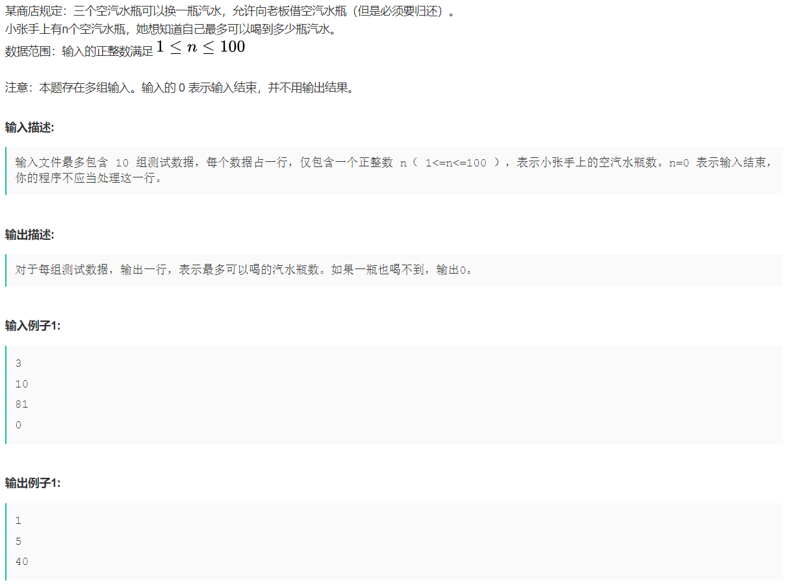
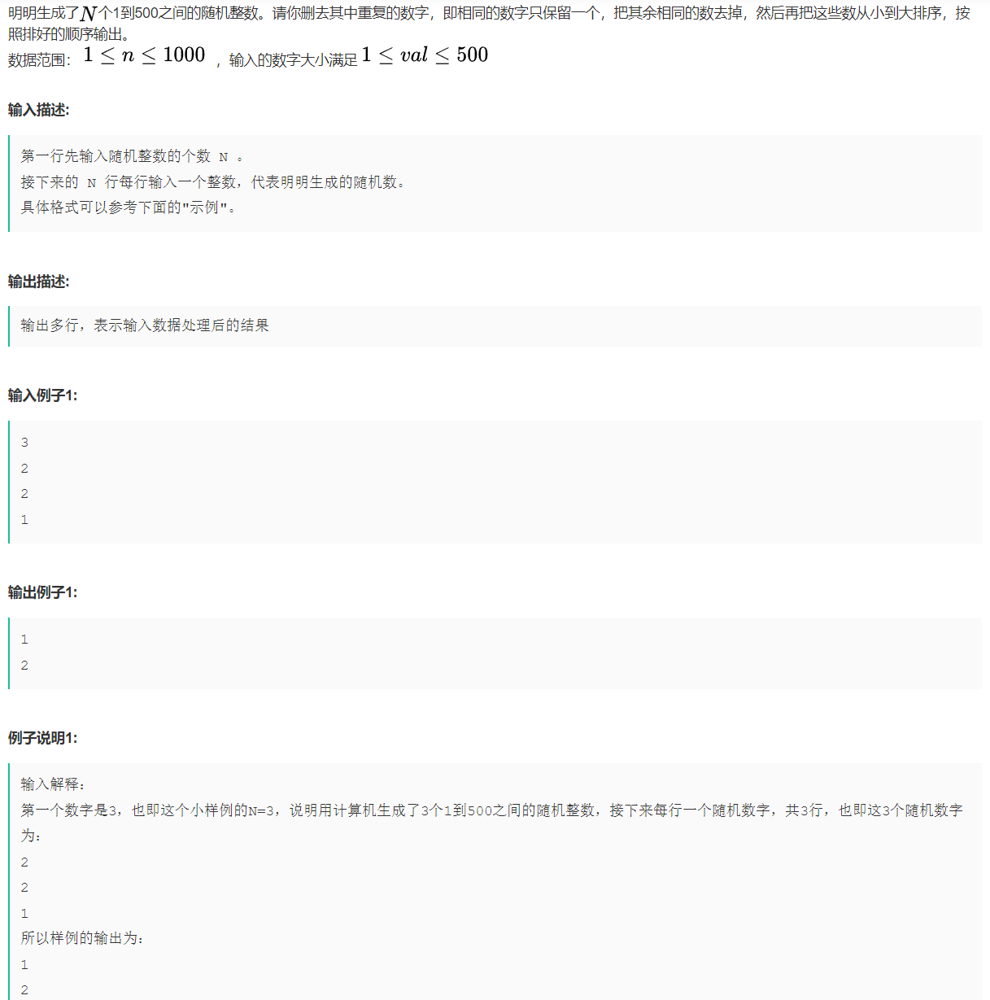

# 刷题

## ACM相关

### 汽水瓶问题



```java
import java.util.*;

public class Main {
    public static void main(String[] args) {
        Scanner sc = new Scanner(System.in);
        for (int i = 0; i < 10; ++i) {
            // 获取用户输入
            int emptyBottle = sc.nextInt();
            if (emptyBottle == 0) {
                return;
            }
            System.out.println(caculate(emptyBottle));
        }
    }
    
    public static int caculate(int n) {
        // 定义返回结果
        int ans = 0;
        // 迭代计算
        while (n > 2) {
            // 新喝的瓶数
            int temp = n / 3;
            // ans更新
            ans += temp;
            // n更新
            n = n % 3 + temp;
        }
        // 如果正好是2瓶就可以换一瓶
        if (n == 2) {
            return ans + 1;
        } else {
            return ans;
        }
    }
}
```

### 生成随机数去重并排序



```java
// 3
// 2
// 2
// 1
import java.util.*;

public class Main {
    public static void main(String[] args) {
        // 定义Scanner类
        Scanner scanner = new Scanner(System.in);
        // 因为多行输入，所以必须迭代
        while (scanner.hasNext()) {
            // 读取容量，构造数组
            int size = scanner.nextInt();
            int[] array = new int[size];
            // 把数组元素添加进数组
            for (int i = 0; i < size; ++i) {
                array[i] = scanner.nextInt();
            }
            // 数组排序
            Arrays.sort(array);
            // 输出数组
            System.out.println(array[0]);
            for (int i = 1; i < size; ++i) {
                // 判断是否和前一个相等
                if (array[i] != array[i - 1]) {
                    System.out.println(array[i]);
                }
            }
        }
       
    }
}
```

### 十六进制转十进制

```java
import java.util.*;

public class Main {
    public static void main(String[] args) {
        // 定义Scanner类
        Scanner sc = new Scanner(System.in);
        // 迭代检测
        while (sc.hasNext()) {
            // 输入的字符串并且全部转换为大写
            String s = sc.next().toUpperCase();
            System.out.println(trans(s));
        }
    }
    
    public static String trans(String s) {
        // 获取字符串长度
        int length = s.length();
        // 定义返回结果
        int ans = 0;
        // 从后往前遍历
        for (int i = length - 1; i > 1; --i) {
            ans += getInt(s.charAt(i)) * Math.pow(16, length - 1 - i);
        }
        return "" + ans;
    }
    
    public static int getInt(char c) {
        if (c <= '9' && c >= '0') {
            return c - '0';
        } else {
            return c - 'A' + 10;
        }
    }
}
```

