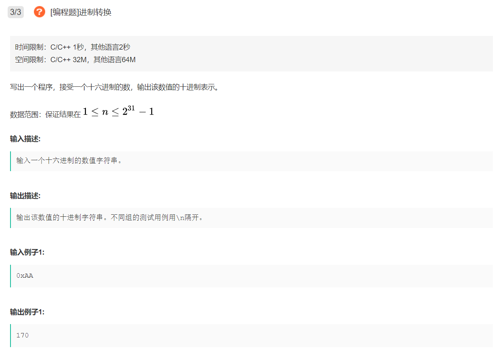
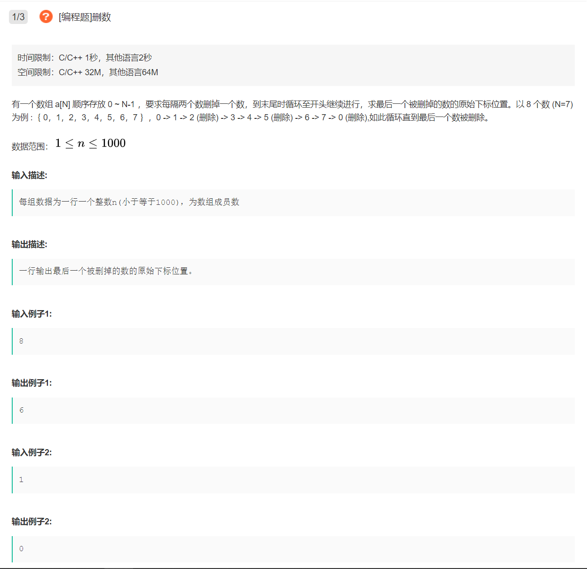
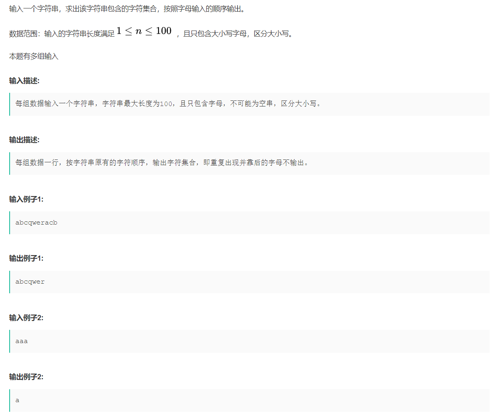

# 刷题

## ACM相关

### 汽水瓶问题


```java
import java.util.*;

public class Main {
    public static void main(String[] args) {
        Scanner sc = new Scanner(System.in);
        for (int i = 0; i < 10; ++i) {
            // 获取用户输入
            int emptyBottle = sc.nextInt();
            if (emptyBottle == 0) {
                return;
            }
            System.out.println(caculate(emptyBottle));
        }
    }
    
    public static int caculate(int n) {
        // 定义返回结果
        int ans = 0;
        // 迭代计算
        while (n > 2) {
            // 新喝的瓶数
            int temp = n / 3;
            // ans更新
            ans += temp;
            // n更新
            n = n % 3 + temp;
        }
        // 如果正好是2瓶就可以换一瓶
        if (n == 2) {
            return ans + 1;
        } else {
            return ans;
        }
    }
}
```

### 生成随机数去重并排序


```java
// 3
// 2
// 2
// 1
import java.util.*;

public class Main {
    public static void main(String[] args) {
        // 定义Scanner类
        Scanner scanner = new Scanner(System.in);
        // 因为多行输入，所以必须迭代
        while (scanner.hasNext()) {
            // 读取容量，构造数组
            int size = scanner.nextInt();
            int[] array = new int[size];
            // 把数组元素添加进数组
            for (int i = 0; i < size; ++i) {
                array[i] = scanner.nextInt();
            }
            // 数组排序
            Arrays.sort(array);
            // 输出数组
            System.out.println(array[0]);
            for (int i = 1; i < size; ++i) {
                // 判断是否和前一个相等
                if (array[i] != array[i - 1]) {
                    System.out.println(array[i]);
                }
            }
        }
    }
}
```

### 十六进制转十进制



```java
import java.util.*;

public class Main {
    public static void main(String[] args) {
        // 定义Scanner类
        Scanner sc = new Scanner(System.in);
        // 迭代检测
        while (sc.hasNext()) {
            // 输入的字符串并且全部转换为大写
            String s = sc.next().toUpperCase();
            System.out.println(trans(s));
        }
    }
    
    public static String trans(String s) {
        // 获取字符串长度
        int length = s.length();
        // 定义返回结果
        int ans = 0;
        // 从后往前遍历
        for (int i = length - 1; i > 1; --i) {
            ans += getInt(s.charAt(i)) * Math.pow(16, length - 1 - i);
        }
        return "" + ans;
    }
    
    public static int getInt(char c) {
        if (c <= '9' && c >= '0') {
            return c - '0';
        } else {
            return c - 'A' + 10;
        }
    }
}
```

### 删数，约瑟夫环问题



```java
import java.util.*;

public class Main {
    public static void main(String[] args) {
        // 定义Scanner类
        Scanner scanner = new Scanner(System.in);
        // 读取输入
        while (scanner.hasNext()) {
            int inputNumber = scanner.nextInt();
            System.out.println(caculate(inputNumber));
        }
    }
    
    public static int caculate(int n) {
        // 特殊情况处理
        if (n == 1) {
            return 0;
        }
        // 定义最后剩余的元素的索引
        int index = 0;
        for (int i = 2; i <= n; ++i) {
            index = (index + 3) % i;
        }
        return index;
    }
}
```

### 字符集合，按照字符输入的顺序去重并输出



```java
import java.util.*;

public class Main {
    public static void main(String[] args) {
        // 定义Scanner类
        Scanner scanner = new Scanner(System.in);
        // 迭代检测
        while (scanner.hasNext()) {
            // 读取字符串
            String s = scanner.next();
            System.out.println(trans(s));
        }
    }
    
    public static String trans(String s) {
        // 定义StringBuilder
        StringBuilder sb = new StringBuilder();
        // 定义HashMap
        Map<Character, Integer> sites = new HashMap<>();
        // 添加进hashmap
        for (int i = 0; i < s.length(); ++i) {
            // 如果不存在于hashmap中，就添加进sb
            if (!sites.containsKey(s.charAt(i))) {
                sb.append(s.charAt(i));
                sites.put(s.charAt(i), i);
            }
        }
        return sb.toString();
    }
}
```

## 数据结构

### 链表

#### 双指针技巧

##### LeetCode0021 合并两个有序链表

将两个升序链表合并为一个新的升序链表并返回。

```java
class Solution {
    public ListNode mergeTwoLists(ListNode l1, ListNode l2) {
        // 定义虚拟头结点
        ListNode dummy = new ListNode(-1);
        // 临时指针指向dummy
        ListNdoe p = dummy;
        // 定义两个指针分别指向两个链表的头结点
        ListNode p1 = l1;
        ListNode p2 = l2;
        // 遍历两个链表
        while (p1 != null || p2 != null) {
            // 比较两个指针的结点值
            if (p1.val < p2.val) {
                p.next = p1;
                p1 = p1.next;
            } else {
                p.next = p2;
                p2 = p2.next;
            }
            // p指针不断后移
            p = p.next;
        }
        // 因为双指针移动速率一样，所以如果两个链表长度不一，长链表会有剩余元素，直接把长链表的元素拼接到后面即可
        p.next = l1 == null ? l2 : l1;
        return dummy.next;
    }
}
```

##### LeetCode0086 分隔链表

对链表进行分隔，使得所有小于`x`的结点都出现在大于或等于`x`的结点之前。需要保留两个分区中每个结点的初始相对位置。

```java
class Solution {
    public ListNode partition(ListNode head, int x) {
        // 构造两个虚拟头结点，分别存放小于x和大于等于x的结点
        ListNode dummy1 = new ListNode(-1);
        ListNode dummy2 = new ListNode(-2);
        // 构造双指针分别指向这两个虚拟结点
        ListNode temp1 = dummy1;
        ListNode temp2 = dummy2;
        // 遍历链表
        while (head != null) {
            // 比较结点值和x
            if (head.val < x) {
                temp1.next = head;
                temp1 = temp1.next;
            } else {
                temp2.next = head;
                temp2 = temp2.next;
            }
            head = head.next;
        }
        // 需要将dummy2尾结点的next指针指向null，否则可能会形成环
        temp2.next = null;
        // 拼接两个链表
        temp1.next = dummy2.next;
        return dummy1.next;
    }
}
```

##### LeetCode0023 合并K个升序链表

链表数组中每个链表都已经按升序排列。将所有链表合并到一个升序链表中，返回合并后的链表。

```java
class Solution {
    public ListNode mergeKLists(ListNode[] lists) {
        // 特殊情况处理，链表数组长度为0直接返回null
        if (lists.length == 0) {
            return null;
        }
        // 定义虚拟头结点
        ListNode dummy = new ListNode(-1);
        // 定义临时指针指向dummy
        ListNode p = dummy;
        // 构造优先队列，最小堆
        PriorityQueue<ListNode> pq = new PriorityQueue<>(lists.length, (a, b) -> (a.val - b.val));
        // 将链表数组的头结点都加入最小堆
        for (ListNode head: lists) {
            if (head != null) {
                pq.add(head);
            }
        }
        // 不断从优先队列中取值
        while (!pq.isEmpty()) {
            // 从队列中获取最小结点，接到结果链表后
            ListNode temp = pq.poll();
            p.next = temp;
            // 如果temp后还有元素，添加进队列
            if (temp.next != null) {
                pq.add(temp.next);
            }
            p = p.next;
        }
        return dummy.next;
    }
}
```

##### LeetCode0019 删除链表倒数第N个结点

删除链表的倒数第`n`个结点，并且返回链表的头结点。

```java
class Solution {
    public ListNode removeNthFromEnd(ListNode head, int n) {
        // 定义虚拟头结点并指向head
        ListNode dummy = new ListNode(-1, head);
        // 找到倒数第n+1个结点
        ListNode temp = findFromEnd(dummy, n + 1);
        // 删除temp后一个结点
        temp.next = temp.next.next;
        // 返回结果
        return dummy.next;
    }

    public ListNode findFromEnd(ListNode dummy, int k) {
        // 先定义一个指针指向dummy
        ListNode p1 = dummy;
        // p1指针先走k步
        for (int i = 0; i < k; ++i) {
            p1 = p1.next;
        }
        // 然后定义一个指针指向dummy
        ListNode p2 = dummy;
        // p1和p2一起往后走，直到p1为空
        while (p1 != null) {
            p1 = p1.next;
            p2 = p2.next;
        }
        // p2已经到达倒数第k个结点
        return p2;
    }
}
```

##### LeetCode0142 环形链表Ⅱ

给定一个链表的头结点`head`，返回链表开始入环的第一个结点。如果链表无环，则返回`null`。

```java
class Solution {
    public ListNode detectCycle(ListNode head) {
        // 如果head为null，直接返回null
        if (head == null) {
            return null;
        }
        // 定义虚拟头结点并指向head
        ListNode dummy = new ListNode(-1, head);
        // 定义快慢指针指向dummy
        ListNode slow = dummy;
        ListNode fast = dummy;
        // 快慢指针往后移动
        while (true) {
            // 如果fast指针下一个元素为null或者fast已指向null，表示无环，直接返回null
            if (fast == null || fast.next == null) {
                return null;
            }
            // 快慢指针移动
            slow = slow.next;
            fast = fast.next.next;
            // 相遇时退出循环
            if (slow == fast) {
                break;
            }
        }
        // 再定义一个指针temp从dummy出发，速率与slow一致
        ListNode temp = dummy;
        // temp与slow相遇点即为圆环入口点
        while (temp != slow) {
            temp = temp.next;
            slow = slow.next;
        }
        return temp;
    }
}
```

##### LeetCode0160 相交链表

两个单链表的头结点`headA`和`headB`，请找出并返回两个单链表相交的起始结点。如果两个链表不存在相交结点，返回`null`。

```java
class Solution {
    public ListNode getIntersectionNode(ListNode headA, ListNode headB) {
        // 定义双指针分别指向两个链表的头结点
        ListNode p1 = headA;
        ListNode p2 = headB;
        // p1和p2每次走一步，走完后再从另一个链表开始走，相遇点即为相交结点
        while (p1 != p2) {
            if (p1 == null) {
                // 从链表B开始
                p1 = headB;
            } else {
                p1 = p1.next;
            }
            if (p2 == null) {
                // 从链表A开始
                p2 = headA;
            } else {
                p2 = p2.next;
            }
        }
        return p1;
    }
}
```

##### LeetCode0083 删除排序链表中的重复元素

给定一个已排序的链表的头`head`，删除所有重复的元素，使每个元素只出现一次。返回已排序的链表。

```java
class Solution {
    public ListNode deleteDuplicates(ListNode head) {
        // 特殊情况处理，如果head为空，直接返回null
        if (head == null) {
            return null;
        }
        // 定义快慢指针指向head
        ListNode slow = head;
        ListNode fast = head;
        // 遍历链表
        while (fast != null) {
            // 如果指针指向的元素值不等，slow.next=fast
            if (slow.val != fast.val) {
                slow.next = fast;
                slow = slow.next;
            }
            // 移动fast指针
            fast = fast.next;
        }
        // 断开slow后面的链表
        slow.next = null;
        return head;
    }
}
```

#### 递归技巧

##### LeetCode0206 反转链表

给定单链表的头结点`head`，反转链表并返回反转后的链表。

```java
class Solution {
    public ListNode reverseList(ListNode head) {
        // 递归结束条件
        if (head == null || head.next == null) {
            return head;
        }
        // 返回反转部分的尾结点
        ListNode last = reverseList(head.next);
        // 反转当前结点和下一个结点
        head.next.next = head;
        head.next = null;
        return last;
    }
}
```

##### LeetCode0092 反转链表Ⅱ

给定单链表的头指针`head`和两个整数`left`和`right`，其中`left <= right`。反转从位置`left`到位置`right`的链表结点，返回反转后的链表。

```java
class Solution {
    // 记录后继结点
    ListNode successor = null;

    public ListNode reverseBetween(ListNode head, int left, int right) {
        // 如果left为1，相当于反转前right个元素
        if (left == 1) {
            return reverseN(head, right);
        }
        // 返回反转部分的尾结点
        head.next = reverseBetween(head.next, left - 1, right - 1);
        return head;
    }

    public ListNode reverseN(ListNode head, int n) {
        // 递归结束条件
        if (n == 1) {
            // 记录第n+1个结点
            successor = head.next;
            return head;
        }
        // 返回反转部分的尾结点
        ListNode last = reverseN(head.next, n - 1);
        // 反转当前结点和下一个结点
        head.next.next = head;
        head.next = successor;
        return last;
    }
}
```

##### LeetCode0025 K个一组反转链表

给定链表的头结点`head`，每`k`个结点一组进行翻转，返回修改后的链表。

```java
class Solution {
    public ListNode reverseKGroup(ListNode head, int k) {
        // 特殊情况处理，如果head为空或者head下一个为空，直接返回head
        if (head == null || head.next == null) {
            return head;
        }
        // 定义虚拟头结点dummy并指向head
        ListNode dummy = new ListNode(-1, head);
        // 定义前驱结点
        ListNode pre = dummy;
        // 遍历链表
        while (head != null) {
            // 定义一组结点的尾结点tail
            ListNode tail = pre;
            // 移动tail
            for (int i = 0; i < k; ++i) {
                tail = tail.next;
                // 如果tail为空，说明不用反转了
                if (tail == null) {
                    return dummy.next;
                }
            }
            // 定义一组结点后的下一个结点nex
            ListNode nex = tail.next;
            // 断开这一组结点
            pre.next = null;
            tail.next = null;
            // 反转这一组链表
            reverseList(head);
            // 连接回原链表
            pre.next = tail;
            head.next = nex;
            // 移动到下一组
            pre = head;
            head = pre.next;
        }
        return dummy.next;
    }

    public ListNode reverseList(ListNode head) {
        // 递归结束条件
        if (head == null || head.next == null) {
            return head;
        }
        // 返回反转部分的尾结点
        ListNode last = reverseList(head.next);
        // 反转当前结点和下一个结点
        head.next.next = head;
        head.next = null;
        return last;
    }
}
```

##### LeetCode0234 回文链表

给定一个单链表的头结点`head`，判断该链表是否为回文链表。如果是，返回`true`；否则，返回`false`。

```java
class Solution {
    public boolean isPalindrome(ListNode head) {
        // 定义快慢指针，指向head
        ListNode slow = head;
        ListNode fast = head;
        // 移动快慢指针，使得slow指针找到链表中点
        while (fast != null && fast.next != null) {
            fast = fast.next.next;
            slow = slow.next;
        }
        // 如果fast不指向null，表示链表长度为奇数，slow指针还需要前移一个元素
        if (fast != null) {
            slow = slow.next;
        }
        // 定义左右指针，左指针指向head，右指针指向右半部分反转之后的头结点
        ListNode left = head;
        ListNode right = reverseList(slow);
        // 遍历左右两部分链表
        while (right != null) {
            // 比较左右链表的值
            if (left.val != right.val) {
                return false;
            }
            // 移动左右指针
            left = left.next;
            right = right.next;
        }
        return true;
    }

    public ListNode reverseList(ListNode head) {
        // 递归结束条件
        if (head == null || head.next == null) {
            return head;
        }
        // 返回反转部分的尾结点
        ListNode last = reverseList(head.next);
        // 反转当前结点和下一个结点
        head.next.next = head;
        head.next = null;
        return last;
    }
}
```

### 数组

#### 双指针技巧

##### LeetCode0026 删除有序数组中的重复项

给定升序排列的数组`nums`，原地删除重复出现的元素，使每个元素只出现一次，返回删除后数组的新长度。元素的相对顺序应该保持一致。

```java
class Solution {
    public int removeDuplicates(int[] nums) {
        // 特殊情况处理，如果数组长度为0，直接返回0
        if (nums.length == 0) {
            return 0;
        }
        // 定义快慢指针
        int slow = 0;
        int fast = 0;
        // 遍历数组元素
        while (fast < nums.length) {
            // 如果两个指针指向的元素不等，slow往后移动，把fast值赋给slow
            if (nums[slow] != nums[fast]) {
                ++slow;
                nums[slow] = nums[fast];
            }
            ++fast;
        }
        // 最后slow指向不重复子数组的末位索引
        return slow + 1;
    }
}
```

##### LeetCode0027 移除元素

给定一个数组`nums`和一个值`val`，`原地`移除所有数值等于`val`的元素，并返回移除后数组的新长度。

```java
class Solution {
    public int removeElement(int[] nums, int val) {
        // 定义快慢指针
        int slow = 0;
        int fast = 0;
        // 遍历链表
        while (fast < nums.length) {
            // 如果fast指向的元素不等于val，赋值给slow，slow指针后移
            if (nums[fast] != val) {
                nums[slow] = nums[fast];
                ++slow;
            }
            ++fast;
        }
        // 此时slow指向子数组的下一个元素，所以slow等于长度
        return slow;
    }
}
```

##### LeetCode0283 移动零

给定一个数组`nums`，将所有`0`移动到数组的末尾，同时保持非零元素的相对顺序。

```java
class Solution {
    public void moveZeroes(int[] nums) {
        // 把所有的0都移除（LeetCode0027）
        int p = removeElement(nums, 0);
        // p为全0子数组的开始索引，把后面的元素全部修改成为0
        for (; p < nums.length; ++p) {
            nums[p] = 0;
        }
    }

    public int removeElement(int[] nums, int val) {
        // 定义快慢指针
        int slow = 0;
        int fast = 0;
        // 遍历链表
        while (fast < nums.length) {
            // 如果fast指向的元素不等于val，赋值给slow，slow指针后移
            if (nums[fast] != val) {
                nums[slow] = nums[fast];
                ++slow;
            }
            ++fast;
        }
        // 此时slow指向子数组的下一个元素，所以slow等于长度
        return slow;
    }
}
```

##### LeetCode0005 最长回文子串

给定一个字符串`s`，找到`s`中最长的回文子串。

```java
class Solution {
    public String longestPalindrome(String s) {
        // 定义返回结果
        String ans = "";
        // 遍历字符串
        for (int i = 0; i < s.length(); ++i) {
            // 寻找以s[i]为中心的最长回文串
            String res1 = palindrome(s, i, i);
            // 寻找以s[i]和s[i+1]为中心的最长回文串
            String res2 = palindrome(s, i, i + 1);
            // 更新ans
            ans = ans.length() > res1.length() ? ans : res1;
            ans = ans.length() > res2.length() ? ans : res2;
        }
        return ans;
    }

    // 寻找以s[left]和s[right]为中心的最长回文串
    public String palindrome(String s, int left, int right) {
        // 索引不越界的情况下，两端元素相等即可把指针扩张
        while (left >= 0 && right < s.length() && s.charAt(left) == s.charAt(right)) {
            --left;
            ++right;
        }
        // 返回以s[left]和s[right]为中心的最长回文串
        return s.substring(left + 1, right);
    }
}
```

#### 遍历技巧

##### LeetCode0048 旋转矩阵

给定一个`n × n`的二维矩阵`matrix`，请将图像顺时针旋转90度。

```java
class Solution {
    public void rotate(int[][] matrix) {
        // 获取二维矩阵的长宽
        int n = matrix.length;
        // 首先对角线翻转（左上到右下的对角线）
        for (int i = 0; i < n; ++i) {
            for (int j = i; j < n; ++j) {
                // 交换元素
                int temp = matrix[i][j];
                matrix[i][j] = matrix[j][i];
                matrix[j][i] = temp;
            }
        }
        // 再将每一行矩阵翻转
        for (int[] rows: matrix) {
            reverse(rows);
        }
    }

    public void reverse(int[] matrix) {
        // 双指针翻转一维数组
        int left = 0;
        int right = matrix.length - 1;
        // 遍历交换元素
        while (left < right) {
            int temp = matrix[left];
            matrix[left] = matrix[right];
            matrix[right] = temp;
            ++left;
            --right;
        }
    }
}
```

##### LeetCode0054 螺旋矩阵

给定一个`m`行`n`列的矩阵`matrix`，请按照顺时针螺旋顺序返回矩阵中的所有元素。

```java
class Solution {
    public List<Integer> spiralOrder(int[][] matrix) {
        
    }
}
```
