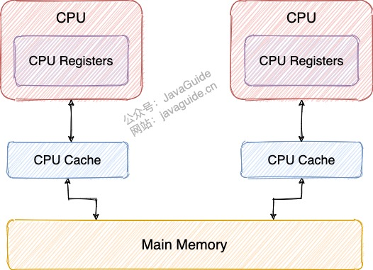

# 多线程

## 一、理论基础

### 1.1 为什么需要多线程？:airplane:

> 参考链接：[JavaGuide](https://javaguide.cn/java/concurrent/java-concurrent-questions-01.html#%E4%B8%BA%E4%BB%80%E4%B9%88%E8%A6%81%E4%BD%BF%E7%94%A8%E5%A4%9A%E7%BA%BF%E7%A8%8B%E5%91%A2)

- **从计算机底层来说**：线程可以比作是轻量级的进程，是程序执行的最小单位，线程间的切换、调度的成本远远小于进程。**在单核时代，多线程主要是为了提高单进程利用CPU和I/O的效率；在多核时代，多线程主要是为了提高进程利用多核CPU的能力**。
- **从当代互联网发展趋势来说**： 现在的系统对于并发量的要求极高，而**多线程并发编程正是高并发系统的基础，利用好多线程机制可以大大提高系统整体的并发能力以及性能**。

### 1.2 使用多线程可能会带来哪些问题？

> 参考链接：[JavaGuide](https://javaguide.cn/java/concurrent/java-concurrent-questions-01.html#%E4%BD%BF%E7%94%A8%E5%A4%9A%E7%BA%BF%E7%A8%8B%E5%8F%AF%E8%83%BD%E5%B8%A6%E6%9D%A5%E4%BB%80%E4%B9%88%E9%97%AE%E9%A2%98)

并发编程的目的就是为了能提高程序的执行效率提高程序运行速度，但是并发编程并不总是能提高程序运行速度的，而且并发编程可能会遇到很多问题，比如：**线程不安全**、**死锁**等等。

### 1.3 并发与并行、同步与异步、阻塞与非阻塞:airplane:

> 参考链接：[JavaGuide](https://javaguide.cn/java/concurrent/java-concurrent-questions-01.html#%E5%B9%B6%E5%8F%91%E4%B8%8E%E5%B9%B6%E8%A1%8C%E7%9A%84%E5%8C%BA%E5%88%AB)、[JavaGuide](https://javaguide.cn/java/concurrent/java-concurrent-questions-01.html#%E5%90%8C%E6%AD%A5%E5%92%8C%E5%BC%82%E6%AD%A5%E7%9A%84%E5%8C%BA%E5%88%AB)、[知乎](https://www.zhihu.com/question/19732473)

- **并发**：两个及两个以上的作业在同一**时间段内**执行。
- **并行**：两个及两个以上的作业在同一**时刻**执行。

同步和异步关注的是**消息通信机制**：

- **同步**：发出一个**调用**后，在没有得到结果前， 该**调用**就不返回，即**调用者主动等待这个调用的结果**。
- **异步**：**调用**在发出之后，不用等待返回结果，即**调用者不会立刻得到结果**，而是**被调用者通过状态、通知来通知调用者，或通过回调函数处理这个调用**。

阻塞和非阻塞关注的是**程序在等待调用结果（消息，返回值）时的状态**：

- 阻塞：指调用结果返回之前，**当前线程会被挂起**。
- 非阻塞：指在得到结果之前，**该调用不会阻塞当前线程**。

### 1.4 并发三要素

> 参考链接：[Java全栈知识体系](https://pdai.tech/md/java/thread/java-thread-x-theorty.html#%E5%B9%B6%E5%8F%91%E5%87%BA%E7%8E%B0%E9%97%AE%E9%A2%98%E7%9A%84%E6%A0%B9%E6%BA%90-%E5%B9%B6%E5%8F%91%E4%B8%89%E8%A6%81%E7%B4%A0)

- **可见性**：一个线程对共享变量进行了修改，另外一个线程能够立刻看到。
- **原子性**：一个操作或者多个操作，要么全部执行并且执行的过程不会被任何因素打断，要么就都不执行。
- **有序性**：程序执行的顺序按照代码的先后顺序执行。

## 二、线程基础

### 2.1 线程的生命周期和状态:airplane:

> 参考链接：[JavaGuide](https://javaguide.cn/java/concurrent/java-concurrent-questions-01.html#%E8%AF%B4%E8%AF%B4%E7%BA%BF%E7%A8%8B%E7%9A%84%E7%94%9F%E5%91%BD%E5%91%A8%E6%9C%9F%E5%92%8C%E7%8A%B6%E6%80%81)

Java线程在运行生命周期中的指定时刻只可能处于下面6种状态中的一种：

- `NEW`：初始状态，线程被创建出来但没有被调用`start()`。
- `RUNNABLE`：运行状态，线程被调用了`start()`等待运行的状态。
- `BLOCKED`：阻塞状态，需要等待锁释放。
- `WAITING`：等待状态，表示**该线程需要等待其他线程做出一些特定动作（通知或中断）**。
- `TIME_WAITING`：超时等待状态，**可以在指定的时间后自行返回**，不像`WAITING`那样一直等待。
- `TERMINATED`：终止状态，表示该线程已经运行完毕。


- 线程被创建后处于`NEW`，调用`start()`方法后开始运行，线程这时候处于`READY`，`READY`状态的线程获得CPU时间片后就处于`RUNNING`。

  **补充**：在操作系统层面，线程有`READY`和`RUNNING`状态；而在JVM层面，只有`RUNNABLE`状态。现在的操作系统架构通常使用“时间分片”方式进行抢占式轮转调度。这个时间分片通常是很小的，时间片用后就要被切换下来放入调度队列的末尾等待再次调度（也即回到`READY`状态）。**线程切换的如此之快，区分这两种状态意义不大**。

- 当线程执行`wait()`方法后进入`WAITING`，**需要依靠其他线程的通知才能够返回到运行状态**。
- `TIMED_WAITING`相当于在`WAITING`基础上**增加了超时限制**，比如通过`sleep(long millis)`方法或`wait(long millis)`方法可以将线程置于`TIMED_WAITING`。当超时时间结束后，线程将会返回到`RUNNABLE`状态。
- 当线程进入`synchronized`方法/块或者调用`wait`后（被`notify`）重新进入`synchronized`方法/块，但是锁被其它线程占有，这个时候线程就会进入`BLOCKED`。
- 线程在执行完了`run()`方法之后将会进入到`TERMINATED`。

#### 什么是上下文切换？

> 参考链接：[JavaGuide](https://javaguide.cn/java/concurrent/java-concurrent-questions-01.html#%E4%BB%80%E4%B9%88%E6%98%AF%E4%B8%8A%E4%B8%8B%E6%96%87%E5%88%87%E6%8D%A2)

线程在执行过程中会有自己的**运行条件和状态（即上下文）**，比如程序计数器、栈信息等。当出现如下情况的时候，线程会从占用CPU状态中退出：

- 主动让出CPU，比如调用了`sleep()`、`wait()`等。
- 时间片用完。
- 调用了阻塞类型的系统中断，比如请求I/O、线程被阻塞。
- 被终止或结束运行。

这其中**前三种都会发生线程切换**，**线程切换意味着需要保存当前线程的上下文，留待线程下次占用CPU的时候恢复现场，并加载下一个将要占用CPU的线程上下文**。这就是所谓的**上下文切换**。

#### `sleep()`和`wait()`的区别

> 参考链接：[JavaGuide](https://javaguide.cn/java/concurrent/java-concurrent-questions-01.html#sleep-%E6%96%B9%E6%B3%95%E5%92%8C-wait-%E6%96%B9%E6%B3%95%E5%AF%B9%E6%AF%94)

**共同点**：两者都可以暂停线程的执行。

**区别**：

- **`sleep()`没有释放锁，而`wait()`释放了锁**。
- `wait()`通常被用于线程间交互/通信，`sleep()`通常被用于暂停执行。
- `wait()`被调用后，线程不会自动苏醒，需要别的线程调用同一个对象上的`notify()`或`notifyAll()`方法。`sleep()`方法执行完成后，线程会自动苏醒。（使用`wait(long timeout)`超时后线程也会自动苏醒）
- `sleep()`是`Thread`类的**静态本地方法**（`public static native`修饰），`wait()`则是`Object`类的本地方法（`public final native`修饰）。

##### 为什么`wait()`方法不定义在`Thread`中？

`wait()`是**让获得对象锁的线程释放占有的对象锁**，进入`WAITING`状态，由于每个对象都有对象锁，所以需要操作的是`Object`而非`Thread`。

##### 为什么`sleep()`方法定义在`Thread`中？

`sleep()`是**让当前线程暂停**，不涉及到对象类，也不需要获得对象锁。

#### 可以直接调用`Thread`类的`run()`吗？

> 参考链接：[JavaGuide](https://javaguide.cn/java/concurrent/java-concurrent-questions-01.html#%E5%8F%AF%E4%BB%A5%E7%9B%B4%E6%8E%A5%E8%B0%83%E7%94%A8-thread-%E7%B1%BB%E7%9A%84-run-%E6%96%B9%E6%B3%95%E5%90%97)

`new`一个 `Thread`，线程就进入了`NEW`状态。之后调用`start()`方法，会启动一个线程并使线程进入`READY`状态，当分配到时间片后就可以开始运行了（进入`RUNNING`状态）。**`start()`会执行线程的相应准备工作，然后自动执行`run()`方法的内容，这是真正的多线程工作**。如果直接执行`run()`方法，**会把`run()`方法当成一个`main`线程下的普通方法去执行**，并不会在某个线程中执行它，所以这并不是多线程工作。

#### `sleep()`和`yield()`的区别

> 参考：JobStack/Java基础/43

- `sleep()`方法给其他线程运行机会时不考虑优先级；`yield()`方法只会给相同优先级或更高优先级的线程运行的机会。
- 线程执行`sleep()`方法后进入`TIMED_WAITING`状态；线程执行`yield()`方法转入`READY`状态，可能又马上得到执行。
- `sleep()`方法声明抛出`InterruptedException`；`yield()`方法不抛出异常。
- `sleep()`方法需要指定时间参数；`yield()`方法让出CPU的执行权时间由JVM控制。

### 2.2 创建线程的方式:airplane:

> 参考链接：[思否](https://segmentfault.com/a/1190000037589073)、[牛客](https://www.nowcoder.com/questionTerminal/a84f877db0c148fd90b1f26000bf302f)
>

#### 继承`Thread`类

定义一个类继承`Thread`类并重写`run()`，然后创建这个子类对象，调用`start()`启动线程。

```java
public class MyThread extends Thread {
    @Override
    public void run() {
        System.out.println("thread is running...");
    }

    public static void main(String[] args) {
        new MyThread().start();
    }
}
```

#### 实现`Runnable`接口

定义一个类实现`Runnable`接口并实现`run()`，然后创建这个实现类对象，把它作为target传入`Thread`的构造函数中，最后调用`start()`启动线程。

```java
public class MyThread implements Runnable {
    @Override
    public void run() {
        System.out.println("thread is running...");
    }

    public static void main(String[] args) {
        new Thread(new MyThread()).start();
    }
}
```

#### 实现`Callable`接口

定义一个`Callable`的实现类并实现`call()`（带返回值），然后通过`FutureTask`的构造方法把这个实现类传进去，接着把`FutureTask`作为`Thread`类的target ，创建`Thread`线程对象，最后通过`FutureTask`的`get()`获取线程的执行结果。

```java
public class TestFuture {
    public static void main(String[] args) throws ExecutionException, InterruptedException {
        FutureTask<Integer> task = new FutureTask<>(new MyThread());
        new Thread(task).start();
        Integer result = task.get();
        System.out.println(result);
    }
}

class MyThread implements Callable<Integer> {
    @Override
    public Integer call() throws Exception {
        return new Random().nextInt(100);
    }
}
```

#### 通过线程池

使用`java.util.current.ThreadPoolExecutor`获取线程。

#### 总结

实现`Runnable`接口时，最终也会创建`Thread`类对象；实现`Callable`接口时，结合`Future`和`FutureTask`，最终也会创建`Thread`类。**所以可以说本质上创建线程就只有一种方式：构造一个`Thread`类（或其子类）**。

## 三、JMM

### 3.1 前言

#### CPU缓存模型

> 参考链接：[JavaGuide](https://javaguide.cn/java/concurrent/jmm.html#%E4%BB%8E-cpu-%E7%BC%93%E5%AD%98%E6%A8%A1%E5%9E%8B%E8%AF%B4%E8%B5%B7)

**为什么要需要CPU高速缓存**？CPU缓存是为了**解决CPU和内存处理速度不对等的问题**。

- CPU Cache缓存的是内存数据，用于**解决CPU和内存处理速度不匹配的问题**。
- 内存缓存的是硬盘数据，用于**解决硬盘访问速度过慢的问题**。



**CPU Cache的工作方式**：先复制一份数据到CPU Cache中，当CPU需要用到的时候就直接从CPU Cache中读取数据。当运算完成后，再将运算得到的数据写回Main Memory中，但是这样存在**数据不一致性的问题**！

为了解决这个问题，可以通过制定**缓存一致协议（比如MESI协议）**或者其他手段来解决。这个缓存一致性协议指的是**在CPU Cache与主内存交互的时候需要准守的原则和规范**。不同CPU中使用的缓存一致性协议通常也有所不同。


程序运行在操作系统之上，操作系统屏蔽了底层硬件的操作细节，将各种硬件资源虚拟化。于是操作系统也同样需要解决内存缓存不一致性问题。操作系统通过**内存模型（Memory Model）**定义一系列规范来解决这个问题。无论是Windows系统，还是Linux系统，它们都有特定的内存模型。

#### 指令重排序

> 参考链接：[JavaGuide](https://javaguide.cn/java/concurrent/jmm.html#%E6%8C%87%E4%BB%A4%E9%87%8D%E6%8E%92%E5%BA%8F)、[Java全栈知识体系](https://pdai.tech/md/java/thread/java-thread-x-theorty.html#%E6%9C%89%E5%BA%8F%E6%80%A7-%E9%87%8D%E6%8E%92%E5%BA%8F%E5%BC%95%E8%B5%B7)

**为了提升执行速度/性能，计算机在执行程序代码的时候，会对指令进行重排序**。常见的指令重排序有2种情况：

- **编译器优化重排**：编译器（包括JVM、JIT等）在不改变单线程程序语义的前提下，重新安排语句的执行顺序。
- **指令级并行重排**：现代处理器采用了**指令级并行技术（Instruction-Level Parallelism，ILP）**来将多条指令重叠执行。如果不存在数据依赖性，处理器可以改变语句对应机器指令的执行顺序。

另外，内存系统也会有“重排序”，但不是真正意义上的重排序。因为是**使用了缓存和读/写缓冲区，使得加载和存储操作看上去可能是在乱序执行**。

Java源代码会经历**编译器优化重排-->指令级并行重排-->内存系统重排**的过程，最终才变成操作系统可执行的指令序列。


上述的1属于**编译器重排序**，2和3属于**处理器重排序**。

- 对于编译器重排序，**JMM的编译器重排序规则会禁止特定类型的编译器重排序**（不是所有的编译器重排序都要禁止）。
- 对于处理器重排序，**JMM的处理器重排序规则会插入特定类型的内存屏障（Memory Barriers或Memory Fence）来禁止特定类型的处理器重排序**（不是所有的处理器重排序都要禁止）。

### 3.2 什么是JMM？为什么需要JMM？:airplane:

> 参考链接：[JavaGuide](https://javaguide.cn/java/concurrent/jmm.html#%E4%BB%80%E4%B9%88%E6%98%AF-jmm-%E4%B8%BA%E4%BB%80%E4%B9%88%E9%9C%80%E8%A6%81-jmm)

Java语言是跨平台的，**它需要自己提供一套内存模型以屏蔽系统差异**。实际上可以**把JMM看作是Java定义的与并发编程相关的一组规范**，开发者可以利用这些规范更方便地开发多线程程序，直接使用并发相关的一些关键字和类（比如`volatile`、`synchronized`和各种`Lock`）即可开发出并发安全的程序。

### 3.3 JMM如何抽象线程和主内存之间的关系？

> 参考链接：[JavaGuide](https://javaguide.cn/java/concurrent/jmm.html#jmm-%E6%98%AF%E5%A6%82%E4%BD%95%E6%8A%BD%E8%B1%A1%E7%BA%BF%E7%A8%8B%E5%92%8C%E4%B8%BB%E5%86%85%E5%AD%98%E4%B9%8B%E9%97%B4%E7%9A%84%E5%85%B3%E7%B3%BB)

JMM抽象了线程和主内存之间的关系，即**线程之间的共享变量必须存储在主内存中**。

在JDK 1.2之前，JMM实现总是从**主内存**（即共享内存）读取变量；而**在当前JMM下，线程可以把变量保存在本地内存（比如机器的寄存器）中，而不是直接在主内存中进行读写**。这就可能造成一个线程在主内存中修改了一个变量的值，而另外一个线程还继续使用它在寄存器中的变量值的拷贝，造成数据不一致。

- **主内存**：**所有线程创建的实例对象都存放在主内存中**，不管该实例对象是成员变量还是方法中的局部变量。
- **本地内存**：每个线程都有一个私有的本地内存来存储共享变量的副本，并且每个线程只能访问自己的本地内存，无法访问其他线程的本地内存。本地内存是JMM抽象出来的一个概念，存储了主内存中的共享变量副本。


线程1与线程2之间如果要进行通信的话，必须要经历2个步骤：

1. 线程1把本地内存中修改过的共享变量副本的值同步到主内存中；
2. 线程2到主存中读取对应的共享变量的值。

关于主内存与工作内存直接的具体交互协议，即一个变量如何从主内存拷贝到工作内存、如何从工作内存同步到主内存之间的实现细节，JMM定义以下八种同步操作：

- **锁定（lock）**：作用于主内存中的变量，将它标记为一个线程独享变量。
- **解锁（unlock）**：作用于主内存中的变量，解除变量的锁定状态，被解除锁定状态的变量才能被其他线程锁定。
- **read（读取）**：作用于主内存的变量，它把一个变量的值从主内存传输到线程的工作内存中，以便随后的载入动作使用。
- **load（载入）**：把读取操作从主内存中得到的变量值放入工作内存的变量的副本中。

- **use（使用）**：把工作内存中的一个变量的值传给执行引擎，每当虚拟机遇到一个使用到变量的指令时都会使用该指令。
- **assign（赋值）**：作用于工作内存的变量，它把一个从执行引擎接收到的值赋给工作内存的变量，每当虚拟机遇到一个给变量赋值的字节码指令时执行这个操作。
- **store（存储）**：作用于工作内存的变量，它把工作内存中一个变量的值传送到主内存中，以便随后的 write 操作使用。
- **write（写入）**：作用于主内存的变量，它把 store 操作从工作内存中得到的变量的值放入主内存的变量中。

除了这8种同步操作之外，还规定了下面这些同步规则来保证这些同步操作的正确执行：

- 不允许一个线程无原因地（没有发生过任何赋值操作）把数据从线程的工作内存同步回主内存中。
- 一个新的变量只能在主内存中“诞生”，不允许在工作内存中直接使用一个未被初始化的变量，换句话说就是对一个变量实施`use`和`store`操作之前，必须先执行过了`assign`和`load`操作。
- 一个变量在同一个时刻只允许一条线程对其进行`lock`操作，但`lock`操作可以被同一条线程重复执行多次，多次执行`lock`后，只有执行相同次数的`unlock`操作，变量才会被解锁。
- 如果对一个变量执行`lock`操作，将会清空工作内存中此变量的值，在执行引擎使用这个变量前，需要重新执行`load`或`assign`操作初始化变量的值。
- 如果一个变量事先没有被`lock`操作锁定，则不允许对它执行`unlock`操作，也不允许去`unlock`一个被其他线程锁定住的变量。
- ……

### 3.4 happens-before原则

#### 什么是happens-before原则？为什么需要它？

> 参考链接：[JavaGuide](https://javaguide.cn/java/concurrent/jmm.html#happens-before-%E5%8E%9F%E5%88%99%E6%98%AF%E4%BB%80%E4%B9%88)

happens-before：**描述两个操作之间的内存可见性**。

**为什么需要happens-before原则？** happens-before原则的诞生是**为了程序员和编译器、处理器之间的平衡**。程序员追求的是易于理解和编程的强内存模型，遵守既定规则编码即可。编译器和处理器追求的是较少约束的弱内存模型，让它们尽己所能地去优化性能，让性能最大化。happens-before原则的设计思想其实非常简单：

- 为了对编译器和处理器的约束尽可能少，**只要不改变程序的执行结果，编译器和处理器怎么进行重排序优化都可以**。
- **对于会改变程序执行结果的重排序，JMM要求编译器和处理器必须禁止这种重排序**。

happens-before原则的定义：

- 如果一个操作happens-before另一个操作，**那么第一个操作的执行结果将对第二个操作可见，并且第一个操作的执行顺序排在第二个操作之前**。
- 两个操作之间存在happens-before关系，并不意味着具体实现必须要按照happens-before关系指定的顺序来执行。**如果重排序之后的执行结果与按happens-before关系来执行的结果一致，那么JMM也允许这样的重排序**。

#### happens-before常见规则有哪些？

> 参考链接：[JavaGuide](https://javaguide.cn/java/concurrent/jmm.html#happens-before-%E5%B8%B8%E8%A7%81%E8%A7%84%E5%88%99%E6%9C%89%E5%93%AA%E4%BA%9B-%E8%B0%88%E8%B0%88%E4%BD%A0%E7%9A%84%E7%90%86%E8%A7%A3)

happens-before规则总共8条，重点了解下面5条：

- **程序顺序规则**：一个线程内，按照代码顺序，书写在前面的操作happens-before于书写在后面的操作。
- **解锁规则**：解锁happens-before于加锁。
- **`volatile`变量规则**：对一个`volatile`变量的写操作happens-before于后面对这个`volatile`变量的读操作。
- **传递规则**：如果A happens-before B，且B happens-before C，那么A happens-before C。
- **线程启动规则**：`Thread`对象的`start()`happens-before于此线程的每一个动作。

如果两个操作不满足任意一个happens-before规则，那么这两个操作就没有顺序的保障，就可以对这两个操作进行重排序。

## 四、`volatile`关键字

### 4.1 如何保证变量的可见性？:airplane:

> 参考链接：[JavaGuide](https://javaguide.cn/java/concurrent/java-concurrent-questions-02.html#%E5%A6%82%E4%BD%95%E4%BF%9D%E8%AF%81%E5%8F%98%E9%87%8F%E7%9A%84%E5%8F%AF%E8%A7%81%E6%80%A7)

在Java中，`volatile`关键字可以保证变量的可见性。如果将变量声明为`volatile`，**表明这个变量是共享且不稳定的，每次使用它都到主内存中进行读取**。`volatile`关键字并非Java特有，在C语言里也有，它最原始的意义就是**禁用CPU缓存**。


### 4.2 如何禁止指令重排序？:airplane:

> 参考链接：[JavaGuide](https://javaguide.cn/java/concurrent/java-concurrent-questions-02.html#%E5%A6%82%E4%BD%95%E7%A6%81%E6%AD%A2%E6%8C%87%E4%BB%A4%E9%87%8D%E6%8E%92%E5%BA%8F)

`volatile`关键字除了可以保证变量的可见性，还有一个重要的作用就是**防止JVM的指令重排序**。如果将变量声明为`volatile`，在对这个变量进行读写操作的时候，会通过插入特定的**内存屏障**的方式来禁止指令重排序。

> 参考链接：[Java全栈知识体系](https://pdai.tech/md/java/thread/java-thread-x-key-volatile.html#volatile-%E6%9C%89%E5%BA%8F%E6%80%A7%E5%AE%9E%E7%8E%B0)

- 在每个`volatile`写操作的前面插入一个StoreStore屏障（禁止上面的普通写和下面的`volatile`写重排序）。
- 在每个`volatile`写操作的后面插入一个StoreLoad屏障（防止上面的`volatile`写与下面可能有的`volatile`读/写重排序）。
- 在每个`volatile`读操作的后面插入一个LoadLoad屏障（禁止下面所有的普通读操作和上面的`volatile`读重排序）。
- 在每个`volatile`读操作的后面插入一个LoadStore屏障（禁止下面所有的普通写操作和上面的`volatile`读重排序）。

### 4.3 可以保证原子性吗？

> 参考链接：[JavaGuide](https://javaguide.cn/java/concurrent/java-concurrent-questions-02.html#volatile-%E5%8F%AF%E4%BB%A5%E4%BF%9D%E8%AF%81%E5%8E%9F%E5%AD%90%E6%80%A7%E4%B9%88)

`volatile`关键字能保证变量的可见性，但**不能保证对变量的操作是原子性的**。

## 五、`synchronized`关键字

### 5.1 `synchronized`作用:airplane:

> 参考链接：[JavaGuide](https://javaguide.cn/java/concurrent/java-concurrent-questions-02.html#%E8%AF%B4%E4%B8%80%E8%AF%B4%E8%87%AA%E5%B7%B1%E5%AF%B9%E4%BA%8E-synchronized-%E5%85%B3%E9%94%AE%E5%AD%97%E7%9A%84%E4%BA%86%E8%A7%A3)

`synchronized`关键字解决的是**多个线程之间访问资源的同步性**，`synchronized`关键字可以**保证修饰的方法或者代码块在任意时刻只能有一个线程执行**。

### 5.2 如何使用`synchronized`？:airplane:

> 参考链接：[JavaGuide](https://javaguide.cn/java/concurrent/java-concurrent-questions-02.html#%E5%A6%82%E4%BD%95%E4%BD%BF%E7%94%A8-synchronized-%E5%85%B3%E9%94%AE%E5%AD%97)

#### 修饰实例方法（锁当前对象实例）

给当前对象实例加锁，进入同步代码前要获得**当前对象实例的锁**。

```java
synchronized void method() {
    //业务代码
}
```

#### 修饰静态方法（锁当前类）

**给当前类加锁，会作用于类的所有对象实例** ，进入同步代码前要获得**当前class的锁**。这是因为静态成员不属于任何一个实例对象，归整个类所有，不依赖于类的特定实例，被类的所有实例共享。

如果一个线程A调用一个实例对象的非静态`synchronized` 方法，而线程B需要调用这个实例对象所属类的静态`synchronized`方法，是允许的，不会发生互斥现象，**因为访问静态`synchronized`方法占用的锁是当前类的锁，而访问非静态`synchronized`方法占用的锁是当前实例对象锁**。

```java
synchronized static void method() {
    //业务代码
}
```

#### 修饰代码块（锁指定对象/类）

对指定的对象/类加锁：

- `synchronized(this|object)`：表示进入同步代码库前要获得**给定对象的锁**
- `synchronized(类.class)`：表示进入同步代码前要获得**当前class的锁**。

```java
synchronized(this) {
    //业务代码
}
```

#### 总结

- `synchronized`关键字加到`static`静态方法和`synchronized(类.class)`代码块上都是是给类上锁。
- `synchronized`关键字加到实例方法上是给对象实例上锁。
- 尽量不要使用`synchronized(String a)`，因为在JVM中**字符串常量池具有缓存功能**。

### 5.3 `synchronized`底层实现原理:airplane:

> 参考链接：[JavaGuide](https://javaguide.cn/java/concurrent/java-concurrent-questions-02.html#%E8%AE%B2%E4%B8%80%E4%B8%8B-synchronized-%E5%85%B3%E9%94%AE%E5%AD%97%E7%9A%84%E5%BA%95%E5%B1%82%E5%8E%9F%E7%90%86)

#### 修饰代码块时

`synchronized`修饰代码块时使用`monitorenter`和`monitorexit`指令，其中**`monitorenter`指令指向代码块开始位置，`monitorexit`指令指向代码块结束位置**。当执行`monitorenter`指令时，线程试图获取锁，即获取**对象监视器`monitor`的持有权**。

在执行`monitorenter`时，会尝试获取对象的锁，如果锁计数器为0则表示锁可以被获取，获取后将锁计数器设为1（也就是加1）。


对象锁的拥有者线程才可以执行`monitorexit`指令来释放锁。在执行`monitorexit`指令后，将锁计数器设为0，表明锁被释放，其他线程可以尝试获取锁。如果获取对象锁失败，那当前线程就要阻塞等待，直到锁被另外一个线程释放为止。


#### 修饰方法时

`synchronized`修饰方法时并没有`monitorenter`指令和`monitorexit`指令，取而代之的是`ACC_SYNCHRONIZED`标识，**该标识指明了该方法是一个同步方法**，不过**本质上也是对对象监视器`monitor`的获取**。JVM通过该访问标志来辨别一个方法是否声明为同步方法，从而执行相应的同步调用。**如果是实例方法，JVM会尝试获取实例对象的锁。如果是静态方法，JVM会尝试获取当前class的锁**。

### 5.4 锁优化:rocket:

> 参考链接：[Java全栈知识体系](https://pdai.tech/md/java/thread/java-thread-x-key-synchronized.html#jvm%E4%B8%AD%E9%94%81%E7%9A%84%E4%BC%98%E5%8C%96)

#### 为什么说`synchronized`是重量级锁？

在JVM中`monitorenter`和`monitorexit`字节码依赖于底层的操作系统的`Mutex Lock`来实现，但是**由于使用`Mutex Lock`需要将当前线程挂起并从用户态切换到内核态来执行，这种切换的代价是非常昂贵的**。在现实中的大部分情况下，同步方法是运行在单线程环境（无锁竞争环境），如果每次都调用`Mutex Lock`那么将严重的影响程序的性能。

所以在JDK 1.6中对锁的实现引入了大量的优化，如锁粗化、锁消除、偏向锁、轻量级锁、适应性自旋等技术来减少锁操作的开销。

#### 优化技术

##### 锁粗化

**原则上在加同步锁时，需要尽可能地将同步块的作用范围限制到尽量小的范围**（只在共享数据的实际作用域中才进行同步，这样是为了使得需要同步的操作数量尽可能变小。在存在锁同步竞争中，也可以使得等待锁的线程尽早的拿到锁）。

大部分上述情况是完美正确的，但是如果存在连串的一系列操作都对同一个对象反复加锁和解锁，甚至加锁操作时出现在循环体中的，那即使没有线程竞争，频繁的进行互斥同步操作也会导致不必要的性能操作。在`StringBuffer`中连续的`append()`操作就属于这类情况。**JVM会检测到这样一连串的操作都是对同一个对象加锁，那么JVM会将加锁同步的范围扩展（粗化）到整个一系列操作的外部，使整个一连串的`append()`操作只需要加锁一次就可以了**。

##### 锁消除

锁消除是指虚拟机即时编译器再运行时，**对一些代码上要求同步、但是被检测到不可能存在共享数据竞争的锁进行消除**。锁消除的主要判定依据来源于逃逸分析的数据支持。意思就是：JVM判断在一段程序中，明显不会逃逸出去从而被其他线程访问到，那JVM就把它们当作栈上数据对待，认为这些数据是线程独有的，不需要加同步，此时就会进行锁消除。

##### 偏向锁

在大多实际环境下，**锁不仅不存在多线程竞争，而且总是由同一个线程多次获取**，那么在同一个线程反复获取所释放锁中，其中并还没有锁的竞争，那么这样看上去，多次的获取锁和释放锁带来了很多不必要的性能开销和上下文切换。

为了解决这一问题，HotSpot的作者在JDK 1.6对`synchronized`进行了优化，引入了偏向锁。当一个线程访问同步块并获取锁时，**会在对象头和栈帧中的锁记录里存储锁偏向的线程ID**，以后该线程在进入和退出同步块时不需要进行CAS操作来加锁和解锁，只需要简单地测试一下对象头的`Mark Word`里是否存储着指向当前线程的偏向锁。如果成功，表示线程已经获取到了锁。

##### 轻量级锁

在JDK 1.6之后引入轻量级锁，需要注意的是轻量级锁并不是替代重量级锁的，而是对在大多数情况下同步块并不会有竞争出现提出的一种优化。**它可以减少重量级锁对线程的阻塞带来的线程开销，从而提高并发性能**。当前只有一个等待线程，则该线程通过自旋进行等待。当自旋超过一定次数时升级为重量级锁；当有第三个线程来访问时，也会升级为重量级锁。

##### 适应性自旋

在JDK 1.6中引入了自适应自旋锁。这就意味着**自旋的时间不再固定了，而是由前一次在同一个锁上的自旋时间及锁的拥有者的状态来决定的**。如果在同一个锁对象上，自旋等待刚刚成功获取过锁，并且持有锁的线程正在运行中，那么JVM会认为该锁自旋获取到锁的可能性很大，会自动增加等待时间。比如增加到100次循环。相反，如果对于某个锁，自旋很少成功获取锁。那再以后要获取这个锁时将可能省略掉自旋过程，以避免浪费处理器资源。

#### 锁升级过程

> 参考链接：[361shipin](https://www.361shipin.com/blog/1533780109650034688)、[51CTO博客](https://blog.51cto.com/u_15127702/4012095)

**JDK 1.6中为了减少获得锁和释放锁所带来的性能消耗**，引入了“偏向锁”和“轻量级锁”，**所以在锁一共有四种类型：无锁、偏向锁、轻量级锁、重量级锁**，它会随着竞争情况逐渐升级。其中，**偏向锁、轻量级锁和重量级锁分别解决：只有一个线程进入临界区、多个线程交替进入临界区和多个线程同时进入临界区的问题**。**锁可以升级但是不可以降级**，目的是为了提高获取锁和释放锁的效率。

**锁升级过程**：


**注意，图中有两处错误**：

- 无锁和偏移锁的锁标志位应该为`01`。
- 轻量级锁自旋次数（10次）为未引入适应性自旋前，在JDK 1.6中引入了自适应自旋，这就意味着**自旋的时间不再固定了，而是由前一次在同一个锁上的自旋时间及锁的拥有者的状态来决定的**。

##### 锁的对比

|          |                            偏向锁                            |                      轻量级锁                       |                           重量级锁                           |
| :------: | :----------------------------------------------------------: | :-------------------------------------------------: | :----------------------------------------------------------: |
|   优点   | 加锁和解锁不需要CAS操作，没有额外的性能消耗，和执行非同步方法相比仅存在纳秒级的差距 |         竞争的线程不会阻塞，提高了响应速度          |               线程竞争不使用自旋，不会消耗CPU                |
|   缺点   |        如果线程间存在锁竞争，会带来额外的锁撤销的消耗        | 如线程始终得不到锁竞争的线程，使用自旋会消耗CPU性能 | 线程阻塞，响应时间缓慢，在多线程下，频繁的获取释放锁，会带来巨大的性能消耗 |
| 使用场景 |              适用于只有一个线程访问同步块的场景              |         追求响应时间，同步块执行速度非常快          |                追求吞吐量，同步块执行速度较长                |

### 5.5 常见比较:airplane:

#### `synchronized`和`volatile`的区别

> 参考链接：[JavaGuide](https://javaguide.cn/java/concurrent/java-concurrent-questions-02.html#synchronized-%E5%92%8C-volatile-%E7%9A%84%E5%8C%BA%E5%88%AB)

`synchronized`关键字和`volatile`关键字是两个互补的存在，而不是对立的。

- `volatile`关键字是**线程同步的轻量级实现**，所以`volatile`的性能肯定比`synchronized`关键字要好 ，但是**`volatile`关键字只能用于变量而`synchronized`关键字可以修饰方法以及代码块**。
- `volatile`关键字**能保证数据的可见性，但不能保证数据的原子性**。`synchronized`关键字两者都能保证。
- `volatile`关键字**主要用于解决变量在多个线程之间的可见性**，而`synchronized`关键字解决的是多个线程之间访问资源的**同步性**。

#### `synchronized`和`ReentrantLock`的区别

> 参考链接：[JavaGuide](https://javaguide.cn/java/concurrent/java-concurrent-questions-02.html#synchronized-%E5%92%8C-reentrantlock-%E7%9A%84%E5%8C%BA%E5%88%AB)

|                                                              |                        `synchronized`                        |                       `ReentrantLock`                        |
| :----------------------------------------------------------: | :----------------------------------------------------------: | :----------------------------------------------------------: |
|                           可重入锁                           |                             :o:                              |                             :o:                              |
|                             依赖                             |                             JVM                              |                          JDK（API）                          |
| 等待可中断：当持有锁的线程**长期不释放锁**的时候，正在等待的线程可以**选择放弃等待**，改为处理其他事情 |                             :x:                              |            :o:（通过`lock.lockInterruptibly()`）             |
|                            公平锁                            |                             :x:                              | 默认非公平，可选择为公平的（通过`ReentrantLock(boolean fair)`） |
|              可实现选择性通知（锁绑定多个条件）              | 与`wait()`和`notify()`/`notifyAll()`方法相结合可以实现等待/通知机制 |       需要借助于`Condition`接口与`newCondition()`方法        |

## 六、`ThreadLocal`:airplane:

> 参考链接：[掘金](https://juejin.cn/post/6844904151567040519#comment)

### 6.1 作用

> 参考链接：[JavaGuide](https://javaguide.cn/java/concurrent/java-concurrent-questions-02.html#threadlocal-%E6%9C%89%E4%BB%80%E4%B9%88%E7%94%A8)

通常情况下，创建的变量是可以被任何一个线程访问并修改的。**如果想实现每一个线程都有自己的专属本地变量该如何解决呢？**JDK中提供的`ThreadLocal`类正是为了解决这样的问题。

**`ThreadLocal`类让每个线程绑定自己的值**，可以将`ThreadLocal`类形象的比喻成存放数据的盒子，盒子中可以存储每个线程的私有数据。

**如果创建了一个`ThreadLocal`变量，那么访问这个变量的每个线程都会有这个变量的本地副本**，这也是`ThreadLocal`变量名的由来。**它们可以使用`get()`和`set()`方法来获取默认值或将其值更改为当前线程所存的副本的值，从而解决了线程安全问题**。

### 6.2 数据结构:airplane:


`Thread`类有一个类型为`ThreadLocal.ThreadLocalMap`的实例变量`threadLocals`，也就是说**每个线程有一个自己的`ThreadLocalMap`**。

`ThreadLocalMap`有自己的独立实现，可以简单地将它的`key`视作`ThreadLocal`，`value`为代码中放入的值（实际上`key`并不是`ThreadLocal`本身，而是它的一个**弱引用**）。

每个线程在往`ThreadLocal`里放值的时候，都会往自己的`ThreadLocalMap`里存，读也是以`ThreadLocal`作为引用，在自己的`map`里找对应的`key`，从而实现了**线程隔离**。

`ThreadLocalMap`有点类似`HashMap`的结构，只是`HashMap`是由**数组+链表**实现的，而`ThreadLocalMap`中并没有**链表**结构。还要注意`Entry`， 它的`key`是`ThreadLocal k` ，继承自`WeakReference`， 也就是弱引用类型。

### 6.3 `ThreadLocalMap`的Hash算法

`ThreadLocalMap`中`hash`算法很简单：

```java
int i = key.threadLocalHashCode & (len-1);
```

最关键的就是`threadLocalHashCode`值的计算，`ThreadLocal`中有一个属性为`HASH_INCREMENT = 0x61c88647`，表示每当新创建一个`ThreadLocal`对象，这个对象的哈希码就会增长`0x61c88647`。这个值很特殊，它是**斐波那契数**（也叫**黄金分割数**），带来的好处就是**哈希分布非常均匀**。

### 6.4 `ThreadLocalMap`解决Hash冲突


如果插入一个`value=27`的数据，通过计算后应该落入槽位4中，而槽位4已经有了`Entry`数据。此时就会线性向后查找，一直找到`Entry`为`null`的槽位才会停止查找，将当前元素放入此槽位中（**开放定址法—线性探查法**）。

### 6.5 `ThreadLocalMap`的扩容机制

执行清理工作时（**启发式清理**，清理散列数组中`key`过期的`Entry`数据），**如果未清理到任何数据，且`size`超过了`threshold`（数组长度的2/3），就会进行`rehash()`操作**。

`rehash()`中会先进行一轮**探测式清理**（从当前`Entry`开始往后，遇到值为`null`则结束清理，属于线性探测清理），清理过期`key`，**清理完成后如果`size >= threshold - threshold / 4`，就会执行`resize()`扩容操作**。

扩容后大小为`oldLen * 2`，遍历旧表重新计算位置，然后放到新的数组中，如果出现哈希冲突则往后寻找最近的`Entry`为`null`的槽位。**遍历完成之后重新计算下次扩容的阈值**（`setThreshold()`方法）。

### 6.6 `ThreadLocal`内存泄漏问题是怎样导致的？:airplane:

> 参考链接：[JavaGuide](https://javaguide.cn/java/concurrent/java-concurrent-questions-02.html#threadlocal-%E5%86%85%E5%AD%98%E6%B3%84%E9%9C%B2%E9%97%AE%E9%A2%98%E6%98%AF%E6%80%8E%E4%B9%88%E5%AF%BC%E8%87%B4%E7%9A%84)

`ThreadLocalMap`中使用的`key`为`ThreadLocal`的弱引用，而`value`是强引用。所以**如果`ThreadLocal`没有被外部强引用的情况下，在垃圾回收的时候，`key`会被清理而`value`不会。这样一来，`ThreadLocalMap`中就会出现`key`为`null`的`Entry`**。假如不做任何措施的话，`value`永远无法被回收，这个时候就可能会产生**内存泄露**。

`ThreadLocalMap`实现中已经考虑了这种情况，**在调用`set()`、`get()`、`remove()`方法的时候，会清理掉`key`为`null`的记录，而且建议使用完`ThreadLocal`方法后最好手动调用`remove()`方法**。

## 七、线程池

### 7.1 使用线程池的好处

> 参考链接：[JavaGuide](https://javaguide.cn/java/concurrent/java-thread-pool-summary.html#%E4%B8%80-%E4%BD%BF%E7%94%A8%E7%BA%BF%E7%A8%8B%E6%B1%A0%E7%9A%84%E5%A5%BD%E5%A4%84)

线程池提供了一种限制和管理资源（包括执行一个任务）的方式。 每个线程池还维护一些基本统计信息，例如已完成任务的数量。使用线程池的好处：

- **降低资源消耗**：通过重复利用已创建的线程降低线程创建和销毁造成的消耗。
- **提高响应速度**：当任务到达时，任务可以不需要等到线程创建就能立即执行。
- **提高线程的可管理性**：线程是稀缺资源，如果无限制的创建，不仅会消耗系统资源，还会降低系统的稳定性，使用线程池可以进行统一的分配，调优和监控。

### 7.2 `Executor`框架

> 参考链接：[JavaGuide](https://javaguide.cn/java/concurrent/java-thread-pool-summary.html#%E4%BA%8C-executor-%E6%A1%86%E6%9E%B6)

#### 简介

通过`Executor`来启动线程比使用`Thread`的`start`方法更好，除了更易管理，效率更好（用线程池实现，节约开销）外，还有关键的一点：有助于避免`this`逃逸问题。

`Executor`框架不仅包括了对线程池的管理，还提供了线程工厂、队列以及拒绝策略等，`Executor`框架让并发编程变得更加简单。

#### 结构（三大部分）

##### 任务（`Runnable`/`Callable`）

执行任务需要实现`Runnable`接口或`Callable`接口，实现类都可以被`ThreadPoolExecutor`或`ScheduledThreadPoolExecutor`执行。

##### 执行（`Executor`）

图中包括任务执行机制的核心接口`Executor`，以及继承自`Executor`接口的`ExecutorService`接口。`ThreadPoolExecutor`和`ScheduledThreadPoolExecutor`这两个关键类实现了`ExecutorService`接口。


##### 异步计算（`Future`）

`Future`接口以及`Future`接口的实现类 `FutureTask`类都可以代表异步计算的结果。把`Runnable`接口或`Callable`接口的实现类提交给`ThreadPoolExecutor`或`ScheduledThreadPoolExecutor`执行。（调用`submit()`方法时会返回一个`FutureTask`对象）

#### 使用示意图


1. 主线程首先要创建实现`Runnable`或者`Callable`接口的任务对象；
2. 把创建完成的实现`Runnable`/`Callable`接口的对象直接交给`ExecutorService`执行（`ExecutorService.execute（Runnable command)`），也可以把`Runnable`对象或`Callable`对象提交给`ExecutorService`执行（`ExecutorService.submit（Runnable task)`或`ExecutorService.submit（Callable <T> task)`）；
3. 如果执行`ExecutorService.submit（…)`，`ExecutorService`将返回一个实现`Future`接口的对象（执行`execute()`方法和`submit()`方法的区别：`submit()`会返回一个`FutureTask`对象）。由于 `FutureTask`实现了`Runnable`，也可以创建`FutureTask`，然后直接交给`ExecutorService`执行。
4. 最后，主线程可以执行`FutureTask.get()`方法来等待任务执行完成。主线程也可以执行`FutureTask.cancel（boolean mayInterruptIfRunning)`来取消此任务的执行。

### 7.3 `ThreadPoolExecutor`类:airplane:

线程池实现类`ThreadPoolExecutor`是`Executor`框架最核心的类。

#### 分析

`ThreadPoolExecutor`类中提供四个构造方法。除最长的外，其余三个都是在此基础上产生。

```java
/**
     * 用给定的初始参数创建一个新的ThreadPoolExecutor。
     */
public ThreadPoolExecutor(int corePoolSize,//线程池的核心线程数量
                          int maximumPoolSize,//线程池的最大线程数
                          long keepAliveTime,//当线程数大于核心线程数时，多余的空闲线程存活的最长时间
                          TimeUnit unit,//时间单位
                          BlockingQueue<Runnable> workQueue,//任务队列，用来储存等待执行任务的队列
                          ThreadFactory threadFactory,//线程工厂，用来创建线程，一般默认即可
                          RejectedExecutionHandler handler//拒绝策略，当提交的任务过多而不能及时处理时，我们可以定制策略来处理任务
                         ) {
    if (corePoolSize < 0 ||
        maximumPoolSize <= 0 ||
        maximumPoolSize < corePoolSize ||
        keepAliveTime < 0)
        throw new IllegalArgumentException();
    if (workQueue == null || threadFactory == null || handler == null)
        throw new NullPointerException();
    this.corePoolSize = corePoolSize;
    this.maximumPoolSize = maximumPoolSize;
    this.workQueue = workQueue;
    this.keepAliveTime = unit.toNanos(keepAliveTime);
    this.threadFactory = threadFactory;
    this.handler = handler;
}
```


`ThreadPoolExecutor`中3个最重要的参数：

- `corePoolSize`：核心线程数，定义了最小可以同时运行的线程数量。
- `maximumPoolSize`：当队列中存放的任务达到队列容量的时候，当前可以同时运行的线程数量变为最大线程数。
- `workQueue`：当新任务来的时候会先判断当前运行的线程数量是否达到核心线程数，如果达到的话，新任务就会被存放在队列中。

其他常见参数：

- `keepAliveTime`：当线程池中的线程数量大于`corePoolSize`的时候，如果这时没有新的任务提交，核心线程外的线程不会立即销毁，而是会等待，直到等待的时间超过了`keepAliveTime`才会被回收销毁。
- `unit`：`keepAliveTime`参数的时间单位。

- `threadFactory`：创建新线程的时用到。
- `handler`：饱和策略。

`ThreadPoolExecutor`饱和策略定义：

**如果当前同时运行的线程数量达到最大线程数量并且队列也已经被放满了任务时，`ThreadPoolTaskExecutor`定义一些策略**：

- `ThreadPoolExecutor.AbortPolicy`：抛出`RejectedExecutionException`来拒绝新任务的处理。
- `ThreadPoolExecutor.CallerRunsPolicy`：调用执行自己的线程运行任务，也就是直接在调用`execute`方法的线程中运行（`run`）被拒绝的任务，如果执行程序已关闭，则会丢弃该任务。
- `ThreadPoolExecutor.DiscardPolicy`：不处理新任务，直接丢弃掉。
- `ThreadPoolExecutor.DiscardOldestPolicy`：将丢弃最早的未处理的任务请求。

#### 推荐使用`ThreadPoolExecutor`构造函数创建线程池

> 参考链接：[JavaGuide](https://javaguide.cn/java/concurrent/java-thread-pool-best-practices.html#_1-%E4%BD%BF%E7%94%A8-threadpoolexecutor-%E7%9A%84%E6%9E%84%E9%80%A0%E5%87%BD%E6%95%B0%E5%A3%B0%E6%98%8E%E7%BA%BF%E7%A8%8B%E6%B1%A0)

《阿里巴巴Java开发手册》中不建议使用`Executors`创建线程池，而是通过`ThreadPoolExecutor`构造函数的方式。`Executors`返回线程池对象的弊端：

- `FixedThreadPool`和`SingleThreadExecutor`：允许请求的队列长度为`Integer.MAX_VALUE`，可能堆积大量的请求，从而导致OOM。
- `CachedThreadPool`和`ScheduledThreadPool`：允许创建的线程数量为`Integer.MAX_VALUE`，可能会创建大量线程，从而导致OOM。

除了避免OOM之外，不推荐使用`Executors`的原因还有：

- 实际使用中需要根据自己机器的性能、业务场景来手动配置线程池的参数。
- 需要显式地给线程池命名，这样有助于定位问题。

#### 线程池运行原理


#### 几个常见的对比

##### `Runnable`和`Callable`

**`Runnable`自Java 1.0以来一直存在，但`Callable`在Java 1.5中引入，目的就是处理`Runnable`不支持的用例**。`Runnable`接口不会返回结果或抛出检查异常，但是`Callable`接口可以。所以如果任务不需要返回结果或抛出异常推荐使用`Runnable`接口，这样代码看起来会更加简洁。

工具类`Executors`可以实现将`Runnable`对象转换成`Callable`对象。（`Executors.callable(Runnable task)` 或 `Executors.callable(Runnable task, Object result)`）。

##### `execute()`和`submit()`

`execute()`方法**用于提交不需要返回值的任务**，所以无法判断任务是否被线程池执行成功与否。

`submit()`方法**用于提交需要返回值的任务**。线程池会返回一个`Future`类型的对象，通过这个`Future`对象可以判断任务是否执行成功，并且可以通过`Future`的`get()`方法来获取返回值。`get()`方法会阻塞当前线程直到任务完成，而使用`get（long timeout，TimeUnit unit)`方法的话，如果在`timeout`时间内任务还没有执行完，就会抛出`java.util.concurrent.TimeoutException`。

### 7.4 线程池大小确定

> 参考链接：[JavaGuide](https://javaguide.cn/java/concurrent/java-thread-pool-best-practices.html#_5-%E6%AD%A3%E7%A1%AE%E9%85%8D%E7%BD%AE%E7%BA%BF%E7%A8%8B%E6%B1%A0%E5%8F%82%E6%95%B0)

有一个简单并且适用面比较广的公式：

- **CPU密集型任务：$N+1$**，其中$N$表示CPU核心数。这种任务消耗的主要是CPU资源，多出来的一个线程是为了**降低线程偶发的缺页中断，或者其它原因导致的任务暂停而带来的影响**。一旦任务暂停，CPU就会处于空闲状态，而在这种情况下多出来的一个线程就可以充分利用CPU的空闲时间。
- **I/O密集型任务：$2N$**。这种任务中，系统会用大部分的时间来处理I/O交互，而线程在处理I/O的时间段内不会占用CPU来处理，这时就可以将CPU交出给其它线程使用。

**如何判断是CPU密集任务还是I/O密集任务**？

**CPU密集型任务简单理解就是利用到CPU计算能力的任务**。只要涉及到网络读取、文件读取这类都是I/O密集型任务，这类任务的特点是**CPU计算的耗费时间比等待I/O操作完成的时间少得多**。

## 八、原子类

### 8.1 简介

> 参考链接：[JavaGuide](https://javaguide.cn/java/concurrent/java-concurrent-questions-03.html#%E4%BB%8B%E7%BB%8D%E4%B8%80%E4%B8%8B-atomic-%E5%8E%9F%E5%AD%90%E7%B1%BB)

原子类就是具有原子/原子操作特征的类。并发包的原子类都存放在`java.util.concurrent.atomic`下。

### 8.2 JUC包下的原子类的类别？:boat:

> 参考链接：[JavaGuide](https://javaguide.cn/java/concurrent/java-concurrent-questions-03.html#juc-%E5%8C%85%E4%B8%AD%E7%9A%84%E5%8E%9F%E5%AD%90%E7%B1%BB%E6%98%AF%E5%93%AA-4-%E7%B1%BB)

- **基本类型**：使用原子方式更新基本类型。
  - `AtomicInteger`：整型原子类。
  - `AtomicLong`：长整型原子类。
  - `AtomicBoolean`：布尔型原子类。
- **数组类型**：使用原子方式更新数组里的某个元素。
  - `AtomicIntegerArray`：整型数组原子类。
  - `AtomicLongArray`：长整型数组原子类。
  - `AtomicReferenceArray`：引用类型数组原子类。
- **引用类型**：
  - `AtomicReference`：引用类型原子类。
  - `AtomicStampedReference`：原子更新带有版本号的引用类型。该类将整数值与引用关联起来，可用于解决原子的更新数据和数据的版本号，**可以解决使用CAS进行原子更新时可能出现的“ABA”问题**。
  - `AtomicMarkableReference`：原子更新带有标记位的引用类型。
- **对象的属性修改类型**：
  - `AtomicIntegerFieldUpdater`：原子更新整型字段的更新器。
  - `AtomicLongFieldUpdater`：原子更新长整型字段的更新器。
  - `AtomicReferenceFieldUpdater`：原子更新引用类型字段的更新器。

### 8.3 `AtomicInteger`的使用:boat:

> 参考链接：[JavaGuide](https://javaguide.cn/java/concurrent/java-concurrent-questions-03.html#%E8%AE%B2%E8%AE%B2-atomicinteger-%E7%9A%84%E4%BD%BF%E7%94%A8)

#### 常用方法

```java
public final int get() //获取当前的值
public final int getAndSet(int newValue)//获取当前的值，并设置新的值
public final int getAndIncrement()//获取当前的值，并自增
public final int getAndDecrement() //获取当前的值，并自减
public final int getAndAdd(int delta) //获取当前的值，并加上预期的值
boolean compareAndSet(int expect, int update) //如果输入的数值等于预期值，则以原子方式将该值设置为输入值（update）
public final void lazySet(int newValue)//最终设置为newValue,使用 lazySet 设置之后可能导致其他线程在之后的一小段时间内还是可以读到旧的值。
```

#### 使用示例

使用`AtomicInteger`之后，不用对`increment()`方法加锁也可以保证线程安全。

```java
class AtomicIntegerTest {
    private AtomicInteger count = new AtomicInteger();
    //使用AtomicInteger之后，不需要对该方法加锁，也可以实现线程安全。
    public void increment() {
        count.incrementAndGet();
    }

    public int getCount() {
        return count.get();
    }
}
```

## 九、CAS

### 7.1 什么是CAS？

> 参考链接：[Java全栈知识体系](https://pdai.tech/md/java/thread/java-thread-x-juc-AtomicInteger.html#%E4%BB%80%E4%B9%88%E6%98%AFcas)、[Java程序员进阶之路](https://tobebetterjavaer.com/thread/cas.html#cas%E7%9A%84%E6%A6%82%E5%BF%B5)

CAS的全称为Compare-And-Swap，直译就是对比交换，**是一条CPU的原子指令**，其作用是让CPU先进行比较两个值是否相等，然后原子地更新某个位置的值。

在CAS中，有这样三个值：

- V：要更新的变量（Var）。
- E：预期值（Expected）。
- N：新值（New）。

**比较并交换的过程**：判断V是否等于E，如果等于，将V的值设置为N；如果不等，说明已经有其它线程更新了V，则当前线程放弃更新，什么都不做。所以这里的**预期值E本质上指的是“旧值”**。

当多个线程同时使用CAS操作一个变量时，只有一个会胜出，并成功更新，其余均会失败，但**失败的线程并不会被挂起，仅是被告知失败**，并且允许再次尝试，当然也允许失败的线程放弃操作。

### 7.2 问题:airplane:

> 参考链接：[Java程序员进阶之路](https://tobebetterjavaer.com/thread/cas.html#cas%E5%AE%9E%E7%8E%B0%E5%8E%9F%E5%AD%90%E6%93%8D%E4%BD%9C%E7%9A%84%E4%B8%89%E5%A4%A7%E9%97%AE%E9%A2%98)

- ABA问题：一个值原来是A，变成了B后又变回了A。这个时候使用CAS是检查不出变化的，但**实际上却被更新了两次**。
  - 解决思路：在变量前追加**版本号或者时间戳**。从JDK 1.5开始，`java.util.concurrent.atomic`提供了`AtomicStampedReference`来解决ABA问题。这个类的`compareAndSet()`方法的作用是：**首先检查当前引用是否等于预期引用，并且检查当前标志是否等于预期标志，如果二者都相等，才使用CAS设置为新的值和标志**。
- 循环时间长，开销大：CAS多与自旋结合。如果自旋CAS长时间不成功，会占用大量的CPU资源。
  - 解决思路：让JVM支持处理器提供的`pause`指令。`pause`指令能让自旋失败时CPU睡眠一小段时间再继续自旋，从而**使得读操作的频率低很多**，为解决内存顺序冲突而导致的CPU流水线重排的代价也会小很多。
- 只能保证一个共享变量的原子操作。
  - 解决思路：
- 使用`AtomicReference`类保证对象之间的原子性，把多个变量放到一个对象里面进行CAS操作。
- 使用锁，锁内的临界区代码可以保证只有当前线程能操作。


## 十、Java中的锁

> 参考链接：[Java全栈知识体系](https://pdai.tech/md/java/thread/java-thread-x-lock-all.html)


### 3.1 乐观锁和悲观锁:boat:

对于同一个数据的并发操作，悲观锁认为自己在使用数据的时候一定有别的线程来修改数据，因此在获取数据的时候会先加锁，确保数据不会被别的线程修改。Java中，**`synchronized`关键字和`Lock`的实现类都是悲观锁**。

乐观锁认为自己在使用数据时不会有别的线程修改数据，所以不会添加锁，**只是在更新数据的时候去判断之前有没有别的线程更新了这个数据**。如果这个数据没有被更新，当前线程将自己修改的数据成功写入。如果数据已经被其他线程更新，则根据不同的实现方式执行不同的操作（例如报错或者自动重试）。**乐观锁在Java中是通过使用无锁编程来实现，最常采用的是CAS算法，Java原子类中的递增操作就通过CAS自旋实现的**。

- **悲观锁适合写操作多的场景**，先加锁可以保证写操作时数据正确。

- **乐观锁适合读操作多的场景**，不加锁的特点能够使其读操作的性能大幅提升。

### 3.2 自旋锁和非自旋锁:boat:

阻塞或唤醒一个Java线程需要操作系统切换CPU状态来完成，这种状态转换需要耗费处理器时间。如果同步代码块中的内容过于简单，状态转换消耗的时间有可能比用户代码执行的时间还要长。

在许多场景中，同步资源的锁定时间很短，为了这一小段时间去切换线程，线程挂起和恢复现场的花费可能会让系统得不偿失。如果物理机器有多个处理器，能够让两个或以上的线程同时并行执行，就可以让后面那个请求锁的线程不放弃CPU的执行时间，看看持有锁的线程是否很快就会释放锁。

而为了让当前线程“稍等一下”，需让当前线程进行**自旋**，如果在自旋完成后前面锁定同步资源的线程已经释放了锁，那么当前线程就可以不必阻塞而是直接获取同步资源，从而避免切换线程的开销。这就是自旋锁。


自旋锁本身是有缺点的，它不能代替阻塞。自旋等待虽然避免了线程切换的开销，但它要占用处理器时间。如果锁被占用的时间很短，自旋等待的效果就会非常好。反之，如果锁被占用的时间很长，那么自旋的线程只会白浪费处理器资源。所以，自旋等待的时间必须要有一定的限度，如果自旋超过了限定次数（默认是10次，可以使用`-XX:PreBlockSpin`来更改）没有成功获得锁，就应当挂起线程。

**自旋锁的实现原理同样也是CAS**，`AtomicInteger`中调用`unsafe`进行自增操作的源码中的`do-while`循环就是一个自旋操作，如果修改数值失败则通过循环来执行自旋，直至修改成功。

### 3.3 无锁、偏向锁、轻量级锁、重量级锁

偏向锁通过对比Mark Word解决加锁问题，避免执行CAS操作。而轻量级锁是通过用CAS操作和自旋来解决加锁问题，避免线程阻塞和唤醒而影响性能。重量级锁是将除了拥有锁的线程以外的线程都阻塞。

### 3.4 公平锁和非公平锁:boat:

公平锁是指**多个线程按照申请锁的顺序来获取锁**，线程直接进入队列中排队，队列中的第一个线程才能获得锁。公平锁的优点是等待锁的线程不会饿死。缺点是整体吞吐效率相对非公平锁要低，等待队列中除第一个线程以外的所有线程都会阻塞，CPU唤醒阻塞线程的开销比非公平锁大。

非公平锁是**多个线程加锁时直接尝试获取锁，获取不到才会到等待队列的队尾等待**。但如果此时锁刚好可用，那么这个线程可以无需阻塞直接获取到锁，所以非公平锁有可能出现**后申请锁的线程先获取锁**的场景。非公平锁的优点是可以减少唤起线程的开销，整体的吞吐效率高，因为线程有几率不阻塞直接获得锁，CPU不必唤醒所有线程。缺点是处于等待队列中的线程可能会饿死，或者等很久才会获得锁。

### 3.5 可重入锁和非可重入锁:boat:

可重入锁又名递归锁，是指同一个线程**在外层方法获取锁的时候，再进入该线程的内层方法会自动获取锁**（前提锁对象得是同一个对象或者`class`），不会因为之前已经获取过还没释放而阻塞。Java中`ReentrantLock`和`synchronized`都是可重入锁，可重入锁的一个优点是可一定程度避免死锁。

```java
public class Widget {
    public synchronized void doSomething() {
        System.out.println("方法1执行...");
        doOthers();
    }

    public synchronized void doOthers() {
        System.out.println("方法2执行...");
    }
}
```

在上面的代码中，类中的两个方法都是被内置锁`synchronized`修饰的，`doSomething()`方法中调用`doOthers()`方法。因为内置锁是可重入的，所以同一个线程在调用`doOthers()`时可以直接获得当前对象的锁，进入`doOthers()`进行操作。

如果是一个不可重入锁，那么当前线程在调用`doOthers()`之前需要将执行`doSomething()`时获取当前对象的锁释放掉，实际上该对象锁已被当前线程所持有，且无法释放。所以此时会出现死锁。

### 3.6 独享锁和共享锁:boat:

**独享锁也叫排他锁**，是指该锁一次只能被一个线程所持有。如果线程T对数据A加上排它锁后，则其他线程不能再对A加任何类型的锁。获得排它锁的线程既能读数据又能修改数据。JDK中的`synchronized`和JUC中`Lock`的实现类就是互斥锁。

**共享锁**是指该锁可被多个线程所持有。如果线程T对数据A加上共享锁后，则其他线程只能对A再加共享锁，不能加排它锁。**获得共享锁的线程只能读数据，不能修改数据**。

独享锁与共享锁也是通过AQS来实现的，通过实现不同的方法，来实现独享或者共享。

