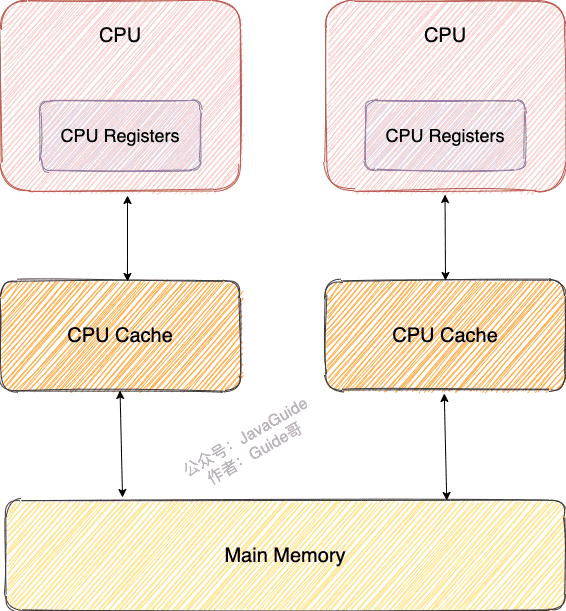
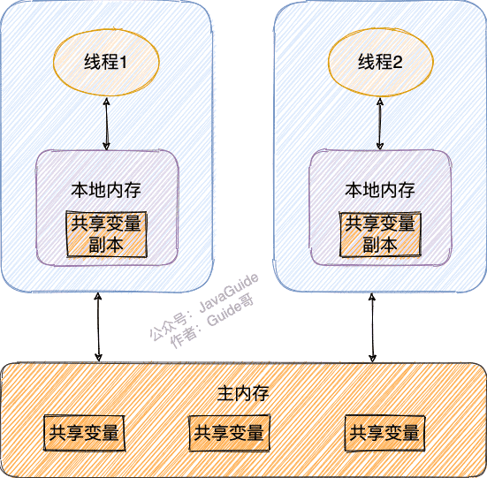
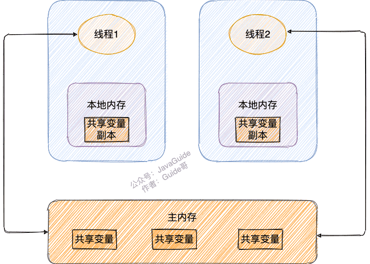

# 多线程与并发

## 一、理论基础:airplane:

> 参考链接：[Java全栈知识体系](https://pdai.tech/md/java/thread/java-thread-x-theorty.html)

### 1.1 为什么需要多线程？

众所周知，CPU、内存、I/O设备的速度是有极大差异的，为了合理利用CPU的高性能，平衡这三者的速度差异，计算机体系结构、操作系统、编译程序都做出了贡献，主要体现为：

- CPU增加了缓存，以均衡与内存的速度差异——>导致**可见性**问题。
- 操作系统增加了进程、线程，以分时复用CPU，进而均衡CPU与I/O设备的速度差异——>导致**原子性**问题。
- 编译程序优化指令执行次序，使得缓存能够得到更加合理地利用——>导致**有序性**问题。

### 1.2 并发出现问题的根源：并发三要素

#### 可见性

可见性：一个线程对共享变量的修改，另外一个线程能够立刻看到。

#### 原子性

原子性：即一个操作或者多个操作 要么全部执行并且执行的过程不会被任何因素打断，要么就都不执行。

#### 有序性

有序性：即程序执行的顺序按照代码的先后顺序执行。

在执行程序时为了提高性能，编译器和处理器常常会对指令做重排序。重排序分三种类型：

- 编译器优化的重排序。编译器在不改变单线程程序语义的前提下，可以重新安排语句的执行顺序。
- 指令级并行的重排序。现代处理器采用了指令级并行技术（Instruction-Level Parallelism，ILP）来将多条指令重叠执行。如果不存在数据依赖性，处理器可以改变语句对应机器指令的执行顺序。
- 内存系统的重排序。由于处理器使用缓存和读/写缓冲区，这使得加载和存储操作看上去可能是在乱序执行。

从Java源代码到最终实际执行的指令序列，会分别经历下面三种重排序：


上述的1属于编译器重排序，2和3属于处理器重排序。这些重排序都可能会导致多线程程序出现内存可见性问题。**对于编译器重排序，JMM的编译器重排序规则会禁止特定类型的编译器重排序**（不是所有的编译器重排序都要禁止）。对于处理器重排序，JMM的处理器重排序规则会要求编译器在生成指令序列时，插入特定类型的内存屏障（memory barriers，Intel称之为memory fence）指令，**通过内存屏障指令来禁止特定类型的处理器重排序**（不是所有的处理器重排序都要禁止）。

## 二、线程基础:airplane:

> 参考链接：[Java全栈知识体系](https://pdai.tech/md/java/thread/java-thread-x-thread-basic.html)

### 2.1 线程状态转换


### 2.2 线程使用方式

有三种使用线程的方法：

- 实现`Runnable`接口。
- 实现`Callable`接口。
- 继承`Thread`类。

实现`Runnable`和`Callable`接口的类只能当做一个可以在线程中运行的任务，不是真正意义上的线程，因此最后还需要通过`Thread`来调用。可以说任务是通过线程驱动从而执行的。

#### 实现`Runnable`接口

需要实现`run()`方法，通过`Thread`调用`start()`方法来启动线程。

```java
public class MyRunnable implements Runnable {
    public void run() {
        // ...
    }
}

public static void main(String[] args) {
    MyRunnable instance = new MyRunnable();
    Thread thread = new Thread(instance);
    thread.start();
}
```

#### 实现`Callable`接口

与`Runnable`相比，`Callable`可以有返回值，返回值通过`FutureTask`进行封装。

```java
public class MyCallable implements Callable<Integer> {
    public Integer call() {
        return 123;
    }
}

public static void main(String[] args) throws ExecutionException, InterruptedException {
    MyCallable mc = new MyCallable();
    FutureTask<Integer> ft = new FutureTask<>(mc);
    Thread thread = new Thread(ft);
    thread.start();
    System.out.println(ft.get());
}
```

#### 继承`Thread`类

同样也是需要实现`run()`方法，因为`Thread`类也实现了`Runable`接口。当调用`start()`方法启动一个线程时，虚拟机会将该线程放入就绪队列中等待被调度，当一个线程被调度时会执行该线程的`run()`方法。

```java
public class MyThread extends Thread {
    public void run() {
        // ...
    }
}

public static void main(String[] args) {
    MyThread mt = new MyThread();
    mt.start();
}
```

#### 实现接口&继承

实现接口会更好一些，因为：

- Java不支持多重继承，因此继承了`Thread`类就无法继承其它类，但是可以实现多个接口。
- 类可能只要求可执行就行，继承整个`Thread`类开销过大。

### 2.3 线程互斥同步

Java提供了两种锁机制来控制多个线程对共享资源的互斥访问，第一个是JVM实现的`synchronized`，而另一个是JDK实现的`ReentrantLock`。

#### synchronized

同步一个代码块，它只作用于同一个对象，如果调用两个对象上的同步代码块，就不会进行同步。

```java
public void func() {
    synchronized (this) {
        // ...
    }
}
```

同步一个方法，只作用于同一个对象。

```java
public synchronized void func () {
    // ...
}
```

同步一个类，作用于整个类，也就是说两个线程调用同一个类的不同对象上的这种同步语句，也会进行同步。

```java
public void func() {
    synchronized (SynchronizedExample.class) {
        // ...
    }
}
```

同步一个静态方法，作用于整个类。

```java
public synchronized static void fun() {
    // ...
}
```

#### ReentrantLock

ReentrantLock是`java.util.concurrent`包中的锁。

```java
public class LockExample {

    private Lock lock = new ReentrantLock();

    public void func() {
        lock.lock();
        try {
            for (int i = 0; i < 10; i++) {
                System.out.print(i + " ");
            }
        } finally {
            lock.unlock(); // 确保释放锁，从而避免发生死锁。
        }
    }
}
```

#### 比较

- **锁的实现**：`synchronized`是JVM实现的，而`ReentrantLock`是JDK实现的。
- **性能**：新版本Java对`synchronized`进行了很多优化，例如自旋锁等。
- **等待可中断**：当持有锁的线程长期不释放锁的时候，**正在等待的线程可以选择放弃等待**，改为处理其他事情。`ReentrantLock`可中断，而`synchronized`不行。
- **公平锁**：公平锁是指多个线程在等待同一个锁时，必须按照申请锁的时间顺序来依次获得锁。`synchronized`中的锁是非公平的，`ReentrantLock`默认情况下也是非公平的，但是也可以是公平的。
- **锁绑定多个条件**：一个`ReentrantLock`可以同时绑定多个`Condition`对象。

### 2.4 线程间协作

当多个线程可以一起工作去解决某个问题时，如果某些部分必须在其它部分之前完成，那么就需要对线程进行协调。

#### `join()`

在线程中调用另一个线程的`join()`方法，会将当前线程挂起，而不是忙等待，直到目标线程结束。

#### `wait()`、`notify()`、`notifyAll()`

调用`wait()`使得线程等待某个条件满足，**线程在等待时会被挂起**，当其他线程的运行使得这个条件满足时，其它线程会调用`notify()`或者`notifyAll()`来唤醒挂起的线程。

使用`wait()`挂起期间，线程会释放锁。这是因为，如果没有释放锁，那么其它线程就无法进入对象的同步方法或者同步控制块中，那么就无法执行`notify()`或者`notifyAll()`来唤醒挂起的线程，造成死锁。

#### `await()`、`signal()`、`signalAll()`

`java.util.concurrent`类库中提供了`Condition`类来实现线程之间的协调，可以在`Condition`上调用`await()`方法使线程等待，其它线程调用`signal()`或`signalAll()`方法唤醒等待的线程。相比于`wait()`这种等待方式，`await()`可以指定等待的条件，因此更加灵活。

## 三、Java中的锁:airplane:

> 参考链接：[Java全栈知识体系](https://pdai.tech/md/java/thread/java-thread-x-lock-all.html)


### 3.1 乐观锁&悲观锁

对于同一个数据的并发操作，悲观锁认为自己在使用数据的时候一定有别的线程来修改数据，因此在获取数据的时候会先加锁，确保数据不会被别的线程修改。Java中，**`synchronized`关键字和`Lock`的实现类都是悲观锁**；乐观锁认为自己在使用数据时不会有别的线程修改数据，所以不会添加锁，**只是在更新数据的时候去判断之前有没有别的线程更新了这个数据**。如果这个数据没有被更新，当前线程将自己修改的数据成功写入。如果数据已经被其他线程更新，则根据不同的实现方式执行不同的操作（例如报错或者自动重试）。乐观锁在Java中是通过使用无锁编程来实现，最常采用的是CAS算法，Java原子类中的递增操作就通过CAS自旋实现的。

- **悲观锁适合写操作多的场景**，先加锁可以保证写操作时数据正确。

- **乐观锁适合读操作多的场景**，不加锁的特点能够使其读操作的性能大幅提升。

### 3.2 自旋锁&非自旋锁

阻塞或唤醒一个Java线程需要操作系统切换CPU状态来完成，这种状态转换需要耗费处理器时间。如果同步代码块中的内容过于简单，状态转换消耗的时间有可能比用户代码执行的时间还要长。

在许多场景中，同步资源的锁定时间很短，为了这一小段时间去切换线程，线程挂起和恢复现场的花费可能会让系统得不偿失。如果物理机器有多个处理器，能够让两个或以上的线程同时并行执行，就可以让后面那个请求锁的线程不放弃CPU的执行时间，看看持有锁的线程是否很快就会释放锁。

而为了让当前线程“稍等一下”，需让当前线程进行**自旋**，如果在自旋完成后前面锁定同步资源的线程已经释放了锁，那么当前线程就可以不必阻塞而是直接获取同步资源，从而避免切换线程的开销。这就是自旋锁。


自旋锁本身是有缺点的，它不能代替阻塞。自旋等待虽然避免了线程切换的开销，但它要占用处理器时间。如果锁被占用的时间很短，自旋等待的效果就会非常好。反之，如果锁被占用的时间很长，那么自旋的线程只会白浪费处理器资源。所以，自旋等待的时间必须要有一定的限度，如果自旋超过了限定次数（默认是10次，可以使用`-XX:PreBlockSpin`来更改）没有成功获得锁，就应当挂起线程。

自旋锁的实现原理同样也是CAS，`AtomicInteger`中调用`unsafe`进行自增操作的源码中的`do-while`循环就是一个自旋操作，如果修改数值失败则通过循环来执行自旋，直至修改成功。

## 四、`synchronized`&`volatile`:rocket:

### 4.1 `synchronized`

> 参考链接：[JavaGuide](https://javaguide.cn/java/concurrent/java-concurrent-questions-02.html#synchronized-%E5%85%B3%E9%94%AE%E5%AD%97)

#### 对于`synchronized`关键字的了解

**`synchronized`关键字解决的是多个线程之间访问资源的同步性，`synchronized`关键字可以保证被它修饰的方法或者代码块在任意时刻只能有一个线程执行。**

#### 怎么使用`synchronized`关键字？

##### 修饰实例方法

作用于当前对象实例加锁，进入同步代码前要获得**当前对象实例的锁**：

```java
synchronized void method() {
    //业务代码
}
```

##### 修饰静态方法

给**当前类加锁，会作用于类的所有对象实例**，进入同步代码前要获得**当前class的锁**。因为静态成员不属于任何一个实例对象，是类成员（`static`表明这是该类的一个静态资源，不管`new`了多少个对象，只有一份）。所以如果一个线程A调用一个实例对象的非静态`synchronized` 方法，而线程B需要调用这个实例对象所属类的静态`synchronized`方法，是允许的，不会发生互斥现象，**因为访问静态`synchronized`方法占用的锁是当前类的锁，而访问非静态`synchronized`方法占用的锁是当前实例对象锁**。

```java
synchronized static void method() {
    //业务代码
}
```

##### 修饰代码块

指定加锁对象，对给定对象/类加锁。`synchronized(this|object)`表示进入同步代码库前要获得**给定对象的锁**。`synchronized(类.class)` 表示进入同步代码前要获得**当前class的锁**。

```java
synchronized(this) {
    //业务代码
}
```

##### 总结

- `synchronized`关键字加到`static`静态方法和`synchronized(class)`代码块上都是是给类上锁。
- `synchronized`关键字加到实例方法上是给对象实例上锁。

#### 讲一下`synchronized`关键字的原理

**`synchronized`关键字底层原理属于JVM层面**。

##### 修饰代码块时

从同步代码块生成的字节码文件可以看出：**`synchronized`同步语句块的实现使用的是`monitorenter`和`monitorexit`指令，其中`monitorenter`指令指向同步代码块的开始位置，`monitorexit`指令则指明同步代码块的结束位置。**

当执行`monitorenter`指令时，线程试图获取锁也就是获取**对象监视器`monitor`**的持有权。在执行`monitorenter`时，会尝试获取对象的锁，如果锁的计数器为0则表示锁可以被获取，获取后将锁计数器设为1（也就是加1）。


对象锁的拥有者线程才可以执行`monitorexit`指令来释放锁。在执行`monitorexit`指令后，将锁计数器设为0，表明锁被释放，其他线程可以尝试获取锁。


如果获取对象锁失败，那当前线程就要阻塞等待，直到锁被另外一个线程释放为止。

##### 修饰方法时

`synchronized`修饰的方法并没有`monitorenter`指令和`monitorexit`指令，取而代之的是`ACC_SYNCHRONIZED`标识，该标识指明了该方法是**一个同步方法**。JVM通过该`ACC_SYNCHRONIZED`访问标志来辨别一个方法是否声明为同步方法，从而执行相应的同步调用。如果是实例方法，JVM会尝试获取实例对象的锁。如果是静态方法，JVM会尝试获取当前class的锁。

##### 总结

- `synchronized`同步语句块的实现使用的是`monitorenter`和`monitorexit`指令，其中`monitorenter`指令指向同步代码块的开始位置，`monitorexit`指令则指明同步代码块的结束位置。
- `synchronized`修饰的方法并没有`monitorenter`指令和`monitorexit`指令，取而代之的是`ACC_SYNCHRONIZED`标识，该标识指明了该方法是一个同步方法。

#### 和`ReentrantLock`的区别

- 两者都是可重入锁，即自己可以再次获取自己的内部锁。
- `synchronized`依赖于JVM，`ReentrantLock`依赖于JDK。
- `ReentrantLock`比`synchronized`增加了一些高级功能：
  - **等待可中断**：`ReentrantLock`提供了一种能够中断等待锁的线程的机制，通过`lock.lockInterruptibly()`来实现这个机制，也就是说正在等待的线程可以选择放弃等待，改为处理其他事情。
  - **可实现公平锁**：`ReentrantLock`可以指定是公平锁还是非公平锁，而`synchronized`只能是非公平锁。
  - **可实现选择性通知（锁可以绑定多个条件）**：`synchronized`关键字与`wait()`和`notify()`/`notifyAll()`方法相结合可以实现等待/通知机制。`ReentrantLock`类当然也可以实现，但是需要借助于`Condition`接口与`newCondition()`方法。

### 4.2 `volatile`

> 参考链接：[JavaGuide](https://javaguide.cn/java/concurrent/java-concurrent-questions-02.html#volatile-%E5%85%B3%E9%94%AE%E5%AD%97)

#### CPU缓存模型

**CPU Cache缓存的是内存数据，用于解决CPU处理速度和内存不匹配的问题；内存缓存的是硬盘数据，用于解决硬盘访问速度过慢的问题**。



CPU Cache 的工作方式：先复制一份数据到CPU Cache中，当CPU需要用到的时候就可以直接从CPU Cache中读取数据，当运算完成后，再将运算得到的数据写回Main Memory中，但是这样存在**内存缓存不一致性的问题** ！

#### Java内存模型

Java内存模型抽象了线程和主内存之间的关系，就比如说线程之间的共享变量必须存储在主内存中。Java内存模型主要目的是为了**屏蔽系统和硬件的差异**，避免一套代码在不同的平台下产生的效果不一致。

在 JDK 1.2之前，Java的内存模型实现总是从**主存**（即共享内存）读取变量，是不需要进行特别的注意的。而在当前的Java内存模型下，线程可以把变量保存在**本地内存**（比如机器的寄存器）中，而不是直接在主存中进行读写。这就可能造成一个线程在主存中修改了一个变量的值，而另外一个线程还继续使用它在寄存器中的变量值的拷贝，造成**数据不一致**。

补充：

- **主内存**：所有线程创建的实例对象都存放在主内存中，不管该实例对象是成员变量还是方法中的本地变量（也称局部变量）。
- **本地内存**：每个线程都有一个私有的本地内存来存储共享变量的副本，并且每个线程只能访问自己的本地内存，无法访问其他线程的本地内存。本地内存是JMM抽象出来的一个概念，存储了主内存中的共享变量副本。



要解决这个问题，就需要把变量声明为**`volatile`** ，这就指示JVM：这个变量是共享且不稳定的，每次使用它都到主存中进行读取。所以，**`volatile`关键字除了防止JVM的指令重排 ，还有一个重要的作用就是保证变量的可见性**。



#### 和`synchronized`关键字的区别

`synchronized`关键字和`volatile`关键字是两个互补的存在，而不是对立的。

- `volatile`关键字是**线程同步的轻量级实现**，所以`volatile`的性能肯定比`synchronized`关键字要好 。但是**`volatile`关键字只能用于变量而`synchronized`关键字可以修饰方法以及代码块**。
- `volatile`关键字**能保证数据的可见性，但不能保证数据的原子性**。`synchronized`关键字两者都能保证。
- `volatile`关键字**主要用于解决变量在多个线程之间的可见性**，而`synchronized`关键字解决的是多个线程之间访问资源的同步性。

## 五、`ThreadLocal`:airplane:

> 参考链接：[JavaGuide](https://javaguide.cn/java/concurrent/java-concurrent-questions-02.html#threadlocal)

### 5.1 简介

通常情况下，创建的变量是可以被任何一个线程访问并修改的。**如果想实现每一个线程都有自己的专属本地变量该如何解决呢？**JDK中提供的`ThreadLocal`类正是为了解决这样的问题。

**`ThreadLocal`类主要解决的就是让每个线程绑定自己的值**，可以将`ThreadLocal`类形象的比喻成存放数据的盒子，盒子中可以存储每个线程的私有数据。

如果创建了一个`ThreadLocal`变量，那么访问这个变量的每个线程都会有这个变量的本地副本，这也是`ThreadLocal`变量名的由来。它们可以使用`get()`和`set()`方法来获取默认值或将其值更改为当前线程所存的副本的值，从而避免了线程安全问题。

### 5.2 原理

```java
public class Thread implements Runnable {
    //......
    //与此线程有关的ThreadLocal值。由ThreadLocal类维护
    ThreadLocal.ThreadLocalMap threadLocals = null;

    //与此线程有关的InheritableThreadLocal值。由InheritableThreadLocal类维护
    ThreadLocal.ThreadLocalMap inheritableThreadLocals = null;
    //......
}
```

从上面`Thread`类源代码可以看出：`Thread` 类中有一个`threadLocals`和一个`inheritableThreadLocals`变量，它们都是`ThreadLocalMap` 类型的变量，可以把`ThreadLocalMap`理解为`ThreadLocal`类实现的定制化的`HashMap`。默认情况下这两个变量都是`null`，只有当前线程调用`ThreadLocal`类的`set()`或`get()`方法时才创建它们，实际上调用这两个方法的时候，调用的是`ThreadLocalMap`类对应的`get()`、`set()`方法。

```java
public void set(T value) {
    Thread t = Thread.currentThread();
    ThreadLocalMap map = getMap(t);
    if (map != null)
        map.set(this, value);
    else
        createMap(t, value);
}
ThreadLocalMap getMap(Thread t) {
    return t.threadLocals;
}
```

通过上面这些内容，可以得出结论：**最终的变量是放在了当前线程的`ThreadLocalMap`中，并不是存在`ThreadLocal`上，`ThreadLocal`可以理解为只是`ThreadLocalMap`的封装，传递了变量值。** 

`ThrealLocal`类中可以通过`Thread.currentThread()`获取到当前线程对象后，直接通过`getMap(Thread t)`访问到该线程的`ThreadLocalMap`对象。

每个`Thread`中都具备一个`ThreadLocalMap`，而`ThreadLocalMap`可以**存储以`ThreadLocal`为`key`，Object对象为`value`的键值对**。

```java
ThreadLocalMap(ThreadLocal<?> firstKey, Object firstValue) {
    //......
}
```


## 六、线程池:airplane:

> 参考链接：[JavaGuide](https://javaguide.cn/java/concurrent/java-concurrent-questions-02.html#%E7%BA%BF%E7%A8%8B%E6%B1%A0)

### 6.1 为什么要使用线程池？

**线程池**提供了一种限制和管理资源（包括执行一个任务）的方式。 每个**线程池**还维护一些基本统计信息，例如已完成任务的数量。**使用线程池的好处**：

- **降低资源消耗**：通过重复利用已创建的线程降低线程创建和销毁造成的消耗。
- **提高响应速度**。当任务到达时，任务可以不需要等到线程创建就能立即执行。
- **提高线程的可管理性**。线程是稀缺资源，如果无限制的创建，不仅会消耗系统资源，还会降低系统的稳定性，使用线程池可以进行统一的分配，调优和监控。

### 6.2 线程池原理


在代码中模拟了10个任务，配置核心线程数为5、等待队列容量为100，所以每次只可能存在5个任务同时执行，剩下的5个任务会被放到等待队列中去。当前的5个任务中如果有任务被执行完了，线程池就会去拿新的任务执行。

## 七、CAS:airplane:

> 参考链接：[Java全栈知识体系](https://pdai.tech/md/java/thread/java-thread-x-juc-AtomicInteger.html#cas)

### 7.1 什么是CAS？

CAS的全称为Compare-And-Swap，直译就是对比交换。是一条CPU的**原子指令**，其作用是让CPU先进行比较两个值是否相等，然后原子地更新某个位置的值。简单解释：**CAS操作需要输入两个数值，一个旧值（期望操作前的值）和一个新值，在操作期间先比较下旧值有没有发生变化，如果没有发生变化，才交换成新值，发生了变化则不交换**。

CAS操作是原子性的，所以多线程并发使用CAS更新数据时，可以不使用锁。JDK中大量使用了CAS来更新数据而防止加锁来保持原子更新。

### 7.2 问题

- ABA问题：因为CAS需要在操作值的时候，检查值有没有发生变化，比如没有发生变化则更新，但是如果一个值原来是A，变成了B，又变成了A，那么使用CAS进行检查时则会发现它的值没有发生变化，但是实际上却变化了。

  ABA问题的解决思路就是使用版本号。在变量前面追加上版本号，每次变量更新的时候把版本号加1，那么A->B->A就会变成1A->2B->3A。

- 循环时间长，开销大。

- 只能保证一个共享变量的原子操作。

