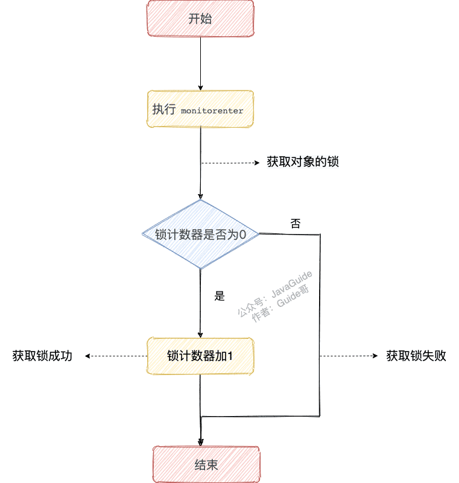
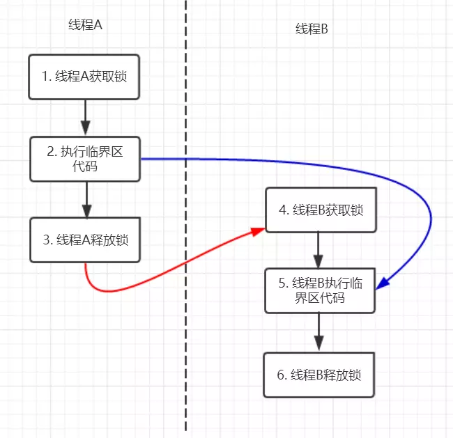
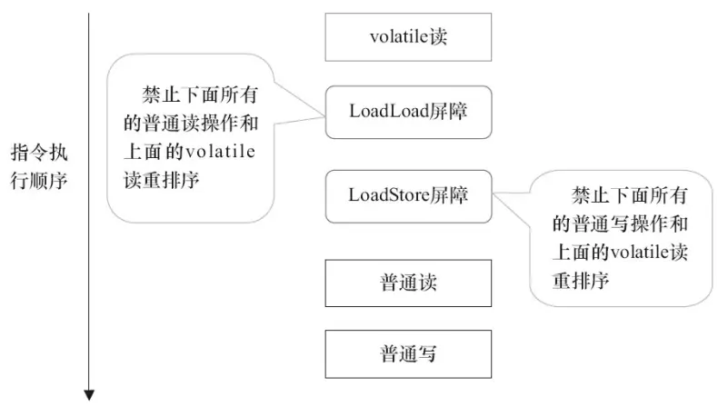

# 多线程与并发

## 一、理论基础:airplane:

> 参考链接：[Java全栈知识体系](https://pdai.tech/md/java/thread/java-thread-x-theorty.html)

### 1.1 为什么需要多线程？

众所周知，CPU、内存、I/O设备的速度是有极大差异的，为了合理利用CPU的高性能，平衡这三者的速度差异，计算机体系结构、操作系统、编译程序都做出了贡献，主要体现为：

- CPU增加了缓存，以均衡与内存的速度差异——>导致**可见性**问题。
- 操作系统增加了进程、线程，以分时复用CPU，进而均衡CPU与I/O设备的速度差异——>导致**原子性**问题。
- 编译程序优化指令执行次序，使得缓存能够得到更加合理地利用——>导致**有序性**问题。

### 1.2 并发出现问题的根源：并发三要素

#### 可见性

可见性：一个线程对共享变量的修改，另外一个线程能够立刻看到。

#### 原子性

原子性：即一个操作或者多个操作，要么全部执行并且执行的过程不会被任何因素打断，要么就都不执行。

#### 有序性

有序性：即程序执行的顺序按照代码的先后顺序执行。

在执行程序时为了提高性能，编译器和处理器常常会对指令做重排序。重排序分三种类型：

- 编译器优化的重排序。编译器在不改变单线程程序语义的前提下，可以重新安排语句的执行顺序。
- 指令级并行的重排序。现代处理器采用了指令级并行技术（Instruction-Level Parallelism，ILP）来将多条指令重叠执行。如果不存在数据依赖性，处理器可以改变语句对应机器指令的执行顺序。
- 内存系统的重排序。由于处理器使用缓存和读/写缓冲区，这使得加载和存储操作看上去可能是在乱序执行。

从Java源代码到最终实际执行的指令序列，会分别经历下面三种重排序：


上述的1属于编译器重排序，2和3属于处理器重排序。这些重排序都可能会导致多线程程序出现内存可见性问题。**对于编译器重排序，JMM的编译器重排序规则会禁止特定类型的编译器重排序**（不是所有的编译器重排序都要禁止）。对于处理器重排序，JMM的处理器重排序规则会要求编译器在生成指令序列时，插入特定类型的内存屏障（memory barriers，Intel称之为memory fence）指令，**通过内存屏障指令来禁止特定类型的处理器重排序**（不是所有的处理器重排序都要禁止）。

## 二、线程基础:airplane:

> 参考链接：[Java全栈知识体系](https://pdai.tech/md/java/thread/java-thread-x-thread-basic.html)

### 2.1 线程状态转换


### 2.2 线程使用方式

> 参考链接：[牛客](https://www.nowcoder.com/questionTerminal/a84f877db0c148fd90b1f26000bf302f)

有四种使用线程的方法：

- 实现`Runnable`接口。
- 实现`Callable`接口。
- 继承`Thread`类。
- 使用线程池。

实现`Runnable`和`Callable`接口的类只能当做一个可以在线程中运行的任务，不是真正意义上的线程，因此最后还需要通过`Thread`来调用。可以说任务是通过线程驱动从而执行的。

#### 实现`Runnable`接口

需要实现`run()`方法，通过`Thread`调用`start()`方法来启动线程。

```java
public class MyRunnable implements Runnable {
    public void run() {
        // ...
    }
}

public static void main(String[] args) {
    MyRunnable instance = new MyRunnable();
    Thread thread = new Thread(instance);
    thread.start();
}
```

#### 实现`Callable`接口

与`Runnable`相比，`Callable`可以有返回值，返回值通过`FutureTask`进行封装。

```java
public class MyCallable implements Callable<Integer> {
    public Integer call() {
        return 123;
    }
}

public static void main(String[] args) throws ExecutionException, InterruptedException {
    MyCallable mc = new MyCallable();
    FutureTask<Integer> ft = new FutureTask<>(mc);
    Thread thread = new Thread(ft);
    thread.start();
    System.out.println(ft.get());
}
```

#### 继承`Thread`类

同样也是需要实现`run()`方法，因为`Thread`类也实现了`Runable`接口。当调用`start()`方法启动一个线程时，虚拟机会将该线程放入就绪队列中等待被调度，当一个线程被调度时会执行该线程的`run()`方法。

```java
public class MyThread extends Thread {
    public void run() {
        // ...
    }
}

public static void main(String[] args) {
    MyThread mt = new MyThread();
    mt.start();
}
```

#### 使用线程池

使用`java.util.current.ThreadPoolExecutor`来获取线程，执行多线程。

#### 实现接口&继承

实现接口会更好一些，因为：

- Java不支持多重继承，因此继承了`Thread`类就无法继承其它类，但是可以实现多个接口。
- 类可能只要求可执行就行，继承整个`Thread`类开销过大。

### 2.3 线程互斥同步

Java提供了两种锁机制来控制多个线程对共享资源的互斥访问，第一个是JVM实现的`synchronized`，而另一个是JDK实现的`ReentrantLock`。

#### `synchronized`

同步一个代码块，它只作用于同一个对象，如果调用两个对象上的同步代码块，就不会进行同步。

```java
public void func() {
    synchronized (this) {
        // ...
    }
}
```

同步一个方法，只作用于同一个对象。

```java
public synchronized void func () {
    // ...
}
```

同步一个类，作用于整个类，也就是说两个线程调用同一个类的不同对象上的这种同步语句，也会进行同步。

```java
public void func() {
    synchronized (SynchronizedExample.class) {
        // ...
    }
}
```

同步一个静态方法，作用于整个类。

```java
public synchronized static void fun() {
    // ...
}
```

#### `ReentrantLock`

`ReentrantLock`是`java.util.concurrent`包中的锁。

```java
public class LockExample {

    private Lock lock = new ReentrantLock();

    public void func() {
        lock.lock();
        try {
            for (int i = 0; i < 10; i++) {
                System.out.print(i + " ");
            }
        } finally {
            lock.unlock(); // 确保释放锁，从而避免发生死锁。
        }
    }
}
```

#### 和`ReentrantLock`的区别

> 参考链接：[JavaGuide](https://javaguide.cn/java/concurrent/java-concurrent-questions-02.html#%E8%B0%88%E8%B0%88-synchronized-%E5%92%8C-reentrantlock-%E7%9A%84%E5%8C%BA%E5%88%AB)

|                                                              |                        `synchronized`                        |                       `ReentrantLock`                        |
| :----------------------------------------------------------: | :----------------------------------------------------------: | :----------------------------------------------------------: |
|                           可重入锁                           |                             :o:                              |                             :o:                              |
|                             依赖                             |                             JVM                              |                          JDK（API）                          |
| 等待可中断：当持有锁的线程**长期不释放锁**的时候，正在等待的线程可以**选择放弃等待**，改为处理其他事情 |                             :x:                              |            :o:（通过`lock.lockInterruptibly()`）             |
|                            公平锁                            |                             :x:                              | 默认非公平，可选择为公平的（通过`ReentrantLock(boolean fair)`） |
|              可实现选择性通知（锁绑定多个条件）              | 与`wait()`和`notify()`/`notifyAll()`方法相结合可以实现等待/通知机制 |       需要借助于`Condition`接口与`newCondition()`方法        |

### 2.4 线程间协作

当多个线程可以一起工作去解决某个问题时，如果某些部分必须在其它部分之前完成，那么就需要对线程进行协调。

#### `join()`

在线程中调用另一个线程的`join()`方法，会将当前线程挂起，而不是忙等待，直到目标线程结束。

#### `wait()`、`notify()`、`notifyAll()`

调用`wait()`使得线程等待某个条件满足，**线程在等待时会被挂起**，当其他线程的运行使得这个条件满足时，其它线程会调用`notify()`或者`notifyAll()`来唤醒挂起的线程。

使用`wait()`挂起期间，线程会释放锁。这是因为，如果没有释放锁，那么其它线程就无法进入对象的同步方法或者同步控制块中，那么就无法执行`notify()`或者`notifyAll()`来唤醒挂起的线程，造成死锁。

#### `await()`、`signal()`、`signalAll()`

`java.util.concurrent`类库中提供了`Condition`类来实现线程之间的协调，可以在`Condition`上调用`await()`方法使线程等待，其它线程调用`signal()`或`signalAll()`方法唤醒等待的线程。相比于`wait()`这种等待方式，`await()`可以指定等待的条件，因此更加灵活。

## 三、Java中的锁:airplane:

> 参考链接：[Java全栈知识体系](https://pdai.tech/md/java/thread/java-thread-x-lock-all.html)


### 3.1 乐观锁&悲观锁

对于同一个数据的并发操作，悲观锁认为自己在使用数据的时候一定有别的线程来修改数据，因此在获取数据的时候会先加锁，确保数据不会被别的线程修改。Java中，**`synchronized`关键字和`Lock`的实现类都是悲观锁**。

乐观锁认为自己在使用数据时不会有别的线程修改数据，所以不会添加锁，**只是在更新数据的时候去判断之前有没有别的线程更新了这个数据**。如果这个数据没有被更新，当前线程将自己修改的数据成功写入。如果数据已经被其他线程更新，则根据不同的实现方式执行不同的操作（例如报错或者自动重试）。乐观锁在Java中是通过使用无锁编程来实现，最常采用的是CAS算法，Java原子类中的递增操作就通过CAS自旋实现的。

- **悲观锁适合写操作多的场景**，先加锁可以保证写操作时数据正确。

- **乐观锁适合读操作多的场景**，不加锁的特点能够使其读操作的性能大幅提升。

### 3.2 自旋锁&非自旋锁

阻塞或唤醒一个Java线程需要操作系统切换CPU状态来完成，这种状态转换需要耗费处理器时间。如果同步代码块中的内容过于简单，状态转换消耗的时间有可能比用户代码执行的时间还要长。

在许多场景中，同步资源的锁定时间很短，为了这一小段时间去切换线程，线程挂起和恢复现场的花费可能会让系统得不偿失。如果物理机器有多个处理器，能够让两个或以上的线程同时并行执行，就可以让后面那个请求锁的线程不放弃CPU的执行时间，看看持有锁的线程是否很快就会释放锁。

而为了让当前线程“稍等一下”，需让当前线程进行**自旋**，如果在自旋完成后前面锁定同步资源的线程已经释放了锁，那么当前线程就可以不必阻塞而是直接获取同步资源，从而避免切换线程的开销。这就是自旋锁。


自旋锁本身是有缺点的，它不能代替阻塞。自旋等待虽然避免了线程切换的开销，但它要占用处理器时间。如果锁被占用的时间很短，自旋等待的效果就会非常好。反之，如果锁被占用的时间很长，那么自旋的线程只会白浪费处理器资源。所以，自旋等待的时间必须要有一定的限度，如果自旋超过了限定次数（默认是10次，可以使用`-XX:PreBlockSpin`来更改）没有成功获得锁，就应当挂起线程。

自旋锁的实现原理同样也是CAS，`AtomicInteger`中调用`unsafe`进行自增操作的源码中的`do-while`循环就是一个自旋操作，如果修改数值失败则通过循环来执行自旋，直至修改成功。

### 3.3 无锁&偏向锁&轻量级锁&重量级锁

偏向锁通过对比Mark Word解决加锁问题，避免执行CAS操作。而轻量级锁是通过用CAS操作和自旋来解决加锁问题，避免线程阻塞和唤醒而影响性能。重量级锁是将除了拥有锁的线程以外的线程都阻塞。

### 3.4 公平锁&非公平锁

公平锁是指**多个线程按照申请锁的顺序来获取锁**，线程直接进入队列中排队，队列中的第一个线程才能获得锁。公平锁的优点是等待锁的线程不会饿死。缺点是整体吞吐效率相对非公平锁要低，等待队列中除第一个线程以外的所有线程都会阻塞，CPU唤醒阻塞线程的开销比非公平锁大。

非公平锁是**多个线程加锁时直接尝试获取锁，获取不到才会到等待队列的队尾等待**。但如果此时锁刚好可用，那么这个线程可以无需阻塞直接获取到锁，所以非公平锁有可能出现**后申请锁的线程先获取锁**的场景。非公平锁的优点是可以减少唤起线程的开销，整体的吞吐效率高，因为线程有几率不阻塞直接获得锁，CPU不必唤醒所有线程。缺点是处于等待队列中的线程可能会饿死，或者等很久才会获得锁。

### 3.5 可重入锁&非可重入锁

可重入锁又名递归锁，是指同一个线程**在外层方法获取锁的时候，再进入该线程的内层方法会自动获取锁**（前提锁对象得是同一个对象或者`class`），不会因为之前已经获取过还没释放而阻塞。Java中`ReentrantLock`和`synchronized`都是可重入锁，可重入锁的一个优点是可一定程度避免死锁。

```java
public class Widget {
    public synchronized void doSomething() {
        System.out.println("方法1执行...");
        doOthers();
    }

    public synchronized void doOthers() {
        System.out.println("方法2执行...");
    }
}
```

在上面的代码中，类中的两个方法都是被内置锁`synchronized`修饰的，`doSomething()`方法中调用`doOthers()`方法。因为内置锁是可重入的，所以同一个线程在调用`doOthers()`时可以直接获得当前对象的锁，进入`doOthers()`进行操作。

如果是一个不可重入锁，那么当前线程在调用`doOthers()`之前需要将执行`doSomething()`时获取当前对象的锁释放掉，实际上该对象锁已被当前线程所持有，且无法释放。所以此时会出现死锁。

### 3.6 独享锁&共享锁

**独享锁也叫排他锁**，是指该锁一次只能被一个线程所持有。如果线程T对数据A加上排它锁后，则其他线程不能再对A加任何类型的锁。获得排它锁的线程既能读数据又能修改数据。JDK中的`synchronized`和JUC中`Lock`的实现类就是互斥锁。

**共享锁**是指该锁可被多个线程所持有。如果线程T对数据A加上共享锁后，则其他线程只能对A再加共享锁，不能加排它锁。**获得共享锁的线程只能读数据，不能修改数据**。

独享锁与共享锁也是通过AQS来实现的，通过实现不同的方法，来实现独享或者共享。

## 四、`synchronized`&`volatile`:rocket:

### 4.1 `synchronized`

> 参考链接：[JavaGuide](https://javaguide.cn/java/concurrent/java-concurrent-questions-02.html#synchronized-%E5%85%B3%E9%94%AE%E5%AD%97)

#### 对于`synchronized`关键字的了解

**`synchronized`关键字解决的是多个线程之间访问资源的同步性，`synchronized`关键字可以保证被它修饰的方法或者代码块在任意时刻只能有一个线程执行。**

#### 怎么使用`synchronized`关键字？

##### 修饰实例方法

作用于当前对象实例加锁，进入同步代码前要获得**当前对象实例的锁**：

```java
synchronized void method() {
    //业务代码
}
```

##### 修饰静态方法

给**当前类加锁，会作用于类的所有对象实例**，进入同步代码前要获得**当前class的锁**。因为静态成员不属于任何一个实例对象，是类成员（`static`表明这是该类的一个静态资源，不管`new`了多少个对象，只有一份）。所以如果一个线程A调用一个实例对象的非静态`synchronized` 方法，而线程B需要调用这个实例对象所属类的静态`synchronized`方法，是允许的，不会发生互斥现象，**因为访问静态`synchronized`方法占用的锁是当前类的锁，而访问非静态`synchronized`方法占用的锁是当前实例对象锁**。

```java
synchronized static void method() {
    //业务代码
}
```

##### 修饰代码块

指定加锁对象，对给定对象/类加锁。`synchronized(this|object)`表示进入同步代码库前要获得**给定对象的锁**。`synchronized(类.class)` 表示进入同步代码前要获得**当前class的锁**。

```java
synchronized(this) {
    //业务代码
}
```

##### 总结

- `synchronized`关键字加到`static`静态方法和`synchronized(class)`代码块上都是是给类上锁。
- `synchronized`关键字加到实例方法上是给对象实例上锁。

#### `synchronized`原理分析

> 参考链接：[Java全栈知识体系](https://pdai.tech/md/java/thread/java-thread-x-key-synchronized.html#synchronized%E5%8E%9F%E7%90%86%E5%88%86%E6%9E%90)

##### 加锁和释放锁的原理

###### 修饰代码块时

从同步代码块生成的字节码文件可以看出：**`synchronized`同步语句块的实现使用的是`monitorenter`和`monitorexit`指令，其中`monitorenter`指令指向同步代码块的开始位置，`monitorexit`指令则指明同步代码块的结束位置。**

当执行`monitorenter`指令时，线程试图获取锁也就是获取**对象监视器`monitor`**的持有权。在执行`monitorenter`时，会尝试获取对象的锁，如果锁的计数器为0则表示锁可以被获取，获取后将锁计数器设为1（也就是加1）。



对象锁的拥有者线程才可以执行`monitorexit`指令来释放锁。在执行`monitorexit`指令后，将锁计数器设为0，表明锁被释放，其他线程可以尝试获取锁。


如果获取对象锁失败，那当前线程就要阻塞等待，直到锁被另外一个线程释放为止。

###### 修饰方法时

`synchronized`修饰的方法并没有`monitorenter`指令和`monitorexit`指令，取而代之的是`ACC_SYNCHRONIZED`标识，该标识指明了该方法是**一个同步方法**。JVM通过该`ACC_SYNCHRONIZED`访问标志来辨别一个方法是否声明为同步方法，从而执行相应的同步调用。如果是实例方法，JVM会尝试获取实例对象的锁。如果是静态方法，JVM会尝试获取当前`class`的锁。

###### 总结

- `synchronized`同步语句块的实现使用的是`monitorenter`和`monitorexit`指令，其中`monitorenter`指令指向同步代码块的开始位置，`monitorexit`指令则指明同步代码块的结束位置。
- `synchronized`修饰的方法并没有`monitorenter`指令和`monitorexit`指令，取而代之的是`ACC_SYNCHRONIZED`标识，该标识指明了该方法是一个同步方法。如果是实例方法，JVM会尝试获取实例对象的锁。如果是静态方法，JVM会尝试获取当前`class`的锁。

##### 可重入原理

`synchronized`的重入性：即在**同一锁程**中，每个对象拥有一个`monitor`计数器，当线程获取该对象锁后，`monitor`计数器就会加一，释放锁后就会将`monitor`计数器减一，线程不需要再次获取同一把锁。

##### 保证可见性的原理

`synchronized`的happens-before规则，即监视器锁规则：**对同一个监视器的解锁，happens-before于对该监视器的加锁**。

```java
public class MonitorDemo {
    private int a = 0;

    public synchronized void writer() {     // 1
        a++;                                // 2
    }                                       // 3

    public synchronized void reader() {    // 4
        int i = a;                         // 5
    }                                      // 6
}
```



- 黑色：通过程序顺序规则推导
- 红色：通过监视器锁规则推导，即线程A释放锁happens-before线程B加锁
- 蓝色：通过程序顺序规则和监视器锁规则推测出来happens-befor关系。

根据happens-before的定义中的一条：**如果A happens-before B，则A的执行结果对B可见，并且A的执行顺序先于B**。线程A先对共享变量A进行加一，由2 happens-before 5关系可知线程A的执行结果对线程B可见即线程B所读取到的a的值为1。

#### 锁优化

> 参考链接：[Java全栈知识体系](https://pdai.tech/md/java/thread/java-thread-x-key-synchronized.html#jvm%E4%B8%AD%E9%94%81%E7%9A%84%E4%BC%98%E5%8C%96)

##### 为什么说`synchronized`是重量级锁？

在JVM中`monitorenter`和`monitorexit`字节码依赖于底层的操作系统的Mutex Lock来实现，但是由于使用Mutex Lock需要将当前线程挂起并从用户态切换到内核态来执行，这种切换的代价是非常昂贵的。在现实中的大部分情况下，同步方法是运行在单线程环境（无锁竞争环境），如果每次都调用Mutex Lock那么将严重的影响程序的性能。

所以在JDK 1.6中对锁的实现引入了大量的优化，如锁粗化、锁消除、偏向锁、轻量级锁、适应性自旋等技术来减少锁操作的开销。

##### 锁粗化

**原则上在加同步锁时，需要尽可能地将同步块的作用范围限制到尽量小的范围**（只在共享数据的实际作用域中才进行同步，这样是为了使得需要同步的操作数量尽可能变小。在存在锁同步竞争中，也可以使得等待锁的线程尽早的拿到锁）。

大部分上述情况是完美正确的，但是如果存在连串的一系列操作都对同一个对象反复加锁和解锁，甚至加锁操作时出现在循环体中的，那即使没有线程竞争，频繁的进行互斥同步操作也会导致不必要的性能操作。在`StringBuffer`中连续的`append()`操作就属于这类情况。**JVM会检测到这样一连串的操作都是对同一个对象加锁，那么JVM会将加锁同步的范围扩展（粗化）到整个一系列操作的外部，使整个一连串的`append()`操作只需要加锁一次就可以了**。

##### 锁消除

锁消除是指虚拟机即时编译器再运行时，**对一些代码上要求同步、但是被检测到不可能存在共享数据竞争的锁进行消除**。锁消除的主要判定依据来源于逃逸分析的数据支持。意思就是：JVM判断在一段程序中，明显不会逃逸出去从而被其他线程访问到，那JVM就把它们当作栈上数据对待，认为这些数据是线程独有的，不需要加同步，此时就会进行锁消除。

##### 偏向锁

在大多实际环境下，**锁不仅不存在多线程竞争，而且总是由同一个线程多次获取**，那么在同一个线程反复获取所释放锁中，其中并还没有锁的竞争，那么这样看上去，多次的获取锁和释放锁带来了很多不必要的性能开销和上下文切换。

为了解决这一问题，HotSpot的作者在JDK 1.6对`synchronized`进行了优化，引入了偏向锁。当一个线程访问同步块并获取锁时，**会在对象头和栈帧中的锁记录里存储锁偏向的线程ID**，以后该线程在进入和退出同步块时不需要进行CAS操作来加锁和解锁，只需要简单地测试一下对象头的`Mark Word`里是否存储着指向当前线程的偏向锁。如果成功，表示线程已经获取到了锁。

##### 轻量级锁

在JDK 1.6之后引入轻量级锁，需要注意的是轻量级锁并不是替代重量级锁的，而是对在大多数情况下同步块并不会有竞争出现提出的一种优化。**它可以减少重量级锁对线程的阻塞带来的线程开销，从而提高并发性能**。当前只有一个等待线程，则该线程通过自旋进行等待。当自旋超过一定次数时升级为重量级锁；当有第三个线程来访问时，也会升级为重量级锁。

##### 适应性自旋

在JDK 1.6中引入了自适应自旋锁。这就意味着**自旋的时间不再固定了，而是由前一次在同一个锁上的自旋时间及锁的拥有者的状态来决定的**。如果在同一个锁对象上，自旋等待刚刚成功获取过锁，并且持有锁的线程正在运行中，那么JVM会认为该锁自旋获取到锁的可能性很大，会自动增加等待时间。比如增加到100次循环。相反，如果对于某个锁，自旋很少成功获取锁。那再以后要获取这个锁时将可能省略掉自旋过程，以避免浪费处理器资源。

#### 锁升级

> 参考链接：[361shipin](https://www.361shipin.com/blog/1533780109650034688)、[51CTO博客](https://blog.51cto.com/u_15127702/4012095)

**JDK 1.6中为了减少获得锁和释放锁所带来的性能消耗**，引入了“偏向锁”和“轻量级锁”，所以在锁一共有四种类型：无锁、偏向锁、轻量级锁、重量级锁，它会随着竞争情况逐渐升级。其中，偏向锁、轻量级锁和重量级锁分别解决：只有一个线程进入临界区、多个线程交替进入临界区和多个线程同时进入临界区的问题。**锁可以升级但是不可以降级**，目的是为了提高获取锁和释放锁的效率。

**锁升级过程**：


**注意**：图中有两处错误：

- 无锁和偏移锁的锁标志位应该为`01`。
- 轻量级锁自旋次数（10次）为未引入适应性自旋前，在JDK 1.6中引入了自适应自旋，这就意味着**自旋的时间不再固定了，而是由前一次在同一个锁上的自旋时间及锁的拥有者的状态来决定的**

##### 锁的对比

|          |                            偏向锁                            |                      轻量级锁                       |                           重量级锁                           |
| :------: | :----------------------------------------------------------: | :-------------------------------------------------: | :----------------------------------------------------------: |
|   优点   | 加锁和解锁不需要CAS操作，没有额外的性能消耗，和执行非同步方法相比仅存在纳秒级的差距 |         竞争的线程不会阻塞，提高了响应速度          |               线程竞争不使用自旋，不会消耗CPU                |
|   缺点   |        如果线程间存在锁竞争，会带来额外的锁撤销的消耗        | 如线程始终得不到锁竞争的线程，使用自旋会消耗CPU性能 | 线程阻塞，响应时间缓慢，在多线程下，频繁的获取释放锁，会带来巨大的性能消耗 |
| 使用场景 |              适用于只有一个线程访问同步块的场景              |         追求响应时间，同步块执行速度非常快          |                追求吞吐量，同步块执行速度较长                |

#### 与`Lock`的实现类区别

- 效率：`synchronized`下锁的释放情况少，只有代码执行完毕或者异常结束才会释放锁；试图获取锁的时候不能设定超时，不能中断一个正在使用锁的线程，相对而言，`Lock`可以中断和设置超时。
- 灵活性：`synchronized`加锁和释放的时机单一，每个锁仅有一个单一的条件（某个对象）；相对而言，读写锁更加灵活。
- `synchronized`无法知道是否成功获得锁；相对而言，`Lock`的实现类可以拿到状态。

### 4.2 `volatile`

#### `volatile`的作用

##### 防重排序

对象的构造过程中，实例化一个对象其实可以分为三个步骤：

1. 分配内存空间；
2. 初始化对象；
3. 将内存空间的地址赋值给对应的引用。

但是由于操作系统可以**对指令进行重排序**，所以上面的过程也可能会变成如下过程：

1. 分配内存空间；
2. 将内存空间的地址赋值给对应的引用；
3. 初始化对象。

如果是这个流程，多线程环境下就可能将一个未初始化的对象引用暴露出来，从而导致不可预料的结果。因此，为了防止这个过程的重排序，需要将变量设置为`volatile`类型。

##### 实现可见性

可见性问题主要指一个线程修改了共享变量值，而另一个线程却看不到。引起可见性问题的主要原因是每个线程拥有自己的一个高速缓存区——线程工作内存。`volatile`关键字能有效的解决这个问题。

##### 保证原子性：**单次**读/写

`volatile`不能保证完全的原子性，只能保证单次的读/写操作具有原子性。

#### `volatile`的实现原理

##### 可见性实现

`volatile`变量的内存可见性是基于内存屏障（Memory Barrier）实现的：

- 内存屏障，又称内存栅栏，是一个CPU指令。
- 在程序运行时，为了提高执行性能，编译器和处理器会对指令进行重排序，JMM为了保证在不同的编译器和CPU上有相同的结果，通过**插入特定类型的内存屏障来禁止特定类型的编译器重排序和处理器重排序**。

```java
public class Test {
    private volatile int a;
    public void update() {
        a = 1;
    }
    public static void main(String[] args) {
        Test test = new Test();
        test.update();
    }
}
```

```sh
......
  0x0000000002951563: and    $0xffffffffffffff87,%rdi
  0x0000000002951567: je     0x00000000029515f8
  0x000000000295156d: test   $0x7,%rdi
  0x0000000002951574: jne    0x00000000029515bd
  0x0000000002951576: test   $0x300,%rdi
  0x000000000295157d: jne    0x000000000295159c
  0x000000000295157f: and    $0x37f,%rax
  0x0000000002951586: mov    %rax,%rdi
  0x0000000002951589: or     %r15,%rdi
  0x000000000295158c: lock cmpxchg %rdi,(%rdx)  //在 volatile 修饰的共享变量进行写操作的时候会多出 lock 前缀的指令
  0x0000000002951591: jne    0x0000000002951a15
  0x0000000002951597: jmpq   0x00000000029515f8
  0x000000000295159c: mov    0x8(%rdx),%edi
  0x000000000295159f: shl    $0x3,%rdi
  0x00000000029515a3: mov    0xa8(%rdi),%rdi
  0x00000000029515aa: or     %r15,%rdi
......
```

`lock`前缀的指令在多核处理器下会引发两件事情：

- 将当前处理器缓存行的数据写回到系统内存。
- **写回内存的操作会使在其他CPU里缓存了该内存地址的数据无效**。

为了提高处理速度，处理器不直接和内存进行通信，而是先将系统内存的数据读到内部缓存（L1，L2或其他）后再进行操作，但操作完不知道何时会写到内存。如果对声明了`volatile`的变量进行写操作，JVM就会向处理器发送一条`lock`前缀的指令，**将这个变量所在缓存行的数据写回到系统内存**。

为了保证各个处理器的缓存是一致的，实现了**缓存一致性协议（MESI）**，每个处理器通过嗅探在总线上传播的数据来检查自己缓存的值是不是过期了，**当处理器发现自己缓存行对应的内存地址被修改，就会将当前处理器的缓存行设置成无效状态，当处理器对这个数据进行修改操作的时候，会重新从系统内存中把数据读到处理器缓存里**。所以多核处理器下还会完成：当**处理器发现本地缓存失效后，就会从内存中重读该变量数据，即可以获取当前最新值**。

`volatile`变量通过这样的机制就使得每个线程都能获得该变量的最新值。

##### 有序性实现

###### happens-before关系

对一个`volatile`域的写，happens-before于任意后续对这个`volatile`域的读。

```java
//假设线程A执行writer方法，线程B执行reader方法
class VolatileExample {
    int a = 0;
    volatile boolean flag = false;
    
    public void writer() {
        a = 1;              // 1 线程A修改共享变量
        flag = true;        // 2 线程A写volatile变量
    } 
    
    public void reader() {
        if (flag) {         // 3 线程B读同一个volatile变量
        int i = a;          // 4 线程B读共享变量
        ……
        }
    }
}
```

根据happens-before规则，上面过程会建立3类happens-before关系：

- 根据程序次序规则（黑色）：1 happens-before 2且3 happens-before 4。
- 根据`volatile`规则（红色）：2 happens-before 3。
- 根据happens-before的传递性规则（蓝色）：1 happens-before 4。


因为以上规则，当线程A将`volatile`变量`flag`更改为`true`后，线程B能够迅速感知。

###### 禁止重排序

为了性能优化，JMM在不改变正确语义的前提下，会允许编译器和处理器对指令序列进行重排序。JMM提供了内存屏障阻止这种重排序。Java编译器会在生成指令系列时，**在适当的位置插入内存屏障指令来禁止特定类型的处理器重排序**。JMM针对编译器制定`volatile`重排序规则表。

|              | 普通读/写 | `volatile`读 | `volatile`写 |
| :----------: | :-------: | :----------: | :----------: |
|  普通读/写   |           |              |     :x:      |
| `volatile`读 |    :x:    |     :x:      |     :x:      |
| `volatile`写 |           |     :x:      |     :x:      |

为了实现`volatile`内存语义时，编译器在生成字节码时，会在指令序列中插入内存屏障来禁止特定类型的处理器重排序。对于编译器来说，发现一个最优布置来最小化插入屏障的总数几乎是不可能的，为此，JMM采取了保守的策略：

- 在每个`volatile`写操作的前面插入一个StoreStore屏障：禁止上面的普通写和下面的`volatile`写重排序。
- 在每个`volatile`写操作的后面插入一个StoreLoad屏障：防止上面的`volatile`写与下面可能有的`volatile`读/写重排序。
- 在每个`volatile`读操作的后面插入一个LoadLoad屏障：禁止下面所有的普通读操作和上面的`volatile`读重排序。
- 在每个`volatile`读操作的后面插入一个LoadStore屏障：禁止下面所有的普通写操作和上面的`volatile`读重排序。

`volatile`写是在前面和后面分别插入内存屏障，而`volatile`读操作是在后面插入两个内存屏障。




### 4.3 `synchronized`和`volatile`关键字的区别

> 参考链接：[JavaGuide](https://javaguide.cn/java/concurrent/java-concurrent-questions-02.html#%E8%AF%B4%E8%AF%B4-synchronized-%E5%85%B3%E9%94%AE%E5%AD%97%E5%92%8C-volatile-%E5%85%B3%E9%94%AE%E5%AD%97%E7%9A%84%E5%8C%BA%E5%88%AB)

`synchronized`关键字和`volatile`关键字是两个互补的存在，而不是对立的。

- `volatile`关键字是**线程同步的轻量级实现**，所以`volatile`的性能肯定比`synchronized`关键字要好 ，但是**`volatile`关键字只能用于变量而`synchronized`关键字可以修饰方法以及代码块**。
- `volatile`关键字**能保证数据的可见性，但不能保证数据的原子性**。`synchronized`关键字两者都能保证。
- `volatile`关键字**主要用于解决变量在多个线程之间的可见性**，而`synchronized`关键字解决的是多个线程之间访问资源的**同步性**。

## 五、`ThreadLocal`:airplane:

> 参考链接：[JavaGuide](https://javaguide.cn/java/concurrent/java-concurrent-questions-02.html#threadlocal)

### 5.1 简介

通常情况下，创建的变量是可以被任何一个线程访问并修改的。**如果想实现每一个线程都有自己的专属本地变量该如何解决呢？**JDK中提供的`ThreadLocal`类正是为了解决这样的问题。

**`ThreadLocal`类主要解决的就是让每个线程绑定自己的值**，可以将`ThreadLocal`类形象的比喻成存放数据的盒子，盒子中可以存储每个线程的私有数据。

如果创建了一个`ThreadLocal`变量，那么访问这个变量的每个线程都会有这个变量的本地副本，这也是`ThreadLocal`变量名的由来。它们可以使用`get()`和`set()`方法来获取默认值或将其值更改为当前线程所存的副本的值，从而避免了线程安全问题。

### 5.2 原理

```java
public class Thread implements Runnable {
    //......
    //与此线程有关的ThreadLocal值。由ThreadLocal类维护
    ThreadLocal.ThreadLocalMap threadLocals = null;

    //与此线程有关的InheritableThreadLocal值。由InheritableThreadLocal类维护
    ThreadLocal.ThreadLocalMap inheritableThreadLocals = null;
    //......
}
```

从上面`Thread`类源代码可以看出：`Thread` 类中有一个`threadLocals`和一个`inheritableThreadLocals`变量，它们都是`ThreadLocalMap` 类型的变量，可以把`ThreadLocalMap`理解为`ThreadLocal`类实现的定制化的`HashMap`。默认情况下这两个变量都是`null`，只有当前线程调用`ThreadLocal`类的`set()`或`get()`方法时才创建它们，实际上调用这两个方法的时候，调用的是`ThreadLocalMap`类对应的`get()`、`set()`方法。

```java
public void set(T value) {
    Thread t = Thread.currentThread();
    ThreadLocalMap map = getMap(t);
    if (map != null)
        map.set(this, value);
    else
        createMap(t, value);
}
ThreadLocalMap getMap(Thread t) {
    return t.threadLocals;
}
```

通过上面这些内容，可以得出结论：**最终的变量是放在了当前线程的`ThreadLocalMap`中，并不是存在`ThreadLocal`上，`ThreadLocal`可以理解为只是`ThreadLocalMap`的封装，传递了变量值。** 

`ThrealLocal`类中可以通过`Thread.currentThread()`获取到当前线程对象后，直接通过`getMap(Thread t)`访问到该线程的`ThreadLocalMap`对象。

每个`Thread`中都具备一个`ThreadLocalMap`，而`ThreadLocalMap`可以**存储以`ThreadLocal`为`key`，Object对象为`value`的键值对**。

```java
ThreadLocalMap(ThreadLocal<?> firstKey, Object firstValue) {
    //......
}
```


### 5.3 内存泄漏问题

`ThreadLocalMap`中使用的`key`为`ThreadLocal`的弱引用，而`value`是强引用。所以如果`ThreadLocal`没有被外部强引用的情况下，在垃圾回收的时候，`key`会被清理而`value`不会。这样一来，`ThreadLocalMap`中就会出现`key`为`null`的`Entry`。假如不做任何措施的话，`value`永远无法被回收，这个时候就可能会产生**内存泄露**。

`ThreadLocalMap`实现中已经考虑了这种情况，在调用`set()`、`get()`、`remove()`方法的时候，会清理掉`key`为`null`的记录，而且建议使用完`ThreadLocal`方法后最好手动调用`remove()`方法。

## 六、线程池:airplane:

> 参考链接：[JavaGuide](https://javaguide.cn/java/concurrent/java-thread-pool-summary.html)

### 6.1 为什么要使用线程池？

**线程池**提供了一种限制和管理资源（包括执行一个任务）的方式。 每个**线程池**还维护一些基本统计信息，例如已完成任务的数量。**使用线程池的好处**：

- **降低资源消耗**：通过重复利用已创建的线程降低线程创建和销毁造成的消耗。
- **提高响应速度**。当任务到达时，任务可以不需要等到线程创建就能立即执行。
- **提高线程的可管理性**。线程是稀缺资源，如果无限制的创建，不仅会消耗系统资源，还会降低系统的稳定性，使用线程池可以进行统一的分配，调优和监控。

### 6.2 `Executor`框架

#### 简介

`Executor`框架是Java 5之后引进的，通过`Executor`来启动线程比使用`Thread`的`start`方法更好，除了更易管理，效率更好（用线程池实现，节约开销）外，还有关键的一点：有助于避免`this`逃逸问题。

#### 结构（三大部分）

##### 任务（`Runnable`/`Callable`）

执行任务需要实现`Runnable`接口或`Callable`接口，实现类都可以被`ThreadPoolExecutor`或`ScheduledThreadPoolExecutor`执行。

##### 执行（`Executor`）

图中包括任务执行机制的核心接口`Executor`，以及继承自`Executor`接口的`ExecutorService`接口。`ThreadPoolExecutor`和`ScheduledThreadPoolExecutor`这两个关键类实现了`ExecutorService`接口。


##### 异步计算（`Future`）

`Future`接口以及`Future`接口的实现类 `FutureTask`类都可以代表异步计算的结果。把`Runnable`接口或`Callable`接口的实现类提交给`ThreadPoolExecutor`或`ScheduledThreadPoolExecutor`执行。（调用`submit()`方法时会返回一个`FutureTask`对象）

#### 使用示意图


1. 主线程首先要创建实现`Runnable`或者`Callable`接口的任务对象；
2. 把创建完成的实现`Runnable`/`Callable`接口的对象直接交给`ExecutorService`执行（`ExecutorService.execute（Runnable command)`），也可以把`Runnable`对象或`Callable`对象提交给`ExecutorService`执行（`ExecutorService.submit（Runnable task)`或`ExecutorService.submit（Callable <T> task)`）；
3. 如果执行`ExecutorService.submit（…)`，`ExecutorService`将返回一个实现`Future`接口的对象（执行`execute()`方法和`submit()`方法的区别：`submit()`会返回一个`FutureTask`对象）。由于 `FutureTask`实现了`Runnable`，也可以创建`FutureTask`，然后直接交给`ExecutorService`执行。
4. 最后，主线程可以执行`FutureTask.get()`方法来等待任务执行完成。主线程也可以执行`FutureTask.cancel（boolean mayInterruptIfRunning)`来取消此任务的执行。

### 6.3 `ThreadPoolExecutor`类

线程池实现类`ThreadPoolExecutor`是`Executor`框架最核心的类。

#### 分析

`ThreadPoolExecutor`类中提供四个构造方法。除最长的外，其余三个都是在此基础上产生。

```java
    /**
     * 用给定的初始参数创建一个新的ThreadPoolExecutor。
     */
    public ThreadPoolExecutor(int corePoolSize,//线程池的核心线程数量
                              int maximumPoolSize,//线程池的最大线程数
                              long keepAliveTime,//当线程数大于核心线程数时，多余的空闲线程存活的最长时间
                              TimeUnit unit,//时间单位
                              BlockingQueue<Runnable> workQueue,//任务队列，用来储存等待执行任务的队列
                              ThreadFactory threadFactory,//线程工厂，用来创建线程，一般默认即可
                              RejectedExecutionHandler handler//拒绝策略，当提交的任务过多而不能及时处理时，我们可以定制策略来处理任务
                               ) {
        if (corePoolSize < 0 ||
            maximumPoolSize <= 0 ||
            maximumPoolSize < corePoolSize ||
            keepAliveTime < 0)
            throw new IllegalArgumentException();
        if (workQueue == null || threadFactory == null || handler == null)
            throw new NullPointerException();
        this.corePoolSize = corePoolSize;
        this.maximumPoolSize = maximumPoolSize;
        this.workQueue = workQueue;
        this.keepAliveTime = unit.toNanos(keepAliveTime);
        this.threadFactory = threadFactory;
        this.handler = handler;
    }
```


`ThreadPoolExecutor`中3个最重要的参数：

- `corePoolSize`：核心线程数，定义了最小可以同时运行的线程数量。
- `maximumPoolSize`：当队列中存放的任务达到队列容量的时候，当前可以同时运行的线程数量变为最大线程数。
- `workQueue`：当新任务来的时候会先判断当前运行的线程数量是否达到核心线程数，如果达到的话，新任务就会被存放在队列中。

其他常见参数：

- `keepAliveTime`：当线程池中的线程数量大于`corePoolSize`的时候，如果这时没有新的任务提交，核心线程外的线程不会立即销毁，而是会等待，直到等待的时间超过了`keepAliveTime`才会被回收销毁。
- `unit`：`keepAliveTime`参数的时间单位。

- `threadFactory`：创建新线程的时用到。
- `handler`：饱和策略。

`ThreadPoolExecutor`饱和策略定义：

**如果当前同时运行的线程数量达到最大线程数量并且队列也已经被放满了任务时，`ThreadPoolTaskExecutor`定义一些策略**：

- `ThreadPoolExecutor.AbortPolicy`：抛出`RejectedExecutionException`来拒绝新任务的处理。
- `ThreadPoolExecutor.CallerRunsPolicy`：调用执行自己的线程运行任务，也就是直接在调用`execute`方法的线程中运行（`run`）被拒绝的任务，如果执行程序已关闭，则会丢弃该任务。
- `ThreadPoolExecutor.DiscardPolicy`：不处理新任务，直接丢弃掉。
- `ThreadPoolExecutor.DiscardOldestPolicy`：将丢弃最早的未处理的任务请求。

#### 推荐使用`ThreadPoolExecutor`构造函数创建线程池

不建议使用`Executors`创建线程池，而是通过`ThreadPoolExecutor`构造函数的方式，这样的处理方式使得线程池的运行规则更加明确，规避资源耗尽的风险。

`Executors`返回线程池对象的弊端：

- `FixedThreadPool`和`SingleThreadExecutor`：允许请求的队列长度为`Integer.MAX_VALUE`，可能堆积大量的请求，从而导致OOM。
- `CachedThreadPool`和`ScheduledThreadPool`：允许创建的线程数量为`Integer.MAX_VALUE`，可能会创建大量线程，从而导致OOM。

#### 线程池原理


在代码中模拟了10个任务，配置核心线程数为5、等待队列容量为100，所以每次只可能存在5个任务同时执行，剩下的5个任务会被放到等待队列中去。当前的5个任务中如果有任务被执行完了，线程池就会去拿新的任务执行。

#### 几个常见的对比

##### `Runnable`&`Callable`

`Runnable`自Java 1.0以来一直存在，但`Callable`在Java 1.5中引入，目的就是处理`Runnable`不支持的用例。`Runnable`接口不会返回结果或抛出检查异常，但是`Callable`接口可以。所以如果任务不需要返回结果或抛出异常推荐使用`Runnable`接口，这样代码看起来会更加简洁。

工具类`Executors`可以实现将`Runnable`对象转换成`Callable`对象。（`Executors.callable(Runnable task)` 或 `Executors.callable(Runnable task, Object result)`）。

##### `execute()`&`submit()`

`execute()`方法**用于提交不需要返回值的任务**，所以无法判断任务是否被线程池执行成功与否。

`submit()`方法**用于提交需要返回值的任务**。线程池会返回一个`Future`类型的对象，通过这个`Future`对象可以判断任务是否执行成功，并且可以通过`Future`的`get()`方法来获取返回值。`get()`方法会阻塞当前线程直到任务完成，而使用`get（long timeout，TimeUnit unit)`方法的话，如果在`timeout`时间内任务还没有执行完，就会抛出`java.util.concurrent.TimeoutException`。

### 6.4 线程池大小确定

有一个简单并且适用面比较广的公式：

- **CPU密集型任务：$N+1$**，其中$N$表示CPU核心数。这种任务消耗的主要是CPU资源，多出来的一个线程是为了**降低线程偶发的缺页中断，或者其它原因导致的任务暂停而带来的影响**。一旦任务暂停，CPU就会处于空闲状态，而在这种情况下多出来的一个线程就可以充分利用CPU的空闲时间。
- **I/O密集型任务：$2N$**。这种任务中，系统会用大部分的时间来处理I/O交互，而线程在处理I/O的时间段内不会占用CPU来处理，这时就可以将CPU交出给其它线程使用。

**如何判断是CPU密集任务还是I/O密集任务**？

**CPU密集型任务简单理解就是利用到CPU计算能力的任务**。只要涉及到网络读取、文件读取这类都是I/O密集型任务，这类任务的特点是**CPU计算的耗费时间比等待I/O操作完成的时间少得多**。

## 七、CAS:airplane:

> 参考链接：[Java全栈知识体系](https://pdai.tech/md/java/thread/java-thread-x-juc-AtomicInteger.html#cas)

### 7.1 什么是CAS？

CAS的全称为Compare-And-Swap，直译就是对比交换。是一条CPU的**原子指令**，其作用是让CPU先进行比较两个值是否相等，然后原子地更新某个位置的值。简单解释：**CAS操作需要输入两个数值，一个旧值（期望操作前的值）和一个新值，在操作期间先比较下旧值有没有发生变化，如果没有发生变化，才交换成新值，发生了变化则不交换**。

CAS操作是原子性的，所以多线程并发使用CAS更新数据时，可以不使用锁。JDK中大量使用了CAS来更新数据而防止加锁来保持原子更新。

### 7.2 问题

- ABA问题：因为CAS需要在操作值的时候，检查值有没有发生变化，比如没有发生变化则更新，但是如果一个值原来是A，变成了B，又变成了A，那么使用CAS进行检查时则会发现它的值没有发生变化，但是实际上却变化了。

  ABA问题的解决思路就是**使用版本号**。在变量前面追加上版本号，每次变量更新的时候把版本号加1，那么A->B->A就会变成1A->2B->3A。

- 循环时间长，开销大。

- 只能保证一个共享变量的原子操作。

