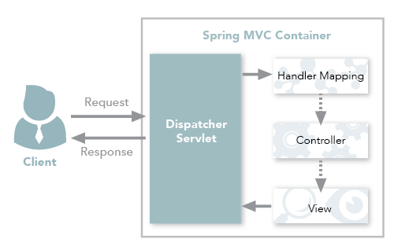
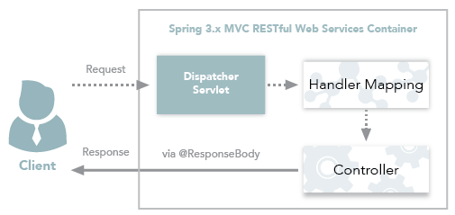

# Java中常用的注解

## 参考链接：[Spring常用注解](https://zhuanlan.zhihu.com/p/137507309)

## `@Component`、`@Controller`、`@Repository`、`@Service`

- `@Component`：任何**Spring**管理组件的通用原型。
- `@Repository`：作用于**持久层**，主要用于数据库相关操作。
- `@Service`：作用于**服务层**，主要涉及复杂业务逻辑。
- `@Controller`：作用于**表现层**（SpringMVC），主要用于接收用户请求并调用服务层返回数据给前端页面。

## `@Controller`和`@RestController`

- 单独使用 `@Controller` 不加 `@ResponseBody`的话一般使用在要返回一个**视图**的情况，这种情况属于比较传统的SpringMVC 的应用，对应于前后端不分离的情况。

  

- `@RestController`只返回**对象**，对象数据直接以**JSON**或**XML**形式写入HTTP响应体中，这种情况属于**RESTful Web**服务，目前开发最常用的情况（前后端分离）。

  

- `@RestController`=`@Controller`+`@RespnseBody`。其中`@ResponseBody`的作用是将`@Controller`的方法的返回对象通过适当的转换器转换为指定的格式后，写入到HTTP响应体中，通常用来返回Json或XML数据。

  

## `@Value`

- 使用`@Value`读取配置信息，有两种方式：

  1. `${}`方式：属于**属性占位符**方式

     ```java
     @Value("${jdbc.url}")
     private String url;
     ```

     对应的配置方式

     ```xml
     <!--基于占位符方式 配置单个properties -->
     <context:property-placeholder location="conf/jdbc.properties"/>
     
     <!--基于占位符方式 配置多个properties -->
     <bean id="propertyConfigurer" class="org.springframework.beans.factory.config.PreferencesPlaceholderConfigurer">
     	<property name="location" value="conf/jdbc.properties"/>
     </bean>
     ```

     

  2. `#{}`方式：属于**SpEL表达式**方式

     ```java
     @Value("#{configProperties['jdbc.url']}")
     private String url;
     ```

     对应的配置方式

     ```xml
     <!--基于SpEL表达式 配置多个properties id值为configProperties 提供java代码中使用 -->
     <bean id="configProperties" class="org.springframework.beans.factory.config.PropertiesFactoryBean">
         <property name="locations">
             <list>
                 <value>classpath:/conf/jdbc.properties</value>
             </list>
         </property>
     </bean>
     
     <!--基于SpEL表达式 配置单个properties -->
     <util:properties id="configProperties" location="classpath:conf/jdbc.properties"/>
     ```

## `@Component`和`@Bean`

- 作用对象不同：`@Component`作用于类，`@Bean`作用于方法。
- `@Component`通过类路径扫描自动检测和自动装配到Spring容器中。该类和创建的bean之间有一个**隐式**的一对一映射（即每个类对应一个bean）。这种方法对连接的控制非常有限，因为它纯粹是**声明性**的。
- `@Bean`用于**显式**声明单个bean，而不是让Spring自动声明。它将bean的声明与类定义解耦，并允许按照自己选择的方式创建和配置bean，所以它的**自定义性**更强。所以需要引用第三方库中的类需要装配到 Spring 容器时，只能通过 `@Bean` 来实现。

```java
@Bean
public OneService getService(status) {
    case (status) {
        when 1:
        return new serviceImpl1();
        when 2:
        return new serviceImpl2();
        when 3:
        return new serviceImpl3();
    }
}
```

## `@Required`

- 