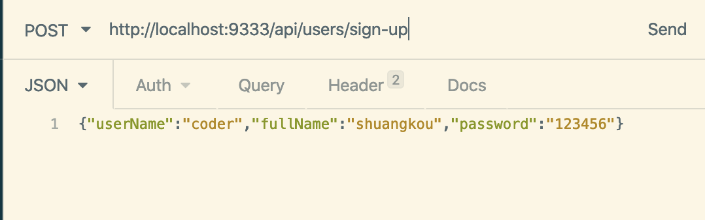

# 常用注解

## 一、`@SpringBootApplication`

> 参考链接：[JavaGuide](https://javaguide.cn/system-design/framework/spring/spring-common-annotations.html#_1-springbootapplication)

这个注解是SpringBoot项目的基石，创建项目后会默认加在主类上。

```java
@SpringBootApplication
public class SpringSecurityJwtGuideApplication {
      public static void main(java.lang.String[] args) {
        SpringApplication.run(SpringSecurityJwtGuideApplication.class, args);
    }
}
```

可以把`@SpringBootApplication`看作是`@Configuration`、`@EnableAutoConfiguration`、`@ComponentScan`的合集。

```java
package org.springframework.boot.autoconfigure;
@Target(ElementType.TYPE)
@Retention(RetentionPolicy.RUNTIME)
@Documented
@Inherited
@SpringBootConfiguration
@EnableAutoConfiguration
@ComponentScan(excludeFilters = {
		@Filter(type = FilterType.CUSTOM, classes = TypeExcludeFilter.class),
		@Filter(type = FilterType.CUSTOM, classes = AutoConfigurationExcludeFilter.class) })
public @interface SpringBootApplication {
   ......
}

package org.springframework.boot;
@Target(ElementType.TYPE)
@Retention(RetentionPolicy.RUNTIME)
@Documented
@Configuration
public @interface SpringBootConfiguration {

}
```

根据SpringBoot官网，这三个注解的作用分别是：

- `@Configuration`：允许在Spring上下文中注册额外的Bean或导入其他配置类。
- `@EnableAutoConfiguration`：启用SpringBoot的自动配置机制。
- `@ComponentScan`：扫描被`@Component`（`@Repository`，`@Service`，`@Controller`）注解的Bean，注解默认会扫描**该类所在的包下所有的类**。

## 二、Spring Bean相关

### 2.1 `@Autowired`:airplane:

> 参考链接：[Java全栈知识体系](https://pdai.tech/md/spring/springboot/springboot-x-hello-anno.html#autowired)、[JavaGuide](https://javaguide.cn/system-design/framework/spring/spring-common-annotations.html#_2-spring-bean-%E7%9B%B8%E5%85%B3)

可以对类**成员变量、方法及构造函数**进行标注，完成自动装配的工作。

```java
@Service
public class UserService {
  ......
}

@RestController
@RequestMapping("/users")
public class UserController {
   @Autowired
   private UserService userService;
   ......
}
```

在默认情况下使用`@Autowired`注解进行自动注入时，Spring容器中匹配的候选Bean数目必须**有且仅有**一个。当找不到一个匹配的Bean时，Spring容器将抛出`BeanCreationException`异常，并**指出必须至少拥有一个匹配的Bean**。

当不能确定Spring容器中一定拥有某个类的Bean时，可以在需要自动注入该类Bean的地方可以使用`@Autowired(required = false)`，这等于告诉Spring：**尽管找不到匹配Bean也不报错**。

#### 与`@Resource`比较

> 参考链接：[掘金](https://juejin.cn/post/7022507865701089317)、[Stack Overflow](https://stackoverflow.com/questions/4093504/resource-vs-autowired)

**相同点**：`@Resource`和`@Autowired`都可以作为注入属性的注解，**在接口仅有单一实现类时**，两个注解的修饰效果相同，可以互相替换，不影响使用。

**不同点**：`@Resource`是JDK原生的注解，`@Autowired`是Spring 2.5引入的注解。`@Resource`有两个属性：`name`和`type`。Spring将`@Resource`的`name`属性解析为Bean的名字，而`type`属性则解析Bean的类型。如果使用`name`属性，则使用**byName的自动注入策略**；使用`type`属性时则使用**byType的自动注入策略**；如果既不指定`name`也不指定`type`，将**通过反射机制使用byName的自动注入策略**。`@Autowired`**只根据类型进行注入**，不会去匹配名字。**如果涉及到byType无法辨别的对象时，需要依赖`@Qualifier`或`@Primary`注解一起来修饰**。

例如：有2个`Cook`接口的实现类：`CookTomato`和`CookPatato`：

```java
public class CookTomato implements Cook {
}

public class CookPatato implements Cook {
}
```

定义类`CookController.java`，注入`Cook`接口：

```java
// 方式一：使用@Resource带name属性
public class CookController {
	@Resource(name="cookTomato")
	private Cook cook;
}

// 方式二：使用@Autowired和@Qualifier
public class CookController {
	@Autowired
    @Qualifier("cookTomato")
	private Cook cook;
}
```

**总结**：

- `@Autowired`只包含一个参数：`required`，表示是否开启自动准入，默认是`true`；而`@Resource`包含七个参数，其中最重要的两个参数是：`name`和`type`。

- `@Autowired`如果要使用byName，需要配合使用`@Qualifier`。

- 二者装配顺序：

  - `@Autowired`顺序：

    

  - `@Resource`顺序：

    

#### 补充：`@Qualifier`和`@Primary`

> 参考链接：[W3Cschool](https://www.w3cschool.cn/wkspring/knqr1mm2.html)、[掘金](https://juejin.cn/post/6844904035342893063)

`@Qualifier`：当创建了**多个具有相同类型的Bean**时，并且想要用**一个属性只为它们其中一个进行装配**，在这种情况下可以使用`@Qualifier`和`@Autowired`的组合方式来指定哪一个真正的Bean将会被装配以消除歧义。

```java
public class Profile {
   @Autowired
   @Qualifier("student1")
   private Student student;
}
```

`@Primary`：用来**在发生依赖注入歧义时决定要注入哪个Bean**。当存在多个相同类型的Bean时，此注解定义了**首选项**。

```java
@Bean
public Employee tomEmployee() {
    return new Employee("Tom");
}

@Bean
@Primary
public Employee johnEmployee() {
    return new Employee("john");
}
```

总的来说，`@Primary`定义了默认值，而`@Qualifier`则非常具体。值得注意的是，**如果`@Qualifier`和`@Primary`注释都存在，那么`@Qualifier`注释将具有优先权**。

### 2.2 `@Component`、`@Controller`、`@Repository`、`@Service`:airplane:

> 参考链接：[JavaGuide](https://javaguide.cn/system-design/framework/spring/spring-common-annotations.html)、[Stack Overflow](https://stackoverflow.com/questions/6827752/whats-the-difference-between-component-repository-service-annotations-in)

- `@Component`：任何**Spring**管理组件的通用原型。
- `@Repository`：作用于**持久层**，主要用于数据库相关操作。
- `@Service`：作用于**服务层**，主要涉及复杂业务逻辑。
- `@Controller`：作用于**表现层**（SpringMVC），主要用于接收用户请求并调用服务层返回数据给前端页面。

#### 补充：`@Component`和`@Bean`

> 参考链接：[简书](https://www.jianshu.com/p/32a72bb38487)、[首席CTO笔记](https://www.shouxicto.com/article/2076.html)、[Stack Overflow](https://stackoverflow.com/questions/10604298/spring-component-versus-bean)

二者目的一样：**注册Bean到Spring容器中**，但作用对象不同：**`@Component`作用于类，`@Bean`作用于方法**。

`@Component`通过**类路径扫描自动检测和自动装配到Spring容器**中（表明这个类会作为组件类，告知Spring要为这个类创建Bean）。该类和创建的Bean之间有一个**隐式**的一对一映射关系（即每个类对应一个Bean）。这种方法对连接的控制非常有限，因为它纯粹是**声明性**的。

`@Bean`用于**显式**声明单个Bean，而不是让Spring自动声明。**它告诉Spring这个方法将会返回一个对象，这个对象要注册为Spring容器中的Bean**。它将Bean的声明与类定义解耦，并允许按照自己选择的方式创建和配置Bean，所以它的**自定义性**更强。当需要引用第三方库中的类需要装配到Spring容器时，只能通过`@Bean`来实现。

`@Component`使用示例：

```java
@Component
public class ServiceImpl implements AService {
    ....
}
```

`@Bean`使用示例：

```java
@Configuration
public class AppConfig {
    @Bean
    public TransferService transferService() {
        return new TransferServiceImpl();
    }
}
```

`@Component`无法实现而`@Bean`可以实现：

```java
@Bean
public OneService getService(status) {
    case (status) {
        when 1:
        return new serviceImpl1();
        when 2:
        return new serviceImpl2();
        when 3:
        return new serviceImpl3();
    }
}
```

### 2.3 `@RestController`和`@Controller`:boat:

> 参考链接：[JavaGuide](https://javaguide.cn/system-design/framework/spring/spring-common-annotations.html#_2-spring-bean-%E7%9B%B8%E5%85%B3)、[微信公众号](https://mp.weixin.qq.com/s?__biz=Mzg2OTA0Njk0OA==&mid=2247485544&idx=1&sn=3cc95b88979e28fe3bfe539eb421c6d8&chksm=cea247a3f9d5ceb5e324ff4b8697adc3e828ecf71a3468445e70221cce768d1e722085359907&token=1725092312&lang=zh_CN#rd)

`@RestController`=`@Controller`+`@RespnseBody`。其中`@ResponseBody`的作用是将`@Controller`的方法的返回对象**通过适当的转换器转换为指定的格式后**写入到HTTP响应体中，通常用来返回`Json`或`XML`数据。


`@RestController`只返回**对象**，对象数据直接以`JSON`或`XML`形式写入HTTP响应体中，这种情况属于**RESTful Web**服务，目前开发最常用的情况（前后端分离）。


单独使用`@Controller`不加`@ResponseBody`的话**一般使用在要返回一个视图的情况**，这种情况属于比较传统的SpringMVC的应用，对应于前后端不分离的情况。


### 2.4 `@Scope`:boat:

> 参考链接：[JavaGuide](https://javaguide.cn/system-design/framework/spring/spring-common-annotations.html#_2-spring-bean-%E7%9B%B8%E5%85%B3)

声明Bean的作用域：

```java
@Bean
@Scope("singleton")
public Person personSingleton() {
    return new Person();
}
```

### 2.5 `@Configuration`:boat:

> 参考链接：[JavaGuide](https://javaguide.cn/system-design/framework/spring/spring-common-annotations.html#_2-spring-bean-%E7%9B%B8%E5%85%B3)

一般用来声明配置类，可以使用`@Component`注解替代，不过使用`@Configuration`注解声明配置类更加语义化。

```java
@Configuration
public class AppConfig {
    @Bean
    public TransferService transferService() {
        return new TransferServiceImpl();
    }

}
```

### 2.6 `@Required`:boat:

> 参考链接：[W3Cschool](https://www.w3cschool.cn/wkspring/9sle1mmh.html)

`@Required`注解应用于Bean属性的**Setter方法**，它表明受影响的**Bean属性在配置时必须放在`.xml`配置文件中**，否则容器就会抛出一个`BeanInitializationException`异常，如下所示：

`Student.java`文件：

```java
import org.springframework.beans.factory.annotation.Required;
public class Student {
   private Integer age;
   private String name;
   @Required
   public void setAge(Integer age) {
      this.age = age;
   }
   public Integer getAge() {
      return age;
   }
   @Required
   public void setName(String name) {
      this.name = name;
   }
   public String getName() {
      return name;
   }
}
```

`Beans.xml`文件：这里没有对属性`age`进行注解，所以会抛出异常。

```xml
<context:annotation-config/>

<!-- Definition for student bean -->
<bean id="student" class="com.tutorialspoint.Student">
    <property name="name"  value="Zara" />
    <!-- try without passing age and check the result -->
    <!-- property name="age"  value="11"-->
</bean>
```

## 三、处理常见的HTTP请求

> 参考链接：[JavaGuide](https://javaguide.cn/system-design/framework/spring/spring-common-annotations.html#_3-%E5%A4%84%E7%90%86%E5%B8%B8%E8%A7%81%E7%9A%84-http-%E8%AF%B7%E6%B1%82%E7%B1%BB%E5%9E%8B)

**5种常见的请求类型：**

- **GET**：请求从服务器获取特定资源。例子：`GET /users`（获取所有学生）。

- **POST**：在服务器上创建一个新的资源。例子：`POST /users`（创建学生）。
- **PUT**：更新服务器上的资源（客户端提供更新后的整个资源）。举个例子：`PUT /users/12`（更新编号为12的学生）。
- **DELETE**：从服务器删除特定的资源。举个例子：`DELETE /users/12`（删除编号为12的学生）。
- **PATCH**：更新服务器上的资源（客户端提供更改的属性，可以看成是部分更新），使用的比较少。

### 3.1 GET请求:boat:

```java
@GetMapping("/users")
// 等价于 @RequestMapping(value="/users",method=RequestMethod.GET)
public ResponseEntity<List<User>> getAllUsers() {
 return userRepository.findAll();
}
```

### 3.2 POST请求:boat:

```java
@PostMapping("/users")
// 等价于 @RequestMapping(value="/users",method=RequestMethod.POST)
public ResponseEntity<User> createUser(@Valid @RequestBody UserCreateRequest userCreateRequest) {
 return userRespository.save(userCreateRequest);
}
```

关于`@RequestBody`的使用后面会介绍。

### 3.3 PUT请求:boat:

```java
@PutMapping("/users/{userId}")
// 等价于 @RequestMapping(value="/users/{userId}",method=RequestMethod.PUT)
public ResponseEntity<User> updateUser(@PathVariable(value = "userId") Long userId,
  @Valid @RequestBody UserUpdateRequest userUpdateRequest) {
  ......
}
```

### 3.4 DELETE请求:boat:

```java
@DeleteMapping("/users/{userId}")
// 等价于 @RequestMapping(value="/users/{userId}",method=RequestMethod.DELETE)
public ResponseEntity deleteUser(@PathVariable(value = "userId") Long userId){
  ......
}
```

### 3.5 PATCH请求:boat:

```java
@PatchMapping("/profile")
// 在实际项目中，都是PUT不够用了之后才用PATCH请求去更新数据
public ResponseEntity updateStudent(@RequestBody StudentUpdateRequest studentUpdateRequest) {
    studentRepository.updateDetail(studentUpdateRequest);
    return ResponseEntity.ok().build();
}
```

### 补充：`@RequestMapping`:airplane:

> 参考链接：[CSDN](https://blog.csdn.net/you18131371836/article/details/108198288)

`@RequestMapping`作用是映射URL路径，将HTTP请求地址映射到控制器（Controller）类的处理方法上。`@RequestMapping`可以定义在控制器类上，也可以定义在类方法上：

- 定义类上：将HTTP请求映射到该控制器上，规定**初步的请求映射地址**，表示类中的所有响应请求的方法都是**以该地址作为父路径**。
- 定义类方法上：**进一步指定HTTP请求到控制器处理方法的映射关系**。如果在控制器类上没有定义`@RequestMapping`，则直接将请求地址映射到处理方法上。

```java
@RequestMapping(value = "/api/v1/rabbit")
public class RabbitMqController {
    @RequestMapping(value = "/addexchange")
    public Object addExchange(@RequestBody RabbitExchange rabbitExchange) {
        return null;
    }
}
```

说明：当在类上定义映射地址为**"/api/v1/rabbit"**，方法上定义映射地址为**"/addexchange"**时，此时请求地址是：`http://localhost:8080/${Context_path}/api/v1/rabbit/addexchange`。如果去掉类上的`@RequestMapping(value = "/api/v1/rabbit")`，那么此时请求地址是：`http://localhost:8080/${Context_path}/addexchange`。

## 四、前后端传值

### 4.1 `@PathVariable`和`@RequestParam`:airplane:

> 参考链接：[Stack Overflow](https://stackoverflow.com/questions/13715811/requestparam-vs-pathvariable)

`@PathVariable`是从URL里获取一些占位符，而`@Requestparam`是从URL获取参数。

- 相同点：二者都可以用于在**Controller层接收前端传递的数据**。

- 不同点：二者的**应用场景不同**：

  - `@PathVariable`是获取**请求路径里面**的参数
  - `@RequestParam`是获取**请求里面携带**的参数

应用示例：假如URL为：“http://localhost:8080/MyApp/user/1234/invoices?date=12-05-2013”

```java
@RequestMapping(value="/user/{userId}/invoices", method = RequestMethod.GET)
public List<Invoice> listUsersInvoices(
    @PathVariable("userId")
    int user,
    @RequestParam(value = "date", required = false)
    Date dateOrNull)
```

获取到的数据为：`user=1234, dateOrNull=12-05-2013`。

### 4.2 `@RequestBody`:boat:

> 参考链接：[JavaGuide](https://javaguide.cn/system-design/framework/spring/spring-common-annotations.html#_4-%E5%89%8D%E5%90%8E%E7%AB%AF%E4%BC%A0%E5%80%BC)

用于读取：**Request请求（可能是POST、PUT、DELETE、GET请求）的body部分并且Content-Type为application/Json格式的数据**，接收到数据之后会自动将数据绑定到Java对象上去。系统会使用`HttpMessageConverter`或者自定义的`HttpMessageConverter`将请求的body中的**Json字符串转换为Java对象**。

举例说明：

```java
@PostMapping("/sign-up")
public ResponseEntity signUp(@RequestBody @Valid UserRegisterRequest userRegisterRequest) {
  userService.save(userRegisterRequest);
  return ResponseEntity.ok().build();
}

// UserRegisterRequest对象
@Data
@AllArgsConstructor
@NoArgsConstructor
public class UserRegisterRequest {
    @NotBlank
    private String userName;
    @NotBlank
    private String password;
    @NotBlank
    private String fullName;
}
```

发送POST请求到`signUp`，并且body携带Json数据：

```json
{"userName":"coder","fullName":"shuangkou","password":"123456"}
```

可以直接把Json格式的数据映射到`UserRegisterRequest`类上：



注意：**一个请求方法只可以有一个`@RequestBody`，但是可以有多个`@RequestParam`和`@PathVariable`**。 如果某个方法必须要用两个`@RequestBody`来接收数据的话，大概率是数据库设计或者系统设计出问题了！

## 五、读取配置信息

> 参考链接：[JavaGuide](https://javaguide.cn/system-design/framework/spring/spring-common-annotations.html#_5-%E8%AF%BB%E5%8F%96%E9%85%8D%E7%BD%AE%E4%BF%A1%E6%81%AF)

很多时候需要将一些常用的配置信息放到配置文件中。数据源`application.yml`内容如下：

```yaml
wuhan2020: 2020年初武汉爆发了新型冠状病毒，疫情严重，但是，我相信一切都会过去！武汉加油！中国加油！

my-profile:
  name: Guide哥
  email: koushuangbwcx@163.com

library:
  location: 湖北武汉加油中国加油
  books:
    - name: 天才基本法
      description: 二十二岁的林朝夕在父亲确诊阿尔茨海默病这天，得知自己暗恋多年的校园男神裴之即将出国深造的消息——对方考取的学校，恰是父亲当年为她放弃的那所。
    - name: 时间的秩序
      description: 为什么我们记得过去，而非未来？时间“流逝”意味着什么？是我们存在于时间之内，还是时间存在于我们之中？卡洛·罗韦利用诗意的文字，邀请我们思考这一亘古难题——时间的本质。
    - name: 了不起的我
      description: 如何养成一个新习惯？如何让心智变得更成熟？如何拥有高质量的关系？ 如何走出人生的艰难时刻？
```

### 5.1 `@Value`（常用）:airplane:

使用`@Value("${property}")`读取比较简单的配置信息：

```java
@Value("${wuhan2020}")
String wuhan2020;
```

#### 补充：`@Value`读取配置信息的两种方式

> 参考链接：[CSDN](https://blog.csdn.net/wangshuminjava/article/details/81476028)

第一种方式：`${}`方式，属于**属性占位符**方式：

```java
@Value("${jdbc.url}")
private String url;
```

对应的配置方式：

```xml
<!--基于占位符方式 配置单个properties -->
<context:property-placeholder location="conf/jdbc.properties"/>

<!--基于占位符方式 配置多个properties -->
<bean id="propertyConfigurer" class="org.springframework.beans.factory.config.PreferencesPlaceholderConfigurer">
	<property name="location" value="conf/jdbc.properties"/>
</bean>
```

第二种方式：`#{}`方式，属于**SpEL表达式**方式：

```java
@Value("#{configProperties['jdbc.url']}")
private String url;
```

对应的配置方式：

```xml
<!--基于SpEL表达式 配置多个properties id值为configProperties 提供java代码中使用 -->
<bean id="configProperties" class="org.springframework.beans.factory.config.PropertiesFactoryBean">
    <property name="locations">
        <list>
            <value>classpath:/conf/jdbc.properties</value>
        </list>
    </property>
</bean>

<!--基于SpEL表达式 配置单个properties -->
<util:properties id="configProperties" location="classpath:conf/jdbc.properties"/>
```

### 5.2 `@ConfigurationProperties`（常用）:airplane:

通过`@ConfigurationProperties`读取配置信息并与Bean绑定：

```java
@Component
@ConfigurationProperties(prefix = "library")
class LibraryProperties {
    @NotEmpty
    private String location;
    private List<Book> books;

    @Setter
    @Getter
    @ToString
    static class Book {
        String name;
        String description;
    }
  // 省略getter/setter
  ......
}
```

可以像使用普通的Spring Bean一样，将其注入到类中使用。

### 5.3 `@PropertySource`（不常用）:rainbow:

`@PropertySource`读取指定的`.properties`文件：

```java
@Component
@PropertySource("classpath:website.properties")

class WebSite {
    @Value("${url}")
    private String url;

  // 省略getter/setter
  ......
}
```

## 六、事务`@Transactional​`

### 6.1 `@Transactional`注解使用详解

#### 作用范围

- 方法：**推荐方式**，不过需要注意的是：**该注解只能应用到`public`方法上，否则不生效。**
- 类：如果这个注解使用在类上的话，表明该注解对该类中所有的`public`方法都生效。
- 接口：**不推荐在接口上使用**。因为一旦标注在接口上并且配置了**Spring AOP使用CGLIB动态代理**，将会导致`@Transactional`注解失效。

#### 常用配置参数

源码如下，包含了基本事务属性的配置：

```java
public @interface Transactional {
	@AliasFor("transactionManager")
	String value() default "";
	@AliasFor("value")
	String transactionManager() default "";
	Propagation propagation() default Propagation.REQUIRED;
	Isolation isolation() default Isolation.DEFAULT;
	int timeout() default TransactionDefinition.TIMEOUT_DEFAULT;
	boolean readOnly() default false;
	Class<? extends Throwable>[] rollbackFor() default {};
	String[] rollbackForClassName() default {};
	Class<? extends Throwable>[] noRollbackFor() default {};
	String[] noRollbackForClassName() default {};
}
```

常用配置参数总结：

|    属性名     |                             说明                             |
| :-----------: | :----------------------------------------------------------: |
| `propagation` |              事务的传播行为，默认值为`REQUIRED`              |
|  `isolation`  |             事务的隔离级别，默认值采用`DEFAULT`              |
|   `timeout`   |           事务的超时时间，默认值为`-1`（不会超时）           |
|  `readOnly`   |           指定事务是否为只读事务，默认值为`false`            |
| `rollbackFor` | 用于指定能够触发事务回滚的异常类型，并且可以指定多个异常类型 |

#### 事务注解原理

`@Transactional`的工作机制是**基于AOP**实现的，AOP又是使用**动态代理**实现的。如果目标对象**实现了接口**，默认情况下会采用**JDK**的动态代理，如果目标对象**没有实现接口**，会使用**CGLIB**动态代理。

如果**一个类或者一个类中的`public`方法**上被标注`@Transactional`注解的话，Spring容器就会在启动的时候为其**创建一个代理类**，在调用被`@Transactional`注解的**`public`方法**的时候，实际调用的是**`TransactionInterceptor`类中的`invoke()`方法**。这个方法的作用就是**在目标方法之前开启事务**，方法执行过程中如果遇到**异常的时候回滚事务**，方法调用**完成之后提交事务**。

##### Spring AOP自调用问题

**若同一类中，没有`@Transactional`注解的方法内部调用有`@Transactional`注解的方法，有`@Transactional`注解的方法的事务会失效。**

这是由于**Spring AOP**代理的原因造成的，因为只有当`@Transactional`**注解的方法在类以外被调用**的时候，Spring事务管理才生效。

```java
@Service
public class MyService {
    private void method1() {
        method2();
}
    @Transactional
    public void method2() {
    }
}
```

上面的例子中，`MyService`类中的`method1()`调用`method2()`就会导致`method2()`的事务失效。解决办法：**避免同一类中自调用**或者使用**AspectJ取代Spring AOP**代理。

### 6.2 `@Transactional`失效场景

> 参考链接：[掘金](https://juejin.cn/post/6844904096747503629#heading-11)

##### 应用在非`public`修饰的方法上

`computeTransactionAttribute`方法会检查目标方法的修饰符是否为`public`，如果不是则不会获取`@Transactional`注解的事务配置信息：

```java
protected TransactionAttribute computeTransactionAttribute(Method method, Class<?> targetClass) {
    // Don't allow no-public methods as required.
    if (allowPublicMethodsOnly() && !Modifier.isPublic(method.getModifiers())) {
        return null;
}
```

**注意：在`protected`、`private`修饰的方法上使用`@Transactional`注解，虽然事务无效，但不会有任何报错。**

##### 属性`propagation`设置错误

若是错误配置以下三种`propagation`，事务将不会发生回滚：

1. `TransactionDefinition.PROPAGATION_SUPPORTS`
2. `TransactionDefinition.PROPAGATION_NOT_SUPPORTED`
3. `TransactionDefinition.PROPAGATION_NEVER`

##### 属性`rollbackFor`设置错误

默认情况下，事务只有遇到**运行期异常**（`RuntimeException`的子类）时才会回滚，`Error`也会导致事务回滚，但是，在遇到**检查型**（Checked）异常时不会回滚。如果在事务中抛出其他类型的异常，但却期望Spring能够回滚事务，就需要指定`rollbackFor`属性。

##### 同一个类中方法调用

同一个类中的**无事务`a()`调用有事务`b()`就会导致`b()`的事务失效**，这是由于**Spring AOP**代理的原因造成的。

##### 异常被自己的`catch`捕获

Spring事务是在调用业务方法之前开始的，业务方法执行完毕之后才执行`commit`或者`rollback`，事务是否执行取决于是否抛出`runtime`异常。如果抛出`runtime exception`并在业务方法中没有`catch`到的话，事务会回滚。

在业务方法中一般不需要`catch`异常，**如果非要`catch`一定要抛出`RuntimeException()`，或者注解中指定异常类型`@Transactional(rollbackFor=Exception.class)`**，否则会导致事务失效。

##### 数据库的引擎不支持事务

**数据库引擎是否支持事务是事务能否生效的关键**。比如常用的MySQL数据库默认使用**支持事务的Innodb引擎**。但是，如果把数据库引擎变为MyISAM，那么程序也就不再支持事务了！

