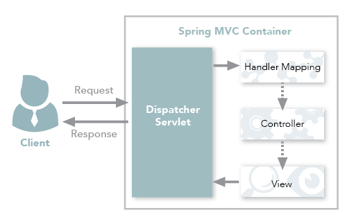
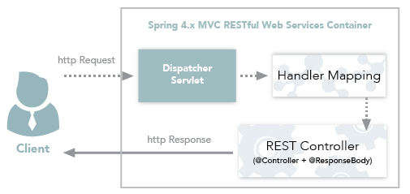
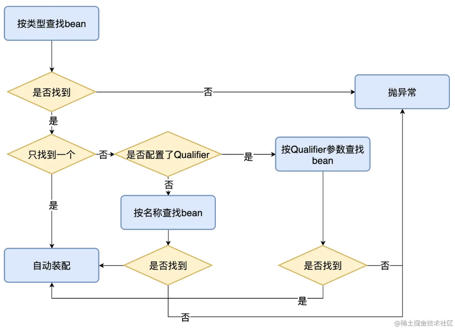
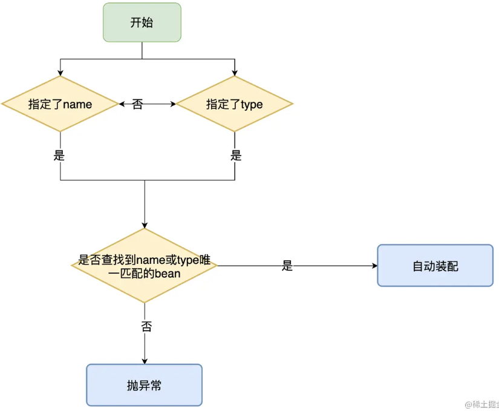

# Spring&SpringBoot常用注解

## `@SpringBootApplication`:boat:

> 参考链接：[JavaGuide](https://javaguide.cn/system-design/framework/spring/spring-common-annotations.html#_1-springbootapplication)

这个注解是SpringBoot项目的基石，创建项目后会默认加在主类上。

```java
@SpringBootApplication
public class SpringSecurityJwtGuideApplication {
      public static void main(java.lang.String[] args) {
        SpringApplication.run(SpringSecurityJwtGuideApplication.class, args);
    }
}
```

可以把`@SpringBootApplication`看作是`@Configuration`、`@EnableAutoConfiguration`、`@ComponentScan`的合集。

```java
package org.springframework.boot.autoconfigure;
@Target(ElementType.TYPE)
@Retention(RetentionPolicy.RUNTIME)
@Documented
@Inherited
@SpringBootConfiguration
@EnableAutoConfiguration
@ComponentScan(excludeFilters = {
		@Filter(type = FilterType.CUSTOM, classes = TypeExcludeFilter.class),
		@Filter(type = FilterType.CUSTOM, classes = AutoConfigurationExcludeFilter.class) })
public @interface SpringBootApplication {
   ......
}

package org.springframework.boot;
@Target(ElementType.TYPE)
@Retention(RetentionPolicy.RUNTIME)
@Documented
@Configuration
public @interface SpringBootConfiguration {

}
```

根据SpringBoot官网，这三个注解的作用分别是：

- `@Configuration`：允许在Spring上下文中注册额外的bean或导入其他配置类。
- `@EnableAutoConfiguration`：启用SpringBoot的自动配置机制。
- `@ComponentScan`：扫描被`@Component`（`@Repository`，`@Service`，`@Controller`)注解的bean，注解默认会扫描**该类所在的包下所有的类**。

## Spring Bean相关

### `@Autowired`:boat:

> 参考链接：[JavaGuide](https://javaguide.cn/system-design/framework/spring/spring-common-annotations.html#_2-spring-bean-%E7%9B%B8%E5%85%B3)、[Java全栈知识体系](https://pdai.tech/md/spring/springboot/springboot-x-hello-anno.html#autowired)


## `@Component`、`@Controller`、`@Repository`、`@Service`:airplane:

- 参考链接：[JavaGuide](https://javaguide.cn/system-design/framework/spring/spring-common-annotations.html)、[Stack Overflow](https://stackoverflow.com/questions/6827752/whats-the-difference-between-component-repository-service-annotations-in)
- `@Component`：任何**Spring**管理组件的通用原型。
- `@Repository`：作用于**持久层**，主要用于数据库相关操作。
- `@Service`：作用于**服务层**，主要涉及复杂业务逻辑。
- `@Controller`：作用于**表现层**（SpringMVC），主要用于接收用户请求并调用服务层返回数据给前端页面。

## `@Controller`和`@RestController`:airplane:

- 参考链接：[微信公众号](https://mp.weixin.qq.com/s?__biz=Mzg2OTA0Njk0OA==&mid=2247485544&idx=1&sn=3cc95b88979e28fe3bfe539eb421c6d8&chksm=cea247a3f9d5ceb5e324ff4b8697adc3e828ecf71a3468445e70221cce768d1e722085359907&token=1725092312&lang=zh_CN#rd)

- 单独使用 `@Controller` 不加 `@ResponseBody`的话一般使用在要返回一个**视图**的情况，这种情况属于比较传统的SpringMVC 的应用，对应于前后端不分离的情况。

  

- `@RestController`只返回**对象**，对象数据直接以**JSON**或**XML**形式写入HTTP响应体中，这种情况属于**RESTful Web**服务，目前开发最常用的情况（前后端分离）。

  

- `@RestController`=`@Controller`+`@RespnseBody`。其中`@ResponseBody`的作用是将`@Controller`的方法的返回对象通过适当的转换器转换为指定的格式后，写入到HTTP响应体中，通常用来返回Json或XML数据。

  

## `@Value`:airplane:

- 参考链接：[CSDN](https://blog.csdn.net/wangshuminjava/article/details/81476028)

- 使用`@Value`读取配置信息，有两种方式：

    - `${}`方式：属于**属性占位符**方式
    
      ```java
      @Value("${jdbc.url}")
      private String url;
      ```
    
      对应的配置方式
    
      ```xml
      <!--基于占位符方式 配置单个properties -->
      <context:property-placeholder location="conf/jdbc.properties"/>
      
      <!--基于占位符方式 配置多个properties -->
      <bean id="propertyConfigurer" class="org.springframework.beans.factory.config.PreferencesPlaceholderConfigurer">
      	<property name="location" value="conf/jdbc.properties"/>
      </bean>
      ```
    
    - `#{}`方式：属于**SpEL表达式**方式
    
      ```java
      @Value("#{configProperties['jdbc.url']}")
      private String url;
      ```
    
      对应的配置方式
    
      ```xml
      <!--基于SpEL表达式 配置多个properties id值为configProperties 提供java代码中使用 -->
      <bean id="configProperties" class="org.springframework.beans.factory.config.PropertiesFactoryBean">
          <property name="locations">
              <list>
                  <value>classpath:/conf/jdbc.properties</value>
              </list>
          </property>
      </bean>
      
      <!--基于SpEL表达式 配置单个properties -->
      <util:properties id="configProperties" location="classpath:conf/jdbc.properties"/>
      ```
      
## `@Component`和`@Bean`:airplane:

- 参考链接：[Stack Overflow](https://stackoverflow.com/questions/10604298/spring-component-versus-bean)

- 作用对象不同：`@Component`作用于类，`@Bean`作用于方法。

- `@Component`通过类路径扫描自动检测和自动装配到Spring容器中。该类和创建的bean之间有一个**隐式**的一对一映射（即每个类对应一个bean）。这种方法对连接的控制非常有限，因为它纯粹是**声明性**的。

- `@Bean`用于**显式**声明单个bean，而不是让Spring自动声明。它将bean的声明与类定义解耦，并允许按照自己选择的方式创建和配置bean，所以它的**自定义性**更强。所以需要引用第三方库中的类需要装配到 Spring 容器时，只能通过 `@Bean` 来实现。

  ```java
  @Bean
  public OneService getService(status) {
      case (status) {
          when 1:
          return new serviceImpl1();
          when 2:
          return new serviceImpl2();
          when 3:
          return new serviceImpl3();
      }
  }
  ```

## `@Required`:airplane:

- 参考链接：[W3Cschool](https://www.w3cschool.cn/wkspring/9sle1mmh.html)

- `@Required` 注解应用于 bean 属性的 **setter 方法**，它表明受影响的 **bean 属性在配置时必须放在 XML 配置文件中**，否则容器就会抛出一个 BeanInitializationException 异常，如下所示：

  Student.java文件：

  ```java
  import org.springframework.beans.factory.annotation.Required;
  public class Student {
     private Integer age;
     private String name;
     @Required
     public void setAge(Integer age) {
        this.age = age;
     }
     public Integer getAge() {
        return age;
     }
     @Required
     public void setName(String name) {
        this.name = name;
     }
     public String getName() {
        return name;
     }
  }
  ```

  Beans.xml文件：这里没有对属性age进行注解，所以会抛出异常。

  ```xml
  <context:annotation-config/>
  
  <!-- Definition for student bean -->
  <bean id="student" class="com.tutorialspoint.Student">
      <property name="name"  value="Zara" />
      <!-- try without passing age and check the result -->
      <!-- property name="age"  value="11"-->
  </bean>
  ```

## `@Autowired`和`@Resource`:airplane:

- 参考链接：[掘金](https://juejin.cn/post/7022507865701089317)

- 相同点：`@Resource`和`@Autowired`都可以作为注入属性的修饰，在接口**仅有单一实现类**时，两个注解的修饰效果相同，可以互相替换，不影响使用。

- 不同点

  - `@Resource`是JDK原生的注解，`@Autowired`是Spring2.5 引入的注解

  - `@Resource`有两个属性**name**和**type**。Spring将`@Resource`注解的name属性解析为bean的名字，而type属性则解析为bean的类型。所以如果使用**name属性，则使用byName**的自动注入策略，而使用**type属性时则使用byType**自动注入策略。如果既不指定name也不指定type属性，这时将**通过反射机制使用byName**自动注入策略。

    `@Autowired`**只根据type进行注入**，不会去匹配name。如果涉及到type无法辨别注入对象时，那需要依赖`@Qualifier`或`@Primary`注解一起来修饰。

- 例如：有2个Cook接口的实现类：CookTomato和CookPatato

  ```java
  public class CookTomato implements Cook {
  }
  
  public class CookPatato implements Cook {
  }
  ```

  定义类CookController，注入Cook接口

  ```java
  // 方式一：使用@Resource带name属性
  public class CookController {
  	@Resource(name="cookTomato")
  	private Cook cook;
  }
  
  // 方式二：使用@Autowired和@Qualifier
  public class CookController {
  	@Autowired
      @Qualifier("cookTomato")
  	private Cook cook;
  }
  ```

- 总结

  - `@Autowired`只包含一个参数：**required**，表示是否开启自动准入，默认是true。而`@Resource`包含七个参数，其中最重要的两个参数是：**name 和 type**。

  - `@Autowired`如果要使用byName，需要使用`@Qualifier`一起配合。

  - `@Autowired`能够用在：**构造器、方法、参数、成员变量和注解**上，而`@Resource`能用在：**类、成员变量和方法**上。

  - 二者装配顺序

    - @Autowired

      

    - @Resource

      

## `@Qualifier`和`@Primary`:airplane:

- 参考链接：[W3Cschool](https://www.w3cschool.cn/wkspring/knqr1mm2.html)、[掘金](https://juejin.cn/post/6844904035342893063)

- `@Qualifier`：当创建**多个**具有相同类型的 bean 时，并且想要用一个属性只为它们**其中一个**进行装配，在这种情况下，你可以通过使用 `@Qualifier` 和 `@Autowired` 来指定哪一个真正的 bean 将会被装配以消除歧义。

  ```java
  public class Profile {
     @Autowired
     @Qualifier("student1")
     private Student student;
  }
  ```

- `@Primary`：用来在发生依赖注入歧义时决定要注入哪个 bean。当存在多个相同类型的 bean 时，此注解定义了**首选项**。

  ```java
  @Bean
  public Employee tomEmployee() {
      return new Employee("Tom");
  }
  
  @Bean
  @Primary
  public Employee johnEmployee() {
      return new Employee("john");
  }
  ```

- 总的来说，`@Primary` 定义了默认值，而 `@Qualifier` 则非常具体。值得注意的是，如果 `@Qualifier` 和 `@Primary` 注释**都存在**，那么 `@Qualifier` 注释将具有**优先权**。

## `@RequestMapping`和`@GetMapping`:airplane:

- 参考链接：[CSDN](https://blog.csdn.net/you18131371836/article/details/108198288)、[知乎](https://zhuanlan.zhihu.com/p/79582009)

- `@RequestMapping`作用是映射URL路径，将HTTP请求地址映射到控制器(Controller)类的处理方法上。`@RequestMapping`可以定义在控制器类上，也可以定义在类方法上：

  - 定义类上：将HTTP请求映射到该控制器上，规定初步的请求映射地址，相当于**请求地址的父路径**。

  - 定义类方法上：进一步指定HTTP请求到控制器处理方法的映射关系。如果在控制器类上没有定义`@RequestMapping`，则直接将请求地址映射到处理方法上。

  - ```java
    @RequestMapping(value = "/api/v1/rabbit")
    public class RabbitMqController {
        @RequestMapping(value = "/addexchange")
        public Object addExchange(@RequestBody RabbitExchange rabbitExchange) {
            return null;
        }
    }
    ```

- `@GetMapping`用于处理HTTP GET请求，并将请求映射到**具体的处理方法**中。它是一个**组合注解**，相当于是`@RequestMapping(method=RequestMethod.GET)`的快捷方式。

  ```java
  public class UserController {
      @GetMapping("/users")
      public List<User> findAllUser() {
          List<User> users = userService.findAll();
          return users;
      }
  }
  ```

## `@PathVariable`和`@RequestParam`:airplane:

- 参考链接：[Stack Overflow](https://stackoverflow.com/questions/13715811/requestparam-vs-pathvariable)

- `@PathVariable`是从URL里获取一些占位符

- `@Requestparam`是从URL获取参数

- 相同点：二者都可以用于在Controller层接收前端传递的数据

- 不同点：二者的应用场景不同

  - `@PathVariable`是获取**请求路径里面**的参数
  - `@RequestParam`是获取**请求里面携带**的参数

- 应用示例

  URL：`http://localhost:8080/MyApp/user/1234/invoices?date=12-05-2013`

  ```java
  @RequestMapping(value="/user/{userId}/invoices", method = RequestMethod.GET)
  public List<Invoice> listUsersInvoices(
      @PathVariable("userId")
      int user,
      @RequestParam(value = "date", required = false)
      Date dateOrNull)
  ```

## `@Transactional`:rocket:

参考链接：[JavaGuide](https://javaguide.cn/system-design/framework/spring/spring-transaction.html#%E4%BB%80%E4%B9%88%E6%98%AF%E4%BA%8B%E5%8A%A1)、[掘金](https://juejin.cn/post/6844904096747503629)

### 前言：关于事务

**事务是逻辑上的一组操作，要么都执行，要么都不执行。**

需要格外注意的是：**数据库引擎是否支持事务是事务能否生效的关键**。比如常用的 MySQL 数据库默认使用**支持事务的 `innodb`引擎**。但是，如果把数据库引擎变为 `myisam`，那么程序也就不再支持事务了！

#### 事务特性（ACID）

- **原子性（Atomicity）：** 一个事务（transaction）中的所有操作，或者全部完成，或者全部不完成，不会结束在中间某个环节。事务在执行过程中发生错误，会被回滚（Rollback）到事务开始前的状态，就像这个事务从来没有执行过一样。即，**事务不可分割、不可约简**。
- **一致性（Consistency）：** 在事务开始之前和事务结束以后，数据库的完整性没有被破坏。这表示写入的资料必须完全符合所有的**预设约束、触发器、级联回滚**等。
- **隔离性（Isolation）：** 数据库**允许多个并发事务同时对其数据进行读写和修改**的能力，隔离性可以**防止多个事务并发执行时由于交叉执行而导致数据的不一致**。事务隔离分为不同级别，包括**未提交读**（Read uncommitted）、**提交读**（read committed）、**可重复读**（repeatable read）和**串行化**（Serializable）。
- **持久性（Durability）:** 事务处理结束后，对数据的修改就是永久的，即便系统故障也不会丢失。

#### 补充：MySQL如何保证原子性？

如果想要保证事务的原子性，就需要在异常发生时，对已经执行的操作进行**回滚**。

在 MySQL 中，恢复机制是通过 **回滚日志（undo log）** 实现的，所有事务进行的修改都会先记录到这个回滚日志中，然后再执行相关的操作。

如果执行过程中遇到异常的话，我们直接利用 **回滚日志** 中的信息将数据回滚到修改之前的样子即可！并且，**回滚日志会先于数据持久化到磁盘上**。这样就保证了**即使遇到数据库突然宕机**等情况，当用户再次启动数据库的时候，**数据库还能够通过查询回滚日志来回滚**将之前未完成的事务

### Spring支持两种方式的事务管理

#### 编程式事务管理

通过 **`TransactionTemplate`**或者**`TransactionManager`**手动管理事务，实际应用中很少使用。

前者示例代码：

```java
@Autowired
private TransactionTemplate transactionTemplate;
public void testTransaction() {
    transactionTemplate.execute(new TransactionCallbackWithoutResult() {
        @Override
        protected void doInTransactionWithoutResult(TransactionStatus transactionStatus) {
            try {
                // ....  业务代码
            } catch (Exception e){
                //回滚
                transactionStatus.setRollbackOnly();
            }
        }
    });
}
```

后者示例代码：

```java
@Autowired
private PlatformTransactionManager transactionManager;
public void testTransaction() {
    TransactionStatus status = transactionManager.getTransaction(new DefaultTransactionDefinition());
    try {
        // ....  业务代码
        transactionManager.commit(status);
    } catch (Exception e) {
        transactionManager.rollback(status);
    }
}
```

#### 声明式事务管理

推荐使用（**代码侵入性最小**），实际是通过 **`AOP`** 实现（同样有两种方式，基于`TX`和`AOP`的`XML`配置文件方式和基于`@Transactional` 的全注解方式，后者使用最多）。

使用 `@Transactional`注解进行事务管理的示例代码如下：

```java
@Transactional(propagation = Propagation.REQUIRED)
public void aMethod {
  //do something
  B b = new B();
  C c = new C();
  b.bMethod();
  c.cMethod();
}
```

### Spring事务管理接口介绍

Spring 框架中，事务管理相关最重要的 3 个接口：

- **`PlatformTransactionManager`**：平台事务管理器，Spring事务策略的核心。
- **`TransactionDefinition`**：事务定义信息（事务隔离级别、传播行为、超时、只读、回滚规则）。
- **`TransactionStatus`**：事务运行状态

可以把 **`PlatformTransactionManager`** 接口看作是**事务上层的管理者**，而 **`TransactionDefinition`** 和 **`TransactionStatus`** 这两个接口可以看作是**事务的描述**。

**`PlatformTransactionManager`** 会根据 **`TransactionDefinition`** 的**定义**（比如事务超时时间、隔离级别、传播行为等）来进行事务管理 ，而 **`TransactionStatus`** 接口则提供了一些**方法**来获取事务相应的状态比如是否新事务、是否可以回滚等等。

### 事务属性详解

实际业务开发中，大家一般都是使用 **`@Transactional`** 注解来开启事务。

事务属性可以理解成事务的一些基本配置，描述了事务策略如何应用到方法上。包含了 5 个方面：**隔离级别**、**传播行为**、**回滚规则**、**是否只读**和**事务超时**。

#### 事务传播行为

**事务传播行为是为了解决业务层方法之间互相调用的事务问题**。

例子：在 A 类的`aMethod()`方法中调用了 B 类的 `bMethod()` 方法。这个时候就涉及到业务层方法之间**互相调用的事务问题**。如果 `bMethod()`如果发生异常需要回滚，如何配置事务传播行为才能让 `aMethod()`也跟着回滚呢？

```java
@Service
Class A {
    @Autowired
    B b;
    @Transactional(propagation = Propagation.xxx)
    public void aMethod {
        //do something
        b.bMethod();
    }
}
@Service
Class B {
    @Transactional(propagation = Propagation.xxx)
    public void bMethod {
       //do something
    }
}
```

在`TransactionDefinition`定义中包括了如下几个表示传播行为的常量：

```java
public interface TransactionDefinition {
    int PROPAGATION_REQUIRED = 0;
    int PROPAGATION_SUPPORTS = 1;
    int PROPAGATION_MANDATORY = 2;
    int PROPAGATION_REQUIRES_NEW = 3;
    int PROPAGATION_NOT_SUPPORTED = 4;
    int PROPAGATION_NEVER = 5;
    int PROPAGATION_NESTED = 6;
    ......
}
```

为了方便使用，Spring 相应地定义了一个枚举类：`Propagation`

```java
public enum Propagation {
    REQUIRED(TransactionDefinition.PROPAGATION_REQUIRED),
    SUPPORTS(TransactionDefinition.PROPAGATION_SUPPORTS),
    MANDATORY(TransactionDefinition.PROPAGATION_MANDATORY),
    REQUIRES_NEW(TransactionDefinition.PROPAGATION_REQUIRES_NEW),
    NOT_SUPPORTED(TransactionDefinition.PROPAGATION_NOT_SUPPORTED),
    NEVER(TransactionDefinition.PROPAGATION_NEVER),
    NESTED(TransactionDefinition.PROPAGATION_NESTED);
    
    private final int value;
    
    Propagation(int value) {
        this.value = value;
    }

    public int value() {
        return this.value;
    }
}
```

**正确的事务传播行为可能的值如下** ：

1. **`TransactionDefinition.PROPAGATION_REQUIRED`**

   使用的最多的一个事务传播行为，我们平时经常使用的`@Transactional`注解**默认**使用就是这个事务传播行为。如果当前存在事务，则加入该事务；如果当前没有事务，则创建一个新的事务。也就是说：

   - 如果**外部方法没有开启事务**的话，`Propagation.REQUIRED`修饰的内部方法会**新开启自己的事务**，且开启的事务**相互独立**，互不干扰。
   - 如果外部方法开启事务并且被`Propagation.REQUIRED`的话，所有`Propagation.REQUIRED`修饰的**内部方法和外部方法均属于同一事务** ，只要一个方法回滚，整个事务均回滚。

   如果上面的`aMethod()`和`bMethod()`使用的都是`PROPAGATION_REQUIRED`传播行为的话，两者使用的就是**同一个事务**，只要其中一个方法回滚，整个事务均回滚。

   ```java
   @Service
   Class A {
       @Autowired
       B b;
       @Transactional(propagation = Propagation.REQUIRED)
       public void aMethod {
           //do something
           b.bMethod();
       }
   }
   @Service
   Class B {
       @Transactional(propagation = Propagation.REQUIRED)
       public void bMethod {
          //do something
       }
   }
   ```

2. **`TransactionDefinition.PROPAGATION_REQUIRES_NEW`**

   创建一个**新的事务**，如果当前存在事务，则把当前事务挂起。也就是说**不管外部方法是否开启事务**，`Propagation.REQUIRES_NEW`修饰的**内部方法会新开启自己的事务**，且开启的事务相互独立，互不干扰。

   如果上面的`bMethod()`使用`PROPAGATION_REQUIRES_NEW`事务传播行为修饰，`aMethod`还是用`PROPAGATION_REQUIRED`修饰。如果`aMethod()`发生**异常回滚**，`bMethod()`不会跟着回滚，因为 `bMethod()`**开启了独立的事务**。但是，如果 `bMethod()`抛出了未被捕获的异常并且这个异常**满足事务回滚**规则的话，`aMethod()`**同样也会回滚**，因为这个异常被 `aMethod()`的事务管理机制检测到了。

   ```java
   @Service
   Class A {
       @Autowired
       B b;
       @Transactional(propagation = Propagation.REQUIRED)
       public void aMethod {
           //do something
           b.bMethod();
       }
   }
   @Service
   Class B {
       @Transactional(propagation = Propagation.REQUIRES_NEW)
       public void bMethod {
          //do something
       }
   }
   ```

3. **`TransactionDefinition.PROPAGATION_NESTED`**

   如果**当前存在事务**，就在**嵌套事务内执行**；如果**当前没有事务**，就执行与`TransactionDefinition.PROPAGATION_REQUIRED`类似的操作。也就是说：

   - 在外部方法开启事务的情况下，在内部开启一个新的事务，作为嵌套事务存在。

   - 如果外部方法无事务，则**单独开启一个事务**，与 `PROPAGATION_REQUIRED` 类似。

   如果 `bMethod()` 回滚的话，`aMethod()`也会回滚。

   ```java
   @Service
   Class A {
       @Autowired
       B b;
       @Transactional(propagation = Propagation.REQUIRED)
       public void aMethod {
           //do something
           b.bMethod();
       }
   }
   @Service
   Class B {
       @Transactional(propagation = Propagation.NESTED)
       public void bMethod {
          //do something
       }
   }
   ```

4. 剩下4种使用很少

   - **`TransactionDefinition.PROPAGATION_MANDATORY`**：如果当前存在事务，则加入该事务；如果当前没有事务，则抛出异常。（mandatory：强制性）
   - **`TransactionDefinition.PROPAGATION_SUPPORTS`**: 如果当前存在事务，则加入该事务；如果当前没有事务，则以非事务的方式继续运行。
   - **`TransactionDefinition.PROPAGATION_NOT_SUPPORTED`**: 以非事务方式运行，如果当前存在事务，则把当前事务挂起。
   - **`TransactionDefinition.PROPAGATION_NEVER`**: 以非事务方式运行，如果当前存在事务，则抛出异常。

#### 事务隔离级别

`TransactionDefinition` 接口中定义了五个表示隔离级别的常量：

```java
public interface TransactionDefinition {
    int ISOLATION_DEFAULT = -1;
    int ISOLATION_READ_UNCOMMITTED = 1;
    int ISOLATION_READ_COMMITTED = 2;
    int ISOLATION_REPEATABLE_READ = 4;
    int ISOLATION_SERIALIZABLE = 8;
}
```

和事务传播行为那块一样，为了方便使用，Spring 也相应地定义了一个枚举类：`Isolation`。

```java
public enum Isolation {
  DEFAULT(TransactionDefinition.ISOLATION_DEFAULT),
  READ_UNCOMMITTED(TransactionDefinition.ISOLATION_READ_UNCOMMITTED),
  READ_COMMITTED(TransactionDefinition.ISOLATION_READ_COMMITTED),
  REPEATABLE_READ(TransactionDefinition.ISOLATION_REPEATABLE_READ),
  SERIALIZABLE(TransactionDefinition.ISOLATION_SERIALIZABLE);

  private final int value;

  Isolation(int value) {
    this.value = value;
  }

  public int value() {
    return this.value;
  }
}
```

1. **`TransactionDefinition.ISOLATION_DEFAULT`** ：使用后端**数据库默认的隔离级别**，MySQL 默认采用的 `REPEATABLE_READ` 隔离级别；Oracle 默认采用的 `READ_COMMITTED` 隔离级别。
2. **`TransactionDefinition.ISOLATION_READ_UNCOMMITTED`** :**读未提交**，最低的隔离级别，使用这个隔离级别很少，因为它允许读取尚未提交的数据变更，**可能会导致脏读、幻读或不可重复读**。
3. **`TransactionDefinition.ISOLATION_READ_COMMITTED`** : **读已提交**，允许读取并发事务已经提交的数据，**可以阻止脏读，但是幻读或不可重复读仍有可能发生**。
4. **`TransactionDefinition.ISOLATION_REPEATABLE_READ`** : **可重复读**，对同一字段的多次读取结果都是一致的，除非数据是被本身事务自己所修改，**可以阻止脏读和不可重复读，但幻读仍有可能发生。**
5. **`TransactionDefinition.ISOLATION_SERIALIZABLE`** : **序列化**，最高的隔离级别，完全服从 ACID 的隔离级别。所有的事务依次逐个执行，这样事务之间就完全不可能产生干扰，也就是说，**该级别可以防止脏读、不可重复读以及幻读**。但是这将**严重影响程序的性能**。通常情况下也不会用到该级别。

#### 事务超时属性

所谓事务超时，就是指一个**事务所允许执行的最长时间**，如果超过该时间限制但事务还没有完成，则**自动回滚事务**。在 `TransactionDefinition` 中以 int 的值来表示超时时间，其单位是**秒**，默认值为**-1**，这表示事务的超时时间取决于底层事务系统或者没有超时时间。

#### 事务只读属性

对于只有读取数据查询的事务，可以指定事务类型为`readonly`，即**只读事务**。只读事务**不涉及数据的修改**，数据库会提供一些优化手段，适合用在有**多条数据库查询操作**的方法中。

```java
public interface TransactionDefinition {
    // 返回是否为只读事务，默认值为 false
    boolean isReadOnly();
}
```

- 如果你**一次执行单条**查询语句，则没有必要启用事务支持，数据库默认支持 SQL 执行期间的读一致性。

- 如果你**一次执行多条**查询语句，例如统计查询，报表查询，在这种场景下，多条查询 SQL 必须保证整体的读一致性，否则，在前条 **SQL 查询之后，后条 SQL 查询之前，数据被其他用户改变**，则该次整体的统计查询将会出现读数据不一致的状态，此时，应该启用事务支持。

#### 事务回滚规则

规则定义了哪些异常会导致事务回滚而哪些不会。默认情况下，事务只有遇到**运行期异常**（`RuntimeException` 的子类）时才会回滚，**`Error`** 也会导致事务回滚，但是，在遇到**检查型**（Checked）异常时不会回滚。

如果需要回滚自定义的特定异常类型，可以这样：

```java
@Transactional(rollbackFor= MyException.class)
```

### `@Transactional`注解使用详解

#### 作用范围

1. 方法：推荐将注解使用于方法上，不过需要注意的是：**该注解只能应用到 public 方法上，否则不生效。**
2. 类：如果这个注解使用在类上的话，表明该注解对该类中所有的 public 方法都生效。
3. 接口：不推荐在接口上使用。因为一旦标注在Interface上并且配置了**Spring AOP 使用CGLib动态代理**，将会导致`@Transactional`注解失效。

#### 常用配置参数

源码如下，包含了基本事务属性的配置：

```java
public @interface Transactional {
	@AliasFor("transactionManager")
	String value() default "";
	@AliasFor("value")
	String transactionManager() default "";
	Propagation propagation() default Propagation.REQUIRED;
	Isolation isolation() default Isolation.DEFAULT;
	int timeout() default TransactionDefinition.TIMEOUT_DEFAULT;
	boolean readOnly() default false;
	Class<? extends Throwable>[] rollbackFor() default {};
	String[] rollbackForClassName() default {};
	Class<? extends Throwable>[] noRollbackFor() default {};
	String[] noRollbackForClassName() default {};
}
```

|    属性名     |                             说明                             |
| :-----------: | :----------------------------------------------------------: |
| `propagation` |             事务的传播行为，默认值为 `REQUIRED`              |
|  `isolation`  |             事务的隔离级别，默认值采用 `DEFAULT`             |
|   `timeout`   |            事务的超时时间，默认值为-1（不会超时）            |
|  `readOnly`   |            指定事务是否为只读事务，默认值为 false            |
| `rollbackFor` | 用于指定能够触发事务回滚的异常类型，并且可以指定多个异常类型 |

#### 事务注解原理

`@Transactional` 的工作机制是**基于 AOP** 实现的，AOP 又是使用**动态代理**实现的。如果目标对象**实现了接口**，默认情况下会采用 **JDK** 的动态代理，如果目标对象**没有实现接口**，会使用 **CGLIB** 动态代理。

如果**一个类或者一个类中的 public 方法**上被标注`@Transactional` 注解的话，Spring 容器就会在启动的时候为其**创建一个代理类**，在调用被`@Transactional` 注解的 **public 方法**的时候，实际调用的是**`TransactionInterceptor` 类中的 `invoke()`方法**。这个方法的作用就是**在目标方法之前开启事务**，方法执行过程中如果遇到**异常的时候回滚事务**，方法调用**完成之后提交事务**。

##### Spring AOP自调用问题

**若同一类中，没有 `@Transactional` 注解的方法内部调用有 `@Transactional` 注解的方法，有`@Transactional` 注解的方法的事务会失效。**

这是由于`Spring AOP`代理的原因造成的，因为只有当 `@Transactional` **注解的方法在类以外被调用**的时候，Spring 事务管理才生效。

```java
@Service
public class MyService {
    private void method1() {
        method2();
}
    @Transactional
    public void method2() {
    }
}
```

上面的例子中，`MyService` 类中的`method1()`调用`method2()`就会导致`method2()`的事务失效。解决办法：**避免同一类中自调用**或者使用 **AspectJ 取代 Spring AOP** 代理。

### `@Transactional`失效场景

1. 应用在非public修饰的方法上

   `computeTransactionAttribute` 方法会检查目标方法的修饰符是否为 public，如果不是则不会获取`@Transactional` 注解的事务配置信息。

   ```java
   protected TransactionAttribute computeTransactionAttribute(Method method, Class<?> targetClass) {
       // Don't allow no-public methods as required.
       if (allowPublicMethodsOnly() && !Modifier.isPublic(method.getModifiers())) {
           return null;
   }
   ```

   **注意：在`protected`、`private` 修饰的方法上使用 `@Transactional` 注解，虽然事务无效，但不会有任何报错。**

2. 属性`propagation`设置错误

   若是错误的配置以下三种 `propagation`，事务将不会发生回滚：

   1. **`TransactionDefinition.PROPAGATION_SUPPORTS`**
   2. **`TransactionDefinition.PROPAGATION_NOT_SUPPORTED`**
   3. **`TransactionDefinition.PROPAGATION_NEVER`**

3. 属性`rollbackFor`设置错误

   默认情况下，事务只有遇到**运行期异常**（`RuntimeException` 的子类）时才会回滚，**`Error`** 也会导致事务回滚，但是，在遇到**检查型**（Checked）异常时不会回滚。如果在事务中抛出其他类型的异常，但却期望 Spring 能够回滚事务，就需要指定 `rollbackFor`属性。

4. 同一个类中方法调用

   同一个类中的**无事务`a()`调用有事务`b()`就会导致`b()`的事务失效**，这是由于`Spring AOP`代理的原因造成的。

5. 异常被自己的`catch`捕获

   所以：在业务方法中一般不需要`catch`异常，如果非要`catch`一定要抛出`RuntimeException()`，或者注解中指定异常类型`@Transactional(rollbackFor=Exception.class)`，否则会导致事务失效。

6. 数据库的引擎不支持事务

   **数据库引擎是否支持事务是事务能否生效的关键**。比如常用的 MySQL 数据库默认使用**支持事务的 `innodb`引擎**。但是，如果把数据库引擎变为 `myisam`，那么程序也就不再支持事务了！

## `@ConfigurationProperties`:airplane:

用在配置类上，读取配置文件属性并与bean绑定。

```java
@Component
@ConfigurationProperties(prefix = "object")
public class TestConfig {
    private String name;
    // getter和setter方法省略
}
```

