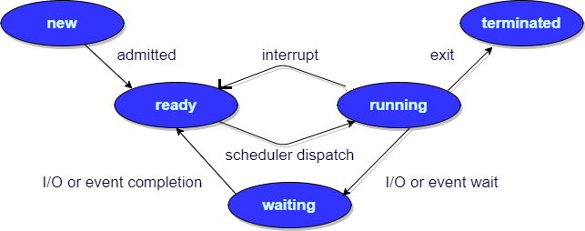
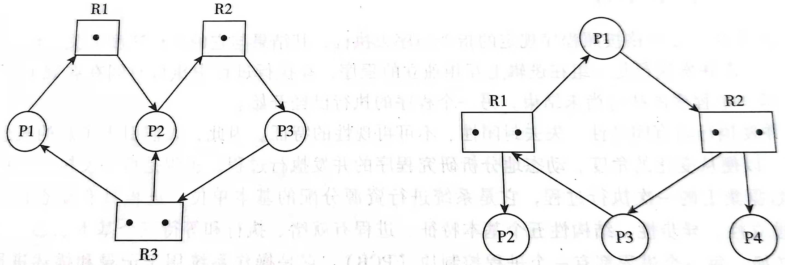
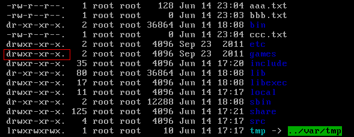

# 操作系统

## 一、操作系统基础:airplane:

> 参考链接：[JavaGuide](https://javaguide.cn/cs-basics/operating-system/operating-system-basic-questions-01.html#%E4%B8%80-%E6%93%8D%E4%BD%9C%E7%B3%BB%E7%BB%9F%E5%9F%BA%E7%A1%80)

### 1.1 什么是操作系统？

- 操作系统（Operating System，简称OS）是**管理计算机硬件与软件资源的程序**，是计算机的基石。
- 操作系统本质上是一个**运行在计算机上的软件程序 ，用于管理计算机硬件和软件资源**。
- **操作系统的存在屏蔽了硬件层的复杂性**。
- **操作系统的内核（Kernel）是操作系统的核心部分**，它负责系统的内存管理、硬件设备的管理、文件系统的管理以及应用程序的管理。内核是**连接应用程序和硬件的桥梁**，决定着系统的性能和稳定性。


### 1.2 系统调用

先来了解一下**用户态**和**系统态**。根据进程访问资源的特点，可以把进程在系统上的运行分为两个级别：

- 用户态（User mode）：用户态运行的进程可以**直接读取用户程序的数据**。
- 系统态（Kernel mode）：系统态运行的进程或程序**几乎可以访问计算机的任何资源**，不受限制。

那么什么是系统调用呢？运行的程序基本都是在用户态，如果调用操作系统提供的系统态级别的子功能就需要**系统调用了**！

也就是说在运行的用户程序中，**凡是与系统态级别的资源有关的操作**（如文件管理、进程控制、内存管理等)都**必须通过系统调用方式向操作系统提出服务请求**，并由操作系统代为完成。

这些系统调用按功能大致可分为如下几类：

- **设备管理**：完成设备的请求或释放，以及设备启动等功能。
- **文件管理**：完成文件的读、写、创建及删除等功能。
- **进程控制**：完成进程的创建、撤销、阻塞及唤醒等功能。
- **进程通信**：完成进程之间的消息传递或信号传递等功能。
- **内存管理**：完成内存的分配、回收以及获取作业占用内存区大小及地址等功能。

## 二、进程和线程:airplane:

> 参考链接：[JavaGuide](https://javaguide.cn/cs-basics/operating-system/operating-system-basic-questions-01.html#%E4%BA%8C-%E8%BF%9B%E7%A8%8B%E5%92%8C%E7%BA%BF%E7%A8%8B)

### 2.1 进程和线程的区别

从JVM的角度来说一下线程和进程之间的关系：


从上图可以看出：一个进程中可以有多个线程，多个线程共享进程的**堆**和**方法区（JDK 1.8之后的元空间）**资源，但是每个线程有自己的**程序计数器**、**虚拟机栈**和**本地方法栈**。

**所以**，**线程是进程划分成的更小的运行单位**，一个进程在其执行的过程中可以产生多个线程。线程和进程最大的不同在于基本上**各进程是独立的，而各线程则不一定**，因为同一进程中的线程极有可能会相互影响。线程执行开销小，但不利于资源的管理和保护；而进程正相反。

### 2.2 进程有哪几种状态？

一般把进程大致分为5种状态：

- **创建状态（New）**：进程正在被创建，尚未到就绪状态。
- **就绪状态（Ready）**：进程**已处于准备运行状态**，即进程获得了除了处理器之外的一切所需资源，一旦得到处理器资源（处理器分配的时间片）即可运行。
- **运行状态（Running）**：进程正在处理器上上运行（单核CPU下任意时刻只有一个进程处于运行状态）。
- **阻塞状态（Waiting）**：又称为等待状态，**进程正在等待某一事件而暂停运行**，如等待某资源为可用或等待IO操作完成。即使处理器空闲，该进程也不能运行。
- **结束状态（Terminated）**：进程正在从系统中消失。可能是进程正常结束或其他原因中断退出运行。



### 2.3 进程间的通信方式

1. **管道/匿名管道（Pipes）**：用于具有**亲缘关系**的父子进程间或者兄弟进程之间的通信（Linux系统中在内存上）。

2. **有名管道（Names Pipes）**：匿名管道由于没有名字，只能用于亲缘关系的进程间通信。为了克服这个缺点，提出了有名管道。有名管道严格遵循**先进先出（FIFO）**。有名管道以磁盘文件的方式存在，**可以实现本机任意两个进程通信**。

3. **信号（Signal）**：信号是一种比较复杂的通信方式，用于通知接收进程某个事件已经发生。

4. **消息队列（Message Queuing）**：消息队列是消息的链表，具有特定的格式，存放在内存中并由消息队列标识符标识。管道和消息队列的通信数据都是先进先出的原则。

   与管道不同的是消息队列**存放在内核**中，**只有在内核重启（即操作系统重启）或者显式地删除一个消息队列时，该消息队列才会被真正的删除**。消息队列可以实现消息的随机查询，**消息不一定要以先进先出的次序读取**，也可以按消息的类型读取。**消息队列克服了信号承载信息量少、管道只能承载无格式字节流以及缓冲区大小受限等缺点**。

5. **信号量（Semaphores）**：信号量是一个计数器，用于多进程对共享数据的访问，信号量的意图在于进程间同步。这种通信方式主要用于解决与同步相关的问题并避免竞争条件。

6. **共享内存（Shared memory）**：使得多个进程可以访问同一块内存空间，不同进程可以及时看到对方进程中对共享内存中数据的更新。这种方式需要依靠某种同步操作，如互斥锁和信号量等。**可以说这是最有用的进程间通信方式**。

7. **套接字（Sockets）**：此方法主要用于客户端和服务器之间通过网络进行通信。**套接字是支持TCP/IP的网络通信的基本操作单元**，可以看做是不同主机的进程之间进行双向通信的端点，简单的说就是通信两方的一种约定，用套接字中的相关函数来完成通信过程。

### 2.4 线程间的同步方式

线程同步是两个或多个共享关键资源的线程的并发执行。应该同步线程以避免关键的资源使用冲突。操作系统一般有下面三种线程同步的方式：

1. **互斥量(Mutex)**：采用互斥对象机制，只有拥有互斥对象的线程才有访问公共资源的权限。因为互斥对象只有一个，所以可以保证公共资源不会被多个线程同时访问。比如 Java 中的 synchronized 关键词和各种 Lock 都是这种机制。
2. **信号量(Semaphore)** ：它允许同一时刻多个线程访问同一资源，但是需要控制同一时刻访问此资源的最大线程数量。
3. **事件(Event)** :Wait/Notify：通过通知操作的方式来保持多线程同步，还可以方便的实现多线程优先级的比较操作。

### 2.5 进程的调度算法

为了确定首先执行哪个进程以及最后执行哪个进程以实现最大的CPU利用率，计算机科学家已经定义了一些算法，它们是：

- **先到先服务（FCFS）调度算法**：从就绪队列中选择一个最先进入该队列的进程为之分配资源，使它立即执行并一直执行到完成或发生某事件而被阻塞放弃占用CPU时再重新调度。
- **短作业优先（SJF）的调度算法**：从就绪队列中选出一个**估计运行时间最短**的进程为之分配资源，使它立即执行并一直执行到完成或发生某事件而被阻塞放弃占用CPU时再重新调度。
- **时间片轮转调度算法**：时间片轮转调度是一种最古老，最简单，最公平且使用最广的算法，又称RR（Round robin）调度。每个进程被**分配一个时间段**，称作它的时间片，即该进程允许运行的时间。
- **多级反馈队列调度算法**：前面介绍的几种进程调度的算法都有一定的局限性。如**短进程优先的调度算法，仅照顾了短进程而忽略了长进程** 。多级反馈队列调度算法**既能使高优先级的作业得到响应又能使短作业（进程）迅速完成**。因而它是目前**被公认的一种较好的进程调度算法**，UNIX操作系统采取的便是这种调度算法。
- **优先级调度**：为每个流程**分配优先级**，首先执行具有最高优先级的进程，依此类推。**具有相同优先级的进程以FCFS方式执行**。可以根据内存要求、时间要求或任何其他资源要求来确定优先级。

### 2.6 什么是死锁？

> 参考链接：[腾讯云](https://cloud.tencent.com/developer/article/1493418)

死锁是指两个或两个以上的进程在执行过程中，**由于竞争资源或者由于彼此通信而造成的一种阻塞的现象**，若无外力作用，它们都将无法推进下去。**此时称系统处于死锁状态或系统产生了死锁**，这些永远在互相等待的进程称为死锁进程。

### 2.7 死锁的四个条件

> 参考链接：[YON's Blog](https://yoncise.com/2017/07/29/%E6%AD%BB%E9%94%81/)、[腾讯云](https://cloud.tencent.com/developer/article/1493418)

准确来说应该是**四个必要条件**：

- **互斥（Mutual exclusion）**：任一时刻, 一个资源仅能被一个进程独占。
- **占有并等待（Hold and wait）**：一个进程因请求资源得不到满足而等待时, 不释放已占有的资源。
- **不可剥夺（No preemption）**：任一进程不能从另一进程那里抢夺资源。
- **循环等待（Circular wait）**：存在一个循环等待链。

例如：两个线程各自持有一个无法共享（互斥）的资源，并且它们都需要获取（占有并等待）对方现在持有的资源才能进行下一步，但是它们又必须等对方释放了才能去获取（不可剥夺），于是A等待B，B也在等待A（循环等待）。如此这般，死锁就产生了。

### 2.8 解决死锁的办法

解决死锁的方法可以从多个角度去分析，一般的情况下，有**预防，避免，检测**和**解除**四种：

- **预防**：采用某种策略，**限制并发进程对资源的请求**，从而使得死锁的必要条件在系统执行的任何时间上都不满足。
- **避免**：系统在分配资源时，根据资源的使用情况**提前做出预测**，从而**避免死锁的发生**。
- **检测**：系统设有**专门的机构**，当死锁发生时，该机构能够检测死锁的发生，并精确地确定与死锁有关的进程和资源。
- **解除**：与**检测**相配套的一种措施，用于**将进程从死锁状态下解脱出来**。

#### 预防

死锁四大必要条件上面都已经列出来了，很显然，只要破坏四个必要条件中的任何一个就能够预防死锁的发生。

如果破坏第一个条件**互斥**：**使得资源是可以同时被访问的**，这是种简单的方法，磁盘就可以用这种方法管理。但是，有很多资源**往往是不能同时被访问的** ，所以这种做法在大多数的场合是行不通的。

如果破坏第三个条件**非抢占**：也就是说可以采用**剥夺式调度算法**，但剥夺式调度方法目前一般仅适用于**主存资源**和**处理器资源**的分配，并不适用于所有资源，这会导致**资源利用率下降**。

所以一般比较实用的**预防死锁的方法**，是通过考虑破坏第二个条件和第四个条件。

##### 静态分配策略

静态分配策略可以**破坏第二个条件（占有并等待）**。所谓静态分配策略，就是指**一个进程必须在执行前就申请到它所需要的全部资源，并且知道它所要的资源都得到满足之后才开始执行**。进程要么占有所有的资源然后开始执行，要么不占有资源，**不会出现占有一些资源等待一些资源的情况**。

静态分配策略逻辑简单，实现也很容易，但这种策略**严重地降低了资源利用率**，因为在每个进程所占有的资源中，有些资源是在比较靠后的执行时间里采用的，甚至有些资源是在额外的情况下才是用的，这样就可能造成了一个进程占有了一些**几乎不用的资源而使其他需要该资源的进程产生等待**的情况。

##### 层次分配策略

层次分配策略**破坏第四个条件（循环等待）**。在层次分配策略下，所有的资源被分成了多个层次，一个进程得到某一层次的一个资源后，它只能再申请较高一层的资源；当一个进程要释放某层的一个资源时，必须先释放所占用的较高层的资源，按这种策略是不可能出现循环等待链的，因为那样的话，就出现了**已经申请了较高层的资源，反而去申请了较低层的资源**的情况，不符合层次分配策略。

#### 避免

上面提到的**破坏**死锁产生的四个必要条件之一就可以成功**预防系统发生死锁** ，但是会导致**低效的进程运行**和**资源使用率** 。而死锁的避免相反，它的角度是允许系统中**同时存在四个必要条件** ，只要掌握并发进程中与每个进程有关的资源动态申请情况，做出**明智和合理的选择** ，仍然可以避免死锁，因为四大条件仅仅是产生死锁的必要条件。

系统的状态分为**安全状态**和**不安全状态**，每当在**未申请者分配资源前先测试系统状态**，若把系统资源分配给申请者会产生死锁，则拒绝分配，否则接受申请，并为它分配资源。

（如果**操作系统能够保证所有的进程在有限的时间内得到需要的全部资源**，则称系统处于安全状态，否则说系统是不安全的。很显然，系统处于安全状态则不会发生死锁，系统若处于不安全状态则可能发生死锁。）

那么如何保证系统保持在安全状态呢？通过算法，其中最具有代表性的**避免死锁算法**就是银行家算法，用一句话表达就是：当一个进程申请使用资源的时候，**银行家算法**先**试探性地**分配给该进程资源，然后通过**安全性算法**判断分配后系统是否处于安全状态，若不安全则分配作废，让该进程继续等待，若能够进入到安全的状态，则就**真的分配资源给该进程**。

死锁的避免（银行家算法）改善解决了**资源使用率低的问题** ，但是它要不断地检测每个进程对各类资源的占用和申请情况，以及做**安全性检查** ，需要花费较多的时间。

#### 检测

对资源的分配加以限制可以**预防和避免**死锁的发生，但是都不利于各进程对系统资源的**充分共享**。解决死锁问题的另一条途径是**死锁检测和解除**。这种方法对资源的分配不加以任何限制，也不采取死锁避免措施，但系统**定时地运行一个 “死锁检测”**的程序，判断系统内是否出现死锁，如果检测到系统发生了死锁，再采取措施去解除它。

##### 进程—资源分配图

操作系统中的每一刻时刻的**系统状态**都可以用**进程-资源分配图**来表示，进程-资源分配图是描述进程和资源申请及分配关系的一种有向图，可用于**检测系统是否处于死锁状态**。

用一个方框表示每一个资源类，方框中的黑点表示该资源类中的各个资源，每个进程用一个圆圈表示，用**有向边**来表示**进程申请资源和资源被分配的情况**。



左图是**进程-资源分配图**的一个例子，其中共有三个资源类，每个进程的资源占有和申请情况已清楚地表示在图中。在这个例子中，由于存在**占有和等待资源的环路** ，导致一组进程永远处于等待资源的状态，发生了**死锁**。

但进程-资源分配图中存在环路并不一定是发生了死锁。右图便是一个有环路而无死锁的例子。虽然进程P1和进程P3分别占用了一个资源R1和一个资源R2，并且因为等待另一个资源R2和另一个资源R1形成了环路，但进程P2和进程P4分别占有了一个资源R1和一个资源R2，它们申请的资源得到了满足，**在有限的时间里会归还资源**，于是进程P1或P3都能获得另一个所需的资源，环路自动解除，系统也就不存在死锁状态了。

##### 死锁检测步骤

知道了死锁检测的原理，可以利用下列步骤编写一个**死锁检测**程序，检测系统是否产生了死锁：

1. 如果进程-资源分配图中无环路，则此时系统没有发生死锁；
2. 如果进程-资源分配图中有环路，且每个资源类仅有一个资源，则系统中已经发生了死锁；
3. 如果进程-资源分配图中有环路，且涉及到的资源类有多个资源，此时系统未必会发生死锁。如果能在进程-资源分配图中找出一个**既不阻塞又非独立的进程** ，且该进程能够在有限的时间内归还占有的资源，重复此过程，直到能在有限的时间内**消除所有的边** ，则不会发生死锁，否则会发生死锁。

#### 解除

当死锁检测程序检测到存在死锁发生时，应设法让其解除，让系统从死锁状态中恢复过来，常用的解除死锁的方法有以下四种：

- **立即结束所有进程的执行，重新启动操作系统**：这种方法简单，但以前所在的工作全部作废，损失很大。
- **撤销涉及死锁的所有进程，解除死锁后继续运行**：这种方法能彻底打破**死锁的循环等待**条件，但将付出很大代价，例如有些进程可能已经计算了很长时间，由于被撤销而使产生的部分结果也被消除了，再重新执行时还要再次进行计算。
- **逐个撤销涉及死锁的进程，回收其资源直至死锁解除。**
- **抢占资源**：从涉及死锁的一个或几个进程中抢占资源，把夺得的资源再分配给涉及死锁的进程直至死锁解除。

## 三、操作系统内存管理基础:airplane:

> 参考链接：[JavaGuide](https://javaguide.cn/cs-basics/operating-system/operating-system-basic-questions-01.html#%E4%B8%89-%E6%93%8D%E4%BD%9C%E7%B3%BB%E7%BB%9F%E5%86%85%E5%AD%98%E7%AE%A1%E7%90%86%E5%9F%BA%E7%A1%80)

### 3.1 内存管理

操作系统的内存管理主要负责内存的分配与回收（`malloc`函数：申请内存，`free`函数：释放内存），另外地址转换（逻辑地址转换成相应的物理地址）等功能也是操作系统内存管理做的事情。

### 3.2 常见的几种内存管理机制

简单分为**连续分配管理方式**和**非连续分配管理方式**这两种。连续分配管理方式是指为一个用户程序分配一个连续的内存空间，常见的如**块式管理** 。同样地，非连续分配管理方式允许一个程序使用的内存分布在离散或者说不相邻的内存中，常见的如**页式管理**和**段式管理**。

1. **块式管理**：远古时代的计算机操作系统的内存管理方式。**将内存分为几个固定大小的块，每个块中只包含一个进程**。如果程序运行需要内存的话，操作系统就分配给它一块，如果程序运行只需要很小的空间的话，分配的这块内存很大一部分几乎被浪费了。这些在**每个块中未被利用的空间称之为碎片**。
2. **页式管理**：把主存分为**大小相等且固定的一页一页的形式**，页较小，相比于块式管理的划分粒度更小，提高了内存利用率，减少了碎片。**页式管理通过页表对应逻辑地址和物理地址**。
3. **段式管理**：页式管理虽然提高了内存利用率，但是页式管理其中的页并无任何实际意义。段式管理把主存分为一段段的，段是有实际意义的，**每个段定义了一组逻辑信息**。例如：有主程序段`MAIN`、子程序段`X`、数据段`D`及栈段`S`等。 **段式管理通过段表对应逻辑地址和物理地址**。
4. **段页式管理**：段页式管理机制结合了段式管理和页式管理的优点。简单来说段页式管理机制就是**把主存先分成若干段，每个段又分成若干页**，也就是说段与段之间以及段的内部的都是离散的。

简单来说：页是物理单位，段是逻辑单位。**分页可以有效提高内存利用率，分段可以更好满足用户需求**。

### 3.3 快表和多级页表

在分页内存管理中，很重要的两点是：

- 虚拟地址到物理地址的转换要快。
- 解决虚拟地址空间大、页表也会很大的问题。

#### 快表

**为了提高虚拟地址到物理地址的转换速度**，操作系统在**页表方案**基础之上引入了**快表**来加速虚拟地址到物理地址的转换。可以把快表理解为一种特殊的高速缓冲存储器（Cache），其中的内容是**页表的一部分或者全部**。作为页表的Cache，它的作用与页表相似，但是提高了访问速率。由于采用页表做地址转换，读写内存数据时CPU要访问两次主存。有了快表，有时只要访问一次高速缓冲存储器，一次主存，这样可加速查找并提高指令执行速度。使用快表之后的地址转换流程是这样的：

1. 根据虚拟地址中的页号查快表；
2. 如果该页在快表中，直接从快表中读取相应的物理地址；
3. 如果该页不在快表中，就访问内存中的页表，再从页表中得到物理地址，同时将页表中的该映射表项添加到快表中；
4. 当快表填满后，又要登记新页时，就按照一定的淘汰策略淘汰掉快表中的一个页。

快表和开发系统时使用的缓存（比如Redis）很像。

#### 多级页表

引入多级页表的主要目的是为了避免把全部页表一直放在内存中占用过多空间，特别是那些根本就不需要的页表就不需要保留在内存中。多级页表属于**时间换空间**的典型场景。

#### 总结

为了**提高内存的空间性能**，提出了**多级页表**的概念；但是空间性能是以浪费时间性能为基础的，因此为了**补充损失的时间性能**，提出了**快表**的概念。 不论是快表还是多级页表实际上都利用到了程序的局部性原理。

### 3.4 分页机制和分段机制的共同点和区别

#### 共同点

- 分页机制和分段机制都是为了提高内存利用率，减少内存碎片。
- 页和段都是离散存储的，所以两者都是**离散分配内存**的方式。但是，每个页和段中的内存是连续的。

#### 区别

- **页的大小是固定的**，由操作系统决定；而**段的大小不固定**，取决于当前运行的程序。
- 分页仅仅是为了满足操作系统内存管理的需求，而**段是逻辑信息的单位**，在程序中可以体现为代码段，数据段，能够更好满足用户的需要。

### 3.5 逻辑（虚拟）地址和物理地址

编程一般只可能和逻辑地址打交道，比如在Java中，数组里面存储的元素就可以理解成内存里的一个地址，这个地址也就是**逻辑地址**，逻辑地址由操作系统决定。物理地址指的是真实物理内存中地址，更具体一点来说就是**内存地址寄存器中的地址**。物理地址是内存单元真正的地址。

### 3.6 CPU寻址了解么？为什么需要虚拟地址空间？

现代处理器使用的是一种称为**虚拟寻址（Virtual Addressing）**的寻址方式。**使用虚拟寻址，CPU需要将虚拟地址翻译成物理地址，这样才能访问到真实的物理内存。** 实际上完成虚拟地址转换为物理地址转换的是CPU中一个被称为**内存管理单元（Memory Management Unit, MMU）**的硬件：


**为什么要有虚拟地址空间呢？**

没有虚拟地址空间的时候，**程序直接访问和操作的都是物理内存**。但是这样有什么问题呢？

1. **用户程序可以访问任意内存**，寻址内存的每个字节，这样就很容易（有意或者无意）破坏操作系统，**造成操作系统崩溃**。
2. 想要**同时运行多个程序特别困难**。举个简单的例子：微信在运行的时候给内存地址`1xxx`赋值后，QQ音乐也同样给内存地址`1xxx`赋值，那么QQ音乐对内存的赋值就会覆盖微信之前所赋的值，这就造成了微信崩溃。

**总结来说：如果直接把物理地址暴露出来的话会带来严重问题，比如可能对操作系统造成伤害以及给同时运行多个程序造成困难。**

通过虚拟地址访问内存有以下优势：

- 程序可以使用**一系列相邻的虚拟地址来访问物理内存中不相邻的大内存缓冲区**。
- 程序可以使用**一系列虚拟地址来访问大于可用物理内存的内存缓冲区**。当物理内存的供应量变小时，内存管理器会将物理内存页（通常大小为4KB）保存到磁盘文件。数据或代码页会根据需要在物理内存与磁盘之间移动。
- 不同进程使用的**虚拟地址彼此隔离**。一个进程中的代码无法更改正在由另一进程或操作系统使用的物理内存。

## 四、虚拟内存:airplane:

> 参考链接：[JavaGuide](https://javaguide.cn/cs-basics/operating-system/operating-system-basic-questions-01.html#%E5%9B%9B-%E8%99%9A%E6%8B%9F%E5%86%85%E5%AD%98)

### 4.1 什么是虚拟内存？

这个在平时使用电脑时很常见，很多时候使用了很多占内存的软件，这些软件占用的内存可能已经远远超出了电脑本身具有的物理内存。**为什么可以这样呢**？正是因为**虚拟内存**的存在，可以让程序拥有超过系统物理内存大小的可用内存空间。另外，**虚拟内存为每个进程提供了一个一致的、私有的地址空间，它让每个进程产生了一种自己在独享主存的错觉（每个进程拥有一片连续完整的内存空间）**。这样会更加有效地管理内存并减少出错。

**虚拟内存**是计算机系统内存管理的一种技术，可以手动设置自己电脑的虚拟内存。**虚拟内存的重要意义是它定义了一个连续的虚拟地址空间**，并且**把内存扩展到硬盘空间**。

### 4.2 局部性原理

局部性原理是虚拟内存技术的基础，正是**因为程序运行具有局部性原理**，才可以只装入部分程序到内存就开始运行。

程序在执行的时候往往呈现局部性规律，也就是说在**某个较短的时间段内，程序执行局限于某一小部分，程序访问的存储空间也局限于某个区域**。局部性原理表现在以下两个方面：

- **时间局部性**：如果程序中的某条指令一旦执行，不久以后该指令可能再次执行；如果某数据被访问过，不久以后该数据可能再次被访问。**产生时间局部性的典型原因，是由于在程序中存在着大量的循环操作**。
- **空间局部性**：一旦程序访问了某个存储单元，在不久之后，其附近的存储单元也将被访问，即**程序在一段时间内所访问的地址，可能集中在一定的范围之内**，这是因为指令通常是顺序存放、顺序执行的，数据也一般是以向量、数组、表等形式簇聚存储的。

时间局部性是通过将**最近使用的指令和数据保存到高速缓存存储器中，并使用高速缓存的层次结构实现**；空间局部性**通常是使用较大的高速缓存，并将预取机制集成到高速缓存控制逻辑中实现**。虚拟内存技术实际上就是建立了 “内存一外存”的两级存储器的结构，利用局部性原理实现髙速缓存。

### 4.3 虚拟内存的技术实现

**虚拟内存的实现需要建立在离散分配的内存管理方式的基础上**。虚拟内存的实现有以下三种方式：

- **请求分页存储管理**：建立在分页管理之上，为了支持虚拟存储器功能而**增加了请求调页功能和页面置换功能**。请求分页是目前最常用的一种实现虚拟存储器的方法。请求分页存储管理系统中，在作业开始运行之前，仅装入当前要执行的部分段即可运行。假如在作业运行的过程中发现要访问的页面不在内存，则由处理器通知操作系统按照对应的页面置换算法将相应的页面调入到主存，同时操作系统也可以将暂时不用的页面置换到外存中。
- **请求分段存储管理**：建立在分段存储管理之上，**增加了请求调段功能、分段置换功能**。请求分段储存管理方式就如同请求分页储存管理方式一样，在作业开始运行之前，仅装入当前要执行的部分段即可运行；在执行过程中，可使用请求调入中断动态装入要访问但又不在内存的程序段；当内存空间已满，而又需要装入新的段时，根据置换功能适当调出某个段，以便腾出空间而装入新的段。
- **请求段页式存储管理**。

**请求分页与分页存储管理有何不同呢？**

请求分页存储管理建立在分页管理之上。它们的根本区别是**是否将程序全部所需的全部地址空间都装入主存**，请求分页存储管理不要求将作业全部地址空间同时装入主存。基于这一点，请求分页存储管理可以提供虚存，而分页存储管理却不能提供虚存。

不管是上面哪种实现方式，一般都需要：

- 一定容量的内存和外存：在载入程序的时候，只需要将程序的一部分装入内存，而将其他部分留在外存，然后程序就可以执行了。
- **缺页中断**：如果**需执行的指令或访问的数据尚未在内存**（称为**缺页**或**缺段**），则由处理器通知操作系统将**相应的页面或段调入到内存**，然后继续执行程序。
- **虚拟地址空间**：逻辑地址到物理地址的变换。

### 4.4 页面置换算法

地址映射过程中，若在页面中发现所要访问的页面不在内存中，则发生缺页中断 。当发生缺页中断时，**如果当前内存中并没有空闲的页面，操作系统就必须在内存选择一个页面将其移出内存，以便为即将调入的页面让出空间**。用来选择淘汰哪一页的规则叫做页面置换算法，可以把页面置换算法看成是**淘汰页面的规则**：

- **OPT页面置换算法（最佳页面置换算法）**：最佳（Optimal, OPT）置换算法所选择的被淘汰页面**将是以后永不使用的，或者是在最长时间内不再被访问的**，这样可以保证获得最低的缺页率。但由于目前无法预知进程在内存下的若千页面中哪个是未来最长时间内不再被访问的，因而该算法无法实现。一般作为衡量其他置换算法的方法。
- **FIFO（First In First Out）页面置换算法（先进先出页面置换算法）**：总是淘汰**最先进入内存的页面**，即选择在内存中驻留时间最久的页面进行淘汰。
- **LRU（Least Recently Used）页面置换算法（最近最久未使用页面置换算法）**：LRU算法赋予每个页面一个访问字段，用来记录一个页面自上次被访问以来所经历的时间T，当需要淘汰一个页面时，选择现有页面中其T值最大的，即最近**最久未使用的页面予以淘汰**。
- **LFU（Least Frequently Used）页面置换算法（最少使用页面置换算法）**：该置换算法选择在之前时期**使用最少的页面作为淘汰页**。

## 五、Linux:airplane:

> 参考链接：[JavaGuide](https://javaguide.cn/cs-basics/operating-system/linux-intro.html#linux-%E5%9F%BA%E6%9C%AC%E5%91%BD%E4%BB%A4)、[Linux命令手册](https://www.w3xue.com/manual/linux/)

### 5.1 Linux基本命令

#### 目录切换

`cd [dirName]`："~"表示为`/home`目录，"." 表示目前所在的目录，".." 表示目前目录位置的上一层目录。

#### 目录的操作命令

- `mkdir [-p] dirName`：用于建立名称为`dirName`的子目录，`-p`确保目录名称存在，不存在则创建。

- `ls/ll`：`ls`命令用于显示指定工作目录下的内容；`ll`是`ls -l`的简写形式，除文件名称外，还可将文件型态、权限、拥有者、文件大小等资讯详细列出。

- `find path -option [-print] [-exec -ok command] {}`：在指定目录下查找文件。

  - 列出当前目录及子目录下所有文件和文件夹：`find .`。
  - 在`/home`目录下查找以`.txt`结尾的文件：`find /home -name "*.txt"`，如要忽略大小写：`find /home -iname "*.txt"`。
  - 当前目录及子目录下查找所有以`.txt`和`.pdf`结尾的文件：`find . \( -name "*.txt" -o -name "*.pdf" \)`或`find . -name "*.txt" -o -name "*.pdf"`。

- `mv [options] source dest`/`mv [options] source… directory`：`-i`表示若有同名文件先询问是否覆盖旧文件，`-f`表示要覆盖时不给出提示。

  |      命令格式      |                           运行结果                           |
  | :----------------: | :----------------------------------------------------------: |
  | `mv` 文件名 文件名 |                   将源文件名改为目标文件名                   |
  | `mv` 文件名 目录名 |                     将文件移动到目标目录                     |
  | `mv` 目录名 目录名 | 目标目录已存在，将源目录 移动到目标目录；目标 目录不存在则改名 |
  | `mv` 目录名 文件名 |                             出错                             |

- `cp [options] source dest/cp [options] source… directory`：主要用于复制文件或目录，`-r`表示递归拷贝。
- `rm [options] name…`：用于删除一个文件或者目录。`-i`表示删除前逐一询问确认，`-f`表示不管是否是“只读”属性都直接删除，`-r`表示递归删除。

#### 文件的操作命令

- `touch [-acfm] [-d<日期时间>] [-r<参考文件或目录>] [-t<日期时间>] [--help] [--version] [文件或目录…]`：用于修改文件或者目录的时间属性，包括存取时间和更改时间。若文件不存在，系统会建立一个新的文件。
- `cat [-AbeEnstTuv] [--help] [--version] fileName`：用于连接文件并打印到标准输出设备上。
- `vim fileName`：使用Vim编辑器修改文件的内容。下面是一般步骤： `vim 文件------>进入文件----->命令模式------>按i进入编辑模式----->编辑文件 ------->按Esc进入底行模式----->输入：wq/q!`（输入`wq`代表写入内容并退出，即保存；输入`q!`代表强制退出不保存）。

#### 压缩文件的操作命令

##### 打包并压缩

Linux中的打包文件一般是以`.tar`结尾的，压缩的文件一般是以`.gz`结尾的。而一般情况下打包和压缩是一起进行的，打包并压缩后的文件的后缀名一般是`.tar.gz`。命令：`tar -zcvf fileName file1[file2]/directory` ，其中：

- `z`：调用gzip压缩命令进行压缩
- `c`：打包文件
- `v`：显示运行过程
- `f`：指定文件名

例如：`/test`目录下有三个文件分别是：`aaa.txt`、`bbb.txt`、`ccc.txt`，如果要打包`/test`目录并指定压缩后的文件名为`test.tar.gz`可以使用命令：**`tar -zcvf test.tar.gz aaa.txt bbb.txt ccc.txt`或`tar -zcvf test.tar.gz /test/`**。

##### 解压压缩包

命令：`tar [-xvf] fileName`。其中：

- `x`：代表解压

示例：

- 将`/test`下的`test.tar.gz`解压到当前目录下可以使用命令：**`tar -xvf test.tar.gz`**
- 将`/test`下的`test.tar.gz`解压到根目录`/usr`下：**`tar -xvf test.tar.gz -C /usr`**（`-C`表示指定解压的位置）。

#### 权限命令

操作系统中每个文件都拥有特定的权限、所属用户和所属组。权限是操作系统用来限制资源访问的机制，在Linux 中权限一般分为读（Readable）、写（Writable）和执行（Eexcutable），分为三组。分别对应文件的属主（Owner）、属组（Group）和其他用户（Other），通过这样的机制来限制哪些用户、哪些组可以对特定的文件进行什么样的操作。

通过`ls -l`命令可以查看某个目录下的文件或目录的权限。示例：在任意某个目录下`ls -l`：



第一列的内容解释如下：


**文件的类型**：

- `d`：代表目录
- `-`：代表文件
- `l`：代表软链接（可以认为是Windows中的快捷方式）

**Linux中权限分为以下几种**：

- `r`：代表权限是可读，也可以用数字`4`表示
- `w`：代表权限是可写，也可以用数字`2`表示
- `x`：代表权限是可执行，也可以用数字`1`表示

**文件和目录权限的区别**：

对文件和目录而言，读写执行表示不同的意义：

| 权限名称 |       文件可执行操作        |         目录可执行操作         |
| :------: | :-------------------------: | :----------------------------: |
|   `r`    | 可以使用`cat`查看文件的内容 | 可以查看目录下列表（文件清单） |
|   `w`    |     可以修改文件的内容      |    可以创建和删除目录下文件    |
|   `x`    |  可以将其运行为二进制文件   |      可以使用`cd`进入目录      |

需要注意的是：**超级用户可以无视普通用户的权限，即使文件目录权限是`000`，依旧可以访问**。

**在Linux中的每个用户必须属于一个组，不能独立于组外。在Linux中每个文件有所有者、所在组、其它组的概念**。

- **所有者（u）**：一般为文件的创建者，谁创建了该文件，就天然的成为该文件的所有者，用`ls ‐ahl`命令可以看到文件的所有者，也可以使用`chown userName fileName`来修改文件的所有者 。
- **文件所在组（g）**：当某个用户创建了一个文件后，这个文件的所在组就是该用户所在的组。用`ls ‐ahl`命令可以看到文件的所有组，也可以使用`chgrp groupName fileName`来修改文件所在的组。
- **其它组（o）**：除开文件的所有者和所在组的用户外，系统的其它用户都是文件的其它组。

**修改文件/目录的权限的命令：`chmod`**

示例：修改`/test`下的`aaa.txt`的权限为文件所有者有全部权限，文件所有者所在的组有读写权限，其他用户只有读的权限：`chmod u=rwx,g=rw,o=r aaa.txt`或者`chmod 764 aaa.txt`。

#### Linux用户管理

Linux系统是一个多用户多任务的分时操作系统，任何一个要使用系统资源的用户，都必须首先向系统管理员申请一个账号，然后以这个账号的身份进入系统。

用户的账号一方面可以帮助系统管理员对使用系统的用户进行跟踪，并控制他们对系统资源的访问；另一方面也可以帮助用户组织文件，并为用户提供安全性保护。

相关命令：

- `useradd [options] userName`：添加用户账号
- `userdel [options] userName`：删除用户帐号
- `usermod [options] userName`：修改帐号
- `passwd userName`：更改或创建用户的密码
- `passwd -S userName`：显示用户账号密码信息
- `passwd -d userName`：清除用户密码

`useradd`命令用于Linux中创建新的系统用户。`useradd`可用来建立用户帐号。帐号建好之后，再用`passwd`设定帐号的密码，可用`userdel`删除帐号。

使用`useradd`指令所建立的帐号，实际上是保存在`/etc/passwd`文本文件中。

`passwd`命令用于设置用户的认证信息，包括用户密码、密码过期时间等。系统管理者则能用它管理系统用户的密码。只有管理者可以指定用户名称，一般用户只能变更自己的密码。

#### Linux系统用户组的管理

每个用户都有一个用户组，系统可以对一个用户组中的所有用户进行集中管理。不同 Linux 系统对用户组的规定有所不同，如 Linux 下的用户属于与它同名的用户组，这个用户组在创建用户时同时创建。

用户组的管理涉及用户组的添加、删除和修改。组的增加、删除和修改实际上就是对`/etc/group`文件的更新。

**Linux 系统用户组的管理相关命令**：

- `groupadd [options] userGroup`：增加一个新的用户组
- `groupdel userGroup`：要删除一个已有的用户组
- `groupmod [options] userGroup`：修改用户组的属性

#### 其他常用命令

- `pwd`：显示当前所在路径。

- `sudo …`：以系统管理者的身份执行指令，也就是说，经由`sudo`所执行的指令就好像是root亲自执行。

- `grep 要搜索的字符串 要搜索的文件 --color`：搜索命令，`--color`代表高亮显示。

- `ps -ef`/`ps -aux`：这两个命令都是查看当前系统正在运行进程，两者的区别是展示格式不同。如果想要查看特定的进程可以使用这样的格式：`ps aux|grep redis`（查看包括`redis`字符串的进程），也可使用`pgrep redis -a`。

  注意：如果直接用`ps`（Process Status）命令，会显示所有进程的状态，通常结合`grep`命令查看某进程的状态。

- `kill -9 pid`：杀死进程（`-9`表示强制终止）。

- **网络通信命令**：
  - 查看当前系统的网卡信息：`ifconfig`。
  - 查看与某台机器的连接情况：`ping`。
  - 查看当前系统的端口使用：`netstat -an`。
- `shutdown`：
  - `shutdown -h now`：指定现在立即关机。
  - `shutdown +5 "System will shutdown after 5 minutes"`：指定5分钟后关机，同时送出警告信息给登入用户。
- `reboot`：
  - `reboot`：重启。
  - `reboot -w`：做个重启的模拟（只有纪录并不会真的重启）。

### 5.2 Linux环境变量

在Linux系统中，环境变量是用来定义系统运行环境的一些参数，比如每个用户不同的主目录。

#### 环境变量分类

按照作用域来分，环境变量可以简单的分成：

- 用户级别环境变量：`~/.bashrc`、`~/.bash_profile`。
- 系统级别环境变量：`/etc/bashrc`、`/etc/environment`、`/etc/profile`、`/etc/profile.d`。

上述配置文件执行先后顺序为：`/etc/enviroment` –> `/etc/profile` –> `/etc/profile.d` –> `~/.bash_profile` –> `/etc/bashrc` –> `~/.bashrc`

如果要修改系统级别环境变量文件，需要管理员具备对该文件的写入权限。建议用户级别环境变量在`~/.bash_profile`中配置，系统级别环境变量在`/etc/profile.d`中配置。

按照生命周期来分，环境变量可以简单的分成：

- 永久：需要用户修改相关的配置文件，变量永久生效。
- 临时：用户利用`export`命令，在当前终端下声明环境变量，关闭终端失效。

#### 环境变量读取

通过`export`命令可以输出当前系统定义的所有环境变量：

```sh
export -p
```

除了`export`命令之外， `env`命令也可以列出所有环境变量。`echo`命令可以输出指定环境变量的值。

```sh
# 输出当前的PATH环境变量的值
echo $PATH
# 输出当前的HOME环境变量的值
echo $HOME
```

#### 环境变量修改

通过`export`命令可以修改指定的环境变量。不过，这种方式修改环境变量仅仅对当前终端生效，关闭终端就会失效。修改完成之后，立即生效：

```sh
export CLASSPATH=./JAVA_HOME/lib;$JAVA_HOME/jre/lib
```

通过`vim`命令修改环境变量配置文件。这种方式修改环境变量永久有效：

```sh
vim ~/.bash_profile
```

如果修改的是系统级别环境变量则对所有用户生效，如果修改的是用户级别环境变量则仅对当前用户生效。修改完成之后，需要`source`命令让其生效或者关闭终端重新登录：

```sh
source /etc/profile
```

