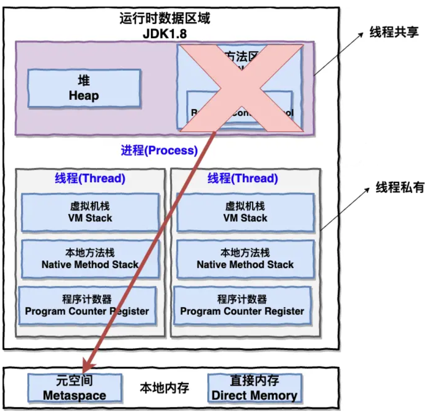

# 操作系统

## 一、操作系统基础:airplane:

> 参考链接：[JavaGuide](https://javaguide.cn/cs-basics/operating-system/operating-system-basic-questions-01.html#%E4%B8%80-%E6%93%8D%E4%BD%9C%E7%B3%BB%E7%BB%9F%E5%9F%BA%E7%A1%80)

### 1.1 什么是操作系统？

- 操作系统（Operating System，简称OS）是**管理计算机硬件与软件资源的程序**，是计算机的基石。
- 操作系统本质上是一个**运行在计算机上的软件程序 ，用于管理计算机硬件和软件资源**。
- **操作系统的存在屏蔽了硬件层的复杂性**。
- **操作系统的内核（Kernel）是操作系统的核心部分**，它负责系统的内存管理、硬件设备的管理、文件系统的管理以及应用程序的管理。内核是**连接应用程序和硬件的桥梁**，决定着系统的性能和稳定性。

### 1.2 系统调用

先来了解一下**用户态**和**系统态**。根据进程访问资源的特点，可以把进程在系统上的运行分为两个级别：

- 用户态（User mode）：用户态运行的进程可以**直接读取用户程序的数据**。
- 系统态（Kernel mode）：系统态运行的进程或程序**几乎可以访问计算机的任何资源**，不受限制。

那么什么是系统调用呢？运行的程序基本都是在用户态，如果调用操作系统提供的系统态级别的子功能就需要**系统调用了**！

也就是说在运行的用户程序中，**凡是与系统态级别的资源有关的操作**（如文件管理、进程控制、内存管理等)都**必须通过系统调用方式向操作系统提出服务请求**，并由操作系统代为完成。

这些系统调用按功能大致可分为如下几类：

- **设备管理**：完成设备的请求或释放，以及设备启动等功能。
- **文件管理**：完成文件的读、写、创建及删除等功能。
- **进程控制**：完成进程的创建、撤销、阻塞及唤醒等功能。
- **进程通信**：完成进程之间的消息传递或信号传递等功能。
- **内存管理**：完成内存的分配、回收以及获取作业占用内存区大小及地址等功能。

## 二、进程和线程:airplane:

> 参考链接：[JavaGuide](https://javaguide.cn/cs-basics/operating-system/operating-system-basic-questions-01.html#%E4%BA%8C-%E8%BF%9B%E7%A8%8B%E5%92%8C%E7%BA%BF%E7%A8%8B)

### 2.1 进程和线程的区别

从JVM的角度来说一下线程和进程之间的关系：

从上图可以看出：一个进程中可以有多个线程，多个线程共享进程的**堆**和**方法区（JDK 1.8之后的元空间）**资源，但是每个线程有自己的**程序计数器**、**虚拟机栈**和**本地方法栈**。

**所以**，**线程是进程划分成的更小的运行单位**，一个进程在其执行的过程中可以产生多个线程。线程和进程最大的不同在于基本上**各进程是独立的，而各线程则不一定**，因为同一进程中的线程极有可能会相互影响。线程执行开销小，但不利于资源的管理和保护；而进程正相反。

### 2.2 进程有哪几种状态？

一般把进程大致分为5种状态：

- **创建状态（New）**：进程正在被创建，尚未到就绪状态。
- **就绪状态（Ready）**：进程**已处于准备运行状态**，即进程获得了除了处理器之外的一切所需资源，一旦得到处理器资源（处理器分配的时间片）即可运行。
- **运行状态（Running）**：进程正在处理器上上运行（单核CPU下任意时刻只有一个进程处于运行状态）。
- **阻塞状态（Waiting）**：又称为等待状态，**进程正在等待某一事件而暂停运行**，如等待某资源为可用或等待IO操作完成。即使处理器空闲，该进程也不能运行。
- **结束状态（Terminated）**：进程正在从系统中消失。可能是进程正常结束或其他原因中断退出运行。