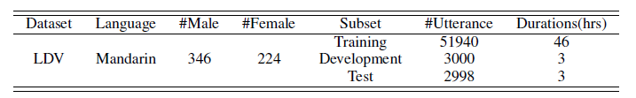
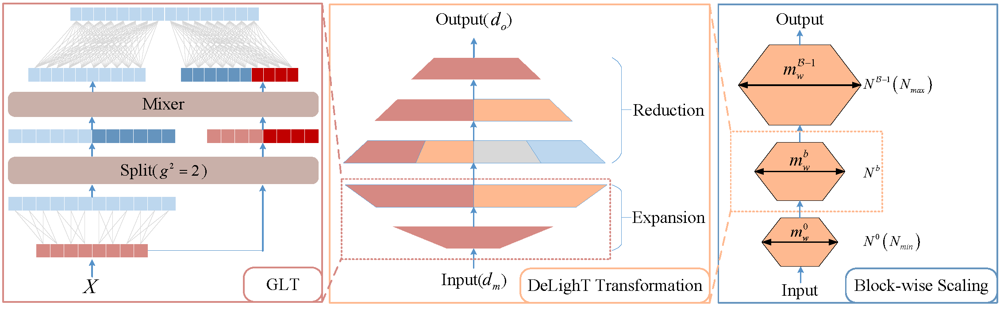
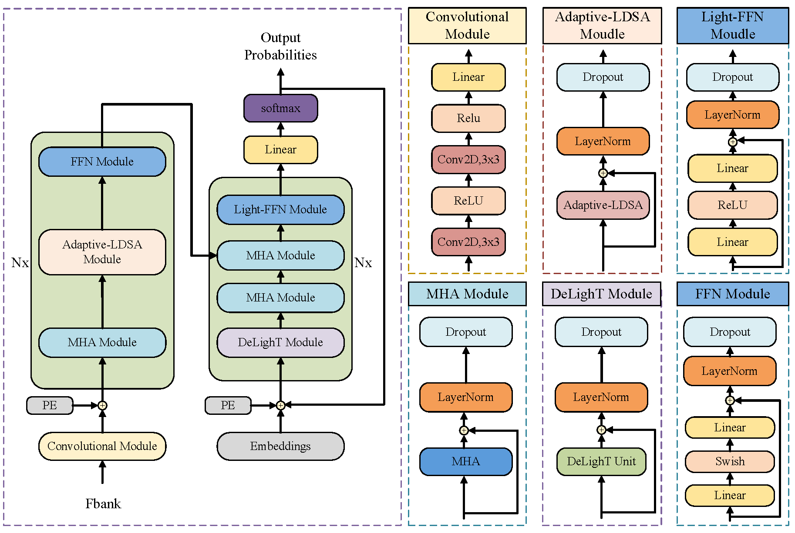
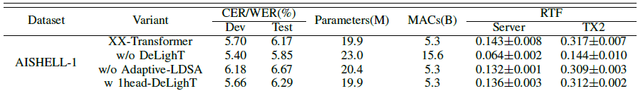

# 测试相关

## 一、软件测试基础

### 1.1 集成测试和系统测试

> 参考链接：[牛客](https://www.nowcoder.com/issue/tutorial?tutorialId=97&uuid=858e7199419042fca5bc596b252ee716#1lltn1)

- **集成测试**：完成单元测试后，各模块联调测试。**集中在各模块的接口是否一致、各模块间的数据流和控制流是否按照设计实现其功能、以及结果的正确性验证等**。
- **系统测试**：**针对整个产品的全面测试**，既包含各模块的**验证性测试**和**功能性测试**，又包括对整个产品的健壮性、安全性、可维护性及各种性能参数的测试。**系统测试要严格按照《需求规格说明书》，以它为标准**。测试方法一般都使用黑盒测试法。

### 1.2 黑盒测试和白盒测试

> 参考链接：[牛客](https://www.nowcoder.com/issue/tutorial?tutorialId=97&uuid=858e7199419042fca5bc596b252ee716#vfe9m6)

- **黑盒测试**：也称功能测试或数据驱动测试，**它是在已知产品所应具有的功能，通过测试来检测每个功能是否都能正常使用**。在测试时，把程序看作一个不能打开的黑盆子，在完全不考虑程序内部结构和内部特性的情况下，测试者在程序接口进行测试，它**只检查程序功能是否按照需求规格说明书的规定正常使用，程序是否能适当地接收输入数锯而产生正确的输出信息，并且保持外部信息（如数据库或文件）的完整性**。“黑盒”法着眼于程序外部结构、不考虑内部逻辑结构、针对软件界面和软件功能进行测试。**黑盒法是穷举输入测试**，只有把所有可能的输入都作为测试情况使用，才能以这种方法查出程序中所有的错误。
  - 常用方法：等价类划分法；边界值分析法；因果图法；场景法；正交实验设计法；判定表驱动分析法；错误推测法；功能图分析法。
- **白盒测试**：也称为结构测试或逻辑驱动测试，**是针对被测单元内部是如何进行工作的测试**。它根据程序的控制结构设计测试用例，主要用于软件或程序验证。**白盒测试法检查程序内部逻辑结构，对所有的逻辑路径进行测试，是一种穷举路径的测试方法，但即使每条路径都测试过了，但仍然有可能存在错误**。因为：穷举路径测试无法检查出程序本身是否违反了设计规范，即程序是否是一个错误的程序；穷举路径测试不可能检查出程序因为遗漏路径而出错；穷举路径测试发现不了一些与数据相关的错误。
  - 常用方法：
    - **静态测试**：**不用运行程序的测试**，包括代码检查、静态结构分析、代码质量度量、文档测试等等，它可以由人工进行，充分发挥人的逻辑思维优势，也可以借助软件工具（Fxcop）自动进行。
    - **动态测试**：**需要执行代码**，通过运行程序找到问题，包括功能确认与接口测试、覆盖率分析、性能分析、内存分析等。
  - 遵循原则：
    - 保证一个模块中的所有独立路径至少被测试一次。
    - 所有逻辑值均需要测试真和假。
    - 检查程序的内部数据结构，保证其结构的有效性。
    - 在上下边界及可操作范围内运行所有循环。

### 1.3 测试和开发应该如何结合？

> 参考链接：[牛客](https://www.nowcoder.com/issue/tutorial?tutorialId=97&uuid=858e7199419042fca5bc596b252ee716#ylc0o7)

测试应该伴随整个软件开发周期，而且测试的对象不仅仅是程序，需求、设计等同样要测试，也就是说，**测试与开发是同步进行的**，这样有利于尽早地、全面地发现问题。例如，需求分析完成后，测试人员就应该参与到对需求的验证和确认活动中，以尽早地找出缺陷所在。同时，对需求的测试也有利于及时了解项目难度和测试风险，及早制定应对措施，这将显著减少总体测试时间，加快项目进度。

### 1.4 测试流程

> 参考链接：[牛客](https://www.nowcoder.com/issue/tutorial?tutorialId=97&uuid=858e7199419042fca5bc596b252ee716#yrjmq8)

测试最规范的过程：需求测试-->概要设计测试-->详细设计测试-->单元测试-->集成测试-->系统测试-->验收测试。

### 1.5 如何设计测试用例？

> 参考链接：[牛客](https://www.nowcoder.com/issue/tutorial?tutorialId=97&uuid=858e7199419042fca5bc596b252ee716#hlrcn9)

1. 尽早介入，彻底理解清楚需求，这个是写好测试用例的基础；
2. 如果以前有类似的需求，可以参考类似需求的测试用例，然后还需要看类似需求的bug情况；
3. 清楚输入、输出的各种可能性，以及各种输入的之间的关联关系，理解清楚需求的执行逻辑，通过等价类、边界值、判定表等方法找出大部分用例；
4. 找到需求相关的一些特性，补充测试用例；
5. 根据自己的经验分析遗漏的测试场景。

### 1.6 测试项目的具体工作

> 参考链接：[牛客](https://www.nowcoder.com/issue/tutorial?tutorialId=97&uuid=858e7199419042fca5bc596b252ee716#4jb7jq)

1. 搭建测试环境；
2. 撰写测试用例；
3. 执行测试用例；
4. 写测试计划，测试报告；
5. 测试，并提交bug表单；
6. 跟踪bug修改情况；
7. 执行自动化测试，编写脚本，执行，分析，报告；
8. 进行性能测试，压力测试等其他测试，执行，分析，调优，报告。

## 二、常见场景题

### 2.1 “电商支付功能”的测试

> 参考链接：[测试派](http://testingpai.com/article/1612516533153)

总体测试思维：

1. **梳理产品的核心业务流程**，即明白这是个什么项目、实现了什么业务以及是怎么实现的？**一般是参考公司的需求文档**。

2. **根据流程进行模块细分**，然后针对每个功能模块进行详细的测试点设计和提取。这个单个功能的测试点提取要覆盖两个方面：

   - **正常功能验证**：**优先覆盖正常的业务流程和功能验证，这其实也是单个功能的冒烟测试**。冒烟测试先行，如果不通过，可以直接停止测试等开发修复后继续测试。
   - **异常功能验证**：为了更加贴近用户的使用场景，也需要验证各种异常场景，故意操作导致出错，检查系统的反馈和提示，保证用户操作失误的情况能够得到系统的友好指示。

   因为有很多地方的操作都有可能会导致系统异常和抛错，所以为了不漏测，需要找出所有可能导致异常的输入项和选项，所以就到了第三步。

3. **针对具体功能，寻找每个输入项和步骤，从以下三个角度来分析测试点**：

   - 长度、数据类型、必填项。
   - 需求的约束条件/隐形需求。
   - 功能之间的交互。

4. **考虑非功能测试点**，包括界面、易用性、兼容性、安全性、性能压力。

**基于上述测试思路，可以分析得出“支付功能”测试点**：

- **梳理支付的业务流程**：**点击支付-->选择支付方式-->确认金额-->输入密码-->成功支付**。完成这个流程测试，也就是完成了项目的冒烟测试。**需要测试针对流程中的每个阶段和步骤，具体分析可能导致异常的测试点**，所以按阶段和输入项来进行划分：
  1. **点击支付**，提交订单但是取消了，**检查是否可以取消成功**。
  2. **选择支付方式**：
     - **正常**：可以支持的支付方式有：信用卡、储蓄卡、网银支付、余额、第三方支付（微信、支付宝等）以及代付等，验证是否支持并且可以正常选择、支付。
     - **异常**：没有绑定任何支付方式时，支付报错。
     - **功能交互**：支付时结合优惠券/折扣券/促销价抵扣进行相关的抵扣，验证规则是否正确，并且是否可以正常抵扣和支付。
  3. **确认支付金额**：
     - **正常**：正常金额里用**边界值法**去测试：
       - 最大支付金额（单日最大、单笔最大、余额最大）。
       - 最小支付金额。
     - **异常**：同样也用**边界值方法**提取测试点：
       - 超过支付方式单日最大消费金额/单笔最大/余额最大。
       - 异常金额支付：非数字、负数、0、小数点超过2位等。
  4. **支付密码**：
     - **正常**：可以支持的支付密码类型有：指纹、人脸识别、账号密码和小额免密等，确认自己的产品所支持的密码类型，测试是否可以验证并支付成功。
     - **异常**：输入错误的密码，检查有无正确的提示信息；超过密码错误上限，检查是否冻结。
  5. **其他场景测试点**：
     - 多笔订单合并支付，是否可以成功。
     - 重复点击支付按钮，是否会出现多次购买，并同步检查数据库的数据帐账目正确。
     - 支付中断：
       - 主动中断：可以继续支付并成功。
       - 被动中断：比如电话、低电量、闹钟、断网、切换后台、耳机插拔等，验证是否可以继续支付。
     - 网络测试：
       - 验证各种网络类型：2G、3G、4G、5G和WIFI下都是否可以正常支付。
       - 进行网络切换，支付功能是否正常。
     - 使用一些抓包工具篡改价格：是否不允许抓包或者数据加密。
- **退款流程**：
  - **正常**：验证正常的退款流程，也就是冒烟测试：
    - 点击退款是否可以退款成功，并且检查交易状态是否是退款，以及退款金额是否可以到账。
    - 结合优惠券等抵扣，检查退款的金额是否正确。
    - 同步检查数据库的数据和账目是否对应。
  - **异常**：提交错误退款（退款订单号不对），或者退款金额错误，都是否会退款失败。
- **非功能测试点**：
  - **界面**：验证界面的美观，排版和错别字等。
  - **兼容性**：
    - **B/S**：如果是B/S架构的产品，需要测试跟浏览器的兼容性。所以就需要根据浏览器的内核，选择一些主流的浏览器进行测试。
    - **C/S**：如果是C/S架构的产品，测试手机移动端的兼容，比如手机型号、系统版本和屏幕大小及分辨率等。
  - **易用性**：测试站在用户的角度考虑用户体验，使用是否方便等。
  - **性能**：比如考虑多用户支付、长时间运行等，关注产品的响应时间等，一般需要借助工具或者代码进行测试。
  - **安全**：验证敏感信息是否加密，是否可以篡改；通过一些工具进行安全扫描，检查是否有安全漏洞；或者采用一些其他的手段进行专门的安全测试。

## 三、项目测试

### 3.1 数据集相关

### 3.2 模块内测试：以语音识别为例

- 测试数据来源：数据集测试集和真实环境录音音频。
- 测试方法：类黑盒测试方法（比较符合神经网络的黑盒特性），**只检查模块是否能正确地接收数据、输出结果**。
- 自行测试流程：
  1. 基于Pytorch框架编写测试脚本，以测试集和真实环境录音音频混合作为模块的输入（二者主要参数一致，例如采样率16000kHz、录音通道数为1等）；
  2. 将输入、音频对应的语句（Target）和实际输出的语句（Prediction）记录在测试日志里，统计计算准确率（WER/CER）以及其他反应性能的参数（Parameters、RTF等），**标记Target和Prediction不对应的记录行**；
  3. 依托于具体的应用场景，对这些反应模块性能的参数进行详细分析后，考虑从两个方面进行优化：
     - **模型参数量方面**：由于Transformer模型自身的结构堆叠性，导致模型参数量较大，考虑到最终需要将模块集成在车载嵌入式平台上，所以需要对模型参数量进行一定程度的优化。参照一些相关研究，**在Decoder里引入DeLighT块**，使用残差分组线性变换方法，设计含有扩张和缩放操作的缩放单元，建立逐块缩放机制并将缩放单元放置于Decoder自注意力模块前，最后耦合词嵌入层（Embedding Layer）和前馈网络（Feedforward Network, FFN），实现模型参数量的降低。**最后重复上述测试流程，结果显示Parameters已从23.4M降低到19.9M**。
     - **预测准确率方面**：由于神经网络不可能“学习”到所有样本的特征，且在引入DeLighT块之后的测试结果也显示准确率方面有所下降，可能会不符合最终的产品需求文档，所以需要对预测准确率进行一定程度的优化。参照一些相关研究，**在Encoder里引入局部自注意力机制，并在其基础上自行设计自适应算法，使得注意力范围能动态调整**，实现模型准确率的提升。最**后重复上述测试流程，结果显示WER/CER已从6.67%变为6.17%**。
  4. 在上述测试优化过程中，还存在一些**输入源头的问题**：例如，自行录制的音频有时会导致输出结果偏差较大。具体分析音频发现，音频内部存在较多、较长时间的空白段（白噪音段）。针对这种情况的处理：**在模块前增加前置规整模块，将音频进行VAD（端点检测）处理，尽可能地删除空白段，保留有效信息**。

### 3.3 模块间测试（集成测试）：语音识别—对话系统—语音合成

- 测试数据来源：数据集测试集和真实环境录音音频。
- 验证目标：**集中在各模块的接口是否一致、各模块间的数据流和控制流是否按照设计实现其功能、以及结果的正确性验证等**。
- 发现的问题及解决措施：
  - **接口一致性问题**：以对话系统—语音合成之间的接口为例，**在测试中发现对话系统的输出数据格式、类型和语音合成的输入数据不对应**，这样就需要根据测试日志对应到具体的测试用例，定位到具体的代码段进行debug。

### 3.4 系统测试（验收测试）

- 测试人员：公司验收部门的专业测试人员。
- 验证目标：针对整个产品的全面测试，严格按照《需求规格说明书》。
- 测试流程：
  1. 验收部门随机挑选10名公司员工作为测试志愿者，**在驾驶室根据需求书逐一验证功能**；
  2. 测试人员在旁记录整个过程中ARHUD对话系统的输入和输出，并计算准确率和响应时间。
- 发现的问题及解决措施：
  - **线程问题**：由于语音合成模块不仅接收来自对话系统的输出，还需要接收ARHUD中其他功能模块的输出（例如疲劳检测的报警信息），**所以一旦接收到报警信息后需要立即给出响应，即播报警告**。此时如果音频录制模块继续录入，就会影响语音的录制质量，进而影响系统做出预测的准确率；同时对话系统的输出也需要“让位”给其他报警信息的输出。
    - **解决措施**：**使用多线程，将语音合成模块单独创建线程运行，同时设置全局锁（Flag），只有报警信息能更改Flag**，这样就可以实现报警信息的优先播报（无论正常的播报是否在进行中）。
  - **输入问题**：由于语音识别是系统的第一个重要模块，语音识别的预测正确与否很大程度依赖于输入音频的质量，**而汽车运行过程中产生的噪声来源比较复杂**，包括车内噪声和车外噪声，所以需要对录音源头进行优化。
    - **解决措施**：除了设计去噪算法外，还与相关公司进行合作，引入去噪麦克风，后续测试显示含噪音频占比减少了30%。

