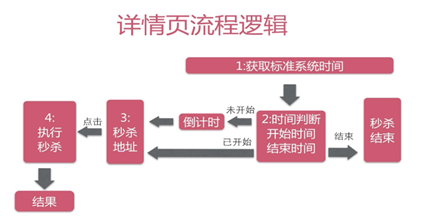

# 电商秒杀系统

## 概述

### 发现问题

- 高并发。
- 超卖。
- 恶意请求。
- 地址暴露。
- 数据库压力。

### 解决方案

- 单一职责：现在设计思想都是**先微服务，再分布式**的方式。例如：下单有订单服务，用户登录管理有用户服务。所以可以**把秒杀的代码业务逻辑放一起，单独建立数据库（秒杀库）**。单一职责的好处就是即使秒杀这一块的服务没抗住（秒杀库崩了，服务挂了），也不会影响到其他的服务。
- 地址加密：如果链接地址提前暴露，可能会出现提前秒杀的情况。那是否可以做时间校验呢？如果知道了链接地址，就算有时间校验，**通过程序不断获取最新时间，可以在秒杀开始的一瞬间就发送N次请求**，用户根本就没有秒到的机会。**如何避免**？把**链接地址动态化**，通过MD5之类的加密算法加密随机的字符串生成链接地址，然后通过**前端代码获取链接地址经过后台校验**才能通过。
- Redis集群（未实现）：**开启主从复制**、**读写分离**，引入**哨兵机制**，开启**持久化**。
- Nginx（未实现）：**高性能的web服务器**。
- 恶意请求拦截：可以给重复访问的用户**限制访问次数或时间**。
- 资源静态化：秒杀一般都有特定的页面展示模板。前后端分离下，把能提前放入**CDN服务器**的东西都放进去，减少真正秒杀时候服务器的压力。
- 按钮控制：一般是**置灰**。需要前端配合，定时去请求后端服务器，获取最新的北京时间，到时间点再给按钮置为**可用状态**。
- 限流：**前端限流**和**后端限流**。**前端限流**：按钮一般**不能高密度地连续点击**（例如：连续点击三下后必须等待1秒才可以继续点击），这也是保护服务器的一种手段，或者是**点击按钮配合验证码验证**；**后端限流：**一旦库存产品卖完，**后端返回`false`，前端直接结束秒杀，同时后端也关闭后续的无效请求介入**。
- 库存预热：**秒杀的本质，就是对库存的抢夺**。在开始秒杀前**把商品的库存加载到Redis中**，让整个流程都在Redis里面去完成，等秒杀结束再异步修改库存。但使用Redis之后存在**缓存一致性**的问题，尤其是在高并发的场景下。
  - Lua脚本：**Lua脚本可以保证原子性**。可以把判断库存、扣减库存的操作都写在一个Lua脚本里，然后在Redis里面执行。
- 限流&降级&熔断：**限流**：对接口访问进行**限制**；**降级**：通过开关配置**将某些不重要的业务功能屏蔽**掉，以提高服务处理能力；**熔断**：在服务的依赖调用中，被调用方出现故障时，出于自我保护的目的，**调用方会主动停止调用，并根据业务需要进行相应处理**。

## V1

技术栈：SSM+Redis

### 流程设计

#### 业务分析

系统业务流程如下：


整个系统其实是针对**库存**做的系统。用户成功秒杀商品，对于系统的操作就是：

1. 减库存；
2. 记录用户的购买明细。

用户对库存的业务分析：


记录用户的秒杀成功信息，我们需要记录：

- 谁购买成功了。
- 购买成功的时间有效期

这些数据组成了用户的秒杀成功信息，也就是用户的购买行为。**将减库存、记录购买明细、下订单**设计成事务。**为什么系统需要事务**？

- 若是用户成功秒杀，记录了购买明细但没有减库存，会导致商品**超卖**。
- 若是用户成功秒杀，减了库存却没有记录购买明细，会导致商品**少卖**。

MySQL内置的事务机制可以准确地完成减库存和记录用户购买明细的过程。

#### 难点分析

当用户A秒杀id为10的商品时，此时MySQL需要进行的操作是：

1. 开启事务；
2. 更新商品的库存信息；
3. 添加用户的购买明细，包括用户秒杀的商品id以及唯一标识用户身份的信息（如电话号码）；
4. 提交事务。

若此时有另一个用户B也在秒杀这件id为10的商品，他就需要**等待**至MySQL成功提交了事务才能拿到这个id为10的商品的锁从而进行秒杀，而同一时间是不可能只有用户B在等待，肯定是有很多很多的用户都在等待**竞争行级锁**。秒杀的难点就在这里，如何高效的处理这些竞争？如何高效的完成事务？

#### 功能实现

实现秒杀的一些功能：

- 秒杀接口展示。
- 执行秒杀的操作。
- 相关查询：比如说列表查询，详情页查询。

#### 数据库设计

秒杀商品表


秒杀订单表


在秒杀订单表中`seckill_id`和`user_phone`是**联合主键**，当重复秒杀的时候，加入`ignore`防止报错，只是会返回0，表示重复秒杀：

```mysql
INSERT ignore INTO #{tableName} (seckill_id, user_phone, state)
VALUES (#{seckillId}, #{userPhone}, 0)
```

#### DAO层设计

秒杀商品表的DAO：减库存、由id查询商品、由偏移量查询商品，

秒杀订单表的DAO：插入购买明细、根据商品id查询订单明细。

#### Service设计

##### 展示秒杀接口类

```java
public class Exposer {
    //是否开启秒杀
    private boolean exposed;
    //加密措施
    private String md5;
    private long seckillId;
    //系统当前时间(毫秒)
    private long now;
    //秒杀的开启时间
    private long start;
    //秒杀的结束时间
    private long end;
}
```

##### 封装执行秒杀后的结果（是否秒杀成功）

```java
public class SeckillExecution {
    private long seckillId;
    //秒杀执行结果的状态
    private int state;
    //状态的明文标识
    private String stateInfo;
    //当秒杀成功时，需要传递秒杀成功的对象回去
    private SuccessKilled successKilled;
}
```

##### 秒杀开始时展示地址

```java
public Exposer exportSeckillUrl(long seckillId) {
        //缓存优化
        Seckill seckill = getById(seckillId);
        // 秒杀的开始时间和结束时间
        Date startTime = seckill.getStartTime();
        Date endTime = seckill.getEndTime();
        //系统当前时间
        Date nowTime = new Date();
        //若是秒杀未开启
        if (startTime.getTime() > nowTime.getTime() || endTime.getTime() < nowTime.getTime()) {
            return new Exposer(false, seckillId, nowTime.getTime(), startTime.getTime(), endTime.getTime());
        }
        //秒杀开启，返回秒杀商品的id、用给接口加密的md5
        String md5 = getMD5(seckillId);
        return new Exposer(true, md5, seckillId);
}
```

控制用户在到达秒杀时间前不能获取秒杀地址，只返回**秒杀的开始时间和结束时间**。当到达秒杀时间时，返回秒杀地址，即**商品id以及根据商品id和Salt加密的MD5**，前端根据商品id和MD5才能执行秒杀（与后端的商品id和MD5进行验证，验证通过后才能执行秒杀）。假如用户在秒杀开始前猜测到秒杀地址去请求秒杀，也是不会成功的，因为无法拿到需要验证的MD5。**这里的MD5相当于是用户进行秒杀的凭证**。

**为什么要进行MD5加密**？

用MD5加密的方式对秒杀地址（商品id）进行加密，暴露给前端用户。当用户执行秒杀的时候传递商品id和MD5，程序拿着商品id根据设置的盐值计算MD5，**如果与传递的MD5不一致，则表示地址被篡改了**。 

**为什么要进行秒杀接口暴露的控制或者说进行秒杀接口的隐藏**？

如果提前知道秒杀接口，通过填入参数和地址来实现自动秒杀，这对于其他用户来说是不公平的。

##### 秒杀时

```java
//秒杀是否成功，成功: 增加明细，减库存；失败:抛出异常，事务回滚
@Transactional
public SeckillExecution executeSeckill(long seckillId, long userPhone, String md5)  throws SeckillException, RepeatKillException, SeckillCloseException {
    if (md5 == null || !md5.equals(getMD5(seckillId))) {
        //秒杀数据被重写了
        throw new SeckillException("seckill data rewrite");
    }
    //执行秒杀逻辑:增加购买明细+减库存
    Date nowTime = new Date();
    try {
        //先增加明细，然后再执行减库存的操作
        int insertCount = successKilledDao.insertSuccessKilled(seckillId, userPhone);
        //看是否该明细被重复插入，即用户是否重复秒杀
        if (insertCount <= 0) {
            throw new RepeatKillException("seckill repeated");
        } else {
            //减库存,热点商品竞争
            int updateCount = seckillDao.reduceNumber(seckillId, nowTime);
            if (updateCount <= 0) {
                //没有更新库存记录，说明秒杀结束或者是已经卖完 rollback
                throw new SeckillCloseException("seckill is closed");
            } else {
                //秒杀成功,得到成功插入的明细记录,并返回成功秒杀的信息 commit
                SuccessKilled successKilled = successKilledDao.queryByIdWithSeckill(seckillId, userPhone);
                return new SeckillExecution(seckillId, SeckillStatEnum.SUCCESS, successKilled);
            }
        }
    } catch (SeckillCloseException e1) {
        throw e1;
    } catch (RepeatKillException e2) {
        throw e2;
    } catch (Exception e) {
        logger.error(e.getMessage(), e);
        //所以编译期异常转化为运行期异常
        throw new SeckillException("seckill inner error :" + e.getMessage());
    }
}
```


首先检查用户是否已经登录，如果没有返回没有登录的错误信息；接着执行秒杀，首先验证md5，看地址是否被篡改。先增加明细（为什么要先增加明细见后面优化的过程），看是否该明细被重复插入，即用户是否重复秒杀，如果是，抛异常。然后减库存，因为sql在减库存的时候判断了当前时间和秒杀时间是否对应，如果数据库update返回0没有更新库存记录，说明秒杀结束；或者是库存已经没有主动抛出错误rollback。（前面在获取秒杀地址的时候已经挡住了秒杀关闭的请求（没到时间或者时间已过），然后从获取到秒杀地址到执行秒杀还可能会在这段时间秒杀结束）

最后秒杀成功，得到购买明细信息，接着commit。

#### Web设计

交互流程：



### 流程优化

红色表示可能受高并发影响的部分，绿色表示无影响：


#### 详情页缓存

**通过CDN缓存静态资源来抵抗峰值**。详情页静态资源是部署在CDN节点中，也就是说访问静态资源或者详情页是不用访问系统的。


#### 秒杀地址接口缓存

原本查询秒杀商品时是通过主键直接去数据库查询的，选择将数据缓存在Redis，在查询秒杀商品时先去Redis缓存中查询，以此降低数据库的压力。如果在缓存中查询不到数据再去数据库中查询，再将查询到的数据放入Redis缓存中，这样下次就可以直接去缓存中直接查询到。


#### 秒杀操作优化

##### 简单优化


将原本先`update`（减库存）再`insert`（插入购买明细）的步骤改成：先`insert`再`update`。**为什么**？首先是在**更新操作的时候给行加锁，插入并不会加锁**。如果更新操作在前，那么就需要执行完更新和插入以后事务提交或回滚才释放锁；而如果插入在前，更新在后，那么只有在更新时才会加行锁，之后在更新完以后事务提交或回滚释放锁。在这里，**插入是可以并行的，而更新由于会加行级锁所以是串行的**。

先`insert`并不是忽略了库存不足的情况，而是因为`insert`和`update`是在同一个事务里，所以并不会造成秒杀成功记录的过量插入。

##### 深度优化

**客户端逻辑事务SQL在MYSQL端执行，完全屏蔽网络延迟和GC，MYSQL只需告诉最终结果。**

- 修改MySQL源码：当执行完`update`之后，它会自动做回滚，回滚的条件影响的记录数是1，就会`commit`；如果是0就会`rollback`，**不由Java客户端来控制`commit`或者`rollback`，不给Java客户端和MySQL之间通信的网络延迟**，本质上减低了网络延迟或者GC的干扰，但是这个成本较高，只有大公司能做。

- 可以将执行秒杀操作时的`insert`和`update`放到MySQL服务端的**存储过程**里，而Java客户端直接调用这个存储过程，这样就可以**避免网络延迟和可能发生的GC影响**。另外，由于使用了存储过程，也就使用不到Spring的事务管理了，因为在存储过程里会直接启用一个事务。

## V2

技术栈：SpringBoot+MyBatis+Redis+RabbitMQ

### 流程设计


### 流程优化