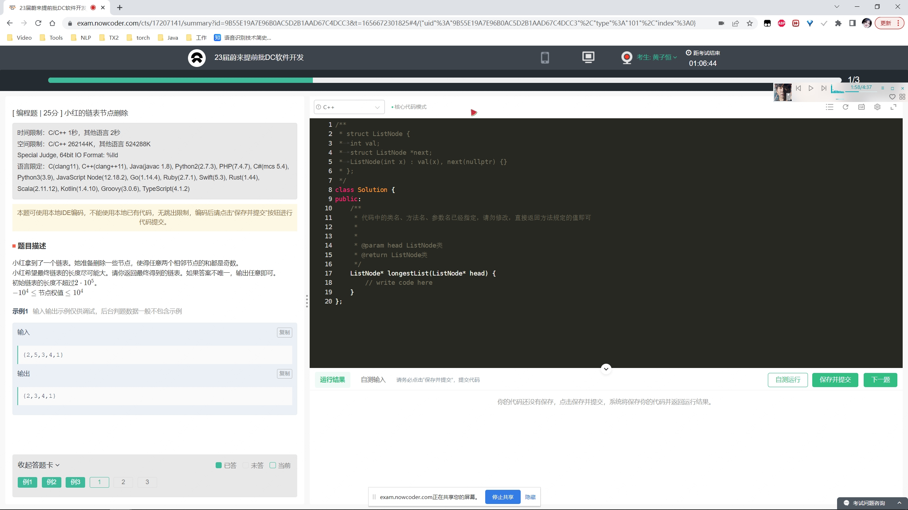
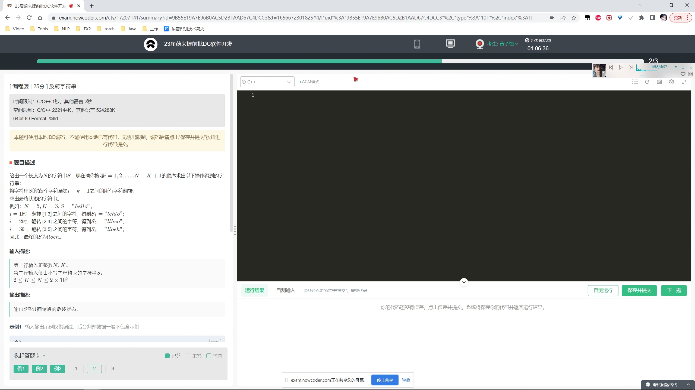
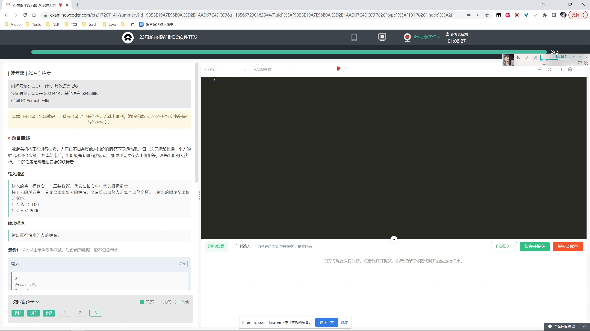

# 笔试整理

## 2022-07-01 蔚来

### 删除链表结点，使得相邻结点值的和不为偶数



```java
public class Solution {
    public ListNode longestList (ListNode head) {
        // 特殊情况处理
        if (head.next == null) {
            return head;
        }
        // 定义结点指向head
        ListNode temp = head;
        // 遍历链表
        while (temp != null && temp.next != null) {
            // 判断和是否为偶数
            while (temp.next != null && (temp.val + temp.next.val) % 2 == 0) {
                temp.next = temp.next.next;
            }
            temp = temp.next;
        }
        return head;
    }
}
```

### 输入N，K，S，反转字符串



```java
import java.util.*;

public class Solution {
    public static void main(String[] args) {
        // 定义Scanner类
        Scanner scanner = new Scanner(System.in);
        // 读取N和K
        String info = scanner.nextLine();
        int n = Integer.parseInt(info.split(" ")[0]);
        int k = Integer.parseInt(info.split(" ")[1]);
        // 读取字符串
        String s = scanner.nextLine();
        System.out.println(reverse(n, k, s));
    }

    public static String reverse(int n, int k, String s) {
        // 定义返回结果
        StringBuilder ans = new StringBuilder();
        // 获取字符串长度
        int length = s.length();
        // 从第k个字符往后直接挪到前面无变化
        for (int i = k - 1; i < length; i++) {
            ans.append(s.charAt(i));
        }
        // 重点在于前k-1个字符反转了多少次
        int number = n - k + 1;
        // 前k-1子串
        StringBuilder temp = new StringBuilder(s.substring(0, k - 1));
        // 如果number为偶数，则没有变化
        if (number % 2 == 0) {
            ans.append(temp);
        } else {
            ans.append(temp.reverse());
        }
        return ans.toString();
    }
}
```

### 拍卖出价，读取输入值判断获标者姓名并输出



```java
import java.util.*;

public class Solution {
    public static void main(String[] args) {
        // 定义Scanner类
        Scanner scanner = new Scanner(System.in);
        // 定义最大出价
        int maxPrice = 0;
        // 定义最大出价人
        String maxPerson = "";
        // 迭代检测
        while (scanner.hasNext()) {
            // 读取出价人数
            int number = Integer.parseInt(scanner.nextLine());
            // 循环读取出价信息
            while (number > 0) {
                String info = scanner.nextLine();
                // 出价人
                String person = info.split(" ")[0];
                // 出价
                int price = Integer.parseInt(info.split(" ")[1]);
                // 更新最大信息
                if (price > maxPrice) {
                    maxPerson = person;
                    maxPrice = price;
                }
                --number;
            }
            System.out.println(maxPerson);
        }
    }
}
```

