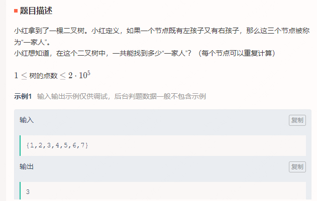
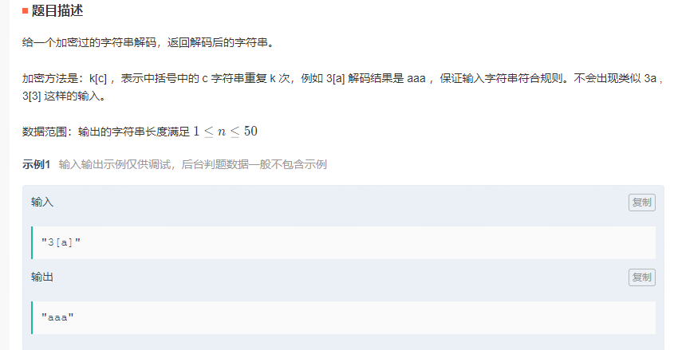
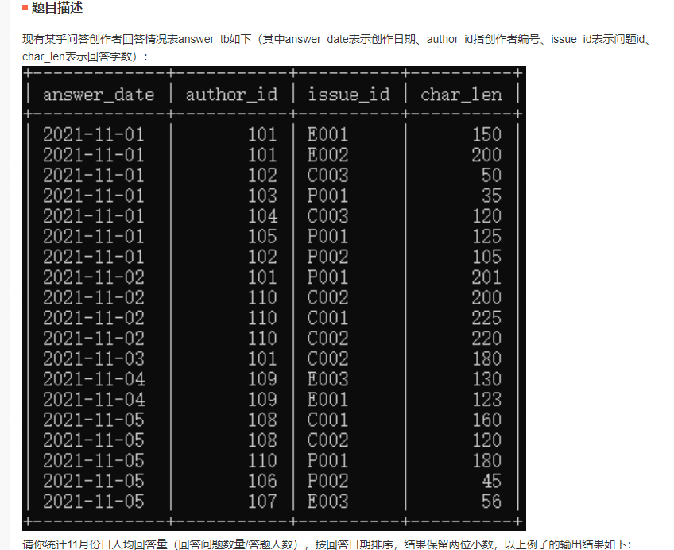
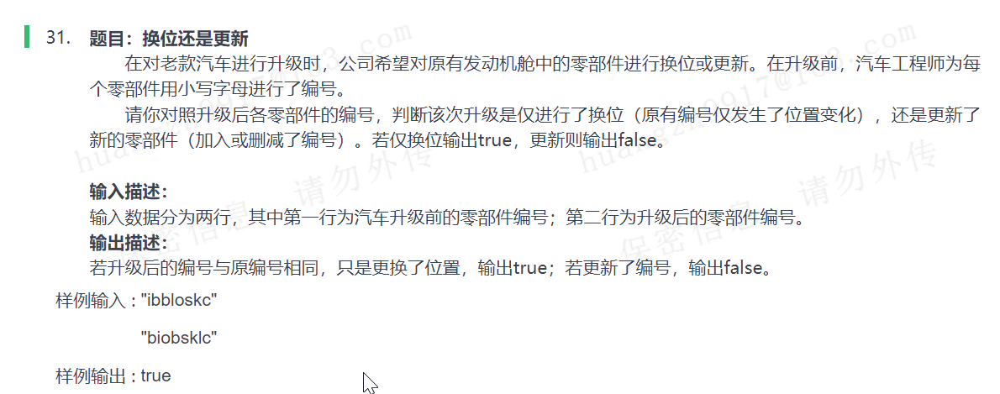
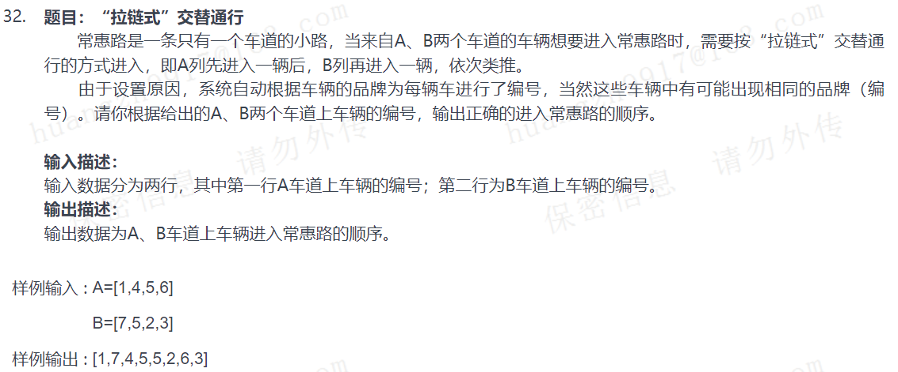

# 笔试整理

## 2022-07-01 蔚来

### 删除链表结点，使得相邻结点值的和不为偶数


```java
public class Solution {
    public ListNode longestList (ListNode head) {
        // 特殊情况处理
        if (head.next == null) {
            return head;
        }
        // 定义结点指向head
        ListNode temp = head;
        // 遍历链表
        while (temp != null && temp.next != null) {
            // 判断和是否为偶数
            while (temp.next != null && (temp.val + temp.next.val) % 2 == 0) {
                temp.next = temp.next.next;
            }
            temp = temp.next;
        }
        return head;
    }
}
```

### 输入N，K，S，迭代反转字符串


```java
import java.util.*;

public class Solution {
    public static void main(String[] args) {
        // 定义Scanner类
        Scanner scanner = new Scanner(System.in);
        // 读取N和K
        String info = scanner.nextLine();
        int n = Integer.parseInt(info.split(" ")[0]);
        int k = Integer.parseInt(info.split(" ")[1]);
        // 读取字符串
        String s = scanner.nextLine();
        System.out.println(reverse(n, k, s));
    }

    public static String reverse(int n, int k, String s) {
        // 定义返回结果
        StringBuilder ans = new StringBuilder();
        // 获取字符串长度
        int length = s.length();
        // 从第k个字符往后直接挪到前面无变化
        for (int i = k - 1; i < length; i++) {
            ans.append(s.charAt(i));
        }
        // 重点在于前k-1个字符反转了多少次
        int number = n - k + 1;
        // 前k-1子串
        StringBuilder temp = new StringBuilder(s.substring(0, k - 1));
        // 如果number为偶数，则没有变化
        if (number % 2 == 0) {
            ans.append(temp);
        } else {
            ans.append(temp.reverse());
        }
        return ans.toString();
    }
}
```

### 拍卖出价，读取输入值判断获标者姓名并输出


```java
import java.util.*;

public class Solution {
    public static void main(String[] args) {
        // 定义Scanner类
        Scanner scanner = new Scanner(System.in);
        // 定义最大出价
        int maxPrice = 0;
        // 定义最大出价人
        String maxPerson = "";
        // 迭代检测
        while (scanner.hasNext()) {
            // 读取出价人数
            int number = Integer.parseInt(scanner.nextLine());
            // 循环读取出价信息
            while (number > 0) {
                String info = scanner.nextLine();
                // 出价人
                String person = info.split(" ")[0];
                // 出价
                int price = Integer.parseInt(info.split(" ")[1]);
                // 更新最大信息
                if (price > maxPrice) {
                    maxPerson = person;
                    maxPrice = price;
                }
                --number;
            }
            System.out.println(maxPerson);
        }
    }
}
```

## 2022-07-03 蔚来

### 计算完全二叉树的“一家人”个数（“一家人”指父、左、右）



```java
public class Solution {
    int ans;
    
    public int maxSum(TreeNode root) {
        // 前序遍历
        preOrder(root);
        return this.ans;
    }

    public void preOrder(TreeNode root) {
        // 遍历结束条件
        if (root == null) {
            return;
        }
        // 当左右孩子都有时，ans+1
        if (root.left != null && root.right != null) {
            ++this.ans;
        }
        preOrder(root.left);
        preOrder(root.right);
    }
}
```

### 6根筷子能否组成2个三角形？


```java
import java.util.*

public class Main {
    public static void main(String[] args) {
        // 定义Scanner类
        Scanner sc = new Scanner(System.in);
        // 读取t
        int t = sc.nextInt();
        // 构造数组
        int[] a = new int[6];
        for (int i = 0; i < t; i++) {
            // 读进数组
            for (int j = 0; j < 6; j++) {
                a[j] = sc.nextInt();
            }
            // 排序
            Arrays.sort(a);
            // 逻辑判断
            if (a[0] + a[1] > a[2] && a[3] + a[4] > a[5] || 
                a[0] + a[2] > a[3] && a[1] + a[4] > a[5] || 
                a[0] + a[3] > a[4] && a[1] + a[2] > a[5] || 
                a[0] + a[4] > a[5] && a[1] + a[2] > a[3]) {
                System.out.println("Yes");
            } else {
                System.out.println("No");
            }
        }
    }
}
```

### 牛牛坐电梯


```java
public class Main {
    public static void main(String[] args) {
        // 定义Scanner类
        Scanner in = new Scanner(System.in);
        // 读取N
        int n = Integer.parseInt(in.nextLine());
        // 定义两个电梯的运行时间
        int lift1 = 0;
        int lift2 = 0;
        // 遍历
        for(int i = 0; i < n; ++i) {
            int a = in.nextInt();
            // 哪部电梯先回来，就上哪一部
            if(lift1 <= lift2) {
                lift1 += a;
            } else {
                lift2 += a;
            }
        }
        // 最小值
        int ans = Math.max(lift1, lift2);
        System.out.println(ans);
    }
}
```

## 2022-07-07 SHEIN

### 字符串解码，LeetCode394题



```java
public class Solution {
    // 成员变量源字符串和指针
    String src;
    int ptr;

    public String decodeString(String s) {
        src = s;
        ptr = 0;
        return getString();
    }

    public String getString() {
        // 特殊情况处理，源字符串长度为0或者以]开始，直接返回""
        if (ptr == src.length() || src.charAt(ptr) == ']') {
            return "";
        }

        // 当前字符
        char cur = src.charAt(ptr);
        // 重复次数
        int repTime = 1;
        // 返回结果
        String ret = "";

        // 判断是否为数字
        if (Character.isDigit(cur)) {
            // 解析数字
            repTime = getDigits(); 
            // 过滤左括号
            ++ptr;
            // 递归
            String str = getString(); 
            // 过滤右括号
            ++ptr;
            // 重复的字符
            while (repTime > 0) {
                ret += str;
                --repTime;
            }
        } else if (Character.isLetter(cur)) {
            // 如果是字母，直接返回
            ret = String.valueOf(src.charAt(ptr++));
        }
        return ret + getString();
    }

    // 解析数字
    public int getDigits() {
        int ret = 0;
        // 可能有2位及以上，需要迭代计算
        while (ptr < src.length() && Character.isDigit(src.charAt(ptr))) {
            ret = ret * 10 + src.charAt(ptr) - '0';
            ++ptr;
        }
        return ret;
    }
}
```

### MySQL题，取数字计算（保留精度）并排序



```mysql
SELECT answer_date, ROUND (COUNT(issue_id) / COUNT(distinct author_id), 2) as per_num
FROM answer_tb
GROUP BY answer_date
ORDER BY answer_date
```

## 2022-07-08 福特中国

### 判断两个字符串是否相似（相似表示长度一致、字符可以乱序但是种类个数必须相等）



```java
import java.util.*;

public class Solution {
    public static void main(String[] args) {
        // 定义Sacnner类
        Scanner scanner = new Scanner(System.in);
        // 读取输入的两行数据
        String before = scanner.nextLine();
        String after = scanner.nextLine();
        // 判断是否相等
        System.out.println(transform(before).equals(transform(after)));
    }
    
    public static String transform(String myString) {
        // 字符串转字符数组
        char[] chars = myString.toCharArray();
        // 数组排序
        Arrays.sort(chars);
        // 数组转字符串
        String newString = new String(chars);
        return newString;
    }
}
```


### 两个List按元素组合（交叉）成一个新的List



```java
import java.util.*;

public class Solution {
    public static void main(String[] args) {
        // 定义Sacnner类
        Scanner scanner = new Scanner(System.in);
        // 读取两行字符串
        String channelA = scanner.nextLine();
        String channelB = scanner.nextLine();
        // 截取字符串并分割
        String[] numsA = channelA.substring(3, channelA.length() - 1).split(",");
        String[] numsB = channelB.substring(3, channelB.length() - 1).split(",");
        // 获取数组长度
        int lengthA = numsA.length;
        int lengthB = numsB.length;
        // 定义双指针
        int i = 0;
        int j = 0;
        // 定义存储列表
        List<String> sites = new LinkedList<>();
        // 遍历两个字符串数组
        while (i < lengthA && j < lengthB) {
            // 交叉放入
            sites.add(numsA[i]);
            sites.add(numsB[j]);
            ++i;
            ++j;
        }
        // 如果某个数组比较长，直接接到ans末尾
        while (i < lengthA) {
            sites.add(numsA[i]);
            ++i;
        }
        while (j < lengthB) {
            sites.add(numsB[j]);
            ++j;
        }
        // 列表元素组合成字符串返回
        String ans = "[" + String.join(",", sites) + "]";
        System.out.println(ans);
    }
}
```

