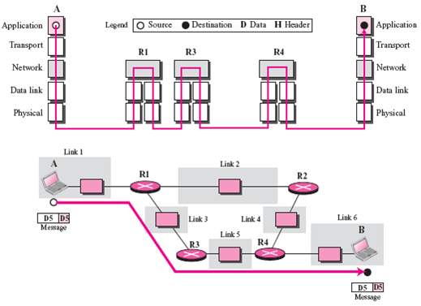
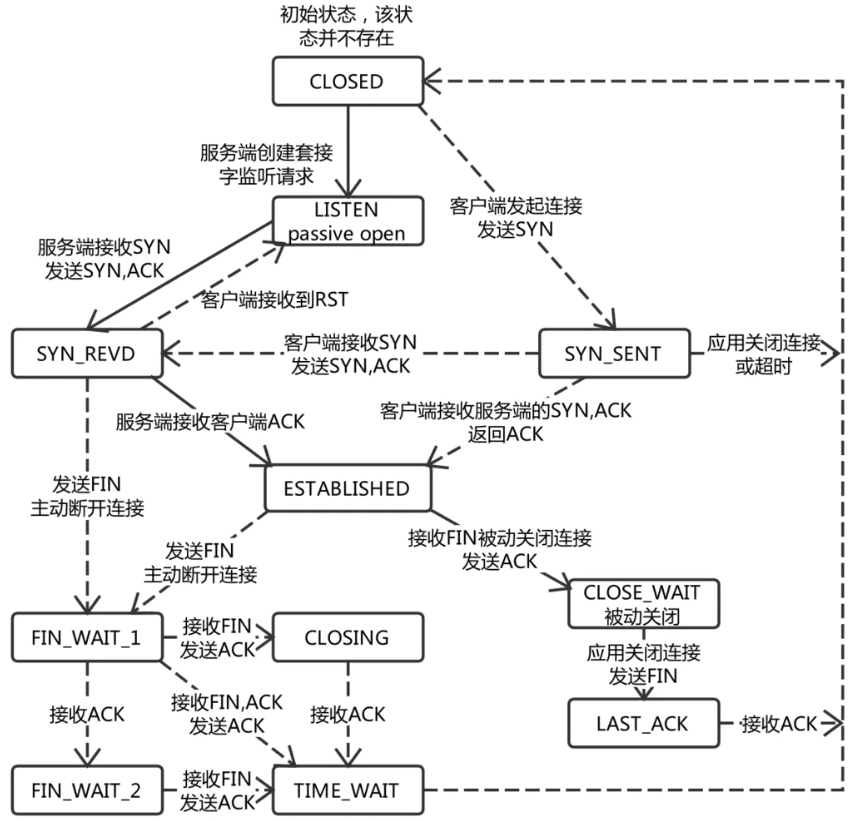

# 计算机网络

## 一、OSI、TCP/IP网络分层模型:airplane:

> 参考链接：[JavaGuide](https://javaguide.cn/cs-basics/network/osi&tcp-ip-model.html)

### 1.1 OSI 七层模型

**OSI 七层模型**是国际标准化组织提出一个网络分层模型，其大体结构以及每一层提供的功能如下：

另外一种图：

总结图片：

### 1.2 TCP/IP 四层模型

**TCP/IP 四层模型**是目前被广泛采用的一种模型，可以将TCP/IP模型看作是OSI 七层模型的精简版本，由以下4层组成：

1. 应用层。
2. 传输层。
3. 网络层。
4. 网络接口层。

需要注意的是，其实并不能将TCP/IP 四层模型和OSI 七层模型完全精确地匹配起来，不过可以简单地对应：

#### 应用层（Application Layer）

应用层位于传输层之上，主要**提供两个终端设备上的应用程序之间信息交换的服务**，它定义了信息交换的格式，**消息会交给下一层传输层来传输**，把应用层交互的数据单元称为**报文**。

应用层协议定义了**网络通信规则**，对于不同的网络应用需要不同的应用层协议。在互联网中应用层协议很多，如支持Web应用的HTTP协议、支持电子邮件的SMTP协议等。

#### 传输层（Transport Layer）

传输层的主要任务就是**负责向两台终端设备进程之间的通信提供通用的数据传输服务**。应用进程**利用该服务传送应用层报文**。“通用的”是指并不针对某一个特定的网络应用，而是**多种应用可以使用同一个运输层服务**。

运输层主要使用以下两种协议：

- **传输控制协议TCP（Transmission Control Protocol）**：提供**面向连接的、可靠的**数据传输服务。
- **用户数据协议UDP（User Datagram Protocol）**：提供**无连接的、尽最大努力的**数据传输服务（**不保证数据传输的可靠性**）。

#### 网络层（Network Layer）

网络层负责为**分组网络中的不同主机提供通信服务**。在发送数据时，网络层把**运输层产生的报文段或用户数据报封装成“分组”或“包”进行传送**。在TCP/IP体系结构中，由于网络层使用IP协议，因此分组也叫IP数据报，简称**数据报**。

注意：不要把运输层的**用户数据报UDP**和**网络层IP数据报**弄混。

网络层还有一个任务就是**选择合适的路由，使源主机运输层所传下来的分组，能通过网络层中的路由器找到目的主机**。

互联网是由大量的异构（Heterogeneous）网络通过路由器（Router）相互连接起来的。互联网使用的网络层协议是无连接的网际协议（Inter Protocol）和许多路由选择协议，因此互联网的网络层也叫做**网际层**或**IP层**。

#### 网络接口层（Network Interface Layer）

可以把网络接口层看作是**数据链路层**和**物理层**的合体。

- 数据链路层（Data Link Layer）通常简称为链路层（两台主机之间的数据传输总是在一段一段的链路上）。数据链路层的作用是将**网络层交下来的IP数据报组装成帧，在两个相邻节点间的链路上传送帧**。每一帧包括数据和必要的控制信息（如同步信息、地址信息、差错控制等）。
- 物理层的作用是**实现相邻计算机节点之间比特流的透明传送**，尽可能地**屏蔽掉具体传输介质和物理设备的差异**。

### 1.3 网络层次与数据传递

> 参考链接：[Java全栈知识体系](https://pdai.tech/md/develop/protocol/dev-protocol-osi7.html#%E7%BD%91%E7%BB%9C%E5%B1%82%E6%AC%A1%E4%B8%8E%E6%95%B0%E6%8D%AE%E4%BC%A0%E9%80%92)

下图就是四层协议在数据传输过程中的工作方式，在发送端是应用层-->链路层这个方向的封包过程，每经过一层都会增加该层的头部；而接收端则是从链路层-->应用层解包的过程，每经过一层则会去掉相应的首部。

### 1.4 为什么要网络分层？

**复杂的系统需要分层，因为每一层都需要专注于一类事情。网络分层的原因也是一样，每一层只专注于做一类事情**。主要原因如下：

- **各层之间相互独立**：各层之间不需要关心其他层是如何实现的，只需要知道自己如何调用下层提供好的功能就可以了（**可以简单理解为接口调用**）。
- **提高了整体灵活性**：**每一层都可以使用最适合的技术来实现**，只需要保证提供的功能以及暴露的接口的规则没有改变就行了（**高内聚、低耦合**）。
- **大问题化小**：分层可以将复杂的网络间题分解为许多比较小的、界线比较清晰简单的小问题来处理和解决。这样使得复杂的计算机网络系统变得易于设计、实现和标准化（**系统功能分解**）。 

## 二、IP协议:boat:

> 参考链接：[Java全栈知识体系](https://pdai.tech/md/develop/protocol/dev-protocol-ip.html)

### 2.1 IP及配套协议详解

因为网络层是整个互联网的核心，因此应当让网络层尽可能简单。网络层向上只提供简单灵活的、无连接的、尽最大努力交互的数据报服务。使用IP协议，可以**把异构的物理网络连接起来**，使得在网络层看起来好像是一个统一的网络。

与IP协议配套使用的还有三个协议：

- 地址解析协议ARP（Address Resolution Protocol）。
- 网际控制报文协议ICMP（Internet Control Message Protocol）。
- 网际组管理协议IGMP（Internet Group Management Protocol）。

#### IP数据报格式

- **版本**：有4（IPv4）和6（IPv6）两个值。
- **首部长度**：占4位，因此最大值为15。值为1表示的是1个32位字的长度，也就是**4字节**。因为固定部分长度为20字节，因此该值**最小为5**。如果可选字段的长度不是4字节的整数倍，就用尾部的填充部分来填充。
- **区分服务**：用来获得更好的服务，一般情况下不使用。
- **总长度**：包括首部长度和数据部分长度。
- **生存时间**：TTL，它的存在是为了防止无法交付的数据报在互联网中不断兜圈子。以路由器跳数为单位，当TTL为0时就丢弃数据报。
- **协议**：指出携带的数据应该上交给哪个协议进行处理，例如ICMP、TCP、UDP等。
- **首部检验和**：因为数据报每经过一个路由器，都要重新计算检验和，因此检验和不包含数据部分可以减少计算的工作量。
- **标识**：在数据报长度过长从而发生分片的情况下，相同数据报的不同分片具有相同的标识符。
- **片偏移**：和标识符一起，用于发生分片的情况。**片偏移的单位为8字节**。

#### IP地址编码方式

IP地址的编址方式经历了三个历史阶段：分类、子网划分和无分类。

##### 分类

由两部分组成，**网络号**和**主机号**，其中不同分类具有不同的网络号长度，并且是固定的。

$IP地址::=\{<网络号>, <主机号>\}$

##### 子网划分

在主机号字段中拿一部分作为子网号，把两级IP地址划分为三级IP地址。

$IP地址::=\{<网络号>, <子网号>, <主机号>\}$

要使用子网，必须配置子网掩码。一个B类地址的默认子网掩码为255.255.0.0。如果B类地址的子网占两个比特，那么子网掩码为11111111 11111111 **11**000000 00000000，也就是255.255.192.0。

注意，外部网络看不到子网的存在。

##### 无分类

无分类编址CIDR消除了传统A类、B类和C类地址以及划分子网的概念，使用网络前缀和主机号来对IP地址进行编码，网络前缀的长度可以根据需要变化。

$IP地址::=\{<网络前缀号>, <主机号>\}$

CIDR记法采用在IP地址后面加上网络前缀长度的方法，例如128.14.35.7/20表示前20位为网络前缀。CIDR的地址掩码可以继续称为子网掩码，子网掩码首1长度为网络前缀的长度。

一个CIDR地址块中有很多地址，一个CIDR表示的网络就可以表示原来的很多个网络，并且在路由表中只需要一个路由就可以代替原来的多个路由，减少了路由表项的数量。把这种通过使用网络前缀来减少路由表项的方式称为路由聚合，也称为**构成超网** 。

在路由表中的项目由“网络前缀”和“下一跳地址”组成，在查找时可能会得到不止一个匹配结果，应当采用最长前缀匹配来确定应该匹配哪一个。

#### 地址解析协议ARP

**网络层实现主机之间的通信，而链路层实现具体每段链路之间的通信**。因此在通信过程中，IP数据报的源地址和目的地址始终不变，而**MAC地址随着链路的改变而改变**。

ARP实现**由IP地址得到MAC地址**。每个主机都有一个ARP高速缓存，里面有本局域网上的各主机和路由器的IP地址到MAC地址的映射表。如果主机A知道主机B的IP地址，但是ARP高速缓存中没有该IP地址到MAC地址的映射，此时**主机A通过广播的方式发送ARP请求分组，主机B收到该请求后会发送ARP响应分组给主机A告知其MAC地址，随后主机A向其高速缓存中写入主机B的IP地址到MAC地址的映射**。

#### 网际控制报文协议ICMP

CMP是为了更有效地转发IP数据报和提高交付成功的机会。它封装在IP数据报中，但是不属于高层协议。

ICMP报文分为**差错报告报文**和**询问报文**。

##### ping

Ping是ICMP的一个重要应用，主要用来**测试两台主机之间的连通性**。Ping的原理是：通过向目的主机发送ICMP Echo请求报文，目的主机收到之后会发送Echo回答报文。**Ping会根据时间和成功响应的次数估算出数据包往返时间以及丢包率**。

##### Traceroute

Traceroute是ICMP的另一个应用，用来跟踪**一个分组从源点到终点的路径**。Traceroute发送的IP数据报封装的是无法交付的UDP用户数据报，并由目的主机发送终点不可达差错报告报文。

**源主机向目的主机发送**一连串的IP数据报：

1. 第一个数据报P1的生存时间TTL设置为1，当P1到达路径上的第一个路由器R1时，R1收下它并把TTL减 1，此时TTL等于0，R1就把P1丢弃，并向源主机发送一个ICMP时间超过差错报告报文；
2. 源主机接着发送第二个数据报P2，并把TTL设置为2。P2先到达R1，R1收下后把TTL减1再转发给R2，R2收下后也把TTL减1，由于此时TTL等于0，R2就丢弃P2，并向源主机发送一个ICMP时间超过差错报文。

不断执行以上步骤，直到最后一个数据报刚刚到达目的主机，主机不转发数据报，也不把TTL值减1。但是因为数据报封装的是无法交付的UDP，因此目的主机要向源主机发送**ICMP终点不可达差错报告报文**。最后源主机知道了到达目的主机所**经过的路由器IP地址以及到达每个路由器的往返时间**。

### 2.2 IPV6详解

我国在2014-2015年也逐步停止了向新用户和应用分配IPv4地址。 解决IP地址耗尽的根本措施就是采用具有更大地址空间的新版本的IP，即IPv6。所引进的主要变化如下：

- **更大的地址空间**。IPv6将地址从IPv4的32位增大到了128位。
- 扩展的地址层次结构。
- 灵活的首部格式。IPv6定义了许多可选的扩展首部。
- 改进的选项。IPv6允许数据报包含有选项的控制信息，其选项放在有效载荷中。
- 允许协议继续扩充。
- 支持即插即用（即自动配置）。因此IPv6不需要使用DHCP。
- 支持资源的预分配。IPv6支持实时视像等要求，保证一定的带宽和时延的应用。
- IPv6首部改为8字节对齐。首部长度必须是8字节的整数倍，而原来的IPv4首部是4字节对齐。

#### IPv6数据报格式

#### IPv4向IPv6过渡

向IPv6过渡只能采用逐步演进的办法，同时还必须使新安装的IPv6系统能够向后兼容：IPv6系统必须能够接收和转发IPv4分组，并且能够为IPv4分组选择路由。两种向IPv6过渡的策略：

- 使用双协议栈。
- 使用隧道技术。

##### 双协议栈

双协议栈：**主机在和IPv6主机通信时是采用IPv6地址，而和IPv4主机通信时就采用IPv4地址**。根据DNS返回的地址类型可以确定使用IPv4地址还是IPv6地址。

##### 隧道技术

在IPv6数据报要进入IPv4网络时，**把IPv6数据报封装成为IPv4数据报**，整个IPv6数据报变成了IPv4数据报的数据部分。当IPv4数据报离开IPv4网络中的隧道时，再把数据部分（即原来的IPv6数据报）交给主机的IPv6协议栈。

### 2.3 IP与MAC之间关系

#### 整体与局部

信息传递时需要知道的其实是两个地址：终点地址（Final destination address）和下一跳的地址（Next hop address）。**IP地址本质上是终点地址**，它在跳过路由器（Hop）的时候不会改变，**而MAC地址则是下一跳的地址，每跳过一次路由器都会改变**。这就是为什么还要用MAC地址的原因之一，它起到了**记录下一跳的信息的作用**。注：一般来说IP地址经过路由器是不变的，不过NAT（Network address translation）例外，这也是有些人反对NAT而支持IPV6的原因之一。

#### 分层实现

如果在IP数据报头（Header）中增加了”下一跳IP地址“这个字段，在逻辑上来说，**如果IP地址够用，交换机也支持根据IP地址转发（现在的二层交换机不支持这样做），其实MAC地址并不是必要的**。但用MAC地址和IP地址两个地址分别表示物理地址和逻辑地址是有好处的：**这样分层可以使网络层与链路层的协议更灵活地替换**，网络层不一定非要用IP协议，链路层也不一定非用以太网协议。

#### 早期的以太网实现

早期的以太网只有集线器（Hub）而没有交换机（Switch），**所以发出去的包能被以太网内的所有机器监听到，因此要附带上MAC地址，每个机器只需要接受与自己MAC地址相匹配的包**。

### 2.4 网络地址转换NAT

在专用网上**使用专用地址的主机如何与互联网上的主机通信**（并不需要加密）？

采用网络地址转换NAT，这是目前使用得最多的方法。装有NAT软件的路由器叫作NAT路由器，它至少有一个有效的外部全球IP地址，所有使用本地地址的主机在和外界通信时，都要在NAT路由器上将其本地地址转换成全球IP地址。

通过NAT路由器的通信**必须由专用网内的主机发起**。专用网内部的主机不能充当服务器用，因为互联网上的客户无法请求专用网内的服务器提供服务。

#### 转换过程

1. 内部主机A用本地地址IPA和互联网上主机B通信，所发送的数据报必须经过NAT路由器；
2. NAT路由器将数据报的**源地址IPA转换成全球地址IPG**，并把转换结果**记录到NAT地址转换表中**，目的地址IPB保持不变，然后发送到互联网；
3. NAT路由器收到主机B发回的数据报时，**知道数据报中的源地址是IPB而目的地址是IPG**；
4. 根据第2步记录的NAT转换表，NAT路由器将**目的地址IPG转换为IPA**，转发给最终的内部主机A。

可以看出，在内部主机与外部主机通信时，在NAT路由器上发生了两次地址转换：

- 离开专用网时：替换源地址，将内部地址替换为全球地址。
- 进入专用网时：替换目的地址，将全球地址替换为内部地址。

## 三、TCP/UDP协议:airplane:

### 3.1 TCP协议

#### 简述

首先，TCP在网络OSI七层模型中的第四层——传输层，IP在第三层——网络层，ARP在第二层——数据链路层。在第二层上的数据叫**Frame**，在第三层上的数据叫**Packet**，第四层的数据叫**Segment**。

程序的数据首先会打到TCP的Segment中，接着TCP的Segment会打到IP的Packet中，然后再打到以太网Ethernet的Frame中，传到对端后，各个层解析自己的协议，然后把数据交给更高层的协议处理。

#### TCP头格式

TCP头格式如下：

需要注意这么几点：

- TCP的包是没有IP地址的，那是IP层上的事，但是有**源端口**和**目标端口**。
- 一个TCP连接需要四个元组来表示是同一个连接（`src_ip`，`src_port`，`dst_ip`，`dst_port`）。准确说是五元组，还有一个是协议。
- 注意上图中四个非常重要的东西：
  - `Sequence Number`是包的序号，用来解决网络包乱序（Reordering）问题。
  - `Acknowledgement Number`就是ACK——用于确认收到，解决不丢包的问题。
  - `Window`又叫`Advertised-Window`，也就是著名的滑动窗口（Sliding Window），用于解决流控。
  - `TCP Flag`，也就是包的类型，主要用于操控TCP状态机。

其余部分：

#### TCP运输连接管理

##### 连接建立、数据传送和连接释放（自己总结）:rocket:

##### 有限状态机

> 参考链接：[简书](https://www.jianshu.com/p/3c7a0771b67e)

一个TCP连接在它的生命周期内会有不同的状态。下图说明了TCP连接可能会有的状态，以及基于事件的状态转换。事件中有的是应用程序的操作，有的是接收到了网络发过来的请求。

具体如下：

|      状态      |                             描述                             |
| :------------: | :----------------------------------------------------------: |
|    `LISTEN`    |                等待来自远程TCP应用程序的请求                 |
|   `SYN_SENT`   | 发送连接请求后等待来自远程端点的确认。**TCP第一次握手后客户端所处的状态** |
| `SYN-RECEIVED` | 该端点已经接收到连接请求并发送确认。 该端点正在等待最终确认。**TCP第二次握手后服务端所处的状态** |
| `ESTABLISHED`  |  代表连接已经建立起来了。这是**连接数据传输阶段的正常状态**  |
|  `FIN_WAIT_1`  |        等待来自远程TCP的终止连接请求或终止请求的确认         |
|  `FIN_WAIT_2`  |  在此端点发送终止连接请求后，等待来自远程TCP的连接终止请求   |
|  `CLOSE_WAIT`  | 该端点已经收到来自远程端点的关闭请求，此TCP正在等待本地应用程序的连接终止请求 |
|   `CLOSING`    |              等待来自远程TCP的连接终止请求确认               |
|   `LAST_ACK`   |          等待先前发送到远程TCP的连接终止请求的确认           |
|  `TIME_WAIT`   |    等待足够的时间来确保远程TCP接收到其连接终止请求的确认     |

#### 数据传输中的Sequence Number

**SeqNum的增加和传输的字节数相关**。三次握手后，来了两个Len:1440的包，而第二个包的SeqNum就成了1441。然后第一个ACK回的是1441，表示第一个1440收到了。

#### TCP重传机制

TCP要保证所有的数据包都可以到达，所以必须要有**重传机制**。

注意，接收端给发送端的ACK确认只会确认最后一个连续的包。比如，发送端发了1，2，3，4，5一共五份数据，接收端收到了1，2，于是回ACK 3，然后收到了4（注意此时3并没收到），此时的TCP会怎么办？正如前面所说，**SeqNum和ACK是以字节数为单位，所以ACK的时候，不能跳着确认，只能确认最大的连续收到的包**，不然，发送端就以为之前的都收到了。

##### 超时重传机制

**不回ACK，死等3**。当发送方发现收不到3的ACK超时后，会重传3。一旦接收方收到3后，会ACK回4。

但是，这种方式会有比较严重的问题，那就是**因为要死等3**，所以会导致即便4和5已经收到了，但发送方也完全不知道发生了什么事（因为没有收到相应的ACK），所以发送方可能会**悲观地认为4和5也丢了，导致4和5的重传**。对此有两种选择：

- 一种是仅重传timeout的包，也就是第3份数据。
- 另一种是重传timeout后所有的数据，也就是第3，4，5这三份数据。

这两种方式有好也有不好。第一种会节省带宽，但是慢；第二种会快一点，但是会浪费带宽，也可能会有无用功。但**总体来说都不好**，因为都在等timeout，timeout可能会很长。

##### 快速重传机制

TCP引入了一种叫**Fast Retransmit** 的算法，**不以时间驱动，而以数据驱动重传**。也就是说，如果包没有连续到达，就ACK最后那个可能被丢了的包，如果发送方连续收到3次**冗余的、相同的**ACK，就重传。Fast Retransmit的好处是**不用等timeout了再重传**。

比如：发送方发出了1，2，3，4，5份数据，1先送到了，于是就ACK回2，结果2因为某些原因没收到，但是3到达了，于是还是ACK回2，后面的4和5都到了，但是还是ACK回2。**由于2没有收到，于是发送端收到了3个ack=2的确认，知道了2还没有到，于是就马上重转2**。然后，接收端收到了2，此时因为3，4，5都收到了，于是ack回6。示意图如下：

Fast Retransmit只解决了一个问题，即timeout的问题，但它依然面临一个艰难的选择：**是重传之前的一个数据还是重传所有数据的问题**。对于上面的示例来说，是重传#2呢还是重传#2，#3，#4，#5呢？因为发送端并不清楚这连续的3个ACK 2是谁传回来的，也许发送端发了20份数据，是#6，#10，#20传来的呢。这样，**发送端很有可能要重传从2到20的这堆数据（这就是某些TCP的实际的实现）**。可见，这是一把双刃剑。

##### SACK方法

另外一种更好的方式叫：**Selective Acknowledgment (SACK)**，这种方式需要在TCP头里加一个叫SACK的东西，ACK还是Fast Retransmit的ACK，SACK则是汇报收到的数据碎版。参看下图：

这样发送端就**可以根据回传的SACK来知道哪些数据到了，哪些没有到**。于是就优化了Fast Retransmit的算法。当然，这个协议需要两边都支持。

这里还需要注意一个问题——**接收方Reneging，所谓Reneging的意思就是接收方有权把已经报给发送端SACK里的数据给丢了**。这样干是不被鼓励的，因为这个事会把问题复杂化了，但是接收方这么做可能会有些极端情况，比如要把内存给别的更重要的东西。所以，**发送方也不能完全依赖SACK，还是要依赖ACK，并维护Time-Out，如果后续的ACK没有增长，那么还是要把SACK的东西重传，另外，接收端这边永远不能把SACK的包标记为ACK**。

##### Duplicate SACK—重复收到数据

Duplicate SACK又称D-SACK，其**主要使用了SACK来告诉发送方有哪些数据被重复接收了**。下面举几个例子：

D-SACK使用了SACK的第一个段来做标志

- 如果SACK的第一个段的范围被ACK所覆盖，那么就是D-SACK。
- 如果SACK的第一个段的范围被SACK的第二个段覆盖，那么就是D-SACK

引入了D-SACK，有这么几个好处：

1. 可以让发送方知道，是**发出去的包丢了，还是回来的ACK包丢了**。
2. 是不是自己的timeout太小了，导致重传。
3. 网络上出现了先发的包后到的情况（又称Reordering）。
4. 网络上是不是把发送的数据包复制了。

知道这些东西可以很好得**帮助TCP了解网络情况**，从而可以更好的做**网络流控**。

#### 滑动窗口

#### 拥塞处理

#### 流量控制

### 3.2 UDP协议

> 参考链接：[Java全栈知识体系](https://pdai.tech/md/develop/protocol/dev-protocol-udp.html)

#### 概述

UDP（User Datagram Protocol）即**用户数据报协议**，在网络中它与TCP协议一样用于处理数据包，是一种无连接的协议。

在OSI模型中，处于第四层——传输层，位于IP协议上一层。UDP用来支持那些需要在计算机之间传输数据的网络应用，包括网络视频会议系统在内的众多的客户/服务器模式的网络应用都需要使用UDP协议。

UDP报文没有可靠性保证、顺序保证和流量控制字段等，可靠性较差。但是正因为UDP协议的控制选项较少，**在数据传输过程中延迟小、数据传输效率高**，适合对可靠性要求不高的应用程序，或者可以保障可靠性的应用程序，如DNS、TFTP、SNMP等。

#### UDP特点

