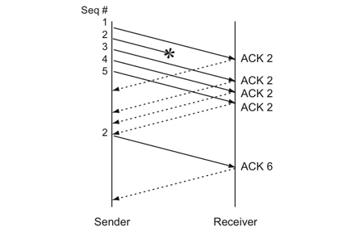
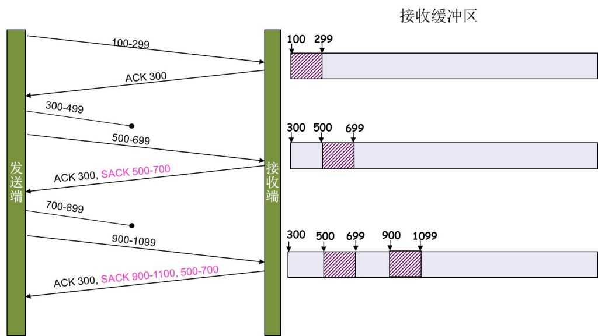
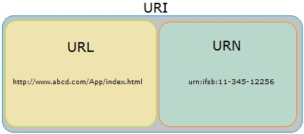

# 计算机网络

## 一、OSI、TCP/IP网络分层模型:airplane:

> 参考链接：[JavaGuide](https://javaguide.cn/cs-basics/network/osi&tcp-ip-model.html)

### 1.1 OSI 七层模型

**OSI 七层模型**是国际标准化组织提出一个网络分层模型，其大体结构以及每一层提供的功能如下：


另外一种图：


总结图片：


### 1.2 TCP/IP 四层模型

**TCP/IP 四层模型**是目前被广泛采用的一种模型，可以将TCP/IP模型看作是OSI 七层模型的精简版本，由以下4层组成：

1. 应用层。
2. 传输层。
3. 网络层。
4. 网络接口层。

需要注意的是，其实并不能将TCP/IP 四层模型和OSI 七层模型完全精确地匹配起来，不过可以简单地对应：


#### 应用层（Application Layer）

应用层位于传输层之上，主要**提供两个终端设备上的应用程序之间信息交换的服务**，它定义了信息交换的格式，**消息会交给下一层传输层来传输**，把应用层交互的数据单元称为**报文**。


应用层协议定义了**网络通信规则**，对于不同的网络应用需要不同的应用层协议。在互联网中应用层协议很多，如支持Web应用的HTTP协议、支持电子邮件的SMTP协议等。


#### 传输层（Transport Layer）

传输层的主要任务就是**负责向两台终端设备进程之间的通信提供通用的数据传输服务**。应用进程**利用该服务传送应用层报文**。“通用的”是指并不针对某一个特定的网络应用，而是**多种应用可以使用同一个运输层服务**。

运输层主要使用以下两种协议：

- **传输控制协议TCP（Transmission Control Protocol）**：提供**面向连接的、可靠的**数据传输服务。
- **用户数据协议UDP（User Datagram Protocol）**：提供**无连接的、尽最大努力的**数据传输服务（**不保证数据传输的可靠性**）。


#### 网络层（Network Layer）

网络层负责为**分组网络中的不同主机提供通信服务**。在发送数据时，网络层把**运输层产生的报文段或用户数据报封装成“分组”或“包”进行传送**。在TCP/IP体系结构中，由于网络层使用IP协议，因此分组也叫IP数据报，简称**数据报**。

注意：不要把运输层的**用户数据报UDP**和**网络层IP数据报**弄混。

网络层还有一个任务就是**选择合适的路由，使源主机运输层所传下来的分组，能通过网络层中的路由器找到目的主机**。

互联网是由大量的异构（Heterogeneous）网络通过路由器（Router）相互连接起来的。互联网使用的网络层协议是无连接的网际协议（Inter Protocol）和许多路由选择协议，因此互联网的网络层也叫做**网际层**或**IP层**。


#### 网络接口层（Network Interface Layer）

可以把网络接口层看作是**数据链路层**和**物理层**的合体。

- 数据链路层（Data Link Layer）通常简称为链路层（两台主机之间的数据传输总是在一段一段的链路上）。数据链路层的作用是将**网络层交下来的IP数据报组装成帧，在两个相邻节点间的链路上传送帧**。每一帧包括数据和必要的控制信息（如同步信息、地址信息、差错控制等）。
- 物理层的作用是**实现相邻计算机节点之间比特流的透明传送**，尽可能地**屏蔽掉具体传输介质和物理设备的差异**。


### 1.3 网络层次与数据传递

> 参考链接：[Java全栈知识体系](https://pdai.tech/md/develop/protocol/dev-protocol-osi7.html#%E7%BD%91%E7%BB%9C%E5%B1%82%E6%AC%A1%E4%B8%8E%E6%95%B0%E6%8D%AE%E4%BC%A0%E9%80%92)

下图就是四层协议在数据传输过程中的工作方式，在发送端是应用层-->链路层这个方向的封包过程，每经过一层都会增加该层的头部；而接收端则是从链路层-->应用层解包的过程，每经过一层则会去掉相应的首部。


### 1.4 为什么要网络分层？

**复杂的系统需要分层，因为每一层都需要专注于一类事情。网络分层的原因也是一样，每一层只专注于做一类事情**。主要原因如下：

- **各层之间相互独立**：各层之间不需要关心其他层是如何实现的，只需要知道自己如何调用下层提供好的功能就可以了（**可以简单理解为接口调用**）。
- **提高了整体灵活性**：**每一层都可以使用最适合的技术来实现**，只需要保证提供的功能以及暴露的接口的规则没有改变就行了（**高内聚、低耦合**）。
- **大问题化小**：分层可以将复杂的网络间题分解为许多比较小的、界线比较清晰简单的小问题来处理和解决。这样使得复杂的计算机网络系统变得易于设计、实现和标准化（**系统功能分解**）。 

## 二、IP协议:boat:

> 参考链接：[Java全栈知识体系](https://pdai.tech/md/develop/protocol/dev-protocol-ip.html)

### 2.1 IP及配套协议详解

因为网络层是整个互联网的核心，因此应当让网络层尽可能简单。网络层向上只提供简单灵活的、无连接的、尽最大努力交互的数据报服务。使用IP协议，可以**把异构的物理网络连接起来**，使得在网络层看起来好像是一个统一的网络。

与IP协议配套使用的还有三个协议：

- 地址解析协议ARP（Address Resolution Protocol）。
- 网际控制报文协议ICMP（Internet Control Message Protocol）。
- 网际组管理协议IGMP（Internet Group Management Protocol）。

#### IP数据报格式


- **版本**：有4（IPv4）和6（IPv6）两个值。
- **首部长度**：占4位，因此最大值为15。值为1表示的是1个32位字的长度，也就是**4字节**。因为固定部分长度为20字节，因此该值**最小为5**。如果可选字段的长度不是4字节的整数倍，就用尾部的填充部分来填充。
- **区分服务**：用来获得更好的服务，一般情况下不使用。
- **总长度**：包括首部长度和数据部分长度。
- **生存时间**：TTL，它的存在是为了防止无法交付的数据报在互联网中不断兜圈子。以路由器跳数为单位，当TTL为0时就丢弃数据报。
- **协议**：指出携带的数据应该上交给哪个协议进行处理，例如ICMP、TCP、UDP等。
- **首部检验和**：因为数据报每经过一个路由器，都要重新计算检验和，因此检验和不包含数据部分可以减少计算的工作量。
- **标识**：在数据报长度过长从而发生分片的情况下，相同数据报的不同分片具有相同的标识符。
- **片偏移**：和标识符一起，用于发生分片的情况。**片偏移的单位为8字节**。


#### IP地址编码方式

IP地址的编址方式经历了三个历史阶段：分类、子网划分和无分类。

##### 分类

由两部分组成，**网络号**和**主机号**，其中不同分类具有不同的网络号长度，并且是固定的。

$IP地址::=\{<网络号>, <主机号>\}$


##### 子网划分

在主机号字段中拿一部分作为子网号，把两级IP地址划分为三级IP地址。

$IP地址::=\{<网络号>, <子网号>, <主机号>\}$

要使用子网，必须配置子网掩码。一个B类地址的默认子网掩码为255.255.0.0。如果B类地址的子网占两个比特，那么子网掩码为11111111 11111111 **11**000000 00000000，也就是255.255.192.0。

注意，外部网络看不到子网的存在。

##### 无分类

无分类编址CIDR消除了传统A类、B类和C类地址以及划分子网的概念，使用网络前缀和主机号来对IP地址进行编码，网络前缀的长度可以根据需要变化。

$IP地址::=\{<网络前缀号>, <主机号>\}$

CIDR记法采用在IP地址后面加上网络前缀长度的方法，例如128.14.35.7/20表示前20位为网络前缀。CIDR的地址掩码可以继续称为子网掩码，子网掩码首1长度为网络前缀的长度。

一个CIDR地址块中有很多地址，一个CIDR表示的网络就可以表示原来的很多个网络，并且在路由表中只需要一个路由就可以代替原来的多个路由，减少了路由表项的数量。把这种通过使用网络前缀来减少路由表项的方式称为路由聚合，也称为**构成超网** 。

在路由表中的项目由“网络前缀”和“下一跳地址”组成，在查找时可能会得到不止一个匹配结果，应当采用最长前缀匹配来确定应该匹配哪一个。

#### 地址解析协议ARP

**网络层实现主机之间的通信，而链路层实现具体每段链路之间的通信**。因此在通信过程中，IP数据报的源地址和目的地址始终不变，而**MAC地址随着链路的改变而改变**。


ARP实现**由IP地址得到MAC地址**。每个主机都有一个ARP高速缓存，里面有本局域网上的各主机和路由器的IP地址到MAC地址的映射表。如果主机A知道主机B的IP地址，但是ARP高速缓存中没有该IP地址到MAC地址的映射，此时**主机A通过广播的方式发送ARP请求分组，主机B收到该请求后会发送ARP响应分组给主机A告知其MAC地址，随后主机A向其高速缓存中写入主机B的IP地址到MAC地址的映射**。


#### 网际控制报文协议ICMP

CMP是为了更有效地转发IP数据报和提高交付成功的机会。它封装在IP数据报中，但是不属于高层协议。


ICMP报文分为**差错报告报文**和**询问报文**。


##### ping

Ping是ICMP的一个重要应用，主要用来**测试两台主机之间的连通性**。Ping的原理是：通过向目的主机发送ICMP Echo请求报文，目的主机收到之后会发送Echo回答报文。**Ping会根据时间和成功响应的次数估算出数据包往返时间以及丢包率**。

##### Traceroute

Traceroute是ICMP的另一个应用，用来跟踪**一个分组从源点到终点的路径**。Traceroute发送的IP数据报封装的是无法交付的UDP用户数据报，并由目的主机发送终点不可达差错报告报文。

**源主机向目的主机发送**一连串的IP数据报：

1. 第一个数据报P1的生存时间TTL设置为1，当P1到达路径上的第一个路由器R1时，R1收下它并把TTL减 1，此时TTL等于0，R1就把P1丢弃，并向源主机发送一个ICMP时间超过差错报告报文；
2. 源主机接着发送第二个数据报P2，并把TTL设置为2。P2先到达R1，R1收下后把TTL减1再转发给R2，R2收下后也把TTL减1，由于此时TTL等于0，R2就丢弃P2，并向源主机发送一个ICMP时间超过差错报文。

不断执行以上步骤，直到最后一个数据报刚刚到达目的主机，主机不转发数据报，也不把TTL值减1。但是因为数据报封装的是无法交付的UDP，因此目的主机要向源主机发送**ICMP终点不可达差错报告报文**。最后源主机知道了到达目的主机所**经过的路由器IP地址以及到达每个路由器的往返时间**。

### 2.2 IPV6详解

我国在2014-2015年也逐步停止了向新用户和应用分配IPv4地址。 解决IP地址耗尽的根本措施就是采用具有更大地址空间的新版本的IP，即IPv6。所引进的主要变化如下：

- **更大的地址空间**。IPv6将地址从IPv4的32位增大到了128位。
- 扩展的地址层次结构。
- 灵活的首部格式。IPv6定义了许多可选的扩展首部。
- 改进的选项。IPv6允许数据报包含有选项的控制信息，其选项放在有效载荷中。
- 允许协议继续扩充。
- 支持即插即用（即自动配置）。因此IPv6不需要使用DHCP。
- 支持资源的预分配。IPv6支持实时视像等要求，保证一定的带宽和时延的应用。
- IPv6首部改为8字节对齐。首部长度必须是8字节的整数倍，而原来的IPv4首部是4字节对齐。

#### IPv6数据报格式


#### IPv4向IPv6过渡

向IPv6过渡只能采用逐步演进的办法，同时还必须使新安装的IPv6系统能够向后兼容：IPv6系统必须能够接收和转发IPv4分组，并且能够为IPv4分组选择路由。两种向IPv6过渡的策略：

- 使用双协议栈。
- 使用隧道技术。

##### 双协议栈

双协议栈：**主机在和IPv6主机通信时是采用IPv6地址，而和IPv4主机通信时就采用IPv4地址**。根据DNS返回的地址类型可以确定使用IPv4地址还是IPv6地址。


##### 隧道技术

在IPv6数据报要进入IPv4网络时，**把IPv6数据报封装成为IPv4数据报**，整个IPv6数据报变成了IPv4数据报的数据部分。当IPv4数据报离开IPv4网络中的隧道时，再把数据部分（即原来的IPv6数据报）交给主机的IPv6协议栈。


### 2.3 IP与MAC之间关系

#### 整体与局部

信息传递时需要知道的其实是两个地址：终点地址（Final destination address）和下一跳的地址（Next hop address）。**IP地址本质上是终点地址**，它在跳过路由器（Hop）的时候不会改变，**而MAC地址则是下一跳的地址，每跳过一次路由器都会改变**。这就是为什么还要用MAC地址的原因之一，它起到了**记录下一跳的信息的作用**。注：一般来说IP地址经过路由器是不变的，不过NAT（Network address translation）例外，这也是有些人反对NAT而支持IPV6的原因之一。

#### 分层实现

如果在IP数据报头（Header）中增加了”下一跳IP地址“这个字段，在逻辑上来说，**如果IP地址够用，交换机也支持根据IP地址转发（现在的二层交换机不支持这样做），其实MAC地址并不是必要的**。但用MAC地址和IP地址两个地址分别表示物理地址和逻辑地址是有好处的：**这样分层可以使网络层与链路层的协议更灵活地替换**，网络层不一定非要用IP协议，链路层也不一定非用以太网协议。

#### 早期的以太网实现

早期的以太网只有集线器（Hub）而没有交换机（Switch），**所以发出去的包能被以太网内的所有机器监听到，因此要附带上MAC地址，每个机器只需要接受与自己MAC地址相匹配的包**。

### 2.4 网络地址转换NAT

在专用网上**使用专用地址的主机如何与互联网上的主机通信**（并不需要加密）？

采用网络地址转换NAT，这是目前使用得最多的方法。装有NAT软件的路由器叫作NAT路由器，它至少有一个有效的外部全球IP地址，所有使用本地地址的主机在和外界通信时，都要在NAT路由器上将其本地地址转换成全球IP地址。

通过NAT路由器的通信**必须由专用网内的主机发起**。专用网内部的主机不能充当服务器用，因为互联网上的客户无法请求专用网内的服务器提供服务。

#### 转换过程

1. 内部主机A用本地地址IPA和互联网上主机B通信，所发送的数据报必须经过NAT路由器；
2. NAT路由器将数据报的**源地址IPA转换成全球地址IPG**，并把转换结果**记录到NAT地址转换表中**，目的地址IPB保持不变，然后发送到互联网；
3. NAT路由器收到主机B发回的数据报时，**知道数据报中的源地址是IPB而目的地址是IPG**；
4. 根据第2步记录的NAT转换表，NAT路由器将**目的地址IPG转换为IPA**，转发给最终的内部主机A。

可以看出，在内部主机与外部主机通信时，在NAT路由器上发生了两次地址转换：

- 离开专用网时：替换源地址，将内部地址替换为全球地址。
- 进入专用网时：替换目的地址，将全球地址替换为内部地址。


## 三、TCP/UDP协议:airplane:

### 3.1 TCP协议

> 参考链接：[Java全栈知识体系](https://pdai.tech/md/develop/protocol/dev-protocol-tcpip.html)

#### 简述

首先，TCP在网络OSI七层模型中的第四层——传输层，IP在第三层——网络层，ARP在第二层——数据链路层。在第二层上的数据叫**Frame**，在第三层上的数据叫**Packet**，第四层的数据叫**Segment**。

程序的数据首先会打到TCP的Segment中，接着TCP的Segment会打到IP的Packet中，然后再打到以太网Ethernet的Frame中，传到对端后，各个层解析自己的协议，然后把数据交给更高层的协议处理。

#### TCP头格式

TCP头格式如下：


需要注意这么几点：

- TCP的包是没有IP地址的，那是IP层上的事，但是有**源端口**和**目标端口**。
- 一个TCP连接需要四个元组来表示是同一个连接（`src_ip`，`src_port`，`dst_ip`，`dst_port`）。准确说是五元组，还有一个是协议。
- 注意上图中四个非常重要的东西：
  - `Sequence Number`是包的序号，用来解决网络包乱序（Reordering）问题。
  - `Acknowledgement Number`就是ACK——用于确认收到，解决不丢包的问题。
  - `Window`又叫`Advertised-Window`，也就是著名的滑动窗口（Sliding Window），用于解决流控。
  - `TCP Flag`，也就是包的类型，主要用于操控TCP状态机。

其余部分：


#### TCP运输连接管理

##### 连接建立、数据传送和连接释放（自己总结）:rocket:


##### 有限状态机

> 参考链接：[简书](https://www.jianshu.com/p/3c7a0771b67e)

一个TCP连接在它的生命周期内会有不同的状态。下图说明了TCP连接可能会有的状态，以及基于事件的状态转换。事件中有的是应用程序的操作，有的是接收到了网络发过来的请求。


具体如下：

|      状态      |                             描述                             |
| :------------: | :----------------------------------------------------------: |
|    `LISTEN`    |                等待来自远程TCP应用程序的请求                 |
|   `SYN_SENT`   | 发送连接请求后等待来自远程端点的确认。**TCP第一次握手后客户端所处的状态** |
| `SYN-RECEIVED` | 该端点已经接收到连接请求并发送确认。 该端点正在等待最终确认。**TCP第二次握手后服务端所处的状态** |
| `ESTABLISHED`  |  代表连接已经建立起来了。这是**连接数据传输阶段的正常状态**  |
|  `FIN_WAIT_1`  |        等待来自远程TCP的终止连接请求或终止请求的确认         |
|  `FIN_WAIT_2`  |  在此端点发送终止连接请求后，等待来自远程TCP的连接终止请求   |
|  `CLOSE_WAIT`  | 该端点已经收到来自远程端点的关闭请求，此TCP正在等待本地应用程序的连接终止请求 |
|   `CLOSING`    |              等待来自远程TCP的连接终止请求确认               |
|   `LAST_ACK`   |          等待先前发送到远程TCP的连接终止请求的确认           |
|  `TIME_WAIT`   |    等待足够的时间来确保远程TCP接收到其连接终止请求的确认     |

##### 数据传输中的Sequence Number


**SeqNum的增加和传输的字节数相关**。三次握手后，来了两个Len:1440的包，而第二个包的SeqNum就成了1441。然后第一个ACK回的是1441，表示第一个1440收到了。

#### TCP重传机制

TCP要保证所有的数据包都可以到达，所以必须要有**重传机制**。

注意，接收端给发送端的ACK确认只会确认最后一个连续的包。比如，发送端发了1，2，3，4，5一共五份数据，接收端收到了1，2，于是回ACK 3，然后收到了4（注意此时3并没收到），此时的TCP会怎么办？正如前面所说，**SeqNum和ACK是以字节数为单位，所以ACK的时候，不能跳着确认，只能确认最大的连续收到的包**，不然，发送端就以为之前的都收到了。

##### 超时重传机制

**不回ACK，死等3**。当发送方发现收不到3的ACK超时后，会重传3。一旦接收方收到3后，会ACK回4。

但是，这种方式会有比较严重的问题，那就是**因为要死等3**，所以会导致即便4和5已经收到了，但发送方也完全不知道发生了什么事（因为没有收到相应的ACK），所以发送方可能会**悲观地认为4和5也丢了，导致4和5的重传**。对此有两种选择：

- 一种是仅重传timeout的包，也就是第3份数据。
- 另一种是重传timeout后所有的数据，也就是第3，4，5这三份数据。

这两种方式有好也有不好。第一种会节省带宽，但是慢；第二种会快一点，但是会浪费带宽，也可能会有无用功。但**总体来说都不好**，因为都在等timeout，timeout可能会很长。

##### 快速重传机制

TCP引入了一种叫**Fast Retransmit** 的算法，**不以时间驱动，而以数据驱动重传**。也就是说，如果包没有连续到达，就ACK最后那个可能被丢了的包，如果发送方连续收到3次**冗余的、相同的**ACK，就重传。Fast Retransmit的好处是**不用等timeout了再重传**。

比如：发送方发出了1，2，3，4，5份数据，1先送到了，于是就ACK回2，结果2因为某些原因没收到，但是3到达了，于是还是ACK回2，后面的4和5都到了，但是还是ACK回2。**由于2没有收到，于是发送端收到了3个ack=2的确认，知道了2还没有到，于是就马上重转2**。然后，接收端收到了2，此时因为3，4，5都收到了，于是ack回6。示意图如下：



Fast Retransmit只解决了一个问题，即timeout的问题，但它依然面临一个艰难的选择：**是重传之前的一个数据还是重传所有数据的问题**。对于上面的示例来说，是重传#2呢还是重传#2，#3，#4，#5呢？因为发送端并不清楚这连续的3个ACK 2是谁传回来的，也许发送端发了20份数据，是#6，#10，#20传来的呢。这样，**发送端很有可能要重传从2到20的这堆数据（这就是某些TCP的实际的实现）**。可见，这是一把双刃剑。

##### SACK方法

另外一种更好的方式叫：**Selective Acknowledgment (SACK)**，这种方式需要在TCP头里加一个叫SACK的东西，ACK还是Fast Retransmit的ACK，SACK则是汇报收到的数据碎版。参看下图：



这样发送端就**可以根据回传的SACK来知道哪些数据到了，哪些没有到**。于是就优化了Fast Retransmit的算法。当然，这个协议需要两边都支持。

这里还需要注意一个问题——**接收方Reneging，所谓Reneging的意思就是接收方有权把已经报给发送端SACK里的数据给丢了**。这样干是不被鼓励的，因为这个事会把问题复杂化了，但是接收方这么做可能会有些极端情况，比如要把内存给别的更重要的东西。所以，**发送方也不能完全依赖SACK，还是要依赖ACK，并维护Time-Out，如果后续的ACK没有增长，那么还是要把SACK的东西重传，另外，接收端这边永远不能把SACK的包标记为ACK**。

##### Duplicate SACK—重复收到数据

Duplicate SACK又称D-SACK，其**主要使用了SACK来告诉发送方有哪些数据被重复接收了**。下面举几个例子：

D-SACK使用了SACK的第一个段来做标志

- 如果SACK的第一个段的范围被ACK所覆盖，那么就是D-SACK。
- 如果SACK的第一个段的范围被SACK的第二个段覆盖，那么就是D-SACK

引入了D-SACK，有这么几个好处：

1. 可以让发送方知道，是**发出去的包丢了，还是回来的ACK包丢了**。
2. 是不是自己的timeout太小了，导致重传。
3. 网络上出现了先发的包后到的情况（又称Reordering）。
4. 网络上是不是把发送的数据包复制了。

知道这些东西可以很好得**帮助TCP了解网络情况**，从而可以更好的做**网络流控**。

#### TCP滑动窗口

TCP必须要解决可靠传输以及包乱序（Reordering）问题，所以TCP必须要知道**网络实际的数据处理带宽或是数据处理速度**，这样才不会引起网络拥塞而导致丢包。所以TCP引入了一些技术和设计来做网络流控，Sliding Window是其中一个。

TCP头里有一个字段叫Window，又叫Advertised-Window，这个字段是**接收端告诉发送端自己还有多少缓冲区可以接收数据**。于是发送端就可以根据这个接收端的处理能力来发送数据，而不会导致接收端处理不过来。 为了说明滑动窗口，需要先看一下TCP缓冲区的一些数据结构：


可以看出：

- 接收端`LastByteRead`指向了TCP缓冲区中读到的位置，`NextByteExpected`指向的地方是收到的连续包的最后一个位置，`LastByteRcved`指向的是收到的包的最后一个位置，可以看到**中间有些数据还没有到达，所以有数据空白区**。
- 发送端`LastByteAcked`指向了被接收端ACK过的位置（表示成功发送确认），`LastByteSent`表示发出去了但还没有收到成功确认的ACK，`LastByteWritten`指向上层应用正在写的地方。

于是：

- 接收端在给发送端回复的ACK中会汇报自己的$AdvertisedWindow=MaxRcvBuffer–LastByteRcvd–1$。
- 发送方会根据这个窗口来控制发送数据的大小，以保证接收方可以处理。

下面来看一下发送方的滑动窗口示意图：


图中有四个部分（其中那个黑模型就是滑动窗口），分别是：

- \#1：已收到ACK确认的数据。
- \#2：已发送但还没收到ACK的。
- \#3：在滑动窗口中还没有发出的（接收方还有空间）。
- \#4：窗口以外的数据（接收方已没空间）

下面是个滑动后的示意图（收到36的ACK后，发出了46-51的字节）：


#### TCP拥塞处理

TCP通过Sliding Window来做流控（Flow Control），但是TCP觉得这还不够，因为Sliding Window需要依赖于连接的发送端和接收端，所以并不知道网络中间发生了什么。**TCP还应该更聪明地知道整个网络上的事**。

具体一点，TCP通过一个timer采样了RTT（Round Trip Time，数据发送时刻到接收确认的时刻的差值）并计算RTO（Retransmission Time Out，从数据发送时刻起超过这个时间便执行重传）。如果网络上的延时突然增加，那么TCP对这个事做出的应对**只有重传数据**，但是重传会加重网络的负担，就会导致更大的延迟以及更多的丢包，于是这个情况**就会进入恶性循环被不断地放大**。

所以TCP不能忽略网络上发生的事情而无脑地重发数据。对此TCP的设计理念是：**TCP不是一个自私的协议，当拥塞发生的时候，要做自我牺牲。就像交通阻塞一样，每个车都应该把路让出来，而不要再去抢路了**。

拥塞控制主要是四个算法：**慢启动**、**拥塞避免**、**拥塞发生**、**快速恢复**。

##### 慢启动算法—Slow Start

慢启动的意思是：刚刚加入网络的连接**需要一点一点地提速**。慢启动的算法如下（cwnd表示Congestion Window，拥塞窗口）：

1. 连接建立后先初始化`cwnd=1`，表明可以传一个MSS大小的数据；
2. 每当收到一个ACK，`cwnd++`，呈线性上升；
3. 每当过了一个RTT，`cwnd*= 2`，呈指数上升；
4. 还有一个`ssthresh`（slow start threshold）：是一个上限，当`cwnd>=ssthresh`时，就会进入“拥塞避免算法“。


#####   拥塞避免算法—Congestion Avoidance

当`cwnd>=ssthresh`时，就会进入“拥塞避免算法”。一般来说`ssthresh`的值是65535，单位是字节，当cwnd达到这个值时后，算法如下：

- 收到一个ACK时，$cwnd=cwnd+1/cwnd$。
- 每过一个RTT时，$cwnd=cwnd+1$。

这样就可以**避免增长过快导致网络拥塞**，慢慢的增加调整到网络的最佳值。很明显，是一个线性上升的算法。

##### 拥塞状态时的算法

当丢包的时候，会有两种情况：

1. 等到RTO后重传数据包。TCP认为这种情况太糟糕，反应也很强烈。

   - $sshthresh=cwnd/2$。
   - cwnd重置为1。
   - 进入慢启动过程。

   

2. Fast Retransmit算法，也就是在收到3个duplicate ACK时就开启重传，而不用等到RTO超时。

   - TCP Tahoe的实现和RTO超时一样。
   - TCP Reno的实现是：
     - $cwnd=cwnd/2$。
     - $sshthresh=cwnd$。
     - 进入快速恢复算法——Fast Recovery

   

可以看到RTO超时后，sshthresh会变成cwnd的一半，这意味着，**如果`cwnd<=sshthresh`时出现的丢包，那么TCP的sshthresh就会减了一半，然后等cwnd又很快地以指数级增涨爬到这个地方时，就会成慢慢的线性增涨**。

##### 快速恢复算法—Fast Recovery

###### TCP Reno

**快速重传**和**快速恢复**算法一般同时使用。快速恢复算法认为：还有3个Duplicated Ack说明网络也不那么糟糕，所以没有必要像RTO超时那么强烈。 注意：正如前面所说，进入Fast Recovery之前，cwnd和sshthresh已被更新：$cwnd=cwnd/2$，$sshthresh=cwnd$。

然后真正的Fast Recovery算法如下：

- $cwnd=sshthresh+3*MSS$（3的意思是确认有3个数据包被收到了）。
- 重传Duplicated ACK指定的数据包。
- 如果再收到Duplicated Ack，那么$cwnd=cwnd+1$。
- 如果收到了新的ACK，那么$cwnd=sshthresh$ ，然后就进入了拥塞避免的算法了。

上面这个算法也有问题，那就是：**它依赖于3个重复的ACK**。注意，3个重复的ACK并不代表只丢了一个数据包，**很有可能是丢了好多包，但这个算法只会重传一个，而剩下的那些包只能等到RTO超时**。于是出现这样一种情况——**超时一个窗口就减半一下，多个超时会超成TCP的传输速度呈级数下降，而且也不会触发Fast Recovery算法了**。

通常来说，SACK或D-SACK的方法可以让Fast Recovery或Sender在做决定时更聪明一些，但是并不是所有的TCP的实现都支持SACK（SACK需要两端都支持），所以需要一个没有SACK的解决方案。

###### TCP New Reno

主要就是在没有SACK的支持下改进Fast Recovery算法的。

当Sender收到了3个Duplicated ACK时进入Fast Retransimit模式，开始重传重复ACK指示的那个包。如果只有这一个包丢了，**那么重传这个包后回来的ACK会携带整个已经被Sender传输出去的数据ACK**；如果没有的话说明有多个包丢了。这个ACK为**Partial ACK**。 

一旦Sender这边发现了Partial ACK，那么Sender就可以推理出来有多个包被丢了，于是继续重传Sliding window里未被ACK的第一个包，直到再也收不到Partial Ack，才真正结束Fast Recovery这个过程。

### 3.2 UDP协议

> 参考链接：[Java全栈知识体系](https://pdai.tech/md/develop/protocol/dev-protocol-udp.html)

#### 概述

UDP（User Datagram Protocol）即**用户数据报协议**，在网络中它与TCP协议一样用于处理数据包，是一种无连接的协议。

在OSI模型中，处于第四层——传输层，位于IP协议上一层。UDP用来支持那些需要在计算机之间传输数据的网络应用，包括网络视频会议系统在内的众多的客户/服务器模式的网络应用都需要使用UDP协议。

UDP报文没有可靠性保证、顺序保证和流量控制字段等，可靠性较差。但是正因为UDP协议的控制选项较少，**在数据传输过程中延迟小、数据传输效率高**，适合对可靠性要求不高的应用程序，或者可以保障可靠性的应用程序，如DNS、TFTP、SNMP等。

#### UDP特点

UDP提供不可靠服务，具有TCP所没有的优势：

- **UDP无连接**，时间上不存在建立连接需要的时延。

  空间上，**TCP需要在端系统中维护连接状态，需要一定的开销**。此连接状态包括接收和发送缓存，拥塞控制参数和序号与确认号的参数；**UDP不维护连接状态**，也不跟踪这些参数，开销小。空间和时间上都具有优势。 举个例子：

  - DNS如果运行在TCP之上而不是UDP，那么DNS的速度将会慢很多。
  - HTTP使用TCP而不是UDP，是因为对于基于文本数据的Web网页来说，可靠性很重要。
  - 同一种专用应用服务器在支持UDP时，一定能支持更多的活动客户机。

- **分组首部开销小**，TCP首部20字节，UDP首部8字节。

- **UDP没有拥塞控制**，应用层能够更好的控制要发送的数据和发送时间，网络中的拥塞控制也不会影响主机的发送速率。某些实时应用要求以稳定的速度发送，能容 忍一些数据的丢失，但是不能允许有较大的时延（比如实时视频，直播等）。

- **UDP提供尽最大努力的交付，不保证可靠交付**。所有维护传输可靠性的工作需要用户在应用层来完成。**没有TCP的确认机制、重传机制**。如果因为网络原因没有传送到对端，UDP也不会给应用层返回错误信息。

- **UDP是面向报文的**，对应用层交下来的报文，添加首部后直接向下交付到IP层，既不合并，也不拆分，保留这些报文的边界。对IP层交上来UDP用户数据报，在去除首部后就原封不动地交付给上层应用进程，**报文不可分割，是UDP数据报处理的最小单位**。 正是因为这样，UDP显得不够灵活，不能控制读写数据的次数和数量。

- **UDP常用于一次性传输比较少量数据的网络应用**，如DNS、SNMP等，因为对于这些应用，若是采用TCP，**连接的创建，维护和拆除带来不小的开销**。UDP也常用于多媒体应用（如IP电话，实时视频会议，流媒体等）数据的可靠传输对他们而言并不重要，TCP的拥塞控制会使他们有较大的延迟，也是不可容忍的。

- **UDP支持一对一、一对多、多对一和多对多的交互通信**。

还要注意的是：

- IP数据报要经过互连网中许多路由器的存储转发；UDP用户数据报是在**运输层的端到端抽象的逻辑信道中传送**的。

UDP对应用层交下来的报文，**既不合并也不拆分，而是保留这些报文的边界**。应用层交给UDP多长的报文，**UDP就照样发送，即一次发送一个报文**。


#### UDP首部格式


- **源端口**：占16位，源端口号，在需要对方回信时选用，不需要时可用全0。
- **目的端口**：占16位，目的端口号，这在终点交付报文时必须使用。
- **长度**：占16位，UDP用户数据报的长度，其最小值是8（仅有首部）。
- **检验和**：占16位，检测UDP用户数据报在传输中是否有错，有错就丢弃。

在计算检验和时，**临时把“伪首部”和UDP用户数据报连接在一起**。伪首部仅仅是为了计算检验和。

注意：虽然在UDP之间的通信要用到其端口号，但由于UDP的通信是无连接的，因此**不需要使用套接字**。

##### UDP校验

UDP校验和的计算方法和IP数据报首部校验和的计算方法相似，都**使用二进制反码运算求和再取反**，但不同的是：**IP数据报的校验和只检验IP数据报和首部，但UDP的校验和是把首部和数据部分一起校验**。

在发送方，首先是把全零放入校验和字段并且添加伪首部，然后把UDP数据报看成是由许多16位的子串连接起来，若UDP数据报的数据部分不是偶数个字节，则要在数据部分末尾增加一个全零字节（此字节不发送），接下来就按照二进制反码计算出这些16位字的和。将此和的二进制反码写入校验和字段；在接收方，把收到的UDP数据报加上伪首部（如果不为偶数个字节，还需要补上全零字节）后，按二进制反码计算出这些16位字的和。**当无差错时其结果全为1，否则就表明有差错出现，接收方应该丢弃这个UDP数据报**。

例子：


注意：

- 校验时，若UDP数据报部分的长度不是偶数个字节，则**需要填入一个全0字节**，但是次字节和伪首部一样，是不发送的。
- 如果UDP校验和校验出UDP数据报是错误的，**可以丢弃，也可以交付上层，但是要附上错误报告，告诉上层这是错误的数据报**。
- 通过伪首部，不仅可以检查源端口号、目的端口号和UDP用户数据报的数据部分，还可以检查IP数据报的源IP地址和目的地址。 **这种差错检验的检错能力不强，但是简单，速度快**。

## 四、HTTP协议:airplane:

> 参考链接：[Java全栈知识体系](https://pdai.tech/md/develop/protocol/dev-protocol-http.html)

### 4.1 基础概念

#### URL

URI包含URL和URN，目前WEB只有URL比较流行，所以见到的基本都是URL。

- URI（Uniform Resource Identifier，统一资源标识符）。
- URL（Uniform Resource Locator，统一资源定位符）。
- URN（Uniform Resource Name，统一资源名称）。



#### 请求和响应报文

##### 请求报文


##### 响应报文


### 4.2 部分总结（自己）


### 4.3 HTTP首部:boat:

#### 通用首部字段

|     首部字段名      |                    说明                    |
| :-----------------: | :----------------------------------------: |
|   `Cache-Control`   |               控制缓存的行为               |
|    `Connection`     | 控制不再转发给代理的首部字段、管理持久连接 |
|       `Date`        |             创建报文的日期时间             |
|      `Pragma`       |                  报文指令                  |
|      `Trailer`      |             报文末端的首部一览             |
| `Transfer-Encoding` |         指定报文主体的传输编码方式         |
|      `Upgrade`      |               升级为其他协议               |
|        `Via`        |            代理服务器的相关信息            |
|      `Warning`      |                  错误通知                  |

#### 请求首部字段

|      首部字段名       |                     说明                      |
| :-------------------: | :-------------------------------------------: |
|       `Accept`        |           用户代理可处理的媒体类型            |
|   `Accept-Charset`    |                 优先的字符集                  |
|   `Accept-Encoding`   |                优先的内容编码                 |
|   `Accept-Language`   |            优先的语言（自然语言）             |
|    `Authorization`    |                  Web认证信息                  |
|       `Expect`        |             期待服务器的特定行为              |
|        `From`         |              用户的电子邮箱地址               |
|        `Host`         |              请求资源所在服务器               |
|      `If-Match`       |             比较实体标记（ETag）              |
|  `If-Modified-Since`  |              比较资源的更新时间               |
|    `If-None-Match`    |        比较实体标记（与If-Match相反）         |
|      `If-Range`       |     资源未更新时发送实体`Byte`的范围请求      |
| `If-Unmodified-Since` | 比较资源的更新时间（与If-Modified-Since相反） |
|    `Max-Forwards`     |                最大传输逐跳数                 |
| `Proxy-Authorization` |        代理服务器要求客户端的认证信息         |
|        `Range`        |              实体的字节范围请求               |
|       `Referer`       |            对请求中URI的原始获取方            |
|         `TE`          |               传输编码的优先级                |
|     `User-Agent`      |             HTTP客户端程序的信息              |

#### 响应首部字段

|      首部字段名      |             说明             |
| :------------------: | :--------------------------: |
|   `Accept-Ranges`    |     是否接受字节范围请求     |
|        `Age`         |     推算资源创建经过时间     |
|        `ETag`        |        资源的匹配信息        |
|      `Location`      |   令客户端重定向至指定URI    |
| `Proxy-Authenticate` | 代理服务器对客户端的认证信息 |
|    `Retry-After`     |   对再次发起请求的时机要求   |
|       `Server`       |     HTTP服务器的安装信息     |
|        `Vary`        |   代理服务器缓存的管理信息   |
|  `WWW-Authenticate`  |   服务器对客户端的认证信息   |

#### 实体首部字段

|     首部字段名     |          说明          |
| :----------------: | :--------------------: |
|      `Allow`       |  资源可支持的HTTP方法  |
| `Content-Encoding` | 实体主体适用的编码方式 |
| `Content-Language` |   实体主体的自然语言   |
|  `Content-Length`  |     实体主体的大小     |
| `Content-Location` |   替代对应资源的URI    |
|   `Content-MD5`    |   实体主体的报文摘要   |
|  `Content-Range`   |   实体主体的位置范围   |
|   `Content-Type`   |   实体主体的媒体类型   |
|     `Expires`      | 实体主体过期的日期时间 |
|  `Last-Modified`   | 资源的最后修改日期时间 |

### 4.4 具体应用

#### Cookie

HTTP协议是无状态的，主要是为了让HTTP协议尽可能简单，使得它能够处理大量事务。**HTTP/1.1引入Cookie来保存状态信息**。

Cookie是**服务器发送到用户浏览器并保存在本地的一小块数据**，它会在浏览器之后向同一服务器再次发起请求时被携带上，用于告知服务端两个请求是否来自同一浏览器。由于之后每次请求都会需要携带Cookie数据，因此会带来额外的性能开销（尤其是在移动环境下）。

Cookie曾一度用于客户端数据的存储，因为当时并没有其它合适的存储办法而作为唯一的存储手段，但现在随着现代浏览器开始支持各种各样的存储方式，**Cookie渐渐被淘汰**。新的浏览器API已经允许开发者直接将数据存储到本地，如使用Web storage API（本地存储和会话存储）或IndexedDB。

##### 用途

- 会话状态管理（如用户登录状态、购物车、游戏分数或其它需要记录的信息）。
- 个性化设置（如用户自定义设置、主题等）。
- 浏览器行为跟踪（如跟踪分析用户行为等）。

##### 创建过程

服务器发送的响应报文包含`Set-Cookie`首部字段，客户端得到响应报文后把Cookie内容保存到浏览器中。

```html
HTTP/1.0 200 OK
Content-type: text/html
Set-Cookie: yummy_cookie=choco
Set-Cookie: tasty_cookie=strawberry

[page content]
```

客户端之后对同一个服务器发送请求时，会从浏览器中取出Cookie信息并通过Cookie请求首部字段发送给服务器。

```html
GET /sample_page.html HTTP/1.1
Host: www.example.org
Cookie: yummy_cookie=choco; tasty_cookie=strawberry
```

##### 分类

- 会话期Cookie：浏览器关闭之后它会被自动删除，也就是说它**仅在会话期内有效**。
- 持久性Cookie：指定一个特定的过期时间（Expires）或有效期（max-age）之后就成为了持久性的Cookie。

```html
Set-Cookie: id=a3fWa; Expires=Wed, 21 Oct 2015 07:28:00 GMT;
```

##### JS获取Cookie

通过`Document.cookie`属性可创建新的Cookie，也可通过该属性访问非`HttpOnly`标记的Cookie。

```html
document.cookie = "yummy_cookie=choco";
document.cookie = "tasty_cookie=strawberry";
console.log(document.cookie);
```

##### `Secure`和`HttpOnly`

标记为`Secure`的Cookie**只能通过被HTTPS协议加密过的请求发送给服务端**，但即便设置了Secure标记，敏感信息也不应该通过Cookie传输，因为Cookie有其固有的不安全性，Secure标记也无法提供确实的安全保障。

标记为`HttpOnly`的Cookie不能被JavaScript脚本调用。跨站脚本攻击（XSS）常常使用JavaScript的`Document.cookie`API窃取用户的Cookie信息，因此使用`HttpOnly`标记可以在一定程度上避免XSS攻击。

```html
Set-Cookie: id=a3fWa; Expires=Wed, 21 Oct 2015 07:28:00 GMT; Secure; HttpOnly
```

##### 作用域

`Domain`标识指定了哪些主机可以接受Cookie。如果不指定，默认为当前文档的主机（不包含子域名）；如果指定了`Domain`，则一般包含子域名。例如，如果设置`Domain=mozilla.org`，则Cookie也包含在子域名中（如`developer.mozilla.org`）。

`Path`标识指定了主机下的哪些路径可以接受Cookie（该URL路径必须存在于请求URL中)。以字符`/`作为路径分隔符，子路径也会被匹配。例如，设置`Path=/docs`，则以下地址都会匹配：

- /docs
- /docs/Web/
- /docs/Web/HTTP

##### Session

除了可以将用户信息通过Cookie存储在用户浏览器中，也可以利用Session存储在服务器端，**存储在服务器端的信息更加安全**。Session可以**存储在服务器上的文件、数据库或者内存中**，也可以将Session存储在Redis这种内存型数据库中，效率会更高。

使用Session维护用户登录状态的过程如下：

1. 用户进行登录时，用户提交包含用户名和密码的表单，放入HTTP请求报文中；
2. 服务器验证该用户名和密码；
3. 如果正确则把用户信息存储到Redis中，它在Redis中的Key称为Session ID；
4. 服务器返回的响应报文的`Set-Cookie`首部字段包含了这个Session ID，客户端收到响应报文之后将该Cookie值存入浏览器中；
5. 客户端之后对同一个服务器进行请求时会包含该Cookie值，服务器收到之后提取出Session ID，从Redis中取出用户信息，继续之前的业务操作。

应该注意Session ID的安全性问题，**不能让它被恶意攻击者轻易获取**，那么就不能产生一个容易被猜到的Session ID值。此外，**还需要经常重新生成Session ID**。在对安全性要求极高的场景下，例如转账等操作，除了使用Session管理用户状态之外，**还需要对用户进行重新验证**，比如重新输入密码，或者使用短信验证码等方式。

##### 浏览器禁用Cookie

此时无法使用Cookie来保存用户信息，只能使用Session。除此之外，不能再将Session ID存放到Cookie中，而是**使用URL重写技术，将Session ID作为URL的参数进行传递**。

##### Cookie与Session选择

- Cookie只能存储ASCII码字符串，而Session则可以存取任何类型的数据，因此在**考虑数据复杂性时首选Session**。
- Cookie存储在浏览器中，容易被恶意查看。如果非要将一些隐私数据存在Cookie中，可以将Cookie值进行**加密**，然后在服务器进行解密。
- 对于大型网站，如果用户所有的信息都存储在Session中，那么开销是非常大的，因此**不建议将所有的用户信息都存储到Session中**。

#### 缓存

##### 优点

- 缓解服务器**压力**。
- 降低客户端获取资源的延迟：缓存通常位于内存中，**读取缓存的速度更快**，并且缓存在地理位置上也有可能比源服务器来得近，例如浏览器缓存。

##### 实现方法

- 让代理服务器进行缓存。
- 让客户端浏览器进行缓存。

##### `Cache-Control`

HTTP/1.1通过`Cache-Control`首部字段来控制缓存。

###### 禁止进行缓存

`no-store`指令规定不能对请求或响应的任何一部分进行缓存。

```html
Cache-Control: no-store
```

###### 强制确认缓存

`no-cache`指令规定缓存服务器**需要先向源服务器验证缓存资源的有效性**，只有当缓存资源有效才将能使用该缓存对客户端的请求进行响应。

```html
Cache-Control: no-cache
```

###### 私有缓存和公共缓存

`private`指令规定了将资源作为**私有缓存**，只能被单独用户所使用，一般存储在用户浏览器中。

`public`指令规定了将资源作为**公共缓存**，可以被多个用户所使用，一般存储在代理服务器中。

```html
Cache-Control: private
Cache-Control: public
```

###### 缓存过期机制

`max-age`指令出现在请求报文中，并且**缓存资源的缓存时间小于该指令指定的时间**，那么就能接受该缓存；`max-age`指令出现在响应报文中，表示**缓存资源在缓存服务器中保存的时间**。

```html
Cache-Control: max-age=31536000
```

`Expires`首部字段也可以用于告知缓存服务器该资源什么时候会过期：

- 在HTTP/1.1中会优先处理`max-age`指令。
- 在HTTP/1.0中`max-age`指令会被忽略掉。

```html
Expires: Wed, 04 Jul 2012 08:26:05 GMT
```

##### 缓存验证

先了解`ETag`首部字段的含义，它是资源的唯一标识。URL不能唯一表示资源，例如`http://www.google.com/`有中文和英文两个资源，只有`ETag`才能对这两个资源进行唯一标识。

```html
ETag: "82e22293907ce725faf67773957acd12"
```

可以将缓存资源的ETag值放入`If-None-Match`首部，服务器收到该请求后，判断缓存资源的`ETag`值和资源的最新`ETag`值是否一致，如果**一致则表示缓存资源有效**，返回`304 Not Modified`（用于缓存，告诉客户端响应还没有被修改，因此客户端可以继续使用相同的缓存版本的响应）。

```html
If-None-Match: "82e22293907ce725faf67773957acd12"
```

`Last-Modified`首部字段也可以用于缓存验证，它包含在源服务器发送的响应报文中，指示源服务器对资源的最后修改时间。但是**它是一种弱校验器，因为只能精确到一秒，所以它通常作为`ETag`的备用方案**。

如果响应首部字段里含有这个信息，客户端可以在后续的请求中带上`If-Modified-Since`来验证缓存。服务器**只会在所请求的资源在给定日期时间之后才对内容进行过修改的情况下才会将资源返回**，状态码为`200 OK`。如果请求的资源从那时起未经修改，那么返回一个不带有消息主体的`304 Not Modified`响应。

### 4.5 HTTPS

> 参考链接：[JavaGuide](https://javaguide.cn/cs-basics/network/http&https.html#https-%E5%8D%8F%E8%AE%AE)

#### 介绍

HTTPS协议（Hyper Text Transfer Protocol Secure），是HTTP的加强安全版本。HTTPS是基于HTTP的，也是用TCP作为底层协议，并额外使用`SSL/TLS`协议用作加密和安全认证。默认端口号是443。

HTTPS协议中，SSL通道通常使用**基于密钥的加密算法**，密钥长度通常是40比特或128比特。

#### 优点

保密性好、信任度高。

#### HTTPS的核心—SSL/TLS协议

HTTPS之所以能达到较高的安全性要求，就是结合了SSL/TLS和TCP协议，对通信数据进行加密，**解决了HTTP数据透明的问题**。

##### SSL和TLS区别？

SSL指安全套接字协议（Secure Sockets Layer），首次发布于1996年。SSL的首次发布其实已经是它的v3.0版本，SSL 1.0从未面世，SSL 2.0则具有较大的缺陷（DROWN 缺陷——Decrypting RSA with Obsolete and Weakened eNcryption）。很快，在1999年，SSL 3.0进一步升级，**新版本被命名为 TLS 1.0**。因此，TLS是基于SSL之上的，但由于习惯叫法，通常把HTTPS中的核心加密协议混成为SSL/TLS。

##### SSL/TLS工作原理

###### 非对称加密

SSL/TLS的核心要素是**非对称加密**。非对称加密采用两个密钥——**一个公钥，一个私钥**。在通信时，**私钥仅由解密者保存，公钥由任何一个想与解密者通信的发送者（加密者）所知**。

可以设想一个场景：

在某个自助邮局，每个通信信道都是一个邮箱，每一个邮箱所有者都在旁边立了一个牌子，上面挂着一把钥匙：这是我的公钥，发送者请将信件放入我的邮箱，并用公钥锁好。但是公钥只能加锁，并不能解锁。**解锁只能靠邮箱的所有者——因为只有他保存着私钥**。这样，通信信息就不会被其他人截获了，这**依赖于私钥的保密性**。


非对称加密的公钥和私钥需要采用一种复杂的数学机制生成（密码学认为，为了较高的安全性，尽量不要自己创造加密方案）。公私钥对的生成算法依赖于**单向陷门函数**。

###### 对称加密

使用SSL/TLS进行通信的双方需要使用非对称加密方案来通信，但是非对称加密设计了较为复杂的数学算法，在实际通信过程中，计算的代价较高，效率太低，因此，**SSL/TLS实际对消息的加密使用的是对称加密**：通信双方**共享唯一密钥k**，加解密算法已知，加密方利用密钥k加密，解密方利用密钥k解密，**保密性依赖于密钥k的保密性**。


对称加密的密钥生成代价比公私钥对的生成代价低得多，那么为什么SSL/TLS还需要使用非对称加密呢？**因为对称加密的保密性完全依赖于密钥的保密性**。在双方通信之前，需要商量一个用于对称加密的密钥。

网络通信的信道是不安全的，传输报文对任何人是可见的，密钥的交换肯定不能直接在网络信道中传输。因此，**使用非对称加密，对对称加密的密钥进行加密，保护该密钥不在网络信道中被窃听**。这样，通信双方只需要一次非对称加密，交换对称加密的密钥，在之后的信息通信中，使用绝对安全的密钥，对信息进行对称加密，即可保证传输消息的保密性。

#### 总结

- **端口号**：HTTP默认是80，HTTPS默认是443。
- **URL 前缀**：HTTP的URL前缀是`http://`，HTTPS的URL前缀是`https://`。
- **安全性和资源消耗**：HTTP协议**运行在TCP之上，所有传输的内容都是明文**，客户端和服务器端都无法验证对方的身份。**HTTPS是运行在SSL/TLS之上的HTTP协议**，SSL/TLS运行在TCP之上。所有传输的内容都经过加密，**加密采用对称加密，但对称加密的密钥用服务器方的证书进行了非对称加密**。所以说，HTTP安全性没有HTTPS高，但是HTTPS比HTTP耗费更多服务器资源。

### 4.6 HTTP 1.0 和 HTTP 1.1

> 参考链接：[JavaGuide](https://javaguide.cn/cs-basics/network/http1.0&http1.1.html)

#### 响应状态码

HTTP/1.0仅定义了16种状态码。HTTP/1.1中新加入了大量的状态码，光是错误响应状态码就新增了24种。比如说，100（Continue）——在请求大资源前的预热请求，206（Partial Content）——范围请求的标识码，409（Conflict）——请求与当前资源的规定冲突，410（Gone）——资源已被永久转移，而且没有任何已知的转发地址。

#### 缓存处理

缓存技术通过避免用户与源服务器的频繁交互，节约了大量的网络带宽，降低了用户接收信息的延迟。

##### HTTP/1.0

HTTP/1.0提供的缓存机制非常简单。服务器端使用`Expires`标签来标志（时间）一个响应体，在`Expires`标志时间内的请求，都会获得该响应体缓存。服务器端在初次返回给客户端的响应体中，有一个`Last-Modified`标签，该标签标记了被请求资源在服务器端的最后一次修改。在请求头中，使用`If-Modified-Since`标签，该标签标志一个时间，意为客户端向服务器进行问询：“该时间之后，要请求的资源是否有被修改过？”**通常情况下，请求头中的`If-Modified-Since`的值即为上一次获得该资源时，响应体中的`Last-Modified`的值。**

如果服务器接收到了请求头，并判断`If-Modified-Since`时间后，资源确实没有修改过，则返回给客户端一个`304 not modified`响应头；如果服务器判断`If-Modified-Since`时间后，资源被修改过，则返回给客户端一个`200 OK`的响应体，并附带全新的资源内容。


##### HTTP/1.1

HTTP/1.1的缓存机制在HTTP/1.0的基础上，大大增加了灵活性和扩展性。基本工作原理和HTTP/1.0一致，但是增加了更多细致的特性。其中，请求头中最常见的特性就是`Cache-Control`。

#### 连接方式

**HTTP/1.0默认使用短连接** ，也就是说，**客户端和服务器每进行一次HTTP操作，就建立一次连接，任务结束就中断连接**。当客户端浏览器访问的某个HTML或其他类型的Web页中**包含有其他的Web资源**（如JavaScript文件、图像文件、CSS文件等），每遇到这样一个Web资源，浏览器就会重新建立一个TCP连接，这样就会导致有大量的“握手报文”和“挥手报文”占用了带宽。

**为了解决HTTP/1.0存在的资源浪费的问题， HTTP/1.1优化为默认长连接模式**。该TCP连接将持续打开，为后续的客户端-服务端的数据交互服务。也就是说**在使用长连接的情况下，当一个网页打开完成后，客户端和服务器之间用于传输HTTP数据的TCP连接不会关闭，客户端再次访问这个服务器时，会继续使用这一条已经建立的连接**。

如果TCP连接一直保持的话也是对资源的浪费，因此，一些服务器软件（如Apache）还会支持超时时间的时间。**在超时时间之内没有新的请求达到，TCP连接才会被关闭**。

有必要说明的是，HTTP/1.0仍提供了长连接选项，即在请求头中加入`Connection: Keep-alive`。同样的，在HTTP/1.1中，如果不希望使用长连接选项，也可以在请求头中加入`Connection: close`。

**HTTP协议的长连接和短连接，实质上是TCP协议的长连接和短连接**。**实现长连接需要客户端和服务端都支持长连接**。

#### Host头处理

域名系统（DNS）允许多个主机名绑定到同一个IP地址上，但是HTTP/1.0并没有考虑这个问题，假设有一个资源URL是`http://example1.org/home.html`，HTTP/1.0的请求报文中，将会请求的是`GET /home.html HTTP/1.0`，也就是不会加入主机名。这样的报文送到服务器端，服务器理解不了客户端想请求的真正网址。因此，HTTP/1.1在请求头中加入了`Host`字段，加入`Host`字段的报文头部将会是：

```html
GET /home.html HTTP/1.1
Host: example1.org
```

这样服务器端就可以确定客户端想要请求的真正的网址了。

#### 带宽优化

##### 范围请求

HTTP/1.1引入了范围请求（Range request）机制来避免带宽的浪费。当客户端想请求一个文件的一部分，或者需要继续下载一个已经下载了部分但被终止的文件，**HTTP/1.1可以在请求中加入`Range`头部，以请求（并只能请求字节型数据）数据的一部分**。服务器端可以忽略`Range`头部，也可以返回若干`Range`响应。

如果一个响应包含部分数据的话，那么将带有`206 (Partial Content)`状态码，该状态码的意义在于避免了HTTP/1.0代理缓存错误地把该响应认为是一个完整的数据响应，从而把它当作一个请求的响应缓存。

在范围响应中，`Content-Range`头部标志指示出了该数据块的偏移量和数据块的长度。

##### 状态码100

HTTP/1.1中新加入了状态码100。该状态码的使用场景为：存在某些较大的文件请求，服务器可能不愿意响应这种请求，此时状态码100可以作为指示**请求是否会被正常响应**，过程如下图：


在HTTP/1.0中，并没有100状态码，要想触发这一机制，可以发送一个`Expect`头部，其中包含一个100-continue的值。

##### 压缩

许多格式的数据在传输时都会做预压缩处理。数据的压缩可以大幅优化带宽的利用。然而，HTTP/1.0对数据压缩的选项提供的不多，不支持压缩细节的选择，也无法区分端到端（end-to-end）压缩或者是逐跳（hop-by-hop）压缩。

HTTP/1.1则对内容编码（content-codings）和传输编码（transfer-codings）做了区分。**内容编码总是端到端的，传输编码总是逐跳的**。

HTTP/1.0包含了`Content-Encoding`头部，对消息进行端到端编码。HTTP/1.1加入了`Transfer-Encoding`头部，可以对消息进行逐跳传输编码。HTTP/1.1还加入了`Accept-Encoding`头部，是客户端用来指示它能处理什么样的内容编码。

#### 总结

- **连接方式**：HTTP/1.0为短连接，HTTP/1.1支持长连接。
- **状态响应码**：HTTP/1.1中新加入了大量的状态码，光是错误响应状态码就新增了24种。比如说，100（Continue）——在请求大资源前的预热请求，206（Partial Content）——范围请求的标识码，409（Conflict）——请求与当前资源的规定冲突，410（Gone）——资源已被永久转移，而且没有任何已知的转发地址。
- **缓存处理**：在HTTP/1.0中主要使用`If-Modified-Since`，`Expires`作为缓存判断的标准，HTTP/1.1则引入了更多的缓存控制策略例如Entity tag，`If-Unmodified-Since`，`If-Match`，`If-None-Match`等更多可供选择的缓存头来控制缓存策略。
- **带宽优化及网络连接的使用**：HTTP/1.0中，存在一些浪费带宽的现象，例如客户端只是需要某个对象的一部分，而服务器却将整个对象送过来了，并且**不支持断点续传功能**；HTTP/1.1则在请求头引入了`range`域，它允许只请求资源的某个部分，即返回码是206（Partial Content），这样就方便了开发者自由的选择以便于充分利用带宽和连接。
- **Host头处理**：HTTP/1.1在请求头中加入了`Host`字段。