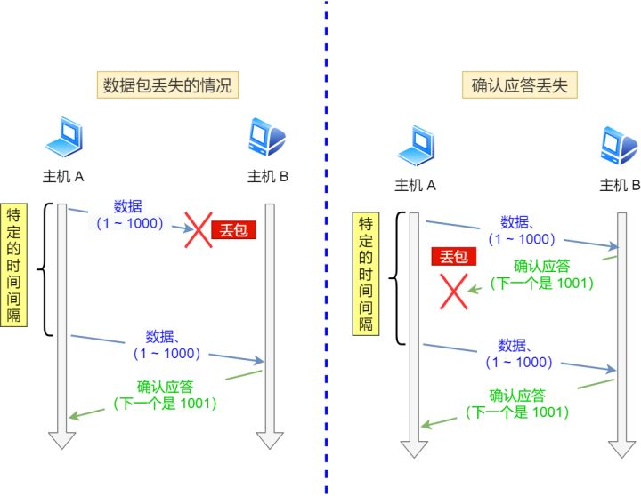

# 计算机网络

## 一、OSI、TCP/IP网络分层模型:airplane:

> 参考链接：[JavaGuide](https://javaguide.cn/cs-basics/network/osi&tcp-ip-model.html)

7层、5层和4层的对应关系：

### 1.1 OSI七层模型

**OSI七层模型**是国际标准化组织提出一个网络分层模型，其大体结构以及每一层提供的功能如下：

另外一种图：

总结图片：

### 1.2 TCP/IP四层模型

**TCP/IP四层模型**是目前被广泛采用的一种模型，可以将TCP/IP模型看作是OSI七层模型的精简版本，由以下4层组成：应用层、传输层、网络层、网络接口层。

需要注意的是，其实并不能将TCP/IP四层模型和OSI七层模型完全精确地匹配起来，不过可以简单地对应：

#### 应用层（Application Layer）

应用层位于传输层之上，主要**提供两个终端设备上的应用程序之间信息交换的服务**，它定义了信息交换的格式，**消息会交给下一层传输层来传输**，把应用层交互的数据单元称为**报文**。

应用层协议定义了**网络通信规则**，对于不同的网络应用需要不同的应用层协议。在互联网中应用层协议很多，如支持Web应用的HTTP协议、支持电子邮件的SMTP协议等。

##### HTTP

HTTP主要是**为浏览器与服务器之间的通信而设计的**。HTTP协议基于TCP协议，发送HTTP请求之前首先要建立TCP连接。目前使用的HTTP协议大部分都是1.1。另外，**HTTP协议是“无状态”的协议**，它无法记录客户端用户的状态，一般都是通过Session来记录客户端用户的状态。

##### SMTP

SMTP协议基于TCP协议，用来发送电子邮件。

###### 电子邮件的发送过程

比如发送方邮箱是`dabai@cszhinan.com`，要向`xiaoma@qq.com`发送邮件，整个过程可以简单分为下面几步：

1. 通过**SMTP**协议将写好的邮件交给163邮箱服务器（邮局）；
2. 163邮箱服务器发现接收方邮箱是qq邮箱，然后它使用SMTP协议将邮件转发到qq邮箱服务器；
3. qq邮箱服务器接收邮件之后就通知邮箱为`xiaoma@qq.com`的用户来收邮件，然后用户通过**POP3/IMAP**协议将邮件取出。

###### 如何判断邮箱真实存在

很多场景（比如邮件营销）下需要判断要发送的邮箱地址是否真的存在，这个时候可以利用SMTP协议来检测：

1. 查找邮箱域名对应的SMTP服务器地址；
2. 尝试与服务器建立连接；
3. 连接成功后尝试向需要验证的邮箱发送邮件；
4. 根据返回结果判定邮箱地址的真实性。

##### POP3/IMAP

**POP3和IMAP两者都是负责邮件接收的协议**。IMAP协议相比POP3，为用户提供的可选功能更多一点，几乎所有现代电子邮件客户端和服务器都支持IMAP，大部分网络邮件服务提供商都支持POP3和IMAP。

##### FTP

**FTP协议**主要提供文件传输服务，**基于TCP实现可靠的传输**。使用FTP传输文件的好处是可以屏蔽操作系统和文件存储方式。FTP是基于客户—服务器（C/S）模型而设计的，在客户端与FTP服务器之间建立两个连接。

FTP的独特优势，同时也是与其它客户服务器程序最大的不同点就在于**它在两台通信的主机之间使用了两条TCP连接**（其它客户服务器应用程序一般只有一条TCP连接）：

- 控制连接：用于传送控制信息（命令和响应）。
- 数据连接：用于数据传送。

这种将命令和数据分开传送的思想大大提高了FTP的效率。

##### SSH

**SSH**是目前较可靠，专为远程登录会话和其他网络服务提供安全性的协议。利用SSH协议可以有效防止远程管理过程中的信息泄露问题。**SSH建立在可靠的传输协议TCP之上**。

#### 传输层（Transport Layer）

传输层的主要任务就是**负责向两台终端设备进程之间的通信提供通用的数据传输服务**。应用进程**利用该服务传送应用层报文**。“通用的”是指并不针对某一个特定的网络应用，而是**多种应用可以使用同一个运输层服务**。

运输层主要使用以下两种协议：

- **传输控制协议TCP（Transmission Control Protocol）**：提供**面向连接的、可靠的**数据传输服务。
- **用户数据协议UDP（User Datagram Protocol）**：提供**无连接的、尽最大努力的**数据传输服务（**不保证数据传输的可靠性**）。

#### 网络层（Network Layer）

网络层负责为**分组网络中的不同主机提供通信服务**。在发送数据时，网络层把**运输层产生的报文段或用户数据报封装成“分组”或“包”进行传送**。在TCP/IP体系结构中，由于网络层使用IP协议，因此分组也叫IP数据报，简称**数据报**。

注意：**不要把运输层的用户数据报UDP和网络层IP数据报弄混**。

网络层还有一个任务就是**选择合适的路由，使源主机运输层所传下来的分组，能通过网络层中的路由器找到目的主机**。

互联网是由大量的异构（Heterogeneous）网络通过路由器（Router）相互连接起来的。互联网使用的网络层协议是无连接的网际协议（Inter Protocol）和许多路由选择协议，因此互联网的网络层也叫做**网际层**或**IP层**。

#### 网络接口层（Network Interface Layer）

可以把网络接口层看作是**数据链路层**和**物理层**的合体。

- 数据链路层（Data Link Layer）通常简称为链路层（两台主机之间的数据传输总是在一段一段的链路上）。数据链路层的作用是将**网络层交下来的IP数据报组装成帧，在两个相邻节点间的链路上传送帧**。每一帧包括数据和必要的控制信息（如同步信息、地址信息、差错控制等）。
- 物理层的作用是**实现相邻计算机节点之间比特流的透明传送**，尽可能地**屏蔽掉具体传输介质和物理设备的差异**。

### 1.3 网络层次与数据传递

> 参考链接：[Java全栈知识体系](https://pdai.tech/md/develop/protocol/dev-protocol-osi7.html#%E7%BD%91%E7%BB%9C%E5%B1%82%E6%AC%A1%E4%B8%8E%E6%95%B0%E6%8D%AE%E4%BC%A0%E9%80%92)

下图就是四层协议在数据传输过程中的工作方式，在发送端是应用层-->链路层这个方向的封包过程，每经过一层都会增加该层的头部；而接收端则是从链路层-->应用层解包的过程，每经过一层则会去掉相应的首部。

### 1.4 为什么要网络分层？

复杂的系统需要分层，因为每一层都需要专注于一类事情。**网络分层的原因也是一样，每一层只专注于做一类事情**。主要原因如下：

- **各层之间相互独立**：各层之间不需要关心其他层是如何实现的，只需要知道自己如何调用下层提供好的功能就可以了（**可以简单理解为接口调用**）。
- **提高了整体灵活性**：**每一层都可以使用最适合的技术来实现**，只需要保证提供的功能以及暴露的接口的规则没有改变就行了（**高内聚、低耦合**）。
- **大问题化小**：分层可以将复杂的网络间题分解为许多比较小的、界线比较清晰简单的小问题来处理和解决。这样使得复杂的计算机网络系统变得易于设计、实现和标准化（**系统功能分解**）。 

## 二、HTTP协议:airplane:

> 参考链接：/Reference/加油.pdf/计算机网络/HTTP

超文本传输协议，是一个基于请求与响应，无状态的，应用层的协议，常基于TCP/IP协议传输数据，互联网上应用最为广泛的一种网络协议，所有的WWW文件都必须遵守这个标准。设计HTTP的初衷是**为了提供一种发布和接收HTML页面的方法**。

HTTP协议是无状态的，指的是**协议对于事务处理没有记忆能力**，服务器不知道客户端是什么状态。也就是说，两次打开一个服务器上的网页间没有任何联系。**HTTP是一个无状态的面向连接的协议**，无状态不代表HTTP不能保持TCP连接，更不能代表HTTP使用的是UDP协议（无连接）。

### 2.1 报文结构

#### 请求报文

HTTP的请求报文由四部分组成（请求行+请求头+空行+请求体）。

**真实数据**：

#### 响应报文

HTTP的响应报文也由四部分组成（响应行+响应头+空行+响应体）。

**真实数据**：

### 2.2 HTTP方法

> 参考链接：[Java全栈知识体系](https://pdai.tech/md/develop/protocol/dev-protocol-http.html#%E4%BA%8C%E3%80%81http-%E6%96%B9%E6%B3%95)

- `GET`：获取资源。当前网络请求中，绝大部分使用`GET`方法。
- `POST`：传输实体主体。`POST`主要用来传输数据，而`GET`主要用来获取资源。
- `HEAD`：获取报文首部。和`GET`方法一样，但是不返回报文实体主体部分，主要用于确认URL的有效性以及资源更新的日期时间等。
- `PUT`：上传文件。由于自身不带验证机制，任何人都可以上传文件，因此存在安全性问题，一般不使用该方法。

#### `GET`和`POST`比较

> 参考链接：[Java全栈知识体系](https://pdai.tech/md/develop/protocol/dev-protocol-http.html#%E5%85%AB%E3%80%81get-%E5%92%8C-post-%E6%AF%94%E8%BE%83)

|        |          `GET`          |                            `POST`                            |
| :----: | :---------------------: | :----------------------------------------------------------: |
|  作用  |        获取资源         |                         传输实体主体                         |
|  参数  | 以查询字符串出现在URL中 |        存储在实体主体中（也可以通过一些抓包工具查看）        |
|  安全  |           :o:           | :x:（因为`POST`的目的是传送实体主体内容，这个内容可能是用户上传的表单数据，上传成功之后，服务器可能把这个数据存储到数据库中，因此状态也就发生了改变） |
| 幂等性 |           :o:           |                             :x:                              |

### 2.3 HTTP状态码

> 参考链接：[Java全栈知识体系](https://pdai.tech/md/develop/protocol/dev-protocol-http.html#%E4%B8%89%E3%80%81http-%E7%8A%B6%E6%80%81%E7%A0%81)

服务器返回的**响应报文**中第一行为状态行，包含了状态码以及原因短语，用来告知客户端请求的结果。

| 状态码 |               类别               |          原因短语          |
| :----: | :------------------------------: | :------------------------: |
|  1XX   |  Informational（信息型状态码）   |     接收的请求正在处理     |
|  2XX   |      Success（成功状态码）       |      请求正常处理完毕      |
|  3XX   |   Redirection（重定向状态码）    | 需要进行附加操作以完成请求 |
|  4XX   | Client Error（客户端错误状态码） |     服务器无法处理请求     |
|  5XX   | Server Error（服务器错误状态码） |     服务器处理请求出错     |

- 1XX 信息：
  - 100 Continue：表明到目前为止都很正常，客户端可以继续发送请求或者忽略这个响应。
- 2XX 成功：
  - 200 OK。
- 3XX 重定向：
  - 301 Moved Permanently：永久性重定向。
  - 302 Found：临时性重定向。
- 4XX 客户端错误：
  - 400 Bad Request：请求报文中存在语法错误。
  - 403 Forbidden：请求被拒绝。
  - 404 Not Found。
- 5XX 服务器错误：
  - 500 Internal Server Error：服务器正在执行请求时发生错误。

### 2.4 HTTP/1.1、HTTP/2、HTTP/3演变:airplane:

#### HTTP/1.1相比HTTP/1.0提高了什么性能？

HTTP/1.1相比HTTP/1.0性能上的改进：

- HTTP/1.1增加`Connection`字段，通过设置长连接（`Keep-Alive`）保持HTTP连接不断，避免每次客户端与服务器请求都要重复建立、释放TCP连接，**提高了网络的利用率**；HTTP/1.0每次发送请求，都需要进行一次TCP连接。
- 支持管道（pipeline）网络传输，只要第一个请求发出去了，不必等其响应回来，就可以发第二个请求出去，可以**减少整体的响应时间**；而 HTTP/1.0规定下一个请求必须在前一个请求响应到达之前才能发送，假设前一个请求响应一直不到达，那么下一个请求就不发送，后面的请求就阻塞了。

但HTTP/1.1还是有性能瓶颈：

- 请求/响应头部（Header）未经压缩就发送，首部信息越多延迟越大，只能压缩Body的部分。
- 发送冗长的首部。每次互相发送相同的首部造成的浪费较多。
- 服务器是按请求的顺序响应的，如果服务器响应慢，会招致客户端一直请求不到数据，也就是队头阻塞。
- 没有请求优先级控制。
- 请求只能从客户端开始，服务器只能被动响应。

#### 针对HTTP/1.1的性能瓶颈，HTTP/2做了什么优化？

HTTP/2协议是基于HTTPS的，所以HTTP/2的安全性也是有保障的。HTTP/2相比HTTP/1.1性能上的改进：

- **头部压缩**：HTTP/2会压缩头（Header）。如果同时发出多个请求，它们的头是一样的或是相似的，那么协议会消除重复。

- **二进制格式**：HTTP/2不再像HTTP/1.1里有纯文本形式的报文，而是全面采用了二进制格式。头信息和数据体都是二进制，并且统称为帧（frame）：头信息帧和数据帧。

  

- **多路复用**：HTTP/2是可以在一个连接中并发多个请求或回应，而不用按照顺序一一对应。移除了HTTP/1.1中的串行请求，不需要排队等待，也就不会再出现队头阻塞问题，降低了延迟，大幅度提高了连接的利用率。
  
- **数据流**：HTTP/2的数据包不是按顺序发送的，同一个连接里面连续的数据包，可能属于不同的回应。因此，必须要对数据包做标记，指出它属于哪个回应。每个请求或回应的所有数据包，称为一个数据流（Stream）。
  
- **服务器推送**：HTTP/2还在一定程度上改善了传统的请求—应答工作模式，服务不再是被动地响应，也可以主动向客户端发送消息。举例来说，在浏览器刚请求HTML的时候，就提前把可能会用到的JS、CSS文件等静态资源主动发给客户端，减少延时等待，也就是服务器推送（Server Push，也叫Cache Push）。

#### HTTP/2有哪些缺陷？HTTP/3做了哪些优化？

HTTP/2主要的问题在于：**多个HTTP请求在复用一个TCP连接，下层的TCP协议是不知道有多少个HTTP请求的**。所以一旦发生了丢包现象，就会触发TCP的重传机制，这样**在一个TCP连接中的所有的HTTP请求都必须等待这个丢了的包被重传回来**。所以HTTP/3把HTTP下层的TCP协议改成了UDP协议！

### 2.5 HTTPS协议

> 参考链接：[JavaGuide](https://javaguide.cn/cs-basics/network/http&https.html#https-%E5%8D%8F%E8%AE%AE)

#### 简介

HTTPS协议（Hyper Text Transfer Protocol Secure），是HTTP的加强安全版本。HTTPS是基于HTTP的，也是用TCP作为底层协议，并额外使用SSL/TLS协议用作加密和安全认证。默认端口号是443。HTTPS协议中，SSL通道通常使用**基于密钥的加密算法**，密钥长度通常是40比特或128比特。

#### HTTPS的核心—SSL/TLS协议:airplane:

HTTPS之所以能达到较高的安全性要求，就是结合了SSL/TLS和TCP协议，对通信数据进行加密，**解决了HTTP数据透明的问题**。

##### SSL和TLS区别？

SSL指安全套接字协议（Secure Sockets Layer），首次发布于1996年。SSL的首次发布其实已经是它的v3.0版本，SSL 1.0从未面世，SSL 2.0则具有较大的缺陷（DROWN 缺陷——Decrypting RSA with Obsolete and Weakened eNcryption）。很快，在1999年，SSL 3.0进一步升级，**新版本被命名为TLS 1.0**。因此，TLS是基于SSL之上的，但由于习惯叫法，通常把HTTPS中的核心加密协议混成为SSL/TLS。

##### SSL/TLS工作原理

###### 非对称加密

SSL/TLS的核心要素是**非对称加密**。非对称加密采用两个密钥——**一个公钥，一个私钥**。在通信时，**私钥仅由解密者保存，公钥由任何一个想与解密者通信的发送者（加密者）所知**。

可以设想一个场景：在某个自助邮局，每个通信信道都是一个邮箱，每一个邮箱所有者都在旁边立了一个牌子，上面挂着一把钥匙：这是我的公钥，发送者请将信件放入我的邮箱，并用公钥锁好。但是公钥只能加锁，并不能解锁。**解锁只能靠邮箱的所有者——因为只有他保存着私钥**。这样，通信信息就不会被其他人截获了，这**依赖于私钥的保密性**。

非对称加密的公钥和私钥需要采用一种复杂的数学机制生成（密码学认为，为了较高的安全性，尽量不要自己创造加密方案）。公私钥对的生成算法依赖于**单向陷门函数**。

###### 对称加密

使用SSL/TLS进行通信的双方需要使用非对称加密方案来通信，但是非对称加密设计了较为复杂的数学算法，在实际通信过程中，计算的代价较高，效率太低，因此，**SSL/TLS实际对消息的加密使用的是对称加密**：通信双方**共享唯一密钥k**，加解密算法已知，加密方利用密钥k加密，解密方利用密钥k解密，**保密性依赖于密钥k的保密性**。

对称加密的密钥生成代价比公私钥对的生成代价低得多，那么为什么SSL/TLS还需要使用非对称加密呢？**因为对称加密的保密性完全依赖于密钥的保密性**。在双方通信之前，需要商量一个用于对称加密的密钥。

网络通信的信道是不安全的，传输报文对任何人是可见的，密钥的交换肯定不能直接在网络信道中传输。因此，**使用非对称加密，对对称加密的密钥进行加密，保护该密钥不在网络信道中被窃听**。这样，**通信双方只需要一次非对称加密，交换对称加密的密钥，在之后的信息通信中，使用绝对安全的密钥，对信息进行对称加密，即可保证传输消息的保密性**。

##### SSL/TLS四次握手

> 参考链接：[B站](https://www.bilibili.com/video/BV1KY411x7Jp?spm_id_from=333.337.search-card.all.click&vd_source=a4700d73617e020bf5ecadbafbffc100)

1. **Client Hello**：客户端发送**Client Hello**消息开始通信，其中**包含客户端支持的TLS版本、加密套件和第1随机数**；
2. **Server Hello**：服务端可进行通信时，会返回**Server Hello**消息，其中包含**服务端确认支持的TLS版本、加密套件和第2随机数**，接着服务端发送**证书（Certificate）和公钥（Server Key Exchange）**，最后服务端发送**Server Hello Done**消息通知客户端，握手协商阶段结束；
3. **Client Key Exchange**：客户端收到服务端回应后，需要对证书进行验证。如果验证通过，客户端生成第3随机数（预主密钥），**使用第1随机数、第2随机数和预主密钥计算出会话密钥**，然后**使用收到的公钥对预主密钥进行加密再发送出去**；
4. **Server Finish**：服务端收到**加密的预主密钥**后，使用私钥对其**解密**，同样使用**第1随机数、第2随机数和预主密钥计算出会话密钥**，服务端和客户端计算出的会话密钥完全一致（**使用非对称加密得到会话密钥**），最后通知客户端握手成功。接下来，客户端与服务端开始加密通信（**使用会话密钥进行加密属于对称加密，会话密钥只应用在当前会话**）。

#### HTTP和HTTPS的比较

|          |                             HTTP                             |                            HTTPS                             |
| :------: | :----------------------------------------------------------: | :----------------------------------------------------------: |
|   协议   | **运行在TCP之上**，所有传输的内容都是明文，客户端和服务器端都无法验证对方的身份 | **运行在SSL/TLS之上，SSL/TLS运行在TCP之上**，所有传输的内容都经过加密 |
| URL前缀  |                          `http://`                           |                          `https://`                          |
|  端口号  |                              80                              |                             443                              |
|  安全性  |                              弱                              |                              强                              |
| 资源消耗 |                              低                              |                              高                              |

## 三、TCP协议:airplane:

### 3.1 头部格式

> 参考链接：/Reference/加油.pdf/计算机网络/TCP/UDP/TCP的三次握手四次挥手/TCP报文的头部结构

1. 源端口和目的端口：各占2个字节，分别写入源端口号和目的端口号。
2. 序号：`seq`序号（序列号），占32位，用来标识从TCP源端向目的端发送的字节流，发起方发送数据时对此进行标记。例如序号为301，表示第一个字节的编号为301，如果携带的数据长度为100字节，那么下一个报文段的序号应为401。
3. 确认序号：`ack`序号（确认号），占32位，只有ACK标志位为1时，确认序号字段才有效，$ack=seq+1$。
4. 标志位：共6个，即`URG`、`ACK`、`PSH`、`RST`、`SYN`、`FIN`等，具体含义如下：
   1. `URG`：紧急指针（urgent pointer）有效。
   2. `ACK`：确认序号有效。当$ACK=1$时确认号字段有效，否则无效。TCP规定：在连接建立后所有传送的报文段都必须把`ACK`置1。
   3. `PSH`：接收方应该尽快将这个报文交给应用层。
   4. `RST`：重置连接。
   5. `SYN`：发起一个新连接。在连接建立时用来同步序号。当$SYN=1、ACK=0$时表示这是一个连接请求报文段。若对方同意建立连接，则响应报文中$SYN=1，ACK=1$。
   6. `FIN`：释放一个连接。用来释放一个连接，当$FIN=1$时，表示此报文段的发送方的数据已发送完毕，并要求释放连接。
5. 窗口：占2字节，窗口值作为接收方让发送方设置其发送窗口的依据。之所以要有这个限制，是因为接收方的数据缓存空间是有限的。
6. 检验和：占2个字节，检验和字段检验的范围包括首部和数据这两个部分。计算检验和时，在TCP报文段的前面加上12字节的伪首部。

### 3.2 TCP的连接建立、数据传送和连接释放（自己总结）:rocket:

> 参考链接：/Reference/加油.pdf/计算机网络/TCP/UDP/TCP的三次握手四次挥手

### 3.3 TCP可靠性传输

> 参考链接：/Reference/加油.pdf/计算机网络/TCP/UDP/TCP的可靠性是如何保证的？、/Reference/加油.pdf/计算机网络/重传机制、滑动窗口、流量控制、拥塞控制

TCP协议保证数据传输可靠性的方式主要有：

- 校验和。
- 序列号/确认应答。
- 重传机制。
- 滑动窗口/流量控制。
- 拥塞控制。

#### 校验和

通过检验和的方式，接收端可以检测出来数据是否有差错和异常，假如有差错就会直接丢弃TCP段，重新发送。TCP在计算检验和时，会在TCP首部加上一个12字节的伪首部。检验和总共计算3部分：TCP首部、TCP数据、TCP伪首部。

#### 序列号/确认应答

序列号：即`seq`。确认应答：TCP传输的过程中，每次接收方收到数据后，都会对传输方进行确认应答，也就是发送ACK报文。这个ACK报文当中带有对应的确认序列号，告诉发送方：接收到了哪些数据，下一次的数据从哪里发。

序列号的作用不仅仅是应答，有了序列号能够将接收到的数据根据序列号排序，并且去掉重复序列号的数据。这也是TCP传输可靠性的保证之一。

#### 重传机制

TCP要保证所有的数据包都可以到达，所以必须要有**重传机制**，包括：超时重传、快速重传、SACK和D-SACK。

##### 超时重传

超时重传：在发送数据时，设定一个定时器，当超过指定的时间还没有收到对方的`ACK`确认应答报文时，就会重发该数据。TCP会在两种情况下发生超时重传：数据包丢失和确认应答丢失。

##### 快速重传

快速重传（Fast Retransmit）机制：不以时间为驱动，而是以数据驱动重传。**相当于超时重传是定时器，快速重传是计数器**。

原理：在接收方，要求每次接收到报文段都应该对最后一个已收到的有序报文段进行确认。在发送方，如果收到3个重复确认，那么可以知道下一个报文段丢失，此时执行快速重传，立即重传下一个报文段。所以，快速重传的工作方式是：**当收到3个相同的`ACK`报文时，会在定时器过期之前，重传丢失的报文段**。

快速重传只解决了一个问题，即**超时的问题**，但它依然面临一个艰难的选择：**是重传之前的一个数据还是重传所有数据的问题**。

##### SACK

还有一种实现重传机制的方式叫：SACK（Selective Acknowledgment），这种方式需要在TCP头部字段里加一个叫“SACK”的东西，它可以将缓存发送给发送方，**这样发送方就可以知道哪些数据收到了，哪些数据没收到**，知道了这些信息，就可以只重传丢失的数据。

##### D-SACK

D-SACK（Duplicate SACK），**主要使用了SACK来告诉发送方有哪些数据被重复接收了**。引入了D-SACK，有这么几个好处：

- 可以让发送方知道，是**发出去的包丢了，还是回来的`ACK`包丢了**。
- 可以知道是否网络上出现了先发的包后到的情况（网络延迟）。
- 可以知道是否网络上把发送的数据包复制了。

#### 滑动窗口/流量控制

滑动窗口的引入主要是为了**控制发送方发送速率，保证接收方来得及接收**。窗口是缓存的一部分，用来暂时存放字节流。发送方和接收方各有一个窗口，**接收方通过TCP报文段中的窗口字段告诉发送方自己的窗口大小，发送方根据这个值和其它信息设置自己的窗口大小**。

##### 发送窗口

图中是发送方缓存的数据，根据处理情况分成四个部分，其中深蓝色方框是发送窗口，紫色方框是可用窗口：

- \#1是已发送并收到`ACK`确认的数据：1~31字节。
- \#2是已发送但未收到`ACK`确认的数据：32~45字节。
- \#3是未发送但总大小在接收方处理范围内的数据（接收方还有空间）：46~51字节。
- \#4是未发送但总大小超过接收方处理范围的数据（接收方没有空间）：52~56字节。

##### 接收窗口

接收窗口相对简单一些，根据处理的情况划分成三个部分：

- \#1和\#2是已成功接收并确认的数据（等待应用进程读取）。
- \#3是未收到但可以接收的数据。
- \#4是未收到并且不可以接收的数据。

##### 两个窗口大小相等吗？

并不是完全相等，滑动窗口并不是一成不变的。比如，当接收方的应用进程读取数据速度非常快的话，接收窗口可以很快空缺出来，那么新的接收窗口大小通过TCP报文中的`Windows Size`字段来告诉发送方。所以接收窗口和发送窗口是约等于的关系。

##### 流量控制

如果发送方发送数据过快，接收方可能会来不及接收，这就会造成数据的丢失。流量控制是**为了控制发送的速率以保证接收方来得及接收**，可以通过滑动窗口机制实现。接收方发送确认报文的时候会将自己的窗口大小告知发送方，从而影响发送方的发送速率。将窗口字段设为0，则发送方不能发送数据。

**补充**：如果接收方之前告知自己窗口大小为0，过一段时间后又想接收数据了，告知自己窗口为10，但是这个报文丢失了，就会导致**死锁局面**，即发送方不发送数据而接收方一直在等待接收数据的情况。**解决方法**：TCP为每个连接设有一个**持续定时器**，只要一方收到对方的零窗口通知，就启动持续计时器。如果持续计时器超时，就会发送窗口探测（Window probe）报文，而对方在确认这个探测报文时会给出自己现在的接收窗口大小。

#### 拥塞控制

如果网络出现拥塞，发送方会继续重传数据，这会导致网络拥塞程度更高。因此当出现拥塞时，应当控制发送方的速率。这一点和流量控制很像，但是出发点不同。**流量控制是为了让接收方能来得及接收，而拥塞控制是为了降低整个网络的拥塞程度**。

TCP主要通过四种算法来进行拥塞控制：慢开始、拥塞避免、快重传、快恢复。发送方需要维护一个叫做拥塞窗口（`cwnd`）的状态变量，**注意拥塞窗口与发送方窗口的区别：拥塞窗口只是一个状态变量，实际决定发送方能发送多少数据的是发送方窗口**。

发送窗口`swnd`和接收窗口`rwnd`是约等于的关系，由于加入了拥塞窗口的概念，此时发送窗口$swnd=min(cwnd, rwnd)$ ，也就是拥塞窗口和接收窗口中的较小值。

拥塞窗口`cwnd`变化的规则：只要网络中没有出现拥塞，`cwnd`就会增大；如果网络中出现了拥塞， `cwnd`就会减小。

##### 如何知道网络出现了拥塞？

只要发送方**在规定时间内没有收到对方的确认报文**，就可以判断网络中出现了拥塞。

##### 慢开始和拥塞避免

发送最初执行**慢开始**，令$cwnd=1$，发送方只能发送1个报文段；当收到确认后，将`cwnd`加倍，因此之后发送方能够发送的报文段数量为：2、4、8...。

慢开始每个轮次都将`cwnd`加倍，这样会让`cwnd`增长速度非常快，网络拥塞的可能也就更高。所以设置了一个慢开始门限`ssthresh`。当$cwnd>=ssthresh$时，进入**拥塞避免**，每个轮次只将`cwnd`加1。如果出现了超时，则令$ssthresh=cwnd/2, cwnd=1$，然后重新执行慢开始。

##### 快重传和快恢复

在接收方，要求每次接收到报文段都应该对最后一个已收到的有序报文段进行确认。例如已经接收到M1和M2，此时收到M4，应当发送对M2的确认。在发送方，如果收到三个重复确认，那么可以知道下一个报文段丢失，此时执行**快重传**，立即重传下一个报文段。例如收到三个对M2的确认，则M3丢失，立即重传M3。在这种情况下，只是丢失个别报文段，而不是网络拥塞。因此执行**快恢复**， 令$ssthresh=cwnd/2,cwnd=ssthresh$，注意到此时直接进入拥塞避免，即每个轮次只将`cwnd`加1。

注意：快恢复时将`cwnd`设得再大一点（$ssthresh+3$）的理由：既然发送方收到3个重复的确认，就表明有3个分组已经离开了网络。这3个分组不再消耗网络的资源而是停留在接收方的缓存中。可见现在网络中并不是堆积了分组而是减少了3个分组（相对而言），因此可以适当把`cwnd`扩大些。

##### 流程图

### 3.4 TCP粘包拆包

> 参考：/Reference/java面经/网络篇/9

**TCP传输数据基于字节流**，从应用层到TCP传输层的多个数据包是一连串的字节流（没有边界），而且TCP首部并没有记录数据包的长度，所以**TCP传输数据的时候可能会发送粘包和拆包的问题**；而**UDP传输基于数据报**，其首部也记录了数据报的长度，可以轻易地区分不同数据包的边界。

**造成粘包和拆包现象的原因**：

- 粘包：
  - 要发送的数据包小于TCP发送缓冲区剩余空间，TCP将多个数据包写满发送缓冲区一次发送。
  - 接收端没有及时读取TCP 发送缓冲区中的数据包。
- 拆包：
  - TCP发送缓冲区剩余空间不足以发送一个完整的数据包。
  - 要发送的数据超过了最大报文长度的限制。

**粘包拆包的解决方法**：

- **发送端给数据包添加首部，首部中添加数据包的长度属性**，这样接收端通过首部中的长度字段就可以知道数据包的实际长度。
- 针对发送的数据包小于缓冲区大小的情况，**发送端可以将不同的数据包规定成同样的长度**，不足这个长度的补充`0`，接收端从缓冲区读取固定的长度数据这样就可以区分不同的数据包。
- **发送端给不同的数据包添加间隔符合确定边界**，接收端通过这个间隔符合就可以区分不同的数据包。

## 四、UDP协议:boat:

> 参考链接：[Java全栈知识体系](https://pdai.tech/md/develop/protocol/dev-protocol-udp.html)

### 4.1 概述

UDP（User Datagram Protocol）即**用户数据报协议**，在网络中它与TCP协议一样用于处理数据包，是一种无连接的协议。在OSI模型中，处于第四层——传输层，位于IP协议上一层。UDP用来支持那些需要在计算机之间传输数据的网络应用，包括网络视频会议系统在内的众多的客户/服务器模式的网络应用都需要使用UDP协议。

UDP报文没有可靠性保证、顺序保证和流量控制字段等，可靠性较差。但是正因为UDP协议的控制选项较少，**在数据传输过程中延迟小、数据传输效率高**，适合对可靠性要求不高的应用程序，或者可以保障可靠性的应用程序，如DNS、TFTP、SNMP等。

### 4.2 UDP特点

UDP提供不可靠服务，具有TCP所没有的优势：

- **UDP无连接**，时间上不存在建立连接需要的时延。

  空间上，**TCP需要在端系统中维护连接状态，需要一定的开销**。此连接状态包括接收和发送缓存，拥塞控制参数和序号与确认号的参数；**UDP不维护连接状态**，也不跟踪这些参数，开销小。空间和时间上都具有优势。 举个例子：

  - DNS如果运行在TCP之上而不是UDP，那么DNS的速度将会慢很多。
  - HTTP使用TCP而不是UDP，是因为对于基于文本数据的Web网页来说，可靠性很重要。
  - 同一种专用应用服务器在支持UDP时，一定能支持更多的活动客户机。

- **分组首部开销小**，TCP首部20字节，UDP首部8字节。

- **UDP没有拥塞控制**，应用层能够更好的控制要发送的数据和发送时间，网络中的拥塞控制也不会影响主机的发送速率。某些实时应用要求以稳定的速度发送，能容 忍一些数据的丢失，但是不能允许有较大的时延（比如实时视频，直播等）。

- **UDP提供尽最大努力的交付，不保证可靠交付**。所有维护传输可靠性的工作需要用户在应用层来完成。**没有TCP的确认机制、重传机制**。如果因为网络原因没有传送到对端，UDP也不会给应用层返回错误信息。

- **UDP是面向报文的**，对应用层交下来的报文，添加首部后直接向下交付到IP层，既不合并，也不拆分，保留这些报文的边界。对IP层交上来UDP用户数据报，在去除首部后就原封不动地交付给上层应用进程，**报文不可分割，是UDP数据报处理的最小单位**。 正是因为这样，UDP显得不够灵活，不能控制读写数据的次数和数量。

- **UDP常用于一次性传输比较少量数据的网络应用**，如DNS、SNMP等，因为对于这些应用，若是采用TCP，**连接的创建，维护和拆除带来不小的开销**。UDP也常用于多媒体应用（如IP电话，实时视频会议，流媒体等）数据的可靠传输对他们而言并不重要，TCP的拥塞控制会使他们有较大的延迟，也是不可容忍的。

- **UDP支持一对一、一对多、多对一和多对多的交互通信**。

还要注意的是：

- IP数据报要经过互连网中许多路由器的存储转发；UDP用户数据报是在**运输层的端到端抽象的逻辑信道中传送**的。

UDP对应用层交下来的报文，**既不合并也不拆分，而是保留这些报文的边界**。应用层交给UDP多长的报文，**UDP就照样发送，即一次发送一个报文**。

### 4.3 UDP首部格式

- **源端口**：占16位，源端口号，在需要对方回信时选用，不需要时可用全0。
- **目的端口**：占16位，目的端口号，这在终点交付报文时必须使用。
- **长度**：占16位，UDP用户数据报的长度，其最小值是8（仅有首部）。
- **检验和**：占16位，检测UDP用户数据报在传输中是否有错，有错就丢弃。

在计算检验和时，**临时把“伪首部”和UDP用户数据报连接在一起**。伪首部仅仅是为了计算检验和。

注意：虽然在UDP之间的通信要用到其端口号，但由于UDP的通信是无连接的，因此**不需要使用套接字**。

#### UDP校验

UDP校验和的计算方法和IP数据报首部校验和的计算方法相似，都**使用二进制反码运算求和再取反**，但不同的是：**IP数据报的校验和只检验IP数据报和首部，但UDP的校验和是把首部和数据部分一起校验**。

在发送方，首先是把全零放入校验和字段并且添加伪首部，然后把UDP数据报看成是由许多16位的子串连接起来，若UDP数据报的数据部分不是偶数个字节，则要在数据部分末尾增加一个全零字节（此字节不发送），接下来就按照二进制反码计算出这些16位字的和。将此和的二进制反码写入校验和字段；在接收方，把收到的UDP数据报加上伪首部（如果不为偶数个字节，还需要补上全零字节）后，按二进制反码计算出这些16位字的和。**当无差错时其结果全为1，否则就表明有差错出现，接收方应该丢弃这个UDP数据报**。

例子：

注意：

- 校验时，若UDP数据报部分的长度不是偶数个字节，则**需要填入一个全0字节**，但是次字节和伪首部一样，是不发送的。
- 如果UDP校验和校验出UDP数据报是错误的，**可以丢弃，也可以交付上层，但是要附上错误报告，告诉上层这是错误的数据报**。
- 通过伪首部，不仅可以检查源端口号、目的端口号和UDP用户数据报的数据部分，还可以检查IP数据报的源IP地址和目的地址。 **这种差错检验的检错能力不强，但是简单，速度快**。

### 4.4 TCP和UDP的比较

> 参考链接：[JavaGuide](https://javaguide.cn/cs-basics/network/other-network-questions.html#tcp-udp-%E5%8D%8F%E8%AE%AE%E7%9A%84%E5%8C%BA%E5%88%AB)

|              |                TCP                 |          UDP           |
| :----------: | :--------------------------------: | :--------------------: |
| 是否面向连接 |                :o:                 |          :x:           |
| 传输是否可靠 |                :o:                 |          :x:           |
|   传输形式   |               字节流               |       数据报文段       |
|   传输效率   |                 慢                 |           快           |
|   所需资源   |                 多                 |           少           |
|   应用场景   | 通信数据可靠（文件传输、邮件传输） | 通信速度高（域名转换） |
|   首部字节   |               20-60                |           8            |

## 五、IP协议:boat:

> 参考链接：[Java全栈知识体系](https://pdai.tech/md/develop/protocol/dev-protocol-ip.html)

### 2.1 IP及配套协议详解

因为网络层是整个互联网的核心，因此应当让网络层尽可能简单。网络层向上只提供简单灵活的、无连接的、尽最大努力交互的数据报服务。使用IP协议，可以**把异构的物理网络连接起来**，使得在网络层看起来好像是一个统一的网络。

与IP协议配套使用的还有三个协议：

- 地址解析协议ARP（Address Resolution Protocol）。
- 网际控制报文协议ICMP（Internet Control Message Protocol）。
- 网际组管理协议IGMP（Internet Group Management Protocol）。

#### IP数据报格式

- **版本**：有4（IPv4）和6（IPv6）两个值。
- **首部长度**：占4位，因此最大值为15。值为1表示的是1个32位字的长度，也就是**4字节**。因为固定部分长度为20字节，因此该值**最小为5**。如果可选字段的长度不是4字节的整数倍，就用尾部的填充部分来填充。
- **区分服务**：用来获得更好的服务，一般情况下不使用。
- **总长度**：包括首部长度和数据部分长度。
- **生存时间**：TTL，它的存在是为了防止无法交付的数据报在互联网中不断兜圈子。以路由器跳数为单位，当TTL为0时就丢弃数据报。
- **协议**：指出携带的数据应该上交给哪个协议进行处理，例如ICMP、TCP、UDP等。
- **首部检验和**：因为数据报每经过一个路由器，都要重新计算检验和，因此检验和不包含数据部分可以减少计算的工作量。
- **标识**：在数据报长度过长从而发生分片的情况下，相同数据报的不同分片具有相同的标识符。
- **片偏移**：和标识符一起，用于发生分片的情况。**片偏移的单位为8字节**。

#### IP地址编码方式

IP地址的编址方式经历了三个历史阶段：分类、子网划分和无分类。

##### 分类

由两部分组成，**网络号**和**主机号**，其中不同分类具有不同的网络号长度，并且是固定的。

$IP地址::=\{<网络号>, <主机号>\}$

##### 子网划分

在主机号字段中拿一部分作为子网号，把两级IP地址划分为三级IP地址。

$IP地址::=\{<网络号>, <子网号>, <主机号>\}$

要使用子网，必须配置子网掩码。一个B类地址的默认子网掩码为255.255.0.0。如果B类地址的子网占两个比特，那么子网掩码为11111111 11111111 **11**000000 00000000，也就是255.255.192.0。

注意，外部网络看不到子网的存在。

##### 无分类

无分类编址CIDR消除了传统A类、B类和C类地址以及划分子网的概念，使用网络前缀和主机号来对IP地址进行编码，网络前缀的长度可以根据需要变化。

$IP地址::=\{<网络前缀号>, <主机号>\}$

CIDR记法采用在IP地址后面加上网络前缀长度的方法，例如128.14.35.7/20表示前20位为网络前缀。CIDR的地址掩码可以继续称为子网掩码，子网掩码首1长度为网络前缀的长度。

一个CIDR地址块中有很多地址，一个CIDR表示的网络就可以表示原来的很多个网络，并且在路由表中只需要一个路由就可以代替原来的多个路由，减少了路由表项的数量。把这种通过使用网络前缀来减少路由表项的方式称为路由聚合，也称为**构成超网** 。

在路由表中的项目由“网络前缀”和“下一跳地址”组成，在查找时可能会得到不止一个匹配结果，应当采用最长前缀匹配来确定应该匹配哪一个。

#### 地址解析协议ARP

**网络层实现主机之间的通信，而链路层实现具体每段链路之间的通信**。因此在通信过程中，IP数据报的源地址和目的地址始终不变，而**MAC地址随着链路的改变而改变**。

ARP实现**由IP地址得到MAC地址**。每个主机都有一个ARP高速缓存，里面有本局域网上的各主机和路由器的IP地址到MAC地址的映射表。如果主机A知道主机B的IP地址，但是ARP高速缓存中没有该IP地址到MAC地址的映射，此时**主机A通过广播的方式发送ARP请求分组，主机B收到该请求后会发送ARP响应分组给主机A告知其MAC地址，随后主机A向其高速缓存中写入主机B的IP地址到MAC地址的映射**。

#### 网际控制报文协议ICMP

CMP是为了更有效地转发IP数据报和提高交付成功的机会。它封装在IP数据报中，但是不属于高层协议。

ICMP报文分为**差错报告报文**和**询问报文**。

##### ping

Ping是ICMP的一个重要应用，主要用来**测试两台主机之间的连通性**。Ping的原理是：通过向目的主机发送ICMP Echo请求报文，目的主机收到之后会发送Echo回答报文。**Ping会根据时间和成功响应的次数估算出数据包往返时间以及丢包率**。

##### Traceroute

Traceroute是ICMP的另一个应用，用来跟踪**一个分组从源点到终点的路径**。Traceroute发送的IP数据报封装的是无法交付的UDP用户数据报，并由目的主机发送终点不可达差错报告报文。

**源主机向目的主机发送**一连串的IP数据报：

1. 第一个数据报P1的生存时间TTL设置为1，当P1到达路径上的第一个路由器R1时，R1收下它并把TTL减 1，此时TTL等于0，R1就把P1丢弃，并向源主机发送一个ICMP时间超过差错报告报文；
2. 源主机接着发送第二个数据报P2，并把TTL设置为2。P2先到达R1，R1收下后把TTL减1再转发给R2，R2收下后也把TTL减1，由于此时TTL等于0，R2就丢弃P2，并向源主机发送一个ICMP时间超过差错报文。

不断执行以上步骤，直到最后一个数据报刚刚到达目的主机，主机不转发数据报，也不把TTL值减1。但是因为数据报封装的是无法交付的UDP，因此目的主机要向源主机发送**ICMP终点不可达差错报告报文**。最后源主机知道了到达目的主机所**经过的路由器IP地址以及到达每个路由器的往返时间**。

### 2.2 IPV6详解

我国在2014-2015年也逐步停止了向新用户和应用分配IPv4地址。 解决IP地址耗尽的根本措施就是采用具有更大地址空间的新版本的IP，即IPv6。所引进的主要变化如下：

- **更大的地址空间**。IPv6将地址从IPv4的32位增大到了128位。
- 扩展的地址层次结构。
- 灵活的首部格式。IPv6定义了许多可选的扩展首部。
- 改进的选项。IPv6允许数据报包含有选项的控制信息，其选项放在有效载荷中。
- 允许协议继续扩充。
- 支持即插即用（即自动配置）。因此IPv6不需要使用DHCP。
- 支持资源的预分配。IPv6支持实时视像等要求，保证一定的带宽和时延的应用。
- IPv6首部改为8字节对齐。首部长度必须是8字节的整数倍，而原来的IPv4首部是4字节对齐。

#### IPv6数据报格式

#### IPv4向IPv6过渡

向IPv6过渡只能采用逐步演进的办法，同时还必须使新安装的IPv6系统能够向后兼容：IPv6系统必须能够接收和转发IPv4分组，并且能够为IPv4分组选择路由。两种向IPv6过渡的策略：

- 使用双协议栈。
- 使用隧道技术。

##### 双协议栈

双协议栈：**主机在和IPv6主机通信时是采用IPv6地址，而和IPv4主机通信时就采用IPv4地址**。根据DNS返回的地址类型可以确定使用IPv4地址还是IPv6地址。

##### 隧道技术

在IPv6数据报要进入IPv4网络时，**把IPv6数据报封装成为IPv4数据报**，整个IPv6数据报变成了IPv4数据报的数据部分。当IPv4数据报离开IPv4网络中的隧道时，再把数据部分（即原来的IPv6数据报）交给主机的IPv6协议栈。

### 2.3 IP与MAC之间关系

#### 整体与局部

信息传递时需要知道的其实是两个地址：终点地址（Final destination address）和下一跳的地址（Next hop address）。**IP地址本质上是终点地址**，它在跳过路由器（Hop）的时候不会改变，**而MAC地址则是下一跳的地址，每跳过一次路由器都会改变**。这就是为什么还要用MAC地址的原因之一，它起到了**记录下一跳的信息的作用**。注：一般来说IP地址经过路由器是不变的，不过NAT（Network address translation）例外，这也是有些人反对NAT而支持IPV6的原因之一。

#### 分层实现

如果在IP数据报头（Header）中增加了”下一跳IP地址“这个字段，在逻辑上来说，**如果IP地址够用，交换机也支持根据IP地址转发（现在的二层交换机不支持这样做），其实MAC地址并不是必要的**。但用MAC地址和IP地址两个地址分别表示物理地址和逻辑地址是有好处的：**这样分层可以使网络层与链路层的协议更灵活地替换**，网络层不一定非要用IP协议，链路层也不一定非用以太网协议。

#### 早期的以太网实现

早期的以太网只有集线器（Hub）而没有交换机（Switch），**所以发出去的包能被以太网内的所有机器监听到，因此要附带上MAC地址，每个机器只需要接受与自己MAC地址相匹配的包**。

### 2.4 网络地址转换NAT

在专用网上**使用专用地址的主机如何与互联网上的主机通信**（并不需要加密）？

采用网络地址转换NAT，这是目前使用得最多的方法。装有NAT软件的路由器叫作NAT路由器，它至少有一个有效的外部全球IP地址，所有使用本地地址的主机在和外界通信时，都要在NAT路由器上将其本地地址转换成全球IP地址。

通过NAT路由器的通信**必须由专用网内的主机发起**。专用网内部的主机不能充当服务器用，因为互联网上的客户无法请求专用网内的服务器提供服务。

#### 转换过程

1. 内部主机A用本地地址IPA和互联网上主机B通信，所发送的数据报必须经过NAT路由器；
2. NAT路由器将数据报的**源地址IPA转换成全球地址IPG**，并把转换结果**记录到NAT地址转换表中**，目的地址IPB保持不变，然后发送到互联网；
3. NAT路由器收到主机B发回的数据报时，**知道数据报中的源地址是IPB而目的地址是IPG**；
4. 根据第2步记录的NAT转换表，NAT路由器将**目的地址IPG转换为IPA**，转发给最终的内部主机A。

可以看出，在内部主机与外部主机通信时，在NAT路由器上发生了两次地址转换：

- 离开专用网时：替换源地址，将内部地址替换为全球地址。
- 进入专用网时：替换目的地址，将全球地址替换为内部地址。

## 六、常见问题:airplane:

### 6.1 从输入URL到页面显示发生了什么？

> 参考链接：[JavaGuide](https://javaguide.cn/cs-basics/network/other-network-questions.html#%E5%9C%A8%E6%B5%8F%E8%A7%88%E5%99%A8%E4%B8%AD%E8%BE%93%E5%85%A5-url-%E5%9C%B0%E5%9D%80-%E6%98%BE%E7%A4%BA%E4%B8%BB%E9%A1%B5%E7%9A%84%E8%BF%87%E7%A8%8B-%E9%9D%A2%E8%AF%95%E5%B8%B8%E5%AE%A2)

流程：

1. 浏览器查找域名的IP地址（DNS查找过程：浏览器缓存、路由器缓存、DNS缓存）；
2. 浏览器向Web服务器发送一个HTTP请求（Cookie会随着请求发送给服务器）；
3. 服务器处理请求（根据请求生成HTML响应）；
4. 服务器返回一个HTML响应；
5. 浏览器开始显示页面。

涉及的协议：

- DNS：获取域名对应IP。
- TCP：与服务器建立连接。
- IP：建立TCP协议时需要发送数据，在网络层使用IP协议。
- OSPF：IP数据在路由器之间，路由选择使用OSPF协议。
- ARP：路由器在与服务器通信时，需要将IP地址转换为MAC地址，需要使用ARP协议。
- HTTP：在TCP建立完成后，使用HTTP协议访问网页。

### 6.2 HTTP是不保存状态的协议，如何保存用户状态？

> 参考链接：[JavaGuide](https://javaguide.cn/cs-basics/network/other-network-questions.html#http-%E6%98%AF%E4%B8%8D%E4%BF%9D%E5%AD%98%E7%8A%B6%E6%80%81%E7%9A%84%E5%8D%8F%E8%AE%AE-%E5%A6%82%E4%BD%95%E4%BF%9D%E5%AD%98%E7%94%A8%E6%88%B7%E7%8A%B6%E6%80%81)

HTTP是一种不保存状态，即无状态（Stateless）协议，也就是说HTTP协议自身不对请求和响应之间的通信状态进行保存。那么怎么保存用户状态呢？

Session机制的存在就是为了解决这个问题，**Session的主要作用就是通过服务端记录用户的状态**。在服务端保存Session的方法很多，最常用的就是内存和数据库（比如是使用内存数据库Redis保存)。既然Session存放在服务器端，那么如何实现Session跟踪呢？大部分情况下都是通过在Cookie中附加一个SessionID的方式来实现跟踪。

如果Cookie被禁用，最常用的方式就是**利用URL重写把Session ID直接附加在URL路径的后面**。

### 6.3 Cookie、Session、Token

> 参考：/Reference/加油.pdf/计算机网络/常见问题

#### 什么是Cookie？

Cookie是由Web服务器保存在用户浏览器上的小文件（Key-Value格式），包含用户相关的信息。客户端向服务器发起请求，如果服务器需要记录该用户状态，就**使用`response`向客户端浏览器颁发一个Cookie，客户端浏览器会把Cookie保存起来**。当浏览器再次请求该网站时，浏览器把请求的网址连同该Cookie一同提交给服务器，服务器通过检查该Cookie来辨认用户身份。

#### 什么是Session？

Session是依赖Cookie实现的。Session是服务器端对象。Session是浏览器和服务器会话过程中在服务器分配的一块储存空间。**服务器默认为浏览器在Cookie中设置SessionId**，浏览器在向服务器请求过程中传输Cookie，**服务器根据SessionId获取会话中存储的信息，然后确定会话的身份信息**。

#### Cookie和Seesion的比较

- 存储位置与安全性：**Cookie存放在客户端上**，安全性较差；**Session数据存放在服务器上**，安全性相对更高；
- 存储空间：**单个Cookie保存的数据不能超过4K**，很多浏览器都限制一个站点最多保存20个Cookie；**Session无此限制**。
- 占用服务器资源：Session一定时间内保存在服务器上，当访问增多，占用服务器性能，考虑到服务器性能，应当使用Cookie。

#### 什么是Token？

如果客户端频繁地向服务端请求数据，那么服务端就要频繁地去数据库查询用户名和密码并进行对比，这样会极大增加服务器压力。在这样的背景下，Token应运而生。

Token是服务端生成的一串字符串，用作客户端进行请求的令牌。**当第一次登录后，服务器生成一个Token并返回给客户端**，以后**客户端只需带上这个Token前来请求数据即可**，无需再次带上用户名和密码，这样可以减轻服务器的压力。

#### Session和Token的比较

- **Session存储在服务器端**，**Token存储在客户端**。
- Token提供认证和授权功能，提供身份认证时Token安全性比Session好。
- Session只适用于客户端代码和服务端代码运行在**同一台服务器上**的情况，**Token适用于项目级的场景**（前后端分离，运行在不同的服务器上）。

### 6.4 路由器和交换机的区别

> 参考：/Reference/加油.pdf/计算机网络/常见问题

- 路由器工作在网络层，而交换机工作在数据链路层。
- 路由器转发依据IP地址，而交换机转发依据MAC地址。
- 交换机主要用于组建局域网，而路由器主要将交换机组建好的局域网互连起来，或者接入互联网。
- 交换机能做的，路由器基本都能做。路由器可以提供防火墙，但是交换机不行。

### 6.5 Forward和Redirect的区别

> 参考：/Reference/java面经/网络篇/2

- 浏览器URL地址：**Forward是服务器内部的重定向，所以浏览器的URL地址是不会变化的**；Redirect是客户端请求服务器，然后**服务器给客户端返回了一个302状态码和新的location（对应URL地址）**，客户端重新发起HTTP请求，浏览器的URL地址发生了变化。
- 数据的共享：Forward是服务器内部的重定向，request在整个过程中是不变的，其中的信息在servlet间是共享的；Redirect发起了两次HTTP请求，分别使用不同的request。
- 请求的次数：Forward只有一次请求；Redirect有两次请求。