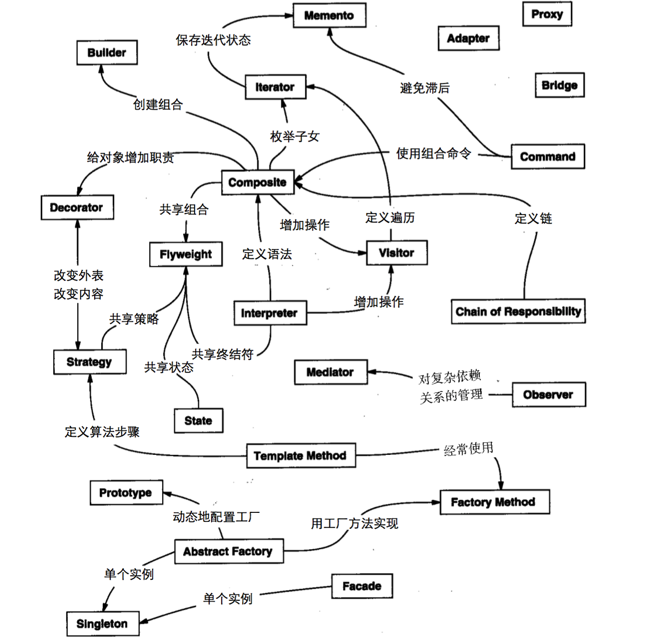
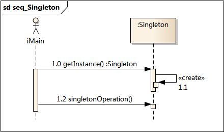
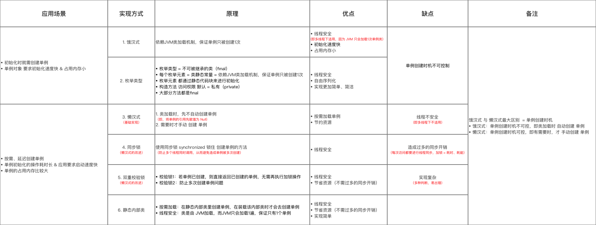

# 设计模式

## 一、24大设计模式和7个原则:boat:

> 参考链接：[Java全栈知识体系](https://pdai.tech/md/dev-spec/pattern/1_overview.html#24%E5%A4%A7%E8%AE%BE%E8%AE%A1%E6%A8%A1%E5%BC%8F%E5%92%8C7%E4%B8%AA%E5%8E%9F%E5%88%99)

### 1.1 24大设计模式

#### 创建型设计模式

- 单例模式（Singleton pattern）：确保**一个类只有一个实例**，并提供该实例的全局访问点。

- 简单工厂（Simple Factory）：**把实例化的操作单独放到一个类中，这个类就成为简单工厂类**，让**简单工厂类来决定应该用哪个具体子类来实例化**，这样做能把客户类和具体子类的实现解耦，客户类不再需要知道有哪些子类以及应当实例化哪个子类。

- 工厂方法（Factory Method）：定义了一个创建对象的接口，但**由子类决定要实例化哪个类**。工厂方法把实例化操作推迟到子类。

- 抽象工厂（Abstract Factory）：抽象工厂模式创建的是对象家族，也就是很多对象，并且这些对象是相关的，也就是说**必须一起创建出来**。而工厂方法模式只是用于创建一个对象，这和抽象工厂模式有很大不同。

- 生成器（Builder）：封装一个对象的构造过程，并允许按步骤构造。

- 原型模式（Prototype）：使用原型实例指定要创建对象的类型，通过**复制这个原型来创建新对象**。

#### 结构型设计模式

- 外观模式（Facade pattern）：提供了一个统一的接口，用来访问子系统中的一群接口，从而让子系统更容易使用。

- 适配器模式（Adapter pattern）：**将一个类的接口转换成客户期望的另一个接口**。适配器让原本接口不兼容的类可以合作无间。对象适配器使用组合，类适配器使用多重继承。

- 桥接模式（Bridge pattern）：使用桥接模式通过将实现和抽象放在两个不同的类层次中而使它们可以独立改变。

- 组合模式（Composite pattern）：允许将对象组合成树形结构来表现"整体/部分"层次结构，组合能让客户以一致的方式处理个别对象以及对象组合。

- 装饰者模式（Decorator pattern）：动态地将责任附加到对象上，若要扩展功能，装饰者提供了比继承更有弹性的替代方案。

- 享元模式（Flyweight Pattern）：利用共享的方式来支持大量细粒度的对象，这些对象一部分内部状态是相同的。它让某个类的一个实例能用来提供许多"虚拟实例"。

- 代理模式（Proxy pattern）：为**另一个对象提供一个替身或占位符以控制**对这个对象的访问。

#### 行为型设计模式

- 责任链模式（Chain of responsibility pattern）：通过责任链模式可以**为某个请求创建一个对象链**，每个对象依序检查此请求并对其进行处理或者将它传给链中的下一个对象。

- 策略模式（Strategy pattern）：定义了算法簇，分别封闭起来，让它们之间可以互相替换，此模式让算法的变化独立于使用算法的客户。

- 模板方法模式（Template pattern）：在一个方法中定义一个算法的骨架， 而将一些步骤延迟到子类中。模板方法使得子类可以在不改变算法结构的情况下，重新定义算法中的某些步骤。

- 命令模式（Command pattern）：将"请求"封闭成对象，以便使用不同的请求，队列或者日志来参数化其他对象。命令模式也支持可撤销的操作。

- 观察者模式（Observer pattern）：在对象之间定义一对多的依赖，这样一来，当一个对象改变状态，依赖它的对象都会收到通知并自动更新。

- 访问者模式（Visitor pattern）：当想要为一个对象的组合增加新的能力且封装并不重要时，就使用访问者模式。

- 状态模式（State pattern）：允许对象在内部状态改变时改变它的行为，对象看起来好像改了它的类。

- 解释器模式（Interpreter pattern）：使用解释器模式为语言创建解释器，通常由语言的语法和语法分析来定义。

- 迭代器模式（Iterator pattern）：提供**一种方法顺序访问一个聚合对象中的各个元素**，而又不暴露其内部的表示。

- 中介者模式（Mediator pattern）：使用中介者模式来集中相关对象之间复杂的沟通和控制方式。

- 备忘录模式（Memento pattern）：当需要让对象返回之前的状态时（例如用户请求"撤销"）使用备忘录模式。

#### 关联关系



### 1.2 7个原则

- 单一职责原则（SINGLE RESPONSIBILITY PRINCIPLE）：**一个类负责一项职责**。
- 里氏替换原则（LISKOV SUBSTITUTION PRINCIPLE）：继承与派生的规则。
- 依赖倒置原则（DEPENDENCE INVERSION PRINCIPLE）：高层模块不应该依赖低层模块，二者都应该依赖其抽象；抽象不应该依赖细节；细节应该依赖抽象。即**针对接口编程**，不要针对实现编程。
- 接口隔离原则（INTERFACE SEGREGATION PRINCIPLE）：建立**单一接口**，不要建立庞大臃肿的接口，尽量细化接口，接口中的方法尽量少。
- 迪米特法则（LOW OF DEMETER）：**低耦合**，**高内聚**。
- 开闭原则（OPEN CLOSE PRINCIPLE）：一个软件实体（如类、模块和函数）应该**对扩展开放，对修改关闭**。
- 组合/聚合复用原则（Composition/Aggregation Reuse Principle(CARP) ）：尽量使用**组合和聚合**，少使用继承的关系来达到**复用**的原则。

## 二、简单工厂模式（Simple Factory Pattern）:rocket:

> 参考链接：[图说设计模式](https://design-patterns.readthedocs.io/zh_CN/latest/creational_patterns/simple_factory.html)

### 2.1 模式动机

### 2.2 模式定义

### 2.3 模式结构

### 2.4 时序图

### 2.5 代码分析

### 2.6 模式分析

### 2.7 优缺点

### 2.8 适用环境

### 2.9 模式应用

### 2.10 总结


## 、单例模式（Singleton Pattern）:rocket:

> 参考链接：[图说设计模式](https://design-patterns.readthedocs.io/zh_CN/latest/creational_patterns/singleton.html)

### 2.1 模式动机

对于系统中的某些类来说，只有一个实例很重要，例如，一个系统中可以存在多个打印任务，但是只能有一个正在工作的任务；一个系统只能有一个窗口管理器或文件系统；一个系统只能有一个计时工具或ID（序号）生成器。

如何保证一个类只有一个实例并且这个实例易于被访问呢？**定义一个全局变量可以确保对象随时都可以被访问，但不能防止实例化多个对象**。

一个更好的解决办法是让**类自身负责保存它的唯一实例：保证没有其他实例被创建，并且可以提供一个访问该实例的方法**。这就是单例模式的模式动机。

### 2.2 模式定义

单例模式（Singleton Pattern）：单例模式确保某一个类只有一个实例，而且自行实例化并向整个系统提供这个实例，这个类称为单例类，它提供全局访问的方法。

单例模式的要点有三个：

- 某个类只能有**一个实例**。
- 它必须**自行创建**这个实例。
- 它必须**自行向整个系统提供**这个实例。

单例模式是一种对象创建型模式。单例模式又名单件模式或单态模式。

### 2.3 模式结构

单例模式包含如下角色：

- Singleton：单例


### 2.4 时序图



### 2.5 6种实现方式

> 参考链接：[Java全栈知识体系](https://pdai.tech/md/dev-spec/pattern/2_singleton.html#6%E4%B8%AD%E5%AE%9E%E7%8E%B0%E6%96%B9%E5%BC%8F)

#### 懒汉式—线程不安全

以下实现中，私有静态变量`uniqueInstance`被延迟实例化，这样做的好处是：如果没有用到该类，那么就不会实例化`uniqueInstance`，从而节约资源。

但这个实现在多线程环境下是不安全的，如果多个线程能够同时进入`if (uniqueInstance == null)`，并且此时`uniqueInstance`为`null`，那么会有多个线程执行`uniqueInstance = new Singleton();`语句，这将导致多次实例化`uniqueInstance`。

```java
public class Singleton {

    private static Singleton uniqueInstance;

    private Singleton() {
    }

    public static Singleton getUniqueInstance() {
        if (uniqueInstance == null) {
            uniqueInstance = new Singleton();
        }
        return uniqueInstance;
    }
}
```

#### 饿汉式—线程安全

线程不安全问题主要是由于`uniqueInstance`被多次实例化，采取直接实例化`uniqueInstance`的方式就不会产生线程安全问题。但是直接实例化的方式也丢失了延迟实例化带来的节约资源的好处。

```java
public class Singleton {

    private static Singleton uniqueInstance = new Singleton();

    private Singleton() {
    }

    public static Singleton getUniqueInstance() {
        return uniqueInstance;
    }
}
```

#### 懒汉式—线程安全

只需要对`getUniqueInstance()`方法加锁，那么在一个时间点只能有一个线程能够进入该方法，从而避免了多次实例化`uniqueInstance`的问题。但是当一个线程进入该方法之后，其它试图进入该方法的线程都必须等待，因此性能上有一定的损耗。

```java
public class Singleton {

    private static Singleton uniqueInstance;

    private Singleton() {
    }

    public static synchronized Singleton getUniqueInstance() {
        if (uniqueInstance == null) {
            uniqueInstance = new Singleton();
        }
        return uniqueInstance;
    }
}
```

#### 双重校验锁—线程安全

> 参考链接：[知乎](https://zhuanlan.zhihu.com/p/350312919)、[思否](https://segmentfault.com/a/1190000022801946)

`uniqueInstance`只需要被实例化一次，之后就可以直接使用了。**加锁操作只需要对实例化那部分的代码进行**，只有当`uniqueInstance`没有被实例化时，才需要进行加锁。双重校验锁先判断`uniqueInstance`是否已经被实例化，如果没有被实例化，那么才对实例化语句进行加锁。

```java
public class Singleton {

    private volatile static Singleton uniqueInstance;

    private Singleton() {
    }

    public static Singleton getUniqueInstance() {
        if (uniqueInstance == null) {
            synchronized (Singleton.class) {
                if (uniqueInstance == null) {
                    uniqueInstance = new Singleton();
                }
            }
        }
        return uniqueInstance;
    }
}
```

懒汉式`synchronized`**锁的粒度太大**，同一时间只能有一个线程执行同步方法，因此在高并发环境下吞吐量严重受限。所以DCL**将“同步”方法改成了“同步”代码块，缩小锁的粒度**，并发性能更好。

两次判断：第二次判断是为了拦截除第一个获得锁的线程之外的线程；第一次判断是**避免了其他无用线程竞争锁来造成性能浪费**。

`uniqueInstance`采用`volatile`关键字修饰也是很有必要的。`volatile`关键字有三大特性：**保证可见性**、**不保证原子性**和**禁止重排序**。`uniqueInstance = new Singleton();`这段代码**并非符合原子性**，其实是分为三步执行：

1. 分配内存空间；
2. 初始化对象；
3. 将`uniqueInstance`指向分配的内存地址。

由于JVM具有**指令重排**的特性，有可能执行顺序变为了1->3->2，如果在多线程下有可能获得是一个还没有被初始化的实例，以致于程序出错。使用`volatile`可以**禁止JVM的指令重排**，保证在多线程环境下也能正常运行。

#### 静态内部类

当`Singleton`类加载时，静态内部类`SingletonHolder`没有被加载进内存。只有当调用`getUniqueInstance()`方法从而触发`SingletonHolder.INSTANCE`时`SingletonHolder`才会被加载，此时初始化`INSTANCE`实例。

这种方式不仅具有延迟初始化的好处，而且由虚拟机提供了对线程安全的支持。

```java
public class Singleton {

    private Singleton() {
    }

    private static class SingletonHolder {
        private static final Singleton INSTANCE = new Singleton();
    }

    public static Singleton getUniqueInstance() {
        return SingletonHolder.INSTANCE;
    }
}
```

#### 枚举

这是单例模式的最佳实践，它实现简单，并且**在面对复杂的序列化或者反射攻击的时候，能够防止实例化多次**。

```java
public enum Singleton {
    uniqueInstance;
}
```

如果不使用枚举来实现单例模式，会出现反射攻击，因为**通过`setAccessible()`方法可以将私有构造函数的访问级别设置为`public`**，然后调用构造函数从而实例化对象。如果要防止这种攻击，需要在构造函数中添加防止实例化第二个对象的代码。

#### 总结



### 2.6 模式分析

单例模式的目的是保证一个类仅有一个实例，并提供一个访问它的全局访问点。单例模式包含的角色只有一个，就是单例类——Singleton。单例类拥有一个私有构造函数，确保用户无法通过`new`关键字直接实例化它。除此之外，该模式中包含一个静态私有成员变量与静态公有的工厂方法，该工厂方法负责**检验实例的存在性并实例化自己，然后存储在静态成员变量中，以确保只有一个实例被创建**。

在单例模式的实现过程中，需要注意如下三点：

- 单例类的**构造函数为私有**；
- 提供一个自身的**静态私有成员变量**；
- 提供一个**公有的静态工厂方法**。


## 三、简单工厂（Simple Factory）:rocket:

> 参考链接：[Java全栈知识体系](https://pdai.tech/md/dev-spec/pattern/3_simple_factory.html)

3.1 