# 设计模式

## 一、24个设计模式和7个原则:boat:

> 参考链接：[Java全栈知识体系](https://pdai.tech/md/dev-spec/pattern/1_overview.html#24%E5%A4%A7%E8%AE%BE%E8%AE%A1%E6%A8%A1%E5%BC%8F%E5%92%8C7%E4%B8%AA%E5%8E%9F%E5%88%99)

### 1.1 24个设计模式

#### 创建型设计模式

- 单例模式（Singleton pattern）：确保**一个类只有一个实例**，并提供该实例的全局访问点。

- 简单工厂（Simple Factory）：**把实例化的操作单独放到一个类中，这个类就成为简单工厂类**，让**简单工厂类来决定应该用哪个具体子类来实例化**，这样做能把客户类和具体子类的实现解耦，客户类不再需要知道有哪些子类以及应当实例化哪个子类。

- 工厂方法（Factory Method）：定义了一个创建对象的接口，但**由子类决定要实例化哪个类**。工厂方法把实例化操作推迟到子类。

- 抽象工厂（Abstract Factory）：抽象工厂模式创建的是对象家族，也就是很多对象，并且这些对象是相关的，也就是说**必须一起创建出来**。而工厂方法模式只是用于创建一个对象，这和抽象工厂模式有很大不同。

- 生成器（Builder）：封装一个对象的构造过程，并允许按步骤构造。

- 原型模式（Prototype）：使用原型实例指定要创建对象的类型，通过**复制这个原型来创建新对象**。

#### 结构型设计模式

- 外观模式（Facade pattern）：提供了一个统一的接口，用来访问子系统中的一群接口，从而让子系统更容易使用。

- 适配器模式（Adapter pattern）：**将一个类的接口转换成客户期望的另一个接口**。适配器让原本接口不兼容的类可以合作无间。对象适配器使用组合，类适配器使用多重继承。

- 桥接模式（Bridge pattern）：使用桥接模式通过将实现和抽象放在两个不同的类层次中而使它们可以独立改变。

- 组合模式（Composite pattern）：允许将对象组合成树形结构来表现"整体/部分"层次结构，组合能让客户以一致的方式处理个别对象以及对象组合。

- 装饰者模式（Decorator pattern）：动态地将责任附加到对象上，若要扩展功能，装饰者提供了比继承更有弹性的替代方案。

- 享元模式（Flyweight Pattern）：利用共享的方式来支持大量细粒度的对象，这些对象一部分内部状态是相同的。它让某个类的一个实例能用来提供许多"虚拟实例"。

- 代理模式（Proxy pattern）：为**另一个对象提供一个替身或占位符以控制**对这个对象的访问。

#### 行为型设计模式

- 责任链模式（Chain of responsibility pattern）：通过责任链模式可以**为某个请求创建一个对象链**，每个对象依序检查此请求并对其进行处理或者将它传给链中的下一个对象。

- 策略模式（Strategy pattern）：定义了算法簇，分别封闭起来，让它们之间可以互相替换，此模式让算法的变化独立于使用算法的客户。

- 模板方法模式（Template pattern）：在一个方法中定义一个算法的骨架， 而将一些步骤延迟到子类中。模板方法使得子类可以在不改变算法结构的情况下，重新定义算法中的某些步骤。

- 命令模式（Command pattern）：将"请求"封闭成对象，以便使用不同的请求，队列或者日志来参数化其他对象。命令模式也支持可撤销的操作。

- 观察者模式（Observer pattern）：在对象之间定义一对多的依赖，这样一来，当一个对象改变状态，依赖它的对象都会收到通知并自动更新。

- 访问者模式（Visitor pattern）：当想要为一个对象的组合增加新的能力且封装并不重要时，就使用访问者模式。

- 状态模式（State pattern）：允许对象在内部状态改变时改变它的行为，对象看起来好像改了它的类。

- 解释器模式（Interpreter pattern）：使用解释器模式为语言创建解释器，通常由语言的语法和语法分析来定义。

- 迭代器模式（Iterator pattern）：提供**一种方法顺序访问一个聚合对象中的各个元素**，而又不暴露其内部的表示。

- 中介者模式（Mediator pattern）：使用中介者模式来集中相关对象之间复杂的沟通和控制方式。

- 备忘录模式（Memento pattern）：当需要让对象返回之前的状态时（例如用户请求"撤销"）使用备忘录模式。

#### 关联关系


### 1.2 7个原则

- 单一职责原则（SINGLE RESPONSIBILITY PRINCIPLE）：**一个类负责一项职责**。
- 里氏替换原则（LISKOV SUBSTITUTION PRINCIPLE）：继承与派生的规则。
- 依赖倒置原则（DEPENDENCE INVERSION PRINCIPLE）：高层模块不应该依赖低层模块，二者都应该依赖其抽象；抽象不应该依赖细节；细节应该依赖抽象。即**针对接口编程**，不要针对实现编程。
- 接口隔离原则（INTERFACE SEGREGATION PRINCIPLE）：建立**单一接口**，不要建立庞大臃肿的接口，尽量细化接口，接口中的方法尽量少。
- 迪米特法则（LOW OF DEMETER）：**低耦合**，**高内聚**。
- 开闭原则（OPEN CLOSE PRINCIPLE）：一个软件实体（如类、模块和函数）应该**对扩展开放，对修改关闭**。
- 组合/聚合复用原则（Composition/Aggregation Reuse Principle(CARP) ）：尽量使用**组合和聚合**，少使用继承的关系来达到**复用**的原则。

## 二、简单工厂模式（Simple Factory Pattern）:airplane:

> 参考链接：[图说设计模式](https://design-patterns.readthedocs.io/zh_CN/latest/creational_patterns/simple_factory.html)

### 2.1 模式动机

考虑一个简单的软件应用场景：一个软件系统可以提供多个外观不同的按钮（如圆形按钮、矩形按钮、菱形按钮等）， 这些按钮都源自同一个基类，不过**在继承基类后不同的子类修改了部分属性从而使得它们可以呈现不同的外观**。

如果希望在使用这些按钮时，不需要知道这些具体按钮类的名字，只需要知道表示该按钮类的一个参数，并提供一个调用方便的方法，把该参数传入方法即可返回一个相应的按钮对象，此时，就可以使用简单工厂模式。

### 2.2 模式定义

简单工厂模式（Simple Factory Pattern）：又称为**静态工厂方法（Static Factory Method）模式**，它属于类创建型模式。在简单工厂模式中，可以**根据参数的不同返回不同类的实例**。简单工厂模式**专门定义一个类来负责创建其他类的实例**，被创建的实例通常都具有共同的父类。

### 2.3 模式结构

简单工厂模式包含如下角色：

- Factory：工厂角色，负责**实现创建所有实例的内部逻辑**。
- Product：抽象产品角色，是**所创建的所有对象的父类**，负责描述所有实例共有的公共接口。
- ConcreteProduct：具体产品角色，即创建目标，**所有创建的对象都充当这个角色的某个具体类的实例**。


### 2.4 时序图

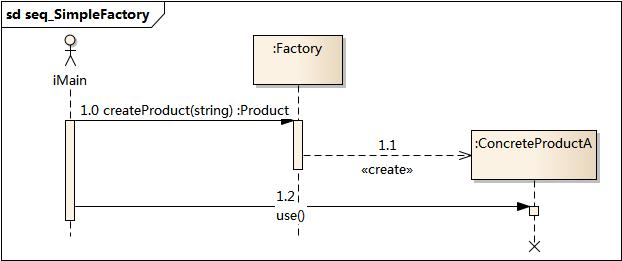

### 2.5 代码实现

> 参考链接：[Java全栈知识体系](https://pdai.tech/md/dev-spec/pattern/3_simple_factory.html#%E5%AE%9E%E7%8E%B0)

```java
public interface Product {
}

public class ConcreteProduct implements Product {
}

public class ConcreteProduct1 implements Product {
}

public class ConcreteProduct2 implements Product {
}

public class SimpleFactory {
    public static Product createProduct(int type) {
        if (type == 1) {
            return new ConcreteProduct1();
        } else if (type == 2) {
            return new ConcreteProduct2();
        }
        return new ConcreteProduct();
    }
}

public class Client {
    public static void main(String[] args) {
        SimpleFactory simpleFactory = new SimpleFactory();
        Product product = simpleFactory.createProduct(1);
        // do something with the product
    }
}
```

### 2.6 模式分析

- 将对象的创建和对象本身业务处理分离可以**降低系统的耦合度**，使得两者修改起来都相对容易。
- 在调用工厂类的工厂方法时，由于工厂方法是静态方法，使用起来很方便，可通过类名直接调用，而且只需要传入一个简单的参数即可，在实际开发中，还可以在调用时将所传入的参数保存在XML等格式的配置文件中，修改参数时无须修改任何源代码。
- 简单工厂模式最大的问题在于工厂类的职责相对过重，**增加新的产品需要修改工厂类的判断逻辑**，这一点与开闭原则是相违背的。
- 简单工厂模式的要点在于：只需要传入一个正确的参数就可以获取所需要的对象，而无须知道其创建细节。

### 2.7 优缺点

#### 优点

- 工厂类含有必要的判断逻辑，可以决定在什么时候创建哪一个产品类的实例，客户端可以免除直接创建产品对象的责任，而仅仅“消费”产品；简单工厂模式通过这种做法实现了**对责任的分割**，它提供了专门的工厂类用于创建对象。
- 客户端**无须知道所创建的具体产品类的类名**，只需要知道具体产品类所对应的参数即可，对于一些复杂的类名，通过简单工厂模式可以减少使用者的记忆量。
- 通过引入配置文件，可以在不修改任何客户端代码的情况下更换和增加新的具体产品类，在一定程度上提高了系统的灵活性。

#### 缺点

- 由于工厂类集中了所有产品创建逻辑，一旦不能正常工作，整个系统都要受到影响。
- 使用简单工厂模式将会增加系统中类的个数，在一定程序上增加了系统的复杂度和理解难度。
- 系统扩展困难，**一旦添加新产品就不得不修改工厂逻辑**，在产品类型较多时，有可能造成工厂逻辑过于复杂，不利于系统的扩展和维护。
- 简单工厂模式由于使用了静态工厂方法，造成工厂角色无法形成基于继承的等级结构。

### 2.8 适用环境

在以下情况下可以使用简单工厂模式：

- **工厂类负责创建的对象比较少**：由于创建的对象较少，不会造成工厂方法中的业务逻辑太过复杂。
- **客户端只知道传入工厂类的参数**，对于如何创建对象不关心：客户端既不需要关心创建细节，甚至连类名都不需要记住，只需要知道类型所对应的参数。

### 2.9 模式应用

#### JDK类库

JDK类库中广泛使用了简单工厂模式，如工具类`java.text.DateFormat`，它用于格式化一个本地日期或者时间：

```java
public final static DateFormat getDateInstance();
public final static DateFormat getDateInstance(int style);
public final static DateFormat getDateInstance(int style,Locale
locale);
```

#### Java加密技术

获取不同加密算法的密钥生成器：

```java
KeyGenerator keyGen=KeyGenerator.getInstance("DESede");
```

创建密码器：

```java
Cipher cp=Cipher.getInstance("DESede");
```

### 2.10 总结

- 创建型模式对类的实例化过程进行了抽象，能够将对象的创建与对象的使用过程分离。
- 简单工厂模式又称为**静态工厂方法模式**，它属于类创建型模式。在简单工厂模式中，可以**根据参数的不同返回不同类的实例**。简单工厂模式**专门定义一个类来负责创建其他类的实例，被创建的实例通常都具有共同的父类**。
- 简单工厂模式包含三个角色：工厂角色负责实现创建所有实例的内部逻辑；抽象产品角色是所创建的所有对象的父类，负责描述所有实例所共有的公共接口；具体产品角色是创建目标，所有创建的对象都充当这个角色的某个具体类的实例。
- 简单工厂模式的要点在于：**只需要传入一个正确的参数，就可以获取你所需要的对象**，而无须知道其创建细节。
- 简单工厂模式最大的优点在于**实现对象的创建和对象的使用分离**，将对象的创建交给专门的工厂类负责，但是其最大的缺点在于工厂类不够灵活，增加新的具体产品需要修改工厂类的判断逻辑代码，而且产品较多时，工厂方法代码将会非常复杂。
- 简单工厂模式适用情况包括：工厂类负责创建的对象比较少；客户端只知道传入工厂类的参数，对于如何创建对象不关心。

## 三、工厂方法模式（Factory Method Pattern）:airplane:

> 参考链接：[图说设计模式](https://design-patterns.readthedocs.io/zh_CN/latest/creational_patterns/factory_method.html)

### 3.1 模式动机

现在对该系统进行修改，不再设计一个按钮工厂类来统一负责所有产品的创建，**而是将具体按钮的创建过程交给专门的工厂子类去完成**。

先定义一个抽象的按钮工厂类，再定义具体的工厂类来生成圆形按钮、矩形按钮、菱形按钮等，它们实现在抽象按钮工厂类中定义的方法。

这种抽象化的结果使这种结构可以在不修改具体工厂类的情况下引进新的产品，如果出现新的按钮类型，只需要为这种新类型的按钮创建一个具体的工厂类就可以获得该新按钮的实例，这一特点无疑使得工厂方法模式具有超越简单工厂模式的优越性，更加符合“开闭原则”。

### 3.2 模式定义

工厂方法模式（Factory Method Pattern）又称为工厂模式，也叫虚拟构造器（Virtual Constructor）模式或者多态工厂（Polymorphic Factory）模式，它属于类创建型模式。

在工厂方法模式中，工厂父类负责定义创建产品对象的公共接口，而工厂子类则负责生成具体的产品对象，这样做的目的是**将产品类的实例化操作延迟到工厂子类中完成**，即通过工厂子类来确定究竟应该实例化哪一个具体产品类。

### 3.3 模式结构

工厂方法模式包含如下角色：

- Product：抽象产品。
- ConcreteProduct：具体产品。
- Factory：抽象工厂。
- ConcreteFactory：具体工厂。

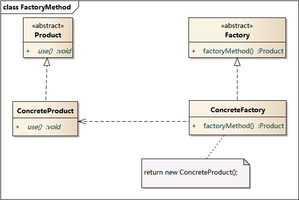

### 3.4 时序图

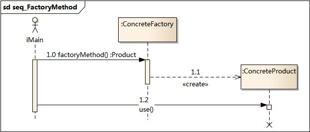

### 3.5 代码实现

> 参考链接：[Java全栈知识体系](https://pdai.tech/md/dev-spec/pattern/4_factory_method.html#%E5%AE%9E%E7%8E%B0)

```java
public abstract class Factory {
    abstract public Product factoryMethod();
    public void doSomething() {
        Product product = factoryMethod();
        // do something with the product
    }
}

public class ConcreteFactory extends Factory {
    public Product factoryMethod() {
        return new ConcreteProduct();
    }
}

public class ConcreteFactory1 extends Factory {
    public Product factoryMethod() {
        return new ConcreteProduct1();
    }
}

public class ConcreteFactory2 extends Factory {
    public Product factoryMethod() {
        return new ConcreteProduct2();
    }
}
```

### 3.6 模式分析

工厂方法模式是简单工厂模式的进一步抽象和推广。由于使用了面向对象的多态性，工厂方法模式保持了简单工厂模式的优点，而且克服了它的缺点。

在工厂方法模式中，核心的工厂类不再负责所有产品的创建，而是将具体创建工作交给子类去做。这个**核心类仅仅负责给出具体工厂必须实现的接口**，而不负责哪一个产品类被实例化这种细节，这使得工厂方法模式可以允许系统在不修改工厂角色的情况下引进新产品。

### 3.7 实例

日志记录器：某系统日志记录器要求支持多种日志记录方式，如文件记录、数据库记录等，且用户可以根据要求动态选择日志记录方式， 现使用工厂方法模式设计该系统。

结构图：

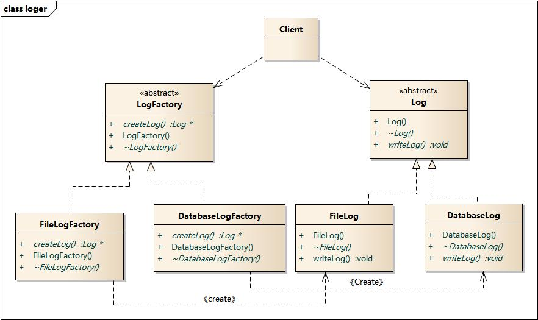

时序图：

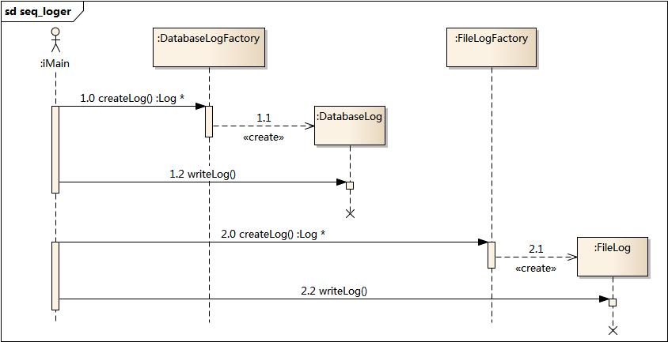

### 3.8 优缺点

#### 优点

- 在工厂方法模式中，工厂方法用来创建客户所需要的产品，同时还向客户隐藏了哪种具体产品类将被实例化这一细节，用户只需要关心所需产品对应的工厂，无须关心创建细节，甚至无须知道具体产品类的类名。
- **基于工厂角色和产品角色的多态性设计是工厂方法模式的关键**。它能够使工厂可以自主确定创建何种产品对象，而如何创建这个对象的细节则完全封装在具体工厂内部。工厂方法模式之所以又被称为多态工厂模式，是因为**所有的具体工厂类都具有同一抽象父类**。
- 使用工厂方法模式的另一个优点是在系统中加入新产品时，无须修改抽象工厂和抽象产品提供的接口，无须修改客户端，也无须修改其他的具体工厂和具体产品，而只要添加一个具体工厂和具体产品就可以了。这样，系统的可扩展性也就变得非常好，完全**符合“开闭原则”**。

#### 缺点

- 在添加新产品时，需要编写新的具体产品类，而且还要提供与之对应的具体工厂类，系统中类的个数将成对增加，在一定程度上增加了系统的复杂度，有更多的类需要编译和运行，会给系统带来一些额外的开销。
- 由于考虑到系统的可扩展性，**需要引入抽象层**，在客户端代码中均使用抽象层进行定义，增加了系统的抽象性和理解难度，且在实现时可能需要用到DOM、反射等技术，增加了系统的实现难度。

### 3.9 适用环境

在以下情况下可以使用工厂方法模式：

- **一个类不知道它所需要的对象的类**：在工厂方法模式中，客户端不需要知道具体产品类的类名，只需要知道所对应的工厂即可，具体的产品对象由具体工厂类创建；客户端需要知道创建具体产品的工厂类。
- **一个类通过其子类来指定创建哪个对象**：在工厂方法模式中，对于抽象工厂类只需要提供一个创建产品的接口，而由其子类来确定具体要创建的对象，利用面向对象的多态性和里氏代换原则，在程序运行时，子类对象将覆盖父类对象，从而使得系统更容易扩展。
- 将创建对象的任务委托给多个工厂子类中的某一个，客户端在使用时可以无须关心是哪一个工厂子类创建产品子类，需要时再动态指定，可将具体工厂类的类名存储在配置文件或数据库中。

### 3.10 模式应用

JDBC中的工厂方法：

```java
Connection conn=DriverManager.getConnection("jdbc:microsoft:sqlserver://localhost:1433; DatabaseName=DB;user=sa;password=");
Statement statement=conn.createStatement();
ResultSet rs=statement.executeQuery("select * from UserInfo");
```

### 3.11 模式扩展

- 使用多个工厂方法：在抽象工厂角色中可以定义多个工厂方法，从而使具体工厂角色实现这些不同的工厂方法，这些方法可以包含不同的业务逻辑，以满足对不同的产品对象的需求。
- 产品对象的重复使用：工厂对象将已经创建过的产品保存到一个集合（如数组、List等）中，然后根据客户对产品的请求，对集合进行查询。如果有满足要求的产品对象，就直接将该产品返回客户端；如果集合中没有这样的产品对象，那么就创建一个新的满足要求的产品对象，然后将这个对象在增加到集合中，再返回给客户端。
- 多态性的丧失和模式的退化：如果工厂仅仅返回一个具体产品对象，便违背了工厂方法的用意，发生退化，此时就不再是工厂方法模式了。一般来说，工厂对象应当有一个抽象的父类型，如果工厂等级结构中只有一个具体工厂类的话，抽象工厂就可以省略，也将发生了退化。**当只有一个具体工厂，在具体工厂中可以创建所有的产品对象，并且工厂方法设计为静态方法时，工厂方法模式就退化成简单工厂模式**。

### 3.12 总结

- 工厂方法模式又称为工厂模式，它属于类创建型模式。在工厂方法模式中，**工厂父类负责定义创建产品对象的公共接口，而工厂子类则负责生成具体的产品对象**，这样做的目的是将产品类的实例化操作延迟到工厂子类中完成，即通过工厂子类来确定究竟应该实例化哪一个具体产品类。
- 工厂方法模式包含四个角色：抽象产品是定义产品的接口，是工厂方法模式所创建对象的超类型，即产品对象的共同父类或接口；具体产品实现了抽象产品接口，某种类型的具体产品由专门的具体工厂创建，它们之间往往一一对应；抽象工厂中声明了工厂方法，用于返回一个产品，它是工厂方法模式的核心，任何在模式中创建对象的工厂类都必须实现该接口；具体工厂是抽象工厂类的子类，实现了抽象工厂中定义的工厂方法，并可由客户调用，返回一个具体产品类的实例。
- 工厂方法模式是简单工厂模式的进一步抽象和推广。由于使用了面向对象的多态性，工厂方法模式保持了简单工厂模式的优点，而且克服了它的缺点。在工厂方法模式中，核心的工厂类不再负责所有产品的创建，而是将具体创建工作交给子类去做。这个核心类仅仅负责给出具体工厂必须实现的接口，而不负责产品类被实例化这种细节，这使得工厂方法模式可以允许系统在不修改工厂角色的情况下引进新产品。
- 工厂方法模式的主要优点是**增加新的产品类时无须修改现有系统**，并封装了产品对象的创建细节，系统具有良好的灵活性和可扩展性；其缺点在于增加新产品的同时需要增加新的工厂，导致系统类的个数成对增加，在一定程度上增加了系统的复杂性。
- 工厂方法模式适用情况包括：一个类不知道它所需要的对象的类；一个类通过其子类来指定创建哪个对象；将创建对象的任务委托给多个工厂子类中的某一个，客户端在使用时可以无须关心是哪一个工厂子类创建产品子类，需要时再动态指定。

## 四、抽象工厂模式（Abstract Factory Pattern）:airplane:

> 参考链接：[图说设计模式](https://design-patterns.readthedocs.io/zh_CN/latest/creational_patterns/abstract_factory.html)

### 4.1 模式动机

- 在工厂方法模式中具体工厂负责生产具体的产品，每一个具体工厂对应一种具体产品，工厂方法也具有唯一性，一般情况下，一个具体工厂中只有一个工厂方法或者一组重载的工厂方法。**但是有时候需要一个工厂可以提供多个产品对象，而不是单一的产品对象**。

  为了更清晰地理解工厂方法模式，需要先引入两个概念

  - **产品等级结构**：产品等级结构即产品的继承结构，如一个抽象类是电视机，其子类有海尔电视机、海信电视机、TCL电视机，则抽象电视机与具体品牌的电视机之间构成了一个产品等级结构，**抽象电视机是父类，而具体品牌的电视机是其子类**。
  - **产品族**：在抽象工厂模式中，**产品族是指由同一个工厂生产的，位于不同产品等级结构中的一组产品**，如海尔电器工厂生产的海尔电视机、海尔电冰箱，海尔电视机位于电视机产品等级结构中，海尔电冰箱位于电冰箱产品等级结构中。

- 当系统所提供的工厂所需生产的具体产品并不是一个简单的对象，而是**多个位于不同产品等级结构中属于不同类型的具体产品**时需要使用抽象工厂模式。

- 抽象工厂模式是所有形式的工厂模式中最为抽象和最具一般性的一种形态。

- 抽象工厂模式与工厂方法模式最大的区别在于：**工厂方法模式针对的是一个产品等级结构，而抽象工厂模式则需要面对多个产品等级结构**，一个工厂等级结构可以负责多个不同产品等级结构中的产品对象的创建 。当一个工厂等级结构可以创建出分属于不同产品等级结构的一个产品族中的所有对象时，抽象工厂模式比工厂方法模式更为简单、有效率。

### 4.2 模式定义

抽象工厂模式（Abstract Factory Pattern）：**提供一个创建一系列相关或相互依赖对象的接口**，而无须指定它们具体的类。抽象工厂模式又称为Kit模式，属于对象创建型模式。

### 4.3 模式结构

抽象工厂模式包含如下角色：

- AbstractFactory：抽象工厂。
- ConcreteFactory：具体工厂。
- AbstractProduct：抽象产品。
- Product：具体产品

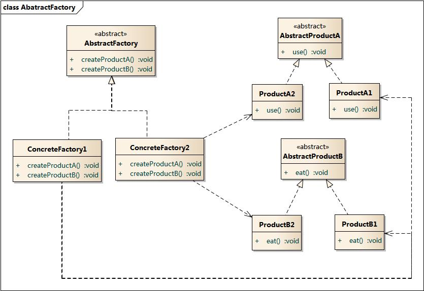

### 4.4 时序图

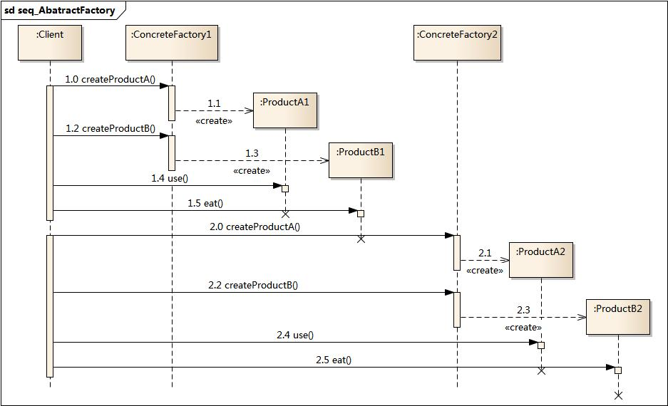

### 4.5 代码实现

> 参考链接：[Java全栈知识体系](https://pdai.tech/md/dev-spec/pattern/5_abstract_factory.html#%e4%bb%a3%e7%a0%81%e5%ae%9e%e7%8e%b0)

```java
public class AbstractProductA {
}

public class AbstractProductB {
}

public class ProductA1 extends AbstractProductA {
}

public class ProductA2 extends AbstractProductA {
}

public class ProductB1 extends AbstractProductB {
}

public class ProductB2 extends AbstractProductB {
}

public abstract class AbstractFactory {
    abstract AbstractProductA createProductA();
    abstract AbstractProductB createProductB();
}

public class ConcreteFactory1 extends AbstractFactory {
    AbstractProductA createProductA() {
        return new ProductA1();
    }

    AbstractProductB createProductB() {
        return new ProductB1();
    }
}

public class ConcreteFactory2 extends AbstractFactory {
    AbstractProductA createProductA() {
        return new ProductA2();
    }

    AbstractProductB createProductB() {
        return new ProductB2();
    }
}

public class Client {
    public static void main(String[] args) {
        AbstractFactory abstractFactory = new ConcreteFactory1();
        AbstractProductA productA = abstractFactory.createProductA();
        AbstractProductB productB = abstractFactory.createProductB();
        // do something with productA and productB
    }
}
```

### 4.6 优缺点

#### 优点

- 抽象工厂模式隔离了具体类的生成，使得客户并不需要知道什么被创建。由于这种隔离，更换一个具体工厂就变得相对容易。所有的具体工厂都实现了抽象工厂中定义的那些公共接口，因此只需改变具体工厂的实例，就可以在某种程度上改变整个软件系统的行为。另外，应用抽象工厂模式可以实现高内聚低耦合的设计目的，因此抽象工厂模式得到了广泛的应用。
- 当一个产品族中的多个对象被设计成一起工作时，它能够保证客户端始终只使用同一个产品族中的对象。这对一些需要根据当前环境来决定其行为的软件系统来说，是一种非常实用的设计模式。
- 增加新的具体工厂和产品族很方便，无须修改已有系统，符合“开闭原则”。

#### 缺点

- 在添加新的产品对象时，难以扩展抽象工厂来生产新种类的产品，这是因为在抽象工厂角色中规定了所有可能被创建的产品集合，要支持新种类的产品就意味着要对该接口进行扩展，而这将涉及到对抽象工厂角色及其所有子类的修改，显然会带来较大的不便。
- 开闭原则的倾斜性（增加新的工厂和产品族容易，增加新的产品等级结构麻烦）。

### 4.7 适用环境

在以下情况下可以使用抽象工厂模式：

- 一个系统不应当依赖于产品类实例如何被创建、组合和表达的细节，这对于所有类型的工厂模式都是重要的。
- 系统中有多于一个的产品族，而每次只使用其中某一产品族。
- 属于同一个产品族的产品将在一起使用，这一约束必须在系统的设计中体现出来。
- 系统提供一个产品类的库，所有的产品以同样的接口出现，从而使客户端不依赖于具体实现。

### 4.8 模式应用

在很多软件系统中需要更换界面主题，要求界面中的按钮、文本框、背景色等一起发生改变时，可以使用抽象工厂模式进行设计。

### 4.11 模式扩展

#### “开闭原则”的倾斜性

- “开闭原则”要求**系统对扩展开放，对修改封闭**，通过扩展达到增强其功能的目的。对于涉及到多个产品族与多个产品等级结构的系统，其功能增强包括两方面：
  - 增加产品族：对于增加新的产品族，工厂方法模式很好的支持了“开闭原则”，**对于新增加的产品族，只需要对应增加一个新的具体工厂即可**，对已有代码无须做任何修改。增加新的产品等级结构：**对于增加新的产品等级结构，需要修改所有的工厂角色**，包括抽象工厂类，在所有的工厂类中都需要增加生产新产品的方法，不能很好地支持“开闭原则”。
- 抽象工厂模式的这种性质称为**“开闭原则”的倾斜性**，抽象工厂模式以一种倾斜的方式支持增加新的产品，它为新产品族的增加提供方便，但不能为新的产品等级结构的增加提供这样的方便。

#### 工厂模式的退化

当抽象工厂模式中每一个具体工厂类只创建一个产品对象，也就是**只存在一个产品等级结构时，抽象工厂模式退化成工厂方法模式**；当工厂方法模式中**抽象工厂与具体工厂合并**，提供一个统一的工厂来创建产品对象，**并将创建对象的工厂方法设计为静态方法时**，工厂方法模式退化成简单工厂模式。

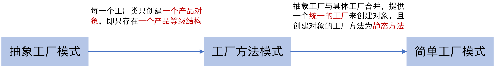

### 4.12 总结

- 抽象工厂模式提供一个创建一系列相关或相互依赖对象的接口，而无须指定它们具体的类。抽象工厂模式又称为Kit模式，属于对象创建型模式。
- 抽象工厂模式包含四个角色：抽象工厂用于声明生成抽象产品的方法；具体工厂实现了抽象工厂声明的生成抽象产品的方法，生成一组具体产品，这些产品构成了一个产品族，每一个产品都位于某个产品等级结构中；抽象产品为每种产品声明接口，在抽象产品中定义了产品的抽象业务方法；具体产品定义具体工厂生产的具体产品对象，实现抽象产品接口中定义的业务方法。
- 抽象工厂模式是所有形式的工厂模式中最为抽象和最具一般性的一种形态。抽象工厂模式与工厂方法模式最大的区别在于，工厂方法模式针对的是一个产品等级结构，而抽象工厂模式则需要面对多个产品等级结构。
- 抽象工厂模式的主要优点是**隔离了具体类的生成**，使得客户并不需要知道什么被创建，而且每次可以通过具体工厂类创建一个产品族中的多个对象，增加或者替换产品族比较方便，增加新的具体工厂和产品族很方便；主要缺点在于增加新的产品等级结构很复杂，需要修改抽象工厂和所有的具体工厂类，对“开闭原则”的支持呈现倾斜性。
- 抽象工厂模式适用情况包括：一个系统不应当依赖于产品类实例如何被创建、组合和表达的细节；系统中有多于一个的产品族，而每次只使用其中某一产品族；属于同一个产品族的产品将在一起使用；系统提供一个产品类的库，所有的产品以同样的接口出现，从而使客户端不依赖于具体实现。

## 五、建造者模式（Builder Pattern）:boat:

> 参考链接：[图说设计模式](https://design-patterns.readthedocs.io/zh_CN/latest/creational_patterns/builder.html)

### 5.1 模式动机

无论是在现实世界中还是在软件系统中，都存在一些复杂的对象，它们拥有多个组成部分，如汽车，它包括车轮、方向盘、发送机等各种部件。而对于大多数用户而言，无须知道这些部件的装配细节，也几乎不会使用单独某个部件，而是使用一辆完整的汽车，可以通过建造者模式对其进行设计与描述，**建造者模式可以将部件和其组装过程分开，一步一步创建一个复杂的对象**。用户只需要指定复杂对象的类型就可以得到该对象，而无须知道其内部的具体构造细节。

在软件开发中，也存在大量类似汽车一样的复杂对象，它们拥有一系列成员属性，这些成员属性中有些是引用类型的成员对象。而且在这些复杂对象中，还可能存在一些限制条件，如某些属性没有赋值则复杂对象不能作为一个完整的产品使用；有些属性的赋值必须按照某个顺序，一个属性没有赋值之前，另一个属性可能无法赋值等。

复杂对象相当于一辆有待建造的汽车，而对象的属性相当于汽车的部件，建造产品的过程就相当于组合部件的过程。由于组合部件的过程很复杂，因此，这些部件的组合过程往往被“外部化”到一个称作建造者的对象里，建造者返还给客户端的是一个已经建造完毕的完整产品对象，而用户无须关心该对象所包含的属性以及它们的组装方式，这就是建造者模式的模式动机。

### 5.2 模式定义

造者模式（Builder Pattern）：**将一个复杂对象的构建与它的表示分离，使得同样的构建过程可以创建不同的表示**。

建造者模式是一步一步创建一个复杂的对象，它允许用户只通过指定复杂对象的类型和内容就可以构建它们，用户不需要知道内部的具体构建细节。建造者模式属于对象创建型模式。根据中文翻译的不同，建造者模式又可以称为生成器模式。

### 5.3 模式结构

建造者模式包含如下角色：

- Builder：抽象建造者。
- ConcreteBuilder：具体建造者。
- Director：指挥者。
- Product：产品角色。


### 5.4 时序图


### 5.5 代码实现

> 参考链接：[C语言中文网](http://c.biancheng.net/view/1354.html)

```java
class Product {
    private String partA;
    private String partB;
    private String partC;

    public void setPartA(String partA) {
        this.partA = partA;
    }

    public void setPartB(String partB) {
        this.partB = partB;
    }

    public void setPartC(String partC) {
        this.partC = partC;
    }

    public void show() {
        //显示产品的特性
    }
}

abstract class Builder {
    //创建产品对象
    protected Product product = new Product();

    public abstract void buildPartA();

    public abstract void buildPartB();

    public abstract void buildPartC();

    //返回产品对象
    public Product getResult() {
        return product;
    }
}

public class ConcreteBuilder extends Builder {
    public void buildPartA() {
        product.setPartA("建造 PartA");
    }

    public void buildPartB() {
        product.setPartB("建造 PartB");
    }

    public void buildPartC() {
        product.setPartC("建造 PartC");
    }
}

class Director {
    private Builder builder;

    public Director(Builder builder) {
        this.builder = builder;
    }

    //产品构建与组装方法
    public Product construct() {
        builder.buildPartA();
        builder.buildPartB();
        builder.buildPartC();
        return builder.getResult();
    }
}

public class Client {
    public static void main(String[] args) {
        Builder builder = new ConcreteBuilder();
        Director director = new Director(builder);
        Product product = director.construct();
        product.show();
    }
}
```

### 5.6 模式分析

抽象建造者类中定义了产品的创建方法和返回方法。

建造者模式的结构中还引入了一个指挥者类Director，该类的作用主要有两个：一方面它隔离了客户与生产过程；另一方面它负责控制产品的生成过程。**指挥者针对抽象建造者编程，客户端只需要知道具体建造者的类型，即可通过指挥者类调用建造者的相关方法，返回一个完整的产品对象**。

在客户端代码中，无须关心产品对象的具体组装过程，只需确定具体建造者的类型即可，建造者模式将复杂对象的构建与对象的表现分离开来，这样使得同样的构建过程可以创建出不同的表现。

### 5.7 实例

KFC套餐：建造者模式可以用于描述KFC如何创建套餐。套餐是一个复杂对象，它一般包含主食（如汉堡、鸡肉卷等）和饮料（如果汁、 可乐等）等组成部分，不同的套餐有不同的组成部分，而KFC的服务员可以根据顾客的要求，一步一步装配这些组成部分，构造一份完整的套餐，然后返回给顾客。

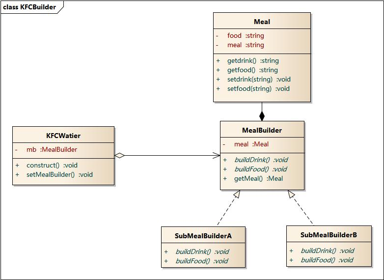

### 5.8 优缺点

#### 优点

- 在建造者模式中， 客户端不必知道产品内部组成的细节，将**产品本身与产品的创建过程解耦**，使得**相同的创建过程可以创建不同的产品对象**。
- 每一个具体建造者都相对独立，而与其他的具体建造者无关，因此可以很方便地替换具体建造者或增加新的具体建造者，**用户使用不同的具体建造者即可得到不同的产品对象** 。
- **可以更加精细地控制产品的创建过程**。将复杂产品的创建步骤分解在不同的方法中，使得创建过程更加清晰，也更方便使用程序来控制创建过程。
- 增加新的具体建造者无须修改原有类库的代码，指挥者类针对抽象建造者类编程，系统扩展方便，**符合“开闭原则”**。

#### 缺点

- 建造者模式所创建的产品一般具有较多的共同点，其组成部分相似，**如果产品之间的差异性很大，则不适合使用建造者模式**，因此其使用范围受到一定的限制。
- 如果产品的内部变化复杂，可能会导致需要定义很多具体建造者类来实现这种变化，导致系统变得很庞大。

### 5.9 适用环境

在以下情况下可以使用建造者模式：

- 需要生成的**产品对象有复杂的内部结构**，这些产品对象通常包含多个成员属性。
- 需要生成的**产品对象的属性相互依赖**，需要指定其生成顺序。
- 对象的创建过程独立于创建该对象的类。在建造者模式中引入了指挥者类，将创建过程封装在指挥者类中，而不在建造者类中。
- 隔离复杂对象的创建和使用，并使得相同的创建过程可以创建不同的产品。

### 5.10 模式应用

在很多游戏软件中，地图包括天空、地面、背景等组成部分，人物角色包括人体、服装、装备等组成部分，可以使用建造者模式对其进行设计，通过不同的具体建造者创建不同类型的地图或人物。

### 5.11 模式扩展

#### 建造者模式的简化

- 省略抽象建造者角色：如果系统中只需要一个具体建造者的话，可以省略掉抽象建造者。
- 省略指挥者角色：在具体建造者只有一个的情况下，如果抽象建造者角色已经被省略掉，那么还可以省略指挥者角色，让Builder角色扮演指挥者与建造者双重角色。

#### 建造者模式与抽象工厂模式的比较

- 与抽象工厂模式相比，**建造者模式返回一个组装好的完整产品**，而**抽象工厂模式返回一系列相关的产品，这些产品位于不同的产品等级结构，构成了一个产品族**。
- 在抽象工厂模式中，**客户端实例化工厂类，然后调用工厂方法获取所需产品对象**，而在建造者模式中，客户端可以不直接调用建造者的相关方法，而是通过指挥者类来指导如何生成对象，包括对象的组装过程和建造步骤，它**侧重于一步步构造一个复杂对象，返回一个完整的对象**。
- 如果将抽象工厂模式看成**汽车配件生产工厂**，生产一个产品族的产品，那么建造者模式就是一个**汽车组装工厂**，通过对部件的组装可以返回一辆完整的汽车。

### 5.12 总结

- 建造者模式将一个复杂对象的构建与它的表示分离，使得同样的构建过程可以创建不同的表示。建造者模式是**一步一步创建一个复杂的对象**，它允许用户只通过指定复杂对象的类型和内容就可以构建它们，用户不需要知道内部的具体构建细节。建造者模式属于对象创建型模式。
- 建造者模式包含如下四个角色：抽象建造者为创建一个产品对象的各个部件指定抽象接口；具体建造者实现了抽象建造者接口，实现各个部件的构造和装配方法，定义并明确它所创建的复杂对象，也可以提供一个方法返回创建好的复杂产品对象；产品角色是被构建的复杂对象，包含多个组成部件；指挥者负责安排复杂对象的建造次序，指挥者与抽象建造者之间存在关联关系，可以在其`construct()`建造方法中调用建造者对象的部件构造与装配方法，完成复杂对象的建造。
- 在建造者模式的结构中引入了一个指挥者类，该类的作用主要有两个：**一方面它隔离了客户与生产过程；另一方面它负责控制产品的生成过程**。指挥者针对抽象建造者编程，客户端只需要知道具体建造者的类型，即可通过指挥者类调用建造者的相关方法，返回一个完整的产品对象。
- 建造者模式的主要优点在于**客户端不必知道产品内部组成的细节，将产品本身与产品的创建过程解耦，使得相同的创建过程可以创建不同的产品对象，每一个具体建造者都相对独立，而与其他的具体建造者无关，因此可以很方便地替换具体建造者或增加新的具体建造者，符合“开闭原则”**，还可以更加精细地控制产品的创建过程；其主要缺点在于由于建造者模式所创建的产品一般具有较多的共同点，其组成部分相似，因此其使用范围受到一定的限制，如果产品的内部变化复杂，可能会导致需要定义很多具体建造者类来实现这种变化，导致系统变得很庞大。
- 建造者模式适用情况包括：需要生成的产品对象有复杂的内部结构，这些产品对象通常包含多个成员属性；需要生成的产品对象的属性相互依赖，需要指定其生成顺序；对象的创建过程独立于创建该对象的类；隔离复杂对象的创建和使用，并使得相同的创建过程可以创建不同类型的产品。

## 六、单例模式（Singleton Pattern）🚀

> 参考链接：[图说设计模式](https://design-patterns.readthedocs.io/zh_CN/latest/creational_patterns/singleton.html)

### 6.1 模式动机

对于系统中的某些类来说，只有一个实例很重要，例如，一个系统中可以存在多个打印任务，但是只能有一个正在工作的任务；一个系统只能有一个窗口管理器或文件系统；一个系统只能有一个计时工具或ID（序号）生成器。

如何保证一个类只有一个实例并且这个实例易于被访问呢？**定义一个全局变量可以确保对象随时都可以被访问，但不能防止实例化多个对象**。

一个更好的解决办法是让**类自身负责保存它的唯一实例：保证没有其他实例被创建，并且可以提供一个访问该实例的方法**。这就是单例模式的模式动机。

### 6.2 模式定义

单例模式（Singleton Pattern）：单例模式确保某一个类只有一个实例，而且自行实例化并向整个系统提供这个实例，这个类称为单例类，它提供全局访问的方法。

单例模式的要点有三个：

- 某个类只能有**一个实例**。
- 它必须**自行创建**这个实例。
- 它必须**自行向整个系统提供**这个实例。

单例模式是一种对象创建型模式。单例模式又名单件模式或单态模式。

### 6.3 模式结构

单例模式包含如下角色：

- Singleton：单例


### 6.4 时序图


### 6.5 6种代码实现

> 参考链接：[Java全栈知识体系](https://pdai.tech/md/dev-spec/pattern/2_singleton.html#6中实现方式)

#### 懒汉式—线程不安全

以下实现中，私有静态变量`uniqueInstance`被延迟实例化，这样做的好处是：如果没有用到该类，那么就不会实例化`uniqueInstance`，从而节约资源。

但这个实现在多线程环境下是不安全的，如果多个线程能够同时进入`if (uniqueInstance == null)`，并且此时`uniqueInstance`为`null`，那么会有多个线程执行`uniqueInstance = new Singleton();`语句，这将导致多次实例化`uniqueInstance`。

```java
public class Singleton {

    private static Singleton uniqueInstance;

    private Singleton() {
    }

    public static Singleton getUniqueInstance() {
        if (uniqueInstance == null) {
            uniqueInstance = new Singleton();
        }
        return uniqueInstance;
    }
}
```

#### 饿汉式—线程安全

线程不安全问题主要是由于`uniqueInstance`被多次实例化，采取直接实例化`uniqueInstance`的方式就不会产生线程安全问题。但是直接实例化的方式也丢失了延迟实例化带来的节约资源的好处。

```java
public class Singleton {

    private static Singleton uniqueInstance = new Singleton();

    private Singleton() {
    }

    public static Singleton getUniqueInstance() {
        return uniqueInstance;
    }
}
```

#### 懒汉式—线程安全

只需要对`getUniqueInstance()`方法加锁，那么在一个时间点只能有一个线程能够进入该方法，从而避免了多次实例化`uniqueInstance`的问题。但是当一个线程进入该方法之后，其它试图进入该方法的线程都必须等待，因此性能上有一定的损耗。

```java
public class Singleton {

    private static Singleton uniqueInstance;

    private Singleton() {
    }

    public static synchronized Singleton getUniqueInstance() {
        if (uniqueInstance == null) {
            uniqueInstance = new Singleton();
        }
        return uniqueInstance;
    }
}
```

#### 双重校验锁—线程安全

> 参考链接：[知乎](https://zhuanlan.zhihu.com/p/350312919)、[思否](https://segmentfault.com/a/1190000022801946)

`uniqueInstance`只需要被实例化一次，之后就可以直接使用了。**加锁操作只需要对实例化那部分的代码进行**，只有当`uniqueInstance`没有被实例化时，才需要进行加锁。双重校验锁先判断`uniqueInstance`是否已经被实例化，如果没有被实例化，那么才对实例化语句进行加锁。

```java
public class Singleton {

    private volatile static Singleton uniqueInstance;

    private Singleton() {
    }

    public static Singleton getUniqueInstance() {
        if (uniqueInstance == null) {
            synchronized (Singleton.class) {
                if (uniqueInstance == null) {
                    uniqueInstance = new Singleton();
                }
            }
        }
        return uniqueInstance;
    }
}
```

懒汉式`synchronized`**锁的粒度太大**，同一时间只能有一个线程执行同步方法，因此在高并发环境下吞吐量严重受限。所以DCL**将“同步”方法改成了“同步”代码块，缩小锁的粒度**，并发性能更好。

两次判断：第二次判断是为了拦截除第一个获得锁的线程之外的线程；第一次判断是**避免了其他无用线程竞争锁来造成性能浪费**。

`uniqueInstance`采用`volatile`关键字修饰也是很有必要的。`volatile`关键字有三大特性：**保证可见性**、**不保证原子性**和**禁止重排序**。`uniqueInstance = new Singleton();`这段代码**并非符合原子性**，其实是分为三步执行：

1. 分配内存空间；
2. 初始化对象；
3. 将`uniqueInstance`指向分配的内存地址。

由于JVM具有**指令重排**的特性，有可能执行顺序变为了1->3->2，如果在多线程下有可能获得是一个还没有被初始化的实例，以致于程序出错。使用`volatile`可以**禁止JVM的指令重排**，保证在多线程环境下也能正常运行。

#### 静态内部类

当`Singleton`类加载时，静态内部类`SingletonHolder`没有被加载进内存。只有当调用`getUniqueInstance()`方法从而触发`SingletonHolder.INSTANCE`时`SingletonHolder`才会被加载，此时初始化`INSTANCE`实例。

这种方式不仅具有延迟初始化的好处，而且由虚拟机提供了对线程安全的支持。

```java
public class Singleton {

    private Singleton() {
    }

    private static class SingletonHolder {
        private static final Singleton INSTANCE = new Singleton();
    }

    public static Singleton getUniqueInstance() {
        return SingletonHolder.INSTANCE;
    }
}
```

#### 枚举

这是单例模式的最佳实践，它实现简单，并且**在面对复杂的序列化或者反射攻击的时候，能够防止实例化多次**。

```java
public enum Singleton {
    uniqueInstance;
}
```

如果不使用枚举来实现单例模式，会出现反射攻击，因为**通过`setAccessible()`方法可以将私有构造函数的访问级别设置为`public`**，然后调用构造函数从而实例化对象。如果要防止这种攻击，需要在构造函数中添加防止实例化第二个对象的代码。

#### 总结


### 6.6 模式分析

单例模式的目的是保证一个类仅有一个实例，并提供一个访问它的全局访问点。单例模式包含的角色只有一个，就是单例类——Singleton。单例类拥有一个私有构造函数，确保用户无法通过`new`关键字直接实例化它。除此之外，该模式中包含**一个静态私有成员变量**与**静态公有的工厂方法**，该工厂方法负责**检验实例的存在性并实例化自己，然后存储在静态成员变量中，以确保只有一个实例被创建**。

在单例模式的实现过程中，需要注意如下三点：

- 单例类的**构造函数为私有**；
- 提供一个自身的**静态私有成员变量**；
- 提供一个**公有的静态工厂方法**。

### 6.7 实例

在操作系统中，打印池（Print Spooler）是一个用于管理打印任务的应用程序，通过打印池用户可以删除、中止或者改变打印任务的优先级，在一个系统中只允许运行一个打印池对象，如果重复创建打印池则抛出异常。

### 6.8 优缺点

#### 优点

- **提供了对唯一实例的受控访问**。因为单例类封装了它的唯一实例，所以它可以严格控制客户怎样以及何时访问它，并为设计及开发团队提供了共享的概念。
- 由于在系统内存中只存在一个对象，因此可以**节约系统资源**，对于一些需要频繁创建和销毁的对象，单例模式无疑可以提高系统的性能。
- 允许可变数目的实例。可以基于单例模式进行扩展，使用与单例控制相似的方法来获得指定个数的对象实例。

#### 缺点

- 由于单例模式中没有抽象层，因此单例类的扩展有很大的困难。
- 单例类的职责过重，在一定程度上违背了“单一职责原则”。因为单例类既充当了工厂角色，提供了工厂方法，同时又充当了产品角色，包含一些业务方法，将产品的创建和产品的本身的功能融合到一起。
- 滥用单例将带来一些负面问题，如为了节省资源将数据库连接池对象设计为单例类，可能会导致共享连接池对象的程序过多而出现连接池溢出；现在很多面向对象语言（如Java、C#）的运行环境都提供了自动垃圾回收的技术，因此，如果实例化的对象长时间不被利用，系统会认为它是垃圾，会自动销毁并回收资源，下次利用时又将重新实例化，这将导致对象状态的丢失。

### 6.9 适用环境

在以下情况下可以使用单例模式：

- 系统只需要一个实例对象，如系统要求提供一个唯一的序列号生成器，或者需要考虑资源消耗太大而只允许创建一个对象。
- 客户调用类的单个实例只允许使用一个公共访问点，除了该公共访问点，不能通过其他途径访问该实例。
- 在一个系统中要求一个类只有一个实例时才应当使用单例模式。反过来，如果一个类可以有几个实例共存，就需要对单例模式进行改进，使之成为多例模式。

### 6.10 模式应用

一个具有自动编号主键的表可以有多个用户同时使用，但数据库中只能有一个地方分配下一个主键编号，否则会出现主键重复，因此该主键编号生成器必须具备唯一性，可以通过单例模式来实现。

### 6.11 总结

- 单例模式确保某一个类只有一个实例，而且自行实例化并向整个系统提供这个实例，这个类称为单例类，它提供全局访问的方法。单例模式的要点有三个：一是某个类只能有一个实例；二是它必须自行创建这个实例；三是它必须自行向整个系统提供这个实例。单例模式是一种对象创建型模式。
- 单例模式只包含一个单例角色：在单例类的内部实现只生成一个实例，同时它提供一个静态的工厂方法，让客户可以使用它的唯一实例；为了防止在外部对其实例化，将其构造函数设计为私有。
- 单例模式的目的是保证一个类仅有一个实例，并提供一个访问它的全局访问点。单例类拥有一个私有构造函数，确保用户无法通过`new`关键字直接实例化它。除此之外，该模式中包含一个静态私有成员变量与静态公有的工厂方法。该工厂方法负责检验实例的存在性并实例化自己，然后存储在静态成员变量中，以确保只有一个实例被创建。
- 单例模式的主要优点在于**提供了对唯一实例的受控访问并可以节约系统资源**；其主要缺点在于因为缺少抽象层而难以扩展，且单例类职责过重。
- 单例模式适用情况包括：系统只需要一个实例对象；客户调用类的单个实例只允许使用一个公共访问点。

## 七、适配器模式（Adapter Pattern）:airplane:

> 参考链接：[图说设计模式](https://design-patterns.readthedocs.io/zh_CN/latest/structural_patterns/adapter.html)

### 7.1 模式动机

在软件开发中采用类似于电源适配器的设计和编码技巧被称为适配器模式。通常情况下，客户端可以通过目标类的接口访问它所提供的服务。有时，现有的类可以满足客户类的功能需要，但是**它所提供的接口不一定是客户类所期望的**，这可能是因为现有类中方法名与目标类中定义的方法名不一致等原因所导致的。

在这种情况下，**现有的接口需要转化为客户类期望的接口，这样保证了对现有类的重用**。如果不进行这样的转化，客户类就不能利用现有类所提供的功能，适配器模式可以完成这样的转化。在适配器模式中可以定义一个包装类，包装不兼容接口的对象，这个包装类指的就是适配器（Adapter），它所包装的对象就是适配者，即被适配的类。

适配器提供客户类需要的接口，适配器的实现就是**把客户类的请求转化为对适配者的相应接口的调用**。也就是说：当客户类调用适配器的方法时，在适配器类的内部将调用适配者类的方法，而这个过程对客户类是透明的，客户类并不直接访问适配者类。因此，**适配器可以使由于接口不兼容而不能交互的类可以一起工作**。这就是适配器模式的模式动机。

### 7.2 模式定义

适配器模式（Adapter Pattern）：将一个接口转换成客户希望的另一个接口，适配器模式使接口不兼容的那些类可以一起工作，其别名为包装器（Wrapper）。适配器模式既可以作为类结构型模式，也可以作为对象结构型模式。

### 7.3 模式结构

适配器模式包含如下角色：

- Target：目标抽象类。
- Adapter：适配器类。
- Adaptee：适配者类。
- Client：客户类。

适配器模式有对象适配器和类适配器两种实现。

#### 对象适配器


#### 类适配器


### 7.4 时序图


### 7.5 代码实现

> 参考链接：[Java全栈知识体系](https://pdai.tech/md/dev-spec/pattern/9_adapter.html#%E5%AE%9E%E7%8E%B0)

鸭子（Duck）和火鸡（Turkey）拥有不同的叫声，Duck的叫声调用`quack()`方法，而Turkey调用`gobble()`方法。要求将Turkey的`gobble()`方法适配成Duck的`quack()`方法，从而让火鸡冒充鸭子。

```java
public interface Duck {
    void quack();
}

public interface Turkey {
    void gobble();
}

public class WildTurkey implements Turkey {
    @Override
    public void gobble() {
        System.out.println("gobble!");
    }
}

public class TurkeyAdapter implements Duck {
    Turkey turkey;

    public TurkeyAdapter(Turkey turkey) {
        this.turkey = turkey;
    }

    @Override
    public void quack() {
        turkey.gobble();
    }
}

public class Client {
    public static void main(String[] args) {
        Turkey turkey = new WildTurkey();
        Duck duck = new TurkeyAdapter(turkey);
        duck.quack();
    }
}
```

### 7.6 优缺点

#### 优点

- 将目标类和适配者类解耦，通过引入一个适配器类来重用现有的适配者类，而无须修改原有代码。
- 增加了类的透明性和复用性，将具体的实现封装在适配者类中，对于客户端类来说是透明的，而且提高了适配者的复用性。
- 灵活性和扩展性都非常好，通过使用配置文件，可以很方便地更换适配器，也可以在不修改原有代码的基础上增加新的适配器类，完全符合“开闭原则”。

类适配器模式还具有如下优点：

- 由于适配器类是适配者类的子类，因此可以在适配器类中置换一些适配者的方法，使得适配器的灵活性更强。

对象适配器模式还具有如下优点：

- 一个对象适配器可以把多个不同的适配者适配到同一个目标，也就是说，同一个适配器可以把适配者类和它的子类都适配到目标接口。

#### 缺点

类适配器模式的缺点如下：

- 对于Java、C#等不支持多重继承的语言，**一次最多只能适配一个适配者类**，而且目标抽象类只能为抽象类，不能为具体类，其使用有一定的局限性，不能将一个适配者类和它的子类都适配到目标接口。

对象适配器模式的缺点如下：

- 与类适配器模式相比，要想置换适配者类的方法就不容易。如果一定要置换掉适配者类的一个或多个方法，就只好先做一个适配者类的子类，将适配者类的方法置换掉，然后再把适配者类的子类当做真正的适配者进行适配，实现过程较为复杂。

### 7.7 适用环境

在以下情况下可以使用适配器模式：

- 系统需要使用现有的类，而这些类的接口不符合系统的需要。
- 想要建立一个可以重复使用的类，用于与一些彼此之间没有太大关联的一些类，包括一些可能在将来引进的类一起工作。

### 7.8 模式应用

Sun公司在1996年公开了Java语言的数据库连接工具JDBC，JDBC使得Java语言程序能够与数据库连接，并使用SQL语言来查询和操作数据。JDBC给出一个客户端通用的抽象接口，**每一个具体数据库引擎（如SQL Server、Oracle、MySQL等）的JDBC驱动软件都是一个介于JDBC接口和数据库引擎接口之间的适配器软件**。抽象的JDBC接口和各个数据库引擎API之间都需要相应的适配器软件，这就是为各个不同数据库引擎准备的驱动程序。

### 7.9 模式扩展

默认适配器模式（Default Adapter Pattern）或缺省适配器模式：

- 当不需要全部实现接口提供的方法时，可先设计一个抽象类实现接口，并为该接口中每个方法提供一个默认实现（空方法），那么该抽象类的子类可有选择地覆盖父类的某些方法来实现需求，它适用于一个接口不想使用其所有的方法的情况。因此也称为单接口适配器模式。

### 7.10 总结

- 结构型模式描述如何将类或者对象结合在一起形成更大的结构。
- 适配器模式用于**将一个接口转换成客户希望的另一个接口**，适配器模式使接口不兼容的那些类可以一起工作，其别名为包装器。适配器模式既可以作为类结构型模式，也可以作为对象结构型模式。
- 适配器模式包含四个角色：目标抽象类定义客户要用的特定领域的接口；**适配器类可以调用另一个接口，作为一个转换器，对适配者和抽象目标类进行适配，它是适配器模式的核心**；适配者类是被适配的角色，它定义了一个已经存在的接口，这个接口需要适配；在客户类中针对目标抽象类进行编程，调用在目标抽象类中定义的业务方法。
- 在类适配器模式中，适配器类实现了目标抽象类接口并继承了适配者类，并在目标抽象类的实现方法中调用所继承的适配者类的方法；在对象适配器模式中，适配器类继承了目标抽象类并定义了一个适配者类的对象实例，在所继承的目标抽象类方法中调用适配者类的相应业务方法。
- 适配器模式的主要优点是将目标类和适配者类解耦，增加了类的透明性和复用性，同时系统的灵活性和扩展性都非常好，更换适配器或者增加新的适配器都非常方便，符合“开闭原则”；类适配器模式的缺点是适配器类在很多编程语言中不能同时适配多个适配者类，对象适配器模式的缺点是很难置换适配者类的方法。
- 适配器模式适用情况包括：系统需要使用现有的类，而这些类的接口不符合系统的需要；想要建立一个可以重复使用的类，用于与一些彼此之间没有太大关联的一些类一起工作。

## 八、桥接模式（Bridge Pattern）:airplane:

> 参考链接：[图说设计模式](https://design-patterns.readthedocs.io/zh_CN/latest/structural_patterns/bridge.html)

### 8.1 模式动机

设想如果要绘制矩形、圆形、椭圆、正方形，至少需要4个形状类，但是如果绘制的图形需要具有不同的颜色，如红色、绿色、蓝色等，此时至少有如下两种设计方案：

- 第一种设计方案是为每一种形状都提供一套各种颜色的版本。
- 第二种设计方案是根据实际需要对形状和颜色进行组合

对于有两个变化维度（即两个变化的原因）的系统，采用方案二来进行设计系统中类的个数更少，且系统扩展更为方便。设计方案二即是桥接模式的应用。桥接模式将继承关系转换为关联关系，从而降低了类与类之间的耦合，减少了代码编写量。

### 8.2 模式定义

桥接模式（Bridge Pattern）：将抽象部分与它的实现部分分离，使它们都可以独立地变化。它是一种对象结构型模式，又称为柄体（Handle and Body）模式或接口（Interface）模式。

### 8.3 模式结构

桥接模式包含如下角色：

- Abstraction：抽象类。
- RefinedAbstraction：扩充抽象类。
- Implementor：实现类接口。
- ConcreteImplementor：具体实现类。

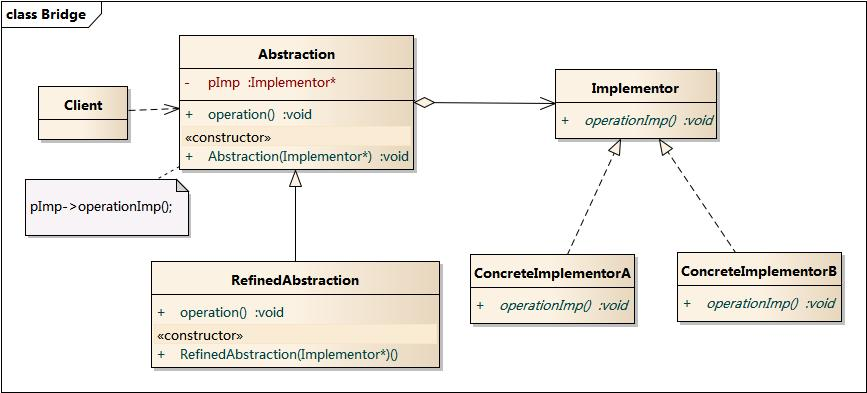

### 8.4 时序图

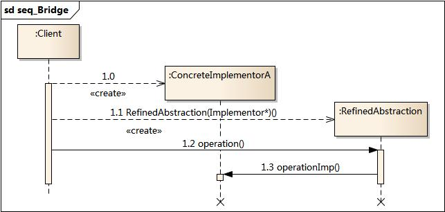

### 8.5 代码分析

> 参考链接：[Java全栈知识体系](https://pdai.tech/md/dev-spec/pattern/10_bridge.html#%E5%AE%9E%E7%8E%B0)

`RemoteControl`表示遥控器，指代Abstraction；`TV`表示电视，指代Implementor。桥接模式将遥控器和电视分离开来，从而可以独立改变遥控器或者电视的实现。

```java
public abstract class TV {
    public abstract void on();

    public abstract void off();

    public abstract void tuneChannel();
}

public class Sony extends TV {
    @Override
    public void on() {
        System.out.println("Sony.on()");
    }

    @Override
    public void off() {
        System.out.println("Sony.off()");
    }

    @Override
    public void tuneChannel() {
        System.out.println("Sony.tuneChannel()");
    }
}

public class RCA extends TV {
    @Override
    public void on() {
        System.out.println("RCA.on()");
    }

    @Override
    public void off() {
        System.out.println("RCA.off()");
    }

    @Override
    public void tuneChannel() {
        System.out.println("RCA.tuneChannel()");
    }
}

public abstract class RemoteControl {
    protected TV tv;

    public RemoteControl(TV tv) {
        this.tv = tv;
    }

    public abstract void on();

    public abstract void off();

    public abstract void tuneChannel();
}

public class ConcreteRemoteControl1 extends RemoteControl {
    public ConcreteRemoteControl1(TV tv) {
        super(tv);
    }

    @Override
    public void on() {
        System.out.println("ConcreteRemoteControl1.on()");
        tv.on();
    }

    @Override
    public void off() {
        System.out.println("ConcreteRemoteControl1.off()");
        tv.off();
    }

    @Override
    public void tuneChannel() {
        System.out.println("ConcreteRemoteControl1.tuneChannel()");
        tv.tuneChannel();
    }
}

public class ConcreteRemoteControl2 extends RemoteControl {
    public ConcreteRemoteControl2(TV tv) {
        super(tv);
    }

    @Override
    public void on() {
        System.out.println("ConcreteRemoteControl2.on()");
        tv.on();
    }

    @Override
    public void off() {
        System.out.println("ConcreteRemoteControl2.off()");
        tv.off();
    }

    @Override
    public void tuneChannel() {
        System.out.println("ConcreteRemoteControl2.tuneChannel()");
        tv.tuneChannel();
    }
}

public class Client {
    public static void main(String[] args) {
        RemoteControl remoteControl1 = new ConcreteRemoteControl1(new RCA());
        remoteControl1.on();
        remoteControl1.off();
        remoteControl1.tuneChannel();
    }
}
```

### 8.6 模式分析

理解桥接模式，重点需要理解**如何将抽象化（Abstraction）与实现化（Implementation）脱耦**，使得二者可以独立地变化。

- 抽象化：抽象化就是忽略一些信息，把不同的实体当作同样的实体对待。在面向对象中，将对象的共同性质抽取出来形成类的过程即为抽象化的过程。
- 实现化：针对抽象化给出的具体实现，就是实现化，抽象化与实现化是一对互逆的概念，实现化产生的对象比抽象化更具体，是对抽象化事物的进一步具体化的产物。
- 脱耦：脱耦就是将抽象化和实现化之间的耦合解脱开，或者说是将它们之间的强关联改换成弱关联，将两个角色之间的继承关系改为关联关系。桥接模式中的所谓脱耦，就是指**在一个软件系统的抽象化和实现化之间使用关联关系（组合或者聚合关系）而不是继承关系**，从而使两者可以相对独立地变化，这就是桥接模式的用意。

### 8.7 实例

如果需要开发一个跨平台视频播放器，可以在不同操作系统平台（如Windows、Linux、Unix等）上播放多种格式的视频文件，常见的视频格式包括MPEG、RMVB、AVI、WMV等。

### 8.8 优缺点

#### 优点

桥接模式的优点：

- 分离抽象接口及其实现部分。
- 桥接模式有时类似于多继承方案，但是多继承方案违背了类的单一职责原则（即一个类只有一个变化的原因），复用性比较差，而且多继承结构中类的个数非常庞大，桥接模式是比多继承方案更好的解决方法。
- 桥接模式提高了系统的可扩充性，在两个变化维度中任意扩展一个维度，都不需要修改原有系统。

#### 缺点

桥接模式的缺点：

- 桥接模式的引入会增加系统的理解与设计难度，由于聚合关联关系建立在抽象层，要求开发者针对抽象进行设计与编程。
- 桥接模式要求正确识别出系统中两个独立变化的维度，因此其使用范围具有一定的局限性。

### 8.9 适用环境

在以下情况下可以使用桥接模式：

- 如果一个系统需要在构件的抽象化角色和具体化角色之间增加更多的灵活性，避免在两个层次之间建立静态的继承联系，通过桥接模式可以使它们在抽象层建立一个关联关系。
- 抽象化角色和实现化角色可以以继承的方式独立扩展而互不影响，在程序运行时可以动态将一个抽象化子类的对象和一个实现化子类的对象进行组合，即系统需要对抽象化角色和实现化角色进行动态耦合。
- 一个类存在两个独立变化的维度，且这两个维度都需要进行扩展。
- 虽然在系统中使用继承是没有问题的，但是由于抽象化角色和具体化角色需要独立变化，设计要求需要独立管理这两者。
- 对于那些不希望使用继承或因为多层次继承导致系统类的个数急剧增加的系统，桥接模式尤为适用。

### 8.10 模式应用

一个Java桌面软件总是带有所在操作系统的视感（LookAndFeel），如果一个Java软件是在Unix系统上开发的，那么开发人员看到的是Motif用户界面的视感；在Windows上面使用这个系统的用户看到的是Windows用户界面的视感；而一个在Macintosh上面使用的用户看到的则是Macintosh用户界面的视感，Java语言是通过所谓的Peer架构做到这一点的。Java为AWT中的每一个GUI构件都提供了一个Peer构件，在AWT中的Peer架构就使用了桥接模式

### 8.11 模式扩展

适配器模式与桥接模式的联用：

- 桥接模式和适配器模式用于设计的不同阶段，**桥接模式用于系统的初步设计**，对于存在两个独立变化维度的类可以将其分为抽象化和实现化两个角色，使它们可以分别进行变化；而**在初步设计完成之后，当发现系统与已有类无法协同工作时，可以采用适配器模式**。但有时候在设计初期也需要考虑适配器模式，特别是那些涉及到大量第三方应用接口的情况。

### 8.12 总结

- 桥接模式将抽象部分与它的实现部分分离，使它们都可以独立地变化。它是一种对象结构型模式，又称为柄体（Handle and Body）模式或接口（Interface）模式。
- 桥接模式包含如下四个角色：抽象类中定义了一个实现类接口类型的对象并可以维护该对象；扩充抽象类扩充由抽象类定义的接口，它实现了在抽象类中定义的抽象业务方法，在扩充抽象类中可以调用在实现类接口中定义的业务方法；实现类接口定义了实现类的接口，实现类接口仅提供基本操作，而抽象类定义的接口可能会做更多更复杂的操作；具体实现类实现了实现类接口并且具体实现它，在不同的具体实现类中提供基本操作的不同实现，在程序运行时，具体实现类对象将替换其父类对象，提供给客户端具体的业务操作方法。
- 在桥接模式中，抽象化（Abstraction）与实现化（Implementation）脱耦，它们可以沿着各自的维度独立变化。
- 桥接模式的主要优点是**分离抽象接口及其实现部分**，是比多继承方案更好的解决方法，桥接模式还提高了系统的可扩充性，在两个变化维度中任意扩展一个维度，都不需要修改原有系统，实现细节对客户透明，可以对用户隐藏实现细节；其主要缺点是增加系统的理解与设计难度，且识别出系统中两个独立变化的维度并不是一件容易的事情。
- 桥接模式适用情况包括：需要在构件的抽象化角色和具体化角色之间增加更多的灵活性，避免在两个层次之间建立静态的继承联系；抽象化角色和实现化角色可以以继承的方式独立扩展而互不影响；一个类存在两个独立变化的维度，且这两个维度都需要进行扩展；设计要求需要独立管理抽象化角色和具体化角色；不希望使用继承或因为多层次继承导致系统类的个数急剧增加的系统。

## 九、装饰模式:airplane:

> 参考链接：[图说设计模式](https://design-patterns.readthedocs.io/zh_CN/latest/structural_patterns/decorator.html)

### 9.1 模式动机

一般有两种方式可以实现给一个类或对象增加行为：

- 继承机制，使用继承机制是给现有类添加功能的一种有效途径，通过继承一个现有类可以使得子类在拥有自身方法的同时还拥有父类的方法。但是这种方法是静态的，用户不能控制增加行为的方式和时机。
- 关联机制，即**将一个类的对象嵌入另一个对象中**，由另一个对象来决定是否调用嵌入对象的行为以便扩展自己的行为，称这个嵌入的对象为装饰器（Decorator）。

装饰模式以对客户透明的方式动态地给一个对象附加上更多的责任，换言之，客户端并不会觉得对象在装饰前和装饰后有什么不同。装饰模式可以在不需要创造更多子类的情况下，将对象的功能加以扩展。这就是装饰模式的模式动机。

### 9.2 模式定义

装饰模式（Decorator Pattern）：动态地给一个对象增加一些额外的职责（Responsibility），就增加对象功能来说，**装饰模式比生成子类实现更为灵活**，其别名也可以称为包装器（Wrapper），与适配器模式的别名相同，但它们适用于不同的场合。根据翻译的不同，装饰模式也有人称之为“油漆工模式”，它是一种对象结构型模式。

### 9.3 模式结构

装饰模式包含如下角色：

- Component：抽象构件。
- ConcreteComponent：具体构件。
- Decorator：抽象装饰类。
- ConcreteDecorator：具体装饰类。


### 9.4 时序图

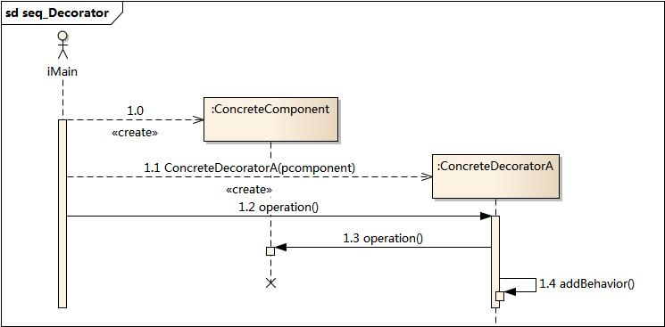

### 9.5 代码实现

> 参考链接：[Java全栈知识体系](https://pdai.tech/md/dev-spec/pattern/12_decorator.html#%E5%AE%9E%E7%8E%B0)

设计不同种类的饮料，饮料可以添加配料，比如可以添加牛奶，并且支持动态添加新配料。每增加一种配料，该饮料的价格就会增加，要求计算一种饮料的价格。

例如：在DarkRoast饮料上新增新添加Mocha配料，之后又添加了Whip配料。DarkRoast被Mocha包裹，Mocha又被Whip包裹。它们都继承自相同父类，都有cost()方法，外层类的cost()方法调用了内层类的cost()方法。

```java
public interface Beverage {
    double cost();
}

public class DarkRoast implements Beverage {
    @Override
    public double cost() {
        return 1;
    }
}

public class HouseBlend implements Beverage {
    @Override
    public double cost() {
        return 1;
    }
}

public abstract class CondimentDecorator implements Beverage {
    protected Beverage beverage;
}

public class Milk extends CondimentDecorator {

    public Milk(Beverage beverage) {
        this.beverage = beverage;
    }

    @Override
    public double cost() {
        return 1 + beverage.cost();
    }
}

public class Mocha extends CondimentDecorator {

    public Mocha(Beverage beverage) {
        this.beverage = beverage;
    }

    @Override
    public double cost() {
        return 1 + beverage.cost();
    }
}

public class Client {
    public static void main(String[] args) {
        Beverage beverage = new HouseBlend();
        beverage = new Mocha(beverage);
        beverage = new Milk(beverage);
        System.out.println(beverage.cost());
    }
}
```

### 9.6 模式分析

- 与继承关系相比，关联关系的主要优势在于不会破坏类的封装性，而且继承是一种耦合度较大的静态关系，无法在程序运行时动态扩展。在软件开发阶段，关联关系虽然不会比继承关系减少编码量，但是到了软件维护阶段，由于关联关系使系统具有较好的松耦合性，因此使得系统更加容易维护。当然，关联关系的缺点是比继承关系要创建更多的对象。
- 使用装饰模式来实现扩展比继承更加灵活，它以对客户透明的方式动态地给一个对象附加更多的责任。装饰模式可以在不需要创造更多子类的情况下，将对象的功能加以扩展。

### 9.7 实例

变形金刚：变形金刚在变形之前是一辆汽车，它可以在陆地上移动。当它变成机器人之后除了能够在陆地上移动之外，还可以说话；如果需要，它还可以变成飞机，除了在陆地上移动还可以在天空中飞翔。

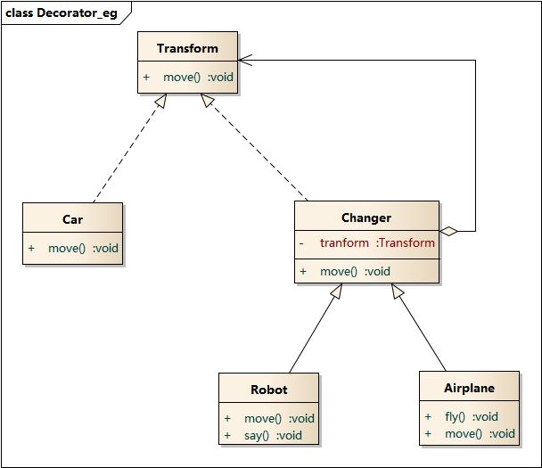

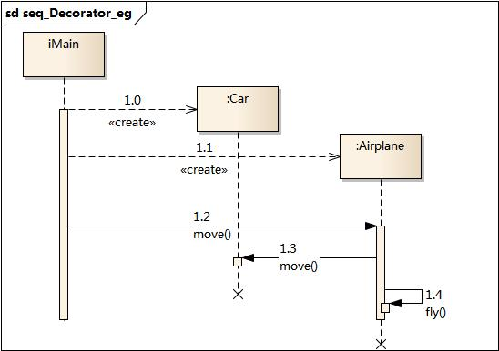

### 9.8 优缺点

#### 优点

- 装饰模式与继承关系的目的都是要扩展对象的功能，但是装饰模式可以提供比继承更多的灵活性。
- 可以通过一种动态的方式来扩展一个对象的功能，通过配置文件可以在运行时选择不同的装饰器，从而实现不同的行为。
- 通过使用不同的具体装饰类以及这些装饰类的排列组合，可以创造出很多不同行为的组合。可以使用多个具体装饰类来装饰同一对象，得到功能更为强大的对象。
- 具体构件类与具体装饰类可以独立变化，用户可以根据需要增加新的具体构件类和具体装饰类，在使用时再对其进行组合，原有代码无须改变，符合“开闭原则”

#### 缺点

- 使用装饰模式进行系统设计时将产生很多小对象，这些对象的区别在于它们之间相互连接的方式有所不同，而不是它们的类或者属性值有所不同，同时还将产生很多具体装饰类。这些装饰类和小对象的产生将增加系统的复杂度，加大学习与理解的难度。
- 这种比继承更加灵活机动的特性，也同时意味着装饰模式比继承更加易于出错，排错也很困难，对于多次装饰的对象，调试时寻找错误可能需要逐级排查，较为烦琐。

### 9.9 适用环境

在以下情况下可以使用装饰模式：

- 在不影响其他对象的情况下，以动态、透明的方式给单个对象添加职责。
- 需要动态地给一个对象增加功能，这些功能也可以动态地被撤销。
- 当不能采用继承的方式对系统进行扩充或者采用继承不利于系统扩展和维护时。不能采用继承的情况主要有两类：第一类是系统中存在大量独立的扩展，为支持每一种组合将产生大量的子类，使得子类数目呈爆炸性增长；第二类是因为类定义不能继承（如`final`类）.

### 9.10 模式扩展

装饰模式的简化-需要注意的问题：

- 一个装饰类的接口必须与被装饰类的接口保持相同，对于客户端来说无论是装饰之前的对象还是装饰之后的对象都可以一致对待。
- 尽量保持具体构件类Component作为一个“轻”类，也就是说不要把太多的逻辑和状态放在具体构件类中，可以通过装饰类对其进行扩展。
- 如果只有一个具体构件类而没有抽象构件类，那么抽象装饰类可以作为具体构件类的直接子类。

### 9.11 总结

- 装饰模式用于**动态地给一个对象增加一些额外的职责**，就增加对象功能来说，装饰模式比生成子类实现更为灵活。它是一种对象结构型模式。
- 装饰模式包含四个角色：抽象构件定义了对象的接口，可以给这些对象动态增加职责（方法）；具体构件定义了具体的构件对象，实现了在抽象构件中声明的方法，装饰器可以给它增加额外的职责（方法）； 抽象装饰类是抽象构件类的子类，用于给具体构件增加职责，但是具体职责在其子类中实现；具体装饰类是抽象装饰类的子类，负责向构件添加新的职责。
- 使用装饰模式来实现扩展比继承更加灵活，它以对客户透明的方式动态地给一个对象附加更多的责任。装饰模式可以在不需要创造更多子类的情况下，将对象的功能加以扩展。
- 装饰模式的主要优点在于可以提供比继承更多的灵活性，可以通过一种动态的方式来扩展一个对象的功能，并通过使用不同的具体装饰类以及这些装饰类的排列组合，可以创造出很多不同行为的组合，而且具体构件类与具体装饰类可以独立变化，用户可以根据需要增加新的具体构件类和具体装饰类；其主要缺点在于使用装饰模式进行系统设计时将产生很多小对象，而且装饰模式比继承更加易于出错，排错也很困难，对于多次装饰的对象，调试时寻找错误可能需要逐级排查，较为烦琐。
- 装饰模式适用情况包括：在不影响其他对象的情况下，以动态、透明的方式给单个对象添加职责；需要动态地给一个对象增加功能，这些功能也可以动态地被撤销；当不能采用继承的方式对系统进行扩充或者采用继承不利于系统扩展和维护时。
- 装饰模式可分为**透明装饰模式**和**半透明装饰模式**：在透明装饰模式中，要求客户端完全针对抽象编程，装饰模式的透明性要求客户端程序不应该声明具体构件类型和具体装饰类型，而应该全部声明为抽象构件类型；半透明装饰模式允许用户在客户端声明具体装饰者类型的对象，调用在具体装饰者中新增的方法。

## 十、代理模式:airplane:

> 参考链接：[图说设计模式](https://design-patterns.readthedocs.io/zh_CN/latest/structural_patterns/proxy.html)

### 10.1 模式动机

在某些情况下，一个客户不想或者不能直接引用一个对象，此时可以通过一个称之为“代理”的第三者来实现 间接引用。代理对象可以在客户端和目标对象之间起到中介的作用，并且可以通过代理对象去掉客户不能看到的内容和服务或者添加客户需要的额外服务。

通过引入一个新的对象（如小图片和远程代理对象）来实现对真实对象的操作或者将新的对象作为真实对象的一个替身，这种实现机制即为代理模式，**通过引入代理对象来间接访问一个对象**，这就是代理模式的模式动机。

### 10.2 模式定义

代理模式（Proxy Pattern）：**给某一个对象提供一个代理，并由代理对象控制对原对象的引用**。代理模式的英文叫做Proxy或Surrogate，它是一种对象结构型模式。

### 10.3 模式结构

