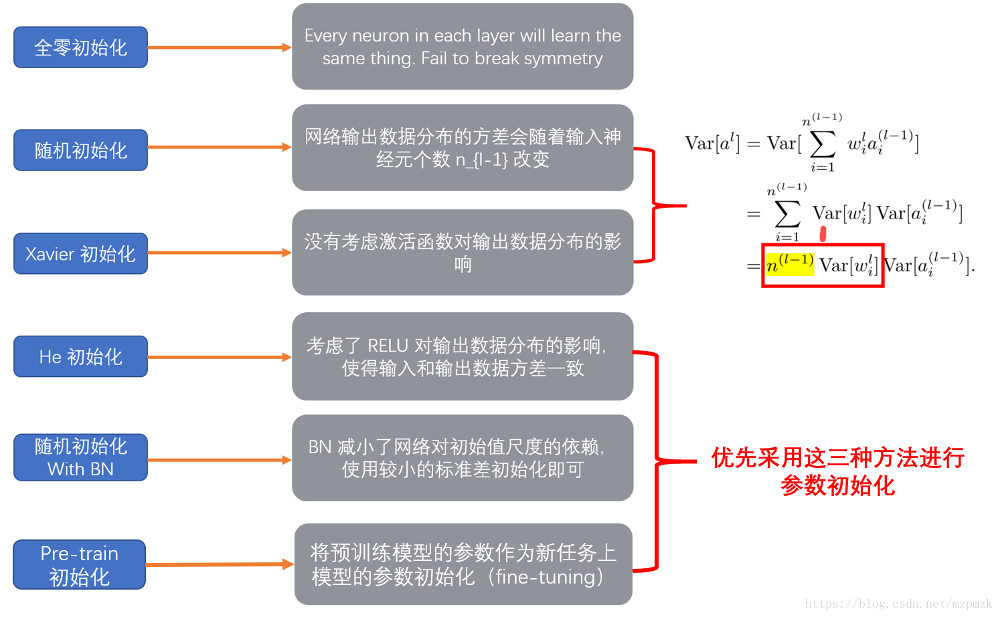

# 面试

## PyTorch相关

### 并行训练

常用的API有：`torch.nn.DataParallel`(DP)、`torch.nn.DistributedDataParallel`(DDP)

DP的计算过程：

1. 将inputs从主GPU分发到所有GPU上；
2. 将model从主GPU分发到所有GPU上；
3. 每个GPU分别独立进行前向传播，得到outputs；
4. 将每个GPU的outputs发回主GPU；
5. 在主GPU上，通过loss function计算出loss，对loss function求导，求出损失梯度；
6. 计算得到的梯度分发到所有GPU上；
7. 反向传播计算参数梯度；
8. 将所有梯度回传到主GPU，通过梯度更新模型权重；
9. 不断重复上面的过程。

应用：

```python
torch.nn.DataParallel(module, device_ids=None, output_device=None, dim=0)

net = torch.nn.DataParallel(model, device_ids=[0, 1, 2])
```

DDP的过程：
大体上的过程和DP类似，与DP的单进程控制多GPU不同，在distributed的帮助下只需要编写一份代码，torch就会自动将其分配给n个进程，分别在n个GPU上运行。

不再有主GPU，每个GPU执行相同的任务。对每个GPU的训练都是在自己的过程中进行的。每个进程都从磁盘加载其自己的数据。**分布式数据采样器可确保加载的数据在各个进程之间不重叠。损失函数的前向传播和计算在每个GPU上独立执行**。因此，不需要收集网络输出。在反向传播期间，梯度下降在所有GPU上均被执行，从而确保每个GPU在反向传播结束时最终得到平均梯度的相同副本。

DP优势：简单，一行代码。

DDP的优势：
1. 每个进程对应一个独立的训练过程，且只对梯度等少量数据进行信息交换。DDP在每次迭代中，每个进程具有自己的optimizer ，并独立完成所有的优化步骤，进程内与一般的训练无异。DDP中由于各进程中的模型，初始参数一致（初始时刻进行一次broadcast），而每次用于更新参数的梯度也一致，因此各进程的模型参数始终保持一致。相较于DP，DDP传输的数据量更少，因此速度更快，效率更高。

2. 每个进程包含独立的解释器和GIL。全局解释器锁（Global Interpreter Lock）是Python用于同步线程的工具，使得任何时刻仅有一个线程在执行。由于每个进程拥有独立的解释器和GIL，消除额外解释器开销和GIL-thrashing，因此可以减少解释器和GIL使用冲突。

### `model.train()`和`model.eval()`

前提：模型中有BN和Dropout。

`model.train()`：在训练时使用，表示开启训练模式，启用BN和Dropout。对于BN，保证BN能够用到每一批数据的均值和方差；对于Dropout，随机取一部分网络连接来训练更新参数。

`model.eval()`：在测试时使用，表示开启测试模式，不启用BN和Dropout。对于BN，保证BN能够用全部训练数据的均值和方差，即测试过程中BN的均值和方差不变；对于Dropout，利用到了所有网络连接，即不进行随机舍弃神经元。

**因此，在使用PyTorch进行训练和测试时一定注意要把实例化的model指定train/eval**。

### `DataLoader()`

```python
DataLoader(dataset, batch_size, shuffle=False, sampler=None, 
          batch_sample=None, num_workers=0, collate_fn=None, 
          pin_memory=False, drop_last=False, timeout=0,
          worker_init_fn=None)
```

- batch_size表示输入batch的大小；
- shuffle表示是否打乱输入；
- sampler是样本抽样；
- num_workers指的是开多少个worker来读数据，一个worker读一个batch的数据。

## ML、DL相关

### 归一化算法

Batch Normalization (BN)、Layer Normalization (LN)（包括Instance Normalization (IN)、Group Normalization (GN)）都属于归一化算法，它们的主要区别在于**操作的feature map维度不同**。

LN是“横”着来的，对一个样本、不同的神经元间做归一化；BN是“竖”着来的，各个维度做归一化，所以与batch size有关系。**二者提出的目的都是为了加快模型收敛，减少训练时间**。

CV和NLP任务的区别在于：图像数据是自然界客观存在的，像素的组织形式已经包含了“信息”；而自然语言相关的数据不一样，网络对其学习的真正开端是从embedding开始的，而这个embedding并不是客观存在，也是通过网络学习出来的。

LN是针对每一个样本，做特征的缩放。如果把BN应用于NLP任务，那就表示**默认了在同一个位置的单词对应的是同一种特征**，这样是违背直觉的。

### L1、L2正则化的区别

正则化的本质是在损失函数上添加正则化项，起到降低模型过拟合程度的作用。

L1正则化：


L2正则化：


L1正则化对所有参数的惩罚力度都一样，可以让一部分权重变为零，因此产生稀疏模型，能够去除某些特征（权重为0则等效于去除）；L2正则化减少了权重的固定比例，使权重平滑，不会使权重变为0（不会产生稀疏模型），所以选择了更多的特征。

- L1减少的是一个常量，L2减少的是权重的固定比例。
- L1使权重稀疏，L2使权重平滑。
- L1优点是能够获得稀疏模型，对于large-scale的问题来说这一点很重要，因为可以减少存储空间。
- L2优点是实现简单，能够起到正则化的作用。缺点就是稀疏模型。

### KL散度

相对熵又称互熵，交叉熵，鉴别信息，Kullback熵，Kullback-Leible散度（即**KL散度**）等。设$p(x)$和$q(x)$是

$x$取值的两个概率分布，则$p$对$q$的相对熵为：
$$
D_{KL}(p||q)=\sum_{i=1}^{n}p(x_i)log\frac{p(x_i)}{q(x_i)}
$$
典型情况下，$p$表示数据的真实分布，$q$​表示数据的理论分布。在一定程度上，熵可以度量两个随机变量的距离，当两个随机分布相同时，它们的相对熵为零，当两个随机分布的差别增大时，它们的相对熵也会增大。所以相对熵（KL散度）可以用于比较文本的相似度。

KL散度的值为非负数：**吉布斯不等式**。

### Dropout

过拟合：模型在训练数据上损失函数较小，预测准确率较高；但是在测试数据上损失函数比较大，预测准确率较低。

Dropout解决过拟合的原理：使该层每个神经元的激活层都有一定概率输出0（失活），使模型泛化能力更强，不依赖于某些局部的特征；另外，Dropout可以看作多个共享部分参数的模型的集成。

### 数据样本不平衡问题

数据样本不平衡：数据集中各个类别的样本数量极不均衡。解决这个问题可以从数据、算法两个角度出发：

从数据本身出发：

- 扩大数据集。
- 数据集重采样。
- 人工产生数据样本。

从算法角度出发：

- 对小类错分进行加权惩罚。
- 尝试不同的分类算法。

### 参数初始化



### 激活函数

#### Sigmoid

将实数值压缩进0到1的区间内。
$$
Sigmoid(x)=\frac{1}{1+e^{-x}}
$$
三个缺陷：

- 梯度消失：神经网络使用Sigmoid激活函数进行反向传播时，输出接近 0 或 1 的神经元其梯度趋近于 0。这些神经元叫作饱和神经元。因此，这些神经元的权重不会更新。此外，与此类神经元相连的神经元的权重也更新得很慢。
- 不以零点为中心。
- 计算成本高昂：exp()函数与其他非线性激活函数相比，计算成本高昂。

#### Tanh

双曲正切激活函数（hyperbolic tangent activation function），与Sigmoid函数类似，Tanh函数也使用真值，但Tanh函数将其压缩至-1到1的区间内，输出以零点为中心。
$$
tanh(x)=\frac{1-e^{-2x}}{1+e^{-2x}}
$$
Tanh函数也会有梯度消失的问题，因此在饱和时也会杀死梯度。

#### ReLU

$$
f(x)=max(0,x)
$$

ReLU函数是深度学习中较为流行的一种激活函数，相比于sigmoid函数和tanh函数，它具有如下优点：

- 当输入为正时，不存在梯度饱和问题。
- 计算速度快得多。ReLU函数中只存在线性关系，因此它的计算速度比sigmoid和tanh更快。

当然，它也有缺点：

- Dead ReLU问题。当输入为负时，ReLU完全失效，在正向传播过程中没有影响；但是在反向传播过程中，如果输入负数，则梯度将完全为零，sigmoid函数和tanh函数也具有相同的问题。
- 不以零点为中心。

#### Softmax

Softmax是用于多类分类问题的激活函数，在多类分类问题中，超过两个类标签则需要类成员关系。对于长度为K的任意实向量，Softmax可以将其压缩为长度为K，值在（0，1）范围内，并且向量中元素的总和为1的实向量。
$$
Softmax(x_i)=\frac{e^{x_i}}{\sum_{c=1}^{C}e^{x_c}}
$$
Softmax激活函数的主要缺点是：

- 在零点不可微。
- 负输入的梯度为零，这意味着对于该区域的激活，权重不会在反向传播期间更新，因此会产生永不激活的死亡神经元。

#### Swish

自门控激活函数。
$$
Swish(x)=x*Sigmoid(x)=\frac{x}{1+e^{-x}}
$$
Swish激活函数的主要优点如下：

- **无界性**有助于防止慢速训练期间，梯度逐渐接近0并导致饱和。
- 导数恒 > 0。
- 平滑度在优化和泛化中起了重要作用。

## NLP相关

### Transformer


#### 结构

Transformer本身还是一个典型的encoder-decoder模型，如果从模型层面来看，Transformer实际上就像一个seq2seq with attention的模型。

##### Encoder&Decoder

Encoder端由N（原论文中**N=6**）个相同的大模块堆叠而成，其中每个大模块又由**两个子模块**构成，这两个子模块为多头self-attention模块和前馈神经网络模块。

**需要注意的是，Encoder端每个大模块接收的输入是不一样的，第一个大模块（最底下的那个）接收的输入是输入序列的embedding（embedding可以通过word2vec预训练得来），其余大模块接收的是其前一个大模块的输出，最后一个模块的输出作为整个Encoder端的输出。**

Decoder端同样由N（原论文中**N=6**）个相同的大模块堆叠而成，其中每个大模块则由**三个子模块**构成，这三个子模块分别为多头self-attention模块，**多头Encoder-Decoder attention交互模块**，以及一个前馈神经网络模块。

**同样需要注意的是，Decoder端每个大模块接收的输入也是不一样的，其中第一个大模块（最底下的那个）训练时和测试时的接收的输入是不一样的，并且每次训练时接收的输入也可能是不一样的（也就是模型总览图示中的"shifted right"），其余大模块接收的是同样是其前一个大模块的输出，最后一个模块的输出作为整个Decoder端的输出。**

对于第一个大模块，简而言之，其训练及测试时接收的输入为：

- **训练的时候每次的输入为上次的输入加上输入序列向后移一位的ground truth（例如每向后移一位就是一个新的单词，那么则加上其对应的embedding），特别地，当Decoder的time step为1时（也就是第一次接收输入），其输入为一个特殊的token，可能是目标序列开始的token（\<BOS>），也可能是源序列结尾的token（如\<EOS>），也可能是其它视任务而定的输入等等，不同源码中可能有微小的差异，其目标则是预测下一个位置的单词（token）是什么。对应到time step为1时，则是预测目标序列的第一个单词（token）是什么，以此类推；**
  - **这里需要注意的是，在实际实现中可能不会这样每次动态的输入，而是一次性把目标序列的embedding通通输入第一个大模块中，然后在多头attention模块对序列进行mask即可**。
- 而在测试的时候，是**先生成第一个位置的输出，然后有了这个之后，第二次预测时，再将其加入输入序列，以此类推直至预测结束**。

##### Encoder子模块

###### 多头self-attention模块


上述attention可以被描述为**将query和key-value键值对的一组集合映射到输出**，其中query，keys，values和输出都是向量，其中 query和keys的维度均为$d_k$，values的维度为$d_v$（论文中$d_k=d_v=d_{model}/h=64$），输出被计算为values的加权和，其中分配给每个value的权重由query与对应key的相似性函数计算得来。这种attention的形式被称为“Scaled Dot-Product Attention”，对应到公式的形式为：
$$
Attention(Q,K,V)=softmax(\frac{QK^T}{\sqrt{d_k}})V
$$
而多头self-attention模块，则是将$Q,K,V$通过参数矩阵映射后（给它们分别接一个全连接层），然后再做self-attention，将这个过程重复，最后再将所有的结果拼接起来，再送入一个全连接层即可：


对应到公式：
$$
MultiHead(Q,K,V)=Concat(head_1,...,head_h)W^O\\head_i=Attention(QW{^Q_i},KW{^K_i},VW{^V_i})
$$
其中
$$
W{^Q_i}∈\mathbb{R}^{d_{model}×d_k},W{^K_i}∈\mathbb{R}^{d_{model}×d_k},W{^V_i}∈\mathbb{R}^{d_{model}×d_v},W^O∈\mathbb{R}^{hd_v×d_{model}}
$$

###### 前馈神经网络模块

前馈神经网络模块（Feed Forward）由两个线性变换组成，中间有一个ReLU激活函数，对应到公式的形式为：
$$
FFN(x)=max(0,xW_1+b_1)W_2+b_2
$$
论文中前馈神经网络模块输入和输出的维度均为$d_{model}=512$，其内层维度$d_{ff}=2048$。

##### Decoder子模块

###### 多头self-attention模块

Decoder端多头self-attention模块与Encoder端的一致，但是**需要注意的是Decoder端的多头self-attention需要做mask，因为它在预测时，是“看不到未来的序列的”，所以要将当前预测的单词（token）及其之后的单词（token）全部mask掉。**

###### 多头Encoder-Decoder attention交互模块

多头Encoder-Decoder attention交互模块的形式与多头self-attention模块一致，**唯一不同的是其$Q,K,V$矩阵的来源**，其$Q$矩阵来源于下面子模块的输出（对应到图中即为masked多头self-attention模块经过Add&Norm后的输出），而$K,V$则来源于整个Encoder端的输出。**仔细想想其实可以发现，这里的交互模块就跟seq2seq with attention中的机制一样，目的就在于让Decoder端的单词（token）给予Encoder端对应的单词（token）**“更多的关注（attention weight）”。

###### 前馈神经网络模块

该部分与Encoder端的一致。

##### 其他模块

###### Add&Norm模块

Add&Norm模块接在Encoder端和Decoder端每个子模块的后面，其中Add表示残差连接，Norm表示LayerNorm，因此Encoder端和Decoder端每个子模块实际的输出为$LayerNorm(x+Sublayer(x))$，其中$Sublayer(x)$为子模块的输出。

###### Positional Encoding模块

Positional Encoding添加到Encoder端和Decoder端最底部的输入embedding。Positional Encoding具有与embedding相同的维度$d_{model}$，因此可以对两者进行求和。具体做法是使用不同频率的正弦和余弦函数，公式如下：
$$
PE_{(pos,2i)}=sin(pos/10000^{2i/d_{model}})\\PE_{(pos,2i+1)}=cos(pos/10000^{2i/d_{model}})
$$
其中$pos$为位置，$i$为维度。

需要注意的是，Transformer中的Positional Encoding不是通过网络学习得来的，而是直接通过上述公式计算而来的，论文中也实验了利用网络学习Positional Encoding，发现结果与上述基本一致，但是论文中选择了正弦和余弦函数版本，**因为三角公式不受序列长度的限制，也就是可以对“比所遇到序列的更长的序列”进行表示。**

#### 关于self-attention

##### 是什么？计算过程？

**self-attention也叫intra-attention**，是一种通过自身和自身相关联的attention机制，从而得到一个更好的representation来表达自身，self-attention可以看成一般attention的一种特殊情况。在self-attention中，$Q=K=V$，序列中的每个单词（token）和该序列中其余单词（token）进行attention计算。self-attention的特点在于**无视词（token）之间的距离直接计算依赖关系，从而能够学习到序列的内部结构**，实现起来也比较简单。
$$
Attention(Q,K,V)=softmax(\frac{QK^T}{\sqrt{d_k}})V
$$

##### 为什么有如此大的作用？

self-attention是一种自身和自身相关联的attention机制，这样能够得到一个更好的representation来表达自身，在多数情况下，自然会对下游任务有一定的促进作用。Self Attention在计算过程中会直接将句子中任意两个单词的联系通过一个计算步骤直接联系起来，所以远距离依赖特征之间的距离被极大缩短，有利于有效地利用这些特征。除此外，Self Attention对于增加计算的并行性也有直接帮助作用。但是Transformer效果显著及其强大的特征抽取能力是否完全归功于其self-attention模块，还是存在一定争议的。

##### 为什么要使用Q、K、V？

$Q,K,V$是由输入的词向量$X$经过线性变换得到的，其中各个矩阵$W$可以经过学习得到。所以它们都源自于输入特征本身。$Q$是词的查询向量，$K$是“被查”向量，$V$是内容向量。 简单来说一句话：$Q$是最适合查找目标的，$K$是最适合接收查找的，$V$就是内容。

self-attention使用$Q,K,V$，这样三个参数独立，模型的表达能力和灵活性显然会比只用$Q$、$V$或者只用$V$要好些。**其实还有个小细节，因为self-attention的范围是包括自身的（masked self-attention也是一样），因此至少是要采用Q、V或者K、V的形式，而这样“询问式”的attention方式，个人感觉Q、K、V显然合理一些。**

#### 相比于RNN/LSTM有什么优势？

RNNs模型并行计算中$T$时刻的计算依赖于$T-1$时刻的隐层计算结果，会形成序列依赖关系，所以RNNs模型并行计算能力很差；Transformer的特征提取能力比RNNs要好。

#### 如何并行化？

Transformer的并行化主要体现在self-attention模块，在Encoder端Transformer可以并行处理整个序列，并得到整个输入序列经过Encoder端的输出，在self-attention模块，对于某个序列$x_1,...,x_n$，self-attention模块可以直接计算$x_i$和$x_j$的点乘结果，而RNNs就必须按序列顺序从$x_i$计算到$x_j$。

#### 归一化（缩放）的作用？

随着$d_k$的增大，$QK^T$的结果也会随之增大，这样会将softmax函数推入梯度非常小的区域，使得收敛困难（可能出现梯度消失的情况），因此为了抵消这种影响，将点积缩放$\frac{1}{\sqrt{d_k}}$。

### BERT

#### BERT是怎么使用Transformer的？

BERT只使用了Transformer的Encoder模块，**与Transformer本身的Encoder端相比，BERT的Transformer Encoder端输入的向量表示，多了Segment Embeddings**。

#### BERT的训练过程

##### Masked LM

Masked LM的任务描述为：给定一句话，随机抹去这句话中的一个或几个词，要求根据剩余词汇预测被抹去的几个词分别是什么。

BERT模型的这个预训练过程其实思想来源于**完形填空**的任务。具体来说，作者在一句话中随机选择15%的词汇用于预测。对于在原句中被抹去的词汇，**80%情况下采用一个特殊符号`MASK`替换，10%情况下采用一个任意词替换，剩余10%情况下保持原词汇不变**。这就迫使模型更多地依赖于上下文信息去预测词汇，并且赋予了模型一定的纠错能力。

##### Next Sentence Prediction

Next Sentence Prediction的任务描述为：给定一篇文章中的两句话，判断第二句话在文本中是否紧跟在第一句话之后。

在实际预训练过程中，作者从文本语料库中随机选择50%正确语句对和50%错误语句对进行训练，与Masked LM任务相结合，让模型能够更准确地刻画语句乃至篇章层面的语义信息。

BERT模型通过对Masked LM任务和Next Sentence Prediction任务进行联合训练，使模型输出的每个字/词的向量表示都能尽可能全面、准确地刻画输入文本（单句或语句对）的整体信息，为后续的微调任务提供更好的模型参数初始值。

### BERT的输入和输出

BERT模型的主要输入是文本中各个字/词（或者称为token）的原始词向量，该向量既可以随机初始化，也可以利用Word2Vector等算法进行预训练以作为初始值；输出是文本中各个字/词融合了全文语义信息后的向量表示。

### 为什么BERT比ELMo效果好？ELMo和BERT的区别是什么？

#### 为什么BERT比ELMo效果好？

从网络结构以及最后的实验效果来看，BERT比ELMo效果好主要集中在以下几点原因：

- LSTM抽取特征的能力远弱于Transformer。
- 拼接方式双向融合的特征融合能力偏弱。
- 其实还有一点，BERT的训练数据以及模型参数均多余ELMo。

#### ELMo和BERT的区别是什么？

ELMo模型是通过语言模型任务得到句子中单词的embedding表示，以此作为补充的新特征给下游任务使用。因为ELMO给下游提供的是每个单词的特征形式，所以这一类预训练的方法被称为“Feature-based Pre-Training”。而BERT模型是“基于Fine-tuning的模式”，这种做法和图像领域基于Fine-tuning的方式基本一致，下游任务需要将模型改造成BERT模型，才可利用BERT模型预训练好的参数。